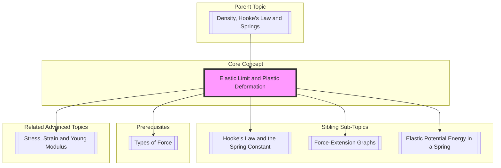

---
# 1. Overview / 概述

**English:**
This sub-topic explores the fundamental difference between **elastic** and **plastic** deformation in materials. When a force is applied to a material, it deforms. If the material returns to its original shape when the force is removed, the deformation is **elastic**. If it remains permanently deformed, the deformation is **plastic**. The **elastic limit** is the critical point on a [[Force-Extension Graphs|force-extension graph]] that separates these two regimes. Understanding this concept is crucial for explaining material behavior under load, predicting failure, and designing safe structures. It forms the foundation for the more advanced topic of [[Stress, Strain and Young Modulus]].

**中文:**
本子知识点探讨材料中**弹性**变形与**塑性**变形的根本区别。当对材料施加力时，它会变形。如果撤去力后材料能恢复原状，这种变形称为**弹性**变形。如果材料发生永久变形，则称为**塑性**变形。**弹性极限**是[[Force-Extension Graphs|力-伸长量图]]上区分这两种状态的关键点。理解这一概念对于解释材料在负载下的行为、预测失效以及设计安全结构至关重要。它是更高级主题[[Stress, Strain and Young Modulus]]的基础。

---

# 2. Syllabus Learning Objectives / 考纲学习目标

| CAIE 9702 | Edexcel IAL |
|-----------|-------------|
| 6.1 (a) Define and use the terms elastic limit and plastic deformation. | 2.1 Understand the difference between elastic and plastic deformation. |
| 6.1 (b) Describe the behaviour of materials beyond the limit of proportionality. | 2.2 Define and use the term elastic limit. |
| 6.1 (c) Distinguish between elastic and plastic deformation. | 2.3 Describe the behaviour of a material undergoing plastic deformation. |
| 6.1 (d) Interpret force-extension graphs for materials that show plastic behaviour. | 2.4 Interpret force-extension graphs for ductile and brittle materials. |
| 6.1 (e) Understand that the area under a force-extension graph represents work done. | 2.5 Understand the concept of elastic limit and its significance. |
| 6.1 (f) Understand the concept of limit of proportionality. | 2.6 Distinguish between ductile and brittle materials. |

**Examiner Expectations / 考官期望:**
- **CAIE:** Students must be able to define **elastic limit** precisely and identify it on a graph. They should be able to describe the behavior of a material (e.g., copper wire) as it is stretched beyond the limit of proportionality, through the elastic limit, and into the plastic region.
- **Edexcel:** Students must understand the distinction between **elastic** and **plastic** deformation. They should be able to describe the behavior of **ductile** (e.g., copper) and **brittle** (e.g., glass) materials, linking their behavior to the concept of the elastic limit.

---

# 3. Core Definitions / 核心定义

| Term (EN/CN) | Definition (EN) | Definition (CN) | Common Mistakes / 常见错误 |
|--------------|-----------------|-----------------|---------------------------|
| **Elastic Deformation** / 弹性变形 | Deformation that is reversible; the object returns to its original shape and size when the deforming force is removed. | 可逆的变形；当撤去形变力时，物体恢复到其原始形状和大小。 | Confusing it with plastic deformation. |
| **Plastic Deformation** / 塑性变形 | Deformation that is permanent; the object does not return to its original shape or size when the deforming force is removed. | 永久性的变形；当撤去形变力时，物体不会恢复到其原始形状或大小。 | Thinking it only occurs after the breaking point. |
| **Elastic Limit** / 弹性极限 | The maximum stress or force that a material can withstand without undergoing permanent (plastic) deformation. | 材料在不发生永久（塑性）变形的情况下所能承受的最大应力或力。 | Confusing it with the **limit of proportionality**. The elastic limit is the point where plastic deformation *begins*, while the limit of proportionality is where Hooke's Law stops being obeyed. |
| **Limit of Proportionality** / 比例极限 | The point on a [[Force-Extension Graphs|force-extension graph]] beyond which the extension is no longer proportional to the applied force. | [[Force-Extension Graphs|力-伸长量图]]上，超过该点后伸长量不再与施加的力成正比。 | Thinking it is the same as the elastic limit. |
| **Ductile Material** / 延性材料 | A material that can undergo significant plastic deformation before fracturing (e.g., copper, mild steel). | 一种在断裂前能发生显著塑性变形的材料（例如，铜、低碳钢）。 | Confusing with brittle materials. |
| **Brittle Material** / 脆性材料 | A material that fractures with little or no plastic deformation (e.g., glass, cast iron). | 一种几乎没有或完全没有塑性变形就断裂的材料（例如，玻璃、铸铁）。 | Thinking brittle materials are always weak. |

---

# 4. Key Concepts Explained / 关键概念详解

## 4.1 Elastic vs. Plastic Deformation / 弹性变形 vs. 塑性变形

### Explanation / 解释
**English:**
When a force is applied to a solid, the atoms or molecules are displaced from their equilibrium positions.
- **Elastic Deformation:** The bonds between atoms are stretched but not broken. When the force is removed, the atoms return to their original positions, and the object regains its original shape. This is a reversible process.
- **Plastic Deformation:** The bonds between atoms are broken and reformed in new positions. This is an irreversible process. The material has been permanently deformed. This occurs when the applied stress exceeds the material's [[Elastic Limit and Plastic Deformation|elastic limit]].

**中文:**
当对固体施加力时，原子或分子会从其平衡位置发生位移。
- **弹性变形:** 原子间的键被拉伸但未断裂。当撤去力时，原子回到其原始位置，物体恢复其原始形状。这是一个可逆过程。
- **塑性变形:** 原子间的键被断裂并在新位置重新形成。这是一个不可逆过程。材料发生了永久变形。当施加的应力超过材料的[[Elastic Limit and Plastic Deformation|弹性极限]]时，就会发生这种情况。

### Physical Meaning / 物理意义
**English:**
The elastic limit represents the maximum force a material can withstand and still be "useful" in a reversible way. Designing structures (like bridges or springs) requires ensuring the materials never exceed their elastic limit under expected loads. Plastic deformation is exploited in processes like metal forming (bending, stamping) but is a sign of failure in load-bearing components.

**中文:**
弹性极限代表了材料能够承受并以可逆方式“有用”的最大力。设计结构（如桥梁或弹簧）需要确保材料在预期负载下永远不会超过其弹性极限。塑性变形在金属成型（弯曲、冲压）等过程中被利用，但在承重部件中是失效的标志。

### Common Misconceptions / 常见误区
- **Misconception:** Elastic deformation is always linear (obeys Hooke's Law).
  **Correction:** Elastic deformation can be non-linear. The key is that it is *reversible*. The [[Limit of Proportionality]] is a specific point within the elastic region.
- **Misconception:** Plastic deformation only happens just before a material breaks.
  **Correction:** For ductile materials like copper, significant plastic deformation occurs over a wide range of extensions before the material eventually fractures.
- **Misconception:** The elastic limit and the limit of proportionality are the same point.
  **Correction:** They are often very close, but the limit of proportionality is where Hooke's Law stops being valid, while the elastic limit is where plastic deformation *begins*. For some materials, they are distinct.

### Exam Tips / 考试提示
- **CAIE:** Be prepared to describe an experiment to determine the elastic limit of a material (e.g., a copper wire). The key is to load the wire incrementally, unload it after each step, and check for a permanent extension.
- **Edexcel:** Be able to sketch and label force-extension graphs for ductile and brittle materials, clearly showing the elastic limit and the plastic region.

> 📷 **IMAGE PROMPT — DIAGRAM: Elastic vs Plastic Deformation**
> A simple 2D diagram showing a block of material. In the "Elastic" sequence, a force arrow pulls the block, it stretches, and when the arrow is removed, it snaps back to its original shape. In the "Plastic" sequence, a force arrow pulls the block, it stretches, and when the arrow is removed, it remains in a stretched, deformed shape. Labels: "Elastic Deformation (Reversible)", "Plastic Deformation (Permanent)".

---

# 5. Essential Equations / 核心公式

There are no new equations for this sub-topic. The key is the *interpretation* of the [[Force-Extension Graphs|force-extension graph]].

**Key Relationship:**
$$ \text{Elastic Limit} = \text{The point on the force-extension graph where the material no longer returns to its original length upon unloading.} $$

| Symbol (符号) | Meaning (EN) | Meaning (CN) | Unit (单位) |
|--------------|-------------|-------------|------------|
| F | Force | 力 | N |
| x | Extension | 伸长量 | m |

**Derivation / 推导:** N/A
**Conditions / 适用条件:** This concept applies to all solid materials.
**Limitations / 局限性:** The elastic limit is not always a perfectly sharp point on a graph; it can be a gradual transition for some materials.

---

# 6. Graphs and Relationships / 图表与关系

## 6.1 Force-Extension Graph for a Ductile Material / 延性材料的力-伸长量图

### Axes / 坐标轴
- **X-axis:** Extension (x) / 伸长量 (x)
- **Y-axis:** Force (F) / 力 (F)

### Shape / 形状
The graph has several distinct regions:
1.  **Linear Elastic Region (O to A):** A straight line through the origin. Hooke's Law is obeyed. Point A is the **limit of proportionality**.
2.  **Non-Linear Elastic Region (A to B):** The line curves. The material is still elastic (will return to original length if unloaded), but Hooke's Law is no longer obeyed. Point B is the **elastic limit**.
3.  **Plastic Region (B to C):** The material undergoes permanent (plastic) deformation. A small increase in force causes a large increase in extension. The material "yields" or "flows".
4.  **Necking and Fracture (C to D):** The material begins to "neck" (its cross-sectional area decreases locally), and the force required to stretch it further decreases until it fractures at point D.

### Gradient Meaning / 斜率含义
- **O to A:** The gradient is constant and equal to the [[Hooke's Law and the Spring Constant|spring constant (k)]].
- **A to B:** The gradient decreases, meaning the material is becoming less stiff.
- **B to C:** The gradient is very small, indicating the material is stretching easily.

### Area Meaning / 面积含义
The total area under the graph (O to D) represents the total **work done** to stretch the material until it breaks. The area under the elastic region (O to B) represents the [[Elastic Potential Energy in a Spring|elastic potential energy]] stored.

### Exam Interpretation / 考试解读
- **CAIE:** You must be able to identify the limit of proportionality, elastic limit, and plastic region on a graph. You should be able to describe the behavior of the material in each region.
- **Edexcel:** You must be able to distinguish between the graph for a ductile material (like copper) and a brittle material (like glass). A brittle material's graph is a straight line up to the breaking point, with no plastic region.

> 📷 **IMAGE PROMPT — GRAPH: Force-Extension Graph for a Ductile Material**
> A clear, labeled graph. X-axis: "Extension / m", Y-axis: "Force / N". The curve starts as a straight line from the origin (O) to point A (labeled "Limit of Proportionality"). It then curves slightly to point B (labeled "Elastic Limit"). After B, the curve becomes much shallower, rising slowly to point C (labeled "Maximum Force"). Finally, it drops down to point D (labeled "Fracture"). The regions are shaded and labeled: "Elastic Region (O to B)" and "Plastic Region (B to D)".

---

# 7. Required Diagrams / 必备图表

## 7.1 Force-Extension Graph for a Ductile vs. Brittle Material / 延性材料与脆性材料的力-伸长量图对比

### Description / 描述
**English:** A comparative diagram showing the force-extension graphs for a ductile material (e.g., copper) and a brittle material (e.g., glass) on the same axes. This highlights the key difference: ductile materials undergo significant plastic deformation, while brittle materials fracture with little to no plastic deformation.

**中文:** 一个对比图，在同一坐标轴上显示延性材料（例如，铜）和脆性材料（例如，玻璃）的力-伸长量图。这突出了关键区别：延性材料会发生显著的塑性变形，而脆性材料在几乎没有塑性变形的情况下就断裂了。

### Image Prompt / 图片生成提示
> 📷 **IMAGE PROMPT — DIAGRAM: Ductile vs Brittle Force-Extension Graph**
> A single graph with two curves. X-axis: "Extension", Y-axis: "Force". Curve 1 (Ductile, e.g., Copper): Starts as a straight line, then curves, then has a long, shallow plastic region before dropping. Curve 2 (Brittle, e.g., Glass): A straight line that ends abruptly at a point of fracture. Labels: "Ductile Material (e.g., Copper)", "Brittle Material (e.g., Glass)", "Elastic Limit (Ductile)", "Fracture Point (Brittle)".

### Labels Required / 需要标注
- **Ductile Material Curve:** Limit of Proportionality, Elastic Limit, Plastic Region, Fracture Point.
- **Brittle Material Curve:** Fracture Point (no plastic region).

### Exam Importance / 考试重要性
- **CAIE:** High. You may be asked to sketch these graphs or interpret them.
- **Edexcel:** Very High. This is a core distinction required by the syllabus.

---

# 8. Worked Examples / 典型例题

## Example 1: Identifying the Elastic Limit / 例题 1：识别弹性极限

### Question / 题目
**English:**
A student performs an experiment on a copper wire. She loads the wire with a force of 10 N and measures an extension of 2.0 mm. She then removes the force and finds the wire returns to its original length. She repeats this process with increasing forces. At a force of 40 N, the extension is 9.0 mm. When she removes the 40 N force, the wire has a permanent extension of 0.5 mm. What is the elastic limit of the wire?

**中文:**
一名学生对一根铜线进行实验。她施加 10 N 的力，测得伸长量为 2.0 mm。然后她撤去力，发现铜线恢复到原始长度。她以逐渐增大的力重复此过程。当力为 40 N 时，伸长量为 9.0 mm。当她撤去 40 N 的力时，铜线有 0.5 mm 的永久伸长量。这根铜线的弹性极限是多少？

### Solution / 解答
**Step 1: Understand the definition of elastic limit.**
The elastic limit is the maximum force (or stress) that a material can withstand without undergoing permanent (plastic) deformation.

**Step 2: Analyze the data.**
- At 10 N: No permanent extension → Deformation is elastic.
- At 40 N: Permanent extension of 0.5 mm → Deformation is plastic.

**Step 3: Determine the elastic limit.**
Since the wire showed plastic deformation at 40 N, the elastic limit must be less than 40 N. The problem does not give us the exact force at which plastic deformation *began*, but we know it is between the last force that caused no permanent extension and the first force that did. Without more data, we can only say the elastic limit is less than 40 N. In an exam, you might be asked to state that the elastic limit is between 30 N and 40 N, or that it is less than 40 N.

**Step 4: (Hypothetical) If the student had tested 30 N and found no permanent extension, then the elastic limit would be between 30 N and 40 N.**

### Final Answer / 最终答案
**Answer:** The elastic limit is less than 40 N. | **答案：** 弹性极限小于 40 N。

### Quick Tip / 提示
**English:** The only way to find the elastic limit experimentally is to load and unload the material, checking for permanent deformation. The elastic limit is the point where permanent deformation *first* appears.
**中文:** 通过实验找到弹性极限的唯一方法是加载和卸载材料，检查是否有永久变形。弹性极限是*首次*出现永久变形的点。

---

# 9. Past Paper Question Types / 历年真题题型

| Question Type / 题型 | Frequency / 频率 | Difficulty / 难度 | Past Paper References / 真题索引 |
|----------------------|------------------|------------------|-------------------------------|
| Definition of elastic limit / plastic deformation | High | Easy | 📝 *待填入* |
| Identifying regions on a force-extension graph | High | Medium | 📝 *待填入* |
| Distinguishing between ductile and brittle materials | Medium | Medium | 📝 *待填入* |
| Describing an experiment to find the elastic limit | Medium | Hard | 📝 *待填入* |
| Interpreting a force-extension graph for a real material | Low | Hard | 📝 *待填入* |

**Common Command Words / 常见指令词:**
- **Define / 定义:** Give the precise meaning of a term (e.g., "Define elastic limit").
- **Describe / 描述:** Give a detailed account of a process or graph (e.g., "Describe the behavior of a ductile material as it is stretched beyond its elastic limit").
- **Distinguish / 区分:** Explain the difference between two concepts (e.g., "Distinguish between elastic and plastic deformation").
- **Sketch / 画草图:** Draw a graph with labeled axes and key features (e.g., "Sketch a force-extension graph for a brittle material").

---

# 10. Practical Skills Connections / 实验技能链接

**English:**
This sub-topic is directly linked to the practical investigation of the behavior of materials under tension.
- **Experiment:** Determining the elastic limit of a material (e.g., a copper wire or a rubber band).
- **Key Measurements:** Force (using a newton meter or masses on a hanger) and extension (using a ruler or vernier scale).
- **Procedure:** The material is loaded incrementally. After each load is added, the extension is measured. The load is then removed, and the material is checked for a permanent extension. The elastic limit is the point at which a permanent extension is first observed.
- **Uncertainties:** The main uncertainty is in determining the exact point of the elastic limit, as it may not be a perfectly sharp transition. The precision of the ruler and the accuracy of the masses also contribute to uncertainty.
- **Graph Plotting:** Plotting a [[Force-Extension Graphs|force-extension graph]] is essential. The graph will show the linear elastic region, the non-linear elastic region, and the plastic region.

**中文:**
本子知识点与材料在拉力下行为的实验研究直接相关。
- **实验:** 测定材料（例如，铜线或橡皮筋）的弹性极限。
- **关键测量:** 力（使用牛顿测力计或挂在挂钩上的砝码）和伸长量（使用尺子或游标卡尺）。
- **步骤:** 逐步加载材料。每次增加负载后，测量伸长量。然后撤去负载，检查材料是否有永久伸长量。首次观察到永久伸长量的点就是弹性极限。
- **不确定度:** 主要不确定度在于确定弹性极限的确切点，因为它可能不是一个完美的突变点。尺子的精度和砝码的准确性也会导致不确定度。
- **图表绘制:** 绘制[[Force-Extension Graphs|力-伸长量图]]是必不可少的。该图将显示线性弹性区域、非线性弹性区域和塑性区域。

---

# 11. Concept Map / 概念图谱

---

# 12. Quick Revision Sheet / 速查表

| Category / 类别 | Key Points / 要点 |
|----------------|------------------|
| Definition / 定义 | **Elastic Deformation:** Reversible. **Plastic Deformation:** Permanent. **Elastic Limit:** The point where plastic deformation begins. |
| Key Formula / 核心公式 | No new formula. The concept is interpreted from the [[Force-Extension Graphs|force-extension graph]]. |
| Key Graph / 核心图表 | **Ductile Material:** Linear region → Non-linear elastic region → Plastic region → Fracture. **Brittle Material:** Linear region → Fracture (no plastic region). |
| Exam Tip / 考试提示 | **CAIE:** Be precise with definitions. **Edexcel:** Be able to sketch and label graphs for ductile and brittle materials. The elastic limit is NOT the same as the limit of proportionality. |