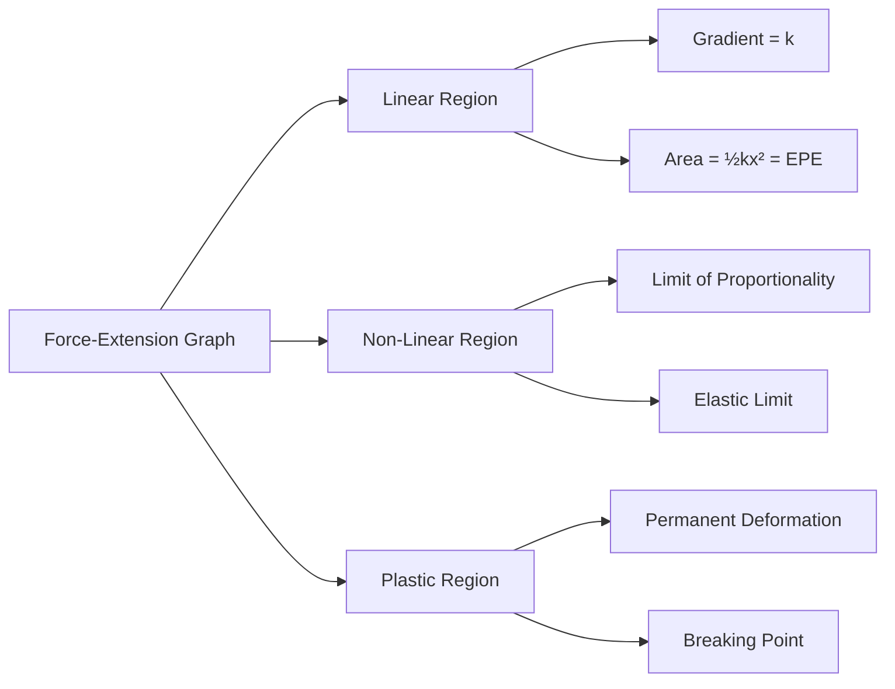

# 1. Overview / 概述

**English:**
Force-Extension graphs are a fundamental tool in materials physics that visually represent how a material deforms under an applied load. This sub-topic focuses on interpreting the relationship between the force applied to an object (typically a spring or wire) and the resulting extension or compression. The graph provides immediate visual information about key material properties including stiffness, elastic behavior, and the limits of elastic deformation. Understanding these graphs is essential for distinguishing between elastic and plastic deformation, determining spring constants, and calculating elastic potential energy. This sub-topic builds directly on [[Types of Force]] and serves as a prerequisite for understanding [[Stress, Strain and Young Modulus]] at A2 level.

**中文:**
力-伸长量图表是材料物理学中的基本工具，直观地展示了材料在外力作用下如何变形。本子知识点侧重于解释施加在物体（通常是弹簧或金属丝）上的力与由此产生的伸长或压缩之间的关系。该图表能立即提供关于关键材料特性的视觉信息，包括刚度、弹性行为以及弹性变形的极限。理解这些图表对于区分弹性变形和塑性变形、确定弹簧常数以及计算弹性势能至关重要。本子知识点直接建立在[[Types of Force]]的基础上，并为理解A2阶段的[[Stress, Strain and Young Modulus]]奠定基础。

---

# 2. Syllabus Learning Objectives / 考纲学习目标

| CAIE 9702 | Edexcel IAL |
|-----------|-------------|
| 6.1(a) Plot and interpret force-extension graphs | 2.1 Interpret force-extension graphs for elastic materials |
| 6.1(b) Identify the limit of proportionality and elastic limit from graphs | 2.2 Identify Hooke's law region from force-extension graphs |
| 6.1(c) Calculate spring constant from gradient of force-extension graph | 2.3 Calculate spring constant from gradient |
| 6.1(d) Distinguish between elastic and plastic deformation from graphs | 2.4 Distinguish between elastic and plastic behavior |
| 6.1(e) Calculate work done from area under force-extension graph | 2.5 Calculate elastic potential energy from area under graph |
| 6.1(f) Describe loading and unloading curves | 2.6 Interpret loading and unloading curves for elastic and plastic materials |

**Examiner Expectations / 考官期望:**
- **English:** Students must be able to plot accurate force-extension graphs from experimental data, identify key points (limit of proportionality, elastic limit), calculate the spring constant from the gradient of the linear region, and calculate work done/elastic potential energy from the area under the graph. For Edexcel, particular attention is given to interpreting loading/unloading curves and understanding hysteresis.
- **中文:** 学生必须能够根据实验数据绘制准确的力-伸长量图表，识别关键点（比例极限、弹性极限），从线性区域的斜率计算弹簧常数，并从图表下的面积计算做功/弹性势能。对于Edexcel，特别关注加载/卸载曲线的解释和滞后现象的理解。

---

# 3. Core Definitions / 核心定义

| Term (EN/CN) | Definition (EN) | Definition (CN) | Common Mistakes / 常见错误 |
|--------------|-----------------|-----------------|---------------------------|
| **Force-Extension Graph** / 力-伸长量图表 | A graph plotting applied force (F) on the y-axis against extension (x) on the x-axis for a material under tension or compression | 绘制施加力（F）在y轴上，伸长量（x）在x轴上的图表，用于描述材料在拉伸或压缩下的行为 | Confusing extension with total length; extension = new length - original length |
| **Limit of Proportionality** / 比例极限 | The point on a force-extension graph beyond which Hooke's law is no longer obeyed; the graph ceases to be linear | 力-伸长量图表上超出该点后胡克定律不再成立的点；图表不再呈线性 | Confusing with elastic limit; they are different points |
| **Elastic Limit** / 弹性极限 | The maximum force or extension from which a material can return to its original shape when the force is removed | 材料在撤去外力后能够恢复原状的最大力或伸长量 | Thinking elastic limit and limit of proportionality are the same point |
| **Spring Constant (k)** / 弹簧常数 | The gradient of the linear region of a force-extension graph; a measure of stiffness | 力-伸长量图表线性区域的斜率；刚度的量度 | Using total length instead of extension in calculations |
| **Elastic Deformation** / 弹性变形 | Deformation that is reversible; the material returns to its original shape when the load is removed | 可逆的变形；撤去载荷后材料恢复原状 | Assuming all linear graphs represent elastic deformation |
| **Plastic Deformation** / 塑性变形 | Permanent deformation that remains after the load is removed | 撤去载荷后仍然存在的永久变形 | Confusing with elastic deformation; plastic deformation is irreversible |

---

# 4. Key Concepts Explained / 关键概念详解

## 4.1 Interpreting the Shape of Force-Extension Graphs / 解释力-伸长量图表的形状

### Explanation / 解释
**English:** A force-extension graph typically shows three distinct regions for a ductile material like a metal wire or spring. The initial region is a straight line passing through the origin, indicating that force is directly proportional to extension — this is the [[Hooke's Law and the Spring Constant]] region. Beyond the limit of proportionality, the graph curves, showing that extension increases more rapidly for each unit increase in force. The gradient of the straight line region equals the spring constant $k = F/x$. For brittle materials, the graph remains linear until sudden fracture with little or no plastic region. For rubber, the graph shows a characteristic S-shape with a steep initial gradient that decreases then increases again.

**中文:** 对于像金属丝或弹簧这样的延性材料，力-伸长量图表通常显示三个不同的区域。初始区域是一条通过原点的直线，表明力与伸长量成正比——这是[[Hooke's Law and the Spring Constant]]区域。超过比例极限后，图表弯曲，显示每单位力的增加导致伸长量增加更快。直线区域的斜率等于弹簧常数 $k = F/x$。对于脆性材料，图表保持线性直到突然断裂，几乎没有塑性区域。对于橡胶，图表显示特征性的S形，初始斜率陡峭，然后减小，再增加。

### Physical Meaning / 物理意义
**English:** The gradient of the force-extension graph represents the stiffness of the material. A steeper gradient means a stiffer material that requires more force to produce the same extension. The area under the graph represents the work done to stretch the material, which is stored as [[Elastic Potential Energy in a Spring]] in the elastic region. The transition from linear to non-linear behavior indicates that the atomic bonds in the material are being stretched beyond their elastic limit, and permanent atomic rearrangement is beginning.

**中文:** 力-伸长量图表的斜率代表材料的刚度。斜率越陡，材料越硬，需要更大的力才能产生相同的伸长量。图表下的面积代表拉伸材料所做的功，在弹性区域以[[Elastic Potential Energy in a Spring]]的形式储存。从线性到非线性行为的转变表明材料中的原子键被拉伸超过其弹性极限，永久原子重排开始发生。

### Common Misconceptions / 常见误区
- **English:**
  - Thinking the limit of proportionality and elastic limit are always the same point (they can be different)
  - Confusing extension with total length (extension = final length - original length)
  - Assuming all materials follow Hooke's law (only true within the proportional limit)
  - Thinking the area under the graph always equals elastic potential energy (only true in the elastic region)
- **中文:**
  - 认为比例极限和弹性极限总是同一点（它们可能不同）
  - 混淆伸长量和总长度（伸长量 = 最终长度 - 原始长度）
  - 假设所有材料都遵循胡克定律（仅在比例极限内成立）
  - 认为图表下的面积总是等于弹性势能（仅在弹性区域成立）

### Exam Tips / 考试提示
- **English:** Always label the axes correctly: Force (N) on y-axis, Extension (m) on x-axis. When calculating spring constant, use the gradient of the linear region only. For work done, count squares under the graph or use the area formula. Remember that for a non-linear graph, the area must be found by counting squares or integration.
- **中文:** 始终正确标注坐标轴：力（N）在y轴，伸长量（m）在x轴。计算弹簧常数时，仅使用线性区域的斜率。对于做功，计算图表下的方格数或使用面积公式。记住对于非线性图表，必须通过数方格或积分来求面积。

> 📷 **IMAGE PROMPT — FEG-01: Typical Force-Extension Graph for a Metal Wire**
> A clear, labeled force-extension graph showing three distinct regions: a straight line through origin labeled "Hooke's law region" with gradient = k, a curved region labeled "beyond limit of proportionality", and a plateau region labeled "plastic deformation". Key points marked: limit of proportionality (P), elastic limit (E), and breaking point (B). Axes labeled: Force/N on y-axis, Extension/m on x-axis. Suitable for A-Level physics textbook.

---

## 4.2 Loading and Unloading Curves / 加载和卸载曲线

### Explanation / 解释
**English:** When a material is loaded (force increasing) and then unloaded (force decreasing), the force-extension graph reveals important information about the material's behavior. For a perfectly elastic material, the loading and unloading curves are identical, following the same path. For a material that has been deformed beyond its elastic limit, the unloading curve follows a different path — it is a straight line parallel to the original linear region, but offset to the right. This offset represents the permanent plastic deformation. The area between the loading and unloading curves represents the energy dissipated as heat (hysteresis). For rubber, the loading and unloading curves form a hysteresis loop, with the area representing energy lost as internal heating.

**中文:** 当材料被加载（力增加）然后卸载（力减少）时，力-伸长量图表揭示了关于材料行为的重要信息。对于完全弹性材料，加载和卸载曲线完全相同，沿同一路径。对于变形超过弹性极限的材料，卸载曲线遵循不同的路径——它是一条平行于原始线性区域的直线，但向右偏移。这个偏移代表永久的塑性变形。加载和卸载曲线之间的面积代表以热量形式耗散的能量（滞后）。对于橡胶，加载和卸载曲线形成一个滞后回线，面积代表作为内部加热损失的能量。

### Physical Meaning / 物理意义
**English:** The unloading curve being parallel to the loading curve (in the elastic region) confirms that the spring constant remains unchanged even after plastic deformation — the material's stiffness in the elastic range is preserved. The area of the hysteresis loop represents energy converted to thermal energy within the material, which is why rubber bands feel warm after repeated stretching. This energy dissipation is useful in applications like shock absorbers.

**中文:** 卸载曲线与加载曲线平行（在弹性区域）证实即使经过塑性变形，弹簧常数保持不变——材料在弹性范围内的刚度得以保留。滞后回线的面积代表转化为材料内部热能的能量，这就是为什么橡皮筋在反复拉伸后会感觉发热。这种能量耗散在减震器等应用中很有用。

### Common Misconceptions / 常见误区
- **English:**
  - Thinking the unloading curve is always the same as the loading curve (only true for elastic deformation)
  - Confusing the area between curves with the area under a single curve
  - Thinking hysteresis only occurs in rubber (it occurs in any material deformed beyond elastic limit)
- **中文:**
  - 认为卸载曲线总是与加载曲线相同（仅在弹性变形时成立）
  - 混淆曲线之间的面积和单条曲线下的面积
  - 认为滞后只发生在橡胶中（任何变形超过弹性极限的材料都会发生）

### Exam Tips / 考试提示
- **English:** For Edexcel, be prepared to draw and interpret loading/unloading curves. Remember that the unloading curve from a point beyond the elastic limit is a straight line parallel to the original linear region. The gradient of this line still gives the spring constant. The area between loading and unloading curves represents energy dissipated.
- **中文:** 对于Edexcel，准备绘制和解释加载/卸载曲线。记住从超过弹性极限的点开始的卸载曲线是一条平行于原始线性区域的直线。这条线的斜率仍然给出弹簧常数。加载和卸载曲线之间的面积代表耗散的能量。

> 📷 **IMAGE PROMPT — FEG-02: Loading and Unloading Curves for Elastic and Plastic Deformation**
> Two force-extension graphs side by side. Left graph: loading and unloading curves identical, showing elastic behavior. Right graph: loading curve goes beyond elastic limit, unloading curve is a straight line parallel to initial linear region but offset to the right, with shaded area between curves labeled "energy dissipated". Axes labeled clearly. Suitable for A-Level physics textbook.

---

# 5. Essential Equations / 核心公式

## Equation 1: Spring Constant from Gradient

$$ k = \frac{F}{x} = \text{gradient of linear region} $$

| Symbol (符号) | Meaning (EN) | Meaning (CN) | Unit (单位) |
|--------------|-------------|-------------|------------|
| $k$ | Spring constant / stiffness | 弹簧常数 / 刚度 | N m$^{-1}$ |
| $F$ | Applied force | 施加的力 | N |
| $x$ | Extension (change in length) | 伸长量（长度变化） | m |

**Derivation / 推导:** From Hooke's law $F = kx$, rearranging gives $k = F/x$. On a force-extension graph, this is the gradient of the linear region.

**Conditions / 适用条件:**
- **English:** Only valid within the limit of proportionality where Hooke's law is obeyed. The material must be in the elastic region.
- **中文:** 仅在比例极限内胡克定律成立时有效。材料必须在弹性区域内。

**Limitations / 局限性:**
- **English:** Does not apply beyond the limit of proportionality. The spring constant is only constant in the linear region.
- **中文:** 不适用于比例极限之外。弹簧常数仅在线性区域为常数。

## Equation 2: Work Done / Elastic Potential Energy

$$ W = \frac{1}{2} Fx = \frac{1}{2} kx^2 $$

| Symbol (符号) | Meaning (EN) | Meaning (CN) | Unit (单位) |
|--------------|-------------|-------------|------------|
| $W$ | Work done / elastic potential energy | 做功 / 弹性势能 | J |
| $F$ | Maximum force applied | 施加的最大力 | N |
| $x$ | Extension | 伸长量 | m |
| $k$ | Spring constant | 弹簧常数 | N m$^{-1}$ |

**Derivation / 推导:** Work done = area under force-extension graph = $\frac{1}{2} \times \text{base} \times \text{height} = \frac{1}{2} \times x \times F = \frac{1}{2} kx^2$ (since $F = kx$).

**Conditions / 适用条件:**
- **English:** Only valid for the linear (Hooke's law) region. For non-linear regions, the area must be found by counting squares or integration.
- **中文:** 仅在线性（胡克定律）区域有效。对于非线性区域，必须通过数方格或积分来求面积。

**Limitations / 局限性:**
- **English:** The formula $\frac{1}{2}kx^2$ only applies when the force-extension relationship is linear. For non-linear graphs, use area under the curve.
- **中文:** 公式 $\frac{1}{2}kx^2$ 仅适用于力-伸长量关系为线性时。对于非线性图表，使用曲线下的面积。

> 📷 **IMAGE PROMPT — FEG-03: Area Under Force-Extension Graph Representing Work Done**
> A force-extension graph showing a linear region. The triangular area under the line is shaded and labeled "Work done = ½Fx = ½kx²". Axes labeled: Force/N on y-axis, Extension/m on x-axis. A small spring icon next to the shaded area. Suitable for A-Level physics textbook.

---

# 6. Graphs and Relationships / 图表与关系

## 6.1 Force-Extension Graph for a Metal Wire / 金属丝的力-伸长量图表

### Axes / 坐标轴
- **Y-axis:** Force / N (力 / 牛顿)
- **X-axis:** Extension / m (伸长量 / 米)

### Shape / 形状
**English:** The graph shows an initial straight line through the origin (Hooke's law region), followed by a curve where the gradient decreases (beyond limit of proportionality), then a region where extension increases with little or no increase in force (plastic deformation), ending at the breaking point.

**中文:** 图表显示初始通过原点的直线（胡克定律区域），然后是斜率减小的曲线（超过比例极限），接着是伸长量增加而力几乎不增加或增加很少的区域（塑性变形），最后在断裂点结束。

### Gradient Meaning / 斜率含义
**English:** The gradient of the linear region equals the spring constant $k$. A steeper gradient means a stiffer material. Beyond the linear region, the decreasing gradient indicates the material is becoming less stiff as atomic bonds are stretched beyond their elastic limit.

**中文:** 线性区域的斜率等于弹簧常数 $k$。斜率越陡，材料越硬。超过线性区域后，斜率减小表明材料变软，因为原子键被拉伸超过其弹性极限。

### Area Meaning / 面积含义
**English:** The area under the entire graph represents the total work done to stretch the material to breaking point. The area under the linear region represents the elastic potential energy stored. The area under the plastic region represents work done that causes permanent deformation (mostly dissipated as heat).

**中文:** 整个图表下的面积代表将材料拉伸到断裂点所做的总功。线性区域下的面积代表储存的弹性势能。塑性区域下的面积代表导致永久变形所做的功（大部分以热量形式耗散）。

### Exam Interpretation / 考试解读
**English:** When asked to compare materials, look at the gradient (stiffness), the extent of the linear region (elastic range), and the extension at breaking (ductility). A material with a steeper gradient and longer linear region is stiffer and more elastic. A material that extends a lot before breaking is more ductile.

**中文:** 当被要求比较材料时，观察斜率（刚度）、线性区域的范围（弹性范围）和断裂时的伸长量（延展性）。斜率更陡、线性区域更长的材料更硬、更具弹性。断裂前伸长量大的材料更具延展性。

---

## 6.2 Force-Extension Graph for Rubber / 橡胶的力-伸长量图表

### Axes / 坐标轴
- **Y-axis:** Force / N (力 / 牛顿)
- **X-axis:** Extension / m (伸长量 / 米)

### Shape / 形状
**English:** Rubber shows a characteristic S-shaped curve. Initially, the graph is steep (high stiffness), then becomes less steep as the rubber stretches more easily, then becomes steep again as the polymer chains become fully extended. The unloading curve follows a different path, creating a hysteresis loop.

**中文:** 橡胶显示特征性的S形曲线。初始图表陡峭（高刚度），然后变缓（橡胶更容易拉伸），然后在聚合物链完全伸展时再次变陡。卸载曲线遵循不同的路径，形成滞后回线。

### Gradient Meaning / 斜率含义
**English:** The gradient changes continuously, reflecting the changing stiffness of rubber as polymer chains uncoil and align. The initial high gradient is due to resistance to uncoiling, the middle low gradient is when chains slide past each other easily, and the final high gradient is when chains are fully extended and covalent bonds are being stretched.

**中文:** 斜率连续变化，反映了聚合物链解旋和排列时橡胶刚度的变化。初始高斜率是由于解旋的阻力，中间低斜率是链容易相互滑过时，最终高斜率是链完全伸展且共价键被拉伸时。

### Area Meaning / 面积含义
**English:** The area under the loading curve represents work done to stretch the rubber. The area under the unloading curve represents energy returned. The area between the curves (hysteresis loop) represents energy dissipated as heat.

**中文:** 加载曲线下的面积代表拉伸橡胶所做的功。卸载曲线下的面积代表返回的能量。曲线之间的面积（滞后回线）代表以热量形式耗散的能量。

### Exam Interpretation / 考试解读
**English:** For Edexcel, be prepared to explain why rubber shows hysteresis: the polymer chains do not return to their original configuration immediately; energy is lost as internal friction (heat). The hysteresis loop area is a measure of energy dissipation per cycle.

**中文:** 对于Edexcel，准备解释为什么橡胶显示滞后：聚合物链不会立即恢复到原始构型；能量作为内摩擦（热量）损失。滞后回线面积是每个周期能量耗散的量度。

> 📷 **IMAGE PROMPT — FEG-04: Force-Extension Graph for Rubber Showing Hysteresis**
> A force-extension graph for rubber showing a characteristic S-shaped loading curve and a different unloading curve forming a hysteresis loop. The area between curves is shaded and labeled "Energy dissipated as heat". Axes labeled: Force/N on y-axis, Extension/m on x-axis. Suitable for A-Level physics textbook.

---

# 7. Required Diagrams / 必备图表

## 7.1 Force-Extension Graph for a Ductile Material / 延性材料的力-伸长量图表

### Description / 描述
**English:** A complete force-extension graph for a ductile material (e.g., copper wire) showing all key features: linear Hooke's law region, limit of proportionality, elastic limit, plastic deformation region, and breaking point. The graph should clearly show the gradient of the linear region and the area under the graph.

**中文:** 延性材料（如铜丝）的完整力-伸长量图表，显示所有关键特征：线性胡克定律区域、比例极限、弹性极限、塑性变形区域和断裂点。图表应清晰显示线性区域的斜率和图表下的面积。

### Image Prompt / 图片生成提示
> 📷 **IMAGE PROMPT — FEG-05: Complete Force-Extension Graph for Ductile Metal**
> A detailed force-extension graph for a ductile metal wire. The graph shows: (1) A straight line through origin labeled "Hooke's law region" with gradient = k, (2) Point P labeled "Limit of proportionality", (3) Point E labeled "Elastic limit" slightly beyond P, (4) A curved region labeled "Plastic deformation", (5) Point B labeled "Breaking point". The triangular area under the linear region is shaded and labeled "Elastic potential energy = ½Fx". Axes: Force/N (y-axis), Extension/m (x-axis). Clean, textbook-quality diagram with clear labels and arrows.

### Labels Required / 需要标注
- **English:** Force (N) on y-axis, Extension (m) on x-axis, Hooke's law region, Limit of proportionality (P), Elastic limit (E), Plastic deformation, Breaking point (B), Gradient = k, Area = work done
- **中文:** y轴：力（N），x轴：伸长量（m），胡克定律区域，比例极限（P），弹性极限（E），塑性变形，断裂点（B），斜率 = k，面积 = 做功

### Exam Importance / 考试重要性
**English:** This is the most frequently tested diagram in both CAIE and Edexcel exams. Students must be able to draw, label, and interpret this graph. Key skills include identifying points, calculating gradient, and calculating area.

**中文:** 这是CAIE和Edexcel考试中最常测试的图表。学生必须能够绘制、标注和解释此图表。关键技能包括识别点、计算斜率和计算面积。

---

## 7.2 Loading and Unloading Curves Beyond Elastic Limit / 超过弹性极限的加载和卸载曲线

### Description / 描述
**English:** A force-extension graph showing a material loaded beyond its elastic limit and then unloaded. The loading curve shows the initial linear region, then plastic deformation. The unloading curve is a straight line parallel to the initial linear region but offset to the right, showing permanent extension. The area between the curves represents energy dissipated.

**中文:** 显示材料加载超过弹性极限然后卸载的力-伸长量图表。加载曲线显示初始线性区域，然后是塑性变形。卸载曲线是一条平行于初始线性区域但向右偏移的直线，显示永久伸长。曲线之间的面积代表耗散的能量。

### Image Prompt / 图片生成提示
> 📷 **IMAGE PROMPT — FEG-06: Loading and Unloading Beyond Elastic Limit**
> A force-extension graph showing: Loading curve (solid line) goes up through linear region, curves beyond elastic limit, then stops at point X. Unloading curve (dashed line) goes from point X straight down, parallel to the initial linear region, meeting the x-axis at a positive extension value labeled "Permanent extension". The area between loading and unloading curves is shaded and labeled "Energy dissipated". Axes: Force/N (y-axis), Extension/m (x-axis). Clear labels and arrows showing direction of loading and unloading.

### Labels Required / 需要标注
- **English:** Loading curve, Unloading curve, Permanent extension, Energy dissipated, Elastic limit, Parallel gradients (same k)
- **中文:** 加载曲线，卸载曲线，永久伸长，耗散的能量，弹性极限，平行斜率（相同k）

### Exam Importance / 考试重要性
**English:** This diagram is particularly important for Edexcel exams. Students must understand that the unloading curve gradient equals the spring constant and that the permanent extension is the x-intercept of the unloading curve.

**中文:** 此图表对Edexcel考试尤为重要。学生必须理解卸载曲线斜率等于弹簧常数，永久伸长是卸载曲线的x轴截距。

---

# 8. Worked Examples / 典型例题

## Example 1: Calculating Spring Constant and Work Done / 计算弹簧常数和做功

### Question / 题目
**English:**
A spring is stretched by forces up to 12 N. The force-extension data is recorded:

| Force / N | 0 | 2 | 4 | 6 | 8 | 10 | 12 |
|-----------|---|---|---|---|---|---|---|
| Extension / cm | 0 | 1.5 | 3.0 | 4.5 | 6.0 | 8.5 | 12.0 |

(a) Plot the force-extension graph.
(b) Determine the spring constant.
(c) Calculate the work done to stretch the spring to 6.0 cm extension.
(d) Explain why the graph is not linear beyond 6.0 cm.

**中文:**
一个弹簧被拉伸到最大12 N的力。力-伸长量数据记录如下：

| 力 / N | 0 | 2 | 4 | 6 | 8 | 10 | 12 |
|--------|---|---|---|---|---|---|---|
| 伸长量 / cm | 0 | 1.5 | 3.0 | 4.5 | 6.0 | 8.5 | 12.0 |

(a) 绘制力-伸长量图表。
(b) 确定弹簧常数。
(c) 计算将弹簧拉伸到6.0 cm伸长量所做的功。
(d) 解释为什么图表在6.0 cm后不再呈线性。

### Solution / 解答

**Step 1: Plot the graph / 步骤1：绘制图表**
- **English:** Plot Force (N) on y-axis against Extension (m) on x-axis. Convert cm to m: 1.5 cm = 0.015 m, etc. The first four points (0 to 6 N) lie on a straight line. Points beyond 6 N deviate from the line.
- **中文:** 在y轴上绘制力（N），x轴上绘制伸长量（m）。将cm转换为m：1.5 cm = 0.015 m等。前四个点（0到6 N）在一条直线上。6 N之后的点偏离直线。

**Step 2: Calculate spring constant / 步骤2：计算弹簧常数**
- **English:** Use the linear region (first four points). Gradient = $\frac{\Delta F}{\Delta x} = \frac{6 - 0}{0.060 - 0} = \frac{6}{0.060} = 100 \text{ N m}^{-1}$
- **中文:** 使用线性区域（前四个点）。斜率 = $\frac{\Delta F}{\Delta x} = \frac{6 - 0}{0.060 - 0} = \frac{6}{0.060} = 100 \text{ N m}^{-1}$

$$ k = 100 \text{ N m}^{-1} $$

**Step 3: Calculate work done / 步骤3：计算做功**
- **English:** At 6.0 cm (0.060 m) extension, force = 6 N. Work done = area under graph = $\frac{1}{2} \times F \times x = \frac{1}{2} \times 6 \times 0.060 = 0.18 \text{ J}$
- **中文:** 在6.0 cm (0.060 m) 伸长量时，力 = 6 N。做功 = 图表下面积 = $\frac{1}{2} \times F \times x = \frac{1}{2} \times 6 \times 0.060 = 0.18 \text{ J}$

$$ W = 0.18 \text{ J} $$

**Step 4: Explain non-linearity / 步骤4：解释非线性**
- **English:** Beyond 6.0 cm, the spring has reached its limit of proportionality. Hooke's law is no longer obeyed. The atomic bonds in the spring material are being stretched beyond their elastic range, and the spring begins to undergo plastic deformation.
- **中文:** 超过6.0 cm后，弹簧已达到其比例极限。胡克定律不再成立。弹簧材料中的原子键被拉伸超过其弹性范围，弹簧开始发生塑性变形。

### Final Answer / 最终答案
**Answer:** (b) $k = 100 \text{ N m}^{-1}$, (c) $W = 0.18 \text{ J}$ | **答案：** (b) $k = 100 \text{ N m}^{-1}$, (c) $W = 0.18 \text{ J}$

### Quick Tip / 提示
**English:** Always convert extension to metres before calculating spring constant. The spring constant must be in N m$^{-1}$, not N cm$^{-1}$.
**中文:** 在计算弹簧常数之前，始终将伸长量转换为米。弹簧常数必须以 N m$^{-1}$ 为单位，而不是 N cm$^{-1}$。

---

## Example 2: Interpreting Loading and Unloading Curves / 解释加载和卸载曲线

### Question / 题目
**English:**
A rubber band is stretched to an extension of 0.20 m. The loading curve requires 4.0 J of work. The unloading curve shows that 2.5 J of energy is returned.

(a) Calculate the energy dissipated as heat.
(b) Explain why the loading and unloading curves are different.
(c) Sketch the force-extension graph showing both curves.

**中文:**
一根橡皮筋被拉伸到0.20 m的伸长量。加载曲线需要4.0 J的功。卸载曲线显示返回2.5 J的能量。

(a) 计算以热量形式耗散的能量。
(b) 解释为什么加载和卸载曲线不同。
(c) 画出显示两条曲线的力-伸长量图表。

### Solution / 解答

**Step 1: Calculate energy dissipated / 步骤1：计算耗散的能量**
- **English:** Energy dissipated = Work done (loading) - Energy returned (unloading) = 4.0 - 2.5 = 1.5 J
- **中文:** 耗散的能量 = 做功（加载）- 返回的能量（卸载）= 4.0 - 2.5 = 1.5 J

$$ E_{\text{dissipated}} = 1.5 \text{ J} $$

**Step 2: Explain difference / 步骤2：解释差异**
- **English:** Rubber is not perfectly elastic. When stretched, the polymer chains uncoil and slide past each other. On unloading, the chains do not immediately return to their original configuration due to internal friction. This internal friction converts some mechanical energy into thermal energy (heat), causing the hysteresis loop. The area between the curves represents this energy loss.

- **中文:** 橡胶不是完全弹性的。当拉伸时，聚合物链解旋并相互滑过。卸载时，由于内摩擦，链不会立即恢复到原始构型。这种内摩擦将一些机械能转化为热能（热量），导致滞后回线。曲线之间的面积代表这种能量损失。

**Step 3: Sketch the graph / 步骤3：画出图表**
- **English:** Draw force-extension axes. The loading curve is S-shaped, starting steep, then less steep, then steep again. The unloading curve starts from the same maximum point but follows a different path below the loading curve, returning to zero force at zero extension. Shade the area between the curves and label it "Energy dissipated as heat".

- **中文:** 画出力-伸长量坐标轴。加载曲线是S形，开始陡峭，然后变缓，再变陡。卸载曲线从相同的最大点开始，但沿着加载曲线下方的不同路径，在零伸长量处回到零力。将曲线之间的区域涂上阴影，标注为"以热量形式耗散的能量"。

### Final Answer / 最终答案
**Answer:** (a) 1.5 J | **答案：** (a) 1.5 J

### Quick Tip / 提示
**English:** The area under the loading curve always represents work input. The area under the unloading curve represents energy output. The difference is energy dissipated.
**中文:** 加载曲线下的面积始终代表输入功。卸载曲线下的面积代表输出能量。差值就是耗散的能量。

---

# 9. Past Paper Question Types / 历年真题题型

| Question Type / 题型 | Frequency / 频率 | Difficulty / 难度 | Past Paper References / 真题索引 |
|----------------------|------------------|------------------|-------------------------------|
| Plot force-extension graph from data / 根据数据绘制力-伸长量图表 | High / 高 | Easy / 简单 | 📝 *待填入* |
| Calculate spring constant from gradient / 从斜率计算弹簧常数 | High / 高 | Easy / 简单 | 📝 *待填入* |
| Identify limit of proportionality and elastic limit / 识别比例极限和弹性极限 | Medium / 中 | Medium / 中等 | 📝 *待填入* |
| Calculate work done from area under graph / 从图表下面积计算做功 | High / 高 | Medium / 中等 | 📝 *待填入* |
| Interpret loading/unloading curves / 解释加载/卸载曲线 | Medium / 中 | Hard / 困难 | 📝 *待填入* |
| Compare materials using force-extension graphs / 使用力-伸长量图表比较材料 | Medium / 中 | Medium / 中等 | 📝 *待填入* |

**Common Command Words / 常见指令词:**
- **English:** Plot, Determine, Calculate, Identify, Explain, Sketch, Compare, Describe
- **中文:** 绘制，确定，计算，识别，解释，画出，比较，描述

---

# 10. Practical Skills Connections / 实验技能链接

**English:**
Force-extension graphs are central to the practical investigation of springs and materials. Key practical skills include:

1. **Experimental Setup:** Clamp a spring vertically, attach a mass hanger, and add masses incrementally. Measure extension using a metre ruler or vernier calipers. Ensure the ruler is vertical and read at eye level to avoid parallax error.

2. **Data Collection:** Record force (weight of masses = mg) and corresponding extension. Take multiple readings and calculate mean extension for each force. Include a "loading and unloading" cycle to check for elastic behavior.

3. **Graph Plotting:** Plot force on y-axis and extension on x-axis. Draw a best-fit line through the linear points. Identify the limit of proportionality where points deviate from the line.

4. **Uncertainties:** The main uncertainty is in measuring extension. Use a ruler with mm divisions (±0.5 mm uncertainty). For small extensions, use a vernier scale or travelling microscope. Calculate percentage uncertainty in k from the gradient.

5. **Error Analysis:** Systematic errors include the spring not being vertical, the ruler not being aligned, or the spring having an initial tension. Random errors include parallax error and oscillations of the spring when adding masses.

6. **Safety:** Ensure masses are securely attached. Use a safety screen when stretching wires to breaking point. Wear safety goggles when testing materials to failure.

**中文:**
力-伸长量图表是弹簧和材料实验研究的核心。关键实验技能包括：

1. **实验设置：** 垂直夹紧弹簧，连接砝码挂钩，逐步添加砝码。使用米尺或游标卡尺测量伸长量。确保尺子垂直并在眼睛水平读数以避免视差误差。

2. **数据收集：** 记录力（砝码重量 = mg）和相应的伸长量。对每个力进行多次读数并计算平均伸长量。包括"加载和卸载"循环以检查弹性行为。

3. **图表绘制：** 在y轴上绘制力，x轴上绘制伸长量。通过线性点绘制最佳拟合线。识别点偏离直线的比例极限。

4. **不确定度：** 主要不确定度在于测量伸长量。使用具有mm刻度的尺子（±0.5 mm不确定度）。对于小伸长量，使用游标尺或移动显微镜。从斜率计算k的百分比不确定度。

5. **误差分析：** 系统误差包括弹簧不垂直、尺子不对齐或弹簧有初始张力。随机误差包括视差误差和添加砝码时弹簧的振荡。

6. **安全：** 确保砝码牢固连接。将金属丝拉伸到断裂点时使用安全屏。测试材料至失效时佩戴安全护目镜。

---

# 11. Concept Map / 概念图谱

```mermaid
graph TD
    FEG[Force-Extension Graphs] --> LINEAR[Linear Region]
    FEG --> NONLIN[Non-Linear Region]
    FEG --> PLASTIC[Plastic Region]
    
    LINEAR --> HK[Hooke's Law F = kx]
    LINEAR --> GRAD[Gradient = k]
    LINEAR --> AREA[Area = ½Fx = EPE]
    
    NONLIN --> LP[Limit of Proportionality]
    NONLIN --> EL[Elastic Limit]
    
    PLASTIC --> PD[Permanent Deformation]
    PLASTIC --> BP[Breaking Point]
    
    FEG --> LOAD[Loading/Unloading]
    LOAD --> ELASTIC[Elastic: Same Path]
    LOAD --> PLASTIC2[Plastic: Different Path]
    PLASTIC2 --> PERM[Permanent Extension]
    PLASTIC2 --> HYST[Hysteresis Loop]
    HYST --> ED[Energy Dissipated]
    
    FEG --> MAT[Materials Comparison]
    MAT --> DUCTILE[Ductile: Long plastic region]
    MAT --> BRITTLE[Brittle: No plastic region]
    MAT --> RUBBER[Rubber: Hysteresis loop]
    
    FEG --> PRAC[Practical Skills]
    PRAC --> SETUP[Experimental Setup]
    PRAC --> UNC[Uncertainties]
    PRAC --> SAFE[Safety]
    
    FEG -.-> YOUNG[[Stress, Strain and Young Modulus]]
    LINEAR -.-> HOOKES[[Hooke's Law and the Spring Constant]]
    AREA -.-> EPE[[Elastic Potential Energy in a Spring]]
    PLASTIC -.-> ELASTICLIMIT[[Elastic Limit and Plastic Deformation]]
```

---

# 12. Quick Revision Sheet / 速查表

| Category / 类别 | Key Points / 要点 |
|----------------|------------------|
| **Definition / 定义** | Force-extension graph: plots applied force (y-axis) against extension (x-axis) for a material under load / 力-伸长量图表：绘制施加力（y轴）与伸长量（x轴）的关系 |
| **Key Formula / 核心公式** | $k = F/x$ (gradient of linear region), $W = \frac{1}{2}Fx = \frac{1}{2}kx^2$ (area under linear region) |
| **Key Graph / 核心图表** | Linear region → Limit of proportionality → Elastic limit → Plastic deformation → Breaking point / 线性区域 → 比例极限 → 弹性极限 → 塑性变形 → 断裂点 |
| **Key Points / 关键点** | Limit of proportionality: where graph stops being linear / 比例极限：图表停止线性的点；Elastic limit: maximum extension for full recovery / 弹性极限：完全恢复的最大伸长量 |
| **Loading/Unloading / 加载/卸载** | Elastic: same path; Plastic: unloading parallel to linear region, offset by permanent extension / 弹性：相同路径；塑性：卸载平行于线性区域，偏移永久伸长量 |
| **Area Meaning / 面积含义** | Area under graph = work done; Area between loading/unloading = energy dissipated as heat / 图表下面积 = 做功；加载/卸载之间面积 = 以热量耗散的能量 |
| **Materials / 材料** | Ductile: long plastic region; Brittle: no plastic region; Rubber: hysteresis loop / 延性：长塑性区域；脆性：无塑性区域；橡胶：滞后回线 |
| **Exam Tip / 考试提示** | Always convert extension to metres; use gradient of linear region only for k; area = work done / 始终将伸长量转换为米；仅使用线性区域斜率求k；面积 = 做功 |
| **Common Mistake / 常见错误** | Confusing extension with total length; thinking limit of proportionality = elastic limit / 混淆伸长量和总长度；认为比例极限 = 弹性极限 |
| **Practical / 实验** | Measure extension with ruler at eye level; include loading/unloading cycle; calculate uncertainties / 在眼睛水平用尺子测量伸长量；包括加载/卸载循环；计算不确定度 |