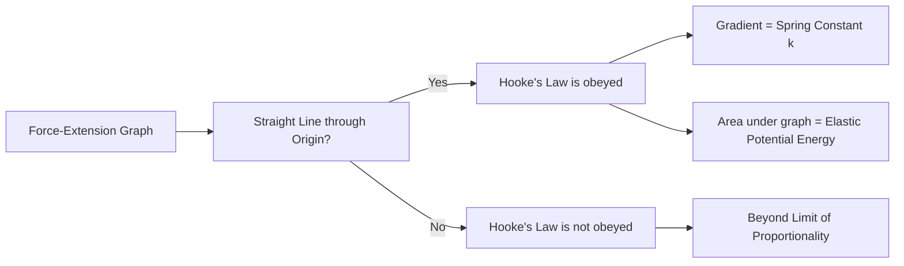
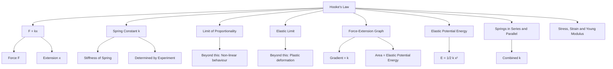

# 1. Overview / 概述

**English:**
Hooke's Law describes the fundamental relationship between the force applied to an elastic material (like a spring) and the resulting extension or compression. This sub-topic introduces the law itself, the concept of the **spring constant** ($k$), and the conditions under which Hooke's Law is valid. Understanding Hooke's Law is essential for analysing [[Force-Extension Graphs]], calculating [[Elastic Potential Energy in a Spring]], and exploring more complex arrangements like [[Springs in Series and Parallel]]. It is a foundational concept in the study of materials and forms the basis for understanding [[Stress, Strain and Young Modulus]] at the A2 level. The spring constant is a measure of the **stiffness** of a spring.

**中文:**
胡克定律描述了施加在弹性材料（如弹簧）上的力与由此产生的伸长或压缩之间的基本关系。本子知识点介绍该定律本身、**弹簧常数** ($k$) 的概念以及胡克定律成立的条件。理解胡克定律对于分析[[力-伸长图]]、计算[[弹簧中的弹性势能]]以及探索更复杂的排列如[[弹簧的串联与并联]]至关重要。它是材料研究中的基础概念，并为在A2阶段理解[[应力、应变和杨氏模量]]奠定了基础。弹簧常数是衡量弹簧**刚度**的指标。

---

# 2. Syllabus Learning Objectives / 考纲学习目标

| CAIE 9702 | Edexcel IAL |
|-----------|-------------|
| 6.1(a) State Hooke's Law. | 2.1 Know that a force can change the shape of a body. |
| 6.1(b) Define and use the terms load, extension, and compression. | 2.2 Understand and use Hooke's Law. |
| 6.1(c) Recall and use the formula $F = kx$. | 2.3 Understand and use the terms spring constant, limit of proportionality, and elastic limit. |
| 6.1(d) Describe an experiment to determine the spring constant of a spring. | 2.4 Describe an experiment to determine the spring constant of a spring. |
| 6.1(e) Distinguish between the limit of proportionality and the elastic limit. | 2.5 Understand and use the formula for elastic potential energy $E = \frac{1}{2} Fx = \frac{1}{2} kx^2$. |
| 6.1(f) Recall and use the formula for elastic potential energy $E = \frac{1}{2} Fx = \frac{1}{2} kx^2$. | 2.6 Understand and use the formula for the combined spring constant of springs in series and parallel. |

**Examiner Expectations / 考官期望:**
- **CAIE:** Students must be able to state Hooke's Law precisely, define load, extension, and compression, and apply $F = kx$ to solve problems. They must also be able to describe the experimental determination of $k$ and distinguish between the limit of proportionality and the elastic limit.
- **Edexcel:** Students must understand and apply Hooke's Law, define spring constant, and describe the experiment to determine it. They must also be able to use the formula for elastic potential energy and the combined spring constant for series and parallel arrangements.

---

# 3. Core Definitions / 核心定义

| Term (EN/CN) | Definition (EN) | Definition (CN) | Common Mistakes / 常见错误 |
|--------------|-----------------|-----------------|---------------------------|
| **Hooke's Law** / 胡克定律 | The extension of a spring is directly proportional to the force applied to it, provided the limit of proportionality is not exceeded. | 弹簧的伸长量与施加在其上的力成正比，前提是不超过比例极限。 | Confusing extension with total length. The law applies to extension, not total length. |
| **Spring Constant ($k$)** / 弹簧常数 | A measure of the stiffness of a spring. It is defined as the force required to produce unit extension. | 衡量弹簧刚度的指标。定义为产生单位伸长所需的力。 | Forgetting units: N/m or N m⁻¹. |
| **Extension ($x$)** / 伸长量 | The increase in length of a spring from its original (unloaded) length. | 弹簧从其原始（未加载）长度增加的长度。 | Using total length instead of change in length. |
| **Compression** / 压缩 | The decrease in length of a spring from its original length when a compressive force is applied. | 当施加压缩力时，弹簧从其原始长度减少的长度。 | Applying Hooke's Law with a negative sign incorrectly. |
| **Limit of Proportionality** / 比例极限 | The point beyond which the extension of a spring is no longer directly proportional to the applied force. | 超过此点后，弹簧的伸长量不再与施加的力成正比。 | Confusing with the elastic limit. |
| **Elastic Limit** / 弹性极限 | The point beyond which a spring does not return to its original length when the load is removed. | 超过此点后，当负载移除时，弹簧不会恢复到其原始长度。 | Assuming the elastic limit and limit of proportionality are the same point. |

---

# 4. Key Concepts Explained / 关键概念详解

## 4.1 Hooke's Law and the Spring Constant / 胡克定律与弹簧常数

### Explanation / 解释
**English:**
Hooke's Law states that for a spring (or other elastic object), the **extension** ($x$) is directly proportional to the **applied force** ($F$), as long as the [[Elastic Limit and Plastic Deformation|limit of proportionality]] is not exceeded. This relationship is expressed mathematically as:

$$ F = kx $$

Where:
- $F$ is the applied force (in Newtons, N)
- $k$ is the spring constant (in N/m or N m⁻¹)
- $x$ is the extension (in metres, m)

The spring constant $k$ is a measure of the **stiffness** of the spring. A larger $k$ means a stiffer spring that requires more force to stretch it by a given amount. The spring constant depends on the material of the spring, the diameter of the wire, the coil diameter, and the number of coils.

**中文:**
胡克定律指出，对于弹簧（或其他弹性物体），**伸长量** ($x$) 与**施加的力** ($F$) 成正比，只要不超过[[弹性极限与塑性变形|比例极限]]。这种关系用数学公式表示为：

$$ F = kx $$

其中：
- $F$ 是施加的力（单位：牛顿，N）
- $k$ 是弹簧常数（单位：N/m 或 N m⁻¹）
- $x$ 是伸长量（单位：米，m）

弹簧常数 $k$ 是衡量弹簧**刚度**的指标。$k$ 值越大，表示弹簧越硬，需要更大的力才能将其拉伸一定量。弹簧常数取决于弹簧的材料、金属丝的直径、线圈直径和线圈数量。

### Physical Meaning / 物理意义
**English:**
Physically, Hooke's Law describes the linear elastic behaviour of materials. When a force is applied to a spring, the atoms in the spring's wire are displaced from their equilibrium positions. The interatomic forces act like tiny springs, pulling the atoms back towards their original positions. As long as the displacement is small (within the elastic limit), the restoring force is proportional to the displacement, leading to Hooke's Law. The spring constant $k$ represents the combined effect of all these interatomic "springs" in the entire spring.

**中文:**
从物理上讲，胡克定律描述了材料的线性弹性行为。当对弹簧施加力时，弹簧金属丝中的原子会从其平衡位置发生位移。原子间力就像微小的弹簧一样，将原子拉回其原始位置。只要位移很小（在弹性极限内），回复力就与位移成正比，从而得出胡克定律。弹簧常数 $k$ 代表了整个弹簧中所有这些原子间“弹簧”的综合效果。

### Common Misconceptions / 常见误区
- **Misconception 1:** Hooke's Law applies to all materials. (Reality: It only applies to elastic materials within their limit of proportionality.)
- **Misconception 2:** The spring constant $k$ changes with the applied force. (Reality: $k$ is a constant for a given spring, as long as the limit of proportionality is not exceeded.)
- **Misconception 3:** $x$ in $F = kx$ is the total length of the spring. (Reality: $x$ is the extension, i.e., the change in length.)
- **Misconception 4:** A spring with a larger $k$ is easier to stretch. (Reality: A larger $k$ means a stiffer spring, so it is harder to stretch.)

### Exam Tips / 考试提示
- **Tip 1:** Always define $x$ as the **extension** (change in length), not the total length.
- **Tip 2:** Remember that Hooke's Law is only valid up to the **limit of proportionality**.
- **Tip 3:** When calculating $k$, ensure units are consistent (force in N, extension in m).
- **Tip 4:** For compression, Hooke's Law still applies, but $x$ is the compression distance.

> 📷 **IMAGE PROMPT — DIAGRAM-01: Hooke's Law Experiment Setup**
> A clear diagram showing a spring hanging vertically from a clamp stand. A ruler is placed next to the spring to measure its length. Masses are added to a hanger at the bottom of the spring. Labels: "Clamp Stand", "Spring", "Ruler", "Mass Hanger", "Masses", "Original Length (l₀)", "Extended Length (l)", "Extension (x = l - l₀)".

---

# 5. Essential Equations / 核心公式

## Equation 1: Hooke's Law / 胡克定律

$$ F = kx $$

| Symbol (符号) | Meaning (EN) | Meaning (CN) | Unit (单位) |
|--------------|-------------|-------------|------------|
| $F$ | Applied force | 施加的力 | N (Newton) |
| $k$ | Spring constant | 弹簧常数 | N m⁻¹ (Newton per metre) |
| $x$ | Extension (or compression) | 伸长量（或压缩量） | m (metre) |

**Derivation / 推导:**
Hooke's Law is an empirical law, meaning it is derived from experimental observation. It is not derived from first principles at this level.

**Conditions / 适用条件:**
- **English:** The law is valid only for elastic materials within their **limit of proportionality**. The extension must be directly proportional to the force.
- **中文:** 该定律仅适用于在其**比例极限**内的弹性材料。伸长量必须与力成正比。

**Limitations / 局限性:**
- **English:** The law does not apply beyond the limit of proportionality. It does not describe plastic deformation or the behaviour of non-elastic materials.
- **中文:** 该定律不适用于比例极限之外的情况。它不描述塑性变形或非弹性材料的行为。

> 📷 **IMAGE PROMPT — GRAPH-01: Force-Extension Graph for a Spring**
> A graph with "Force (F)" on the y-axis and "Extension (x)" on the x-axis. A straight line passes through the origin, showing a linear relationship. The line is labelled "Hooke's Law Region". A point on the line is marked "Limit of Proportionality". Beyond this point, the line curves, showing non-linear behaviour. The gradient of the straight line is labelled "k (Spring Constant)".

---

# 6. Graphs and Relationships / 图表与关系

## 6.1 Force-Extension Graph / 力-伸长图

### Axes / 坐标轴 (EN+CN)
- **X-axis:** Extension ($x$) / 伸长量 ($x$)
- **Y-axis:** Force ($F$) / 力 ($F$)

### Shape / 形状 (EN+CN)
- **English:** A straight line passing through the origin, up to the limit of proportionality. Beyond this point, the line curves.
- **中文:** 一条通过原点的直线，直到比例极限。超过此点后，线开始弯曲。

### Gradient Meaning / 斜率含义 (EN+CN)
- **English:** The gradient of the straight-line portion of the graph is equal to the **spring constant** ($k$).
- **中文:** 图形直线部分的斜率等于**弹簧常数** ($k$)。

### Area Meaning / 面积含义 (EN+CN)
- **English:** The area under the force-extension graph represents the **work done** in stretching the spring, which is equal to the [[Elastic Potential Energy in a Spring|elastic potential energy]] stored in the spring.
- **中文:** 力-伸长图下的面积代表拉伸弹簧所做的**功**，等于储存在弹簧中的[[弹簧中的弹性势能|弹性势能]]。

### Exam Interpretation / 考试解读 (EN+CN)
- **English:** If the graph is a straight line through the origin, Hooke's Law is obeyed. The steeper the line, the larger the spring constant (stiffer spring). The area under the graph up to any point gives the elastic potential energy stored.
- **中文:** 如果图形是一条通过原点的直线，则遵循胡克定律。线越陡，弹簧常数越大（弹簧越硬）。图形下到任意点的面积给出了储存的弹性势能。

---

# 7. Required Diagrams / 必备图表

## 7.1 Experimental Setup for Determining Spring Constant / 测定弹簧常数的实验装置

### Description / 描述 (EN+CN)
- **English:** A diagram showing a spring suspended vertically from a clamp stand. A ruler is placed alongside to measure the length of the spring. A mass hanger is attached to the bottom of the spring, and known masses can be added.
- **中文:** 一个显示弹簧垂直悬挂在夹架上的图。旁边放有一把尺子来测量弹簧的长度。一个砝码挂钩连接在弹簧底部，可以添加已知质量的砝码。

### Image Prompt / 图片生成提示
> 📷 **IMAGE PROMPT — DIAGRAM-02: Spring Constant Experiment**
> A detailed diagram of a physics experiment. A metal spring hangs from a clamp attached to a vertical stand. A metre ruler is fixed vertically next to the spring. The bottom of the spring has a mass hanger with several slotted masses on it. Labels: "Clamp", "Spring", "Ruler", "Mass Hanger", "Slotted Masses", "Original Length (l₀)", "Extended Length (l)", "Extension (x = l - l₀)". The diagram should be clean and suitable for an A-Level textbook.

### Labels Required / 需要标注 (EN+CN)
- Clamp / 夹子
- Spring / 弹簧
- Ruler / 尺子
- Mass Hanger / 砝码挂钩
- Slotted Masses / 槽码
- Original Length ($l_0$) / 原始长度 ($l_0$)
- Extended Length ($l$) / 伸长后的长度 ($l$)
- Extension ($x = l - l_0$) / 伸长量 ($x = l - l_0$)

### Exam Importance / 考试重要性 (EN+CN)
- **English:** This diagram is frequently asked in exams. Students must be able to draw and label it, and describe the procedure to determine the spring constant.
- **中文:** 这个图在考试中经常被问到。学生必须能够画出并标注它，并描述测定弹簧常数的步骤。

---

# 8. Worked Examples / 典型例题

## Example 1: Calculating Spring Constant / 计算弹簧常数

### Question / 题目
**English:**
A spring has an original length of 15.0 cm. When a force of 6.0 N is applied, the spring stretches to a length of 27.0 cm. Calculate the spring constant of the spring.

**中文:**
一根弹簧的原始长度为 15.0 cm。当施加 6.0 N 的力时，弹簧伸长到 27.0 cm。计算该弹簧的弹簧常数。

### Solution / 解答
**Step 1: Calculate the extension.**
$$ x = \text{final length} - \text{original length} = 27.0 \, \text{cm} - 15.0 \, \text{cm} = 12.0 \, \text{cm} = 0.12 \, \text{m} $$

**Step 2: Apply Hooke's Law.**
$$ F = kx $$
$$ k = \frac{F}{x} = \frac{6.0 \, \text{N}}{0.12 \, \text{m}} = 50 \, \text{N m}^{-1} $$

### Final Answer / 最终答案
**Answer:** $k = 50 \, \text{N m}^{-1}$ | **答案：** $k = 50 \, \text{N m}^{-1}$

### Quick Tip / 提示
(EN+CN)
- **English:** Always convert extension to metres before calculating $k$.
- **中文:** 在计算 $k$ 之前，务必将伸长量转换为米。

## Example 2: Finding Force from Extension / 从伸长量求力

### Question / 题目
**English:**
A spring has a spring constant of 200 N m⁻¹. What force is required to produce an extension of 5.0 cm?

**中文:**
一根弹簧的弹簧常数为 200 N m⁻¹。要产生 5.0 cm 的伸长量，需要多大的力？

### Solution / 解答
**Step 1: Convert extension to metres.**
$$ x = 5.0 \, \text{cm} = 0.05 \, \text{m} $$

**Step 2: Apply Hooke's Law.**
$$ F = kx = (200 \, \text{N m}^{-1})(0.05 \, \text{m}) = 10 \, \text{N} $$

### Final Answer / 最终答案
**Answer:** $F = 10 \, \text{N}$ | **答案：** $F = 10 \, \text{N}$

### Quick Tip / 提示
(EN+CN)
- **English:** Ensure units are consistent. Use metres for extension, not centimetres.
- **中文:** 确保单位一致。伸长量使用米，而不是厘米。

---

# 9. Past Paper Question Types / 历年真题题型

| Question Type / 题型 | Frequency / 频率 | Difficulty / 难度 | Past Paper References / 真题索引 |
|----------------------|------------------|------------------|-------------------------------|
| State Hooke's Law / 陈述胡克定律 | High | Easy | 📝 *待填入* |
| Calculate spring constant from data / 从数据计算弹簧常数 | High | Medium | 📝 *待填入* |
| Describe experiment to determine $k$ / 描述测定 $k$ 的实验 | Medium | Medium | 📝 *待填入* |
| Interpret force-extension graph / 解释力-伸长图 | Medium | Medium | 📝 *待填入* |
| Distinguish limit of proportionality and elastic limit / 区分比例极限和弹性极限 | Low | Medium | 📝 *待填入* |

**Common Command Words / 常见指令词:**
- **State / 陈述:** Give a clear, concise definition or law.
- **Calculate / 计算:** Use a formula to find a numerical answer.
- **Describe / 描述:** Give a detailed account of an experiment or process.
- **Explain / 解释:** Give reasons for a phenomenon or relationship.
- **Distinguish / 区分:** State the differences between two concepts.

---

# 10. Practical Skills Connections / 实验技能链接

**English:**
This sub-topic is directly linked to the practical determination of the spring constant. Key practical skills include:
- **Measurements:** Using a ruler to measure the original and extended lengths of a spring. Using a balance to measure the mass of the weights.
- **Uncertainties:** Estimating the uncertainty in length measurements (e.g., ±0.1 cm) and force measurements (e.g., ±0.01 N). Calculating the percentage uncertainty in $k$.
- **Graph Plotting:** Plotting a graph of force (y-axis) against extension (x-axis). Drawing a line of best fit through the data points.
- **Experimental Design:** Controlling variables (e.g., using the same spring, ensuring the spring is not overloaded). Repeating measurements to improve accuracy.
- **Data Analysis:** Calculating the gradient of the force-extension graph to find $k$. Calculating the area under the graph to find elastic potential energy.

**中文:**
本子知识点与弹簧常数的实验测定直接相关。关键的实验技能包括：
- **测量：** 使用尺子测量弹簧的原始长度和伸长后的长度。使用天平测量砝码的质量。
- **不确定度：** 估计长度测量（例如，±0.1 cm）和力测量（例如，±0.01 N）的不确定度。计算 $k$ 的百分比不确定度。
- **作图：** 绘制力（y轴）对伸长量（x轴）的图。通过数据点绘制最佳拟合线。
- **实验设计：** 控制变量（例如，使用同一根弹簧，确保弹簧不过载）。重复测量以提高准确性。
- **数据分析：** 计算力-伸长图的斜率以求出 $k$。计算图下的面积以求出弹性势能。

---

# 11. Concept Map / 概念图谱

---

# 12. Quick Revision Sheet / 速查表

| Category / 类别 | Key Points / 要点 |
|----------------|------------------|
| Definition / 定义 | Hooke's Law: Extension ∝ Force (up to limit of proportionality). / 胡克定律：伸长量 ∝ 力（在比例极限内）。 |
| Key Formula / 核心公式 | $F = kx$ |
| Key Graph / 核心图表 | Force-Extension Graph: Straight line through origin. Gradient = $k$. / 力-伸长图：通过原点的直线。斜率 = $k$。 |
| Exam Tip / 考试提示 | Always use extension ($x$), not total length. Convert cm to m. / 始终使用伸长量 ($x$)，而不是总长度。将 cm 转换为 m。 |
| Common Mistake / 常见错误 | Confusing extension with total length. / 混淆伸长量和总长度。 |
| Practical Skill / 实验技能 | Measure original length, add masses, measure new length, calculate extension. Plot $F$ vs $x$, find gradient. / 测量原始长度，添加砝码，测量新长度，计算伸长量。绘制 $F$ 对 $x$ 的图，求斜率。 |
| Related Topics / 相关主题 | [[Force-Extension Graphs]], [[Elastic Potential Energy in a Spring]], [[Springs in Series and Parallel]], [[Stress, Strain and Young Modulus]] |