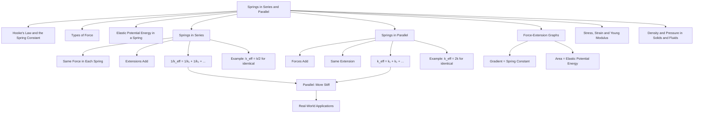

# 1. Overview / 概述

**English:**
This sub-topic explores how springs behave when connected together in **series** (end-to-end) or **parallel** (side-by-side). Understanding these combinations is crucial because real-world mechanical systems—from car suspensions to weighing scales—often use multiple springs to achieve specific stiffness or load-bearing requirements. You will learn how to calculate the **effective spring constant** (or combined stiffness) for both arrangements, and how the total extension and force distribution differ between series and parallel configurations. This builds directly on [[Hooke's Law and the Spring Constant]] and prepares you for more advanced topics like [[Stress, Strain and Young Modulus]].

**中文:**
本子知识点探讨弹簧在**串联**（首尾相连）或**并联**（并排连接）时的行为。理解这些组合至关重要，因为从汽车悬挂系统到称重秤，现实世界中的机械系统通常使用多个弹簧来达到特定的刚度或承载要求。你将学习如何计算两种排列方式的**等效弹簧常数**（或组合刚度），以及串联和并联配置中总伸长量和力的分布有何不同。这直接建立在[[Hooke's Law and the Spring Constant]]的基础上，并为[[Stress, Strain and Young Modulus]]等更高级的主题做准备。

---

# 2. Syllabus Learning Objectives / 考纲学习目标

| CAIE 9702 | Edexcel IAL |
|-----------|-------------|
| 6.1(d): Derive and use the formula for the combined spring constant of springs in series and parallel | WPH11 U1: 2.6: Determine the effective spring constant for springs in series and parallel |
| 6.1(e): Analyse force-extension graphs for combinations of springs | WPH11 U1: 2.5: Interpret force-extension graphs for combined spring systems |
| 6.1(f): Solve problems involving energy stored in combined spring systems | WPH11 U1: 2.4: Apply Hooke's Law to spring combinations |

**Examiner Expectations / 考官期望:**
- **English:** You must be able to derive the combined spring constant formulas from first principles using Hooke's Law. You should also be able to calculate total extension, force distribution, and elastic potential energy for combined systems. Graphical analysis (e.g., comparing gradients of force-extension graphs) is commonly tested.
- **中文:** 你必须能够使用胡克定律从基本原理推导出组合弹簧常数公式。你还应该能够计算组合系统的总伸长量、力的分布和弹性势能。图形分析（例如比较力-伸长图线的斜率）是常见的考点。

---

# 3. Core Definitions / 核心定义

| Term (EN/CN) | Definition (EN) | Definition (CN) | Common Mistakes / 常见错误 |
|--------------|-----------------|-----------------|---------------------------|
| **Effective Spring Constant** / 等效弹簧常数 | The single spring constant that would replace a combination of springs, producing the same total extension for the same applied force. | 能够替代一组弹簧组合的单一弹簧常数，在相同外力作用下产生相同的总伸长量。 | Confusing series and parallel formulas; using $k_{eff} = k_1 + k_2$ for series instead of parallel. |
| **Springs in Series** / 串联弹簧 | Two or more springs connected end-to-end; the same force acts on each spring, but extensions add. | 两个或多个弹簧首尾相连；每个弹簧受到相同的力，但伸长量相加。 | Thinking force is divided equally in series (it is not—force is the same in each). |
| **Springs in Parallel** / 并联弹簧 | Two or more springs connected side-by-side; the total force is shared between springs, but each has the same extension. | 两个或多个弹簧并排连接；总力在弹簧之间分配，但每个弹簧的伸长量相同。 | Thinking extension is the same in series (it is not—extensions add). |
| **Combined Stiffness** / 组合刚度 | The overall resistance to deformation of a spring system; quantified by the effective spring constant. | 弹簧系统对形变的整体抵抗能力；由等效弹簧常数量化。 | Forgetting that parallel springs are stiffer (higher $k$) than individual springs. |
| **Force Distribution** / 力的分布 | How the total applied force is divided among individual springs in a combination. | 总施加力在组合中各弹簧之间的分配方式。 | In series, force is the same; in parallel, force is shared. |

---

# 4. Key Concepts Explained / 关键概念详解

## 4.1 Springs in Series / 串联弹簧

### Explanation / 解释
**English:**
When springs are connected **in series**, they are attached end-to-end. A force $F$ applied to the free end of the combination is transmitted **unchanged** through each spring. This means each spring experiences the **same force** $F$. However, the total extension $x_{total}$ is the **sum** of the individual extensions:
$$ x_{total} = x_1 + x_2 + \dots + x_n $$
Using Hooke's Law ($F = kx$), we can derive the effective spring constant $k_{eff}$:
$$ \frac{F}{k_{eff}} = \frac{F}{k_1} + \frac{F}{k_2} + \dots + \frac{F}{k_n} $$
Cancelling $F$ gives:
$$ \frac{1}{k_{eff}} = \frac{1}{k_1} + \frac{1}{k_2} + \dots + \frac{1}{k_n} $$
For two springs: $k_{eff} = \frac{k_1 k_2}{k_1 + k_2}$

**中文:**
当弹簧**串联**时，它们首尾相连。施加在组合自由端的力 $F$ **不变地**传递通过每个弹簧。这意味着每个弹簧承受**相同的力** $F$。然而，总伸长量 $x_{total}$ 是各个伸长量的**总和**：
$$ x_{total} = x_1 + x_2 + \dots + x_n $$
使用胡克定律 ($F = kx$)，我们可以推导出等效弹簧常数 $k_{eff}$：
$$ \frac{F}{k_{eff}} = \frac{F}{k_1} + \frac{F}{k_2} + \dots + \frac{F}{k_n} $$
消去 $F$ 得到：
$$ \frac{1}{k_{eff}} = \frac{1}{k_1} + \frac{1}{k_2} + \dots + \frac{1}{k_n} $$
对于两个弹簧：$k_{eff} = \frac{k_1 k_2}{k_1 + k_2}$

### Physical Meaning / 物理意义
**English:** Springs in series are **less stiff** (softer) than any individual spring. The effective spring constant is **smaller** than the smallest individual $k$. This is because the total extension is larger for the same force.
**中文:** 串联弹簧比任何一个单独的弹簧**更软**（刚度更小）。等效弹簧常数**小于**最小的单个 $k$。这是因为在相同力作用下，总伸长量更大。

### Common Misconceptions / 常见误区
- **English:**
  - ❌ "Force is divided equally in series." → ✅ Force is the **same** in each spring.
  - ❌ "The effective $k$ is the sum of individual $k$ values." → ✅ The **reciprocal** of $k_{eff}$ is the sum of reciprocals.
  - ❌ "Two identical springs in series have $k_{eff} = k$." → ✅ $k_{eff} = k/2$ (half as stiff).
- **中文:**
  - ❌ "串联时力被均分。" → ✅ 每个弹簧上的力**相同**。
  - ❌ "等效 $k$ 是各个 $k$ 值的和。" → ✅ $k_{eff}$ 的**倒数**是各个倒数的和。
  - ❌ "两个相同的弹簧串联，$k_{eff} = k$。" → ✅ $k_{eff} = k/2$（刚度减半）。

### Exam Tips / 考试提示
- **English:** Always start by writing $F = kx$ for each spring. Remember: in series, $F$ is constant, $x$ adds. Use the reciprocal formula carefully—common error is forgetting to take the reciprocal at the end.
- **中文:** 始终从为每个弹簧写出 $F = kx$ 开始。记住：串联时，$F$ 恒定，$x$ 相加。小心使用倒数公式——常见错误是最后忘记取倒数。

> 📷 **IMAGE PROMPT — SPR-01: Springs in Series Diagram**
> A clear diagram showing two springs connected end-to-end. Label: "Spring 1 (k₁)", "Spring 2 (k₂)", "Force F applied at bottom", "Extension x₁", "Extension x₂", "Total extension x₁ + x₂". Show that the same force F passes through both springs. Use arrows to indicate force direction.

---

## 4.2 Springs in Parallel / 并联弹簧

### Explanation / 解释
**English:**
When springs are connected **in parallel**, they are arranged side-by-side and share the applied load. The total force $F$ is **distributed** among the springs, but each spring undergoes the **same extension** $x$. The total force is the sum of the forces in each spring:
$$ F = F_1 + F_2 + \dots + F_n $$
Using Hooke's Law:
$$ k_{eff} x = k_1 x + k_2 x + \dots + k_n x $$
Cancelling $x$ gives:
$$ k_{eff} = k_1 + k_2 + \dots + k_n $$

**中文:**
当弹簧**并联**时，它们并排排列并分担施加的载荷。总力 $F$ 在弹簧之间**分配**，但每个弹簧经历**相同的伸长量** $x$。总力是每个弹簧中力的总和：
$$ F = F_1 + F_2 + \dots + F_n $$
使用胡克定律：
$$ k_{eff} x = k_1 x + k_2 x + \dots + k_n x $$
消去 $x$ 得到：
$$ k_{eff} = k_1 + k_2 + \dots + k_n $$

### Physical Meaning / 物理意义
**English:** Springs in parallel are **stiffer** (harder) than any individual spring. The effective spring constant is **larger** than the largest individual $k$. This is because the same extension requires a larger total force.
**中文:** 并联弹簧比任何一个单独的弹簧**更硬**（刚度更大）。等效弹簧常数**大于**最大的单个 $k$。这是因为相同的伸长量需要更大的总力。

### Common Misconceptions / 常见误区
- **English:**
  - ❌ "Extension is the same in series." → ✅ Extension is the **same** in parallel, not series.
  - ❌ "Two identical springs in parallel have $k_{eff} = k$." → ✅ $k_{eff} = 2k$ (twice as stiff).
  - ❌ "Force is the same in each parallel spring." → ✅ Force is **shared**; each spring carries a portion of the total force.
- **中文:**
  - ❌ "串联时伸长量相同。" → ✅ 伸长量在**并联**时相同，而非串联。
  - ❌ "两个相同的弹簧并联，$k_{eff} = k$。" → ✅ $k_{eff} = 2k$（刚度加倍）。
  - ❌ "每个并联弹簧上的力相同。" → ✅ 力是**分担**的；每个弹簧承受总力的一部分。

### Exam Tips / 考试提示
- **English:** In parallel, $x$ is constant, $F$ adds. For identical springs in parallel, $k_{eff} = nk$ where $n$ is the number of springs. This is a quick check for your answers.
- **中文:** 并联时，$x$ 恒定，$F$ 相加。对于相同的弹簧并联，$k_{eff} = nk$，其中 $n$ 是弹簧数量。这是检查答案的快速方法。

> 📷 **IMAGE PROMPT — SPR-02: Springs in Parallel Diagram**
> A clear diagram showing two springs side-by-side, connected at both ends to a rigid bar. Label: "Spring 1 (k₁)", "Spring 2 (k₂)", "Force F applied to top bar", "Same extension x for both springs", "Force F₁ in spring 1", "Force F₂ in spring 2". Show that F = F₁ + F₂. Use arrows to indicate force distribution.

---

## 4.3 Comparing Series and Parallel / 串联与并联的比较

| Property / 性质 | Series / 串联 | Parallel / 并联 |
|-----------------|---------------|-----------------|
| Force / 力 | Same in each spring | Shared between springs |
| Extension / 伸长量 | Extensions add | Same in each spring |
| Effective $k$ / 等效 $k$ | Smaller than smallest $k$ | Larger than largest $k$ |
| Stiffness / 刚度 | Less stiff (softer) | More stiff (harder) |
| Formula / 公式 | $\frac{1}{k_{eff}} = \sum \frac{1}{k_i}$ | $k_{eff} = \sum k_i$ |

---

# 5. Essential Equations / 核心公式

## Equation 1: Springs in Series / 串联弹簧公式

$$ \frac{1}{k_{eff}} = \frac{1}{k_1} + \frac{1}{k_2} + \dots + \frac{1}{k_n} $$

| Symbol (符号) | Meaning (EN) | Meaning (CN) | Unit (单位) |
|--------------|-------------|-------------|------------|
| $k_{eff}$ | Effective spring constant | 等效弹簧常数 | N m⁻¹ |
| $k_1, k_2, \dots$ | Individual spring constants | 各个弹簧常数 | N m⁻¹ |

**Derivation / 推导:**
$$ F = k_1 x_1 = k_2 x_2 = \dots = k_n x_n \quad \text{(same force)} $$
$$ x_{total} = x_1 + x_2 + \dots + x_n $$
$$ \frac{F}{k_{eff}} = \frac{F}{k_1} + \frac{F}{k_2} + \dots + \frac{F}{k_n} $$
$$ \frac{1}{k_{eff}} = \frac{1}{k_1} + \frac{1}{k_2} + \dots + \frac{1}{k_n} $$

**Conditions / 适用条件:**
- **English:** Springs must obey Hooke's Law (within elastic limit). All springs experience the same force.
- **中文:** 弹簧必须遵守胡克定律（在弹性极限内）。所有弹簧承受相同的力。

**Limitations / 局限性:**
- **English:** Does not account for the mass of the springs themselves. Assumes ideal, massless springs.
- **中文:** 不考虑弹簧本身的质量。假设为理想的无质量弹簧。

---

## Equation 2: Springs in Parallel / 并联弹簧公式

$$ k_{eff} = k_1 + k_2 + \dots + k_n $$

| Symbol (符号) | Meaning (EN) | Meaning (CN) | Unit (单位) |
|--------------|-------------|-------------|------------|
| $k_{eff}$ | Effective spring constant | 等效弹簧常数 | N m⁻¹ |
| $k_1, k_2, \dots$ | Individual spring constants | 各个弹簧常数 | N m⁻¹ |

**Derivation / 推导:**
$$ F = F_1 + F_2 + \dots + F_n \quad \text{(forces add)} $$
$$ x = x_1 = x_2 = \dots = x_n \quad \text{(same extension)} $$
$$ k_{eff} x = k_1 x + k_2 x + \dots + k_n x $$
$$ k_{eff} = k_1 + k_2 + \dots + k_n $$

**Conditions / 适用条件:**
- **English:** Springs must obey Hooke's Law. All springs have the same extension.
- **中文:** 弹簧必须遵守胡克定律。所有弹簧具有相同的伸长量。

**Limitations / 局限性:**
- **English:** Assumes the rigid bars connecting the springs are perfectly rigid and massless.
- **中文:** 假设连接弹簧的刚性杆是完全刚性和无质量的。

---

## Equation 3: Two Springs in Series (Special Case) / 两个弹簧串联（特例）

$$ k_{eff} = \frac{k_1 k_2}{k_1 + k_2} $$

**Derivation / 推导:**
From $\frac{1}{k_{eff}} = \frac{1}{k_1} + \frac{1}{k_2} = \frac{k_2 + k_1}{k_1 k_2}$, then invert.

**For identical springs ($k_1 = k_2 = k$):**
$$ k_{eff} = \frac{k}{2} $$

---

## Equation 4: Two Springs in Parallel (Special Case) / 两个弹簧并联（特例）

$$ k_{eff} = k_1 + k_2 $$

**For identical springs ($k_1 = k_2 = k$):**
$$ k_{eff} = 2k $$

---

# 6. Graphs and Relationships / 图表与关系

## 6.1 Force-Extension Graphs for Spring Combinations / 弹簧组合的力-伸长图

### Axes / 坐标轴
- **x-axis:** Extension $x$ (m) / 伸长量 $x$ (m)
- **y-axis:** Force $F$ (N) / 力 $F$ (N)

### Shape / 形状
- **English:** All graphs are straight lines through the origin (assuming Hooke's Law is obeyed). The gradient of each line equals the spring constant $k$.
- **中文:** 所有图线都是通过原点的直线（假设遵守胡克定律）。每条线的斜率等于弹簧常数 $k$。

### Gradient Meaning / 斜率含义
- **English:** The gradient of the $F$ vs $x$ graph is the spring constant $k$. A steeper gradient means a stiffer spring.
- **中文:** $F$ 对 $x$ 图线的斜率是弹簧常数 $k$。斜率越大，弹簧越硬。

### Area Meaning / 面积含义
- **English:** The area under the $F$-$x$ graph represents the [[Elastic Potential Energy in a Spring]] stored: $E = \frac{1}{2} F x = \frac{1}{2} k x^2$.
- **中文:** $F$-$x$ 图线下的面积代表[[Elastic Potential Energy in a Spring]]中储存的弹性势能：$E = \frac{1}{2} F x = \frac{1}{2} k x^2$.

### Exam Interpretation / 考试解读
- **English:** You may be asked to compare gradients of force-extension graphs for different spring combinations. A parallel combination will have a steeper gradient (higher $k_{eff}$) than a single spring. A series combination will have a shallower gradient (lower $k_{eff}$).
- **中文:** 你可能会被要求比较不同弹簧组合的力-伸长图线的斜率。并联组合的斜率比单个弹簧更陡（$k_{eff}$ 更大）。串联组合的斜率更平缓（$k_{eff}$ 更小）。

> 📷 **IMAGE PROMPT — SPR-03: Force-Extension Graphs for Spring Combinations**
> A graph with three lines on the same axes: (1) Single spring with gradient k, (2) Two identical springs in parallel with gradient 2k (steeper), (3) Two identical springs in series with gradient k/2 (shallower). Label each line clearly. Show that all lines pass through the origin.

---

# 7. Required Diagrams / 必备图表

## 7.1 Springs in Series and Parallel / 串联与并联弹簧

### Description / 描述
**English:** Two diagrams showing (a) two springs connected in series (end-to-end) and (b) two springs connected in parallel (side-by-side). Each diagram should clearly label the spring constants, forces, and extensions.
**中文:** 两个示意图，分别显示 (a) 两个弹簧串联（首尾相连）和 (b) 两个弹簧并联（并排连接）。每个图应清晰标注弹簧常数、力和伸长量。

### Image Prompt / 图片生成提示
> 📷 **IMAGE PROMPT — SPR-04: Series and Parallel Spring Diagrams**
> Two side-by-side diagrams. Left: Two springs connected end-to-end (series). Label: "Spring 1 (k₁)", "Spring 2 (k₂)", "Force F", "Extension x₁", "Extension x₂", "Total extension = x₁ + x₂". Right: Two springs connected side-by-side (parallel) with rigid bars at top and bottom. Label: "Spring 1 (k₁)", "Spring 2 (k₂)", "Force F", "Same extension x", "Force F₁", "Force F₂", "F = F₁ + F₂". Use clear arrows for forces. Use a clean, educational style suitable for A-Level physics.

### Labels Required / 需要标注
- **English:** Spring constants ($k_1$, $k_2$), forces ($F$, $F_1$, $F_2$), extensions ($x_1$, $x_2$, $x$), total extension ($x_1 + x_2$)
- **中文:** 弹簧常数 ($k_1$, $k_2$)、力 ($F$, $F_1$, $F_2$)、伸长量 ($x_1$, $x_2$, $x$)、总伸长量 ($x_1 + x_2$)

### Exam Importance / 考试重要性
- **English:** High. Drawing and interpreting these diagrams is a common exam question. You must be able to identify series vs parallel arrangements and apply the correct formulas.
- **中文:** 高。绘制和解读这些示意图是常见的考试题目。你必须能够识别串联与并联排列，并应用正确的公式。

---

## 7.2 Force-Extension Graph for Combined Springs / 组合弹簧的力-伸长图

### Description / 描述
**English:** A graph showing the force-extension relationship for a single spring, two springs in series, and two springs in parallel on the same axes.
**中文:** 在同一坐标轴上显示单个弹簧、两个弹簧串联和两个弹簧并联的力-伸长关系的图线。

### Image Prompt / 图片生成提示
> 📷 **IMAGE PROMPT — SPR-05: Combined Spring Force-Extension Graph**
> A graph with three straight lines through the origin. Line A (steepest): "Two springs in parallel, k_eff = 2k". Line B (medium): "Single spring, k". Line C (shallowest): "Two springs in series, k_eff = k/2". All lines start at (0,0). Label axes: "Extension x / m" (x-axis) and "Force F / N" (y-axis). Add a legend.

### Labels Required / 需要标注
- **English:** Axes labels with units, gradient values ($k$, $2k$, $k/2$), legend identifying each line
- **中文:** 带单位的坐标轴标签、斜率值 ($k$, $2k$, $k/2$)、标识每条线的图例

### Exam Importance / 考试重要性
- **English:** Medium. Understanding how the gradient changes with spring combinations helps in interpreting experimental data.
- **中文:** 中。理解斜率如何随弹簧组合变化有助于解读实验数据。

---

# 8. Worked Examples / 典型例题

## Example 1: Springs in Series / 串联弹簧例题

### Question / 题目
**English:**
Two springs with spring constants $k_1 = 100 \text{ N m}^{-1}$ and $k_2 = 200 \text{ N m}^{-1}$ are connected in series. A force of 30 N is applied to the free end. Calculate:
(a) The effective spring constant of the combination.
(b) The total extension of the combination.
(c) The extension of each individual spring.

**中文:**
两个弹簧常数分别为 $k_1 = 100 \text{ N m}^{-1}$ 和 $k_2 = 200 \text{ N m}^{-1}$ 的弹簧串联连接。在自由端施加 30 N 的力。计算：
(a) 组合的等效弹簧常数。
(b) 组合的总伸长量。
(c) 每个弹簧的伸长量。

### Solution / 解答

**(a) Effective spring constant / 等效弹簧常数:**

$$ \frac{1}{k_{eff}} = \frac{1}{k_1} + \frac{1}{k_2} = \frac{1}{100} + \frac{1}{200} = \frac{2}{200} + \frac{1}{200} = \frac{3}{200} $$

$$ k_{eff} = \frac{200}{3} = 66.7 \text{ N m}^{-1} $$

**(b) Total extension / 总伸长量:**

$$ x_{total} = \frac{F}{k_{eff}} = \frac{30}{66.7} = 0.45 \text{ m} $$

**(c) Individual extensions / 各个伸长量:**

In series, force is the same in each spring ($F = 30 \text{ N}$).

$$ x_1 = \frac{F}{k_1} = \frac{30}{100} = 0.30 \text{ m} $$
$$ x_2 = \frac{F}{k_2} = \frac{30}{200} = 0.15 \text{ m} $$

Check: $x_1 + x_2 = 0.30 + 0.15 = 0.45 \text{ m} = x_{total}$ ✓

### Final Answer / 最终答案
**Answer:** (a) $k_{eff} = 66.7 \text{ N m}^{-1}$, (b) $x_{total} = 0.45 \text{ m}$, (c) $x_1 = 0.30 \text{ m}$, $x_2 = 0.15 \text{ m}$
**答案：** (a) $k_{eff} = 66.7 \text{ N m}^{-1}$, (b) $x_{total} = 0.45 \text{ m}$, (c) $x_1 = 0.30 \text{ m}$, $x_2 = 0.15 \text{ m}$

### Quick Tip / 提示
- **English:** Always check that the sum of individual extensions equals the total extension for series combinations. This is a good verification step.
- **中文:** 始终检查各个伸长量之和是否等于串联组合的总伸长量。这是一个很好的验证步骤。

---

## Example 2: Springs in Parallel / 并联弹簧例题

### Question / 题目
**English:**
Two identical springs, each with spring constant $k = 150 \text{ N m}^{-1}$, are connected in parallel. A mass of 0.50 kg is hung from the combination. Calculate:
(a) The effective spring constant.
(b) The extension of the combination.
(c) The force in each spring.
(Take $g = 9.81 \text{ m s}^{-2}$)

**中文:**
两个相同的弹簧，每个弹簧常数 $k = 150 \text{ N m}^{-1}$，并联连接。在组合上悬挂一个 0.50 kg 的质量。计算：
(a) 等效弹簧常数。
(b) 组合的伸长量。
(c) 每个弹簧中的力。
（取 $g = 9.81 \text{ m s}^{-2}$）

### Solution / 解答

**(a) Effective spring constant / 等效弹簧常数:**

$$ k_{eff} = k_1 + k_2 = 150 + 150 = 300 \text{ N m}^{-1} $$

**(b) Extension / 伸长量:**

Total force: $F = mg = 0.50 \times 9.81 = 4.905 \text{ N}$

$$ x = \frac{F}{k_{eff}} = \frac{4.905}{300} = 0.01635 \text{ m} = 1.64 \text{ cm} $$

**(c) Force in each spring / 每个弹簧中的力:**

In parallel, extension is the same for both springs ($x = 0.01635 \text{ m}$).

$$ F_1 = k_1 x = 150 \times 0.01635 = 2.4525 \text{ N} $$
$$ F_2 = k_2 x = 150 \times 0.01635 = 2.4525 \text{ N} $$

Check: $F_1 + F_2 = 2.4525 + 2.4525 = 4.905 \text{ N} = F$ ✓

### Final Answer / 最终答案
**Answer:** (a) $k_{eff} = 300 \text{ N m}^{-1}$, (b) $x = 1.64 \text{ cm}$, (c) $F_1 = F_2 = 2.45 \text{ N}$
**答案：** (a) $k_{eff} = 300 \text{ N m}^{-1}$, (b) $x = 1.64 \text{ cm}$, (c) $F_1 = F_2 = 2.45 \text{ N}$

### Quick Tip / 提示
- **English:** For identical springs in parallel, the force is equally shared. For non-identical springs, the stiffer spring (larger $k$) carries more force.
- **中文:** 对于相同的弹簧并联，力是均分的。对于不同的弹簧，较硬的弹簧（$k$ 较大）承受更大的力。

---

# 9. Past Paper Question Types / 历年真题题型

| Question Type / 题型 | Frequency / 频率 | Difficulty / 难度 | Past Paper References / 真题索引 |
|----------------------|------------------|------------------|-------------------------------|
| Calculate $k_{eff}$ for series/parallel | High | Easy | 📝 *待填入* |
| Calculate total extension given force | High | Easy-Medium | 📝 *待填入* |
| Compare force-extension graph gradients | Medium | Medium | 📝 *待填入* |
| Derive combined spring constant formula | Low-Medium | Medium-Hard | 📝 *待填入* |
| Energy stored in combined spring system | Medium | Medium | 📝 *待填入* |
| Mixed series-parallel combinations | Low | Hard | 📝 *待填入* |

**Common Command Words / 常见指令词:**
- **English:** Calculate, Derive, Determine, Show that, Sketch, Compare, Explain
- **中文:** 计算、推导、确定、证明、画出、比较、解释

---

# 10. Practical Skills Connections / 实验技能链接

**English:**
This sub-topic connects to practical work in several ways:

1. **Measuring Spring Constants:** You can experimentally determine the spring constant of individual springs using a force sensor and ruler, then combine them in series and parallel to verify the formulas.

2. **Graph Plotting:** Plot force-extension graphs for individual springs and combinations. The gradient gives $k$. Compare experimental $k_{eff}$ with theoretical predictions.

3. **Uncertainty Analysis:** When measuring extensions, consider uncertainties in ruler readings (±0.5 mm) and force measurements. Propagate uncertainties to find the uncertainty in $k_{eff}$.

4. **Experimental Design:** Design an experiment to determine whether two unknown springs are connected in series or parallel based on their combined stiffness.

5. **Elastic Limit:** Ensure all springs remain within their [[Elastic Limit and Plastic Deformation]] during experiments to maintain linearity.

**中文:**
本子知识点通过以下几种方式与实验工作联系：

1. **测量弹簧常数：** 你可以使用力传感器和尺子通过实验确定单个弹簧的弹簧常数，然后将它们串联和并联以验证公式。

2. **绘制图线：** 绘制单个弹簧和组合的力-伸长图。斜率给出 $k$。将实验得到的 $k_{eff}$ 与理论预测进行比较。

3. **不确定度分析：** 测量伸长量时，考虑尺子读数 (±0.5 mm) 和力测量的不确定度。传播不确定度以找到 $k_{eff}$ 的不确定度。

4. **实验设计：** 设计一个实验，根据组合刚度确定两个未知弹簧是串联还是并联。

5. **弹性极限：** 确保所有弹簧在实验过程中保持在[[Elastic Limit and Plastic Deformation]]内，以保持线性。

---

# 11. Concept Map / 概念图谱

---

# 12. Quick Revision Sheet / 速查表

| Category / 类别 | Key Points / 要点 |
|----------------|------------------|
| **Definition / 定义** | **Series:** Same force, extensions add. **Parallel:** Same extension, forces add. |
| **Key Formula / 核心公式** | **Series:** $\frac{1}{k_{eff}} = \frac{1}{k_1} + \frac{1}{k_2} + \dots$ **Parallel:** $k_{eff} = k_1 + k_2 + \dots$ |
| **Identical Springs / 相同弹簧** | **Series:** $k_{eff} = k/n$ (n springs) **Parallel:** $k_{eff} = nk$ (n springs) |
| **Key Graph / 核心图表** | Force-Extension graph: Gradient = $k$. Parallel → steeper gradient. Series → shallower gradient. |
| **Common Mistake / 常见错误** | ❌ Using series formula for parallel (and vice versa). ✅ Remember: Series = reciprocal sum; Parallel = direct sum. |
| **Exam Tip / 考试提示** | Always write $F = kx$ for each spring first. Identify whether force or extension is the same. Then derive the combined formula. |
| **Energy / 能量** | Total elastic potential energy: $E_{total} = \frac{1}{2} k_{eff} x_{total}^2$ or sum of individual energies. |
| **Real-World / 实际应用** | **Series:** Car suspension (softer ride). **Parallel:** Heavy machinery supports (stiffer). |