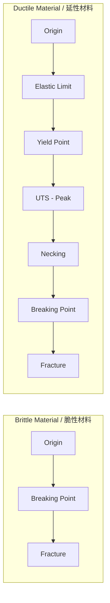
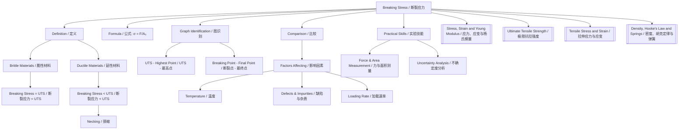

# Breaking Stress / 断裂应力

---

# 1. Overview / 概述

**English:**
Breaking stress is the maximum stress a material can withstand before it fractures or fails completely. This sub-topic explores the concept of breaking stress as the endpoint of material behaviour under tension, distinguishing it from other key points on a stress-strain graph such as the [[Ultimate Tensile Strength]] and the elastic limit. Understanding breaking stress is crucial for engineers and designers who must ensure that structural components never experience stresses approaching this failure point. This concept builds directly on [[Tensile Stress and Strain]] and connects to the broader understanding of [[Stress-Strain Graphs and Material Behaviour]].

**中文:**
断裂应力是材料在断裂或完全失效前所能承受的最大应力。本子知识点探讨断裂应力作为材料在拉伸下行为的终点概念，将其与应力-应变图上的其他关键点（如[[极限抗拉强度]]和弹性极限）区分开来。理解断裂应力对于工程师和设计师至关重要，他们必须确保结构部件永远不会承受接近这一失效点的应力。这一概念直接建立在[[拉伸应力与应变]]的基础上，并与[[应力-应变图与材料行为]]的更广泛理解相联系。

---

# 2. Syllabus Learning Objectives / 考纲学习目标

| CAIE 9702 | Edexcel IAL |
|-----------|-------------|
| 6.2(d): Define and use the terms breaking stress | WPH11 U1: 2.9: Understand the term breaking stress |
| 6.2(e): Describe the behaviour of materials under tension up to breaking point | WPH11 U1: 2.10: Interpret stress-strain graphs including breaking point |
| 6.2(g): Distinguish between brittle and ductile materials based on their stress-strain behaviour | WPH11 U1: 2.12: Compare brittle and ductile materials |

**Examiner Expectations / 考官期望:**
- **English:** Candidates must be able to define breaking stress precisely, identify it on stress-strain graphs, and distinguish it from ultimate tensile strength. They should understand that for brittle materials, breaking stress equals ultimate tensile strength, while for ductile materials, breaking stress is lower than ultimate tensile strength.
- **中文:** 考生必须能够精确定义断裂应力，在应力-应变图上识别它，并将其与极限抗拉强度区分开来。他们应理解对于脆性材料，断裂应力等于极限抗拉强度，而对于延性材料，断裂应力低于极限抗拉强度。

---

# 3. Core Definitions / 核心定义

| Term (EN/CN) | Definition (EN) | Definition (CN) | Common Mistakes / 常见错误 |
|--------------|-----------------|-----------------|---------------------------|
| **Breaking Stress** / 断裂应力 | The stress at which a material fractures or fails completely under tension | 材料在拉伸下断裂或完全失效时的应力 | Confusing with ultimate tensile strength — breaking stress is the final point of failure, not the maximum stress |
| **Fracture Point** / 断裂点 | The point on a stress-strain graph where the material breaks | 应力-应变图上材料断裂的点 | Thinking fracture always occurs at the highest point on the graph |
| **Brittle Material** / 脆性材料 | A material that fractures with little or no plastic deformation | 几乎没有或完全没有塑性变形就断裂的材料 | Assuming brittle materials are always weak — diamond is brittle but very strong |
| **Ductile Material** / 延性材料 | A material that undergoes significant plastic deformation before fracture | 在断裂前经历显著塑性变形的材料 | Confusing ductility with elasticity — ductile materials deform permanently |
| **Necking** / 颈缩 | The localised reduction in cross-sectional area that occurs in ductile materials before breaking | 延性材料在断裂前发生的横截面积局部减小 | Thinking necking occurs in all materials — it only occurs in ductile materials |

---

# 4. Key Concepts Explained / 关键概念详解

## 4.1 Breaking Stress vs Ultimate Tensile Strength / 断裂应力与极限抗拉强度

### Explanation / 解释
**English:**
Breaking stress and [[Ultimate Tensile Strength]] (UTS) are often confused but represent different points on a stress-strain graph. The UTS is the **maximum stress** a material can withstand — the highest point on the stress-strain curve. Breaking stress is the stress at which the material **actually fractures**. For **brittle materials** (e.g., glass, cast iron), these two values are identical because the material fractures immediately upon reaching its maximum stress with negligible plastic deformation. For **ductile materials** (e.g., copper, mild steel), the breaking stress is **lower** than the UTS because after reaching UTS, the material undergoes [[Necking]] — a localised reduction in cross-sectional area — which causes the engineering stress to decrease until fracture occurs.

**中文:**
断裂应力和[[极限抗拉强度]]（UTS）经常被混淆，但它们代表应力-应变图上的不同点。UTS是材料能承受的**最大应力**——应力-应变曲线的最高点。断裂应力是材料**实际断裂**时的应力。对于**脆性材料**（如玻璃、铸铁），这两个值相同，因为材料在达到最大应力时立即断裂，几乎没有塑性变形。对于**延性材料**（如铜、低碳钢），断裂应力**低于**UTS，因为在达到UTS后，材料经历[[颈缩]]——横截面积的局部减小——这导致工程应力下降，直到断裂发生。

### Physical Meaning / 物理意义
**English:**
Breaking stress represents the material's **failure limit** under tension. It is the stress at which interatomic bonds are overcome completely, causing the material to separate into two or more pieces. This is a critical design parameter — engineers must ensure that the maximum stress a component will ever experience is well below the breaking stress, typically using a [[Factor of Safety]].

**中文:**
断裂应力代表材料在拉伸下的**失效极限**。它是原子间键被完全克服的应力，导致材料分离成两块或多块。这是一个关键的设计参数——工程师必须确保部件将承受的最大应力远低于断裂应力，通常使用[[安全系数]]。

### Common Misconceptions / 常见误区
- **EN:** "Breaking stress is always the highest stress on the graph" — FALSE. For ductile materials, breaking stress is lower than UTS.
- **CN:** "断裂应力总是图上的最高应力"——错误。对于延性材料，断裂应力低于UTS。
- **EN:** "All materials neck before breaking" — FALSE. Only ductile materials neck; brittle materials fracture without necking.
- **CN:** "所有材料在断裂前都会颈缩"——错误。只有延性材料会颈缩；脆性材料断裂时没有颈缩。
- **EN:** "Breaking stress is the same as the elastic limit" — FALSE. Breaking stress is much higher than the elastic limit for most materials.
- **CN:** "断裂应力与弹性极限相同"——错误。对于大多数材料，断裂应力远高于弹性极限。

### Exam Tips / 考试提示
- **EN:** When asked to identify breaking stress on a graph, look for the **final point** where the curve ends — not necessarily the highest point.
- **CN:** 当被要求在图上识别断裂应力时，寻找曲线**结束的最终点**——不一定是最高点。
- **EN:** For brittle materials, remember: UTS = Breaking Stress. For ductile materials: UTS > Breaking Stress.
- **CN:** 对于脆性材料，记住：UTS = 断裂应力。对于延性材料：UTS > 断裂应力。

> 📷 **IMAGE PROMPT — BS-01: Comparison of Breaking Stress and UTS**
> A side-by-side comparison of two stress-strain graphs. Left: brittle material (glass) showing a straight line ending abruptly at the breaking point, with UTS and breaking stress labelled at the same point. Right: ductile material (mild steel) showing the full curve with elastic region, yield point, plastic region, UTS marked at the peak, necking region, and breaking stress marked at a lower point where the curve ends. Both axes labelled "Stress" (vertical) and "Strain" (horizontal). Clear labels and arrows pointing to UTS and breaking stress.

---

## 4.2 Factors Affecting Breaking Stress / 影响断裂应力的因素

### Explanation / 解释
**English:**
The breaking stress of a material is not a universal constant — it depends on several factors:

1. **Material composition**: Different materials have different atomic bonding strengths. Diamond has a very high breaking stress due to strong covalent bonds; chalk has a low breaking stress due to weak ionic bonds.
2. **Temperature**: Most materials become weaker at higher temperatures. Metals may have significantly lower breaking stress when heated.
3. **Impurities and defects**: Microscopic cracks, voids, or impurities can act as stress concentrators, dramatically reducing the breaking stress. This is why a small scratch on glass can cause it to break easily.
4. **Rate of loading**: Some materials (e.g., polymers) have different breaking stresses depending on how quickly the load is applied.
5. **Environmental conditions**: Moisture, UV radiation, or chemical exposure can degrade materials over time, reducing their breaking stress.

**中文:**
材料的断裂应力不是一个通用常数——它取决于几个因素：

1. **材料成分**：不同材料具有不同的原子键强度。金刚石由于强共价键而具有非常高的断裂应力；粉笔由于弱离子键而具有低断裂应力。
2. **温度**：大多数材料在较高温度下变得更弱。金属在加热时可能具有显著降低的断裂应力。
3. **杂质和缺陷**：微观裂纹、空洞或杂质可以作为应力集中点，显著降低断裂应力。这就是为什么玻璃上的小划痕会导致它容易断裂。
4. **加载速率**：一些材料（如聚合物）根据载荷施加的速度具有不同的断裂应力。
5. **环境条件**：湿气、紫外线辐射或化学暴露会随时间降解材料，降低其断裂应力。

### Physical Meaning / 物理意义
**English:**
The breaking stress is fundamentally determined by the **strength of interatomic bonds** and the **presence of defects**. Perfect crystals would have much higher breaking stresses than real materials because real materials always contain imperfections that concentrate stress.

**中文:**
断裂应力从根本上由**原子间键的强度**和**缺陷的存在**决定。完美晶体将具有比实际材料高得多的断裂应力，因为实际材料总是含有集中应力的缺陷。

### Common Misconceptions / 常见误区
- **EN:** "Breaking stress is a fixed property of a material" — FALSE. It varies with temperature, defects, and loading conditions.
- **CN:** "断裂应力是材料的固定属性"——错误。它随温度、缺陷和加载条件而变化。
- **EN:** "A larger sample always has a higher breaking stress" — FALSE. Breaking stress is stress (force/area), so it's independent of sample size. However, larger samples are more likely to contain defects.
- **CN:** "较大的样品总是具有较高的断裂应力"——错误。断裂应力是应力（力/面积），因此与样品尺寸无关。然而，较大的样品更可能含有缺陷。

### Exam Tips / 考试提示
- **EN:** Questions often ask why a material's breaking stress is lower than the theoretical value — answer: defects and impurities.
- **CN:** 问题经常问为什么材料的断裂应力低于理论值——答案：缺陷和杂质。

---

# 5. Essential Equations / 核心公式

## 5.1 Breaking Stress Formula / 断裂应力公式

$$ \sigma_{\text{breaking}} = \frac{F_{\text{breaking}}}{A_0} $$

| Symbol (符号) | Meaning (EN) | Meaning (CN) | Unit (单位) |
|--------------|-------------|-------------|------------|
| $\sigma_{\text{breaking}}$ | Breaking stress | 断裂应力 | Pa (or N m$^{-2}$) |
| $F_{\text{breaking}}$ | Force at which fracture occurs | 断裂时的力 | N |
| $A_0$ | Original cross-sectional area | 原始横截面积 | m$^2$ |

**Derivation / 推导:**
This is a direct application of the stress formula $\sigma = F/A$. Breaking stress uses the force at fracture and the original (undeformed) cross-sectional area.

**Conditions / 适用条件:**
- **EN:** The formula uses original cross-sectional area $A_0$, not the area after necking. This gives "engineering breaking stress". True stress at breaking would use the actual (reduced) area.
- **CN:** 该公式使用原始横截面积 $A_0$，而不是颈缩后的面积。这给出"工程断裂应力"。断裂时的真实应力将使用实际（减小）的面积。

**Limitations / 局限性:**
- **EN:** For ductile materials, the engineering breaking stress is lower than the true breaking stress because necking reduces the cross-sectional area. The formula does not account for this area reduction.
- **CN:** 对于延性材料，工程断裂应力低于真实断裂应力，因为颈缩减小了横截面积。该公式不考虑这种面积减小。

> 📋 **CIE Only:** CAIE 9702 expects candidates to use original cross-sectional area $A_0$ in all stress calculations, including breaking stress.

> 📋 **Edexcel Only:** Edexcel IAL also uses original cross-sectional area for engineering stress calculations.

---

# 6. Graphs and Relationships / 图表与关系

## 6.1 Stress-Strain Graph Showing Breaking Stress / 显示断裂应力的应力-应变图

### Axes / 坐标轴
- **X-axis:** Strain $\epsilon$ (dimensionless) / 应变 $\epsilon$（无量纲）
- **Y-axis:** Stress $\sigma$ (Pa) / 应力 $\sigma$（Pa）

### Shape / 形状
**English:**
The shape depends on material type:
- **Brittle material:** A nearly straight line from origin to breaking point. The curve ends abruptly at the breaking stress, which is also the UTS.
- **Ductile material:** A curve with elastic region, yield point, plastic region, peak (UTS), necking region (descending), and finally the breaking point at a lower stress than UTS.

**中文:**
形状取决于材料类型：
- **脆性材料：** 从原点到断裂点几乎是一条直线。曲线在断裂应力处突然结束，这也是UTS。
- **延性材料：** 曲线包括弹性区、屈服点、塑性区、峰值（UTS）、颈缩区（下降），最后是应力低于UTS的断裂点。

### Gradient Meaning / 斜率含义
- **EN:** The gradient at any point represents the [[Young Modulus Definition and Formula|Young Modulus]] in the elastic region. In the plastic region, the gradient is not constant and does not represent Young Modulus.
- **CN:** 在弹性区，任何点的斜率代表[[杨氏模量的定义与公式|杨氏模量]]。在塑性区，斜率不是常数，不代表杨氏模量。

### Area Meaning / 面积含义
- **EN:** The total area under the stress-strain curve up to the breaking point represents the **energy absorbed per unit volume** before fracture (toughness).
- **CN:** 应力-应变曲线下直到断裂点的总面积代表断裂前**每单位体积吸收的能量**（韧性）。

### Exam Interpretation / 考试解读
- **EN:** Be able to identify the breaking point on a graph and compare it to UTS. For brittle materials, these coincide; for ductile materials, breaking stress < UTS.
- **CN:** 能够在图上识别断裂点并将其与UTS进行比较。对于脆性材料，它们重合；对于延性材料，断裂应力 < UTS。

> 📷 **IMAGE PROMPT — BS-02: Stress-Strain Graph with Breaking Stress Labelled**
> A clear stress-strain graph for a ductile material (mild steel). The curve shows: linear elastic region from origin to point A (elastic limit), slight curve to point B (yield point), rising curve to point C (UTS - marked as highest point), descending curve to point D (breaking stress - marked where curve ends). The region between C and D is labelled "Necking". A second curve (dashed line) for a brittle material (glass) shows a straight line from origin to point E (breaking stress = UTS). Both axes labelled with units. Clear arrows and text labels for all key points.

---

# 7. Required Diagrams / 必备图表

## 7.1 Breaking Stress on Stress-Strain Curves / 应力-应变曲线上的断裂应力

### Description / 描述
**English:**
A comparative diagram showing stress-strain curves for a brittle material (e.g., glass or cast iron) and a ductile material (e.g., mild steel or copper), with the breaking stress clearly marked on each curve. The diagram should highlight that for brittle materials, breaking stress equals UTS, while for ductile materials, breaking stress is lower than UTS and occurs after necking.

**中文:**
一个比较图，显示脆性材料（如玻璃或铸铁）和延性材料（如低碳钢或铜）的应力-应变曲线，每条曲线上的断裂应力清晰标注。该图应突出显示对于脆性材料，断裂应力等于UTS，而对于延性材料，断裂应力低于UTS并发生在颈缩之后。

### Image Prompt / 图片生成提示
> 📷 **IMAGE PROMPT — BS-03: Comparative Breaking Stress Diagram**
> A professional scientific diagram with two stress-strain curves on the same axes. Left curve: brittle material (labelled "Brittle (e.g., Glass)") showing a steep straight line ending abruptly at a point labelled "Breaking Stress = UTS". Right curve: ductile material (labelled "Ductile (e.g., Mild Steel)") showing elastic region, yield point, plastic region, peak labelled "UTS", descending necking region, and final point labelled "Breaking Stress". A horizontal dashed line connects the UTS peak to the y-axis, and another dashed line connects the breaking stress to the y-axis, showing that breaking stress is lower. The area between UTS and breaking stress is shaded and labelled "Necking Region". Axes: Stress (MPa) on y-axis, Strain on x-axis. Clean, textbook-quality style with clear labels.

### Labels Required / 需要标注
| Label (EN) | Label (CN) |
|------------|------------|
| Breaking Stress | 断裂应力 |
| Ultimate Tensile Strength (UTS) | 极限抗拉强度 |
| Necking Region | 颈缩区 |
| Brittle Material | 脆性材料 |
| Ductile Material | 延性材料 |
| Fracture Point | 断裂点 |

### Exam Importance / 考试重要性
- **EN:** High — this diagram is frequently tested in both CAIE and Edexcel exams. Candidates must be able to draw, label, and interpret these curves.
- **CN:** 高——该图在CAIE和Edexcel考试中经常被测试。考生必须能够绘制、标注和解释这些曲线。

---

## 7.2 Necking in Ductile Materials / 延性材料中的颈缩

### Description / 描述
**English:**
A diagram showing a ductile material sample (e.g., a metal wire or rod) being pulled in tension. The diagram should illustrate the phenomenon of necking — a localised reduction in cross-sectional area that occurs after the UTS is reached, leading to eventual fracture at the breaking stress.

**中文:**
一个显示延性材料样品（如金属丝或棒）被拉伸的图。该图应说明颈缩现象——在达到UTS后发生的横截面积局部减小，最终导致在断裂应力处断裂。

### Image Prompt / 图片生成提示
> 📷 **IMAGE PROMPT — BS-04: Necking Diagram**
> A three-stage diagram showing a cylindrical metal sample under tension. Stage 1 (left): uniform deformation with arrows showing tensile forces applied at both ends. Stage 2 (centre): the sample shows a narrow region in the middle where the diameter has reduced (necking), with arrows still applied. Stage 3 (right): the sample has fractured at the necked region, showing two pieces with jagged ends. Labels: "Original Sample", "Necking Begins", "Fracture at Breaking Stress". Cross-sectional views below each stage showing the area reduction. Clean engineering-style diagram with dimensions and force arrows.

### Labels Required / 需要标注
| Label (EN) | Label (CN) |
|------------|------------|
| Original Cross-Sectional Area $A_0$ | 原始横截面积 $A_0$ |
| Necked Region | 颈缩区 |
| Reduced Area $A_{\text{neck}}$ | 减小面积 $A_{\text{neck}}$ |
| Tensile Force $F$ | 拉伸力 $F$ |
| Fracture Surface | 断裂面 |

### Exam Importance / 考试重要性
- **EN:** Medium — understanding necking helps explain why breaking stress is lower than UTS for ductile materials.
- **CN:** 中——理解颈缩有助于解释为什么对于延性材料，断裂应力低于UTS。

---

# 8. Worked Examples / 典型例题

## Example 1: Identifying Breaking Stress on a Graph / 例1：在图上识别断裂应力

### Question / 题目
**English:**
A stress-strain graph for a copper wire shows the following key points:
- Elastic limit: 200 MPa
- Yield point: 250 MPa
- Ultimate tensile strength: 400 MPa
- Breaking stress: 320 MPa

(a) What is the maximum stress the wire can withstand?
(b) At what stress does the wire actually break?
(c) Explain why the breaking stress is lower than the UTS.

**中文:**
一根铜线的应力-应变图显示以下关键点：
- 弹性极限：200 MPa
- 屈服点：250 MPa
- 极限抗拉强度：400 MPa
- 断裂应力：320 MPa

(a) 导线能承受的最大应力是多少？
(b) 导线实际断裂时的应力是多少？
(c) 解释为什么断裂应力低于UTS。

### Solution / 解答

**(a) Maximum stress / 最大应力:**
**English:**
The maximum stress is the Ultimate Tensile Strength (UTS) = 400 MPa. This is the highest point on the stress-strain curve.

**中文:**
最大应力是极限抗拉强度（UTS）= 400 MPa。这是应力-应变曲线上的最高点。

**(b) Breaking stress / 断裂应力:**
**English:**
The wire actually breaks at the breaking stress = 320 MPa. This is the stress at which the curve ends (fracture occurs).

**中文:**
导线实际断裂时的应力是断裂应力 = 320 MPa。这是曲线结束（断裂发生）时的应力。

**(c) Explanation / 解释:**
**English:**
After reaching the UTS (400 MPa), the copper wire undergoes [[Necking]] — a localised reduction in cross-sectional area. Although the actual force required to continue stretching decreases, the engineering stress (calculated using the original cross-sectional area $A_0$) also decreases. The wire continues to stretch with decreasing stress until it finally fractures at 320 MPa.

**中文:**
在达到UTS（400 MPa）后，铜线经历[[颈缩]]——横截面积的局部减小。尽管继续拉伸所需的实际力减小，但工程应力（使用原始横截面积 $A_0$ 计算）也减小。导线继续以递减的应力拉伸，直到最终在320 MPa处断裂。

### Final Answer / 最终答案
**Answer:** (a) 400 MPa (UTS) | (b) 320 MPa (Breaking Stress) | (c) Necking reduces cross-sectional area after UTS, causing engineering stress to decrease.
**答案：** (a) 400 MPa (UTS) | (b) 320 MPa (断裂应力) | (c) 颈缩在UTS后减小横截面积，导致工程应力下降。

### Quick Tip / 提示
- **EN:** Remember: UTS = highest point on graph; Breaking Stress = final point on graph.
- **CN:** 记住：UTS = 图上的最高点；断裂应力 = 图上的最终点。

---

## Example 2: Calculating Breaking Stress / 例2：计算断裂应力

### Question / 题目
**English:**
A steel rod with an original cross-sectional area of $2.0 \times 10^{-5} \text{ m}^2$ breaks when a tensile force of 8000 N is applied. Calculate the breaking stress of the steel.

**中文:**
一根原始横截面积为 $2.0 \times 10^{-5} \text{ m}^2$ 的钢棒在施加8000 N的拉伸力时断裂。计算钢的断裂应力。

### Solution / 解答

**Step 1: Identify the formula / 步骤1：确定公式**

$$ \sigma_{\text{breaking}} = \frac{F_{\text{breaking}}}{A_0} $$

**Step 2: Substitute values / 步骤2：代入数值**

$$ \sigma_{\text{breaking}} = \frac{8000}{2.0 \times 10^{-5}} $$

**Step 3: Calculate / 步骤3：计算**

$$ \sigma_{\text{breaking}} = 4.0 \times 10^8 \text{ Pa} = 400 \text{ MPa} $$

### Final Answer / 最终答案
**Answer:** $\sigma_{\text{breaking}} = 4.0 \times 10^8 \text{ Pa}$ (or 400 MPa) | **答案：** $\sigma_{\text{breaking}} = 4.0 \times 10^8 \text{ Pa}$（或400 MPa）

### Quick Tip / 提示
- **EN:** Always use the **original** cross-sectional area $A_0$, not the area after deformation. Breaking stress is an engineering stress.
- **CN:** 始终使用**原始**横截面积 $A_0$，而不是变形后的面积。断裂应力是工程应力。

---

# 9. Past Paper Question Types / 历年真题题型

| Question Type / 题型 | Frequency / 频率 | Difficulty / 难度 | Past Paper References / 真题索引 |
|----------------------|------------------|------------------|-------------------------------|
| Define breaking stress | High | Easy | 📝 *待填入* |
| Identify breaking stress on a stress-strain graph | High | Medium | 📝 *待填入* |
| Compare breaking stress for brittle vs ductile materials | Medium | Medium | 📝 *待填入* |
| Calculate breaking stress from force and area | Medium | Easy | 📝 *待填入* |
| Explain why breaking stress < UTS for ductile materials | Medium | Medium | 📝 *待填入* |
| Factors affecting breaking stress | Low | Medium | 📝 *待填入* |

**Common Command Words / 常见指令词:**
- **EN:** Define, State, Calculate, Determine, Explain, Compare, Sketch, Label
- **CN:** 定义、陈述、计算、确定、解释、比较、绘制、标注

---

# 10. Practical Skills Connections / 实验技能链接

**English:**
Breaking stress is typically determined experimentally as part of the [[Experimental Determination of Young Modulus]] practical. Key practical skills include:

1. **Measurement of breaking force**: Using a force sensor or spring balance to measure the maximum force before fracture.
2. **Measurement of original cross-sectional area**: Using a micrometer screw gauge to measure diameter, then calculating $A_0 = \pi r^2$.
3. **Uncertainty analysis**: Breaking stress uncertainty combines uncertainties in force measurement and area measurement.
   - $\frac{\Delta \sigma}{\sigma} = \frac{\Delta F}{F} + 2\frac{\Delta d}{d}$ (since $A \propto d^2$)
4. **Safety considerations**: When testing to breaking, samples may snap violently. Safety screens should be used.
5. **Graph plotting**: Plotting stress-strain curves up to the breaking point requires careful data collection in the plastic region.

**中文:**
断裂应力通常作为[[杨氏模量的实验测定]]实验的一部分通过实验确定。关键实验技能包括：

1. **断裂力的测量**：使用力传感器或弹簧秤测量断裂前的最大力。
2. **原始横截面积的测量**：使用千分尺测量直径，然后计算 $A_0 = \pi r^2$。
3. **不确定度分析**：断裂应力的不确定度结合了力测量和面积测量的不确定度。
   - $\frac{\Delta \sigma}{\sigma} = \frac{\Delta F}{F} + 2\frac{\Delta d}{d}$（因为 $A \propto d^2$）
4. **安全考虑**：当测试到断裂时，样品可能会突然断裂。应使用安全屏。
5. **图表绘制**：绘制直到断裂点的应力-应变曲线需要在塑性区仔细收集数据。

---

# 11. Concept Map / 概念图谱

---

# 12. Quick Revision Sheet / 速查表

| Category / 类别 | Key Points / 要点 |
|----------------|------------------|
| **Definition / 定义** | Stress at which material fractures / 材料断裂时的应力 |
| **Key Formula / 核心公式** | $\sigma_{\text{breaking}} = F_{\text{breaking}} / A_0$ |
| **Brittle Materials / 脆性材料** | Breaking Stress = UTS; no necking; sudden fracture / 断裂应力 = UTS；无颈缩；突然断裂 |
| **Ductile Materials / 延性材料** | Breaking Stress < UTS; necking occurs; gradual fracture / 断裂应力 < UTS；发生颈缩；逐渐断裂 |
| **Key Graph / 核心图表** | Stress-strain curve: breaking point is where curve ends / 应力-应变曲线：断裂点是曲线结束处 |
| **Common Mistake / 常见错误** | Confusing breaking stress with UTS — they are different for ductile materials / 混淆断裂应力与UTS——对于延性材料它们不同 |
| **Exam Tip / 考试提示** | On graphs: UTS = highest point; Breaking Stress = final point / 在图上：UTS = 最高点；断裂应力 = 最终点 |
| **Practical Skill / 实验技能** | Measure breaking force and original cross-sectional area; calculate uncertainty / 测量断裂力和原始横截面积；计算不确定度 |
| **Key Comparison / 关键比较** | Brittle: breaks at UTS with no warning / Ductile: necks then breaks at lower stress / 脆性：在UTS处断裂，无预警 / 延性：颈缩后在较低应力处断裂 |
| **Safety / 安全** | Use safety screens when testing materials to breaking / 测试材料至断裂时使用安全屏 |

---

> 📋 **CIE Only:** CAIE 9702 Paper 2 and Paper 4 frequently include questions on identifying breaking stress from stress-strain graphs and comparing brittle vs ductile materials.

> 📋 **Edexcel Only:** Edexcel IAL Unit 1 often tests breaking stress in the context of material selection for engineering applications.