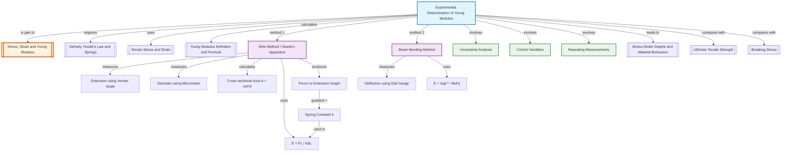

# 1. Overview / 概述

**English:**
This sub-topic focuses on the **practical methods** used to determine the Young modulus of a material, primarily through two classic experiments: the **wire method** (for materials like copper or steel) and the **beam bending method** (for materials like wood or plastic). Understanding these experiments is crucial because the Young modulus is a fundamental material property that describes stiffness, and its accurate measurement is essential in engineering and materials science. This leaf node connects the theoretical definition of [[Young Modulus Definition and Formula]] to real-world measurement techniques, building on prerequisite knowledge of [[Density, Hooke's Law and Springs]] and [[Tensile Stress and Stress]]. Mastery of these experimental setups is directly tested in both CAIE Paper 3 (Practical) and Edexcel Paper 1 (Theory and Practical).

**中文:**
本子知识点专注于测定材料杨氏模量的**实验方法**，主要通过两个经典实验：**金属丝法**（适用于铜或钢等材料）和**梁弯曲法**（适用于木材或塑料等材料）。理解这些实验至关重要，因为杨氏模量是描述刚度的基本材料属性，其准确测量在工程和材料科学中必不可少。本叶节点将[[Young Modulus Definition and Formula]]的理论定义与实际测量技术联系起来，建立在[[Density, Hooke's Law and Springs]]和[[Tensile Stress and Stress]]等先决知识之上。掌握这些实验装置在CAIE Paper 3（实验）和Edexcel Paper 1（理论和实验）中都有直接考查。

---

# 2. Syllabus Learning Objectives / 考纲学习目标

| CAIE 9702 (6.2 a-g) | Edexcel IAL (WPH11 U1: 2.7-2.12) |
|---------------------|----------------------------------|
| Describe an experiment to determine the Young modulus of a metal wire | Describe an experiment to determine the Young modulus of a material |
| Identify and control variables in the experiment | Identify sources of uncertainty and suggest improvements |
| Calculate the Young modulus from experimental data | Use stress-strain graphs to determine Young modulus |
| Evaluate the accuracy of the experiment | Describe the use of a Searle's apparatus |

**Examiner Expectations / 考官期望:**
- **English:** You must be able to describe the experimental setup in detail, including the use of a **vernier scale** or **micrometer screw gauge** for measuring extension, and a **travelling microscope** for measuring diameter. You must also be able to calculate the Young modulus from raw data, identify sources of error, and suggest improvements.
- **中文:** 你必须能够详细描述实验装置，包括使用**游标卡尺**或**螺旋测微器**测量伸长量，以及使用**读数显微镜**测量直径。你还必须能够从原始数据计算杨氏模量，识别误差来源，并提出改进建议。

---

# 3. Core Definitions / 核心定义

| Term (EN/CN) | Definition (EN) | Definition (CN) | Common Mistakes / 常见错误 |
|--------------|-----------------|-----------------|---------------------------|
| **Searle's Apparatus** / 西尔装置 | A device used to measure the extension of a wire under tension, typically using a vernier scale for precise measurement. | 用于测量金属丝在张力下伸长量的装置，通常使用游标尺进行精确测量。 | Confusing it with a simple spring balance. |
| **Vernier Scale** / 游标尺 | A secondary scale that slides along a main scale, allowing measurement to a fraction of the smallest main scale division (typically 0.01 mm or 0.001 cm). | 沿主尺滑动的辅助刻度，允许测量到主尺最小分度的一部分（通常为0.01毫米或0.001厘米）。 | Forgetting to read the zero error before use. |
| **Micrometer Screw Gauge** / 螺旋测微器 | A precision instrument for measuring small diameters (e.g., wire diameter) to 0.01 mm, using a screw mechanism. | 使用螺旋机构测量小直径（如金属丝直径）至0.01毫米的精密仪器。 | Not checking for zero error or using the ratchet incorrectly. |
| **Travelling Microscope** / 读数显微镜 | A microscope mounted on a calibrated traverse, used to measure small distances (e.g., wire diameter) accurately. | 安装在校准导轨上的显微镜，用于精确测量小距离（如金属丝直径）。 | Misaligning the crosshairs with the wire edge. |
| **Extension** / 伸长量 | The increase in length of a wire when a load is applied, measured as the difference between the loaded and unloaded lengths. | 施加负载时金属丝长度的增加量，测量为加载和卸载长度之差。 | Confusing extension with total length. |
| **Control Variable** / 控制变量 | A variable kept constant during an experiment to ensure a fair test (e.g., temperature, wire material). | 在实验过程中保持不变的变量，以确保公平测试（如温度、金属丝材料）。 | Not identifying that temperature must be controlled. |

---

# 4. Key Concepts Explained / 关键概念详解

## 4.1 The Wire Method (Searle's Apparatus) / 金属丝法（西尔装置）

### Explanation / 解释
**English:** The most common A-Level experiment uses a long, thin wire (typically 2-3 m of copper or steel) suspended vertically. A known mass is hung from the wire, and the extension is measured using a **vernier scale** attached to the wire. The wire's diameter is measured using a **micrometer screw gauge** or **travelling microscope** at several points along its length to account for non-uniformity. The experiment is repeated with increasing loads, and a graph of load (force) vs. extension is plotted. The Young modulus is calculated from the gradient of this graph using the formula $E = \frac{FL}{A\Delta L}$, where $F$ is the force, $L$ is the original length, $A$ is the cross-sectional area, and $\Delta L$ is the extension. This method is directly linked to [[Young Modulus Definition and Formula]].

**中文:** 最常见的A-Level实验使用一根长而细的金属丝（通常为2-3米的铜丝或钢丝）垂直悬挂。将已知质量挂在金属丝上，使用连接到金属丝的**游标尺**测量伸长量。使用**螺旋测微器**或**读数显微镜**沿金属丝长度在多个点测量直径，以考虑不均匀性。逐渐增加负载重复实验，绘制负载（力）与伸长量的关系图。使用公式 $E = \frac{FL}{A\Delta L}$ 从图的斜率计算杨氏模量，其中 $F$ 是力，$L$ 是原始长度，$A$ 是横截面积，$\Delta L$ 是伸长量。此方法直接与[[Young Modulus Definition and Formula]]相关。

### Physical Meaning / 物理意义
**English:** The experiment directly measures how much a material stretches under a known force, allowing us to calculate its stiffness (Young modulus). A steeper gradient on the force-extension graph indicates a higher Young modulus (stiffer material).
**中文:** 该实验直接测量材料在已知力下的拉伸程度，从而计算其刚度（杨氏模量）。力-伸长量图上斜率越大，表示杨氏模量越高（材料越硬）。

### Common Misconceptions / 常见误区
- **English:** Students often think the wire's diameter is uniform; it is not, so multiple measurements are needed.
- **中文:** 学生常认为金属丝直径是均匀的；实际上并非如此，因此需要多次测量。
- **English:** Confusing the original length $L$ with the extension $\Delta L$.
- **中文:** 混淆原始长度 $L$ 和伸长量 $\Delta L$。
- **English:** Forgetting to include the weight of the hanger in the force calculation.
- **中文:** 忘记将挂钩的重量计入力的计算。

### Exam Tips / 考试提示
- **English:** Always mention using a **vernier scale** or **micrometer** for precision. State that the wire must be **straightened** before measurement (by hanging a small initial load). Plot a graph of **force vs. extension** and use the gradient.
- **中文:** 务必提及使用**游标尺**或**螺旋测微器**以提高精度。说明测量前必须**拉直**金属丝（通过悬挂一个小的初始负载）。绘制**力与伸长量**的关系图并使用斜率。

> 📷 **IMAGE PROMPT — DIAGRAM-01: Searle's Apparatus Setup**
> A detailed diagram of Searle's apparatus for measuring Young modulus. Show a vertical wire (copper or steel) clamped at the top, with a weight hanger at the bottom. A vernier scale is attached to the wire near the bottom, with a fixed reference scale. Labels: "Wire", "Clamp", "Vernier Scale", "Weight Hanger", "Reference Scale". The wire should be shown as thin and straight. Style: clean, educational diagram with clear labels, suitable for an A-Level physics textbook.

---

## 4.2 The Beam Bending Method / 梁弯曲法

### Explanation / 解释
**English:** An alternative method for materials that are difficult to stretch (e.g., wood, plastic). A beam of the material is supported at both ends, and a load is applied at the center. The **deflection** (sag) of the beam is measured. The Young modulus is calculated using the formula $E = \frac{mgL^3}{4bd^3y}$, where $m$ is the mass, $L$ is the distance between supports, $b$ is the beam width, $d$ is the beam depth, and $y$ is the deflection. This method is less common in A-Level but appears in some Edexcel contexts.
**中文:** 一种适用于难以拉伸的材料（如木材、塑料）的替代方法。将材料制成的梁两端支撑，在中心施加负载。测量梁的**挠度**（下垂量）。使用公式 $E = \frac{mgL^3}{4bd^3y}$ 计算杨氏模量，其中 $m$ 是质量，$L$ 是支撑间距，$b$ 是梁宽，$d$ 是梁深，$y$ 是挠度。此方法在A-Level中不太常见，但在某些Edexcel背景下会出现。

### Physical Meaning / 物理意义
**English:** The beam bending method measures how much a material sags under a load, which depends on its stiffness. A smaller deflection for the same load indicates a higher Young modulus.
**中文:** 梁弯曲法测量材料在负载下的下垂程度，这取决于其刚度。相同负载下挠度越小，表示杨氏模量越高。

### Common Misconceptions / 常见误区
- **English:** Confusing beam width $b$ with beam depth $d$ in the formula.
- **中文:** 在公式中混淆梁宽 $b$ 和梁深 $d$。
- **English:** Thinking the method is only for metals; it is actually for non-metals.
- **中文:** 认为该方法仅适用于金属；实际上它适用于非金属。

### Exam Tips / 考试提示
- **English:** Know the formula and which variable each symbol represents. The deflection $y$ is measured using a **dial gauge** or **travelling microscope**.
- **中文:** 记住公式以及每个符号代表的变量。使用**千分表**或**读数显微镜**测量挠度 $y$。

> 📷 **IMAGE PROMPT — DIAGRAM-02: Beam Bending Setup**
> A diagram showing a beam (rectangular cross-section) supported at both ends on knife edges. A load (mass) is applied at the center of the beam. A dial gauge is placed under the center to measure deflection. Labels: "Beam", "Knife Edge Support", "Load (Mass)", "Dial Gauge", "Deflection y". Style: simple, clear, educational diagram for A-Level physics.

---

# 5. Essential Equations / 核心公式

## 5.1 Young Modulus from Wire Experiment / 金属丝实验的杨氏模量

$$ E = \frac{FL}{A\Delta L} $$

| Symbol (符号) | Meaning (EN) | Meaning (CN) | Unit (单位) |
|--------------|-------------|-------------|------------|
| $E$ | Young modulus | 杨氏模量 | Pa (N m$^{-2}$) |
| $F$ | Applied force (weight of mass) | 施加的力（质量的重力） | N |
| $L$ | Original length of wire | 金属丝原始长度 | m |
| $A$ | Cross-sectional area of wire ($\pi r^2$ or $\pi d^2/4$) | 金属丝横截面积 | m$^2$ |
| $\Delta L$ | Extension of wire | 金属丝伸长量 | m |

**Derivation / 推导:**
From the definitions: $\sigma = \frac{F}{A}$ and $\epsilon = \frac{\Delta L}{L}$. Since $E = \frac{\sigma}{\epsilon}$, substituting gives $E = \frac{F/A}{\Delta L/L} = \frac{FL}{A\Delta L}$.

**Conditions / 适用条件:**
- **English:** The wire must be within its **elastic limit** (Hooke's law applies). The wire must be **straight** before loading. Temperature must be constant.
- **中文:** 金属丝必须在其**弹性极限**内（胡克定律适用）。加载前金属丝必须**拉直**。温度必须恒定。

**Limitations / 局限性:**
- **English:** The wire may have non-uniform diameter; the extension is very small and difficult to measure accurately; the wire may undergo plastic deformation if overloaded.
- **中文:** 金属丝直径可能不均匀；伸长量非常小，难以精确测量；如果过载，金属丝可能发生塑性变形。

## 5.2 Young Modulus from Beam Bending / 梁弯曲法的杨氏模量

$$ E = \frac{mgL^3}{4bd^3y} $$

| Symbol (符号) | Meaning (EN) | Meaning (CN) | Unit (单位) |
|--------------|-------------|-------------|------------|
| $m$ | Applied mass | 施加的质量 | kg |
| $g$ | Acceleration due to gravity | 重力加速度 | m s$^{-2}$ |
| $L$ | Distance between supports | 支撑间距 | m |
| $b$ | Width of beam | 梁的宽度 | m |
| $d$ | Depth of beam | 梁的深度 | m |
| $y$ | Deflection at center | 中心挠度 | m |

**Conditions / 适用条件:**
- **English:** The beam must be **simply supported** (free to rotate at ends). The deflection must be small compared to the beam length. The material must be homogeneous and isotropic.
- **中文:** 梁必须**简支**（两端可自由旋转）。挠度必须远小于梁的长度。材料必须均匀且各向同性。

**Limitations / 局限性:**
- **English:** The formula assumes the beam has a rectangular cross-section. The deflection is very small for stiff materials, requiring precise measurement.
- **中文:** 该公式假设梁具有矩形横截面。对于刚性材料，挠度非常小，需要精确测量。

---

# 6. Graphs and Relationships / 图表与关系

## 6.1 Force vs. Extension Graph (Wire Method) / 力-伸长量图（金属丝法）

### Axes / 坐标轴
- **X-axis:** Extension $\Delta L$ (m) / 伸长量 $\Delta L$ (米)
- **Y-axis:** Force $F$ (N) / 力 $F$ (牛顿)

### Shape / 形状
- **English:** A straight line through the origin (if within elastic limit). The gradient is $k = \frac{F}{\Delta L}$, which is the **spring constant** of the wire.
- **中文:** 通过原点的直线（如果在弹性极限内）。斜率为 $k = \frac{F}{\Delta L}$，即金属丝的**劲度系数**。

### Gradient Meaning / 斜率含义
- **English:** The gradient $k = \frac{F}{\Delta L}$ is the spring constant. The Young modulus is then $E = \frac{kL}{A}$.
- **中文:** 斜率 $k = \frac{F}{\Delta L}$ 是劲度系数。杨氏模量为 $E = \frac{kL}{A}$。

### Area Meaning / 面积含义
- **English:** The area under the force-extension graph represents the **work done** (energy stored) in the wire, equal to $\frac{1}{2}F\Delta L$.
- **中文:** 力-伸长量图下的面积表示对金属丝所做的**功**（储存的能量），等于 $\frac{1}{2}F\Delta L$。

### Exam Interpretation / 考试解读
- **English:** If the graph is linear, the material obeys Hooke's law. If it curves, the elastic limit has been exceeded. The gradient is used to calculate $E$.
- **中文:** 如果图形是线性的，则材料遵循胡克定律。如果弯曲，则已超过弹性极限。使用斜率计算 $E$。

> 📷 **IMAGE PROMPT — GRAPH-01: Force vs Extension for Wire**
> A graph showing Force (N) on the y-axis and Extension (m) on the x-axis. A straight line passes through the origin with a positive gradient. The line is labeled "Elastic Region". A dashed line shows the point where the graph starts to curve (elastic limit). Labels: "Gradient = k = F/ΔL", "Elastic Limit". Style: clean, labeled graph for A-Level physics.

---

# 7. Required Diagrams / 必备图表

## 7.1 Searle's Apparatus Diagram / 西尔装置图

### Description / 描述
**English:** A detailed diagram of Searle's apparatus showing a vertical wire clamped at the top, with a weight hanger at the bottom. A vernier scale is attached to the wire near the bottom, and a fixed reference scale is mounted on the frame. The wire's diameter is measured using a micrometer screw gauge.
**中文:** 西尔装置的详细图，显示垂直金属丝顶部夹紧，底部有挂钩。游标尺连接到金属丝底部附近，固定参考刻度安装在框架上。使用螺旋测微器测量金属丝直径。

### Image Prompt / 图片生成提示
> 📷 **IMAGE PROMPT — DIAGRAM-03: Searle's Apparatus with Labels**
> A detailed, labeled diagram of Searle's apparatus for A-Level physics. Show a long vertical wire (copper) clamped at the top to a rigid support. At the bottom, a weight hanger with a mass. A vernier scale is attached to the wire just above the hanger, sliding against a fixed scale. A reference mark on the wire indicates the initial position. Include a separate inset showing a micrometer screw gauge measuring the wire diameter. Labels: "Wire", "Clamp", "Vernier Scale", "Fixed Scale", "Weight Hanger", "Mass", "Reference Mark", "Micrometer Screw Gauge". Style: clear, educational, with a white background and precise lines.

### Labels Required / 需要标注
- **English:** Wire, Clamp, Vernier Scale, Fixed Scale, Weight Hanger, Mass, Reference Mark, Micrometer Screw Gauge
- **中文:** 金属丝、夹子、游标尺、固定刻度、挂钩、质量、参考标记、螺旋测微器

### Exam Importance / 考试重要性
- **English:** This diagram is frequently asked in both CAIE and Edexcel exams. You must be able to draw and label it from memory.
- **中文:** 该图在CAIE和Edexcel考试中经常出现。你必须能够凭记忆绘制并标注。

---

## 7.2 Beam Bending Setup Diagram / 梁弯曲装置图

### Description / 描述
**English:** A diagram showing a rectangular beam supported at both ends on knife edges. A load is applied at the center, and a dial gauge measures the deflection at the center.
**中文:** 显示矩形梁两端由刀口支撑的图。在中心施加负载，千分表测量中心的挠度。

### Image Prompt / 图片生成提示
> 📷 **IMAGE PROMPT — DIAGRAM-04: Beam Bending Setup**
> A diagram of a beam bending experiment. A rectangular beam (wood or plastic) rests on two knife-edge supports at its ends. A mass is placed on a hanger at the center of the beam. A dial gauge is positioned under the center of the beam, with its plunger touching the beam. Labels: "Beam", "Knife Edge Support", "Mass", "Dial Gauge", "Deflection y". Style: simple, clear, educational diagram for A-Level physics.

### Labels Required / 需要标注
- **English:** Beam, Knife Edge Support, Mass, Dial Gauge, Deflection y
- **中文:** 梁、刀口支撑、质量、千分表、挠度 y

### Exam Importance / 考试重要性
- **English:** Less common than Searle's apparatus, but appears in Edexcel papers. Know the formula and setup.
- **中文:** 不如西尔装置常见，但出现在Edexcel试卷中。记住公式和装置。

---

# 8. Worked Examples / 典型例题

## Example 1: Wire Method Calculation / 金属丝法计算

### Question / 题目
**English:**
A copper wire of original length 2.50 m and diameter 0.38 mm is used in a Searle's apparatus experiment. When a mass of 5.00 kg is hung from the wire, the extension is measured as 1.20 mm. Calculate the Young modulus of copper. (Take $g = 9.81 \text{ m s}^{-2}$)

**中文:**
一根原始长度为2.50米、直径为0.38毫米的铜丝用于西尔装置实验。当悬挂5.00千克的质量时，测得伸长量为1.20毫米。计算铜的杨氏模量。（取 $g = 9.81 \text{ m s}^{-2}$）

### Solution / 解答

**Step 1: Calculate the force / 计算力**
$$ F = mg = 5.00 \times 9.81 = 49.05 \text{ N} $$

**Step 2: Calculate the cross-sectional area / 计算横截面积**
$$ A = \frac{\pi d^2}{4} = \frac{\pi \times (0.38 \times 10^{-3})^2}{4} = \frac{\pi \times 1.444 \times 10^{-7}}{4} = 1.134 \times 10^{-7} \text{ m}^2 $$

**Step 3: Convert extension to meters / 将伸长量转换为米**
$$ \Delta L = 1.20 \text{ mm} = 1.20 \times 10^{-3} \text{ m} $$

**Step 4: Apply the Young modulus formula / 应用杨氏模量公式**
$$ E = \frac{FL}{A\Delta L} = \frac{49.05 \times 2.50}{(1.134 \times 10^{-7}) \times (1.20 \times 10^{-3})} $$

**Step 5: Calculate / 计算**
$$ E = \frac{122.625}{1.361 \times 10^{-10}} = 9.01 \times 10^{10} \text{ Pa} $$

### Final Answer / 最终答案
**Answer:** $E = 9.01 \times 10^{10} \text{ Pa}$ (or 90.1 GPa) | **答案：** $E = 9.01 \times 10^{10} \text{ 帕}$（或 90.1 吉帕）

### Quick Tip / 提示
- **English:** Always convert all measurements to SI units (meters, kilograms) before calculation. Check that the diameter is in meters, not mm.
- **中文:** 计算前务必将所有测量值转换为SI单位（米、千克）。检查直径是否以米为单位，而非毫米。

---

## Example 2: Beam Bending Method / 梁弯曲法

### Question / 题目
**English:**
A wooden beam of width 20 mm and depth 10 mm is supported on knife edges 1.00 m apart. When a mass of 2.00 kg is placed at the center, the deflection is measured as 5.00 mm. Calculate the Young modulus of the wood. (Take $g = 9.81 \text{ m s}^{-2}$)

**中文:**
一根宽20毫米、深10毫米的木梁支撑在相距1.00米的刀口上。当在中心放置2.00千克的质量时，测得挠度为5.00毫米。计算木材的杨氏模量。（取 $g = 9.81 \text{ m s}^{-2}$）

### Solution / 解答

**Step 1: Convert all measurements to SI units / 将所有测量值转换为SI单位**
$$ b = 20 \text{ mm} = 0.020 \text{ m} $$
$$ d = 10 \text{ mm} = 0.010 \text{ m} $$
$$ y = 5.00 \text{ mm} = 0.00500 \text{ m} $$
$$ L = 1.00 \text{ m} $$

**Step 2: Apply the beam bending formula / 应用梁弯曲公式**
$$ E = \frac{mgL^3}{4bd^3y} = \frac{2.00 \times 9.81 \times (1.00)^3}{4 \times 0.020 \times (0.010)^3 \times 0.00500} $$

**Step 3: Calculate / 计算**
$$ E = \frac{19.62}{4 \times 0.020 \times 1.0 \times 10^{-6} \times 0.00500} = \frac{19.62}{4.0 \times 10^{-10}} = 4.91 \times 10^{10} \text{ Pa} $$

### Final Answer / 最终答案
**Answer:** $E = 4.91 \times 10^{10} \text{ Pa}$ (or 49.1 GPa) | **答案：** $E = 4.91 \times 10^{10} \text{ 帕}$（或 49.1 吉帕）

### Quick Tip / 提示
- **English:** Note that the depth $d$ is cubed in the formula, so a small error in measuring $d$ leads to a large error in $E$. Measure $d$ carefully.
- **中文:** 注意公式中深度 $d$ 是立方的，因此测量 $d$ 的小误差会导致 $E$ 的大误差。仔细测量 $d$。

---

# 9. Past Paper Question Types / 历年真题题型

| Question Type / 题型 | Frequency / 频率 | Difficulty / 难度 | Past Paper References / 真题索引 |
|----------------------|------------------|------------------|-------------------------------|
| Describe experimental setup (wire method) | Very High | Medium | 📝 *待填入* |
| Calculate Young modulus from data | Very High | Medium | 📝 *待填入* |
| Identify sources of error and improvements | High | Medium-Hard | 📝 *待填入* |
| Graph analysis (force vs. extension) | High | Medium | 📝 *待填入* |
| Beam bending calculation | Low | Hard | 📝 *待填入* |

**Common Command Words / 常见指令词:**
- **English:** Describe, Calculate, Determine, Explain, Suggest, Evaluate, Plot, Measure
- **中文:** 描述、计算、确定、解释、建议、评估、绘制、测量

---

# 10. Practical Skills Connections / 实验技能链接

**English:**
This sub-topic is directly tested in practical exams (CAIE Paper 3, Edexcel Paper 2). Key practical skills include:
- **Measurements:** Using a **micrometer screw gauge** to measure wire diameter (to 0.01 mm), using a **vernier scale** to measure extension (to 0.01 mm), using a **meter rule** to measure original length (to 1 mm).
- **Uncertainties:** Calculate percentage uncertainty in $E$ from uncertainties in $F$, $L$, $A$, and $\Delta L$. The largest uncertainty usually comes from measuring the diameter (since $A \propto d^2$, uncertainty in $d$ is doubled).
- **Graph Plotting:** Plot force vs. extension, draw a best-fit line, calculate gradient, and use it to find $E$.
- **Experimental Design:** Control variables (temperature, wire material), repeat measurements, use a **reference wire** to compensate for temperature changes (in Searle's apparatus).

**中文:**
本子知识点在实验考试中直接考查（CAIE Paper 3，Edexcel Paper 2）。关键实验技能包括：
- **测量：** 使用**螺旋测微器**测量金属丝直径（至0.01毫米），使用**游标尺**测量伸长量（至0.01毫米），使用**米尺**测量原始长度（至1毫米）。
- **不确定度：** 根据 $F$、$L$、$A$ 和 $\Delta L$ 的不确定度计算 $E$ 的百分比不确定度。最大的不确定度通常来自直径测量（因为 $A \propto d^2$，$d$ 的不确定度会加倍）。
- **绘图：** 绘制力与伸长量的关系图，绘制最佳拟合线，计算斜率，并用其求 $E$。
- **实验设计：** 控制变量（温度、金属丝材料），重复测量，使用**参考金属丝**补偿温度变化（在西尔装置中）。

---

# 11. Concept Map / 概念图谱

---

# 12. Quick Revision Sheet / 速查表

| Category / 类别 | Key Points / 要点 |
|----------------|------------------|
| **Definition / 定义** | Young modulus $E$ is the ratio of tensile stress to tensile strain within the elastic limit. / 杨氏模量 $E$ 是弹性极限内拉伸应力与拉伸应变之比。 |
| **Key Formula / 核心公式** | $E = \frac{FL}{A\Delta L}$ (wire method); $E = \frac{mgL^3}{4bd^3y}$ (beam bending) |
| **Key Graph / 核心图表** | Force vs. Extension: straight line through origin; gradient = spring constant $k = F/\Delta L$; $E = kL/A$ / 力-伸长量图：通过原点的直线；斜率 = 劲度系数 $k = F/\Delta L$；$E = kL/A$ |
| **Key Apparatus / 关键装置** | Searle's apparatus (vernier scale, micrometer screw gauge); Beam bending (knife edges, dial gauge) / 西尔装置（游标尺、螺旋测微器）；梁弯曲（刀口、千分表） |
| **Key Measurements / 关键测量** | Original length $L$ (meter rule), diameter $d$ (micrometer), extension $\Delta L$ (vernier scale), deflection $y$ (dial gauge) / 原始长度 $L$（米尺）、直径 $d$（螺旋测微器）、伸长量 $\Delta L$（游标尺）、挠度 $y$（千分表） |
| **Common Errors / 常见误差** | Non-uniform diameter (measure at several points); temperature changes (use reference wire); zero error on instruments / 直径不均匀（多点测量）；温度变化（使用参考金属丝）；仪器零误差 |
| **Exam Tip / 考试提示** | Always convert to SI units; plot a graph to find gradient; calculate percentage uncertainty; suggest improvements (repeat, use finer instruments) / 务必转换为SI单位；绘图求斜率；计算百分比不确定度；提出改进建议（重复、使用更精密的仪器） |
| **Sibling Links / 同级链接** | [[Tensile Stress and Strain]], [[Young Modulus Definition and Formula]], [[Ultimate Tensile Strength]], [[Breaking Stress]] |
| **Parent Link / 父级链接** | [[Stress, Strain and Young Modulus]] |