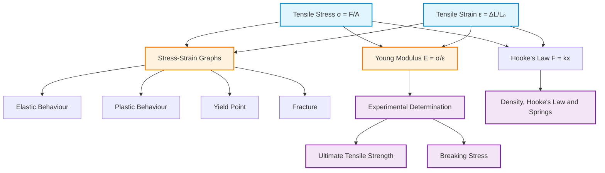

# 1. Overview / 概述

**English:**
Tensile stress and tensile strain are fundamental concepts in materials physics that describe how materials deform under stretching forces. This sub-topic introduces the precise definitions of stress as force per unit cross-sectional area and strain as the fractional change in length. These concepts form the foundation for understanding [[Young Modulus Definition and Formula]], material elasticity, and the behaviour of materials under load. Tensile stress and strain are essential for analysing everything from bridge cables to biological tissues, and they provide the quantitative framework for [[Stress-Strain Graphs and Material Behaviour]].

**中文:**
拉伸应力和拉伸应变是材料物理学中的基本概念，描述了材料在拉伸力作用下如何变形。本子知识点介绍了应力的精确定义（单位横截面积上的力）和应变的定义（长度的相对变化量）。这些概念构成了理解[[杨氏模量定义与公式]]、材料弹性以及材料在负载下行为的基础。拉伸应力和应变对于分析从桥梁缆索到生物组织等各种材料至关重要，并为[[应力-应变图与材料行为]]提供了定量框架。

---

# 2. Syllabus Learning Objectives / 考纲学习目标

| CAIE 9702 | Edexcel IAL |
|-----------|-------------|
| 6.2(a): Define and use stress, strain | 2.7: Define tensile stress and strain |
| 6.2(b): Describe force-extension graphs | 2.8: Use stress = F/A |
| 6.2(c): Distinguish elastic/plastic deformation | 2.9: Use strain = ΔL/L |
| 6.2(d): Define and use Young modulus | 2.10: Describe elastic limit |
| 6.2(e): Describe stress-strain graphs | 2.11: Interpret stress-strain graphs |
| 6.2(f): Calculate Young modulus from gradient | 2.12: Calculate Young modulus |
| 6.2(g): Describe material behaviour from graphs | |

**Examiner Expectations / 考官期望:**
- **CAIE:** Students must be able to define stress and strain precisely, calculate them from given data, and interpret stress-strain graphs for different materials. The distinction between elastic and plastic deformation is frequently tested.
- **Edexcel:** Students should understand the physical meaning of stress and strain, apply the formulas correctly with units, and relate these concepts to the Young modulus calculation.

**中文:**
- **CAIE:** 学生必须能够精确定义应力和应变，根据给定数据计算它们，并解释不同材料的应力-应变图。弹性变形和塑性变形的区别经常被考查。
- **Edexcel:** 学生应理解应力和应变的物理意义，正确应用公式及单位，并将这些概念与杨氏模量计算联系起来。

---

# 3. Core Definitions / 核心定义

| Term (EN/CN) | Definition (EN) | Definition (CN) | Common Mistakes / 常见错误 |
|--------------|-----------------|-----------------|---------------------------|
| **Tensile Stress** / 拉伸应力 | The force applied per unit cross-sectional area perpendicular to the force direction | 垂直于力方向的单位横截面积上所承受的力 | Confusing stress with force; using diameter instead of radius for area calculation |
| **Tensile Strain** / 拉伸应变 | The ratio of the change in length to the original length | 长度变化量与原始长度的比值 | Forgetting strain is dimensionless; using ΔL/L₀ incorrectly |
| **Cross-sectional Area** / 横截面积 | The area of the material perpendicular to the applied force | 材料垂直于施加力方向的面积 | Using πr instead of πr² for circular cross-sections |
| **Original Length** / 原始长度 | The unstretched length of the material before any force is applied | 施加任何力之前材料的未拉伸长度 | Using stretched length instead of original length |
| **Extension** / 伸长量 | The increase in length of the material under tension | 材料在拉伸作用下长度的增加量 | Confusing extension with total length |

---

# 4. Key Concepts Explained / 关键概念详解

## 4.1 Tensile Stress / 拉伸应力

### Explanation / 解释
**English:**
Tensile stress ($\sigma$) is defined as the force ($F$) applied perpendicular to the cross-sectional area ($A$) of a material. It is a measure of the internal forces that neighbouring particles of a continuous material exert on each other. Unlike force, stress accounts for the area over which the force is distributed, making it a material property independent of sample size. This is crucial for comparing materials of different dimensions. The concept links directly to [[Density, Hooke's Law and Springs]] as it extends Hooke's law from springs to continuous materials.

**中文:**
拉伸应力（$\sigma$）定义为垂直于材料横截面积（$A$）施加的力（$F$）。它是连续材料中相邻粒子相互施加的内力的度量。与力不同，应力考虑了力分布的面积，使其成为与样品尺寸无关的材料属性。这对于比较不同尺寸的材料至关重要。这个概念直接与[[密度、胡克定律与弹簧]]相关，因为它将胡克定律从弹簧扩展到连续材料。

### Physical Meaning / 物理意义
**English:**
Stress represents how "intensely" a force is applied. A small force on a thin wire can produce the same stress as a large force on a thick cable. This is why thin wires break more easily than thick ones under the same force — the stress is higher.

**中文:**
应力表示力施加的"强度"。细线上施加的小力可以与粗缆绳上施加的大力产生相同的应力。这就是为什么在相同力作用下细线比粗线更容易断裂——因为应力更高。

### Common Misconceptions / 常见误区
- **EN:** Thinking stress is the same as force. Stress = F/A, not just F.
- **CN:** 认为应力与力相同。应力 = F/A，而不仅仅是 F。
- **EN:** Using the wrong area (e.g., curved surface area instead of cross-sectional area).
- **CN:** 使用错误的面积（例如，曲面面积而不是横截面积）。
- **EN:** Forgetting that area must be in m² for SI units.
- **CN:** 忘记面积必须以平方米（m²）为单位才能使用SI单位。

### Exam Tips / 考试提示
- **EN:** Always convert area to m² before calculating stress. For circular cross-sections, use $A = \pi r^2$, not $\pi d^2/4$ unless you prefer that form.
- **CN:** 在计算应力前，始终将面积转换为平方米。对于圆形横截面，使用 $A = \pi r^2$，除非你更喜欢 $\pi d^2/4$ 的形式。

> 📷 **IMAGE PROMPT — STRESS-01: Tensile Stress Definition Diagram**
> A clear diagram showing a cylindrical rod under tension. Label the applied force F at both ends, the cross-sectional area A as a shaded circular face perpendicular to the force direction. Include arrows showing the force direction and a callout box defining stress = F/A. Use a clean, educational style with blue force arrows and grey material.

---

## 4.2 Tensile Strain / 拉伸应变

### Explanation / 解释
**English:**
Tensile strain ($\varepsilon$) is defined as the ratio of the change in length ($\Delta L$) to the original length ($L_0$). It quantifies how much a material deforms relative to its original size. Strain is dimensionless because it is a ratio of two lengths. A strain of 0.01 means the material has stretched by 1% of its original length. Strain is the material's response to stress and is directly related to the [[Young Modulus Definition and Formula]] through Hooke's law for elastic materials.

**中文:**
拉伸应变（$\varepsilon$）定义为长度变化量（$\Delta L$）与原始长度（$L_0$）的比值。它量化了材料相对于其原始尺寸的变形程度。应变是无量纲的，因为它是两个长度的比值。应变为0.01意味着材料拉伸了其原始长度的1%。应变是材料对应力的响应，并通过胡克定律与[[杨氏模量定义与公式]]直接相关。

### Physical Meaning / 物理意义
**English:**
Strain tells us how much a material is being stretched relative to its original size. A long rubber band can stretch significantly in absolute terms, but its strain might be smaller than a short one stretched the same absolute amount. Strain normalises deformation to the original size.

**中文:**
应变告诉我们材料相对于其原始尺寸被拉伸了多少。一根长橡皮筋在绝对长度上可以拉伸很多，但其应变可能比拉伸相同绝对长度的短橡皮筋要小。应变将变形归一化到原始尺寸。

### Common Misconceptions / 常见误区
- **EN:** Thinking strain has units. Strain is dimensionless (ratio of lengths).
- **CN:** 认为应变有单位。应变是无量纲的（长度之比）。
- **EN:** Using the stretched length instead of original length in the denominator.
- **CN:** 在分母中使用拉伸后的长度而不是原始长度。
- **EN:** Confusing extension ($\Delta L$) with strain ($\Delta L/L_0$).
- **CN:** 混淆伸长量（$\Delta L$）和应变（$\Delta L/L_0$）。

### Exam Tips / 考试提示
- **EN:** Strain is often expressed as a percentage (e.g., 0.5% strain = 0.005). Be careful with unit conversions.
- **CN:** 应变通常以百分比表示（例如，0.5% 应变 = 0.005）。注意单位换算。

---

# 5. Essential Equations / 核心公式

## Equation 1: Tensile Stress / 拉伸应力公式

$$ \sigma = \frac{F}{A} $$

| Symbol (符号) | Meaning (EN) | Meaning (CN) | Unit (单位) |
|--------------|-------------|-------------|------------|
| $\sigma$ | Tensile stress | 拉伸应力 | Pa (N m⁻²) |
| $F$ | Applied force | 施加的力 | N |
| $A$ | Cross-sectional area | 横截面积 | m² |

**Derivation / 推导:**
Stress is defined directly from the concept of force distribution. No derivation is needed — it is a definition.

**Conditions / 适用条件:**
- **EN:** Force must be perpendicular to the cross-sectional area. The material must be under tension (pulling), not compression.
- **CN:** 力必须垂直于横截面积。材料必须处于拉伸状态（被拉），而不是压缩状态。

**Limitations / 局限性:**
- **EN:** Assumes uniform stress distribution across the cross-section. Near grips or points of force application, stress may not be uniform.
- **CN:** 假设应力在横截面上均匀分布。在夹持点或力作用点附近，应力可能不均匀。

---

## Equation 2: Tensile Strain / 拉伸应变公式

$$ \varepsilon = \frac{\Delta L}{L_0} = \frac{L - L_0}{L_0} $$

| Symbol (符号) | Meaning (EN) | Meaning (CN) | Unit (单位) |
|--------------|-------------|-------------|------------|
| $\varepsilon$ | Tensile strain | 拉伸应变 | dimensionless (无量纲) |
| $\Delta L$ | Extension (change in length) | 伸长量（长度变化） | m |
| $L_0$ | Original length | 原始长度 | m |
| $L$ | Final length | 最终长度 | m |

**Derivation / 推导:**
Strain is defined as the fractional change in length. It is a definition, not derived.

**Conditions / 适用条件:**
- **EN:** The material must be under tension. For very large deformations, this definition still applies but the material may not return to its original length.
- **CN:** 材料必须处于拉伸状态。对于非常大的变形，此定义仍然适用，但材料可能无法恢复到原始长度。

**Limitations / 局限性:**
- **EN:** This is engineering strain. For very large deformations (>10%), true strain (logarithmic strain) is more accurate but not required at A-Level.
- **CN:** 这是工程应变。对于非常大的变形（>10%），真实应变（对数应变）更准确，但A-Level不要求。

---

## Equation 3: Relationship via Young Modulus / 通过杨氏模量的关系

$$ \sigma = E \varepsilon $$

| Symbol (符号) | Meaning (EN) | Meaning (CN) | Unit (单位) |
|--------------|-------------|-------------|------------|
| $\sigma$ | Tensile stress | 拉伸应力 | Pa |
| $E$ | Young modulus | 杨氏模量 | Pa |
| $\varepsilon$ | Tensile strain | 拉伸应变 | dimensionless |

**Derivation / 推导:**
This is Hooke's law applied to continuous materials. For elastic materials, stress is proportional to strain, with the Young modulus as the constant of proportionality.

**Conditions / 适用条件:**
- **EN:** Only valid within the elastic limit of the material. Beyond the elastic limit, the relationship becomes non-linear.
- **CN:** 仅在材料的弹性极限内有效。超过弹性极限后，关系变为非线性。

**Limitations / 局限性:**
- **EN:** Assumes the material is isotropic (same properties in all directions) and homogeneous (uniform composition).
- **CN:** 假设材料是各向同性的（所有方向性质相同）且均匀的（成分均匀）。

> 📷 **IMAGE PROMPT — STRESS-02: Stress-Strain Relationship Graph**
> A linear graph showing stress (σ) on the y-axis and strain (ε) on the x-axis. The line should be straight through the origin with gradient E (Young modulus). Label the elastic region and indicate the elastic limit with a dashed vertical line. Use a clean, educational style with clear axis labels and units.

---

# 6. Graphs and Relationships / 图表与关系

## 6.1 Stress-Strain Graph for a Ductile Material / 韧性材料的应力-应变图

### Axes / 坐标轴
- **X-axis:** Strain ($\varepsilon$) — dimensionless or % | 应变（$\varepsilon$）— 无量纲或百分比
- **Y-axis:** Stress ($\sigma$) — Pa or MPa | 应力（$\sigma$）— 帕或兆帕

### Shape / 形状
**English:**
The graph starts with a linear region (Hooke's law region) where stress is proportional to strain. The gradient of this linear region is the [[Young Modulus Definition and Formula]]. After the elastic limit, the graph curves, showing plastic deformation. For ductile materials like copper, there is a yield point followed by a plateau before work hardening and eventual fracture.

**中文:**
图形从线性区域（胡克定律区域）开始，其中应力与应变成正比。该线性区域的梯度是[[杨氏模量定义与公式]]。超过弹性极限后，图形弯曲，显示塑性变形。对于像铜这样的韧性材料，存在屈服点，随后是平台，然后是加工硬化，最终断裂。

### Gradient Meaning / 斜率含义
**English:**
The gradient of the linear portion equals the Young modulus ($E = \sigma / \varepsilon$). A steeper gradient means a stiffer material.

**中文:**
线性部分的梯度等于杨氏模量（$E = \sigma / \varepsilon$）。梯度越陡，材料越硬。

### Area Meaning / 面积含义
**English:**
The area under the stress-strain graph represents the energy absorbed per unit volume of the material (toughness). This is not required at AS level but is useful context.

**中文:**
应力-应变图下的面积表示材料单位体积吸收的能量（韧性）。这在AS级别不要求，但作为有用的背景知识。

### Exam Interpretation / 考试解读
- **EN:** Identify the linear region, elastic limit, yield point, and fracture point. Compare different materials' stiffness and ductility.
- **CN:** 识别线性区域、弹性极限、屈服点和断裂点。比较不同材料的刚度和延展性。

> 📷 **IMAGE PROMPT — STRESS-03: Typical Stress-Strain Graph for Ductile Material**
> A stress-strain graph showing: linear elastic region (label "Elastic"), yield point (label "Yield"), plastic region with work hardening, and fracture point (label "Fracture"). Mark the elastic limit with a dashed line. Use different colours for elastic and plastic regions. Include axis labels with units.

---

# 7. Required Diagrams / 必备图表

## 7.1 Tensile Test Setup / 拉伸测试装置

### Description / 描述
**English:**
A diagram showing a material sample (wire or rod) held between two clamps. One clamp is fixed, and the other is attached to a force-measuring device. The original length $L_0$ is marked, and the extension $\Delta L$ is measured as force is applied.

**中文:**
显示材料样品（线材或棒材）被夹在两个夹具之间的示意图。一个夹具固定，另一个连接到力测量装置。标记原始长度 $L_0$，并在施加力时测量伸长量 $\Delta L$。

### Image Prompt / 图片生成提示
> 📷 **IMAGE PROMPT — STRESS-04: Tensile Test Apparatus**
> A clean, labelled diagram of a tensile testing apparatus. Show a cylindrical wire sample held between two metal clamps. Label the fixed clamp (top), movable clamp (bottom), original length L₀, extension ΔL, and applied force F. Include a force gauge or weights hanging from the bottom clamp. Use a technical drawing style with clear labels and arrows.

### Labels Required / 需要标注
- Fixed clamp / 固定夹具
- Movable clamp / 可动夹具
- Sample (wire/rod) / 样品（线材/棒材）
- Original length $L_0$ / 原始长度 $L_0$
- Extension $\Delta L$ / 伸长量 $\Delta L$
- Applied force $F$ / 施加的力 $F$

### Exam Importance / 考试重要性
- **EN:** Frequently tested in practical questions. Students must be able to describe how to measure stress and strain experimentally.
- **CN:** 在实验题中经常考查。学生必须能够描述如何通过实验测量应力和应变。

---

## 7.2 Stress Distribution in a Wire / 线材中的应力分布

### Description / 描述
**English:**
A diagram showing a wire under tension with a cross-section highlighted. The force is distributed uniformly across the cross-sectional area, creating uniform stress.

**中文:**
显示受拉伸线材的示意图，突出显示横截面。力均匀分布在横截面积上，产生均匀应力。

### Image Prompt / 图片生成提示
> 📷 **IMAGE PROMPT — STRESS-05: Stress Distribution in Wire Cross-Section**
> A 3D-style diagram showing a cylindrical wire under tension. Cut away a section to reveal the circular cross-section. Show small arrows distributed evenly across the cross-section to represent uniform stress distribution. Label the cross-sectional area A and the force F. Use a semi-transparent style with blue force arrows.

### Labels Required / 需要标注
- Cross-sectional area $A$ / 横截面积 $A$
- Force $F$ / 力 $F$
- Uniform stress distribution / 均匀应力分布

### Exam Importance / 考试重要性
- **EN:** Understanding uniform stress distribution is key to calculating stress correctly.
- **CN:** 理解均匀应力分布是正确计算应力的关键。

---

# 8. Worked Examples / 典型例题

## Example 1: Calculating Stress and Strain / 计算应力和应变

### Question / 题目
**English:**
A steel wire of original length 2.50 m and diameter 0.50 mm is stretched by a force of 200 N. The wire extends by 1.2 mm. Calculate:
(a) The tensile stress in the wire
(b) The tensile strain in the wire

**中文:**
一根原始长度为2.50米、直径为0.50毫米的钢丝被200牛的力拉伸。钢丝伸长了1.2毫米。计算：
(a) 钢丝中的拉伸应力
(b) 钢丝中的拉伸应变

### Solution / 解答

**Part (a): Stress / 第(a)部分：应力**

Step 1: Calculate cross-sectional area.
$$ A = \pi r^2 = \pi \left(\frac{d}{2}\right)^2 = \pi \left(\frac{0.50 \times 10^{-3}}{2}\right)^2 = \pi (0.25 \times 10^{-3})^2 $$

$$ A = \pi \times 6.25 \times 10^{-8} = 1.96 \times 10^{-7} \text{ m}^2 $$

Step 2: Calculate stress.
$$ \sigma = \frac{F}{A} = \frac{200}{1.96 \times 10^{-7}} = 1.02 \times 10^9 \text{ Pa} = 1.02 \text{ GPa} $$

**Part (b): Strain / 第(b)部分：应变**

$$ \varepsilon = \frac{\Delta L}{L_0} = \frac{1.2 \times 10^{-3}}{2.50} = 4.8 \times 10^{-4} $$

Or as a percentage: $4.8 \times 10^{-4} \times 100\% = 0.048\%$

### Final Answer / 最终答案
**Answer:** (a) $\sigma = 1.02 \times 10^9$ Pa (1.02 GPa) | **答案：** (a) $\sigma = 1.02 \times 10^9$ 帕 (1.02 吉帕)
**Answer:** (b) $\varepsilon = 4.8 \times 10^{-4}$ (0.048%) | **答案：** (b) $\varepsilon = 4.8 \times 10^{-4}$ (0.048%)

### Quick Tip / 提示
- **EN:** Always convert mm to m before calculating. Watch out for diameter vs radius!
- **CN:** 在计算前始终将毫米转换为米。注意直径与半径的区别！

---

## Example 2: Using Stress-Strain Relationship / 使用应力-应变关系

### Question / 题目
**English:**
A copper wire of original length 1.80 m and cross-sectional area $2.5 \times 10^{-7}$ m² is subjected to a tensile stress of $4.0 \times 10^7$ Pa. The Young modulus of copper is $1.2 \times 10^{11}$ Pa. Calculate:
(a) The force applied to the wire
(b) The extension of the wire

**中文:**
一根原始长度为1.80米、横截面积为$2.5 \times 10^{-7}$平方米的铜线受到$4.0 \times 10^7$帕的拉伸应力。铜的杨氏模量为$1.2 \times 10^{11}$帕。计算：
(a) 施加在铜线上的力
(b) 铜线的伸长量

### Solution / 解答

**Part (a): Force / 第(a)部分：力**

$$ \sigma = \frac{F}{A} \Rightarrow F = \sigma A $$

$$ F = (4.0 \times 10^7)(2.5 \times 10^{-7}) = 10 \text{ N} $$

**Part (b): Extension / 第(b)部分：伸长量**

First, find strain using Young modulus:
$$ \sigma = E\varepsilon \Rightarrow \varepsilon = \frac{\sigma}{E} = \frac{4.0 \times 10^7}{1.2 \times 10^{11}} = 3.33 \times 10^{-4} $$

Then find extension:
$$ \varepsilon = \frac{\Delta L}{L_0} \Rightarrow \Delta L = \varepsilon L_0 = (3.33 \times 10^{-4})(1.80) = 6.0 \times 10^{-4} \text{ m} = 0.60 \text{ mm} $$

### Final Answer / 最终答案
**Answer:** (a) $F = 10$ N | **答案：** (a) $F = 10$ 牛
**Answer:** (b) $\Delta L = 6.0 \times 10^{-4}$ m (0.60 mm) | **答案：** (b) $\Delta L = 6.0 \times 10^{-4}$ 米 (0.60 毫米)

### Quick Tip / 提示
- **EN:** Use the Young modulus to connect stress and strain. This is a common two-step problem.
- **CN:** 使用杨氏模量连接应力和应变。这是一个常见的两步问题。

---

# 9. Past Paper Question Types / 历年真题题型

| Question Type / 题型 | Frequency / 频率 | Difficulty / 难度 | Past Paper References / 真题索引 |
|----------------------|------------------|------------------|-------------------------------|
| Direct calculation of stress and strain | High | Easy | 📝 *待填入* |
| Stress-strain graph interpretation | High | Medium | 📝 *待填入* |
| Comparing materials using stress/strain | Medium | Medium | 📝 *待填入* |
| Experimental setup for tensile test | Medium | Medium | 📝 *待填入* |
| Combined stress-strain-Young modulus | High | Medium-Hard | 📝 *待填入* |

**Common Command Words / 常见指令词:**
- **EN:** Define, Calculate, Determine, Describe, Sketch, Compare, Explain
- **CN:** 定义、计算、确定、描述、画出、比较、解释

---

# 10. Practical Skills Connections / 实验技能链接

**English:**
Tensile stress and strain are directly tested in the [[Experimental Determination of Young Modulus]] practical. Key practical skills include:

1. **Measurement of dimensions:** Using a micrometer screw gauge to measure wire diameter (multiple readings for accuracy), and a metre ruler for original length.
2. **Force application:** Using hanging masses to apply known forces, ensuring the force is applied axially.
3. **Extension measurement:** Using a vernier scale or travelling microscope to measure small extensions accurately.
4. **Uncertainty analysis:** Calculating percentage uncertainties in stress (from force and area measurements) and strain (from length measurements).
5. **Graph plotting:** Plotting force-extension or stress-strain graphs to determine the Young modulus from the gradient.

**Common practical errors:**
- Not measuring diameter at multiple points along the wire
- Not accounting for the weight of the masses
- Parallax error when reading extension measurements
- Not allowing the wire to settle before taking readings

**中文:**
拉伸应力和应变在[[杨氏模量的实验测定]]实验中直接测试。关键实验技能包括：

1. **尺寸测量：** 使用千分尺测量线材直径（多次读数以提高精度），使用米尺测量原始长度。
2. **力施加：** 使用悬挂砝码施加已知力，确保力沿轴向施加。
3. **伸长量测量：** 使用游标尺或移动显微镜精确测量微小伸长量。
4. **不确定度分析：** 计算应力（来自力和面积测量）和应变（来自长度测量）的百分比不确定度。
5. **图表绘制：** 绘制力-伸长量或应力-应变图，从梯度确定杨氏模量。

**常见实验错误：**
- 未在线材的多个点测量直径
- 未考虑砝码的重量
- 读取伸长量时出现视差误差
- 在读数前未让线材稳定

---

# 11. Concept Map / 概念图谱

---

# 12. Quick Revision Sheet / 速查表

| Category / 类别 | Key Points / 要点 |
|----------------|------------------|
| **Definition / 定义** | Stress = force per unit area; Strain = fractional change in length |
| **Key Formula / 核心公式** | $\sigma = F/A$; $\varepsilon = \Delta L/L_0$; $\sigma = E\varepsilon$ |
| **Units / 单位** | Stress: Pa (N m⁻²); Strain: dimensionless (no units) |
| **Key Graph / 核心图表** | Stress-strain graph: linear region (gradient = E), then plastic region |
| **Elastic vs Plastic / 弹性与塑性** | Elastic: returns to original shape; Plastic: permanent deformation |
| **Exam Tip / 考试提示** | Convert all measurements to SI units (m, m², N) before calculating |
| **Common Mistake / 常见错误** | Using diameter instead of radius for area; using final length instead of original length for strain |
| **Practical Link / 实验链接** | Measure diameter with micrometer, extension with vernier/travelling microscope |
| **Key Relationship / 关键关系** | Young modulus = gradient of linear region of stress-strain graph |
| **Syllabus / 考纲** | CAIE 9702: 6.2(a-g); Edexcel IAL: WPH11 U1: 2.7-2.12 |