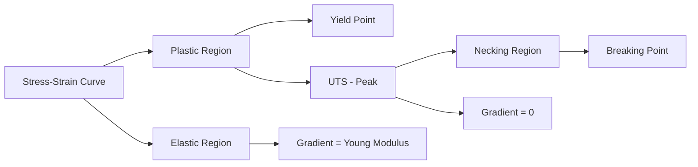

# Ultimate Tensile Strength / 极限抗拉强度

---

# 1. Overview / 概述

**English:**
Ultimate Tensile Strength (UTS) is a critical material property that defines the maximum stress a material can withstand while being stretched or pulled before necking or fracture occurs. This sub-topic explores the physical meaning of UTS, its position on [[Stress-Strain Graphs and Material Behaviour]], and its practical importance in engineering design and material selection. UTS represents the peak point on a stress-strain curve and is fundamentally different from [[Breaking Stress]] and yield strength. Understanding UTS is essential for predicting material failure and ensuring structural safety in real-world applications such as bridge construction, aircraft design, and pressure vessel manufacturing.

**中文:**
极限抗拉强度（UTS）是一项关键的材料属性，它定义了材料在拉伸或拉拽过程中、在发生颈缩或断裂之前所能承受的最大应力。本子知识点探讨UTS的物理意义、其在[[应力-应变图与材料行为]]中的位置，以及在工程设计和材料选择中的实际重要性。UTS代表应力-应变曲线上的峰值点，与[[断裂应力]]和屈服强度有本质区别。理解UTS对于预测材料失效和确保桥梁建设、飞机设计、压力容器制造等实际应用中的结构安全至关重要。

---

# 2. Syllabus Learning Objectives / 考纲学习目标

| CAIE 9702 | Edexcel IAL |
|-----------|-------------|
| 6.2(d): Define and use the term ultimate tensile strength | 2.9: Understand the term ultimate tensile strength as the maximum stress a material can withstand before failure |
| 6.2(e): Interpret stress-strain graphs to identify UTS | 2.10: Interpret stress-strain curves for ductile and brittle materials |
| 6.2(f): Distinguish between elastic limit, yield point, UTS, and breaking stress | 2.11: Calculate UTS from force and cross-sectional area data |
| 6.2(g): Describe the behaviour of materials beyond UTS (necking) | 2.12: Explain the significance of UTS in material selection |

**Examiner Expectations / 考官期望:**
- **English:** You must be able to define UTS precisely, identify it on a stress-strain graph, calculate it from experimental data, and explain its significance in material failure. Be prepared to compare UTS across different materials (ductile vs. brittle) and explain the necking phenomenon that occurs after UTS is reached.
- **中文:** 你必须能够精确定义UTS，在应力-应变图上识别它，从实验数据中计算它，并解释其在材料失效中的意义。要准备好比较不同材料（延性 vs. 脆性）的UTS，并解释达到UTS后发生的颈缩现象。

---

# 3. Core Definitions / 核心定义

| Term (EN/CN) | Definition (EN) | Definition (CN) | Common Mistakes / 常见错误 |
|--------------|-----------------|-----------------|---------------------------|
| **Ultimate Tensile Strength (UTS)** / 极限抗拉强度 | The maximum stress a material can withstand when subjected to tensile loading before failure occurs | 材料在承受拉伸载荷时、在发生失效之前所能承受的最大应力 | ❌ Confusing UTS with breaking stress — UTS is the peak, breaking stress is at fracture |
| **Necking** / 颈缩 | A localized reduction in cross-sectional area that occurs in ductile materials after UTS is reached | 延性材料达到UTS后发生的局部横截面积减小 | ❌ Thinking necking happens at yield point — it occurs after UTS |
| **Breaking Stress** / 断裂应力 | The stress at which a material actually fractures or breaks | 材料实际断裂或破裂时的应力 | ❌ Assuming UTS equals breaking stress — for ductile materials, breaking stress is lower |
| **Ductile Material** / 延性材料 | A material that undergoes significant plastic deformation before fracture, showing a clear UTS peak | 在断裂前经历显著塑性变形的材料，显示明显的UTS峰值 | ❌ Thinking all materials have a distinct UTS — brittle materials may not |
| **Brittle Material** / 脆性材料 | A material that fractures with little or no plastic deformation, often without a distinct UTS peak | 几乎没有塑性变形就断裂的材料，通常没有明显的UTS峰值 | ❌ Assuming brittle materials have no UTS — they do, but it's close to breaking stress |

---

# 4. Key Concepts Explained / 关键概念详解

## 4.1 The Physical Meaning of UTS / UTS的物理意义

### Explanation / 解释
**English:**
Ultimate Tensile Strength represents the maximum load-bearing capacity of a material under tension. On a [[Stress-Strain Graphs and Material Behaviour|stress-strain graph]], UTS is the highest point on the curve. For ductile materials like mild steel or copper, the stress-strain curve rises to a peak (UTS) and then drops as necking begins. The material continues to elongate but with decreasing stress until fracture occurs at the [[Breaking Stress|breaking point]]. For brittle materials like cast iron or glass, UTS and breaking stress are nearly identical because there is minimal plastic deformation before fracture.

The UTS value is calculated using the original cross-sectional area of the specimen, not the reduced area at the neck. This is important because the actual stress in the necked region is higher than the nominal UTS value.

**中文:**
极限抗拉强度代表材料在拉伸下的最大承载能力。在[[应力-应变图与材料行为|应力-应变图]]上，UTS是曲线上的最高点。对于延性材料如低碳钢或铜，应力-应变曲线上升到峰值（UTS），然后随着颈缩开始而下降。材料继续伸长，但应力减小，直到在[[断裂应力|断裂点]]发生断裂。对于脆性材料如铸铁或玻璃，UTS和断裂应力几乎相同，因为断裂前几乎没有塑性变形。

UTS值使用试样的原始横截面积计算，而不是颈缩处的减小面积。这很重要，因为颈缩区域的实际应力高于名义UTS值。

### Physical Meaning / 物理意义
**English:**
Physically, UTS marks the transition from uniform deformation to localized deformation. Before UTS, the entire specimen elongates uniformly. After UTS, deformation concentrates in a small region (the neck), where the cross-sectional area decreases rapidly. This necking behavior is a warning sign of impending failure in ductile materials.

**中文:**
从物理上讲，UTS标志着从均匀变形到局部变形的转变。在UTS之前，整个试样均匀伸长。在UTS之后，变形集中在一个小区域（颈缩），该区域的横截面积迅速减小。这种颈缩行为是延性材料即将失效的警告信号。

### Common Misconceptions / 常见误区
- **English:**
  - ❌ "UTS is the stress at which a material breaks" — No, UTS is the maximum stress; breaking stress is usually lower for ductile materials.
  - ❌ "All materials have a clear UTS peak" — Brittle materials may fracture before reaching a distinct peak.
  - ❌ "UTS is calculated using the neck area" — No, it uses the original cross-sectional area.
  - ❌ "Higher UTS always means better material" — Not necessarily; toughness and ductility also matter.

- **中文:**
  - ❌ "UTS是材料断裂时的应力" — 不对，UTS是最大应力；对于延性材料，断裂应力通常较低。
  - ❌ "所有材料都有明显的UTS峰值" — 脆性材料可能在达到明显峰值之前就断裂了。
  - ❌ "UTS使用颈缩面积计算" — 不对，它使用原始横截面积。
  - ❌ "UTS越高材料越好" — 不一定；韧性和延展性也很重要。

### Exam Tips / 考试提示
- **English:**
  - Always use original cross-sectional area $A_0$ when calculating UTS
  - On graphs, UTS is the highest point — not the end point
  - For ductile materials: UTS > breaking stress
  - For brittle materials: UTS ≈ breaking stress
  - Remember: UTS = $\frac{F_{max}}{A_0}$

- **中文:**
  - 计算UTS时始终使用原始横截面积 $A_0$
  - 在图上，UTS是最高点 — 不是终点
  - 对于延性材料：UTS > 断裂应力
  - 对于脆性材料：UTS ≈ 断裂应力
  - 记住：UTS = $\frac{F_{max}}{A_0}$

> 📷 **IMAGE PROMPT — UTS-001: Stress-Strain Curve with UTS Labeled**
> A clear stress-strain graph showing a ductile material curve with labeled points: elastic limit, yield point, UTS (highest point), and breaking point. The necking region should be indicated after UTS. Include both axes labeled with units (stress in Pa on y-axis, strain on x-axis). The curve should show a clear peak and then a downward slope to the breaking point.

---

## 4.2 Necking Phenomenon / 颈缩现象

### Explanation / 解释
**English:**
Necking is a localized deformation that occurs in ductile materials after the UTS is reached. As the material is stretched beyond UTS, the cross-sectional area decreases in a small region, creating a "neck." This reduction in area means that even though the applied force may decrease, the actual stress in the necked region increases significantly. The neck continues to thin until fracture occurs.

The necking process is unstable — once it begins, it accelerates rapidly because the reduced area cannot support the load. This is why the stress-strain curve drops after UTS.

**中文:**
颈缩是延性材料在达到UTS后发生的局部变形。当材料被拉伸超过UTS时，横截面积在一个小区域内减小，形成"颈缩"。这种面积减小意味着即使施加的力可能减小，颈缩区域的实际应力也会显著增加。颈缩持续变薄直到断裂发生。

颈缩过程是不稳定的 — 一旦开始，它会迅速加速，因为减小的面积无法支撑载荷。这就是为什么应力-应变曲线在UTS之后下降。

### Physical Meaning / 物理意义
**English:**
Necking represents the material's inability to strain-harden sufficiently to compensate for the reduction in cross-sectional area. Before UTS, strain hardening (work hardening) increases the material's strength faster than the area decreases. After UTS, the area decreases faster than strain hardening can compensate.

**中文:**
颈缩代表材料无法通过足够的应变硬化来补偿横截面积的减小。在UTS之前，应变硬化（加工硬化）增加材料强度的速度比面积减小的速度快。在UTS之后，面积减小的速度超过了应变硬化可以补偿的速度。

### Exam Tips / 考试提示
- **English:**
  - Necking only occurs in ductile materials, not brittle ones
  - The neck is where fracture will eventually occur
  - After necking begins, the engineering stress decreases but the true stress increases
  - Be able to describe necking in words and identify it on a diagram

- **中文:**
  - 颈缩只发生在延性材料中，脆性材料不会
  - 颈缩处最终会发生断裂
  - 颈缩开始后，工程应力减小但真实应力增加
  - 能够用语言描述颈缩并在图上识别它

> 📷 **IMAGE PROMPT — UTS-002: Necking in a Tensile Test Specimen**
> A diagram showing a tensile test specimen at different stages: (1) original uniform shape, (2) after UTS showing a localized neck with reduced cross-sectional area, (3) just before fracture with a very thin neck. Labels should indicate "Neck" and "Original Area A₀". The specimen should be shown in side view with clear dimensions.

---

## 4.3 UTS in Different Material Types / 不同材料类型中的UTS

### Explanation / 解释
**English:**
Different materials exhibit different UTS characteristics:

- **Ductile metals (e.g., mild steel, copper, aluminum):** Clear UTS peak followed by necking and a drop to breaking stress. UTS is significantly higher than breaking stress.
- **Brittle materials (e.g., cast iron, glass, ceramics):** No clear UTS peak — the material fractures at or very near the maximum stress. UTS ≈ breaking stress.
- **Polymers (e.g., nylon, polyethylene):** May show a UTS peak but often exhibit more complex behavior with drawing and orientation.
- **Composites (e.g., carbon fiber):** UTS depends on fiber orientation; may show brittle behavior with no distinct peak.

**中文:**
不同材料表现出不同的UTS特性：

- **延性金属（如低碳钢、铜、铝）：** 明显的UTS峰值，随后是颈缩和下降到断裂应力。UTS显著高于断裂应力。
- **脆性材料（如铸铁、玻璃、陶瓷）：** 没有明显的UTS峰值 — 材料在最大应力处或非常接近最大应力处断裂。UTS ≈ 断裂应力。
- **聚合物（如尼龙、聚乙烯）：** 可能显示UTS峰值，但通常表现出更复杂的拉伸和取向行为。
- **复合材料（如碳纤维）：** UTS取决于纤维取向；可能表现出脆性行为，没有明显的峰值。

### Exam Tips / 考试提示
- **English:**
  - Be able to sketch stress-strain curves for both ductile and brittle materials
  - Identify UTS on each type of curve
  - Explain why brittle materials don't show necking
  - Compare UTS values for different materials in context (e.g., why steel is used for construction)

- **中文:**
  - 能够画出延性和脆性材料的应力-应变曲线草图
  - 在每种曲线上识别UTS
  - 解释为什么脆性材料不显示颈缩
  - 在上下文中比较不同材料的UTS值（例如，为什么钢材用于建筑）

> 📋 **CIE Only:** CAIE 9702 specifically requires students to interpret stress-strain graphs for both ductile and brittle materials, identifying UTS as the maximum stress point. Questions often ask students to explain the shape of the curve beyond UTS.

> 📋 **Edexcel Only:** Edexcel IAL emphasizes the practical application of UTS in material selection. Questions may ask students to justify why a particular material is chosen for a specific application based on its UTS and other properties.

---

# 5. Essential Equations / 核心公式

## 5.1 Ultimate Tensile Strength Formula / 极限抗拉强度公式

$$ \sigma_{UTS} = \frac{F_{max}}{A_0} $$

| Symbol (符号) | Meaning (EN) | Meaning (CN) | Unit (单位) |
|--------------|-------------|-------------|------------|
| $\sigma_{UTS}$ | Ultimate Tensile Strength | 极限抗拉强度 | Pa (N/m²) |
| $F_{max}$ | Maximum force applied before failure | 失效前施加的最大力 | N |
| $A_0$ | Original cross-sectional area | 原始横截面积 | m² |

**Derivation / 推导:**
This is a direct application of the stress formula $\sigma = \frac{F}{A}$, where we use the maximum force $F_{max}$ and the original area $A_0$. It is not derived from other equations but is a definition.

**Conditions / 适用条件:**
- **English:** The formula applies to all materials under tensile loading. The area used must be the original cross-sectional area before any deformation occurs, not the reduced area at the neck.
- **中文:** 该公式适用于所有承受拉伸载荷的材料。使用的面积必须是发生任何变形之前的原始横截面积，而不是颈缩处的减小面积。

**Limitations / 局限性:**
- **English:** The formula gives the engineering UTS, not the true stress at failure. The true stress in the necked region is higher because the actual area is smaller. The formula does not account for the rate of loading or temperature effects.
- **中文:** 该公式给出的是工程UTS，而不是失效时的真实应力。颈缩区域的真实应力更高，因为实际面积更小。该公式不考虑加载速率或温度效应。

> 📷 **IMAGE PROMPT — UTS-003: UTS Formula Diagram**
> A simple diagram showing a tensile specimen with original cross-sectional area A₀ labeled, and an arrow indicating the maximum force F_max applied. The formula σ_UTS = F_max/A₀ should be displayed prominently. Include a note: "Use original area, not neck area."

---

## 5.2 Factor of Safety Relationship / 安全系数关系

$$ \sigma_{working} = \frac{\sigma_{UTS}}{n} $$

| Symbol (符号) | Meaning (EN) | Meaning (CN) | Unit (单位) |
|--------------|-------------|-------------|------------|
| $\sigma_{working}$ | Working (allowable) stress | 工作（许用）应力 | Pa |
| $\sigma_{UTS}$ | Ultimate Tensile Strength | 极限抗拉强度 | Pa |
| $n$ | Factor of safety (n > 1) | 安全系数 (n > 1) | dimensionless |

**Conditions / 适用条件:**
- **English:** Used in engineering design to ensure structures operate well below the UTS. Typical safety factors range from 1.5 to 10 depending on the application and consequences of failure.
- **中文:** 用于工程设计，确保结构在远低于UTS的条件下运行。典型的安全系数范围从1.5到10，取决于应用和失效后果。

---

# 6. Graphs and Relationships / 图表与关系

## 6.1 Stress-Strain Graph Showing UTS / 显示UTS的应力-应变图

### Axes / 坐标轴
- **X-axis:** Strain (ε) — dimensionless / 应变 (ε) — 无量纲
- **Y-axis:** Stress (σ) — Pa or N/m² / 应力 (σ) — Pa 或 N/m²

### Shape / 形状
**English:**
For a ductile material, the curve rises linearly (elastic region), then curves (plastic region), reaches a peak (UTS), then drops as necking occurs until fracture. For a brittle material, the curve rises almost linearly to a maximum and then drops sharply at fracture with little or no plastic region.

**中文:**
对于延性材料，曲线线性上升（弹性区域），然后弯曲（塑性区域），达到峰值（UTS），然后随着颈缩发生而下降直到断裂。对于脆性材料，曲线几乎线性上升到最大值，然后在断裂时急剧下降，几乎没有塑性区域。

### Gradient Meaning / 斜率含义
- **Before UTS:** Gradient represents the [[Young Modulus Definition and Formula|Young Modulus]] in the elastic region; in the plastic region, the gradient decreases to zero at UTS.
- **At UTS:** Gradient = 0 (horizontal tangent) — this is the maximum point.
- **After UTS:** Gradient becomes negative as stress decreases with increasing strain.

### Area Meaning / 面积含义
- **Area under the entire curve up to fracture:** Represents the [[Tensile Stress and Strain|toughness]] of the material (energy absorbed per unit volume before fracture).

### Exam Interpretation / 考试解读
- **English:**
  - UTS is always the highest point on the curve
  - For ductile materials, UTS is followed by a downward slope to the breaking point
  - For brittle materials, UTS and breaking point are essentially the same
  - The distance between UTS and breaking point indicates ductility

- **中文:**
  - UTS始终是曲线上的最高点
  - 对于延性材料，UTS之后是向下倾斜到断裂点
  - 对于脆性材料，UTS和断裂点基本相同
  - UTS和断裂点之间的距离表示延展性

> 📷 **IMAGE PROMPT — UTS-004: Comparison of Ductile and Brittle Stress-Strain Curves**
> Two stress-strain curves on the same axes: one for a ductile material (mild steel) showing a clear peak (UTS) followed by a downward slope to fracture, and one for a brittle material (cast iron) showing a steep rise to a sharp fracture point with no distinct peak. Both curves should have labeled axes and key points marked (elastic limit, yield point, UTS, breaking point).

---

# 7. Required Diagrams / 必备图表

## 7.1 Tensile Test Specimen with UTS and Necking / 拉伸试样显示UTS和颈缩

### Description / 描述
**English:**
A diagram showing a standard tensile test specimen (dumbbell shape) at three stages: (1) original undeformed state with uniform cross-section, (2) at UTS showing the beginning of neck formation, (3) after fracture showing the broken specimen with a necked region at the fracture point.

**中文:**
显示标准拉伸试样（哑铃形）在三个阶段的图：(1) 原始未变形状态，横截面均匀，(2) 在UTS时显示颈缩开始形成，(3) 断裂后显示断裂的试样，在断裂点处有颈缩区域。

### Image Prompt / 图片生成提示
> 📷 **IMAGE PROMPT — UTS-005: Tensile Specimen Stages**
> A clear technical diagram showing a tensile test specimen in three stages from top to bottom: Stage 1 - original uniform specimen with cross-sectional area A₀ labeled; Stage 2 - specimen at UTS with a slight neck forming in the middle, labeled "Neck begins at UTS"; Stage 3 - fractured specimen showing two pieces with a narrow neck at the fracture surface, labeled "Fracture after necking". Include dimension labels and arrows showing applied force F. Clean white background, engineering drawing style.

### Labels Required / 需要标注
| English | 中文 |
|---------|------|
| Original cross-sectional area A₀ | 原始横截面积 A₀ |
| Neck region | 颈缩区域 |
| Fracture surface | 断裂面 |
| Applied force F | 施加的力 F |
| Gauge length | 标距长度 |

### Exam Importance / 考试重要性
- **English:** High — students are often asked to draw or interpret diagrams showing the stages of a tensile test. Understanding the physical appearance of necking is essential for linking theory to practical observations.
- **中文:** 高 — 学生经常被要求画出或解释显示拉伸试验阶段的图。理解颈缩的物理外观对于将理论与实际观察联系起来至关重要。

---

## 7.2 Stress-Strain Graph with All Key Points / 标有所有关键点的应力-应变图

### Description / 描述
**English:**
A complete stress-strain graph for a ductile material with all key points clearly labeled: proportional limit, elastic limit, yield point, UTS (maximum), and breaking point. The graph should also show the elastic region, plastic region, and necking region.

**中文:**
一个完整的延性材料应力-应变图，所有关键点都清晰标注：比例极限、弹性极限、屈服点、UTS（最大值）和断裂点。图还应显示弹性区域、塑性区域和颈缩区域。

### Image Prompt / 图片生成提示
> 📷 **IMAGE PROMPT — UTS-006: Complete Stress-Strain Graph with Labels**
> A detailed stress-strain graph for a ductile material with the following clearly labeled: x-axis "Strain ε", y-axis "Stress σ (Pa)". Key points marked with arrows and text: "Proportional Limit", "Elastic Limit", "Yield Point", "UTS (Ultimate Tensile Strength)", "Breaking Point". Regions shaded or bracketed: "Elastic Region", "Plastic Region", "Necking Region". The curve should show a linear elastic portion, a curved plastic portion rising to a peak (UTS), then a downward slope to the breaking point. Professional graph style with grid lines.

### Labels Required / 需要标注
| English | 中文 |
|---------|------|
| Proportional Limit | 比例极限 |
| Elastic Limit | 弹性极限 |
| Yield Point | 屈服点 |
| UTS (Ultimate Tensile Strength) | UTS（极限抗拉强度） |
| Breaking Point | 断裂点 |
| Elastic Region | 弹性区域 |
| Plastic Region | 塑性区域 |
| Necking Region | 颈缩区域 |

### Exam Importance / 考试重要性
- **English:** Very high — this is one of the most commonly tested diagrams in both CAIE and Edexcel exams. Students must be able to draw, label, and interpret this graph.
- **中文:** 非常高 — 这是CAIE和Edexcel考试中最常考的图之一。学生必须能够画出、标注和解释这个图。

---

# 8. Worked Examples / 典型例题

## Example 1: Calculating UTS from Experimental Data / 从实验数据计算UTS

### Question / 题目
**English:**
A steel wire of diameter 1.2 mm is subjected to a tensile test. The maximum force recorded before necking begins is 4500 N. Calculate the ultimate tensile strength of the steel wire.

**中文:**
一根直径为1.2毫米的钢丝进行拉伸试验。在颈缩开始前记录的最大力为4500 N。计算钢丝的极限抗拉强度。

### Solution / 解答

**Step 1: Calculate the original cross-sectional area / 计算原始横截面积**

$$ A_0 = \pi r^2 = \pi \left(\frac{d}{2}\right)^2 = \pi \left(\frac{1.2 \times 10^{-3}}{2}\right)^2 $$

$$ A_0 = \pi (0.6 \times 10^{-3})^2 = \pi (3.6 \times 10^{-7}) $$

$$ A_0 = 1.131 \times 10^{-6} \text{ m}^2 $$

**Step 2: Apply the UTS formula / 应用UTS公式**

$$ \sigma_{UTS} = \frac{F_{max}}{A_0} = \frac{4500}{1.131 \times 10^{-6}} $$

$$ \sigma_{UTS} = 3.98 \times 10^9 \text{ Pa} $$

$$ \sigma_{UTS} = 3.98 \text{ GPa} $$

### Final Answer / 最终答案
**Answer:** 3.98 GPa | **答案：** 3.98 GPa

### Quick Tip / 提示
- **English:** Always convert diameter to radius, and ensure all units are in SI (meters, not mm) before calculating. The answer should be in Pa or GPa.
- **中文:** 始终将直径转换为半径，并确保在计算前所有单位都是SI单位（米，不是毫米）。答案应以Pa或GPa为单位。

---

## Example 2: Interpreting UTS from a Graph / 从图中解读UTS

### Question / 题目
**English:**
A stress-strain graph for a copper specimen shows the following data points:
- At strain 0.15: stress = 220 MPa
- At strain 0.20: stress = 250 MPa (maximum)
- At strain 0.25: stress = 230 MPa
- At strain 0.30: stress = 200 MPa (fracture)

(a) Identify the UTS of the copper.
(b) Explain why the stress decreases after the maximum point.
(c) Calculate the maximum force if the original cross-sectional area is 50 mm².

**中文:**
一个铜试样的应力-应变图显示以下数据点：
- 应变为0.15时：应力 = 220 MPa
- 应变为0.20时：应力 = 250 MPa（最大值）
- 应变为0.25时：应力 = 230 MPa
- 应变为0.30时：应力 = 200 MPa（断裂）

(a) 确定铜的UTS。
(b) 解释为什么应力在最大值后下降。
(c) 如果原始横截面积为50 mm²，计算最大力。

### Solution / 解答

**(a) UTS Identification / UTS识别**

The UTS is the maximum stress value: **250 MPa**

**(b) Explanation of stress decrease / 应力下降的解释**

**English:**
After reaching UTS, necking begins. The cross-sectional area decreases locally in the neck region. Although the actual force may decrease, the engineering stress (calculated using original area) decreases because the material can no longer support the same load. The neck thins rapidly until fracture occurs.

**中文:**
达到UTS后，颈缩开始。横截面积在颈缩区域局部减小。虽然实际力可能减小，但工程应力（使用原始面积计算）减小，因为材料无法再支撑相同的载荷。颈缩迅速变薄直到断裂发生。

**(c) Maximum force calculation / 最大力计算**

$$ A_0 = 50 \text{ mm}^2 = 50 \times 10^{-6} \text{ m}^2 = 5.0 \times 10^{-5} \text{ m}^2 $$

$$ \sigma_{UTS} = 250 \text{ MPa} = 250 \times 10^6 \text{ Pa} $$

$$ F_{max} = \sigma_{UTS} \times A_0 = (250 \times 10^6)(5.0 \times 10^{-5}) $$

$$ F_{max} = 12,500 \text{ N} = 12.5 \text{ kN} $$

### Final Answer / 最终答案
**Answer:** (a) 250 MPa | (b) Necking causes localized area reduction | (c) 12.5 kN
**答案：** (a) 250 MPa | (b) 颈缩导致局部面积减小 | (c) 12.5 kN

### Quick Tip / 提示
- **English:** When converting mm² to m², multiply by $10^{-6}$. Remember that 1 MPa = $10^6$ Pa.
- **中文:** 将mm²转换为m²时，乘以$10^{-6}$。记住1 MPa = $10^6$ Pa。

---

# 9. Past Paper Question Types / 历年真题题型

| Question Type / 题型 | Frequency / 频率 | Difficulty / 难度 | Past Paper References / 真题索引 |
|----------------------|------------------|------------------|-------------------------------|
| Define UTS / 定义UTS | High | Easy | 📝 *待填入* |
| Calculate UTS from force and area / 从力和面积计算UTS | High | Medium | 📝 *待填入* |
| Identify UTS on stress-strain graph / 在应力-应变图上识别UTS | Very High | Easy | 📝 *待填入* |
| Explain necking after UTS / 解释UTS后的颈缩 | Medium | Medium | 📝 *待填入* |
| Compare UTS for ductile vs brittle / 比较延性与脆性材料的UTS | Medium | Medium | 📝 *待填入* |
| Factor of safety calculation / 安全系数计算 | Low | Medium | 📝 *待填入* |
| Sketch stress-strain curves with UTS / 画出带UTS的应力-应变曲线 | High | Medium | 📝 *待填入* |

**Common Command Words / 常见指令词:**
- **English:** Define, Calculate, Determine, Identify, Explain, Sketch, Compare, State
- **中文:** 定义、计算、确定、识别、解释、画出、比较、陈述

---

# 10. Practical Skills Connections / 实验技能链接

**English:**
The concept of UTS is directly connected to the [[Experimental Determination of Young Modulus|tensile testing experiment]]. Key practical skills include:

1. **Measurement of force:** Using a force sensor or weights to apply tensile load, recording the maximum force before necking
2. **Measurement of cross-sectional area:** Using a micrometer screw gauge to measure diameter at multiple points, calculating average area
3. **Graph plotting:** Plotting stress-strain graphs from experimental data, identifying UTS as the peak
4. **Uncertainty analysis:** Calculating percentage uncertainty in UTS from uncertainties in force and area measurements
5. **Material identification:** Using UTS values to identify unknown materials
6. **Safety considerations:** Understanding that materials fail at UTS, ensuring safety factors in design

**Common practical errors:**
- Using the necked area instead of original area for UTS calculation
- Not measuring diameter at multiple points (wire may not be perfectly uniform)
- Applying load too quickly (dynamic effects may affect UTS)

**中文:**
UTS的概念直接与[[杨氏模量的实验测定|拉伸试验实验]]相关。关键实验技能包括：

1. **力的测量：** 使用力传感器或砝码施加拉伸载荷，记录颈缩前的最大力
2. **横截面积的测量：** 使用千分尺在多个点测量直径，计算平均面积
3. **图表绘制：** 从实验数据绘制应力-应变图，将UTS识别为峰值
4. **不确定度分析：** 从力和面积测量的不确定度计算UTS的百分比不确定度
5. **材料识别：** 使用UTS值识别未知材料
6. **安全考虑：** 理解材料在UTS处失效，确保设计中的安全系数

**常见实验错误：**
- 使用颈缩面积而不是原始面积计算UTS
- 未在多个点测量直径（导线可能不完全均匀）
- 加载过快（动态效应可能影响UTS）

---

# 11. Concept Map / 概念图谱

```mermaid
graph TD
    UTS[Ultimate Tensile Strength] --> DEF[Definition: Maximum stress before failure]
    UTS --> FORM[Formula: σ_UTS = F_max / A₀]
    UTS --> GRAPH[Position on Stress-Strain Graph]
    UTS --> NECK[Necking Phenomenon]
    UTS --> COMP[Comparison: Ductile vs Brittle]
    UTS --> SAFE[Factor of Safety]
    
    GRAPH --> PEAK[Highest point on curve]
    GRAPH --> DUCTILE[Ductile: Clear peak, then drop]
    GRAPH --> BRITTLE[Brittle: No clear peak, fracture at max]
    
    NECK --> AFTER[Occurs after UTS]
    NECK --> LOCAL[Localized area reduction]
    NECK --> FRACTURE[Leads to fracture]
    
    COMP --> DUCTILE
    COMP --> BRITTLE
    COMP --> POLYMER[Polymers: Complex behavior]
    
    SAFE --> WORK[Working stress = UTS / n]
    SAFE --> DESIGN[Engineering design application]
    
    UTS --> PARENT[[Stress, Strain and Young Modulus]]
    GRAPH --> SIBLING1[[Stress-Strain Graphs and Material Behaviour]]
    FORM --> PREREQ[[Density, Hooke's Law and Springs]]
    NECK --> SIBLING2[[Breaking Stress]]
    COMP --> SIBLING3[[Tensile Stress and Strain]]
```

---

# 12. Quick Revision Sheet / 速查表

| Category / 类别 | Key Points / 要点 |
|----------------|------------------|
| **Definition / 定义** | Maximum stress a material can withstand under tension before failure / 材料在拉伸失效前能承受的最大应力 |
| **Key Formula / 核心公式** | $\sigma_{UTS} = \frac{F_{max}}{A_0}$ — Use original area, not neck area / 使用原始面积，不是颈缩面积 |
| **Key Graph / 核心图表** | Stress-strain curve: UTS is the highest point / 应力-应变曲线：UTS是最高点 |
| **Ductile Materials / 延性材料** | Clear UTS peak → necking → stress drops to breaking point / 明显UTS峰值 → 颈缩 → 应力下降到断裂点 |
| **Brittle Materials / 脆性材料** | No clear peak; UTS ≈ breaking stress / 无明显峰值；UTS ≈ 断裂应力 |
| **Necking / 颈缩** | Localized area reduction after UTS; causes stress to drop / UTS后的局部面积减小；导致应力下降 |
| **Factor of Safety / 安全系数** | $\sigma_{working} = \frac{\sigma_{UTS}}{n}$ where n > 1 / 其中 n > 1 |
| **Common Mistake / 常见错误** | ❌ Using neck area for UTS calculation / 使用颈缩面积计算UTS |
| **Exam Tip / 考试提示** | Always identify UTS as the PEAK, not the end point / 始终将UTS识别为峰值，而不是终点 |
| **Units / 单位** | Pa (N/m²) or GPa / Pa (N/m²) 或 GPa |
| **Related Topics / 相关主题** | [[Stress, Strain and Young Modulus]], [[Stress-Strain Graphs and Material Behaviour]], [[Breaking Stress]] |

---

> **Quick Memory Aid / 快速记忆口诀:**
> **"UTS is the PEAK — after that, the neck gets weak!"**
> **"UTS是峰值 — 之后颈缩变弱！"**