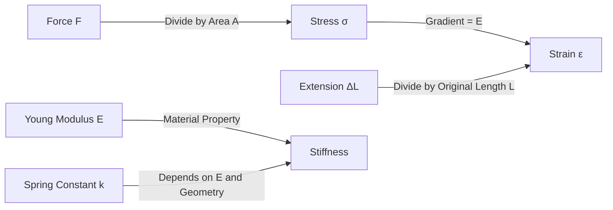
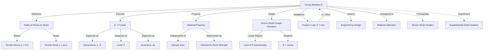

# Young Modulus Definition and Formula / 杨氏模量的定义与公式

---

# 1. Overview / 概述

**English:**
The Young Modulus is a fundamental material property that quantifies the stiffness of a solid material. It describes how much a material will stretch or compress under a given tensile or compressive load, within its elastic limit. This sub-topic focuses on the precise definition of the Young Modulus, its derivation from [[Hooke's Law and Springs]], and the key formula $E = \frac{\sigma}{\epsilon}$. Understanding this concept is essential for comparing the stiffness of different materials, predicting deformation in engineering structures, and forms the foundation for [[Stress-Strain Graphs and Material Behaviour]]. The Young Modulus is a key parameter in materials science and is directly tested in both CAIE 9702 and Edexcel IAL specifications.

**中文:**
杨氏模量是一个基本的材料属性，用于量化固体材料的刚度。它描述了在弹性极限内，材料在给定拉伸或压缩载荷下会伸长或压缩多少。本子知识点聚焦于杨氏模量的精确定义、其从[[胡克定律与弹簧]]的推导，以及关键公式 $E = \frac{\sigma}{\epsilon}$。理解这一概念对于比较不同材料的刚度、预测工程结构中的变形至关重要，并且构成了[[应力-应变图与材料行为]]的基础。杨氏模量是材料科学中的一个关键参数，在CAIE 9702和Edexcel IAL考试中均有直接考查。

---

# 2. Syllabus Learning Objectives / 考纲学习目标

| CAIE 9702 | Edexcel IAL |
|-----------|-------------|
| 6.2(a) Define and use the terms stress, strain and Young modulus | 2.7 Define the Young modulus |
| 6.2(b) Recall and use the formula for the Young modulus $E = \frac{\sigma}{\epsilon}$ | 2.8 Use the formula $E = \frac{FL}{A\Delta L}$ |
| 6.2(c) Describe an experiment to determine the Young modulus of a metal wire | 2.9 Describe an experiment to determine the Young modulus of a material |
| 6.2(d) Interpret stress-strain graphs and calculate Young modulus from gradient | 2.10 Calculate Young modulus from the gradient of a stress-strain graph |
| 6.2(e) Distinguish between elastic and plastic deformation | 2.11 Distinguish between elastic and plastic deformation |
| 6.2(f) Understand the significance of the Young modulus in material selection | 2.12 Understand the significance of the Young modulus in engineering |

**Examiner Expectations / 考官期望:**
- **English:** Students must be able to define Young modulus as the ratio of tensile stress to tensile strain within the limit of proportionality. They must recall and apply the formula $E = \frac{\sigma}{\epsilon} = \frac{FL}{A\Delta L}$. Students should understand that Young modulus is a property of the material, not the sample dimensions, and that it only applies within the elastic region. They must be able to calculate it from experimental data and from the gradient of a stress-strain graph.
- **中文:** 学生必须能够将杨氏模量定义为比例极限内拉伸应力与拉伸应变之比。必须记住并应用公式 $E = \frac{\sigma}{\epsilon} = \frac{FL}{A\Delta L}$。学生应理解杨氏模量是材料的属性，而非样品尺寸的属性，并且仅适用于弹性区域。必须能够从实验数据和应力-应变图的斜率计算杨氏模量。

---

# 3. Core Definitions / 核心定义

| Term (EN/CN) | Definition (EN) | Definition (CN) | Common Mistakes / 常见错误 |
|--------------|-----------------|-----------------|---------------------------|
| **Young Modulus** / 杨氏模量 | The ratio of tensile stress to tensile strain within the limit of proportionality of a material. It is a measure of the stiffness of a material. | 在材料的比例极限内，拉伸应力与拉伸应变之比。它是衡量材料刚度的量度。 | ❌ Confusing Young modulus with stiffness (spring constant). Young modulus is a material property; stiffness depends on dimensions. |
| **Tensile Stress** / 拉伸应力 | The force applied per unit cross-sectional area, $\sigma = \frac{F}{A}$. | 单位横截面积上所施加的力，$\sigma = \frac{F}{A}$。 | ❌ Using diameter instead of radius in area calculation. |
| **Tensile Strain** / 拉伸应变 | The ratio of extension to original length, $\epsilon = \frac{\Delta L}{L}$. | 伸长量与原始长度之比，$\epsilon = \frac{\Delta L}{L}$。 | ❌ Forgetting strain is dimensionless. |
| **Limit of Proportionality** / 比例极限 | The point beyond which stress is no longer proportional to strain. | 应力与应变不再成正比的点。 | ❌ Confusing with elastic limit. |
| **Elastic Deformation** / 弹性形变 | Deformation that is reversible when the load is removed. | 卸载后可恢复的形变。 | ❌ Assuming all materials have a linear elastic region. |
| **Stiffness** / 刚度 | The resistance of a material to elastic deformation. A higher Young modulus indicates greater stiffness. | 材料抵抗弹性形变的能力。杨氏模量越高，刚度越大。 | ❌ Using "stiffness" interchangeably with "strength". |

---

# 4. Key Concepts Explained / 关键概念详解

## 4.1 Definition of Young Modulus / 杨氏模量的定义

### Explanation / 解释
**English:**
The Young Modulus ($E$) is defined as the ratio of [[Tensile Stress and Strain|tensile stress]] to [[Tensile Stress and Strain|tensile strain]] within the [[Hooke's Law and Springs|limit of proportionality]] of a material. Mathematically:

$$ E = \frac{\sigma}{\epsilon} = \frac{F/A}{\Delta L / L} = \frac{FL}{A\Delta L} $$

Where:
- $F$ = applied force (N)
- $A$ = cross-sectional area ($m^2$)
- $\Delta L$ = extension (m)
- $L$ = original length (m)

The Young Modulus is a **material property** — it does not depend on the dimensions of the sample. For example, a steel wire and a steel rod of different thicknesses have the same Young modulus. This distinguishes it from the spring constant $k$, which depends on both material and geometry.

**中文:**
杨氏模量 ($E$) 定义为在材料的[[胡克定律与弹簧|比例极限]]内，[[拉伸应力与应变|拉伸应力]]与[[拉伸应力与应变|拉伸应变]]之比。数学表达式为：

$$ E = \frac{\sigma}{\epsilon} = \frac{F/A}{\Delta L / L} = \frac{FL}{A\Delta L} $$

其中：
- $F$ = 施加的力 (N)
- $A$ = 横截面积 ($m^2$)
- $\Delta L$ = 伸长量 (m)
- $L$ = 原始长度 (m)

杨氏模量是一个**材料属性**——它不依赖于样品的尺寸。例如，不同粗细的钢丝和钢棒具有相同的杨氏模量。这使其区别于弹簧常数 $k$，后者同时取决于材料和几何形状。

### Physical Meaning / 物理意义
**English:**
The Young Modulus represents the **stiffness** of a material. A high Young modulus means the material requires a large stress to produce a given strain — it is difficult to stretch or compress. For example, steel ($E \approx 200 \text{ GPa}$) is much stiffer than rubber ($E \approx 0.01 \text{ GPa}$). Physically, it relates to the strength of interatomic bonds within the material. Stronger bonds lead to higher Young modulus values.

**中文:**
杨氏模量代表材料的**刚度**。杨氏模量高意味着材料需要很大的应力才能产生给定的应变——即难以拉伸或压缩。例如，钢 ($E \approx 200 \text{ GPa}$) 比橡胶 ($E \approx 0.01 \text{ GPa}$) 硬得多。从物理上讲，它与材料内部原子间键的强度有关。键越强，杨氏模量值越高。

### Common Misconceptions / 常见误区
- **English:**
  - ❌ "Young modulus is the same as stiffness." — No, stiffness ($k$) depends on dimensions; Young modulus is material-specific.
  - ❌ "Young modulus applies to plastic deformation." — No, it only applies within the elastic region.
  - ❌ "A higher Young modulus means the material is stronger." — No, strength refers to breaking stress, not stiffness.
- **中文:**
  - ❌ "杨氏模量与刚度相同。" — 不对，刚度 ($k$) 取决于尺寸；杨氏模量是材料特有的。
  - ❌ "杨氏模量适用于塑性形变。" — 不对，它仅适用于弹性区域。
  - ❌ "杨氏模量越高，材料越强。" — 不对，强度指的是断裂应力，而非刚度。

### Exam Tips / 考试提示
- **English:**
  - Always check units: Young modulus is in Pa (or N/m²), typically GPa.
  - Remember strain is dimensionless — do not assign units to it.
  - When calculating area from diameter, use $A = \pi r^2 = \pi (d/2)^2 = \frac{\pi d^2}{4}$.
  - The gradient of a stress-strain graph in the linear region gives the Young modulus.
- **中文:**
  - 始终检查单位：杨氏模量的单位是 Pa（或 N/m²），通常为 GPa。
  - 记住应变是无量纲的——不要为其分配单位。
  - 从直径计算面积时，使用 $A = \pi r^2 = \pi (d/2)^2 = \frac{\pi d^2}{4}$。
  - 应力-应变图线性区域的斜率即为杨氏模量。

> 📷 **IMAGE PROMPT — YM-01: Young Modulus Definition Diagram**
> A clear diagram showing a cylindrical rod of original length L under tensile force F. Label: cross-sectional area A, extension ΔL. Show the stress σ = F/A acting on the cross-section and strain ε = ΔL/L. Include a callout box: "Young Modulus E = σ/ε = FL/AΔL". Use a clean, textbook-style illustration with arrows and labels in blue and red.

---

# 5. Essential Equations / 核心公式

## Equation 1: Young Modulus Formula / 杨氏模量公式

$$ E = \frac{\sigma}{\epsilon} = \frac{F/A}{\Delta L / L} = \frac{FL}{A\Delta L} $$

| Symbol (符号) | Meaning (EN) | Meaning (CN) | Unit (单位) |
|--------------|-------------|-------------|------------|
| $E$ | Young Modulus | 杨氏模量 | Pa (N/m²) |
| $\sigma$ | Tensile stress | 拉伸应力 | Pa (N/m²) |
| $\epsilon$ | Tensile strain | 拉伸应变 | dimensionless (无量纲) |
| $F$ | Applied force | 施加的力 | N |
| $A$ | Cross-sectional area | 横截面积 | m² |
| $L$ | Original length | 原始长度 | m |
| $\Delta L$ | Extension | 伸长量 | m |

**Derivation / 推导:**
Starting from [[Hooke's Law and Springs]]: $F = k\Delta L$, where $k$ is the spring constant. For a uniform rod, $k = \frac{EA}{L}$. Substituting: $F = \frac{EA}{L}\Delta L$. Rearranging: $E = \frac{FL}{A\Delta L}$.

**Conditions / 适用条件:**
- **English:** The material must be within its limit of proportionality (elastic region). The formula assumes uniform cross-sectional area and homogeneous material. Only valid for tensile or compressive loading along the long axis.
- **中文:** 材料必须在其比例极限内（弹性区域）。该公式假设横截面积均匀且材料均匀。仅适用于沿长轴的拉伸或压缩加载。

**Limitations / 局限性:**
- **English:** Does not apply to plastic deformation. Assumes linear elastic behavior. Not valid for anisotropic materials (properties vary with direction) without modification. Does not account for temperature effects.
- **中文:** 不适用于塑性形变。假设为线性弹性行为。不适用于各向异性材料（性质随方向变化）而不加修正。不考虑温度效应。

## Equation 2: Stress-Strain Relationship / 应力-应变关系

$$ \sigma = E\epsilon $$

| Symbol (符号) | Meaning (EN) | Meaning (CN) | Unit (单位) |
|--------------|-------------|-------------|------------|
| $\sigma$ | Stress | 应力 | Pa |
| $E$ | Young Modulus | 杨氏模量 | Pa |
| $\epsilon$ | Strain | 应变 | dimensionless |

**Conditions / 适用条件:**
- **English:** Only valid within the linear elastic region (Hooke's law region). This is the equation of a straight line through the origin on a stress-strain graph.
- **中文:** 仅在线性弹性区域（胡克定律区域）内有效。这是应力-应变图上通过原点的直线方程。

> 📷 **IMAGE PROMPT — YM-02: Stress-Strain Graph with Young Modulus**
> A stress-strain graph showing a straight line through the origin. Label the gradient as "Young Modulus E = Δσ/Δε". Show the limit of proportionality marked with a dashed vertical line. Include axes labels: Stress σ (Pa) on y-axis, Strain ε (dimensionless) on x-axis. Use a clean, exam-style graph with gridlines.

---

# 6. Graphs and Relationships / 图表与关系

## 6.1 Stress-Strain Graph (Linear Region) / 应力-应变图（线性区域）

### Axes / 坐标轴
- **x-axis:** Strain $\epsilon$ (dimensionless) / 应变 $\epsilon$（无量纲）
- **y-axis:** Stress $\sigma$ (Pa) / 应力 $\sigma$ (Pa)

### Shape / 形状
- **English:** A straight line passing through the origin, indicating direct proportionality between stress and strain (Hooke's law). The line ends at the limit of proportionality.
- **中文:** 一条通过原点的直线，表明应力与应变成正比（胡克定律）。该线终止于比例极限。

### Gradient Meaning / 斜率含义
- **English:** The gradient of the linear region equals the Young Modulus $E$. A steeper gradient indicates a stiffer material.
- **中文:** 线性区域的斜率等于杨氏模量 $E$。斜率越陡，材料越硬。

### Area Meaning / 面积含义
- **English:** The area under the stress-strain graph up to a given strain represents the **elastic strain energy per unit volume** (energy density) stored in the material: $U = \frac{1}{2}\sigma\epsilon = \frac{1}{2}E\epsilon^2$.
- **中文:** 应力-应变图下到给定应变的面积表示材料中储存的**单位体积弹性应变能**（能量密度）：$U = \frac{1}{2}\sigma\epsilon = \frac{1}{2}E\epsilon^2$.

### Exam Interpretation / 考试解读
- **English:** If asked to find Young modulus from a graph, calculate the gradient using two points on the straight line. Do not use points beyond the limit of proportionality. The graph must pass through the origin for the relationship to be valid.
- **中文:** 如果要求从图中求杨氏模量，使用直线上的两个点计算斜率。不要使用比例极限之外的点。图必须通过原点，关系才有效。

---

# 7. Required Diagrams / 必备图表

## 7.1 Stress-Strain Graph for Young Modulus / 杨氏模量的应力-应变图

### Description / 描述
**English:** A stress-strain graph showing the linear elastic region for a material. The graph is a straight line through the origin. The gradient of this line is the Young Modulus. The limit of proportionality is marked where the line starts to deviate from linearity.

**中文:** 显示材料线性弹性区域的应力-应变图。该图是一条通过原点的直线。这条线的斜率就是杨氏模量。比例极限标记在线开始偏离线性的位置。

### Image Prompt / 图片生成提示
> 📷 **IMAGE PROMPT — YM-03: Stress-Strain Graph with Labels**
> A professional stress-strain graph for A-Level Physics. Show a straight line from origin to a point labeled "Limit of Proportionality". Label the gradient as "Young Modulus E = Δσ/Δε". Include axes: Stress σ (Pa) on y-axis, Strain ε on x-axis. Add a second line with shallower gradient labeled "Lower E (less stiff)". Use different colors for the two lines. Include gridlines and clear axis labels. Style: clean, textbook-quality diagram.

### Labels Required / 需要标注
- **English:** Stress σ (Pa) on y-axis; Strain ε on x-axis; Origin (0,0); Gradient = E; Limit of Proportionality
- **中文:** y轴：应力 σ (Pa)；x轴：应变 ε；原点 (0,0)；斜率 = E；比例极限

### Exam Importance / 考试重要性
- **English:** High — This graph is frequently tested. Students must be able to identify the linear region, calculate gradient, and explain what the gradient represents.
- **中文:** 高——此图经常被考查。学生必须能够识别线性区域、计算斜率并解释斜率的含义。

## 7.2 Force-Extension Graph for a Wire / 金属丝的力-伸长图

### Description / 描述
**English:** A force-extension graph for a wire under tension. The initial straight line through the origin corresponds to elastic deformation. The gradient of this line is the spring constant $k = \frac{EA}{L}$. Beyond the limit of proportionality, the graph curves.

**中文:** 金属丝在拉伸下的力-伸长图。通过原点的初始直线对应于弹性形变。该线的斜率是弹簧常数 $k = \frac{EA}{L}$。超过比例极限后，图线弯曲。

### Image Prompt / 图片生成提示
> 📷 **IMAGE PROMPT — YM-04: Force-Extension Graph for Wire**
> A force-extension graph for a metal wire. Show a straight line from origin to "Limit of Proportionality", then a slight curve to "Elastic Limit", then a longer curve to "Breaking Point". Label gradient of straight line as "k = EA/L". Axes: Force F (N) on y-axis, Extension ΔL (m) on x-axis. Include annotations for elastic and plastic regions. Style: clear, educational diagram.

### Labels Required / 需要标注
- **English:** Force F (N); Extension ΔL (m); Limit of Proportionality; Elastic Limit; Breaking Point; Elastic Region; Plastic Region
- **中文:** 力 F (N)；伸长量 ΔL (m)；比例极限；弹性极限；断裂点；弹性区域；塑性区域

### Exam Importance / 考试重要性
- **English:** Medium — Understanding the relationship between force-extension and stress-strain graphs is important for linking Young modulus to experimental data.
- **中文:** 中——理解力-伸长图与应力-应变图之间的关系对于将杨氏模量与实验数据联系起来很重要。

---

# 8. Worked Examples / 典型例题

## Example 1: Calculating Young Modulus from Experimental Data / 从实验数据计算杨氏模量

### Question / 题目
**English:**
A steel wire of original length 2.50 m and diameter 0.50 mm is subjected to a tensile force of 200 N. The wire extends by 1.2 mm. Calculate the Young modulus of steel.

**中文:**
一根原始长度为2.50 m、直径为0.50 mm的钢丝受到200 N的拉伸力。钢丝伸长了1.2 mm。计算钢的杨氏模量。

### Solution / 解答

**Step 1: Calculate cross-sectional area / 计算横截面积**
$$ A = \pi r^2 = \pi \left(\frac{d}{2}\right)^2 = \pi \left(\frac{0.50 \times 10^{-3}}{2}\right)^2 = \pi (0.25 \times 10^{-3})^2 $$
$$ A = \pi \times 6.25 \times 10^{-8} = 1.96 \times 10^{-7} \text{ m}^2 $$

**Step 2: Apply Young modulus formula / 应用杨氏模量公式**
$$ E = \frac{FL}{A\Delta L} = \frac{200 \times 2.50}{(1.96 \times 10^{-7}) \times (1.2 \times 10^{-3})} $$

**Step 3: Calculate / 计算**
$$ E = \frac{500}{2.35 \times 10^{-10}} = 2.13 \times 10^{12} \text{ Pa} = 213 \text{ GPa} $$

### Final Answer / 最终答案
**Answer:** $E = 2.1 \times 10^{11} \text{ Pa}$ (210 GPa) | **答案：** $E = 2.1 \times 10^{11} \text{ Pa}$ (210 GPa)

### Quick Tip / 提示
- **English:** Always convert mm to m before calculation. Use $A = \frac{\pi d^2}{4}$ to avoid radius errors. Check that your answer is in the range of typical values (steel ≈ 200 GPa).
- **中文:** 计算前务必将mm转换为m。使用 $A = \frac{\pi d^2}{4}$ 以避免半径错误。检查答案是否在典型值范围内（钢 ≈ 200 GPa）。

## Example 2: Using Stress-Strain Graph Gradient / 使用应力-应变图斜率

### Question / 题目
**English:**
A stress-strain graph for a material shows that at a stress of 150 MPa, the strain is 0.00075. Calculate the Young modulus of the material.

**中文:**
某材料的应力-应变图显示，在应力为150 MPa时，应变为0.00075。计算该材料的杨氏模量。

### Solution / 解答

**Step 1: Use the gradient formula / 使用斜率公式**
Since the graph passes through the origin, the gradient is:
$$ E = \frac{\Delta \sigma}{\Delta \epsilon} = \frac{150 \times 10^6}{0.00075} $$

**Step 2: Calculate / 计算**
$$ E = \frac{150 \times 10^6}{7.5 \times 10^{-4}} = 2.0 \times 10^{11} \text{ Pa} = 200 \text{ GPa} $$

### Final Answer / 最终答案
**Answer:** $E = 2.0 \times 10^{11} \text{ Pa}$ (200 GPa) | **答案：** $E = 2.0 \times 10^{11} \text{ Pa}$ (200 GPa)

### Quick Tip / 提示
- **English:** When using graph data, ensure the point is within the linear region. The graph must pass through the origin for this method to be valid.
- **中文:** 使用图数据时，确保该点在线性区域内。图必须通过原点，此方法才有效。

---

# 9. Past Paper Question Types / 历年真题题型

| Question Type / 题型 | Frequency / 频率 | Difficulty / 难度 | Past Paper References / 真题索引 |
|----------------------|------------------|------------------|-------------------------------|
| Calculate Young modulus from given data | ★★★★★ | ★★☆☆☆ | 📝 *待填入* |
| Determine Young modulus from stress-strain graph gradient | ★★★★☆ | ★★★☆☆ | 📝 *待填入* |
| Explain why Young modulus is a material property | ★★★☆☆ | ★★☆☆☆ | 📝 *待填入* |
| Compare Young modulus of different materials | ★★★☆☆ | ★★★☆☆ | 📝 *待填入* |
| Derive formula for Young modulus | ★★☆☆☆ | ★★★★☆ | 📝 *待填入* |

**Common Command Words / 常见指令词:**
- **English:** Calculate, Determine, Define, Explain, State, Derive, Compare
- **中文:** 计算，确定，定义，解释，陈述，推导，比较

---

# 10. Practical Skills Connections / 实验技能链接

**English:**
The Young modulus is determined experimentally in the lab using a wire under tension. Key practical skills include:

1. **Measurement Techniques:** Using a micrometer screw gauge to measure wire diameter (multiple readings to reduce uncertainty), using a ruler to measure original length, and using a vernier scale or travelling microscope to measure extension accurately.

2. **Uncertainty Analysis:** Calculate percentage uncertainty in $E$ by combining uncertainties in $F$, $L$, $A$, and $\Delta L$: $\frac{\Delta E}{E} = \frac{\Delta F}{F} + \frac{\Delta L}{L} + \frac{\Delta A}{A} + \frac{\Delta (\Delta L)}{\Delta L}$. The area uncertainty is often the largest contributor due to squaring the radius.

3. **Graph Plotting:** Plot force against extension to find gradient $k$, then calculate $E = \frac{kL}{A}$. Alternatively, plot stress against strain and find gradient directly.

4. **Experimental Design:** Use a long wire to maximize extension for a given strain, use a reference wire to compensate for temperature effects, and add loads gradually to avoid exceeding the elastic limit.

For detailed experimental procedure, see [[Experimental Determination of Young Modulus]].

**中文:**
杨氏模量在实验室中通过拉伸金属丝的实验测定。关键实验技能包括：

1. **测量技术：** 使用千分尺测量金属丝直径（多次读数以减少不确定度），使用尺子测量原始长度，使用游标尺或读数显微镜精确测量伸长量。

2. **不确定度分析：** 通过组合 $F$、$L$、$A$ 和 $\Delta L$ 的不确定度来计算 $E$ 的百分比不确定度：$\frac{\Delta E}{E} = \frac{\Delta F}{F} + \frac{\Delta L}{L} + \frac{\Delta A}{A} + \frac{\Delta (\Delta L)}{\Delta L}$。由于半径平方，面积不确定度通常是最大的贡献者。

3. **作图：** 绘制力与伸长量的关系图以找到斜率 $k$，然后计算 $E = \frac{kL}{A}$。或者，绘制应力与应变的关系图并直接找到斜率。

4. **实验设计：** 使用长金属丝以在给定应变下最大化伸长量，使用参考金属丝以补偿温度效应，并逐渐增加载荷以避免超过弹性极限。

详细实验步骤请参见[[杨氏模量的实验测定]]。

---

# 11. Concept Map / 概念图谱

---

# 12. Quick Revision Sheet / 速查表

| Category / 类别 | Key Points / 要点 |
|----------------|------------------|
| **Definition / 定义** | $E = \frac{\sigma}{\epsilon}$ = ratio of tensile stress to tensile strain within limit of proportionality / 比例极限内拉伸应力与拉伸应变之比 |
| **Key Formula / 核心公式** | $E = \frac{FL}{A\Delta L}$ — Units: Pa (N/m²) / 单位：Pa (N/m²) |
| **Key Graph / 核心图表** | Stress-Strain graph: gradient = E in linear region / 应力-应变图：线性区域斜率 = E |
| **Material Property / 材料属性** | E is independent of sample dimensions; depends only on material / E 与样品尺寸无关，仅取决于材料 |
| **Typical Values / 典型值** | Steel: ~200 GPa; Aluminium: ~70 GPa; Rubber: ~0.01 GPa / 钢：~200 GPa；铝：~70 GPa；橡胶：~0.01 GPa |
| **Exam Tip / 考试提示** | Convert all units to SI (m, N, Pa). Use $A = \frac{\pi d^2}{4}$. Check graph passes through origin. / 将所有单位转换为SI制（m, N, Pa）。使用 $A = \frac{\pi d^2}{4}$。检查图是否通过原点。 |
| **Common Mistake / 常见错误** | Confusing Young modulus with spring constant $k$. E is material property; k depends on geometry. / 混淆杨氏模量与弹簧常数 $k$。E 是材料属性；k 取决于几何形状。 |
| **Limitation / 局限性** | Only valid within elastic region (limit of proportionality). Not for plastic deformation. / 仅在弹性区域（比例极限）内有效。不适用于塑性形变。 |
| **Practical Link / 实验联系** | Use long wire, measure diameter with micrometer, use reference wire to compensate temperature. / 使用长金属丝，用千分尺测直径，使用参考金属丝补偿温度。 |

---

> 📋 **CIE Only:** CAIE 9702 specifically requires students to describe an experiment to determine the Young modulus of a metal wire, including the use of a reference wire to eliminate temperature effects. The formula $E = \frac{FL}{A\Delta L}$ is directly examinable in Paper 2 and Paper 4.

> 📋 **Edexcel Only:** Edexcel IAL WPH11 requires students to understand the Young modulus in the context of material selection for engineering applications. Questions may ask students to compare materials based on their Young modulus values and explain why certain materials are chosen for specific applications (e.g., steel for building frames, rubber for tires).