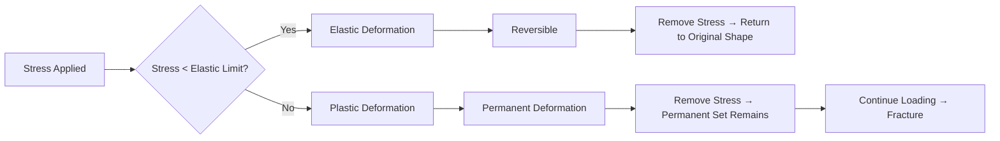

# Elastic and Plastic Regions / 弹性区与塑性区

---

# 1. Overview / 概述

**English:**
This sub-topic focuses on the two fundamental regimes of material deformation: elastic and plastic behaviour. When a material is subjected to stress, it initially deforms elastically — meaning it returns to its original shape when the load is removed. Beyond a critical point (the elastic limit or yield point), the material enters the plastic region, where permanent deformation occurs. Understanding the boundary between these regions is essential for [[Material Selection for Engineering Applications]], as engineers must know whether a component will spring back (elastic) or permanently bend (plastic) under load. This sub-topic is part of the broader [[Stress-Strain Graphs and Material Behaviour]] topic and builds directly on [[Stress, Strain and Young Modulus]].

**中文:**
本子知识点聚焦于材料变形的两个基本区域：弹性行为和塑性行为。当材料受到应力时，它首先发生弹性变形——即当载荷移除后，材料会恢复到原来的形状。超过临界点（弹性极限或屈服点）后，材料进入塑性区，发生永久变形。理解这两个区域之间的界限对于[[材料选择与工程应用]]至关重要，因为工程师必须知道一个部件在载荷下是会弹回（弹性）还是永久弯曲（塑性）。本子知识点是更广泛的[[应力-应变图与材料行为]]主题的一部分，并直接建立在[[应力、应变与杨氏模量]]的基础上。

---

# 2. Syllabus Learning Objectives / 考纲学习目标

| CAIE 9702 | Edexcel IAL |
|-----------|-------------|
| 6.3(a) Distinguish between elastic and plastic deformation of a material | 2.13 Distinguish between elastic and plastic deformation |
| 6.3(b) Define and use the terms elastic limit, yield point, and breaking stress | 2.14 Define elastic limit, yield point, and breaking stress |
| 6.3(c) Describe the behaviour of materials in the elastic and plastic regions | 2.15 Describe the behaviour of materials in elastic and plastic regions |
| 6.3(d) Interpret stress-strain graphs to identify elastic and plastic regions | 2.16 Interpret stress-strain graphs to identify elastic and plastic regions |
| 6.3(e) Explain the concept of elastic hysteresis | 2.17 Explain elastic hysteresis |
| — | 2.18 Describe the difference between ductile and brittle materials in terms of plastic deformation |

**Examiner Expectations / 考官期望:**
- **English:** Students must be able to define elastic and plastic deformation precisely, identify the elastic limit and yield point on a stress-strain graph, and explain the physical meaning of each region. For Edexcel, students must also compare ductile and brittle materials in terms of their plastic deformation.
- **中文:** 学生必须能够精确定义弹性变形和塑性变形，在应力-应变图上识别弹性极限和屈服点，并解释每个区域的物理含义。对于Edexcel，学生还必须比较延性材料和脆性材料在塑性变形方面的差异。

---

# 3. Core Definitions / 核心定义

| Term (EN/CN) | Definition (EN) | Definition (CN) | Common Mistakes / 常见错误 |
|--------------|-----------------|-----------------|---------------------------|
| **Elastic Deformation** / 弹性变形 | Deformation that is reversible; the material returns to its original shape and size when the applied stress is removed. | 可逆的变形；当施加的应力移除后，材料恢复到原来的形状和尺寸。 | ❌ Confusing "reversible" with "no energy loss" — elastic deformation can involve energy dissipation (hysteresis). |
| **Plastic Deformation** / 塑性变形 | Deformation that is permanent; the material does not return to its original shape when the applied stress is removed. | 永久变形；当施加的应力移除后，材料不会恢复到原来的形状。 | ❌ Thinking plastic deformation always leads to immediate fracture — it can be extensive in ductile materials. |
| **Elastic Limit** / 弹性极限 | The maximum stress a material can withstand without undergoing permanent (plastic) deformation. | 材料能够承受而不发生永久（塑性）变形的最大应力。 | ❌ Confusing with the yield point — the elastic limit is the boundary; the yield point is where plastic deformation becomes noticeable. |
| **Yield Point** / 屈服点 | The stress at which a material begins to deform plastically, often marked by a sudden increase in strain without a significant increase in stress. | 材料开始发生塑性变形的应力点，通常表现为应变突然增加而应力没有显著增加。 | ❌ Assuming all materials have a clear yield point — brittle materials do not. |
| **Elastic Hysteresis** / 弹性滞后 | The phenomenon where the unloading curve of a material differs from the loading curve, resulting in energy dissipation as heat. | 材料的卸载曲线与加载曲线不同的现象，导致能量以热量形式耗散。 | ❌ Thinking hysteresis only occurs in plastic deformation — it can occur in elastic deformation of polymers and rubber. |
| **Permanent Set** / 永久变形 | The residual strain remaining in a material after the applied stress is removed, indicating plastic deformation has occurred. | 施加的应力移除后材料中残留的应变，表明发生了塑性变形。 | ❌ Confusing with "elastic after-effect" — permanent set is irreversible; elastic after-effect is time-dependent recovery. |

---

# 4. Key Concepts Explained / 关键概念详解

## 4.1 Elastic Region / 弹性区

### Explanation / 解释
**English:** The elastic region is the portion of a [[Stress-Strain Graph for a Ductile Material (Copper)]] where Hooke's Law is obeyed (stress ∝ strain). In this region, the material behaves like an ideal spring: atoms are displaced from their equilibrium positions but return when the stress is removed. The gradient of the linear portion is the [[Young Modulus]] ($E = \sigma / \varepsilon$). For most metals, the elastic region is small (strain < 0.01), but for [[Stress-Strain Graph for a Polymeric Material (Rubber)]], it can be very large (strain > 5).

**中文:** 弹性区是[[延性材料（铜）的应力-应变图]]中胡克定律成立的部分（应力 ∝ 应变）。在这个区域，材料表现得像理想弹簧：原子从其平衡位置发生位移，但当应力移除后恢复。线性部分的梯度是[[杨氏模量]]（$E = \sigma / \varepsilon$）。对于大多数金属，弹性区很小（应变 < 0.01），但对于[[聚合材料（橡胶）的应力-应变图]]，它可以非常大（应变 > 5）。

### Physical Meaning / 物理意义
**English:** In the elastic region, interatomic bonds are stretched but not broken. The energy stored is recoverable elastic strain energy. The area under the stress-strain curve up to the elastic limit represents the elastic strain energy per unit volume ($U = \frac{1}{2} \sigma \varepsilon$).

**中文:** 在弹性区，原子间键被拉伸但未断裂。储存的能量是可恢复的弹性应变能。应力-应变曲线下直到弹性极限的面积代表单位体积的弹性应变能（$U = \frac{1}{2} \sigma \varepsilon$）。

### Common Misconceptions / 常见误区
- ❌ **English:** "Elastic deformation means the material is perfectly linear." — Rubber is elastic but non-linear.
- ❌ **中文:** "弹性变形意味着材料是完全线性的。" — 橡胶是弹性的但非线性的。
- ❌ **English:** "The elastic limit is the same as the proportional limit." — The proportional limit is where Hooke's Law ceases; the elastic limit is where permanent deformation begins. They are close but not identical.
- ❌ **中文:** "弹性极限与比例极限相同。" — 比例极限是胡克定律失效的点；弹性极限是永久变形开始的点。它们接近但不相同。

### Exam Tips / 考试提示
- **English:** Always state that in the elastic region, the material returns to its original shape when the load is removed. Use the phrase "reversible deformation."
- **中文:** 始终说明在弹性区，当载荷移除后材料恢复到原来的形状。使用"可逆变形"这一表述。

> 📷 **IMAGE PROMPT — EPR-01: Elastic Region on Stress-Strain Graph**
> A clear stress-strain graph for a ductile metal (e.g., copper) with the elastic region highlighted in green. The linear portion is labeled with gradient = Young Modulus. The elastic limit is marked with a dashed vertical line. The area under the curve up to the elastic limit is shaded to represent elastic strain energy. Labels: "Elastic Region," "Hooke's Law Obeyed," "Reversible Deformation."

---

## 4.2 Plastic Region / 塑性区

### Explanation / 解释
**English:** The plastic region begins at the yield point (or elastic limit) and continues until fracture. In this region, the material undergoes permanent deformation: atoms slide past each other along slip planes (in crystalline materials) or polymer chains uncoil and slide (in polymers). The stress-strain curve is non-linear, and the material does not return to its original shape. For ductile materials like copper, the plastic region is extensive and includes [[Necking and Fracture]]. For brittle materials like glass, there is essentially no plastic region — they fracture at the elastic limit.

**中文:** 塑性区从屈服点（或弹性极限）开始，一直持续到断裂。在这个区域，材料发生永久变形：原子沿滑移面相互滑过（在晶体材料中）或聚合物链解开并滑动（在聚合物中）。应力-应变曲线是非线性的，材料不会恢复到原来的形状。对于像铜这样的延性材料，塑性区很大，包括[[颈缩与断裂]]。对于像玻璃这样的脆性材料，基本上没有塑性区——它们在弹性极限处断裂。

### Physical Meaning / 物理意义
**English:** In the plastic region, interatomic bonds are broken and reformed in new positions. The energy stored is dissipated as heat (plastic work). The area under the stress-strain curve in the plastic region represents the plastic work done per unit volume, which is much larger than the elastic strain energy for ductile materials.

**中文:** 在塑性区，原子间键被断裂并在新位置重新形成。储存的能量以热量形式耗散（塑性功）。应力-应变曲线下塑性区的面积代表单位体积所做的塑性功，对于延性材料来说远大于弹性应变能。

### Common Misconceptions / 常见误区
- ❌ **English:** "Plastic deformation always means the material is about to break." — Ductile materials can undergo extensive plastic deformation before fracture.
- ❌ **中文:** "塑性变形总是意味着材料即将断裂。" — 延性材料在断裂前可以经历大量的塑性变形。
- ❌ **English:** "The yield point is always clearly visible on a stress-strain graph." — Some materials (e.g., aluminum) have a gradual transition from elastic to plastic, making the yield point hard to identify.
- ❌ **中文:** "屈服点在应力-应变图上总是清晰可见。" — 有些材料（如铝）从弹性到塑性的过渡是渐进的，使得屈服点难以识别。

### Exam Tips / 考试提示
- **English:** Use the phrase "permanent deformation" to describe plastic behaviour. For ductile materials, mention that plastic deformation involves "slip along crystal planes."
- **中文:** 使用"永久变形"来描述塑性行为。对于延性材料，提到塑性变形涉及"沿晶面的滑移"。

> 📷 **IMAGE PROMPT — EPR-02: Plastic Region on Stress-Strain Graph**
> A stress-strain graph for a ductile metal with the plastic region highlighted in red. The yield point is marked with an arrow. The curve shows a plateau (yield point extension) followed by work hardening. The area under the curve in the plastic region is shaded to represent plastic work. Labels: "Plastic Region," "Permanent Deformation," "Slip Planes Active."

---

## 4.3 Elastic Hysteresis / 弹性滞后

### Explanation / 解释
**English:** Elastic hysteresis occurs when the loading and unloading curves of a material do not follow the same path. This is common in [[Stress-Strain Graph for a Polymeric Material (Rubber)]] and some biological tissues. The area between the loading and unloading curves represents energy dissipated as heat per cycle. This is important in applications like shock absorbers and vibration dampers.

**中文:** 弹性滞后发生在材料的加载和卸载曲线不遵循相同路径时。这在[[聚合材料（橡胶）的应力-应变图]]和一些生物组织中很常见。加载和卸载曲线之间的面积代表每个循环中以热量形式耗散的能量。这在减震器和振动阻尼器等应用中很重要。

### Physical Meaning / 物理意义
**English:** During loading, energy is stored in the material. During unloading, not all of this energy is recovered — some is lost as heat due to internal friction (e.g., polymer chain rearrangement). The hysteresis loop area equals the energy dissipated per unit volume per cycle.

**中文:** 在加载过程中，能量储存在材料中。在卸载过程中，并非所有能量都能恢复——部分能量由于内部摩擦（如聚合物链重排）以热量形式损失。滞后回线面积等于每个循环每单位体积耗散的能量。

### Common Misconceptions / 常见误区
- ❌ **English:** "Hysteresis only occurs in plastic deformation." — Hysteresis can occur in purely elastic deformation of viscoelastic materials.
- ❌ **中文:** "滞后只发生在塑性变形中。" — 滞后可以发生在粘弹性材料的纯弹性变形中。
- ❌ **English:** "The hysteresis loop is always the same size regardless of loading rate." — The loop size depends on loading rate for viscoelastic materials.
- ❌ **中文:** "无论加载速率如何，滞后回线的大小总是相同的。" — 对于粘弹性材料，回线大小取决于加载速率。

### Exam Tips / 考试提示
- **English:** Draw the hysteresis loop clearly, showing the loading curve above the unloading curve. Label the area as "energy dissipated as heat."
- **中文:** 清晰地画出滞后回线，显示加载曲线在卸载曲线上方。将面积标注为"以热量形式耗散的能量"。

> 📷 **IMAGE PROMPT — EPR-03: Elastic Hysteresis Loop**
> A stress-strain graph showing a hysteresis loop for a rubber-like material. The loading curve (upward arrow) is above the unloading curve (downward arrow). The area between them is shaded and labeled "Energy Dissipated as Heat." The material returns to zero strain (no permanent set). Labels: "Loading," "Unloading," "Hysteresis Loop."

---

# 5. Essential Equations / 核心公式

## 5.1 Elastic Strain Energy Density / 弹性应变能密度

$$ U = \frac{1}{2} \sigma \varepsilon $$

| Symbol (符号) | Meaning (EN) | Meaning (CN) | Unit (单位) |
|--------------|-------------|-------------|------------|
| $U$ | Elastic strain energy per unit volume | 单位体积弹性应变能 | J m⁻³ |
| $\sigma$ | Stress | 应力 | Pa (N m⁻²) |
| $\varepsilon$ | Strain | 应变 | dimensionless (无量纲) |

**Derivation / 推导:**
For a linear elastic material, work done = area under force-extension graph = $\frac{1}{2} F \Delta L$. Dividing by volume $AL$ gives $U = \frac{1}{2} \sigma \varepsilon$.

**Conditions / 适用条件:**
- **English:** Only valid for linear elastic behaviour (Hooke's Law region). For non-linear elastic materials, the area under the curve must be integrated.
- **中文:** 仅适用于线性弹性行为（胡克定律区域）。对于非线性弹性材料，必须对曲线下的面积进行积分。

**Limitations / 局限性:**
- **English:** Does not account for energy dissipated as heat in hysteresis or plastic deformation.
- **中文:** 不考虑滞后或塑性变形中以热量形式耗散的能量。

## 5.2 Plastic Work Density / 塑性功密度

$$ W_p = \int_{\varepsilon_y}^{\varepsilon_f} \sigma \, d\varepsilon $$

| Symbol (符号) | Meaning (EN) | Meaning (CN) | Unit (单位) |
|--------------|-------------|-------------|------------|
| $W_p$ | Plastic work per unit volume | 单位体积塑性功 | J m⁻³ |
| $\varepsilon_y$ | Strain at yield point | 屈服点应变 | dimensionless (无量纲) |
| $\varepsilon_f$ | Strain at fracture | 断裂应变 | dimensionless (无量纲) |

**Derivation / 推导:**
Work done = area under stress-strain curve in plastic region. Since the curve is non-linear, integration is required.

**Conditions / 适用条件:**
- **English:** Valid for any material undergoing plastic deformation. The integral must be evaluated numerically or graphically.
- **中文:** 适用于任何发生塑性变形的材料。必须通过数值或图形方法评估积分。

**Limitations / 局限性:**
- **English:** Assumes uniform deformation — does not account for necking where strain is localized.
- **中文:** 假设均匀变形——不考虑颈缩，其中应变是局部化的。

---

# 6. Graphs and Relationships / 图表与关系

## 6.1 Stress-Strain Graph Showing Elastic and Plastic Regions / 显示弹性区和塑性区的应力-应变图

### Axes / 坐标轴
- **X-axis:** Strain ($\varepsilon$) — dimensionless / 应变（$\varepsilon$）— 无量纲
- **Y-axis:** Stress ($\sigma$) — Pa / 应力（$\sigma$）— 帕斯卡

### Shape / 形状
- **English:** The graph starts with a linear region (elastic), followed by a non-linear region (plastic). For ductile materials, the plastic region shows a yield plateau, then work hardening, then necking. For brittle materials, the graph is linear up to fracture with no plastic region.
- **中文:** 图形从线性区域（弹性）开始，随后是非线性区域（塑性）。对于延性材料，塑性区显示屈服平台，然后是加工硬化，然后是颈缩。对于脆性材料，图形线性上升直到断裂，没有塑性区。

### Gradient Meaning / 斜率含义
- **Elastic region:** Gradient = [[Young Modulus]] ($E$) — stiffness of the material.
- **Plastic region:** Gradient decreases; at the yield point, gradient ≈ 0 (yield plateau). In work hardening, gradient increases again but is less than $E$.

### Area Meaning / 面积含义
- **Area under elastic region:** Elastic strain energy per unit volume ($U = \frac{1}{2} \sigma \varepsilon$).
- **Area under plastic region:** Plastic work per unit volume ($W_p$).
- **Total area under curve:** Total energy absorbed per unit volume before fracture (toughness).

### Exam Interpretation / 考试解读
- **English:** Identify the elastic limit as the point where the graph deviates from linearity. The yield point is where plastic deformation becomes significant. For materials without a clear yield point, use the 0.2% offset method.
- **中文:** 将弹性极限识别为图形偏离线性的点。屈服点是塑性变形变得显著的点。对于没有明显屈服点的材料，使用0.2%偏移法。



---

# 7. Required Diagrams / 必备图表

## 7.1 Stress-Strain Graph with Elastic and Plastic Regions Labeled / 标注弹性区和塑性区的应力-应变图

### Description / 描述
**English:** A complete stress-strain graph for a ductile material (e.g., copper) showing the elastic region (linear), yield point, plastic region (non-linear), and fracture point. The elastic limit is marked, and the area under the elastic region is shaded differently from the plastic region.

**中文:** 延性材料（如铜）的完整应力-应变图，显示弹性区（线性）、屈服点、塑性区（非线性）和断裂点。弹性极限被标记，弹性区下的面积与塑性区下的面积用不同颜色阴影表示。

### Image Prompt / 图片生成提示
> 📷 **IMAGE PROMPT — EPR-04: Complete Stress-Strain Graph with Regions**
> A detailed stress-strain graph for a ductile metal. The elastic region (0 to elastic limit) is shaded in light green and labeled "Elastic Region — Reversible." The plastic region (elastic limit to fracture) is shaded in light red and labeled "Plastic Region — Permanent." The yield point is marked with a dashed line and arrow. The fracture point is marked with an "X." The area under the elastic region is labeled "Elastic Strain Energy," and the area under the plastic region is labeled "Plastic Work." Axes: Stress (MPa) on y-axis, Strain on x-axis.

### Labels Required / 需要标注
| English | 中文 |
|---------|------|
| Elastic Region | 弹性区 |
| Plastic Region | 塑性区 |
| Elastic Limit | 弹性极限 |
| Yield Point | 屈服点 |
| Fracture Point | 断裂点 |
| Elastic Strain Energy | 弹性应变能 |
| Plastic Work | 塑性功 |

### Exam Importance / 考试重要性
- **English:** High — students are frequently asked to sketch and label stress-strain graphs, identifying the elastic and plastic regions.
- **中文:** 高——学生经常被要求绘制并标注应力-应变图，识别弹性区和塑性区。

---

## 7.2 Elastic Hysteresis Loop / 弹性滞后回线

### Description / 描述
**English:** A stress-strain graph showing a loading and unloading cycle for a rubber-like material. The loading curve is above the unloading curve, forming a loop. The material returns to zero strain (no permanent set), but energy is dissipated.

**中文:** 显示橡胶类材料加载和卸载循环的应力-应变图。加载曲线在卸载曲线上方，形成一个回线。材料恢复到零应变（无永久变形），但能量被耗散。

### Image Prompt / 图片生成提示
> 📷 **IMAGE PROMPT — EPR-05: Elastic Hysteresis Loop for Rubber**
> A stress-strain graph showing a hysteresis loop. The loading curve (solid line, arrow pointing up-right) is above the unloading curve (dashed line, arrow pointing down-left). The loop is shaded in light blue and labeled "Hysteresis Loop — Energy Dissipated as Heat." The material returns to zero strain on the x-axis. Labels: "Loading," "Unloading," "No Permanent Set." Axes: Stress (MPa) on y-axis, Strain on x-axis.

### Labels Required / 需要标注
| English | 中文 |
|---------|------|
| Loading Curve | 加载曲线 |
| Unloading Curve | 卸载曲线 |
| Hysteresis Loop | 滞后回线 |
| Energy Dissipated as Heat | 以热量形式耗散的能量 |

### Exam Importance / 考试重要性
- **English:** Medium — Edexcel specifically mentions elastic hysteresis (2.17). CAIE may ask about it in the context of rubber.
- **中文:** 中——Edexcel特别提到弹性滞后（2.17）。CAIE可能在橡胶的背景下提问。

---

# 8. Worked Examples / 典型例题

## Example 1: Identifying Elastic and Plastic Regions / 识别弹性区和塑性区

### Question / 题目
**English:**
A copper wire of length 2.00 m and cross-sectional area $1.5 \times 10^{-6} \text{ m}^2$ is subjected to a tensile force. The stress-strain graph shows a linear region up to a stress of $2.0 \times 10^8 \text{ Pa}$, after which the graph becomes non-linear. The wire fractures at a stress of $4.0 \times 10^8 \text{ Pa}$ and a strain of 0.40.

(a) State the elastic limit of the copper wire.
(b) Calculate the elastic strain energy stored per unit volume at the elastic limit.
(c) Explain why the wire does not return to its original length if the stress is increased beyond the elastic limit and then removed.

**中文:**
一根长度为2.00米、横截面积为$1.5 \times 10^{-6} \text{ m}^2$的铜线受到拉伸力。应力-应变图显示线性区域直到应力为$2.0 \times 10^8 \text{ Pa}$，之后图形变为非线性。该线在应力为$4.0 \times 10^8 \text{ Pa}$、应变为0.40时断裂。

(a) 指出铜线的弹性极限。
(b) 计算在弹性极限处每单位体积储存的弹性应变能。
(c) 解释为什么如果应力增加到超过弹性极限然后移除，该线不会恢复到原来的长度。

### Solution / 解答

**(a)** The elastic limit is the maximum stress at which the material returns to its original shape when the stress is removed. From the graph, this is $2.0 \times 10^8 \text{ Pa}$.

弹性极限是材料在应力移除后恢复到原来形状的最大应力。从图中可知，这是$2.0 \times 10^8 \text{ Pa}$。

**(b)** Elastic strain energy per unit volume:

$$ U = \frac{1}{2} \sigma \varepsilon $$

First, find the strain at the elastic limit. Since the region is linear, we can use Hooke's Law. However, we need the Young Modulus. From the linear region:

$$ E = \frac{\sigma}{\varepsilon} $$

But we don't have $\varepsilon$ directly. We can use the fact that the gradient is constant. Let's assume the strain at the elastic limit is $\varepsilon_e$. Then:

$$ U = \frac{1}{2} \sigma_e \varepsilon_e $$

We need $\varepsilon_e$. If we assume the Young Modulus of copper is $1.2 \times 10^{11} \text{ Pa}$ (typical value), then:

$$ \varepsilon_e = \frac{\sigma_e}{E} = \frac{2.0 \times 10^8}{1.2 \times 10^{11}} = 1.67 \times 10^{-3} $$

$$ U = \frac{1}{2} \times (2.0 \times 10^8) \times (1.67 \times 10^{-3}) = 1.67 \times 10^5 \text{ J m}^{-3} $$

单位体积弹性应变能：

$$ U = \frac{1}{2} \sigma \varepsilon $$

首先，找到弹性极限处的应变。由于该区域是线性的，我们可以使用胡克定律。但是，我们需要杨氏模量。从线性区域：

$$ E = \frac{\sigma}{\varepsilon} $$

但我们没有直接得到$\varepsilon$。我们可以利用梯度是常数的事实。假设弹性极限处的应变为$\varepsilon_e$。那么：

$$ U = \frac{1}{2} \sigma_e \varepsilon_e $$

我们需要$\varepsilon_e$。如果我们假设铜的杨氏模量为$1.2 \times 10^{11} \text{ Pa}$（典型值），那么：

$$ \varepsilon_e = \frac{\sigma_e}{E} = \frac{2.0 \times 10^8}{1.2 \times 10^{11}} = 1.67 \times 10^{-3} $$

$$ U = \frac{1}{2} \times (2.0 \times 10^8) \times (1.67 \times 10^{-3}) = 1.67 \times 10^5 \text{ J m}^{-3} $$

**(c)** If the stress is increased beyond the elastic limit, the wire undergoes plastic deformation. In the plastic region, atoms slide past each other along slip planes, and interatomic bonds are broken and reformed in new positions. When the stress is removed, the wire does not return to its original length because the atomic positions have changed permanently. The wire retains a permanent set (residual strain).

如果应力增加到超过弹性极限，该线会发生塑性变形。在塑性区，原子沿滑移面相互滑过，原子间键被断裂并在新位置重新形成。当应力移除后，该线不会恢复到原来的长度，因为原子位置已经永久改变。该线保留永久变形（残余应变）。

### Final Answer / 最终答案
**Answer:**
(a) $2.0 \times 10^8 \text{ Pa}$
(b) $1.67 \times 10^5 \text{ J m}^{-3}$
(c) Plastic deformation causes permanent atomic rearrangement.

**答案：**
(a) $2.0 \times 10^8 \text{ Pa}$
(b) $1.67 \times 10^5 \text{ J m}^{-3}$
(c) 塑性变形导致原子永久重排。

### Quick Tip / 提示
- **English:** Always state the elastic limit as a stress value (Pa), not a force. For part (c), use the phrase "permanent atomic rearrangement" or "slip along crystal planes."
- **中文:** 始终将弹性极限表示为应力值（Pa），而不是力。对于(c)部分，使用"原子永久重排"或"沿晶面的滑移"这一表述。

---

## Example 2: Elastic Hysteresis / 弹性滞后

### Question / 题目
**English:**
A rubber band is stretched to a strain of 2.0 and then allowed to return to its original length. The loading curve follows the path $\sigma = 5.0 \times 10^5 \varepsilon$ (in Pa), and the unloading curve follows $\sigma = 5.0 \times 10^5 (\varepsilon - 0.5)$ (in Pa) for $\varepsilon \geq 0.5$, and $\sigma = 0$ for $\varepsilon < 0.5$.

(a) Sketch the loading and unloading curves on a stress-strain graph.
(b) Calculate the energy dissipated per unit volume during one cycle.
(c) State one practical application of elastic hysteresis.

**中文:**
一根橡皮筋被拉伸到应变为2.0，然后允许其恢复到原来的长度。加载曲线遵循路径$\sigma = 5.0 \times 10^5 \varepsilon$（单位Pa），卸载曲线遵循$\sigma = 5.0 \times 10^5 (\varepsilon - 0.5)$（单位Pa）对于$\varepsilon \geq 0.5$，且$\sigma = 0$对于$\varepsilon < 0.5$。

(a) 在应力-应变图上画出加载和卸载曲线。
(b) 计算一个循环中每单位体积耗散的能量。
(c) 指出弹性滞后的一种实际应用。

### Solution / 解答

**(a)** The loading curve is a straight line from (0, 0) to (2.0, $1.0 \times 10^6$ Pa). The unloading curve is a straight line from (2.0, $1.0 \times 10^6$ Pa) to (0.5, 0), then horizontal to (0, 0).

加载曲线是从(0, 0)到(2.0, $1.0 \times 10^6$ Pa)的直线。卸载曲线是从(2.0, $1.0 \times 10^6$ Pa)到(0.5, 0)的直线，然后水平到(0, 0)。

**(b)** The energy dissipated per unit volume is the area between the loading and unloading curves.

Area = Area under loading curve - Area under unloading curve

Area under loading curve (triangle): $\frac{1}{2} \times 2.0 \times 1.0 \times 10^6 = 1.0 \times 10^6 \text{ J m}^{-3}$

Area under unloading curve (triangle): $\frac{1}{2} \times (2.0 - 0.5) \times 1.0 \times 10^6 = 0.75 \times 10^6 \text{ J m}^{-3}$

Energy dissipated = $1.0 \times 10^6 - 0.75 \times 10^6 = 2.5 \times 10^5 \text{ J m}^{-3}$

每单位体积耗散的能量是加载和卸载曲线之间的面积。

面积 = 加载曲线下面积 - 卸载曲线下面积

加载曲线下面积（三角形）：$\frac{1}{2} \times 2.0 \times 1.0 \times 10^6 = 1.0 \times 10^6 \text{ J m}^{-3}$

卸载曲线下面积（三角形）：$\frac{1}{2} \times (2.0 - 0.5) \times 1.0 \times 10^6 = 0.75 \times 10^6 \text{ J m}^{-3}$

耗散能量 = $1.0 \times 10^6 - 0.75 \times 10^6 = 2.5 \times 10^5 \text{ J m}^{-3}$

**(c)** Practical applications include: shock absorbers in vehicles, vibration dampers in buildings, and rubber mounts for machinery.

实际应用包括：车辆减震器、建筑物振动阻尼器和机器橡胶支座。

### Final Answer / 最终答案
**Answer:**
(a) See sketch.
(b) $2.5 \times 10^5 \text{ J m}^{-3}$
(c) Shock absorbers, vibration dampers, rubber mounts.

**答案：**
(a) 见草图。
(b) $2.5 \times 10^5 \text{ J m}^{-3}$
(c) 减震器、振动阻尼器、橡胶支座。

### Quick Tip / 提示
- **English:** The area between loading and unloading curves always represents energy dissipated as heat. For linear curves, use triangle area formulas.
- **中文:** 加载和卸载曲线之间的面积始终代表以热量形式耗散的能量。对于线性曲线，使用三角形面积公式。

---

# 9. Past Paper Question Types / 历年真题题型

| Question Type / 题型 | Frequency / 频率 | Difficulty / 难度 | Past Paper References / 真题索引 |
|----------------------|------------------|------------------|-------------------------------|
| Define elastic and plastic deformation | High | Easy | 📝 *待填入* |
| Identify elastic limit and yield point on a graph | High | Medium | 📝 *待填入* |
| Calculate elastic strain energy density | Medium | Medium | 📝 *待填入* |
| Explain elastic hysteresis | Low-Medium | Medium | 📝 *待填入* |
| Compare ductile and brittle materials in plastic region | Medium (Edexcel) | Medium | 📝 *待填入* |
| Sketch stress-strain graph showing regions | High | Medium | 📝 *待填入* |

**Common Command Words / 常见指令词:**
- **English:** Define, Distinguish, Identify, Explain, Calculate, Sketch, Describe
- **中文:** 定义、区分、识别、解释、计算、绘制、描述

---

# 10. Practical Skills Connections / 实验技能链接

**English:**
This sub-topic connects to practical work in several ways:

1. **Tensile Testing:** Students may perform a tensile test on a wire (e.g., copper or steel) to obtain a force-extension graph, which is converted to a stress-strain graph. The elastic and plastic regions are identified from the graph.

2. **Measurements:**
   - Original length ($L_0$) using a metre ruler (±0.001 m)
   - Extension ($\Delta L$) using a vernier scale or micrometer (±0.0001 m)
   - Diameter using a micrometer screw gauge (±0.01 mm) to calculate cross-sectional area
   - Force using a newton meter or weights (±0.01 N)

3. **Uncertainties:**
   - Percentage uncertainty in stress: $\frac{\Delta \sigma}{\sigma} = \frac{\Delta F}{F} + 2\frac{\Delta d}{d}$
   - Percentage uncertainty in strain: $\frac{\Delta \varepsilon}{\varepsilon} = \frac{\Delta (\Delta L)}{\Delta L} + \frac{\Delta L_0}{L_0}$
   - Error bars on stress-strain graph

4. **Graph Plotting:**
   - Plot stress (y-axis) against strain (x-axis)
   - Identify the linear region and calculate gradient = Young Modulus
   - Identify the point where the graph deviates from linearity (elastic limit)

5. **Experimental Design:**
   - Use a long wire to maximize extension for a given strain
   - Use a reference wire to compensate for thermal expansion
   - Apply loads gradually to avoid dynamic effects

**中文:**
本子知识点通过多种方式与实验工作联系：

1. **拉伸测试：** 学生可以对金属丝（如铜或钢）进行拉伸测试，获得力-伸长图，然后转换为应力-应变图。从图中识别弹性区和塑性区。

2. **测量：**
   - 原始长度（$L_0$）使用米尺（±0.001 m）
   - 伸长量（$\Delta L$）使用游标尺或千分尺（±0.0001 m）
   - 直径使用千分尺（±0.01 mm）以计算横截面积
   - 力使用牛顿计或砝码（±0.01 N）

3. **不确定度：**
   - 应力的百分比不确定度：$\frac{\Delta \sigma}{\sigma} = \frac{\Delta F}{F} + 2\frac{\Delta d}{d}$
   - 应变的百分比不确定度：$\frac{\Delta \varepsilon}{\varepsilon} = \frac{\Delta (\Delta L)}{\Delta L} + \frac{\Delta L_0}{L_0}$
   - 应力-应变图上的误差棒

4. **绘图：**
   - 绘制应力（y轴）对应变（x轴）的图
   - 识别线性区域并计算梯度 = 杨氏模量
   - 识别图形偏离线性的点（弹性极限）

5. **实验设计：**
   - 使用长金属丝以最大化给定应变的伸长量
   - 使用参考金属丝以补偿热膨胀
   - 逐渐施加载荷以避免动态效应

---

# 11. Concept Map / 概念图谱

```mermaid
graph TD
    %% Core concept
    A[Elastic and Plastic Regions] --> B[Elastic Deformation]
    A --> C[Plastic Deformation]
    
    %% Elastic branch
    B --> D[Reversible]
    B --> E[Hooke's Law Region]
    B --> F[Young Modulus]
    B --> G[Elastic Strain Energy]
    B --> H[Elastic Hysteresis]
    
    %% Plastic branch
    C --> I[Permanent Deformation]
    C --> J[Yield Point]
    C --> K[Plastic Work]
    C --> L[Necking and Fracture]
    
    %% Connections to other topics
    A --> M[[Stress-Strain Graphs and Material Behaviour]]
    A --> N[[Stress, Strain and Young Modulus]]
    A --> O[[Material Selection for Engineering Applications]]
    
    %% Material types
    J --> P[[Stress-Strain Graph for a Ductile Material (Copper)]]
    J --> Q[[Stress-Strain Graph for a Brittle Material (Glass)]]
    H --> R[[Stress-Strain Graph for a Polymeric Material (Rubber)]]
    
    %% Practical connections
    G --> S[Elastic Strain Energy Density: U = ½σε]
    K --> T[Plastic Work: Wp = ∫σ dε]
    
    %% Exam focus
    D --> U[Exam: Define reversible deformation]
    I --> V[Exam: Define permanent deformation]
    J --> W[Exam: Identify on graph]
```

---

# 12. Quick Revision Sheet / 速查表

| Category / 类别 | Key Points / 要点 |
|----------------|------------------|
| **Definition / 定义** | **Elastic:** Reversible deformation — material returns to original shape when stress removed. **Plastic:** Permanent deformation — material does not return to original shape. |
| **Key Formula / 核心公式** | Elastic strain energy density: $U = \frac{1}{2} \sigma \varepsilon$ (linear region only). Plastic work: $W_p = \int \sigma \, d\varepsilon$ (area under plastic region). |
| **Key Graph / 核心图表** | Stress-strain graph: Linear region (elastic) → Yield point → Non-linear region (plastic) → Fracture. Hysteresis loop: Loading curve above unloading curve; area = energy dissipated as heat. |
| **Key Terms / 关键术语** | **Elastic Limit:** Maximum stress without permanent deformation. **Yield Point:** Stress where plastic deformation begins. **Permanent Set:** Residual strain after stress removal. **Elastic Hysteresis:** Different loading/unloading paths. |
| **Common Mistakes / 常见错误** | ❌ Confusing elastic limit with proportional limit. ❌ Thinking all materials have a clear yield point. ❌ Assuming hysteresis only occurs in plastic deformation. ❌ Forgetting that elastic deformation can be non-linear (rubber). |
| **Exam Tip / 考试提示** | Always use "reversible" for elastic and "permanent" for plastic. For graph questions, clearly label the elastic limit, yield point, and fracture point. For hysteresis, draw the loop and label the area as "energy dissipated." |
| **Practical Link / 实验联系** | Tensile test: Measure force and extension, convert to stress and strain, identify elastic and plastic regions from graph. Use long wire for accuracy. |
| **Board Differences / 考纲差异** | **CIE:** Focus on distinguishing elastic/plastic, defining elastic limit and yield point. **Edexcel:** Also requires comparison of ductile vs. brittle materials in plastic region, and explicit coverage of elastic hysteresis (2.17). |