# 1. Overview / 概述

**English:**
This sub-topic explores the final stage of material deformation — **necking** and **fracture**. Necking is a localized reduction in cross-sectional area that occurs in [[Ductile Materials]] after the [[Ultimate Tensile Strength (UTS)]] is reached. Fracture is the complete separation of a material under stress. Understanding these phenomena is critical for [[Material Selection for Engineering Applications]], as they determine a material's toughness, ductility, and failure mode. This leaf node builds directly on [[Stress-Strain Graphs and Material Behaviour]] and the [[Elastic and Plastic Regions]] of deformation.

**中文:**
本子知识点探讨材料变形的最后阶段——**颈缩**和**断裂**。颈缩是在达到[[极限抗拉强度 (UTS)]]后，材料横截面积发生局部减小的现象。断裂是材料在应力作用下完全分离。理解这些现象对于[[工程应用中的材料选择]]至关重要，因为它们决定了材料的韧性、延展性和失效模式。本叶节点直接建立在[[应力-应变图与材料行为]]和[[弹性和塑性区域]]的变形基础上。

---

# 2. Syllabus Learning Objectives / 考纲学习目标

| CAIE 9702 | Edexcel IAL |
|-----------|-------------|
| 6.3(a): Describe the behaviour of materials under tensile stress, including necking and fracture | 2.13: Describe the behaviour of materials under tensile stress, including necking and fracture |
| 6.3(b): Distinguish between ductile and brittle behaviour | 2.14: Distinguish between ductile and brittle behaviour |
| 6.3(c): Interpret stress-strain graphs for ductile and brittle materials | 2.15: Interpret stress-strain graphs for ductile and brittle materials |
| 6.3(d): Define and calculate toughness from area under stress-strain curve | 2.16: Define and calculate toughness from area under stress-strain curve |
| 6.3(e): Explain the significance of the fracture point | 2.17: Explain the significance of the fracture point |
| — | 2.18: Describe the effect of temperature on fracture behaviour |

**Examiner Expectations / 考官期望:**
- **English:** You must be able to identify necking and fracture points on a [[Stress-Strain Graph for a Ductile Material (Copper)]]. You should explain why necking occurs (localized plastic instability) and distinguish between ductile fracture (with necking) and brittle fracture (without necking). You must also calculate toughness from the area under the curve.
- **中文:** 你必须能够在[[延性材料（铜）的应力-应变图]]上识别颈缩和断裂点。你应该解释颈缩发生的原因（局部塑性失稳），并区分延性断裂（有颈缩）和脆性断裂（无颈缩）。你还必须通过曲线下面积计算韧性。

---

# 3. Core Definitions / 核心定义

| Term (EN/CN) | Definition (EN) | Definition (CN) | Common Mistakes / 常见错误 |
|--------------|-----------------|-----------------|---------------------------|
| **Necking** / 颈缩 | Localized reduction in cross-sectional area that occurs in ductile materials after the ultimate tensile strength is reached, before fracture. | 在达到极限抗拉强度后、断裂前，延性材料中发生的横截面积局部减小。 | ❌ Confusing necking with uniform plastic deformation. Necking is **localized**, not uniform. |
| **Fracture** / 断裂 | The complete separation of a material into two or more pieces under stress. | 材料在应力作用下完全分离成两块或多块。 | ❌ Thinking fracture always occurs at the maximum stress. For ductile materials, fracture occurs **after** UTS. |
| **Ultimate Tensile Strength (UTS)** / 极限抗拉强度 | The maximum stress a material can withstand before necking begins. | 材料在颈缩开始前能承受的最大应力。 | ❌ Confusing UTS with fracture stress. UTS is the **peak** stress; fracture stress is lower. |
| **Fracture Stress** / 断裂应力 | The stress at which the material actually breaks. | 材料实际断裂时的应力。 | ❌ Assuming fracture stress = UTS. For ductile materials, fracture stress < UTS. |
| **Toughness** / 韧性 | The energy absorbed per unit volume before fracture, equal to the area under the stress-strain curve. | 断裂前单位体积吸收的能量，等于应力-应变曲线下的面积。 | ❌ Confusing toughness with strength. Toughness is about **energy absorption**, not just maximum stress. |
| **Ductile Fracture** / 延性断裂 | Fracture preceded by significant plastic deformation and necking. | 断裂前发生显著塑性变形和颈缩的断裂。 | ❌ Thinking all metals fracture the same way. Ductile fracture shows a **cup-and-cone** shape. |
| **Brittle Fracture** / 脆性断裂 | Fracture with little or no plastic deformation, occurring suddenly at or near the elastic limit. | 几乎没有塑性变形，在弹性极限处或附近突然发生的断裂。 | ❌ Assuming brittle materials have zero plastic deformation. Some have very small plastic regions. |

---

# 4. Key Concepts Explained / 关键概念详解

## 4.1 Necking Mechanism / 颈缩机制

### Explanation / 解释
**English:**
Necking begins when the [[Ultimate Tensile Strength (UTS)]] is reached. At this point, the material's strain-hardening capacity is exhausted, and further deformation concentrates in a small region. The cross-sectional area decreases locally, causing the **true stress** (force/actual area) to increase rapidly even though the **engineering stress** (force/original area) decreases. This is why the stress-strain curve drops after UTS. Necking is a form of **plastic instability** — the material cannot support the load uniformly anymore.

**中文:**
当达到[[极限抗拉强度 (UTS)]]时，颈缩开始。此时，材料的应变硬化能力耗尽，进一步的变形集中在一个小区域。横截面积局部减小，导致**真实应力**（力/实际面积）迅速增加，即使**工程应力**（力/原始面积）在减小。这就是应力-应变曲线在UTS后下降的原因。颈缩是一种**塑性失稳**——材料无法再均匀承受载荷。

### Physical Meaning / 物理意义
**English:**
Necking represents the transition from **uniform deformation** (where the entire gauge length stretches evenly) to **localized deformation** (where only a small region stretches). This is a critical failure warning in engineering — once necking starts, failure is imminent.

**中文:**
颈缩代表了从**均匀变形**（整个标距长度均匀拉伸）到**局部变形**（只有小区域拉伸）的转变。这在工程中是一个关键的失效警告——一旦颈缩开始，失效即将发生。

### Common Misconceptions / 常见误区
- ❌ **"Necking means the material is getting weaker."** — No, the material is actually getting **stronger** locally (true stress increases), but the reduced area cannot support the load.
- ❌ **"All materials neck before breaking."** — No, only [[Ductile Materials]] neck. [[Brittle Materials]] like [[Glass]] fracture without necking.
- ❌ **"The stress at fracture is the same as UTS."** — No, for ductile materials, fracture stress is **lower** than UTS on the engineering stress-strain curve.

### Exam Tips / 考试提示
- **English:** When drawing a stress-strain graph, clearly label the necking point (start of curve drop) and fracture point (end of curve). Explain that necking causes the drop in stress.
- **中文:** 画应力-应变图时，清楚标注颈缩点（曲线开始下降处）和断裂点（曲线结束处）。解释颈缩导致应力下降。

> 📷 **IMAGE PROMPT — NECKING-01: Necking in a Ductile Metal Specimen**
> A cylindrical metal specimen (e.g., copper or mild steel) after tensile testing, showing a clearly visible localized reduction in diameter (neck) near the center. The specimen should show a cup-and-cone fracture surface at the neck. Label: "Necking region", "Original diameter", "Reduced diameter". Clean white background, engineering drawing style with realistic shading.

---

## 4.2 Fracture Types / 断裂类型

### Explanation / 解释
**English:**
Fracture is classified into two main types:

1. **Ductile Fracture:** Occurs after significant plastic deformation and necking. The fracture surface shows a characteristic **cup-and-cone** shape — a fibrous, dull appearance. This is typical of metals like [[Copper]], [[Aluminum]], and [[Mild Steel]] at room temperature.

2. **Brittle Fracture:** Occurs suddenly with little or no plastic deformation. The fracture surface is flat, shiny, and perpendicular to the tensile axis. This is typical of [[Glass]], [[Cast Iron]], and [[Ceramics]]. Brittle fracture can occur at stresses below the yield point if there are cracks or flaws ([[Griffith's Theory of Brittle Fracture]]).

**中文:**
断裂分为两种主要类型：

1. **延性断裂：** 发生在显著的塑性变形和颈缩之后。断裂表面呈现特征性的**杯锥状**——纤维状、暗淡的外观。这是[[铜]]、[[铝]]和[[低碳钢]]等金属在室温下的典型特征。

2. **脆性断裂：** 突然发生，几乎没有塑性变形。断裂表面平坦、有光泽，且垂直于拉伸轴。这是[[玻璃]]、[[铸铁]]和[[陶瓷]]的典型特征。如果存在裂纹或缺陷，脆性断裂可能在低于屈服点的应力下发生（[[格里菲斯脆性断裂理论]]）。

### Physical Meaning / 物理意义
**English:**
The fracture type determines how a material fails in service. Ductile fracture gives **warning** (visible necking, deformation) before failure, which is safer in engineering. Brittle fracture gives **no warning** — catastrophic failure can occur suddenly.

**中文:**
断裂类型决定了材料在使用中如何失效。延性断裂在失效前给出**警告**（可见的颈缩、变形），这在工程中更安全。脆性断裂**没有警告**——灾难性失效可能突然发生。

### Common Misconceptions / 常见误区
- ❌ **"Brittle materials are always weaker than ductile materials."** — No, [[Glass]] has high compressive strength but fails in tension without warning.
- ❌ **"Ductile fracture is always better."** — Not always. In some applications (e.g., cutting tools), brittle fracture (sharp break) is desired.
- ❌ **"Temperature doesn't affect fracture type."** — It does! Some materials (e.g., [[Mild Steel]]) can transition from ductile to brittle at low temperatures ([[Ductile-to-Brittle Transition Temperature]]).

### Exam Tips / 考试提示
- **English:** Be prepared to compare ductile and brittle fracture in a table. Mention the **cup-and-cone** fracture surface for ductile materials and the **flat, shiny** surface for brittle materials.
- **中文:** 准备好用表格比较延性断裂和脆性断裂。提到延性材料的**杯锥状**断裂表面和脆性材料的**平坦、有光泽**表面。

> 📷 **IMAGE PROMPT — FRACTURE-01: Ductile vs Brittle Fracture Surfaces**
> Side-by-side comparison of two fractured metal specimens. Left: Ductile fracture showing cup-and-cone shape with fibrous, dull surface. Right: Brittle fracture showing flat, shiny, perpendicular surface. Labels: "Ductile (Cup-and-Cone)", "Brittle (Flat)". Clean engineering illustration style.

---

## 4.3 Toughness and Energy Absorption / 韧性与能量吸收

### Explanation / 解释
**English:**
**Toughness** is the ability of a material to absorb energy before fracturing. It is measured as the **area under the stress-strain curve** up to the fracture point. Toughness combines both **strength** (height of curve) and **ductility** (width of curve). A material can be strong but not tough (e.g., [[Glass]] — high UTS but zero ductility) or ductile but not tough (e.g., [[Rubber]] — large strain but low stress).

**中文:**
**韧性**是材料在断裂前吸收能量的能力。它通过**应力-应变曲线下直到断裂点的面积**来测量。韧性结合了**强度**（曲线高度）和**延展性**（曲线宽度）。材料可能强度高但不韧（如[[玻璃]]——UTS高但延展性为零），或延展性好但不韧（如[[橡胶]]——应变大但应力低）。

### Physical Meaning / 物理意义
**English:**
Toughness is critical for applications where impact or sudden loading occurs. For example, [[Car Bumpers]] need high toughness to absorb crash energy. [[Ceramic Tiles]] have low toughness — they shatter on impact.

**中文:**
韧性对于存在冲击或突然加载的应用至关重要。例如，[[汽车保险杠]]需要高韧性来吸收碰撞能量。[[瓷砖]]韧性低——受到冲击时会碎裂。

### Common Misconceptions / 常见误区
- ❌ **"Toughness = strength."** — No. Strength is maximum stress; toughness is energy absorbed. A material can be strong (high UTS) but brittle (low toughness).
- ❌ **"Toughness = ductility."** — No. Ductility is strain at fracture; toughness combines stress and strain.
- ❌ **"The area under the force-extension graph is toughness."** — No, that gives **work done**. Toughness is **energy per unit volume** (area under stress-strain graph).

### Exam Tips / 考试提示
- **English:** To calculate toughness, estimate the area under the stress-strain curve. For a simple shape (e.g., triangle + rectangle), use geometry. For complex curves, count squares on graph paper.
- **中文:** 计算韧性时，估算应力-应变曲线下的面积。对于简单形状（如三角形+矩形），使用几何方法。对于复杂曲线，在方格纸上数格子。

---

# 5. Essential Equations / 核心公式

## 5.1 Toughness Calculation / 韧性计算

$$ \text{Toughness} = \int_{0}^{\epsilon_f} \sigma \, d\epsilon $$

| Symbol (符号) | Meaning (EN) | Meaning (CN) | Unit (单位) |
|--------------|-------------|-------------|------------|
| $\sigma$ | Stress | 应力 | Pa (or MPa) |
| $\epsilon$ | Strain | 应变 | dimensionless |
| $\epsilon_f$ | Fracture strain | 断裂应变 | dimensionless |
| Toughness | Energy per unit volume | 单位体积能量 | J/m³ |

**Derivation / 推导:**
Work done = Force × displacement = $\sigma A \times \epsilon L = \sigma \epsilon \times (AL)$
Energy per unit volume = $\sigma \epsilon$ → For varying stress, integrate: $\int \sigma \, d\epsilon$

**Conditions / 适用条件:**
- **English:** Valid for any material under tensile loading. The integral must be taken from zero strain to fracture strain.
- **中文：** 适用于任何在拉伸载荷下的材料。积分必须从零应变到断裂应变。

**Limitations / 局限性:**
- **English:** This is the **engineering** toughness. True toughness (based on true stress-strain) is different because necking changes the actual area.
- **中文：** 这是**工程**韧性。真实韧性（基于真实应力-应变）不同，因为颈缩改变了实际面积。

---

## 5.2 True Stress vs Engineering Stress / 真实应力与工程应力

$$ \sigma_{\text{true}} = \frac{F}{A_{\text{actual}}} \quad \text{vs} \quad \sigma_{\text{eng}} = \frac{F}{A_0} $$

| Symbol (符号) | Meaning (EN) | Meaning (CN) | Unit (单位) |
|--------------|-------------|-------------|------------|
| $\sigma_{\text{true}}$ | True stress | 真实应力 | Pa |
| $\sigma_{\text{eng}}$ | Engineering stress | 工程应力 | Pa |
| $A_{\text{actual}}$ | Actual cross-sectional area | 实际横截面积 | m² |
| $A_0$ | Original cross-sectional area | 原始横截面积 | m² |

**Conditions / 适用条件:**
- **English:** True stress is always higher than engineering stress after necking begins, because $A_{\text{actual}} < A_0$.
- **中文：** 颈缩开始后，真实应力总是高于工程应力，因为 $A_{\text{actual}} < A_0$.

**Limitations / 局限性:**
- **English:** True stress is difficult to measure during necking because the neck area changes rapidly and non-uniformly.
- **中文：** 颈缩期间真实应力难以测量，因为颈部面积变化迅速且不均匀。

> 📷 **IMAGE PROMPT — EQUATION-01: Engineering vs True Stress-Strain Curves**
> Two curves on the same graph. Engineering stress-strain curve (dashed line) showing a peak at UTS then dropping. True stress-strain curve (solid line) continuing to rise after UTS. Label: "Engineering σ-ε", "True σ-ε", "Necking begins". Clear axes with units.

---

# 6. Graphs and Relationships / 图表与关系

## 6.1 Stress-Strain Graph Showing Necking and Fracture / 显示颈缩和断裂的应力-应变图

### Axes / 坐标轴
- **X-axis:** Strain ($\epsilon$) — dimensionless / 应变 ($\epsilon$) — 无量纲
- **Y-axis:** Stress ($\sigma$) — Pa or MPa / 应力 ($\sigma$) — Pa 或 MPa

### Shape / 形状
**English:**
The graph for a [[Ductile Material]] shows:
1. Linear elastic region (Hooke's law)
2. Yield point (plastic deformation begins)
3. Strain hardening region (stress increases with strain)
4. **UTS (peak)** — necking begins here
5. **Dropping curve** — stress decreases as neck forms
6. **Fracture point** — curve ends

For a [[Brittle Material]], the graph shows:
1. Linear elastic region
2. **Sudden fracture** at or near the elastic limit — no necking, no plastic region

**中文:**
[[延性材料]]的图形显示：
1. 线性弹性区域（胡克定律）
2. 屈服点（塑性变形开始）
3. 应变硬化区域（应力随应变增加）
4. **UTS（峰值）**——颈缩在此开始
5. **下降曲线**——应力随颈缩形成而减小
6. **断裂点**——曲线结束

对于[[脆性材料]]，图形显示：
1. 线性弹性区域
2. **突然断裂**在弹性极限处或附近——无颈缩，无塑性区域

### Gradient Meaning / 斜率含义
- **English:** The gradient in the elastic region is [[Young Modulus]]. After yield, the gradient decreases (strain hardening rate). At UTS, gradient = 0. After UTS, gradient is negative (necking).
- **中文：** 弹性区域的斜率是[[杨氏模量]]。屈服后，斜率减小（应变硬化率）。在UTS处，斜率 = 0。UTS后，斜率为负（颈缩）。

### Area Meaning / 面积含义
- **English:** The area under the entire curve (from 0 to fracture strain) is **toughness** (energy per unit volume).
- **中文：** 整个曲线下的面积（从0到断裂应变）是**韧性**（单位体积能量）。

### Exam Interpretation / 考试解读
- **English:** If asked to identify necking on a graph, look for the **peak** (UTS) and the **downward slope** after it. The fracture point is where the curve **ends**.
- **中文：** 如果要求在图上识别颈缩，寻找**峰值**（UTS）及其后的**下降斜率**。断裂点是曲线**结束**的地方。

---

# 7. Required Diagrams / 必备图表

## 7.1 Necking and Fracture in a Ductile Specimen / 延性试样的颈缩和断裂

### Description / 描述
**English:**
A diagram showing the stages of tensile deformation in a ductile metal specimen: (a) original specimen, (b) uniform elongation, (c) necking begins at UTS, (d) neck propagates, (e) fracture with cup-and-cone surface.

**中文:**
显示延性金属试样拉伸变形阶段的图示：(a) 原始试样，(b) 均匀伸长，(c) 在UTS处颈缩开始，(d) 颈缩扩展，(e) 杯锥状断裂。

### Image Prompt / 图片生成提示
> 📷 **IMAGE PROMPT — DIAGRAM-01: Stages of Necking and Fracture**
> Five sequential diagrams (a) through (e) showing a cylindrical metal specimen under tension. (a) Original: uniform cylinder. (b) Uniform elongation: cylinder stretched evenly, slightly thinner. (c) Necking begins: localized reduction in diameter at center. (d) Neck propagates: severe reduction, almost separating. (e) Fracture: two pieces with cup-and-cone ends. Labels for each stage. Clean engineering illustration, white background.

### Labels Required / 需要标注
- **English:** Original gauge length, uniform deformation region, necking region, cup (one side), cone (other side), fracture surface
- **中文：** 原始标距长度、均匀变形区域、颈缩区域、杯（一侧）、锥（另一侧）、断裂表面

### Exam Importance / 考试重要性
- **English:** High. Students are often asked to draw or label the stages of necking and fracture. The cup-and-cone fracture surface is a key identifying feature of ductile fracture.
- **中文：** 高。学生经常被要求画出或标注颈缩和断裂的阶段。杯锥状断裂表面是延性断裂的关键识别特征。

---

## 7.2 Stress-Strain Curves: Ductile vs Brittle / 应力-应变曲线：延性 vs 脆性

### Description / 描述
**English:**
Overlay of two stress-strain curves on the same axes: one for a ductile material (showing necking and fracture) and one for a brittle material (showing sudden fracture). Highlight the difference in area under the curve (toughness).

**中文:**
在同一坐标轴上叠加两条应力-应变曲线：一条用于延性材料（显示颈缩和断裂），一条用于脆性材料（显示突然断裂）。突出曲线下面积的差异（韧性）。

### Image Prompt / 图片生成提示
> 📷 **IMAGE PROMPT — DIAGRAM-02: Ductile vs Brittle Stress-Strain Curves**
> Two curves on the same graph. Curve A (ductile): rises steeply, bends at yield, continues rising to a peak (UTS), then drops gradually to fracture. Curve B (brittle): rises steeply, then drops suddenly at fracture with almost no plastic region. Shade the area under each curve. Labels: "Ductile (e.g., Copper)", "Brittle (e.g., Glass)", "UTS", "Fracture point", "Toughness (area)". Clean graph with gridlines.

### Labels Required / 需要标注
- **English:** Ductile curve, Brittle curve, UTS, Fracture point (ductile), Fracture point (brittle), Elastic region, Plastic region, Necking region, Toughness (shaded area)
- **中文：** 延性曲线、脆性曲线、UTS、断裂点（延性）、断裂点（脆性）、弹性区域、塑性区域、颈缩区域、韧性（阴影区域）

### Exam Importance / 考试重要性
- **English:** Very high. This is a standard exam question — compare and contrast the two curves, identify necking and fracture points, and calculate toughness from the area.
- **中文：** 非常高。这是一个标准考题——比较和对比两条曲线，识别颈缩和断裂点，并从面积计算韧性。

---

# 8. Worked Examples / 典型例题

## Example 1: Identifying Necking and Fracture on a Graph / 在图上识别颈缩和断裂

### Question / 题目
**English:**
A stress-strain graph for a copper specimen shows the following data points:
- Elastic limit: 200 MPa at strain 0.002
- UTS: 400 MPa at strain 0.15
- Fracture: 300 MPa at strain 0.35

(a) At what point does necking begin?
(b) What is the fracture stress?
(c) Estimate the toughness of copper, assuming the curve from UTS to fracture is approximately linear.

**中文:**
铜试样的应力-应变图显示以下数据点：
- 弹性极限：200 MPa，应变0.002
- UTS：400 MPa，应变0.15
- 断裂：300 MPa，应变0.35

(a) 颈缩从哪一点开始？
(b) 断裂应力是多少？
(c) 假设从UTS到断裂的曲线近似为线性，估算铜的韧性。

### Solution / 解答

**Part (a):**
**English:** Necking begins at the UTS, which is the peak of the curve. So necking begins at stress = 400 MPa, strain = 0.15.
**中文：** 颈缩从UTS开始，即曲线的峰值。所以颈缩开始于应力 = 400 MPa，应变 = 0.15。

**Part (b):**
**English:** The fracture stress is the stress at which the material breaks. From the data, fracture occurs at stress = 300 MPa, strain = 0.35.
**中文：** 断裂应力是材料断裂时的应力。从数据看，断裂发生在应力 = 300 MPa，应变 = 0.35。

**Part (c):**
**English:**
Toughness = area under the stress-strain curve.

The curve can be divided into two parts:
1. **Elastic + Plastic region (0 to 0.15 strain):** Approximate as a triangle from (0,0) to (0.15, 400 MPa) → Area = ½ × 0.15 × 400 × 10⁶ = 30 × 10⁶ J/m³
2. **Necking region (0.15 to 0.35 strain):** Approximate as a trapezoid (or triangle + rectangle). Average stress = (400 + 300)/2 = 350 MPa. Area = 350 × 10⁶ × (0.35 - 0.15) = 70 × 10⁶ J/m³

Total toughness = 30 × 10⁶ + 70 × 10⁶ = **100 × 10⁶ J/m³** (or 100 MJ/m³)

**中文：**
韧性 = 应力-应变曲线下的面积。

曲线可分为两部分：
1. **弹性 + 塑性区域（0到0.15应变）：** 近似为从(0,0)到(0.15, 400 MPa)的三角形 → 面积 = ½ × 0.15 × 400 × 10⁶ = 30 × 10⁶ J/m³
2. **颈缩区域（0.15到0.35应变）：** 近似为梯形（或三角形+矩形）。平均应力 = (400 + 300)/2 = 350 MPa。面积 = 350 × 10⁶ × (0.35 - 0.15) = 70 × 10⁶ J/m³

总韧性 = 30 × 10⁶ + 70 × 10⁶ = **100 × 10⁶ J/m³**（或100 MJ/m³）

### Final Answer / 最终答案
**Answer:**
(a) Necking begins at UTS: 400 MPa, strain 0.15
(b) Fracture stress: 300 MPa
(c) Toughness: 100 MJ/m³

**答案：**
(a) 颈缩从UTS开始：400 MPa，应变0.15
(b) 断裂应力：300 MPa
(c) 韧性：100 MJ/m³

### Quick Tip / 提示
**English:** Always check units! Stress in MPa gives toughness in MJ/m³. Convert to J/m³ by multiplying by 10⁶.
**中文：** 始终检查单位！应力以MPa为单位时，韧性以MJ/m³为单位。乘以10⁶转换为J/m³。

---

## Example 2: Comparing Ductile and Brittle Fracture / 比较延性断裂和脆性断裂

### Question / 题目
**English:**
A glass rod and a copper wire are both subjected to tensile stress until they break. Describe and explain the differences in their fracture behaviour.

**中文:**
一根玻璃棒和一根铜线都受到拉伸应力直到断裂。描述并解释它们断裂行为的差异。

### Solution / 解答

**English:**

| Feature | Glass (Brittle) | Copper (Ductile) |
|---------|-----------------|-------------------|
| **Plastic deformation** | None or negligible | Significant (up to 35% strain) |
| **Necking** | No necking | Visible necking before fracture |
| **Fracture surface** | Flat, shiny, perpendicular to axis | Cup-and-cone, fibrous, dull |
| **Warning before failure** | None — sudden fracture | Yes — visible deformation and necking |
| **Fracture stress** | At or near UTS (no drop) | Lower than UTS (after necking) |
| **Energy absorbed** | Low (small area under curve) | High (large area under curve) |

**Explanation:**
- **Glass** has strong ionic/covalent bonds that break suddenly once the elastic limit is exceeded. There is no mechanism for plastic deformation (no dislocation movement).
- **Copper** has metallic bonds that allow dislocation movement, enabling plastic deformation. Strain hardening occurs until UTS, then necking localizes deformation until fracture.

**中文：**

| 特征 | 玻璃（脆性） | 铜（延性） |
|------|-------------|-----------|
| **塑性变形** | 无或可忽略 | 显著（高达35%应变） |
| **颈缩** | 无颈缩 | 断裂前可见颈缩 |
| **断裂表面** | 平坦、有光泽、垂直于轴线 | 杯锥状、纤维状、暗淡 |
| **失效前警告** | 无——突然断裂 | 有——可见变形和颈缩 |
| **断裂应力** | 在UTS处或附近（无下降） | 低于UTS（颈缩后） |
| **吸收能量** | 低（曲线下面积小） | 高（曲线下面积大） |

**解释：**
- **玻璃**具有强的离子/共价键，一旦超过弹性极限就会突然断裂。没有塑性变形的机制（没有位错运动）。
- **铜**具有金属键，允许位错运动，从而实现塑性变形。应变硬化持续到UTS，然后颈缩使变形局部化直到断裂。

### Final Answer / 最终答案
**Answer:** Glass fractures suddenly with no warning, flat shiny surface, no necking. Copper fractures after visible necking, with cup-and-cone surface, absorbing much more energy.
**答案：** 玻璃突然断裂，无警告，表面平坦有光泽，无颈缩。铜在可见颈缩后断裂，杯锥状表面，吸收更多能量。

### Quick Tip / 提示
**English:** In exam answers, always mention the **microscopic reason** (bond type, dislocation movement) for the macroscopic behaviour.
**中文：** 在考试答案中，始终提到宏观行为的**微观原因**（键类型、位错运动）。

---

# 9. Past Paper Question Types / 历年真题题型

| Question Type / 题型 | Frequency / 频率 | Difficulty / 难度 | Past Paper References / 真题索引 |
|----------------------|------------------|------------------|-------------------------------|
| Identify necking and fracture on stress-strain graph | Very High | Easy | 📝 *待填入* |
| Compare ductile vs brittle fracture | High | Medium | 📝 *待填入* |
| Calculate toughness from area under curve | High | Medium | 📝 *待填入* |
| Explain why necking occurs | Medium | Medium | 📝 *待填入* |
| Describe cup-and-cone fracture surface | Medium | Easy | 📝 *待填入* |
| Effect of temperature on fracture behaviour (Edexcel only) | Low | Medium | 📝 *待填入* |

**Common Command Words / 常见指令词:**
- **English:** Describe, Explain, Compare, Contrast, Calculate, Estimate, Sketch, Label, Identify
- **中文：** 描述、解释、比较、对比、计算、估算、画草图、标注、识别

---

# 10. Practical Skills Connections / 实验技能链接

**English:**
This sub-topic connects to the [[Tensile Testing]] practical. Key practical skills include:

1. **Measurements:** Use a [[Vernier Caliper]] or [[Micrometer Screw Gauge]] to measure the original diameter of the specimen. After fracture, measure the diameter at the neck to calculate **percentage reduction in area** (a measure of ductility).

2. **Graph Plotting:** Plot the stress-strain curve from experimental data. Identify the UTS (peak) and fracture point (end of curve). Calculate toughness by counting squares under the curve.

3. **Uncertainties:** The main uncertainty is in measuring the cross-sectional area (diameter measurement). Use percentage uncertainty: $\frac{\Delta A}{A} = 2 \times \frac{\Delta d}{d}$.

4. **Experimental Design:** Ensure the specimen is properly aligned in the [[Tensile Testing Machine]] to avoid bending. Use a [[Extensometer]] to measure strain accurately.

5. **Safety:** Brittle materials (e.g., glass) can shatter explosively. Use safety screens and eye protection.

**中文:**
本子知识点与[[拉伸测试]]实验相关。关键实验技能包括：

1. **测量：** 使用[[游标卡尺]]或[[千分尺]]测量试样的原始直径。断裂后，测量颈缩处的直径以计算**面积减少百分比**（延展性的度量）。

2. **绘图：** 根据实验数据绘制应力-应变曲线。识别UTS（峰值）和断裂点（曲线结束）。通过数曲线下的方格计算韧性。

3. **不确定度：** 主要不确定度在于测量横截面积（直径测量）。使用百分比不确定度：$\frac{\Delta A}{A} = 2 \times \frac{\Delta d}{d}$。

4. **实验设计：** 确保试样在[[拉伸试验机]]中对齐良好以避免弯曲。使用[[引伸计]]准确测量应变。

5. **安全：** 脆性材料（如玻璃）可能爆炸性碎裂。使用安全屏和护目镜。

---

# 11. Concept Map / 概念图谱

```mermaid
graph TD
    %% Core concept
    NECKING["Necking / 颈缩"] --> FRACTURE["Fracture / 断裂"]
    
    %% Types of fracture
    FRACTURE --> DUCTILE["Ductile Fracture / 延性断裂"]
    FRACTURE --> BRITTLE["Brittle Fracture / 脆性断裂"]
    
    %% Characteristics
    DUCTILE --> CUP_CONE["Cup-and-Cone Surface / 杯锥状表面"]
    DUCTILE --> PLASTIC_DEF["Significant Plastic Deformation / 显著塑性变形"]
    DUCTILE --> WARNING["Warning Before Failure / 失效前警告"]
    
    BRITTLE --> FLAT_SURFACE["Flat, Shiny Surface / 平坦有光泽表面"]
    BRITTLE --> NO_WARNING["No Warning / 无警告"]
    BRITTLE --> SUDDEN["Sudden Failure / 突然失效"]
    
    %% Related concepts
    NECKING --> UTS["Ultimate Tensile Strength / 极限抗拉强度"]
    NECKING --> STRESS_DROP["Stress Drop After UTS / UTS后应力下降"]
    
    %% Toughness
    FRACTURE --> TOUGHNESS["Toughness / 韧性"]
    TOUGHNESS --> AREA["Area Under σ-ε Curve / σ-ε曲线下面积"]
    TOUGHNESS --> ENERGY["Energy Absorption / 能量吸收"]
    
    %% Connections to parent topic
    NECKING --> STRESS_STRAIN["Stress-Strain Graphs / 应力-应变图"]
    STRESS_STRAIN --> MATERIAL_BEHAV["Material Behaviour / 材料行为"]
    
    %% Prerequisites
    STRESS_STRAIN --> YOUNG["Young Modulus / 杨氏模量"]
    STRESS_STRAIN --> ELASTIC_PLASTIC["Elastic & Plastic Regions / 弹性和塑性区域"]
    
    %% External factors
    BRITTLE --> TEMPERATURE["Temperature Effect / 温度影响"]
    
    %% Styling
    style NECKING fill:#ff6b6b,color:#fff
    style FRACTURE fill:#ff0000,color:#fff
    style DUCTILE fill:#4ecdc4,color:#fff
    style BRITTLE fill:#ffa500,color:#fff
    style TOUGHNESS fill:#45b7d1,color:#fff
```

---

# 12. Quick Revision Sheet / 速查表

| Category / 类别 | Key Points / 要点 |
|----------------|------------------|
| **Definition / 定义** | **Necking:** Localized area reduction after UTS. **Fracture:** Complete separation. **Toughness:** Energy per unit volume to fracture. |
| **Key Formula / 核心公式** | $\text{Toughness} = \int_{0}^{\epsilon_f} \sigma \, d\epsilon$ (area under σ-ε curve) |
| **Key Graph / 核心图表** | σ-ε curve: Peak = UTS (necking starts), Downward slope = necking, End = fracture. Brittle: no peak, sudden drop. |
| **Ductile Fracture / 延性断裂** | Cup-and-cone surface, visible necking, warning, high toughness. |
| **Brittle Fracture / 脆性断裂** | Flat shiny surface, no necking, no warning, low toughness. |
| **Exam Tip / 考试提示** | Always label UTS and fracture point on graphs. Calculate toughness by area estimation. Compare ductile vs brittle in a table. |
| **Common Mistake / 常见错误** | ❌ Confusing UTS with fracture stress. ❌ Thinking all materials neck. ❌ Confusing toughness with strength. |
| **Practical Link / 实验链接** | Measure diameter before/after fracture. Calculate % reduction in area. Plot σ-ε from data. |
| **Edexcel Only / 仅Edexcel** | Temperature effect: Low T → ductile-to-brittle transition in some metals (e.g., mild steel). |

---

> 📋 **CIE Only:** CAIE 9702 focuses on identifying necking and fracture on graphs, calculating toughness, and comparing ductile/brittle behaviour. The cup-and-cone fracture surface is a key identifying feature.
>
> 📋 **Edexcel Only:** Edexcel IAL additionally requires understanding of the **effect of temperature** on fracture behaviour (ductile-to-brittle transition) and may ask about the **microscopic mechanisms** of fracture (dislocation movement, crack propagation).