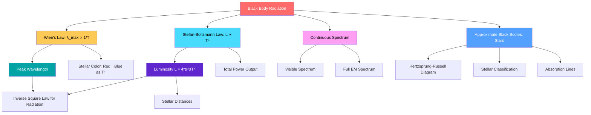

# 1. Overview / 概述

**English:**
Black body radiation is a cornerstone concept in astrophysics that describes how objects emit electromagnetic radiation based solely on their temperature. A **black body** is an idealized object that absorbs all incident electromagnetic radiation and re-emits it in a characteristic spectrum determined only by its temperature. This sub-topic explores the properties of black body radiation, including the continuous spectrum, the relationship between temperature and peak wavelength ([[Wien's Displacement Law]]), and the total power output ([[Stefan-Boltzmann Law]]). Understanding black body radiation is essential for determining stellar temperatures, luminosities, and classifying stars on the [[Hertzsprung-Russell Diagram]]. Real stars approximate black bodies, making this model fundamental to astrophysical analysis.

**中文:**
黑体辐射是天体物理学中的一个基石概念，描述了物体如何仅根据其温度发射电磁辐射。**黑体**是一个理想化的物体，它吸收所有入射的电磁辐射，并以仅由其温度决定的特征光谱重新发射。本子知识点探讨黑体辐射的性质，包括连续光谱、温度与峰值波长之间的关系（[[维恩位移定律]]）以及总功率输出（[[斯特藩-玻尔兹曼定律]]）。理解黑体辐射对于确定恒星温度、光度以及在[[赫罗图]]上对恒星进行分类至关重要。真实恒星近似于黑体，使得该模型成为天体物理分析的基础。

---

# 2. Syllabus Learning Objectives / 考纲学习目标

| CAIE 9702 | Edexcel IAL |
|-----------|-------------|
| 25.1(a): Define and use the concept of a black body | 10.1: Understand the concept of a black body radiator |
| 25.1(b): Describe the continuous spectrum of black body radiation | 10.2: Describe the continuous spectrum of black body radiation |
| 25.1(c): Explain how the intensity-wavelength graph varies with temperature | 10.3: Understand the relationship between temperature and peak wavelength |
| 25.1(d): Apply Wien's displacement law | 10.4: Apply Wien's displacement law |
| 25.1(e): Apply Stefan-Boltzmann law | 10.5: Apply Stefan-Boltzmann law |
| 25.1(f): Understand that stars approximate black bodies | 10.6: Understand that stars are approximate black bodies |

**Examiner Expectations / 考官期望:**
- **CAIE:** Students must be able to sketch and interpret black body radiation curves, calculate peak wavelength using Wien's law, and calculate luminosity using Stefan-Boltzmann law. Questions often combine these with [[Inverse Square Law for Radiation]].
- **Edexcel:** Similar expectations with emphasis on graphical interpretation and quantitative problem-solving. Edexcel may ask students to compare black body curves at different temperatures.

---

# 3. Core Definitions / 核心定义

| Term (EN/CN) | Definition (EN) | Definition (CN) | Common Mistakes / 常见错误 |
|--------------|-----------------|-----------------|---------------------------|
| **Black Body** / 黑体 | An idealized object that absorbs all electromagnetic radiation incident upon it and re-emits radiation with a continuous spectrum determined solely by its temperature. | 吸收所有入射电磁辐射并以仅由其温度决定的连续光谱重新发射的理想化物体。 | ❌ Confusing with "black objects" — a black body is theoretical, not just dark-colored. |
| **Black Body Radiation** / 黑体辐射 | The electromagnetic radiation emitted by a black body, characterized by a continuous spectrum with a single peak wavelength. | 黑体发射的电磁辐射，特征是具有单一峰值波长的连续光谱。 | ❌ Thinking the spectrum is discrete — it is continuous across all wavelengths. |
| **Continuous Spectrum** / 连续光谱 | A spectrum containing all wavelengths within a range, with no gaps or discrete lines. | 包含一定范围内所有波长、没有间隙或离散线的光谱。 | ❌ Confusing with line spectra (emission/absorption lines). |
| **Peak Wavelength (λ_max)** / 峰值波长 | The wavelength at which the intensity of black body radiation is maximum. | 黑体辐射强度最大时的波长。 | ❌ Using λ_max as the only emitted wavelength — it's the peak, not the only one. |
| **Intensity** / 强度 | The power per unit area per unit wavelength (or frequency) of radiation. | 单位面积单位波长（或频率）的辐射功率。 | ❌ Confusing with total power output (luminosity). |
| **Approximate Black Body** / 近似黑体 | A real object (like a star) whose radiation spectrum closely matches that of an ideal black body. | 辐射光谱与理想黑体非常接近的真实物体（如恒星）。 | ❌ Assuming stars are perfect black bodies — they have absorption lines. |

---

# 4. Key Concepts Explained / 关键概念详解

## 4.1 The Black Body Model / 黑体模型

### Explanation / 解释
**English:** A black body is a theoretical construct that perfectly absorbs all electromagnetic radiation falling on it, regardless of wavelength or angle. When in thermal equilibrium, it re-emits this energy as a continuous spectrum of radiation. The key property is that the emitted spectrum depends **only** on the temperature of the black body, not on its composition or structure. Real objects like stars, the Sun, and even the filament of a light bulb approximate black bodies, though they have imperfections (e.g., absorption lines in stellar spectra). The black body model is essential in [[Astrophysics]] for determining stellar properties.

**中文:** 黑体是一个理论构造，它完美地吸收所有入射的电磁辐射，无论波长或角度如何。当处于热平衡时，它以连续光谱的形式重新发射这些能量。关键特性是发射的光谱**仅**取决于黑体的温度，而不取决于其成分或结构。像恒星、太阳甚至灯泡灯丝这样的真实物体近似于黑体，尽管它们存在不完美之处（例如恒星光谱中的吸收线）。黑体模型在[[天体物理学]]中对于确定恒星性质至关重要。

### Physical Meaning / 物理意义
**English:** The black body model tells us that temperature is the fundamental driver of electromagnetic emission. Hotter objects emit more radiation at all wavelengths, and the peak shifts to shorter wavelengths. This explains why a cold object (like ice) emits infrared, a warm object (like a human) emits more infrared, a hot object (like a red-hot metal) emits visible red light, and an extremely hot object (like the Sun) emits visible white light.

**中文:** 黑体模型告诉我们，温度是电磁发射的根本驱动力。更热的物体在所有波长上发射更多辐射，并且峰值向更短波长移动。这解释了为什么冷物体（如冰）发射红外线，温暖物体（如人体）发射更多红外线，热物体（如红热金属）发射可见红光，而极热物体（如太阳）发射可见白光。

### Common Misconceptions / 常见误区
- ❌ **"Black bodies are black in color"** — A black body at room temperature appears black because it emits mostly infrared, not visible light. At high temperatures, it glows visibly.
- ❌ **"Black bodies only emit at the peak wavelength"** — They emit across a continuous spectrum; λ_max is just where intensity is highest.
- ❌ **"Stars are perfect black bodies"** — Stars have absorption lines due to elements in their atmospheres, so they are approximate, not perfect.
- ❌ **"The black body spectrum is symmetric"** — It is asymmetric, with a steeper drop on the short-wavelength side.

### Exam Tips / 考试提示
- **EN:** Always state that a black body absorbs all incident radiation and emits a continuous spectrum determined by temperature. When sketching curves, ensure the peak shifts left (shorter λ) as temperature increases.
- **CN:** 始终说明黑体吸收所有入射辐射并发射由温度决定的连续光谱。绘制曲线时，确保峰值随温度升高向左（更短波长）移动。

> 📷 **IMAGE PROMPT — BB-01: Black Body Radiation Curves at Different Temperatures**
> A graph showing three black body radiation intensity curves plotted against wavelength. The x-axis is wavelength (nm) from 0 to 2000, y-axis is intensity (arbitrary units). Three curves at temperatures 3000K (red), 5000K (yellow), and 7000K (blue-white). Each curve shows a smooth, asymmetric peak. As temperature increases, peak height increases dramatically and peak position shifts to shorter wavelengths. The area under each curve increases with temperature. Labels: λ_max for each curve, temperature annotations. Background: dark for contrast.

---

## 4.2 The Continuous Spectrum / 连续光谱

### Explanation / 解释
**English:** The black body radiation spectrum is **continuous**, meaning it contains all wavelengths from very long (radio) to very short (gamma rays), with no gaps. The intensity varies smoothly with wavelength, rising from zero at very short wavelengths, reaching a maximum at λ_max, then gradually falling to zero at very long wavelengths. This is fundamentally different from line spectra (emission or absorption lines) produced by atomic transitions. The continuous nature arises because black body radiation comes from thermal vibrations of charged particles in the material, not from discrete atomic energy level transitions.

**中文:** 黑体辐射光谱是**连续的**，意味着它包含从非常长（无线电波）到非常短（伽马射线）的所有波长，没有间隙。强度随波长平滑变化，从非常短波长处的零上升，在λ_max处达到最大值，然后逐渐下降到非常长波长处的零。这与原子跃迁产生的线光谱（发射线或吸收线）根本不同。连续性质源于黑体辐射来自材料中带电粒子的热振动，而不是来自离散的原子能级跃迁。

### Physical Meaning / 物理意义
**English:** The continuous spectrum means that a star emits radiation across the entire electromagnetic spectrum. However, Earth's atmosphere blocks most wavelengths except visible light and some radio waves. This is why we need space telescopes (like Hubble, James Webb) to observe stars at ultraviolet, X-ray, and infrared wavelengths.

**中文:** 连续光谱意味着恒星在整个电磁波谱上发射辐射。然而，地球大气层阻挡了除可见光和某些无线电波之外的大多数波长。这就是为什么我们需要太空望远镜（如哈勃、詹姆斯·韦伯）来观测紫外、X射线和红外波长的恒星。

### Common Misconceptions / 常见误区
- ❌ **"Stars only emit visible light"** — They emit across all wavelengths; visible is just the peak for Sun-like stars.
- ❌ **"The spectrum has sharp edges"** — It smoothly approaches zero at both ends.

### Exam Tips / 考试提示
- **EN:** When describing the spectrum, use phrases like "continuous distribution of wavelengths" and "intensity varies smoothly." Be prepared to compare black body spectra with line spectra.
- **CN:** 描述光谱时，使用"波长的连续分布"和"强度平滑变化"等短语。准备好比较黑体光谱与线光谱。

---

## 4.3 Temperature Dependence / 温度依赖性

### Explanation / 解释
**English:** The black body radiation curve changes dramatically with temperature in three ways:
1. **Peak wavelength shifts:** As temperature increases, λ_max decreases (shifts to shorter wavelengths) — described by [[Wien's Displacement Law]]: λ_max ∝ 1/T.
2. **Total power increases:** The total power emitted per unit surface area increases as T⁴ — described by [[Stefan-Boltzmann Law]]: P = σT⁴.
3. **Curve shape changes:** The peak becomes taller and narrower at higher temperatures.

**中文:** 黑体辐射曲线随温度变化在三个方面发生显著变化：
1. **峰值波长移动：** 随着温度升高，λ_max减小（向更短波长移动）——由[[维恩位移定律]]描述：λ_max ∝ 1/T。
2. **总功率增加：** 单位表面积发射的总功率以T⁴增加——由[[斯特藩-玻尔兹曼定律]]描述：P = σT⁴。
3. **曲线形状变化：** 在更高温度下，峰值变得更高更窄。

### Physical Meaning / 物理意义
**English:** This explains stellar colors: cooler stars (3000K) appear red because their peak is in the red/infrared; medium stars (6000K like the Sun) appear yellow-white with peak in visible; hot stars (30,000K) appear blue-white with peak in ultraviolet. The dramatic T⁴ dependence means a star twice as hot emits 16 times more power per unit area.

**中文:** 这解释了恒星颜色：较冷的恒星（3000K）呈现红色，因为它们的峰值在红色/红外区域；中等恒星（6000K如太阳）呈现黄白色，峰值在可见光区域；热恒星（30,000K）呈现蓝白色，峰值在紫外区域。T⁴的显著依赖性意味着温度高两倍的恒星每单位面积发射的功率是16倍。

### Common Misconceptions / 常见误区
- ❌ **"Peak wavelength is the only wavelength emitted"** — No, it's the wavelength of maximum intensity.
- ❌ **"Temperature increase shifts peak to longer wavelengths"** — Incorrect! It shifts to shorter wavelengths.

### Exam Tips / 考试提示
- **EN:** When comparing two stars, always state both the peak wavelength shift AND the total power change. Use Wien's law for λ_max and Stefan-Boltzmann for power.
- **CN:** 比较两颗恒星时，始终同时说明峰值波长移动和总功率变化。使用维恩定律求λ_max，使用斯特藩-玻尔兹曼定律求功率。

---

# 5. Essential Equations / 核心公式

## 5.1 Wien's Displacement Law / 维恩位移定律

$$ \lambda_{\text{max}} T = \text{constant} = 2.90 \times 10^{-3} \text{ m·K} $$

| Symbol (符号) | Meaning (EN) | Meaning (CN) | Unit (单位) |
|--------------|-------------|-------------|------------|
| λ_max | Peak wavelength | 峰值波长 | m (meters) |
| T | Absolute temperature | 绝对温度 | K (Kelvin) |
| 2.90 × 10⁻³ | Wien's constant | 维恩常数 | m·K |

**Derivation / 推导:** Not required for A-Level; given as empirical law.

**Conditions / 适用条件:**
- **EN:** Applies only to ideal black bodies. Stars are approximate black bodies.
- **CN:** 仅适用于理想黑体。恒星是近似黑体。

**Limitations / 局限性:**
- **EN:** Does not give total power output; only peak wavelength. Real stars have absorption lines that slightly shift the apparent peak.
- **CN:** 不给出总功率输出；仅给出峰值波长。真实恒星的吸收线会略微移动表观峰值。

> 📋 **CIE Only:** Wien's constant is given as 2.90 × 10⁻³ m·K in the formula sheet.
> 📋 **Edexcel Only:** Wien's constant is given as 2.9 × 10⁻³ m·K in the formula booklet.

---

## 5.2 Stefan-Boltzmann Law / 斯特藩-玻尔兹曼定律

$$ P = \sigma A T^4 $$

$$ L = 4\pi r^2 \sigma T^4 $$

| Symbol (符号) | Meaning (EN) | Meaning (CN) | Unit (单位) |
|--------------|-------------|-------------|------------|
| P | Power radiated | 辐射功率 | W (Watts) |
| σ | Stefan-Boltzmann constant (5.67 × 10⁻⁸ W m⁻² K⁻⁴) | 斯特藩-玻尔兹曼常数 | W m⁻² K⁻⁴ |
| A | Surface area | 表面积 | m² |
| T | Absolute temperature | 绝对温度 | K |
| L | Luminosity (for a star) | 光度（对于恒星） | W |
| r | Radius of star | 恒星半径 | m |

**Derivation / 推导:** Not required for A-Level; given as empirical law.

**Conditions / 适用条件:**
- **EN:** Applies to ideal black bodies. For stars, use L = 4πr²σT⁴ where L is luminosity.
- **CN:** 适用于理想黑体。对于恒星，使用 L = 4πr²σT⁴，其中 L 是光度。

**Limitations / 局限性:**
- **EN:** Assumes uniform temperature across the surface. Real stars have temperature variations (e.g., sunspots).
- **CN:** 假设表面温度均匀。真实恒星存在温度变化（如太阳黑子）。

> 📷 **IMAGE PROMPT — BB-02: Stefan-Boltzmann Law Visualization**
> A diagram showing a sphere (star) of radius r and surface temperature T. Arrows radiating outward from the surface represent power output. Labels: L = 4πr²σT⁴. A smaller sphere at higher temperature shows more intense radiation. Color gradient from red (cool) to blue-white (hot). Background: space with stars.

---

# 6. Graphs and Relationships / 图表与关系

## 6.1 Black Body Radiation Intensity vs Wavelength / 黑体辐射强度与波长的关系

### Axes / 坐标轴
- **X-axis:** Wavelength (λ) / 波长 (λ) — units: nm or μm
- **Y-axis:** Intensity (I) / 强度 (I) — units: W m⁻² nm⁻¹ (arbitrary units often used)

### Shape / 形状
- **EN:** Asymmetric curve starting at zero for very short λ, rising to a single peak at λ_max, then gradually falling to zero at long λ. The curve is steeper on the short-wavelength side.
- **CN:** 非对称曲线，从非常短波长处的零开始，上升到λ_max处的单一峰值，然后逐渐下降到长波长处的零。曲线在短波长侧更陡峭。

### Gradient Meaning / 斜率含义
- **EN:** The gradient at any point represents the rate of change of intensity with wavelength. Zero gradient at the peak (λ_max).
- **CN:** 任意点的斜率表示强度随波长的变化率。在峰值（λ_max）处斜率为零。

### Area Meaning / 面积含义
- **EN:** The area under the curve represents the total power radiated per unit surface area (integral of intensity over all wavelengths). This area increases as T⁴.
- **CN:** 曲线下的面积表示单位表面积辐射的总功率（强度对所有波长的积分）。该面积随T⁴增加。

### Exam Interpretation / 考试解读
- **EN:** When comparing curves at different temperatures:
  1. Higher T → peak shifts left (shorter λ)
  2. Higher T → peak is taller (higher intensity)
  3. Higher T → area under curve is larger (more total power)
- **CN:** 比较不同温度下的曲线时：
  1. 更高温度 → 峰值向左移动（更短波长）
  2. 更高温度 → 峰值更高（更高强度）
  3. 更高温度 → 曲线下面积更大（更多总功率）

> 📷 **IMAGE PROMPT — BB-03: Comparison of Black Body Curves at Different Temperatures**
> A single graph with three black body radiation curves: T₁=3000K (red curve, peak at ~970nm), T₂=5000K (yellow curve, peak at ~580nm), T₃=7000K (blue curve, peak at ~414nm). Clear labels showing λ_max for each. The 7000K curve has the highest peak and smallest λ_max. The 3000K curve has the lowest peak and largest λ_max. X-axis: wavelength (nm), Y-axis: intensity (arbitrary units). Background: white with grid lines.

---

# 7. Required Diagrams / 必备图表

## 7.1 Black Body Radiation Spectrum / 黑体辐射光谱图

### Description / 描述
**English:** A graph showing intensity (I) against wavelength (λ) for a black body at a specific temperature. The curve is continuous, asymmetric, with a single peak at λ_max. The area under the curve represents total power output per unit area.

**中文:** 显示特定温度下黑体强度 (I) 与波长 (λ) 关系的图表。曲线是连续的、非对称的，在λ_max处有一个单一峰值。曲线下的面积表示单位面积的总功率输出。

### Image Prompt / 图片生成提示
> 📷 **IMAGE PROMPT — BB-04: Annotated Black Body Radiation Curve**
> A detailed graph of black body radiation intensity vs wavelength. The curve is smooth and asymmetric, peaking at λ_max. Annotations: "λ_max" at the peak with a dashed vertical line, "Intensity" on y-axis, "Wavelength" on x-axis. Shaded area under curve labeled "Total power per unit area = σT⁴". The curve approaches zero at both ends. Temperature labeled as T = 5800K (Sun's surface temperature). Background: white with light grid. Professional scientific diagram style.

### Labels Required / 需要标注
- **EN:** λ_max (peak wavelength), axes labels (Intensity, Wavelength), temperature, shaded area for total power
- **CN:** λ_max（峰值波长）、坐标轴标签（强度、波长）、温度、总功率的阴影区域

### Exam Importance / 考试重要性
- **EN:** High — students must be able to sketch, label, and interpret this graph. Common exam question: "Sketch the black body radiation curve for a star at 6000K and 3000K on the same axes."
- **CN:** 高——学生必须能够绘制、标注和解释此图表。常见考题："在同一坐标轴上绘制6000K和3000K恒星的黑体辐射曲线。"

---

## 7.2 Black Body vs Real Star Spectrum / 黑体与真实恒星光谱对比

### Description / 描述
**English:** A comparison diagram showing the smooth black body curve overlaid with a real stellar spectrum that has absorption lines (dark lines) superimposed on the continuous background.

**中文:** 一个对比图，显示平滑的黑体曲线与叠加了吸收线（暗线）的真实恒星光谱的对比。

### Image Prompt / 图片生成提示
> 📷 **IMAGE PROMPT — BB-05: Black Body vs Real Star Spectrum Comparison**
> Two spectra shown together. Top: smooth black body curve (ideal) with no features. Bottom: same curve but with multiple dark vertical absorption lines (Fraunhofer lines) at specific wavelengths. Labels: "Black body spectrum (ideal)" and "Real stellar spectrum (with absorption lines)". The overall shape of both curves is the same. Background: white. Clear annotations showing that real stars are approximate black bodies.

### Labels Required / 需要标注
- **EN:** "Black body spectrum", "Real stellar spectrum", "Absorption lines", "Continuous background"
- **CN:** "黑体光谱"、"真实恒星光谱"、"吸收线"、"连续背景"

### Exam Importance / 考试重要性
- **EN:** Medium — helps explain why stars are "approximate" black bodies. May appear in multiple-choice or short-answer questions.
- **CN:** 中等——有助于解释为什么恒星是"近似"黑体。可能出现在选择题或简答题中。

---

# 8. Worked Examples / 典型例题

## Example 1: Finding Peak Wavelength / 求峰值波长

### Question / 题目
**English:** The surface temperature of the Sun is approximately 5800 K. Calculate the peak wavelength of its black body radiation. (Wien's constant = 2.90 × 10⁻³ m·K)

**中文:** 太阳表面温度约为5800 K。计算其黑体辐射的峰值波长。（维恩常数 = 2.90 × 10⁻³ m·K）

### Solution / 解答

**Step 1:** Write Wien's displacement law.
$$ \lambda_{\text{max}} T = 2.90 \times 10^{-3} \text{ m·K} $$

**Step 2:** Rearrange for λ_max.
$$ \lambda_{\text{max}} = \frac{2.90 \times 10^{-3}}{T} $$

**Step 3:** Substitute T = 5800 K.
$$ \lambda_{\text{max}} = \frac{2.90 \times 10^{-3}}{5800} $$

**Step 4:** Calculate.
$$ \lambda_{\text{max}} = 5.00 \times 10^{-7} \text{ m} = 500 \text{ nm} $$

### Final Answer / 最终答案
**Answer:** λ_max = 500 nm (visible light, yellow-green) | **答案：** λ_max = 500 nm（可见光，黄绿色）

### Quick Tip / 提示
- **EN:** Remember that 500 nm is in the visible spectrum, which is why the Sun appears yellow-white. Always check if your answer is in the correct wavelength range.
- **CN:** 记住500 nm在可见光谱中，这就是为什么太阳呈现黄白色。始终检查你的答案是否在正确的波长范围内。

---

## Example 2: Comparing Two Stars / 比较两颗恒星

### Question / 题目
**English:** Star A has a surface temperature of 4000 K and Star B has a surface temperature of 8000 K. Both stars have the same radius. Calculate:
(a) The ratio of their peak wavelengths (λ_max,A / λ_max,B)
(b) The ratio of their luminosities (L_A / L_B)

**中文:** 恒星A表面温度为4000 K，恒星B表面温度为8000 K。两颗恒星半径相同。计算：
(a) 它们的峰值波长之比 (λ_max,A / λ_max,B)
(b) 它们的光度之比 (L_A / L_B)

### Solution / 解答

**Part (a):** Using Wien's law: λ_max ∝ 1/T
$$ \frac{\lambda_{\text{max,A}}}{\lambda_{\text{max,B}}} = \frac{T_B}{T_A} = \frac{8000}{4000} = 2 $$

**Part (b):** Using Stefan-Boltzmann law: L ∝ T⁴ (since radius is same)
$$ \frac{L_A}{L_B} = \left(\frac{T_A}{T_B}\right)^4 = \left(\frac{4000}{8000}\right)^4 = \left(\frac{1}{2}\right)^4 = \frac{1}{16} $$

### Final Answer / 最终答案
**Answer:** (a) λ_max,A / λ_max,B = 2 (Star A's peak is at twice the wavelength of Star B's) | **答案：** (a) λ_max,A / λ_max,B = 2（恒星A的峰值波长是恒星B的两倍）
**Answer:** (b) L_A / L_B = 1/16 (Star A is 16 times less luminous than Star B) | **答案：** (b) L_A / L_B = 1/16（恒星A的光度是恒星B的1/16）

### Quick Tip / 提示
- **EN:** Notice the dramatic effect of the T⁴ relationship: doubling temperature increases luminosity by 16×. This is why hot stars are so much brighter than cool stars of the same size.
- **CN:** 注意T⁴关系的显著效果：温度翻倍使光度增加16倍。这就是为什么相同大小的热恒星比冷恒星亮得多。

---

# 9. Past Paper Question Types / 历年真题题型

| Question Type / 题型 | Frequency / 频率 | Difficulty / 难度 | Past Paper References / 真题索引 |
|----------------------|------------------|------------------|-------------------------------|
| Calculate λ_max using Wien's law | Very High | Easy | 📝 *待填入* |
| Calculate luminosity using Stefan-Boltzmann law | Very High | Medium | 📝 *待填入* |
| Sketch and compare black body curves | High | Medium | 📝 *待填入* |
| Explain why stars are approximate black bodies | Medium | Easy | 📝 *待填入* |
| Combined problem: find temperature from λ_max, then luminosity | High | Hard | 📝 *待填入* |
| Compare two stars with different T and r | Medium | Hard | 📝 *待填入* |

**Common Command Words / 常见指令词:**
- **EN:** Calculate, Determine, Sketch, Explain, Compare, State, Show that
- **CN:** 计算、确定、绘制、解释、比较、陈述、证明

---

# 10. Practical Skills Connections / 实验技能链接

**English:**
Black body radiation connects to practical skills in several ways:

1. **Temperature measurement:** Using a thermocouple or infrared thermometer to measure surface temperature of objects.
2. **Spectroscopy:** Using a diffraction grating or prism spectrometer to observe continuous spectra from hot objects (e.g., filament lamp at different voltages).
3. **Graph plotting:** Plotting intensity vs wavelength data from a spectrometer and identifying λ_max.
4. **Uncertainty analysis:** Estimating uncertainties in wavelength measurements and temperature readings.
5. **Experimental design:** Investigating how the color of a heated object changes with temperature (e.g., heating a metal rod and observing color changes from red to white).

**Key practical: Filament lamp as an approximate black body** — Vary the voltage across a filament lamp and use a spectrometer to measure the spectrum. Plot intensity vs wavelength curves at different voltages (temperatures). Compare with theoretical black body curves.

**中文:**
黑体辐射在多个方面与实验技能相关：

1. **温度测量：** 使用热电偶或红外温度计测量物体的表面温度。
2. **光谱学：** 使用衍射光栅或棱镜光谱仪观察热物体（如不同电压下的灯丝灯泡）的连续光谱。
3. **图表绘制：** 绘制光谱仪的强度与波长数据，并识别λ_max。
4. **不确定度分析：** 估计波长测量和温度读数的不确定度。
5. **实验设计：** 研究加热物体的颜色如何随温度变化（如加热金属棒并观察从红色到白色的颜色变化）。

**关键实验：灯丝灯泡作为近似黑体** — 改变灯丝灯泡两端的电压，使用光谱仪测量光谱。在不同电压（温度）下绘制强度与波长曲线。与理论黑体曲线进行比较。

---

# 11. Concept Map / 概念图谱

---

# 12. Quick Revision Sheet / 速查表

| Category / 类别 | Key Points / 要点 |
|----------------|------------------|
| **Definition / 定义** | Black body: absorbs all radiation, emits continuous spectrum determined by T only. Stars are approximate black bodies. / 黑体：吸收所有辐射，发射仅由T决定的连续光谱。恒星是近似黑体。 |
| **Key Formula / 核心公式** | Wien: λ_max T = 2.90 × 10⁻³ m·K | Stefan-Boltzmann: L = 4πr²σT⁴, σ = 5.67 × 10⁻⁸ W m⁻² K⁻⁴ |
| **Key Graph / 核心图表** | I vs λ: asymmetric curve, single peak at λ_max. Higher T → peak shifts left, peak taller, area larger. / I vs λ：非对称曲线，在λ_max处有单一峰值。更高T → 峰值左移、更高、面积更大。 |
| **Key Relationships / 关键关系** | T↑ → λ_max↓ (Wien) | T↑ → L↑ dramatically as T⁴ (Stefan-Boltzmann) | Same radius: L ∝ T⁴ |
| **Common Calculation / 常见计算** | Find λ_max from T, find T from λ_max, find L from r and T, compare two stars' luminosities. / 从T求λ_max，从λ_max求T，从r和T求L，比较两颗恒星的光度。 |
| **Exam Tip / 考试提示** | Always state assumptions (star is approximate black body). Use correct units (K for temperature, m for wavelength). Remember the T⁴ dependence is very strong. / 始终说明假设（恒星是近似黑体）。使用正确单位（温度用K，波长用m）。记住T⁴依赖性非常强。 |
| **Common Mistake / 常见错误** | ❌ Using °C instead of K | ❌ Forgetting to square radius in L = 4πr²σT⁴ | ❌ Thinking λ_max is the only wavelength emitted |
| **Practical Link / 实验链接** | Filament lamp experiment: vary voltage, measure spectrum, compare with black body curves. / 灯丝灯泡实验：改变电压，测量光谱，与黑体曲线比较。 |