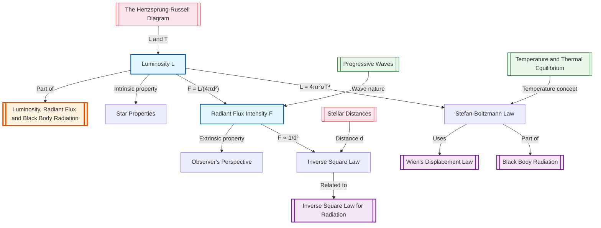

# 1. Overview / 概述

**English:**
Luminosity and Radiant Flux Intensity are fundamental concepts in astrophysics that describe how much energy a star emits and how that energy is distributed across space. **Luminosity ($L$)** is the total power output of a star — the total amount of energy it radiates per second into all directions. **Radiant Flux Intensity ($F$)** is the power received per unit area at a given distance from the star. These two quantities are linked by the [[Inverse Square Law for Radiation]], which states that flux decreases with the square of the distance. Understanding this distinction is crucial for determining stellar properties such as temperature, size, and distance, and forms the foundation for studying [[Black Body Radiation]], [[Stefan-Boltzmann Law]], and [[Wien's Displacement Law]].

**中文:**
**光度（Luminosity, $L$）** 和 **辐射通量强度（Radiant Flux Intensity, $F$）** 是天体物理学中的基本概念，用于描述恒星发射的能量以及这些能量在空间中的分布。**光度 ($L$)** 是恒星的总功率输出——即恒星每秒向所有方向辐射的总能量。**辐射通量强度 ($F$)** 是在距离恒星一定距离处，每单位面积接收到的功率。这两个量通过[[辐射逆平方定律]]相关联，该定律指出通量随距离的平方而减小。理解这一区别对于确定恒星的温度、大小和距离等性质至关重要，并且是研究[[黑体辐射]]、[[斯特藩-玻尔兹曼定律]]和[[维恩位移定律]]的基础。

---

# 2. Syllabus Learning Objectives / 考纲学习目标

| CAIE 9702 (25.1 a-f) | Edexcel IAL (WPH14 U4: 10.1-10.6) |
|----------------------|-----------------------------------|
| Define luminosity and radiant flux intensity | Understand the concept of luminosity as total power output of a star |
| Recall and use the inverse square law for radiation | Use the inverse square law to relate flux and distance |
| Understand that stars are approximated as black bodies | Apply Stefan-Boltzmann law to relate luminosity, temperature, and radius |
| Use Stefan-Boltzmann law: $L = 4\pi r^2 \sigma T^4$ | Calculate luminosity from temperature and radius |
| Understand the relationship between flux, luminosity, and distance | Understand radiant flux intensity as power per unit area |
| Apply these concepts to stellar calculations | Solve problems involving luminosity, flux, and distance |

**Examiner Expectations / 考官期望:**
- **English:** Students must clearly distinguish between luminosity (intrinsic property) and radiant flux intensity (distance-dependent). They should be able to rearrange and apply the inverse square law and Stefan-Boltzmann law in multi-step calculations. Common errors include confusing flux with luminosity and forgetting the $4\pi$ factor.
- **中文:** 学生必须清楚区分光度（固有属性）和辐射通量强度（与距离相关）。他们应能重新排列并应用逆平方定律和斯特藩-玻尔兹曼定律进行多步计算。常见错误包括混淆通量与光度，以及忘记 $4\pi$ 因子。

---

# 3. Core Definitions / 核心定义

| Term (EN/CN) | Definition (EN) | Definition (CN) | Common Mistakes / 常见错误 |
|--------------|-----------------|-----------------|---------------------------|
| **Luminosity** / 光度 | The total power radiated by a star in all directions; measured in watts (W). | 恒星向所有方向辐射的总功率；单位为瓦特 (W)。 | Confusing with flux; forgetting it's total power, not per unit area |
| **Radiant Flux Intensity** / 辐射通量强度 | The power received per unit area at a given distance from a star; measured in W m⁻². | 在距离恒星一定距离处，每单位面积接收到的功率；单位为 W m⁻²。 | Thinking it's constant with distance; confusing with luminosity |
| **Inverse Square Law** / 逆平方定律 | The radiant flux intensity is inversely proportional to the square of the distance from the source: $F \propto \frac{1}{d^2}$. | 辐射通量强度与到光源距离的平方成反比：$F \propto \frac{1}{d^2}$。 | Forgetting the $4\pi$ factor; applying to luminosity instead of flux |
| **Black Body** / 黑体 | An idealized object that absorbs all incident electromagnetic radiation and emits a continuous spectrum determined solely by its temperature. | 一种理想化物体，吸收所有入射电磁辐射，并发射仅由其温度决定的连续光谱。 | Assuming real stars are perfect black bodies (they are approximations) |
| **Stefan-Boltzmann Constant ($\sigma$)** / 斯特藩-玻尔兹曼常数 | A physical constant ($5.67 \times 10^{-8} \text{ W m}^{-2} \text{ K}^{-4}$) relating the power radiated per unit area to the fourth power of temperature. | 一个物理常数 ($5.67 \times 10^{-8} \text{ W m}^{-2} \text{ K}^{-4}$)，将单位面积辐射功率与温度的第四次方联系起来。 | Using wrong units; forgetting the constant in calculations |

---

# 4. Key Concepts Explained / 关键概念详解

## 4.1 Luminosity vs. Radiant Flux Intensity / 光度与辐射通量强度

### Explanation / 解释
**English:**
**Luminosity ($L$)** is an **intrinsic property** of a star — it does not depend on the observer's position. It represents the total electromagnetic power emitted by the star in all directions. For example, the Sun's luminosity is $L_\odot = 3.83 \times 10^{26} \text{ W}$.

**Radiant Flux Intensity ($F$)** is an **extrinsic property** — it depends on the distance between the observer and the star. It is the power received per unit area at a specific location. If you move twice as far from a star, the flux decreases by a factor of four ([[Inverse Square Law for Radiation]]).

The relationship is:
$$ F = \frac{L}{4\pi d^2} $$

where $d$ is the distance from the star. The $4\pi d^2$ term represents the surface area of a sphere centered on the star.

**中文:**
**光度 ($L$)** 是恒星的**固有属性**——它不依赖于观测者的位置。它表示恒星向所有方向发射的总电磁功率。例如，太阳的光度为 $L_\odot = 3.83 \times 10^{26} \text{ W}$。

**辐射通量强度 ($F$)** 是**外在属性**——它依赖于观测者与恒星之间的距离。它是在特定位置每单位面积接收到的功率。如果你离恒星的距离加倍，通量会减少四倍（[[辐射逆平方定律]]）。

关系式为：
$$ F = \frac{L}{4\pi d^2} $$

其中 $d$ 是到恒星的距离。$4\pi d^2$ 项表示以恒星为中心的球体表面积。

### Physical Meaning / 物理意义
**English:** Luminosity tells us how "powerful" a star is intrinsically. Radiant flux tells us how "bright" it appears from Earth. A distant, high-luminosity star can appear as bright as a nearby, low-luminosity star if the distances are right.

**中文:** 光度告诉我们恒星本身有多"强大"。辐射通量告诉我们从地球上看它有多"亮"。如果距离合适，一颗遥远的高光度恒星可能与一颗近处的低光度恒星看起来一样亮。

### Common Misconceptions / 常见误区
- **English:**
  - Thinking flux is the same as luminosity
  - Believing flux is constant regardless of distance
  - Forgetting the $4\pi$ factor in the inverse square law
  - Assuming all stars have the same luminosity
- **中文:**
  - 认为通量与光度相同
  - 认为通量与距离无关
  - 忘记逆平方定律中的 $4\pi$ 因子
  - 假设所有恒星具有相同的光度

### Exam Tips / 考试提示
- **English:** Always check units: luminosity in W, flux in W m⁻². When given flux and distance, rearrange to find luminosity. When comparing two stars, set up ratios to cancel constants.
- **中文:** 始终检查单位：光度单位为 W，通量单位为 W m⁻²。当给定通量和距离时，重新排列公式求光度。比较两颗恒星时，建立比例以消去常数。

> 📷 **IMAGE PROMPT — DIAGRAM-01: Luminosity vs Flux Concept**
> A diagram showing a star at the center with concentric spheres at distances d, 2d, 3d. The same total power L passes through each sphere, but the power per unit area (flux) decreases as the sphere area increases. Labels: Luminosity L (total power), Flux F = L/(4πd²) at each sphere surface. Arrows showing energy spreading out.

---

## 4.2 The Inverse Square Law / 逆平方定律

### Explanation / 解释
**English:**
The [[Inverse Square Law for Radiation]] states that the radiant flux intensity $F$ from a point source is inversely proportional to the square of the distance $d$ from the source:

$$ F \propto \frac{1}{d^2} $$

For a star (approximated as a point source at large distances), this becomes:

$$ F = \frac{L}{4\pi d^2} $$

This law arises because the energy from the star spreads uniformly over the surface of an expanding sphere. As the sphere's radius doubles, its surface area quadruples, so the flux per unit area decreases by a factor of four.

**中文:**
[[辐射逆平方定律]]指出，点光源的辐射通量强度 $F$ 与到光源的距离 $d$ 的平方成反比：

$$ F \propto \frac{1}{d^2} $$

对于恒星（在远距离处近似为点光源），这变为：

$$ F = \frac{L}{4\pi d^2} $$

该定律的产生是因为恒星的能量均匀分布在不断扩大的球体表面上。当球体半径加倍时，其表面积变为四倍，因此单位面积的通量减少四倍。

### Physical Meaning / 物理意义
**English:** The inverse square law explains why distant stars appear dimmer. It also allows astronomers to calculate a star's luminosity if its distance and flux are known, or to estimate distance if luminosity and flux are known.

**中文:** 逆平方定律解释了为什么遥远的恒星看起来更暗。它还允许天文学家在已知距离和通量的情况下计算恒星的光度，或者在已知光度和通量的情况下估算距离。

### Common Misconceptions / 常见误区
- **English:**
  - Applying the inverse square law to luminosity (it applies to flux, not luminosity)
  - Forgetting that the law assumes a point source in empty space
  - Using $d$ instead of $d^2$ in calculations
- **中文:**
  - 将逆平方定律应用于光度（它适用于通量，而非光度）
  - 忘记该定律假设在空旷空间中的点光源
  - 在计算中使用 $d$ 而不是 $d^2$

### Exam Tips / 考试提示
- **English:** When comparing flux at two distances, use the ratio: $\frac{F_1}{F_2} = \frac{d_2^2}{d_1^2}$. This avoids needing the luminosity value.
- **中文:** 比较两个距离处的通量时，使用比例：$\frac{F_1}{F_2} = \frac{d_2^2}{d_1^2}$。这避免了需要光度值。

> 📷 **IMAGE PROMPT — DIAGRAM-02: Inverse Square Law Visualization**
> A diagram showing a star at left, with three observers at distances d, 2d, and 3d. At each distance, a square of side 1m is shown, with the number of "rays" passing through it decreasing as 1/d². Labels: F ∝ 1/d², showing flux values at each distance.

---

# 5. Essential Equations / 核心公式

## Equation 1: Luminosity-Flux-Distance Relationship

$$ F = \frac{L}{4\pi d^2} $$

| Symbol (符号) | Meaning (EN) | Meaning (CN) | Unit (单位) |
|--------------|-------------|-------------|------------|
| $F$ | Radiant flux intensity | 辐射通量强度 | W m⁻² |
| $L$ | Luminosity | 光度 | W |
| $d$ | Distance from star | 到恒星的距离 | m |
| $4\pi d^2$ | Surface area of sphere | 球体表面积 | m² |

**Derivation / 推导:**
The total power $L$ emitted by the star spreads uniformly over a sphere of radius $d$. The surface area of this sphere is $4\pi d^2$. Therefore, the power per unit area (flux) is $F = L / (4\pi d^2)$.

**Conditions / 适用条件:**
- **English:** The star must be treated as a point source (valid for $d \gg$ stellar radius). No absorption or scattering of radiation between the star and observer.
- **中文:** 恒星必须被视为点光源（适用于 $d \gg$ 恒星半径）。恒星与观测者之间无吸收或散射。

**Limitations / 局限性:**
- **English:** Does not account for interstellar dust absorption, gravitational lensing, or relativistic effects. Real stars are not perfect point sources at very close distances.
- **中文:** 未考虑星际尘埃吸收、引力透镜效应或相对论效应。在非常近的距离处，真实恒星不是完美的点光源。

---

## Equation 2: Stefan-Boltzmann Law (Luminosity-Temperature-Radius)

$$ L = 4\pi r^2 \sigma T^4 $$

| Symbol (符号) | Meaning (EN) | Meaning (CN) | Unit (单位) |
|--------------|-------------|-------------|------------|
| $L$ | Luminosity | 光度 | W |
| $r$ | Radius of star | 恒星半径 | m |
| $\sigma$ | Stefan-Boltzmann constant ($5.67 \times 10^{-8}$) | 斯特藩-玻尔兹曼常数 | W m⁻² K⁻⁴ |
| $T$ | Surface temperature | 表面温度 | K |

**Derivation / 推导:**
The Stefan-Boltzmann law states that the power radiated per unit area of a black body is $j = \sigma T^4$. For a spherical star of radius $r$, the total surface area is $4\pi r^2$, so $L = (4\pi r^2)(\sigma T^4) = 4\pi r^2 \sigma T^4$.

**Conditions / 适用条件:**
- **English:** The star must be approximated as a [[Black Body Radiation|black body]]. The temperature $T$ is the effective surface temperature.
- **中文:** 恒星必须近似为[[黑体辐射|黑体]]。温度 $T$ 是有效表面温度。

**Limitations / 局限性:**
- **English:** Real stars are not perfect black bodies; spectral lines and atmospheric effects cause deviations. The law gives the total power across all wavelengths.
- **中文:** 真实恒星不是完美的黑体；谱线和大气效应会导致偏差。该定律给出所有波长的总功率。

> 📷 **IMAGE PROMPT — DIAGRAM-03: Stefan-Boltzmann Law Application**
> A diagram showing a spherical star of radius r, with arrows radiating outward. Labels: Surface area = 4πr², Power per unit area = σT⁴, Total power L = 4πr²σT⁴. A temperature scale showing T in Kelvin.

---

# 6. Graphs and Relationships / 图表与关系

## 6.1 Flux vs. Distance Graph / 通量-距离关系图

### Axes / 坐标轴
- **X-axis:** Distance from star $d$ (m) / 到恒星的距离 $d$ (m)
- **Y-axis:** Radiant flux intensity $F$ (W m⁻²) / 辐射通量强度 $F$ (W m⁻²)

### Shape / 形状
**English:** A decreasing curve that follows $F \propto 1/d^2$. The curve is steep near the star and flattens out at large distances. A log-log plot would show a straight line with gradient -2.

**中文:** 一条遵循 $F \propto 1/d^2$ 的递减曲线。曲线在恒星附近陡峭，在远距离处趋于平缓。对数-对数图将显示一条斜率为 -2 的直线。

### Gradient Meaning / 斜率含义
**English:** On a linear plot, the gradient is not constant. On a log-log plot, the gradient of -2 confirms the inverse square relationship.

**中文:** 在线性图上，斜率不是常数。在对数-对数图上，斜率为 -2 证实了逆平方关系。

### Area Meaning / 面积含义
**English:** The area under the $F$ vs. $d$ curve has no direct physical meaning in this context.

**中文:** 在此上下文中，$F$ 与 $d$ 曲线下的面积没有直接的物理意义。

### Exam Interpretation / 考试解读
**English:** If given a graph of $F$ against $1/d^2$, the gradient equals $L/(4\pi)$. This is a common exam technique to find luminosity from experimental data.

**中文:** 如果给出 $F$ 对 $1/d^2$ 的图，斜率等于 $L/(4\pi)$。这是从实验数据中求光度的常见考试技巧。

> 📷 **IMAGE PROMPT — GRAPH-01: Flux vs Distance**
> A graph showing F on y-axis and d on x-axis. A steeply decreasing curve F ∝ 1/d². A second graph below showing F vs 1/d² as a straight line through origin with gradient L/(4π). Labels on both graphs.

---

## 6.2 Luminosity vs. Temperature Graph (for fixed radius) / 光度-温度关系图（固定半径）

### Axes / 坐标轴
- **X-axis:** Surface temperature $T$ (K) / 表面温度 $T$ (K)
- **Y-axis:** Luminosity $L$ (W) / 光度 $L$ (W)

### Shape / 形状
**English:** A steeply increasing curve following $L \propto T^4$. Doubling the temperature increases luminosity by a factor of 16.

**中文:** 一条遵循 $L \propto T^4$ 的急剧上升曲线。温度加倍会使光度增加 16 倍。

### Gradient Meaning / 斜率含义
**English:** The gradient is $dL/dT = 16\pi r^2 \sigma T^3$, which increases with temperature.

**中文:** 斜率为 $dL/dT = 16\pi r^2 \sigma T^3$，随温度增加而增加。

### Area Meaning / 面积含义
**English:** No direct physical meaning.

**中文:** 没有直接的物理意义。

### Exam Interpretation / 考试解读
**English:** A log-log plot of $L$ vs. $T$ gives a straight line with gradient 4, confirming the $T^4$ relationship.

**中文:** $L$ 对 $T$ 的对数-对数图给出斜率为 4 的直线，证实了 $T^4$ 关系。

---

# 7. Required Diagrams / 必备图表

## 7.1 Energy Spreading from a Star / 恒星能量扩散图

### Description / 描述
**English:** A diagram showing a star at the center with concentric spherical shells at increasing distances. The same total power passes through each shell, but the power per unit area decreases.

**中文:** 一个显示恒星在中心，同心球壳在距离增加时的示意图。相同的总功率通过每个球壳，但单位面积功率减小。

### Image Prompt / 图片生成提示
> 📷 **IMAGE PROMPT — DIAGRAM-04: Energy Spreading from Star**
> A 3D-style diagram showing a yellow star at the center. Three transparent spherical shells at radii d, 2d, and 3d. Arrows radiating outward from the star. Labels: "Luminosity L (total power)" at the star, "Flux F = L/(4πd²)" at each shell. The arrows are more spread out on the outer shells. Clean, educational style with color coding.

### Labels Required / 需要标注
- Star: "Luminosity $L$ (W)"
- Each shell: "Flux $F = L/(4\pi d^2)$ (W m⁻²)"
- Radii: $d$, $2d$, $3d$
- Surface area: $4\pi d^2$, $4\pi(2d)^2$, $4\pi(3d)^2$

### Exam Importance / 考试重要性
**English:** Essential for understanding the inverse square law. Students may be asked to draw or interpret this diagram in exams.

**中文:** 对于理解逆平方定律至关重要。学生可能会被要求在考试中绘制或解释此图。

---

## 7.2 Black Body Radiation Curve with Luminosity / 黑体辐射曲线与光度

### Description / 描述
**English:** A graph showing the intensity of radiation emitted by a black body at different wavelengths. The area under the curve represents the total power per unit area ($\sigma T^4$), which relates to luminosity via $L = 4\pi r^2 \sigma T^4$.

**中文:** 显示黑体在不同波长处发射的辐射强度的图。曲线下的面积表示单位面积的总功率 ($\sigma T^4$)，通过 $L = 4\pi r^2 \sigma T^4$ 与光度相关。

### Image Prompt / 图片生成提示
> 📷 **IMAGE PROMPT — DIAGRAM-05: Black Body Curve with Luminosity**
> A graph with wavelength on x-axis and intensity on y-axis. A black body curve peaking at a certain wavelength. The area under the curve shaded and labeled "Total power per unit area = σT⁴". An arrow pointing to the side: "L = 4πr² × (area under curve)". Two curves for different temperatures shown for comparison.

### Labels Required / 需要标注
- Peak wavelength: $\lambda_{\text{max}}$
- Area: $\sigma T^4$ (W m⁻²)
- Luminosity relation: $L = 4\pi r^2 \sigma T^4$
- Temperature labels for each curve

### Exam Importance / 考试重要性
**English:** Links [[Black Body Radiation]] to luminosity. The area under the curve is directly proportional to $T^4$.

**中文:** 将[[黑体辐射]]与光度联系起来。曲线下的面积与 $T^4$ 成正比。

---

# 8. Worked Examples / 典型例题

## Example 1: Calculating Luminosity from Flux and Distance / 从通量和距离计算光度

### Question / 题目
**English:**
A star is observed to have a radiant flux intensity of $F = 1.6 \times 10^{-8} \text{ W m}^{-2}$ at Earth. The distance to the star is $d = 4.0 \times 10^{16} \text{ m}$. Calculate the luminosity of the star.

**中文:**
观测到一颗恒星在地球处的辐射通量强度为 $F = 1.6 \times 10^{-8} \text{ W m}^{-2}$。到恒星的距离为 $d = 4.0 \times 10^{16} \text{ m}$。计算该恒星的光度。

### Solution / 解答

**Step 1:** Recall the inverse square law:
$$ F = \frac{L}{4\pi d^2} $$

**Step 2:** Rearrange for $L$:
$$ L = F \times 4\pi d^2 $$

**Step 3:** Substitute values:
$$ L = (1.6 \times 10^{-8}) \times 4\pi \times (4.0 \times 10^{16})^2 $$

**Step 4:** Calculate:
$$ L = (1.6 \times 10^{-8}) \times 4\pi \times (1.6 \times 10^{33}) $$
$$ L = (1.6 \times 10^{-8}) \times (2.01 \times 10^{34}) $$
$$ L = 3.22 \times 10^{26} \text{ W} $$

### Final Answer / 最终答案
**Answer:** $L = 3.2 \times 10^{26} \text{ W}$ (2 s.f.) | **答案：** $L = 3.2 \times 10^{26} \text{ W}$ (2位有效数字)

### Quick Tip / 提示
**English:** Always square the distance first before multiplying by $4\pi$. Check that your answer is reasonable — the Sun's luminosity is $3.83 \times 10^{26} \text{ W}$, so this star is slightly less luminous than the Sun.

**中文:** 始终先平方距离，再乘以 $4\pi$。检查答案是否合理——太阳的光度为 $3.83 \times 10^{26} \text{ W}$，所以这颗恒星的光度略低于太阳。

---

## Example 2: Comparing Two Stars / 比较两颗恒星

### Question / 题目
**English:**
Star A has a luminosity $L_A = 2L_\odot$ and is at a distance $d_A = 10 \text{ ly}$. Star B has a luminosity $L_B = 8L_\odot$ and is at a distance $d_B = 20 \text{ ly}$. Which star appears brighter (has greater flux) as seen from Earth?

**中文:**
恒星 A 的光度 $L_A = 2L_\odot$，距离 $d_A = 10 \text{ ly}$。恒星 B 的光度 $L_B = 8L_\odot$，距离 $d_B = 20 \text{ ly}$。从地球上看，哪颗恒星看起来更亮（通量更大）？

### Solution / 解答

**Step 1:** Write the flux equation for each star:
$$ F_A = \frac{L_A}{4\pi d_A^2} \quad \text{and} \quad F_B = \frac{L_B}{4\pi d_B^2} $$

**Step 2:** Take the ratio:
$$ \frac{F_A}{F_B} = \frac{L_A}{L_B} \times \frac{d_B^2}{d_A^2} $$

**Step 3:** Substitute values:
$$ \frac{F_A}{F_B} = \frac{2L_\odot}{8L_\odot} \times \frac{(20)^2}{(10)^2} = \frac{1}{4} \times \frac{400}{100} = \frac{1}{4} \times 4 = 1 $$

**Step 4:** Interpret:
$$ F_A = F_B $$

### Final Answer / 最终答案
**Answer:** Both stars appear equally bright (same flux). | **答案：** 两颗恒星看起来一样亮（通量相同）。

### Quick Tip / 提示
**English:** Using ratios eliminates constants like $4\pi$ and $L_\odot$. This technique is very common in exam questions. Notice that Star B is 4 times more luminous but also 2 times farther away, so the effects cancel.

**中文:** 使用比例可以消去 $4\pi$ 和 $L_\odot$ 等常数。这种技巧在考试题目中非常常见。注意，恒星 B 的光度是 4 倍，但距离也是 2 倍，所以效果相互抵消。

---

# 9. Past Paper Question Types / 历年真题题型

| Question Type / 题型 | Frequency / 频率 | Difficulty / 难度 | Past Paper References / 真题索引 |
|----------------------|------------------|------------------|-------------------------------|
| Calculate luminosity from flux and distance | High | Easy | 📝 *待填入* |
| Calculate flux from luminosity and distance | High | Easy | 📝 *待填入* |
| Compare flux from two stars using ratios | Medium | Medium | 📝 *待填入* |
| Use Stefan-Boltzmann law to find radius | Medium | Medium | 📝 *待填入* |
| Multi-step: flux → luminosity → temperature → radius | Low | Hard | 📝 *待填入* |
| Graph interpretation (F vs 1/d²) | Low | Medium | 📝 *待填入* |

**Common Command Words / 常见指令词:**
- **English:** Calculate, Determine, Show that, Compare, Explain, State, Derive
- **中文:** 计算，确定，证明，比较，解释，陈述，推导

---

# 10. Practical Skills Connections / 实验技能链接

**English:**
While luminosity and flux are primarily theoretical concepts in astrophysics, practical skills are tested through:

1. **Graph Plotting and Analysis:** Plotting $F$ against $1/d^2$ to determine luminosity from the gradient. This requires accurate plotting, line of best fit, and gradient calculation.

2. **Uncertainty Analysis:** When measuring flux with a detector, uncertainties arise from:
   - Detector calibration (±2-5%)
   - Distance measurement (±1-3%)
   - Atmospheric absorption (variable)
   - Combined uncertainty using $L = F \times 4\pi d^2$: $\frac{\Delta L}{L} = \frac{\Delta F}{F} + 2\frac{\Delta d}{d}$

3. **Experimental Design:** Using a light source and photometer to verify the inverse square law in a laboratory setting. This involves measuring flux at various distances and plotting $F$ vs. $1/d^2$.

4. **Data Logging:** Using computer-interfaced light sensors to collect flux data at multiple distances automatically.

**中文:**
虽然光度和通量主要是天体物理学中的理论概念，但实验技能通过以下方式测试：

1. **图表绘制与分析：** 绘制 $F$ 对 $1/d^2$ 的图，从斜率确定光度。这需要精确绘图、最佳拟合线和斜率计算。

2. **不确定度分析：** 使用探测器测量通量时，不确定度来自：
   - 探测器校准（±2-5%）
   - 距离测量（±1-3%）
   - 大气吸收（可变）
   - 使用 $L = F \times 4\pi d^2$ 的组合不确定度：$\frac{\Delta L}{L} = \frac{\Delta F}{F} + 2\frac{\Delta d}{d}$

3. **实验设计：** 使用光源和光度计在实验室环境中验证逆平方定律。这涉及在不同距离处测量通量并绘制 $F$ 对 $1/d^2$ 的图。

4. **数据记录：** 使用计算机接口的光传感器自动收集多个距离处的通量数据。

---

# 11. Concept Map / 概念图谱

---

# 12. Quick Revision Sheet / 速查表

| Category / 类别 | Key Points / 要点 |
|----------------|------------------|
| **Definition / 定义** | **Luminosity ($L$):** Total power output of a star (W) / 恒星总功率输出 (W) |
| | **Radiant Flux ($F$):** Power received per unit area (W m⁻²) / 单位面积接收功率 (W m⁻²) |
| **Key Formula / 核心公式** | $F = \frac{L}{4\pi d^2}$ — Inverse square law / 逆平方定律 |
| | $L = 4\pi r^2 \sigma T^4$ — Stefan-Boltzmann law / 斯特藩-玻尔兹曼定律 |
| **Key Graph / 核心图表** | $F$ vs $d$: Decreasing curve $F \propto 1/d^2$ / 递减曲线 |
| | $F$ vs $1/d^2$: Straight line, gradient $= L/(4\pi)$ / 直线，斜率 $= L/(4\pi)$ |
| **Exam Tip / 考试提示** | Use ratios to compare stars: $\frac{F_1}{F_2} = \frac{L_1}{L_2} \times \frac{d_2^2}{d_1^2}$ |
| | Always square distance before multiplying by $4\pi$ / 始终先平方距离再乘以 $4\pi$ |
| **Common Mistake / 常见错误** | Confusing flux with luminosity / 混淆通量与光度 |
| | Forgetting $4\pi$ factor / 忘记 $4\pi$ 因子 |
| **Units / 单位** | $L$: W, $F$: W m⁻², $d$: m, $r$: m, $T$: K, $\sigma$: $5.67 \times 10^{-8}$ W m⁻² K⁻⁴ |
| **Key Constants / 关键常数** | Solar luminosity $L_\odot = 3.83 \times 10^{26}$ W |
| | Stefan-Boltzmann constant $\sigma = 5.67 \times 10^{-8}$ W m⁻² K⁻⁴ |

---

> 📋 **CIE Only:** CAIE 9702 specifically requires students to recall and use the inverse square law for radiation in the context of stellar flux. The formula $F = L/(4\pi d^2)$ is given in the formula booklet, but students must know when and how to apply it.

> 📋 **Edexcel Only:** Edexcel IAL WPH14 Unit 4 expects students to understand the derivation of the inverse square law from the geometry of a sphere. Students should be able to explain why the $4\pi$ factor appears and how the law relates to the conservation of energy.