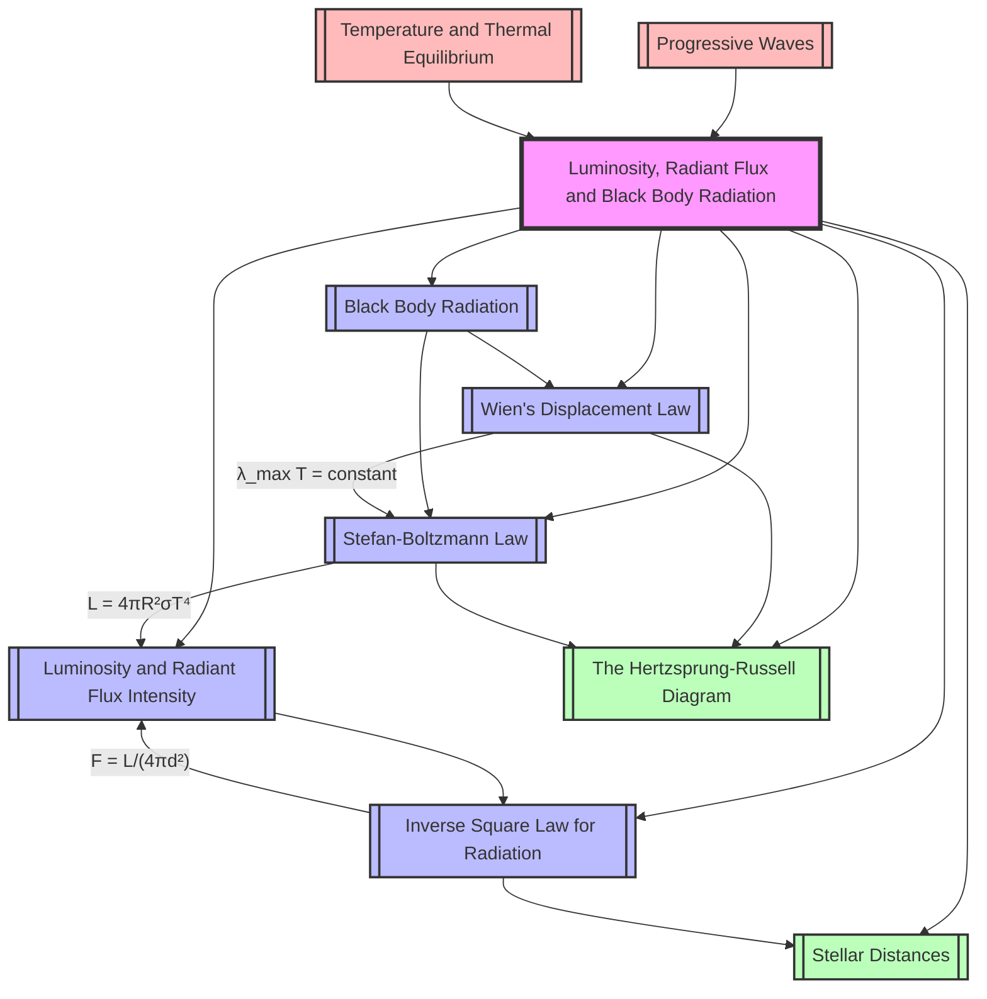

# 1. Overview / 概述

**English:**
This topic explores the fundamental properties of stars: how much energy they emit ([[Luminosity and Radiant Flux Intensity]]), how that energy spreads through space ([[Inverse Square Law for Radiation]]), and the theoretical model that describes their emission spectrum ([[Black Body Radiation]]). It introduces two cornerstone laws of astrophysics: [[Wien's Displacement Law]], which relates a star's temperature to its peak emission wavelength, and the [[Stefan-Boltzmann Law]], which links a star's total power output to its temperature and size.

Understanding these concepts is crucial because they allow astronomers to determine a star's intrinsic brightness, surface temperature, and radius from Earth-based observations. Without these tools, we could not classify stars or understand their evolution. Real-world applications include thermal imaging, infrared astronomy, and the design of solar panels. In both Cambridge 9702 and Edexcel IAL examinations, this topic forms the quantitative backbone of astrophysics, appearing in multiple-choice, structured calculation, and long-answer explanation questions.

**中文：**
本主题探讨恒星的基本属性：它们发射多少能量（[[Luminosity and Radiant Flux Intensity]]），这些能量如何在空间中传播（[[Inverse Square Law for Radiation]]），以及描述其发射光谱的理论模型（[[Black Body Radiation]]）。它引入了天体物理学的两个基石定律：[[Wien's Displacement Law]]，将恒星温度与其峰值发射波长联系起来；以及[[Stefan-Boltzmann Law]]，将恒星的总功率输出与其温度和大小联系起来。

理解这些概念至关重要，因为它们使天文学家能够根据地球观测确定恒星的内在亮度、表面温度和半径。没有这些工具，我们就无法对恒星进行分类或理解其演化。实际应用包括热成像、红外天文学和太阳能电池板设计。在剑桥 9702 和爱德思 IAL 考试中，本主题构成了天体物理学的定量基础，出现在选择题、结构化计算题和长篇解释题中。

---

# 2. Syllabus Learning Objectives / 考纲学习目标

| CAIE 9702 | Edexcel IAL |
|-----------|-------------|
| 25.1(a) Define luminosity and radiant flux intensity | 10.1 Understand the terms luminosity and radiant flux intensity |
| 25.1(b) Use the inverse square law for radiation: $F = \frac{L}{4\pi d^2}$ | 10.2 Use the inverse square law $F = \frac{L}{4\pi d^2}$ |
| 25.1(c) Define a black body | 10.3 Understand the concept of a black body |
| 25.1(d) Use Wien's displacement law: $\lambda_{\text{max}} T = \text{constant}$ | 10.4 Use Wien's law: $\lambda_{\text{max}} T = 2.9 \times 10^{-3} \text{ m K}$ |
| 25.1(e) Use the Stefan-Boltzmann law: $L = \sigma A T^4$ | 10.5 Use Stefan-Boltzmann law: $L = \sigma A T^4$ |
| 25.1(f) Understand how the HR diagram is related to these laws | 10.6 Relate these laws to the Hertzsprung-Russell diagram |

**Examiner Expectations / 考官期望:**

**English:**
- Candidates must be able to **define** luminosity and radiant flux intensity precisely, distinguishing between them.
- Candidates must **derive** the inverse square law from the geometry of a sphere.
- Candidates must **apply** Wien's law and Stefan-Boltzmann law in calculations, often combining them to find stellar radius.
- Candidates must **explain** why stars approximate black bodies and the limitations of this model.
- Candidates must **interpret** the [[The Hertzsprung-Russell Diagram]] in terms of these physical laws.

**中文：**
- 考生必须能够**精确定义**光度和辐射通量强度，并区分它们。
- 考生必须**推导**出基于球体几何的反平方定律。
- 考生必须**应用**维恩定律和斯特藩-玻尔兹曼定律进行计算，通常结合它们来求恒星半径。
- 考生必须**解释**为什么恒星近似为黑体以及该模型的局限性。
- 考生必须**解释**[[The Hertzsprung-Russell Diagram]] 与这些物理定律的关系。

> 📋 **CIE Only:** CIE 25.1(f) explicitly requires understanding how the HR diagram relates to these laws. Expect a question linking Stefan-Boltzmann and Wien's law to the positions of stars on the HR diagram.
>
> 📋 **Edexcel Only:** Edexcel 10.6 requires relating these laws to the HR diagram, but also expects candidates to know the value of Wien's constant ($2.9 \times 10^{-3} \text{ m K}$) and Stefan-Boltzmann constant ($5.67 \times 10^{-8} \text{ W m}^{-2} \text{ K}^{-4}$).

---

# 3. Core Definitions / 核心定义

| Term (EN/CN) | Definition (EN) | Definition (CN) | Common Mistakes / 常见错误 |
|--------------|-----------------|-----------------|---------------------------|
| **Luminosity** / 光度 | The total power (energy per second) radiated by a star across all wavelengths. | 恒星在所有波长上辐射的总功率（每秒能量）。 | Confusing with [[Luminosity and Radiant Flux Intensity]] — luminosity is intrinsic, radiant flux is what we measure. |
| **Radiant Flux Intensity** / 辐射通量强度 | The power per unit area received at a point from a radiating source. | 从辐射源在一点处接收到的单位面积功率。 | Forgetting it decreases with distance; using $F$ when $L$ is required. |
| **Black Body** / 黑体 | An ideal object that absorbs all electromagnetic radiation incident upon it and emits radiation with a continuous spectrum dependent only on its temperature. | 一个理想物体，吸收所有入射的电磁辐射，并发射仅取决于其温度的连续光谱。 | Thinking real stars are perfect black bodies; they are approximations. |
| **Wien's Constant** / 维恩常数 | $2.9 \times 10^{-3} \text{ m K}$ — the constant in Wien's displacement law. | $2.9 \times 10^{-3} \text{ m K}$ — 维恩位移定律中的常数。 | Using wrong units (must be m·K, not cm·K). |
| **Stefan-Boltzmann Constant** / 斯特藩-玻尔兹曼常数 | $\sigma = 5.67 \times 10^{-8} \text{ W m}^{-2} \text{ K}^{-4}$ — relates power emitted per unit area to $T^4$. | $\sigma = 5.67 \times 10^{-8} \text{ W m}^{-2} \text{ K}^{-4}$ — 将单位面积发射功率与 $T^4$ 联系起来。 | Forgetting the $T^4$ dependence; using $T$ instead of $T^4$. |
| **Peak Wavelength** / 峰值波长 | $\lambda_{\text{max}}$ — the wavelength at which a black body emits the maximum intensity. | $\lambda_{\text{max}}$ — 黑体发射最大强度时的波长。 | Confusing with average wavelength. |

---

# 4. Key Concepts Explained / 关键概念详解

## 4.1 Luminosity and Radiant Flux Intensity / 光度和辐射通量强度

### Explanation / 解释
**English:**
[[Luminosity and Radiant Flux Intensity]] are two distinct but related quantities. **Luminosity ($L$)** is an intrinsic property of a star — the total power it emits, measured in watts (W). It does not depend on the observer's distance. **Radiant flux intensity ($F$)** is the power per unit area received at a detector, measured in $\text{W m}^{-2}$. It depends on both the star's luminosity and the distance from the star. The relationship is given by the [[Inverse Square Law for Radiation]].

**中文：**
[[Luminosity and Radiant Flux Intensity]] 是两个不同但相关的量。**光度 ($L$)** 是恒星的内在属性——它发射的总功率，以瓦特 (W) 为单位。它不依赖于观察者的距离。**辐射通量强度 ($F$)** 是在探测器处接收到的单位面积功率，以 $\text{W m}^{-2}$ 为单位。它取决于恒星的光度和与恒星的距离。它们的关系由[[Inverse Square Law for Radiation]]给出。

### Physical Meaning / 物理意义
**English:**
Imagine a light bulb. The bulb's wattage (e.g., 100 W) is its luminosity. The brightness you perceive depends on how far away you stand — that's the radiant flux intensity. A star like the Sun has a fixed luminosity ($3.85 \times 10^{26} \text{ W}$), but the radiant flux we receive on Earth is only about $1360 \text{ W m}^{-2}$ because of the vast distance.

**中文：**
想象一个灯泡。灯泡的瓦数（例如 100 W）就是它的光度。你感知到的亮度取决于你站的距离——那就是辐射通量强度。像太阳这样的恒星具有固定的光度 ($3.85 \times 10^{26} \text{ W}$)，但由于距离遥远，我们在地球上接收到的辐射通量仅为约 $1360 \text{ W m}^{-2}$。

### Common Misconceptions / 常见误区
1. **English:** Thinking luminosity changes with distance. **中文：** 认为光度随距离变化。
2. **English:** Confusing radiant flux intensity with intensity of a wave (which is power per unit area for a wave, but here it's specifically for radiation from a point source). **中文：** 将辐射通量强度与波的强度混淆（波的强度是单位面积功率，但这里特指点源的辐射）。
3. **English:** Forgetting that $F$ is power per unit area, not total power. **中文：** 忘记 $F$ 是单位面积功率，而不是总功率。

### Exam Tips / 考试提示
**English:**
Cambridge and Edexcel often ask you to **define** both terms in the first part of a question, then use them in a calculation. Always state the units clearly. When comparing two stars, remember that luminosity is intrinsic; if a star appears dimmer, it could be because it has lower luminosity OR it is farther away.

**中文：**
剑桥和爱德思经常在问题的第一部分要求你**定义**这两个术语，然后在计算中使用它们。始终清楚地说明单位。比较两颗恒星时，记住光度是内在的；如果一颗恒星看起来更暗，可能是因为它的光度较低，或者距离更远。

---

## 4.2 Inverse Square Law for Radiation / 辐射反平方定律

### Explanation / 解释
**English:**
The [[Inverse Square Law for Radiation]] states that the radiant flux intensity $F$ received from a point source is inversely proportional to the square of the distance $d$ from the source:
$$F = \frac{L}{4\pi d^2}$$
This arises because the star's energy spreads uniformly over the surface area of a sphere ($4\pi d^2$) centered on the star. As the sphere expands, the same total power is spread over a larger area, so the flux decreases.

**中文：**
[[Inverse Square Law for Radiation]] 指出，从点源接收到的辐射通量强度 $F$ 与到源的距离 $d$ 的平方成反比：
$$F = \frac{L}{4\pi d^2}$$
这是因为恒星的能量均匀分布在以恒星为中心的球面 ($4\pi d^2$) 上。随着球面膨胀，相同的总功率分布在更大的面积上，因此通量减小。

### Physical Meaning / 物理意义
**English:**
If you double your distance from a star, the radiant flux intensity drops to one-quarter of its original value. This is why distant stars appear so faint. It also explains why planets closer to the Sun are much hotter — they receive higher radiant flux.

**中文：**
如果你与恒星的距离加倍，辐射通量强度将下降到原始值的四分之一。这就是为什么遥远的恒星看起来如此暗淡。这也解释了为什么离太阳更近的行星更热——它们接收到的辐射通量更高。

### Common Misconceptions / 常见误区
1. **English:** Applying the inverse square law to extended sources (like the Sun's surface) without correction. **中文：** 将反平方定律应用于扩展源（如太阳表面）而不进行修正。
2. **English:** Forgetting the $4\pi$ factor. **中文：** 忘记 $4\pi$ 因子。
3. **English:** Thinking the law applies to all distances — it only applies in the far-field (distance >> source size). **中文：** 认为该定律适用于所有距离——它只适用于远场（距离 >> 源尺寸）。

### Exam Tips / 考试提示
**English:**
You may be asked to **derive** the inverse square law from the geometry of a sphere. Show: $F = \frac{P}{A} = \frac{L}{4\pi d^2}$. Also, be prepared to **rearrange** the formula to find $L$ or $d$. A common exam question gives $F$ at Earth and asks for the star's luminosity, or vice versa.

**中文：**
你可能会被要求**推导**基于球体几何的反平方定律。展示：$F = \frac{P}{A} = \frac{L}{4\pi d^2}$。同时，准备好**重新排列**公式以求出 $L$ 或 $d$。一个常见的考试题目给出地球上的 $F$，要求求恒星的光度，反之亦然。

---

## 4.3 Black Body Radiation / 黑体辐射

### Explanation / 解释
**English:**
A [[Black Body Radiation|black body]] is an idealized object that absorbs all incident electromagnetic radiation and emits a continuous spectrum whose shape depends only on its temperature. Stars are good approximations to black bodies because their dense interiors absorb and re-emit radiation efficiently. The spectrum of a black body has a characteristic shape: intensity increases with wavelength, peaks at a certain $\lambda_{\text{max}}$, then decreases. The peak shifts to shorter wavelengths as temperature increases.

**中文：**
[[Black Body Radiation|黑体]] 是一个理想化的物体，吸收所有入射的电磁辐射，并发射一个仅取决于其温度的连续光谱。恒星是黑体的良好近似，因为它们致密的内部有效地吸收和重新发射辐射。黑体的光谱具有特征形状：强度随波长增加，在某个 $\lambda_{\text{max}}$ 处达到峰值，然后下降。随着温度升高，峰值向更短的波长移动。

### Physical Meaning / 物理意义
**English:**
This explains why hot stars appear blue (peak in the visible blue/violet) and cool stars appear red (peak in the visible red/infrared). The Sun, at about 5800 K, peaks in the visible green-yellow, which is why our eyes evolved to be most sensitive to that range.

**中文：**
这解释了为什么热的恒星看起来是蓝色的（峰值在可见蓝/紫光区域），而冷的恒星看起来是红色的（峰值在可见红/红外区域）。太阳的温度约为 5800 K，峰值在可见绿-黄光区域，这就是为什么我们的眼睛进化到对该范围最敏感。

### Common Misconceptions / 常见误区
1. **English:** Thinking a black body is black in color — it only appears black when cold because it doesn't reflect light. When hot, it glows. **中文：** 认为黑体是黑色的——它只在冷的时候看起来是黑色的，因为它不反射光。当热的时候，它会发光。
2. **English:** Confusing the black body spectrum with line spectra (emission/absorption lines). **中文：** 将黑体光谱与线光谱（发射/吸收线）混淆。
3. **English:** Believing all objects emit black body radiation — real objects have emissivity less than 1. **中文：** 相信所有物体都发射黑体辐射——真实物体的发射率小于 1。

### Exam Tips / 考试提示
**English:**
You may be asked to **sketch** the black body spectrum for different temperatures. Remember: higher $T$ → higher peak intensity, shorter $\lambda_{\text{max}}$, and more total area under the curve (Stefan-Boltzmann). Also, explain why stars are not perfect black bodies (absorption lines in their spectra).

**中文：**
你可能会被要求**绘制**不同温度下的黑体光谱。记住：更高的 $T$ → 更高的峰值强度，更短的 $\lambda_{\text{max}}$，以及曲线下更大的总面积（斯特藩-玻尔兹曼）。同时，解释为什么恒星不是完美的黑体（它们光谱中的吸收线）。

---

## 4.4 Wien's Displacement Law / 维恩位移定律

### Explanation / 解释
**English:**
[[Wien's Displacement Law]] states that the wavelength at which a black body emits maximum intensity ($\lambda_{\text{max}}$) is inversely proportional to its absolute temperature ($T$):
$$\lambda_{\text{max}} T = \text{constant} = 2.9 \times 10^{-3} \text{ m K}$$
This means hotter objects emit peak radiation at shorter wavelengths. The law is derived from Planck's law of black body radiation and is a key tool for determining stellar temperatures from their spectra.

**中文：**
[[Wien's Displacement Law]] 指出，黑体发射最大强度时的波长 ($\lambda_{\text{max}}$) 与其绝对温度 ($T$) 成反比：
$$\lambda_{\text{max}} T = \text{constant} = 2.9 \times 10^{-3} \text{ m K}$$
这意味着更热的物体在更短的波长处发射峰值辐射。该定律源自普朗克黑体辐射定律，是从恒星光谱确定其温度的关键工具。

### Physical Meaning / 物理意义
**English:**
If you measure the peak wavelength of a star's spectrum, you can calculate its surface temperature. For example, if a star's peak is at 500 nm (blue), its temperature is $T = \frac{2.9 \times 10^{-3}}{500 \times 10^{-9}} = 5800 \text{ K}$. This is how we know the Sun's temperature.

**中文：**
如果你测量恒星光谱的峰值波长，你可以计算其表面温度。例如，如果一颗恒星的峰值在 500 nm（蓝色），其温度为 $T = \frac{2.9 \times 10^{-3}}{500 \times 10^{-9}} = 5800 \text{ K}$。这就是我们如何知道太阳温度的方法。

### Common Misconceptions / 常见误区
1. **English:** Forgetting to convert wavelength to meters. **中文：** 忘记将波长转换为米。
2. **English:** Using $\lambda_{\text{max}}$ in nm without converting — the constant is in m·K. **中文：** 使用 nm 单位的 $\lambda_{\text{max}}$ 而不转换——常数单位是 m·K。
3. **English:** Thinking the law applies to non-black bodies without correction. **中文：** 认为该定律适用于非黑体而不进行修正。

### Exam Tips / 考试提示
**English:**
You will be expected to **calculate** $T$ from $\lambda_{\text{max}}$ or vice versa. Watch the units carefully. A common trick: the question gives $\lambda_{\text{max}}$ in nm or Å, and you must convert to meters. Also, be able to **explain** why a star's color indicates its temperature.

**中文：**
你将被要求**计算**从 $\lambda_{\text{max}}$ 求 $T$，反之亦然。仔细注意单位。一个常见的陷阱：题目给出的 $\lambda_{\text{max}}$ 单位是 nm 或 Å，你必须转换为米。同时，能够**解释**为什么恒星的颜色指示其温度。

---

## 4.5 Stefan-Boltzmann Law / 斯特藩-玻尔兹曼定律

### Explanation / 解释
**English:**
The [[Stefan-Boltzmann Law]] states that the total power radiated per unit surface area of a black body is proportional to the fourth power of its absolute temperature:
$$j = \sigma T^4$$
where $j$ is the power per unit area ($\text{W m}^{-2}$) and $\sigma = 5.67 \times 10^{-8} \text{ W m}^{-2} \text{ K}^{-4}$. For a star of surface area $A = 4\pi R^2$, the luminosity is:
$$L = \sigma A T^4 = 4\pi R^2 \sigma T^4$$

**中文：**
[[Stefan-Boltzmann Law]] 指出，黑体每单位表面积辐射的总功率与其绝对温度的四次方成正比：
$$j = \sigma T^4$$
其中 $j$ 是单位面积功率 ($\text{W m}^{-2}$)，$\sigma = 5.67 \times 10^{-8} \text{ W m}^{-2} \text{ K}^{-4}$。对于表面积为 $A = 4\pi R^2$ 的恒星，光度为：
$$L = \sigma A T^4 = 4\pi R^2 \sigma T^4$$

### Physical Meaning / 物理意义
**English:**
This law explains why hot stars are so much more luminous than cool stars. Doubling the temperature increases the power output by a factor of $2^4 = 16$. It also shows that a star's luminosity depends on both its size (radius) and temperature. A red giant can be very luminous despite being cool because it is enormous.

**中文：**
该定律解释了为什么热的恒星比冷的恒星亮得多。温度加倍会使功率输出增加 $2^4 = 16$ 倍。它还表明恒星的光度取决于其大小（半径）和温度。红巨星尽管温度低，但可以非常明亮，因为它体积巨大。

### Common Misconceptions / 常见误区
1. **English:** Forgetting the $T^4$ dependence and using $T$ instead. **中文：** 忘记 $T^4$ 依赖性而使用 $T$。
2. **English:** Confusing $j$ (power per unit area) with $L$ (total power). **中文：** 混淆 $j$（单位面积功率）和 $L$（总功率）。
3. **English:** Using the wrong area — for a star, it's $4\pi R^2$, not $\pi R^2$. **中文：** 使用错误的面积——对于恒星，是 $4\pi R^2$，而不是 $\pi R^2$。

### Exam Tips / 考试提示
**English:**
This law is often combined with Wien's law to find a star's radius. Given $L$ and $T$, you can find $R$. Or given $L$ and $R$, find $T$. Be prepared to **rearrange** the formula. Also, understand that the law applies to the star's **surface** temperature, not its core temperature.

**中文：**
该定律通常与维恩定律结合使用来求恒星的半径。给定 $L$ 和 $T$，可以求出 $R$。或者给定 $L$ 和 $R$，求 $T$。准备好**重新排列**公式。同时，理解该定律适用于恒星的**表面**温度，而不是核心温度。

---

# 5. Essential Equations / 核心公式

## 5.1 Inverse Square Law for Radiation / 辐射反平方定律

**Equation / 公式:**
$$F = \frac{L}{4\pi d^2}$$

**Variables / 变量:**
| Symbol (符号) | Meaning (EN) | Meaning (CN) | Unit (单位) |
|--------------|-------------|-------------|------------|
| $F$ | Radiant flux intensity | 辐射通量强度 | $\text{W m}^{-2}$ |
| $L$ | Luminosity | 光度 | $\text{W}$ |
| $d$ | Distance from source | 到源的距离 | $\text{m}$ |

**Derivation / 推导:**
**English:**
Consider a star emitting power $L$ uniformly in all directions. At a distance $d$, this power is spread over the surface of a sphere of radius $d$, area $A = 4\pi d^2$. The power per unit area (flux) is therefore $F = \frac{L}{A} = \frac{L}{4\pi d^2}$.

**中文：**
考虑一颗恒星在所有方向上均匀发射功率 $L$。在距离 $d$ 处，该功率分布在半径为 $d$ 的球面上，面积为 $A = 4\pi d^2$。因此单位面积功率（通量）为 $F = \frac{L}{A} = \frac{L}{4\pi d^2}$。

**Conditions / 适用条件:**
**English:** Point source; isotropic emission; no absorption or scattering between source and observer; far-field (distance >> source size).
**中文：** 点源；各向同性发射；源和观察者之间无吸收或散射；远场（距离 >> 源尺寸）。

**Limitations / 局限性:**
**English:** Does not apply to extended sources at close range; ignores interstellar dust absorption; assumes no gravitational lensing.
**中文：** 不适用于近距离的扩展源；忽略星际尘埃吸收；假设没有引力透镜效应。

**Rearrangements / 变形:**
$$L = 4\pi d^2 F$$
$$d = \sqrt{\frac{L}{4\pi F}}$$

---

## 5.2 Wien's Displacement Law / 维恩位移定律

**Equation / 公式:**
$$\lambda_{\text{max}} T = 2.9 \times 10^{-3} \text{ m K}$$

**Variables / 变量:**
| Symbol (符号) | Meaning (EN) | Meaning (CN) | Unit (单位) |
|--------------|-------------|-------------|------------|
| $\lambda_{\text{max}}$ | Peak wavelength | 峰值波长 | $\text{m}$ |
| $T$ | Absolute temperature | 绝对温度 | $\text{K}$ |

**Derivation / 推导:**
**English:**
Wien's law is derived from Planck's law by differentiating the black body intensity distribution with respect to wavelength and setting the derivative to zero. The derivation is not required at A-Level, but the result must be applied.

**中文：**
维恩定律是通过对普朗克定律关于波长求导并令导数为零而推导出来的。A-Level 不要求推导，但必须应用结果。

**Conditions / 适用条件:**
**English:** Black body; valid for all temperatures.
**中文：** 黑体；适用于所有温度。

**Limitations / 局限性:**
**English:** Real stars are not perfect black bodies; absorption lines cause slight deviations. The law gives the surface temperature, not the core temperature.
**中文：** 真实恒星不是完美的黑体；吸收线会导致轻微偏差。该定律给出表面温度，而不是核心温度。

**Rearrangements / 变形:**
$$T = \frac{2.9 \times 10^{-3}}{\lambda_{\text{max}}}$$
$$\lambda_{\text{max}} = \frac{2.9 \times 10^{-3}}{T}$$

---

## 5.3 Stefan-Boltzmann Law / 斯特藩-玻尔兹曼定律

**Equation / 公式:**
$$L = \sigma A T^4 = 4\pi R^2 \sigma T^4$$

**Variables / 变量:**
| Symbol (符号) | Meaning (EN) | Meaning (CN) | Unit (单位) |
|--------------|-------------|-------------|------------|
| $L$ | Luminosity | 光度 | $\text{W}$ |
| $\sigma$ | Stefan-Boltzmann constant | 斯特藩-玻尔兹曼常数 | $5.67 \times 10^{-8} \text{ W m}^{-2} \text{ K}^{-4}$ |
| $A$ | Surface area | 表面积 | $\text{m}^2$ |
| $R$ | Radius | 半径 | $\text{m}$ |
| $T$ | Surface temperature | 表面温度 | $\text{K}$ |

**Derivation / 推导:**
**English:**
The law is an empirical result from thermodynamics and quantum mechanics. For a black body, the power per unit area is $j = \sigma T^4$. For a sphere of radius $R$, $A = 4\pi R^2$, so $L = 4\pi R^2 \sigma T^4$.

**中文：**
该定律是热力学和量子力学的经验结果。对于黑体，单位面积功率为 $j = \sigma T^4$。对于半径为 $R$ 的球体，$A = 4\pi R^2$，因此 $L = 4\pi R^2 \sigma T^4$。

**Conditions / 适用条件:**
**English:** Black body; applies to the surface temperature; assumes uniform temperature across the surface.
**中文：** 黑体；适用于表面温度；假设表面温度均匀。

**Limitations / 局限性:**
**English:** Real stars have non-uniform surface temperatures (e.g., sunspots); the law gives an effective temperature, not the actual temperature at every point.
**中文：** 真实恒星具有非均匀的表面温度（例如太阳黑子）；该定律给出有效温度，而不是每一点的实际温度。

**Rearrangements / 变形:**
$$T = \left( \frac{L}{4\pi R^2 \sigma} \right)^{1/4}$$
$$R = \sqrt{\frac{L}{4\pi \sigma T^4}}$$

---

# 6. Graphs and Relationships / 图表与关系

## 6.1 Black Body Spectrum / 黑体光谱

### Axes / 坐标轴
**English:** x-axis: Wavelength $\lambda$ (m or nm); y-axis: Spectral intensity $I(\lambda)$ (arbitrary units or $\text{W m}^{-3}$)
**中文：** x轴：波长 $\lambda$ (m 或 nm)；y轴：光谱强度 $I(\lambda)$ (任意单位或 $\text{W m}^{-3}$)

### Shape / 形状
**English:** A smooth, bell-shaped curve that rises from zero at short wavelengths, peaks at $\lambda_{\text{max}}$, then falls to zero at long wavelengths. The curve is asymmetric, with a steeper rise on the short-wavelength side.
**中文：** 一条平滑的钟形曲线，从短波长的零开始上升，在 $\lambda_{\text{max}}$ 处达到峰值，然后在长波长处下降到零。曲线不对称，短波长侧上升更陡。

### Gradient Meaning / 斜率含义
**English:** The gradient at any point represents the rate of change of intensity with wavelength. At the peak, the gradient is zero.
**中文：** 任意点的斜率表示强度随波长的变化率。在峰值处，斜率为零。

### Area Meaning / 面积含义
**English:** The total area under the curve represents the total power radiated per unit area ($j = \sigma T^4$). A higher temperature curve has a larger area.
**中文：** 曲线下的总面积表示每单位面积辐射的总功率 ($j = \sigma T^4$)。温度更高的曲线面积更大。

### Exam Interpretation / 考试解读
**English:**
You may be asked to **sketch** curves for two different temperatures on the same axes. The hotter curve should have: (1) higher peak intensity, (2) peak at shorter wavelength, (3) larger area under the curve. You may also be asked to **label** $\lambda_{\text{max}}$ for each.

**中文：**
你可能会被要求在同一坐标轴上**绘制**两个不同温度的曲线。较热的曲线应具有：(1) 更高的峰值强度，(2) 峰值在更短的波长处，(3) 曲线下更大的面积。你可能还需要为每条曲线**标注** $\lambda_{\text{max}}$。

### Common Questions / 常见问题
**English:**
"Sketch the black body radiation curves for a star of 3000 K and a star of 6000 K. Explain why the hotter star appears blue-white while the cooler star appears red."
**中文：**
"绘制 3000 K 恒星和 6000 K 恒星的黑体辐射曲线。解释为什么较热的恒星看起来是蓝白色，而较冷的恒星看起来是红色。"

> 📷 **IMAGE PROMPT — GRAPH-01: Black Body Radiation Curves**
>
> A graph with two smooth bell-shaped curves on the same axes. x-axis labeled "Wavelength (nm)" from 0 to 3000, y-axis labeled "Spectral Intensity (arbitrary units)". Curve A (3000 K) peaks around 970 nm in the infrared, low peak height. Curve B (6000 K) peaks around 480 nm in the visible blue, much higher peak. The area under Curve B is visibly larger. Both curves approach zero at short and long wavelengths. Labels: $\lambda_{\text{max}}$ for each curve marked with dashed vertical lines. Color: Curve A in red, Curve B in blue.

---

## 6.2 Luminosity vs Temperature (Log-Log) / 光度 vs 温度（对数-对数）

### Axes / 坐标轴
**English:** x-axis: log $T$ (log of surface temperature); y-axis: log $L$ (log of luminosity)
**中文：** x轴：log $T$（表面温度的对数）；y轴：log $L$（光度的对数）

### Shape / 形状
**English:** A straight line with gradient 4 (from $L \propto T^4$). Stars of different radii lie on parallel lines offset vertically.
**中文：** 一条斜率为 4 的直线（来自 $L \propto T^4$）。不同半径的恒星位于垂直偏移的平行线上。

### Gradient Meaning / 斜率含义
**English:** The gradient of 4 confirms the Stefan-Boltzmann law. A gradient of 4 means a 10× increase in $T$ gives a $10^4 = 10000$× increase in $L$.
**中文：** 斜率为 4 证实了斯特藩-玻尔兹曼定律。斜率为 4 意味着 $T$ 增加 10 倍会导致 $L$ 增加 $10^4 = 10000$ 倍。

### Area Meaning / 面积含义
**English:** Not applicable for this graph.
**中文：** 不适用于此图。

### Exam Interpretation / 考试解读
**English:**
You may be asked to **plot** data on a log-log graph and determine the gradient. A gradient close to 4 confirms the Stefan-Boltzmann relationship. You may also be asked to **compare** two stars: if they have the same $T$ but different $L$, the more luminous one has a larger radius.

**中文：**
你可能会被要求在对数-对数图上**绘制**数据并确定斜率。斜率接近 4 证实了斯特藩-玻尔兹曼关系。你可能还需要**比较**两颗恒星：如果它们具有相同的 $T$ 但不同的 $L$，则更亮的那颗半径更大。

### Common Questions / 常见问题
**English:**
"Using the data below, plot a graph of log $L$ against log $T$. Determine the gradient and comment on its significance."
**中文：**
"使用以下数据，绘制 log $L$ 对 log $T$ 的图表。确定斜率并评论其意义。"

---

## 6.3 Radiant Flux vs Distance / 辐射通量 vs 距离

### Axes / 坐标轴
**English:** x-axis: Distance $d$ (m); y-axis: Radiant flux intensity $F$ ($\text{W m}^{-2}$)
**中文：** x轴：距离 $d$ (m)；y轴：辐射通量强度 $F$ ($\text{W m}^{-2}$)

### Shape / 形状
**English:** A curve that decreases rapidly, following $F \propto 1/d^2$. The curve is steep near the source and flattens at large distances.
**中文：** 一条快速下降的曲线，遵循 $F \propto 1/d^2$。曲线在源附近陡峭，在大距离处变平。

### Gradient Meaning / 斜率含义
**English:** The gradient is negative and not constant. The rate of decrease slows with distance.
**中文：** 斜率为负且不恒定。下降速率随距离增加而减慢。

### Area Meaning / 面积含义
**English:** Not directly meaningful.
**中文：** 没有直接意义。

### Exam Interpretation / 考试解读
**English:**
You may be asked to **sketch** this curve or to **calculate** $F$ at different distances. A common question: "A star has luminosity $L$. Calculate the radiant flux at distances $d$ and $2d$." The answer: $F$ at $2d$ is one-quarter of $F$ at $d$.

**中文：**
你可能会被要求**绘制**此曲线或**计算**不同距离处的 $F$。一个常见问题："一颗恒星的光度为 $L$。计算距离 $d$ 和 $2d$ 处的辐射通量。" 答案：$2d$ 处的 $F$ 是 $d$ 处 $F$ 的四分之一。

### Common Questions / 常见问题
**English:**
"Explain why the radiant flux from a star decreases with distance according to an inverse square law."
**中文：**
"解释为什么恒星的辐射通量根据反平方定律随距离减小。"

---

# 7. Required Diagrams / 必备图表

## 7.1 Black Body Radiation Spectrum / 黑体辐射光谱

### Description / 描述
**English:**
A graph showing the spectral intensity distribution of a black body at different temperatures. The x-axis is wavelength (nm), the y-axis is spectral intensity (arbitrary units). Multiple curves are shown for different temperatures (e.g., 3000 K, 5000 K, 7000 K). Each curve is a smooth bell shape, with the peak shifting to shorter wavelengths and increasing in height as temperature increases.

**中文：**
显示不同温度下黑体光谱强度分布的图表。x轴为波长 (nm)，y轴为光谱强度（任意单位）。显示了不同温度（例如 3000 K、5000 K、7000 K）的多条曲线。每条曲线都是平滑的钟形，随着温度升高，峰值向更短的波长移动且高度增加。

### Image Prompt / 图片生成提示
> 📷 **IMAGE PROMPT — DIAG-01: Black Body Radiation Spectrum**
>
> A scientific graph with three smooth bell-shaped curves on a white background. x-axis labeled "Wavelength (nm)" from 0 to 3000, with tick marks every 500 nm. y-axis labeled "Spectral Intensity (arbitrary units)" from 0 to 10. Curve 1 (3000 K): peaks at ~970 nm, max intensity ~2. Curve 2 (5000 K): peaks at ~580 nm, max intensity ~5. Curve 3 (7000 K): peaks at ~414 nm, max intensity ~8. Each curve has a dashed vertical line at its peak labeled $\lambda_{\text{max}}$. The visible spectrum (400-700 nm) is shown as a colored bar at the bottom. Style: clean, textbook-quality, with gridlines. Labels in English.

### Labels Required / 需要标注
**English:** x-axis: Wavelength / nm; y-axis: Spectral Intensity / arbitrary units; Each curve: Temperature / K; $\lambda_{\text{max}}$ for each curve; Visible spectrum region.
**中文：** x轴：波长 / nm；y轴：光谱强度 / 任意单位；每条曲线：温度 / K；每条曲线的 $\lambda_{\text{max}}$；可见光谱区域。

### Exam Importance / 考试重要性
**English:**
This diagram is essential for explaining Wien's displacement law and the Stefan-Boltzmann law. Candidates must be able to sketch it and interpret it. It appears in both CIE and Edexcel exams, often as a "sketch and explain" question.

**中文：**
此图对于解释维恩位移定律和斯特藩-玻尔兹曼定律至关重要。考生必须能够绘制和解释它。它出现在 CIE 和 Edexcel 考试中，通常是"绘制并解释"问题。

---

## 7.2 Inverse Square Law Geometry / 反平方定律几何图

### Description / 描述
**English:**
A diagram showing a star at the center of concentric spheres of increasing radius. The star is represented as a glowing yellow circle. Three spheres are shown with radii $d$, $2d$, and $3d$. The same total power $L$ is spread over the surface area of each sphere. Arrows indicate the radiation spreading outward uniformly. A small detector of area $A$ is shown on each sphere to illustrate that the power received decreases with distance.

**中文：**
显示一颗恒星位于同心球体中心的图表，球体半径递增。恒星表示为一个发光的黄色圆圈。显示了三个半径分别为 $d$、$2d$ 和 $3d$ 的球体。相同的总功率 $L$ 分布在每个球体的表面积上。箭头表示辐射均匀向外扩散。在每个球体上显示了一个面积为 $A$ 的小探测器，以说明接收到的功率随距离减小。

### Image Prompt / 图片生成提示
> 📷 **IMAGE PROMPT — DIAG-02: Inverse Square Law Geometry**
>
> A 2D cross-section diagram showing a bright yellow star at the center. Three concentric circles (representing spheres) are drawn around it with radii labeled d, 2d, and 3d. Radial arrows extend outward from the star, becoming more spaced out at larger radii. On each circle, a small square labeled "Detector area A" is shown. The power received at each detector is labeled: P/16 at 4d, P/4 at 2d, P at d. Style: clean, schematic, with blue circles and black arrows. Labels in English. White background.

### Labels Required / 需要标注
**English:** Star (Luminosity $L$); Sphere radius $d$, $2d$, $3d$; Surface area $4\pi d^2$; Detector area $A$; Radiant flux $F = L/(4\pi d^2)$.
**中文：** 恒星（光度 $L$）；球体半径 $d$、$2d$、$3d$；表面积 $4\pi d^2$；探测器面积 $A$；辐射通量 $F = L/(4\pi d^2)$。

### Exam Importance / 考试重要性
**English:**
This diagram is used to **derive** the inverse square law. Candidates are often asked to "explain with the aid of a diagram" why $F \propto 1/d^2$. It also helps visualize why distant stars appear faint.

**中文：**
此图用于**推导**反平方定律。考生经常被要求"借助图表解释"为什么 $F \propto 1/d^2$。它还有助于直观理解为什么遥远的恒星看起来暗淡。

---

## 7.3 Hertzsprung-Russell Diagram with Temperature and Luminosity Axes / 赫罗图（温度与光度坐标轴）

### Description / 描述
**English:**
A Hertzsprung-Russell (HR) diagram with the x-axis showing temperature (decreasing to the right, in K) and the y-axis showing luminosity (in solar units, $L_\odot$). The main sequence runs diagonally from top-left (hot, luminous) to bottom-right (cool, dim). Giants and supergiants are in the top-right, white dwarfs in the bottom-left. Lines of constant radius (from Stefan-Boltzmann law) are shown as diagonal dashed lines.

**中文：**
赫罗图 (HR)，x轴显示温度（向右递减，单位为 K），y轴显示光度（以太阳光度 $L_\odot$ 为单位）。主序带从左上角（热、亮）到右下角（冷、暗）对角线延伸。巨星和超巨星位于右上角，白矮星位于左下角。等半径线（来自斯特藩-玻尔兹曼定律）显示为对角线虚线。

### Image Prompt / 图片生成提示
> 📷 **IMAGE PROMPT — DIAG-03: Hertzsprung-Russell Diagram**
>
> A standard HR diagram with a dark blue background representing space. x-axis: Temperature (K) from 30000 (left) to 3000 (right), decreasing. y-axis: Luminosity ($L_\odot$) from 0.0001 (bottom) to 10000 (top), logarithmic scale. The main sequence is a dense band of white dots from top-left to bottom-right. Red giants are a cluster in the top-right. White dwarfs are a cluster in the bottom-left. Three dashed diagonal lines of constant radius are shown: R = 0.1 R☉, R = 1 R☉, R = 10 R☉. Labels: "Main Sequence", "Red Giants", "White Dwarfs", "R = 1 R☉". Style: textbook-quality, with a subtle glow effect on the main sequence.

### Labels Required / 需要标注
**English:** Temperature axis (K); Luminosity axis ($L_\odot$); Main Sequence; Red Giants; White Dwarfs; Lines of constant radius; Position of the Sun.
**中文：** 温度轴 (K)；光度轴 ($L_\odot$)；主序带；红巨星；白矮星；等半径线；太阳的位置。

### Exam Importance / 考试重要性
**English:**
This diagram ties together all the concepts in this topic. Candidates must understand how Wien's law (temperature → color) and Stefan-Boltzmann law (temperature + radius → luminosity) determine a star's position on the HR diagram. It is a key diagram in both CIE and Edexcel syllabuses.

**中文：**
此图将本主题中的所有概念联系在一起。考生必须理解维恩定律（温度 → 颜色）和斯特藩-玻尔兹曼定律（温度 + 半径 → 光度）如何决定恒星在 HR 图上的位置。它是 CIE 和 Edexcel 教学大纲中的关键图表。

---

# 8. Worked Examples / 典型例题

## Example 1: Finding Stellar Temperature from Peak Wavelength / 例1：从峰值波长求恒星温度

### Question / 题目
**English:**
The spectrum of a star shows a peak intensity at a wavelength of 450 nm. Calculate the surface temperature of the star. (Wien's constant = $2.9 \times 10^{-3} \text{ m K}$)

**中文：**
一颗恒星的光谱在 450 nm 波长处显示峰值强度。计算该恒星的表面温度。（维恩常数 = $2.9 \times 10^{-3} \text{ m K}$）

### Solution / 解答
**Step 1: Convert wavelength to meters / 步骤1：将波长转换为米**
$$\lambda_{\text{max}} = 450 \text{ nm} = 450 \times 10^{-9} \text{ m} = 4.50 \times 10^{-7} \text{ m}$$

**Step 2: Apply Wien's displacement law / 步骤2：应用维恩位移定律**
$$\lambda_{\text{max}} T = 2.9 \times 10^{-3}$$
$$T = \frac{2.9 \times 10^{-3}}{\lambda_{\text{max}}} = \frac{2.9 \times 10^{-3}}{4.50 \times 10^{-7}}$$

**Step 3: Calculate / 步骤3：计算**
$$T = \frac{2.9 \times 10^{-3}}{4.50 \times 10^{-7}} = 6444 \text{ K}$$

### Final Answer / 最终答案
**Answer:** $T = 6440 \text{ K}$ (to 3 significant figures) | **答案：** $T = 6440 \text{ K}$（保留3位有效数字）

### Examiner Notes / 考官点评
**English:**
- Common mistake: forgetting to convert nm to m. If you use 450 directly, you get $T = 6.44 \times 10^{-6} \text{ K}$, which is clearly wrong.
- Always check your answer: a temperature of ~6000 K is typical for a Sun-like star, so 6440 K is reasonable.
- The star would appear blue-white (hotter than the Sun's 5800 K).

**中文：**
- 常见错误：忘记将 nm 转换为 m。如果直接使用 450，会得到 $T = 6.44 \times 10^{-6} \text{ K}$，这显然是错误的。
- 始终检查你的答案：~6000 K 的温度对于类太阳恒星是典型的，因此 6440 K 是合理的。
- 该恒星看起来会是蓝白色（比太阳的 5800 K 更热）。

---

## Example 2: Finding Stellar Radius from Luminosity and Temperature / 例2：从光度和温度求恒星半径

### Question / 题目
**English:**
A star has a luminosity of $2.5 \times 10^{28} \text{ W}$ and a surface temperature of 7500 K. Calculate the radius of the star.
(Stefan-Boltzmann constant $\sigma = 5.67 \times 10^{-8} \text{ W m}^{-2} \text{ K}^{-4}$)

**中文：**
一颗恒星的光度为 $2.5 \times 10^{28} \text{ W}$，表面温度为 7500 K。计算该恒星的半径。
（斯特藩-玻尔兹曼常数 $\sigma = 5.67 \times 10^{-8} \text{ W m}^{-2} \text{ K}^{-4}$）

### Solution / 解答
**Step 1: Write the Stefan-Boltzmann law / 步骤1：写出斯特藩-玻尔兹曼定律**
$$L = 4\pi R^2 \sigma T^4$$

**Step 2: Rearrange for $R$ / 步骤2：重新排列求 $R$**
$$R^2 = \frac{L}{4\pi \sigma T^4}$$
$$R = \sqrt{\frac{L}{4\pi \sigma T^4}}$$

**Step 3: Substitute values / 步骤3：代入数值**
$$R = \sqrt{\frac{2.5 \times 10^{28}}{4\pi \times (5.67 \times 10^{-8}) \times (7500)^4}}$$

**Step 4: Calculate $T^4$ / 步骤4：计算 $T^4$**
$$T^4 = (7500)^4 = (7.5 \times 10^3)^4 = 7.5^4 \times 10^{12} = 3164 \times 10^{12} = 3.164 \times 10^{15}$$

**Step 5: Calculate denominator / 步骤5：计算分母**
$$4\pi \sigma T^4 = 4\pi \times 5.67 \times 10^{-8} \times 3.164 \times 10^{15}$$
$$= 4\pi \times 5.67 \times 3.164 \times 10^{7}$$
$$= 4\pi \times 17.94 \times 10^{7}$$
$$= 225.4 \times 10^{7} = 2.254 \times 10^{9}$$

**Step 6: Calculate $R^2$ and $R$ / 步骤6：计算 $R^2$ 和 $R$**
$$R^2 = \frac{2.5 \times 10^{28}}{2.254 \times 10^{9}} = 1.109 \times 10^{19}$$
$$R = \sqrt{1.109 \times 10^{19}} = 3.33 \times 10^{9} \text{ m}$$

### Final Answer / 最终答案
**Answer:** $R = 3.33 \times 10^{9} \text{ m}$ | **答案：** $R = 3.33 \times 10^{9} \text{ m}$

### Examiner Notes / 考官点评
**English:**
- Compare with the Sun's radius ($6.96 \times 10^{8} \text{ m}$). This star is about 4.8 times larger than the Sun.
- Common mistake: forgetting the $4\pi$ factor or using $T$ instead of $T^4$.
- Always show your working — even if the final answer is wrong, you can get method marks.
- Check units: $\sigma$ is in $\text{W m}^{-2} \text{ K}^{-4}$, so the units work out to meters.

**中文：**
- 与太阳半径 ($6.96 \times 10^{8} \text{ m}$) 比较。这颗恒星大约是太阳的 4.8 倍。
- 常见错误：忘记 $4\pi$ 因子或使用 $T$ 而不是 $T^4$。
- 始终展示你的计算过程——即使最终答案错误，你也可以获得方法分。
- 检查单位：$\sigma$ 的单位是 $\text{W m}^{-2} \text{ K}^{-4}$，因此单位最终得到米。

---

## Example 3: Combining Inverse Square Law and Stefan-Boltzmann Law / 例3：结合反平方定律和斯特藩-玻尔兹曼定律

### Question / 题目
**English:**
A star is observed from Earth. The radiant flux intensity measured at Earth is $1.2 \times 10^{-8} \text{ W m}^{-2}$. The star's surface temperature is 6000 K. The distance to the star is 12 light-years.
(1 light-year = $9.46 \times 10^{15} \text{ m}$, $\sigma = 5.67 \times 10^{-8} \text{ W m}^{-2} \text{ K}^{-4}$)

(a) Calculate the luminosity of the star.
(b) Calculate the radius of the star.

**中文：**
从地球观测一颗恒星。在地球上测得的辐射通量强度为 $1.2 \times 10^{-8} \text{ W m}^{-2}$。该恒星的表面温度为 6000 K。到恒星的距离为 12 光年。
(1 光年 = $9.46 \times 10^{15} \text{ m}$，$\sigma = 5.67 \times 10^{-8} \text{ W m}^{-2} \text{ K}^{-4}$)

(a) 计算该恒星的光度。
(b) 计算该恒星的半径。

### Solution / 解答

**Part (a): Find luminosity / 部分 (a)：求光度**

**Step 1: Convert distance to meters / 步骤1：将距离转换为米**
$$d = 12 \times 9.46 \times 10^{15} = 1.135 \times 10^{17} \text{ m}$$

**Step 2: Apply inverse square law / 步骤2：应用反平方定律**
$$F = \frac{L}{4\pi d^2}$$
$$L = 4\pi d^2 F = 4\pi \times (1.135 \times 10^{17})^2 \times (1.2 \times 10^{-8})$$

**Step 3: Calculate / 步骤3：计算**
$$d^2 = (1.135 \times 10^{17})^2 = 1.288 \times 10^{34}$$
$$L = 4\pi \times 1.288 \times 10^{34} \times 1.2 \times 10^{-8}$$
$$L = 4\pi \times 1.546 \times 10^{26}$$
$$L = 1.942 \times 10^{27} \text{ W}$$

**Part (b): Find radius / 部分 (b)：求半径**

**Step 4: Apply Stefan-Boltzmann law / 步骤4：应用斯特藩-玻尔兹曼定律**
$$L = 4\pi R^2 \sigma T^4$$
$$R = \sqrt{\frac{L}{4\pi \sigma T^4}}$$

**Step 5: Calculate $T^4$ / 步骤5：计算 $T^4$**
$$T^4 = (6000)^4 = 1.296 \times 10^{15}$$

**Step 6: Calculate denominator / 步骤6：计算分母**
$$4\pi \sigma T^4 = 4\pi \times 5.67 \times 10^{-8} \times 1.296 \times 10^{15}$$
$$= 4\pi \times 7.348 \times 10^{7}$$
$$= 9.234 \times 10^{8}$$

**Step 7: Calculate $R$ / 步骤7：计算 $R$**
$$R = \sqrt{\frac{1.942 \times 10^{27}}{9.234 \times 10^{8}}} = \sqrt{2.103 \times 10^{18}} = 1.45 \times 10^{9} \text{ m}$$

### Final Answer / 最终答案
**Answer:** (a) $L = 1.94 \times 10^{27} \text{ W}$; (b) $R = 1.45 \times 10^{9} \text{ m}$ | **答案：** (a) $L = 1.94 \times 10^{27} \text{ W}$；(b) $R = 1.45 \times 10^{9} \text{ m}$

### Examiner Notes / 考官点评
**English:**
- This is a typical multi-part question combining both laws.
- Part (a) uses the inverse square law to find $L$ from $F$ and $d$.
- Part (b) uses Stefan-Boltzmann to find $R$ from $L$ and $T$.
- Common mistake: using the distance in light-years without converting to meters.
- The radius is about 2.1 times the Sun's radius — a subgiant star.

**中文：**
- 这是一个典型的多部分问题，结合了两个定律。
- 部分 (a) 使用反平方定律从 $F$ 和 $d$ 求 $L$。
- 部分 (b) 使用斯特藩-玻尔兹曼定律从 $L$ 和 $T$ 求 $R$。
- 常见错误：使用光年单位的距离而不转换为米。
- 半径约为太阳半径的 2.1 倍——一颗次巨星。

---

# 9. Past Paper Question Types / 历年真题题型

| Question Type / 题型 | Frequency / 频率 | Difficulty / 难度 | Past Paper References / 真题索引 |
|----------------------|------------------|------------------|-------------------------------|
| Calculation: Wien's law / 计算：维恩定律 | High | Low-Medium | 📝 *待填入* |
| Calculation: Stefan-Boltzmann law / 计算：斯特藩-玻尔兹曼定律 | High | Medium | 📝 *待填入* |
| Calculation: Inverse square law / 计算：反平方定律 | High | Medium | 📝 *待填入* |
| Combined calculation (all three laws) / 综合计算（三个定律） | Medium | High | 📝 *待填入* |
| Explanation: Black body concept / 解释：黑体概念 | Medium | Low | 📝 *待填入* |
| Graph: Sketch black body spectra / 图表：绘制黑体光谱 | Medium | Medium | 📝 *待填入* |
| Graph: HR diagram interpretation / 图表：HR图解读 | Medium | Medium | 📝 *待填入* |
| Derivation: Inverse square law / 推导：反平方定律 | Low | Medium | 📝 *待填入* |
| Practical: Determining temperature from spectrum / 实验：从光谱确定温度 | Low | High | 📝 *待填入* |

> 📝 **题库整理中 / Question Bank Under Construction:** 具体试卷编号（如 9702/23/M/J/24 Q3）将在后续整理真题后填入上表。

**Common Command Words / 常见指令词:**

| English | 中文 | Expected Response |
|---------|------|-------------------|
| State | 陈述 | A brief, precise statement without explanation |
| Define | 定义 | A formal definition with correct wording |
| Explain | 解释 | A detailed account with reasoning |
| Describe | 描述 | A detailed account of features or steps |
| Calculate | 计算 | A numerical answer with working shown |
| Determine | 确定 | Find a value using given data or a graph |
| Suggest | 建议 | Apply knowledge to an unfamiliar situation |
| Sketch | 绘制 | A freehand drawing showing key features |
| Derive | 推导 | Show the mathematical steps to obtain a formula |

---

# 10. Practical Skills Connections / 实验技能链接

**English:**
This topic connects to practical skills in several ways:

1. **CAIE Paper 5 (A2) / Edexcel Unit 6 (A2):**
   - **Determining the temperature of a filament lamp:** A common experiment involves measuring the current and voltage across a filament lamp, calculating its resistance, and using the resistance-temperature relationship to estimate temperature. This can be linked to black body radiation — the filament approximates a black body.
   - **Using a diffraction grating to measure wavelength:** Students may use a diffraction grating to measure the peak wavelength of a light source, then apply Wien's law to find its temperature.
   - **Investigating the inverse square law:** Using a light sensor and a point source (e.g., a small LED), students measure the intensity at different distances and plot $I$ against $1/d^2$ to verify the inverse square law.

2. **Uncertainties and Errors:**
   - When measuring distance for the inverse square law, the uncertainty in $d$ leads to an uncertainty in $F$: $\frac{\Delta F}{F} = 2 \frac{\Delta d}{d}$.
   - When measuring $\lambda_{\text{max}}$ from a spectrum, the uncertainty in $\lambda$ leads to $\frac{\Delta T}{T} = \frac{\Delta \lambda}{\lambda}$.

3. **Graph Plotting:**
   - Plotting $F$ against $1/d^2$ should give a straight line through the origin, confirming the inverse square law.
   - Plotting $\log L$ against $\log T$ gives a straight line of gradient 4, confirming the Stefan-Boltzmann law.

4. **Experimental Design:**
   - To determine a star's temperature, you would need a spectrometer to measure its spectrum, identify $\lambda_{\text{max}}$, and apply Wien's law.
   - To determine a star's radius, you would need both its luminosity (from flux and distance) and its temperature (from Wien's law), then apply Stefan-Boltzmann.

**中文：**
本主题以多种方式与实验技能相关联：

1. **CAIE Paper 5 (A2) / Edexcel Unit 6 (A2)：**
   - **确定灯丝温度：** 一个常见实验涉及测量灯丝的电流和电压，计算其电阻，并使用电阻-温度关系估算温度。这可以与黑体辐射联系起来——灯丝近似为黑体。
   - **使用衍射光栅测量波长：** 学生可以使用衍射光栅测量光源的峰值波长，然后应用维恩定律求其温度。
   - **研究反平方定律：** 使用光传感器和点源（例如小型 LED），学生测量不同距离处的强度，并绘制 $I$ 对 $1/d^2$ 的图表以验证反平方定律。

2. **不确定度和误差：**
   - 测量反平方定律的距离时，$d$ 的不确定度导致 $F$ 的不确定度：$\frac{\Delta F}{F} = 2 \frac{\Delta d}{d}$。
   - 从光谱测量 $\lambda_{\text{max}}$ 时，$\lambda$ 的不确定度导致 $\frac{\Delta T}{T} = \frac{\Delta \lambda}{\lambda}$。

3. **图表绘制：**
   - 绘制 $F$ 对 $1/d^2$ 的图表应得到一条通过原点的直线，证实反平方定律。
   - 绘制 $\log L$ 对 $\log T$ 的图表得到一条斜率为 4 的直线，证实斯特藩-玻尔兹曼定律。

4. **实验设计：**
   - 要确定恒星的温度，你需要一个光谱仪来测量其光谱，识别 $\lambda_{\text{max}}$，并应用维恩定律。
   - 要确定恒星的半径，你需要其光度（来自通量和距离）和温度（来自维恩定律），然后应用斯特藩-玻尔兹曼定律。

> 📋 **CIE Only:** CIE Paper 5 may ask you to design an experiment to determine the temperature of a star using a spectrometer and Wien's law. Be prepared to describe the apparatus, procedure, and data analysis.
>
> 📋 **Edexcel Only:** Edexcel Unit 6 may include a practical question on verifying the inverse square law using a light sensor and a filament lamp. You should be able to describe how to minimize errors and calculate uncertainties.

---

# 11. Concept Map / 概念图谱

**English:**
The concept map shows how this topic connects to prerequisites ([[Progressive Waves]] and [[Temperature and Thermal Equilibrium]]), its five sub-topics, and related topics ([[Stellar Distances]] and [[The Hertzsprung-Russell Diagram]]). The sub-topics are interconnected: [[Luminosity and Radiant Flux Intensity]] is linked to both the [[Inverse Square Law for Radiation]] and the [[Stefan-Boltzmann Law]]. [[Black Body Radiation]] is the foundation for both [[Wien's Displacement Law]] and the [[Stefan-Boltzmann Law]]. Both laws feed into the [[The Hertzsprung-Russell Diagram]].

**中文：**
概念图显示了本主题如何连接到先修知识（[[Progressive Waves]] 和 [[Temperature and Thermal Equilibrium]]）、其五个子主题以及相关主题（[[Stellar Distances]] 和 [[The Hertzsprung-Russell Diagram]]）。子主题相互关联：[[Luminosity and Radiant Flux Intensity]] 与 [[Inverse Square Law for Radiation]] 和 [[Stefan-Boltzmann Law]] 都有关联。[[Black Body Radiation]] 是 [[Wien's Displacement Law]] 和 [[Stefan-Boltzmann Law]] 的基础。这两个定律都输入到 [[The Hertzsprung-Russell Diagram]]。

---

# 12. Quick Revision Sheet / 速查表

| Category / 类别 | Key Points / 要点 |
|----------------|------------------|
| **Definitions / 定义** | **Luminosity ($L$):** Total power radiated by a star (W). **Radiant flux ($F$):** Power per unit area received at Earth ($\text{W m}^{-2}$). **Black body:** Perfect absorber and emitter; spectrum depends only on $T$. |
| **Equations / 公式** | **Inverse square law:** $F = \frac{L}{4\pi d^2}$. **Wien's law:** $\lambda_{\text{max}} T = 2.9 \times 10^{-3} \text{ m K}$. **Stefan-Boltzmann:** $L = 4\pi R^2 \sigma T^4$, $\sigma = 5.67 \times 10^{-8} \text{ W m}^{-2} \text{ K}^{-4}$. |
| **Graphs / 图表** | **Black body spectrum:** Bell-shaped; hotter → higher peak, shorter $\lambda_{\text{max}}$, larger area. **Log $L$ vs log $T$:** Straight line, gradient 4. **$F$ vs $d$:** $F \propto 1/d^2$, steep then flat. |
| **Key Facts / 关键事实** | Stars approximate black bodies. Hot stars → blue (short $\lambda_{\text{max}}$). Cool stars → red (long $\lambda_{\text{max}}$). Doubling $T$ → $L$ increases by 16×. Doubling $d$ → $F$ decreases by 4×. |
| **Exam Reminders / 考试提醒** | Always convert nm to m for Wien's law. Use $T$ in Kelvin. Show all working. Check units. Remember $4\pi$ in inverse square law. Stefan-Boltzmann uses $T^4$, not $T$. Luminosity is intrinsic; flux depends on distance. |

**English:**
This quick revision sheet summarizes the entire topic in one page. Use it for last-minute review before exams. The most common mistakes are: forgetting unit conversions, using $T$ instead of $T^4$, and confusing luminosity with radiant flux.

**中文：**
此速查表在一页中总结了整个主题。在考试前用于最后复习。最常见的错误是：忘记单位转换，使用 $T$ 而不是 $T^4$，以及混淆光度和辐射通量。