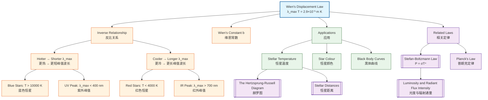

# 1. Overview / 概述

**English:**
Wien's Displacement Law describes the relationship between the temperature of a black body and the wavelength at which it emits the most intense radiation. This fundamental law states that as the temperature of a black body increases, the peak wavelength of its emitted spectrum shifts to shorter (bluer) wavelengths. This sub-topic is crucial for astrophysics because it allows astronomers to determine the surface temperature of stars by analyzing their spectra — a technique that forms the foundation of stellar classification. Within the broader context of [[Luminosity, Radiant Flux and Black Body Radiation]], Wien's Law works alongside the [[Stefan-Boltzmann Law]] to provide a complete picture of a star's thermal radiation properties.

**中文:**
维恩位移定律描述了黑体温度与其辐射最强波长之间的关系。这一定律指出，随着黑体温度升高，其发射光谱的峰值波长会向更短（更蓝）的波长方向移动。该子知识点在天体物理学中至关重要，因为天文学家可以通过分析恒星光谱来确定其表面温度——这一技术构成了恒星分类的基础。在[[Luminosity, Radiant Flux and Black Body Radiation]]的更大框架中，维恩定律与[[Stefan-Boltzmann Law]]共同提供了恒星热辐射特性的完整图景。

---

# 2. Syllabus Learning Objectives / 考纲学习目标

| CAIE 9702 | Edexcel IAL |
|-----------|-------------|
| 25.1(a): Recall Wien's displacement law: $\lambda_{max} \propto \frac{1}{T}$ | 10.1: Understand that the peak wavelength of black body radiation is inversely proportional to temperature |
| 25.1(b): Use Wien's displacement law to estimate the surface temperature of stars | 10.2: Apply Wien's law: $\lambda_{max} T = \text{constant}$ |
| 25.1(c): Interpret black body radiation curves for different temperatures | 10.3: Use Wien's law to estimate stellar temperatures |
| 25.1(d): Explain the shift of peak wavelength with temperature | 10.4: Relate peak wavelength to colour of stars |
| 25.1(e): Calculate peak wavelength given temperature and vice versa | 10.5: Understand the limitations of Wien's law |
| 25.1(f): Understand the significance of Wien's law in astrophysics | 10.6: Apply Wien's law to real stellar spectra |

**Examiner Expectations / 考官期望:**
- **CAIE:** Students must be able to recall and apply the formula $\lambda_{max} T = 2.9 \times 10^{-3} \text{ m K}$ without derivation. Questions often involve calculating stellar temperatures from given peak wavelengths or predicting the colour of stars.
- **Edexcel:** Students should understand the inverse proportionality and be able to use the constant value. Exam questions may require comparison of different stars' temperatures based on their peak wavelengths.

---

# 3. Core Definitions / 核心定义

| Term (EN/CN) | Definition (EN) | Definition (CN) | Common Mistakes / 常见错误 |
|--------------|-----------------|-----------------|---------------------------|
| **Wien's Displacement Law** / 维恩位移定律 | The law stating that the wavelength of maximum emission ($\lambda_{max}$) from a black body is inversely proportional to its absolute temperature ($T$): $\lambda_{max} T = \text{constant}$ | 黑体辐射峰值波长($\lambda_{max}$)与其绝对温度($T$)成反比的定律：$\lambda_{max} T = \text{常数}$ | Confusing with [[Stefan-Boltzmann Law]] which relates total power output to $T^4$ |
| **Peak Wavelength ($\lambda_{max}$)** / 峰值波长 | The wavelength at which a black body emits the maximum intensity of radiation | 黑体辐射强度最大时对应的波长 | Using the wrong units (must be in metres, not nanometres) |
| **Wien's Constant ($b$)** / 维恩常数 | The constant of proportionality in Wien's law: $b = 2.9 \times 10^{-3} \text{ m K}$ | 维恩定律中的比例常数：$b = 2.9 \times 10^{-3} \text{ m K}$ | Forgetting the units (m K) or using $2.9 \times 10^{-3}$ without units |
| **Black Body** / 黑体 | An idealized object that absorbs all incident electromagnetic radiation and emits a continuous spectrum determined solely by its temperature | 理想化的物体，吸收所有入射电磁辐射，并发射仅由其温度决定的连续光谱 | Thinking real objects are perfect black bodies (they are approximations) |
| **Spectral Radiance** / 光谱辐射度 | The power emitted per unit area per unit wavelength interval | 单位面积单位波长间隔内发射的功率 | Confusing with total [[Luminosity and Radiant Flux Intensity]] |

---

# 4. Key Concepts Explained / 关键概念详解

## 4.1 The Inverse Relationship Between Temperature and Peak Wavelength / 温度与峰值波长的反比关系

### Explanation / 解释
**English:**
Wien's Displacement Law mathematically expresses the observation that hotter objects emit radiation at shorter wavelengths. The law is derived from the [[Black Body Radiation]] spectrum and can be written as:

$$\lambda_{max} T = b$$

where $b = 2.9 \times 10^{-3} \text{ m K}$ is Wien's constant. This means if you know the temperature of a star, you can calculate the wavelength at which it emits most strongly, and vice versa. For example, the Sun has a surface temperature of approximately 5800 K, giving a peak wavelength of about 500 nm (green light), which explains why the Sun appears yellow-white to our eyes.

**中文:**
维恩位移定律用数学表达式描述了较热物体发射较短波长辐射的观测结果。该定律从[[Black Body Radiation]]光谱推导而来，可写为：

$$\lambda_{max} T = b$$

其中 $b = 2.9 \times 10^{-3} \text{ m K}$ 是维恩常数。这意味着如果你知道恒星的温度，就可以计算其最强辐射的波长，反之亦然。例如，太阳表面温度约为5800 K，峰值波长约为500 nm（绿光），这解释了为什么太阳在我们眼中呈现黄白色。

### Physical Meaning / 物理意义
**English:**
Physically, Wien's Law tells us that as particles in a black body gain thermal energy (higher temperature), they vibrate more rapidly and emit higher-frequency (shorter wavelength) electromagnetic radiation. This is why:
- A cool star (3000 K) appears red — peak wavelength in the infrared/red region
- A hot star (30000 K) appears blue — peak wavelength in the ultraviolet/blue region
- An even hotter object (100000 K) emits primarily in X-rays

**中文:**
从物理意义上讲，维恩定律告诉我们，当黑体中的粒子获得更多热能（温度更高）时，它们振动更快，发射更高频率（更短波长）的电磁辐射。这就是为什么：
- 冷恒星（3000 K）呈现红色——峰值波长在红外/红色区域
- 热恒星（30000 K）呈现蓝色——峰值波长在紫外/蓝色区域
- 更热的物体（100000 K）主要发射X射线

### Common Misconceptions / 常见误区
- ❌ **"Wien's law applies to all objects"** — It only applies to [[Black Body Radiation|black bodies]] or objects that closely approximate them. Real objects may have different emission spectra.
- ❌ **"Peak wavelength is the only wavelength emitted"** — Black bodies emit a continuous spectrum; $\lambda_{max}$ is just the wavelength of maximum intensity.
- ❌ **"Temperature must be in Celsius"** — Always use Kelvin (K) for absolute temperature.
- ❌ **"Wien's constant has no units"** — The constant $2.9 \times 10^{-3}$ has units of m K.

### Exam Tips / 考试提示
- **Always convert wavelength to metres** before using the formula. If given in nm, divide by $10^9$.
- **Check your answer makes sense:** A star with $\lambda_{max} = 500 \text{ nm}$ should give $T \approx 5800 \text{ K}$.
- **Remember the inverse relationship:** If $\lambda_{max}$ doubles, $T$ halves.
- **CIE specific:** You may be asked to sketch black body curves for different temperatures — ensure the hotter curve is higher and shifted left.

> 📷 **IMAGE PROMPT — WIENS-01: Black Body Radiation Curves at Different Temperatures**
> A graph showing three black body radiation curves at temperatures 3000 K (red), 5800 K (yellow), and 10000 K (blue). The x-axis shows wavelength from 0 to 2000 nm, y-axis shows spectral radiance. The 3000 K curve peaks at ~970 nm (infrared), the 5800 K curve peaks at ~500 nm (visible green), and the 10000 K curve peaks at ~290 nm (ultraviolet). Each curve shows the characteristic shape with a sharp rise and gradual fall. The peak shifts left as temperature increases.

---

# 5. Essential Equations / 核心公式

## Equation 1: Wien's Displacement Law / 维恩位移定律

$$ \lambda_{max} T = b = 2.9 \times 10^{-3} \text{ m K} $$

| Symbol (符号) | Meaning (EN) | Meaning (CN) | Unit (单位) |
|--------------|-------------|-------------|------------|
| $\lambda_{max}$ | Peak wavelength | 峰值波长 | m (metres) |
| $T$ | Absolute temperature | 绝对温度 | K (Kelvin) |
| $b$ | Wien's constant | 维恩常数 | m K |

**Derivation / 推导:**
Wien's law is derived from Planck's law of black body radiation by differentiating the spectral radiance function with respect to wavelength and setting the derivative to zero to find the maximum. This is beyond A-Level scope but the result is given.

**Conditions / 适用条件:**
- The object must be a [[Black Body Radiation|black body]] or close approximation
- The temperature must be in Kelvin (absolute temperature)
- The object must be in thermal equilibrium

**Limitations / 局限性:**
- Real stars are not perfect black bodies — absorption lines in their spectra cause deviations
- The law assumes a single temperature — stars have varying temperatures at different depths
- For very hot objects ($T > 10^6$ K), relativistic effects may become significant

> 📷 **IMAGE PROMPT — WIENS-02: Wien's Law Formula Diagram**
> A clean, textbook-style diagram showing the formula $\lambda_{max} T = 2.9 \times 10^{-3} \text{ m K}$ with annotations. Below the formula, a simple black body curve with $\lambda_{max}$ marked at the peak, and an arrow showing that as T increases, $\lambda_{max}$ decreases. Include a small table showing example calculations: Sun (5800 K → 500 nm), Betelgeuse (3500 K → 829 nm), Rigel (12000 K → 242 nm).

---

# 6. Graphs and Relationships / 图表与关系

## 6.1 Black Body Radiation Curves / 黑体辐射曲线

### Axes / 坐标轴
- **X-axis:** Wavelength ($\lambda$) / 波长 ($\lambda$) — units: nm or m
- **Y-axis:** Spectral radiance (intensity) / 光谱辐射度（强度）— units: W m$^{-2}$ nm$^{-1}$

### Shape / 形状
Each curve shows a characteristic asymmetric bell shape:
- Sharp rise from zero at short wavelengths
- Single peak at $\lambda_{max}$
- Gradual decay at longer wavelengths
- The curve never reaches zero — black bodies emit at all wavelengths

### Gradient Meaning / 斜率含义
- **Before peak:** Positive gradient — intensity increases rapidly with wavelength
- **At peak:** Zero gradient — maximum intensity
- **After peak:** Negative gradient — intensity decreases gradually

### Area Meaning / 面积含义
The total area under each curve represents the total power emitted per unit area, which is given by the [[Stefan-Boltzmann Law]] ($P = \sigma T^4$). Hotter objects have larger areas under their curves.

### Exam Interpretation / 考试解读
- **Comparing two stars:** The hotter star has its peak at a shorter wavelength AND a higher peak intensity
- **Estimating temperature:** Read $\lambda_{max}$ from the graph, then use $\lambda_{max} T = 2.9 \times 10^{-3}$
- **Colour determination:** If $\lambda_{max}$ is in the visible range (400-700 nm), the star appears that colour; if in UV or IR, the star appears white with a slight tint

> 📷 **IMAGE PROMPT — WIENS-03: Wien's Law Graph with Annotations**
> A detailed graph showing black body curves for three stars: a red giant (3000 K, peak at 967 nm), the Sun (5800 K, peak at 500 nm), and a blue supergiant (20000 K, peak at 145 nm). Each curve is labelled with the star name and temperature. Vertical dashed lines mark the peak wavelengths. The visible spectrum (400-700 nm) is shown as a coloured band at the bottom. Annotations explain: "Hotter → shorter λ_max", "Hotter → higher peak intensity", and "Area under curve = σT⁴".

---

# 7. Required Diagrams / 必备图表

## 7.1 Black Body Spectrum with Peak Wavelength / 黑体光谱与峰值波长

### Description / 描述
**English:** A standard black body radiation curve showing the continuous spectrum emitted by a black body at a given temperature. The peak wavelength ($\lambda_{max}$) is clearly marked at the highest point of the curve. The visible spectrum is shown as a coloured band for reference.

**中文:** 标准黑体辐射曲线，显示给定温度下黑体发射的连续光谱。峰值波长($\lambda_{max}$)在曲线的最高点清晰标注。可见光谱以彩色带显示作为参考。

### Image Prompt / 图片生成提示
> 📷 **IMAGE PROMPT — WIENS-04: Black Body Spectrum Diagram**
> A professional physics textbook diagram showing a black body radiation curve. The curve is smooth and asymmetric, rising steeply from zero at short wavelengths, peaking at λ_max, then falling gradually. The x-axis is labelled "Wavelength λ (nm)" with tick marks from 0 to 2000 nm. The y-axis is labelled "Spectral Radiance (W m⁻² nm⁻¹)". A vertical dashed line marks λ_max at 500 nm. A rainbow-coloured band (violet to red) spans 400-700 nm at the bottom. Labels: "Peak wavelength λ_max", "Visible spectrum", "Infrared region", "Ultraviolet region". Clean, white background, suitable for A-Level revision.

### Labels Required / 需要标注
- Peak wavelength ($\lambda_{max}$) / 峰值波长
- Visible spectrum region (400-700 nm) / 可见光谱区域
- Ultraviolet region / 紫外区域
- Infrared region / 红外区域
- Temperature of the black body / 黑体温度

### Exam Importance / 考试重要性
**English:** This diagram is essential for understanding how Wien's law relates to the observed colour of stars. Students must be able to sketch these curves and explain how the peak shifts with temperature.

**中文:** 该图对于理解维恩定律如何与恒星观测颜色相关联至关重要。学生必须能够绘制这些曲线并解释峰值如何随温度变化。

---

# 8. Worked Examples / 典型例题

## Example 1: Calculating Stellar Temperature / 计算恒星温度

### Question / 题目
**English:**
The star Betelgeuse has a peak wavelength of $\lambda_{max} = 829 \text{ nm}$. Calculate its surface temperature. State whether it appears red or blue.

**中文:**
参宿四（Betelgeuse）的峰值波长为 $\lambda_{max} = 829 \text{ nm}$。计算其表面温度，并说明它呈现红色还是蓝色。

### Solution / 解答

**Step 1:** Convert wavelength to metres
$$ \lambda_{max} = 829 \text{ nm} = 829 \times 10^{-9} \text{ m} = 8.29 \times 10^{-7} \text{ m} $$

**Step 2:** Apply Wien's displacement law
$$ \lambda_{max} T = 2.9 \times 10^{-3} \text{ m K} $$

**Step 3:** Solve for temperature
$$ T = \frac{2.9 \times 10^{-3}}{\lambda_{max}} = \frac{2.9 \times 10^{-3}}{8.29 \times 10^{-7}} $$

**Step 4:** Calculate
$$ T = \frac{2.9 \times 10^{-3}}{8.29 \times 10^{-7}} = 3.50 \times 10^{3} \text{ K} = 3500 \text{ K} $$

**Step 5:** Determine colour
Since $\lambda_{max} = 829 \text{ nm}$ is in the infrared/red region, Betelgeuse appears red.

### Final Answer / 最终答案
**Answer:** $T = 3500 \text{ K}$, Betelgeuse appears red. | **答案：** $T = 3500 \text{ K}$，参宿四呈现红色。

### Quick Tip / 提示
**English:** Always check if your answer is reasonable — red stars have temperatures around 3000-4000 K, yellow stars around 5000-6000 K, and blue stars above 10000 K.

**中文:** 始终检查答案是否合理——红色恒星温度约3000-4000 K，黄色恒星约5000-6000 K，蓝色恒星超过10000 K。

---

## Example 2: Finding Peak Wavelength / 求峰值波长

### Question / 题目
**English:**
The star Rigel has a surface temperature of 12000 K. Calculate its peak wavelength and state in which region of the electromagnetic spectrum it lies.

**中文:**
参宿七（Rigel）的表面温度为12000 K。计算其峰值波长，并说明它位于电磁波谱的哪个区域。

### Solution / 解答

**Step 1:** Apply Wien's displacement law
$$ \lambda_{max} T = 2.9 \times 10^{-3} \text{ m K} $$

**Step 2:** Solve for $\lambda_{max}$
$$ \lambda_{max} = \frac{2.9 \times 10^{-3}}{T} = \frac{2.9 \times 10^{-3}}{12000} $$

**Step 3:** Calculate
$$ \lambda_{max} = \frac{2.9 \times 10^{-3}}{1.2 \times 10^{4}} = 2.42 \times 10^{-7} \text{ m} = 242 \text{ nm} $$

**Step 4:** Determine spectral region
242 nm is in the ultraviolet region (10-400 nm).

### Final Answer / 最终答案
**Answer:** $\lambda_{max} = 242 \text{ nm}$, in the ultraviolet region. | **答案：** $\lambda_{max} = 242 \text{ nm}$，位于紫外区域。

### Quick Tip / 提示
**English:** Remember that 1 nm = $10^{-9}$ m. When converting from metres to nanometres, multiply by $10^9$.

**中文：** 记住1 nm = $10^{-9}$ m。从米转换为纳米时，乘以$10^9$。

---

# 9. Past Paper Question Types / 历年真题题型

| Question Type / 题型 | Frequency / 频率 | Difficulty / 难度 | Past Paper References / 真题索引 |
|----------------------|------------------|------------------|-------------------------------|
| Calculate temperature from $\lambda_{max}$ | ★★★★★ Very High | ★★ Easy | 📝 *待填入* |
| Calculate $\lambda_{max}$ from temperature | ★★★★★ Very High | ★★ Easy | 📝 *待填入* |
| Interpret black body curves | ★★★★ High | ★★★ Medium | 📝 *待填入* |
| Compare two stars using Wien's law | ★★★ Medium | ★★★ Medium | 📝 *待填入* |
| Explain colour-temperature relationship | ★★★ Medium | ★★ Easy | 📝 *待填入* |
| Combined with [[Stefan-Boltzmann Law]] | ★★ Low | ★★★★ Hard | 📝 *待填入* |

**Common Command Words / 常见指令词:**
- **Calculate / 计算** — Use the formula with given values
- **Determine / 确定** — Find the value using Wien's law
- **State / 说明** — Give the relationship or constant value
- **Explain / 解释** — Describe why hotter stars appear bluer
- **Sketch / 绘制** — Draw black body curves for different temperatures
- **Compare / 比较** — Discuss differences in $\lambda_{max}$ and temperature

---

# 10. Practical Skills Connections / 实验技能链接

**English:**
While Wien's law itself is not directly tested in practical exams, the underlying skills are essential:

1. **Graph Plotting:** Students should be able to plot black body radiation curves from data and identify $\lambda_{max}$ from the graph.
2. **Uncertainty Analysis:** When calculating temperature from $\lambda_{max}$, uncertainties in wavelength measurement propagate to temperature uncertainty.
3. **Data Analysis:** Given spectral data from stars, students should extract $\lambda_{max}$ and calculate temperature.
4. **Experimental Design:** In theory, a simple experiment using a filament lamp at different currents can demonstrate the shift of peak wavelength (though real filaments are not perfect black bodies).

**Common Practical Errors:**
- Using wavelength in nm without converting to metres
- Reading $\lambda_{max}$ from the wrong peak (if multiple peaks exist)
- Forgetting that the peak shifts to shorter wavelengths, not longer

**中文:**
虽然维恩定律本身不直接在实验考试中测试，但相关技能至关重要：

1. **图表绘制：** 学生应能根据数据绘制黑体辐射曲线，并从图中识别$\lambda_{max}$。
2. **不确定度分析：** 从$\lambda_{max}$计算温度时，波长测量的不确定度会传递到温度不确定度。
3. **数据分析：** 给定恒星光谱数据，学生应提取$\lambda_{max}$并计算温度。
4. **实验设计：** 理论上，使用不同电流下的灯丝灯泡进行简单实验可以演示峰值波长的移动（尽管实际灯丝不是完美黑体）。

**常见实验错误：**
- 使用纳米为单位的波长而未转换为米
- 从错误的峰值读取$\lambda_{max}$（如果存在多个峰值）
- 忘记峰值向更短波长移动，而非更长波长

---

# 11. Concept Map / 概念图谱

---

# 12. Quick Revision Sheet / 速查表

| Category / 类别 | Key Points / 要点 |
|----------------|------------------|
| **Definition / 定义** | $\lambda_{max} T = \text{constant}$ — Peak wavelength inversely proportional to absolute temperature / 峰值波长与绝对温度成反比 |
| **Key Formula / 核心公式** | $\lambda_{max} T = 2.9 \times 10^{-3} \text{ m K}$ |
| **Wien's Constant / 维恩常数** | $b = 2.9 \times 10^{-3} \text{ m K}$ (units: metre-Kelvin) |
| **Key Graph / 核心图表** | Black body radiation curve: asymmetric bell shape, peak shifts left as T increases / 黑体辐射曲线：不对称钟形，温度升高时峰值左移 |
| **Hot Star / 热恒星** | $T > 10000 \text{ K}$, $\lambda_{max} < 290 \text{ nm}$ (UV), appears blue-white / 呈现蓝白色 |
| **Medium Star (Sun) / 中等恒星（太阳）** | $T \approx 5800 \text{ K}$, $\lambda_{max} \approx 500 \text{ nm}$ (green), appears yellow-white / 呈现黄白色 |
| **Cool Star / 冷恒星** | $T < 4000 \text{ K}$, $\lambda_{max} > 725 \text{ nm}$ (IR), appears red / 呈现红色 |
| **Common Mistake / 常见错误** | Using Celsius instead of Kelvin; forgetting to convert nm to m / 使用摄氏度而非开尔文；忘记将纳米转换为米 |
| **Exam Tip / 考试提示** | Always convert $\lambda$ to metres first: $\lambda(\text{m}) = \lambda(\text{nm}) \times 10^{-9}$ / 始终先将波长转换为米 |
| **Related Laws / 相关定律** | [[Stefan-Boltzmann Law]] ($P = \sigma T^4$) — total power output / 总功率输出 |
| **Application / 应用** | Determining stellar surface temperature from spectra / 从光谱确定恒星表面温度 |
| **Limitation / 局限性** | Only applies to [[Black Body Radiation\|black bodies]]; real stars have absorption lines / 仅适用于黑体；真实恒星有吸收线 |