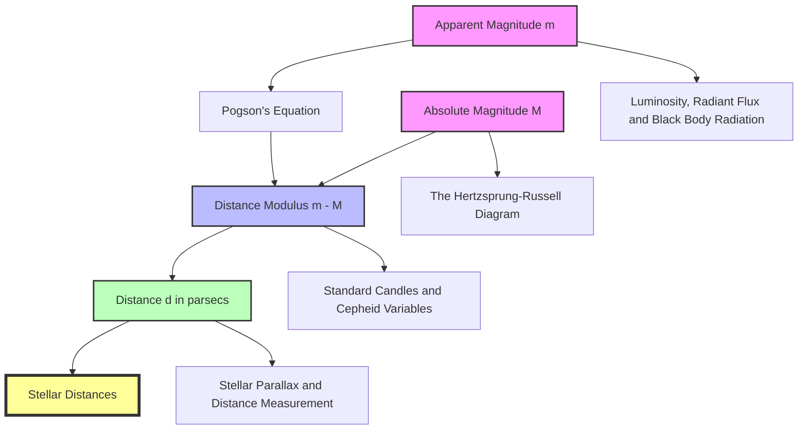

---
# Apparent and Absolute Magnitude / 视星等与绝对星等

---

# 1. Overview / 概述

**English:**
This sub-topic introduces the astronomical magnitude system, a logarithmic scale used to measure the brightness of celestial objects. You will learn the distinction between **apparent magnitude** ($m$), which measures how bright a star appears from Earth, and **absolute magnitude** ($M$), which measures its intrinsic luminosity at a standard distance of 10 parsecs. The relationship between these two quantities is expressed through the **distance modulus** equation, which is a powerful tool for determining stellar distances. This concept is fundamental to [[Stellar Distances]] and directly links to [[Luminosity, Radiant Flux and Black Body Radiation]] and the [[The Hertzsprung-Russell Diagram]].

**中文:**
本子知识点介绍天文学中的星等系统，这是一种用于测量天体亮度的对数标度。你将学习**视星等** ($m$) 和**绝对星等** ($M$) 之间的区别：视星等衡量从地球观测到的恒星亮度，而绝对星等则衡量其在10秒差距标准距离下的本征光度。这两个量之间的关系通过**距离模数**方程表达，这是确定恒星距离的有力工具。这个概念是[[Stellar Distances]]的基础，并直接与[[Luminosity, Radiant Flux and Black Body Radiation]]和[[The Hertzsprung-Russell Diagram]]相关联。

---

# 2. Syllabus Learning Objectives / 考纲学习目标

| CAIE 9702 | Edexcel IAL |
|-----------|-------------|
| 25.2(a) Define apparent magnitude ($m$) and absolute magnitude ($M$) | 10.7 Understand the definitions of apparent magnitude and absolute magnitude |
| 25.2(b) Recall and use the equation $m - M = 5 \log(d/10)$ | 10.8 Use the distance modulus equation $m - M = 5 \log(d/10)$ |
| 25.2(c) Explain how the magnitude scale relates to brightness ratios | 10.9 Understand the relationship between magnitude difference and brightness ratio |
| 25.2(d) Use the relationship $I_1/I_2 = 2.512^{(m_2 - m_1)}$ | 10.10 Use the Pogson equation $I_1/I_2 = 2.512^{(m_2 - m_1)}$ |
| 25.2(e) Understand the concept of a standard candle | 10.11 Understand the concept of a standard candle |
| — | 10.12 Use the distance modulus to determine distances to stars |

**Examiner Expectations / 考官期望:**
- **English:** You must be able to define both magnitudes precisely, apply the distance modulus equation correctly (including unit conversions for $d$ in parsecs), and manipulate the Pogson equation to find brightness ratios or magnitude differences. A common trick is to test your understanding of the inverse-square law for light intensity.
- **中文:** 你必须能够精确定义两种星等，正确应用距离模数方程（包括将距离 $d$ 转换为秒差距单位），并操作Pogson方程来求亮度比或星等差。常见的考点是测试你对光强平方反比定律的理解。

---

# 3. Core Definitions / 核心定义

| Term (EN/CN) | Definition (EN) | Definition (CN) | Common Mistakes / 常见错误 |
|--------------|-----------------|-----------------|---------------------------|
| **Apparent Magnitude ($m$)** / 视星等 | A measure of the brightness of a star as observed from Earth, on a logarithmic scale where a smaller number indicates a brighter object. | 从地球上观测到的恒星亮度的量度，采用对数标度，数值越小表示天体越亮。 | Confusing $m$ with absolute magnitude; forgetting that brighter objects have *smaller* magnitude numbers. |
| **Absolute Magnitude ($M$)** / 绝对星等 | The apparent magnitude a star would have if it were placed at a standard distance of 10 parsecs (32.6 light-years) from Earth. | 将恒星放置在距离地球10秒差距（32.6光年）的标准距离处所呈现的视星等。 | Thinking $M$ is a measure of brightness at any distance; it is a *standardized* value. |
| **Distance Modulus ($m - M$)** / 距离模数 | The difference between a star's apparent and absolute magnitudes, used to calculate its distance in parsecs. | 恒星视星等与绝对星等之差，用于计算其以秒差距为单位的距离。 | Forgetting that $m - M = 0$ means the star is exactly 10 pc away. |
| **Pogson's Ratio** / 波格森比率 | A magnitude difference of 1 corresponds to a brightness ratio of $2.512$ (the fifth root of 100). | 1个星等差对应亮度比为 $2.512$（100的五次方根）。 | Using 2.5 instead of 2.512; confusing the base of the logarithm. |
| **Standard Candle** / 标准烛光 | An astronomical object with a known absolute magnitude ($M$), used to determine distances by comparing its apparent magnitude ($m$). | 已知绝对星等 ($M$) 的天体，通过比较其视星等 ($m$) 来确定距离。 | Assuming all stars are standard candles; only certain types (e.g., [[Standard Candles and Cepheid Variables]]) are reliable. |

---

# 4. Key Concepts Explained / 关键概念详解

## 4.1 The Magnitude Scale / 星等标度

### Explanation / 解释
**English:**
The magnitude scale is a **logarithmic** scale, not a linear one. It originates from the ancient Greek astronomer Hipparchus, who classified stars by brightness: 1st magnitude (brightest) to 6th magnitude (faintest). Modern astronomy formalized this: a difference of 5 magnitudes corresponds exactly to a brightness ratio of 100:1. Therefore, each single magnitude step corresponds to a factor of $100^{1/5} \approx 2.512$. This is known as **Pogson's ratio**. The relationship is given by the **Pogson equation**:

$$ \frac{I_1}{I_2} = 2.512^{(m_2 - m_1)} $$

Where $I$ is the intensity (radiant flux) of the star, and $m$ is its apparent magnitude. Note the order: if $m_2 > m_1$, the star with magnitude $m_2$ is fainter, so $I_1 > I_2$.

**中文:**
星等标度是一个**对数**标度，而非线性标度。它起源于古希腊天文学家喜帕恰斯，他将恒星按亮度分类：1等星（最亮）到6等星（最暗）。现代天文学将其规范化：5个星等差精确对应100:1的亮度比。因此，每个星等步长对应 $100^{1/5} \approx 2.512$ 的因子。这被称为**波格森比率**。其关系由**波格森方程**给出：

$$ \frac{I_1}{I_2} = 2.512^{(m_2 - m_1)} $$

其中 $I$ 是恒星的强度（辐射通量），$m$ 是其视星等。注意顺序：如果 $m_2 > m_1$，星等为 $m_2$ 的恒星更暗，所以 $I_1 > I_2$。

### Physical Meaning / 物理意义
**English:**
The magnitude scale is a convenient way to compress the vast range of stellar brightnesses (the Sun is about $10^{10}$ times brighter than the faintest visible star) into a manageable numerical range. It is directly linked to the [[Luminosity, Radiant Flux and Black Body Radiation]] concept: the intensity $I$ is the radiant flux received per unit area at Earth.

**中文:**
星等标度是一种将恒星亮度的巨大范围（太阳比最暗的可见星亮约 $10^{10}$ 倍）压缩成易于管理的数值范围的便捷方法。它直接与[[Luminosity, Radiant Flux and Black Body Radiation]]概念相关：强度 $I$ 是地球单位面积接收到的辐射通量。

### Common Misconceptions / 常见误区
- **English:**
  - "A star with magnitude 0 is infinitely bright." (No; magnitude 0 is a reference point; Vega is approximately magnitude 0.)
  - "A magnitude difference of 2 means twice as bright." (No; it means $2.512^2 \approx 6.31$ times brighter.)
  - "Absolute magnitude is the brightness at the star's surface." (No; it's the brightness at 10 pc.)
- **中文:**
  - "星等为0的恒星无限亮。"（不；星等0是一个参考点；织女星大约为0等。）
  - "星等差2意味着亮两倍。"（不；它意味着亮 $2.512^2 \approx 6.31$ 倍。）
  - "绝对星等是恒星表面的亮度。"（不；它是10秒差距处的亮度。）

### Exam Tips / 考试提示
- **English:** Always check the sign in the Pogson equation. If $m_2 - m_1$ is positive, the star with $m_2$ is fainter, so $I_1/I_2 > 1$. If negative, $I_1/I_2 < 1$.
- **中文:** 始终检查Pogson方程中的符号。如果 $m_2 - m_1$ 为正，则星等为 $m_2$ 的恒星更暗，所以 $I_1/I_2 > 1$。如果为负，则 $I_1/I_2 < 1$。

> 📷 **IMAGE PROMPT — MAG-01: The Magnitude Scale**
> A visual logarithmic scale showing the apparent magnitudes of celestial objects from the Sun (-26.7) to the faintest stars visible with a large telescope (+30). Include labeled points for the Moon (-12.6), Venus (-4.4), Sirius (-1.46), Vega (0), naked-eye limit (+6), and faintest visible stars (+30). Use a color gradient from bright yellow to dark blue to represent decreasing brightness.

## 4.2 The Distance Modulus / 距离模数

### Explanation / 解释
**English:**
The **distance modulus** is the difference between a star's apparent magnitude ($m$) and its absolute magnitude ($M$):

$$ m - M = 5 \log_{10}\left(\frac{d}{10}\right) $$

Where $d$ is the distance to the star in **parsecs**. This equation is derived from the inverse-square law of light intensity and the definition of the magnitude scale. If $m - M = 0$, then $d = 10$ pc. A positive distance modulus ($m > M$) means the star is farther than 10 pc; a negative distance modulus ($m < M$) means it is closer than 10 pc.

**中文:**
**距离模数**是恒星视星等 ($m$) 与绝对星等 ($M$) 之差：

$$ m - M = 5 \log_{10}\left(\frac{d}{10}\right) $$

其中 $d$ 是以**秒差距**为单位的恒星距离。该方程由光强平方反比定律和星等标度的定义推导得出。如果 $m - M = 0$，则 $d = 10$ pc。正的距离模数 ($m > M$) 意味着恒星比10 pc更远；负的距离模数 ($m < M$) 意味着它比10 pc更近。

### Physical Meaning / 物理意义
**English:**
The distance modulus quantifies how much fainter a star appears due to its distance. It is a direct link between observed brightness ($m$), intrinsic brightness ($M$), and distance ($d$). This is the primary method for determining distances to stars that are too far for [[Stellar Parallax and Distance Measurement]].

**中文:**
距离模数量化了恒星因其距离而显得暗淡的程度。它是观测亮度 ($m$)、本征亮度 ($M$) 和距离 ($d$) 之间的直接联系。这是确定距离[[Stellar Parallax and Distance Measurement]]无法测量的恒星的主要方法。

### Common Misconceptions / 常见误区
- **English:**
  - "The distance modulus equation gives distance in light-years." (No; it gives distance in parsecs. Convert if needed: 1 pc = 3.26 ly.)
  - "A star with $m - M = 5$ is 10 pc away." (No; $m - M = 5$ means $d = 100$ pc.)
- **中文:**
  - "距离模数方程给出的距离单位是光年。"（不；它给出的距离单位是秒差距。如有需要可转换：1 pc = 3.26 ly。）
  - "$m - M = 5$ 的恒星距离为10 pc。"（不；$m - M = 5$ 意味着 $d = 100$ pc。）

### Exam Tips / 考试提示
- **English:** When using the distance modulus equation, always ensure $d$ is in parsecs. If given in light-years, convert first. Remember the inverse: $d = 10 \times 10^{(m-M)/5}$.
- **中文:** 使用距离模数方程时，始终确保 $d$ 的单位是秒差距。如果给定的是光年，请先转换。记住反函数：$d = 10 \times 10^{(m-M)/5}$。

---

# 5. Essential Equations / 核心公式

## 5.1 Pogson's Equation / 波格森方程

$$ \frac{I_1}{I_2} = 2.512^{(m_2 - m_1)} $$

| Symbol (符号) | Meaning (EN) | Meaning (CN) | Unit (单位) |
|--------------|-------------|-------------|------------|
| $I_1, I_2$ | Intensities (radiant flux) of two stars | 两颗恒星的强度（辐射通量） | W m$^{-2}$ |
| $m_1, m_2$ | Apparent magnitudes of two stars | 两颗恒星的视星等 | dimensionless (无量纲) |

**Derivation / 推导:**
The equation is derived from the definition: a 5-magnitude difference corresponds to a 100:1 intensity ratio. So, for a difference of $\Delta m$:
$$ \frac{I_1}{I_2} = 100^{\Delta m/5} = (10^2)^{\Delta m/5} = 10^{2\Delta m/5} = (10^{0.4})^{\Delta m} \approx 2.512^{\Delta m} $$

**Conditions / 适用条件:**
- **English:** Assumes no interstellar absorption (extinction). In practice, corrections may be needed for dusty regions.
- **中文:** 假设没有星际吸收（消光）。在实际中，对于尘埃区域可能需要进行修正。

**Limitations / 局限性:**
- **English:** The scale is only valid for visible light; different filters (U, B, V) give different magnitudes.
- **中文:** 该标度仅对可见光有效；不同的滤光片（U、B、V）会给出不同的星等。

## 5.2 Distance Modulus Equation / 距离模数方程

$$ m - M = 5 \log_{10}\left(\frac{d}{10}\right) $$

| Symbol (符号) | Meaning (EN) | Meaning (CN) | Unit (单位) |
|--------------|-------------|-------------|------------|
| $m$ | Apparent magnitude | 视星等 | dimensionless (无量纲) |
| $M$ | Absolute magnitude | 绝对星等 | dimensionless (无量纲) |
| $d$ | Distance to star | 恒星距离 | pc (秒差距) |

**Derivation / 推导:**
From the inverse-square law: $I \propto 1/d^2$. If $I_{10}$ is the intensity at 10 pc and $I_d$ is the intensity at distance $d$:
$$ \frac{I_{10}}{I_d} = \left(\frac{d}{10}\right)^2 $$
Using Pogson's equation: $m - M = 2.5 \log_{10}(I_{10}/I_d) = 2.5 \log_{10}((d/10)^2) = 5 \log_{10}(d/10)$

**Conditions / 适用条件:**
- **English:** $d$ must be in parsecs. Assumes no interstellar extinction.
- **中文:** $d$ 必须以秒差距为单位。假设没有星际消光。

**Limitations / 局限性:**
- **English:** Requires independent knowledge of $M$ (e.g., from [[Standard Candles and Cepheid Variables]] or [[The Hertzsprung-Russell Diagram]]).
- **中文:** 需要独立知道 $M$（例如来自[[Standard Candles and Cepheid Variables]]或[[The Hertzsprung-Russell Diagram]]）。

---

# 6. Graphs and Relationships / 图表与关系

## 6.1 Distance Modulus vs. Distance / 距离模数与距离的关系

### Axes / 坐标轴
- **X-axis:** $\log_{10}(d)$ (distance in pc) / 距离（秒差距）的对数
- **Y-axis:** $m - M$ (distance modulus) / 距离模数

### Shape / 形状
**English:** A straight line with gradient 5, passing through the origin (0,0) at $d = 10$ pc. The equation is $y = 5x - 5$, where $x = \log_{10}(d)$.
**中文:** 一条斜率为5的直线，在 $d = 10$ pc 处经过原点 (0,0)。方程为 $y = 5x - 5$，其中 $x = \log_{10}(d)$。

### Gradient Meaning / 斜率含义
**English:** The gradient of 5 means that for every factor of 10 increase in distance, the distance modulus increases by 5.
**中文:** 斜率为5意味着距离每增加10倍，距离模数增加5。

### Area Meaning / 面积含义
**English:** Not applicable; the graph is a linear relationship.
**中文:** 不适用；该图是线性关系。

### Exam Interpretation / 考试解读
**English:** You may be asked to read values from such a graph or to plot data to find the distance modulus and hence the distance.
**中文:** 你可能会被要求从这样的图中读取数值，或绘制数据以找到距离模数，从而求出距离。

> 📷 **IMAGE PROMPT — MAG-02: Distance Modulus vs Log Distance**
> A graph with x-axis labeled "log10(d/pc)" from 0 to 4 and y-axis labeled "m - M" from -5 to 15. A straight line with gradient 5 passes through (1, 0). Key points labeled: (1, 0) for d=10 pc, (2, 5) for d=100 pc, (3, 10) for d=1000 pc. The line equation y = 5x - 5 is shown.

---

# 7. Required Diagrams / 必备图表

## 7.1 The Inverse-Square Law and Magnitude / 平方反比定律与星等

### Description / 描述
**English:** A diagram showing how light from a star spreads out over a sphere of increasing radius. At 10 pc, the sphere has a certain surface area; at a larger distance $d$, the same light is spread over a larger area, reducing the intensity. This illustrates why the distance modulus equation contains the factor $(d/10)^2$.
**中文:** 一个展示星光在半径不断增大的球面上扩散的示意图。在10 pc处，球面有一定的表面积；在更大的距离 $d$ 处，相同的光线分布在更大的面积上，从而降低了强度。这说明了为什么距离模数方程包含因子 $(d/10)^2$。

### Image Prompt / 图片生成提示
> 📷 **IMAGE PROMPT — MAG-03: Inverse Square Law for Stellar Brightness**
> A star at the center emitting light rays outward. Two concentric spheres are drawn: one at 10 pc (labeled "Reference Distance") and one at distance d (labeled "Distance d"). The surface area of the outer sphere is (d/10)^2 times larger. Arrows show the same total luminosity L being spread over larger area. Include labels: "At 10 pc: Intensity I_10", "At d pc: Intensity I_d = I_10 * (10/d)^2".

### Labels Required / 需要标注
- **English:** Star (center), 10 pc sphere, d pc sphere, intensity arrows, equation $I \propto 1/d^2$.
- **中文:** 恒星（中心），10 pc球面，d pc球面，强度箭头，方程 $I \propto 1/d^2$。

### Exam Importance / 考试重要性
**English:** High. Understanding this diagram is essential for deriving the distance modulus equation and for solving problems involving brightness ratios.
**中文:** 高。理解此图对于推导距离模数方程和解决涉及亮度比的问题至关重要。

---

# 8. Worked Examples / 典型例题

## Example 1: Finding Distance from Magnitudes / 从星等求距离

### Question / 题目
**English:**
A star has an apparent magnitude $m = 8.5$ and an absolute magnitude $M = 2.5$. Calculate its distance in parsecs.

**中文:**
一颗恒星的视星等 $m = 8.5$，绝对星等 $M = 2.5$。计算其以秒差距为单位的距离。

### Solution / 解答
**Step 1:** Calculate the distance modulus.
$$ m - M = 8.5 - 2.5 = 6.0 $$

**Step 2:** Use the distance modulus equation.
$$ m - M = 5 \log_{10}\left(\frac{d}{10}\right) $$
$$ 6.0 = 5 \log_{10}\left(\frac{d}{10}\right) $$
$$ \log_{10}\left(\frac{d}{10}\right) = \frac{6.0}{5} = 1.2 $$

**Step 3:** Solve for $d$.
$$ \frac{d}{10} = 10^{1.2} $$
$$ d = 10 \times 10^{1.2} = 10 \times 15.85 \approx 158.5 \text{ pc} $$

### Final Answer / 最终答案
**Answer:** $d \approx 159$ pc | **答案：** $d \approx 159$ pc

### Quick Tip / 提示
**English:** Remember the inverse formula: $d = 10 \times 10^{(m-M)/5}$. This is faster for calculations.
**中文:** 记住反函数公式：$d = 10 \times 10^{(m-M)/5}$。这可以更快地进行计算。

---

## Example 2: Brightness Ratio from Magnitude Difference / 从星等差求亮度比

### Question / 题目
**English:**
Star A has an apparent magnitude $m_A = 1.5$ and Star B has $m_B = 4.5$. How many times brighter is Star A than Star B?

**中文:**
恒星A的视星等 $m_A = 1.5$，恒星B的视星等 $m_B = 4.5$。恒星A比恒星B亮多少倍？

### Solution / 解答
**Step 1:** Find the magnitude difference.
$$ m_B - m_A = 4.5 - 1.5 = 3.0 $$

**Step 2:** Use Pogson's equation.
$$ \frac{I_A}{I_B} = 2.512^{(m_B - m_A)} = 2.512^{3.0} $$

**Step 3:** Calculate.
$$ 2.512^3 = 2.512 \times 2.512 \times 2.512 \approx 15.85 $$

### Final Answer / 最终答案
**Answer:** Star A is approximately 15.85 times brighter than Star B. | **答案：** 恒星A比恒星B亮约15.85倍。

### Quick Tip / 提示
**English:** A magnitude difference of 5 corresponds to a factor of 100. So a difference of 3 is $100^{3/5} = 100^{0.6} \approx 15.85$. This is a useful shortcut.
**中文:** 5个星等差对应100倍。所以3个星等差是 $100^{3/5} = 100^{0.6} \approx 15.85$。这是一个有用的捷径。

---

# 9. Past Paper Question Types / 历年真题题型

| Question Type / 题型 | Frequency / 频率 | Difficulty / 难度 | Past Paper References / 真题索引 |
|----------------------|------------------|------------------|-------------------------------|
| Define apparent and absolute magnitude | Medium | Easy | 📝 *待填入* |
| Calculate distance using $m - M = 5 \log(d/10)$ | High | Medium | 📝 *待填入* |
| Calculate brightness ratio from magnitude difference | High | Medium | 📝 *待填入* |
| Determine $M$ from $m$ and distance | Medium | Medium | 📝 *待填入* |
| Explain the concept of a standard candle | Low | Easy | 📝 *待填入* |
| Multi-step problem combining magnitude and parallax | Low | Hard | 📝 *待填入* |

**Common Command Words / 常见指令词:**
- **English:** Define, Calculate, Determine, Explain, Show that, State
- **中文:** 定义，计算，确定，解释，证明，陈述

---

# 10. Practical Skills Connections / 实验技能链接

**English:**
While you won't directly measure magnitudes in a school lab, the concepts connect to practical skills in several ways:
- **Photometry:** Using a light sensor and a known standard candle (e.g., a calibrated lamp) to measure the apparent magnitude of an unknown source by comparing intensities.
- **Uncertainties:** The logarithmic nature of the magnitude scale means that a small uncertainty in magnitude corresponds to a larger percentage uncertainty in intensity. For example, an uncertainty of $\pm 0.1$ in magnitude corresponds to about $\pm 10\%$ in intensity.
- **Graph Plotting:** Plotting $\log_{10}(d)$ against $m - M$ yields a straight line; you may be asked to determine the gradient or intercept from experimental data.
- **Experimental Design:** To determine the absolute magnitude of a star, you need both its apparent magnitude (from observation) and its distance (from [[Stellar Parallax and Distance Measurement]] or other methods).

**中文:**
虽然你不会在学校实验室直接测量星等，但该概念通过以下几种方式与实验技能相关联：
- **光度测量：** 使用光传感器和已知的标准烛光（例如校准过的灯），通过比较强度来测量未知光源的视星等。
- **不确定度：** 星等标度的对数性质意味着星等的小不确定度对应于强度的大百分比不确定度。例如，$\pm 0.1$ 的星等不确定度对应约 $\pm 10\%$ 的强度不确定度。
- **图表绘制：** 绘制 $\log_{10}(d)$ 与 $m - M$ 的关系图会得到一条直线；你可能会被要求从实验数据中确定斜率或截距。
- **实验设计：** 要确定恒星的绝对星等，你需要其视星等（通过观测）和距离（通过[[Stellar Parallax and Distance Measurement]]或其他方法）。

---

# 11. Concept Map / 概念图谱

---

# 12. Quick Revision Sheet / 速查表

| Category / 类别 | Key Points / 要点 |
|----------------|------------------|
| **Definition / 定义** | **Apparent magnitude ($m$):** brightness as seen from Earth. **Absolute magnitude ($M$):** brightness at 10 pc. Smaller number = brighter. |
| **Key Formula / 核心公式** | **Pogson:** $\frac{I_1}{I_2} = 2.512^{(m_2 - m_1)}$ **Distance Modulus:** $m - M = 5 \log_{10}\left(\frac{d}{10}\right)$ **Inverse:** $d = 10 \times 10^{(m-M)/5}$ |
| **Key Graph / 核心图表** | $m - M$ vs $\log_{10}(d)$: straight line, gradient 5, passes through (1, 0). |
| **Exam Tip / 考试提示** | Always check units: $d$ must be in parsecs. Brighter objects have *smaller* magnitude numbers. A difference of 5 magnitudes = factor of 100 in brightness. |
| **Common Mistake / 常见错误** | Forgetting that $m - M = 0$ means $d = 10$ pc. Using 2.5 instead of 2.512 for Pogson's ratio. |
| **Connection / 联系** | Links to [[Stellar Parallax and Distance Measurement]], [[Standard Candles and Cepheid Variables]], and [[The Hertzsprung-Russell Diagram]]. |