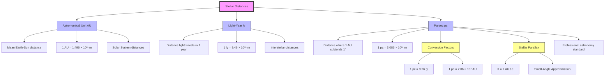

# 1. Overview / 概述

**English:**
This sub-topic introduces the three fundamental units used to measure astronomical distances: the **Astronomical Unit (AU)**, the **Light-Year (ly)**, and the **Parsec (pc)**. These units bridge the gap between human-scale measurements and the vast distances in the universe. The AU is based on Earth's orbit, the light-year on the speed of light, and the parsec on stellar parallax geometry. Understanding these units is essential for [[Stellar Distances]] and forms the foundation for [[Stellar Parallax and Distance Measurement]]. This sub-topic also establishes the critical conversion factors between these units, which are frequently tested in exams.

**中文:**
本子知识点介绍测量天文距离的三个基本单位：**天文单位 (AU)**、**光年 (ly)** 和 **秒差距 (pc)**。这些单位弥合了人类尺度测量与宇宙中巨大距离之间的差距。AU 基于地球轨道，光年基于光速，而秒差距基于恒星视差几何。理解这些单位对于 [[Stellar Distances]] 至关重要，并为 [[Stellar Parallax and Distance Measurement]] 奠定基础。本子知识点还建立了这些单位之间的关键换算关系，这些关系在考试中经常被考查。

---

# 2. Syllabus Learning Objectives / 考纲学习目标

| CAIE 9702 (25.2) | Edexcel IAL (WPH14 U4: 10.7-10.12) |
|------------------|--------------------------------------|
| (a) Define the astronomical unit (AU) | 10.7 Define the astronomical unit (AU) |
| (b) Define the light-year (ly) | 10.8 Define the light-year (ly) |
| (c) Define the parsec (pc) | 10.9 Define the parsec (pc) |
| (d) Understand the relationship between AU, ly, and pc | 10.10 Understand the relationship between AU, ly, and pc |
| (e) Convert between these units | 10.11 Convert between these units |
| — | 10.12 Use the small-angle approximation for parallax |

**Examiner Expectations / 考官期望:**
- **English:** Students must recall exact definitions word-for-word. They must be able to convert between units using given conversion factors (1 pc = 3.26 ly = 2.06 × 10⁵ AU). The parsec definition requires understanding the small-angle approximation (tan θ ≈ θ for θ in radians).
- **中文:** 学生必须逐字记忆准确定义。必须能够使用给定的换算系数（1 pc = 3.26 ly = 2.06 × 10⁵ AU）进行单位换算。秒差距的定义需要理解小角度近似（当 θ 以弧度为单位时，tan θ ≈ θ）。

---

# 3. Core Definitions / 核心定义

| Term (EN/CN) | Definition (EN) | Definition (CN) | Common Mistakes / 常见错误 |
|--------------|-----------------|-----------------|---------------------------|
| **Astronomical Unit (AU)** / 天文单位 | The mean distance from the centre of the Earth to the centre of the Sun. | 地球中心到太阳中心的平均距离。 | Confusing with Earth's orbital radius (it's the *mean* distance, not constant). |
| **Light-Year (ly)** / 光年 | The distance travelled by electromagnetic radiation (light) in a vacuum in one year. | 电磁辐射（光）在真空中一年内传播的距离。 | Thinking it's a unit of time, not distance. |
| **Parsec (pc)** / 秒差距 | The distance at which one astronomical unit (AU) subtends an angle of one arcsecond (1″). | 当天文单位 (AU) 张角为 1 角秒 (1″) 时的距离。 | Forgetting the small-angle approximation: d = 1 AU / θ (in radians). |
| **Arcsecond (″)** / 角秒 | A unit of angular measurement: 1″ = 1/3600 of a degree. | 角度测量单位：1″ = 1/3600 度。 | Confusing arcseconds with radians (1″ = 4.848 × 10⁻⁶ rad). |
| **Small-Angle Approximation** / 小角度近似 | For θ in radians, tan θ ≈ θ and sin θ ≈ θ when θ is very small. | 当 θ 非常小且以弧度为单位时，tan θ ≈ θ 且 sin θ ≈ θ。 | Applying it when θ is not in radians. |

---

# 4. Key Concepts Explained / 关键概念详解

## 4.1 The Astronomical Unit (AU) / 天文单位

### Explanation / 解释
**English:** The AU is the **mean** Earth-Sun distance, approximately 1.496 × 10¹¹ m. It provides a convenient scale for distances within the Solar System. For example, Jupiter is about 5.2 AU from the Sun. The AU is defined using the semi-major axis of Earth's elliptical orbit, not the instantaneous distance. This unit is a prerequisite for understanding [[Stellar Parallax and Distance Measurement]] because the baseline for parallax is 1 AU.

**中文:** AU 是地球到太阳的**平均**距离，约为 1.496 × 10¹¹ m。它为太阳系内的距离提供了方便的尺度。例如，木星距离太阳约 5.2 AU。AU 使用地球椭圆轨道的半长轴定义，而非瞬时距离。该单位是理解 [[Stellar Parallax and Distance Measurement]] 的前提，因为视差的基线是 1 AU。

### Physical Meaning / 物理意义
**English:** 1 AU ≈ 8.3 light-minutes — it takes light about 8.3 minutes to travel from the Sun to Earth.
**中文:** 1 AU ≈ 8.3 光分——光从太阳传播到地球大约需要 8.3 分钟。

### Common Misconceptions / 常见误区
- **English:** Thinking AU is the exact distance at all times (it varies slightly due to Earth's elliptical orbit).
- **中文:** 认为 AU 在任何时候都是精确距离（由于地球椭圆轨道，它略有变化）。
- **English:** Confusing AU with the radius of Earth's orbit (it's the semi-major axis).
- **中文:** 将 AU 与地球轨道半径混淆（它是半长轴）。

### Exam Tips / 考试提示
- **English:** Memorise 1 AU = 1.496 × 10¹¹ m. Use this for unit conversions.
- **中文:** 记住 1 AU = 1.496 × 10¹¹ m。用于单位换算。

---

## 4.2 The Light-Year (ly) / 光年

### Explanation / 解释
**English:** One light-year is the distance light travels in one year. Since the speed of light c = 3.00 × 10⁸ m s⁻¹, and 1 year = 365.25 days × 24 h × 3600 s = 3.156 × 10⁷ s, we get:

$$ 1 \text{ ly} = c \times t = (3.00 \times 10^8) \times (3.156 \times 10^7) = 9.46 \times 10^{15} \text{ m} $$

Light-years are used for interstellar and intergalactic distances. For example, the nearest star (Proxima Centauri) is about 4.25 ly away. This unit connects to [[Luminosity, Radiant Flux and Black Body Radiation]] because the observed flux depends on distance measured in light-years.

**中文:** 一光年是光在一年内传播的距离。由于光速 c = 3.00 × 10⁸ m s⁻¹，且 1 年 = 365.25 天 × 24 小时 × 3600 秒 = 3.156 × 10⁷ 秒，我们得到：

$$ 1 \text{ ly} = c \times t = (3.00 \times 10^8) \times (3.156 \times 10^7) = 9.46 \times 10^{15} \text{ m} $$

光年用于星际和星系际距离。例如，最近的恒星（比邻星）距离约 4.25 光年。该单位与 [[Luminosity, Radiant Flux and Black Body Radiation]] 相关，因为观测到的通量取决于以光年测量的距离。

### Physical Meaning / 物理意义
**English:** When we observe a star 100 ly away, we see it as it was 100 years ago — looking back in time.
**中文:** 当我们观察一颗 100 光年外的恒星时，我们看到的是它 100 年前的样子——即回望过去。

### Common Misconceptions / 常见误区
- **English:** Thinking a light-year is a unit of time (it's a unit of distance).
- **中文:** 认为光年是时间单位（它是距离单位）。
- **English:** Confusing "light-year" with "light-second" or "light-minute".
- **中文:** 混淆"光年"与"光秒"或"光分"。

### Exam Tips / 考试提示
- **English:** Know the calculation: 1 ly = c × (seconds in a year). Use 3.156 × 10⁷ s for 1 year.
- **中文:** 知道计算方法：1 ly = c × (一年的秒数)。使用 3.156 × 10⁷ s 作为 1 年。

---

## 4.3 The Parsec (pc) / 秒差距

### Explanation / 解释
**English:** The parsec is defined using parallax geometry. If a star has a parallax angle of 1 arcsecond (1″), its distance is 1 parsec. Using the small-angle approximation:

$$ \theta (\text{in radians}) = \frac{1 \text{ AU}}{d} $$

For θ = 1″ = (1/3600)° = (π/648000) rad ≈ 4.848 × 10⁻⁶ rad:

$$ d = \frac{1 \text{ AU}}{\theta} = \frac{1.496 \times 10^{11}}{4.848 \times 10^{-6}} = 3.086 \times 10^{16} \text{ m} $$

This gives: 1 pc = 3.086 × 10¹⁶ m = 3.26 ly = 2.06 × 10⁵ AU.

The parsec is the standard unit in professional astronomy and is directly linked to [[Stellar Parallax and Distance Measurement]].

**中文:** 秒差距使用视差几何定义。如果一颗恒星的视差角为 1 角秒 (1″)，则其距离为 1 秒差距。使用小角度近似：

$$ \theta (\text{以弧度为单位}) = \frac{1 \text{ AU}}{d} $$

对于 θ = 1″ = (1/3600)° = (π/648000) rad ≈ 4.848 × 10⁻⁶ rad：

$$ d = \frac{1 \text{ AU}}{\theta} = \frac{1.496 \times 10^{11}}{4.848 \times 10^{-6}} = 3.086 \times 10^{16} \text{ m} $$

由此得出：1 pc = 3.086 × 10¹⁶ m = 3.26 ly = 2.06 × 10⁵ AU。

秒差距是专业天文学中的标准单位，与 [[Stellar Parallax and Distance Measurement]] 直接相关。

### Physical Meaning / 物理意义
**English:** 1 parsec is the distance at which 1 AU subtends an angle of 1 arcsecond. It's about 3.26 light-years.
**中文:** 1 秒差距是 1 AU 张角为 1 角秒时的距离。大约为 3.26 光年。

### Common Misconceptions / 常见误区
- **English:** Forgetting to convert arcseconds to radians before using the small-angle formula.
- **中文:** 在使用小角度公式前忘记将角秒转换为弧度。
- **English:** Confusing the definition: the angle is at the star, not at Earth.
- **中文:** 混淆定义：角度在恒星处，而非在地球处。

### Exam Tips / 考试提示
- **English:** Memorise: 1 pc = 3.26 ly = 2.06 × 10⁵ AU = 3.086 × 10¹⁶ m.
- **中文:** 记住：1 pc = 3.26 ly = 2.06 × 10⁵ AU = 3.086 × 10¹⁶ m。
- **English:** Always convert angles to radians for calculations.
- **中文:** 计算时始终将角度转换为弧度。

> 📷 **IMAGE PROMPT — DIAGRAM-01: Parsec Definition Geometry**
> A clear geometric diagram showing a right triangle. At the base, label "1 AU" (Earth-Sun distance). At the opposite vertex (the star), show a small angle θ = 1 arcsecond. Label the adjacent side as "d = 1 parsec". Include a note: "tan θ = 1 AU / d, using small-angle approximation: θ (rad) = 1 AU / d". Use clean lines, professional style suitable for A-Level physics textbook.

---

# 5. Essential Equations / 核心公式

## 5.1 Light-Year Calculation / 光年计算

$$ 1 \text{ ly} = c \times t_{\text{year}} $$

| Symbol (符号) | Meaning (EN) | Meaning (CN) | Unit (单位) |
|--------------|-------------|-------------|------------|
| c | Speed of light in vacuum | 真空中的光速 | m s⁻¹ |
| t_year | Time in one year (3.156 × 10⁷ s) | 一年的时间 (3.156 × 10⁷ s) | s |

**Derivation / 推导:** Distance = speed × time. Light travels at c for one year.
**Conditions / 适用条件:** Vacuum (in air, speed is slightly less).
**Limitations / 局限性:** Assumes exactly 365.25 days per year.

## 5.2 Parsec Definition / 秒差距定义

$$ d = \frac{1 \text{ AU}}{\theta} \quad \text{(for θ in radians)} $$

| Symbol (符号) | Meaning (EN) | Meaning (CN) | Unit (单位) |
|--------------|-------------|-------------|------------|
| d | Distance to star | 到恒星的距离 | m or pc |
| θ | Parallax angle in radians | 以弧度为单位的视差角 | rad |

**Derivation / 推导:** From tan θ = opposite/adjacent = 1 AU / d. For small θ, tan θ ≈ θ.
**Conditions / 适用条件:** θ must be very small (< 0.1 rad) and in radians.
**Limitations / 局限性:** Only valid for nearby stars where parallax is measurable.

## 5.3 Unit Conversions / 单位换算

$$ 1 \text{ pc} = 3.26 \text{ ly} = 2.06 \times 10^5 \text{ AU} = 3.086 \times 10^{16} \text{ m} $$

| Symbol (符号) | Meaning (EN) | Meaning (CN) | Unit (单位) |
|--------------|-------------|-------------|------------|
| pc | Parsec | 秒差距 | pc |
| ly | Light-year | 光年 | ly |
| AU | Astronomical Unit | 天文单位 | AU |

**Derivation / 推导:** From the definitions above.
**Conditions / 适用条件:** Standard conversion factors.
**Limitations / 局限性:** These are exact conversions based on defined values.

> 📋 **Edexcel Only:** Edexcel explicitly requires students to use the small-angle approximation for parallax calculations. Be prepared to derive 1 pc = 3.26 ly from first principles.

---

# 6. Graphs and Relationships / 图表与关系

## 6.1 Parallax Angle vs Distance / 视差角与距离的关系

### Axes / 坐标轴
- **X-axis:** Distance (d) in parsecs / 距离 (d) 以秒差距为单位
- **Y-axis:** Parallax angle (θ) in arcseconds / 视差角 (θ) 以角秒为单位

### Shape / 形状
**English:** Inverse relationship: θ ∝ 1/d. A hyperbola when plotted on linear axes. A straight line with gradient -1 when plotted on log-log axes.
**中文:** 反比关系：θ ∝ 1/d。在线性坐标轴上为双曲线。在双对数坐标轴上为斜率为 -1 的直线。

### Gradient Meaning / 斜率含义
**English:** On a log-log plot, gradient = -1 confirms the inverse relationship.
**中文:** 在双对数图上，斜率 = -1 确认了反比关系。

### Area Meaning / 面积含义
**English:** No meaningful area interpretation.
**中文:** 无有意义的面积解释。

### Exam Interpretation / 考试解读
**English:** If a star has θ = 0.5″, its distance is 2 pc. If θ = 0.1″, distance = 10 pc.
**中文:** 如果一颗恒星的 θ = 0.5″，则其距离为 2 pc。如果 θ = 0.1″，则距离 = 10 pc。

---

# 7. Required Diagrams / 必备图表

## 7.1 Parsec Definition Diagram / 秒差距定义图

### Description / 描述
**English:** A right-angled triangle showing the geometry of the parsec definition. The base is 1 AU (Earth-Sun distance). The angle at the star is 1 arcsecond. The adjacent side is 1 parsec.
**中文:** 一个直角三角形，显示秒差距定义的几何关系。底边为 1 AU（地球-太阳距离）。恒星处的角度为 1 角秒。邻边为 1 秒差距。

### Image Prompt / 图片生成提示
> 📷 **IMAGE PROMPT — DIAGRAM-02: Parsec Definition with Labels**
> A clean, professional physics diagram showing a right triangle. Label the short side (opposite) as "1 AU". Label the long side (adjacent) as "d = 1 parsec". At the top vertex (star), show a small angle labeled "θ = 1″". Include a note: "tan θ = 1 AU / d, for small θ: θ (rad) ≈ 1 AU / d". Use blue for Earth, yellow for Sun, and a star symbol at the top. Suitable for A-Level textbook.

### Labels Required / 需要标注
- **English:** Earth, Sun, Star, 1 AU, d = 1 pc, θ = 1″
- **中文:** 地球, 太阳, 恒星, 1 AU, d = 1 pc, θ = 1″

### Exam Importance / 考试重要性
**English:** High — students are often asked to draw or interpret this diagram in exams.
**中文:** 高——考试中常要求学生绘制或解释此图。

---

## 7.2 Scale Comparison Diagram / 尺度比较图

### Description / 描述
**English:** A comparative diagram showing the relative sizes of 1 AU, 1 ly, and 1 pc on a logarithmic scale.
**中文:** 一个比较图，在对数尺度上显示 1 AU、1 ly 和 1 pc 的相对大小。

### Image Prompt / 图片生成提示
> 📷 **IMAGE PROMPT — DIAGRAM-03: Distance Scale Comparison**
> A logarithmic scale bar showing three markers: 1 AU (1.5 × 10¹¹ m), 1 ly (9.46 × 10¹⁵ m), and 1 pc (3.09 × 10¹⁶ m). Include real-world examples: "Earth-Sun = 1 AU", "Proxima Centauri = 4.25 ly", "Center of Milky Way = 8 kpc". Use different colors for each unit. Professional textbook style.

### Labels Required / 需要标注
- **English:** 1 AU, 1 ly, 1 pc, conversion factors
- **中文:** 1 AU, 1 ly, 1 pc, 换算系数

### Exam Importance / 考试重要性
**English:** Medium — helps visualise the vast differences in scale.
**中文:** 中等——有助于可视化尺度的巨大差异。

---

# 8. Worked Examples / 典型例题

## Example 1: Unit Conversion / 单位换算

### Question / 题目
**English:** The nearest star system, Alpha Centauri, is approximately 4.37 light-years away. Calculate this distance in:
(a) metres
(b) parsecs
(c) astronomical units

**中文:** 最近的恒星系统半人马座阿尔法星距离约 4.37 光年。计算该距离：
(a) 米
(b) 秒差距
(c) 天文单位

### Solution / 解答

**(a) Metres / 米:**
$$ 1 \text{ ly} = 9.46 \times 10^{15} \text{ m} $$
$$ d = 4.37 \times 9.46 \times 10^{15} = 4.13 \times 10^{16} \text{ m} $$

**(b) Parsecs / 秒差距:**
$$ 1 \text{ pc} = 3.26 \text{ ly} $$
$$ d = \frac{4.37}{3.26} = 1.34 \text{ pc} $$

**(c) Astronomical Units / 天文单位:**
$$ 1 \text{ pc} = 2.06 \times 10^5 \text{ AU} $$
$$ d = 1.34 \times 2.06 \times 10^5 = 2.76 \times 10^5 \text{ AU} $$

### Final Answer / 最终答案
**Answer:** (a) 4.13 × 10¹⁶ m, (b) 1.34 pc, (c) 2.76 × 10⁵ AU
**答案：** (a) 4.13 × 10¹⁶ m, (b) 1.34 pc, (c) 2.76 × 10⁵ AU

### Quick Tip / 提示
**English:** Always write the conversion factor as a fraction to ensure correct cancellation of units.
**中文:** 始终将换算系数写成分数形式，以确保单位正确约去。

---

## Example 2: Parsec Calculation from Parallax / 从视差计算秒差距

### Question / 题目
**English:** A star has a measured parallax angle of 0.025 arcseconds. Calculate its distance in:
(a) parsecs
(b) light-years
(c) metres

**中文:** 一颗恒星的测量视差角为 0.025 角秒。计算其距离：
(a) 秒差距
(b) 光年
(c) 米

### Solution / 解答

**(a) Parsecs / 秒差距:**
$$ d = \frac{1}{\theta} \quad \text{(θ in arcseconds)} $$
$$ d = \frac{1}{0.025} = 40 \text{ pc} $$

**(b) Light-years / 光年:**
$$ d = 40 \times 3.26 = 130.4 \text{ ly} $$

**(c) Metres / 米:**
$$ d = 40 \times 3.086 \times 10^{16} = 1.23 \times 10^{18} \text{ m} $$

### Final Answer / 最终答案
**Answer:** (a) 40 pc, (b) 130 ly, (c) 1.23 × 10¹⁸ m
**答案：** (a) 40 pc, (b) 130 ly, (c) 1.23 × 10¹⁸ m

### Quick Tip / 提示
**English:** When θ is in arcseconds, d (in pc) = 1/θ. This is the simplest form — no need to convert to radians.
**中文:** 当 θ 以角秒为单位时，d（以 pc 为单位）= 1/θ。这是最简单的形式——无需转换为弧度。

---

# 9. Past Paper Question Types / 历年真题题型

| Question Type / 题型 | Frequency / 频率 | Difficulty / 难度 | Past Paper References / 真题索引 |
|----------------------|------------------|------------------|-------------------------------|
| Definition recall (AU, ly, pc) | High | Easy | 📝 *待填入* |
| Unit conversion calculations | High | Medium | 📝 *待填入* |
| Parsec from parallax angle | High | Medium | 📝 *待填入* |
| Small-angle approximation derivation | Medium | Hard | 📝 *待填入* |
| Scale comparison (which unit for which distance) | Low | Easy | 📝 *待填入* |

**Common Command Words / 常见指令词:**
- **English:** Define, Calculate, Convert, Show that, Derive, State
- **中文:** 定义，计算，换算，证明，推导，陈述

---

# 10. Practical Skills Connections / 实验技能链接

**English:**
This sub-topic connects to practical work in several ways:

1. **Parallax Measurement:** Students may simulate parallax by observing a nearby object from two different positions (baseline). This demonstrates the principle behind the parsec definition.

2. **Uncertainties:** When converting between units, students must propagate uncertainties. For example, if a parallax angle has an uncertainty of ±0.001″, the distance uncertainty is significant.

3. **Graph Plotting:** Plotting parallax angle against distance on log-log axes produces a straight line, confirming the inverse relationship.

4. **Data Analysis:** Given parallax data for several stars, students can calculate distances and identify which stars are within the measurable range of ground-based telescopes (typically up to 100 pc).

**中文:**
本子知识点通过以下几种方式与实验工作联系：

1. **视差测量：** 学生可以通过从两个不同位置（基线）观察附近物体来模拟视差。这展示了秒差距定义背后的原理。

2. **不确定度：** 在单位换算时，学生必须传播不确定度。例如，如果视差角的不确定度为 ±0.001″，则距离的不确定度很大。

3. **图表绘制：** 在双对数坐标轴上绘制视差角与距离的关系，得到一条直线，确认了反比关系。

4. **数据分析：** 给定几颗恒星的视差数据，学生可以计算距离，并识别哪些恒星在地面望远镜的可测量范围内（通常可达 100 pc）。

---

# 11. Concept Map / 概念图谱

---

# 12. Quick Revision Sheet / 速查表

| Category / 类别 | Key Points / 要点 |
|----------------|------------------|
| **Definition / 定义** | **AU:** Mean Earth-Sun distance (1.496 × 10¹¹ m) |
| | **ly:** Distance light travels in 1 year (9.46 × 10¹⁵ m) |
| | **pc:** Distance where 1 AU subtends 1″ (3.086 × 10¹⁶ m) |
| **Key Formula / 核心公式** | 1 ly = c × 3.156 × 10⁷ s |
| | d (pc) = 1 / θ (arcseconds) |
| | θ (rad) = 1 AU / d |
| **Key Conversions / 核心换算** | 1 pc = 3.26 ly = 2.06 × 10⁵ AU |
| | 1 ly = 9.46 × 10¹⁵ m |
| | 1 AU = 1.496 × 10¹¹ m |
| **Key Graph / 核心图表** | θ ∝ 1/d (inverse relationship, hyperbola on linear axes) |
| **Exam Tip / 考试提示** | Always convert angles to radians for small-angle formula |
| | Memorise definitions word-for-word |
| | For d in pc, simply use d = 1/θ (θ in arcseconds) |
| **Common Mistake / 常见错误** | Confusing ly as time unit |
| | Forgetting to convert arcseconds to radians |
| | Using wrong conversion factor |