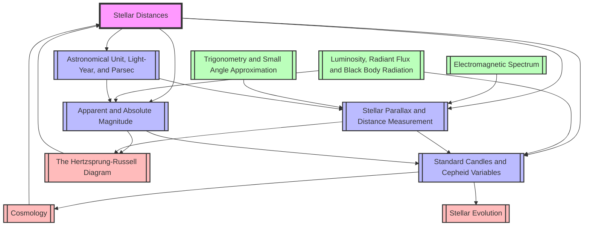

# 1. Overview / 概述

**English:**
Stellar Distances is a foundational topic in astrophysics that explores how astronomers measure the vast distances to stars and galaxies. This topic bridges observational astronomy with fundamental physics principles, introducing key concepts such as the [[Astronomical Unit, Light-Year, and Parsec]], [[Stellar Parallax and Distance Measurement]], [[Standard Candles and Cepheid Variables]], and [[Apparent and Absolute Magnitude]]. Understanding stellar distances is crucial because it underpins our knowledge of the scale of the universe, the [[The Hertzsprung-Russell Diagram]], and [[Cosmology]].

In the Cambridge 9702 and Edexcel IAL syllabuses, this topic is assessed through calculations involving parallax angles, magnitude systems, and the inverse square law for light intensity. Real-world applications include satellite navigation (using astronomical units), determining the size and age of the universe, and calibrating the cosmic distance ladder. The topic also connects to [[Luminosity, Radiant Flux and Black Body Radiation]] through the relationship between apparent brightness and absolute luminosity.

**中文：**
恒星距离是天体物理学中的一个基础课题，探讨天文学家如何测量恒星和星系的巨大距离。该课题将观测天文学与基本物理原理相结合，引入了关键概念，如[[天文单位、光年和秒差距]]、[[恒星视差与距离测量]]、[[标准烛光与造父变星]]以及[[视星等与绝对星等]]。理解恒星距离至关重要，因为它支撑着我们对宇宙尺度、[[赫罗图]]和[[宇宙学]]的认识。

在剑桥 9702 和爱德思 IAL 考纲中，该课题通过涉及视差角、星等系统和光强度的平方反比定律的计算来评估。实际应用包括卫星导航（使用天文单位）、确定宇宙的大小和年龄，以及校准宇宙距离阶梯。该课题还通过视亮度与绝对光度之间的关系与[[光度、辐射通量与黑体辐射]]相联系。

---

# 2. Syllabus Learning Objectives / 考纲学习目标

| CAIE 9702 | Edexcel IAL |
|-----------|-------------|
| 25.2(a) Define the astronomical unit (AU), parsec (pc), and light-year (ly) | 10.7 Understand the astronomical unit (AU), light-year (ly), and parsec (pc) as units of distance |
| 25.2(b) Understand the relationship between the parsec and the astronomical unit, and the light-year | 10.8 Understand the concept of stellar parallax and the relationship between parallax angle and distance |
| 25.2(c) Understand that the measurement of stellar distances is based on the method of stellar parallax, with the parsec defined as the distance at which a star has a parallax angle of 1 arcsecond | 10.9 Understand the use of the inverse square law for light intensity in determining stellar distances |
| 25.2(d) Use the relationship $d = 1/p$ where $d$ is the distance in parsecs and $p$ is the parallax angle in arcseconds | 10.10 Understand the difference between apparent magnitude ($m$) and absolute magnitude ($M$) |
| 25.2(e) Understand the difference between apparent magnitude and absolute magnitude, and use the relationship $m - M = 5 \log_{10}(d/10)$ where $d$ is the distance in parsecs | 10.11 Use the relationship $m - M = 5 \log_{10}(d/10)$ to calculate distance or magnitude |
| — | 10.12 Understand the use of Cepheid variables as standard candles for distance measurement |

**Examiner Expectations / 考官期望：**

**English:**
- Candidates must be able to convert between AU, ly, and pc with precision.
- Parallax calculations require careful handling of arcseconds and radians.
- The magnitude-distance formula must be applied with correct logarithmic manipulation.
- Understanding the limitations of parallax for distant stars is essential.
- For Edexcel, Cepheid variable analysis includes period-luminosity relationship.

**中文：**
- 考生必须能够精确地在 AU、ly 和 pc 之间进行转换。
- 视差计算需要谨慎处理角秒和弧度。
- 星等-距离公式必须正确应用对数运算。
- 理解视差法对遥远恒星的局限性至关重要。
- 对于爱德思，造父变星分析包括周期-光度关系。

> 📋 **CIE Only:** Focus on the definition of parsec from parallax angle of 1 arcsecond. The relationship $d = 1/p$ is directly examinable.
> 
> 📋 **Edexcel Only:** Cepheid variables as standard candles are explicitly required. The period-luminosity relationship and its use in distance measurement are assessed.

---

# 3. Core Definitions / 核心定义

| Term (EN/CN) | Definition (EN) | Definition (CN) | Common Mistakes / 常见错误 |
|--------------|-----------------|-----------------|---------------------------|
| [[Astronomical Unit, Light-Year, and Parsec\|Astronomical Unit (AU) / 天文单位]] | The mean distance from the Earth to the Sun, approximately $1.496 \times 10^{11}$ m | 地球到太阳的平均距离，约为 $1.496 \times 10^{11}$ 米 | Confusing AU with light-year; forgetting the exact value |
| [[Astronomical Unit, Light-Year, and Parsec\|Light-Year (ly) / 光年]] | The distance travelled by light in one year in a vacuum, approximately $9.46 \times 10^{15}$ m | 光在真空中一年内传播的距离，约为 $9.46 \times 10^{15}$ 米 | Thinking it is a unit of time; incorrect conversion factors |
| [[Astronomical Unit, Light-Year, and Parsec\|Parsec (pc) / 秒差距]] | The distance at which 1 AU subtends an angle of 1 arcsecond, approximately $3.09 \times 10^{16}$ m or 3.26 ly | 1 AU 张角为 1 角秒时的距离，约为 $3.09 \times 10^{16}$ 米或 3.26 光年 | Confusing with light-year; forgetting the definition involves 1 AU and 1 arcsecond |
| [[Stellar Parallax and Distance Measurement\|Stellar Parallax / 恒星视差]] | The apparent shift in position of a nearby star against the background of distant stars, caused by the Earth's orbit around the Sun | 由于地球绕太阳公转，近处恒星相对于远处恒星背景的视位置变化 | Thinking parallax is a real motion; confusing with aberration of light |
| [[Stellar Parallax and Distance Measurement\|Parallax Angle (p) / 视差角]] | Half the angular displacement of a star measured over six months, expressed in arcseconds | 在六个月内测量的恒星角位移的一半，以角秒表示 | Using full angular displacement instead of half; unit conversion errors |
| [[Apparent and Absolute Magnitude\|Apparent Magnitude (m) / 视星等]] | The brightness of a star as observed from Earth, on a logarithmic scale where lower numbers indicate brighter objects | 从地球观测到的恒星亮度，采用对数标度，数值越小表示越亮 | Thinking magnitude is linear; confusing with absolute magnitude |
| [[Apparent and Absolute Magnitude\|Absolute Magnitude (M) / 绝对星等]] | The apparent magnitude a star would have if placed at a standard distance of 10 parsecs from Earth | 将恒星放置在距地球 10 秒差距的标准距离时，其视星等 | Forgetting the standard distance is 10 pc; confusing with luminosity |
| [[Standard Candles and Cepheid Variables\|Standard Candle / 标准烛光]] | An astronomical object with a known absolute magnitude, used to determine distances by comparing apparent and absolute magnitudes | 已知绝对星等的天体，通过比较视星等和绝对星等来确定距离 | Assuming all stars are standard candles; ignoring extinction effects |
| [[Standard Candles and Cepheid Variables\|Cepheid Variable / 造父变星]] | A type of pulsating star with a well-defined relationship between its pulsation period and its absolute magnitude | 一种脉动变星，其脉动周期与绝对星等之间存在明确的关系 | Confusing with other variable stars; forgetting the period-luminosity relationship |

---

# 4. Key Concepts Explained / 关键概念详解

## 4.1 The Cosmic Distance Ladder / 宇宙距离阶梯

### Explanation / 解释
**English:**
The [[Cosmology|cosmic distance ladder]] is a hierarchical system of methods used by astronomers to measure distances to celestial objects. Each rung of the ladder relies on the previous rung for calibration. The first rung uses [[Stellar Parallax and Distance Measurement|stellar parallax]] to measure distances to nearby stars (up to about 100 pc). The second rung uses [[Standard Candles and Cepheid Variables|standard candles]] like [[Standard Candles and Cepheid Variables|Cepheid variables]] to reach distances up to millions of parsecs. The third rung uses Type Ia supernovae to reach cosmological distances. This topic focuses on the first two rungs, connecting [[Astronomical Unit, Light-Year, and Parsec|astronomical units]] through parallax to parsecs, and then using the magnitude system to extend further.

**中文：**
宇宙距离阶梯是天文学家用来测量天体距离的分层方法系统。阶梯的每一级都依赖于前一级进行校准。第一级使用恒星视差来测量附近恒星的距离（最远约 100 秒差距）。第二级使用标准烛光（如造父变星）来达到数百万秒差距的距离。第三级使用 Ia 型超新星来达到宇宙学距离。本课题聚焦于前两级，通过视差将天文单位与秒差距联系起来，然后使用星等系统进一步延伸。

### Physical Meaning / 物理意义
**English:**
Without the cosmic distance ladder, we would have no way to determine the scale of the universe. Each method has a limited range: parallax works for nearby stars, standard candles work for galaxies within our local group, and supernovae work for the most distant galaxies. The overlap between methods allows for cross-calibration and verification.

**中文：**
如果没有宇宙距离阶梯，我们将无法确定宇宙的尺度。每种方法都有其适用范围：视差法适用于附近恒星，标准烛光适用于本星系群内的星系，超新星适用于最遥远的星系。方法之间的重叠允许交叉校准和验证。

### Common Misconceptions / 常见误区
- Thinking that all distance measurement methods are equally accurate
- Believing that parallax can measure distances to any star
- Confusing the different rungs of the ladder

### Exam Tips / 考试提示
**English:**
CIE and Edexcel both expect you to understand the hierarchy of methods. Questions may ask you to explain why different methods are used for different distance ranges. Be prepared to discuss the limitations of each method.

**中文：**
剑桥和爱德思都期望你理解方法的层次结构。问题可能会要求你解释为什么对不同距离范围使用不同的方法。准备好讨论每种方法的局限性。

---

## 4.2 The Parsec Definition / 秒差距的定义

### Explanation / 解释
**English:**
The [[Astronomical Unit, Light-Year, and Parsec|parsec]] is defined using the concept of [[Stellar Parallax and Distance Measurement|stellar parallax]]. Consider a star at distance $d$ from the Sun. The Earth orbits the Sun at a distance of 1 AU. Over six months, the Earth moves from one side of its orbit to the other, a baseline of 2 AU. The star appears to shift against the background of distant stars by an angle $2p$, where $p$ is the parallax angle. By definition, if $p = 1$ arcsecond, then $d = 1$ parsec. The relationship is derived from simple trigonometry:

$$ \tan(p) = \frac{1 \text{ AU}}{d} $$

For small angles, $\tan(p) \approx p$ (in radians), so:

$$ p \text{ (radians)} = \frac{1 \text{ AU}}{d} $$

Converting to arcseconds: $1 \text{ radian} = \frac{180}{\pi} \times 3600 \approx 206265 \text{ arcseconds}$

Therefore: $d = \frac{206265 \text{ AU}}{p \text{ (arcseconds)}}$

Since 1 pc = 206265 AU, we get the simple relationship: $d = \frac{1}{p}$ where $d$ is in parsecs and $p$ is in arcseconds.

**中文：**
秒差距是使用恒星视差的概念定义的。考虑一颗距离太阳 $d$ 的恒星。地球绕太阳公转的距离为 1 AU。在六个月内，地球从轨道的一侧移动到另一侧，基线为 2 AU。恒星相对于远处恒星背景的视位移角度为 $2p$，其中 $p$ 是视差角。根据定义，如果 $p = 1$ 角秒，则 $d = 1$ 秒差距。该关系来自简单的三角学：

$$ \tan(p) = \frac{1 \text{ AU}}{d} $$

对于小角度，$\tan(p) \approx p$（以弧度为单位），所以：

$$ p \text{ (弧度)} = \frac{1 \text{ AU}}{d} $$

转换为角秒：$1 \text{ 弧度} = \frac{180}{\pi} \times 3600 \approx 206265 \text{ 角秒}$

因此：$d = \frac{206265 \text{ AU}}{p \text{ (角秒)}}$

由于 1 pc = 206265 AU，我们得到简单关系：$d = \frac{1}{p}$，其中 $d$ 以秒差距为单位，$p$ 以角秒为单位。

### Physical Meaning / 物理意义
**English:**
The parsec is a natural unit for stellar distances because it directly relates to the measurable parallax angle. A star at 1 parsec has a parallax of 1 arcsecond. A star at 10 parsecs has a parallax of 0.1 arcseconds. This inverse relationship makes it easy to convert between measured angles and distances.

**中文：**
秒差距是恒星距离的自然单位，因为它直接与可测量的视差角相关。距离 1 秒差距的恒星视差为 1 角秒。距离 10 秒差距的恒星视差为 0.1 角秒。这种反比关系使得在测量角度和距离之间进行转换变得容易。

### Common Misconceptions / 常见误区
- Using the full angular displacement (2p) instead of half (p) in calculations
- Forgetting to convert arcseconds to radians when using trigonometric functions
- Thinking that 1 pc = 1 AU (it is much larger)

### Exam Tips / 考试提示
**English:**
Both CIE and Edexcel frequently test the definition of the parsec. You must be able to derive the relationship $d = 1/p$ from first principles. Questions often involve converting between AU, ly, and pc. Remember that 1 pc = 3.26 ly = 206265 AU.

**中文：**
剑桥和爱德思都经常测试秒差距的定义。你必须能够从基本原理推导出关系 $d = 1/p$。问题通常涉及在 AU、ly 和 pc 之间进行转换。记住 1 pc = 3.26 ly = 206265 AU。

> 📷 **IMAGE PROMPT — SD-01: Parsec Definition Diagram**
>
> A clear geometric diagram showing the Earth at two positions in its orbit (six months apart), the Sun at the center, and a nearby star. Label the baseline as 2 AU, the parallax angle p as half the total angular shift, and the distance d from the Sun to the star. Use a right-angled triangle with the Sun-star line as the adjacent side and the Earth-Sun distance as the opposite side. Include labels: "1 AU", "d", "p". Use a clean, educational style with blue background, white lines, and yellow Sun.

---

## 4.3 Apparent and Absolute Magnitude / 视星等与绝对星等

### Explanation / 解释
**English:**
The [[Apparent and Absolute Magnitude|magnitude system]] is a logarithmic scale for measuring stellar brightness. The [[Apparent and Absolute Magnitude|apparent magnitude]] ($m$) is what we observe from Earth. The [[Apparent and Absolute Magnitude|absolute magnitude]] ($M$) is the apparent magnitude the star would have if placed at a standard distance of 10 parsecs. The relationship between them is derived from the inverse square law for light intensity:

$$ \frac{I}{I_{10}} = \left(\frac{10}{d}\right)^2 $$

where $I$ is the observed intensity at distance $d$ (in parsecs), and $I_{10}$ is the intensity at 10 pc.

The magnitude scale is defined such that a difference of 5 magnitudes corresponds to a factor of 100 in brightness:

$$ \frac{I}{I_{10}} = 100^{(m-M)/5} $$

Combining these gives the distance modulus formula:

$$ m - M = 5 \log_{10}\left(\frac{d}{10}\right) $$

**中文：**
星等系统是测量恒星亮度的对数标度。视星等 ($m$) 是我们从地球观测到的亮度。绝对星等 ($M$) 是将恒星放置在 10 秒差距的标准距离时的视星等。它们之间的关系来自光强度的平方反比定律：

$$ \frac{I}{I_{10}} = \left(\frac{10}{d}\right)^2 $$

其中 $I$ 是在距离 $d$（以秒差距为单位）处观测到的强度，$I_{10}$ 是在 10 pc 处的强度。

星等标度的定义是：5 个星等的差异对应 100 倍的亮度差异：

$$ \frac{I}{I_{10}} = 100^{(m-M)/5} $$

结合这些公式得到距离模数公式：

$$ m - M = 5 \log_{10}\left(\frac{d}{10}\right) $$

### Physical Meaning / 物理意义
**English:**
The magnitude system allows astronomers to compare the intrinsic brightness of stars regardless of their distance. A star with $m = M$ is at exactly 10 pc. If $m < M$, the star is closer than 10 pc (it appears brighter than its absolute magnitude). If $m > M$, the star is farther than 10 pc.

**中文：**
星等系统允许天文学家比较恒星的内在亮度，无论其距离如何。如果 $m = M$，恒星正好在 10 pc 处。如果 $m < M$，恒星比 10 pc 更近（它看起来比其绝对星等更亮）。如果 $m > M$，恒星比 10 pc 更远。

### Common Misconceptions / 常见误区
- Thinking that a smaller magnitude means a dimmer star (it means brighter)
- Forgetting that the magnitude scale is logarithmic, not linear
- Confusing apparent and absolute magnitude
- Using the wrong base for logarithms (must be base 10)

### Exam Tips / 考试提示
**English:**
The distance modulus formula is heavily tested in both CIE and Edexcel exams. You must be able to rearrange it to find $d$, $m$, or $M$. Common question types include: calculating distance from given magnitudes, finding absolute magnitude from apparent magnitude and distance, and comparing the brightness of two stars.

**中文：**
距离模数公式在剑桥和爱德思考试中都被大量测试。你必须能够重新排列它以找到 $d$、$m$ 或 $M$。常见问题类型包括：从给定的星等计算距离，从视星等和距离求绝对星等，以及比较两颗恒星的亮度。

---

## 4.4 Standard Candles and Cepheid Variables / 标准烛光与造父变星

### Explanation / 解释
**English:**
A [[Standard Candles and Cepheid Variables|standard candle]] is an astronomical object whose [[Apparent and Absolute Magnitude|absolute magnitude]] is known. By measuring its [[Apparent and Absolute Magnitude|apparent magnitude]] and applying the distance modulus formula, its distance can be determined. [[Standard Candles and Cepheid Variables|Cepheid variables]] are a special class of standard candles because their absolute magnitude can be determined from their pulsation period.

The period-luminosity relationship for Cepheid variables was discovered by Henrietta Leavitt. It states that the longer the period of pulsation, the greater the absolute magnitude (brighter the star). This relationship is calibrated using nearby Cepheids whose distances are known from [[Stellar Parallax and Distance Measurement|stellar parallax]].

The process for using Cepheids as distance indicators:
1. Observe the Cepheid and measure its period of pulsation
2. Use the period-luminosity relationship to find its absolute magnitude $M$
3. Measure its apparent magnitude $m$
4. Apply $m - M = 5 \log_{10}(d/10)$ to find the distance $d$

**中文：**
标准烛光是其绝对星等已知的天体。通过测量其视星等并应用距离模数公式，可以确定其距离。造父变星是一类特殊的标准烛光，因为它们的绝对星等可以从其脉动周期确定。

造父变星的周期-光度关系是由亨丽埃塔·莱维特发现的。它指出脉动周期越长，绝对星等越大（恒星越亮）。该关系使用距离已知（来自恒星视差）的附近造父变星进行校准。

使用造父变星作为距离指示器的过程：
1. 观测造父变星并测量其脉动周期
2. 使用周期-光度关系找到其绝对星等 $M$
3. 测量其视星等 $m$
4. 应用 $m - M = 5 \log_{10}(d/10)$ 找到距离 $d$

### Physical Meaning / 物理意义
**English:**
Cepheid variables are crucial because they allow distance measurement to galaxies far beyond the range of parallax. They were used by Edwin Hubble to discover that the universe is expanding. The period-luminosity relationship is a powerful tool because period is easy to measure accurately, even for distant stars.

**中文：**
造父变星至关重要，因为它们允许测量远超出视差范围的星系距离。埃德温·哈勃使用它们发现了宇宙正在膨胀。周期-光度关系是一个强大的工具，因为周期很容易精确测量，即使对于遥远的恒星也是如此。

### Common Misconceptions / 常见误区
- Thinking that all variable stars are Cepheids
- Forgetting that the period-luminosity relationship must be calibrated
- Confusing Cepheids with RR Lyrae variables (different period ranges)

### Exam Tips / 考试提示
**English:**
Edexcel explicitly requires understanding of Cepheid variables as standard candles. CIE may also test this concept. Be prepared to describe the method step by step, including the use of the period-luminosity graph. Questions may ask why Cepheids are useful for measuring distances to other galaxies.

**中文：**
爱德思明确要求理解造父变星作为标准烛光。剑桥也可能测试这个概念。准备好逐步描述该方法，包括使用周期-光度图。问题可能会问为什么造父变星对测量其他星系的距离有用。

> 📷 **IMAGE PROMPT — SD-02: Period-Luminosity Relationship for Cepheid Variables**
>
> A graph showing the period-luminosity relationship for Cepheid variables. X-axis: log(Period) in days (range 0.3 to 3.0). Y-axis: Absolute Magnitude M (range -6 to -2, with negative values at top). Plot a straight line with positive slope (since brighter stars have more negative magnitudes). Show data points with error bars. Include labels: "Classical Cepheids", "Type II Cepheids". Use a scientific graph style with gridlines, clear axis labels, and a legend.

---

# 5. Essential Equations / 核心公式

## 5.1 Parallax-Distance Relationship / 视差-距离关系

**Equation / 公式:**
$$ d = \frac{1}{p} $$

**Variables / 变量:**
| Symbol (符号) | Meaning (EN) | Meaning (CN) | Unit (单位) |
|--------------|-------------|-------------|------------|
| $d$ | Distance to star | 恒星距离 | parsecs (pc) |
| $p$ | Parallax angle | 视差角 | arcseconds (") |

**Derivation / 推导:**
**English:**
From the definition of the parsec: when $p = 1$ arcsecond, $d = 1$ parsec. Using small-angle approximation $\tan(p) \approx p$ (in radians), we have $p \text{ (rad)} = 1 \text{ AU} / d$. Converting radians to arcseconds: $1 \text{ rad} = 206265 \text{ arcsec}$. Therefore $p \text{ (arcsec)} = 206265 \text{ AU} / d$. Since 1 pc = 206265 AU, we get $p = 1/d$ or $d = 1/p$.

**中文：**
从秒差距的定义：当 $p = 1$ 角秒时，$d = 1$ 秒差距。使用小角度近似 $\tan(p) \approx p$（以弧度为单位），我们有 $p \text{ (弧度)} = 1 \text{ AU} / d$。将弧度转换为角秒：$1 \text{ 弧度} = 206265 \text{ 角秒}$。因此 $p \text{ (角秒)} = 206265 \text{ AU} / d$。由于 1 pc = 206265 AU，我们得到 $p = 1/d$ 或 $d = 1/p$。

**Conditions / 适用条件:**
**English:** Only valid for small parallax angles ($p < 1$ arcsecond). The small-angle approximation must hold. The star must be close enough that parallax is measurable (typically $d < 100$ pc for ground-based telescopes).

**中文：** 仅适用于小视差角（$p < 1$ 角秒）。小角度近似必须成立。恒星必须足够近，使得视差可测量（对于地面望远镜，通常 $d < 100$ pc）。

**Limitations / 局限性:**
**English:** For very distant stars, the parallax angle becomes too small to measure accurately. Atmospheric turbulence limits ground-based measurements to about 0.01 arcseconds. Space-based telescopes like Gaia can measure to 0.00001 arcseconds.

**中文：** 对于非常遥远的恒星，视差角变得太小而无法精确测量。大气湍流将地面测量限制在约 0.01 角秒。像盖亚这样的太空望远镜可以测量到 0.00001 角秒。

**Rearrangements / 变形:**
$$ p = \frac{1}{d} $$
$$ d \text{ (ly)} = 3.26 \times d \text{ (pc)} $$
$$ d \text{ (AU)} = 206265 \times d \text{ (pc)} $$

---

## 5.2 Distance Modulus Formula / 距离模数公式

**Equation / 公式:**
$$ m - M = 5 \log_{10}\left(\frac{d}{10}\right) $$

**Variables / 变量:**
| Symbol (符号) | Meaning (EN) | Meaning (CN) | Unit (单位) |
|--------------|-------------|-------------|------------|
| $m$ | Apparent magnitude | 视星等 | dimensionless |
| $M$ | Absolute magnitude | 绝对星等 | dimensionless |
| $d$ | Distance to star | 恒星距离 | parsecs (pc) |

**Derivation / 推导:**
**English:**
The intensity of light follows the inverse square law: $I \propto 1/d^2$. Therefore, the ratio of intensity at distance $d$ to intensity at 10 pc is:

$$ \frac{I}{I_{10}} = \left(\frac{10}{d}\right)^2 $$

The magnitude scale is defined such that a difference of 5 magnitudes corresponds to a factor of 100 in intensity:

$$ \frac{I}{I_{10}} = 100^{(m-M)/5} $$

Equating the two expressions:

$$ 100^{(m-M)/5} = \left(\frac{10}{d}\right)^2 $$

Taking logarithms base 10:

$$ \frac{m-M}{5} \log_{10}(100) = 2 \log_{10}\left(\frac{10}{d}\right) $$

Since $\log_{10}(100) = 2$:

$$ \frac{m-M}{5} \times 2 = 2 \log_{10}\left(\frac{10}{d}\right) $$

Simplifying:

$$ m - M = 5 \log_{10}\left(\frac{10}{d}\right) $$

Using $\log_{10}(10/d) = \log_{10}(10) - \log_{10}(d) = 1 - \log_{10}(d)$:

$$ m - M = 5(1 - \log_{10}(d)) = 5 - 5\log_{10}(d) $$

Alternatively, the standard form is:

$$ m - M = 5 \log_{10}\left(\frac{d}{10}\right) $$

**中文：**
光的强度遵循平方反比定律：$I \propto 1/d^2$。因此，距离 $d$ 处的强度与 10 pc 处强度的比值为：

$$ \frac{I}{I_{10}} = \left(\frac{10}{d}\right)^2 $$

星等标度的定义是：5 个星等的差异对应 100 倍的强度差异：

$$ \frac{I}{I_{10}} = 100^{(m-M)/5} $$

将两个表达式相等：

$$ 100^{(m-M)/5} = \left(\frac{10}{d}\right)^2 $$

取以 10 为底的对数：

$$ \frac{m-M}{5} \log_{10}(100) = 2 \log_{10}\left(\frac{10}{d}\right) $$

由于 $\log_{10}(100) = 2$：

$$ \frac{m-M}{5} \times 2 = 2 \log_{10}\left(\frac{10}{d}\right) $$

简化：

$$ m - M = 5 \log_{10}\left(\frac{10}{d}\right) $$

使用 $\log_{10}(10/d) = \log_{10}(10) - \log_{10}(d) = 1 - \log_{10}(d)$：

$$ m - M = 5(1 - \log_{10}(d)) = 5 - 5\log_{10}(d) $$

或者，标准形式为：

$$ m - M = 5 \log_{10}\left(\frac{d}{10}\right) $$

**Conditions / 适用条件:**
**English:** Assumes no interstellar extinction (absorption or scattering of light by dust). Valid for distances where extinction is negligible. The star must be a standard candle (known absolute magnitude) or the distance must be known to find absolute magnitude.

**中文：** 假设没有星际消光（尘埃对光的吸收或散射）。适用于消光可忽略的距离。恒星必须是标准烛光（已知绝对星等），或者必须已知距离才能求绝对星等。

**Limitations / 局限性:**
**English:** Interstellar dust can cause extinction, making the star appear dimmer (larger $m$) than it should be. This leads to overestimation of distance. Corrections for extinction must be applied for accurate results.

**中文：** 星际尘埃可能导致消光，使恒星看起来比实际更暗（$m$ 更大）。这会导致距离被高估。必须应用消光校正以获得准确结果。

**Rearrangements / 变形:**
$$ d = 10 \times 10^{(m-M)/5} $$
$$ m = M + 5 \log_{10}\left(\frac{d}{10}\right) $$
$$ M = m - 5 \log_{10}\left(\frac{d}{10}\right) $$

---

## 5.3 Inverse Square Law for Light / 光的平方反比定律

**Equation / 公式:**
$$ I = \frac{L}{4\pi d^2} $$

**Variables / 变量:**
| Symbol (符号) | Meaning (EN) | Meaning (CN) | Unit (单位) |
|--------------|-------------|-------------|------------|
| $I$ | Intensity (radiant flux per unit area) | 强度（单位面积的辐射通量） | W m$^{-2}$ |
| $L$ | Luminosity (total power output) | 光度（总功率输出） | W |
| $d$ | Distance from source | 距光源的距离 | m |

**Derivation / 推导:**
**English:**
The total power $L$ emitted by a star spreads uniformly over a sphere of radius $d$. The surface area of this sphere is $4\pi d^2$. Therefore, the intensity (power per unit area) at distance $d$ is $I = L/(4\pi d^2)$.

**中文：**
恒星发出的总功率 $L$ 均匀分布在半径为 $d$ 的球面上。该球面的表面积为 $4\pi d^2$。因此，距离 $d$ 处的强度（单位面积功率）为 $I = L/(4\pi d^2)$。

**Conditions / 适用条件:**
**English:** Assumes the star is a point source and there is no absorption or scattering of light between the star and the observer.

**中文：** 假设恒星是点光源，并且在恒星和观测者之间没有光的吸收或散射。

**Limitations / 局限性:**
**English:** Real stars are not perfect point sources, and interstellar medium can absorb or scatter light. The law is most accurate for nearby stars in relatively dust-free regions.

**中文：** 真实恒星并非完美的点光源，星际介质可以吸收或散射光。该定律对于相对无尘埃区域中的附近恒星最为准确。

**Rearrangements / 变形:**
$$ L = 4\pi d^2 I $$
$$ d = \sqrt{\frac{L}{4\pi I}} $$

---

# 6. Graphs and Relationships / 图表与关系

## 6.1 Parallax Angle vs Distance / 视差角与距离的关系

### Axes / 坐标轴
**English:** X-axis: Distance $d$ (pc); Y-axis: Parallax angle $p$ (arcseconds)
**中文：** X 轴：距离 $d$ (pc)；Y 轴：视差角 $p$ (角秒)

### Shape / 形状
**English:** A rectangular hyperbola: $p = 1/d$. As distance increases, parallax angle decreases rapidly.
**中文：** 一条矩形双曲线：$p = 1/d$。随着距离增加，视差角迅速减小。

### Gradient Meaning / 斜率含义
**English:** The gradient is $-1/d^2$, showing that the rate of decrease of parallax with distance is not constant. The gradient becomes shallower at larger distances.
**中文：** 斜率为 $-1/d^2$，表明视差随距离的减小率不是常数。在更大距离处，斜率变得更平缓。

### Area Meaning / 面积含义
**English:** The area under the curve has no direct physical meaning in this context.
**中文：** 曲线下的面积在此上下文中没有直接的物理意义。

### Exam Interpretation / 考试解读
**English:** Questions may ask you to read values from the graph or explain why parallax measurements become less accurate for distant stars. The graph shows that for $d > 100$ pc, $p < 0.01$ arcseconds, which is at the limit of ground-based measurement accuracy.

**中文：** 问题可能会要求你从图中读取数值，或解释为什么对遥远恒星的视差测量变得不那么准确。该图显示，对于 $d > 100$ pc，$p < 0.01$ 角秒，这处于地面测量精度的极限。

### Common Questions / 常见问题
**English:**
- "Use the graph to find the distance of a star with parallax 0.05 arcseconds."
- "Explain why the parallax method is limited to nearby stars."
- "Calculate the percentage uncertainty in distance if the parallax measurement has an uncertainty of ±0.002 arcseconds."

**中文：**
- "使用图表找出视差为 0.05 角秒的恒星的距离。"
- "解释为什么视差法仅限于附近恒星。"
- "如果视差测量的不确定度为 ±0.002 角秒，计算距离的百分比不确定度。"

---

## 6.2 Period-Luminosity Relationship for Cepheid Variables / 造父变星的周期-光度关系

### Axes / 坐标轴
**English:** X-axis: $\log_{10}(\text{Period})$ in days; Y-axis: Absolute Magnitude $M$
**中文：** X 轴：$\log_{10}(\text{周期})$，以天为单位；Y 轴：绝对星等 $M$

### Shape / 形状
**English:** A straight line with positive slope (since brighter stars have more negative absolute magnitudes). The relationship is approximately linear: $M = a - b \log_{10}(P)$, where $a$ and $b$ are constants.
**中文：** 一条具有正斜率的直线（因为更亮的恒星具有更负的绝对星等）。该关系近似线性：$M = a - b \log_{10}(P)$，其中 $a$ 和 $b$ 是常数。

### Gradient Meaning / 斜率含义
**English:** The gradient $b$ represents how much the absolute magnitude changes for each factor of 10 increase in period. A steeper gradient means a more sensitive relationship.
**中文：** 斜率 $b$ 表示周期每增加 10 倍，绝对星等变化多少。更陡的斜率意味着更敏感的关系。

### Area Meaning / 面积含义
**English:** The area under the curve has no direct physical meaning.
**中文：** 曲线下的面积没有直接的物理意义。

### Exam Interpretation / 考试解读
**English:** Questions may provide a graph of the period-luminosity relationship and ask you to determine the absolute magnitude of a Cepheid given its period, then use this to find its distance. You may also be asked to explain how the relationship is calibrated using nearby Cepheids with known parallax distances.

**中文：** 问题可能会提供周期-光度关系图，并要求你根据给定周期确定造父变星的绝对星等，然后使用它来求距离。你也可能被要求解释如何使用已知视差距离的附近造父变星来校准该关系。

### Common Questions / 常见问题
**English:**
- "A Cepheid variable has a period of 10 days. Using the graph, determine its absolute magnitude."
- "Explain how Cepheid variables can be used to measure the distance to a galaxy."
- "Why is the period-luminosity relationship important for cosmology?"

**中文：**
- "一颗造父变星的周期为 10 天。使用图表确定其绝对星等。"
- "解释如何使用造父变星测量星系的距离。"
- "为什么周期-光度关系对宇宙学很重要？"

---

## 6.3 Apparent Magnitude vs Distance for a Standard Candle / 标准烛光的视星等与距离的关系

### Axes / 坐标轴
**English:** X-axis: $\log_{10}(d)$ where $d$ is in parsecs; Y-axis: Apparent magnitude $m$
**中文：** X 轴：$\log_{10}(d)$，其中 $d$ 以秒差距为单位；Y 轴：视星等 $m$

### Shape / 形状
**English:** A straight line with gradient 5. From $m - M = 5\log_{10}(d/10)$, we get $m = 5\log_{10}(d) + (M - 5)$. This is a linear relationship between $m$ and $\log_{10}(d)$.
**中文：** 一条斜率为 5 的直线。从 $m - M = 5\log_{10}(d/10)$，我们得到 $m = 5\log_{10}(d) + (M - 5)$。这是 $m$ 和 $\log_{10}(d)$ 之间的线性关系。

### Gradient Meaning / 斜率含义
**English:** The gradient is 5, meaning that for each factor of 10 increase in distance, the apparent magnitude increases by 5 (the star appears 100 times dimmer).
**中文：** 斜率为 5，意味着距离每增加 10 倍，视星等增加 5（恒星看起来暗 100 倍）。

### Area Meaning / 面积含义
**English:** The area under the curve has no direct physical meaning.
**中文：** 曲线下的面积没有直接的物理意义。

### Exam Interpretation / 考试解读
**English:** This graph is useful for quickly determining the distance to a standard candle. Given the apparent magnitude and knowing the absolute magnitude, you can read the distance from the graph. Questions may ask you to plot data points and determine the absolute magnitude from the intercept.

**中文：** 该图对于快速确定标准烛光的距离很有用。给定视星等并知道绝对星等，你可以从图中读取距离。问题可能会要求你绘制数据点并从截距确定绝对星等。

### Common Questions / 常见问题
**English:**
- "A standard candle has $M = -3$. If its apparent magnitude is 12, use the graph to find its distance."
- "Plot the data and determine the absolute magnitude of the star."
- "Explain why the graph is a straight line."

**中文：**
- "一个标准烛光的 $M = -3$。如果其视星等为 12，使用图表找出其距离。"
- "绘制数据并确定恒星的绝对星等。"
- "解释为什么图表是一条直线。"

---

# 7. Required Diagrams / 必备图表

## 7.1 Parallax Measurement Geometry / 视差测量几何图

### Description / 描述
**English:**
A geometric diagram showing the Earth at two positions in its orbit around the Sun, six months apart. The Sun is at the center. A nearby star is shown at distance $d$ from the Sun. The baseline is 2 AU (the diameter of Earth's orbit). The parallax angle $p$ is half the total angular shift of the star against the distant background stars. A right-angled triangle is formed by the Sun, Earth, and the star.

**中文：**
一个几何图，显示地球在绕太阳轨道上的两个位置，相隔六个月。太阳在中心。一颗近处恒星显示在距离太阳 $d$ 处。基线为 2 AU（地球轨道的直径）。视差角 $p$ 是恒星相对于远处背景恒星的总角位移的一半。由太阳、地球和恒星形成一个直角三角形。

### Image Prompt / 图片生成提示
> 📷 **IMAGE PROMPT — SD-03: Parallax Measurement Geometry**
>
> A clean, educational diagram showing the Earth at two positions (E1 and E2) on opposite sides of the Sun (S). Draw a nearby star (Star) at distance d from the Sun. Show the baseline E1-E2 as 2 AU. Indicate the parallax angle p as the angle between the lines from the star to E1 and from the star to the Sun. Use a right-angled triangle with vertices at Sun, Earth (E1), and Star. Label: "1 AU" (Sun to Earth), "d" (Sun to Star), "p" (parallax angle). Include distant background stars as small dots. Use blue background, yellow Sun, white Earth positions, and red star. Style: textbook-quality, vector-like, with clear labels and arrows.

### Labels Required / 需要标注
- Sun / 太阳 (S)
- Earth position 1 / 地球位置 1 (E1)
- Earth position 2 / 地球位置 2 (E2)
- Nearby star / 近处恒星
- Distance $d$ / 距离 $d$
- Baseline 2 AU / 基线 2 AU
- Parallax angle $p$ / 视差角 $p$
- Distant background stars / 远处背景恒星

### Exam Importance / 考试重要性
**English:**
This diagram is essential for understanding the definition of the parsec and the parallax method. CIE and Edexcel both expect you to be able to draw and label this diagram from memory. Questions often ask you to explain how the parallax angle is measured and how it relates to distance.

**中文：**
该图对于理解秒差距的定义和视差法至关重要。剑桥和爱德思都期望你能够凭记忆绘制并标注此图。问题通常要求你解释如何测量视差角以及它如何与距离相关。

---

## 7.2 Period-Luminosity Graph for Cepheid Variables / 造父变星的周期-光度图

### Description / 描述
**English:**
A graph showing the relationship between the pulsation period (on a logarithmic scale) and the absolute magnitude for Cepheid variable stars. The data points form a straight line with positive slope. Two populations are often shown: Classical Cepheids (Type I) and Type II Cepheids, with different calibration lines.

**中文：**
一个显示造父变星的脉动周期（对数标度）与绝对星等之间关系的图表。数据点形成一条具有正斜率的直线。通常显示两个群体：经典造父变星（I 型）和 II 型造父变星，具有不同的校准线。

### Image Prompt / 图片生成提示
> 📷 **IMAGE PROMPT — SD-04: Period-Luminosity Relationship for Cepheid Variables**
>
> A scientific graph with X-axis labeled "log(Period / days)" ranging from 0.3 to 3.0, and Y-axis labeled "Absolute Magnitude M" ranging from -6 to -2 (with -6 at the top, since brighter stars have more negative magnitudes). Plot a straight line with positive slope representing Classical Cepheids. Include a second line with slightly different slope for Type II Cepheids. Add data points with error bars. Include a legend. Use gridlines. Style: professional journal-quality, black and white with clear labels, suitable for exam reproduction.

### Labels Required / 需要标注
- X-axis: $\log_{10}(\text{Period / days})$ / X 轴：$\log_{10}(\text{周期 / 天})$
- Y-axis: Absolute Magnitude $M$ / Y 轴：绝对星等 $M$
- Classical Cepheids / 经典造父变星
- Type II Cepheids / II 型造父变星
- Data points with error bars / 带误差棒的数据点

### Exam Importance / 考试重要性
**English:**
Edexcel explicitly requires understanding of this graph. Questions may ask you to read values from the graph, explain how it is calibrated, or use it to determine the distance to a galaxy containing Cepheid variables.

**中文：**
爱德思明确要求理解此图。问题可能会要求你从图中读取数值，解释如何校准，或使用它来确定包含造父变星的星系的距离。

---

## 7.3 The Cosmic Distance Ladder / 宇宙距离阶梯

### Description / 描述
**English:**
A hierarchical diagram showing the different methods used to measure astronomical distances, arranged in order of increasing distance range. The first rung is radar ranging (solar system), the second is stellar parallax (nearby stars), the third is main sequence fitting (star clusters), the fourth is Cepheid variables (nearby galaxies), and the fifth is Type Ia supernovae (distant galaxies).

**中文：**
一个分层图，显示用于测量天文距离的不同方法，按距离范围递增排列。第一级是雷达测距（太阳系），第二级是恒星视差（附近恒星），第三级是主序拟合（星团），第四级是造父变星（附近星系），第五级是 Ia 型超新星（遥远星系）。

### Image Prompt / 图片生成提示
> 📷 **IMAGE PROMPT — SD-05: The Cosmic Distance Ladder**
>
> A vertical ladder or staircase diagram with 5 rungs. From bottom to top: Rung 1: "Radar Ranging" (Solar System, up to 10 AU). Rung 2: "Stellar Parallax" (Nearby Stars, up to 100 pc). Rung 3: "Main Sequence Fitting" (Star Clusters, up to 100 kpc). Rung 4: "Cepheid Variables" (Nearby Galaxies, up to 10 Mpc). Rung 5: "Type Ia Supernovae" (Distant Galaxies, up to 1000 Mpc). Each rung should have an icon or small diagram representing the method. Use arrows showing calibration flow upward. Style: infographic-style, colorful, with clear labels and distance ranges.

### Labels Required / 需要标注
- Radar Ranging / 雷达测距
- Stellar Parallax / 恒星视差
- Main Sequence Fitting / 主序拟合
- Cepheid Variables / 造父变星
- Type Ia Supernovae / Ia 型超新星
- Distance ranges for each method / 每种方法的距离范围
- Calibration arrows / 校准箭头

### Exam Importance / 考试重要性
**English:**
This diagram helps students understand the context of stellar distance measurement. Questions may ask you to explain why different methods are needed for different distance ranges, or to describe how methods are calibrated against each other.

**中文：**
该图帮助学生理解恒星距离测量的背景。问题可能会要求你解释为什么不同距离范围需要不同的方法，或描述方法之间如何相互校准。

---

# 8. Worked Examples / 典型例题

## Example 1: Parallax Distance Calculation / 例 1：视差距离计算

### Question / 题目
**English:**
A star has a measured parallax angle of $0.025$ arcseconds. Calculate:
(a) The distance to the star in parsecs.
(b) The distance to the star in light-years.
(c) The distance to the star in astronomical units.

**中文：**
一颗恒星的测量视差角为 $0.025$ 角秒。计算：
(a) 恒星的距离，以秒差距为单位。
(b) 恒星的距离，以光年为单位。
(c) 恒星的距离，以天文单位为单位。

### Solution / 解答

**Step 1: Calculate distance in parsecs / 步骤 1：计算以秒差距为单位的距离**

Using the parallax-distance relationship:

$$ d = \frac{1}{p} = \frac{1}{0.025} = 40 \text{ pc} $$

**Step 2: Convert to light-years / 步骤 2：转换为光年**

Using the conversion factor: 1 pc = 3.26 ly

$$ d = 40 \times 3.26 = 130.4 \text{ ly} $$

**Step 3: Convert to astronomical units / 步骤 3：转换为天文单位**

Using the conversion factor: 1 pc = 206265 AU

$$ d = 40 \times 206265 = 8.25 \times 10^6 \text{ AU} $$

### Final Answer / 最终答案
**Answer:**
(a) $d = 40$ pc
(b) $d = 130$ ly (to 3 significant figures)
(c) $d = 8.25 \times 10^6$ AU

**答案：**
(a) $d = 40$ 秒差距
(b) $d = 130$ 光年（保留 3 位有效数字）
(c) $d = 8.25 \times 10^6$ 天文单位

### Examiner Notes / 考官点评
**English:**
- Always check that the parallax angle is in arcseconds before using $d = 1/p$.
- Pay attention to significant figures in the final answer.
- Remember the conversion factors: 1 pc = 3.26 ly = 206265 AU.
- Common mistake: using $p$ in radians instead of arcseconds.

**中文：**
- 在使用 $d = 1/p$ 之前，始终检查视差角是否以角秒为单位。
- 注意最终答案的有效数字。
- 记住换算因子：1 pc = 3.26 ly = 206265 AU。
- 常见错误：使用以弧度为单位而不是角秒的 $p$。

### Alternative Method / 替代方法
**English:**
You can also calculate the distance in AU first using $d = 206265/p$, then convert to pc by dividing by 206265, and to ly by multiplying by 3.26 × 10$^{-6}$.

**中文：**
你也可以先使用 $d = 206265/p$ 计算以 AU 为单位的距离，然后除以 206265 转换为 pc，再乘以 $3.26 \times 10^{-6}$ 转换为 ly。

---

## Example 2: Distance Modulus Calculation / 例 2：距离模数计算

### Question / 题目
**English:**
A Cepheid variable star has an apparent magnitude of $m = 15.2$ and a pulsation period of 10 days. Using the period-luminosity relationship, its absolute magnitude is determined to be $M = -4.5$. Calculate:
(a) The distance to the star in parsecs.
(b) The distance to the star in light-years.

**中文：**
一颗造父变星的视星等为 $m = 15.2$，脉动周期为 10 天。使用周期-光度关系，确定其绝对星等为 $M = -4.5$。计算：
(a) 恒星的距离，以秒差距为单位。
(b) 恒星的距离，以光年为单位。

### Solution / 解答

**Step 1: Apply the distance modulus formula / 步骤 1：应用距离模数公式**

$$ m - M = 5 \log_{10}\left(\frac{d}{10}\right) $$

Substitute values:

$$ 15.2 - (-4.5) = 5 \log_{10}\left(\frac{d}{10}\right) $$

$$ 19.7 = 5 \log_{10}\left(\frac{d}{10}\right) $$

**Step 2: Solve for $\log_{10}(d/10)$ / 步骤 2：求解 $\log_{10}(d/10)$**

$$ \log_{10}\left(\frac{d}{10}\right) = \frac{19.7}{5} = 3.94 $$

**Step 3: Solve for $d$ / 步骤 3：求解 $d$**

$$ \frac{d}{10} = 10^{3.94} $$

$$ d = 10 \times 10^{3.94} = 10^{4.94} $$

$$ d = 8.71 \times 10^4 \text{ pc} $$

**Step 4: Convert to light-years / 步骤 4：转换为光年**

$$ d = 8.71 \times 10^4 \times 3.26 = 2.84 \times 10^5 \text{ ly} $$

### Final Answer / 最终答案
**Answer:**
(a) $d = 8.71 \times 10^4$ pc (87,100 pc)
(b) $d = 2.84 \times 10^5$ ly (284,000 ly)

**答案：**
(a) $d = 8.71 \times 10^4$ 秒差距（87,100 秒差距）
(b) $d = 2.84 \times 10^5$ 光年（284,000 光年）

### Examiner Notes / 考官点评
**English:**
- The distance modulus $m - M$ is positive when the star is farther than 10 pc.
- Remember that $m - M = 5\log_{10}(d/10)$ can be rearranged to $d = 10 \times 10^{(m-M)/5}$.
- Common mistake: forgetting to divide by 10 inside the logarithm.
- Always check that your answer is reasonable: a Cepheid with $m = 15.2$ and $M = -4.5$ should be very far away.

**中文：**
- 当恒星距离超过 10 pc 时，距离模数 $m - M$ 为正。
- 记住 $m - M = 5\log_{10}(d/10)$ 可以重排为 $d = 10 \times 10^{(m-M)/5}$。
- 常见错误：忘记在对数内除以 10。
- 始终检查你的答案是否合理：$m = 15.2$ 和 $M = -4.5$ 的造父变星应该非常遥远。

### Alternative Method / 替代方法
**English:**
You can also use the formula $d = 10^{(m - M + 5)/5}$ directly. This gives $d = 10^{(19.7 + 5)/5} = 10^{24.7/5} = 10^{4.94} = 8.71 \times 10^4$ pc.

**中文：**
你也可以直接使用公式 $d = 10^{(m - M + 5)/5}$。这给出 $d = 10^{(19.7 + 5)/5} = 10^{24.7/5} = 10^{4.94} = 8.71 \times 10^4$ 秒差距。

---

## Example 3: Comparing Stellar Brightness / 例 3：比较恒星亮度

### Question / 题目
**English:**
Two stars have apparent magnitudes $m_1 = 2.0$ and $m_2 = 5.0$. Calculate the ratio of their intensities as observed from Earth.

**中文：**
两颗恒星的视星等分别为 $m_1 = 2.0$ 和 $m_2 = 5.0$。计算从地球观测到的它们的强度之比。

### Solution / 解答

**Step 1: Recall the magnitude-intensity relationship / 步骤 1：回忆星等-强度关系**

A difference of 5 magnitudes corresponds to a factor of 100 in intensity:

$$ \frac{I_1}{I_2} = 100^{(m_2 - m_1)/5} $$

**Step 2: Substitute values / 步骤 2：代入数值**

$$ \frac{I_1}{I_2} = 100^{(5.0 - 2.0)/5} = 100^{3/5} $$

**Step 3: Calculate / 步骤 3：计算**

$$ 100^{3/5} = (100^{1/5})^3 = (100^{0.2})^3 $$

$$ 100^{0.2} = 10^{0.4} \approx 2.512 $$

$$ \frac{I_1}{I_2} = (2.512)^3 \approx 15.85 $$

### Final Answer / 最终答案
**Answer:**
The star with $m = 2.0$ is approximately 15.85 times brighter than the star with $m = 5.0$.

**答案：**
$m = 2.0$ 的恒星比 $m = 5.0$ 的恒星亮约 15.85 倍。

### Examiner Notes / 考官点评
**English:**
- Remember that a smaller magnitude means a brighter star.
- The formula $\frac{I_1}{I_2} = 100^{(m_2 - m_1)/5}$ works for any magnitude difference.
- Common mistake: reversing the order of magnitudes in the exponent.
- For a difference of 1 magnitude, the intensity ratio is $100^{1/5} \approx 2.512$.

**中文：**
- 记住较小的星等意味着较亮的恒星。
- 公式 $\frac{I_1}{I_2} = 100^{(m_2 - m_1)/5}$ 适用于任何星等差。
- 常见错误：在指数中颠倒星等的顺序。
- 对于 1 个星等的差异，强度比为 $100^{1/5} \approx 2.512$。

### Alternative Method / 替代方法
**English:**
You can also use the logarithmic form: $m_1 - m_2 = -2.5 \log_{10}(I_1/I_2)$. Solving gives the same result.

**中文：**
你也可以使用对数形式：$m_1 - m_2 = -2.5 \log_{10}(I_1/I_2)$。求解得到相同结果。

---

# 9. Past Paper Question Types / 历年真题题型

| Question Type / 题型 | Frequency / 频率 | Difficulty / 难度 | Past Paper References / 真题索引 |
|----------------------|------------------|------------------|-------------------------------|
| Calculation: Parallax to distance / 计算：视差到距离 | High | Medium | 📝 *待填入* |
| Calculation: Distance modulus / 计算：距离模数 | High | Medium-High | 📝 *待填入* |
| Calculation: Magnitude difference to intensity ratio / 计算：星等差到强度比 | Medium | Medium | 📝 *待填入* |
| Explanation: Parallax method limitations / 解释：视差法的局限性 | High | Medium | 📝 *待填入* |
| Explanation: Cepheid variables as standard candles / 解释：造父变星作为标准烛光 | Medium (Edexcel: High) | Medium-High | 📝 *待填入* |
| Graph Analysis: Period-luminosity relationship / 图表分析：周期-光度关系 | Medium (Edexcel: High) | Medium | 📝 *待填入* |
| Graph Analysis: Parallax vs distance / 图表分析：视差与距离 | Low-Medium | Medium | 📝 *待填入* |
| Practical: Uncertainty in parallax measurements / 实验：视差测量的不确定度 | Low | High | 📝 *待填入* |
| Derivation: Parsec definition / 推导：秒差距定义 | Medium | Medium | 📝 *待填入* |
| Derivation: Distance modulus formula / 推导：距离模数公式 | Low-Medium | High | 📝 *待填入* |

> 📝 **题库整理中 / Question Bank Under Construction:** 具体试卷编号（如 9702/23/M/J/24 Q3）将在后续整理真题后填入上表。

**Common Command Words / 常见指令词：**

| Command Word (EN) | Command Word (CN) | Typical Usage / 典型用法 |
|-------------------|-------------------|-------------------------|
| State | 陈述 | State the definition of the parsec. / 陈述秒差距的定义。 |
| Define | 定义 | Define the astronomical unit. / 定义天文单位。 |
| Explain | 解释 | Explain why parallax measurements are limited to nearby stars. / 解释为什么视差测量仅限于附近恒星。 |
| Describe | 描述 | Describe how Cepheid variables are used as standard candles. / 描述如何使用造父变星作为标准烛光。 |
| Calculate | 计算 | Calculate the distance to a star with a parallax of 0.05 arcseconds. / 计算视差为 0.05 角秒的恒星的距离。 |
| Determine | 确定 | Determine the absolute magnitude of a star given its apparent magnitude and distance. / 给定视星等和距离，确定恒星的绝对星等。 |
| Suggest | 建议 | Suggest why the distance modulus formula may give inaccurate results for very distant stars. / 建议为什么距离模数公式可能对非常遥远的恒星给出不准确的结果。 |
| Show | 证明 | Show that 1 parsec is equal to 3.26 light-years. / 证明 1 秒差距等于 3.26 光年。 |
| Derive | 推导 | Derive the relationship between distance and parallax angle. / 推导距离与视差角之间的关系。 |

---

# 10. Practical Skills Connections / 实验技能链接

**English:**
This topic connects to practical skills in several ways:

1. **Measurement Techniques (CAIE Paper 3/5, Edexcel Unit 3/6):**
   - Understanding how parallax angles are measured using telescopes
   - Using photographic plates or CCD cameras to record stellar positions
   - Measuring periods of Cepheid variables from light curves

2. **Uncertainties and Errors:**
   - Parallax measurements have inherent uncertainties due to atmospheric turbulence and instrument limitations
   - The uncertainty in distance $\Delta d$ is related to the uncertainty in parallax $\Delta p$ by $\Delta d/d = \Delta p/p$
   - For a star at 100 pc with $p = 0.01$ arcseconds and $\Delta p = 0.001$ arcseconds, the percentage uncertainty in distance is 10%

3. **Graph Plotting and Analysis:**
   - Plotting the period-luminosity relationship for Cepheid variables
   - Using logarithmic scales for period (log P vs M)
   - Determining the gradient and intercept of straight-line graphs
   - Reading values from calibration graphs

4. **Experimental Design:**
   - Designing an experiment to measure stellar distances using parallax
   - Calibrating the period-luminosity relationship using nearby Cepheids with known parallax distances
   - Accounting for interstellar extinction when using the distance modulus formula

5. **Data Analysis:**
   - Converting between different units (AU, ly, pc)
   - Applying logarithmic transformations
   - Calculating intensity ratios from magnitude differences
   - Using the inverse square law to relate intensity, luminosity, and distance

**中文：**
本课题通过多种方式与实验技能相关联：

1. **测量技术（剑桥 Paper 3/5，爱德思 Unit 3/6）：**
   - 理解如何使用望远镜测量视差角
   - 使用照相底片或 CCD 相机记录恒星位置
   - 从光变曲线测量造父变星的周期

2. **不确定度和误差：**
   - 由于大气湍流和仪器限制，视差测量具有固有的不确定度
   - 距离的不确定度 $\Delta d$ 与视差的不确定度 $\Delta p$ 的关系为 $\Delta d/d = \Delta p/p$
   - 对于距离 100 pc、$p = 0.01$ 角秒且 $\Delta p = 0.001$ 角秒的恒星，距离的百分比不确定度为 10%

3. **图表绘制和分析：**
   - 绘制造父变星的周期-光度关系图
   - 对周期使用对数标度（log P 与 M）
   - 确定直线图的斜率和截距
   - 从校准图中读取数值

4. **实验设计：**
   - 设计使用视差法测量恒星距离的实验
   - 使用已知视差距离的附近造父变星校准周期-光度关系
   - 在使用距离模数公式时考虑星际消光

5. **数据分析：**
   - 在不同单位（AU、ly、pc）之间进行转换
   - 应用对数变换
   - 从星等差计算强度比
   - 使用平方反比定律关联强度、光度和距离

> 📋 **CIE Only:** Paper 5 may ask you to design an experiment to measure the distance to a nearby star using parallax. You should describe the equipment (telescope, CCD camera), the procedure (measurements taken 6 months apart), and the analysis (calculating parallax angle and distance).
>
> 📋 **Edexcel Only:** Unit 6 may include questions on the practical determination of the period-luminosity relationship for Cepheid variables. You should be familiar with light curves and how to determine the period from a graph of brightness against time.

---

# 11. Concept Map / 概念图谱

**Concept Map Explanation / 概念图解释：**

**English:**
The concept map shows that [[Stellar Distances]] is the central hub connecting four sub-topics: [[Astronomical Unit, Light-Year, and Parsec]], [[Stellar Parallax and Distance Measurement]], [[Standard Candles and Cepheid Variables]], and [[Apparent and Absolute Magnitude]]. The prerequisites include [[Luminosity, Radiant Flux and Black Body Radiation]] (for understanding magnitude and intensity), [[Electromagnetic Spectrum]] (for understanding how light is detected), and trigonometry (for parallax calculations). Related topics include [[The Hertzsprung-Russell Diagram]] (which uses absolute magnitude), [[Cosmology]] (which uses Cepheid variables for distance measurement), and [[Stellar Evolution]] (which explains why Cepheid variables exist).

**中文：**
概念图显示[[恒星距离]]是连接四个子主题的中心枢纽：[[天文单位、光年和秒差距]]、[[恒星视差与距离测量]]、[[标准烛光与造父变星]]和[[视星等与绝对星等]]。先决条件包括[[光度、辐射通量与黑体辐射]]（用于理解星等和强度）、[[电磁波谱]]（用于理解如何探测光）和三角学（用于视差计算）。相关主题包括[[赫罗图]]（使用绝对星等）、[[宇宙学]]（使用造父变星进行距离测量）和[[恒星演化]]（解释为什么存在造父变星）。

---

# 12. Quick Revision Sheet / 速查表

| Category / 类别 | Key Points / 要点 |
|----------------|------------------|
| **Definitions / 定义** | • **AU**: Mean Earth-Sun distance = $1.496 \times 10^{11}$ m • **ly**: Distance light travels in 1 year = $9.46 \times 10^{15}$ m • **pc**: Distance where 1 AU subtends 1 arcsecond = $3.09 \times 10^{16}$ m = 3.26 ly • **Parallax**: Apparent shift of star due to Earth's orbit • **Apparent magnitude $m$**: Observed brightness from Earth • **Absolute magnitude $M$**: Brightness at 10 pc |
| **Equations / 公式** | • $d = 1/p$ (d in pc, p in arcseconds) • $m - M = 5\log_{10}(d/10)$ (d in pc) • $d = 10 \times 10^{(m-M)/5}$ • $I = L/(4\pi d^2)$ (inverse square law) • $I_1/I_2 = 100^{(m_2-m_1)/5}$ • 1 pc = 3.26 ly = 206265 AU |
| **Graphs / 图表** | • **Parallax vs Distance**: Hyperbola $p = 1/d$ • **Period-Luminosity**: Linear plot of $M$ vs $\log_{10}(P)$ for Cepheids • **Magnitude vs $\log_{10}(d)$**: Straight line with gradient 5 |
| **Key Facts / 关键事实** | • Parallax works for $d < 100$ pc (ground-based) • Gaia satellite measures parallax to $d < 10^5$ pc • Cepheid period-luminosity relationship discovered by Henrietta Leavitt • Distance modulus $m-M$ is positive for $d > 10$ pc • 5 magnitude difference = factor of 100 in brightness • 1 magnitude difference = factor of $100^{1/5} \approx 2.512$ |
| **Exam Reminders / 考试提醒** | • Always check units: parallax in arcseconds, distance in pc • Use $\log_{10}$ not $\ln$ in distance modulus formula • Remember: smaller magnitude = brighter star • For CIE: focus on parsec definition and $d = 1/p$ • For Edexcel: focus on Cepheid variables as standard candles • Include interstellar extinction as a limitation • Show all working in calculations, especially logarithmic steps • Convert between AU, ly, pc correctly using given conversion factors |

---

**End of Document / 文档结束**

> 📝 **Note:** This document serves as the HUB file for the Stellar Distances topic. It links to four sub-topic leaf nodes: [[Astronomical Unit, Light-Year, and Parsec]], [[Stellar Parallax and Distance Measurement]], [[Standard Candles and Cepheid Variables]], and [[Apparent and Absolute Magnitude]]. Each leaf node contains detailed explanations, derivations, and exam-specific content for that sub-topic.