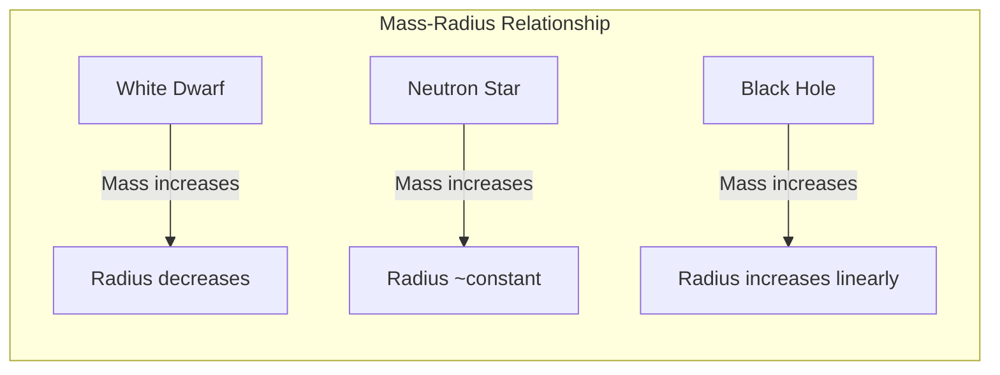
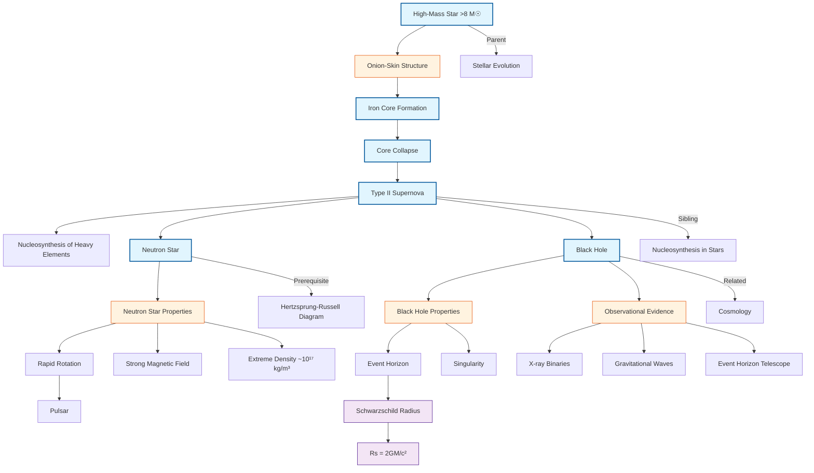

# 1. Overview / 概述

**English:**
This sub-topic covers the dramatic final stages of high-mass stars (typically >8 solar masses). Unlike low-mass stars that end as white dwarfs, high-mass stars undergo catastrophic collapse after iron core formation, triggering a Type II supernova explosion. The remnant can become either a neutron star (if the core mass is between 1.4 and ~3 solar masses) or a black hole (if the core exceeds ~3 solar masses). This process is fundamental to understanding nucleosynthesis of heavy elements, the formation of compact objects, and the evolution of galaxies. It connects directly to [[Cosmology]] through gravitational wave astronomy and the study of gamma-ray bursts.

**中文:**
本子知识点涵盖大质量恒星（通常 >8 倍太阳质量）的剧烈终末阶段。与低质量恒星最终成为白矮星不同，大质量恒星在铁核形成后经历灾难性坍缩，引发II型超新星爆发。残骸可能成为中子星（若核心质量在1.4至约3倍太阳质量之间）或黑洞（若核心超过约3倍太阳质量）。这一过程对于理解重元素核合成、致密天体的形成以及星系的演化至关重要。它通过引力波天文学和伽马射线暴的研究与[[宇宙学]]直接相连。

---

# 2. Syllabus Learning Objectives / 考纲学习目标

| CAIE 9702 | Edexcel IAL |
|-----------|-------------|
| 25.4(a) Describe the evolution of a massive star (core collapse, supernova, neutron star/black hole) | 10.19 Describe the formation of elements heavier than iron in supernovae |
| 25.4(b) Explain the conditions for supernova (Type II) | 10.20 Explain the formation of neutron stars and black holes |
| 25.4(c) Describe the properties of neutron stars (density, rotation, magnetic field) | 10.21 Describe the properties of neutron stars |
| 25.4(d) Describe the properties of black holes (event horizon, Schwarzschild radius) | 10.22 Use the Schwarzschild radius formula |
| 25.4(e) Use the Schwarzschild radius formula $R_s = \frac{2GM}{c^2}$ | 10.23 Explain the event horizon |
| 25.4(f) Explain the concept of the event horizon | 10.24 Describe the observational evidence for black holes |
| 25.4(g) Describe the observational evidence for black holes | 10.25 Describe the role of supernovae in distributing heavy elements |
| 25.4(h) Describe the role of supernovae in nucleosynthesis | |

**Examiner Expectations / 考官期望:**
- **CAIE:** Students must be able to describe the sequence of events in core collapse and distinguish between Type II and Type Ia supernovae. The Schwarzschild radius formula must be applied in calculations.
- **Edexcel:** Emphasis on the nucleosynthesis of elements heavier than iron and the observational evidence for black holes (e.g., X-ray binaries, gravitational waves).

---

# 3. Core Definitions / 核心定义

| Term (EN/CN) | Definition (EN) | Definition (CN) | Common Mistakes / 常见错误 |
|--------------|-----------------|-----------------|---------------------------|
| **Supernova (Type II)** / II型超新星 | The explosive death of a massive star (>8 M☉) triggered by the collapse of its iron core, followed by a rebound shock wave. | 大质量恒星（>8 M☉）铁核坍缩后反弹激波引发的爆炸性死亡。 | Confusing with Type Ia (white dwarf accretion). Type II has hydrogen lines in spectrum. |
| **Neutron Star** / 中子星 | An extremely dense remnant of a supernova, composed almost entirely of neutrons, with a radius of ~10 km and mass 1.4–3 M☉. | 超新星残骸，几乎完全由中子组成，半径约10公里，质量1.4–3 M☉的极端致密天体。 | Thinking neutron stars are "solid" — they are degenerate neutron matter. |
| **Black Hole** / 黑洞 | A region of spacetime where gravity is so strong that nothing, not even light, can escape from within the event horizon. | 时空区域，引力极强，连光都无法从事件视界内逃逸。 | Thinking black holes "suck in" everything — they only affect objects within their gravitational influence. |
| **Event Horizon** / 事件视界 | The boundary around a black hole beyond which no information or matter can escape. | 黑洞周围的边界，超出此边界任何信息或物质都无法逃逸。 | Confusing with the singularity — the event horizon is not a physical surface. |
| **Schwarzschild Radius** / 史瓦西半径 | The radius of the event horizon for a non-rotating black hole, given by $R_s = \frac{2GM}{c^2}$. | 非旋转黑洞事件视界的半径，由 $R_s = \frac{2GM}{c^2}$ 给出。 | Forgetting that this applies only to non-rotating (Schwarzschild) black holes. |
| **Iron Core** / 铁核 | The innermost region of a massive star where nuclear fusion has produced iron-56, which cannot fuse exothermically. | 大质量恒星内部核聚变产生铁-56的最内部区域，铁无法放热聚变。 | Thinking iron fusion releases energy — it actually absorbs energy. |

---

# 4. Key Concepts Explained / 关键概念详解

## 4.1 Core Collapse Mechanism / 核心坍缩机制

### Explanation / 解释
**English:**
In a high-mass star, nuclear fusion proceeds through successive stages: hydrogen → helium → carbon → neon → oxygen → silicon → iron. Each stage occurs in a shorter timescale (silicon burning lasts only ~1 day). When the core becomes iron-56, no further exothermic fusion is possible. The iron core is supported by electron degeneracy pressure. When the core mass exceeds the [[Chandrasekhar Limit]] (~1.4 M☉), electron degeneracy pressure can no longer support it. The core collapses in milliseconds, reaching densities of ~10¹⁷ kg/m³. Protons and electrons combine to form neutrons via inverse beta decay: $p + e^- \rightarrow n + \nu_e$. The collapse is halted by neutron degeneracy pressure, causing a "bounce" and a shock wave that blows off the outer layers — this is the Type II supernova.

**中文:**
在大质量恒星中，核聚变依次经历：氢→氦→碳→氖→氧→硅→铁。每个阶段的时间尺度越来越短（硅燃烧仅持续约1天）。当核心变成铁-56时，无法再进行放热聚变。铁核由电子简并压力支撑。当核心质量超过[[钱德拉塞卡极限]]（约1.4 M☉）时，电子简并压力无法再支撑。核心在毫秒内坍缩，密度达到约10¹⁷ kg/m³。质子和电子通过逆β衰变结合成中子：$p + e^- \rightarrow n + \nu_e$。坍缩被中子简并压力阻止，产生"反弹"和激波，吹散外层——这就是II型超新星。

### Physical Meaning / 物理意义
**English:** The core collapse converts gravitational potential energy into thermal energy and neutrino emission. The neutrinos carry away 99% of the gravitational binding energy. The shock wave heats the outer layers, enabling nucleosynthesis of elements heavier than iron.

**中文:** 核心坍缩将引力势能转化为热能和中微子辐射。中微子带走99%的引力结合能。激波加热外层，使得比铁更重的元素得以合成。

### Common Misconceptions / 常见误区
- ❌ "Supernovae are caused by nuclear explosions" — They are caused by gravitational collapse and rebound.
- ❌ "All supernovae are the same" — Type Ia (white dwarf) and Type II (core collapse) have different mechanisms.
- ❌ "The shock wave alone causes the explosion" — Neutrino heating plays a crucial role in reviving the stalled shock.

### Exam Tips / 考试提示
- ✅ Remember the onion-skin structure of a massive star before collapse.
- ✅ Know that iron is the "dead end" of fusion because it has the highest binding energy per nucleon.
- ✅ Be able to write the inverse beta decay equation.

> 📷 **IMAGE PROMPT — EVO-01: Core Collapse Sequence**
> A 4-panel diagram showing: (1) Onion-skin structure of a massive star with iron core, (2) Core collapse with inward arrows, (3) Neutron star formation with outward shock wave, (4) Supernova explosion ejecting outer layers. Labels: iron core, electron degeneracy, neutron degeneracy, shock wave, neutrinos.

---

## 4.2 Neutron Star Properties / 中子星性质

### Explanation / 解释
**English:**
A neutron star is the collapsed core of a massive star, with mass typically 1.4–3 M☉ compressed into a sphere of radius ~10 km. Its density is ~10¹⁷ kg/m³, comparable to nuclear density. Key properties include:
- **Rapid rotation:** Conservation of angular momentum during collapse spins up the star to periods of milliseconds to seconds.
- **Strong magnetic field:** ~10⁸–10¹⁵ T, the strongest in the universe.
- **Pulsars:** Neutron stars with magnetic axes misaligned with rotation axes emit beams of radiation that sweep across Earth like a lighthouse, observed as regular pulses.
- **Surface gravity:** ~10¹¹ times Earth's gravity.

**中文:**
中子星是大质量恒星坍缩后的核心，质量通常为1.4–3 M☉，压缩成半径约10公里的球体。其密度约10¹⁷ kg/m³，与核密度相当。关键性质包括：
- **快速旋转：** 坍缩过程中角动量守恒使自转加速至毫秒到秒级周期。
- **强磁场：** 约10⁸–10¹⁵ T，宇宙中最强。
- **脉冲星：** 磁轴与自转轴不重合的中子星发出辐射束，像灯塔一样扫过地球，观测为规则脉冲。
- **表面引力：** 约地球引力的10¹¹倍。

### Physical Meaning / 物理意义
**English:** Neutron stars are natural laboratories for extreme physics: nuclear matter at supra-nuclear densities, strong-field quantum electrodynamics, and general relativity.

**中文:** 中子星是极端物理学的天然实验室：超核密度下的核物质、强场量子电动力学和广义相对论。

### Common Misconceptions / 常见误区
- ❌ "Neutron stars are made of pure neutrons" — They have a crust of iron nuclei and a fluid interior with protons, electrons, and neutrons.
- ❌ "All neutron stars are pulsars" — Only those with the right orientation relative to Earth appear as pulsars.

### Exam Tips / 考试提示
- ✅ Use conservation of angular momentum to explain rapid rotation: $I_1\omega_1 = I_2\omega_2$.
- ✅ Know that pulsar periods are extremely stable, used as cosmic clocks.
- ✅ Be able to calculate density of a neutron star given mass and radius.

---

## 4.3 Black Hole Formation and Properties / 黑洞形成与性质

### Explanation / 解释
**English:**
If the remnant core mass after the supernova exceeds the [[Tolman-Oppenheimer-Volkoff Limit]] (~3 M☉), neutron degeneracy pressure cannot support it, and the core collapses into a black hole. The black hole is characterized by:
- **Singularity:** A point of infinite density at the center.
- **Event Horizon:** The boundary at the Schwarzschild radius $R_s = \frac{2GM}{c^2}$.
- **No hair theorem:** Black holes are described by only three parameters: mass, charge, and angular momentum.
- **Spaghettification:** Tidal forces near a black hole stretch objects into long thin shapes.

**中文:**
如果超新星后残骸核心质量超过[[托尔曼-奥本海默-沃尔科夫极限]]（约3 M☉），中子简并压力无法支撑，核心坍缩成黑洞。黑洞的特征包括：
- **奇点：** 中心密度无限大的点。
- **事件视界：** 史瓦西半径 $R_s = \frac{2GM}{c^2}$ 处的边界。
- **无毛定理：** 黑洞仅由三个参数描述：质量、电荷和角动量。
- **意大利面条化：** 黑洞附近的潮汐力将物体拉伸成细长形状。

### Physical Meaning / 物理意义
**English:** Black holes represent the ultimate prediction of general relativity — a region where spacetime curvature becomes infinite. They are not "cosmic vacuum cleaners" but rather regions of spacetime from which nothing can return.

**中文:** 黑洞代表广义相对论的终极预言——时空曲率变为无限的区域。它们不是"宇宙吸尘器"，而是任何事物都无法返回的时空区域。

### Common Misconceptions / 常见误区
- ❌ "Black holes suck in everything around them" — They have normal gravitational fields at a distance; only inside the event horizon is escape impossible.
- ❌ "Light cannot escape because gravity pulls it back" — More accurately, spacetime is so curved that all paths lead inward.
- ❌ "The singularity is a point" — For rotating black holes, it's a ring (Kerr singularity).

### Exam Tips / 考试提示
- ✅ Know the Schwarzschild radius formula and be able to calculate it for different masses.
- ✅ Understand that the event horizon is not a physical surface — it's a mathematical boundary.
- ✅ Be able to explain observational evidence: X-ray binaries (e.g., Cygnus X-1), gravitational waves (LIGO), and imaging (Event Horizon Telescope).

> 📷 **IMAGE PROMPT — EVO-02: Black Hole Anatomy**
> Cross-section diagram of a black hole showing: singularity at center, event horizon as a sphere, accretion disk of hot gas, relativistic jets perpendicular to the disk, and photon sphere. Labels in English and Chinese.

---

# 5. Essential Equations / 核心公式

## 5.1 Schwarzschild Radius / 史瓦西半径

$$ R_s = \frac{2GM}{c^2} $$

| Symbol (符号) | Meaning (EN) | Meaning (CN) | Unit (单位) |
|--------------|-------------|-------------|------------|
| $R_s$ | Schwarzschild radius | 史瓦西半径 | m |
| $G$ | Gravitational constant | 引力常数 | m³ kg⁻¹ s⁻² |
| $M$ | Mass of the object | 天体质量 | kg |
| $c$ | Speed of light | 光速 | m s⁻¹ |

**Derivation / 推导:**
Set escape velocity $v_{esc} = \sqrt{\frac{2GM}{R}}$ equal to $c$: $c = \sqrt{\frac{2GM}{R_s}}$, then solve for $R_s$.

**Conditions / 适用条件:**
- Applies to non-rotating (Schwarzschild) black holes.
- For rotating (Kerr) black holes, the event horizon is smaller.

**Limitations / 局限性:**
- Does not account for quantum effects.
- Does not describe the interior structure.

> 📋 **CIE Only:** Students must be able to derive the Schwarzschild radius formula from escape velocity.

---

## 5.2 Neutron Star Density / 中子星密度

$$ \rho = \frac{M}{\frac{4}{3}\pi R^3} $$

| Symbol (符号) | Meaning (EN) | Meaning (CN) | Unit (单位) |
|--------------|-------------|-------------|------------|
| $\rho$ | Density | 密度 | kg m⁻³ |
| $M$ | Mass (~1.4–3 M☉) | 质量 | kg |
| $R$ | Radius (~10 km) | 半径 | m |

**Typical Value / 典型值:** $\rho \approx 10^{17}$ kg m⁻³ (nuclear density)

---

## 5.3 Gravitational Binding Energy Released in Core Collapse / 核心坍缩释放的引力结合能

$$ E_{bind} \approx \frac{3GM^2}{5R} $$

| Symbol (符号) | Meaning (EN) | Meaning (CN) | Unit (单位) |
|--------------|-------------|-------------|------------|
| $E_{bind}$ | Gravitational binding energy | 引力结合能 | J |
| $M$ | Core mass | 核心质量 | kg |
| $R$ | Final radius (neutron star) | 最终半径 | m |

**Physical Significance / 物理意义:** This energy (~10⁴⁶ J) is released as neutrinos and kinetic energy of the explosion.

---

# 6. Graphs and Relationships / 图表与关系

## 6.1 Mass-Radius Relationship for Compact Objects / 致密天体的质量-半径关系

### Axes / 坐标轴
- **X-axis:** Mass (in solar masses M☉) / 质量（太阳质量单位）
- **Y-axis:** Radius (km) / 半径（公里）

### Shape / 形状
- **White dwarfs:** Radius decreases as mass increases (inverse relationship).
- **Neutron stars:** Radius roughly constant (~10 km) over a range of masses (1.4–3 M☉).
- **Black holes:** Radius increases linearly with mass ($R_s \propto M$).

### Gradient Meaning / 斜率含义
- For black holes: gradient = $\frac{2G}{c^2}$ ≈ 1.48 km/M☉.

### Exam Interpretation / 考试解读
- The graph shows why neutron stars are much denser than white dwarfs.
- The linear relationship for black holes shows that more massive black holes have larger event horizons.

---

# 7. Required Diagrams / 必备图表

## 7.1 Onion-Skin Structure of a Massive Star / 大质量恒星的洋葱结构

### Description / 描述
**English:** A cross-section of a massive star just before core collapse, showing concentric shells of different fusion products: iron core, silicon shell, oxygen shell, neon shell, carbon shell, helium shell, and hydrogen envelope.

**中文:** 大质量恒星在核心坍缩前的横截面，显示不同聚变产物的同心壳层：铁核、硅壳、氧壳、氖壳、碳壳、氦壳和氢包层。

### Image Prompt / 图片生成提示
> 📷 **IMAGE PROMPT — EVO-03: Onion-Skin Structure**
> Cross-section diagram of a massive star (not to scale) showing concentric spherical shells. From center outward: iron core (grey), silicon (orange), oxygen (blue), neon (green), carbon (purple), helium (yellow), hydrogen (red). Each shell labeled with the fusion process. Include a scale bar showing typical radii in solar radii.

### Labels Required / 需要标注
- Iron core (Fe-56) / 铁核
- Silicon burning shell / 硅燃烧壳
- Oxygen burning shell / 氧燃烧壳
- Neon burning shell / 氖燃烧壳
- Carbon burning shell / 碳燃烧壳
- Helium burning shell / 氦燃烧壳
- Hydrogen burning shell / 氢燃烧壳
- Hydrogen envelope / 氢包层

### Exam Importance / 考试重要性
- **High:** Students must be able to describe the layered structure and explain why fusion stops at iron.

---

## 7.2 Light Curve of a Type II Supernova / II型超新星光变曲线

### Description / 描述
**English:** A graph of brightness (magnitude) vs. time for a Type II supernova, showing a rapid rise to peak brightness (~10⁹ L☉), followed by a gradual decline over months due to radioactive decay of nickel-56 and cobalt-56.

**中文:** II型超新星的亮度（星等）随时间变化图，显示快速上升至峰值亮度（约10⁹ L☉），随后因镍-56和钴-56的放射性衰变而在数月内逐渐下降。

### Image Prompt / 图片生成提示
> 📷 **IMAGE PROMPT — EVO-04: Type II Supernova Light Curve**
> Graph with time (days) on x-axis (0 to 300) and absolute magnitude on y-axis (-20 to -10). Curve shows: rapid rise to peak at ~20 days, then a plateau phase (50-100 days) from hydrogen recombination, followed by exponential decay from radioactive cobalt-56. Label: "Peak brightness ~10⁹ L☉", "Plateau phase", "Radioactive tail".

### Labels Required / 需要标注
- Peak brightness / 峰值亮度
- Plateau phase / 平台期
- Radioactive tail (⁵⁶Co → ⁵⁶Fe) / 放射性尾部
- Time of core collapse / 核心坍缩时刻

### Exam Importance / 考试重要性
- **Medium:** Understanding the light curve helps distinguish Type II from Type Ia supernovae.

---

# 8. Worked Examples / 典型例题

## Example 1: Schwarzschild Radius Calculation / 史瓦西半径计算

### Question / 题目
**English:**
Calculate the Schwarzschild radius of a black hole with mass 10 M☉. (M☉ = 2.0 × 10³⁰ kg, G = 6.67 × 10⁻¹¹ N m² kg⁻², c = 3.0 × 10⁸ m s⁻¹)

**中文:**
计算质量为10 M☉的黑洞的史瓦西半径。（M☉ = 2.0 × 10³⁰ kg，G = 6.67 × 10⁻¹¹ N m² kg⁻²，c = 3.0 × 10⁸ m s⁻¹）

### Solution / 解答

**Step 1:** Write the formula.
$$ R_s = \frac{2GM}{c^2} $$

**Step 2:** Substitute values.
$$ M = 10 \times 2.0 \times 10^{30} = 2.0 \times 10^{31} \text{ kg} $$
$$ R_s = \frac{2 \times (6.67 \times 10^{-11}) \times (2.0 \times 10^{31})}{(3.0 \times 10^8)^2} $$

**Step 3:** Calculate.
$$ R_s = \frac{2.668 \times 10^{21}}{9.0 \times 10^{16}} = 2.96 \times 10^4 \text{ m} \approx 30 \text{ km} $$

### Final Answer / 最终答案
**Answer:** $R_s \approx 30$ km | **答案：** $R_s \approx 30$ 公里

### Quick Tip / 提示
**English:** Remember that $R_s \propto M$, so a 10 M☉ black hole has $R_s \approx 30$ km. For a 1 M☉ black hole, $R_s \approx 3$ km.

**中文:** 记住 $R_s \propto M$，所以10 M☉的黑洞 $R_s \approx 30$ 公里。对于1 M☉的黑洞，$R_s \approx 3$ 公里。

---

## Example 2: Neutron Star Density / 中子星密度

### Question / 题目
**English:**
A neutron star has a mass of 1.4 M☉ and a radius of 10 km. Calculate its density. Compare this to the density of an atomic nucleus (≈ 2.3 × 10¹⁷ kg m⁻³).

**中文:**
一颗中子星的质量为1.4 M☉，半径为10公里。计算其密度。与原子核密度（≈ 2.3 × 10¹⁷ kg m⁻³）比较。

### Solution / 解答

**Step 1:** Calculate mass in kg.
$$ M = 1.4 \times 2.0 \times 10^{30} = 2.8 \times 10^{30} \text{ kg} $$

**Step 2:** Calculate volume.
$$ V = \frac{4}{3}\pi R^3 = \frac{4}{3}\pi (10 \times 10^3)^3 = \frac{4}{3}\pi \times 1.0 \times 10^{12} = 4.19 \times 10^{12} \text{ m}^3 $$

**Step 3:** Calculate density.
$$ \rho = \frac{M}{V} = \frac{2.8 \times 10^{30}}{4.19 \times 10^{12}} = 6.68 \times 10^{17} \text{ kg m}^{-3} $$

**Step 4:** Compare.
$$ \frac{\rho_{NS}}{\rho_{nucleus}} = \frac{6.68 \times 10^{17}}{2.3 \times 10^{17}} \approx 2.9 $$

### Final Answer / 最终答案
**Answer:** $\rho \approx 6.7 \times 10^{17}$ kg m⁻³, about 3 times nuclear density. | **答案：** $\rho \approx 6.7 \times 10^{17}$ kg m⁻³，约为核密度的3倍。

### Quick Tip / 提示
**English:** Neutron star density is comparable to nuclear density — this is why they are called "neutron" stars.

**中文:** 中子星密度与核密度相当——这就是为什么它们被称为"中子"星。

---

# 9. Past Paper Question Types / 历年真题题型

| Question Type / 题型 | Frequency / 频率 | Difficulty / 难度 | Past Paper References / 真题索引 |
|----------------------|------------------|------------------|-------------------------------|
| Describe the sequence of events in core collapse | High | Medium | 📝 *待填入* |
| Calculate Schwarzschild radius | High | Low-Medium | 📝 *待填入* |
| Explain why fusion stops at iron | Medium | Medium | 📝 *待填入* |
| Compare neutron stars and white dwarfs | Medium | Medium | 📝 *待填入* |
| Describe observational evidence for black holes | Medium | High | 📝 *待填入* |
| Explain the role of supernovae in nucleosynthesis | Low | Medium | 📝 *待填入* |

**Common Command Words / 常见指令词:**
- **Describe / 描述:** Give a detailed account of the sequence of events.
- **Explain / 解释:** Give reasons for why something happens (e.g., why iron core collapses).
- **Calculate / 计算:** Use the Schwarzschild radius formula.
- **Compare / 比较:** Discuss similarities and differences between neutron stars and black holes.
- **State / 陈述:** Give a brief fact (e.g., "State the Chandrasekhar limit").

---

# 10. Practical Skills Connections / 实验技能链接

**English:**
While direct experimentation with supernovae is impossible, this sub-topic connects to practical skills through:

1. **Data Analysis:** Analyzing light curves of supernovae to determine peak brightness and decay rates.
2. **Graph Plotting:** Plotting the mass-radius relationship for compact objects.
3. **Uncertainties:** Estimating uncertainties in distance measurements to supernovae using standard candles (Type Ia).
4. **Observational Techniques:** Understanding how astronomers detect black holes through X-ray binaries and gravitational waves (LIGO).
5. **Simulations:** Computer simulations of core collapse and supernova explosions.

**中文:**
虽然无法直接对超新星进行实验，但本子知识点通过以下方式与实验技能联系：

1. **数据分析：** 分析超新星光变曲线以确定峰值亮度和衰减率。
2. **图表绘制：** 绘制致密天体的质量-半径关系图。
3. **不确定度：** 使用标准烛光（Ia型）估算超新星距离测量的不确定度。
4. **观测技术：** 理解天文学家如何通过X射线双星和引力波（LIGO）探测黑洞。
5. **模拟：** 核心坍缩和超新星爆发的计算机模拟。

---

# 11. Concept Map / 概念图谱

---

# 12. Quick Revision Sheet / 速查表

| Category / 类别 | Key Points / 要点 |
|----------------|------------------|
| **Definition / 定义** | High-mass stars (>8 M☉) end in Type II supernovae, leaving neutron stars or black holes. |
| **Key Formula / 核心公式** | $R_s = \frac{2GM}{c^2}$ — Schwarzschild radius |
| **Key Graph / 核心图表** | Mass-Radius relationship: white dwarfs (inverse), neutron stars (constant ~10 km), black holes (linear) |
| **Critical Value / 临界值** | Chandrasekhar limit: 1.4 M☉ (white dwarf → neutron star); TOV limit: ~3 M☉ (neutron star → black hole) |
| **Key Sequence / 关键序列** | Iron core → collapse → bounce → shock wave → supernova → neutron star or black hole |
| **Observational Evidence / 观测证据** | Pulsars (regular radio pulses), X-ray binaries (Cygnus X-1), Gravitational waves (GW170817), Event Horizon Telescope (M87*) |
| **Nucleosynthesis / 核合成** | Elements heavier than iron (e.g., gold, uranium) are produced in supernovae via r-process |
| **Common Exam Mistake / 常见考试错误** | Confusing Type Ia (white dwarf) and Type II (core collapse) supernovae |
| **Quick Calculation / 速算** | $R_s \approx 3$ km per M☉; Neutron star density ≈ nuclear density ≈ 10¹⁷ kg/m³ |
| **Exam Tip / 考试提示** | Always state the Chandrasekhar limit when explaining core collapse; use conservation of angular momentum for pulsar rotation |