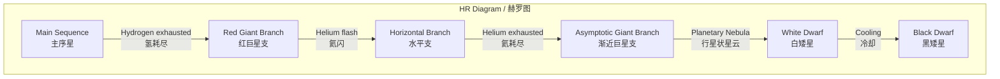
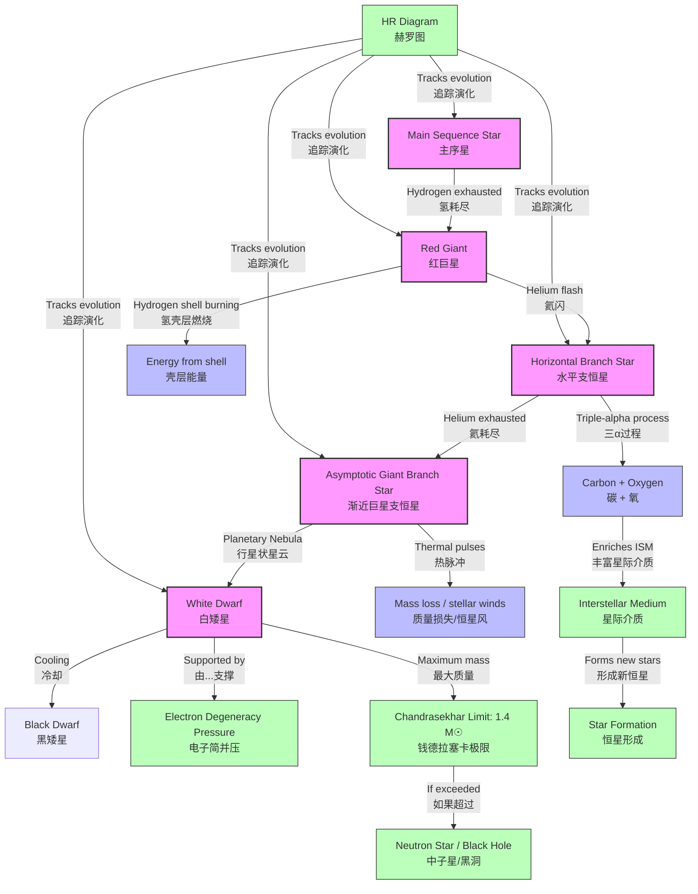

# Evolution of Low-Mass Stars (Sun-like → Red Giant → White Dwarf)
# 低质量恒星的演化（类太阳恒星 → 红巨星 → 白矮星）

---

# 1. Overview / 概述

**English:**
This sub-topic traces the complete life cycle of low-mass stars (0.5–8 solar masses, $M_\odot$), using our Sun as the archetypal example. After spending ~10 billion years on the [[Main Sequence Lifetime|main sequence]], a Sun-like star exhausts its core hydrogen and undergoes dramatic transformations: it swells into a [[Red Giant Star|red giant]], sheds its outer layers as a [[Planetary Nebula|planetary nebula]], and leaves behind a dense, Earth-sized remnant called a [[White Dwarf|white dwarf]]. Understanding this evolution is crucial because it explains the fate of most stars in the universe (over 97% of all stars end as white dwarfs), and it connects directly to [[Nucleosynthesis in Stars|nucleosynthesis]] — the production of elements like carbon and oxygen that form the building blocks of life. This sub-topic builds on the [[The Hertzsprung-Russell Diagram|Hertzsprung-Russell (HR) diagram]] and is a key component of the broader [[Stellar Evolution]] narrative.

**中文:**
本子知识点追踪低质量恒星（0.5–8倍太阳质量，$M_\odot$）的完整生命周期，以我们的太阳为典型例子。在[[Main Sequence Lifetime|主序星]]阶段度过约100亿年后，类太阳恒星耗尽核心氢，经历剧烈转变：膨胀为[[Red Giant Star|红巨星]]，以[[Planetary Nebula|行星状星云]]形式抛射外层，留下一个致密的、地球大小的残骸——[[White Dwarf|白矮星]]。理解这一演化至关重要，因为它解释了宇宙中大多数恒星的命运（超过97%的恒星以白矮星终结），并直接联系到[[Nucleosynthesis in Stars|核合成]]——产生构成生命基础的碳和氧等元素。本子知识点建立在[[The Hertzsprung-Russell Diagram|赫罗图]]之上，是更广泛的[[Stellar Evolution]]故事的关键组成部分。

---

# 2. Syllabus Learning Objectives / 考纲学习目标

| CAIE 9702 | Edexcel IAL |
|-----------|-------------|
| 25.4(a) Describe the evolution of a star like the Sun from main sequence to white dwarf | WPH14 U4: 10.19 Describe the evolution of a low-mass star (Sun-like) from main sequence to white dwarf |
| 25.4(b) Explain the formation of a red giant when hydrogen burning ceases in the core | WPH14 U4: 10.20 Explain the formation of a red giant due to hydrogen shell burning |
| 25.4(c) Describe helium flash and helium burning in the core | WPH14 U4: 10.21 Describe helium burning and the formation of carbon/oxygen core |
| 25.4(d) Explain the formation of a planetary nebula | WPH14 U4: 10.22 Explain the ejection of outer layers as a planetary nebula |
| 25.4(e) Describe the properties of a white dwarf | WPH14 U4: 10.23 Describe white dwarf properties (high density, electron degeneracy pressure) |
| 25.4(f) State the Chandrasekhar limit (1.4 $M_\odot$) | WPH14 U4: 10.24 State and apply the Chandrasekhar limit |
| 25.4(g) Explain why white dwarfs cool and fade | WPH14 U4: 10.25 Explain the cooling of white dwarfs |
| 25.4(h) Interpret evolutionary tracks on an HR diagram | (Implicit in 10.19-10.25) |

**Examiner Expectations / 考官期望:**
- **CAIE:** Students must be able to sketch and label the evolutionary path of a Sun-like star on an [[The Hertzsprung-Russell Diagram|HR diagram]], including the red giant branch, helium flash, horizontal branch, asymptotic giant branch, and white dwarf cooling track.
- **Edexcel:** Students must explain the physical mechanisms driving each stage, particularly the role of [[Electron Degeneracy Pressure|electron degeneracy pressure]] in supporting white dwarfs and the significance of the [[Chandrasekhar Limit|Chandrasekhar limit]].

**中文:**
- **CAIE:** 学生必须能在[[The Hertzsprung-Russell Diagram|赫罗图]]上绘制并标注类太阳恒星的演化路径，包括红巨星支、氦闪、水平支、渐近巨星支和白矮星冷却轨迹。
- **Edexcel:** 学生必须解释驱动每个阶段的物理机制，特别是[[Electron Degeneracy Pressure|电子简并压]]在支撑白矮星中的作用以及[[Chandrasekhar Limit|钱德拉塞卡极限]]的意义。

---

# 3. Core Definitions / 核心定义

| Term (EN/CN) | Definition (EN) | Definition (CN) | Common Mistakes / 常见错误 |
|--------------|-----------------|-----------------|---------------------------|
| **Red Giant** / 红巨星 | A large, cool, luminous star with a low surface temperature (~3000–4000 K) and high luminosity, formed when hydrogen shell burning begins around an inert helium core. | 一种体积大、温度低、光度高的恒星，表面温度约3000–4000 K，当氢壳层燃烧在惰性氦核周围开始时形成。 | ❌ Confusing red giants with red supergiants (which are much more massive). |
| **Helium Flash** / 氦闪 | A rapid, explosive onset of helium fusion in a degenerate helium core at ~10⁸ K, occurring only in low-mass stars. | 在简并氦核中，温度达到约10⁸ K时发生的快速、爆炸性的氦聚变开始，仅发生在低质量恒星中。 | ❌ Thinking it's a gradual process — it's explosive due to degeneracy. |
| **Planetary Nebula** / 行星状星云 | An expanding shell of ionized gas ejected from a star during the asymptotic giant branch phase, illuminated by the exposed hot core. | 在渐近巨星支阶段从恒星抛射出的电离气体膨胀壳层，由暴露的热核心照亮。 | ❌ Thinking it's related to planets — it's a historical misnomer. |
| **White Dwarf** / 白矮星 | A dense, Earth-sized stellar remnant supported by electron degeneracy pressure, with mass up to the Chandrasekhar limit (1.4 $M_\odot$). | 一种致密的、地球大小的恒星残骸，由电子简并压支撑，质量上限为钱德拉塞卡极限（1.4 $M_\odot$）。 | ❌ Confusing with neutron stars (which are supported by neutron degeneracy pressure). |
| **Chandrasekhar Limit** / 钱德拉塞卡极限 | The maximum mass (1.4 $M_\odot$) that a white dwarf can have before electron degeneracy pressure is overcome by gravity, leading to collapse. | 白矮星在电子简并压被引力克服并导致坍缩之前所能拥有的最大质量（1.4 $M_\odot$）。 | ❌ Forgetting the value or confusing it with the Oppenheimer-Volkoff limit for neutron stars. |
| **Electron Degeneracy Pressure** / 电子简并压 | A quantum mechanical pressure arising from the Pauli exclusion principle, preventing electrons from occupying the same quantum state, which supports white dwarfs against gravitational collapse. | 一种由泡利不相容原理产生的量子力学压力，阻止电子占据相同量子态，从而支撑白矮星抵抗引力坍缩。 | ❌ Thinking it's thermal pressure — degeneracy pressure is independent of temperature. |

---

# 4. Key Concepts Explained / 关键概念详解

## 4.1 The Post-Main-Sequence Evolution / 主序星后演化

### Explanation / 解释
**English:**
After a Sun-like star spends ~10 billion years on the [[Main Sequence Lifetime|main sequence]] fusing hydrogen to helium in its core, the core hydrogen is depleted. The core becomes inert helium, and hydrogen fusion ceases in the core. Without energy generation, the core contracts under gravity, releasing gravitational potential energy that heats the core and the surrounding hydrogen shell. This triggers **hydrogen shell burning** — hydrogen fusion in a thin shell around the inert helium core. The increased energy output causes the star's outer layers to expand dramatically, cooling the surface to ~3000–4000 K while increasing the star's radius by a factor of ~100. The star becomes a [[Red Giant Star|red giant]], moving to the upper right of the [[The Hertzsprung-Russell Diagram|HR diagram]].

**中文:**
类太阳恒星在主序星阶段通过核心氢聚变为氦度过约100亿年后，核心氢耗尽。核心变为惰性氦，核心氢聚变停止。没有能量产生，核心在引力作用下收缩，释放引力势能，加热核心和周围的氢壳层。这触发了**氢壳层燃烧**——在惰性氦核周围的薄壳层中发生氢聚变。能量输出增加导致恒星外层急剧膨胀，表面冷却至约3000–4000 K，同时恒星半径增大约100倍。恒星变为[[Red Giant Star|红巨星]]，在[[The Hertzsprung-Russell Diagram|赫罗图]]上向右上方移动。

### Physical Meaning / 物理意义
**English:**
The transition from main sequence to red giant represents a fundamental shift in the star's energy source: from core hydrogen burning to shell hydrogen burning. The star's structure changes from a homogeneous core to a layered structure (inert helium core + hydrogen-burning shell + extended envelope). This is the first step in the star's death process.

**中文:**
从主序星到红巨星的转变代表了恒星能量来源的根本转变：从核心氢燃烧到壳层氢燃烧。恒星结构从均匀核心变为分层结构（惰性氦核 + 氢燃烧壳层 + 膨胀包层）。这是恒星死亡过程的第一步。

### Common Misconceptions / 常见误区
- ❌ **"The star runs out of fuel and dies immediately."** — No, shell burning provides a new energy source, making the star even more luminous.
- ❌ **"The star expands because it's getting hotter."** — Actually, the surface cools; expansion is due to increased energy output from shell burning.
- ❌ **"All stars become red giants."** — Only low- and intermediate-mass stars (0.5–8 $M_\odot$) do; high-mass stars become red supergiants.

### Exam Tips / 考试提示
- **CAIE:** Be prepared to sketch the evolutionary track on an HR diagram, labeling the red giant branch.
- **Edexcel:** Explain why the core contracts (gravity) and why the envelope expands (increased energy output from shell burning).

---

## 4.2 Helium Flash and Helium Burning / 氦闪与氦燃烧

### Explanation / 解释
**English:**
As the red giant's inert helium core contracts, it becomes **degenerate** — a quantum state where electron degeneracy pressure dominates over thermal pressure. The core temperature rises but pressure does not increase with temperature (degeneracy). When the core reaches ~10⁸ K, helium fusion (the triple-alpha process) ignites explosively because the degenerate core cannot expand to regulate the reaction rate. This is the **helium flash** — a brief (~seconds) but intense burst of energy. The flash lifts degeneracy, and the core expands, settling into stable **helium core burning** (helium → carbon + oxygen). The star moves to the **horizontal branch** on the HR diagram (lower luminosity, higher temperature).

**中文:**
随着红巨星惰性氦核收缩，它变得**简并**——一种电子简并压主导热压的量子态。核心温度升高，但压力不随温度升高而增加（简并）。当核心达到约10⁸ K时，氦聚变（三α过程）爆炸性点燃，因为简并核心无法膨胀来调节反应速率。这就是**氦闪**——短暂（约几秒）但强烈的能量爆发。氦闪解除简并，核心膨胀，进入稳定的**氦核心燃烧**（氦 → 碳 + 氧）。恒星在赫罗图上移动到**水平支**（光度较低，温度较高）。

### Physical Meaning / 物理意义
**English:**
The helium flash is a unique phenomenon in low-mass stars, caused by the degenerate state of the core. It demonstrates the importance of quantum mechanics in stellar evolution. The triple-alpha process produces carbon and oxygen, which are essential for life and are the building blocks of heavier elements.

**中文:**
氦闪是低质量恒星中的独特现象，由核心的简并态引起。它展示了量子力学在恒星演化中的重要性。三α过程产生碳和氧，这些元素对生命至关重要，是更重元素的构建块。

### Common Misconceptions / 常见误区
- ❌ **"The helium flash destroys the star."** — No, it's a brief event that restructures the core but doesn't destroy the star.
- ❌ **"Helium burning happens gradually."** — In low-mass stars, it starts explosively due to degeneracy.
- ❌ **"The star becomes a helium-burning main sequence star."** — No, helium burning is much shorter (~100 million years vs. ~10 billion years for hydrogen burning).

### Exam Tips / 考试提示
- **CAIE:** Explain why the helium flash occurs (degeneracy) and what it produces (carbon and oxygen).
- **Edexcel:** Describe the triple-alpha process: 3 $^4_2\text{He} \rightarrow ^{12}_6\text{C}$.

---

## 4.3 Asymptotic Giant Branch and Planetary Nebula / 渐近巨星支与行星状星云

### Explanation / 解释
**English:**
After helium core burning ends (core becomes inert carbon/oxygen), the star undergoes a second ascent on the HR diagram — the **asymptotic giant branch (AGB)** . Helium shell burning begins around the inert carbon/oxygen core, and hydrogen shell burning continues. The star becomes a **red supergiant-like** object (though much less massive than true supergiants). Intense thermal pulses (helium shell flashes) drive strong stellar winds, ejecting the outer layers. The ejected material forms a **planetary nebula** — an expanding shell of ionized gas illuminated by the exposed, hot carbon/oxygen core (now a **white dwarf progenitor**).

**中文:**
氦核心燃烧结束后（核心变为惰性碳/氧），恒星在赫罗图上第二次上升——**渐近巨星支（AGB）**。氦壳层燃烧在惰性碳/氧核周围开始，氢壳层燃烧继续。恒星变为类似**红超巨星**的天体（尽管质量远小于真正的超巨星）。强烈的热脉冲（氦壳层闪）驱动强恒星风，抛射外层。抛射的物质形成**行星状星云**——一个膨胀的电离气体壳层，由暴露的、炽热的碳/氧核心（现为**白矮星前身**）照亮。

### Physical Meaning / 物理意义
**English:**
The AGB phase is the final active phase of a low-mass star's life. The planetary nebula enriches the interstellar medium with carbon, oxygen, and other elements produced during helium burning. This is how the universe gets the raw materials for planets and life.

**中文:**
AGB阶段是低质量恒星生命的最后活跃阶段。行星状星云用氦燃烧产生的碳、氧和其他元素丰富星际介质。这就是宇宙获得行星和生命原材料的方式。

### Common Misconceptions / 常见误区
- ❌ **"Planetary nebulae are the remains of planets."** — No, they are ejected stellar envelopes; the name is historical.
- ❌ **"The planetary nebula is the star's final state."** — No, the nebula disperses, leaving the white dwarf.
- ❌ **"All stars produce planetary nebulae."** — Only low- and intermediate-mass stars do; high-mass stars explode as supernovae.

### Exam Tips / 考试提示
- **CAIE:** Describe the formation of a planetary nebula and its role in enriching the interstellar medium.
- **Edexcel:** Explain why the AGB phase is unstable (thermal pulses) and how it leads to mass loss.

> 📷 **IMAGE PROMPT — EVO-01: Red Giant and Planetary Nebula Formation**
> A detailed, scientifically accurate illustration showing the evolution of a Sun-like star from red giant to planetary nebula. Left panel: a large, orange-red red giant star with a visible helium core and hydrogen-burning shell. Middle panel: the star on the asymptotic giant branch, showing thermal pulses and stellar winds ejecting outer layers. Right panel: a colorful planetary nebula (ring-like or bipolar shape) with a small, bright white dwarf at its center. Labels: "Red Giant," "AGB Star," "Planetary Nebula," "White Dwarf." Background: deep space with faint stars.

---

## 4.4 White Dwarf Properties and Cooling / 白矮星性质与冷却

### Explanation / 解释
**English:**
The exposed core left after the planetary nebula disperses is a **white dwarf** — an Earth-sized object (~10,000 km diameter) with mass comparable to the Sun (0.5–1.4 $M_\odot$). Its density is enormous (~10⁹ kg/m³). White dwarfs are supported by **electron degeneracy pressure**, not thermal pressure. They have no internal energy source (no fusion), so they slowly cool and fade over billions of years, becoming **black dwarfs** (hypothetical, as the universe is too young for any to exist). The maximum mass of a white dwarf is the **Chandrasekhar limit** (1.4 $M_\odot$); beyond this, electron degeneracy pressure cannot support the star, and it collapses into a neutron star or black hole.

**中文:**
行星状星云消散后留下的暴露核心是**白矮星**——一个地球大小的天体（直径约10,000公里），质量与太阳相当（0.5–1.4 $M_\odot$）。其密度极大（约10⁹ kg/m³）。白矮星由**电子简并压**支撑，而非热压。它们没有内部能源（无聚变），因此在数十亿年间缓慢冷却和变暗，成为**黑矮星**（假设性的，因为宇宙太年轻，尚无任何黑矮星存在）。白矮星的最大质量是**钱德拉塞卡极限**（1.4 $M_\odot$）；超过此极限，电子简并压无法支撑恒星，它将坍缩为中子星或黑洞。

### Physical Meaning / 物理意义
**English:**
White dwarfs are the final state of most stars. Their existence demonstrates the power of quantum mechanics (Pauli exclusion principle) on astronomical scales. The Chandrasekhar limit is a fundamental constraint in astrophysics, determining the fate of stellar remnants.

**中文:**
白矮星是大多数恒星的最终状态。它们的存在展示了量子力学（泡利不相容原理）在天文尺度上的力量。钱德拉塞卡极限是天体物理学中的一个基本约束，决定了恒星残骸的命运。

### Common Misconceptions / 常见误区
- ❌ **"White dwarfs are hot because they're still fusing."** — No, they are hot from residual heat, but no fusion occurs.
- ❌ **"White dwarfs are the same as neutron stars."** — No, white dwarfs are supported by electron degeneracy; neutron stars by neutron degeneracy.
- ❌ **"All white dwarfs have the same mass."** — No, mass varies from ~0.5 to 1.4 $M_\odot$.

### Exam Tips / 考试提示
- **CAIE:** State the Chandrasekhar limit (1.4 $M_\odot$) and explain why white dwarfs cool.
- **Edexcel:** Explain electron degeneracy pressure and why it is independent of temperature.

> 📷 **IMAGE PROMPT — EVO-02: White Dwarf Structure and Cooling**
> A cross-section diagram of a white dwarf. Outer layer: a thin atmosphere of hydrogen/helium. Interior: a degenerate carbon/oxygen core. Labels: "Electron Degeneracy Pressure," "Carbon/Oxygen Core," "Thin Atmosphere." Next to it, a graph showing luminosity vs. time for a cooling white dwarf, with a curve decreasing exponentially. Caption: "White dwarfs cool and fade over billions of years."

---

# 5. Essential Equations / 核心公式

## 5.1 Triple-Alpha Process / 三α过程

$$ 3\,^4_2\text{He} \rightarrow ^{12}_6\text{C} + \gamma $$

| Symbol (符号) | Meaning (EN) | Meaning (CN) | Unit (单位) |
|--------------|-------------|-------------|------------|
| $^4_2\text{He}$ | Alpha particle (helium nucleus) | α粒子（氦核） | — |
| $^{12}_6\text{C}$ | Carbon-12 nucleus | 碳-12核 | — |
| $\gamma$ | Gamma-ray photon | γ射线光子 | — |

**Conditions / 适用条件:**
- **EN:** Requires temperature ~10⁸ K and high density. Occurs in degenerate helium core during helium flash.
- **CN:** 需要温度约10⁸ K和高密度。在氦闪期间发生在简并氦核中。

**Limitations / 局限性:**
- **EN:** Only produces carbon; further helium capture can produce oxygen ($^{12}_6\text{C} + ^4_2\text{He} \rightarrow ^{16}_8\text{O}$).
- **CN:** 仅产生碳；进一步的氦捕获可产生氧（$^{12}_6\text{C} + ^4_2\text{He} \rightarrow ^{16}_8\text{O}$）。

---

## 5.2 Chandrasekhar Limit / 钱德拉塞卡极限

$$ M_{\text{Ch}} \approx 1.4 \, M_\odot $$

| Symbol (符号) | Meaning (EN) | Meaning (CN) | Unit (单位) |
|--------------|-------------|-------------|------------|
| $M_{\text{Ch}}$ | Chandrasekhar mass | 钱德拉塞卡质量 | kg or $M_\odot$ |
| $M_\odot$ | Solar mass (1.99 × 10³⁰ kg) | 太阳质量 | kg |

**Derivation / 推导:**
- **EN:** Derived from equating electron degeneracy pressure with gravitational pressure. The exact value depends on composition but is approximately 1.4 $M_\odot$.
- **CN:** 通过将电子简并压与引力压相等推导得出。精确值取决于成分，但约为1.4 $M_\odot$。

**Conditions / 适用条件:**
- **EN:** Applies to white dwarfs. If $M > M_{\text{Ch}}$, the white dwarf collapses.
- **CN:** 适用于白矮星。如果 $M > M_{\text{Ch}}$，白矮星坍缩。

**Limitations / 局限性:**
- **EN:** Assumes non-rotating, non-magnetic white dwarf. Rotation can slightly increase the limit.
- **CN:** 假设非旋转、非磁化的白矮星。旋转可略微增加极限。

---

## 5.3 White Dwarf Density / 白矮星密度

$$ \rho = \frac{M}{\frac{4}{3}\pi R^3} \approx 10^9 \, \text{kg/m}^3 $$

| Symbol (符号) | Meaning (EN) | Meaning (CN) | Unit (单位) |
|--------------|-------------|-------------|------------|
| $\rho$ | Density | 密度 | kg/m³ |
| $M$ | Mass (~0.6 $M_\odot$ for typical white dwarf) | 质量（典型白矮星约0.6 $M_\odot$） | kg |
| $R$ | Radius (~Earth's radius, 6.4 × 10⁶ m) | 半径（约地球半径） | m |

**Conditions / 适用条件:**
- **EN:** Typical values; density increases with mass (inverse radius-mass relation).
- **CN:** 典型值；密度随质量增加（半径-质量反比关系）。

**Limitations / 局限性:**
- **EN:** Assumes uniform density; actual density is higher in the core.
- **CN:** 假设均匀密度；实际核心密度更高。

---

# 6. Graphs and Relationships / 图表与关系

## 6.1 HR Diagram Evolutionary Track for a Sun-like Star / 类太阳恒星的赫罗图演化轨迹

### Axes / 坐标轴
- **X-axis:** Surface Temperature / 表面温度 (K, decreasing to the right)
- **Y-axis:** Luminosity / 光度 ($L_\odot$, increasing upward)

### Shape / 形状
**English:**
The evolutionary track starts on the main sequence (point A), moves upward and rightward to the red giant branch (B), then to the horizontal branch (C, after helium flash), then upward again on the asymptotic giant branch (D), and finally moves downward and leftward as the white dwarf cools (E).

**中文:**
演化轨迹从主序星（点A）开始，向右上方移动到红巨星支（B），然后到水平支（C，氦闪后），再在渐近巨星支（D）上向上移动，最后在白矮星冷却时向左下方移动（E）。

### Gradient Meaning / 斜率含义
**English:**
The slope of the track indicates the rate of change of luminosity with temperature. Steep upward sections (red giant branch) indicate rapid luminosity increase with little temperature change.

**中文:**
轨迹斜率表示光度随温度变化的速率。陡峭上升段（红巨星支）表示光度快速增加而温度变化很小。

### Area Meaning / 面积含义
**English:**
The area under the track is not physically meaningful; the track shows the star's path through the HR diagram over time.

**中文:**
轨迹下的面积没有物理意义；轨迹显示恒星随时间在赫罗图上的路径。

### Exam Interpretation / 考试解读
- **EN:** Be able to sketch and label the track, identifying key stages: main sequence, red giant branch, helium flash, horizontal branch, asymptotic giant branch, planetary nebula ejection, white dwarf cooling track.
- **CN:** 能够绘制并标注轨迹，识别关键阶段：主序星、红巨星支、氦闪、水平支、渐近巨星支、行星状星云抛射、白矮星冷却轨迹。

> 📷 **IMAGE PROMPT — EVO-03: HR Diagram Evolutionary Track**
> A Hertzsprung-Russell diagram with a clear evolutionary track for a Sun-like star. The main sequence is shown as a diagonal band. The track starts on the main sequence, curves upward and rightward (red giant branch), then leftward (horizontal branch), then upward again (asymptotic giant branch), and finally downward and leftward (white dwarf cooling track). Key points labeled: A (main sequence), B (red giant), C (helium flash), D (AGB), E (planetary nebula), F (white dwarf). Axes labeled: "Temperature (K)" and "Luminosity ($L_\odot$)."

---

# 7. Required Diagrams / 必备图表

## 7.1 Internal Structure of a Red Giant / 红巨星的内部结构

### Description / 描述
**English:**
A cross-section diagram showing the layered structure of a red giant: an inert helium core at the center, surrounded by a hydrogen-burning shell, and a vast, cool, convective envelope extending to the surface.

**中文:**
显示红巨星分层结构的截面图：中心为惰性氦核，周围是氢燃烧壳层，以及延伸到表面的巨大、冷却的对流包层。

### Image Prompt / 图片生成提示
> 📷 **IMAGE PROMPT — EVO-04: Red Giant Internal Structure**
> A cross-section diagram of a red giant star. Center: a small, dense, inert helium core (labeled "Helium Core / 氦核"). Surrounding the core: a thin, bright shell (labeled "Hydrogen-Burning Shell / 氢燃烧壳层"). Outside the shell: a thick, convective envelope (labeled "Convective Envelope / 对流包层") extending to the surface. The envelope is shown with arrows indicating convective motion. The star's surface is cool and red. Labels in English and Chinese.

### Labels Required / 需要标注
- **EN:** Helium Core, Hydrogen-Burning Shell, Convective Envelope, Surface
- **CN:** 氦核, 氢燃烧壳层, 对流包层, 表面

### Exam Importance / 考试重要性
- **EN:** Essential for explaining why the star expands (energy from shell burning) and why the core contracts (no fusion).
- **CN:** 对于解释恒星为何膨胀（壳层燃烧的能量）以及核心为何收缩（无聚变）至关重要。

---

## 7.2 White Dwarf Mass-Radius Relation / 白矮星质量-半径关系

### Description / 描述
**English:**
A graph showing that as white dwarf mass increases, its radius decreases. This is a consequence of electron degeneracy pressure: more massive white dwarfs are more compact.

**中文:**
显示白矮星质量增加时半径减小的图表。这是电子简并压的结果：质量更大的白矮星更致密。

### Image Prompt / 图片生成提示
> 📷 **IMAGE PROMPT — EVO-05: White Dwarf Mass-Radius Relation**
> A graph with mass ($M_\odot$) on the x-axis and radius (Earth radii) on the y-axis. A downward-sloping curve shows the inverse relationship. A vertical dashed line at 1.4 $M_\odot$ is labeled "Chandrasekhar Limit / 钱德拉塞卡极限." The curve ends at this limit. Labels: "Mass ($M_\odot$)" and "Radius ($R_\oplus$)."

### Labels Required / 需要标注
- **EN:** Mass ($M_\odot$), Radius ($R_\oplus$), Chandrasekhar Limit (1.4 $M_\odot$)
- **CN:** 质量 ($M_\odot$), 半径 ($R_\oplus$), 钱德拉塞卡极限 (1.4 $M_\odot$)

### Exam Importance / 考试重要性
- **EN:** Demonstrates the unique properties of degenerate matter and the existence of a maximum mass.
- **CN:** 展示简并物质的独特性质以及最大质量的存在。

---

# 8. Worked Examples / 典型例题

## Example 1: White Dwarf Density Calculation / 白矮星密度计算

### Question / 题目
**English:**
A typical white dwarf has a mass of 0.6 $M_\odot$ and a radius of 0.01 $R_\odot$. Calculate its density. (Given: $M_\odot = 1.99 \times 10^{30}$ kg, $R_\odot = 6.96 \times 10^8$ m)

**中文:**
一个典型白矮星的质量为0.6 $M_\odot$，半径为0.01 $R_\odot$。计算其密度。（已知：$M_\odot = 1.99 \times 10^{30}$ kg, $R_\odot = 6.96 \times 10^8$ m）

### Solution / 解答

**Step 1: Convert to SI units / 转换为国际单位制**
$$ M = 0.6 \times 1.99 \times 10^{30} = 1.194 \times 10^{30} \text{ kg} $$
$$ R = 0.01 \times 6.96 \times 10^8 = 6.96 \times 10^6 \text{ m} $$

**Step 2: Calculate volume / 计算体积**
$$ V = \frac{4}{3}\pi R^3 = \frac{4}{3}\pi (6.96 \times 10^6)^3 = 1.41 \times 10^{21} \text{ m}^3 $$

**Step 3: Calculate density / 计算密度**
$$ \rho = \frac{M}{V} = \frac{1.194 \times 10^{30}}{1.41 \times 10^{21}} = 8.47 \times 10^8 \text{ kg/m}^3 $$

### Final Answer / 最终答案
**Answer:** $\rho \approx 8.5 \times 10^8$ kg/m³ | **答案：** $\rho \approx 8.5 \times 10^8$ kg/m³

### Quick Tip / 提示
- **EN:** Remember that white dwarf density is ~10⁹ kg/m³ — a sugar-cube-sized piece would weigh ~1 ton on Earth!
- **CN:** 记住白矮星密度约为10⁹ kg/m³——一块方糖大小的白矮星物质在地球上重约1吨！

---

## Example 2: Chandrasekhar Limit Application / 钱德拉塞卡极限应用

### Question / 题目
**English:**
A white dwarf is observed to have a mass of 1.5 $M_\odot$. Explain why this is impossible and state what would happen to such an object.

**中文:**
观测到一个白矮星的质量为1.5 $M_\odot$。解释为什么这是不可能的，并说明这样的天体将会发生什么。

### Solution / 解答

**Step 1: State the Chandrasekhar limit / 陈述钱德拉塞卡极限**
The Chandrasekhar limit is 1.4 $M_\odot$. This is the maximum mass that can be supported by electron degeneracy pressure.

**Step 2: Compare with observed mass / 与观测质量比较**
1.5 $M_\odot$ > 1.4 $M_\odot$, so the object exceeds the limit.

**Step 3: Explain the consequence / 解释后果**
Electron degeneracy pressure cannot support the star against gravity. The white dwarf would collapse, leading to either a neutron star (if the core reaches neutron degeneracy pressure) or a black hole (if the mass is too large for neutron degeneracy pressure).

### Final Answer / 最终答案
**Answer:** Impossible because 1.5 $M_\odot$ > 1.4 $M_\odot$ (Chandrasekhar limit). The object would collapse into a neutron star or black hole. | **答案：** 不可能，因为1.5 $M_\odot$ > 1.4 $M_\odot$（钱德拉塞卡极限）。该天体会坍缩为中子星或黑洞。

### Quick Tip / 提示
- **EN:** Always quote the Chandrasekhar limit as 1.4 $M_\odot$ and explain that it's the maximum mass for a white dwarf.
- **CN:** 始终引用钱德拉塞卡极限为1.4 $M_\odot$，并解释这是白矮星的最大质量。

---

# 9. Past Paper Question Types / 历年真题题型

| Question Type / 题型 | Frequency / 频率 | Difficulty / 难度 | Past Paper References / 真题索引 |
|----------------------|------------------|------------------|-------------------------------|
| HR diagram evolutionary track sketching and labeling | ★★★★★ | Medium | 📝 *待填入* |
| Explanation of red giant formation (hydrogen shell burning) | ★★★★ | Medium | 📝 *待填入* |
| Helium flash explanation and triple-alpha process | ★★★★ | Hard | 📝 *待填入* |
| White dwarf properties (density, degeneracy pressure) | ★★★★ | Medium | 📝 *待填入* |
| Chandrasekhar limit calculation and application | ★★★ | Hard | 📝 *待填入* |
| Planetary nebula formation and role in enrichment | ★★★ | Medium | 📝 *待填入* |
| Comparison of low-mass vs. high-mass star evolution | ★★★ | Hard | 📝 *待填入* |

**Common Command Words / 常见指令词:**
- **EN:** Describe, Explain, Sketch, Label, Calculate, State, Compare
- **CN:** 描述, 解释, 绘制, 标注, 计算, 陈述, 比较

---

# 10. Practical Skills Connections / 实验技能链接

**English:**
While direct observation of stellar evolution is impossible on human timescales, this sub-topic connects to practical skills in several ways:

1. **Data Analysis from HR Diagrams:** Students analyze real data from star clusters (e.g., globular clusters) to determine stellar ages and evolutionary stages. This involves plotting luminosity vs. temperature and identifying turn-off points.

2. **Spectroscopy:** Analyzing the spectra of red giants, planetary nebulae, and white dwarfs reveals their composition (e.g., carbon and oxygen lines in white dwarfs) and temperature (Wien's displacement law).

3. **Uncertainties in Astronomical Measurements:** Parallax measurements for distance, photometry for luminosity, and spectroscopy for temperature all involve significant uncertainties. Students should be able to propagate these uncertainties.

4. **Graph Plotting:** Plotting the white dwarf mass-radius relation from theoretical data demonstrates the inverse relationship and the Chandrasekhar limit.

5. **Experimental Design:** Designing a method to determine the age of a star cluster using the HR diagram turn-off point.

**中文:**
虽然无法在人类时间尺度上直接观测恒星演化，但本子知识点通过以下方式与实验技能联系：

1. **赫罗图数据分析：** 学生分析真实星团（如球状星团）数据，确定恒星年龄和演化阶段。这涉及绘制光度与温度的关系图并识别转折点。

2. **光谱学：** 分析红巨星、行星状星云和白矮星的光谱揭示其成分（如白矮星中的碳和氧谱线）和温度（维恩位移定律）。

3. **天文测量中的不确定度：** 视差测量距离、测光测量光度、光谱测量温度都涉及显著的不确定度。学生应能传播这些不确定度。

4. **图表绘制：** 从理论数据绘制白矮星质量-半径关系图，展示反比关系和钱德拉塞卡极限。

5. **实验设计：** 设计一种使用赫罗图转折点确定星团年龄的方法。

---

# 11. Concept Map / 概念图谱

---

# 12. Quick Revision Sheet / 速查表

| Category / 类别 | Key Points / 要点 |
|----------------|------------------|
| **Definition / 定义** | Low-mass stars (0.5–8 $M_\odot$) evolve: Main Sequence → Red Giant → Horizontal Branch → AGB → Planetary Nebula → White Dwarf |
| **Key Formula / 核心公式** | Triple-alpha: $3\,^4_2\text{He} \rightarrow ^{12}_6\text{C}$; Chandrasekhar limit: $M_{\text{Ch}} = 1.4\,M_\odot$; Density: $\rho = M/(\frac{4}{3}\pi R^3) \approx 10^9$ kg/m³ |
| **Key Graph / 核心图表** | HR diagram evolutionary track: main sequence → red giant branch → horizontal branch → AGB → white dwarf cooling track |
| **Key Concept 1 / 核心概念1** | **Red Giant Formation:** Hydrogen shell burning around inert helium core causes envelope expansion and surface cooling |
| **Key Concept 2 / 核心概念2** | **Helium Flash:** Explosive ignition of helium in degenerate core due to triple-alpha process at ~10⁸ K |
| **Key Concept 3 / 核心概念3** | **White Dwarf:** Earth-sized remnant supported by electron degeneracy pressure; maximum mass 1.4 $M_\odot$ (Chandrasekhar limit) |
| **Key Concept 4 / 核心概念4** | **Planetary Nebula:** Ejected outer layers of AGB star, enriched with carbon and oxygen, illuminated by hot core |
| **Common Mistake / 常见错误** | Confusing white dwarfs with neutron stars; forgetting that degeneracy pressure is temperature-independent |
| **Exam Tip / 考试提示** | Always sketch the HR diagram track; quote the Chandrasekhar limit as 1.4 $M_\odot$; explain why helium flash occurs (degeneracy) |
| **Prerequisite / 前置知识** | [[The Hertzsprung-Russell Diagram]], [[Main Sequence Lifetime]], [[Electron Degeneracy Pressure]] |
| **Next Topic / 后续主题** | [[Evolution of High-Mass Stars → Supernova → Neutron Star / Black Hole]], [[Nucleosynthesis in Stars]] |

---

> 📋 **CIE Only:** CAIE 9702 specifically requires students to describe the helium flash and its consequences (lifting degeneracy, enabling stable helium burning). The term "asymptotic giant branch" is not explicitly required but is useful for understanding.

> 📋 **Edexcel Only:** Edexcel IAL WPH14 U4 emphasizes the role of electron degeneracy pressure in white dwarfs and the Chandrasekhar limit. Students should be able to calculate white dwarf density and explain the mass-radius relation.

---

*This leaf node is part of the [[Stellar Evolution]] knowledge graph. For a broader context, see the parent hub [[Stellar Evolution]] and related sub-topics [[Star Formation (Nebulae and Protostars)]], [[Main Sequence Lifetime]], [[Evolution of High-Mass Stars → Supernova → Neutron Star / Black Hole]], and [[Nucleosynthesis in Stars]].*