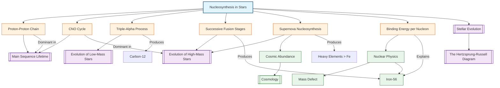

# 1. Overview / 概述

**English:**
Nucleosynthesis is the process by which new atomic nuclei are created from pre-existing nucleons (protons and neutrons) within stars. This sub-topic explores the two primary pathways of stellar nucleosynthesis: **hydrogen burning** (proton-proton chain and CNO cycle) which powers main sequence stars, and **helium burning** (triple-alpha process) which occurs in red giants. Beyond these, we examine the synthesis of heavier elements up to iron via successive fusion reactions in massive stars, and the explosive nucleosynthesis of elements heavier than iron during supernovae. Understanding nucleosynthesis is fundamental to explaining the cosmic abundance of elements — why the universe is composed of roughly 75% hydrogen, 25% helium, and trace amounts of heavier elements. This sub-topic connects directly to [[Stellar Evolution]] by explaining the energy generation mechanisms that drive stellar lifetimes and the chemical enrichment of the universe.

**中文:**
核合成是在恒星内部由已有的核子（质子和中子）创造新原子核的过程。本子知识点探讨恒星核合成的两条主要途径：**氢燃烧**（质子-质子链和CNO循环）为主序星提供能量，以及**氦燃烧**（三α过程）发生在红巨星中。除此之外，我们研究通过大质量恒星中的连续聚变反应合成直至铁的重元素，以及在超新星爆发期间通过爆炸核合成产生比铁更重的元素。理解核合成对于解释宇宙元素的丰度至关重要——为什么宇宙由大约75%的氢、25%的氦和微量重元素组成。本子知识点通过解释驱动恒星寿命的能量产生机制和宇宙的化学富集过程，直接连接到[[Stellar Evolution]]。

---

# 2. Syllabus Learning Objectives / 考纲学习目标

| CAIE 9702 | Edexcel IAL |
|-----------|-------------|
| 25.4(a) Describe the principal stages of nucleosynthesis in stars | 10.19 Understand that nucleosynthesis involves the fusion of nuclei to form heavier nuclei |
| 25.4(b) Explain the proton-proton chain and CNO cycle | 10.20 Understand the proton-proton chain and CNO cycle as energy sources in main sequence stars |
| 25.4(c) Describe the triple-alpha process for helium burning | 10.21 Understand the triple-alpha process for helium burning in red giants |
| 25.4(d) Explain the synthesis of elements up to iron in massive stars | 10.22 Understand that elements up to iron are produced by successive fusion reactions in massive stars |
| 25.4(e) Describe the role of supernovae in producing elements heavier than iron | 10.23 Understand that elements heavier than iron are produced during supernovae |
| 25.4(f) Explain the concept of binding energy per nucleon in nucleosynthesis | 10.24 Understand the relationship between binding energy per nucleon and nucleosynthesis |
| 25.4(g) Describe the cosmic abundance of elements | 10.25 Understand the cosmic abundance of elements and its relation to nucleosynthesis |
| 25.4(h) Explain why iron is the endpoint of fusion in stellar cores | (Covered in 10.22 and 10.24) |

**Examiner Expectations / 考官期望:**
- **CAIE:** Students must be able to write balanced nuclear equations for the proton-proton chain, CNO cycle, and triple-alpha process. They should understand that fusion reactions are exothermic only up to iron-56, and that elements beyond iron require supernova energy.
- **Edexcel:** Students should be able to explain the temperature and density conditions required for each fusion stage, and understand the role of the [[Hertzsprung-Russell Diagram]] in locating stars at different nucleosynthesis stages.

---

# 3. Core Definitions / 核心定义

| Term (EN/CN) | Definition (EN) | Definition (CN) | Common Mistakes / 常见错误 |
|--------------|-----------------|-----------------|---------------------------|
| **Nucleosynthesis** / 核合成 | The process by which new atomic nuclei are created from pre-existing nucleons within stars | 在恒星内部由已有的核子创造新原子核的过程 | Confusing with chemical synthesis; nucleosynthesis involves nuclear, not chemical, reactions |
| **Proton-Proton Chain** / 质子-质子链 | A series of fusion reactions that convert hydrogen into helium, releasing energy, dominant in Sun-like stars | 一系列将氢转化为氦的聚变反应，释放能量，在类太阳恒星中占主导地位 | Thinking it produces energy directly; actually net reaction is 4H → He + energy |
| **CNO Cycle** / CNO循环 | A catalytic fusion cycle using carbon, nitrogen, and oxygen as catalysts to convert hydrogen into helium, dominant in massive stars | 使用碳、氮、氧作为催化剂将氢转化为氦的催化聚变循环，在大质量恒星中占主导地位 | Forgetting that C, N, O are catalysts and are not consumed |
| **Triple-Alpha Process** / 三α过程 | The fusion of three helium-4 nuclei (alpha particles) to form carbon-12, occurring in red giant stars | 三个氦-4核（α粒子）聚变形成碳-12的过程，发生在红巨星中 | Thinking it's a direct 3→1 reaction; it proceeds via beryllium-8 intermediate |
| **Binding Energy per Nucleon** / 每核子结合能 | The energy required to remove a nucleon from a nucleus, divided by the number of nucleons; determines nuclear stability | 从原子核中移除一个核子所需的能量除以核子数；决定核稳定性 | Confusing with total binding energy; per nucleon value determines fusion/fission feasibility |
| **Iron Peak** / 铁峰 | The maximum in the binding energy per nucleon curve at iron-56, beyond which fusion becomes endothermic | 每核子结合能曲线在铁-56处的最大值，超过此点聚变变为吸热 | Thinking iron is the heaviest element; it's the endpoint of fusion, not the heaviest |

---

# 4. Key Concepts Explained / 关键概念详解

## 4.1 The Proton-Proton Chain / 质子-质子链

### Explanation / 解释
**English:** The proton-proton (p-p) chain is the dominant fusion mechanism in stars with masses less than about 1.5 solar masses (like our Sun). It proceeds in three steps:
1. Two protons fuse to form deuterium ($^2_1H$), releasing a positron ($e^+$) and an electron neutrino ($\nu_e$): $$^1_1H + ^1_1H \rightarrow ^2_1H + e^+ + \nu_e$$
2. Deuterium fuses with another proton to form helium-3: $$^2_1H + ^1_1H \rightarrow ^3_2He + \gamma$$
3. Two helium-3 nuclei fuse to form helium-4, releasing two protons: $$^3_2He + ^3_2He \rightarrow ^4_2He + ^1_1H + ^1_1H$$

The net reaction is: $$4^1_1H \rightarrow ^4_2He + 2e^+ + 2\nu_e + 26.73 \text{ MeV}$$

**中文:** 质子-质子链是质量小于约1.5太阳质量恒星（如我们的太阳）中的主要聚变机制。它分三步进行：
1. 两个质子聚变形成氘，释放一个正电子和一个电子中微子
2. 氘与另一个质子聚变形成氦-3
3. 两个氦-3核聚变形成氦-4，释放两个质子

净反应为：4个质子 → 1个氦-4 + 2个正电子 + 2个中微子 + 26.73 MeV

### Physical Meaning / 物理意义
**English:** The p-p chain converts mass into energy according to $E=mc^2$. The mass of four protons is greater than the mass of one helium-4 nucleus; the mass difference (0.7% of original mass) is released as energy. This energy maintains the star's internal pressure against gravitational collapse and powers its luminosity. The neutrinos produced escape directly from the core, providing direct evidence of ongoing fusion.

**中文:** 质子-质子链根据$E=mc^2$将质量转化为能量。四个质子的质量大于一个氦-4核的质量；质量差（原始质量的0.7%）以能量形式释放。这些能量维持恒星内部压力以抵抗引力坍缩，并为其光度提供动力。产生的中微子直接从核心逃逸，提供了正在进行聚变的直接证据。

### Common Misconceptions / 常见误区
- **Mistake:** Thinking the p-p chain produces energy directly from proton-proton collisions.
  **Correction:** The energy comes from the mass defect — the mass of the products is less than the mass of the reactants.
- **Mistake:** Believing the p-p chain is the only fusion process in all stars.
  **Correction:** The CNO cycle dominates in more massive stars; the p-p chain is dominant in Sun-like stars.
- **Mistake:** Forgetting that neutrinos carry away energy and are not available for heating the star.
  **Correction:** Neutrinos escape the star, carrying about 2% of the energy released.

### Exam Tips / 考试提示
- **CAIE:** Be prepared to write and balance the three steps of the p-p chain. Remember that positrons ($e^+$) and neutrinos ($\nu_e$) are emitted.
- **Edexcel:** Understand that the p-p chain requires temperatures of about $10^7$ K to overcome the Coulomb barrier between protons.

> 📷 **IMAGE PROMPT — PP01: Proton-Proton Chain Diagram**
> A clear, step-by-step diagram showing the three stages of the proton-proton chain. Stage 1: two protons (p) collide, producing deuterium (²H), a positron (e⁺), and a neutrino (νₑ). Stage 2: deuterium collides with another proton, producing helium-3 (³He) and a gamma ray (γ). Stage 3: two helium-3 nuclei collide, producing helium-4 (⁴He) and two protons. Use color coding: protons in red, deuterium in blue, helium-3 in green, helium-4 in yellow. Include energy release values at each step. Suitable for A-Level physics textbook.

## 4.2 The CNO Cycle / CNO循环

### Explanation / 解释
**English:** The CNO (Carbon-Nitrogen-Oxygen) cycle is a catalytic fusion process that dominates in stars with masses greater than about 1.5 solar masses. It uses carbon-12 as a catalyst to convert hydrogen into helium. The cycle has six steps:
1. $^{12}_6C + ^1_1H \rightarrow ^{13}_7N + \gamma$
2. $^{13}_7N \rightarrow ^{13}_6C + e^+ + \nu_e$ (beta-plus decay)
3. $^{13}_6C + ^1_1H \rightarrow ^{14}_7N + \gamma$
4. $^{14}_7N + ^1_1H \rightarrow ^{15}_8O + \gamma$
5. $^{15}_8O \rightarrow ^{15}_7N + e^+ + \nu_e$ (beta-plus decay)
6. $^{15}_7N + ^1_1H \rightarrow ^{12}_6C + ^4_2He$

The net reaction is identical to the p-p chain: $$4^1_1H \rightarrow ^4_2He + 2e^+ + 2\nu_e + 26.73 \text{ MeV}$$

The carbon-12 is regenerated at the end, confirming its role as a catalyst.

**中文:** CNO（碳-氮-氧）循环是一种催化聚变过程，在质量大于约1.5太阳质量的恒星中占主导地位。它使用碳-12作为催化剂将氢转化为氦。该循环有六个步骤：
1. 碳-12 + 质子 → 氮-13 + γ
2. 氮-13 → 碳-13 + 正电子 + 中微子（β+衰变）
3. 碳-13 + 质子 → 氮-14 + γ
4. 氮-14 + 质子 → 氧-15 + γ
5. 氧-15 → 氮-15 + 正电子 + 中微子（β+衰变）
6. 氮-15 + 质子 → 碳-12 + 氦-4

净反应与质子-质子链相同：4个质子 → 1个氦-4 + 2个正电子 + 2个中微子 + 26.73 MeV

碳-12在循环结束时再生，确认了其作为催化剂的作用。

### Physical Meaning / 物理意义
**English:** The CNO cycle is more temperature-sensitive than the p-p chain. At temperatures above about $2 \times 10^7$ K, the CNO cycle becomes the dominant energy source because the higher Coulomb barrier of carbon requires higher temperatures to overcome. The cycle's temperature dependence ($\propto T^{17}$) is much steeper than the p-p chain ($\propto T^{4}$), meaning massive stars burn hydrogen much faster and have shorter main sequence lifetimes.

**中文:** CNO循环比质子-质子链对温度更敏感。在温度高于约$2 \times 10^7$ K时，CNO循环成为主要能量来源，因为碳的更高库仑势垒需要更高温度来克服。该循环的温度依赖性（$\propto T^{17}$）比质子-质子链（$\propto T^{4}$）陡峭得多，意味着大质量恒星燃烧氢的速度更快，主序星寿命更短。

### Common Misconceptions / 常见误区
- **Mistake:** Thinking the CNO cycle produces carbon, nitrogen, and oxygen.
  **Correction:** These elements are catalysts — they are not consumed but recycled. The net result is still H → He.
- **Mistake:** Believing the CNO cycle is more efficient than the p-p chain.
  **Correction:** At lower temperatures, the p-p chain dominates. The CNO cycle only becomes dominant at higher temperatures.
- **Mistake:** Forgetting that beta-plus decays occur in steps 2 and 5.
  **Correction:** These decays convert a proton into a neutron within the nucleus, emitting a positron and neutrino.

### Exam Tips / 考试提示
- **CAIE:** You need to know the overall cycle but may not be required to memorize all six steps. Focus on the catalytic nature and the net reaction.
- **Edexcel:** Understand why the CNO cycle requires higher temperatures — the higher nuclear charge of carbon (Z=6) creates a larger Coulomb barrier than hydrogen (Z=1).

## 4.3 The Triple-Alpha Process / 三α过程

### Explanation / 解释
**English:** After hydrogen is exhausted in the core, a star contracts and heats up until helium burning can begin at temperatures around $10^8$ K. The triple-alpha process converts three helium-4 nuclei (alpha particles) into carbon-12:
1. Two alpha particles fuse to form beryllium-8: $$^4_2He + ^4_2He \rightarrow ^8_4Be$$
2. Before the beryllium-8 can decay (half-life ~$10^{-16}$ s), a third alpha particle fuses with it: $$^8_4Be + ^4_2He \rightarrow ^{12}_6C + \gamma$$

The net reaction is: $$3^4_2He \rightarrow ^{12}_6C + 7.27 \text{ MeV}$$

**中文:** 在核心中的氢耗尽后，恒星收缩并升温，直到氦燃烧可以在约$10^8$ K的温度下开始。三α过程将三个氦-4核（α粒子）转化为碳-12：
1. 两个α粒子聚变形成铍-8
2. 在铍-8衰变之前（半衰期约$10^{-16}$秒），第三个α粒子与其聚变

净反应为：3个氦-4 → 碳-12 + 7.27 MeV

### Physical Meaning / 物理意义
**English:** The triple-alpha process is remarkable because beryllium-8 is highly unstable. The process relies on a resonance in carbon-12 (the Hoyle state) that greatly enhances the reaction rate. Without this resonance, the universe would have almost no carbon, and life as we know it would not exist. This is a famous example of the anthropic principle in physics.

**中文:** 三α过程非常特殊，因为铍-8极不稳定。该过程依赖于碳-12中的共振态（霍伊尔态），大大提高了反应速率。如果没有这种共振，宇宙中将几乎没有碳，我们所知的生命将不存在。这是物理学中人择原理的一个著名例子。

### Common Misconceptions / 常见误区
- **Mistake:** Thinking the triple-alpha process is a direct three-body collision.
  **Correction:** It proceeds via the beryllium-8 intermediate; three-body collisions are extremely rare.
- **Mistake:** Believing helium burning produces only carbon.
  **Correction:** Further alpha captures can produce oxygen-16 and neon-20.
- **Mistake:** Forgetting that the triple-alpha process requires much higher temperatures than hydrogen burning.
  **Correction:** Helium burning requires ~$10^8$ K compared to ~$10^7$ K for hydrogen burning.

### Exam Tips / 考试提示
- **CAIE:** Be able to write the net equation and explain why the process is called "triple-alpha."
- **Edexcel:** Understand that the triple-alpha process occurs in red giant stars after hydrogen burning is complete in the core.

> 📷 **IMAGE PROMPT — TA01: Triple-Alpha Process Diagram**
> A clear diagram showing the triple-alpha process. Left side: two helium-4 nuclei (alpha particles, shown as red spheres with "α" labels) approach each other. Center: they fuse to form beryllium-8 (⁸Be, shown as a blue sphere), with a note "half-life ~10⁻¹⁶ s". Right side: a third alpha particle approaches the beryllium-8, and they fuse to form carbon-12 (¹²C, shown as a green sphere), releasing a gamma ray (γ). Include energy release: 7.27 MeV. Use arrows to show the reaction sequence. Suitable for A-Level physics textbook.

## 4.4 Synthesis of Elements up to Iron / 直至铁的元素合成

### Explanation / 解释
**English:** In massive stars (M > 8 M☉), after helium burning, successive fusion stages produce heavier elements up to iron-56. Each stage requires higher temperatures and densities:
- **Carbon burning** (~$6 \times 10^8$ K): $^{12}_6C + ^{12}_6C \rightarrow ^{24}_{12}Mg$ (and other products)
- **Neon burning** (~$1.2 \times 10^9$ K): $^{20}_{10}Ne + \gamma \rightarrow ^{16}_8O + ^4_2He$ (photodisintegration followed by alpha capture)
- **Oxygen burning** (~$1.5 \times 10^9$ K): $^{16}_8O + ^{16}_8O \rightarrow ^{32}_{16}S$ (and other products)
- **Silicon burning** (~$3 \times 10^9$ K): A complex network producing elements in the iron peak (Cr, Mn, Fe, Co, Ni)

The star develops an "onion-skin" structure with different fusion shells, with iron accumulating in the core.

**中文:** 在大质量恒星（M > 8 M☉）中，氦燃烧之后，连续的聚变阶段产生直至铁-56的重元素。每个阶段需要更高的温度和密度：
- **碳燃烧**（约$6 \times 10^8$ K）：碳-12 + 碳-12 → 镁-24（及其他产物）
- **氖燃烧**（约$1.2 \times 10^9$ K）：氖-20 + γ → 氧-16 + 氦-4（光致分解后α捕获）
- **氧燃烧**（约$1.5 \times 10^9$ K）：氧-16 + 氧-16 → 硫-32（及其他产物）
- **硅燃烧**（约$3 \times 10^9$ K）：产生铁峰元素（Cr、Mn、Fe、Co、Ni）的复杂网络

恒星形成"洋葱皮"结构，具有不同的聚变壳层，铁在核心中积累。

### Physical Meaning / 物理意义
**English:** The binding energy per nucleon curve peaks at iron-56. For elements lighter than iron, fusion releases energy (exothermic). For elements heavier than iron, fusion requires energy input (endothermic). This is why iron is the endpoint of fusion in stellar cores — fusing iron would consume energy rather than producing it, causing the core to collapse.

**中文:** 每核子结合能曲线在铁-56处达到峰值。对于比铁轻的元素，聚变释放能量（放热）。对于比铁重的元素，聚变需要能量输入（吸热）。这就是为什么铁是恒星核心聚变的终点——聚变铁会消耗能量而不是产生能量，导致核心坍缩。

### Common Misconceptions / 常见误区
- **Mistake:** Thinking all elements up to iron are produced in every star.
  **Correction:** Only stars with M > 8 M☉ have sufficient mass and temperature to undergo all fusion stages.
- **Mistake:** Believing the fusion stages occur simultaneously.
  **Correction:** They occur sequentially as each fuel source is exhausted and the core contracts/heats.
- **Mistake:** Forgetting that silicon burning produces elements in the iron peak, not just iron.
  **Correction:** The iron peak includes Cr, Mn, Fe, Co, Ni.

### Exam Tips / 考试提示
- **CAIE:** Focus on the concept that fusion is exothermic only up to iron-56. Know the onion-skin structure.
- **Edexcel:** Understand the relationship between binding energy per nucleon and the feasibility of fusion.

## 4.5 Explosive Nucleosynthesis in Supernovae / 超新星中的爆炸核合成

### Explanation / 解释
**English:** Elements heavier than iron (e.g., gold, silver, uranium) cannot be produced by normal fusion in stellar cores because fusion of iron is endothermic. Instead, they are produced during supernova explosions through two main processes:
1. **The s-process (slow neutron capture):** Occurs in asymptotic giant branch (AGB) stars. Neutrons are captured slowly (timescales of years), allowing beta decay to occur between captures. Produces elements up to bismuth-209.
2. **The r-process (rapid neutron capture):** Occurs during core-collapse supernovae. Neutrons are captured rapidly (timescales of seconds), before beta decay can occur. Produces the heaviest elements, including uranium and thorium.

The immense neutron flux during a supernova ($\sim 10^{20}$ neutrons per cm³ per second) allows multiple neutron captures, building up very heavy nuclei that then beta-decay to stable isotopes.

**中文:** 比铁重的元素（如金、银、铀）不能通过恒星核心中的正常聚变产生，因为铁的聚变是吸热的。相反，它们是在超新星爆发期间通过两个主要过程产生的：
1. **s-过程（慢中子捕获）：** 发生在渐近巨星分支（AGB）恒星中。中子被缓慢捕获（时间尺度为数年），允许在捕获之间发生β衰变。产生直至铋-209的元素。
2. **r-过程（快中子捕获）：** 发生在核心坍缩超新星期间。中子被快速捕获（时间尺度为秒），在β衰变发生之前。产生最重的元素，包括铀和钍。

超新星期间巨大的中子通量（约每秒每立方厘米$10^{20}$个中子）允许多次中子捕获，构建非常重的原子核，然后通过β衰变变为稳定同位素。

### Physical Meaning / 物理意义
**English:** Supernovae are essential for enriching the interstellar medium with heavy elements. The material ejected from supernovae becomes the raw material for future generations of stars and planets. This is why we say "we are made of stardust" — the carbon in our bodies was produced by the triple-alpha process in red giants, and the iron in our blood was produced in massive stars and dispersed by supernovae.

**中文:** 超新星对于用重元素富集星际介质至关重要。从超新星抛出的物质成为未来几代恒星和行星的原材料。这就是为什么我们说"我们是由星尘构成的"——我们体内的碳是由红巨星中的三α过程产生的，我们血液中的铁是在大质量恒星中产生并由超新星散布的。

### Common Misconceptions / 常见误区
- **Mistake:** Thinking all heavy elements are produced in supernovae.
  **Correction:** The s-process in AGB stars produces many elements up to bismuth; only the heaviest elements require the r-process in supernovae.
- **Mistake:** Believing supernovae produce elements by fusion.
  **Correction:** They produce elements by neutron capture, not fusion. The energy for these reactions comes from the supernova explosion itself.
- **Mistake:** Forgetting that neutron star mergers also contribute to r-process nucleosynthesis.
  **Correction:** Recent observations (e.g., GW170817) confirm neutron star mergers as a significant source of heavy elements.

### Exam Tips / 考试提示
- **CAIE:** Understand that elements heavier than iron require supernova energy for their production.
- **Edexcel:** Know the difference between s-process and r-process in terms of neutron flux and timescales.

> 📷 **IMAGE PROMPT — SN01: Supernova Nucleosynthesis Diagram**
> A diagram showing the production of heavy elements during a supernova. Left side: a massive star with onion-skin structure (H, He, C, O, Ne, Si, Fe core). Center: the core collapses and rebounds, creating a shockwave. Right side: the explosion ejects material, with labels showing "s-process elements" and "r-process elements" being formed. Include a neutron flux symbol (n) and arrows showing neutron capture. Show the ejected material enriching the interstellar medium. Use color coding: light elements in blue, iron peak in red, heavy elements in gold. Suitable for A-Level physics textbook.

---

# 5. Essential Equations / 核心公式

## 5.1 Proton-Proton Chain Net Reaction / 质子-质子链净反应

$$4^1_1H \rightarrow ^4_2He + 2e^+ + 2\nu_e + 26.73 \text{ MeV}$$

| Symbol (符号) | Meaning (EN) | Meaning (CN) | Unit (单位) |
|--------------|-------------|-------------|------------|
| $^1_1H$ | Proton (hydrogen nucleus) | 质子（氢核） | — |
| $^4_2He$ | Helium-4 nucleus (alpha particle) | 氦-4核（α粒子） | — |
| $e^+$ | Positron (antielectron) | 正电子（反电子） | — |
| $\nu_e$ | Electron neutrino | 电子中微子 | — |
| 26.73 MeV | Energy released per reaction | 每次反应释放的能量 | MeV |

**Derivation / 推导:** The energy released comes from the mass defect: $\Delta m = 4m_p - m_{He-4} = 4(1.007276 \text{ u}) - 4.002603 \text{ u} = 0.0265 \text{ u}$. Using $E = \Delta m c^2$ with $1 \text{ u} = 931.5 \text{ MeV}/c^2$, we get $E = 0.0265 \times 931.5 = 24.7 \text{ MeV}$ (the remaining energy comes from positron annihilation).

**Conditions / 适用条件:** Requires temperature $\sim 10^7$ K and high density to overcome Coulomb barrier between protons.

**Limitations / 局限性:** Only dominant in stars with M < 1.5 M☉; at higher temperatures, the CNO cycle dominates.

## 5.2 CNO Cycle Net Reaction / CNO循环净反应

$$4^1_1H \rightarrow ^4_2He + 2e^+ + 2\nu_e + 26.73 \text{ MeV}$$

| Symbol (符号) | Meaning (EN) | Meaning (CN) | Unit (单位) |
|--------------|-------------|-------------|------------|
| Same as p-p chain | Same net reaction | 相同净反应 | — |

**Derivation / 推导:** The net reaction is identical to the p-p chain because the C, N, O isotopes act as catalysts and are regenerated.

**Conditions / 适用条件:** Requires temperature $> 2 \times 10^7$ K; dominant in stars with M > 1.5 M☉.

**Limitations / 局限性:** Requires the presence of carbon, nitrogen, and oxygen as catalysts; not possible in Population III stars (first generation stars with no heavy elements).

## 5.3 Triple-Alpha Process Net Reaction / 三α过程净反应

$$3^4_2He \rightarrow ^{12}_6C + 7.27 \text{ MeV}$$

| Symbol (符号) | Meaning (EN) | Meaning (CN) | Unit (单位) |
|--------------|-------------|-------------|------------|
| $^4_2He$ | Alpha particle (helium-4 nucleus) | α粒子（氦-4核） | — |
| $^{12}_6C$ | Carbon-12 nucleus | 碳-12核 | — |
| 7.27 MeV | Energy released per reaction | 每次反应释放的能量 | MeV |

**Derivation / 推导:** Mass defect: $\Delta m = 3m_{He-4} - m_{C-12} = 3(4.002603 \text{ u}) - 12.000000 \text{ u} = 0.0078 \text{ u}$. Energy: $E = 0.0078 \times 931.5 = 7.27 \text{ MeV}$.

**Conditions / 适用条件:** Requires temperature $\sim 10^8$ K; occurs in red giant stars after hydrogen exhaustion.

**Limitations / 局限性:** The intermediate beryllium-8 is highly unstable (half-life $\sim 10^{-16}$ s), requiring a high density of alpha particles for the third alpha to capture before decay.

## 5.4 Binding Energy per Nucleon / 每核子结合能

$$BE/A = \frac{\Delta m c^2}{A}$$

| Symbol (符号) | Meaning (EN) | Meaning (CN) | Unit (单位) |
|--------------|-------------|-------------|------------|
| $BE/A$ | Binding energy per nucleon | 每核子结合能 | MeV/nucleon |
| $\Delta m$ | Mass defect = $Zm_p + Nm_n - m_{nucleus}$ | 质量亏损 | u or kg |
| $c$ | Speed of light | 光速 | m/s |
| $A$ | Mass number (nucleon count) | 质量数（核子数） | — |

**Derivation / 推导:** The mass defect represents the mass converted to binding energy when nucleons form a nucleus.

**Conditions / 适用条件:** Valid for all stable nuclei.

**Limitations / 局限性:** Does not account for nuclear shell effects that cause local variations in the curve.

> 📷 **IMAGE PROMPT — BE01: Binding Energy per Nucleon Curve**
> A graph showing binding energy per nucleon (y-axis, in MeV) vs. mass number A (x-axis, from 0 to 250). The curve rises steeply from hydrogen (0 MeV) to a peak at iron-56 (8.8 MeV), then gradually decreases for heavier elements. Label key regions: "Fusion releases energy" for A < 56 (left of peak), "Fission releases energy" for A > 56 (right of peak). Mark iron-56 at the peak. Include hydrogen, helium, carbon, oxygen, iron, and uranium on the curve. Use a smooth curve with data points. Suitable for A-Level physics textbook.

---

# 6. Graphs and Relationships / 图表与关系

## 6.1 Binding Energy per Nucleon vs. Mass Number / 每核子结合能 vs. 质量数

### Axes / 坐标轴
- **X-axis:** Mass number (A) — 质量数 (A)
- **Y-axis:** Binding energy per nucleon (MeV) — 每核子结合能 (MeV)

### Shape / 形状
**English:** The curve rises steeply from hydrogen (0 MeV) to a sharp peak at iron-56 (8.8 MeV), then gradually decreases for heavier elements. The curve shows local maxima at helium-4, carbon-12, and oxygen-16, reflecting their exceptional stability.

**中文:** 曲线从氢（0 MeV）急剧上升到铁-56（8.8 MeV）处的尖锐峰值，然后对更重的元素逐渐下降。曲线在氦-4、碳-12和氧-16处显示局部最大值，反映了它们特殊的稳定性。

### Gradient Meaning / 斜率含义
**English:** The gradient represents the rate of change of binding energy per nucleon. A positive gradient (left of peak) means fusion of lighter elements releases energy. A negative gradient (right of peak) means fission of heavier elements releases energy.

**中文:** 斜率表示每核子结合能的变化率。正斜率（峰值左侧）意味着较轻元素的聚变释放能量。负斜率（峰值右侧）意味着较重元素的裂变释放能量。

### Area Meaning / 面积含义
**English:** The area under the curve from A=0 to a given A represents the total binding energy of that nucleus (approximately).

**中文:** 从A=0到给定A的曲线下面积代表该原子核的总结合能（近似）。

### Exam Interpretation / 考试解读
**English:** This graph is the most important tool for understanding nucleosynthesis. It explains:
- Why fusion is exothermic for elements lighter than iron
- Why fusion is endothermic for elements heavier than iron
- Why iron is the endpoint of stellar fusion
- Why supernovae are needed to produce elements heavier than iron

**中文:** 这个图表是理解核合成最重要的工具。它解释了：
- 为什么对于比铁轻的元素，聚变是放热的
- 为什么对于比铁重的元素，聚变是吸热的
- 为什么铁是恒星聚变的终点
- 为什么需要超新星来产生比铁重的元素

---

# 7. Required Diagrams / 必备图表

## 7.1 Onion-Skin Structure of a Massive Star / 大质量恒星的洋葱皮结构

### Description / 描述
**English:** A cross-sectional diagram showing the layered structure of a massive star just before core collapse. Each layer represents a different fusion stage, with the heaviest elements in the core and lighter elements in the outer layers.

**中文:** 显示大质量恒星在核心坍缩前的分层结构的横截面图。每一层代表不同的聚变阶段，最重的元素在核心，较轻的元素在外层。

### Image Prompt / 图片生成提示
> 📷 **IMAGE PROMPT — OS01: Onion-Skin Structure of Massive Star**
> A cross-sectional diagram of a massive star (M > 8 M☉) showing concentric spherical layers. From center outward: Iron core (Fe, grey), Silicon shell (Si, purple), Oxygen shell (O, blue), Neon shell (Ne, green), Carbon shell (C, orange), Helium shell (He, yellow), Hydrogen envelope (H, red). Each layer should be labeled with the element and the approximate temperature (e.g., "Si burning: 3×10⁹ K"). Include arrows showing energy flow outward. The star should be shown as a large sphere with a cutaway quarter-section. Include a scale bar. Suitable for A-Level physics textbook.

### Labels Required / 需要标注
- **Core:** Iron (Fe) — 铁 (Fe)
- **Inner shells:** Si, O, Ne, C, He — Si, O, Ne, C, He
- **Outer envelope:** Hydrogen (H) — 氢 (H)
- **Temperatures:** Each layer's approximate temperature — 每层的近似温度
- **Direction of energy flow:** Outward arrows — 向外箭头

### Exam Importance / 考试重要性
**English:** This diagram is frequently tested in exam questions about the final stages of massive star evolution. Students should be able to label the layers and explain why the star develops this structure.

**中文:** 这个图表在关于大质量恒星演化最后阶段的考试问题中经常被测试。学生应该能够标注各层并解释为什么恒星发展出这种结构。

## 7.2 Binding Energy per Nucleon Curve / 每核子结合能曲线

### Description / 描述
**English:** A graph showing binding energy per nucleon as a function of mass number, with key nuclei labeled.

**中文:** 显示每核子结合能随质量数变化的图表，标注关键原子核。

### Image Prompt / 图片生成提示
> 📷 **IMAGE PROMPT — BE02: Binding Energy per Nucleon Curve with Key Nuclei**
> A detailed graph of binding energy per nucleon (y-axis, 0-10 MeV) vs. mass number A (x-axis, 0-250). The curve rises from H-1 (0 MeV) to He-4 (7.1 MeV), then to a peak at Fe-56 (8.8 MeV), then gradually decreases to U-238 (7.6 MeV). Mark and label: H-1, He-4, C-12, O-16, Fe-56, U-238. Add vertical dashed lines at A=56 showing the fusion/fission boundary. Include annotations: "Fusion releases energy (A < 56)" on the left side, "Fission releases energy (A > 56)" on the right side. Use a professional scientific graph style with gridlines. Suitable for A-Level physics textbook.

### Labels Required / 需要标注
- **Key nuclei:** H, He, C, O, Fe, U — H, He, C, O, Fe, U
- **Peak:** Fe-56 at 8.8 MeV — Fe-56 在 8.8 MeV
- **Fusion region:** A < 56 — A < 56
- **Fission region:** A > 56 — A > 56

### Exam Importance / 考试重要性
**English:** This is the most frequently tested diagram in nucleosynthesis questions. Students must be able to interpret it to explain why iron is the endpoint of fusion.

**中文:** 这是核合成问题中最常被测试的图表。学生必须能够解释它来说明为什么铁是聚变的终点。

---

# 8. Worked Examples / 典型例题

## Example 1: Energy Released in the Proton-Proton Chain / 质子-质子链中释放的能量

### Question / 题目
**English:**
The proton-proton chain has a net reaction:
$$4^1_1H \rightarrow ^4_2He + 2e^+ + 2\nu_e$$
Given:
- Mass of proton = 1.007276 u
- Mass of helium-4 nucleus = 4.002603 u
- Mass of positron = 0.000549 u
- 1 u = 931.5 MeV/c²

Calculate the energy released in this reaction. Explain why the actual energy available to heat the star is less than this value.

**中文:**
质子-质子链的净反应为：
$$4^1_1H \rightarrow ^4_2He + 2e^+ + 2\nu_e$$
已知：
- 质子质量 = 1.007276 u
- 氦-4核质量 = 4.002603 u
- 正电子质量 = 0.000549 u
- 1 u = 931.5 MeV/c²

计算该反应释放的能量。解释为什么实际可用于加热恒星的能量小于此值。

### Solution / 解答

**Step 1: Calculate the mass of reactants / 计算反应物质量**
$$m_{reactants} = 4 \times 1.007276 = 4.029104 \text{ u}$$

**Step 2: Calculate the mass of products / 计算产物质量**
$$m_{products} = m_{He-4} + 2m_{e^+} = 4.002603 + 2(0.000549) = 4.003701 \text{ u}$$

**Step 3: Calculate the mass defect / 计算质量亏损**
$$\Delta m = m_{reactants} - m_{products} = 4.029104 - 4.003701 = 0.025403 \text{ u}$$

**Step 4: Convert to energy / 转换为能量**
$$E = \Delta m \times 931.5 = 0.025403 \times 931.5 = 23.66 \text{ MeV}$$

**Step 5: Account for positron annihilation / 考虑正电子湮灭**
Each positron annihilates with an electron, releasing $2m_e c^2 = 2(0.000549)(931.5) = 1.022 \text{ MeV}$ per annihilation.
Total from annihilation: $2 \times 1.022 = 2.044 \text{ MeV}$
Total energy: $23.66 + 2.044 = 25.70 \text{ MeV}$ (the remaining ~1 MeV is carried by neutrinos)

**Step 6: Explain energy distribution / 解释能量分布**
The neutrinos ($\nu_e$) escape the star without interacting, carrying away about 0.5 MeV each (total ~1 MeV). The remaining energy (~24.7 MeV) is available to heat the star.

### Final Answer / 最终答案
**Answer:** Approximately 26.73 MeV total, with about 24.7 MeV available to heat the star. | **答案：** 总共约26.73 MeV，其中约24.7 MeV可用于加热恒星。

### Quick Tip / 提示
**English:** Remember that positrons annihilate with electrons in the stellar plasma, contributing additional energy. Neutrinos escape without contributing to heating.

**中文:** 记住正电子与恒星等离子体中的电子湮灭，贡献额外能量。中微子逃逸而不贡献加热。

## Example 2: Why Iron is the Endpoint of Fusion / 为什么铁是聚变的终点

### Question / 题目
**English:**
The binding energy per nucleon for iron-56 is 8.8 MeV, while for nickel-62 it is 8.79 MeV. Explain why iron-56, not nickel-62, is considered the endpoint of fusion in stellar cores. Use the concept of binding energy per nucleon in your answer.

**中文:**
铁-56的每核子结合能为8.8 MeV，而镍-62为8.79 MeV。解释为什么铁-56，而不是镍-62，被认为是恒星核心中聚变的终点。在你的答案中使用每核子结合能的概念。

### Solution / 解答

**Step 1: Understand the binding energy per nucleon curve / 理解每核子结合能曲线**
The binding energy per nucleon curve peaks near iron-56. For elements lighter than iron, fusion releases energy (exothermic). For elements heavier than iron, fusion requires energy input (endothermic).

**Step 2: Consider the fusion of iron / 考虑铁的聚变**
If iron-56 were to fuse with another nucleus, the product would have a lower binding energy per nucleon. This means the mass of the products would be greater than the mass of the reactants, requiring energy input.

**Step 3: Explain the role of nuclear reactions in stellar cores / 解释恒星核心中核反应的作用**
In stellar cores, fusion reactions must be exothermic to provide the energy that supports the star against gravitational collapse. If fusion becomes endothermic, the core loses its energy source and collapses.

**Step 4: Address the nickel-62 point / 处理镍-62的问题**
Although nickel-62 has a slightly lower binding energy per nucleon than iron-56, the fusion chain in stars produces iron-56 preferentially because:
- Silicon burning produces a mix of iron-peak elements
- Iron-56 is the most stable nucleus in terms of total binding energy
- The nuclear reactions in stars favor the production of iron-56 through the alpha process

**Step 5: Conclude / 结论**
Therefore, iron-56 is considered the endpoint of fusion because any fusion involving iron-56 or heavier elements is endothermic, and the core cannot sustain itself against collapse.

### Final Answer / 最终答案
**Answer:** Iron-56 is the endpoint because fusion of elements heavier than iron is endothermic (requires energy input), and stellar cores require exothermic fusion to maintain pressure against gravitational collapse. | **答案：** 铁-56是终点，因为比铁重的元素的聚变是吸热的（需要能量输入），而恒星核心需要放热聚变来维持压力抵抗引力坍缩。

### Quick Tip / 提示
**English:** The key point is that fusion must be exothermic to power the star. The binding energy per nucleon curve shows that this is only possible for elements lighter than iron.

**中文:** 关键点是聚变必须是放热的才能为恒星提供能量。每核子结合能曲线显示这仅对比铁轻的元素是可能的。

---

# 9. Past Paper Question Types / 历年真题题型

| Question Type / 题型 | Frequency / 频率 | Difficulty / 难度 | Past Paper References / 真题索引 |
|----------------------|------------------|------------------|-------------------------------|
| Write balanced nuclear equations for p-p chain / 写出质子-质子链的平衡核方程 | High | Medium | 📝 *待填入* |
| Explain why iron is the endpoint of fusion / 解释为什么铁是聚变的终点 | High | Medium | 📝 *待填入* |
| Compare p-p chain and CNO cycle / 比较质子-质子链和CNO循环 | Medium | Medium | 📝 *待填入* |
| Calculate energy released from mass defect / 从质量亏损计算释放的能量 | Medium | Hard | 📝 *待填入* |
| Describe the triple-alpha process / 描述三α过程 | Medium | Easy | 📝 *待填入* |
| Explain the role of supernovae in nucleosynthesis / 解释超新星在核合成中的作用 | Medium | Medium | 📝 *待填入* |
| Interpret binding energy per nucleon curve / 解释每核子结合能曲线 | High | Medium | 📝 *待填入* |
| Describe the onion-skin structure / 描述洋葱皮结构 | Low | Medium | 📝 *待填入* |

**Common Command Words / 常见指令词:**
- **Describe / 描述:** Give a detailed account of the process (e.g., "Describe the proton-proton chain")
- **Explain / 解释:** Give reasons for why something occurs (e.g., "Explain why iron is the endpoint of fusion")
- **Calculate / 计算:** Use mathematical methods to find a numerical value (e.g., "Calculate the energy released")
- **Compare / 比较:** Describe similarities and differences (e.g., "Compare the p-p chain and CNO cycle")
- **State / 陈述:** Give a brief answer without explanation (e.g., "State the net reaction of the triple-alpha process")

---

# 10. Practical Skills Connections / 实验技能链接

**English:**
Nucleosynthesis is primarily a theoretical topic, but it connects to practical skills in several ways:

1. **Mass defect calculations:** Students must be able to use mass data from tables to calculate energy released in fusion reactions. This requires careful handling of units (u, kg, MeV, J).

2. **Graph interpretation:** The binding energy per nucleon curve is a key graph that students must be able to interpret. This connects to graph-plotting skills developed in other topics.

3. **Data analysis:** Students may be asked to analyze data on cosmic abundances and relate them to nucleosynthesis processes. This requires understanding of logarithmic scales and relative abundances.

4. **Experimental evidence:** The detection of solar neutrinos provides direct experimental evidence for the p-p chain. The Homestake experiment and Super-Kamiokande are key experiments that students should be aware of.

5. **Uncertainty analysis:** When calculating energy released from mass defect, students should consider the uncertainties in mass measurements and how they propagate to the final energy value.

**中文:**
核合成主要是一个理论主题，但它在几个方面与实验技能相关：

1. **质量亏损计算：** 学生必须能够使用表中的质量数据计算聚变反应中释放的能量。这需要仔细处理单位（u、kg、MeV、J）。

2. **图表解读：** 每核子结合能曲线是一个关键图表，学生必须能够解读。这与其他主题中发展的图表绘制技能相关。

3. **数据分析：** 学生可能被要求分析宇宙丰度数据并将其与核合成过程联系起来。这需要理解对数刻度和相对丰度。

4. **实验证据：** 太阳中微子的探测为质子-质子链提供了直接的实验证据。Homestake实验和Super-Kamiokande是学生应该了解的关键实验。

5. **不确定度分析：** 当从质量亏损计算释放的能量时，学生应考虑质量测量的不确定度以及它们如何传播到最终能量值。

---

# 11. Concept Map / 概念图谱

---

# 12. Quick Revision Sheet / 速查表

| Category / 类别 | Key Points / 要点 |
|----------------|------------------|
| **Definition / 定义** | Nucleosynthesis: creation of new atomic nuclei from pre-existing nucleons in stars / 核合成：在恒星内部由已有的核子创造新原子核 |
| **Key Formula / 核心公式** | p-p chain: $4^1_1H \rightarrow ^4_2He + 2e^+ + 2\nu_e + 26.73 \text{ MeV}$ / 质子-质子链：4H → He + 2e⁺ + 2νₑ + 26.73 MeV |
| | CNO cycle: Same net reaction as p-p chain / CNO循环：与质子-质子链相同净反应 |
| | Triple-alpha: $3^4_2He \rightarrow ^{12}_6C + 7.27 \text{ MeV}$ / 三α：3He → C + 7.27 MeV |
| | Binding energy: $BE/A = \Delta m c^2 / A$ / 结合能：BE/A = Δmc²/A |
| **Key Graph / 核心图表** | Binding energy per nucleon vs. mass number: peaks at Fe-56 (8.8 MeV) / 每核子结合能 vs. 质量数：在Fe-56处达到峰值（8.8 MeV） |
| **Key Concept / 核心概念** | Fusion is exothermic only for elements lighter than iron; heavier elements require supernova energy / 仅对比铁轻的元素聚变是放热的；更重的元素需要超新星能量 |
| **Temperature Requirements / 温度要求** | H burning: ~10⁷ K; He burning: ~10⁸ K; C burning: ~6×10⁸ K; Si burning: ~3×10⁹ K / 氢燃烧：~10⁷ K；氦燃烧：~10⁸ K；碳燃烧：~6×10⁸ K；硅燃烧：~3×10⁹ K |
| **Star Mass Requirements / 恒星质量要求** | p-p chain: M < 1.5 M☉; CNO cycle: M > 1.5 M☉; All fusion stages: M > 8 M☉ / 质子-质子链：M < 1.5 M☉；CNO循环：M > 1.5 M☉；所有聚变阶段：M > 8 M☉ |
| **Exam Tip / 考试提示** | Always relate nucleosynthesis to the binding energy per nucleon curve. Know that iron is the endpoint because fusion beyond iron is endothermic. / 始终将核合成与每核子结合能曲线联系起来。知道铁是终点，因为超过铁的聚变是吸热的。 |
| **Common Mistake / 常见错误** | Confusing s-process (slow neutron capture in AGB stars) with r-process (rapid neutron capture in supernovae) / 混淆s-过程（AGB恒星中的慢中子捕获）和r-过程（超新星中的快中子捕获） |