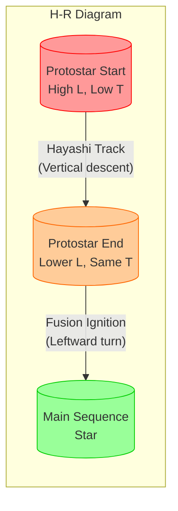
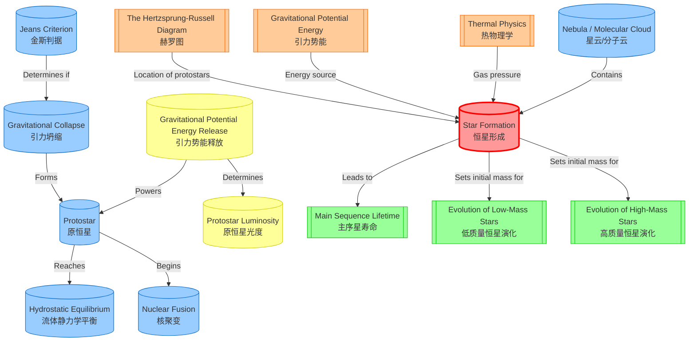

# 1. Overview / 概述

**English:**
Star formation is the process by which dense regions within molecular clouds in interstellar space collapse under their own gravity to form protostars, which eventually become main-sequence stars. This sub-topic covers the initial stages of stellar evolution, from the fragmentation of giant molecular clouds (GMCs) through the formation of protostars and the onset of nuclear fusion. Understanding star formation is crucial because it sets the initial conditions for all subsequent [[Stellar Evolution]] — determining a star's mass, which dictates its entire life cycle and ultimate fate. The process connects directly to [[The Hertzsprung-Russell Diagram]] as protostars occupy a distinct region before joining the main sequence, and it provides the foundation for understanding [[Main Sequence Lifetime]] and later stages.

**中文:**
恒星形成是星际空间中分子云内的致密区域在自身引力作用下坍缩形成原恒星，并最终成为主序星的过程。本子知识点涵盖恒星演化的初始阶段，从巨分子云（GMCs）的碎裂到原恒星的形成以及核聚变的启动。理解恒星形成至关重要，因为它为所有后续的[[Stellar Evolution]]设定了初始条件——决定了恒星的质量，而质量又决定了其整个生命周期和最终命运。该过程直接与[[The Hertzsprung-Russell Diagram]]相关联，因为原恒星在加入主序带之前占据一个独特的区域，并为理解[[Main Sequence Lifetime]]及后续阶段奠定了基础。

---

# 2. Syllabus Learning Objectives / 考纲学习目标

| CAIE 9702 | Edexcel IAL |
|-----------|-------------|
| 25.4(a): Describe the formation of a star from interstellar dust and gas | 10.19: Understand that stars form from interstellar dust and gas in regions of higher density in the interstellar medium |
| 25.4(b): Explain that gravitational collapse leads to the formation of a protostar | 10.20: Understand that gravitational collapse leads to the formation of a protostar |
| 25.4(c): Describe that the temperature of a protostar increases as it collapses | 10.21: Understand that the temperature of a protostar increases as it collapses |
| 25.4(d): Explain that when the core temperature reaches about 10⁷ K, hydrogen fusion begins | 10.22: Understand that when the core temperature reaches about 10⁷ K, hydrogen fusion begins |
| 25.4(e): Describe the role of the Jeans criterion in star formation | 10.23: Understand the Jeans criterion for gravitational collapse |
| 25.4(f): Explain the concept of hydrostatic equilibrium in a protostar | 10.24: Understand the concept of hydrostatic equilibrium in a protostar |
| 25.4(g): Describe the energy sources during protostar formation (gravitational potential energy) | 10.25: Understand that gravitational potential energy is the main energy source during protostar formation |
| 25.4(h): Explain why protostars are not on the main sequence | (Covered in 10.19-10.25 context) |

**Examiner Expectations / 考官期望:**
- **CAIE:** Students must be able to describe the sequence of events from nebula to protostar, explain the Jeans criterion qualitatively, and understand that gravitational potential energy release heats the protostar. Calculations involving the Jeans mass are not required, but the concept must be explained.
- **Edexcel:** Students should understand the role of gravitational potential energy in heating the protostar, the condition for fusion ignition, and why protostars are not on the main sequence. The Jeans criterion is required qualitatively.

---

# 3. Core Definitions / 核心定义

| Term (EN/CN) | Definition (EN) | Definition (CN) | Common Mistakes / 常见错误 |
|--------------|-----------------|-----------------|---------------------------|
| **Nebula** / 星云 | A large cloud of gas and dust in interstellar space, primarily composed of hydrogen and helium, with trace amounts of heavier elements. | 星际空间中由气体和尘埃组成的大型云团，主要由氢和氦组成，含有微量重元素。 | Confusing nebula with a galaxy; a nebula is much smaller and is within a galaxy. |
| **Protostar** / 原恒星 | A collapsing cloud of gas and dust that is in the early stages of star formation, before nuclear fusion has begun in its core. | 处于恒星形成早期阶段的气体和尘埃坍缩云团，其核心尚未开始核聚变。 | Thinking a protostar is already a star; it is not — fusion has not started. |
| **Jeans Criterion** / 金斯判据 | The condition that a molecular cloud must have sufficient mass (greater than the Jeans mass) for its self-gravity to overcome internal gas pressure and cause gravitational collapse. | 分子云必须具有足够质量（大于金斯质量）才能使其自身引力克服内部气体压力并导致引力坍缩的条件。 | Forgetting that both mass AND density matter; the Jeans criterion depends on density and temperature. |
| **Hydrostatic Equilibrium** / 流体静力学平衡 | The balance between inward gravitational force and outward pressure gradient force (from thermal pressure and radiation pressure) that stabilizes a star. | 向内的引力与向外的压力梯度力（来自热压力和辐射压力）之间的平衡，使恒星保持稳定。 | Thinking hydrostatic equilibrium only applies to main-sequence stars; it also applies to protostars once collapse slows. |
| **Gravitational Collapse** / 引力坍缩 | The process by which an interstellar cloud contracts under its own gravity, converting gravitational potential energy into kinetic and thermal energy. | 星际云团在其自身引力作用下收缩的过程，将引力势能转化为动能和热能。 | Confusing collapse with simple contraction; collapse is rapid and driven by gravity overcoming pressure. |
| **Molecular Cloud** / 分子云 | A cold, dense interstellar cloud where molecules (especially H₂) can form; these are the primary sites of star formation. | 寒冷、致密的星际云团，其中可以形成分子（尤其是H₂）；这些是恒星形成的主要场所。 | Thinking all interstellar clouds are molecular clouds; molecular clouds are a specific type. |

---

# 4. Key Concepts Explained / 关键概念详解

## 4.1 The Jeans Criterion / 金斯判据

### Explanation / 解释
**English:**
The [[Jeans Criterion]] determines whether a molecular cloud will collapse under its own gravity or remain stable. For a cloud of mass $M$, temperature $T$, and radius $R$, collapse occurs when the gravitational potential energy exceeds the thermal kinetic energy of the gas particles. The critical mass (Jeans mass, $M_J$) is given approximately by:

$$ M_J \approx \left( \frac{5kT}{G\mu m_H} \right)^{3/2} \left( \frac{3}{4\pi\rho} \right)^{1/2} $$

where $\rho$ is the density, $\mu$ is the mean molecular weight, and $m_H$ is the mass of a hydrogen atom. If $M > M_J$, the cloud collapses. The criterion shows that colder, denser clouds are more likely to collapse — which is why star formation occurs in cold molecular clouds (T ≈ 10-20 K).

**中文:**
[[金斯判据]]决定了分子云是在自身引力作用下坍缩还是保持稳定。对于一个质量为 $M$、温度为 $T$、半径为 $R$ 的云团，当引力势能超过气体粒子的热动能时，坍缩就会发生。临界质量（金斯质量，$M_J$）近似由下式给出：

$$ M_J \approx \left( \frac{5kT}{G\mu m_H} \right)^{3/2} \left( \frac{3}{4\pi\rho} \right)^{1/2} $$

其中 $\rho$ 是密度，$\mu$ 是平均分子量，$m_H$ 是氢原子的质量。如果 $M > M_J$，云团就会坍缩。该判据表明，更冷、更密的云团更有可能坍缩——这就是为什么恒星形成发生在寒冷的分子云中（T ≈ 10-20 K）。

### Physical Meaning / 物理意义
**English:**
The Jeans criterion represents the competition between two opposing forces: gravity (which pulls matter together) and thermal pressure (which pushes matter apart). For collapse to occur, gravity must win. The criterion explains why star formation is a "fragile" process — only the densest, coldest regions of molecular clouds can collapse. It also explains why star formation tends to occur in clusters: a large molecular cloud can fragment into many Jeans-unstable regions, each forming a separate star or binary system.

**中文:**
金斯判据代表了两种相反力之间的竞争：引力（将物质拉在一起）和热压力（将物质推开）。要使坍缩发生，引力必须胜出。该判据解释了为什么恒星形成是一个"脆弱"的过程——只有分子云中最冷、最密的区域才能坍缩。它还解释了为什么恒星形成往往发生在星团中：一个大的分子云可以碎裂成许多金斯不稳定的区域，每个区域形成一颗独立的恒星或双星系统。

### Common Misconceptions / 常见误区
- **Misconception:** The Jeans mass is a fixed value for all clouds.
  **Correction:** The Jeans mass depends on the cloud's density and temperature — colder, denser clouds have a smaller Jeans mass.
- **Misconception:** Any cloud with mass > Jeans mass will immediately form a star.
  **Correction:** The cloud must also be able to cool efficiently (radiate away the heat from collapse) to continue collapsing.
- **Misconception:** The Jeans criterion only applies to the initial collapse.
  **Correction:** It also applies to fragmentation during collapse — as a cloud collapses, it may become Jeans-unstable on smaller scales, leading to multiple star formation.

### Exam Tips / 考试提示
- **CAIE:** You may be asked to explain qualitatively how temperature and density affect the Jeans mass. Remember: lower T and higher ρ → smaller M_J → easier to collapse.
- **Edexcel:** Be prepared to explain the Jeans criterion in words and relate it to the conditions in molecular clouds. No calculation is required, but you should understand the proportionality $M_J \propto T^{3/2} \rho^{-1/2}$.

> 📷 **IMAGE PROMPT — JC01: Jeans Criterion Diagram**
> A diagram showing a molecular cloud with labeled regions. On the left, a cloud with mass M < M_J remains stable (arrows showing thermal pressure outward balancing gravity inward). On the right, a cloud with M > M_J collapses inward (large inward arrows dominating over small outward arrows). Include labels: "Jeans Mass M_J", "Thermal Pressure", "Gravity", "Stable Cloud", "Collapsing Cloud". Use a clean, educational style suitable for A-Level physics.

---

## 4.2 From Nebula to Protostar / 从星云到原恒星

### Explanation / 解释
**English:**
The journey from a [[Nebula]] to a [[Protostar]] involves several distinct stages:

1. **Cloud Fragmentation:** A giant molecular cloud (GMC) begins to collapse. As it collapses, it fragments into smaller Jeans-unstable clumps, each of which may form a star or multiple stars.

2. **Free-Fall Collapse:** The initial collapse is nearly free-fall — gravity dominates, and the clump collapses rapidly (timescale ~10⁵-10⁶ years). During this phase, gravitational potential energy is converted into kinetic energy, heating the gas.

3. **Formation of a Core:** As the density increases, the central region becomes optically thick — radiation cannot escape easily. This causes the core to heat up more rapidly, while the outer envelope continues to fall inward.

4. **Protostar Phase:** When the core temperature reaches about 2000 K, molecular hydrogen dissociates into atomic hydrogen, absorbing energy and slowing the collapse. The protostar is now a hot, dense object (radius ~10-100 R☉) with a surrounding accretion disk. It is not yet a star because nuclear fusion has not begun.

5. **T Tauri Phase:** The protostar becomes visible as a T Tauri star — a variable star with strong stellar winds that blow away the surrounding gas and dust, ending accretion.

**中文:**
从[[星云]]到[[原恒星]]的旅程涉及几个不同的阶段：

1. **云团碎裂：** 一个巨分子云（GMC）开始坍缩。随着坍缩，它碎裂成更小的金斯不稳定团块，每个团块可能形成一颗恒星或多颗恒星。

2. **自由落体坍缩：** 初始坍缩几乎是自由落体——引力占主导，团块快速坍缩（时间尺度约10⁵-10⁶年）。在此阶段，引力势能转化为动能，加热气体。

3. **核心形成：** 随着密度增加，中心区域变得光学厚——辐射难以逃逸。这导致核心升温更快，而外部包层继续向内下落。

4. **原恒星阶段：** 当核心温度达到约2000 K时，氢分子解离为氢原子，吸收能量并减缓坍缩。原恒星现在是一个炽热、致密的天体（半径约10-100 R☉），周围有吸积盘。它还不是恒星，因为核聚变尚未开始。

5. **金牛T星阶段：** 原恒星作为金牛T星变得可见——这是一颗变星，具有强烈的恒星风，吹走周围的气体和尘埃，结束吸积。

### Physical Meaning / 物理意义
**English:**
The key physical insight is that star formation is a battle between gravity and pressure. Initially, gravity wins easily (free-fall collapse). But as the protostar heats up, thermal pressure increases, slowing the collapse. The protostar eventually reaches a quasi-equilibrium state where it is supported by thermal pressure but still contracting slowly. The energy source during this entire phase is gravitational potential energy — the same energy that powers the collapse is what heats the protostar. This is why protostars are luminous despite not having nuclear fusion.

**中文:**
关键的物理洞见是，恒星形成是引力与压力之间的战斗。最初，引力轻松获胜（自由落体坍缩）。但随着原恒星升温，热压力增加，减缓了坍缩。原恒星最终达到一个准平衡状态，由热压力支撑但仍在缓慢收缩。整个阶段的能量来源是引力势能——驱动坍缩的相同能量也在加热原恒星。这就是为什么原恒星在没有核聚变的情况下仍然发光。

### Common Misconceptions / 常见误区
- **Misconception:** Protostars are on the main sequence.
  **Correction:** Protostars are NOT on the main sequence — they are still contracting and have not started hydrogen fusion. They appear to the right of the main sequence on the [[The Hertzsprung-Russell Diagram]].
- **Misconception:** The collapse is smooth and continuous.
  **Correction:** The collapse involves multiple stages, including periods of rapid infall and periods of slower contraction, especially when molecular dissociation occurs.
- **Misconception:** All protostars eventually become stars.
  **Correction:** If a protostar has too little mass (< 0.08 M☉), its core will never reach the temperature needed for hydrogen fusion — it becomes a brown dwarf instead.

### Exam Tips / 考试提示
- **CAIE:** Be able to describe the sequence of events in order. Use the terms "gravitational collapse", "protostar", "accretion disk", and "hydrogen fusion" correctly.
- **Edexcel:** Focus on the energy transformations: gravitational potential energy → kinetic energy → thermal energy. Explain why the protostar heats up as it collapses.

> 📷 **IMAGE PROMPT — NTP01: Nebula to Protostar Sequence**
> A four-panel diagram showing the stages of star formation. Panel 1: A large, diffuse molecular cloud with arrows indicating fragmentation. Panel 2: A collapsing clump with a dense core forming at the center, surrounded by an infalling envelope. Panel 3: A protostar with an accretion disk, showing material spiraling inward. Panel 4: A T Tauri star with bipolar outflows (jets) perpendicular to the disk. Include labels: "Molecular Cloud", "Fragmentation", "Collapsing Core", "Protostar + Accretion Disk", "T Tauri Star + Jets". Use a clear, educational style.

---

## 4.3 Energy Sources During Protostar Formation / 原恒星形成过程中的能量来源

### Explanation / 解释
**English:**
During the protostar phase, the primary energy source is the release of [[Gravitational Potential Energy]]. As the protostar contracts, particles fall inward, converting gravitational potential energy into kinetic energy. Through collisions between particles, this kinetic energy is converted into thermal energy, heating the protostar.

The gravitational potential energy released when a mass $M$ collapses from a large radius $R_i$ to a smaller radius $R_f$ is approximately:

$$ \Delta U \approx \frac{GM^2}{R_f} - \frac{GM^2}{R_i} \approx \frac{GM^2}{R_f} \quad (\text{since } R_i \gg R_f) $$

This energy is radiated away as infrared and visible light, making the protostar luminous. The luminosity of a protostar is given by:

$$ L \approx \frac{GM^2}{R} \times \text{(contraction rate)} $$

As the protostar contracts, its radius decreases, and its temperature increases. The protostar follows a "Hayashi track" on the [[The Hertzsprung-Russell Diagram]] — a nearly vertical path downward as it contracts at roughly constant temperature.

**中文:**
在原恒星阶段，主要的能量来源是[[引力势能]]的释放。随着原恒星收缩，粒子向内下落，将引力势能转化为动能。通过粒子之间的碰撞，这种动能转化为热能，加热原恒星。

当一个质量为 $M$ 的天体从大半径 $R_i$ 坍缩到较小半径 $R_f$ 时释放的引力势能近似为：

$$ \Delta U \approx \frac{GM^2}{R_f} - \frac{GM^2}{R_i} \approx \frac{GM^2}{R_f} \quad (\text{因为 } R_i \gg R_f) $$

这种能量以红外线和可见光的形式辐射出去，使原恒星发光。原恒星的光度由下式给出：

$$ L \approx \frac{GM^2}{R} \times \text{(收缩速率)} $$

随着原恒星收缩，其半径减小，温度升高。原恒星在[[The Hertzsprung-Russell Diagram]]上遵循"林轨迹"——一条近乎垂直的向下路径，在温度大致恒定的情况下收缩。

### Physical Meaning / 物理意义
**English:**
The key insight is that gravitational contraction is a very efficient way to heat matter. A protostar can reach core temperatures of millions of Kelvin purely through gravitational energy release — no nuclear reactions are needed. This is why the protostar phase can last for millions of years (10⁵-10⁷ years, depending on mass). The energy released is proportional to $M^2/R$, meaning more massive protostars release more energy and evolve faster.

**中文:**
关键的洞见是，引力收缩是一种非常有效的加热物质的方式。原恒星可以纯粹通过引力能量释放达到数百万开尔文的核心温度——不需要核反应。这就是为什么原恒星阶段可以持续数百万年（10⁵-10⁷年，取决于质量）。释放的能量与 $M^2/R$ 成正比，意味着质量更大的原恒星释放更多能量，演化更快。

### Common Misconceptions / 常见误区
- **Misconception:** Protostars are powered by nuclear fusion.
  **Correction:** Protostars are powered by gravitational contraction. Nuclear fusion only begins when the core temperature reaches ~10⁷ K.
- **Misconception:** The energy comes from outside the protostar.
  **Correction:** The energy comes from the protostar's own gravitational field — it is internal gravitational potential energy being converted.
- **Misconception:** All protostars have the same luminosity.
  **Correction:** More massive protostars have higher luminosity because they release more gravitational potential energy per unit time.

### Exam Tips / 考试提示
- **CAIE:** You may be asked to explain why a protostar gets hotter as it collapses. Use the virial theorem: half the gravitational potential energy released goes into thermal energy, half is radiated away.
- **Edexcel:** Be prepared to calculate the gravitational potential energy released during contraction (using $U = -GM^2/R$) and relate it to the protostar's luminosity.

> 📷 **IMAGE PROMPT — ES01: Energy Sources in Protostar**
> A diagram showing a collapsing protostar with energy flows. The protostar is shown as a sphere with arrows indicating: (1) Inward arrows labeled "Gravitational Collapse" with "GPE → KE" annotation; (2) Outward arrows labeled "Thermal Radiation" (infrared wavelengths); (3) A cutaway showing the core heating up, with temperature increasing from outer layers (cool, ~1000 K) to core (hot, ~10⁶ K). Include a small energy bar chart showing GPE as the dominant source. Use a clean, educational style.

---

## 4.4 Onset of Nuclear Fusion / 核聚变的启动

### Explanation / 解释
**English:**
As the protostar continues to contract, its core temperature rises. When the core temperature reaches approximately $10^7$ K (10 million Kelvin), the conditions become favorable for hydrogen fusion via the proton-proton chain:

$$ ^1_1H + ^1_1H \rightarrow ^2_1H + e^+ + \nu_e $$

$$ ^2_1H + ^1_1H \rightarrow ^3_2He + \gamma $$

$$ ^3_2He + ^3_2He \rightarrow ^4_2He + 2^1_1H $$

The net result is: $4^1_1H \rightarrow ^4_2He + 2e^+ + 2\nu_e + \gamma$ (energy released ≈ 26.7 MeV per reaction).

At this point, nuclear fusion becomes the dominant energy source, replacing gravitational contraction. The outward radiation pressure from fusion balances the inward gravitational force, establishing [[Hydrostatic Equilibrium]]. The protostar stops contracting and becomes a main-sequence star — it has "arrived" on the [[The Hertzsprung-Russell Diagram]] main sequence.

**中文:**
随着原恒星继续收缩，其核心温度升高。当核心温度达到约 $10^7$ K（1000万开尔文）时，条件变得有利于通过质子-质子链进行氢聚变：

$$ ^1_1H + ^1_1H \rightarrow ^2_1H + e^+ + \nu_e $$

$$ ^2_1H + ^1_1H \rightarrow ^3_2He + \gamma $$

$$ ^3_2He + ^3_2He \rightarrow ^4_2He + 2^1_1H $$

净结果是：$4^1_1H \rightarrow ^4_2He + 2e^+ + 2\nu_e + \gamma$（每次反应释放能量约26.7 MeV）。

此时，核聚变成为主要能量来源，取代了引力收缩。来自聚变的向外辐射压力平衡了向内的引力，建立了[[Hydrostatic Equilibrium]]。原恒星停止收缩，成为主序星——它已经"到达"了[[The Hertzsprung-Russell Diagram]]的主序带。

### Physical Meaning / 物理意义
**English:**
The onset of fusion marks the transition from a protostar to a true star. The key condition is that the core temperature must be high enough for protons to overcome the Coulomb barrier (electrostatic repulsion) and get close enough for the strong nuclear force to bind them. This requires temperatures of ~10⁷ K because the protons must have sufficient kinetic energy to tunnel through the Coulomb barrier. The minimum mass for this to happen is about 0.08 M☉ (the hydrogen-burning limit) — below this, the object becomes a brown dwarf.

**中文:**
聚变的启动标志着从原恒星到真正恒星的转变。关键条件是核心温度必须足够高，使质子能够克服库仑势垒（静电排斥）并足够接近，以便强核力将它们结合。这需要约10⁷ K的温度，因为质子必须有足够的动能来隧穿库仑势垒。发生这种情况的最小质量约为0.08 M☉（氢燃烧极限）——低于此质量，天体将成为褐矮星。

### Common Misconceptions / 常见误区
- **Misconception:** Fusion starts as soon as the protostar forms.
  **Correction:** Fusion only starts after millions of years of contraction, when the core reaches ~10⁷ K.
- **Misconception:** The entire protostar needs to reach 10⁷ K.
  **Correction:** Only the core needs to reach this temperature. The outer layers remain much cooler.
- **Misconception:** Fusion begins gradually.
  **Correction:** Fusion begins suddenly once the threshold temperature is reached — it is a "switch" that turns on.

### Exam Tips / 考试提示
- **CAIE:** Be able to state the temperature required for hydrogen fusion (10⁷ K) and explain why this temperature is needed (to overcome Coulomb repulsion).
- **Edexcel:** You may be asked to explain the significance of the 0.08 M☉ limit. Remember: below this mass, the core never gets hot enough for fusion.

> 📷 **IMAGE PROMPT — NF01: Onset of Nuclear Fusion**
> A cutaway diagram of a protostar showing the core. The core is labeled "Core Temperature ~10⁷ K" with a glowing orange/red center. Small proton-proton chain reaction symbols (p + p → d + e⁺ + ν) are shown inside the core. An arrow points from the core outward, labeled "Radiation Pressure". A balance scale icon shows "Gravity" on one side and "Radiation Pressure" on the other, balanced. Include a temperature scale from 10⁶ K (outer core) to 10⁷ K (inner core). Use a clean, educational style.

---

# 5. Essential Equations / 核心公式

## 5.1 Jeans Mass / 金斯质量

$$ M_J \approx \left( \frac{5kT}{G\mu m_H} \right)^{3/2} \left( \frac{3}{4\pi\rho} \right)^{1/2} $$

| Symbol (符号) | Meaning (EN) | Meaning (CN) | Unit (单位) |
|--------------|-------------|-------------|------------|
| $M_J$ | Jeans mass | 金斯质量 | kg |
| $k$ | Boltzmann constant | 玻尔兹曼常数 | J K⁻¹ |
| $T$ | Temperature of cloud | 云团温度 | K |
| $G$ | Gravitational constant | 引力常数 | N m² kg⁻² |
| $\mu$ | Mean molecular weight | 平均分子量 | dimensionless |
| $m_H$ | Mass of hydrogen atom | 氢原子质量 | kg |
| $\rho$ | Density of cloud | 云团密度 | kg m⁻³ |

**Derivation / 推导:**
The Jeans mass is derived by equating the gravitational potential energy of a uniform sphere ($U \approx -GM^2/R$) with the thermal kinetic energy ($K \approx \frac{3}{2}NkT$), where $N = M/(\mu m_H)$ is the number of particles. Setting $|U| \approx K$ gives the condition for collapse. The exact derivation involves solving the virial theorem.

**Conditions / 适用条件:**
- The cloud must be approximately uniform in density and temperature.
- The cloud must be able to cool efficiently (otherwise thermal pressure prevents collapse).
- The cloud must be isolated from external perturbations (e.g., supernova shocks).

**Limitations / 局限性:**
- The Jeans criterion assumes a uniform, non-rotating, non-magnetic cloud. Real clouds have rotation, magnetic fields, and turbulence, which can support against collapse.
- The criterion gives a necessary but not sufficient condition for collapse — other factors (cooling, fragmentation) also matter.

> 📋 **CIE Only:** The Jeans mass equation is provided for reference. You are not expected to perform calculations with it, but you should understand the proportionalities: $M_J \propto T^{3/2} \rho^{-1/2}$.

> 📋 **Edexcel Only:** The Jeans criterion is required qualitatively. You should understand that colder, denser clouds have a smaller Jeans mass and are more likely to collapse.

---

## 5.2 Gravitational Potential Energy Release / 引力势能释放

$$ \Delta U = \frac{GM^2}{R_f} - \frac{GM^2}{R_i} \approx \frac{GM^2}{R_f} \quad (\text{for } R_i \gg R_f) $$

| Symbol (符号) | Meaning (EN) | Meaning (CN) | Unit (单位) |
|--------------|-------------|-------------|------------|
| $\Delta U$ | Change in gravitational potential energy | 引力势能变化 | J |
| $G$ | Gravitational constant | 引力常数 | N m² kg⁻² |
| $M$ | Mass of protostar | 原恒星质量 | kg |
| $R_i$ | Initial radius (large) | 初始半径（大） | m |
| $R_f$ | Final radius (small) | 最终半径（小） | m |

**Derivation / 推导:**
The gravitational potential energy of a uniform sphere is $U = -\frac{3}{5}\frac{GM^2}{R}$. For a protostar, the exact coefficient depends on the density distribution, but the scaling $U \propto -M^2/R$ is general. The energy released during contraction is the difference between initial and final potential energies.

**Conditions / 适用条件:**
- The protostar must be approximately spherical.
- The mass must remain constant during contraction (no significant accretion or mass loss).
- The contraction must be slow enough that the protostar remains in quasi-hydrostatic equilibrium.

**Limitations / 局限性:**
- The equation assumes a uniform density distribution, which is not accurate for real protostars (they are centrally concentrated).
- The equation does not account for energy lost to radiation or used for molecular dissociation.

> 📋 **Both CIE and Edexcel:** You may be asked to calculate the gravitational potential energy released during contraction. Use $U = -GM^2/R$ (the exact coefficient may vary, but the scaling is what matters).

---

## 5.3 Luminosity from Gravitational Contraction / 引力收缩产生的光度

$$ L \approx \frac{GM^2}{R^2} \times \frac{dR}{dt} $$

| Symbol (符号) | Meaning (EN) | Meaning (CN) | Unit (单位) |
|--------------|-------------|-------------|------------|
| $L$ | Luminosity of protostar | 原恒星光度 | W |
| $G$ | Gravitational constant | 引力常数 | N m² kg⁻² |
| $M$ | Mass of protostar | 原恒星质量 | kg |
| $R$ | Radius of protostar | 原恒星半径 | m |
| $dR/dt$ | Rate of contraction (negative) | 收缩速率（负值） | m s⁻¹ |

**Derivation / 推导:**
The luminosity is the rate at which gravitational potential energy is released: $L = -dU/dt$. Since $U \approx -GM^2/R$, we have $dU/dt \approx (GM^2/R^2) \times dR/dt$. The negative sign indicates that as $R$ decreases, $U$ becomes more negative (energy is released).

**Conditions / 适用条件:**
- The protostar must be in quasi-hydrostatic equilibrium (contraction is slow compared to free-fall).
- All released gravitational energy is radiated away (no energy stored in other forms).

**Limitations / 局限性:**
- The equation assumes that all gravitational energy release goes into radiation. In reality, some energy goes into dissociating molecules and ionizing atoms.
- The contraction rate $dR/dt$ is not constant — it changes as the protostar evolves.

> 📋 **Both CIE and Edexcel:** This equation is used qualitatively. You should understand that a more massive protostar has higher luminosity, and that luminosity decreases as the protostar contracts (because $R$ decreases, but $dR/dt$ also decreases).

---

# 6. Graphs and Relationships / 图表与关系

## 6.1 Protostar Evolution on the H-R Diagram / 原恒星在赫罗图上的演化

### Axes / 坐标轴
- **X-axis:** Surface Temperature (K) — decreasing to the right (spectral type O → M)
- **Y-axis:** Luminosity (L☉) — increasing upward (logarithmic scale)

### Shape / 形状
A protostar follows the **Hayashi track** — a nearly vertical path on the H-R diagram. The protostar starts at the top right (high luminosity, low temperature) and moves downward (decreasing luminosity) at roughly constant temperature. When the core temperature reaches ~10⁷ K and fusion begins, the protostar "turns" leftward onto the main sequence.

### Gradient Meaning / 斜率含义
The Hayashi track is nearly vertical, meaning the protostar's surface temperature remains roughly constant while its luminosity decreases. This is because the protostar is fully convective — heat is transported efficiently from the interior to the surface, keeping the surface temperature stable.

### Area Meaning / 面积含义
The area under the Hayashi track represents the total energy radiated during the protostar phase. This energy comes from gravitational contraction.

### Exam Interpretation / 考试解读
- **Key Point:** Protostars are NOT on the main sequence. They appear to the right of the main sequence.
- **Key Point:** The Hayashi track is a path of constant temperature (vertical) — the protostar contracts but stays at the same surface temperature.
- **Key Point:** When fusion starts, the star moves leftward onto the main sequence — its surface temperature increases as the core stabilizes.

> 📷 **IMAGE PROMPT — HR01: Protostar on H-R Diagram**
> A Hertzsprung-Russell diagram with the main sequence shown as a diagonal band from top-left (O stars) to bottom-right (M stars). A vertical line (Hayashi track) is drawn from the top-right region (high luminosity, low temperature) downward to the main sequence. Label the start point "Protostar" and the end point "Main Sequence Star". Include arrows showing the direction of evolution. Use a clean, educational style with clear axis labels.

---

## 6.2 Temperature vs. Time During Collapse / 坍缩过程中温度与时间的关系

### Axes / 坐标轴
- **X-axis:** Time (millions of years)
- **Y-axis:** Core Temperature (K)

### Shape / 形状
The core temperature increases gradually at first, then more rapidly as the protostar becomes optically thick. The curve is approximately exponential — temperature rises slowly during the early free-fall phase, then accelerates as the core becomes denser and heat cannot escape easily.

### Gradient Meaning / 斜率含义
The gradient $dT/dt$ represents the rate of heating. A steeper gradient means faster heating, which occurs when the protostar becomes optically thick and heat is trapped.

### Area Meaning / 面积含义
The area under the curve has no direct physical meaning, but the time to reach 10⁷ K determines the duration of the protostar phase.

### Exam Interpretation / 考试解读
- **Key Point:** The temperature must reach ~10⁷ K for fusion to begin.
- **Key Point:** More massive protostars reach this temperature faster (shorter protostar phase).
- **Key Point:** The temperature increase is driven by gravitational contraction, not nuclear reactions.

> 📷 **IMAGE PROMPT — TT01: Temperature vs Time for Protostar**
> A graph with time on the x-axis (0 to 10 million years) and core temperature on the y-axis (0 to 2×10⁷ K). The curve starts at ~10 K (molecular cloud temperature) and rises slowly at first, then more steeply, reaching 10⁷ K at about 5 million years. A horizontal dashed line is drawn at 10⁷ K, labeled "Fusion Ignition Temperature". Include labels: "Free-fall Phase", "Slow Contraction Phase", "Optically Thick Phase". Use a clean, educational style.

---

# 7. Required Diagrams / 必备图表

## 7.1 Star Formation Sequence / 恒星形成序列

### Description / 描述
**English:** A multi-panel diagram showing the stages of star formation from a molecular cloud to a main-sequence star. Each panel shows the physical state of the system, including size, temperature, and energy source.

**中文:** 一个多面板图表，显示从分子云到主序星的恒星形成阶段。每个面板显示系统的物理状态，包括大小、温度和能量来源。

### Image Prompt / 图片生成提示
> 📷 **IMAGE PROMPT — SF01: Star Formation Sequence**
> A five-panel diagram showing the stages of star formation. Panel 1: "Giant Molecular Cloud" — a large, diffuse cloud with irregular shape, labeled "T ≈ 10 K, ρ ≈ 10⁻²¹ kg/m³". Panel 2: "Cloud Fragmentation" — the cloud breaking into smaller clumps, with arrows showing collapse. Panel 3: "Collapsing Core" — a dense central region forming, with infalling material shown as arrows. Panel 4: "Protostar + Accretion Disk" — a central sphere with a surrounding disk, labeled "T_core ≈ 10⁶ K, Energy Source: Gravitational Contraction". Panel 5: "Main Sequence Star" — a stable star with fusion in the core, labeled "T_core ≈ 10⁷ K, Energy Source: Nuclear Fusion". Include a timeline at the bottom showing the relative duration of each phase. Use a clean, educational style suitable for A-Level physics.

### Labels Required / 需要标注
- **Panel 1:** Giant Molecular Cloud, T ≈ 10 K, ρ ≈ 10⁻²¹ kg/m³
- **Panel 2:** Fragmentation, Jeans-unstable clumps
- **Panel 3:** Collapsing core, infalling envelope
- **Panel 4:** Protostar, accretion disk, T_core ≈ 10⁶ K, gravitational contraction
- **Panel 5:** Main sequence star, T_core ≈ 10⁷ K, hydrogen fusion

### Exam Importance / 考试重要性
**English:** This diagram is essential for understanding the sequence of events in star formation. You may be asked to draw or label it in an exam. Focus on the transition from gravitational contraction to nuclear fusion as the energy source.

**中文:** 此图表对于理解恒星形成的事件序列至关重要。考试中可能会要求你绘制或标注它。重点关注从引力收缩到核聚变作为能量来源的转变。

---

## 7.2 Protostar Structure / 原恒星结构

### Description / 描述
**English:** A cutaway diagram of a protostar showing its internal structure, including the core, radiative zone, and convective envelope. The diagram should show temperature gradients and energy transport mechanisms.

**中文:** 原恒星的剖面图，显示其内部结构，包括核心、辐射区和对流包层。图表应显示温度梯度和能量传输机制。

### Image Prompt / 图片生成提示
> 📷 **IMAGE PROMPT — PS01: Protostar Structure**
> A cutaway diagram of a protostar showing three layers: (1) Outer envelope — cool (≈ 3000 K), convective, with arrows showing rising and falling gas; (2) Radiative zone — intermediate temperature (≈ 10⁵ K), with wavy arrows showing photon transport; (3) Core — hot (≈ 10⁶ K), dense, with labels "Gravitational Contraction" and "No Fusion Yet". Include a temperature scale bar from 3000 K (surface) to 10⁶ K (core). Show the accretion disk around the protostar with material spiraling inward. Use a clean, educational style.

### Labels Required / 需要标注
- **Outer Envelope:** Convective, T ≈ 3000 K
- **Radiative Zone:** Photon transport, T ≈ 10⁵ K
- **Core:** Gravitational contraction, T ≈ 10⁶ K, no fusion
- **Accretion Disk:** Infalling material

### Exam Importance / 考试重要性
**English:** Understanding the internal structure of a protostar helps explain why the core heats up faster than the surface, and why the protostar is fully convective (which keeps its surface temperature constant during the Hayashi track).

**中文:** 理解原恒星的内部结构有助于解释为什么核心比表面升温更快，以及为什么原恒星是完全对流的（这使其在林轨迹期间表面温度保持恒定）。

---

# 8. Worked Examples / 典型例题

## Example 1: Gravitational Potential Energy Release / 引力势能释放

### Question / 题目
**English:**
A protostar of mass $M = 2.0 \times 10^{30}$ kg (approximately 1 M☉) contracts from an initial radius $R_i = 1.0 \times 10^{14}$ m to a final radius $R_f = 1.0 \times 10^{10}$ m. Calculate:
(a) The gravitational potential energy released during this contraction.
(b) The average luminosity of the protostar if the contraction takes $10^6$ years.
(c) Compare this luminosity to the Sun's luminosity ($L_\odot = 3.8 \times 10^{26}$ W).

(Given: $G = 6.67 \times 10^{-11}$ N m² kg⁻², 1 year = $3.16 \times 10^7$ s)

**中文:**
一个质量为 $M = 2.0 \times 10^{30}$ kg（约1 M☉）的原恒星从初始半径 $R_i = 1.0 \times 10^{14}$ m 收缩到最终半径 $R_f = 1.0 \times 10^{10}$ m。计算：
(a) 此收缩过程中释放的引力势能。
(b) 如果收缩需要 $10^6$ 年，原恒星的平均光度。
(c) 将此光度与太阳光度（$L_\odot = 3.8 \times 10^{26}$ W）进行比较。

（已知：$G = 6.67 \times 10^{-11}$ N m² kg⁻²，1年 = $3.16 \times 10^7$ s）

### Solution / 解答

**Step 1: Calculate gravitational potential energy released**

Using $U \approx -\frac{GM^2}{R}$:

Initial potential energy:
$$ U_i = -\frac{GM^2}{R_i} = -\frac{(6.67 \times 10^{-11})(2.0 \times 10^{30})^2}{1.0 \times 10^{14}} $$

$$ U_i = -\frac{6.67 \times 10^{-11} \times 4.0 \times 10^{60}}{1.0 \times 10^{14}} $$

$$ U_i = -\frac{2.668 \times 10^{50}}{1.0 \times 10^{14}} = -2.668 \times 10^{36} \text{ J} $$

Final potential energy:
$$ U_f = -\frac{GM^2}{R_f} = -\frac{(6.67 \times 10^{-11})(2.0 \times 10^{30})^2}{1.0 \times 10^{10}} $$

$$ U_f = -\frac{2.668 \times 10^{50}}{1.0 \times 10^{10}} = -2.668 \times 10^{40} \text{ J} $$

Energy released:
$$ \Delta U = U_f - U_i = (-2.668 \times 10^{40}) - (-2.668 \times 10^{36}) $$

$$ \Delta U = -2.668 \times 10^{40} + 2.668 \times 10^{36} \approx -2.668 \times 10^{40} \text{ J} $$

The negative sign indicates energy is released. The magnitude is:
$$ |\Delta U| \approx 2.67 \times 10^{40} \text{ J} $$

**Step 2: Calculate average luminosity**

Time in seconds:
$$ t = 10^6 \text{ years} \times 3.16 \times 10^7 \text{ s/year} = 3.16 \times 10^{13} \text{ s} $$

Average luminosity:
$$ L = \frac{|\Delta U|}{t} = \frac{2.67 \times 10^{40}}{3.16 \times 10^{13}} $$

$$ L = 8.45 \times 10^{26} \text{ W} $$

**Step 3: Compare to Sun's luminosity**

$$ \frac{L}{L_\odot} = \frac{8.45 \times 10^{26}}{3.8 \times 10^{26}} \approx 2.22 $$

### Final Answer / 最终答案
**Answer:**
(a) $\Delta U \approx 2.67 \times 10^{40}$ J released
(b) $L \approx 8.45 \times 10^{26}$ W
(c) The protostar's luminosity is about 2.2 times the Sun's current luminosity.

**答案：**
(a) 释放约 $2.67 \times 10^{40}$ J
(b) 约 $8.45 \times 10^{26}$ W
(c) 原恒星的光度约为太阳当前光度的2.2倍。

### Quick Tip / 提示
**English:** Notice that $U_f \gg U_i$ because $R_f \ll R_i$. The initial potential energy is negligible compared to the final potential energy. This is why we can approximate $\Delta U \approx GM^2/R_f$.

**中文：** 注意 $U_f \gg U_i$，因为 $R_f \ll R_i$。初始势能与最终势能相比可以忽略不计。这就是为什么我们可以近似 $\Delta U \approx GM^2/R_f$。

---

## Example 2: Jeans Criterion / 金斯判据

### Question / 题目
**English:**
A molecular cloud has a temperature of 15 K and a density of $1.0 \times 10^{-20}$ kg/m³. The mean molecular weight is $\mu = 2.0$ (for molecular hydrogen). Calculate the Jeans mass for this cloud and determine whether a cloud of mass $1.0 \times 10^{32}$ kg will collapse.

(Given: $k = 1.38 \times 10^{-23}$ J/K, $G = 6.67 \times 10^{-11}$ N m² kg⁻², $m_H = 1.67 \times 10^{-27}$ kg)

**中文:**
一个分子云的温度为15 K，密度为 $1.0 \times 10^{-20}$ kg/m³。平均分子量为 $\mu = 2.0$（对于氢分子）。计算该云团的金斯质量，并判断质量为 $1.0 \times 10^{32}$ kg 的云团是否会坍缩。

（已知：$k = 1.38 \times 10^{-23}$ J/K，$G = 6.67 \times 10^{-11}$ N m² kg⁻²，$m_H = 1.67 \times 10^{-27}$ kg）

### Solution / 解答

**Step 1: Calculate the Jeans mass**

Using the Jeans mass formula:
$$ M_J \approx \left( \frac{5kT}{G\mu m_H} \right)^{3/2} \left( \frac{3}{4\pi\rho} \right)^{1/2} $$

First, calculate the term inside the first bracket:
$$ \frac{5kT}{G\mu m_H} = \frac{5 \times 1.38 \times 10^{-23} \times 15}{6.67 \times 10^{-11} \times 2.0 \times 1.67 \times 10^{-27}} $$

$$ = \frac{1.035 \times 10^{-21}}{2.228 \times 10^{-37}} = 4.646 \times 10^{15} \text{ m}^2/\text{s}^2 $$

Now raise to the power 3/2:
$$ (4.646 \times 10^{15})^{3/2} = (4.646 \times 10^{15})^{1.5} $$

$$ = (4.646)^{1.5} \times (10^{15})^{1.5} = 10.02 \times 10^{22.5} $$

$$ = 10.02 \times 10^{22.5} = 10.02 \times 3.16 \times 10^{22} = 3.17 \times 10^{23} $$

Now calculate the second bracket:
$$ \frac{3}{4\pi\rho} = \frac{3}{4 \times 3.142 \times 1.0 \times 10^{-20}} $$

$$ = \frac{3}{1.257 \times 10^{-19}} = 2.387 \times 10^{19} \text{ m}^3/\text{kg} $$

Take the square root:
$$ (2.387 \times 10^{19})^{1/2} = 4.886 \times 10^9 \text{ m}^{3/2}/\text{kg}^{1/2} $$

Now multiply:
$$ M_J = 3.17 \times 10^{23} \times 4.886 \times 10^9 $$

$$ M_J = 1.55 \times 10^{33} \text{ kg} $$

**Step 2: Compare with the cloud mass**

Cloud mass: $M = 1.0 \times 10^{32}$ kg
Jeans mass: $M_J = 1.55 \times 10^{33}$ kg

Since $M < M_J$, the cloud will NOT collapse under its own gravity.

### Final Answer / 最终答案
**Answer:**
$M_J \approx 1.55 \times 10^{33}$ kg. Since the cloud mass ($1.0 \times 10^{32}$ kg) is less than the Jeans mass, the cloud will not collapse.

**答案：**
$M_J \approx 1.55 \times 10^{33}$ kg。由于云团质量（$1.0 \times 10^{32}$ kg）小于金斯质量，云团不会坍缩。

### Quick Tip / 提示
**English:** The Jeans mass is very sensitive to temperature ($M_J \propto T^{3/2}$). If the cloud were colder (e.g., 10 K instead of 15 K), the Jeans mass would be smaller, and the cloud might collapse. This is why star formation occurs in the coldest regions of molecular clouds.

**中文：** 金斯质量对温度非常敏感（$M_J \propto T^{3/2}$）。如果云团更冷（例如10 K而不是15 K），金斯质量会更小，云团可能会坍缩。这就是为什么恒星形成发生在分子云中最冷的区域。

---

# 9. Past Paper Question Types / 历年真题题型

| Question Type / 题型 | Frequency / 频率 | Difficulty / 难度 | Past Paper References / 真题索引 |
|----------------------|------------------|------------------|-------------------------------|
| Describe the sequence of star formation from nebula to protostar | High | Easy | 📝 *待填入* |
| Explain the Jeans criterion qualitatively | Medium | Medium | 📝 *待填入* |
| Calculate gravitational potential energy released during contraction | Medium | Medium | 📝 *待填入* |
| Explain why protostars are not on the main sequence | High | Easy | 📝 *待填入* |
| Compare protostar energy sources to main-sequence energy sources | Medium | Medium | 📝 *待填入* |
| Interpret protostar evolution on the H-R diagram | Low | Hard | 📝 *待填入* |
| Explain the conditions required for hydrogen fusion to begin | High | Medium | 📝 *待填入* |

**Common Command Words / 常见指令词:**
- **Describe / 描述:** Give a step-by-step account of the process (e.g., "Describe the formation of a protostar from a molecular cloud").
- **Explain / 解释:** Give reasons for why something happens (e.g., "Explain why the temperature of a protostar increases as it collapses").
- **Calculate / 计算:** Use equations to find a numerical value (e.g., "Calculate the gravitational potential energy released").
- **Compare / 比较:** Describe similarities and differences (e.g., "Compare the energy sources of a protostar and a main-sequence star").
- **State / 陈述:** Give a brief answer without explanation (e.g., "State the temperature required for hydrogen fusion").

---

# 10. Practical Skills Connections / 实验技能链接

**English:**
While star formation cannot be directly observed in a laboratory, the concepts in this sub-topic connect to practical skills in several ways:

1. **Data Analysis from Observations:** Astronomers use telescopes (infrared, radio) to observe protostars. Students should understand how to interpret light curves and spectra from protostars. For example, protostars are brightest in the infrared because they are cool — this connects to blackbody radiation concepts.

2. **Uncertainties in Astronomical Measurements:** Distances to star-forming regions (e.g., the Orion Nebula) are measured using parallax or standard candles. Students should understand that astronomical measurements have large uncertainties due to interstellar dust and distance.

3. **Graph Plotting and Interpretation:** The H-R diagram is a key tool. Students should be able to plot data points for protostars and interpret their positions relative to the main sequence. This involves logarithmic scales and understanding of luminosity and temperature.

4. **Modeling and Simulation:** The Jeans criterion can be explored through simple computational models. Students could write a program to calculate how the Jeans mass changes with temperature and density.

5. **Experimental Design:** While not directly testable, students should understand how astronomers use multiple wavelengths (radio for molecular clouds, infrared for protostars, visible for main-sequence stars) to study star formation.

**中文:**
虽然恒星形成无法在实验室中直接观察，但本子知识点中的概念在几个方面与实验技能相关：

1. **观测数据分析：** 天文学家使用望远镜（红外、射电）观测原恒星。学生应理解如何解释原恒星的光变曲线和光谱。例如，原恒星在红外波段最亮，因为它们温度较低——这与黑体辐射概念相关。

2. **天文测量中的不确定度：** 到恒星形成区域（如猎户座星云）的距离使用视差或标准烛光测量。学生应理解由于星际尘埃和距离，天文测量具有较大的不确定度。

3. **图表绘制与解读：** 赫罗图是一个关键工具。学生应能够绘制原恒星的数据点，并解读它们相对于主序带的位置。这涉及对数刻度以及对光度和温度的理解。

4. **建模与模拟：** 金斯判据可以通过简单的计算模型进行探索。学生可以编写程序来计算金斯质量如何随温度和密度变化。

5. **实验设计：** 虽然不能直接测试，但学生应理解天文学家如何使用多个波长（射电用于分子云，红外用于原恒星，可见光用于主序星）来研究恒星形成。

---

# 11. Concept Map / 概念图谱

---

# 12. Quick Revision Sheet / 速查表

| Category / 类别 | Key Points / 要点 |
|----------------|------------------|
| **Definition / 定义** | Star formation begins in cold (≈10-20 K), dense molecular clouds. A [[Protostar]] is a collapsing cloud before fusion starts. The [[Jeans Criterion]] determines if a cloud will collapse: $M > M_J$ for collapse. |
| **Key Formula / 核心公式** | Jeans mass: $M_J \propto T^{3/2} \rho^{-1/2}$ (qualitative). Gravitational energy release: $\Delta U \approx GM^2/R$. Luminosity from contraction: $L \approx (GM^2/R^2) \times dR/dt$. |
| **Key Graph / 核心图表** | On the [[The Hertzsprung-Russell Diagram]], protostars follow the **Hayashi track** — a vertical path downward (constant temperature, decreasing luminosity). They are to the RIGHT of the main sequence. |
| **Energy Source / 能量来源** | **Protostar:** Gravitational potential energy (contraction). **Main sequence star:** Nuclear fusion (hydrogen → helium). The transition occurs when core temperature reaches ≈10⁷ K. |
| **Key Numbers / 关键数字** | Fusion ignition temperature: ≈10⁷ K. Minimum mass for fusion: ≈0.08 M☉ (brown dwarf limit). Protostar phase duration: 10⁵-10⁷ years (mass-dependent). |
| **Exam Tip / 考试提示** | **CAIE:** Describe the sequence: molecular cloud → fragmentation → gravitational collapse → protostar → fusion ignition → main sequence. **Edexcel:** Focus on energy transformations: GPE → KE → thermal energy. Explain why protostars are not on the main sequence (no fusion yet). |
| **Common Mistake / 常见错误** | ❌ Thinking protostars are on the main sequence. ✅ Protostars are to the RIGHT of the main sequence on the H-R diagram. ❌ Thinking fusion powers protostars. ✅ Gravitational contraction powers protostars. |
| **Connection to Siblings / 与兄弟节点联系** | The mass of the protostar determines its [[Main Sequence Lifetime]] and its ultimate fate ([[Evolution of Low-Mass Stars]] or [[Evolution of High-Mass Stars]]). More massive protostars evolve faster and have shorter main-sequence lifetimes. |