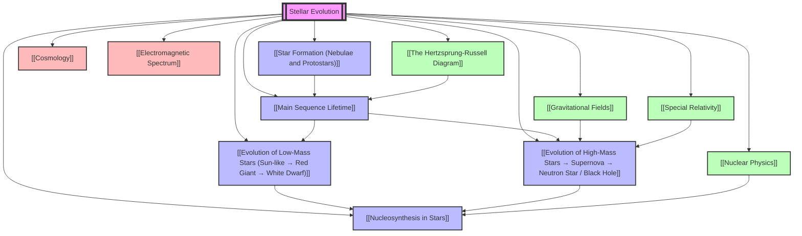

# 1. Overview / 概述

**English:**
Stellar Evolution is the study of the life cycle of stars—how they are born, how they live, and how they die. This topic traces the journey of a star from its formation in a [[Nebula]] to its final state as a [[White Dwarf]], [[Neutron Star]], or [[Black Hole]]. The entire process is governed by the balance between two opposing forces: **gravitational collapse** (which pulls matter inward) and **radiation pressure** (from nuclear fusion, which pushes outward). Understanding stellar evolution is fundamental to astrophysics because it explains the origin of elements ([[Nucleosynthesis]]), the energy output of stars, and the formation of exotic objects like [[Pulsars]] and [[Black Holes]].

In the Cambridge 9702 and Edexcel IAL A-Level Physics syllabuses, this topic builds directly on the [[The Hertzsprung-Russell Diagram]], which provides the observational framework for classifying stars by their luminosity and temperature. Students must understand how a star's mass determines its evolutionary path, the timescales involved, and the physical processes (nuclear fusion, gravitational contraction, degeneracy pressure) that drive each stage. Real-world applications include understanding the Sun's future (in about 5 billion years), the detection of [[Exoplanets]] via stellar evolution, and the use of [[Type Ia Supernovae]] as standard candles in [[Cosmology]].

**中文：**
恒星演化研究的是恒星的生命周期——它们如何诞生、如何生存以及如何死亡。本主题追踪恒星从[[星云]]中形成到最终状态（[[白矮星]]、[[中子星]]或[[黑洞]]）的整个过程。整个过程由两种相反力量之间的平衡控制：**引力坍缩**（将物质向内拉）和**辐射压力**（来自核聚变，向外推）。理解恒星演化是天体物理学的基础，因为它解释了元素的起源（[[核合成]]）、恒星的能量输出以及[[脉冲星]]和[[黑洞]]等奇异天体的形成。

在剑桥 9702 和爱德思 IAL A-Level 物理考纲中，本主题直接建立在[[赫罗图]]的基础上，赫罗图提供了按光度和温度对恒星进行分类的观测框架。学生必须理解恒星的质量如何决定其演化路径、所涉及的时间尺度以及驱动每个阶段的物理过程（核聚变、引力收缩、简并压力）。实际应用包括理解太阳的未来（大约 50 亿年后）、通过恒星演化探测[[系外行星]]，以及在[[宇宙学]]中使用[[Ia 型超新星]]作为标准烛光。

---

# 2. Syllabus Learning Objectives / 考纲学习目标

**English:**
The following table maps the specific learning objectives from both exam boards. Note that while the content is largely similar, Edexcel places greater emphasis on the quantitative treatment of the Chandrasekhar limit and the Schwarzschild radius, while CAIE focuses more on the qualitative description of evolutionary stages.

**中文：**
下表列出了两个考试委员会的具体学习目标。请注意，虽然内容大致相似，但爱德思更侧重于钱德拉塞卡极限和史瓦西半径的定量处理，而剑桥则更侧重于演化阶段的定性描述。

| CAIE 9702 (25.4 a-h) | Edexcel IAL (WPH14 U4: 10.19-10.25) |
|----------------------|--------------------------------------|
| (a) Describe the birth of a star from a [[Nebula]] to a [[Protostar]] | 10.19 Understand that stars form from interstellar gas and dust ([[Nebula]]) |
| (b) Describe the [[Main Sequence]] stage and the role of [[Hydrogen Fusion]] | 10.20 Understand the [[Main Sequence]] stage and the proton-proton chain |
| (c) Describe the evolution of a star like the Sun into a [[Red Giant]] and then a [[White Dwarf]] | 10.21 Describe the evolution of low-mass stars (Sun-like) → [[Red Giant]] → [[Planetary Nebula]] → [[White Dwarf]] |
| (d) Describe the evolution of a star much more massive than the Sun into a [[Red Supergiant]] | 10.22 Describe the evolution of high-mass stars → [[Red Supergiant]] → [[Supernova]] |
| (e) Describe the formation of a [[Neutron Star]] or [[Black Hole]] from a [[Supernova]] | 10.23 Understand the formation of [[Neutron Stars]] and [[Black Holes]] from supernovae |
| (f) Understand the [[Chandrasekhar Limit]] (1.4 M☉) for white dwarfs | 10.24 Know the [[Chandrasekhar Limit]] (1.4 solar masses) and its significance |
| (g) Understand the concept of the [[Schwarzschild Radius]] for black holes | 10.25 Understand the [[Schwarzschild Radius]] and the event horizon |
| (h) Recall the relationship between the [[Schwarzschild Radius]] and mass: $R_s = \frac{2GM}{c^2}$ | 10.25 Use the equation $R_s = \frac{2GM}{c^2}$ |

> 📋 **CIE Only:** CAIE requires students to describe the formation of a [[Planetary Nebula]] as an intermediate stage between a [[Red Giant]] and a [[White Dwarf]]. Edexcel does not explicitly name this stage but implies it.
>
> 📋 **Edexcel Only:** Edexcel expects students to recall the [[Chandrasekhar Limit]] as exactly 1.4 solar masses and to perform calculations involving the [[Schwarzschild Radius]]. CAIE also requires this but with less emphasis on numerical problems.

**Examiner Expectations / 考官期望:**
- **English:** You must be able to draw and annotate the evolutionary tracks on a [[The Hertzsprung-Russell Diagram]]. You should use precise terminology (e.g., "gravitational collapse" not just "gravity"). For calculations, always show your working and include units.
- **中文：** 你必须能够在[[赫罗图]]上绘制并标注演化轨迹。应使用精确术语（例如，"引力坍缩"而不仅仅是"重力"）。对于计算，始终展示你的解题过程并包含单位。

---

# 3. Core Definitions / 核心定义

**English:**
The following table provides the official definitions required by both exam boards. Pay special attention to the "Common Mistakes" column—these are frequently penalised in exams.

**中文：**
下表提供了两个考试委员会要求的官方定义。请特别注意"常见错误"一栏——这些在考试中经常被扣分。

| Term (EN/CN) | Definition (EN) | Definition (CN) | Common Mistakes / 常见错误 |
|--------------|-----------------|-----------------|---------------------------|
| [[Nebula]] / 星云 | A large cloud of gas (mainly hydrogen) and dust in interstellar space, from which stars are born. | 星际空间中巨大的气体（主要是氢）和尘埃云，恒星由此诞生。 | Confusing with a [[Galaxy]]; a nebula is much smaller. |
| [[Protostar]] / 原恒星 | A contracting mass of gas and dust in a [[Nebula]] that has not yet reached a high enough core temperature for [[Hydrogen Fusion]] to begin. | 星云中正在收缩的气体和尘埃团，其核心温度尚未高到足以开始[[氢聚变]]。 | Thinking a protostar is already a star; it is not—fusion has not started. |
| [[Main Sequence]] / 主序星 | The stage in a star's life when it is fusing hydrogen into helium in its core, and the star is in hydrostatic equilibrium. | 恒星生命中将核心中的氢聚变为氦，并处于流体静力学平衡的阶段。 | Confusing with the main sequence on the [[The Hertzsprung-Russell Diagram]]; the diagram is a plot, the stage is a period. |
| [[Red Giant]] / 红巨星 | A late stage in the evolution of a low-mass star (like the Sun) where the core contracts and heats, while the outer envelope expands and cools, making the star appear red. | 低质量恒星（如太阳）演化的后期阶段，核心收缩并加热，而外层膨胀并冷却，使恒星呈现红色。 | Thinking the red giant is the final stage; it is followed by a [[Planetary Nebula]] and [[White Dwarf]]. |
| [[White Dwarf]] / 白矮星 | The final stage of a low-mass star; a dense, hot, Earth-sized remnant supported by [[Electron Degeneracy Pressure]]. | 低质量恒星的最终阶段；由[[电子简并压力]]支撑的致密、炽热、地球大小的残骸。 | Confusing with a [[Neutron Star]]; white dwarfs are much larger and less dense. |
| [[Supernova]] / 超新星 | A catastrophic explosion of a high-mass star at the end of its life, outshining an entire galaxy for a short time. | 大质量恒星生命末期发生的灾难性爆炸，短时间内亮度超过整个星系。 | Thinking all stars end as supernovae; only high-mass stars do. |
| [[Neutron Star]] / 中子星 | An extremely dense remnant of a high-mass star after a [[Supernova]], composed almost entirely of neutrons and supported by [[Neutron Degeneracy Pressure]]. | 大质量恒星在[[超新星]]爆发后留下的极其致密的残骸，几乎完全由中子组成，由[[中子简并压力]]支撑。 | Confusing with a [[White Dwarf]]; neutron stars are much denser (city-sized). |
| [[Black Hole]] / 黑洞 | A region of spacetime where gravity is so strong that nothing, not even light, can escape; formed when a very high-mass star collapses beyond the [[Neutron Star]] stage. | 时空中的一个区域，引力如此之强，以至于任何东西（包括光）都无法逃脱；当非常大质量的恒星坍缩超过[[中子星]]阶段时形成。 |
| [[Chandrasekhar Limit]] / 钱德拉塞卡极限 | The maximum mass (approximately 1.4 solar masses) that a [[White Dwarf]] can have before it collapses under its own gravity. | [[白矮星]]在自身引力下坍缩之前所能拥有的最大质量（约 1.4 个太阳质量）。 | Forgetting the value (1.4 M☉) or confusing it with the [[Oppenheimer-Volkoff Limit]] (≈ 3 M☉ for neutron stars). |
| [[Schwarzschild Radius]] / 史瓦西半径 | The radius of the event horizon of a [[Black Hole]]; the distance from the singularity at which the escape velocity equals the speed of light. | [[黑洞]]事件视界的半径；从奇点出发逃逸速度等于光速的距离。 | Thinking it is the radius of the black hole's "surface"; there is no physical surface. |
| [[Event Horizon]] / 事件视界 | The boundary around a [[Black Hole]] beyond which no information or matter can escape. | [[黑洞]]周围的边界，超出此边界任何信息或物质都无法逃脱。 | Confusing with the [[Schwarzschild Radius]]; they are the same for a non-rotating black hole. |
| [[Planetary Nebula]] / 行星状星云 | A glowing shell of gas ejected by a low-mass star (like the Sun) during its [[Red Giant]] phase, before becoming a [[White Dwarf]]. | 低质量恒星（如太阳）在[[红巨星]]阶段喷出的发光气体壳层，之后成为[[白矮星]]。 | Confusing with a [[Nebula]] (star-forming region); a planetary nebula is a dying star's ejecta. |

---

# 4. Key Concepts Explained / 关键概念详解

## 4.1 Star Formation: From Nebula to Protostar / 恒星形成：从星云到原恒星

### Explanation / 解释
**English:**
Stars form inside giant molecular clouds called [[Nebula]]e. These clouds are composed primarily of hydrogen gas (≈ 75%) and helium (≈ 24%), with trace amounts of heavier elements (metals). The process begins when a region of the nebula becomes denser than its surroundings, often triggered by a nearby [[Supernova]] shockwave or a collision with another cloud. This denser region, called a **molecular cloud core**, begins to contract under its own gravity.

As the core contracts, gravitational potential energy is converted into kinetic energy, causing the temperature to rise. The core becomes a [[Protostar]]—a hot, dense ball of gas that is not yet hot enough for nuclear fusion. The protostar continues to contract slowly (over millions of years) until its core temperature reaches about 10 million Kelvin (10⁷ K). At this point, [[Hydrogen Fusion]] ignites, and the star enters the [[Main Sequence]] stage.

The key physics here is the **Virial Theorem**: for a self-gravitating system in equilibrium, half of the gravitational potential energy released goes into thermal energy (heating the star), and half is radiated away as light.

**中文：**
恒星在称为[[星云]]的巨型分子云中形成。这些云主要由氢气（约 75%）和氦气（约 24%）组成，并含有微量重元素（金属）。当星云的某个区域变得比周围更致密时，过程就开始了，这通常是由附近的[[超新星]]冲击波或与另一云团的碰撞触发的。这个更致密的区域称为**分子云核**，开始在自身引力作用下收缩。

随着云核收缩，引力势能转化为动能，导致温度升高。云核变成[[原恒星]]——一个炽热、致密的气体球，但温度还不足以进行核聚变。原恒星继续缓慢收缩（数百万年），直到其核心温度达到约 1000 万开尔文（10⁷ K）。此时，[[氢聚变]]被点燃，恒星进入[[主序星]]阶段。

这里的关键物理是**维里定理**：对于一个自引力平衡系统，释放的引力势能的一半转化为热能（加热恒星），另一半以光的形式辐射出去。

### Physical Meaning / 物理意义
**English:**
This process explains why stars are hot and bright. The energy that powers a star initially comes from gravitational contraction, not fusion. It also explains why star formation occurs in clusters—a single nebula can spawn hundreds or thousands of stars.

**中文：**
这个过程解释了为什么恒星是炽热而明亮的。最初为恒星提供能量的不是聚变，而是引力收缩。这也解释了为什么恒星形成发生在星团中——一个星云可以孕育出成百上千颗恒星。

### Common Misconceptions / 常见误区
1. **"A protostar is a star."** → No. A protostar has not yet started fusion. It is a "failed star" until fusion ignites.
2. **"Star formation is instantaneous."** → No. It takes millions of years for a protostar to become a main sequence star.
3. **"All nebulae form stars."** → No. Some nebulae are remnants of dead stars (e.g., [[Planetary Nebula]]e).

### Exam Tips / 考试提示
**English:**
- CAIE often asks: "Describe how a star is formed from a nebula." Use the words: gravitational collapse, gravitational potential energy → kinetic energy → thermal energy, protostar, fusion ignition.
- Edexcel may ask: "Explain why the core temperature must reach 10⁷ K for fusion to occur." Answer: To overcome the electrostatic repulsion (Coulomb barrier) between protons.
- Both boards expect you to mention the role of a [[Supernova]] shockwave as a trigger.

**中文：**
- 剑桥常问："描述恒星如何从星云形成。"使用词语：引力坍缩、引力势能→动能→热能、原恒星、聚变点燃。
- 爱德思可能问："解释为什么核心温度必须达到 10⁷ K 才能发生聚变。"答案：为了克服质子之间的静电排斥（库仑势垒）。
- 两个考试委员会都期望你提到[[超新星]]冲击波作为触发因素的作用。

> 📷 **IMAGE PROMPT — [SE-01]: Star Formation in the Eagle Nebula**
>
> A wide-angle view of the Eagle Nebula (M16) showing the "Pillars of Creation." Dark, dense molecular cloud cores are visible at the tips of the pillars, with young protostars glowing inside. The background is a rich tapestry of interstellar gas and dust in deep reds, oranges, and blues. Style: Hubble Space Telescope true-color composite, high resolution, dramatic lighting.

---

## 4.2 Main Sequence Lifetime / 主序星寿命

### Explanation / 解释
**English:**
The [[Main Sequence]] is the longest stage of a star's life, typically lasting billions of years. During this stage, the star is in **hydrostatic equilibrium**: the inward pull of gravity is exactly balanced by the outward radiation pressure from [[Hydrogen Fusion]] in the core.

The fusion process in Sun-like stars is the **proton-proton (p-p) chain**:
$$ 4^1_1\text{H} \rightarrow ^4_2\text{He} + 2e^+ + 2\nu_e + \gamma $$
This converts 0.7% of the mass of hydrogen into energy (via $E = mc^2$).

The lifetime of a star on the main sequence depends critically on its mass:
- **Low-mass stars (e.g., 0.5 M☉):** Burn fuel slowly → lifetime > 100 billion years (longer than the current age of the universe).
- **Sun-like stars (1 M☉):** Lifetime ≈ 10 billion years.
- **High-mass stars (e.g., 10 M☉):** Burn fuel rapidly → lifetime ≈ 30 million years.

The relationship is approximately: $t \propto M^{-2.5}$, where $t$ is the main sequence lifetime and $M$ is the mass.

**中文：**
[[主序星]]阶段是恒星生命中最长的阶段，通常持续数十亿年。在这个阶段，恒星处于**流体静力学平衡**：向内的引力恰好被核心[[氢聚变]]产生的向外辐射压力平衡。

类太阳恒星的聚变过程是**质子-质子（p-p）链**：
$$ 4^1_1\text{H} \rightarrow ^4_2\text{He} + 2e^+ + 2\nu_e + \gamma $$
这会将氢质量的 0.7% 转化为能量（通过 $E = mc^2$）。

恒星在主序星上的寿命关键取决于其质量：
- **低质量恒星（例如 0.5 M☉）：** 缓慢燃烧燃料 → 寿命 > 1000 亿年（比宇宙当前年龄还长）。
- **类太阳恒星（1 M☉）：** 寿命 ≈ 100 亿年。
- **大质量恒星（例如 10 M☉）：** 快速燃烧燃料 → 寿命 ≈ 3000 万年。

关系近似为：$t \propto M^{-2.5}$，其中 $t$ 是主序星寿命，$M$ 是质量。

### Physical Meaning / 物理意义
**English:**
This explains why we see so many massive, bright stars (like [[Betelgeuse]]) that are relatively young—they burn out quickly. It also explains why the Sun is only halfway through its life.

**中文：**
这解释了为什么我们看到许多大质量、明亮的恒星（如[[参宿四]]）相对年轻——它们燃烧得很快。这也解释了为什么太阳只走过了其生命的一半。

### Common Misconceptions / 常见误区
1. **"More massive stars live longer."** → False. They have more fuel but burn it at a much higher rate.
2. **"All stars spend the same fraction of their life on the main sequence."** → True, about 90% of a star's life is on the main sequence.
3. **"The Sun will explode."** → False. The Sun is too low-mass to become a [[Supernova]].

### Exam Tips / 考试提示
**English:**
- CAIE may ask: "Explain why a massive star has a shorter main sequence lifetime than a low-mass star." Use the mass-luminosity relation: $L \propto M^{3.5}$, so fuel consumption rate is much higher.
- Edexcel may ask: "Calculate the main sequence lifetime of a star of mass 5 M☉." Use the proportionality $t \propto M^{-2.5}$.
- Both boards expect you to know that the Sun's main sequence lifetime is about 10 billion years.

**中文：**
- 剑桥可能问："解释为什么大质量恒星的主序星寿命比低质量恒星短。"使用质光关系：$L \propto M^{3.5}$，因此燃料消耗率更高。
- 爱德思可能问："计算质量为 5 M☉ 的恒星的主序星寿命。"使用比例关系 $t \propto M^{-2.5}$。
- 两个考试委员会都期望你知道太阳的主序星寿命约为 100 亿年。

---

## 4.3 Evolution of Low-Mass Stars (Sun-like → Red Giant → White Dwarf) / 低质量恒星的演化（类太阳 → 红巨星 → 白矮星）

### Explanation / 解释
**English:**
When a low-mass star (0.5 M☉ to about 8 M☉) exhausts the hydrogen in its core, it leaves the [[Main Sequence]] and enters the [[Red Giant]] phase.

**Stage 1: Core Hydrogen Exhaustion**
The core, now mostly helium, stops fusing. Without radiation pressure, gravity causes the core to contract. This contraction heats the core and also heats a shell of hydrogen around the core, igniting **shell hydrogen fusion**.

**Stage 2: Red Giant Phase**
The shell fusion produces enormous energy, which pushes the outer layers of the star outward. The star expands to 100-1000 times its original size. The surface cools (hence "red"), but the total luminosity increases dramatically. The star is now a [[Red Giant]].

**Stage 3: Helium Flash (for stars > 0.5 M☉)**
When the core temperature reaches about 10⁸ K, [[Helium Fusion]] (the triple-alpha process) ignites:
$$ 3^4_2\text{He} \rightarrow ^{12}_6\text{C} + \gamma $$
This happens explosively (the "helium flash") because the core is supported by [[Electron Degeneracy Pressure]], so the pressure does not regulate the fusion rate.

**Stage 4: Planetary Nebula**
After the helium is exhausted, the star ejects its outer layers, forming a beautiful glowing shell called a [[Planetary Nebula]].

**Stage 5: White Dwarf**
The remaining core, composed mainly of carbon and oxygen, collapses to an Earth-sized object supported by [[Electron Degeneracy Pressure]]. This is a [[White Dwarf]]. It has no internal energy source and will slowly cool over billions of years.

**中文：**
当低质量恒星（0.5 M☉ 到约 8 M☉）耗尽核心中的氢时，它离开[[主序星]]阶段，进入[[红巨星]]阶段。

**阶段 1：核心氢耗尽**
核心（现在主要是氦）停止聚变。没有辐射压力，引力导致核心收缩。这种收缩加热了核心，也加热了核心周围的一层氢，点燃了**壳层氢聚变**。

**阶段 2：红巨星阶段**
壳层聚变产生巨大能量，将恒星外层向外推。恒星膨胀到原始大小的 100-1000 倍。表面冷却（因此呈"红色"），但总光度急剧增加。恒星现在是一颗[[红巨星]]。

**阶段 3：氦闪（对于 > 0.5 M☉ 的恒星）**
当核心温度达到约 10⁸ K 时，[[氦聚变]]（三阿尔法过程）被点燃：
$$ 3^4_2\text{He} \rightarrow ^{12}_6\text{C} + \gamma $$
这以爆炸性方式发生（"氦闪"），因为核心由[[电子简并压力]]支撑，所以压力不会调节聚变速率。

**阶段 4：行星状星云**
氦耗尽后，恒星喷出其外层，形成一个美丽的发光壳层，称为[[行星状星云]]。

**阶段 5：白矮星**
剩余的核心（主要由碳和氧组成）坍缩成一个地球大小的天体，由[[电子简并压力]]支撑。这就是[[白矮星]]。它没有内部能源，将在数十亿年内缓慢冷却。

### Physical Meaning / 物理意义
**English:**
This process explains the fate of the Sun. In about 5 billion years, the Sun will become a [[Red Giant]], engulfing Mercury, Venus, and possibly Earth. It will then become a [[White Dwarf]], cooling for eternity.

**中文：**
这个过程解释了太阳的命运。大约 50 亿年后，太阳将变成[[红巨星]]，吞噬水星、金星，可能还有地球。然后它将变成[[白矮星]]，永远冷却。

### Common Misconceptions / 常见误区
1. **"The Sun will become a black hole."** → False. The Sun is too low-mass.
2. **"A white dwarf is still fusing."** → False. Fusion has stopped; it is just a cooling remnant.
3. **"Planetary nebula is where planets form."** → False. The name is historical; it has nothing to do with planets.

### Exam Tips / 考试提示
**English:**
- CAIE often asks: "Describe the evolution of a star like the Sun after the main sequence." Use the sequence: red giant → helium flash → planetary nebula → white dwarf.
- Edexcel may ask: "Explain why a white dwarf is supported by electron degeneracy pressure." Answer: Because the core is so dense that electrons are packed together, and the Pauli Exclusion Principle prevents further compression.
- Both boards expect you to know that the [[Chandrasekhar Limit]] (1.4 M☉) is the maximum mass for a white dwarf.

**中文：**
- 剑桥常问："描述像太阳这样的恒星在主序星之后的演化。"使用序列：红巨星 → 氦闪 → 行星状星云 → 白矮星。
- 爱德思可能问："解释为什么白矮星由电子简并压力支撑。"答案：因为核心密度如此之大，电子被挤压在一起，泡利不相容原理阻止进一步压缩。
- 两个考试委员会都期望你知道[[钱德拉塞卡极限]]（1.4 M☉）是白矮星的最大质量。

> 📷 **IMAGE PROMPT — [SE-02]: Life Cycle of a Sun-like Star**
>
> A horizontal infographic showing the stages: Nebula → Main Sequence (Sun) → Red Giant → Planetary Nebula → White Dwarf. Each stage is a labeled circle with a small illustration. The Sun stage is yellow, the Red Giant is orange-red and large, the Planetary Nebula is a green-blue glowing ring, and the White Dwarf is a tiny white dot. Style: clean educational diagram, flat vector art, white background, clear labels in English.

---

## 4.4 Evolution of High-Mass Stars → Supernova → Neutron Star / Black Hole / 大质量恒星的演化 → 超新星 → 中子星 / 黑洞

### Explanation / 解释
**English:**
Stars with initial masses greater than about 8 M☉ follow a dramatically different path. They burn through their nuclear fuel much faster and end their lives in a catastrophic explosion called a [[Supernova]].

**Stage 1: Main Sequence and Beyond**
High-mass stars fuse hydrogen via the **CNO cycle** (carbon-nitrogen-oxygen cycle), which is more efficient than the p-p chain. After hydrogen exhaustion, they become [[Red Supergiant]]s.

**Stage 2: Onion-Shell Structure**
In a red supergiant, the core undergoes successive fusion stages, creating an "onion-skin" structure:
- Innermost core: Iron (Fe)
- Shells around: Silicon (Si), Oxygen (O), Neon (Ne), Carbon (C), Helium (He), Hydrogen (H)

Each fusion stage produces heavier elements and releases energy—until iron.

**Stage 3: Iron Core Collapse**
Iron-56 is the most stable nucleus. Fusing iron **absorbs** energy rather than releasing it. When the iron core reaches about 1.4 M☉ (the [[Chandrasekhar Limit]]), it can no longer support itself. The core collapses in milliseconds.

**Stage 4: Core Bounce and Supernova**
The collapse is halted when the core reaches nuclear density (≈ 10¹⁷ kg/m³). The in-falling material "bounces" off the rigid core, creating a shockwave that tears the star apart. This is a **Type II Supernova** (core-collapse supernova). The explosion releases more energy in a few seconds than the Sun will in its entire lifetime.

**Stage 5: Remnant**
- If the remaining core mass is between 1.4 M☉ and about 3 M☉ (the [[Oppenheimer-Volkoff Limit]]), it becomes a [[Neutron Star]]—a city-sized object supported by [[Neutron Degeneracy Pressure]].
- If the remaining core mass exceeds about 3 M☉, even neutron degeneracy pressure cannot support it, and it collapses to a [[Black Hole]].

**中文：**
初始质量大于约 8 M☉ 的恒星遵循一条截然不同的路径。它们更快地燃烧核燃料，并以称为[[超新星]]的灾难性爆炸结束生命。

**阶段 1：主序星及之后**
大质量恒星通过**CNO 循环**（碳-氮-氧循环）聚变氢，这比 p-p 链更高效。氢耗尽后，它们变成[[红超巨星]]。

**阶段 2：洋葱壳结构**
在红超巨星中，核心经历连续的聚变阶段，形成"洋葱皮"结构：
- 最内核心：铁 (Fe)
- 周围壳层：硅 (Si)、氧 (O)、氖 (Ne)、碳 (C)、氦 (He)、氢 (H)

每个聚变阶段都会产生更重的元素并释放能量——直到铁。

**阶段 3：铁核心坍缩**
铁-56 是最稳定的原子核。聚变铁**吸收**能量而不是释放能量。当铁核心达到约 1.4 M☉（[[钱德拉塞卡极限]]）时，它再也无法支撑自身。核心在毫秒内坍缩。

**阶段 4：核心反弹与超新星**
当核心达到核密度（≈ 10¹⁷ kg/m³）时，坍缩停止。下落的物质从刚性核心"反弹"，产生撕裂恒星的冲击波。这就是**II 型超新星**（核心坍缩超新星）。爆炸在几秒钟内释放的能量比太阳在其整个生命周期中释放的还要多。

**阶段 5：残骸**
- 如果剩余核心质量在 1.4 M☉ 和约 3 M☉（[[奥本海默-沃尔科夫极限]]）之间，则变成[[中子星]]——一个城市大小的天体，由[[中子简并压力]]支撑。
- 如果剩余核心质量超过约 3 M☉，即使中子简并压力也无法支撑，它会坍缩成[[黑洞]]。

### Physical Meaning / 物理意义
**English:**
This process is responsible for creating all elements heavier than iron (e.g., gold, silver, uranium) through rapid neutron capture (the r-process) during the supernova explosion. We are literally made of stardust.

**中文：**
这个过程负责通过超新星爆炸期间的快速中子捕获（r-过程）创造所有比铁重的元素（例如，金、银、铀）。我们本质上是由星尘构成的。

### Common Misconceptions / 常见误区
1. **"All stars become supernovae."** → False. Only high-mass stars (> 8 M☉) do.
2. **"A supernova is the death of a star."** → Partially true. It is the death of the star, but it also creates new elements and triggers new star formation.
3. **"Black holes are 'holes' in space."** → False. They are extremely dense objects with intense gravity.

### Exam Tips / 考试提示
**English:**
- CAIE often asks: "Describe the formation of a neutron star or black hole." Use the sequence: red supergiant → iron core → core collapse → supernova → remnant.
- Edexcel may ask: "Explain why iron cannot be used as a nuclear fuel in stars." Answer: Iron-56 has the highest binding energy per nucleon; fusing it requires energy input.
- Both boards expect you to know the [[Chandrasekhar Limit]] (1.4 M☉) and the concept of the [[Schwarzschild Radius]].

**中文：**
- 剑桥常问："描述中子星或黑洞的形成。"使用序列：红超巨星 → 铁核心 → 核心坍缩 → 超新星 → 残骸。
- 爱德思可能问："解释为什么铁不能用作恒星中的核燃料。"答案：铁-56 具有最高的每核子结合能；聚变它需要能量输入。
- 两个考试委员会都期望你知道[[钱德拉塞卡极限]]（1.4 M☉）和[[史瓦西半径]]的概念。

> 📷 **IMAGE PROMPT — [SE-03]: Supernova 1987A Remnant**
>
> A Hubble Space Telescope image of Supernova 1987A. The central ring is bright pink and blue, with two outer rings. The explosion site is a bright white spot in the center. Surrounding the rings is a faint, diffuse glow of ejected material. Style: true-color composite, high contrast, deep space background with faint stars.

---

## 4.5 Nucleosynthesis in Stars / 恒星中的核合成

### Explanation / 解释
**English:**
[[Nucleosynthesis]] is the process by which elements are created inside stars. There are three main types:

1. **Big Bang Nucleosynthesis:** Created hydrogen, helium, and trace lithium in the first few minutes of the universe.
2. **Stellar Nucleosynthesis:** Creates elements up to iron in the cores of stars.
3. **Supernova Nucleosynthesis:** Creates elements heavier than iron during supernova explosions.

The key fusion chains are:
- **Proton-Proton Chain (p-p):** H → He (in Sun-like stars)
- **CNO Cycle:** H → He (in massive stars, using C, N, O as catalysts)
- **Triple-Alpha Process:** 3 He → C (in red giants)
- **Alpha Process:** C → O → Ne → Mg → Si → S → Ar → Ca → Ti → Cr → Fe (successive helium capture in massive stars)

**中文：**
[[核合成]]是在恒星内部创造元素的过程。主要有三种类型：

1. **大爆炸核合成：** 在宇宙最初的几分钟内创造了氢、氦和微量锂。
2. **恒星核合成：** 在恒星核心中创造直到铁的元素。
3. **超新星核合成：** 在超新星爆炸期间创造比铁重的元素。

关键的聚变链是：
- **质子-质子链 (p-p)：** H → He（在类太阳恒星中）
- **CNO 循环：** H → He（在大质量恒星中，使用 C、N、O 作为催化剂）
- **三阿尔法过程：** 3 He → C（在红巨星中）
- **阿尔法过程：** C → O → Ne → Mg → Si → S → Ar → Ca → Ti → Cr → Fe（大质量恒星中连续的氦捕获）

### Physical Meaning / 物理意义
**English:**
This explains the cosmic abundance of elements. Hydrogen and helium are most abundant (from the Big Bang). Carbon and oxygen are common (from red giants). Iron is common (from massive stars). Gold and uranium are rare (from supernovae).

**中文：**
这解释了元素的宇宙丰度。氢和氦最丰富（来自大爆炸）。碳和氧很常见（来自红巨星）。铁很常见（来自大质量恒星）。金和铀很稀有（来自超新星）。

### Common Misconceptions / 常见误区
1. **"All elements are made in the Big Bang."** → False. Only the lightest elements were.
2. **"Iron is the heaviest element made in stars."** → True for normal stellar fusion; heavier elements require supernovae.
3. **"Gold is made in the core of a star."** → False. Gold is made in supernova explosions (r-process).

### Exam Tips / 考试提示
**English:**
- CAIE may ask: "Explain why elements heavier than iron are not produced in normal stellar fusion." Answer: Iron-56 has the highest binding energy per nucleon; fusing it requires energy.
- Edexcel may ask: "State the process by which carbon is produced in stars." Answer: The triple-alpha process (3 He → C).
- Both boards expect you to know that the [[Chandrasekhar Limit]] is related to the maximum mass of a white dwarf.

**中文：**
- 剑桥可能问："解释为什么比铁重的元素不在正常的恒星聚变中产生。"答案：铁-56 具有最高的每核子结合能；聚变它需要能量。
- 爱德思可能问："陈述碳在恒星中产生的过程。"答案：三阿尔法过程（3 He → C）。
- 两个考试委员会都期望你知道[[钱德拉塞卡极限]]与白矮星的最大质量有关。

---

# 5. Essential Equations / 核心公式

## 5.1 Mass-Energy Equivalence / 质能等价

**Equation / 公式:**
$$ E = mc^2 $$

**Variables / 变量:**
| Symbol (符号) | Meaning (EN) | Meaning (CN) | Unit (单位) |
|--------------|-------------|-------------|------------|
| $E$ | Energy released | 释放的能量 | J (joules) |
| $m$ | Mass defect (mass converted to energy) | 质量亏损（转化为能量的质量） | kg |
| $c$ | Speed of light in vacuum (3.00 × 10⁸ m/s) | 真空中的光速 | m/s |

**Derivation / 推导:**
**English:** This is Einstein's famous equation from special relativity. It is not derived in A-Level physics but is used to calculate the energy released in nuclear fusion. For example, in the proton-proton chain, 0.7% of the mass of four hydrogen nuclei is converted into energy.

**中文：** 这是爱因斯坦狭义相对论的著名方程。在 A-Level 物理中不推导，但用于计算核聚变中释放的能量。例如，在质子-质子链中，四个氢核质量的 0.7% 转化为能量。

**Conditions / 适用条件:**
**English:** Applies to any process where mass is converted to energy (nuclear fusion, fission, annihilation). The mass must be the "rest mass" (mass at rest).

**中文：** 适用于任何质量转化为能量的过程（核聚变、裂变、湮灭）。质量必须是"静止质量"。

**Limitations / 局限性:**
**English:** Does not account for kinetic energy of particles before the reaction; only the rest mass difference matters.

**中文：** 不考虑反应前粒子的动能；只有静止质量差重要。

**Rearrangements / 变形:**
$$ m = \frac{E}{c^2} $$
$$ c = \sqrt{\frac{E}{m}} $$

---

## 5.2 Mass-Luminosity Relation / 质光关系

**Equation / 公式:**
$$ L \propto M^{3.5} $$

**Variables / 变量:**
| Symbol (符号) | Meaning (EN) | Meaning (CN) | Unit (单位) |
|--------------|-------------|-------------|------------|
| $L$ | Luminosity of the star | 恒星的光度 | W (watts) |
| $M$ | Mass of the star | 恒星的质量 | kg (or solar masses M☉) |

**Derivation / 推导:**
**English:** This is an empirical relation derived from observations of main sequence stars. It is not derived theoretically at A-Level. The exponent 3.5 is an approximation; for very massive stars, the exponent is closer to 3.0.

**中文：** 这是从主序星观测中得出的经验关系。在 A-Level 中不进行理论推导。指数 3.5 是近似值；对于非常大质量的恒星，指数更接近 3.0。

**Conditions / 适用条件:**
**English:** Only applies to [[Main Sequence]] stars. Does not apply to giants, supergiants, or white dwarfs.

**中文：** 仅适用于[[主序星]]。不适用于巨星、超巨星或白矮星。

**Limitations / 局限性:**
**English:** The exponent varies slightly with mass range. For low-mass stars (< 0.5 M☉), the exponent is about 2.3.

**中文：** 指数随质量范围略有变化。对于低质量恒星（< 0.5 M☉），指数约为 2.3。

**Rearrangements / 变形:**
$$ \frac{L}{L_\odot} = \left(\frac{M}{M_\odot}\right)^{3.5} $$
where $L_\odot$ and $M_\odot$ are the Sun's luminosity and mass.

---

## 5.3 Main Sequence Lifetime / 主序星寿命

**Equation / 公式:**
$$ t_{\text{MS}} \propto \frac{M}{L} \propto M^{-2.5} $$

**Variables / 变量:**
| Symbol (符号) | Meaning (EN) | Meaning (CN) | Unit (单位) |
|--------------|-------------|-------------|------------|
| $t_{\text{MS}}$ | Main sequence lifetime | 主序星寿命 | years |
| $M$ | Mass of the star | 恒星质量 | kg (or M☉) |
| $L$ | Luminosity of the star | 恒星光度 | W (or L☉) |

**Derivation / 推导:**
**English:** The lifetime is proportional to the amount of fuel (mass) divided by the rate of fuel consumption (luminosity). Using $L \propto M^{3.5}$, we get $t \propto M / M^{3.5} = M^{-2.5}$.

**中文：** 寿命与燃料量（质量）除以燃料消耗率（光度）成正比。使用 $L \propto M^{3.5}$，我们得到 $t \propto M / M^{3.5} = M^{-2.5}$。

**Conditions / 适用条件:**
**English:** Only applies to [[Main Sequence]] stars. Assumes the star burns all its hydrogen (about 10% of its mass is available as fuel).

**中文：** 仅适用于[[主序星]]。假设恒星燃烧其所有氢（约 10% 的质量可用作燃料）。

**Limitations / 局限性:**
**English:** Does not account for changes in luminosity during the main sequence phase (stars slowly brighten over time).

**中文：** 不考虑主序星阶段光度的变化（恒星随时间缓慢变亮）。

**Rearrangements / 变形:**
$$ \frac{t_{\text{MS}}}{t_{\odot}} = \left(\frac{M}{M_\odot}\right)^{-2.5} $$
where $t_{\odot} \approx 10^{10}$ years (Sun's main sequence lifetime).

---

## 5.4 Schwarzschild Radius / 史瓦西半径

**Equation / 公式:**
$$ R_s = \frac{2GM}{c^2} $$

**Variables / 变量:**
| Symbol (符号) | Meaning (EN) | Meaning (CN) | Unit (单位) |
|--------------|-------------|-------------|------------|
| $R_s$ | Schwarzschild radius (event horizon radius) | 史瓦西半径（事件视界半径） | m |
| $G$ | Gravitational constant (6.67 × 10⁻¹¹ N m²/kg²) | 引力常数 | N m²/kg² |
| $M$ | Mass of the black hole | 黑洞质量 | kg |
| $c$ | Speed of light (3.00 × 10⁸ m/s) | 光速 | m/s |

**Derivation / 推导:**
**English:** The Schwarzschild radius is derived by setting the escape velocity equal to the speed of light:
$$ v_{\text{esc}} = \sqrt{\frac{2GM}{R}} = c $$
Squaring both sides:
$$ \frac{2GM}{R} = c^2 $$
Rearranging:
$$ R = \frac{2GM}{c^2} = R_s $$

**中文：** 史瓦西半径通过将逃逸速度设为光速来推导：
$$ v_{\text{esc}} = \sqrt{\frac{2GM}{R}} = c $$
两边平方：
$$ \frac{2GM}{R} = c^2 $$
整理：
$$ R = \frac{2GM}{c^2} = R_s $$

**Conditions / 适用条件:**
**English:** Applies to non-rotating (Schwarzschild) black holes. For rotating (Kerr) black holes, the event horizon is smaller.

**中文：** 适用于非旋转（史瓦西）黑洞。对于旋转（克尔）黑洞，事件视界更小。

**Limitations / 局限性:**
**English:** This is a classical derivation. A full general relativistic derivation gives the same result for non-rotating black holes.

**中文：** 这是经典推导。完整的广义相对论推导对非旋转黑洞给出相同结果。

**Rearrangements / 变形:**
$$ M = \frac{R_s c^2}{2G} $$
$$ G = \frac{R_s c^2}{2M} $$

---

## 5.5 Chandrasekhar Limit / 钱德拉塞卡极限

**Equation / 公式:**
$$ M_{\text{Ch}} \approx 1.4 M_\odot $$

**Variables / 变量:**
| Symbol (符号) | Meaning (EN) | Meaning (CN) | Unit (单位) |
|--------------|-------------|-------------|------------|
| $M_{\text{Ch}}$ | Chandrasekhar limit | 钱德拉塞卡极限 | kg (or M☉) |
| $M_\odot$ | Solar mass (1.99 × 10³⁰ kg) | 太阳质量 | kg |

**Derivation / 推导:**
**English:** The derivation involves balancing [[Electron Degeneracy Pressure]] against gravitational pressure. It is not required at A-Level, but you must know the value (1.4 M☉) and its significance: a white dwarf with mass exceeding this limit will collapse into a [[Neutron Star]].

**中文：** 推导涉及平衡[[电子简并压力]]与引力压力。A-Level 不要求推导，但你必须知道数值（1.4 M☉）及其意义：质量超过此极限的白矮星将坍缩成[[中子星]]。

**Conditions / 适用条件:**
**English:** Applies to [[White Dwarf]] stars. The limit is the maximum mass that can be supported by electron degeneracy pressure.

**中文：** 适用于[[白矮星]]。该极限是电子简并压力所能支撑的最大质量。

**Limitations / 局限性:**
**English:** Does not account for rotation or magnetic fields, which can slightly increase the maximum mass.

**中文：** 不考虑旋转或磁场，这些因素可以略微增加最大质量。

**Rearrangements / 变形:**
$$ M_{\text{Ch}} = 1.4 \times (1.99 \times 10^{30} \text{ kg}) = 2.79 \times 10^{30} \text{ kg} $$

---

# 6. Graphs and Relationships / 图表与关系

## 6.1 The Hertzsprung-Russell Diagram (HR Diagram) / 赫罗图

### Axes / 坐标轴
**English:**
- **X-axis:** Spectral class (O, B, A, F, G, K, M) OR surface temperature (decreasing from left to right: 30,000 K → 3,000 K)
- **Y-axis:** Luminosity (in solar units, L☉) OR absolute magnitude (increasing upward)

**中文：**
- **X 轴：** 光谱类型 (O, B, A, F, G, K, M) 或表面温度（从左到右递减：30,000 K → 3,000 K）
- **Y 轴：** 光度（以太阳光度 L☉ 为单位）或绝对星等（向上递增）

### Shape / 形状
**English:**
The main sequence is a diagonal band from top-left (hot, bright) to bottom-right (cool, dim). The red giant branch is a cluster of stars above and to the right of the main sequence. White dwarfs are below and to the left.

**中文：**
主序星是从左上角（热、亮）到右下角（冷、暗）的对角线带。红巨星分支是主序星上方和右侧的一簇恒星。白矮星位于下方和左侧。

### Gradient Meaning / 斜率含义
**English:**
The slope of the main sequence reflects the mass-luminosity relation ($L \propto M^{3.5}$). More massive stars are hotter and brighter.

**中文：**
主序星的斜率反映了质光关系 ($L \propto M^{3.5}$)。质量越大的恒星越热、越亮。

### Area Meaning / 面积含义
**English:**
The area of the HR diagram where a star is located indicates its evolutionary stage. The main sequence is where stars spend 90% of their lives.

**中文：**
赫罗图上恒星所在的区域表示其演化阶段。主序星是恒星度过其 90% 生命的地方。

### Exam Interpretation / 考试解读
**English:**
- CAIE: "Draw the evolutionary track of a Sun-like star on the HR diagram." Start on the main sequence, move up and right (red giant), then move left and down (white dwarf).
- Edexcel: "Explain why a red giant is more luminous than a main sequence star of the same mass." Answer: It has a much larger surface area.

**中文：**
- 剑桥："在赫罗图上绘制类太阳恒星的演化轨迹。"从主序星开始，向右上移动（红巨星），然后向左下移动（白矮星）。
- 爱德思："解释为什么红巨星比相同质量的主序星更亮。"答案：它的表面积大得多。

### Common Questions / 常见问题
**English:**
- "Where on the HR diagram would you find a white dwarf?" → Bottom-left.
- "What is the significance of the main sequence?" → It is where stars fuse hydrogen in their cores.

**中文：**
- "在赫罗图上哪里可以找到白矮星？" → 左下角。
- "主序星有什么意义？" → 这是恒星在核心中聚变氢的地方。

> 📷 **IMAGE PROMPT — [SE-04]: Hertzsprung-Russell Diagram with Evolutionary Tracks**
>
> A standard HR diagram with labeled axes: X-axis "Spectral Class (O B A F G K M)" and "Temperature (K)" decreasing left to right; Y-axis "Luminosity (L☉)" increasing upward. The main sequence is a thick diagonal band. Two evolutionary tracks are drawn: one for a Sun-like star (moving to red giant, then to white dwarf) and one for a massive star (moving to red supergiant, then to supernova). Key regions labeled: "Main Sequence," "Red Giants," "White Dwarfs," "Supergiants." Style: clean scientific diagram, vector graphics, color-coded tracks.

---

## 6.2 Mass-Luminosity Graph / 质光关系图

### Axes / 坐标轴
**English:**
- **X-axis:** Mass (in solar masses, M☉)
- **Y-axis:** Luminosity (in solar luminosities, L☉)

**中文：**
- **X 轴：** 质量（以太阳质量 M☉ 为单位）
- **Y 轴：** 光度（以太阳光度 L☉ 为单位）

### Shape / 形状
**English:**
A power-law curve: $L \propto M^{3.5}$. On a log-log plot, this appears as a straight line with slope 3.5.

**中文：**
幂律曲线：$L \propto M^{3.5}$。在对数-对数图上，这表现为斜率为 3.5 的直线。

### Gradient Meaning / 斜率含义
**English:**
The gradient on a log-log plot is the exponent in the mass-luminosity relation (≈ 3.5).

**中文：**
对数-对数图上的梯度是质光关系中的指数（≈ 3.5）。

### Area Meaning / 面积含义
**English:**
Points above the line are overluminous for their mass (e.g., red giants). Points below are underluminous (e.g., white dwarfs).

**中文：**
线上方的点相对于其质量过亮（例如，红巨星）。线下方的点过暗（例如，白矮星）。

### Exam Interpretation / 考试解读
**English:**
- "Use the mass-luminosity relation to estimate the luminosity of a 5 M☉ star." → $L = 5^{3.5} L_\odot \approx 280 L_\odot$.
- "Explain why a 10 M☉ star has a shorter lifetime than a 1 M☉ star." → It has more fuel but burns it at a much higher rate.

**中文：**
- "使用质光关系估计 5 M☉ 恒星的光度。" → $L = 5^{3.5} L_\odot \approx 280 L_\odot$。
- "解释为什么 10 M☉ 恒星的寿命比 1 M☉ 恒星短。" → 它有更多燃料，但燃烧速率高得多。

### Common Questions / 常见问题
**English:**
- "Plot the mass-luminosity relation on a log-log scale." (Practical skill)
- "Determine the mass of a star with luminosity 1000 L☉." → $M = (1000)^{1/3.5} M_\odot \approx 7.2 M_\odot$.

**中文：**
- "在对数-对数坐标上绘制质光关系。"（实验技能）
- "确定光度为 1000 L☉ 的恒星的质量。" → $M = (1000)^{1/3.5} M_\odot \approx 7.2 M_\odot$。

---

## 6.3 Binding Energy per Nucleon Graph / 每核子结合能图

### Axes / 坐标轴
**English:**
- **X-axis:** Mass number (A)
- **Y-axis:** Binding energy per nucleon (MeV)

**中文：**
- **X 轴：** 质量数 (A)
- **Y 轴：** 每核子结合能 (MeV)

### Shape / 形状
**English:**
A curve that rises sharply from hydrogen (≈ 0 MeV) to a peak at iron-56 (≈ 8.8 MeV), then gradually decreases for heavier elements.

**中文：**
一条曲线，从氢（≈ 0 MeV）急剧上升到铁-56（≈ 8.8 MeV）处的峰值，然后对更重的元素逐渐下降。

### Gradient Meaning / 斜率含义
**English:**
The slope indicates whether fusion or fission releases energy. On the left side (light elements), fusion releases energy. On the right side (heavy elements), fission releases energy.

**中文：**
斜率表示聚变或裂变是否释放能量。在左侧（轻元素），聚变释放能量。在右侧（重元素），裂变释放能量。

### Area Meaning / 面积含义
**English:**
The area under the curve up to a given element represents the total binding energy of that nucleus.

**中文：**
曲线下直到给定元素的面积代表该原子核的总结合能。

### Exam Interpretation / 考试解读
**English:**
- "Explain why iron cannot be used as a nuclear fuel in stars." → Iron-56 has the highest binding energy per nucleon; fusing it requires energy input.
- "Why do massive stars end with an iron core?" → Fusion of lighter elements produces energy until iron; fusing iron consumes energy, causing core collapse.

**中文：**
- "解释为什么铁不能用作恒星中的核燃料。" → 铁-56 具有最高的每核子结合能；聚变它需要能量输入。
- "为什么大质量恒星以铁核心结束？" → 轻元素的聚变产生能量直到铁；聚变铁消耗能量，导致核心坍缩。

### Common Questions / 常见问题
**English:**
- "Sketch the binding energy per nucleon curve and label the region where fusion releases energy."
- "Calculate the energy released in the fusion of four hydrogen nuclei into helium."

**中文：**
- "画出每核子结合能曲线并标出聚变释放能量的区域。"
- "计算四个氢核聚变为氦时释放的能量。"

---

# 7. Required Diagrams / 必备图表

## 7.1 Life Cycle of a Sun-like Star / 类太阳恒星的生命周期

### Description / 描述
**English:**
A circular or linear diagram showing the stages: [[Nebula]] → [[Protostar]] → [[Main Sequence]] (Sun) → [[Red Giant]] → [[Planetary Nebula]] → [[White Dwarf]]. Each stage should be labeled with the dominant physical process (e.g., "gravitational collapse," "hydrogen fusion," "helium fusion," "shell burning," "ejection of outer layers").

**中文：**
一个圆形或线性图，显示阶段：[[星云]] → [[原恒星]] → [[主序星]]（太阳） → [[红巨星]] → [[行星状星云]] → [[白矮星]]。每个阶段应标出主要物理过程（例如，"引力坍缩"、"氢聚变"、"氦聚变"、"壳层燃烧"、"外层喷发"）。

### Image Prompt / 图片生成提示
> 📷 **IMAGE PROMPT — [SE-05]: Life Cycle of a Sun-like Star (Circular Diagram)**
>
> A circular infographic showing the life cycle of a Sun-like star. Starting at the top: a colorful nebula (blue and pink) → a glowing protostar (orange) → a yellow main sequence star (labeled "Sun") → a large red giant (red, bloated) → a green-blue planetary nebula with a white dot in the center → a small white dwarf (white, Earth-sized). Arrows connect each stage. Labels in English: "Nebula," "Protostar," "Main Sequence," "Red Giant," "Planetary Nebula," "White Dwarf." Style: flat vector art, clean lines, educational diagram, white background.

### Labels Required / 需要标注
- [[Nebula]] / 星云
- [[Protostar]] / 原恒星
- [[Main Sequence]] / 主序星
- [[Red Giant]] / 红巨星
- [[Planetary Nebula]] / 行星状星云
- [[White Dwarf]] / 白矮星
- Gravitational collapse / 引力坍缩
- Hydrogen fusion / 氢聚变
- Helium fusion / 氦聚变
- Shell burning / 壳层燃烧

### Exam Importance / 考试重要性
**English:**
This diagram is essential for answering CAIE Paper 4 and Edexcel Unit 4 questions on stellar evolution. Students must be able to draw and annotate it from memory.

**中文：**
此图对于回答剑桥 Paper 4 和爱德思 Unit 4 中关于恒星演化的问题至关重要。学生必须能够凭记忆绘制并标注它。

---

## 7.2 Life Cycle of a High-Mass Star / 大质量恒星的生命周期

### Description / 描述
**English:**
A diagram showing the stages: [[Nebula]] → [[Protostar]] → [[Main Sequence]] (massive, blue) → [[Red Supergiant]] → [[Supernova]] → [[Neutron Star]] or [[Black Hole]]. Include the "onion-skin" structure of the red supergiant (layers of H, He, C, O, Ne, Si, Fe).

**中文：**
一个显示阶段的图：[[星云]] → [[原恒星]] → [[主序星]]（大质量、蓝色） → [[红超巨星]] → [[超新星]] → [[中子星]]或[[黑洞]]。包括红超巨星的"洋葱皮"结构（H、He、C、O、Ne、Si、Fe 层）。

### Image Prompt / 图片生成提示
> 📷 **IMAGE PROMPT — [SE-06]: Life Cycle of a High-Mass Star**
>
> A horizontal timeline showing the life cycle of a high-mass star. From left to right: a dark nebula → a bright blue protostar → a massive blue main sequence star → a red supergiant with a cutaway showing onion-skin layers (labeled: H, He, C, O, Ne, Si, Fe core) → a bright supernova explosion (white and yellow, with shockwaves) → two possible endpoints: a neutron star (small, dense, gray) and a black hole (black sphere with a glowing accretion disk). Labels in English. Style: scientific illustration, semi-realistic, dark space background.

### Labels Required / 需要标注
- [[Nebula]] / 星云
- [[Protostar]] / 原恒星
- [[Main Sequence]] (massive) / 主序星（大质量）
- [[Red Supergiant]] / 红超巨星
- Onion-skin layers / 洋葱皮结构
- [[Supernova]] / 超新星
- [[Neutron Star]] / 中子星
- [[Black Hole]] / 黑洞
- [[Chandrasekhar Limit]] (1.4 M☉) / 钱德拉塞卡极限
- [[Oppenheimer-Volkoff Limit]] (≈ 3 M☉) / 奥本海默-沃尔科夫极限

### Exam Importance / 考试重要性
**English:**
This diagram is crucial for understanding the difference between low-mass and high-mass stellar evolution. Edexcel often asks students to compare the two paths.

**中文：**
此图对于理解低质量和大质量恒星演化之间的差异至关重要。爱德思经常要求学生比较这两条路径。

---

## 7.3 HR Diagram with Evolutionary Tracks / 带演化轨迹的赫罗图

### Description / 描述
**English:**
A [[The Hertzsprung-Russell Diagram]] with two evolutionary tracks drawn: one for a Sun-like star (moving from main sequence → red giant → white dwarf) and one for a massive star (moving from main sequence → red supergiant → supernova). Key regions should be labeled.

**中文：**
一张[[赫罗图]]，绘制了两条演化轨迹：一条用于类太阳恒星（从主序星 → 红巨星 → 白矮星），另一条用于大质量恒星（从主序星 → 红超巨星 → 超新星）。应标出关键区域。

### Image Prompt / 图片生成提示
> 📷 **IMAGE PROMPT — [SE-07]: HR Diagram with Evolutionary Tracks**
>
> A standard HR diagram with labeled axes: X-axis "Spectral Class (O B A F G K M)" and "Temperature (K)" decreasing left to right; Y-axis "Luminosity (L☉)" increasing upward. The main sequence is a thick diagonal band. Two evolutionary tracks are drawn: one for a Sun-like star (moving to red giant, then to white dwarf) and one for a massive star (moving to red supergiant, then to supernova). Key regions labeled: "Main Sequence," "Red Giants," "White Dwarfs," "Supergiants." Style: clean scientific diagram, vector graphics, color-coded tracks.

### Labels Required / 需要标注
- Main Sequence / 主序星
- Red Giant Branch / 红巨星分支
- White Dwarf Region / 白矮星区域
- Supergiant Region / 超巨星区域
- Evolutionary track (Sun-like) / 演化轨迹（类太阳）
- Evolutionary track (massive) / 演化轨迹（大质量）
- Spectral class / 光谱类型
- Temperature / 温度
- Luminosity / 光度

### Exam Importance / 考试重要性
**English:**
This is the most frequently tested diagram in both CAIE and Edexcel exams. Students must be able to draw, label, and interpret evolutionary tracks.

**中文：**
这是剑桥和爱德思考试中最常测试的图表。学生必须能够绘制、标注和解释演化轨迹。

---

# 8. Worked Examples / 典型例题

## Example 1: Calculating the Schwarzschild Radius of a Black Hole / 计算黑洞的史瓦西半径

### Question / 题目
**English:**
A black hole has a mass of 10 solar masses ($M_\odot = 1.99 \times 10^{30}$ kg). Calculate its Schwarzschild radius. Give your answer in kilometers.

**中文：**
一个黑洞的质量为 10 个太阳质量（$M_\odot = 1.99 \times 10^{30}$ kg）。计算其史瓦西半径。以千米为单位给出答案。

### Solution / 解答
**Step 1: Write down the equation.**
$$ R_s = \frac{2GM}{c^2} $$

**Step 2: Substitute values.**
$$ G = 6.67 \times 10^{-11} \text{ N m}^2/\text{kg}^2 $$
$$ M = 10 \times 1.99 \times 10^{30} = 1.99 \times 10^{31} \text{ kg} $$
$$ c = 3.00 \times 10^8 \text{ m/s} $$

$$ R_s = \frac{2 \times (6.67 \times 10^{-11}) \times (1.99 \times 10^{31})}{(3.00 \times 10^8)^2} $$

**Step 3: Calculate.**
$$ R_s = \frac{2 \times 6.67 \times 10^{-11} \times 1.99 \times 10^{31}}{9.00 \times 10^{16}} $$
$$ R_s = \frac{2.654 \times 10^{21}}{9.00 \times 10^{16}} $$
$$ R_s = 2.95 \times 10^4 \text{ m} $$

**Step 4: Convert to kilometers.**
$$ R_s = 2.95 \times 10^4 \text{ m} = 29.5 \text{ km} $$

### Final Answer / 最终答案
**Answer:** $R_s = 29.5$ km | **答案：** $R_s = 29.5$ 千米

### Examiner Notes / 考官点评
**English:**
- Common mistake: Forgetting to square the speed of light ($c^2$).
- Common mistake: Using mass in solar masses without converting to kg.
- Tip: The Schwarzschild radius is proportional to mass. For a 10 M☉ black hole, it is about 30 km. For a 1 M☉ black hole, it would be about 3 km.

**中文：**
- 常见错误：忘记对光速进行平方（$c^2$）。
- 常见错误：使用太阳质量为单位而未转换为千克。
- 提示：史瓦西半径与质量成正比。对于 10 M☉ 的黑洞，约为 30 千米。对于 1 M☉ 的黑洞，约为 3 千米。

### Alternative Method / 替代方法
**English:**
You can use the simplified formula: $R_s \approx 3 \times \frac{M}{M_\odot}$ km. For a 10 M☉ black hole: $R_s \approx 3 \times 10 = 30$ km.

**中文：**
你可以使用简化公式：$R_s \approx 3 \times \frac{M}{M_\odot}$ 千米。对于 10 M☉ 的黑洞：$R_s \approx 3 \times 10 = 30$ 千米。

---

## Example 2: Comparing Main Sequence Lifetimes / 比较主序星寿命

### Question / 题目
**English:**
Star A has a mass of 2 M☉, and Star B has a mass of 10 M☉. The Sun's main sequence lifetime is $10^{10}$ years. Calculate the main sequence lifetime of:
(a) Star A
(b) Star B

**中文：**
恒星 A 的质量为 2 M☉，恒星 B 的质量为 10 M☉。太阳的主序星寿命为 $10^{10}$ 年。计算：
(a) 恒星 A 的主序星寿命
(b) 恒星 B 的主序星寿命

### Solution / 解答
**Step 1: Write down the relationship.**
$$ t \propto M^{-2.5} $$
$$ \frac{t}{t_\odot} = \left(\frac{M}{M_\odot}\right)^{-2.5} $$

**Step 2: Calculate for Star A (M = 2 M☉).**
$$ \frac{t_A}{10^{10}} = (2)^{-2.5} $$
$$ 2^{-2.5} = \frac{1}{2^{2.5}} = \frac{1}{2^2 \times 2^{0.5}} = \frac{1}{4 \times \sqrt{2}} = \frac{1}{4 \times 1.414} = \frac{1}{5.656} \approx 0.177 $$
$$ t_A = 0.177 \times 10^{10} = 1.77 \times 10^9 \text{ years} $$

**Step 3: Calculate for Star B (M = 10 M☉).**
$$ \frac{t_B}{10^{10}} = (10)^{-2.5} $$
$$ 10^{-2.5} = \frac{1}{10^{2.5}} = \frac{1}{10^2 \times 10^{0.5}} = \frac{1}{100 \times \sqrt{10}} = \frac{1}{100 \times 3.162} = \frac{1}{316.2} \approx 0.00316 $$
$$ t_B = 0.00316 \times 10^{10} = 3.16 \times 10^7 \text{ years} $$

### Final Answer / 最终答案
**Answer:**
(a) $t_A = 1.77 \times 10^9$ years | **答案：** (a) $t_A = 1.77 \times 10^9$ 年
(b) $t_B = 3.16 \times 10^7$ years | (b) $t_B = 3.16 \times 10^7$ 年

### Examiner Notes / 考官点评
**English:**
- Common mistake: Using $t \propto M$ instead of $t \propto M^{-2.5}$.
- Common mistake: Forgetting to take the reciprocal when the exponent is negative.
- Tip: A 10 M☉ star lives only about 30 million years, while a 2 M☉ star lives about 1.8 billion years. This shows how dramatically lifetime decreases with mass.

**中文：**
- 常见错误：使用 $t \propto M$ 而不是 $t \propto M^{-2.5}$。
- 常见错误：当指数为负时忘记取倒数。
- 提示：10 M☉ 的恒星只存活约 3000 万年，而 2 M☉ 的恒星存活约 18 亿年。这显示了寿命随质量增加而急剧减少。

### Alternative Method / 替代方法
**English:**
You can also use the mass-luminosity relation first: $L \propto M^{3.5}$, then $t \propto M/L = M/M^{3.5} = M^{-2.5}$.

**中文：**
你也可以先使用质光关系：$L \propto M^{3.5}$，然后 $t \propto M/L = M/M^{3.5} = M^{-2.5}$。

---

# 9. Past Paper Question Types / 历年真题题型

**English:**
The following table summarizes the types of questions that appear in CAIE and Edexcel exams for this topic. Note that the frequency and difficulty are based on past papers from 2016-2024.

**中文：**
下表总结了剑桥和爱德思考试中本主题出现的问题类型。请注意，频率和难度基于 2016-2024 年的历年试卷。

| Question Type / 题型 | Frequency / 频率 | Difficulty / 难度 | Past Paper References / 真题索引 |
|----------------------|------------------|------------------|-------------------------------|
| Calculation / 计算 | High | Medium | 📝 *待填入* |
| Explanation / 解释 | High | Medium-High | 📝 *待填入* |
| Graph Analysis / 图表分析 | Medium | High | 📝 *待填入* |
| Practical / 实验 | Low | Medium | 📝 *待填入* |
| Derivation / 推导 | Low | High | 📝 *待填入* |

> 📝 **题库整理中 / Question Bank Under Construction:** 具体试卷编号（如 9702/23/M/J/24 Q3）将在后续整理真题后填入上表。

**Common Command Words / 常见指令词:**

| Command Word (EN) | Command Word (CN) | What to Do / 做什么 |
|-------------------|-------------------|---------------------|
| State / 陈述 | 陈述 | Give a brief, factual answer without explanation. |
| Define / 定义 | 定义 | Give the precise meaning of a term. |
| Explain / 解释 | 解释 | Give reasons or causes for a phenomenon. |
| Describe / 描述 | 描述 | Give a detailed account of a process or sequence. |
| Calculate / 计算 | 计算 | Use mathematics to find a numerical answer. |
| Determine / 确定 | 确定 | Find a value using given data or a graph. |
| Suggest / 建议 | 建议 | Propose a possible explanation or solution (may have multiple correct answers). |
| Sketch / 绘制 | 绘制 | Draw a graph or diagram (axes labeled, shape correct). |
| Compare / 比较 | 比较 | Describe similarities and differences. |

---

# 10. Practical Skills Connections / 实验技能链接

**English:**
While stellar evolution is primarily a theoretical topic, there are several practical skills that students should develop:

1. **Graph Plotting and Analysis (CAIE Paper 5, Edexcel Unit 6):**
   - Plotting the [[The Hertzsprung-Russell Diagram]] from given data (luminosity vs. temperature).
   - Determining the main sequence lifetime from a mass-luminosity graph.
   - Using log-log scales to linearize power-law relationships (e.g., $L \propto M^{3.5}$).

2. **Uncertainties and Errors:**
   - Estimating uncertainties in luminosity and temperature measurements.
   - Propagating errors when calculating the [[Schwarzschild Radius]] or main sequence lifetime.

3. **Data Analysis:**
   - Analyzing light curves of [[Supernova]]e to determine their type and distance.
   - Using the [[Chandrasekhar Limit]] to predict the fate of a white dwarf.

4. **Experimental Design:**
   - Designing an experiment to measure the mass of a star using binary star systems (Kepler's laws).
   - Simulating stellar evolution using computer models (not examinable but useful for understanding).

**中文：**
虽然恒星演化主要是一个理论主题，但学生应培养几项实验技能：

1. **图表绘制与分析（剑桥 Paper 5，爱德思 Unit 6）：**
   - 根据给定数据（光度与温度）绘制[[赫罗图]]。
   - 从质光关系图中确定主序星寿命。
   - 使用对数-对数坐标将幂律关系线性化（例如，$L \propto M^{3.5}$）。

2. **不确定度和误差：**
   - 估计光度和温度测量的不确定度。
   - 在计算[[史瓦西半径]]或主序星寿命时传播误差。

3. **数据分析：**
   - 分析[[超新星]]的光变曲线以确定其类型和距离。
   - 使用[[钱德拉塞卡极限]]预测白矮星的命运。

4. **实验设计：**
   - 设计实验，使用双星系统（开普勒定律）测量恒星的质量。
   - 使用计算机模型模拟恒星演化（不考试，但有助于理解）。

> 📋 **CIE Only:** CAIE Paper 5 may ask students to design an experiment to determine the mass of a star using binary star data. This requires knowledge of Kepler's third law and the concept of reduced mass.
>
> 📋 **Edexcel Only:** Edexcel Unit 6 may include a practical activity where students plot an HR diagram from provided data and identify different stellar populations.

---

# 11. Concept Map / 概念图谱

**English:**
The following concept map shows the relationships between this topic (Stellar Evolution), its prerequisites, related topics, and sub-topics. Use this to navigate the knowledge graph.

**中文：**
以下概念图显示了本主题（恒星演化）、其先决条件、相关主题和子主题之间的关系。使用此图导航知识图谱。

---

# 12. Quick Revision Sheet / 速查表

**English:**
This one-page summary table contains all the essential information for exam revision. Use it as a quick reference before attempting past papers.

**中文：**
此一页摘要表包含考试复习的所有基本信息。在尝试历年真题前将其用作快速参考。

| Category / 类别 | Key Points / 要点 |
|----------------|------------------|
| **Definitions / 定义** | • [[Nebula]]: Cloud of gas and dust where stars form • [[Protostar]]: Contracting mass before fusion ignites • [[Main Sequence]]: Star fusing H → He in core • [[Red Giant]]: Expanded, cool star after H exhaustion • [[White Dwarf]]: Earth-sized remnant supported by [[Electron Degeneracy Pressure]] • [[Supernova]]: Explosion of a massive star • [[Neutron Star]]: City-sized remnant supported by [[Neutron Degeneracy Pressure]] • [[Black Hole]]: Region where escape velocity > c • [[Chandrasekhar Limit]]: 1.4 M☉ (max mass of white dwarf) • [[Schwarzschild Radius]]: $R_s = 2GM/c^2$ |
| **Equations / 公式** | • $E = mc^2$ (mass-energy equivalence) • $L \propto M^{3.5}$ (mass-luminosity relation) • $t \propto M^{-2.5}$ (main sequence lifetime) • $R_s = \frac{2GM}{c^2}$ (Schwarzschild radius) • $M_{\text{Ch}} = 1.4 M_\odot$ (Chandrasekhar limit) |
| **Graphs / 图表** | • [[The Hertzsprung-Russell Diagram]]: Luminosity vs. Temperature • Main sequence: diagonal band from top-left to bottom-right • Red giants: above and right of main sequence • White dwarfs: below and left of main sequence • Mass-luminosity graph: $L \propto M^{3.5}$ (straight line on log-log) |
| **Key Facts / 关键事实** | • Sun's main sequence lifetime: ~10¹⁰ years • Sun will become: Red Giant → Planetary Nebula → White Dwarf • Massive stars (> 8 M☉) end as Supernova → Neutron Star or Black Hole • Iron (Fe-56) has highest binding energy per nucleon • Elements heavier than Fe are made in supernovae (r-process) • [[Chandrasekhar Limit]]: 1.4 M☉ (white dwarf collapse) • [[Oppenheimer-Volkoff Limit]]: ~3 M☉ (neutron star collapse) |
| **Exam Reminders / 考试提醒** | • Always show working for calculations • Include units in final answers • Use precise terminology (e.g., "gravitational collapse" not "gravity") • Draw and label HR diagram evolutionary tracks • Know the difference between low-mass and high-mass evolution • Remember: More massive stars have SHORTER lifetimes • For [[Schwarzschild Radius]]: $R_s \approx 3 \times (M/M_\odot)$ km |