# Giants, Supergiants, and White Dwarfs / 巨星、超巨星和白矮星

---

# 1. Overview / 概述

**English:**
This sub-topic explores the three major non-main-sequence stellar categories on the [[The Hertzsprung-Russell Diagram]]: giants, supergiants, and white dwarfs. These represent distinct evolutionary stages in a star's life cycle. Giants and supergiants are evolved stars that have left the [[Main Sequence Stars]], having expanded enormously in size and luminosity. White dwarfs are the final, compact remnants of low-to-intermediate mass stars. Understanding these categories is crucial for interpreting [[Stellar Evolution]] and determining stellar properties from the H-R diagram. This leaf node focuses on their defining characteristics, positions on the H-R diagram, and physical differences from main sequence stars.

**中文:**
本子知识点探讨[[赫罗图]]上三种主要的非主序星类别：巨星、超巨星和白矮星。它们代表了恒星生命周期中不同的演化阶段。巨星和超巨星是已经离开[[主序星]]的演化恒星，其尺寸和光度已大幅膨胀。白矮星是低质量到中等质量恒星的最终致密残骸。理解这些类别对于解读[[恒星演化]]以及从赫罗图确定恒星性质至关重要。本节点聚焦于它们的定义特征、在赫罗图上的位置以及与主序星的物理差异。

---

# 2. Syllabus Learning Objectives / 考纲学习目标

| CAIE 9702 (25.3) | Edexcel IAL (WPH14 U4: 10.13-10.18) |
|-----------|-------------|
| (a) Describe the general characteristics of giant stars, supergiant stars, and white dwarf stars. | 10.13 Understand the terms giant, supergiant, and white dwarf in the context of the H-R diagram. |
| (b) Identify the regions of giants, supergiants, and white dwarfs on the H-R diagram. | 10.14 Identify the positions of giants, supergiants, and white dwarfs on the H-R diagram. |
| (c) Compare the luminosity, temperature, and size of these stars relative to the Sun. | 10.15 Compare the luminosity, surface temperature, and radius of giants, supergiants, and white dwarfs with the Sun. |
| (d) Explain the physical reasons for the large size of giants and supergiants. | 10.16 Explain why giants and supergiants have large radii. |
| (e) Explain the physical reasons for the small size and high density of white dwarfs. | 10.17 Explain why white dwarfs have small radii and very high densities. |
| (f) Use the Stefan-Boltzmann law to relate luminosity, radius, and temperature for these stars. | 10.18 Use the Stefan-Boltzmann law ($L = 4\pi R^2 \sigma T^4$) to compare giants, supergiants, and white dwarfs. |

**Examiner Expectations / 考官期望:**
- **English:** Students must be able to sketch and label the positions of these three categories on an H-R diagram. They must be able to use the Stefan-Boltzmann law to calculate relative radii. A common exam task is to compare a giant or supergiant to the Sun, calculating how many times larger its radius is. For white dwarfs, the key is their extremely high density (typically $10^9$ kg m$^{-3}$).
- **中文:** 学生必须能够在赫罗图上绘制并标注这三类恒星的位置。必须能够使用斯特藩-玻尔兹曼定律计算相对半径。常见的考试题目是比较巨星或超巨星与太阳，计算其半径是太阳的多少倍。对于白矮星，关键在于其极高的密度（通常为 $10^9$ kg m$^{-3}$）。

---

# 3. Core Definitions / 核心定义

| Term (EN/CN) | Definition (EN) | Definition (CN) | Common Mistakes / 常见错误 |
|--------------|-----------------|-----------------|---------------------------|
| **Giant Star** / 巨星 | A star with a radius typically 10–100 times that of the Sun and a luminosity 10–1000 times greater, but with a surface temperature similar to or cooler than the Sun. | 半径通常为太阳的10-100倍，光度为太阳的10-1000倍，但表面温度与太阳相似或更低的恒星。 | Confusing giants with supergiants; giants are less luminous and smaller than supergiants. |
| **Supergiant Star** / 超巨星 | A star with a radius typically 100–1000 times that of the Sun and a luminosity $10^4$–$10^6$ times greater. They can be hot (blue supergiants) or cool (red supergiants). | 半径通常为太阳的100-1000倍，光度为太阳的$10^4$–$10^6$倍的恒星。它们可以是热的（蓝超巨星）或冷的（红超巨星）。 | Thinking all supergiants are red; they span a wide temperature range. |
| **White Dwarf** / 白矮星 | A small, dense stellar remnant with a radius comparable to Earth ($\approx 0.01 R_\odot$), a luminosity $\approx 0.01 L_\odot$ or less, and a high surface temperature ($\approx 10^4$–$10^5$ K). | 一种小而致密的恒星残骸，半径与地球相当（$\approx 0.01 R_\odot$），光度$\approx 0.01 L_\odot$或更低，表面温度高（$\approx 10^4$–$10^5$ K）。 | Confusing white dwarfs with neutron stars; white dwarfs are supported by electron degeneracy pressure, not neutron degeneracy. |
| **Stefan-Boltzmann Law** / 斯特藩-玻尔兹曼定律 | $L = 4\pi R^2 \sigma T^4$, relating a star's luminosity ($L$), radius ($R$), and surface temperature ($T$). | $L = 4\pi R^2 \sigma T^4$，关联恒星的光度($L$)、半径($R$)和表面温度($T$)。 | Forgetting the $T^4$ dependence; a small change in temperature causes a large change in luminosity. |
| **Degeneracy Pressure** / 简并压 | A quantum mechanical pressure that supports white dwarfs against gravitational collapse, arising from the Pauli exclusion principle. | 一种量子力学压力，由泡利不相容原理产生，支撑白矮星抵抗引力坍缩。 | Thinking it's thermal pressure; degeneracy pressure is independent of temperature. |

---

# 4. Key Concepts Explained / 关键概念详解

## 4.1 Position on the H-R Diagram / 在赫罗图上的位置

### Explanation / 解释
**English:**
On the [[H-R Diagram Axes and Regions]], giants and supergiants occupy the upper-right region (high luminosity, low-to-intermediate temperature). White dwarfs occupy the lower-left region (low luminosity, high temperature). The [[Main Sequence Stars]] form a diagonal band from upper-left to lower-right. Giants are above the main sequence but below supergiants. Supergiants are at the very top of the diagram. White dwarfs are far below the main sequence.

**中文:**
在[[赫罗图的坐标轴与区域]]上，巨星和超巨星位于右上区域（高光度，低到中等温度）。白矮星位于左下区域（低光度，高温）。[[主序星]]形成一条从左上到右下的对角线带。巨星位于主序带上方但超巨星下方。超巨星位于图表最顶部。白矮星远在主序带下方。

### Physical Meaning / 物理意义
**English:**
The position of a star on the H-R diagram directly indicates its evolutionary stage. Giants and supergiants are evolved stars that have exhausted core hydrogen and expanded. White dwarfs are the final remnants after the star has shed its outer layers.

**中文:**
恒星在赫罗图上的位置直接指示其演化阶段。巨星和超巨星是耗尽了核心氢并膨胀的演化恒星。白矮星是恒星抛掉外层后的最终残骸。

### Common Misconceptions / 常见误区
- **English:** Students often think giants and supergiants are the same. Giants are smaller and less luminous than supergiants.
- **中文:** 学生常认为巨星和超巨星相同。巨星比超巨星更小、光度更低。
- **English:** Students think white dwarfs are "white" because they are cold. They are actually very hot but have small surface area, so low luminosity.
- **中文:** 学生认为白矮星是“白色”的因为它们冷。它们实际上非常热，但表面积小，所以光度低。

### Exam Tips / 考试提示
- **English:** Always sketch the H-R diagram with axes labeled (Luminosity vs. Temperature, with temperature decreasing to the right). Mark the positions clearly.
- **中文:** 始终绘制赫罗图并标注坐标轴（光度 vs. 温度，温度向右递减）。清晰标记位置。

> 📷 **IMAGE PROMPT — HRD-01: H-R Diagram with Giants, Supergiants, and White Dwarfs**
> A clean, labeled Hertzsprung-Russell diagram. The x-axis is "Surface Temperature / K" decreasing from left to right (50,000 K to 2,000 K). The y-axis is "Luminosity / L_sun" increasing upward (10^-4 to 10^6). The main sequence is a diagonal band from top-left to bottom-right. The giant branch is a cluster of stars above the main sequence in the upper-right. Supergiants are a small cluster at the very top. White dwarfs are a small cluster in the lower-left. All regions are labeled with arrows.

---

## 4.2 Physical Characteristics: Giants and Supergiants / 物理特性：巨星和超巨星

### Explanation / 解释
**English:**
Giants and supergiants have enormous radii because their cores have contracted and heated, causing the outer layers to expand dramatically. The Stefan-Boltzmann law ($L = 4\pi R^2 \sigma T^4$) shows that for a given temperature, a larger radius gives a higher luminosity. A red giant (e.g., Betelgeuse) has a cool surface ($\approx 3000$ K) but is so large that its luminosity is thousands of times that of the Sun. A blue supergiant (e.g., Rigel) is both hot and large, giving extreme luminosity.

**中文:**
巨星和超巨星具有巨大的半径，因为它们的核心收缩并加热，导致外层急剧膨胀。斯特藩-玻尔兹曼定律（$L = 4\pi R^2 \sigma T^4$）表明，对于给定温度，更大的半径产生更高的光度。红巨星（如参宿四）表面温度低（$\approx 3000$ K），但体积巨大，光度是太阳的数千倍。蓝超巨星（如参宿七）既热又大，产生极端光度。

### Physical Meaning / 物理意义
**English:**
The large size is a consequence of hydrostatic equilibrium being re-established after core hydrogen exhaustion. The core contracts, releasing gravitational potential energy, which heats the core and causes the outer envelope to expand.

**中文:**
巨大的尺寸是核心氢耗尽后流体静力平衡重新建立的结果。核心收缩，释放引力势能，加热核心并导致外层膨胀。

### Common Misconceptions / 常见误区
- **English:** Students think giants are "giant" because they have more mass. They actually have similar mass to the Sun but are much larger.
- **中文:** 学生认为巨星“巨大”是因为质量更大。它们实际上质量与太阳相似，但体积大得多。

### Exam Tips / 考试提示
- **English:** Use the Stefan-Boltzmann law to calculate relative radii. For example, if a giant has the same temperature as the Sun but 100 times the luminosity, its radius is $\sqrt{100} = 10$ times the Sun's radius.
- **中文:** 使用斯特藩-玻尔兹曼定律计算相对半径。例如，如果一颗巨星与太阳温度相同但光度是太阳的100倍，其半径是太阳半径的$\sqrt{100} = 10$倍。

---

## 4.3 Physical Characteristics: White Dwarfs / 物理特性：白矮星

### Explanation / 解释
**English:**
White dwarfs are extremely dense ($\approx 10^9$ kg m$^{-3}$). A typical white dwarf has a mass similar to the Sun but a radius similar to Earth ($\approx 0.01 R_\odot$). They are supported against gravity by electron degeneracy pressure, not thermal pressure. Their high surface temperature (up to $10^5$ K) gives them a white appearance, but their small surface area means their luminosity is very low ($\approx 0.01 L_\odot$).

**中文:**
白矮星极其致密（$\approx 10^9$ kg m$^{-3}$）。典型白矮星的质量与太阳相似，但半径与地球相似（$\approx 0.01 R_\odot$）。它们抵抗引力的支撑来自电子简并压，而非热压力。其表面温度高（可达$10^5$ K），使其呈现白色，但表面积小意味着光度非常低（$\approx 0.01 L_\odot$）。

### Physical Meaning / 物理意义
**English:**
White dwarfs are the end state of stars with initial mass less than about 8 $M_\odot$. After the star sheds its outer layers as a planetary nebula, the core remains as a white dwarf. It gradually cools and dims over billions of years.

**中文:**
白矮星是初始质量小于约8 $M_\odot$的恒星的最终状态。恒星以行星状星云形式抛掉外层后，核心作为白矮星残留。它在数十亿年间逐渐冷却和变暗。

### Common Misconceptions / 常见误区
- **English:** Students think white dwarfs are "dead" and cold. They are initially very hot but have low luminosity due to small size.
- **中文:** 学生认为白矮星是“死的”和冷的。它们最初非常热，但由于尺寸小，光度低。

### Exam Tips / 考试提示
- **English:** Be able to calculate the density of a white dwarf. For example, if mass = $1 M_\odot$ and radius = $0.01 R_\odot$, density $\rho = \frac{M}{V} = \frac{2 \times 10^{30}}{\frac{4}{3}\pi (7 \times 10^6)^3} \approx 10^9$ kg m$^{-3}$.
- **中文:** 能够计算白矮星的密度。例如，如果质量 = $1 M_\odot$，半径 = $0.01 R_\odot$，密度 $\rho = \frac{M}{V} = \frac{2 \times 10^{30}}{\frac{4}{3}\pi (7 \times 10^6)^3} \approx 10^9$ kg m$^{-3}$。

---

# 5. Essential Equations / 核心公式

## 5.1 Stefan-Boltzmann Law / 斯特藩-玻尔兹曼定律

$$ L = 4\pi R^2 \sigma T^4 $$

| Symbol (符号) | Meaning (EN) | Meaning (CN) | Unit (单位) |
|--------------|-------------|-------------|------------|
| $L$ | Luminosity | 光度 | W |
| $R$ | Radius | 半径 | m |
| $\sigma$ | Stefan-Boltzmann constant ($5.67 \times 10^{-8}$ W m$^{-2}$ K$^{-4}$) | 斯特藩-玻尔兹曼常数 | W m$^{-2}$ K$^{-4}$ |
| $T$ | Surface temperature | 表面温度 | K |

**Derivation / 推导:**
The law is derived from the power radiated per unit area of a black body: $P = \sigma T^4$. Multiplying by the surface area of a sphere ($4\pi R^2$) gives total luminosity.

**Conditions / 适用条件:**
- **English:** Assumes the star is a perfect black body radiator. Valid for most stars.
- **中文:** 假设恒星是完美黑体辐射体。适用于大多数恒星。

**Limitations / 局限性:**
- **English:** Does not account for non-thermal emission (e.g., from magnetic fields or accretion disks).
- **中文:** 不考虑非热辐射（例如来自磁场或吸积盘的辐射）。

---

## 5.2 Density of a White Dwarf / 白矮星密度

$$ \rho = \frac{M}{V} = \frac{M}{\frac{4}{3}\pi R^3} $$

| Symbol (符号) | Meaning (EN) | Meaning (CN) | Unit (单位) |
|--------------|-------------|-------------|------------|
| $\rho$ | Density | 密度 | kg m$^{-3}$ |
| $M$ | Mass | 质量 | kg |
| $R$ | Radius | 半径 | m |

**Conditions / 适用条件:**
- **English:** Assumes spherical symmetry.
- **中文:** 假设球对称。

**Limitations / 局限性:**
- **English:** White dwarfs are not perfectly uniform; density increases toward the center.
- **中文:** 白矮星并非完全均匀；密度向中心增加。

---

# 6. Graphs and Relationships / 图表与关系

## 6.1 H-R Diagram Position Graph / 赫罗图位置图

### Axes / 坐标轴
- **English:** x-axis: Surface Temperature (K), decreasing to the right; y-axis: Luminosity ($L_\odot$), increasing upward.
- **中文:** x轴：表面温度（K），向右递减；y轴：光度（$L_\odot$），向上递增。

### Shape / 形状
- **English:** Giants form a branch above the main sequence in the upper-right. Supergiants are at the very top. White dwarfs are in the lower-left.
- **中文:** 巨星在主序带上方右上区域形成分支。超巨星在最顶部。白矮星在左下区域。

### Gradient Meaning / 斜率含义
- **English:** Not applicable directly; position indicates evolutionary stage.
- **中文:** 不直接适用；位置指示演化阶段。

### Area Meaning / 面积含义
- **English:** Not applicable.
- **中文:** 不适用。

### Exam Interpretation / 考试解读
- **English:** Be able to sketch this graph from memory and label all regions.
- **中文:** 能够凭记忆绘制此图并标注所有区域。

---

## 6.2 Luminosity vs. Radius for Fixed Temperature / 固定温度下的光度 vs. 半径

### Axes / 坐标轴
- **English:** x-axis: Radius ($R_\odot$); y-axis: Luminosity ($L_\odot$).
- **中文:** x轴：半径（$R_\odot$）；y轴：光度（$L_\odot$）。

### Shape / 形状
- **English:** $L \propto R^2$ (parabolic relationship).
- **中文:** $L \propto R^2$（抛物线关系）。

### Gradient Meaning / 斜率含义
- **English:** The gradient is $4\pi \sigma T^4$, which is constant for a given temperature.
- **中文:** 斜率为 $4\pi \sigma T^4$，对于给定温度是常数。

### Area Meaning / 面积含义
- **English:** Not applicable.
- **中文:** 不适用。

### Exam Interpretation / 考试解读
- **English:** Use this to compare stars of the same temperature. A star with 4 times the radius has 16 times the luminosity.
- **中文:** 用于比较相同温度的恒星。半径4倍的恒星光度是16倍。

---

# 7. Required Diagrams / 必备图表

## 7.1 H-R Diagram with Giants, Supergiants, and White Dwarfs / 包含巨星、超巨星和白矮星的赫罗图

### Description / 描述
**English:**
A standard H-R diagram showing the main sequence, giant branch, supergiant region, and white dwarf region. Axes are labeled with luminosity (in solar units) and surface temperature (in K, decreasing to the right).

**中文:**
标准赫罗图，显示主序带、巨星分支、超巨星区域和白矮星区域。坐标轴标注光度（以太阳为单位）和表面温度（K，向右递减）。

### Image Prompt / 图片生成提示
> 📷 **IMAGE PROMPT — HRD-02: Detailed H-R Diagram with All Regions**
> A high-quality, textbook-style Hertzsprung-Russell diagram. The x-axis is "Surface Temperature / K" ranging from 50,000 K on the left to 2,000 K on the right. The y-axis is "Luminosity / L_sun" ranging from 10^-4 at the bottom to 10^6 at the top. The main sequence is a thick diagonal band from top-left (hot, luminous) to bottom-right (cool, dim). Above the main sequence, a branch labeled "Giants" extends to the upper-right. At the very top, a small cluster labeled "Supergiants". In the lower-left, a small cluster labeled "White Dwarfs". The Sun's position is marked on the main sequence. All axes have logarithmic scales. Clean, white background, black lines, and clear labels.

### Labels Required / 需要标注
- **English:** Main Sequence, Giants, Supergiants, White Dwarfs, Sun, axes with units.
- **中文:** 主序带、巨星、超巨星、白矮星、太阳、带单位的坐标轴。

### Exam Importance / 考试重要性
- **English:** Extremely high. This is a standard exam question: "Sketch an H-R diagram and label the positions of giants, supergiants, and white dwarfs."
- **中文:** 极高。这是标准考试题目：“绘制赫罗图并标注巨星、超巨星和白矮星的位置。”

---

## 7.2 Relative Size Comparison Diagram / 相对大小比较图

### Description / 描述
**English:**
A diagram comparing the sizes of the Sun, a red giant, a red supergiant, and a white dwarf to scale (or approximately to scale).

**中文:**
比较太阳、红巨星、红超巨星和白矮星大小的示意图（或近似比例）。

### Image Prompt / 图片生成提示
> 📷 **IMAGE PROMPT — HRD-03: Relative Sizes of Stars**
> A comparative diagram showing four circles representing stars to approximate scale. From left to right: a tiny dot labeled "White Dwarf" (radius ~0.01 R_sun), a medium circle labeled "Sun" (radius 1 R_sun), a large circle labeled "Red Giant" (radius ~10 R_sun), and an enormous circle labeled "Red Supergiant" (radius ~1000 R_sun). The red supergiant circle should be so large that only a portion is visible. Labels indicate the radius in solar units. Clean, simple, educational style.

### Labels Required / 需要标注
- **English:** White Dwarf ($0.01 R_\odot$), Sun ($1 R_\odot$), Red Giant ($10 R_\odot$), Red Supergiant ($1000 R_\odot$).
- **中文:** 白矮星（$0.01 R_\odot$）、太阳（$1 R_\odot$）、红巨星（$10 R_\odot$）、红超巨星（$1000 R_\odot$）。

### Exam Importance / 考试重要性
- **English:** High. Helps visualize the enormous size range of stars.
- **中文:** 高。有助于可视化恒星巨大的尺寸范围。

---

# 8. Worked Examples / 典型例题

## Example 1: Comparing a Red Giant to the Sun / 比较红巨星与太阳

### Question / 题目
**English:**
A red giant star has a surface temperature of 3000 K and a luminosity of $1000 L_\odot$. The Sun has a surface temperature of 5800 K and a luminosity of $1 L_\odot$. Calculate the radius of the red giant in terms of the Sun's radius.

**中文:**
一颗红巨星的表面温度为3000 K，光度为$1000 L_\odot$。太阳的表面温度为5800 K，光度为$1 L_\odot$。计算该红巨星相对于太阳半径的半径。

### Solution / 解答

**Step 1:** Write the Stefan-Boltzmann law for both stars.

$$ L_\text{giant} = 4\pi R_\text{giant}^2 \sigma T_\text{giant}^4 $$
$$ L_\odot = 4\pi R_\odot^2 \sigma T_\odot^4 $$

**Step 2:** Divide the two equations.

$$ \frac{L_\text{giant}}{L_\odot} = \left(\frac{R_\text{giant}}{R_\odot}\right)^2 \left(\frac{T_\text{giant}}{T_\odot}\right)^4 $$

**Step 3:** Substitute known values.

$$ \frac{1000}{1} = \left(\frac{R_\text{giant}}{R_\odot}\right)^2 \left(\frac{3000}{5800}\right)^4 $$

**Step 4:** Calculate the temperature ratio.

$$ \left(\frac{3000}{5800}\right)^4 = (0.5172)^4 = 0.0716 $$

**Step 5:** Solve for the radius ratio.

$$ 1000 = \left(\frac{R_\text{giant}}{R_\odot}\right)^2 \times 0.0716 $$
$$ \left(\frac{R_\text{giant}}{R_\odot}\right)^2 = \frac{1000}{0.0716} = 13966 $$
$$ \frac{R_\text{giant}}{R_\odot} = \sqrt{13966} \approx 118 $$

### Final Answer / 最终答案
**Answer:** The red giant's radius is approximately $118 R_\odot$. | **答案：** 该红巨星的半径约为 $118 R_\odot$。

### Quick Tip / 提示
- **English:** Always set up the ratio first. The $4\pi\sigma$ cancels out. Remember the $T^4$ dependence.
- **中文:** 始终先建立比例关系。$4\pi\sigma$ 会消去。记住 $T^4$ 的依赖关系。

---

## Example 2: Density of a White Dwarf / 白矮星的密度

### Question / 题目
**English:**
A white dwarf has a mass of $1.2 \times 10^{30}$ kg (approximately $0.6 M_\odot$) and a radius of $6.0 \times 10^6$ m (approximately Earth's radius). Calculate its density.

**中文:**
一颗白矮星的质量为 $1.2 \times 10^{30}$ kg（约 $0.6 M_\odot$），半径为 $6.0 \times 10^6$ m（约地球半径）。计算其密度。

### Solution / 解答

**Step 1:** Write the density formula.

$$ \rho = \frac{M}{V} = \frac{M}{\frac{4}{3}\pi R^3} $$

**Step 2:** Substitute values.

$$ \rho = \frac{1.2 \times 10^{30}}{\frac{4}{3}\pi (6.0 \times 10^6)^3} $$

**Step 3:** Calculate the volume.

$$ V = \frac{4}{3}\pi (6.0 \times 10^6)^3 = \frac{4}{3}\pi \times 2.16 \times 10^{20} = 9.05 \times 10^{20} \text{ m}^3 $$

**Step 4:** Calculate density.

$$ \rho = \frac{1.2 \times 10^{30}}{9.05 \times 10^{20}} = 1.33 \times 10^9 \text{ kg m}^{-3} $$

### Final Answer / 最终答案
**Answer:** $\rho = 1.33 \times 10^9$ kg m$^{-3}$. | **答案：** $\rho = 1.33 \times 10^9$ kg m$^{-3}$。

### Quick Tip / 提示
- **English:** White dwarf densities are always on the order of $10^9$ kg m$^{-3}$. This is about a million times denser than the Sun.
- **中文:** 白矮星密度总是在 $10^9$ kg m$^{-3}$ 量级。这大约是太阳密度的百万倍。

---

# 9. Past Paper Question Types / 历年真题题型

| Question Type / 题型 | Frequency / 频率 | Difficulty / 难度 | Past Paper References / 真题索引 |
|----------------------|------------------|------------------|-------------------------------|
| Sketch H-R diagram and label regions / 绘制赫罗图并标注区域 | Very High / 非常高 | Easy / 简单 | 📝 *待填入* |
| Calculate radius using Stefan-Boltzmann law / 使用斯特藩-玻尔兹曼定律计算半径 | High / 高 | Medium / 中等 | 📝 *待填入* |
| Calculate density of a white dwarf / 计算白矮星密度 | Medium / 中等 | Medium / 中等 | 📝 *待填入* |
| Explain physical reasons for large size of giants / 解释巨星巨大尺寸的物理原因 | Medium / 中等 | Medium / 中等 | 📝 *待填入* |
| Compare properties of giants, supergiants, and white dwarfs / 比较巨星、超巨星和白矮星的性质 | High / 高 | Medium / 中等 | 📝 *待填入* |

**Common Command Words / 常见指令词:**
- **English:** Sketch, Label, Calculate, Explain, Compare, State
- **中文:** 绘制、标注、计算、解释、比较、陈述

---

# 10. Practical Skills Connections / 实验技能链接

**English:**
While direct observation of giants, supergiants, and white dwarfs is not possible in a school lab, the concepts connect to practical skills in several ways:
- **Measurements:** Understanding how astronomers measure stellar luminosity (via apparent brightness and distance) and temperature (via color or spectral class) is essential. See [[Stellar Distances]] and [[Spectral Classes (OBAFGKM)]].
- **Uncertainties:** When calculating radius from the Stefan-Boltzmann law, uncertainties in luminosity and temperature propagate. Students should be able to estimate the percentage uncertainty in the calculated radius.
- **Graph Plotting:** Plotting an H-R diagram from a data set of stars (e.g., from the Hipparcos catalog) is a common practical exercise. Students should be able to identify the regions of giants, supergiants, and white dwarfs on their plotted graph.
- **Experimental Design:** A thought experiment: "How would you determine if a star is a giant or a main sequence star?" Answer: Measure its distance (parallax), apparent brightness (to find luminosity), and temperature (spectral class). Plot on H-R diagram.

**中文:**
虽然在学校实验室无法直接观测巨星、超巨星和白矮星，但这些概念在多个方面与实践技能相关：
- **测量:** 理解天文学家如何测量恒星光度（通过视亮度和距离）和温度（通过颜色或光谱类型）至关重要。参见[[恒星距离]]和[[光谱类型（OBAFGKM）]]。
- **不确定度:** 当使用斯特藩-玻尔兹曼定律计算半径时，光度和温度的不确定度会传播。学生应能估算计算半径的百分比不确定度。
- **图表绘制:** 从恒星数据集（例如来自依巴谷星表）绘制赫罗图是常见的实践练习。学生应能在其绘制的图表上识别巨星、超巨星和白矮星的区域。
- **实验设计:** 一个思想实验：“如何确定一颗恒星是巨星还是主序星？”答案：测量其距离（视差）、视亮度（以求得光度）和温度（光谱类型）。在赫罗图上绘制。

---

# 11. Concept Map / 概念图谱

```mermaid
graph TD
    %% Leaf node: Giants, Supergiants, and White Dwarfs
    HRD[["The Hertzsprung-Russell Diagram"]] --> GSWD["Giants, Supergiants, and White Dwarfs"]
    
    GSWD --> G["Giants"]
    GSWD --> SG["Supergiants"]
    GSWD --> WD["White Dwarfs"]
    
    G --> |"Position"| HRD_UpperRight["Upper-Right Region of H-R Diagram"]
    SG --> |"Position"| HRD_Top["Top Region of H-R Diagram"]
    WD --> |"Position"| HRD_LowerLeft["Lower-Left Region of H-R Diagram"]
    
    G --> |"Key Property"| LargeRadius["Large Radius (10-100 R_sun)"]
    SG --> |"Key Property"| VeryLargeRadius["Very Large Radius (100-1000 R_sun)"]
    WD --> |"Key Property"| SmallRadius["Small Radius (~0.01 R_sun)"]
    
    WD --> |"Key Property"| HighDensity["Extremely High Density (~10^9 kg/m^3)"]
    WD --> |"Support Mechanism"| DegeneracyPressure["Electron Degeneracy Pressure"]
    
    GSWD --> |"Related Equation"| SBLaw["Stefan-Boltzmann Law: L = 4πR²σT⁴"]
    SBLaw --> |"Links"| Luminosity["Luminosity"]
    SBLaw --> |"Links"| Radius["Radius"]
    SBLaw --> |"Links"| Temperature["Surface Temperature"]
    
    GSWD --> |"Prerequisite"| LuminosityFlux[["Luminosity, Radiant Flux and Black Body Radiation"]]
    GSWD --> |"Related Topic"| StellarEvolution[["Stellar Evolution"]]
    GSWD --> |"Related Topic"| StellarDistances[["Stellar Distances"]]
    
    GSWD --> |"Sibling Sub-topics"| HRAxes[["H-R Diagram Axes and Regions"]]
    GSWD --> |"Sibling Sub-topics"| MainSequence[["Main Sequence Stars"]]
    GSWD --> |"Sibling Sub-topics"| SpectralClasses[["Spectral Classes (OBAFGKM)"]]
    GSWD --> |"Sibling Sub-topics"| UsingHR[["Using the H-R Diagram to Determine Stellar Properties"]]
```

---

# 12. Quick Revision Sheet / 速查表

| Category / 类别 | Key Points / 要点 |
|----------------|------------------|
| **Definition / 定义** | **Giants:** $R \approx 10-100 R_\odot$, $L \approx 10-1000 L_\odot$, $T$ similar to or cooler than Sun. **Supergiants:** $R \approx 100-1000 R_\odot$, $L \approx 10^4-10^6 L_\odot$, wide $T$ range. **White Dwarfs:** $R \approx 0.01 R_\odot$, $L \approx 0.01 L_\odot$ or less, $T \approx 10^4-10^5$ K. |
| **Key Formula / 核心公式** | Stefan-Boltzmann Law: $L = 4\pi R^2 \sigma T^4$. Density: $\rho = \frac{M}{\frac{4}{3}\pi R^3}$. |
| **Key Graph / 核心图表** | H-R Diagram: Giants in upper-right, Supergiants at top, White Dwarfs in lower-left. |
| **Exam Tip / 考试提示** | Always use ratios when comparing stars. Remember $T^4$ dependence. White dwarf density is $\approx 10^9$ kg m$^{-3}$. Sketch the H-R diagram from memory. |
| **Common Mistake / 常见错误** | Confusing giants with supergiants. Thinking white dwarfs are cold. Forgetting the $T^4$ in Stefan-Boltzmann. |