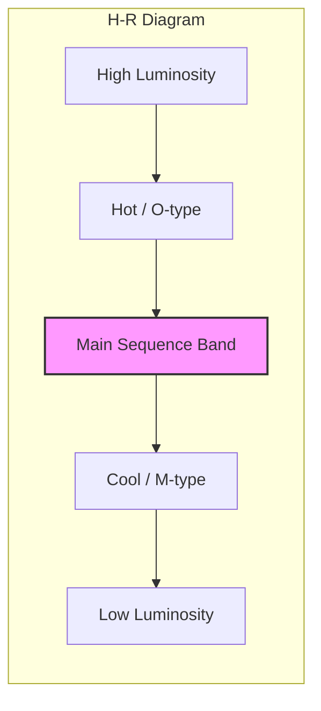
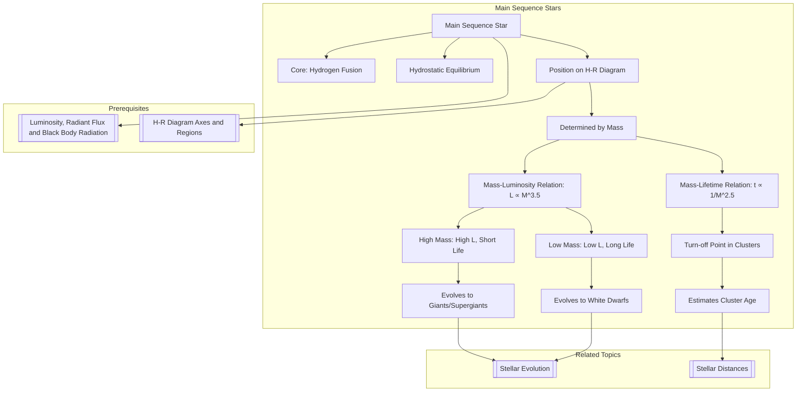

---
# 1. Overview / 概述

**English:**
The Main Sequence is the most prominent and longest-lasting phase in a star's life. This sub-topic focuses on the band of stars that runs diagonally across the [[The Hertzsprung-Russell Diagram]] from the top-left (hot, luminous) to the bottom-right (cool, faint). Understanding the Main Sequence is crucial because it represents stars in hydrostatic equilibrium, fusing hydrogen into helium in their cores. The position of a star on the Main Sequence is determined almost entirely by its mass, leading to the fundamental **Mass-Luminosity Relation**. This leaf node explores the physical characteristics, classification, and lifetime of Main Sequence stars, linking directly to [[Stellar Evolution]] and the properties of [[Giants, Supergiants, and White Dwarfs]].

**中文:**
主序星是恒星生命中最突出、持续时间最长的阶段。本子知识点聚焦于[[赫罗图]]上从左上角（高温、高光度）到右下角（低温、低光度）斜向分布的一条恒星带。理解主序星至关重要，因为它代表了处于流体静力学平衡、核心将氢聚变为氦的恒星。恒星在主序带上的位置几乎完全由其质量决定，从而引出了基本的**质光关系**。本叶节点将探讨主序星的物理特性、分类和寿命，并与[[恒星演化]]以及[[巨星、超巨星和白矮星]]的性质相联系。

---

# 2. Syllabus Learning Objectives / 考纲学习目标

| CAIE 9702 | Edexcel IAL |
|-----------|-------------|
| 25.3(a) Understand that stars on the main sequence are in equilibrium, fusing hydrogen into helium in their cores. | 10.13 Understand the characteristics of main sequence stars, including their position on the H-R diagram. |
| 25.3(b) Understand the relationship between a star's mass and its luminosity (L ∝ M^3.5). | 10.14 Understand the mass-luminosity relation for main sequence stars. |
| 25.3(c) Understand how the position of a star on the main sequence is determined by its mass. | 10.15 Understand how the lifetime of a main sequence star depends on its mass. |
| 25.3(d) Understand the concept of stellar lifetime and how it depends on mass. | 10.16 Understand the concept of the main sequence turn-off point in a star cluster. |
| 25.3(e) Understand the concept of the main sequence turn-off point. | 10.17 Understand how the main sequence turn-off point can be used to estimate the age of a star cluster. |
| 25.3(f) Understand how the main sequence turn-off point can be used to estimate the age of a star cluster. | 10.18 Understand the relationship between the initial mass of a star and its eventual fate. |

**Examiner Expectations / 考官期望:**
- **CAIE:** You must be able to recall and apply the mass-luminosity relation $L \propto M^{3.5}$. You should be able to explain why more massive stars have shorter lifetimes despite having more fuel. The concept of the turn-off point is a key application for determining cluster ages.
- **Edexcel:** You need to understand the physical reasons for the mass-luminosity relation and be able to use it in calculations. You must be able to interpret H-R diagrams of star clusters to find the turn-off point and estimate the cluster's age. The link between initial mass and final fate (e.g., neutron star, black hole) is also required.

---

# 3. Core Definitions / 核心定义

| Term (EN/CN) | Definition (EN) | Definition (CN) | Common Mistakes / 常见错误 |
|--------------|-----------------|-----------------|---------------------------|
| **Main Sequence Star** / 主序星 | A star that is in the longest stable phase of its life, fusing hydrogen into helium in its core via the proton-proton chain or CNO cycle. | 处于生命中最长稳定阶段的恒星，通过质子-质子链或CNO循环在其核心将氢聚变为氦。 | Confusing it with all stars. Giants and white dwarfs are not on the main sequence. |
| **Mass-Luminosity Relation** / 质光关系 | An empirical relationship for main sequence stars stating that luminosity is proportional to mass raised to the power of approximately 3.5 ($L \propto M^{3.5}$). | 主序星的经验关系，表明光度与质量的约3.5次方成正比 ($L \propto M^{3.5}$)。 | Forgetting the exponent is ~3.5, not 1. Also, this only applies to main sequence stars. |
| **Hydrostatic Equilibrium** / 流体静力学平衡 | The balance between the inward force of gravity and the outward force from thermal pressure generated by nuclear fusion in the core. | 向内的引力与核心核聚变产生的向外热压力之间的平衡。 | Thinking it's a static state; it's a dynamic balance. |
| **Main Sequence Turn-off Point** / 主序星转折点 | The point on the H-R diagram of a star cluster where stars are just leaving the main sequence, indicating the cluster's age. | 星团赫罗图上恒星刚刚离开主序带的点，指示了星团的年龄。 | Thinking it's the brightest star in the cluster. It's the point where the most massive stars are evolving away. |
| **Stellar Lifetime (Main Sequence)** / 恒星寿命（主序星阶段） | The time a star spends fusing hydrogen in its core, which is inversely proportional to its mass squared ($t \propto 1/M^{2.5}$). | 恒星在其核心聚变氢所花费的时间，与其质量的2.5次方成反比 ($t \propto 1/M^{2.5}$)。 | Assuming more massive stars live longer because they have more fuel. They burn it much faster. |

---

# 4. Key Concepts Explained / 关键概念详解

## 4.1 The Mass-Luminosity Relation / 质光关系

### Explanation / 解释
**English:** For stars on the [[Main Sequence Stars]], there is a strong empirical relationship between their mass ($M$) and their luminosity ($L$). This is because a more massive star has a stronger gravitational pull, requiring a much higher core temperature and pressure to achieve [[Hydrostatic Equilibrium]]. This higher temperature dramatically increases the rate of nuclear fusion, leading to a disproportionately large increase in luminosity. The relationship is approximately:
$$ L \propto M^{3.5} $$
This means a star with twice the mass of the Sun ($2M_\odot$) will have a luminosity of $2^{3.5} \approx 11.3$ times the Sun's luminosity ($L_\odot$).

**中文:** 对于[[主序星]]，其质量 ($M$) 和光度 ($L$) 之间存在一个强烈的经验关系。这是因为质量更大的恒星具有更强的引力，需要更高的核心温度和压力才能达到[[流体静力学平衡]]。更高的温度会极大地提高核聚变速率，导致光度不成比例地大幅增加。其关系近似为：
$$ L \propto M^{3.5} $$
这意味着质量是太阳两倍 ($2M_\odot$) 的恒星，其光度将是太阳光度 ($L_\odot$) 的 $2^{3.5} \approx 11.3$ 倍。

### Physical Meaning / 物理意义
**English:** The mass of a main sequence star is its single most important property. It dictates its luminosity, surface temperature, radius, and ultimately its lifespan and fate. The Main Sequence is essentially a **mass sequence**.

**中文:** 主序星的质量是其最重要的单一属性。它决定了恒星的光度、表面温度、半径，并最终决定了其寿命和命运。主序带本质上是一个**质量序列**。

### Common Misconceptions / 常见误区
- **Misconception:** All stars on the main sequence have the same composition.
  **Reality:** While they are all fusing hydrogen, their composition varies with age and mass.
- **Misconception:** The mass-luminosity relation applies to all stars.
  **Reality:** It only applies to stars on the main sequence. Giants and white dwarfs do not follow this relation.

### Exam Tips / 考试提示
- **CAIE:** Be prepared to use the formula $L/L_\odot = (M/M_\odot)^{3.5}$ in calculations.
- **Edexcel:** Understand the physical reasoning behind the exponent being greater than 1. You may be asked to explain why a more massive star is more luminous.

> 📷 **IMAGE PROMPT — MASS_LUMINOSITY: Graph of Mass-Luminosity Relation**
> A log-log graph plotting stellar mass (in solar masses) on the x-axis against stellar luminosity (in solar luminosities) on the y-axis. A straight line with a slope of 3.5 is drawn, with data points for various main sequence stars scattered along it. The Sun is labeled at (1,1). The axes are labeled "Mass (M/M☉)" and "Luminosity (L/L☉)".

---

## 4.2 Stellar Lifetime on the Main Sequence / 主序星阶段的恒星寿命

### Explanation / 解释
**English:** The lifetime of a star on the main sequence ($t_{MS}$) is determined by how much fuel it has (its mass, $M$) and how fast it burns that fuel (its luminosity, $L$). Since $L \propto M^{3.5}$, the lifetime is:
$$ t_{MS} \propto \frac{\text{Fuel}}{\text{Burn Rate}} \propto \frac{M}{L} \propto \frac{M}{M^{3.5}} \propto \frac{1}{M^{2.5}} $$
This is a crucial result: **more massive stars have much shorter lifetimes**. A star with 10 solar masses will live for only $1/10^{2.5} \approx 1/316$ of the Sun's lifetime (i.e., ~30 million years vs. the Sun's ~10 billion years).

**中文:** 恒星在主序星阶段的寿命 ($t_{MS}$) 取决于它有多少燃料（质量，$M$）以及它燃烧燃料的速度（光度，$L$）。由于 $L \propto M^{3.5}$，寿命为：
$$ t_{MS} \propto \frac{\text{燃料}}{\text{燃烧速率}} \propto \frac{M}{L} \propto \frac{M}{M^{3.5}} \propto \frac{1}{M^{2.5}} $$
这是一个关键结论：**质量越大的恒星，寿命越短**。一颗10倍太阳质量的恒星，其寿命仅为太阳寿命的 $1/10^{2.5} \approx 1/316$（即约3000万年，而太阳约为100亿年）。

### Physical Meaning / 物理意义
**English:** This explains why we see massive, luminous stars (O and B spectral classes) only in young star clusters. They have already died in older clusters. The faint, low-mass red dwarfs (M spectral class) will burn for trillions of years, far longer than the current age of the universe.

**中文:** 这解释了为什么我们只在年轻的星团中看到大质量、高光度的恒星（O型和B型光谱）。它们在更古老的星团中已经死亡。而暗淡、低质量的红矮星（M型光谱）将燃烧数万亿年，远远超过宇宙目前的年龄。

### Common Misconceptions / 常见误区
- **Misconception:** A star with more mass has more fuel, so it lives longer.
  **Reality:** Its luminosity (fuel consumption rate) increases much faster than its fuel supply, so its lifetime is shorter.

### Exam Tips / 考试提示
- **CAIE/Edexcel:** You must be able to calculate the ratio of lifetimes for two stars of different masses. For example, if Star A is 4 times more massive than Star B, its lifetime is $1/4^{2.5} = 1/32$ of Star B's lifetime.

---

## 4.3 The Main Sequence Turn-off Point / 主序星转折点

### Explanation / 解释
**English:** When we plot the [[H-R Diagram Axes and Regions]] for a star cluster, all the stars in the cluster were born at roughly the same time. The most massive stars evolve off the main sequence first because they have the shortest lifetimes. The **turn-off point** is the location on the main sequence where stars are just beginning to move towards the giant region. The mass of the stars at this point tells us the age of the cluster. A cluster with a high turn-off point (massive, luminous stars still on the main sequence) is young. A cluster with a low turn-off point (only low-mass stars remain on the main sequence) is old.

**中文:** 当我们绘制一个星团的[[赫罗图坐标轴与区域]]时，该星团中的所有恒星大致在同一时间诞生。质量最大的恒星最先离开主序带，因为它们的寿命最短。**转折点**是主序带上恒星刚刚开始向巨星区域移动的位置。该点处恒星的质量告诉我们星团的年龄。转折点高（大质量、高光度恒星仍在主序带上）的星团是年轻的。转折点低（只有低质量恒星留在主序带上）的星团是古老的。

### Physical Meaning / 物理意义
**English:** The turn-off point is a powerful tool for [[Using the H-R Diagram to Determine Stellar Properties]], specifically the age of a star cluster. By identifying the spectral class or mass of the stars at the turn-off point, we can use the mass-lifetime relation to calculate the cluster's age.

**中文:** 转折点是[[利用赫罗图确定恒星性质]]的一个强大工具，特别是用于确定星团的年龄。通过识别转折点处恒星的光谱类型或质量，我们可以利用质-寿关系来计算星团的年龄。

### Common Misconceptions / 常见误区
- **Misconception:** The turn-off point is the brightest star in the cluster.
  **Reality:** The brightest stars have already left the main sequence and become giants. The turn-off point is the *faintest* of the stars that are *just* leaving.

### Exam Tips / 考试提示
- **CAIE/Edexcel:** You will be given an H-R diagram of a cluster and asked to identify the turn-off point. You must then use the mass-luminosity relation and the lifetime equation to estimate the cluster's age. Remember to state the assumption that all stars in the cluster formed at the same time.

> 📷 **IMAGE PROMPT — TURN_OFF: H-R Diagram of Two Star Clusters**
> Two H-R diagrams side-by-side. The left diagram shows a young cluster with a high turn-off point (many O and B stars still on the main sequence). The right diagram shows an old cluster with a low turn-off point (only G, K, M stars remain on the main sequence, with a clear "knee" where the main sequence ends). The turn-off point is labeled with an arrow on each diagram.

---

# 5. Essential Equations / 核心公式

## 5.1 Mass-Luminosity Relation / 质光关系

$$ L \propto M^{3.5} \quad \text{or} \quad \frac{L}{L_\odot} = \left(\frac{M}{M_\odot}\right)^{3.5} $$

| Symbol (符号) | Meaning (EN) | Meaning (CN) | Unit (单位) |
|--------------|-------------|-------------|------------|
| $L$ | Luminosity of the star | 恒星的光度 | W (Watts) |
| $L_\odot$ | Luminosity of the Sun ($3.8 \times 10^{26}$ W) | 太阳的光度 | W |
| $M$ | Mass of the star | 恒星的质量 | kg |
| $M_\odot$ | Mass of the Sun ($2.0 \times 10^{30}$ kg) | 太阳的质量 | kg |

**Derivation / 推导:** This is an empirical relation, not derived from first principles in the A-Level syllabus. It is based on observations of binary star systems.

**Conditions / 适用条件:** Only applies to stars on the main sequence. The exponent can vary slightly (3.0 to 4.0) for different mass ranges, but 3.5 is the standard value for exams.

**Limitations / 局限性:** Does not apply to giants, supergiants, or white dwarfs. It is a statistical relationship; individual stars may deviate slightly.

## 5.2 Main Sequence Lifetime / 主序星寿命

$$ t_{MS} \propto \frac{1}{M^{2.5}} \quad \text{or} \quad \frac{t_{MS}}{t_{MS,\odot}} = \left(\frac{M}{M_\odot}\right)^{-2.5} $$

| Symbol (符号) | Meaning (EN) | Meaning (CN) | Unit (单位) |
|--------------|-------------|-------------|------------|
| $t_{MS}$ | Main sequence lifetime of the star | 恒星的主序星寿命 | s or years |
| $t_{MS,\odot}$ | Main sequence lifetime of the Sun ($\approx 10^{10}$ years) | 太阳的主序星寿命（约100亿年） | years |

**Derivation / 推导:** $t_{MS} \propto \frac{\text{Energy Available}}{\text{Luminosity}} \propto \frac{M}{L} \propto \frac{M}{M^{3.5}} \propto M^{-2.5}$

**Conditions / 适用条件:** Assumes the star fuses a constant fraction of its mass (about 10%) into energy during its main sequence life.

**Limitations / 局限性:** This is an approximation. The exact lifetime depends on the star's composition and the efficiency of the fusion process.

---

# 6. Graphs and Relationships / 图表与关系

## 6.1 The Main Sequence on an H-R Diagram / 赫罗图上的主序带

### Axes / 坐标轴
- **X-axis:** Spectral Class (O B A F G K M) or Surface Temperature (K) [Decreasing to the right]
- **Y-axis:** Luminosity ($L_\odot$) or Absolute Magnitude [Increasing upwards]

### Shape / 形状
A broad, diagonal band stretching from the top-left (high temperature, high luminosity) to the bottom-right (low temperature, low luminosity).

### Gradient Meaning / 斜率含义
The band is not a single line but a region. The gradient reflects the mass-luminosity relation. Moving up and left along the main sequence corresponds to increasing mass.

### Area Meaning / 面积含义
The area of the main sequence band represents the range of possible stable configurations for hydrogen-fusing stars.

### Exam Interpretation / 考试解读
- **Identifying the Main Sequence:** It is the most densely populated band on the diagram.
- **Locating the Sun:** The Sun is a G-type star, located in the middle of the main sequence.
- **Comparing Stars:** A star higher and to the left is more massive, more luminous, and has a shorter lifetime. A star lower and to the right is less massive, less luminous, and has a longer lifetime.

---

# 7. Required Diagrams / 必备图表

## 7.1 The Main Sequence on the H-R Diagram / 赫罗图上的主序带

### Description / 描述
**English:** A standard Hertzsprung-Russell diagram with the main sequence clearly highlighted as a diagonal band. Key stars like the Sun, Sirius A, and Proxima Centauri should be labeled. The axes should show both spectral class and temperature.

**中文:** 一个标准的赫罗图，主序带被清晰地突出显示为一条对角带。像太阳、天狼星A和比邻星这样的关键恒星应被标注。坐标轴应同时显示光谱类型和温度。

### Image Prompt / 图片生成提示
> 📷 **IMAGE PROMPT — MAIN_SEQ_HR: Standard H-R Diagram with Main Sequence**
> A high-quality, color-coded Hertzsprung-Russell diagram. The main sequence is a bright, thick diagonal band from top-left to bottom-right. The regions for Giants, Supergiants, and White Dwarfs are also shown but are less prominent. The Sun is labeled at the center of the main sequence. Spectral classes O, B, A, F, G, K, M are labeled on the x-axis. Luminosity in solar units is on the y-axis. The diagram is clean, professional, and suitable for an A-Level textbook.

### Labels Required / 需要标注
- **Main Sequence Band / 主序带**
- **Sun / 太阳**
- **High Mass End (O-type) / 高质量端 (O型)**
- **Low Mass End (M-type) / 低质量端 (M型)**
- **Increasing Mass / 质量增加方向**

### Exam Importance / 考试重要性
**English:** This is the most fundamental diagram in astrophysics. You must be able to draw it from memory, label the main sequence, and explain the physical significance of a star's position on it.

**中文:** 这是天体物理学中最基本的图表。你必须能够凭记忆画出它，标注主序带，并解释恒星在其上位置的物理意义。

---

# 8. Worked Examples / 典型例题

## Example 1: Calculating Luminosity from Mass / 从质量计算光度

### Question / 题目
**English:** A main sequence star has a mass of $5.0 M_\odot$. Calculate its luminosity in terms of $L_\odot$. (Assume $L \propto M^{3.5}$)

**中文:** 一颗主序星的质量为 $5.0 M_\odot$。计算其以 $L_\odot$ 为单位的光度。（假设 $L \propto M^{3.5}$）

### Solution / 解答
1.  **Identify the formula / 确定公式:**
    $$ \frac{L}{L_\odot} = \left(\frac{M}{M_\odot}\right)^{3.5} $$
2.  **Substitute values / 代入数值:**
    $$ \frac{L}{L_\odot} = (5.0)^{3.5} $$
3.  **Calculate / 计算:**
    $$ 5.0^{3.5} = 5.0^{3} \times 5.0^{0.5} = 125 \times \sqrt{5.0} = 125 \times 2.236 = 279.5 $$
    $$ \frac{L}{L_\odot} \approx 280 $$

### Final Answer / 最终答案
**Answer:** $L \approx 280 L_\odot$ | **答案：** $L \approx 280 L_\odot$

### Quick Tip / 提示
**English:** Remember that $M^{3.5} = M^3 \times M^{0.5} = M^3 \times \sqrt{M}$. This can make calculation easier without a calculator.
**中文:** 记住 $M^{3.5} = M^3 \times M^{0.5} = M^3 \times \sqrt{M}$。这可以在没有计算器的情况下简化计算。

---

## Example 2: Estimating Cluster Age from Turn-off Point / 从转折点估计星团年龄

### Question / 题目
**English:** The turn-off point of a star cluster corresponds to stars with a mass of $4.0 M_\odot$. Estimate the age of the cluster. (Assume the Sun's main sequence lifetime is $10^{10}$ years and $t \propto M^{-2.5}$).

**中文:** 一个星团的转折点对应于质量为 $4.0 M_\odot$ 的恒星。估计该星团的年龄。（假设太阳的主序星寿命为 $10^{10}$ 年，且 $t \propto M^{-2.5}$）。

### Solution / 解答
1.  **Identify the formula / 确定公式:**
    $$ \frac{t_{cluster}}{t_{MS,\odot}} = \left(\frac{M}{M_\odot}\right)^{-2.5} $$
2.  **Substitute values / 代入数值:**
    $$ \frac{t_{cluster}}{10^{10} \text{ years}} = (4.0)^{-2.5} $$
3.  **Calculate / 计算:**
    $$ 4.0^{-2.5} = \frac{1}{4.0^{2.5}} = \frac{1}{4.0^2 \times 4.0^{0.5}} = \frac{1}{16 \times 2} = \frac{1}{32} $$
    $$ t_{cluster} = \frac{10^{10}}{32} = 3.125 \times 10^8 \text{ years} $$

### Final Answer / 最终答案
**Answer:** $3.1 \times 10^8$ years (or 310 million years) | **答案：** $3.1 \times 10^8$ 年（或3.1亿年）

### Quick Tip / 提示
**English:** The age of the cluster is equal to the main sequence lifetime of the stars at the turn-off point. This assumes all stars in the cluster formed at the same time.
**中文:** 星团的年龄等于转折点处恒星的主序星寿命。这假设星团中所有恒星同时形成。

---

# 9. Past Paper Question Types / 历年真题题型

| Question Type / 题型 | Frequency / 频率 | Difficulty / 难度 | Past Paper References / 真题索引 |
|----------------------|------------------|------------------|-------------------------------|
| **Mass-Luminosity Calculation** / 质光关系计算 | High | Easy | 📝 *待填入* |
| **Lifetime Calculation** / 寿命计算 | High | Easy | 📝 *待填入* |
| **Explaining the Mass-Luminosity Relation** / 解释质光关系 | Medium | Medium | 📝 *待填入* |
| **Interpreting H-R Diagram of a Cluster** / 解读星团赫罗图 | High | Medium-Hard | 📝 *待填入* |
| **Comparing Lifetimes of Different Stars** / 比较不同恒星寿命 | Medium | Medium | 📝 *待填入* |

**Common Command Words / 常见指令词:**
- **Calculate / 计算:** Use the mass-luminosity or mass-lifetime relation.
- **Explain / 解释:** Describe the physical reasons for the relationship (e.g., hydrostatic equilibrium, fusion rate).
- **Determine / 确定:** Find the age of a cluster from a turn-off point on a graph.
- **State / 陈述:** Give a fact without explanation (e.g., "State the mass-luminosity relation").

---

# 10. Practical Skills Connections / 实验技能链接

**English:**
While you won't directly experiment on stars, the concepts in this sub-topic connect to practical skills in several ways:
1.  **Data Analysis:** The mass-luminosity relation is derived from plotting data from binary star systems. You should be able to plot log-log graphs and determine the gradient (which gives the exponent).
2.  **Graph Interpretation:** You will be asked to interpret H-R diagrams of star clusters, identifying the turn-off point. This requires careful reading of axes and data points.
3.  **Uncertainties:** When estimating cluster age, you should be aware that the mass of the turn-off point has an associated uncertainty, which propagates into the age calculation.
4.  **Experimental Design:** The concept of using a "standard candle" (like a main sequence star of known mass) to determine distance is a key astrophysical technique.

**中文:**
虽然你不会直接对恒星进行实验，但本子知识点中的概念在几个方面与实验技能相关：
1.  **数据分析：** 质光关系是通过绘制双星系统的数据得出的。你应该能够绘制对数-对数图并确定斜率（给出指数）。
2.  **图表解读：** 你将被要求解读星团的赫罗图，识别转折点。这需要仔细阅读坐标轴和数据点。
3.  **不确定度：** 在估计星团年龄时，你应该意识到转折点处的质量存在相关不确定度，这会传递到年龄计算中。
4.  **实验设计：** 使用“标准烛光”（如已知质量的主序星）来确定距离的概念是一项关键的天体物理技术。

---

# 11. Concept Map / 概念图谱

---

# 12. Quick Revision Sheet / 速查表

| Category / 类别 | Key Points / 要点 |
|----------------|------------------|
| **Definition / 定义** | A star fusing H to He in its core, in hydrostatic equilibrium. / 核心将氢聚变为氦，处于流体静力学平衡的恒星。 |
| **Key Formula / 核心公式** | $L \propto M^{3.5}$; $t_{MS} \propto M^{-2.5}$ |
| **Key Graph / 核心图表** | H-R Diagram: Diagonal band from top-left to bottom-right. / 赫罗图：从左上到右下的对角带。 |
| **Mass & Lifetime / 质量与寿命** | High Mass → High Luminosity → Short Lifetime. / 高质量 → 高光度 → 短寿命。 |
| **Turn-off Point / 转折点** | Point where stars leave the main sequence; used to find cluster age. / 恒星离开主序带的点；用于寻找星团年龄。 |
| **Exam Tip / 考试提示** | Always state assumptions (e.g., all stars in cluster formed at same time). / 始终说明假设（例如，星团中所有恒星同时形成）。 |