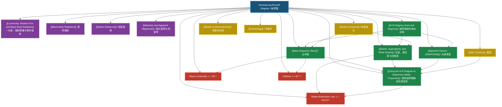

# 1. Overview / 概述

**English:**
The Hertzsprung-Russell (H-R) Diagram is one of the most fundamental tools in astrophysics, serving as a graphical classification system for stars. It plots stars according to their luminosity (or absolute magnitude) against their surface temperature (or spectral class), revealing distinct patterns that illuminate stellar evolution. This diagram, independently developed by Ejnar Hertzsprung and Henry Norris Russell around 1910, transformed our understanding of stars from a collection of random points into a structured evolutionary framework.

The H-R Diagram matters because it provides a "snapshot" of stellar populations, allowing astronomers to determine a star's evolutionary stage, mass, radius, and lifetime simply from its position on the diagram. The main sequence, where stars spend most of their lives, contains about 90% of all stars. The diagram also reveals the existence of distinct stellar populations: red giants, supergiants, and white dwarfs, each representing different evolutionary endpoints.

Real-world applications include determining the distances to star clusters using main-sequence fitting, estimating the age of stellar populations, and understanding the life cycles of stars from formation to death. In modern astronomy, H-R diagrams of globular clusters help date the universe itself.

For Cambridge 9702 (Topic 25.3 a-f) and Edexcel IAL (WPH14 Unit 4: 10.13-10.18), the H-R Diagram is a core component of astrophysics. Both syllabuses require students to interpret the diagram, identify stellar regions, understand spectral classification, and use the diagram to determine stellar properties. The topic connects directly to [[Luminosity, Radiant Flux and Black Body Radiation]], [[Stellar Evolution]], and [[Stellar Distances]].

**中文：**
赫罗图（Hertzsprung-Russell Diagram，简称H-R图）是天体物理学中最基础的工具之一，作为恒星的图形分类系统。它以恒星的[[光度]]（或绝对星等）为纵轴，以表面温度（或光谱类型）为横轴，揭示出恒星演化的清晰模式。该图由埃纳尔·赫茨普龙和亨利·诺里斯·罗素在1910年左右独立发展，将我们对恒星的理解从随机点的集合转变为结构化的演化框架。

赫罗图之所以重要，是因为它提供了恒星群的"快照"，使天文学家能够仅根据恒星在图上的位置来确定其演化阶段、质量、半径和寿命。主序带是恒星度过大部分生命的地方，包含了约90%的恒星。该图还揭示了不同恒星群的存在：红巨星、超巨星和白矮星，每个都代表不同的演化终点。

实际应用包括使用主序拟合确定星团的距离、估计恒星群的年龄，以及理解恒星从形成到死亡的生命周期。在现代天文学中，球状星团的赫罗图有助于确定宇宙本身的年龄。

对于剑桥9702（主题25.3 a-f）和爱德思IAL（WPH14单元4：10.13-10.18），赫罗图是天体物理学的核心组成部分。两个考纲都要求学生能够解读该图、识别恒星区域、理解光谱分类，并使用该图确定恒星性质。该主题直接连接到[[光度、辐射通量与黑体辐射]]、[[恒星演化]]和[[恒星距离]]。

---

# 2. Syllabus Learning Objectives / 考纲学习目标

| CAIE 9702 (25.3 a-f) | Edexcel IAL (WPH14 U4: 10.13-10.18) |
|----------------------|--------------------------------------|
| 25.3(a): Understand that the Hertzsprung-Russell (H-R) diagram is a plot of luminosity (or absolute magnitude) against temperature (or spectral class) | 10.13: Understand the Hertzsprung-Russell diagram as a plot of luminosity against temperature for stars |
| 25.3(b): Identify the main regions of the H-R diagram: main sequence, red giants, red supergiants, and white dwarfs | 10.14: Identify the positions of main sequence stars, red giants, red supergiants, and white dwarfs on the H-R diagram |
| 25.3(c): Understand that stars on the main sequence are fusing hydrogen into helium in their cores | 10.15: Understand that main sequence stars are in hydrostatic equilibrium, fusing hydrogen to helium |
| 25.3(d): Understand that the position of a star on the H-R diagram depends on its mass and stage of evolution | 10.16: Understand how the position of a star on the H-R diagram relates to its mass, radius, and evolutionary stage |
| 25.3(e): Use the H-R diagram to determine the approximate radius of a star using the Stefan-Boltzmann law | 10.17: Use the Stefan-Boltzmann law ($L = 4\pi r^2 \sigma T^4$) to relate luminosity, radius, and temperature |
| 25.3(f): Understand the spectral classification of stars (O, B, A, F, G, K, M) and its relationship to temperature | 10.18: Understand the spectral classification OBAFGKM and its relationship to surface temperature |

**Examiner Expectations / 考官期望:**

**English:**
- Students must be able to sketch and label the H-R diagram from memory, including the main regions and axes
- Students must know the temperature order of spectral classes (hottest to coolest: OBAFGKM)
- Students must be able to apply the Stefan-Boltzmann law to compare stellar radii
- Students must understand that the main sequence is not a line but a band
- Students must be able to interpret H-R diagrams of star clusters to determine relative ages

**中文：**
- 学生必须能够凭记忆绘制并标注赫罗图，包括主要区域和坐标轴
- 学生必须知道光谱类型的温度顺序（从最热到最冷：OBAFGKM）
- 学生必须能够应用斯特藩-玻尔兹曼定律比较恒星半径
- 学生必须理解主序带是一条带而非一条线
- 学生必须能够解读星团的赫罗图以确定相对年龄

> 📋 **CIE Only:** CIE specifically requires understanding that the H-R diagram can use either luminosity or absolute magnitude on the y-axis, and either temperature or spectral class on the x-axis. Students must be comfortable with both representations.
>
> 📋 **Edexcel Only:** Edexcel specifically requires understanding of hydrostatic equilibrium in main sequence stars and the relationship between mass and position on the main sequence (more massive stars are higher and to the left).

---

# 3. Core Definitions / 核心定义

| Term (EN/CN) | Definition (EN) | Definition (CN) | Common Mistakes / 常见错误 |
|--------------|-----------------|-----------------|---------------------------|
| **Hertzsprung-Russell Diagram / 赫罗图** | A graph plotting stars according to their luminosity (or absolute magnitude) against their surface temperature (or spectral class) | 以恒星的光度（或绝对星等）为纵轴、表面温度（或光谱类型）为横轴绘制的图表 | Confusing luminosity with apparent brightness; forgetting that temperature decreases to the right |
| **Main Sequence / 主序带** | The continuous band of stars on the H-R diagram where stars fuse hydrogen into helium in their cores, representing about 90% of a star's lifetime | 赫罗图上连续分布的恒星带，恒星在此区域的核心将氢聚变为氦，约占恒星寿命的90% | Thinking all stars on the main sequence have the same mass; forgetting it's a band, not a line |
| **Red Giant / 红巨星** | A large, cool star with high luminosity that has left the main sequence after exhausting its core hydrogen, fusing hydrogen in a shell around an inert helium core | 离开主序带后的大而冷的恒星，核心氢耗尽后，在惰性氦核周围的壳层中聚变氢 | Confusing red giants with red supergiants; thinking they are still fusing hydrogen in the core |
| **Red Supergiant / 红超巨星** | An extremely large, cool star with very high luminosity, evolved from high-mass stars (>8 solar masses), often in late evolutionary stages | 从大质量恒星（>8太阳质量）演化而来的极大、极冷、极高光度的恒星，通常处于演化后期 | Forgetting that only high-mass stars become supergiants |
| **White Dwarf / 白矮星** | A small, hot, low-luminosity star that is the remnant of a low-to-intermediate mass star after it has shed its outer layers | 中小质量恒星在抛掉外层后留下的小而热、低光度的恒星残骸 | Thinking white dwarfs are still fusing elements; confusing them with neutron stars |
| **Spectral Class / 光谱类型** | A classification system for stars based on their absorption line spectra, directly related to surface temperature (OBAFGKM from hottest to coolest) | 基于恒星吸收线光谱的分类系统，与表面温度直接相关（OBAFGKM从最热到最冷） | Getting the order wrong; forgetting that O stars are hottest |
| **Luminosity / 光度** | The total power radiated by a star, measured in watts (W) or in units of solar luminosity ($L_\odot$) | 恒星辐射的总功率，以瓦特（W）或太阳光度单位（$L_\odot$）测量 | Confusing with apparent brightness; forgetting it's independent of distance |
| **Absolute Magnitude / 绝对星等** | The apparent magnitude a star would have if placed at a standard distance of 10 parsecs | 恒星放置在标准距离10秒差距处所具有的视星等 | Forgetting the standard distance; confusing with apparent magnitude |
| **Stefan-Boltzmann Law / 斯特藩-玻尔兹曼定律** | The relationship $L = 4\pi r^2 \sigma T^4$, relating a star's luminosity to its radius and surface temperature | 关系式 $L = 4\pi r^2 \sigma T^4$，将恒星的光度与其半径和表面温度联系起来 | Forgetting the $T^4$ dependence; using wrong units for $\sigma$ |
| **Hydrostatic Equilibrium / 流体静力学平衡** | The balance between inward gravitational pressure and outward radiation pressure in a star, maintaining its stable size | 恒星内部向内的引力压力与向外的辐射压力之间的平衡，维持其稳定大小 | Thinking it only applies to main sequence stars |

---

# 4. Key Concepts Explained / 关键概念详解

## 4.1 The H-R Diagram Structure / 赫罗图结构

### Explanation / 解释
**English:**
The H-R Diagram is a scatter plot where each point represents a star. The vertical axis (y-axis) shows luminosity ($L$) or absolute magnitude ($M$), increasing upward. The horizontal axis (x-axis) shows surface temperature ($T$) or spectral class, decreasing to the right (hotter stars on the left, cooler stars on the right). This unconventional orientation (hot to cold, left to right) is a historical convention that must be remembered.

The diagram reveals four main regions:
1. **Main Sequence:** A diagonal band from top-left (hot, luminous) to bottom-right (cool, dim). About 90% of all stars lie here.
2. **Red Giants:** Stars in the upper-right region — cool but very luminous due to their large size.
3. **Red Supergiants:** Even more luminous than red giants, found at the very top-right.
4. **White Dwarfs:** Stars in the bottom-left region — hot but very dim due to their small size.

The position of a star on the H-R diagram is determined by its mass and evolutionary stage. More massive stars are hotter and more luminous, placing them higher and to the left on the main sequence. As stars evolve, they move off the main sequence into the giant or white dwarf regions.

**中文：**
赫罗图是一种散点图，每个点代表一颗恒星。纵轴（y轴）显示光度（$L$）或绝对星等（$M$），向上增加。横轴（x轴）显示表面温度（$T$）或光谱类型，向右递减（热星在左边，冷星在右边）。这种非常规的方向（从左到右从热到冷）是历史惯例，必须记住。

该图揭示了四个主要区域：
1. **主序带：** 从左上角（热、亮）到右下角（冷、暗）的对角线带。约90%的恒星在此。
2. **红巨星：** 右上区域的恒星——冷但由于体积大而非常亮。
3. **红超巨星：** 比红巨星更亮，位于最右上角。
4. **白矮星：** 左下区域的恒星——热但由于体积小而非常暗。

恒星在赫罗图上的位置由其质量和演化阶段决定。质量更大的恒星更热、更亮，位于主序带更高、更左的位置。随着恒星演化，它们离开主序带进入巨星或白矮星区域。

### Physical Meaning / 物理意义
**English:**
The H-R Diagram is essentially a plot of stellar power output (luminosity) versus stellar "color" (temperature). The diagonal main sequence represents the fundamental relationship: hotter stars are more luminous because they have higher energy output per unit area. Stars above the main sequence (giants) are more luminous than main sequence stars of the same temperature because they have much larger surface areas. Stars below the main sequence (white dwarfs) are less luminous because they have much smaller surface areas.

**中文：**
赫罗图本质上是恒星功率输出（光度）与恒星"颜色"（温度）的关系图。对角线的主序带代表了基本关系：更热的恒星更亮，因为它们单位面积的能量输出更高。主序带以上的恒星（巨星）比相同温度的主序星更亮，因为它们的表面积大得多。主序带以下的恒星（白矮星）更暗，因为它们的表面积小得多。

### Common Misconceptions / 常见误区
1. **Temperature direction:** Students often think temperature increases to the right. Remember: hot stars are on the LEFT.
2. **Main sequence as a line:** The main sequence is a BAND, not a single line. Stars of different masses occupy different positions.
3. **All stars on main sequence are the same:** Stars on the main sequence vary enormously in mass, luminosity, temperature, and lifetime.
4. **Giants are hotter:** Red giants are actually COOLER than the Sun, but much more luminous.
5. **White dwarfs are cold:** White dwarfs are actually very HOT, but have low luminosity due to tiny size.

### Exam Tips / 考试提示
**English:**
- Always label axes correctly: Luminosity/Absolute Magnitude (y) and Temperature/Spectral Class (x)
- Remember temperature decreases to the right
- When asked to "sketch the H-R diagram," include all four main regions with approximate positions
- Use the Stefan-Boltzmann law ($L = 4\pi r^2 \sigma T^4$) to compare radii of stars at different positions
- For star cluster H-R diagrams, the turn-off point from the main sequence indicates the cluster's age

**中文：**
- 始终正确标注坐标轴：光度/绝对星等（y轴）和温度/光谱类型（x轴）
- 记住温度向右递减
- 当要求"绘制赫罗图"时，包括所有四个主要区域及其大致位置
- 使用斯特藩-玻尔兹曼定律（$L = 4\pi r^2 \sigma T^4$）比较不同位置恒星的半径
- 对于星团赫罗图，从主序带的转折点指示星团的年龄

> 📷 **IMAGE PROMPT — HRD-01: The Hertzsprung-Russell Diagram Structure**
>
> A clean, educational diagram of the H-R diagram. The y-axis is labeled "Luminosity / L⊙" increasing upward, with values from 10^-4 to 10^6. The x-axis is labeled "Surface Temperature / K" decreasing from left (30,000 K) to right (3,000 K). Four regions are clearly marked: Main Sequence (diagonal band from top-left to bottom-right), Red Giants (upper-right), Red Supergiants (extreme upper-right), and White Dwarfs (lower-left). Example stars (Sun, Sirius, Betelgeuse, Rigel, Procyon B) are plotted. Spectral classes OBAFGKM are shown along the top. Clean white background, professional textbook style, vector graphics quality, all labels in English.

---

## 4.2 Spectral Classification (OBAFGKM) / 光谱分类

### Explanation / 解释
**English:**
Spectral classification is a system that categorizes stars based on the absorption lines in their spectra, which are directly related to surface temperature. The sequence from hottest to coolest is:

**O** → **B** → **A** → **F** → **G** → **K** → **M**

A common mnemonic is "Oh Be A Fine Girl/Guy, Kiss Me."

Each spectral class has characteristic absorption lines:
- **O stars** (>30,000 K): Ionized helium lines, weak hydrogen lines; appear blue
- **B stars** (10,000-30,000 K): Neutral helium lines, stronger hydrogen lines; blue-white
- **A stars** (7,500-10,000 K): Strong hydrogen (Balmer) lines; white (e.g., Sirius)
- **F stars** (6,000-7,500 K): Weaker hydrogen lines, strong metal lines; yellow-white
- **G stars** (5,200-6,000 K): Strong calcium lines, many metal lines; yellow (e.g., Sun)
- **K stars** (3,700-5,200 K): Strong molecular bands (TiO); orange
- **M stars** (<3,700 K): Strong molecular bands (TiO, VO); red (e.g., Betelgeuse)

Each class is further divided into subclasses 0-9 (e.g., G2 for the Sun, where G0 is hotter than G9).

**中文：**
光谱分类是一种基于恒星光谱中吸收线对恒星进行分类的系统，这些吸收线与表面温度直接相关。从最热到最冷的顺序是：

**O** → **B** → **A** → **F** → **G** → **K** → **M**

常用的记忆法是 "Oh Be A Fine Girl/Guy, Kiss Me"（哦，做个好女孩/男孩，吻我）。

每个光谱类型都有特征吸收线：
- **O型星**（>30,000 K）：电离氦线，弱氢线；呈蓝色
- **B型星**（10,000-30,000 K）：中性氦线，较强的氢线；蓝白色
- **A型星**（7,500-10,000 K）：强氢线（巴尔末线）；白色（如天狼星）
- **F型星**（6,000-7,500 K）：较弱的氢线，强金属线；黄白色
- **G型星**（5,200-6,000 K）：强钙线，许多金属线；黄色（如太阳）
- **K型星**（3,700-5,200 K）：强分子带（TiO）；橙色
- **M型星**（<3,700 K）：强分子带（TiO, VO）；红色（如参宿四）

每个类型进一步分为0-9子类（例如太阳为G2，其中G0比G9更热）。

### Physical Meaning / 物理意义
**English:**
Spectral class is a direct indicator of surface temperature. The absorption lines change with temperature because different atoms and molecules are ionized or excited at different temperatures. At very high temperatures (O stars), hydrogen is fully ionized and doesn't produce absorption lines, while helium lines are strong. At moderate temperatures (A stars), hydrogen is in the right excitation state to produce strong Balmer lines. At low temperatures (M stars), molecules can form and produce complex absorption bands.

**中文：**
光谱类型是表面温度的直接指标。吸收线随温度变化，因为不同的原子和分子在不同温度下被电离或激发。在非常高的温度下（O型星），氢完全电离，不产生吸收线，而氦线很强。在中等温度下（A型星），氢处于合适的激发态，产生强巴尔末线。在低温下（M型星），分子可以形成并产生复杂的吸收带。

### Common Misconceptions / 常见误区
1. **O stars are red:** No, O stars are the hottest and appear blue.
2. **M stars are hot:** No, M stars are the coolest and appear red.
3. **Spectral class is about composition:** While composition affects spectra, the primary factor is temperature.
4. **All stars of same class are identical:** Stars of the same spectral class have similar temperatures but can have very different luminosities (e.g., a G-type giant vs. a G-type main sequence star).

### Exam Tips / 考试提示
**English:**
- Memorize the OBAFGKM order — this is almost guaranteed to appear
- Know the approximate temperature ranges for each class
- Understand that the Sun is a G2 star
- Be able to explain why hydrogen lines are strongest in A stars (optimal excitation state for Balmer lines)
- Remember that spectral class is on the x-axis of the H-R diagram, with O on the left and M on the right

**中文：**
- 记住OBAFGKM的顺序——这几乎肯定会考到
- 知道每个类型的近似温度范围
- 理解太阳是G2型星
- 能够解释为什么氢线在A型星中最强（巴尔末线的最佳激发态）
- 记住光谱类型在赫罗图的x轴上，O在左边，M在右边

---

## 4.3 The Stefan-Boltzmann Law and Stellar Radii / 斯特藩-玻尔兹曼定律与恒星半径

### Explanation / 解释
**English:**
The Stefan-Boltzmann law is the key equation that connects a star's luminosity ($L$), radius ($r$), and surface temperature ($T$):

$$L = 4\pi r^2 \sigma T^4$$

where $\sigma = 5.67 \times 10^{-8} \text{ W m}^{-2} \text{ K}^{-4}$ is the Stefan-Boltzmann constant.

This equation explains why stars at different positions on the H-R diagram have different luminosities:
- **Main sequence stars:** As temperature increases, luminosity increases rapidly (due to $T^4$), but radius also increases with mass
- **Red giants:** Same temperature as some main sequence stars but much larger radius → much higher luminosity
- **White dwarfs:** High temperature but tiny radius → very low luminosity

To compare two stars, we can use the ratio form:

$$\frac{L_1}{L_2} = \left(\frac{r_1}{r_2}\right)^2 \left(\frac{T_1}{T_2}\right)^4$$

**中文：**
斯特藩-玻尔兹曼定律是连接恒星光度（$L$）、半径（$r$）和表面温度（$T$）的关键方程：

$$L = 4\pi r^2 \sigma T^4$$

其中 $\sigma = 5.67 \times 10^{-8} \text{ W m}^{-2} \text{ K}^{-4}$ 是斯特藩-玻尔兹曼常数。

这个方程解释了为什么赫罗图上不同位置的恒星具有不同的光度：
- **主序星：** 随着温度升高，光度迅速增加（由于$T^4$），但半径也随质量增加
- **红巨星：** 与某些主序星温度相同，但半径大得多 → 光度高得多
- **白矮星：** 温度高但半径极小 → 光度非常低

要比较两颗恒星，可以使用比值形式：

$$\frac{L_1}{L_2} = \left(\frac{r_1}{r_2}\right)^2 \left(\frac{T_1}{T_2}\right)^4$$

### Physical Meaning / 物理意义
**English:**
The Stefan-Boltzmann law tells us that a star's power output depends on two factors: its surface area ($4\pi r^2$) and how much power each square meter emits ($\sigma T^4$). A red giant can have the same temperature as a main sequence star but be 100 times more luminous because its radius is 10 times larger (area increases as $r^2$). A white dwarf can be as hot as an O star but 10,000 times less luminous because its radius is 100 times smaller.

**中文：**
斯特藩-玻尔兹曼定律告诉我们，恒星的功率输出取决于两个因素：其表面积（$4\pi r^2$）和每平方米发射的功率（$\sigma T^4$）。红巨星可以与主序星温度相同，但光度高出100倍，因为其半径大10倍（面积随$r^2$增加）。白矮星可以与O型星一样热，但光度低10,000倍，因为其半径小100倍。

### Common Misconceptions / 常见误区
1. **$T^4$ is a small effect:** Actually, $T^4$ is a very strong dependence. Doubling temperature increases luminosity by 16 times.
2. **Radius is the only factor:** Both radius AND temperature matter. A star can be luminous because it's hot, large, or both.
3. **Using wrong units:** Temperature must be in Kelvin, radius in meters, luminosity in watts.

### Exam Tips / 考试提示
**English:**
- When comparing two stars, always use the ratio form of the Stefan-Boltzmann law
- Remember that if two stars have the same temperature, the ratio of their luminosities equals the ratio of their radii squared
- If two stars have the same luminosity, the ratio of their radii is inversely proportional to the square of their temperature ratio
- Be prepared to calculate the radius of a star given its luminosity and temperature
- Common exam question: "Explain why a red giant is more luminous than a main sequence star of the same temperature"

**中文：**
- 比较两颗恒星时，始终使用斯特藩-玻尔兹曼定律的比值形式
- 记住，如果两颗恒星温度相同，它们的光度比等于半径比的平方
- 如果两颗恒星光度相同，它们的半径比与温度比的平方成反比
- 准备好根据给定的光度和温度计算恒星半径
- 常见考题："解释为什么红巨星比相同温度的主序星更亮"

---

## 4.4 Main Sequence Stars and Hydrostatic Equilibrium / 主序星与流体静力学平衡

### Explanation / 解释
**English:**
Main sequence stars are in a state of [[Hydrostatic Equilibrium]], where the inward gravitational pressure is exactly balanced by the outward radiation pressure from nuclear fusion in the core. This balance maintains the star's stable size and energy output for most of its lifetime.

Key characteristics of main sequence stars:
- **Energy source:** Hydrogen fusion (proton-proton chain or CNO cycle) in the core
- **Duration:** About 90% of a star's lifetime is spent on the main sequence
- **Mass-luminosity relationship:** More massive stars are more luminous ($L \propto M^{3.5}$ approximately)
- **Lifetime:** More massive stars have shorter lifetimes because they consume fuel faster despite having more fuel ($t \propto M^{-2.5}$)

The position of a star on the main sequence is determined primarily by its mass:
- **High-mass stars** (O, B types): Top-left of main sequence — hot, luminous, short-lived
- **Low-mass stars** (K, M types): Bottom-right of main sequence — cool, dim, long-lived
- **Sun-like stars** (G type): Middle of main sequence

**中文：**
主序星处于[[流体静力学平衡]]状态，向内的引力压力与核心核聚变产生的向外辐射压力精确平衡。这种平衡在恒星大部分寿命期间维持其稳定的大小和能量输出。

主序星的关键特征：
- **能源：** 核心的氢聚变（质子-质子链或CNO循环）
- **持续时间：** 恒星约90%的寿命在主序带上度过
- **质量-光度关系：** 质量更大的恒星光度更高（近似 $L \propto M^{3.5}$）
- **寿命：** 质量更大的恒星寿命更短，因为它们尽管燃料更多，但消耗更快（$t \propto M^{-2.5}$）

恒星在主序带上的位置主要由其质量决定：
- **大质量恒星**（O、B型）：主序带左上角——热、亮、寿命短
- **小质量恒星**（K、M型）：主序带右下角——冷、暗、寿命长
- **类太阳恒星**（G型）：主序带中部

### Physical Meaning / 物理意义
**English:**
The main sequence represents stars that are "burning hydrogen" in a stable, balanced way. The diagonal shape shows that nature has a fundamental relationship: to be stable, a star must have a specific combination of temperature and luminosity for its mass. If a star tries to be too luminous for its temperature, it would expand; if too dim, it would contract — until equilibrium is restored.

**中文：**
主序带代表以稳定、平衡的方式"燃烧氢"的恒星。对角线形状表明自然界有一个基本关系：要稳定，恒星必须具有其质量特定的温度和光度组合。如果一颗恒星试图对其温度来说太亮，它会膨胀；如果太暗，它会收缩——直到恢复平衡。

### Common Misconceptions / 常见误区
1. **All main sequence stars are the same age:** No, they are at different stages of hydrogen burning
2. **Main sequence stars don't change:** They slowly evolve as hydrogen is depleted
3. **The Sun is a typical star:** The Sun is actually more massive and luminous than about 85% of stars in the galaxy
4. **Mass doesn't matter on main sequence:** Mass is the PRIMARY determinant of a star's position on the main sequence

### Exam Tips / 考试提示
**English:**
- Understand that the main sequence is a mass sequence: higher mass → higher luminosity and temperature
- Know that more massive stars have shorter lifetimes (this is a common exam question)
- Be able to explain why the Sun will spend about 10 billion years on the main sequence while a massive star spends only millions of years
- Remember that hydrostatic equilibrium is the reason stars are stable on the main sequence

**中文：**
- 理解主序带是质量序列：质量越大 → 光度和温度越高
- 知道质量更大的恒星寿命更短（这是常见考题）
- 能够解释为什么太阳将在主序带上度过约100亿年，而大质量恒星只度过数百万年
- 记住流体静力学平衡是恒星在主序带上稳定的原因

---

## 4.5 Giants, Supergiants, and White Dwarfs / 巨星、超巨星和白矮星

### Explanation / 解释
**English:**
**Red Giants:**
When a low-to-intermediate mass star (0.5-8 $M_\odot$) exhausts its core hydrogen, hydrogen fusion continues in a shell around an inert helium core. The increased energy output causes the outer layers to expand dramatically, cooling the surface. The star becomes a red giant: cool (3,000-5,000 K) but very luminous (100-1,000 $L_\odot$) due to its large radius (10-100 $R_\odot$).

**Red Supergiants:**
For high-mass stars (>8 $M_\odot$), the post-main-sequence evolution leads to red supergiants. These are even more extreme: radii up to 1,000 $R_\odot$, luminosities up to 100,000 $L_\odot$, and temperatures around 3,000-4,000 K. Examples include Betelgeuse and Antares.

**White Dwarfs:**
After a low-to-intermediate mass star sheds its outer layers (forming a planetary nebula), the remaining core becomes a white dwarf. These are:
- Very hot (10,000-100,000 K initially)
- Very small (about Earth-sized, 0.01 $R_\odot$)
- Low luminosity (0.001-0.1 $L_\odot$)
- Supported by electron degeneracy pressure, not fusion
- Gradually cool over billions of years

**中文：**
**红巨星：**
当低到中等质量恒星（0.5-8 $M_\odot$）耗尽核心氢时，氢聚变在惰性氦核周围的壳层中继续进行。增加的能量输出导致外层急剧膨胀，冷却表面。恒星变成红巨星：冷（3,000-5,000 K）但由于半径大（10-100 $R_\odot$）而非常亮（100-1,000 $L_\odot$）。

**红超巨星：**
对于大质量恒星（>8 $M_\odot$），主序后演化导致红超巨星。这些更为极端：半径可达1,000 $R_\odot$，光度可达100,000 $L_\odot$，温度约3,000-4,000 K。例子包括参宿四和心宿二。

**白矮星：**
低到中等质量恒星抛掉外层（形成行星状星云）后，剩余的核心变成白矮星。这些是：
- 非常热（初始10,000-100,000 K）
- 非常小（约地球大小，0.01 $R_\odot$）
- 低光度（0.001-0.1 $L_\odot$）
- 由电子简并压力支撑，而非聚变
- 在数十亿年内逐渐冷却

### Physical Meaning / 物理意义
**English:**
The H-R diagram shows the dramatic changes stars undergo after leaving the main sequence. A star like the Sun will move from the main sequence to the red giant region (up and to the right), then shed its outer layers and move to the white dwarf region (down and to the left). This path is called the evolutionary track. High-mass stars follow a different path, becoming supergiants before ending as neutron stars or black holes.

**中文：**
赫罗图显示了恒星离开主序带后经历的戏剧性变化。像太阳这样的恒星将从主序带移动到红巨星区域（向右上方），然后抛掉外层并移动到白矮星区域（向左下方）。这条路径称为演化轨迹。大质量恒星遵循不同的路径，变成超巨星，然后以中子星或黑洞结束。

### Common Misconceptions / 常见误区
1. **Red giants are fusing helium in the core:** Initially, the core is inert helium; helium fusion starts later (helium flash)
2. **White dwarfs are still fusing:** No, white dwarfs are supported by degeneracy pressure, not fusion
3. **All stars become white dwarfs:** Only low-to-intermediate mass stars; high-mass stars become neutron stars or black holes
4. **Giants and supergiants are the same:** Supergiants are much larger and more luminous, and come from higher-mass stars

### Exam Tips / 考试提示
**English:**
- Know the approximate positions of each region on the H-R diagram
- Be able to explain WHY giants are luminous despite being cool (large radius)
- Be able to explain WHY white dwarfs are dim despite being hot (small radius)
- Understand that the evolutionary path depends on initial mass
- Remember that the Sun will become a red giant, then a white dwarf

**中文：**
- 知道每个区域在赫罗图上的大致位置
- 能够解释为什么巨星尽管冷却很亮（半径大）
- 能够解释为什么白矮星尽管热却很暗（半径小）
- 理解演化路径取决于初始质量
- 记住太阳将变成红巨星，然后变成白矮星

---

# 5. Essential Equations / 核心公式

## 5.1 Stefan-Boltzmann Law / 斯特藩-玻尔兹曼定律

**Equation / 公式:**
$$L = 4\pi r^2 \sigma T^4$$

**Variables / 变量:**
| Symbol (符号) | Meaning (EN) | Meaning (CN) | Unit (单位) |
|--------------|-------------|-------------|------------|
| $L$ | Luminosity | 光度 | W (watts) |
| $r$ | Radius | 半径 | m (meters) |
| $\sigma$ | Stefan-Boltzmann constant | 斯特藩-玻尔兹曼常数 | $5.67 \times 10^{-8} \text{ W m}^{-2} \text{ K}^{-4}$ |
| $T$ | Surface temperature | 表面温度 | K (Kelvin) |

**Derivation / 推导:**
**English:**
The Stefan-Boltzmann law is an empirical law derived from thermodynamics and quantum mechanics. It states that the power radiated per unit area of a black body is proportional to the fourth power of its absolute temperature:

$$P = \sigma T^4 \quad \text{(power per unit area)}$$

For a spherical star of radius $r$, the total surface area is $4\pi r^2$, so the total luminosity is:

$$L = (\text{surface area}) \times (\text{power per unit area}) = 4\pi r^2 \sigma T^4$$

**中文：**
斯特藩-玻尔兹曼定律是从热力学和量子力学推导出的经验定律。它指出黑体每单位面积辐射的功率与其绝对温度的四次方成正比：

$$P = \sigma T^4 \quad \text{(单位面积功率)}$$

对于半径为 $r$ 的球形恒星，总表面积为 $4\pi r^2$，因此总光度为：

$$L = (\text{表面积}) \times (\text{单位面积功率}) = 4\pi r^2 \sigma T^4$$

**Conditions / 适用条件:**
**English:**
- The star must be approximated as a black body (most stars are good approximations)
- The temperature must be the effective surface temperature
- The star must be in thermal equilibrium (steady state)

**中文：**
- 恒星必须近似为黑体（大多数恒星是良好的近似）
- 温度必须是有效表面温度
- 恒星必须处于热平衡（稳态）

**Limitations / 局限性:**
**English:**
- Real stars are not perfect black bodies (spectral lines cause deviations)
- The law gives the total power output across all wavelengths
- Does not account for non-thermal emission (e.g., from magnetic activity)

**中文：**
- 真实恒星不是完美的黑体（谱线导致偏差）
- 该定律给出所有波长的总功率输出
- 不考虑非热发射（例如来自磁活动）

**Rearrangements / 变形:**
**English:**
1. To find radius: $r = \sqrt{\frac{L}{4\pi \sigma T^4}}$
2. To find temperature: $T = \left(\frac{L}{4\pi r^2 \sigma}\right)^{1/4}$
3. Ratio form: $\frac{L_1}{L_2} = \left(\frac{r_1}{r_2}\right)^2 \left(\frac{T_1}{T_2}\right)^4$

**中文：**
1. 求半径：$r = \sqrt{\frac{L}{4\pi \sigma T^4}}$
2. 求温度：$T = \left(\frac{L}{4\pi r^2 \sigma}\right)^{1/4}$
3. 比值形式：$\frac{L_1}{L_2} = \left(\frac{r_1}{r_2}\right)^2 \left(\frac{T_1}{T_2}\right)^4$

---

## 5.2 Mass-Luminosity Relationship (Main Sequence) / 质量-光度关系（主序带）

**Equation / 公式:**
$$L \propto M^{3.5}$$

Or more precisely for stars with $0.1 M_\odot < M < 50 M_\odot$:

$$\frac{L}{L_\odot} \approx \left(\frac{M}{M_\odot}\right)^{3.5}$$

**Variables / 变量:**
| Symbol (符号) | Meaning (EN) | Meaning (CN) | Unit (单位) |
|--------------|-------------|-------------|------------|
| $L$ | Luminosity | 光度 | $L_\odot$ (solar luminosities) |
| $M$ | Mass | 质量 | $M_\odot$ (solar masses) |
| $L_\odot$ | Solar luminosity | 太阳光度 | $3.828 \times 10^{26} \text{ W}$ |
| $M_\odot$ | Solar mass | 太阳质量 | $1.989 \times 10^{30} \text{ kg}$ |

**Derivation / 推导:**
**English:**
The mass-luminosity relationship is an empirical relationship derived from observations of binary star systems. It can be understood theoretically from the balance between radiation pressure and gravity in main sequence stars. The exponent varies slightly depending on the mass range:
- For low-mass stars ($M < 0.5 M_\odot$): $L \propto M^{2.3}$
- For Sun-like stars ($0.5 M_\odot < M < 2 M_\odot$): $L \propto M^{4}$
- For high-mass stars ($M > 2 M_\odot$): $L \propto M^{3.5}$

The approximate $L \propto M^{3.5}$ is commonly used in A-level exams.

**中文：**
质量-光度关系是从双星系统观测中得出的经验关系。理论上可以从主序星中辐射压力与引力之间的平衡来理解。指数根据质量范围略有变化：
- 对于低质量恒星（$M < 0.5 M_\odot$）：$L \propto M^{2.3}$
- 对于类太阳恒星（$0.5 M_\odot < M < 2 M_\odot$）：$L \propto M^{4}$
- 对于大质量恒星（$M > 2 M_\odot$）：$L \propto M^{3.5}$

近似关系 $L \propto M^{3.5}$ 在A-level考试中常用。

**Conditions / 适用条件:**
**English:**
- Only applies to main sequence stars
- Not valid for giants, supergiants, or white dwarfs
- Best approximation for stars between $0.1 M_\odot$ and $50 M_\odot$

**中文：**
- 仅适用于主序星
- 不适用于巨星、超巨星或白矮星
- 对 $0.1 M_\odot$ 到 $50 M_\odot$ 之间的恒星最佳近似

**Limitations / 局限性:**
**English:**
- The exponent is not constant across all masses
- Does not account for metallicity differences
- Breaks down for very low-mass stars (brown dwarfs) and very high-mass stars

**中文：**
- 指数并非在所有质量范围内恒定
- 不考虑金属丰度差异
- 对极低质量恒星（褐矮星）和极高质量恒星失效

**Rearrangements / 变形:**
**English:**
1. To find mass: $M \propto L^{1/3.5}$
2. To compare two stars: $\frac{L_1}{L_2} = \left(\frac{M_1}{M_2}\right)^{3.5}$

**中文：**
1. 求质量：$M \propto L^{1/3.5}$
2. 比较两颗恒星：$\frac{L_1}{L_2} = \left(\frac{M_1}{M_2}\right)^{3.5}$

---

## 5.3 Main Sequence Lifetime / 主序带寿命

**Equation / 公式:**
$$t \propto \frac{M}{L} \propto M^{-2.5}$$

Or:

$$\frac{t}{t_\odot} \approx \left(\frac{M}{M_\odot}\right)^{-2.5}$$

where $t_\odot \approx 10^{10}$ years (10 billion years) is the Sun's main sequence lifetime.

**Variables / 变量:**
| Symbol (符号) | Meaning (EN) | Meaning (CN) | Unit (单位) |
|--------------|-------------|-------------|------------|
| $t$ | Main sequence lifetime | 主序带寿命 | years |
| $M$ | Mass | 质量 | $M_\odot$ |
| $L$ | Luminosity | 光度 | $L_\odot$ |

**Derivation / 推导:**
**English:**
The main sequence lifetime is approximately the total available nuclear fuel divided by the rate at which it is consumed:
- Available fuel $\propto$ mass $M$
- Fuel consumption rate $\propto$ luminosity $L$
- Therefore: $t \propto M/L$

Using $L \propto M^{3.5}$:
$$t \propto \frac{M}{M^{3.5}} = M^{-2.5}$$

**中文：**
主序带寿命近似等于可用核燃料总量除以消耗速率：
- 可用燃料 $\propto$ 质量 $M$
- 燃料消耗速率 $\propto$ 光度 $L$
- 因此：$t \propto M/L$

使用 $L \propto M^{3.5}$：
$$t \propto \frac{M}{M^{3.5}} = M^{-2.5}$$

**Conditions / 适用条件:**
**English:**
- Only for main sequence stars
- Assumes constant luminosity over the main sequence lifetime (approximation)
- Assumes all hydrogen is available for fusion (only core hydrogen is used)

**中文：**
- 仅适用于主序星
- 假设主序带寿命内光度恒定（近似）
- 假设所有氢都可用于聚变（只有核心氢被使用）

**Limitations / 局限性:**
**English:**
- Real stars change luminosity slightly during main sequence evolution
- Does not account for different fusion processes (PP chain vs CNO cycle)
- The exponent is approximate

**中文：**
- 真实恒星在主序演化过程中光度略有变化
- 不考虑不同的聚变过程（PP链 vs CNO循环）
- 指数是近似的

**Rearrangements / 变形:**
**English:**
1. To find mass from lifetime: $M \propto t^{-1/2.5}$
2. To compare: $\frac{t_1}{t_2} = \left(\frac{M_1}{M_2}\right)^{-2.5}$

**中文：**
1. 从寿命求质量：$M \propto t^{-1/2.5}$
2. 比较：$\frac{t_1}{t_2} = \left(\frac{M_1}{M_2}\right)^{-2.5}$

---

# 6. Graphs and Relationships / 图表与关系

## 6.1 The Hertzsprung-Russell Diagram / 赫罗图

### Axes / 坐标轴
**English:**
- **Y-axis:** Luminosity ($L$) in solar units ($L_\odot$) or Absolute Magnitude ($M$)
  - Increasing upward (higher luminosity at top)
  - Logarithmic scale typically used (powers of 10)
- **X-axis:** Surface Temperature ($T$) in Kelvin or Spectral Class (OBAFGKM)
  - Decreasing to the right (hot on left, cool on right)
  - Temperature scale is often logarithmic

**中文：**
- **Y轴：** 光度（$L$）以太阳单位（$L_\odot$）或绝对星等（$M$）
  - 向上增加（顶部光度更高）
  - 通常使用对数刻度（10的幂次）
- **X轴：** 表面温度（$T$）以开尔文为单位或光谱类型（OBAFGKM）
  - 向右递减（左边热，右边冷）
  - 温度刻度通常是对数的

### Shape / 形状
**English:**
The H-R diagram shows:
- A diagonal band (main sequence) from top-left to bottom-right
- A cluster of stars in the upper-right (red giants and supergiants)
- A cluster of stars in the lower-left (white dwarfs)
- Most stars (about 90%) lie on the main sequence
- The main sequence is not a single line but a band of varying width

**中文：**
赫罗图显示：
- 从左上到右下的对角线带（主序带）
- 右上角的恒星群（红巨星和超巨星）
- 左下角的恒星群（白矮星）
- 大多数恒星（约90%）位于主序带上
- 主序带不是单一线条，而是宽度变化的带

### Gradient Meaning / 斜率含义
**English:**
The main sequence has a positive slope (when plotted with luminosity increasing upward and temperature decreasing to the right). This means:
- Hotter stars are more luminous
- Cooler stars are less luminous
- The slope is not constant; it's steeper for high-mass stars

Lines of constant radius (isoradius lines) are diagonal lines from bottom-left to top-right. Stars of the same radius lie along these lines.

**中文：**
主序带具有正斜率（当光度向上增加、温度向右递减时）。这意味着：
- 更热的恒星更亮
- 更冷的恒星更暗
- 斜率不是恒定的；对大质量恒星更陡

等半径线是从左下到右上的对角线。相同半径的恒星沿着这些线分布。

### Area Meaning / 面积含义
**English:**
The H-R diagram is not an area-under-curve type graph. Instead, the "area" concept is about the density of stars in different regions:
- High density along the main sequence
- Lower density in giant and white dwarf regions
- The diagram shows the distribution of stellar properties in the galaxy

**中文：**
赫罗图不是曲线下面积类型的图。相反，"面积"概念是关于不同区域中恒星的密度：
- 主序带上密度高
- 巨星和白矮星区域密度较低
- 该图显示了银河系中恒星性质的分布

### Exam Interpretation / 考试解读
**English:**
- Identify which region a star belongs to based on its coordinates
- Determine relative sizes using Stefan-Boltzmann law
- Compare evolutionary stages of different stars
- For star clusters: the turn-off point from the main sequence indicates age
- Use isoradius lines to compare stellar radii

**中文：**
- 根据坐标确定恒星属于哪个区域
- 使用斯特藩-玻尔兹曼定律确定相对大小
- 比较不同恒星的演化阶段
- 对于星团：从主序带的转折点指示年龄
- 使用等半径线比较恒星半径

### Common Questions / 常见问题
**English:**
1. "Sketch the H-R diagram and label the main regions."
2. "Explain why a red giant is more luminous than a main sequence star of the same temperature."
3. "A star has a luminosity of 100 $L_\odot$ and a temperature of 5,000 K. Determine its radius."
4. "Describe the evolutionary path of a star like the Sun on the H-R diagram."
5. "How can the H-R diagram be used to determine the age of a star cluster?"

**中文：**
1. "绘制赫罗图并标注主要区域。"
2. "解释为什么红巨星比相同温度的主序星更亮。"
3. "一颗恒星的光度为100 $L_\odot$，温度为5,000 K。求其半径。"
4. "描述像太阳这样的恒星在赫罗图上的演化路径。"
5. "如何使用赫罗图确定星团的年龄？"

---

## 6.2 Luminosity vs Mass for Main Sequence Stars / 主序星光度与质量关系

### Axes / 坐标轴
**English:**
- **Y-axis:** Luminosity ($L/L_\odot$) — logarithmic scale
- **X-axis:** Mass ($M/M_\odot$) — logarithmic scale

**中文：**
- **Y轴：** 光度（$L/L_\odot$）——对数刻度
- **X轴：** 质量（$M/M_\odot$）——对数刻度

### Shape / 形状
**English:**
A straight line on a log-log plot, with slope approximately 3.5. This represents the power-law relationship $L \propto M^{3.5}$.

**中文：**
在对数-对数图上是一条直线，斜率约为3.5。这代表了幂律关系 $L \propto M^{3.5}$。

### Gradient Meaning / 斜率含义
**English:**
The gradient of the log-log plot is the exponent in the mass-luminosity relationship. A gradient of 3.5 means $L \propto M^{3.5}$.

**中文：**
对数-对数图的斜率是质量-光度关系中的指数。斜率为3.5意味着 $L \propto M^{3.5}$。

### Area Meaning / 面积含义
**English:**
Not applicable for this relationship.

**中文：**
不适用于此关系。

### Exam Interpretation / 考试解读
**English:**
- Use the graph to find luminosity given mass, or vice versa
- Determine the exponent from the gradient
- Compare lifetimes of stars with different masses

**中文：**
- 使用图表根据质量求光度，或反之
- 从斜率确定指数
- 比较不同质量恒星的寿命

### Common Questions / 常见问题
**English:**
1. "A star has 5 times the mass of the Sun. Estimate its luminosity and main sequence lifetime."
2. "From a log-log plot of L vs M, determine the exponent in the mass-luminosity relationship."

**中文：**
1. "一颗恒星的质量是太阳的5倍。估算其光度和主序带寿命。"
2. "从L vs M的对数-对数图，确定质量-光度关系中的指数。"

---

# 7. Required Diagrams / 必备图表

## 7.1 The Complete Hertzsprung-Russell Diagram / 完整赫罗图

### Description / 描述
**English:**
A fully labeled H-R diagram showing all four main regions (main sequence, red giants, red supergiants, white dwarfs) with example stars plotted. The axes show luminosity (in solar units, logarithmic scale) on the y-axis and surface temperature (in Kelvin, decreasing to the right) on the x-axis. Spectral classes OBAFGKM are shown along the top. Isoradius lines (lines of constant radius) are included as dashed diagonal lines. Example stars include the Sun (G2, 1 $L_\odot$), Sirius (A1, 25 $L_\odot$), Betelgeuse (M2, 100,000 $L_\odot$), Rigel (B8, 120,000 $L_\odot$), and Procyon B (white dwarf).

**中文：**
一个完全标注的赫罗图，显示所有四个主要区域（主序带、红巨星、红超巨星、白矮星），并标有示例恒星。纵轴显示光度（以太阳为单位，对数刻度），横轴显示表面温度（以开尔文为单位，向右递减）。顶部显示光谱类型OBAFGKM。等半径线（恒定半径的线）以虚线对角线表示。示例恒星包括太阳（G2，1 $L_\odot$）、天狼星（A1，25 $L_\odot$）、参宿四（M2，100,000 $L_\odot$）、参宿七（B8，120,000 $L_\odot$）和南河三B（白矮星）。

### Image Prompt / 图片生成提示
> 📷 **IMAGE PROMPT — HRD-02: Complete Hertzsprung-Russell Diagram**
>
> A professional textbook-style H-R diagram. Y-axis: "Luminosity / L⊙" from 10^-4 to 10^6, logarithmic scale, increasing upward. X-axis: "Surface Temperature / K" from 30,000 K (left) to 3,000 K (right), decreasing to the right. Top axis: "Spectral Class" with O, B, A, F, G, K, M labels. Four regions clearly marked with colored shading: Main Sequence (blue diagonal band), Red Giants (orange region upper-right), Red Supergiants (red region extreme upper-right), White Dwarfs (green region lower-left). Dashed diagonal lines labeled "R = 0.1 R⊙", "R = 1 R⊙", "R = 10 R⊙", "R = 100 R⊙", "R = 1000 R⊙". Example stars plotted as labeled points: Sun (G2, 1 L⊙), Sirius (A1, 25 L⊙), Betelgeuse (M2, 10^5 L⊙), Rigel (B8, 1.2×10^5 L⊙), Procyon B (white dwarf). Clean white background, vector graphics, all labels in English, educational style.

### Labels Required / 需要标注
**English:**
- Y-axis: "Luminosity / $L_\odot$" (logarithmic scale)
- X-axis: "Surface Temperature / K" (decreasing to right)
- Top axis: "Spectral Class" with O, B, A, F, G, K, M
- Regions: "Main Sequence", "Red Giants", "Red Supergiants", "White Dwarfs"
- Isoradius lines: "$R = 0.1 R_\odot$", "$R = 1 R_\odot$", "$R = 10 R_\odot$", "$R = 100 R_\odot$", "$R = 1000 R_\odot$"
- Example stars: "Sun", "Sirius", "Betelgeuse", "Rigel", "Procyon B"

**中文：**
- Y轴："光度 / $L_\odot$"（对数刻度）
- X轴："表面温度 / K"（向右递减）
- 顶部轴："光谱类型" 标注 O, B, A, F, G, K, M
- 区域："主序带"、"红巨星"、"红超巨星"、"白矮星"
- 等半径线："$R = 0.1 R_\odot$"、"$R = 1 R_\odot$"、"$R = 10 R_\odot$"、"$R = 100 R_\odot$"、"$R = 1000 R_\odot$"
- 示例恒星："太阳"、"天狼星"、"参宿四"、"参宿七"、"南河三B"

### Exam Importance / 考试重要性
**English:**
This is THE most important diagram in astrophysics. Students must be able to:
- Reproduce it from memory
- Label all regions correctly
- Plot example stars
- Use it to determine stellar properties
- Interpret star cluster H-R diagrams

**中文：**
这是天体物理学中最重要的图表。学生必须能够：
- 凭记忆重现它
- 正确标注所有区域
- 绘制示例恒星
- 使用它确定恒星性质
- 解读星团赫罗图

---

## 7.2 Stellar Evolutionary Tracks / 恒星演化轨迹

### Description / 描述
**English:**
A diagram showing the paths that stars of different masses follow on the H-R diagram during their lifetimes. Three tracks are typically shown:
1. **Low-mass star (like the Sun):** Starts on main sequence → moves to red giant region → undergoes helium flash → moves to horizontal branch → becomes asymptotic giant → sheds outer layers (planetary nebula) → becomes white dwarf
2. **Intermediate-mass star (2-8 $M_\odot$):** Similar to low-mass but with more pronounced giant phase
3. **High-mass star (>8 $M_\odot$):** Main sequence → blue supergiant → red supergiant → may go through multiple blue/red cycles → supernova → neutron star or black hole

**中文：**
显示不同质量恒星在其寿命期间在赫罗图上所遵循路径的图表。通常显示三条轨迹：
1. **低质量恒星（如太阳）：** 从主序带开始 → 移动到红巨星区域 → 经历氦闪 → 移动到水平分支 → 变成渐近巨星 → 抛掉外层（行星状星云）→ 变成白矮星
2. **中等质量恒星（2-8 $M_\odot$）：** 与低质量类似，但巨星阶段更明显
3. **大质量恒星（>8 $M_\odot$）：** 主序带 → 蓝超巨星 → 红超巨星 → 可能经历多次蓝/红循环 → 超新星 → 中子星或黑洞

### Image Prompt / 图片生成提示
> 📷 **IMAGE PROMPT — HRD-03: Stellar Evolutionary Tracks on H-R Diagram**
>
> An H-R diagram with three colored evolutionary tracks overlaid. Track 1 (yellow, for 1 M⊙ star): starts on main sequence, curves up and right to red giant region, then loops left to horizontal branch, then up to asymptotic giant branch, then drops steeply down and left to white dwarf region. Track 2 (orange, for 5 M⊙ star): starts higher on main sequence, goes further right to brighter red giant region, then similar pattern but more extreme. Track 3 (red, for 20 M⊙ star): starts at top-left of main sequence, goes to blue supergiant region, then to red supergiant region, with possible oscillations, ending with a star symbol (supernova). Key points labeled: "Main Sequence", "Red Giant", "Helium Flash", "Horizontal Branch", "Asymptotic Giant", "Planetary Nebula", "White Dwarf", "Red Supergiant", "Supernova". Clean white background, vector style, educational.

### Labels Required / 需要标注
**English:**
- Three tracks labeled by mass: "1 $M_\odot$", "5 $M_\odot$", "20 $M_\odot$"
- Key evolutionary stages: "Main Sequence", "Red Giant", "Helium Flash", "Horizontal Branch", "Asymptotic Giant Branch", "Planetary Nebula", "White Dwarf", "Red Supergiant", "Supernova"
- Arrows showing direction of evolution

**中文：**
- 三条轨迹按质量标注："1 $M_\odot$"、"5 $M_\odot$"、"20 $M_\odot$"
- 关键演化阶段："主序带"、"红巨星"、"氦闪"、"水平分支"、"渐近巨星分支"、"行星状星云"、"白矮星"、"红超巨星"、"超新星"
- 箭头显示演化方向

### Exam Importance / 考试重要性
**English:**
- Shows the complete life cycle of stars
- Explains why stars appear in different regions of the H-R diagram
- Links to [[Stellar Evolution]] concepts
- Helps understand the relationship between initial mass and final fate

**中文：**
- 显示恒星的完整生命周期
- 解释为什么恒星出现在赫罗图的不同区域
- 链接到[[恒星演化]]概念
- 帮助理解初始质量与最终命运之间的关系

---

## 7.3 Star Cluster H-R Diagram (Color-Magnitude Diagram) / 星团赫罗图（颜色-星等图）

### Description / 描述
**English:**
An H-R diagram for a star cluster, showing all stars in the cluster plotted together. Key features:
- **Young cluster:** Long main sequence extending to high luminosities, few giants
- **Intermediate-age cluster:** Main sequence truncated at a turn-off point, many red giants
- **Old cluster:** Main sequence truncated at low luminosities, many red giants and horizontal branch stars, possibly white dwarfs

The turn-off point (the point where stars are just leaving the main sequence) is used to determine the cluster's age.

**中文：**
星团的赫罗图，显示星团中所有恒星一起绘制。关键特征：
- **年轻星团：** 长主序带延伸到高光度，少量巨星
- **中年星团：** 主序带在转折点截断，许多红巨星
- **老年星团：** 主序带在低光度截断，许多红巨星和水平分支星，可能还有白矮星

转折点（恒星刚刚离开主序带的点）用于确定星团的年龄。

### Image Prompt / 图片生成提示
> 📷 **IMAGE PROMPT — HRD-04: Star Cluster H-R Diagrams (Young, Intermediate, Old)**
>
> Three side-by-side H-R diagrams showing star clusters of different ages. Left panel: "Young Cluster (10^7 years)" — long main sequence extending to high luminosity, few stars off main sequence. Middle panel: "Intermediate Cluster (10^9 years)" — main sequence truncated at medium luminosity, many red giants in upper-right. Right panel: "Old Cluster (10^10 years)" — main sequence truncated at low luminosity (near Sun's position), many red giants and horizontal branch stars, some white dwarfs. Each panel has a labeled "Turn-off Point" arrow. All panels have same axes: Luminosity (y) vs Temperature (x). Clean white background, vector style, educational.

### Labels Required / 需要标注
**English:**
- Each panel: "Young", "Intermediate", "Old" with approximate age
- "Turn-off Point" marked with arrow on each
- "Main Sequence", "Red Giants", "Horizontal Branch", "White Dwarfs" as applicable
- Axes: "Luminosity" and "Temperature"

**中文：**
- 每个面板："年轻"、"中年"、"老年" 及近似年龄
- 每个面板上用箭头标注"转折点"
- 适用时标注"主序带"、"红巨星"、"水平分支"、"白矮星"
- 坐标轴："光度"和"温度"

### Exam Importance / 考试重要性
**English:**
- Used to determine the age of star clusters (a common exam topic)
- Shows how the H-R diagram changes with time
- Links to [[Stellar Evolution]] and the concept of stellar populations
- Demonstrates the relationship between mass and evolutionary timescale

**中文：**
- 用于确定星团的年龄（常见考试主题）
- 显示赫罗图如何随时间变化
- 链接到[[恒星演化]]和恒星种群的概念
- 展示质量与演化时间尺度之间的关系

---

# 8. Worked Examples / 典型例题

## Example 1: Comparing Stellar Radii Using the H-R Diagram / 使用赫罗图比较恒星半径

### Question / 题目
**English:**
A red giant star has a surface temperature of 4,000 K and a luminosity of 1,000 $L_\odot$. A main sequence star has the same surface temperature of 4,000 K but a luminosity of only 0.1 $L_\odot$.

(a) Calculate the ratio of the radius of the red giant to that of the main sequence star.
(b) If the main sequence star has a radius of 0.5 $R_\odot$, calculate the radius of the red giant in solar radii.
(c) Identify the spectral class of both stars.

Given: $L_\odot = 3.828 \times 10^{26} \text{ W}$, $R_\odot = 6.96 \times 10^8 \text{ m}$, $\sigma = 5.67 \times 10^{-8} \text{ W m}^{-2} \text{ K}^{-4}$

**中文：**
一颗红巨星的表面温度为4,000 K，光度为1,000 $L_\odot$。一颗主序星具有相同的表面温度4,000 K，但光度仅为0.1 $L_\odot$。

(a) 计算红巨星半径与主序星半径之比。
(b) 如果主序星的半径为0.5 $R_\odot$，计算红巨星以太阳半径为单位的值。
(c) 确定两颗恒星的光谱类型。

已知：$L_\odot = 3.828 \times 10^{26} \text{ W}$，$R_\odot = 6.96 \times 10^8 \text{ m}$，$\sigma = 5.67 \times 10^{-8} \text{ W m}^{-2} \text{ K}^{-4}$

### Solution / 解答

**Step 1: Use the Stefan-Boltzmann law ratio form**

Since both stars have the same temperature ($T_1 = T_2 = 4,000 \text{ K}$), the ratio of luminosities depends only on the ratio of radii squared:

$$\frac{L_1}{L_2} = \left(\frac{r_1}{r_2}\right)^2 \left(\frac{T_1}{T_2}\right)^4 = \left(\frac{r_1}{r_2}\right)^2 \times 1$$

$$\frac{r_1}{r_2} = \sqrt{\frac{L_1}{L_2}} = \sqrt{\frac{1000}{0.1}} = \sqrt{10000} = 100$$

**Step 2: Calculate the red giant's radius**

$$r_{\text{giant}} = 100 \times r_{\text{main}} = 100 \times 0.5 R_\odot = 50 R_\odot$$

**Step 3: Identify spectral class**

From the OBAFGKM classification, a star with temperature 4,000 K is an M-type star (M0-M5 range).

### Final Answer / 最终答案
**Answer:**
(a) The red giant has a radius 100 times larger than the main sequence star.
(b) The red giant's radius is 50 $R_\odot$.
(c) Both stars are spectral class M.

**答案：**
(a) 红巨星的半径是主序星的100倍。
(b) 红巨星的半径为50 $R_\odot$。
(c) 两颗恒星均为M型光谱。

### Examiner Notes / 考官点评
**English:**
- This is a classic exam question testing the Stefan-Boltzmann law
- The key insight is that when temperatures are equal, luminosity ratio equals radius ratio squared
- Common mistake: forgetting to take the square root
- Always state the spectral class with justification (temperature range)

**中文：**
- 这是测试斯特藩-玻尔兹曼定律的经典考题
- 关键洞察是当温度相等时，光度比等于半径比的平方
- 常见错误：忘记取平方根
- 始终说明光谱类型及其理由（温度范围）

---

## Example 2: Determining Stellar Properties from the H-R Diagram / 从赫罗图确定恒星性质

### Question / 题目
**English:**
A star is observed to have a luminosity of 10,000 $L_\odot$ and a surface temperature of 20,000 K.

(a) Plot the approximate position of this star on an H-R diagram and identify its region.
(b) Calculate the radius of this star in solar radii.
(c) Estimate the mass of this star if it is on the main sequence.
(d) Estimate its main sequence lifetime compared to the Sun.

Given: $L_\odot = 3.828 \times 10^{26} \text{ W}$, $R_\odot = 6.96 \times 10^8 \text{ m}$, $\sigma = 5.67 \times 10^{-8} \text{ W m}^{-2} \text{ K}^{-4}$, $T_\odot = 5,800 \text{ K}$, $M_\odot = 1.989 \times 10^{30} \text{ kg}$

**中文：**
观测到一颗恒星的光度为10,000 $L_\odot$，表面温度为20,000 K。

(a) 在赫罗图上标出该恒星的大致位置，并确定其区域。
(b) 计算该恒星以太阳半径为单位的值。
(c) 如果该恒星在主序带上，估算其质量。
(d) 估算其与太阳相比的主序带寿命。

已知：$L_\odot = 3.828 \times 10^{26} \text{ W}$，$R_\odot = 6.96 \times 10^8 \text{ m}$，$\sigma = 5.67 \times 10^{-8} \text{ W m}^{-2} \text{ K}^{-4}$，$T_\odot = 5,800 \text{ K}$，$M_\odot = 1.989 \times 10^{30} \text{ kg}$

### Solution / 解答

**Step 1: Position on H-R diagram**

With $L = 10,000 L_\odot$ and $T = 20,000 \text{ K}$, this star is in the upper-left region of the H-R diagram. It lies on the main sequence (B-type star).

**Step 2: Calculate radius using Stefan-Boltzmann law**

First, find the luminosity in watts:
$$L = 10,000 \times 3.828 \times 10^{26} = 3.828 \times 10^{30} \text{ W}$$

Using $L = 4\pi r^2 \sigma T^4$:
$$r = \sqrt{\frac{L}{4\pi \sigma T^4}}$$

$$r = \sqrt{\frac{3.828 \times 10^{30}}{4\pi \times 5.67 \times 10^{-8} \times (20,000)^4}}$$

$$r = \sqrt{\frac{3.828 \times 10^{30}}{4\pi \times 5.67 \times 10^{-8} \times 1.6 \times 10^{17}}}$$

$$r = \sqrt{\frac{3.828 \times 10^{30}}{1.14 \times 10^{11}}}$$

$$r = \sqrt{3.36 \times 10^{19}} = 5.80 \times 10^9 \text{ m}$$

In solar radii:
$$r = \frac{5.80 \times 10^9}{6.96 \times 10^8} = 8.33 R_\odot$$

**Step 3: Estimate mass using mass-luminosity relationship**

Using $L \propto M^{3.5}$:
$$\frac{L}{L_\odot} = \left(\frac{M}{M_\odot}\right)^{3.5}$$

$$10,000 = \left(\frac{M}{M_\odot}\right)^{3.5}$$

$$\frac{M}{M_\odot} = 10,000^{1/3.5} = 10,000^{0.286} \approx 10^{4 \times 0.286} = 10^{1.144} \approx 13.9$$

So $M \approx 14 M_\odot$.

**Step 4: Estimate main sequence lifetime**

Using $t \propto M^{-2.5}$:
$$\frac{t}{t_\odot} = \left(\frac{M}{M_\odot}\right)^{-2.5} = (14)^{-2.5}$$

$$t = 10^{10} \times 14^{-2.5} = 10^{10} \times \frac{1}{14^{2.5}}$$

$$14^{2.5} = 14^2 \times 14^{0.5} = 196 \times 3.74 \approx 733$$

$$t = \frac{10^{10}}{733} \approx 1.36 \times 10^7 \text{ years}$$

### Final Answer / 最终答案
**Answer:**
(a) The star is a B-type main sequence star in the upper-left region of the H-R diagram.
(b) Radius = 8.33 $R_\odot$.
(c) Mass ≈ 14 $M_\odot$.
(d) Main sequence lifetime ≈ 13.6 million years (compared to 10 billion years for the Sun).

**答案：**
(a) 该恒星是B型主序星，位于赫罗图左上区域。
(b) 半径 = 8.33 $R_\odot$。
(c) 质量 ≈ 14 $M_\odot$。
(d) 主序带寿命 ≈ 1360万年（太阳为100亿年）。

### Examiner Notes / 考官点评
**English:**
- Part (a) tests understanding of H-R diagram regions and spectral classification
- Part (b) requires careful calculation with the Stefan-Boltzmann law
- Parts (c) and (d) use the mass-luminosity and mass-lifetime relationships
- Common mistake: forgetting to convert luminosity to watts before calculation
- The mass-luminosity relationship is approximate; examiners accept reasonable ranges

**中文：**
- 第(a)部分测试对赫罗图区域和光谱分类的理解
- 第(b)部分需要仔细使用斯特藩-玻尔兹曼定律计算
- 第(c)和(d)部分使用质量-光度和质量-寿命关系
- 常见错误：计算前忘记将光度转换为瓦特
- 质量-光度关系是近似的；考官接受合理范围

---

# 9. Past Paper Question Types / 历年真题题型

| Question Type / 题型 | Frequency / 频率 | Difficulty / 难度 | Past Paper References / 真题索引 |
|----------------------|------------------|------------------|-------------------------------|
| Calculation / 计算 | High | Medium | 📝 *待填入* |
| Explanation / 解释 | High | Medium-High | 📝 *待填入* |
| Graph Analysis / 图表分析 | High | Medium | 📝 *待填入* |
| Practical / 实验 | Low | Medium | 📝 *待填入* |
| Derivation / 推导 | Low | Medium | 📝 *待填入* |

> 📝 **题库整理中 / Question Bank Under Construction:** 具体试卷编号（如 9702/23/M/J/24 Q3）将在后续整理真题后填入上表。

**Common Command Words / 常见指令词:**

| Command Word (EN) | 指令词 (CN) | Typical Usage / 典型用法 |
|-------------------|-------------|------------------------|
| **State** | 陈述 | State the spectral class of a star with temperature 30,000 K |
| **Define** | 定义 | Define the term "luminosity" |
| **Explain** | 解释 | Explain why a red giant is more luminous than a main sequence star of the same temperature |
| **Describe** | 描述 | Describe the evolutionary path of a Sun-like star on the H-R diagram |
| **Calculate** | 计算 | Calculate the radius of a star given its luminosity and temperature |
| **Determine** | 确定 | Determine the age of a star cluster from its H-R diagram |
| **Suggest** | 建议 | Suggest why the turn-off point of a star cluster indicates its age |
| **Sketch** | 绘制 | Sketch the H-R diagram and label the main regions |
| **Compare** | 比较 | Compare the properties of a red giant and a white dwarf |
| **Deduce** | 推断 | Deduce the evolutionary stage of a star from its position on the H-R diagram |

---

# 10. Practical Skills Connections / 实验技能链接

**English:**
The H-R Diagram topic connects to practical skills in several ways:

**1. Data Analysis and Graph Plotting (CAIE Paper 5 / Edexcel Unit 6):**
- Plotting H-R diagrams from stellar data (luminosity vs temperature)
- Using logarithmic scales for axes
- Identifying trends and outliers
- Drawing best-fit lines through main sequence data

**2. Uncertainties and Error Analysis:**
- Uncertainties in luminosity measurements (from apparent brightness and distance)
- Uncertainties in temperature measurements (from spectral classification or color index)
- Propagating uncertainties through the Stefan-Boltzmann law to find radius uncertainty
- Error bars on H-R diagrams

**3. Experimental Design:**
- Determining stellar properties from photometric measurements
- Using color filters to estimate temperature (color index method)
- Calibrating instruments using standard stars
- Designing observations to create H-R diagrams of star clusters

**4. Data Interpretation:**
- Identifying the turn-off point in cluster H-R diagrams
- Estimating cluster ages from turn-off luminosity
- Comparing observed H-R diagrams with theoretical models
- Recognizing different stellar populations

**5. Practical Techniques:**
- Using a spectrometer to obtain stellar spectra
- Classifying stars by spectral features
- Measuring apparent brightness with photometers
- Converting apparent to absolute magnitude using distance modulus

**中文：**
赫罗图主题在多个方面与实验技能相关：

**1. 数据分析和图表绘制（CAIE试卷5 / Edexcel单元6）：**
- 从恒星数据绘制赫罗图（光度 vs 温度）
- 使用对数坐标轴
- 识别趋势和异常值
- 通过主序带数据绘制最佳拟合线

**2. 不确定度和误差分析：**
- 光度测量的不确定度（来自视亮度和距离）
- 温度测量的不确定度（来自光谱分类或色指数）
- 通过斯特藩-玻尔兹曼定律传播不确定度以找到半径不确定度
- 赫罗图上的误差棒

**3. 实验设计：**
- 从光度测量确定恒星性质
- 使用滤色片估算温度（色指数法）
- 使用标准星校准仪器
- 设计观测以创建星团的赫罗图

**4. 数据解读：**
- 识别星团赫罗图中的转折点
- 从转折光度估算星团年龄
- 将观测到的赫罗图与理论模型比较
- 识别不同的恒星种群

**5. 实验技术：**
- 使用光谱仪获取恒星光谱
- 按光谱特征分类恒星
- 使用光度计测量视亮度
- 使用距离模数将视星等转换为绝对星等

> 📋 **CIE Only:** CIE Paper 5 may require students to design an experiment to determine the H-R diagram of a star cluster, including choice of filters, exposure times, and calibration methods.
>
> 📋 **Edexcel Only:** Edexcel Unit 6 may include analysis of stellar spectra to determine spectral class and temperature, followed by plotting on an H-R diagram.

---

# 11. Concept Map / 概念图谱

---

# 12. Quick Revision Sheet / 速查表

| Category / 类别 | Key Points / 要点 |
|----------------|------------------|
| **Definitions / 定义** | • **H-R Diagram:** Plot of luminosity (y) vs temperature (x, decreasing right) / 光度(y) vs 温度(x, 向右递减) • **Main Sequence:** Stars fusing H→He in core, 90% of lifetime / 核心聚变H→He，占寿命90% • **Red Giant:** Cool, large, luminous post-MS star / 冷、大、亮的主序后恒星 • **White Dwarf:** Hot, tiny, dim stellar remnant / 热、小、暗的恒星残骸 • **Spectral Class:** OBAFGKM (hottest→coolest) / OBAFGKM（最热→最冷） |
| **Equations / 公式** | • **Stefan-Boltzmann:** $L = 4\pi r^2 \sigma T^4$ • **Ratio form:** $\frac{L_1}{L_2} = \left(\frac{r_1}{r_2}\right)^2 \left(\frac{T_1}{T_2}\right)^4$ • **Mass-Luminosity:** $L \propto M^{3.5}$ (main sequence only) • **Lifetime:** $t \propto M^{-2.5}$ (main sequence only) • **Radius from L,T:** $r = \sqrt{\frac{L}{4\pi \sigma T^4}}$ |
| **Graphs / 图表** | • **H-R Diagram:** 4 regions (MS, RG, RSG, WD) / 4个区域 • **Isoradius lines:** Diagonal from bottom-left to top-right / 左下到右上对角线 • **Cluster H-R:** Turn-off point → age / 转折点→年龄 • **L vs M plot:** Log-log, slope 3.5 / 对数-对数，斜率3.5 |
| **Key Facts / 关键事实** | • Sun: G2 star, 5,800 K, 1 $L_\odot$, 1 $R_\odot$, ~10 Gyr MS lifetime • O stars: >30,000 K, blue, short-lived / >30,000 K，蓝色，短寿 • M stars: <3,700 K, red, long-lived / <3,700 K，红色，长寿 • More massive = hotter, brighter, shorter-lived / 质量越大=越热、越亮、越短寿 • Red giants: same T as MS stars but larger R → higher L / 与主序星同温但更大→更亮 • White dwarfs: high T but tiny R → low L / 高温但极小→低亮 |
| **Exam Reminders / 考试提醒** | • **Always** label axes correctly (luminosity/absolute magnitude vs temperature/spectral class) • **Remember** temperature decreases to the right • **Use** ratio form of Stefan-Boltzmann law for comparisons • **Know** OBAFGKM order and approximate temperatures • **Understand** turn-off point determines cluster age • **Be able to** sketch H-R diagram from memory • **Common mistake:** Forgetting $T^4$ dependence • **Common mistake:** Confusing apparent and absolute magnitude |

---

> 📝 **Document Version / 文档版本:** v1.0
> 📝 **Last Updated / 最后更新:** 2024
> 📝 **Next Review / 下次审阅:** When syllabus changes occur