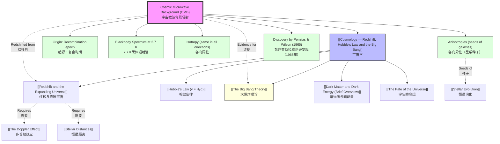

# 1. Overview / 概述

**English:**
The Cosmic Microwave Background Radiation (CMB) is the thermal radiation left over from the Big Bang, filling the entire universe uniformly. Discovered accidentally in 1965 by Penzias and Wilson, the CMB is one of the strongest pieces of evidence for the [[The Big Bang Theory]] and the hot, dense early universe. This sub-topic covers the origin, properties, and significance of the CMB, including its blackbody spectrum, isotropy, and the tiny anisotropies that seeded galaxy formation. Understanding the CMB is essential for linking [[Redshift and the Expanding Universe]] to the early universe and for testing cosmological models.

**中文:**
宇宙微波背景辐射（CMB）是大爆炸遗留下来的热辐射，均匀地充满整个宇宙。CMB于1965年由彭齐亚斯和威尔逊意外发现，是支持[[大爆炸理论]]以及早期宇宙高温高密状态的最有力证据之一。本子知识点涵盖CMB的起源、性质及其重要意义，包括其黑体辐射谱、各向同性以及孕育星系形成的微小各向异性。理解CMB对于将[[红移与膨胀宇宙]]与早期宇宙联系起来，以及检验宇宙学模型至关重要。

---

# 2. Syllabus Learning Objectives / 考纲学习目标

| CAIE 9702 | Edexcel IAL |
|-----------|-------------|
| 25.5(a) Describe the cosmic microwave background (CMB) radiation. | 10.26 Understand that the cosmic microwave background (CMB) radiation is a key piece of evidence for the Big Bang model. |
| 25.5(b) Explain that the CMB is a blackbody radiation at a temperature of about 2.7 K. | 10.27 Know that the CMB has a blackbody spectrum corresponding to a temperature of approximately 2.7 K. |
| 25.5(c) Describe the origin of the CMB as the remnant of the Big Bang. | 10.28 Understand that the CMB originated from the early universe when it became transparent to radiation. |
| 25.5(d) Explain the isotropy of the CMB. | 10.29 Understand that the CMB is almost isotropic (the same in all directions). |
| 25.5(e) Describe the anisotropies in the CMB and their significance. | 10.30 Understand that small anisotropies in the CMB provide evidence for the seeds of galaxy formation. |
| 25.5(f) Explain how the CMB supports the Big Bang theory. | 10.31 Understand how the CMB supports the Big Bang model over the Steady State model. |
| 25.5(g) Describe the discovery of the CMB by Penzias and Wilson. | 10.32 Know that the CMB was discovered by Penzias and Wilson in 1965. |

**Examiner Expectations / 考官期望:**
- **CAIE:** Students must be able to describe the CMB, its blackbody spectrum at ~2.7 K, its origin, isotropy, and anisotropies. They should explain how the CMB supports the Big Bang theory and recall the discovery by Penzias and Wilson.
- **Edexcel:** Students must understand the CMB as key evidence for the Big Bang, know its blackbody spectrum at ~2.7 K, its origin, isotropy, and the significance of anisotropies. They should also compare the Big Bang and Steady State models.

---

# 3. Core Definitions / 核心定义

| Term (EN/CN) | Definition (EN) | Definition (CN) | Common Mistakes / 常见错误 |
|--------------|-----------------|-----------------|---------------------------|
| **Cosmic Microwave Background (CMB) Radiation** / 宇宙微波背景辐射 | Thermal radiation left over from the Big Bang, filling the universe uniformly, with a blackbody spectrum at ~2.7 K. | 大爆炸遗留下来的热辐射，均匀充满宇宙，具有约2.7 K的黑体辐射谱。 | Confusing CMB with other forms of background radiation (e.g., from stars or galaxies). |
| **Blackbody Radiation** / 黑体辐射 | Electromagnetic radiation emitted by a perfect absorber/emitter, with a spectrum determined solely by its temperature. | 由理想吸收体/发射体发出的电磁辐射，其频谱仅由温度决定。 | Thinking CMB is not a perfect blackbody; it is the most perfect blackbody known. |
| **Isotropy** / 各向同性 | The property of being the same in all directions; the CMB is almost perfectly isotropic. | 在所有方向上相同的性质；CMB几乎是完全各向同性的。 | Confusing isotropy with homogeneity (uniformity in space). |
| **Anisotropy** / 各向异性 | Small variations in the temperature of the CMB across the sky, corresponding to density fluctuations in the early universe. | 宇宙微波背景辐射在天空中的微小温度变化，对应早期宇宙的密度涨落。 | Thinking anisotropies are random noise; they are structured and provide key cosmological information. |
| **Recombination** / 复合 | The epoch when the universe cooled enough for protons and electrons to combine into neutral hydrogen, making the universe transparent to radiation. | 宇宙冷却到足以使质子和电子结合成中性氢的时期，使宇宙对辐射变得透明。 | Confusing recombination with the Big Bang itself; recombination occurred ~380,000 years after the Big Bang. |
| **Surface of Last Scattering** / 最后散射面 | The spherical shell from which the CMB photons we observe today were last scattered, corresponding to the epoch of recombination. | 我们今天观测到的CMB光子最后一次被散射的球壳，对应复合时期。 | Thinking the CMB comes from a single point; it comes from a spherical shell around us. |

---

# 4. Key Concepts Explained / 关键概念详解

## 4.1 Origin of the CMB / CMB的起源

### Explanation / 解释
**English:** The CMB originated from the early universe when it was extremely hot and dense. In the first ~380,000 years after the Big Bang, the universe was a hot plasma of protons, electrons, and photons. Photons were constantly scattered by free electrons (Thomson scattering), making the universe opaque. As the universe expanded and cooled, it reached a temperature of about 3000 K, when protons and electrons could combine to form neutral hydrogen atoms (recombination). With free electrons gone, photons could travel freely — the universe became transparent. These photons, stretched by the expansion of the universe, now appear as the CMB at a temperature of ~2.7 K. This is directly linked to [[Redshift and the Expanding Universe]] — the CMB photons have been redshifted by a factor of about 1100.

**中文:** CMB起源于早期宇宙极端高温高密的时期。在大爆炸后最初的约38万年里，宇宙是由质子、电子和光子组成的热等离子体。光子不断被自由电子散射（汤姆孙散射），使宇宙不透明。随着宇宙膨胀冷却，温度降至约3000 K时，质子和电子可以结合形成中性氢原子（复合）。自由电子消失后，光子可以自由传播——宇宙变得透明。这些光子被宇宙膨胀拉伸，现在表现为温度约2.7 K的CMB。这与[[红移与膨胀宇宙]]直接相关——CMB光子已被红移了约1100倍。

### Physical Meaning / 物理意义
**English:** The CMB is a direct snapshot of the universe at the moment it became transparent. It provides a "baby picture" of the universe at age ~380,000 years, showing the seeds of all future structure.

**中文:** CMB是宇宙变得透明那一刻的直接快照。它提供了宇宙在约38万岁时的"婴儿照片"，显示了所有未来结构的种子。

### Common Misconceptions / 常见误区
- **Misconception:** The CMB is the afterglow of the Big Bang explosion itself.
  **Correction:** The CMB comes from the epoch of recombination, not the Big Bang itself. The Big Bang was not an explosion in space; it was the beginning of space and time.
- **Misconception:** The CMB is uniform and featureless.
  **Correction:** While almost perfectly isotropic, the CMB has tiny anisotropies (ΔT/T ~ 10⁻⁵) that are crucial for cosmology.
- **Misconception:** The CMB is only in the microwave region.
  **Correction:** The CMB peaks in the microwave region, but its spectrum extends across the electromagnetic spectrum.

### Exam Tips / 考试提示
- **CAIE:** Be prepared to describe the timeline: Big Bang → opaque plasma → recombination → transparent universe → CMB. Use the term "surface of last scattering."
- **Edexcel:** Focus on the CMB as evidence against the Steady State model. The Steady State model cannot explain the existence of the CMB.

> 📷 **IMAGE PROMPT — CMB-01: Timeline of the Early Universe**
> A timeline diagram showing the Big Bang at t=0, the opaque plasma phase (0 to 380,000 years), recombination at 380,000 years, and the release of CMB photons. The timeline should show the universe expanding and cooling, with temperature labels (e.g., 10^9 K, 3000 K, 2.7 K). Include a visual representation of photons scattering off free electrons before recombination and traveling freely after recombination.

## 4.2 Blackbody Spectrum of the CMB / CMB的黑体辐射谱

### Explanation / 解释
**English:** The CMB has a perfect blackbody spectrum corresponding to a temperature of 2.725 K. This means the intensity of radiation at different wavelengths follows Planck's law for a blackbody at that temperature. The peak wavelength is given by Wien's displacement law: λ_max = b/T, where b = 2.898 × 10⁻³ m·K. For T = 2.725 K, λ_max ≈ 1.06 mm, which is in the microwave region. The spectrum was measured with extraordinary precision by the COBE satellite in the 1990s, showing it matches a blackbody curve perfectly. This is strong evidence that the CMB is thermal radiation from a hot, dense early universe.

**中文:** CMB具有完美的黑体辐射谱，对应温度2.725 K。这意味着不同波长的辐射强度遵循该温度下黑体的普朗克定律。峰值波长由维恩位移定律给出：λ_max = b/T，其中b = 2.898 × 10⁻³ m·K。对于T = 2.725 K，λ_max ≈ 1.06 mm，属于微波波段。COBE卫星在1990年代以极高精度测量了该频谱，显示其与黑体曲线完美吻合。这是CMB来自早期高温高密宇宙热辐射的有力证据。

### Physical Meaning / 物理意义
**English:** The perfect blackbody spectrum confirms that the CMB is thermal radiation that was in thermal equilibrium with matter in the early universe. The temperature of 2.7 K is the result of cooling from ~3000 K due to the expansion of the universe.

**中文:** 完美的黑体辐射谱证实了CMB是与早期宇宙物质处于热平衡的热辐射。2.7 K的温度是宇宙膨胀从约3000 K冷却的结果。

### Common Misconceptions / 常见误区
- **Misconception:** The CMB temperature is exactly 2.7 K everywhere.
  **Correction:** The average temperature is 2.725 K, but there are tiny variations (anisotropies) of about ±0.0002 K.
- **Misconception:** The CMB spectrum is like a star's spectrum.
  **Correction:** Stars have absorption lines in their spectra; the CMB is a pure blackbody with no lines.

### Exam Tips / 考试提示
- **CAIE:** Be able to use Wien's displacement law to calculate the peak wavelength of the CMB. Know that the CMB is a blackbody.
- **Edexcel:** Understand that the perfect blackbody spectrum is a key prediction of the Big Bang model that was confirmed by COBE.

> 📷 **IMAGE PROMPT — CMB-02: Blackbody Spectrum of the CMB**
> A graph showing intensity vs. wavelength for a blackbody at 2.725 K. The curve should peak at about 1.06 mm (microwave region). Include the COBE data points plotted on top of the theoretical curve, showing perfect agreement. Label the peak wavelength and the temperature. Include a comparison with a blackbody curve at 3000 K (the temperature at recombination) to show how the spectrum has been redshifted.

## 4.3 Isotropy and Anisotropies / 各向同性与各向异性

### Explanation / 解释
**English:** The CMB is almost perfectly isotropic — its temperature is the same in all directions to about 1 part in 100,000. This isotropy is a key prediction of the Big Bang model and supports the cosmological principle (the universe is homogeneous and isotropic on large scales). However, tiny anisotropies (temperature variations of about ±0.0002 K) exist. These anisotropies correspond to density fluctuations in the early universe — slightly denser regions that would later collapse under gravity to form galaxies and clusters of galaxies. The anisotropies were first detected by the COBE satellite in 1992 and have been mapped in detail by WMAP and Planck. The pattern of anisotropies provides a wealth of information about the composition, geometry, and evolution of the universe.

**中文:** CMB几乎是完全各向同性的——其温度在所有方向上相同，精度达到十万分之一。这种各向同性是大爆炸模型的关键预测，并支持宇宙学原理（宇宙在大尺度上是均匀且各向同性的）。然而，存在微小的各向异性（温度变化约±0.0002 K）。这些各向异性对应早期宇宙的密度涨落——密度稍高的区域后来会在引力作用下坍缩形成星系和星系团。各向异性于1992年由COBE卫星首次探测到，并由WMAP和普朗克卫星详细绘制。各向异性的模式提供了关于宇宙组成、几何结构和演化的丰富信息。

### Physical Meaning / 物理意义
**English:** The isotropy confirms the universe is homogeneous on large scales. The anisotropies are the "seeds" of all cosmic structure — galaxies, clusters, and superclusters. They also encode information about the universe's parameters (e.g., density, Hubble constant, dark matter content).

**中文:** 各向同性证实了宇宙在大尺度上是均匀的。各向异性是所有宇宙结构——星系、星系团和超星系团——的"种子"。它们还编码了宇宙参数（如密度、哈勃常数、暗物质含量）的信息。

### Common Misconceptions / 常见误区
- **Misconception:** The CMB is perfectly isotropic.
  **Correction:** It is almost isotropic, but the tiny anisotropies are crucial.
- **Misconception:** Anisotropies are random noise.
  **Correction:** They have a specific pattern (power spectrum) that matches predictions from inflation and the Big Bang model.
- **Misconception:** The dipole anisotropy (a large-scale temperature difference) is cosmological.
  **Correction:** The dipole is mostly due to Earth's motion relative to the CMB (the "peculiar velocity" of the Solar System).

### Exam Tips / 考试提示
- **CAIE:** Be able to explain that anisotropies are evidence for the seeds of galaxy formation. Know that the CMB is almost isotropic.
- **Edexcel:** Understand that anisotropies provide evidence for the seeds of galaxy formation. Be able to describe the significance of the CMB power spectrum.

> 📷 **IMAGE PROMPT — CMB-03: CMB Anisotropy Map**
> A full-sky map of the CMB temperature anisotropies, similar to the Planck satellite's map. Use a color scale where red represents slightly hotter regions and blue represents slightly cooler regions. The variations should be extremely small (ΔT/T ~ 10⁻⁵). Include a color bar showing the temperature scale in microkelvin (μK). The map should show the characteristic "speckled" pattern of anisotropies.

## 4.4 Discovery of the CMB / CMB的发现

### Explanation / 解释
**English:** The CMB was discovered accidentally in 1965 by Arno Penzias and Robert Wilson at Bell Labs in New Jersey. They were using a large horn antenna to study radio signals, but they detected a persistent, uniform noise that they could not eliminate. After ruling out all possible sources (including pigeon droppings on the antenna!), they realized the noise was coming from all directions in the sky. Meanwhile, a team at Princeton University (Robert Dicke, Jim Peebles, and others) was theoretically predicting the existence of the CMB. When Penzias and Wilson learned of this, they connected their observation to the prediction. Penzias and Wilson were awarded the Nobel Prize in Physics in 1978 for their discovery.

**中文:** CMB于1965年由阿诺·彭齐亚斯和罗伯特·威尔逊在新泽西州贝尔实验室意外发现。他们使用一个大型喇叭天线研究无线电信号，但检测到无法消除的持续均匀噪声。在排除了所有可能的来源（包括天线上的鸽子粪便！）后，他们意识到噪声来自天空的所有方向。与此同时，普林斯顿大学的一个团队（罗伯特·迪克、吉姆·皮布尔斯等人）正在从理论上预测CMB的存在。当彭齐亚斯和威尔逊得知此事后，他们将观测与预测联系起来。彭齐亚斯和威尔逊因这一发现于1978年获得诺贝尔物理学奖。

### Physical Meaning / 物理意义
**English:** The discovery of the CMB was a turning point in cosmology. It provided decisive evidence for the Big Bang model and effectively ended the debate between the Big Bang and Steady State models. The Steady State model could not explain the existence of a uniform, thermal radiation background.

**中文:** CMB的发现是宇宙学的转折点。它为大爆炸模型提供了决定性证据，并有效结束了大爆炸与稳恒态模型之间的争论。稳恒态模型无法解释均匀热辐射背景的存在。

### Common Misconceptions / 常见误区
- **Misconception:** Penzias and Wilson were looking for the CMB.
  **Correction:** They discovered it accidentally while working on a different project.
- **Misconception:** The CMB was predicted before it was discovered.
  **Correction:** It was predicted independently by several scientists (Gamow, Alpher, Herman in the 1940s; Dicke's group in the 1960s), but the discovery was still accidental.

### Exam Tips / 考试提示
- **CAIE:** Be able to describe the discovery by Penzias and Wilson. Know that it was accidental.
- **Edexcel:** Understand that the discovery of the CMB was a key piece of evidence that supported the Big Bang model over the Steady State model.

---

# 5. Essential Equations / 核心公式

## 5.1 Wien's Displacement Law / 维恩位移定律

$$ \lambda_{\text{max}} = \frac{b}{T} $$

| Symbol (符号) | Meaning (EN) | Meaning (CN) | Unit (单位) |
|--------------|-------------|-------------|------------|
| λ_max | Peak wavelength | 峰值波长 | m |
| b | Wien's displacement constant (2.898 × 10⁻³ m·K) | 维恩位移常数 (2.898 × 10⁻³ m·K) | m·K |
| T | Temperature | 温度 | K |

**Derivation / 推导:** From Planck's law of blackbody radiation, the peak wavelength is found by differentiating the intensity distribution with respect to wavelength and setting the derivative to zero.

**Conditions / 适用条件:** Applies to any blackbody radiator. The CMB is a near-perfect blackbody.

**Limitations / 局限性:** Only gives the peak wavelength; the full spectrum requires Planck's law.

## 5.2 Redshift of the CMB / CMB的红移

$$ z = \frac{\lambda_{\text{observed}}}{\lambda_{\text{emitted}}} - 1 $$

For the CMB, the redshift from the surface of last scattering (T_emitted ≈ 3000 K) to today (T_observed ≈ 2.7 K) is:

$$ z \approx \frac{T_{\text{emitted}}}{T_{\text{observed}}} - 1 \approx \frac{3000}{2.7} - 1 \approx 1100 $$

| Symbol (符号) | Meaning (EN) | Meaning (CN) | Unit (单位) |
|--------------|-------------|-------------|------------|
| z | Redshift | 红移 | dimensionless |
| T_emitted | Temperature at recombination (~3000 K) | 复合时的温度 (~3000 K) | K |
| T_observed | Temperature of CMB today (~2.7 K) | 今天CMB的温度 (~2.7 K) | K |

**Derivation / 推导:** The temperature of the CMB scales as T ∝ 1/a, where a is the scale factor of the universe. The redshift z = 1/a - 1.

**Conditions / 适用条件:** Assumes the universe expanded adiabatically (no heat exchange) since recombination.

**Limitations / 局限性:** The exact redshift depends on the precise temperature at recombination, which is slightly model-dependent.

## 5.3 Energy Density of the CMB / CMB的能量密度

$$ u = a T^4 $$

| Symbol (符号) | Meaning (EN) | Meaning (CN) | Unit (单位) |
|--------------|-------------|-------------|------------|
| u | Energy density | 能量密度 | J/m³ |
| a | Radiation constant (7.5657 × 10⁻¹⁶ J·m⁻³·K⁻⁴) | 辐射常数 (7.5657 × 10⁻¹⁶ J·m⁻³·K⁻⁴) | J·m⁻³·K⁻⁴ |
| T | Temperature | 温度 | K |

**Derivation / 推导:** From the Stefan-Boltzmann law for blackbody radiation.

**Conditions / 适用条件:** For a blackbody radiation field.

**Limitations / 局限性:** The CMB energy density is very small today (~4 × 10⁻¹⁴ J/m³), but was much larger in the early universe.

> 📷 **IMAGE PROMPT — CMB-04: CMB Temperature and Redshift Relationship**
> A graph showing the temperature of the CMB as a function of redshift. The x-axis should be redshift (z) from 0 to 1100, and the y-axis should be temperature (T) from 2.7 K to 3000 K. The curve should show T ∝ (1+z). Mark the current temperature (2.7 K at z=0) and the temperature at recombination (3000 K at z=1100).

---

# 6. Graphs and Relationships / 图表与关系

## 6.1 CMB Blackbody Spectrum / CMB黑体辐射谱

### Axes / 坐标轴
- **X-axis:** Wavelength (λ) / 波长 (λ) [mm]
- **Y-axis:** Intensity (I) / 强度 (I) [arbitrary units]

### Shape / 形状
**English:** A smooth, bell-shaped curve that peaks at about 1.06 mm. The curve rises steeply at short wavelengths, peaks, and then falls off more gradually at longer wavelengths. This is the characteristic shape of a blackbody spectrum.

**中文:** 平滑的钟形曲线，峰值约在1.06 mm处。曲线在短波长处急剧上升，达到峰值，然后在长波长处更平缓地下降。这是黑体辐射谱的特征形状。

### Gradient Meaning / 斜率含义
**English:** The gradient of the curve at any point represents the rate of change of intensity with wavelength. The gradient is positive before the peak and negative after the peak.

**中文:** 曲线上任意点的斜率表示强度随波长的变化率。峰值前斜率为正，峰值后斜率为负。

### Area Meaning / 面积含义
**English:** The area under the curve represents the total power per unit area emitted by the blackbody (Stefan-Boltzmann law: P = σT⁴).

**中文:** 曲线下的面积表示黑体单位面积发射的总功率（斯特藩-玻尔兹曼定律：P = σT⁴）。

### Exam Interpretation / 考试解读
**English:** Students should be able to identify the peak wavelength, explain that the CMB matches a blackbody curve at 2.7 K, and use Wien's law to calculate the temperature or peak wavelength.

**中文:** 学生应能识别峰值波长，解释CMB与2.7 K的黑体曲线吻合，并使用维恩定律计算温度或峰值波长。

---

# 7. Required Diagrams / 必备图表

## 7.1 CMB Blackbody Spectrum Diagram / CMB黑体辐射谱图

### Description / 描述
**English:** A graph showing the intensity of the CMB as a function of wavelength, with the theoretical blackbody curve at 2.725 K and the observed data points from the COBE satellite plotted on top. The peak wavelength should be clearly marked at about 1.06 mm.

**中文:** 显示CMB强度随波长变化的图表，包含2.725 K的理论黑体曲线和COBE卫星的观测数据点。峰值波长应清晰标注在约1.06 mm处。

### Image Prompt / 图片生成提示
> 📷 **IMAGE PROMPT — CMB-05: CMB Blackbody Spectrum with COBE Data**
> A scientific graph showing the cosmic microwave background radiation spectrum. The x-axis is wavelength in mm (0 to 10 mm), and the y-axis is intensity in MJy/sr (0 to 400). A smooth blackbody curve at T=2.725 K is drawn, peaking at 1.06 mm. Error bars from COBE satellite data are plotted on top of the curve, showing perfect agreement. The curve should be labeled "Blackbody spectrum at T = 2.725 K" and the peak should be marked with a dashed line and labeled "λ_max = 1.06 mm". The graph should have a clean, professional appearance suitable for a textbook.

### Labels Required / 需要标注
- **X-axis:** Wavelength / mm (波长 / mm)
- **Y-axis:** Intensity / MJy sr⁻¹ (强度 / MJy sr⁻¹)
- **Peak wavelength:** λ_max = 1.06 mm (峰值波长)
- **Temperature:** T = 2.725 K (温度)
- **Data points:** COBE data (COBE数据)

### Exam Importance / 考试重要性
**English:** High. Students are expected to recognize the blackbody spectrum of the CMB and use it to calculate the temperature or peak wavelength. The COBE data is often referenced in exam questions.

**中文:** 高。学生应能识别CMB的黑体辐射谱，并使用它计算温度或峰值波长。COBE数据常在考题中被引用。

## 7.2 CMB Anisotropy Map / CMB各向异性图

### Description / 描述
**English:** A full-sky map of the CMB temperature anisotropies, showing tiny variations (ΔT ~ ±200 μK) across the sky. The map should use a color scale (e.g., blue for cooler, red for hotter) and show the characteristic pattern of anisotropies.

**中文:** CMB温度各向异性的全天图，显示天空中的微小变化（ΔT ~ ±200 μK）。地图应使用色标（例如，蓝色表示较冷，红色表示较热），并显示各向异性的特征模式。

### Image Prompt / 图片生成提示
> 📷 **IMAGE PROMPT — CMB-06: Planck CMB Anisotropy Map**
> A full-sky Mollweide projection map of the cosmic microwave background temperature anisotropies, similar to the Planck 2018 release. The color scale ranges from deep blue (-300 μK) through green to deep red (+300 μK). The map shows a complex, speckled pattern of hot and cold spots across the entire sky. The galactic plane should be visible as a horizontal band of slightly different texture. The map should be scientifically accurate in appearance, with a color bar on the side showing the temperature scale in microkelvin (μK). Title: "Planck CMB Temperature Anisotropies".

### Labels Required / 需要标注
- **Color bar:** Temperature / μK (温度 / μK)
- **Title:** CMB Temperature Anisotropies (CMB温度各向异性)
- **Scale:** ΔT/T ~ 10⁻⁵ (相对变化)

### Exam Importance / 考试重要性
**English:** Medium. Students should understand that the map shows the seeds of galaxy formation and that the pattern provides information about the universe's parameters.

**中文:** 中等。学生应理解该图显示了星系形成的种子，并且该模式提供了关于宇宙参数的信息。

---

# 8. Worked Examples / 典型例题

## Example 1: Wien's Law and the CMB / 维恩定律与CMB

### Question / 题目
**English:**
The cosmic microwave background radiation has a blackbody spectrum with a temperature of 2.725 K.
(a) Calculate the peak wavelength of the CMB.
(b) The CMB was emitted when the universe was at a temperature of approximately 3000 K. Calculate the peak wavelength at the time of emission.
(c) Explain why the CMB is observed in the microwave region today.

**中文:**
宇宙微波背景辐射具有温度为2.725 K的黑体辐射谱。
(a) 计算CMB的峰值波长。
(b) CMB是在宇宙温度约为3000 K时发出的。计算发射时的峰值波长。
(c) 解释为什么今天观测到的CMB在微波波段。

### Solution / 解答

**(a)**
Use Wien's displacement law:
$$ \lambda_{\text{max}} = \frac{b}{T} = \frac{2.898 \times 10^{-3} \text{ m·K}}{2.725 \text{ K}} $$

$$ \lambda_{\text{max}} = 1.063 \times 10^{-3} \text{ m} = 1.06 \text{ mm} $$

**(b)**
At emission, T = 3000 K:
$$ \lambda_{\text{max, emitted}} = \frac{2.898 \times 10^{-3}}{3000} = 9.66 \times 10^{-7} \text{ m} = 966 \text{ nm} $$

This is in the infrared region.

**(c)**
The universe has expanded by a factor of about 1100 since the CMB was emitted. This expansion stretches the wavelength of the photons (cosmological redshift). The peak wavelength has been redshifted from 966 nm (infrared) to 1.06 mm (microwave). The temperature has correspondingly cooled from 3000 K to 2.7 K.

### Final Answer / 最终答案
**Answer:** (a) 1.06 mm (b) 966 nm (c) Due to cosmological redshift from the expansion of the universe.
**答案：** (a) 1.06 mm (b) 966 nm (c) 由于宇宙膨胀引起的宇宙学红移。

### Quick Tip / 提示
**English:** Remember that the CMB temperature scales inversely with the scale factor: T ∝ 1/a. The redshift z = T_emitted/T_observed - 1 ≈ 1100.
**中文：** 记住CMB温度与尺度因子成反比：T ∝ 1/a。红移 z = T_发射/T_观测 - 1 ≈ 1100。

## Example 2: CMB as Evidence for the Big Bang / CMB作为大爆炸的证据

### Question / 题目
**English:**
Explain how the cosmic microwave background radiation provides evidence for the Big Bang theory and against the Steady State theory. Include in your answer:
- The origin of the CMB
- The properties of the CMB (temperature, spectrum, isotropy)
- Why the Steady State model cannot explain the CMB

**中文:**
解释宇宙微波背景辐射如何为大爆炸理论提供证据，并反驳稳恒态理论。你的回答应包括：
- CMB的起源
- CMB的性质（温度、频谱、各向同性）
- 为什么稳恒态模型无法解释CMB

### Solution / 解答

**English:**
1. **Origin:** The Big Bang model predicts that the early universe was hot and dense. After about 380,000 years, the universe cooled enough for protons and electrons to combine (recombination), releasing a flash of thermal radiation. This radiation has been redshifted by the expansion of the universe and is observed today as the CMB.

2. **Properties:** The CMB has a perfect blackbody spectrum at 2.725 K, confirming it is thermal radiation from a hot, dense state. It is almost perfectly isotropic, consistent with the cosmological principle. Tiny anisotropies correspond to density fluctuations that seeded galaxy formation.

3. **Steady State:** The Steady State model assumes the universe is unchanging on large scales. It cannot explain the existence of a thermal radiation background from a hot, dense early phase. The CMB is a direct relic of the Big Bang that the Steady State model cannot accommodate.

**中文:**
1. **起源：** 大爆炸模型预测早期宇宙高温高密。约38万年后，宇宙冷却到足以使质子和电子结合（复合），释放出一阵热辐射。该辐射被宇宙膨胀红移，今天被观测为CMB。

2. **性质：** CMB具有2.725 K的完美黑体辐射谱，证实它是来自高温高密状态的热辐射。它几乎是完全各向同性的，与宇宙学原理一致。微小的各向异性对应孕育星系形成的密度涨落。

3. **稳恒态：** 稳恒态模型假设宇宙在大尺度上不变。它无法解释来自早期高温高密阶段的热辐射背景。CMB是大爆炸的直接遗迹，稳恒态模型无法容纳。

### Final Answer / 最终答案
**Answer:** The CMB is a direct prediction of the Big Bang model and cannot be explained by the Steady State model.
**答案：** CMB是大爆炸模型的直接预测，稳恒态模型无法解释。

### Quick Tip / 提示
**English:** In exam questions, always link the CMB to the Big Bang model and mention that the Steady State model cannot explain it.
**中文：** 在考试题中，始终将CMB与大爆炸模型联系起来，并提到稳恒态模型无法解释它。

---

# 9. Past Paper Question Types / 历年真题题型

| Question Type / 题型 | Frequency / 频率 | Difficulty / 难度 | Past Paper References / 真题索引 |
|----------------------|------------------|------------------|-------------------------------|
| Describe the origin of the CMB / 描述CMB的起源 | High | Easy | 📝 *待填入* |
| Calculate peak wavelength using Wien's law / 使用维恩定律计算峰值波长 | High | Medium | 📝 *待填入* |
| Explain how the CMB supports the Big Bang theory / 解释CMB如何支持大爆炸理论 | High | Medium | 📝 *待填入* |
| Compare Big Bang and Steady State models using CMB / 使用CMB比较大爆炸和稳恒态模型 | Medium | Medium | 📝 *待填入* |
| Describe the discovery of the CMB / 描述CMB的发现 | Medium | Easy | 📝 *待填入* |
| Explain the significance of CMB anisotropies / 解释CMB各向异性的意义 | Medium | Hard | 📝 *待填入* |
| Interpret a CMB blackbody spectrum graph / 解读CMB黑体辐射谱图 | Low | Medium | 📝 *待填入* |

**Common Command Words / 常见指令词:**
- **Describe / 描述:** Give a detailed account of the origin, properties, or discovery of the CMB.
- **Explain / 解释:** Give reasons for the CMB's properties and how it supports the Big Bang model.
- **Calculate / 计算:** Use Wien's law or other equations to find numerical values.
- **Compare / 比较:** Contrast the Big Bang and Steady State models using the CMB as evidence.

---

# 10. Practical Skills Connections / 实验技能链接

**English:**
The CMB is primarily an observational topic, but it connects to practical skills in several ways:

1. **Data Analysis:** Students should be able to interpret graphs of the CMB blackbody spectrum, identifying the peak wavelength and using it to calculate temperature. This involves reading values from graphs and applying Wien's law.

2. **Uncertainties:** The COBE satellite measured the CMB spectrum with extraordinary precision. Students should understand that the error bars on the data points are extremely small, showing the CMB is a near-perfect blackbody.

3. **Graph Plotting:** Students may be asked to plot or interpret a graph of intensity vs. wavelength for the CMB, or to plot the relationship between temperature and redshift.

4. **Experimental Design:** While students won't directly measure the CMB, they should understand how radio telescopes and satellites (COBE, WMAP, Planck) are used to observe it. This includes understanding the challenges of observing at microwave wavelengths (e.g., atmospheric absorption, interference from Earth's own radiation).

5. **Comparison with Laboratory Blackbodies:** Students can compare the CMB spectrum with blackbody spectra from laboratory sources (e.g., a heated filament) to understand the concept of a blackbody.

**中文:**
CMB主要是一个观测性话题，但在几个方面与实验技能相关：

1. **数据分析：** 学生应能解读CMB黑体辐射谱图，识别峰值波长并用其计算温度。这涉及从图表中读取数值并应用维恩定律。

2. **不确定度：** COBE卫星以极高精度测量了CMB频谱。学生应理解数据点上的误差棒非常小，表明CMB是近乎完美的黑体。

3. **图表绘制：** 学生可能被要求绘制或解读CMB的强度-波长图，或绘制温度与红移的关系图。

4. **实验设计：** 虽然学生不会直接测量CMB，但他们应理解如何使用射电望远镜和卫星（COBE、WMAP、普朗克）观测CMB。这包括理解在微波波段观测的挑战（例如，大气吸收、地球自身辐射的干扰）。

5. **与实验室黑体的比较：** 学生可以将CMB频谱与实验室源（例如，加热灯丝）的黑体辐射谱进行比较，以理解黑体的概念。

---

# 11. Concept Map / 概念图谱

---

# 12. Quick Revision Sheet / 速查表

| Category / 类别 | Key Points / 要点 |
|----------------|------------------|
| **Definition / 定义** | Thermal radiation left over from the Big Bang, filling the universe uniformly. / 大爆炸遗留下来的热辐射，均匀充满宇宙。 |
| **Temperature / 温度** | 2.725 K (average) / 2.725 K（平均） |
| **Peak Wavelength / 峰值波长** | λ_max = 1.06 mm (microwave region) / λ_max = 1.06 mm（微波波段） |
| **Key Formula / 核心公式** | Wien's law: λ_max = b/T, where b = 2.898 × 10⁻³ m·K / 维恩定律：λ_max = b/T，其中b = 2.898 × 10⁻³ m·K |
| **Origin / 起源** | Recombination epoch (~380,000 years after Big Bang) when universe became transparent. / 复合时期（大爆炸后约38万年），宇宙变得透明。 |
| **Spectrum / 频谱** | Perfect blackbody spectrum / 完美的黑体辐射谱 |
| **Isotropy / 各向同性** | Almost perfectly isotropic (same in all directions) / 几乎完全各向同性（所有方向相同） |
| **Anisotropies / 各向异性** | Tiny temperature variations (ΔT/T ~ 10⁻⁵) — seeds of galaxy formation / 微小温度变化（ΔT/T ~ 10⁻⁵）——星系形成的种子 |
| **Discovery / 发现** | Penzias and Wilson (1965), accidentally at Bell Labs / 彭齐亚斯和威尔逊（1965年），在贝尔实验室意外发现 |
| **Evidence For / 支持证据** | Big Bang theory; against Steady State model / 支持大爆炸理论；反驳稳恒态模型 |
| **Key Satellites / 关键卫星** | COBE (1992), WMAP (2003), Planck (2013) / COBE（1992年）、WMAP（2003年）、普朗克（2013年） |
| **Redshift / 红移** | z ≈ 1100 (from 3000 K to 2.7 K) / z ≈ 1100（从3000 K到2.7 K） |
| **Exam Tip / 考试提示** | Always link CMB to Big Bang model. Use Wien's law for calculations. Mention anisotropies as seeds of galaxies. / 始终将CMB与大爆炸模型联系起来。使用维恩定律进行计算。提及各向异性作为星系种子。 |