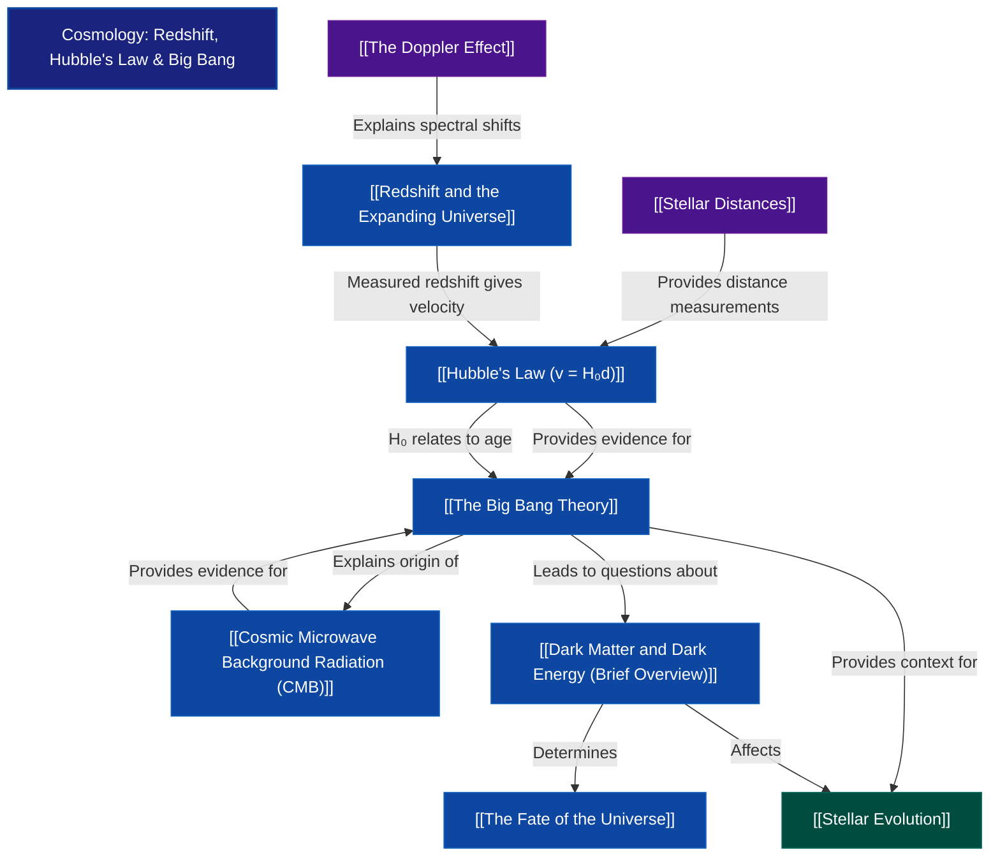

# 1. Overview / 概述

**English:**
Cosmology is the study of the origin, evolution, and ultimate fate of the universe. This topic focuses on three interconnected pillars: **redshift** (the stretching of light from distant galaxies), **Hubble's Law** (the relationship between a galaxy's recessional velocity and its distance), and the **Big Bang theory** (the model describing the universe's expansion from an initial hot, dense state). Together, these concepts provide the observational and theoretical framework for modern cosmology.

The importance of this topic in A-Level Physics cannot be overstated. It connects [[The Doppler Effect]] from waves to the largest scales in the universe, uses [[Stellar Distances]] to calibrate cosmic measurements, and provides the foundation for understanding [[Stellar Evolution]] in a cosmic context. Real-world applications include the discovery of the accelerating universe (Nobel Prize 2011), the mapping of the [[Cosmic Microwave Background Radiation (CMB)]] by the Planck satellite, and the ongoing search for [[Dark Matter and Dark Energy (Brief Overview)]].

In both Cambridge 9702 (Paper 4, Section 25.5) and Edexcel IAL (Unit 4, Topic 10.26-10.32), this topic is assessed through calculations using Hubble's Law, interpretation of redshift data, and explanations of the Big Bang model. It is a high-yield topic for A2 examinations, typically appearing in Section B of CAIE Paper 4 and in multiple-choice and long-answer questions for Edexcel.

**中文：**
宇宙学是研究宇宙起源、演化和最终命运的学科。本主题聚焦于三个相互关联的支柱：**红移**（来自遥远星系的光的拉伸）、**哈勃定律**（星系退行速度与其距离之间的关系）以及**大爆炸理论**（描述宇宙从初始高温致密状态膨胀的模型）。这些概念共同为现代宇宙学提供了观测和理论框架。

本主题在A-Level物理中的重要性不言而喻。它将来自波动学的[[多普勒效应]]与宇宙最大尺度联系起来，利用[[恒星距离]]校准宇宙测量，并为在宇宙背景下理解[[恒星演化]]提供了基础。实际应用包括加速宇宙的发现（2011年诺贝尔奖）、普朗克卫星对[[宇宙微波背景辐射（CMB）]]的测绘，以及对[[暗物质与暗能量（简要概述）]]的持续探索。

在剑桥9702（试卷4，第25.5节）和爱德思IAL（单元4，第10.26-10.32节）中，本主题通过哈勃定律计算、红移数据解读以及大爆炸模型的解释来评估。这是A2考试的高频主题，通常出现在剑桥试卷4的B部分以及爱德思的选择题和长答题中。

---

# 2. Syllabus Learning Objectives / 考纲学习目标

| CAIE 9702 (25.5 a-g) | Edexcel IAL (WPH14 U4: 10.26-10.32) |
|----------------------|--------------------------------------|
| (a) Show an understanding of the term *redshift* and how it relates to the Doppler effect | 10.26 Understand the term *redshift* and how it relates to the Doppler effect |
| (b) Use the formula for redshift: $z = \frac{\Delta \lambda}{\lambda} \approx \frac{v}{c}$ for $v \ll c$ | 10.27 Use the formula $z = \frac{\Delta \lambda}{\lambda} \approx \frac{v}{c}$ for $v \ll c$ |
| (c) Explain how Hubble's Law ($v = H_0 d$) provides evidence for the expanding universe | 10.28 Understand Hubble's Law: $v = H_0 d$ |
| (d) Use Hubble's Law to estimate the distance to a galaxy | 10.29 Use Hubble's Law to estimate distances and ages |
| (e) Show an understanding of the Big Bang theory | 10.30 Understand the Big Bang theory as the origin of the universe |
| (f) Show an understanding of the Cosmic Microwave Background (CMB) radiation as evidence for the Big Bang | 10.31 Understand the Cosmic Microwave Background (CMB) radiation as evidence for the Big Bang |
| (g) Show an understanding of how the Hubble constant $H_0$ relates to the age of the universe | 10.32 Understand how $H_0$ relates to the age of the universe ($t \approx 1/H_0$) |

**Examiner Expectations / 考官期望:**

**English:**
- Candidates must be able to **calculate redshift** from spectral line shifts and convert to recessional velocity using $v = zc$ (for $v \ll c$).
- Candidates must **interpret Hubble's Law graphically** — the gradient of a $v$ vs $d$ graph gives $H_0$.
- Candidates must **explain the significance of CMB** as the "afterglow" of the Big Bang, with a temperature of approximately 2.7 K.
- Candidates must **estimate the age of the universe** using $t \approx 1/H_0$, and understand why this is an approximation.
- Candidates must **distinguish between cosmological redshift** (due to space expansion) and Doppler redshift (due to relative motion).

**中文：**
- 考生必须能够**计算红移**，通过谱线位移并利用 $v = zc$（当 $v \ll c$ 时）转换为退行速度。
- 考生必须能够**以图形方式解释哈勃定律**——$v$ 对 $d$ 图的斜率给出 $H_0$。
- 考生必须能够**解释CMB的意义**，作为大爆炸的"余晖"，温度约为2.7 K。
- 考生必须能够**估算宇宙年龄**，使用 $t \approx 1/H_0$，并理解为何这是一个近似值。
- 考生必须能够**区分宇宙学红移**（由于空间膨胀）和多普勒红移（由于相对运动）。

> 📋 **CIE Only:** CAIE specifically requires understanding of how $H_0$ relates to the age of the universe, including the approximation $t \approx 1/H_0$ and the assumption of constant expansion rate.
>
> 📋 **Edexcel Only:** Edexcel explicitly includes the formula $z = \frac{\Delta \lambda}{\lambda} \approx \frac{v}{c}$ and requires understanding of the limitations of this approximation.

---

# 3. Core Definitions / 核心定义

| Term (EN/CN) | Definition (EN) | Definition (CN) | Common Mistakes / 常见错误 |
|--------------|-----------------|-----------------|---------------------------|
| **Redshift / 红移** | The shift of spectral lines towards longer wavelengths (lower frequencies) due to the expansion of space or relative motion of a source away from the observer. | 由于空间膨胀或光源远离观测者的相对运动，导致谱线向更长波长（更低频率）方向的移动。 | Confusing redshift with blueshift; thinking redshift is always due to motion (cosmological redshift is due to space expansion). |
| **Hubble's Law / 哈勃定律** | The recessional velocity $v$ of a galaxy is directly proportional to its distance $d$ from Earth: $v = H_0 d$, where $H_0$ is the Hubble constant. | 星系的退行速度 $v$ 与其距地球的距离 $d$ 成正比：$v = H_0 d$，其中 $H_0$ 是哈勃常数。 | Forgetting that $H_0$ has units of $\text{km s}^{-1} \text{Mpc}^{-1}$; thinking Hubble's Law applies to nearby galaxies (it applies to distant galaxies where cosmological effects dominate). |
| **Hubble Constant ($H_0$) / 哈勃常数** | The constant of proportionality in Hubble's Law, representing the current rate of expansion of the universe. | 哈勃定律中的比例常数，代表宇宙当前的膨胀速率。 | Confusing $H_0$ with the age of the universe; thinking $H_0$ is constant over time (it changes with cosmic time). |
| **Big Bang Theory / 大爆炸理论** | The cosmological model describing the universe's origin from an extremely hot, dense state approximately 13.8 billion years ago, followed by continuous expansion and cooling. | 描述宇宙起源于约138亿年前一个极端高温致密状态，随后持续膨胀和冷却的宇宙学模型。 | Thinking the Big Bang was an explosion in space (it was an expansion of space itself); thinking it occurred at a point (the entire universe was at a point). |
| **Cosmic Microwave Background (CMB) / 宇宙微波背景辐射** | Electromagnetic radiation filling the universe, with a black-body spectrum corresponding to a temperature of 2.725 K, considered the "afterglow" of the Big Bang. | 充满宇宙的电磁辐射，具有对应2.725 K温度的黑体谱，被视为大爆炸的"余晖"。 | Thinking CMB is from stars or galaxies; confusing CMB with other forms of background radiation. |
| **Cosmological Redshift / 宇宙学红移** | Redshift caused by the expansion of space itself, not by relative motion through space. | 由空间本身膨胀引起的红移，而非通过空间的相对运动引起。 | Treating cosmological redshift as identical to Doppler redshift (the formula $z = v/c$ is an approximation). |
| **Recessional Velocity / 退行速度** | The velocity at which a galaxy is moving away from Earth due to the expansion of the universe. | 由于宇宙膨胀，星系远离地球的速度。 | Thinking galaxies are moving through space (they are carried by expanding space). |

---

# 4. Key Concepts Explained / 关键概念详解

## 4.1 Redshift and the Expanding Universe / 红移与膨胀宇宙

### Explanation / 解释
**English:**
Redshift is the phenomenon where light from distant galaxies is shifted to longer wavelengths (towards the red end of the spectrum). This occurs because the space between galaxies is expanding, stretching the wavelength of light as it travels. The redshift $z$ is defined as:

$$ z = \frac{\lambda_{\text{observed}} - \lambda_{\text{rest}}}{\lambda_{\text{rest}}} = \frac{\Delta \lambda}{\lambda_{\text{rest}}} $$

For velocities much less than the speed of light ($v \ll c$), the redshift approximates the recessional velocity as a fraction of the speed of light:

$$ z \approx \frac{v}{c} $$

This is distinct from the [[The Doppler Effect]] because cosmological redshift is caused by the expansion of space itself, not by relative motion through space. The relationship between redshift and the scale factor of the universe is given by:

$$ 1 + z = \frac{a(t_{\text{observed}})}{a(t_{\text{emitted}})} $$

where $a(t)$ is the scale factor of the universe at time $t$.

**中文：**
红移是指来自遥远星系的光被移动到更长波长（朝向光谱的红端）的现象。这是因为星系之间的空间在膨胀，拉伸了光在传播过程中的波长。红移 $z$ 定义为：

$$ z = \frac{\lambda_{\text{观测}} - \lambda_{\text{静止}}}{\lambda_{\text{静止}}} = \frac{\Delta \lambda}{\lambda_{\text{静止}}} $$

对于远小于光速的速度（$v \ll c$），红移近似等于退行速度与光速的比值：

$$ z \approx \frac{v}{c} $$

这与[[多普勒效应]]不同，因为宇宙学红移是由空间本身的膨胀引起的，而不是通过空间的相对运动。红移与宇宙尺度因子的关系由下式给出：

$$ 1 + z = \frac{a(t_{\text{观测}})}{a(t_{\text{发射}})} $$

其中 $a(t)$ 是时间 $t$ 时宇宙的尺度因子。

### Physical Meaning / 物理意义
**English:**
Redshift tells us how much the universe has expanded since the light was emitted. A redshift of $z = 1$ means the universe was half its current size when the light was emitted. The most distant galaxies observed have redshifts of $z > 10$, meaning the universe was less than 1/11 of its current size when their light was emitted.

**中文：**
红移告诉我们自光发射以来宇宙膨胀了多少。红移 $z = 1$ 意味着光发射时宇宙的大小是当前的一半。观测到的最遥远星系的红移超过 $z > 10$，意味着它们的光发射时宇宙大小不到当前的1/11。

### Common Misconceptions / 常见误区
1. **Thinking redshift is always due to motion:** Cosmological redshift is due to space expansion, not motion through space.
2. **Confusing redshift with blueshift:** Blueshift occurs when objects move towards us; in an expanding universe, almost all distant galaxies show redshift.
3. **Thinking $z = v/c$ is exact:** This is only valid for $v \ll c$; for high redshifts, relativistic corrections are needed.

### Exam Tips / 考试提示
**English:**
- Always state whether you are using the approximation $z \approx v/c$ or the exact formula.
- For CAIE, be prepared to calculate $z$ from given $\lambda_{\text{observed}}$ and $\lambda_{\text{rest}}$.
- For Edexcel, be able to explain why cosmological redshift is different from Doppler redshift.
- Remember that $z$ is dimensionless.

**中文：**
- 始终说明你使用的是近似公式 $z \approx v/c$ 还是精确公式。
- 对于剑桥，准备好从给定的 $\lambda_{\text{观测}}$ 和 $\lambda_{\text{静止}}$ 计算 $z$。
- 对于爱德思，能够解释为什么宇宙学红移不同于多普勒红移。
- 记住 $z$ 是无量纲的。

> 📷 **IMAGE PROMPT — [REDSHIFT-01]: Spectral Line Shift Diagram**
>
> A diagram showing three spectra: (1) a laboratory reference spectrum with a bright emission line at a known wavelength (e.g., 656.3 nm for hydrogen H-alpha), (2) a spectrum from a moderately distant galaxy showing the same line shifted to a longer wavelength (e.g., 700 nm), and (3) a spectrum from a very distant galaxy showing the line shifted even further (e.g., 800 nm). Arrows should indicate the direction of shift. Labels: "Rest wavelength $\lambda_0$", "Observed wavelength $\lambda$", "Redshift $z = \Delta\lambda/\lambda$". Clean, educational style with a white background.

---

## 4.2 Hubble's Law ($v = H_0 d$) / 哈勃定律

### Explanation / 解释
**English:**
Hubble's Law states that the recessional velocity $v$ of a galaxy is directly proportional to its distance $d$ from Earth:

$$ v = H_0 d $$

where $H_0$ is the Hubble constant. This relationship was discovered by Edwin Hubble in 1929 and provides the primary observational evidence for the expanding universe.

The Hubble constant has units of $\text{km s}^{-1} \text{Mpc}^{-1}$ (kilometers per second per megaparsec). Current measurements give $H_0 \approx 67.4 \pm 0.5 \, \text{km s}^{-1} \text{Mpc}^{-1}$ (from Planck satellite CMB data) or $H_0 \approx 73.0 \pm 1.0 \, \text{km s}^{-1} \text{Mpc}^{-1}$ (from local distance measurements). This discrepancy is known as the "Hubble tension."

**中文：**
哈勃定律指出，星系的退行速度 $v$ 与其距地球的距离 $d$ 成正比：

$$ v = H_0 d $$

其中 $H_0$ 是哈勃常数。这个关系由埃德温·哈勃于1929年发现，为膨胀宇宙提供了主要的观测证据。

哈勃常数的单位是 $\text{km s}^{-1} \text{Mpc}^{-1}$（千米每秒每百万秒差距）。当前测量值给出 $H_0 \approx 67.4 \pm 0.5 \, \text{km s}^{-1} \text{Mpc}^{-1}$（来自普朗克卫星CMB数据）或 $H_0 \approx 73.0 \pm 1.0 \, \text{km s}^{-1} \text{Mpc}^{-1}$（来自局部距离测量）。这种差异被称为"哈勃张力"。

### Physical Meaning / 物理意义
**English:**
Hubble's Law tells us that the universe is expanding uniformly. Every galaxy is moving away from every other galaxy, with the speed proportional to distance. This does not mean Earth is at the center — observers in any galaxy would see the same pattern. The Hubble constant gives the current expansion rate: a galaxy 1 Mpc away recedes at about 70 km/s.

**中文：**
哈勃定律告诉我们宇宙在均匀膨胀。每个星系都在远离其他星系，速度与距离成正比。这并不意味着地球在中心——任何星系中的观测者都会看到相同的模式。哈勃常数给出了当前的膨胀速率：距离1 Mpc的星系以约70 km/s的速度退行。

### Common Misconceptions / 常见误区
1. **Thinking Hubble's Law applies to nearby galaxies:** For nearby galaxies, peculiar velocities (due to gravitational interactions) dominate over cosmological expansion.
2. **Thinking $H_0$ is constant over time:** $H_0$ changes with cosmic time; it is the "current" expansion rate.
3. **Confusing $H_0$ with the age of the universe:** The age is approximately $1/H_0$, but this assumes constant expansion rate.

### Exam Tips / 考试提示
**English:**
- For CAIE, be able to calculate distance using $d = v/H_0$ when given $v$ and $H_0$.
- For Edexcel, be able to interpret a graph of $v$ vs $d$ — the gradient is $H_0$.
- Remember to convert units: 1 Mpc = $3.09 \times 10^{22}$ m.
- The Hubble constant is often given in $\text{km s}^{-1} \text{Mpc}^{-1}$ — be careful with unit conversions.

**中文：**
- 对于剑桥，能够使用 $d = v/H_0$ 在给定 $v$ 和 $H_0$ 时计算距离。
- 对于爱德思，能够解释 $v$ 对 $d$ 的图——斜率为 $H_0$。
- 记住单位换算：1 Mpc = $3.09 \times 10^{22}$ m。
- 哈勃常数通常以 $\text{km s}^{-1} \text{Mpc}^{-1}$ 给出——注意单位换算。

> 📷 **IMAGE PROMPT — [HUBBLE-01]: Hubble's Law Graph**
>
> A scatter plot showing recessional velocity (km/s) on the y-axis vs distance (Mpc) on the x-axis. Data points from real galaxies (e.g., from the Hubble Space Telescope Key Project) should show a clear linear trend. A best-fit line should be drawn through the origin. The gradient of the line should be labeled as "$H_0$". Error bars should be shown on some points. Labels: "Recessional velocity $v$ (km/s)", "Distance $d$ (Mpc)", "Gradient $= H_0$". Clean, scientific style with a white background.

---

## 4.3 The Big Bang Theory / 大爆炸理论

### Explanation / 解释
**English:**
The Big Bang theory is the prevailing cosmological model describing the origin and evolution of the universe. It proposes that the universe began approximately 13.8 billion years ago from an extremely hot, dense state (a singularity) and has been expanding and cooling ever since.

Key evidence for the Big Bang includes:
1. **Hubble's Law** — the observed expansion of the universe
2. **Cosmic Microwave Background (CMB)** — the "afterglow" of the Big Bang
3. **Abundance of light elements** — the observed ratios of hydrogen, helium, and lithium match predictions from Big Bang nucleosynthesis

The Big Bang was not an explosion in space; it was the expansion of space itself. The universe did not expand into anything — space itself was created in the Big Bang.

**中文：**
大爆炸理论是描述宇宙起源和演化的主流宇宙学模型。它提出宇宙大约在138亿年前从一个极端高温致密状态（奇点）开始，并一直在膨胀和冷却。

大爆炸的关键证据包括：
1. **哈勃定律**——观测到的宇宙膨胀
2. **宇宙微波背景辐射（CMB）**——大爆炸的"余晖"
3. **轻元素丰度**——观测到的氢、氦和锂的比例与大爆炸核合成预测相符

大爆炸不是空间中的爆炸；它是空间本身的膨胀。宇宙没有膨胀到任何东西中——空间本身是在大爆炸中创造的。

### Physical Meaning / 物理意义
**English:**
The Big Bang theory explains why the universe is expanding, why it is filled with radiation at 2.7 K, and why the universe is composed primarily of hydrogen and helium. It provides a framework for understanding the evolution of [[Stellar Evolution|stars and galaxies]] and the large-scale structure of the universe.

**中文：**
大爆炸理论解释了为什么宇宙在膨胀，为什么它充满了2.7 K的辐射，以及为什么宇宙主要由氢和氦组成。它为理解[[恒星演化|恒星和星系]]的演化以及宇宙的大尺度结构提供了框架。

### Common Misconceptions / 常见误区
1. **Thinking the Big Bang was an explosion:** It was an expansion of space, not matter moving through space.
2. **Thinking the Big Bang occurred at a point:** The entire universe was at a point; there was no "outside."
3. **Thinking the Big Bang theory explains the origin of the universe from nothing:** It describes the evolution from an initial state; what happened "before" is not addressed.

### Exam Tips / 考试提示
**English:**
- For CAIE, be able to list and explain the three main pieces of evidence for the Big Bang.
- For Edexcel, be able to describe the timeline of the early universe (inflation, nucleosynthesis, recombination).
- Remember that the Big Bang theory is supported by multiple independent lines of evidence.

**中文：**
- 对于剑桥，能够列出并解释大爆炸的三个主要证据。
- 对于爱德思，能够描述早期宇宙的时间线（暴胀、核合成、复合）。
- 记住大爆炸理论得到多个独立证据线的支持。

---

## 4.4 Cosmic Microwave Background Radiation (CMB) / 宇宙微波背景辐射

### Explanation / 解释
**English:**
The Cosmic Microwave Background (CMB) is electromagnetic radiation that fills the universe, with a black-body spectrum corresponding to a temperature of 2.725 K. It was discovered by Penzias and Wilson in 1965 and is considered the "afterglow" of the Big Bang.

The CMB originated about 380,000 years after the Big Bang, when the universe cooled enough for electrons and protons to combine into neutral hydrogen atoms (recombination). Before this, the universe was opaque to radiation because free electrons scattered photons. After recombination, photons could travel freely, and these photons are what we observe today as the CMB.

The CMB is remarkably uniform (anisotropy of about 1 part in 100,000), but tiny temperature fluctuations provide information about the seeds of structure formation in the early universe.

**中文：**
宇宙微波背景辐射（CMB）是充满宇宙的电磁辐射，具有对应2.725 K温度的黑体谱。它由彭齐亚斯和威尔逊于1965年发现，被视为大爆炸的"余晖"。

CMB起源于大爆炸后约38万年，当时宇宙冷却到足以使电子和质子结合成中性氢原子（复合）。在此之前，宇宙对辐射是不透明的，因为自由电子散射光子。复合之后，光子可以自由传播，我们今天观测到的就是这些光子。

CMB非常均匀（各向异性约为十万分之一），但微小的温度波动提供了早期宇宙结构形成种子的信息。

### Physical Meaning / 物理意义
**English:**
The CMB is the oldest light in the universe, providing a snapshot of the universe when it was only 380,000 years old. Its black-body spectrum confirms the hot, dense early state predicted by the Big Bang theory. The tiny temperature fluctuations (anisotropies) are the seeds from which galaxies and large-scale structure formed through gravitational collapse.

**中文：**
CMB是宇宙中最古老的光，提供了宇宙仅38万岁时的快照。其黑体谱证实了大爆炸理论预测的高温致密早期状态。微小的温度波动（各向异性）是通过引力坍缩形成星系和大尺度结构的种子。

### Common Misconceptions / 常见误区
1. **Thinking CMB is from stars or galaxies:** CMB is from the early universe, before stars and galaxies formed.
2. **Thinking CMB is uniform:** It is remarkably uniform but has tiny fluctuations that are cosmologically significant.
3. **Confusing CMB with other forms of background radiation:** CMB is specifically the relic radiation from the Big Bang.

### Exam Tips / 考试提示
**English:**
- For CAIE, be able to explain why the CMB is evidence for the Big Bang.
- For Edexcel, be able to describe the discovery of CMB by Penzias and Wilson.
- Remember that the CMB temperature has cooled from about 3000 K at recombination to 2.7 K today due to the expansion of the universe.

**中文：**
- 对于剑桥，能够解释为什么CMB是大爆炸的证据。
- 对于爱德思，能够描述彭齐亚斯和威尔逊发现CMB的过程。
- 记住由于宇宙膨胀，CMB温度已从复合时的约3000 K冷却到今天的2.7 K。

> 📷 **IMAGE PROMPT — [CMB-01]: CMB Black-Body Spectrum**
>
> A graph showing intensity (y-axis) vs wavelength/frequency (x-axis) for the CMB. The curve should be a perfect black-body spectrum peaking at about 1.9 mm (160 GHz). The curve should be labeled "T = 2.725 K". The data points from the COBE satellite (FIRAS instrument) should be shown as dots perfectly matching the curve. Labels: "Intensity", "Wavelength (mm)", "CMB Black-Body Spectrum at 2.725 K". Clean, scientific style with a white background.

---

## 4.5 Dark Matter and Dark Energy (Brief Overview) / 暗物质与暗能量（简要概述）

### Explanation / 解释
**English:**
Dark matter and dark energy are two mysterious components that dominate the universe's energy budget. According to the Lambda-CDM model:
- **Dark matter** (~27% of the universe) is a form of matter that does not emit, absorb, or reflect electromagnetic radiation, but interacts gravitationally. It explains the rotation curves of galaxies and the formation of large-scale structure.
- **Dark energy** (~68% of the universe) is a mysterious form of energy that causes the accelerated expansion of the universe. It is often associated with the cosmological constant ($\Lambda$) in Einstein's equations.

Only about 5% of the universe is ordinary matter (baryonic matter) that we can see.

**中文：**
暗物质和暗能量是主导宇宙能量预算的两种神秘成分。根据Lambda-CDM模型：
- **暗物质**（约占宇宙的27%）是一种不发射、吸收或反射电磁辐射，但通过引力相互作用的物质形式。它解释了星系的旋转曲线和大尺度结构的形成。
- **暗能量**（约占宇宙的68%）是一种导致宇宙加速膨胀的神秘能量形式。它通常与爱因斯坦方程中的宇宙学常数（$\Lambda$）相关联。

只有约5%的宇宙是我们能看到的普通物质（重子物质）。

### Physical Meaning / 物理意义
**English:**
Dark matter holds galaxies together — without it, galaxies would fly apart given their observed rotation speeds. Dark energy is causing the expansion of the universe to accelerate, which was discovered in 1998 through observations of Type Ia supernovae (Nobel Prize 2011).

**中文：**
暗物质将星系维系在一起——如果没有暗物质，根据观测到的旋转速度，星系会飞散。暗能量导致宇宙膨胀加速，这是1998年通过Ia型超新星观测发现的（2011年诺贝尔奖）。

### Common Misconceptions / 常见误区
1. **Thinking dark matter is "dark" because it doesn't emit light:** It doesn't interact electromagnetically at all.
2. **Thinking dark energy is the same as dark matter:** They are completely different phenomena.
3. **Thinking dark matter has been directly detected:** It has only been detected through gravitational effects.

### Exam Tips / 考试提示
**English:**
- For CAIE, this is a brief overview — focus on the evidence for dark matter (galaxy rotation curves) and dark energy (accelerated expansion).
- For Edexcel, be able to explain why dark matter and dark energy are inferred rather than directly observed.
- Remember the approximate percentages: ~5% ordinary matter, ~27% dark matter, ~68% dark energy.

**中文：**
- 对于剑桥，这是简要概述——关注暗物质（星系旋转曲线）和暗能量（加速膨胀）的证据。
- 对于爱德思，能够解释为什么暗物质和暗能量是推断而非直接观测的。
- 记住大致百分比：~5%普通物质，~27%暗物质，~68%暗能量。

---

## 4.6 The Fate of the Universe / 宇宙的命运

### Explanation / 解释
**English:**
The ultimate fate of the universe depends on its density and the nature of dark energy. Three main scenarios are considered:
1. **Big Freeze (Heat Death):** If the universe continues expanding forever, it will cool to near absolute zero, and all stars will eventually burn out. This is the most likely scenario given current observations.
2. **Big Crunch:** If the density of the universe is high enough, gravity could eventually reverse the expansion, causing the universe to collapse back into a hot, dense state.
3. **Big Rip:** If dark energy becomes stronger over time, it could tear apart galaxies, stars, planets, and eventually atoms.

Current evidence (accelerated expansion) favors the Big Freeze scenario, but the ultimate fate depends on the properties of dark energy, which are not yet fully understood.

**中文：**
宇宙的最终命运取决于其密度和暗能量的性质。考虑三种主要情景：
1. **大冻结（热寂）：** 如果宇宙永远膨胀下去，它将冷却到接近绝对零度，所有恒星最终将熄灭。根据当前观测，这是最可能的情景。
2. **大坍缩：** 如果宇宙密度足够高，引力最终可能逆转膨胀，导致宇宙坍缩回高温致密状态。
3. **大撕裂：** 如果暗能量随时间变强，它可能撕裂星系、恒星、行星，最终撕裂原子。

当前证据（加速膨胀）支持大冻结情景，但最终命运取决于暗能量的性质，这一点尚未完全理解。

### Physical Meaning / 物理意义
**English:**
The fate of the universe is not just a philosophical question — it is determined by measurable physical quantities: the density of matter, the Hubble constant, and the equation of state of dark energy. Understanding the fate of the universe helps us understand the fundamental nature of space, time, and energy.

**中文：**
宇宙的命运不仅仅是一个哲学问题——它由可测量的物理量决定：物质密度、哈勃常数和暗能量的状态方程。理解宇宙的命运有助于我们理解空间、时间和能量的基本性质。

### Common Misconceptions / 常见误区
1. **Thinking the fate is certain:** The fate depends on parameters that are not yet precisely measured.
2. **Thinking the Big Crunch is the only alternative to the Big Freeze:** The Big Rip is a distinct possibility.
3. **Thinking the fate of the universe is not testable:** Observations of supernovae, CMB, and large-scale structure provide constraints.

### Exam Tips / 考试提示
**English:**
- For CAIE, be able to describe the three possible fates and the evidence for each.
- For Edexcel, be able to explain how the critical density determines the fate.
- Remember that the accelerated expansion favors the Big Freeze scenario.

**中文：**
- 对于剑桥，能够描述三种可能的命运以及每种命运的证据。
- 对于爱德思，能够解释临界密度如何决定命运。
- 记住加速膨胀支持大冻结情景。

---

# 5. Essential Equations / 核心公式

## 5.1 Redshift Formula / 红移公式

**Equation / 公式:**
$$ z = \frac{\lambda_{\text{observed}} - \lambda_{\text{rest}}}{\lambda_{\text{rest}}} = \frac{\Delta \lambda}{\lambda_{\text{rest}}} $$

**Variables / 变量:**
| Symbol (符号) | Meaning (EN) | Meaning (CN) | Unit (单位) |
|--------------|-------------|-------------|------------|
| $z$ | Redshift | 红移 | dimensionless (无量纲) |
| $\lambda_{\text{observed}}$ | Observed wavelength | 观测波长 | m (or nm) |
| $\lambda_{\text{rest}}$ | Rest (laboratory) wavelength | 静止（实验室）波长 | m (or nm) |
| $\Delta \lambda$ | Change in wavelength | 波长变化量 | m (or nm) |

**Derivation / 推导:**
**English:**
The redshift formula is derived from the definition of fractional change in wavelength. For cosmological redshift, it relates to the scale factor $a(t)$:

$$ 1 + z = \frac{a(t_{\text{observed}})}{a(t_{\text{emitted}})} $$

For small velocities ($v \ll c$), the Doppler formula gives:

$$ z \approx \frac{v}{c} $$

**中文：**
红移公式来源于波长分数变化的定义。对于宇宙学红移，它与尺度因子 $a(t)$ 相关：

$$ 1 + z = \frac{a(t_{\text{观测}})}{a(t_{\text{发射}})} $$

对于小速度（$v \ll c$），多普勒公式给出：

$$ z \approx \frac{v}{c} $$

**Conditions / 适用条件:**
**English:** Valid for any redshift. The approximation $z \approx v/c$ is valid only for $v \ll c$ (i.e., $z \ll 1$).
**中文：** 适用于任何红移。近似 $z \approx v/c$ 仅适用于 $v \ll c$（即 $z \ll 1$）。

**Limitations / 局限性:**
**English:** For high redshifts ($z > 0.1$), the approximation $z \approx v/c$ breaks down and relativistic corrections are needed.
**中文：** 对于高红移（$z > 0.1$），近似 $z \approx v/c$ 失效，需要相对论修正。

**Rearrangements / 变形:**
$$ \lambda_{\text{observed}} = \lambda_{\text{rest}}(1 + z) $$
$$ \Delta \lambda = z \lambda_{\text{rest}} $$
$$ v \approx zc \quad (\text{for } v \ll c) $$

---

## 5.2 Hubble's Law / 哈勃定律

**Equation / 公式:**
$$ v = H_0 d $$

**Variables / 变量:**
| Symbol (符号) | Meaning (EN) | Meaning (CN) | Unit (单位) |
|--------------|-------------|-------------|------------|
| $v$ | Recessional velocity | 退行速度 | $\text{km s}^{-1}$ |
| $H_0$ | Hubble constant | 哈勃常数 | $\text{km s}^{-1} \text{Mpc}^{-1}$ |
| $d$ | Distance to galaxy | 到星系的距离 | Mpc |

**Derivation / 推导:**
**English:**
Hubble's Law is an empirical relationship discovered by Edwin Hubble in 1929. He plotted recessional velocities (measured from redshifts) against distances (measured using Cepheid variables and other standard candles) and found a linear relationship. The slope of the line gives $H_0$.

Theoretically, Hubble's Law follows from the assumption of a homogeneous, isotropic expanding universe (the cosmological principle). In such a universe, the recessional velocity between any two points is proportional to their separation.

**中文：**
哈勃定律是埃德温·哈勃于1929年发现的经验关系。他将退行速度（从红移测量）与距离（使用造父变星和其他标准烛光测量）作图，发现了线性关系。直线的斜率给出 $H_0$。

从理论上讲，哈勃定律源于均匀、各向同性膨胀宇宙的假设（宇宙学原理）。在这样的宇宙中，任意两点之间的退行速度与它们的距离成正比。

**Conditions / 适用条件:**
**English:** Valid for distant galaxies where cosmological expansion dominates over peculiar velocities. Not valid for nearby galaxies (within the Local Group) where gravitational interactions dominate.
**中文：** 适用于宇宙学膨胀主导的遥远星系。不适用于引力相互作用主导的近邻星系（在本星系群内）。

**Limitations / 局限性:**
**English:** Hubble's Law assumes a constant expansion rate, but the expansion rate has changed over cosmic time due to gravity and dark energy.
**中文：** 哈勃定律假设膨胀速率恒定，但由于引力和暗能量，膨胀速率在宇宙时间中发生了变化。

**Rearrangements / 变形:**
$$ d = \frac{v}{H_0} $$
$$ H_0 = \frac{v}{d} $$

---

## 5.3 Age of the Universe / 宇宙年龄

**Equation / 公式:**
$$ t \approx \frac{1}{H_0} $$

**Variables / 变量:**
| Symbol (符号) | Meaning (EN) | Meaning (CN) | Unit (单位) |
|--------------|-------------|-------------|------------|
| $t$ | Age of the universe | 宇宙年龄 | s (or years) |
| $H_0$ | Hubble constant | 哈勃常数 | $\text{s}^{-1}$ (after unit conversion) |

**Derivation / 推导:**
**English:**
If the universe has been expanding at a constant rate, then the time since the expansion began (the age) is simply the distance divided by velocity:

$$ t = \frac{d}{v} = \frac{d}{H_0 d} = \frac{1}{H_0} $$

This assumes that the expansion rate has been constant. In reality, the expansion has slowed due to gravity and then accelerated due to dark energy, so $1/H_0$ gives an approximate age.

To convert $H_0$ from $\text{km s}^{-1} \text{Mpc}^{-1}$ to $\text{s}^{-1}$:
1 Mpc = $3.09 \times 10^{19}$ km
So $H_0 = 70 \, \text{km s}^{-1} \text{Mpc}^{-1} = 70 / (3.09 \times 10^{19}) \, \text{s}^{-1} \approx 2.27 \times 10^{-18} \, \text{s}^{-1}$
Then $t = 1/H_0 \approx 4.41 \times 10^{17} \, \text{s} \approx 14.0 \times 10^9$ years

**中文：**
如果宇宙以恒定速率膨胀，那么膨胀开始以来的时间（年龄）就是距离除以速度：

$$ t = \frac{d}{v} = \frac{d}{H_0 d} = \frac{1}{H_0} $$

这假设膨胀速率恒定。实际上，膨胀先因引力减速，后因暗能量加速，所以 $1/H_0$ 给出近似年龄。

要将 $H_0$ 从 $\text{km s}^{-1} \text{Mpc}^{-1}$ 转换为 $\text{s}^{-1}$：
1 Mpc = $3.09 \times 10^{19}$ km
所以 $H_0 = 70 \, \text{km s}^{-1} \text{Mpc}^{-1} = 70 / (3.09 \times 10^{19}) \, \text{s}^{-1} \approx 2.27 \times 10^{-18} \, \text{s}^{-1}$
则 $t = 1/H_0 \approx 4.41 \times 10^{17} \, \text{s} \approx 14.0 \times 10^9$ 年

**Conditions / 适用条件:**
**English:** Valid only as an approximation assuming constant expansion rate. The actual age of the universe (13.8 billion years) is close to $1/H_0$ but requires detailed cosmological models.
**中文：** 仅作为假设恒定膨胀速率的近似值有效。宇宙的实际年龄（138亿年）接近 $1/H_0$，但需要详细的宇宙学模型。

**Limitations / 局限性:**
**English:** Does not account for changes in expansion rate over time. The approximation becomes less accurate for universes with significant dark energy or matter density.
**中文：** 未考虑膨胀速率随时间的变化。对于具有显著暗能量或物质密度的宇宙，近似值变得不太准确。

**Rearrangements / 变形:**
$$ H_0 \approx \frac{1}{t} $$
$$ t = \frac{1}{H_0} \times \text{(correction factor)} $$

---

# 6. Graphs and Relationships / 图表与关系

## 6.1 Hubble's Law Graph ($v$ vs $d$) / 哈勃定律图

### Axes / 坐标轴
**English:** x-axis: Distance $d$ (Mpc); y-axis: Recessional velocity $v$ (km/s)
**中文：** x轴：距离 $d$ (Mpc)；y轴：退行速度 $v$ (km/s)

### Shape / 形状
**English:** A straight line passing through the origin, with positive slope.
**中文：** 一条通过原点的直线，斜率为正。

### Gradient Meaning / 斜率含义
**English:** The gradient of the line is the Hubble constant $H_0$ (in $\text{km s}^{-1} \text{Mpc}^{-1}$).
**中文：** 直线的斜率是哈勃常数 $H_0$（单位为 $\text{km s}^{-1} \text{Mpc}^{-1}$）。

### Area Meaning / 面积含义
**English:** The area under the graph has no physical meaning in this context.
**中文：** 在此上下文中，图下的面积没有物理意义。

### Exam Interpretation / 考试解读
**English:**
- A steeper gradient means a larger $H_0$ (faster expansion).
- Scatter around the line indicates peculiar velocities or measurement uncertainties.
- The line must pass through the origin (zero velocity at zero distance).
- For CAIE, be able to calculate $H_0$ from the gradient.
- For Edexcel, be able to use the graph to estimate distances.

**中文：**
- 更陡的斜率意味着更大的 $H_0$（更快的膨胀）。
- 线周围的散点表示本动速度或测量不确定度。
- 直线必须通过原点（零距离处速度为零）。
- 对于剑桥，能够从斜率计算 $H_0$。
- 对于爱德思，能够使用图表估算距离。

### Common Questions / 常见问题
**English:**
- "Calculate the Hubble constant from the graph."
- "Use the graph to estimate the distance to a galaxy with recessional velocity $v$."
- "Explain why the data points do not all lie exactly on the line."

**中文：**
- "从图中计算哈勃常数。"
- "使用图表估算退行速度为 $v$ 的星系的距离。"
- "解释为什么数据点并不完全在直线上。"

---

## 6.2 Redshift vs Distance Graph / 红移与距离图

### Axes / 坐标轴
**English:** x-axis: Distance $d$ (Mpc); y-axis: Redshift $z$ (dimensionless)
**中文：** x轴：距离 $d$ (Mpc)；y轴：红移 $z$（无量纲）

### Shape / 形状
**English:** For small distances, approximately linear (since $z \approx v/c = H_0 d/c$). For large distances, the relationship becomes non-linear due to relativistic effects and the changing expansion rate.
**中文：** 对于小距离，近似线性（因为 $z \approx v/c = H_0 d/c$）。对于大距离，由于相对论效应和膨胀速率的变化，关系变为非线性。

### Gradient Meaning / 斜率含义
**English:** The initial gradient is $H_0/c$ (in $\text{Mpc}^{-1}$).
**中文：** 初始斜率为 $H_0/c$（单位为 $\text{Mpc}^{-1}$）。

### Area Meaning / 面积含义
**English:** No physical meaning.
**中文：** 没有物理意义。

### Exam Interpretation / 考试解读
**English:**
- The linear approximation is valid for $z \ll 1$.
- For high-redshift galaxies, the relationship deviates from linearity, providing information about the expansion history.
- For CAIE, focus on the linear approximation.
- For Edexcel, be aware of the non-linearity at high redshifts.

**中文：**
- 线性近似适用于 $z \ll 1$。
- 对于高红移星系，关系偏离线性，提供了膨胀历史的信息。
- 对于剑桥，关注线性近似。
- 对于爱德思，注意高红移时的非线性。

### Common Questions / 常见问题
**English:**
- "Show that $z \approx H_0 d/c$ for small distances."
- "Explain why the relationship between $z$ and $d$ is not linear for very distant galaxies."

**中文：**
- "证明在小距离时 $z \approx H_0 d/c$。"
- "解释为什么对于非常遥远的星系，$z$ 和 $d$ 之间的关系不是线性的。"

---

## 6.3 CMB Spectrum Graph / CMB谱图

### Axes / 坐标轴
**English:** x-axis: Wavelength (mm) or Frequency (GHz); y-axis: Intensity (arbitrary units)
**中文：** x轴：波长 (mm) 或频率 (GHz)；y轴：强度（任意单位）

### Shape / 形状
**English:** A perfect black-body spectrum, peaking at about 1.9 mm (160 GHz). The curve is symmetric on a log-log plot.
**中文：** 完美的黑体谱，峰值在约1.9 mm (160 GHz)处。曲线在对数-对数图上是对称的。

### Gradient Meaning / 斜率含义
**English:** The slope of the Rayleigh-Jeans tail (long wavelengths) is proportional to $T$; the slope of the Wien tail (short wavelengths) gives information about the temperature.
**中文：** 瑞利-琼斯尾（长波长）的斜率与 $T$ 成正比；维恩尾（短波长）的斜率提供温度信息。

### Area Meaning / 面积含义
**English:** The area under the curve is proportional to $T^4$ (Stefan-Boltzmann law), giving the total energy density of the CMB.
**中文：** 曲线下的面积与 $T^4$ 成正比（斯特藩-玻尔兹曼定律），给出CMB的总能量密度。

### Exam Interpretation / 考试解读
**English:**
- The CMB spectrum matches a black-body at 2.725 K, confirming the hot, dense early universe.
- The peak wavelength follows Wien's displacement law: $\lambda_{\text{max}} T = \text{constant}$.
- For CAIE, be able to explain why the CMB spectrum is evidence for the Big Bang.
- For Edexcel, be able to calculate the temperature from the peak wavelength.

**中文：**
- CMB谱与2.725 K的黑体匹配，证实了高温致密的早期宇宙。
- 峰值波长遵循维恩位移定律：$\lambda_{\text{max}} T = \text{常数}$。
- 对于剑桥，能够解释为什么CMB谱是大爆炸的证据。
- 对于爱德思，能够从峰值波长计算温度。

### Common Questions / 常见问题
**English:**
- "Explain how the CMB spectrum provides evidence for the Big Bang."
- "Calculate the temperature of the CMB given its peak wavelength."
- "Describe how the CMB spectrum has changed as the universe expanded."

**中文：**
- "解释CMB谱如何为大爆炸提供证据。"
- "给定CMB的峰值波长，计算其温度。"
- "描述CMB谱如何随宇宙膨胀而变化。"

---

# 7. Required Diagrams / 必备图表

## 7.1 Hubble's Law Graph / 哈勃定律图

### Description / 描述
**English:** A scatter plot showing recessional velocity (km/s) on the y-axis vs distance (Mpc) on the x-axis. Data points from real galaxies show a clear linear trend. A best-fit line passes through the origin. The gradient is labeled as $H_0$. Error bars indicate measurement uncertainties.

**中文：** 散点图，y轴为退行速度 (km/s)，x轴为距离 (Mpc)。来自真实星系的数据点显示清晰的线性趋势。最佳拟合线通过原点。斜率标记为 $H_0$。误差棒表示测量不确定度。

### Image Prompt / 图片生成提示
> 📷 **IMAGE PROMPT — [HUBBLE-02]: Hubble's Law Graph with Data Points**
>
> A scientific-style scatter plot with recessional velocity (km/s) on the y-axis (range 0-20000 km/s) and distance (Mpc) on the x-axis (range 0-300 Mpc). Approximately 20 data points from real galaxies (e.g., from the Hubble Space Telescope Key Project) should show a clear linear trend with some scatter. A solid best-fit line should pass through the origin. The gradient should be labeled as "$H_0 = 72 \text{ km s}^{-1} \text{Mpc}^{-1}$". Error bars should be shown on at least 5 data points. Labels: "Recessional velocity $v$ (km/s)", "Distance $d$ (Mpc)", "Gradient $= H_0$". Clean, educational style with a white background and grid lines.

### Labels Required / 需要标注
- x-axis: "Distance $d$ (Mpc)" / 距离 $d$ (Mpc)
- y-axis: "Recessional velocity $v$ (km/s)" / 退行速度 $v$ (km/s)
- Gradient: "$H_0$" / 哈勃常数 $H_0$
- Data points with error bars / 带误差棒的数据点
- Best-fit line / 最佳拟合线

### Exam Importance / 考试重要性
**English:** This is the most important graph in cosmology for A-Level. It directly illustrates Hubble's Law and allows calculation of $H_0$. Both CAIE and Edexcel frequently ask questions about interpreting this graph, calculating $H_0$ from the gradient, and using it to estimate distances.

**中文：** 这是A-Level宇宙学中最重要的图表。它直接说明了哈勃定律，并允许计算 $H_0$。剑桥和爱德思都经常提出关于解读此图、从斜率计算 $H_0$ 以及使用它估算距离的问题。

---

## 7.2 CMB Black-Body Spectrum / CMB黑体谱

### Description / 描述
**English:** A graph showing intensity (y-axis) vs wavelength (x-axis) for the Cosmic Microwave Background. The curve is a perfect black-body spectrum peaking at about 1.9 mm. The temperature is labeled as 2.725 K. Data points from the COBE satellite (FIRAS instrument) are shown as dots perfectly matching the theoretical curve.

**中文：** 显示宇宙微波背景辐射强度（y轴）与波长（x轴）关系的图。曲线是完美的黑体谱，峰值在约1.9 mm处。温度标记为2.725 K。来自COBE卫星（FIRAS仪器）的数据点显示为完美匹配理论曲线的点。

### Image Prompt / 图片生成提示
> 📷 **IMAGE PROMPT — [CMB-02]: CMB Black-Body Spectrum with COBE Data**
>
> A scientific-style graph with intensity (arbitrary units) on the y-axis and wavelength (mm) on the x-axis (range 0.1-10 mm, logarithmic scale). A smooth black-body curve peaks at about 1.9 mm. The curve is labeled "T = 2.725 K". Small dots (data points from COBE FIRAS) should perfectly overlay the curve, showing the remarkable agreement. The Rayleigh-Jeans tail (long wavelengths) and Wien tail (short wavelengths) should be labeled. Labels: "Intensity", "Wavelength (mm)", "CMB Black-Body Spectrum at 2.725 K", "COBE FIRAS data". Clean, scientific style with a white background.

### Labels Required / 需要标注
- x-axis: "Wavelength (mm)" / 波长 (mm)
- y-axis: "Intensity" / 强度
- Curve: "T = 2.725 K" / 温度 = 2.725 K
- Peak: "$\lambda_{\text{max}} \approx 1.9$ mm" / 峰值波长 $\approx 1.9$ mm
- Rayleigh-Jeans tail / 瑞利-琼斯尾
- Wien tail / 维恩尾
- Data points: "COBE FIRAS data" / COBE FIRAS数据

### Exam Importance / 考试重要性
**English:** This graph is crucial for demonstrating that the CMB has a black-body spectrum, confirming the hot, dense early universe predicted by the Big Bang theory. Both CAIE and Edexcel use this as key evidence for the Big Bang.

**中文：** 此图对于证明CMB具有黑体谱至关重要，证实了大爆炸理论预测的高温致密早期宇宙。剑桥和爱德思都将其作为大爆炸的关键证据。

---

## 7.3 Redshift Illustration / 红移示意图

### Description / 描述
**English:** A diagram showing three spectra: (1) a laboratory reference spectrum with a bright emission line at a known wavelength (e.g., 656.3 nm for hydrogen H-alpha), (2) a spectrum from a moderately distant galaxy showing the same line shifted to a longer wavelength (e.g., 700 nm), and (3) a spectrum from a very distant galaxy showing the line shifted even further (e.g., 800 nm). Arrows indicate the direction of shift.

**中文：** 显示三个光谱的图：(1) 实验室参考光谱，在已知波长处有一条明亮的发射线（例如氢H-alpha的656.3 nm），(2) 来自中等距离星系的光谱，显示同一条线移动到更长波长（例如700 nm），(3) 来自非常遥远星系的光谱，显示该线移动得更远（例如800 nm）。箭头指示移动方向。

### Image Prompt / 图片生成提示
> 📷 **IMAGE PROMPT — [REDSHIFT-02]: Spectral Line Redshift Diagram**
>
> A diagram showing three horizontal spectra arranged vertically. Top spectrum: "Laboratory Reference" with a bright red emission line at 656.3 nm labeled "H-alpha 656.3 nm". Middle spectrum: "Moderately Distant Galaxy ($z = 0.07$)" with the same line shifted to 700 nm, labeled "$\lambda = 700$ nm". Bottom spectrum: "Very Distant Galaxy ($z = 0.22$)" with the line shifted to 800 nm, labeled "$\lambda = 800$ nm". Arrows between the lines show the direction of redshift. Labels: "Wavelength increases →", "Redshift $z = \Delta\lambda/\lambda$". Clean, educational style with a white background and a wavelength scale at the bottom.

### Labels Required / 需要标注
- Top spectrum: "Laboratory Reference" / 实验室参考
- Middle spectrum: "Moderately Distant Galaxy ($z = 0.07$)" / 中等距离星系 ($z = 0.07$)
- Bottom spectrum: "Very Distant Galaxy ($z = 0.22$)" / 非常遥远星系 ($z = 0.22$)
- Emission line: "H-alpha" / H-alpha
- Wavelength labels: 656.3 nm, 700 nm, 800 nm
- Arrow: "Redshift direction" / 红移方向
- Wavelength scale / 波长标尺

### Exam Importance / 考试重要性
**English:** This diagram is essential for understanding the concept of redshift. Both CAIE and Edexcel use spectral line diagrams to test understanding of how redshift is measured and calculated.

**中文：** 此图对于理解红移概念至关重要。剑桥和爱德思都使用谱线图来测试对红移如何测量和计算的理解。

---

# 8. Worked Examples / 典型例题

## Example 1: Calculating Redshift and Recessional Velocity / 计算红移和退行速度

### Question / 题目
**English:**
A distant galaxy is observed to have the hydrogen H-alpha line ($\lambda_{\text{rest}} = 656.3$ nm) shifted to $\lambda_{\text{observed}} = 678.5$ nm.

(a) Calculate the redshift $z$ of this galaxy.
(b) Calculate the recessional velocity $v$ of this galaxy, assuming $v \ll c$.
(c) Using $H_0 = 70 \, \text{km s}^{-1} \text{Mpc}^{-1}$, estimate the distance to this galaxy.

**中文：**
观测到一个遥远星系的氢H-alpha线（$\lambda_{\text{静止}} = 656.3$ nm）移动到 $\lambda_{\text{观测}} = 678.5$ nm。

(a) 计算该星系的红移 $z$。
(b) 假设 $v \ll c$，计算该星系的退行速度 $v$。
(c) 使用 $H_0 = 70 \, \text{km s}^{-1} \text{Mpc}^{-1}$，估算该星系的距离。

### Solution / 解答

**Step 1: Calculate redshift $z$**

$$ z = \frac{\lambda_{\text{observed}} - \lambda_{\text{rest}}}{\lambda_{\text{rest}}} = \frac{678.5 - 656.3}{656.3} = \frac{22.2}{656.3} = 0.0338 $$

**Step 2: Calculate recessional velocity $v$**

Using $z \approx v/c$ for $v \ll c$:

$$ v = zc = 0.0338 \times 3.00 \times 10^8 \, \text{m/s} = 1.01 \times 10^7 \, \text{m/s} = 1.01 \times 10^4 \, \text{km/s} $$

**Step 3: Estimate distance using Hubble's Law**

$$ d = \frac{v}{H_0} = \frac{1.01 \times 10^4 \, \text{km/s}}{70 \, \text{km s}^{-1} \text{Mpc}^{-1}} = 144 \, \text{Mpc} $$

### Final Answer / 最终答案
**Answer:** (a) $z = 0.0338$; (b) $v = 1.01 \times 10^4$ km/s; (c) $d = 144$ Mpc
**答案：** (a) $z = 0.0338$；(b) $v = 1.01 \times 10^4$ km/s；(c) $d = 144$ Mpc

### Examiner Notes / 考官点评
**English:**
- Common mistake: Forgetting to convert units (nm to m is not needed here as the ratio is dimensionless).
- Common mistake: Using $v = zc$ without checking $v \ll c$ (here $v/c = 0.0338$, so it's valid).
- For part (c), ensure units are consistent: $v$ in km/s, $H_0$ in km s$^{-1}$ Mpc$^{-1}$.
- Always state the approximation used.

**中文：**
- 常见错误：忘记单位换算（此处不需要将nm转换为m，因为比值是无量纲的）。
- 常见错误：未检查 $v \ll c$ 就使用 $v = zc$（此处 $v/c = 0.0338$，所以有效）。
- 对于(c)部分，确保单位一致：$v$ 以km/s为单位，$H_0$ 以km s$^{-1}$ Mpc$^{-1}$为单位。
- 始终说明所使用的近似。

### Alternative Method / 替代方法
**English:**
For part (c), you could also use the formula $d = zc/H_0$ directly:

$$ d = \frac{zc}{H_0} = \frac{0.0338 \times 3.00 \times 10^5 \, \text{km/s}}{70 \, \text{km s}^{-1} \text{Mpc}^{-1}} = 145 \, \text{Mpc} $$

(The slight difference is due to rounding.)

**中文：**
对于(c)部分，你也可以直接使用公式 $d = zc/H_0$：

$$ d = \frac{zc}{H_0} = \frac{0.0338 \times 3.00 \times 10^5 \, \text{km/s}}{70 \, \text{km s}^{-1} \text{Mpc}^{-1}} = 145 \, \text{Mpc} $$

（微小差异是由于四舍五入。）

---

## Example 2: Estimating the Age of the Universe / 估算宇宙年龄

### Question / 题目
**English:**
The Hubble constant is measured to be $H_0 = 68 \, \text{km s}^{-1} \text{Mpc}^{-1}$.

(a) Convert $H_0$ to units of $\text{s}^{-1}$.
(b) Estimate the age of the universe in years, assuming a constant expansion rate.
(c) Explain why this estimate is an approximation, and state whether the actual age is likely to be larger or smaller than this estimate.

**中文：**
哈勃常数测量值为 $H_0 = 68 \, \text{km s}^{-1} \text{Mpc}^{-1}$。

(a) 将 $H_0$ 转换为 $\text{s}^{-1}$ 的单位。
(b) 假设膨胀速率恒定，估算宇宙的年龄（以年为单位）。
(c) 解释为什么这个估算是近似值，并说明实际年龄可能大于还是小于这个估算值。

### Solution / 解答

**Step 1: Convert $H_0$ to $\text{s}^{-1}$**

1 Mpc = $3.09 \times 10^{19}$ km

$$ H_0 = 68 \, \text{km s}^{-1} \text{Mpc}^{-1} = \frac{68}{3.09 \times 10^{19}} \, \text{s}^{-1} = 2.20 \times 10^{-18} \, \text{s}^{-1} $$

**Step 2: Estimate age**

$$ t = \frac{1}{H_0} = \frac{1}{2.20 \times 10^{-18}} \, \text{s} = 4.55 \times 10^{17} \, \text{s} $$

Convert to years (1 year = $3.16 \times 10^7$ s):

$$ t = \frac{4.55 \times 10^{17}}{3.16 \times 10^7} = 1.44 \times 10^{10} \, \text{years} = 14.4 \, \text{billion years} $$

**Step 3: Explain approximation**

The estimate assumes the universe has been expanding at a constant rate. In reality:
- Early in the universe's history, gravity slowed the expansion (deceleration).
- More recently, dark energy has caused the expansion to accelerate.

Because the expansion was faster in the past (due to gravity's deceleration), the actual age is slightly less than $1/H_0$. The actual age is about 13.8 billion years, which is close to but slightly less than our estimate.

### Final Answer / 最终答案
**Answer:** (a) $H_0 = 2.20 \times 10^{-18} \, \text{s}^{-1}$; (b) $t \approx 14.4$ billion years; (c) The estimate is an approximation because the expansion rate has changed over time. The actual age (13.8 billion years) is slightly less than $1/H_0$ because the expansion was faster in the past.
**答案：** (a) $H_0 = 2.20 \times 10^{-18} \, \text{s}^{-1}$；(b) $t \approx 144$ 亿年；(c) 该估算是近似值，因为膨胀速率随时间变化。实际年龄（138亿年）略小于 $1/H_0$，因为过去的膨胀更快。

### Examiner Notes / 考官点评
**English:**
- Common mistake: Forgetting to convert Mpc to km (1 Mpc = $3.09 \times 10^{19}$ km, not $10^{19}$).
- Common mistake: Using $t = 1/H_0$ without unit conversion.
- For part (c), the key point is that the expansion rate has not been constant. Both CAIE and Edexcel expect an explanation of why $1/H_0$ is an approximation.
- The actual age is slightly less than $1/H_0$ because the expansion was faster in the past (due to gravity).

**中文：**
- 常见错误：忘记将Mpc转换为km（1 Mpc = $3.09 \times 10^{19}$ km，不是 $10^{19}$）。
- 常见错误：未进行单位换算就使用 $t = 1/H_0$。
- 对于(c)部分，关键点是膨胀速率并非恒定。剑桥和爱德思都期望解释为什么 $1/H_0$ 是近似值。
- 实际年龄略小于 $1/H_0$，因为过去的膨胀更快（由于引力）。

### Alternative Method / 替代方法
**English:**
You can also estimate the age using the formula:

$$ t \approx \frac{1}{H_0} \times \frac{2}{3} $$

This factor of 2/3 accounts for the deceleration due to gravity in a matter-dominated universe. This gives:

$$ t \approx \frac{2}{3} \times 14.4 = 9.6 \, \text{billion years} $$

However, this is also an approximation because it doesn't account for dark energy. The actual age (13.8 billion years) lies between the simple estimate and the matter-dominated estimate.

**中文：**
你也可以使用公式估算年龄：

$$ t \approx \frac{1}{H_0} \times \frac{2}{3} $$

这个2/3因子考虑了物质主导宇宙中引力的减速作用。这给出：

$$ t \approx \frac{2}{3} \times 14.4 = 96 \, \text{亿年} $$

然而，这也是一个近似值，因为它没有考虑暗能量。实际年龄（138亿年）介于简单估算和物质主导估算之间。

---

# 9. Past Paper Question Types / 历年真题题型

| Question Type / 题型 | Frequency / 频率 | Difficulty / 难度 | Past Paper References / 真题索引 |
|----------------------|------------------|------------------|-------------------------------|
| Calculation of redshift $z$ / 红移 $z$ 的计算 | High | Medium | 📝 *待填入* |
| Calculation of recessional velocity $v = zc$ / 退行速度 $v = zc$ 的计算 | High | Low | 📝 *待填入* |
| Hubble's Law distance calculation / 哈勃定律距离计算 | High | Medium | 📝 *待填入* |
| Age of universe estimation / 宇宙年龄估算 | Medium | Medium | 📝 *待填入* |
| Explanation of CMB as evidence for Big Bang / 解释CMB作为大爆炸证据 | High | Medium | 📝 *待填入* |
| Graph interpretation ($v$ vs $d$) / 图表解读 ($v$ 对 $d$) | Medium | Medium | 📝 *待填入* |
| Comparison of cosmological vs Doppler redshift / 宇宙学红移与多普勒红移比较 | Low | High | 📝 *待填入* |
| Explanation of Hubble's Law / 解释哈勃定律 | Medium | Low | 📝 *待填入* |
| Unit conversion (Mpc to km) / 单位换算（Mpc到km） | Medium | Low | 📝 *待填入* |
| Dark matter/dark energy explanation / 暗物质/暗能量解释 | Low | High | 📝 *待填入* |

> 📝 **题库整理中 / Question Bank Under Construction:** 具体试卷编号（如 9702/42/M/J/24 Q7）将在后续整理真题后填入上表。

**Common Command Words / 常见指令词:**

| Command Word (EN) | Command Word (CN) | What is Required / 要求 |
|-------------------|-------------------|------------------------|
| State | 陈述 | A brief, factual statement without explanation |
| Define | 定义 | A precise, formal definition |
| Explain | 解释 | Give reasons or causes, showing understanding |
| Describe | 描述 | Give a detailed account |
| Calculate | 计算 | Use mathematics to find a numerical answer |
| Determine | 确定 | Find a value using given data or a graph |
| Suggest | 建议 | Use your knowledge to propose a possible answer |
| Show that | 证明 | Demonstrate that a given result follows from given data |
| Estimate | 估算 | Find an approximate value |
| Discuss | 讨论 | Present arguments for and against, or explore implications |

---

# 10. Practical Skills Connections / 实验技能链接

**English:**
This topic connects to practical skills in several ways:

1. **Measurement of Redshift (CAIE Paper 5 / Edexcel Unit 6):**
   - Using a spectrometer to measure spectral line positions
   - Calibrating wavelength scales using known spectral lines
   - Calculating uncertainties in wavelength measurements
   - Propagating uncertainties to find uncertainty in $z$ and $v$

2. **Determination of Hubble Constant (CAIE Paper 5 / Edexcel Unit 6):**
   - Plotting $v$ vs $d$ graph and finding gradient
   - Determining uncertainty in $H_0$ from the graph
   - Using error bars and best-fit lines
   - Understanding why data points show scatter (peculiar velocities, measurement errors)

3. **CMB Temperature Measurement (Conceptual):**
   - Understanding how the COBE satellite measured the CMB spectrum
   - Fitting a black-body curve to data points
   - Determining temperature from peak wavelength (Wien's law)

4. **Experimental Design Considerations:**
   - Why distant galaxies are needed (to minimize peculiar velocity effects)
   - Why standard candles (Cepheid variables, Type Ia supernovae) are needed for distance measurement
   - How uncertainties in distance measurements affect $H_0$ determination

5. **Data Analysis Skills:**
   - Converting between units (Mpc to km, years to seconds)
   - Using logarithmic scales for CMB spectrum
   - Understanding the significance of the Hubble tension (different $H_0$ values from different methods)

**中文：**
本主题通过多种方式与实验技能相关联：

1. **红移测量（剑桥试卷5 / 爱德思单元6）：**
   - 使用光谱仪测量谱线位置
   - 使用已知谱线校准波长标尺
   - 计算波长测量的不确定度
   - 传播不确定度以找到 $z$ 和 $v$ 的不确定度

2. **哈勃常数的确定（剑桥试卷5 / 爱德思单元6）：**
   - 绘制 $v$ 对 $d$ 图并求斜率
   - 从图中确定 $H_0$ 的不确定度
   - 使用误差棒和最佳拟合线
   - 理解数据点为何显示散点（本动速度、测量误差）

3. **CMB温度测量（概念性）：**
   - 理解COBE卫星如何测量CMB谱
   - 将黑体曲线拟合到数据点
   - 从峰值波长确定温度（维恩定律）

4. **实验设计考虑：**
   - 为什么需要遥远星系（以最小化本动速度效应）
   - 为什么需要标准烛光（造父变星、Ia型超新星）进行距离测量
   - 距离测量的不确定度如何影响 $H_0$ 的确定

5. **数据分析技能：**
   - 单位换算（Mpc到km，年到秒）
   - 对CMB谱使用对数标尺
   - 理解哈勃张力的意义（不同方法得到不同的 $H_0$ 值）

> 📋 **CIE Only:** CAIE Paper 5 may include questions on determining $H_0$ from a graph of $v$ vs $d$, including error analysis and uncertainty calculations.
>
> 📋 **Edexcel Only:** Edexcel Unit 6 may include practical investigations related to the Doppler effect and its application to redshift, including the use of microwaves to simulate redshift.

---

# 11. Concept Map / 概念图谱

**English:**
The concept map shows the central role of this cosmology topic, connecting prerequisites ([[The Doppler Effect]] and [[Stellar Distances]]) to the six sub-topics. The Big Bang theory is the central concept, supported by evidence from Hubble's Law and the CMB. Dark matter and dark energy determine the fate of the universe, and the entire topic provides context for understanding [[Stellar Evolution]].

**中文：**
概念图显示了本宇宙学主题的核心作用，将先修知识（[[多普勒效应]]和[[恒星距离]]）与六个子主题连接起来。大爆炸理论是核心概念，得到哈勃定律和CMB证据的支持。暗物质和暗能量决定了宇宙的命运，整个主题为理解[[恒星演化]]提供了背景。

---

# 12. Quick Revision Sheet / 速查表

| Category / 类别 | Key Points / 要点 |
|----------------|------------------|
| **Definitions / 定义** | • **Redshift:** $z = \frac{\Delta \lambda}{\lambda}$ — shift of spectral lines to longer wavelengths due to space expansion • **Hubble's Law:** $v = H_0 d$ — recessional velocity proportional to distance • **Hubble Constant ($H_0$):** Current expansion rate, ~70 km s$^{-1}$ Mpc$^{-1}$ • **CMB:** Black-body radiation at 2.725 K, "afterglow" of Big Bang • **Big Bang:** Universe began ~13.8 billion years ago from hot, dense state |
| **Equations / 公式** | • $z = \frac{\lambda_{\text{obs}} - \lambda_{\text{rest}}}{\lambda_{\text{rest}}}$ • $z \approx \frac{v}{c}$ (for $v \ll c$) • $v = H_0 d$ • $d = \frac{v}{H_0}$ • $t \approx \frac{1}{H_0}$ (age of universe, approximation) • $1 + z = \frac{a(t_{\text{obs}})}{a(t_{\text{em}})}$ (scale factor relation) |
| **Graphs / 图表** | • **$v$ vs $d$:** Straight line through origin, gradient = $H_0$ • **$z$ vs $d$:** Linear for $z \ll 1$, non-linear at high $z$ • **CMB spectrum:** Perfect black-body curve peaking at 1.9 mm |
| **Key Facts / 关键事实** | • Universe is expanding (Hubble's Law) • CMB is evidence for hot, dense early universe • $H_0 \approx 70$ km s$^{-1}$ Mpc$^{-1}$ (value varies between measurements) • Age of universe ≈ 13.8 billion years • Universe composition: ~5% ordinary matter, ~27% dark matter, ~68% dark energy • Expansion is accelerating (due to dark energy) |
| **Exam Reminders / 考试提醒** | • Always check $v \ll c$ before using $z \approx v/c$ • Convert units: 1 Mpc = $3.09 \times 10^{19}$ km = $3.09 \times 10^{22}$ m • 1 year = $3.16 \times 10^7$ s • $H_0$ has units of km s$^{-1}$ Mpc$^{-1}$ • Cosmological redshift ≠ Doppler redshift • $1/H_0$ is an approximation for age (assumes constant expansion) • CMB temperature has cooled from ~3000 K to 2.7 K due to expansion • For CAIE: Know three pieces of evidence for Big Bang (Hubble's Law, CMB, light element abundances) • For Edexcel: Know the discovery of CMB by Penzias and Wilson |

---

**End of Cosmology — Redshift, Hubble's Law and the Big Bang Knowledge Graph Node**

*This node is part of the A-Level Physics Knowledge Graph. For related topics, see [[Stellar Evolution]], [[The Doppler Effect]], and [[Stellar Distances]]. For sub-topics, see [[Redshift and the Expanding Universe]], [[Hubble's Law (v = H₀d)]], [[The Big Bang Theory]], [[Cosmic Microwave Background Radiation (CMB)]], [[Dark Matter and Dark Energy (Brief Overview)]], and [[The Fate of the Universe]].*