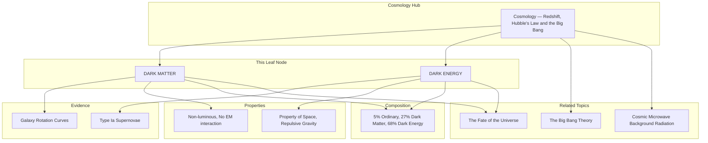

---
# Dark Matter and Dark Energy (Brief Overview) / 暗物质与暗能量（简要概述）

---

# 1. Overview / 概述

**English:**
This sub-topic provides a brief overview of two of the most profound mysteries in modern cosmology: **Dark Matter** and **Dark Energy**. While [[Cosmology — Redshift, Hubble's Law and the Big Bang]] explains the expansion of the universe, it does not account for the total mass or the accelerating nature of that expansion. Dark Matter is a hypothetical form of matter that does not emit, absorb, or reflect light, yet its gravitational effects are essential to explain the rotation speeds of galaxies and the formation of large-scale structures. Dark Energy is an even more mysterious form of energy that is thought to permeate all of space, acting as a repulsive force that is causing the expansion of the universe to accelerate. This leaf node introduces the observational evidence for both, their estimated abundances, and their crucial roles in the [[The Fate of the Universe]].

**中文:**
本子知识点简要介绍现代宇宙学中两个最深刻的谜团：**暗物质** 和 **暗能量**。虽然 [[Cosmology — Redshift, Hubble's Law and the Big Bang]] 解释了宇宙的膨胀，但它并未解释总质量或这种膨胀的加速性质。暗物质是一种假设的物质形式，不发射、吸收或反射光，但其引力效应对于解释星系的旋转速度和大型结构的形成至关重要。暗能量则是一种更神秘的能量形式，被认为充满整个空间，作为一种斥力导致宇宙膨胀加速。本叶节点介绍两者的观测证据、估计丰度，以及它们在 [[The Fate of the Universe]] 中的关键作用。

---

# 2. Syllabus Learning Objectives / 考纲学习目标

| CAIE 9702 | Edexcel IAL |
|-----------|-------------|
| 25.5(a): Understand that the Universe contains a large amount of matter that cannot be observed directly, known as dark matter. | 10.26: Understand that the observed rotation curves of galaxies provide evidence for the existence of dark matter. |
| 25.5(b): Understand that the expansion of the Universe is accelerating, and that this is attributed to dark energy. | 10.27: Understand that the accelerating expansion of the Universe provides evidence for the existence of dark energy. |
| 25.5(c): Understand that the Universe is composed of approximately 5% ordinary matter, 27% dark matter, and 68% dark energy. | 10.28: Know that the composition of the Universe is approximately 5% ordinary matter, 27% dark matter, and 68% dark energy. |
| 25.5(d): Understand that the evidence for dark matter comes from the rotation curves of galaxies. | 10.29: Understand that the evidence for dark energy comes from observations of Type Ia supernovae. |
| 25.5(e): Understand that the evidence for dark energy comes from observations of distant Type Ia supernovae. | 10.30: Understand that dark matter is non-luminous and does not interact with electromagnetic radiation. |
| 25.5(f): Understand that dark matter is non-luminous and does not interact with electromagnetic radiation. | 10.31: Understand that dark energy is a property of space itself and has a repulsive gravitational effect. |
| 25.5(g): Understand that dark energy is a property of space itself and has a repulsive gravitational effect. | 10.32: Understand that the ultimate fate of the Universe depends on the density of matter and the nature of dark energy. |

**Examiner Expectations / 考官期望:**
- **CAIE:** Focus on the observational evidence (galaxy rotation curves for dark matter, Type Ia supernovae for dark energy) and the composition percentages. You are not expected to perform calculations involving dark matter or dark energy.
- **Edexcel:** Similar to CAIE, with a strong emphasis on understanding the *nature* of dark matter (non-luminous, no EM interaction) and dark energy (property of space, repulsive gravity). Be able to link dark energy to the [[The Fate of the Universe]].

---

# 3. Core Definitions / 核心定义

| Term (EN/CN) | Definition (EN) | Definition (CN) | Common Mistakes / 常见错误 |
|--------------|-----------------|-----------------|---------------------------|
| **Dark Matter** / 暗物质 | A hypothetical form of matter that does not emit, absorb, or reflect electromagnetic radiation, and is detectable only through its gravitational effects. | 一种假设的物质形式，不发射、吸收或反射电磁辐射，只能通过其引力效应被探测到。 | Thinking dark matter is "dark" because it absorbs light (it doesn't interact with light at all). |
| **Dark Energy** / 暗能量 | A hypothetical form of energy that permeates all of space, exerting a negative pressure that causes the expansion of the universe to accelerate. | 一种假设的能量形式，充满整个空间，施加负压导致宇宙膨胀加速。 | Confusing dark energy with the repulsive force of antigravity; it is a property of space itself. |
| **Galaxy Rotation Curve** / 星系旋转曲线 | A plot of the orbital speeds of visible stars or gas in a galaxy versus their distance from the galactic center. | 星系中可见恒星或气体的轨道速度与其到星系中心距离的关系图。 | Assuming the curve should follow Kepler's laws (it doesn't, which is the evidence for dark matter). |
| **Type Ia Supernova** / Ia型超新星 | A type of supernova that occurs in a binary system when a white dwarf accretes matter from a companion star, reaching a critical mass and exploding. They have a consistent peak luminosity, making them "standard candles" for measuring cosmic distances. | 一种发生在双星系统中的超新星，当白矮星从伴星吸积物质达到临界质量并爆炸时产生。它们具有一致的峰值光度，是测量宇宙距离的“标准烛光”。 | Forgetting that their consistent brightness is what makes them useful for measuring distances to faraway galaxies. |
| **Cosmic Composition** / 宇宙组成 | The relative proportions of ordinary (baryonic) matter, dark matter, and dark energy in the universe. | 宇宙中普通（重子）物质、暗物质和暗能量的相对比例。 | Getting the percentages wrong (5%, 27%, 68%). |

---

# 4. Key Concepts Explained / 关键概念详解

## 4.1 Evidence for Dark Matter: Galaxy Rotation Curves / 暗物质的证据：星系旋转曲线

### Explanation / 解释
**English:**
In a spiral galaxy like the Milky Way, most of the visible mass (stars, gas, dust) is concentrated in the central bulge. According to Newtonian gravity and Kepler's laws, we would expect the orbital speed of stars and gas clouds to decrease with distance from the galactic center, following a Keplerian curve (like planets in the Solar System). However, when astronomers measured the rotation curves of galaxies, they found that the orbital speeds remained roughly constant (flat) far beyond the visible edge of the galaxy. This implies that there is a large amount of unseen mass in a "halo" surrounding the galaxy, providing the extra gravitational pull needed to keep the outer stars moving at such high speeds. This unseen mass is called **Dark Matter**.

**中文:**
在像银河系这样的旋涡星系中，大部分可见质量（恒星、气体、尘埃）集中在中央核球。根据牛顿引力和开普勒定律，我们预计恒星和气体云的轨道速度会随着到星系中心距离的增加而减小，遵循开普勒曲线（类似于太阳系中的行星）。然而，当天文学家测量星系的旋转曲线时，他们发现轨道速度在远远超出星系可见边缘的地方大致保持恒定（平坦）。这意味着在星系周围存在一个巨大的“晕”，其中含有大量不可见的质量，提供了额外的引力，使外围恒星以如此高的速度运动。这种不可见的质量被称为**暗物质**。

### Physical Meaning / 物理意义
**English:**
The flat rotation curve is direct evidence that the mass of a galaxy is not concentrated where the light is. The total mass of a galaxy is much larger than the mass of its visible components. Dark matter provides the "gravitational glue" that holds galaxies and galaxy clusters together.

**中文:**
平坦的旋转曲线直接证明星系的质量并不集中在发光的地方。星系的总质量远大于其可见部分的质量。暗物质提供了将星系和星系团结合在一起的“引力胶水”。

### Common Misconceptions / 常见误区
- **Dark matter is not "dark" like a black hole.** It does not absorb light; it simply does not interact with light at all (electromagnetically).
- **Dark matter is not antimatter.** Antimatter annihilates with matter, producing gamma rays. Dark matter does not do this.
- **Dark matter is not just "normal matter we can't see"** (like rogue planets or black holes). These are called MACHOs (Massive Compact Halo Objects), and there aren't enough of them to explain the rotation curves.

### Exam Tips / 考试提示
- **CAIE/Edexcel:** Be able to describe the expected Keplerian curve vs. the observed flat curve. State that the discrepancy is evidence for dark matter.
- **Edexcel:** Be specific: "The observed rotation curves of galaxies provide evidence for the existence of dark matter."

> 📷 **IMAGE PROMPT — DM-01: Galaxy Rotation Curve Comparison**
> A clear, labeled graph comparing the expected Keplerian rotation curve (dashed line, decreasing) with the observed flat rotation curve (solid line, constant) for a spiral galaxy. The x-axis is labeled "Distance from Galactic Center" and the y-axis is "Orbital Speed". A diagram of a spiral galaxy with a visible disk and a large, diffuse dark matter halo should be shown alongside the graph.

## 4.2 Evidence for Dark Energy: Type Ia Supernovae / 暗能量的证据：Ia型超新星

### Explanation / 解释
**English:**
In the late 1990s, two independent teams of astronomers were studying distant Type Ia supernovae to measure the deceleration of the universe's expansion. They expected to find that the expansion was slowing down due to gravity. To their surprise, they found that the supernovae were *fainter* than expected, meaning they were *farther away* than predicted by a decelerating model. The only explanation was that the expansion of the universe is not slowing down, but *accelerating*. This acceleration is attributed to a mysterious repulsive force called **Dark Energy**.

**中文:**
在20世纪90年代末，两个独立的天文学家团队正在研究遥远的Ia型超新星，以测量宇宙膨胀的减速。他们预计会发现膨胀因引力而减慢。令他们惊讶的是，他们发现这些超新星比预期的*更暗*，这意味着它们比减速模型预测的*更远*。唯一的解释是宇宙的膨胀并没有减慢，而是在*加速*。这种加速归因于一种神秘的斥力，称为**暗能量**。

### Physical Meaning / 物理意义
**English:**
Dark energy is not a force in the traditional sense. It is best thought of as a property of space itself. As the universe expands, more space is created, and with it, more dark energy. This leads to a runaway process where the expansion accelerates. It acts as a "negative pressure" or "repulsive gravity."

**中文:**
暗能量不是传统意义上的力。最好将其视为空间本身的一种属性。随着宇宙膨胀，更多的空间被创造出来，随之而来的是更多的暗能量。这导致了一个失控的过程，膨胀加速。它起到“负压”或“斥力引力”的作用。

### Common Misconceptions / 常见误区
- **Dark energy is not the same as dark matter.** They are completely different phenomena. Dark matter attracts; dark energy repels.
- **Dark energy is not a force that pushes things apart locally.** Its effects are only noticeable on the largest cosmic scales (between galaxy clusters). It does not cause the Earth to move away from the Sun.
- **Dark energy is not the "antigravity" from science fiction.** It is a uniform property of space, not a localized field.

### Exam Tips / 考试提示
- **CAIE/Edexcel:** Be able to explain the logic: Type Ia supernovae are standard candles → their apparent brightness tells us their distance → they are fainter than expected → they are farther away → the expansion must have accelerated.
- **Edexcel:** Be specific: "Observations of distant Type Ia supernovae provide evidence for the existence of dark energy."

> 📷 **IMAGE PROMPT — DE-01: Type Ia Supernova Distance Measurement**
> A diagram showing two light curves from Type Ia supernovae. One is labeled "Nearby Supernova (z=0.1)" and is bright. The other is labeled "Distant Supernova (z=1.0)" and is fainter than expected. A small graph inset shows the Hubble diagram (distance vs. redshift) with data points for Type Ia supernovae deviating from a straight line, indicating acceleration.

---

# 5. Essential Equations / 核心公式

There are **no specific equations** for dark matter or dark energy at the A-Level. The key is understanding the *concepts* and *evidence*.

However, the concept of **density** is important for understanding the composition of the universe.

$$ \rho = \frac{m}{V} $$

| Symbol (符号) | Meaning (EN) | Meaning (CN) | Unit (单位) |
|--------------|-------------|-------------|------------|
| $\rho$ | Density | 密度 | kg m⁻³ |
| $m$ | Mass | 质量 | kg |
| $V$ | Volume | 体积 | m³ |

**Derivation / 推导:** N/A
**Conditions / 适用条件:** N/A
**Limitations / 局限性:** N/A

> 📋 **Edexcel Only:** You may be asked to recall the approximate percentages of the universe's composition: 5% ordinary matter, 27% dark matter, 68% dark energy.

---

# 6. Graphs and Relationships / 图表与关系

## 6.1 Galaxy Rotation Curve / 星系旋转曲线

### Axes / 坐标轴
- **X-axis:** Distance from Galactic Center / 到星系中心的距离
- **Y-axis:** Orbital Speed of Stars/Gas / 恒星/气体的轨道速度

### Shape / 形状
- **Expected (Keplerian):** A curve that rises sharply near the center and then falls off as $1/\sqrt{r}$.
- **Observed:** A curve that rises sharply near the center and then becomes flat (constant speed) far from the center.

### Gradient Meaning / 斜率含义
- The gradient of the curve is not directly examined. The key feature is the *shape* of the curve.

### Area Meaning / 面积含义
- The area under the curve is not directly examined.

### Exam Interpretation / 考试解读
- The **discrepancy** between the expected and observed curves is the evidence for dark matter. The flat curve shows that there is significant mass far from the galactic center, which cannot be seen.

> 📷 **IMAGE PROMPT — GRAPH-01: Galaxy Rotation Curve**
> A clear, labeled graph with two lines. A dashed line labeled "Expected (Keplerian)" that drops off. A solid line labeled "Observed" that stays flat. The x-axis is "Distance from Galactic Center", the y-axis is "Orbital Speed". A shaded region between the two lines could be labeled "Mass discrepancy due to dark matter".

---

# 7. Required Diagrams / 必备图表

## 7.1 Composition of the Universe / 宇宙组成

### Description / 描述
**English:** A pie chart showing the approximate composition of the universe: 5% ordinary matter (atoms), 27% dark matter, and 68% dark energy.
**中文:** 一个饼图，显示宇宙的大致组成：5% 普通物质（原子），27% 暗物质，68% 暗能量。

### Image Prompt / 图片生成提示
> 📷 **IMAGE PROMPT — DIAG-01: Composition of the Universe Pie Chart**
> A colorful pie chart showing the composition of the universe. The largest slice (68%) is labeled "Dark Energy" in purple. The second largest slice (27%) is labeled "Dark Matter" in dark blue. The smallest slice (5%) is labeled "Ordinary Matter" in green. The chart should be clean, professional, and suitable for an A-Level physics textbook.

### Labels Required / 需要标注
- **Dark Energy / 暗能量 (68%)**
- **Dark Matter / 暗物质 (27%)**
- **Ordinary Matter / 普通物质 (5%)**

### Exam Importance / 考试重要性
- **High.** Both CAIE and Edexcel expect you to know these approximate percentages. This is a common multiple-choice or short-answer question.

## 7.2 Dark Matter Halo Around a Spiral Galaxy / 旋涡星系周围的暗物质晕

### Description / 描述
**English:** A diagram of a spiral galaxy (like the Milky Way) with a visible disk and a large, spherical, diffuse "halo" of dark matter surrounding it. The halo should be represented by a faint, semi-transparent sphere.
**中文:** 一个旋涡星系（如银河系）的示意图，具有可见的盘状结构和周围一个巨大的、球形的、弥散的暗物质“晕”。该晕应表示为微弱的、半透明的球体。

### Image Prompt / 图片生成提示
> 📷 **IMAGE PROMPT — DIAG-02: Dark Matter Halo**
> A 3D artistic rendering of a spiral galaxy. The bright, blue-white spiral disk is clearly visible in the center. Surrounding the disk is a large, faint, spherical, semi-transparent purple/blue cloud, labeled "Dark Matter Halo". The halo extends far beyond the visible edge of the galaxy. The background is black with a few distant stars.

### Labels Required / 需要标注
- **Visible Galactic Disk / 可见星系盘**
- **Dark Matter Halo / 暗物质晕**

### Exam Importance / 考试重要性
- **Medium.** Helps visualize where the dark matter is located. Useful for explaining why the rotation curve is flat.

---

# 8. Worked Examples / 典型例题

## Example 1: Explaining the Evidence for Dark Matter / 解释暗物质的证据

### Question / 题目
**English:**
Describe the evidence from galaxy rotation curves that led astronomers to propose the existence of dark matter. In your answer, you should compare the expected and observed rotation curves.

**中文:**
描述来自星系旋转曲线的证据，这些证据导致天文学家提出暗物质的存在。在你的回答中，你应该比较预期的和观测到的旋转曲线。

### Solution / 解答
**Step 1: State the expected behavior.**
According to Newtonian gravity and Kepler's laws, the orbital speed of stars in a galaxy should decrease with increasing distance from the galactic center. This is because most of the visible mass is concentrated in the center. This gives a Keplerian rotation curve.

**Step 2: State the observed behavior.**
When astronomers measured the rotation curves of spiral galaxies, they found that the orbital speed of stars and gas remains roughly constant (flat) far beyond the visible edge of the galaxy.

**Step 3: Explain the discrepancy.**
The flat rotation curve implies that there is a large amount of unseen mass in a "halo" surrounding the galaxy. This unseen mass provides the extra gravitational pull needed to keep the outer stars moving at high speeds. This unseen mass is called dark matter.

**中文:**
**步骤1：说明预期行为。**
根据牛顿引力和开普勒定律，星系中恒星的轨道速度应随着到星系中心距离的增加而减小。这是因为大部分可见质量集中在中心。这给出了开普勒旋转曲线。

**步骤2：说明观测到的行为。**
当天文学家测量旋涡星系的旋转曲线时，他们发现恒星和气体的轨道速度在远远超出星系可见边缘的地方大致保持恒定（平坦）。

**步骤3：解释差异。**
平坦的旋转曲线意味着在星系周围存在一个巨大的“晕”，其中含有大量不可见的质量。这种不可见的质量提供了额外的引力，使外围恒星以高速运动。这种不可见的质量被称为暗物质。

### Final Answer / 最终答案
**Answer:** The observed flat rotation curve of galaxies, compared to the expected decreasing Keplerian curve, provides evidence for a large amount of unseen mass (dark matter) in a galactic halo. | **答案：** 观测到的星系平坦旋转曲线，与预期的递减开普勒曲线相比，为星系晕中存在大量不可见质量（暗物质）提供了证据。

### Quick Tip / 提示
**English:** Always mention the *shape* of the curves (Keplerian vs. flat). This is the key to the argument.
**中文:** 始终提及曲线的*形状*（开普勒曲线 vs. 平坦曲线）。这是论证的关键。

## Example 2: Explaining the Evidence for Dark Energy / 解释暗能量的证据

### Question / 题目
**English:**
Explain how observations of Type Ia supernovae led to the discovery of dark energy.

**中文:**
解释对Ia型超新星的观测如何导致了暗能量的发现。

### Solution / 解答
**Step 1: State the property of Type Ia supernovae.**
Type Ia supernovae are "standard candles" because they all have a similar peak luminosity. This means their apparent brightness can be used to determine their distance from Earth.

**Step 2: State the expectation.**
Astronomers expected that the expansion of the universe was slowing down due to gravity. Therefore, they expected distant supernovae to be at a certain distance based on a decelerating model.

**Step 3: State the observation.**
The distant Type Ia supernovae were observed to be fainter than expected.

**Step 4: Explain the conclusion.**
A fainter supernova means it is farther away than predicted. This implies that the expansion of the universe has been accelerating, not decelerating. The cause of this acceleration is attributed to a mysterious repulsive force called dark energy.

**中文:**
**步骤1：说明Ia型超新星的性质。**
Ia型超新星是“标准烛光”，因为它们都具有相似的峰值光度。这意味着它们的视亮度可用于确定它们到地球的距离。

**步骤2：说明预期。**
天文学家预计宇宙的膨胀会因引力而减慢。因此，他们预计遥远的超新星会处于基于减速模型的某个距离上。

**步骤3：说明观测结果。**
观测到遥远的Ia型超新星比预期的更暗。

**步骤4：解释结论。**
更暗的超新星意味着它比预测的更远。这表明宇宙的膨胀一直在加速，而不是减速。这种加速的原因归因于一种称为暗能量的神秘斥力。

### Final Answer / 最终答案
**Answer:** Distant Type Ia supernovae were fainter than expected, indicating they are farther away than predicted by a decelerating model. This shows the universe's expansion is accelerating, driven by dark energy. | **答案：** 遥远的Ia型超新星比预期的更暗，表明它们比减速模型预测的更远。这表明宇宙的膨胀正在加速，由暗能量驱动。

### Quick Tip / 提示
**English:** The logic is: Standard Candle → Distance → Fainter = Farther → Acceleration.
**中文:** 逻辑是：标准烛光 → 距离 → 更暗 = 更远 → 加速。

---

# 9. Past Paper Question Types / 历年真题题型

| Question Type / 题型 | Frequency / 频率 | Difficulty / 难度 | Past Paper References / 真题索引 |
|----------------------|------------------|------------------|-------------------------------|
| Multiple choice on composition percentages | High | Easy | 📝 *待填入* |
| Short answer: Describe evidence for dark matter | High | Medium | 📝 *待填入* |
| Short answer: Describe evidence for dark energy | High | Medium | 📝 *待填入* |
| Short answer: Explain the nature of dark matter/energy | Medium | Medium | 📝 *待填入* |
| Essay: Link dark energy to the fate of the universe | Low | Hard | 📝 *待填入* |

**Common Command Words / 常见指令词:**
- **Describe / 描述:** Give a detailed account of the evidence (e.g., "Describe the evidence for dark matter from galaxy rotation curves.").
- **Explain / 解释:** Give reasons for the evidence (e.g., "Explain how Type Ia supernovae provide evidence for dark energy.").
- **State / 陈述:** Give a brief fact (e.g., "State the approximate percentage of the universe that is dark matter.").
- **Compare / 比较:** Describe similarities and differences (e.g., "Compare the properties of dark matter and dark energy.").

---

# 10. Practical Skills Connections / 实验技能链接

**English:**
This sub-topic is primarily theoretical and based on observational astronomy. There are no direct practical experiments for A-Level students. However, the concepts connect to practical skills in the following ways:
- **Data Analysis:** The discovery of dark energy relied on analyzing the light curves of Type Ia supernovae and plotting a Hubble diagram (distance vs. redshift). This involves graph plotting, error bars, and interpreting deviations from a straight line.
- **Uncertainties:** The distance measurements to supernovae have large uncertainties. Understanding that the "fainter than expected" result was statistically significant is a key part of the scientific process.
- **Modeling:** The rotation curves of galaxies are a form of data that can be modeled. The discrepancy between the Newtonian model and the data is a classic example of how new physics (dark matter) is proposed to explain observations.

**中文:**
本子知识点主要是理论性的，基于观测天文学。对于A-Level学生来说，没有直接的实验。然而，这些概念通过以下方式与实验技能相关联：
- **数据分析：** 暗能量的发现依赖于分析Ia型超新星的光变曲线并绘制哈勃图（距离 vs. 红移）。这涉及图表绘制、误差棒以及解释与直线的偏差。
- **不确定性：** 对超新星的距离测量具有很大的不确定性。理解“比预期更暗”的结果在统计上是显著的，是科学过程的关键部分。
- **建模：** 星系的旋转曲线是一种可以建模的数据形式。牛顿模型与数据之间的差异是一个经典例子，说明如何提出新物理学（暗物质）来解释观测结果。

---

# 11. Concept Map / 概念图谱

---

# 12. Quick Revision Sheet / 速查表

| Category / 类别 | Key Points / 要点 |
|----------------|------------------|
| **Definition / 定义** | **Dark Matter:** Non-luminous matter detected only by gravity. **Dark Energy:** Repulsive property of space causing accelerated expansion. |
| **Key Evidence / 核心证据** | **Dark Matter:** Flat galaxy rotation curves. **Dark Energy:** Distant Type Ia supernovae are fainter than expected. |
| **Key Composition / 核心组成** | **Universe:** 5% Ordinary Matter, 27% Dark Matter, 68% Dark Energy. |
| **Nature / 性质** | **Dark Matter:** Does not interact with EM radiation. **Dark Energy:** A property of space itself. |
| **Exam Tip / 考试提示** | Always compare the *expected* (Keplerian) vs. *observed* (flat) rotation curves for dark matter. Always state the "standard candle" property of Type Ia supernovae for dark energy. |