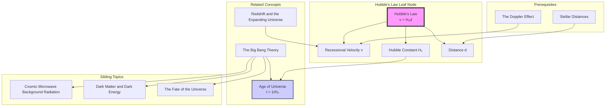

---
# 1. Overview / 概述

**English:**
Hubble's Law is a cornerstone of modern cosmology, providing the first direct evidence that the universe is expanding. This sub-topic focuses on the linear relationship between the recessional velocity ($v$) of a distant galaxy and its distance ($d$) from Earth, expressed as $v = H_0 d$, where $H_0$ is the Hubble constant. We will explore the physical meaning of this law, how it is derived from observational data (redshift and distance measurements), and its profound implications for the age and origin of the universe. This law is the key link between [[Redshift and the Expanding Universe]] and the [[The Big Bang Theory]].

**中文:**
哈勃定律是现代宇宙学的基石，它首次直接证明了宇宙正在膨胀。本子知识点聚焦于遥远星系的退行速度 ($v$) 与其到地球的距离 ($d$) 之间的线性关系，表示为 $v = H_0 d$，其中 $H_0$ 是哈勃常数。我们将探讨这一定律的物理意义、如何从观测数据（红移和距离测量）推导出来，以及它对宇宙年龄和起源的深远影响。这一定律是连接[[红移与膨胀宇宙]]和[[大爆炸理论]]的关键纽带。

---

# 2. Syllabus Learning Objectives / 考纲学习目标

| CAIE 9702 (25.5 a-g) | Edexcel IAL (WPH14 U4: 10.26-10.32) |
|-----------|-------------|
| Understand that the observed redshift of distant galaxies provides evidence for an expanding universe. | Understand the concept of Hubble's law and its significance in supporting the Big Bang theory. |
| Recall and use Hubble's law: $v \approx H_0 d$. | Use the equation $v = H_0 d$ to determine the recessional velocity or distance of a galaxy. |
| Use the Hubble constant to estimate the age of the universe: $t \approx 1/H_0$. | Estimate the age of the universe from the Hubble constant, using $t \approx 1/H_0$. |
| Understand that the value of the Hubble constant is uncertain. | Understand that the value of $H_0$ is subject to uncertainty and has been refined over time. |
| Describe the Big Bang theory and the evidence supporting it. | Describe the evidence for the Big Bang theory, including Hubble's law and the cosmic microwave background (CMB). |

**Examiner Expectations / 考官期望:**
- **EN:** You must be able to recall and apply the formula $v = H_0 d$ in calculations. You should understand that $H_0$ has units of $\text{km s}^{-1} \text{Mpc}^{-1}$ or $\text{s}^{-1}$. You must be able to estimate the age of the universe using $t \approx 1/H_0$, and explain the assumptions behind this estimate (e.g., constant expansion rate). You should also be able to discuss the uncertainty in the value of $H_0$.
- **CN:** 你必须能够回忆并应用公式 $v = H_0 d$ 进行计算。你应该理解 $H_0$ 的单位是 $\text{km s}^{-1} \text{Mpc}^{-1}$ 或 $\text{s}^{-1}$。你必须能够使用 $t \approx 1/H_0$ 估算宇宙的年龄，并解释此估算背后的假设（例如，恒定的膨胀速率）。你还应该能够讨论 $H_0$ 值的不确定性。

---

# 3. Core Definitions / 核心定义

| Term (EN/CN) | Definition (EN) | Definition (CN) | Common Mistakes / 常见错误 |
|--------------|-----------------|-----------------|---------------------------|
| **Hubble's Law** / 哈勃定律 | The observational law stating that the recessional velocity ($v$) of a galaxy is directly proportional to its distance ($d$) from the observer. | 观测定律，指出星系的退行速度 ($v$) 与其到观测者的距离 ($d$) 成正比。 | Confusing recessional velocity with the galaxy's own peculiar motion through space. |
| **Recessional Velocity ($v$)** / 退行速度 | The speed at which a distant galaxy is moving away from an observer due to the expansion of the universe. | 遥远星系因宇宙膨胀而远离观测者的速度。 | Thinking the galaxy is moving *through* space; it is the space *between* galaxies that is expanding. |
| **Hubble Constant ($H_0$)** / 哈勃常数 | The constant of proportionality in Hubble's law, representing the current rate of expansion of the universe. Its value is approximately $70 \text{ km s}^{-1} \text{Mpc}^{-1}$. | 哈勃定律中的比例常数，代表宇宙当前的膨胀速率。其值约为 $70 \text{ km s}^{-1} \text{Mpc}^{-1}$。 | Forgetting to convert units (e.g., Mpc to km) before using it in the age calculation $t \approx 1/H_0$. |
| **Megaparsec (Mpc)** / 百万秒差距 | A unit of distance used in astronomy, equal to $3.26 \times 10^6$ light-years or $3.09 \times 10^{22}$ m. | 天文学中使用的距离单位，等于 $3.26 \times 10^6$ 光年或 $3.09 \times 10^{22}$ 米。 | Not knowing the conversion factor between Mpc and km. |
| **Hubble Time ($t_H$)** / 哈勃时间 | An estimate of the age of the universe, calculated as the reciprocal of the Hubble constant ($t_H = 1/H_0$), assuming a constant expansion rate. | 对宇宙年龄的估算，计算为哈勃常数的倒数 ($t_H = 1/H_0$)，假设膨胀速率恒定。 | Forgetting that this is an *estimate* and the actual age is slightly less due to gravitational deceleration. |

---

# 4. Key Concepts Explained / 关键概念详解

## 4.1 The Meaning of Hubble's Law / 哈勃定律的含义

### Explanation / 解释
**English:** Hubble's Law, $v = H_0 d$, is not a force law but an *observational relationship*. It describes the pattern of galaxy motions we see from Earth. The law implies that galaxies that are farther away from us are moving away faster. This is exactly what you would expect from a uniform expansion of space itself, not from an explosion that flung galaxies outwards from a central point. Imagine dots on a balloon; as you inflate it, every dot sees all other dots moving away, with more distant dots moving away faster. This is the [[Redshift and the Expanding Universe]] in action.

**中文:** 哈勃定律 $v = H_0 d$ 不是一个力定律，而是一个*观测关系*。它描述了我们从地球上看到的星系运动模式。该定律意味着离我们越远的星系，远离我们的速度越快。这正是空间本身均匀膨胀所预期的结果，而不是从一个中心点向外抛射星系的爆炸。想象气球上的点；当你给气球充气时，每个点都会看到其他所有点都在远离，并且更远的点远离得更快。这就是[[红移与膨胀宇宙]]的实际体现。

### Physical Meaning / 物理意义
**English:** The physical meaning is that the universe is expanding uniformly. The Hubble constant $H_0$ is the current rate of this expansion. It tells us how fast a galaxy at a given distance is receding. For example, if $H_0 = 70 \text{ km s}^{-1} \text{Mpc}^{-1}$, a galaxy 1 Mpc away recedes at $70 \text{ km s}^{-1}$, and a galaxy 2 Mpc away recedes at $140 \text{ km s}^{-1}$.

**中文:** 其物理意义是宇宙在均匀膨胀。哈勃常数 $H_0$ 是当前膨胀的速率。它告诉我们给定距离的星系退行有多快。例如，如果 $H_0 = 70 \text{ km s}^{-1} \text{Mpc}^{-1}$，那么距离 1 Mpc 的星系以 $70 \text{ km s}^{-1}$ 的速度退行，而距离 2 Mpc 的星系则以 $140 \text{ km s}^{-1}$ 的速度退行。

### Common Misconceptions / 常见误区
- **EN:** Thinking that Earth is at the center of the expansion. The law is isotropic; an observer in any other galaxy would see the same pattern.
- **CN:** 认为地球是膨胀的中心。该定律是各向同性的；在任何其他星系中的观测者都会看到相同的模式。
- **EN:** Confusing recessional velocity with the speed of light. While recessional velocities can be a significant fraction of $c$, the galaxies themselves are not moving through space at those speeds; the space between us is stretching.
- **CN:** 将退行速度与光速混淆。虽然退行速度可以达到 $c$ 的很大一部分，但星系本身并非以这些速度在空间中运动；而是我们之间的空间在拉伸。

### Exam Tips / 考试提示
- **EN:** Always state that Hubble's law provides evidence for an expanding universe and supports the Big Bang theory.
- **CN:** 务必说明哈勃定律为膨胀宇宙提供了证据，并支持大爆炸理论。
- **EN:** When calculating the age of the universe, ensure units are consistent (e.g., convert $H_0$ from $\text{km s}^{-1} \text{Mpc}^{-1}$ to $\text{s}^{-1}$).
- **CN:** 在计算宇宙年龄时，确保单位一致（例如，将 $H_0$ 从 $\text{km s}^{-1} \text{Mpc}^{-1}$ 转换为 $\text{s}^{-1}$）。

> 📷 **IMAGE PROMPT — HUBBLE-01: Balloon Analogy for Hubble's Law**
> A simple 2D diagram showing a partially inflated balloon with dots drawn on its surface. Arrows of different lengths should be drawn from one central dot to several other dots, showing that more distant dots have longer arrows (higher recessional velocity). A second, more inflated balloon should be shown to illustrate the expansion of space over time.

---

# 5. Essential Equations / 核心公式

## Equation 1: Hubble's Law / 哈勃定律

$$ v = H_0 d $$

| Symbol (符号) | Meaning (EN) | Meaning (CN) | Unit (单位) |
|--------------|-------------|-------------|------------|
| $v$ | Recessional velocity of a galaxy | 星系的退行速度 | $\text{km s}^{-1}$ |
| $H_0$ | Hubble constant | 哈勃常数 | $\text{km s}^{-1} \text{Mpc}^{-1}$ or $\text{s}^{-1}$ |
| $d$ | Distance to the galaxy | 到星系的距离 | $\text{Mpc}$ |

**Derivation / 推导:** This is an empirical law derived from plotting the recessional velocities (from [[Redshift and the Expanding Universe]]) of many galaxies against their distances (from [[Stellar Distances]] like standard candles). The best-fit line through the data gives the relationship $v = H_0 d$.

**Conditions / 适用条件:**
- **EN:** The law applies to galaxies that are far enough away that their peculiar velocities (random motions within a local group) are negligible compared to their recessional velocity due to the expansion of space.
- **CN:** 该定律适用于距离足够远的星系，其本动速度（在局部群内的随机运动）与因空间膨胀产生的退行速度相比可以忽略不计。

**Limitations / 局限性:**
- **EN:** The value of $H_0$ is not perfectly known and has been a subject of debate. It is also not constant over cosmic time; it changes as the universe's expansion rate changes.
- **CN:** $H_0$ 的值并非完全确定，并且一直是争论的主题。它在宇宙时间内也不是常数；它会随着宇宙膨胀速率的变化而变化。

## Equation 2: Age of the Universe (Hubble Time) / 宇宙年龄（哈勃时间）

$$ t \approx \frac{1}{H_0} $$

| Symbol (符号) | Meaning (EN) | Meaning (CN) | Unit (单位) |
|--------------|-------------|-------------|------------|
| $t$ | Estimated age of the universe (Hubble time) | 宇宙的估算年龄（哈勃时间） | $\text{s}$ (or years) |
| $H_0$ | Hubble constant | 哈勃常数 | $\text{s}^{-1}$ |

**Derivation / 推导:** If we assume the universe has been expanding at a constant rate ($H_0$), then the time it took for a galaxy at distance $d$ to reach its current recessional velocity $v$ is $t = d/v$. Substituting $v = H_0 d$ gives $t = d / (H_0 d) = 1/H_0$.

**Conditions / 适用条件:**
- **EN:** This is a simple estimate. It assumes a constant expansion rate, which is not true. The actual age of the universe is slightly less than $1/H_0$ because gravity has been slowing the expansion.
- **CN:** 这是一个简单的估算。它假设膨胀速率恒定，但这并不正确。由于引力一直在减缓膨胀，宇宙的实际年龄略小于 $1/H_0$。

**Limitations / 局限性:**
- **EN:** The calculation is highly sensitive to the value of $H_0$ used. It does not account for the effects of [[Dark Matter and Dark Energy (Brief Overview)]] on the expansion history.
- **CN:** 该计算对所使用的 $H_0$ 值高度敏感。它没有考虑[[暗物质与暗能量（简要概述）]]对膨胀历史的影响。

> 📋 **Edexcel Only:** You may be asked to calculate the age of the universe in seconds or years, requiring careful unit conversion.

---

# 6. Graphs and Relationships / 图表与关系

## 6.1 Hubble's Law Graph / 哈勃定律图

### Axes / 坐标轴
- **X-axis:** Distance ($d$) to the galaxy / 到星系的距离 ($d$) (in Mpc)
- **Y-axis:** Recessional velocity ($v$) of the galaxy / 星系的退行速度 ($v$) (in km s⁻¹)

### Shape / 形状
A straight line passing through the origin (0,0).

### Gradient Meaning / 斜率含义
The gradient of the line is the **Hubble constant ($H_0$)**. A steeper gradient means a faster expansion rate.

### Area Meaning / 面积含义
The area under the graph has no physical meaning.

### Exam Interpretation / 考试解读
- **EN:** A straight line through the origin confirms Hubble's law. Scatter in the data points is due to uncertainties in distance measurements and the peculiar velocities of nearby galaxies. The best-fit line's gradient gives the value of $H_0$.
- **CN:** 一条通过原点的直线证实了哈勃定律。数据点的分散是由于距离测量的不确定性和邻近星系的本动速度造成的。最佳拟合线的斜率给出了 $H_0$ 的值。

```mermaid
graph LR
    subgraph "Hubble's Law Graph"
        A[0,0] --> B[Distance (Mpc)]
        A --> C[Recessional Velocity (km/s)]
        style A fill:#f9f,stroke:#333,stroke-width:2px
    end
    D[Gradient = H₀] --> A
```

> 📷 **IMAGE PROMPT — HUBBLE-02: Hubble's Law Graph**
> A scatter plot of data points showing a positive linear trend from the origin. The x-axis is labeled "Distance / Mpc" and the y-axis is "Recessional Velocity / km s⁻¹". A best-fit straight line is drawn through the data points. The gradient of the line is labeled as "H₀ = 70 km s⁻¹ Mpc⁻¹". Some scatter around the line should be visible.

---

# 7. Required Diagrams / 必备图表

## 7.1 The Balloon Analogy / 气球类比

### Description / 描述
**English:** A diagram showing two stages of an inflating balloon with dots (representing galaxies) on its surface. This illustrates how the expansion of space causes all galaxies to move away from each other, with more distant galaxies receding faster.

**中文:** 一个显示充气气球两个阶段的图表，气球表面有圆点（代表星系）。这说明了空间的膨胀如何导致所有星系相互远离，并且更远的星系退行更快。

### Image Prompt / 图片生成提示
> 📷 **IMAGE PROMPT — HUBBLE-03: Balloon Analogy Diagram**
> A two-panel diagram. Panel 1: A small, partially inflated balloon with 5 labeled dots (A, B, C, D, E). Panel 2: The same balloon, now larger and more inflated. The dots are now farther apart. Arrows from dot A to dots B, C, D, and E show that the arrow to E is the longest, illustrating that the most distant dot recedes fastest. A caption reads: "As the universe expands, more distant galaxies recede faster."

### Labels Required / 需要标注
- **EN:** "Galaxies" (dots), "Expanding Space" (balloon surface), "Observer" (one dot), "Recessional Velocity" (arrows).
- **CN:** "星系"（圆点）、"膨胀的空间"（气球表面）、"观测者"（一个圆点）、"退行速度"（箭头）。

### Exam Importance / 考试重要性
- **EN:** High. This is a classic analogy used to explain the concept of an expanding universe without a center. You may be asked to describe it.
- **CN:** 高。这是一个经典的类比，用于解释没有中心的膨胀宇宙的概念。你可能会被要求描述它。

---

# 8. Worked Examples / 典型例题

## Example 1: Applying Hubble's Law / 应用哈勃定律

### Question / 题目
**English:** A distant galaxy is observed to have a recessional velocity of $1.4 \times 10^4 \text{ km s}^{-1}$. Given that the Hubble constant $H_0 = 70 \text{ km s}^{-1} \text{Mpc}^{-1}$, calculate the distance to the galaxy in Mpc.

**中文:** 观测到一个遥远星系的退行速度为 $1.4 \times 10^4 \text{ km s}^{-1}$。已知哈勃常数 $H_0 = 70 \text{ km s}^{-1} \text{Mpc}^{-1}$，计算该星系的距离（以 Mpc 为单位）。

### Solution / 解答
1.  **Identify knowns / 确定已知量:**
    $v = 1.4 \times 10^4 \text{ km s}^{-1}$
    $H_0 = 70 \text{ km s}^{-1} \text{Mpc}^{-1}$

2.  **Choose the correct equation / 选择正确的公式:**
    $v = H_0 d$

3.  **Rearrange for the unknown / 解出未知量:**
    $d = \frac{v}{H_0}$

4.  **Substitute and calculate / 代入并计算:**
    $d = \frac{1.4 \times 10^4 \text{ km s}^{-1}}{70 \text{ km s}^{-1} \text{Mpc}^{-1}}$
    $d = 200 \text{ Mpc}$

### Final Answer / 最终答案
**Answer:** 200 Mpc | **答案：** 200 Mpc

### Quick Tip / 提示
- **EN:** Ensure the units of $v$ and $H_0$ are compatible (both in km s⁻¹). The distance will be in Mpc.
- **CN:** 确保 $v$ 和 $H_0$ 的单位兼容（都是 km s⁻¹）。距离的单位将是 Mpc。

## Example 2: Estimating the Age of the Universe / 估算宇宙年龄

### Question / 题目
**English:** The Hubble constant is measured to be $H_0 = 68 \text{ km s}^{-1} \text{Mpc}^{-1}$. Estimate the age of the universe in seconds. (1 Mpc = $3.09 \times 10^{19}$ km)

**中文:** 测得哈勃常数为 $H_0 = 68 \text{ km s}^{-1} \text{Mpc}^{-1}$。估算宇宙的年龄（以秒为单位）。（1 Mpc = $3.09 \times 10^{19}$ km）

### Solution / 解答
1.  **Convert $H_0$ to units of $\text{s}^{-1}$ / 将 $H_0$ 转换为 $\text{s}^{-1}$ 的单位:**
    $H_0 = 68 \text{ km s}^{-1} \text{Mpc}^{-1} = \frac{68 \text{ km s}^{-1}}{1 \text{ Mpc}}$
    $H_0 = \frac{68 \text{ km s}^{-1}}{3.09 \times 10^{19} \text{ km}}$
    $H_0 = 2.20 \times 10^{-18} \text{ s}^{-1}$

2.  **Use the Hubble time formula / 使用哈勃时间公式:**
    $t \approx \frac{1}{H_0}$

3.  **Substitute and calculate / 代入并计算:**
    $t \approx \frac{1}{2.20 \times 10^{-18} \text{ s}^{-1}}$
    $t \approx 4.55 \times 10^{17} \text{ s}$

### Final Answer / 最终答案
**Answer:** $4.55 \times 10^{17}$ s | **答案：** $4.55 \times 10^{17}$ 秒

### Quick Tip / 提示
- **EN:** Always convert $H_0$ to $\text{s}^{-1}$ before using $t = 1/H_0$. Remember to convert Mpc to km first.
- **CN:** 在使用 $t = 1/H_0$ 之前，务必将 $H_0$ 转换为 $\text{s}^{-1}$。记得先将 Mpc 转换为 km。

---

# 9. Past Paper Question Types / 历年真题题型

| Question Type / 题型 | Frequency / 频率 | Difficulty / 难度 | Past Paper References / 真题索引 |
|----------------------|------------------|------------------|-------------------------------|
| **Calculation of distance or recessional velocity** using $v = H_0 d$ | High | Easy | 📝 *待填入* |
| **Estimation of the age of the universe** using $t \approx 1/H_0$ | High | Medium | 📝 *待填入* |
| **Explanation of the significance** of Hubble's law for the Big Bang theory | Medium | Medium | 📝 *待填入* |
| **Discussion of uncertainties** in the value of $H_0$ | Low | Hard | 📝 *待填入* |
| **Graphical analysis** of Hubble's law data | Medium | Medium | 📝 *待填入* |

**Common Command Words / 常见指令词:**
- **EN:** Calculate, Estimate, State, Explain, Describe, Discuss, Determine.
- **CN:** 计算、估算、陈述、解释、描述、讨论、确定。

---

# 10. Practical Skills Connections / 实验技能链接

**English:**
While you won't directly measure Hubble's Law in a school lab, the underlying skills are crucial:
- **Data Analysis & Graph Plotting:** The discovery of Hubble's Law relied on plotting recessional velocity against distance. You must be able to plot data, draw a best-fit line, and calculate its gradient (which gives $H_0$).
- **Uncertainties:** The value of $H_0$ is highly uncertain due to difficulties in measuring cosmic distances. You should be able to discuss sources of error (e.g., uncertainty in [[Stellar Distances]] using standard candles) and how they affect the reliability of the calculated age of the universe.
- **Estimation:** The $t \approx 1/H_0$ calculation is a classic example of an order-of-magnitude estimate in physics.

**中文:**
虽然你不会在学校实验室直接测量哈勃定律，但相关的技能至关重要：
- **数据分析与图表绘制：** 哈勃定律的发现依赖于绘制退行速度与距离的关系图。你必须能够绘制数据、画出最佳拟合线并计算其斜率（得出 $H_0$）。
- **不确定性：** 由于测量宇宙距离的困难，$H_0$ 的值具有高度不确定性。你应该能够讨论误差来源（例如，使用标准烛光测量[[恒星距离]]的不确定性）以及它们如何影响计算出的宇宙年龄的可靠性。
- **估算：** $t \approx 1/H_0$ 的计算是物理学中数量级估算的经典例子。

---

# 11. Concept Map / 概念图谱



---

# 12. Quick Revision Sheet / 速查表

| Category / 类别 | Key Points / 要点 |
|----------------|------------------|
| **Definition / 定义** | The recessional velocity of a galaxy is directly proportional to its distance. / 星系的退行速度与其距离成正比。 |
| **Key Formula / 核心公式** | $v = H_0 d$; $t \approx 1/H_0$ |
| **Key Graph / 核心图表** | $v$ vs $d$: Straight line through origin. Gradient = $H_0$. / $v$ 对 $d$ 图：通过原点的直线。斜率 = $H_0$。 |
| **Key Unit / 核心单位** | $H_0$: $\text{km s}^{-1} \text{Mpc}^{-1}$ or $\text{s}^{-1}$ (after conversion). / $H_0$: $\text{km s}^{-1} \text{Mpc}^{-1}$ 或 $\text{s}^{-1}$（转换后）。 |
| **Key Assumption / 核心假设** | For $t \approx 1/H_0$: Constant expansion rate. / 对于 $t \approx 1/H_0$：恒定的膨胀速率。 |
| **Exam Tip / 考试提示** | Always convert $H_0$ to $\text{s}^{-1}$ for age calculation. / 计算宇宙年龄时，务必将 $H_0$ 转换为 $\text{s}^{-1}$。 |
| **Common Error / 常见错误** | Thinking Earth is at the center of the expansion. / 认为地球是膨胀的中心。 |