# 1. Overview / 概述

**English:**
This sub-topic explores how the observation of **redshift** in the light from distant galaxies provides the primary evidence for an **expanding universe**. You will learn to distinguish between the classical [[Doppler Effect]] and **cosmological redshift**, understand how redshift is quantified using the $z$ parameter, and connect this directly to [[Hubble's Law (v = H₀d)]]. This concept is the cornerstone of modern cosmology, linking observational astronomy directly to the [[Big Bang Theory]]. It builds directly on your understanding of [[The Doppler Effect]] and [[Stellar Distances]].

**中文:**
本子知识点探讨如何通过观测遥远星系光谱中的**红移**现象，为**宇宙膨胀**提供核心证据。你将学习区分经典[[多普勒效应]]与**宇宙学红移**，理解如何用参数 $z$ 量化红移，并将其直接与[[哈勃定律 (v = H₀d)]]联系起来。这一概念是现代宇宙学的基石，将观测天文学直接与[[大爆炸理论]]相连。它直接建立在[[多普勒效应]]和[[恒星距离]]的知识基础之上。

---

# 2. Syllabus Learning Objectives / 考纲学习目标

| CAIE 9702 (25.5 a-g) | Edexcel IAL (WPH14 U4: 10.26-10.32) |
|-----------------------|--------------------------------------|
| Understand the term **redshift** and its relationship to the expanding universe. | Understand that light from distant galaxies is **redshifted**, providing evidence for an expanding universe. |
| Use the formula for redshift: $z \approx \frac{\Delta \lambda}{\lambda} \approx \frac{v}{c}$ for $v \ll c$. | Use the redshift equation $z = \frac{\lambda_{\text{observed}} - \lambda_{\text{reference}}}{\lambda_{\text{reference}}}$ and relate it to recessional speed $v \approx cz$ for $v \ll c$. |
| Understand that redshift is evidence for the Big Bang. | Understand that the **cosmological principle** implies the universe is homogeneous and isotropic. |
| Recall that the universe is expanding. | Explain the difference between **cosmological redshift** and the Doppler effect. |
| (Part of 25.5) Use Hubble's Law $v = H_0 d$. | (Part of 10.32) Use Hubble's Law $v = H_0 d$. |

**Examiner Expectations / 考官期望:**
- **English:** You must be able to calculate $z$ from spectral line data, convert $z$ to recessional speed $v$ (using $v \approx cz$), and explain why redshift implies expansion. You must understand that cosmological redshift is NOT the same as a Doppler shift due to relative motion through space — it is due to the expansion of space itself.
- **中文:** 你必须能够从光谱线数据计算 $z$，将 $z$ 转换为退行速度 $v$（使用 $v \approx cz$），并解释为什么红移意味着膨胀。你必须理解宇宙学红移不同于因空间相对运动产生的多普勒频移——它是空间本身膨胀的结果。

---

# 3. Core Definitions / 核心定义

| Term (EN/CN) | Definition (EN) | Definition (CN) | Common Mistakes / 常见错误 |
|--------------|-----------------|-----------------|---------------------------|
| **Redshift ($z$)** / 红移 | The fractional increase in the wavelength of light from a distant astronomical object, caused by the expansion of the universe. | 来自遥远天体的光波长的分数增加，由宇宙膨胀引起。 | ❌ Confusing with Doppler redshift due to relative motion. Cosmological redshift is due to space expansion. |
| **Cosmological Redshift** / 宇宙学红移 | The redshift of light caused by the expansion of space itself between the source and the observer. | 由光源和观测者之间空间本身的膨胀引起的光的红移。 | ❌ Thinking it's the same as a Doppler shift. It is NOT a velocity through space. |
| **Recessional Speed ($v$)** / 退行速度 | The speed at which a distant galaxy appears to be moving away from us due to the expansion of the universe. | 由于宇宙膨胀，遥远星系看起来远离我们的速度。 | ❌ Thinking the galaxy is actually moving through space. It is the space between us expanding. |
| **Spectral Line** / 光谱线 | A bright or dark line in a spectrum corresponding to the emission or absorption of light at a specific wavelength by an element. | 光谱中对应于元素在特定波长发射或吸收光的亮线或暗线。 | ❌ Forgetting to use the rest (laboratory) wavelength as the reference. |
| **Hubble's Law ($v = H_0 d$)** / 哈勃定律 | The recessional speed of a galaxy is directly proportional to its distance from us. | 星系的退行速度与其到我们的距离成正比。 | ❌ Forgetting $H_0$ has units of $\text{km s}^{-1} \text{Mpc}^{-1}$ and is not dimensionless. |
| **Cosmological Principle** / 宇宙学原理 | The assumption that the universe is homogeneous (same everywhere) and isotropic (same in all directions) on large scales. | 假设宇宙在大尺度上是均匀的（处处相同）和各向同性的（所有方向相同）。 | ❌ Thinking it applies to small scales (e.g., within our solar system). |

---

# 4. Key Concepts Explained / 关键概念详解

## 4.1 What is Redshift? / 什么是红移？

### Explanation / 解释
**English:**
When we observe the spectrum of a distant galaxy, we see characteristic [[Spectral Line]] patterns from elements like hydrogen. However, these lines are shifted to **longer wavelengths** (towards the red end of the spectrum) compared to the same lines measured in a laboratory on Earth. This shift is called **redshift**. The amount of shift is quantified by the **redshift parameter $z$**:

$$ z = \frac{\lambda_{\text{observed}} - \lambda_{\text{reference}}}{\lambda_{\text{reference}}} = \frac{\Delta \lambda}{\lambda} $$

For speeds much less than the speed of light ($v \ll c$), the recessional speed $v$ is approximately:

$$ v \approx cz $$

This is NOT a Doppler shift caused by the galaxy moving through space. Instead, it is a **cosmological redshift** caused by the expansion of space itself. As light travels through expanding space, its wavelength is stretched.

**中文:**
当我们观测遥远星系的光谱时，会看到来自氢等元素的特征[[光谱线]]图案。然而，与地球上实验室测量的同一条谱线相比，这些谱线向**更长的波长**（光谱的红端）移动。这种移动称为**红移**。移动量由**红移参数 $z$** 量化：

$$ z = \frac{\lambda_{\text{observed}} - \lambda_{\text{reference}}}{\lambda_{\text{reference}}} = \frac{\Delta \lambda}{\lambda} $$

对于远小于光速的速度 ($v \ll c$)，退行速度 $v$ 近似为：

$$ v \approx cz $$

这不是由星系在空间中运动引起的多普勒频移。相反，它是空间本身膨胀引起的**宇宙学红移**。当光在膨胀的空间中传播时，其波长被拉伸。

> 📷 **IMAGE PROMPT — DIAGRAM-01: Redshift of Spectral Lines**
> A diagram showing two spectra side-by-side. The top spectrum is a "Laboratory Spectrum" with a clear hydrogen Balmer line (e.g., H-alpha at 656.3 nm) marked. The bottom spectrum is a "Galaxy Spectrum" showing the same line shifted to a longer wavelength (e.g., 700 nm). An arrow labeled "Redshift (z)" points from the lab line to the shifted line. The background is dark, with a faint grid for wavelength scale.

### Physical Meaning / 物理意义
**English:**
Redshift tells us that the universe is expanding. The larger the redshift $z$, the farther away the galaxy is, and the faster it is receding from us. This is the observational foundation of [[Hubble's Law (v = H₀d)]].

**中文:**
红移告诉我们宇宙正在膨胀。红移 $z$ 越大，星系越远，它远离我们的速度越快。这是[[哈勃定律 (v = H₀d)]]的观测基础。

### Common Misconceptions / 常见误区
- ❌ **"Redshift means the galaxy is moving away from us through space."** → No. The galaxy is (mostly) stationary in its local space; the space between us is expanding.
- ❌ **"Redshift is the same as the Doppler effect for sound."** → No. The Doppler effect for sound involves motion through a medium. Cosmological redshift involves the stretching of spacetime itself.
- ❌ **"A higher redshift means a higher speed."** → Yes, but only approximately for $v \ll c$. For very high $z$, relativistic corrections are needed.

### Exam Tips / 考试提示
- **English:** Always use the **rest wavelength** (laboratory value) as $\lambda_{\text{reference}}$. The observed wavelength is always longer for redshift. Remember the approximation $v \approx cz$ is only valid for $z < 0.1$ (i.e., $v < 0.1c$).
- **中文:** 始终使用**静止波长**（实验室值）作为 $\lambda_{\text{reference}}$。对于红移，观测波长总是更长。记住近似 $v \approx cz$ 仅对 $z < 0.1$（即 $v < 0.1c$）有效。

## 4.2 Cosmological Redshift vs. Doppler Redshift / 宇宙学红移 vs. 多普勒红移

### Explanation / 解释
**English:**
It is crucial to distinguish between two types of redshift:

1. **Doppler Redshift:** Caused by the relative motion of a source through space. If a source moves away from an observer, the wavelength is stretched. This is the same physics as the [[Doppler Effect]] for sound.
2. **Cosmological Redshift:** Caused by the expansion of space itself. The light wave is stretched as it travels through expanding space. This is NOT a velocity through space.

For nearby galaxies (small $z$), the two effects are mathematically similar ($v \approx cz$), but the physical cause is fundamentally different. For very distant galaxies (large $z$), the cosmological redshift dominates, and the simple $v \approx cz$ approximation breaks down.

**中文:**
区分两种类型的红移至关重要：

1. **多普勒红移：** 由源在空间中的相对运动引起。如果源远离观测者，波长被拉伸。这与声音的[[多普勒效应]]物理原理相同。
2. **宇宙学红移：** 由空间本身的膨胀引起。光波在膨胀空间中传播时被拉伸。这不是空间中的速度。

对于邻近星系（小 $z$），两种效应在数学上相似（$v \approx cz$），但物理原因根本不同。对于非常遥远的星系（大 $z$），宇宙学红移占主导地位，简单的 $v \approx cz$ 近似失效。

> 📷 **IMAGE PROMPT — DIAGRAM-02: Cosmological vs Doppler Redshift**
> Two panels. Left panel: "Doppler Redshift" — a car moving away from an observer, with sound waves stretched behind it. Right panel: "Cosmological Redshift" — a grid of spacetime expanding, with a light wave (sine wave) being stretched as the grid expands. The source galaxy is at one end, the observer at the other. The grid lines are labeled "Space expands".

### Exam Importance / 考试重要性
- **English:** This is a high-level distinction that examiners love to test. Be prepared to explain why cosmological redshift is NOT a Doppler effect.
- **中文：** 这是一个考官喜欢测试的高水平区分点。准备好解释为什么宇宙学红移不是多普勒效应。

---

# 5. Essential Equations / 核心公式

## 5.1 Redshift Parameter / 红移参数

$$ z = \frac{\lambda_{\text{observed}} - \lambda_{\text{reference}}}{\lambda_{\text{reference}}} = \frac{\Delta \lambda}{\lambda} $$

| Symbol (符号) | Meaning (EN) | Meaning (CN) | Unit (单位) |
|--------------|-------------|-------------|------------|
| $z$ | Redshift parameter | 红移参数 | dimensionless (无量纲) |
| $\lambda_{\text{observed}}$ | Observed wavelength of spectral line | 观测到的光谱线波长 | m (or nm) |
| $\lambda_{\text{reference}}$ | Rest (laboratory) wavelength of spectral line | 静止（实验室）光谱线波长 | m (or nm) |
| $\Delta \lambda$ | Change in wavelength | 波长变化量 | m (or nm) |

**Derivation / 推导:**
This is a definition, not derived. It quantifies the fractional change in wavelength.

**Conditions / 适用条件:**
- **English:** Valid for all redshifts. No approximation needed.
- **中文：** 对所有红移都有效。无需近似。

**Limitations / 局限性:**
- **English:** None for the definition itself. However, converting $z$ to $v$ requires the approximation $v \approx cz$ (valid only for $v \ll c$).
- **中文：** 定义本身没有局限性。然而，将 $z$ 转换为 $v$ 需要近似 $v \approx cz$（仅对 $v \ll c$ 有效）。

## 5.2 Recessional Speed Approximation / 退行速度近似

$$ v \approx cz $$

| Symbol (符号) | Meaning (EN) | Meaning (CN) | Unit (单位) |
|--------------|-------------|-------------|------------|
| $v$ | Recessional speed of galaxy | 星系的退行速度 | $\text{m s}^{-1}$ |
| $c$ | Speed of light ($3.00 \times 10^8 \text{ m s}^{-1}$) | 光速 | $\text{m s}^{-1}$ |
| $z$ | Redshift parameter | 红移参数 | dimensionless (无量纲) |

**Derivation / 推导:**
From the non-relativistic Doppler effect for light: $\frac{\Delta \lambda}{\lambda} \approx \frac{v}{c}$. Since $z = \frac{\Delta \lambda}{\lambda}$, we get $z \approx \frac{v}{c}$, so $v \approx cz$.

**Conditions / 适用条件:**
- **English:** Only valid for $v \ll c$ (typically $z < 0.1$). For higher redshifts, relativistic Doppler formula is needed.
- **中文：** 仅对 $v \ll c$ 有效（通常 $z < 0.1$）。对于更高的红移，需要使用相对论多普勒公式。

**Limitations / 局限性:**
- **English:** Does not account for relativistic effects. For $z > 0.1$, the error becomes significant.
- **中文：** 不考虑相对论效应。对于 $z > 0.1$，误差变得显著。

> 📷 **IMAGE PROMPT — FORMULA-01: Redshift Formula Diagram**
> A clean, textbook-style diagram showing a spectral line from a laboratory (λ_ref) and the same line from a distant galaxy (λ_obs), with Δλ labeled. The formula z = Δλ/λ is displayed prominently. A small note: "v ≈ cz for v << c".

---

# 6. Graphs and Relationships / 图表与关系

## 6.1 Redshift vs. Distance / 红移 vs. 距离

### Axes / 坐标轴
- **X-axis:** Distance $d$ (Mpc) / 距离 $d$ (Mpc)
- **Y-axis:** Redshift $z$ (dimensionless) / 红移 $z$ (无量纲)

### Shape / 形状
- **English:** A straight line through the origin (for nearby galaxies). This is because $z \propto v \propto d$ (from $v \approx cz$ and $v = H_0 d$).
- **中文：** 一条通过原点的直线（对于邻近星系）。这是因为 $z \propto v \propto d$（来自 $v \approx cz$ 和 $v = H_0 d$）。

### Gradient Meaning / 斜率含义
- **English:** The gradient is $\frac{H_0}{c}$. This relates the Hubble constant to the observed redshift.
- **中文：** 斜率为 $\frac{H_0}{c}$。这关联了哈勃常数与观测到的红移。

### Area Meaning / 面积含义
- **English:** No meaningful area under this graph.
- **中文：** 该图没有有意义的面积。

### Exam Interpretation / 考试解读
- **English:** If you are given a graph of $z$ vs $d$, you can find $H_0$ from the gradient: $H_0 = c \times \text{gradient}$. This is a common exam question.
- **中文：** 如果给你一个 $z$ 对 $d$ 的图，你可以从斜率求出 $H_0$：$H_0 = c \times \text{斜率}$。这是一个常见的考题。

```mermaid
graph LR
    A[Observe Galaxy Spectrum] --> B[Measure λ_obs of a known line]
    B --> C[Calculate z = (λ_obs - λ_ref)/λ_ref]
    C --> D[Calculate v ≈ cz]
    D --> E[Use Hubble's Law: d = v/H₀]
    E --> F[Galaxy Distance]
```

---

# 7. Required Diagrams / 必备图表

## 7.1 Redshift of Spectral Lines / 光谱线红移

### Description / 描述
**English:** A diagram showing the comparison between a laboratory spectrum (with known spectral lines at rest wavelengths) and the spectrum of a distant galaxy (with the same lines shifted to longer wavelengths). The shift is labeled as $\Delta \lambda$.

**中文：** 显示实验室光谱（在静止波长处有已知光谱线）与遥远星系光谱（同一条线移动到更长波长）比较的图表。移动量标记为 $\Delta \lambda$。

### Image Prompt / 图片生成提示
> 📷 **IMAGE PROMPT — DIAGRAM-03: Redshift of Spectral Lines (Detailed)**
> A detailed scientific diagram. Top: "Laboratory Spectrum" — a continuous spectrum with a bright emission line at 656.3 nm (H-alpha), labeled "λ_ref = 656.3 nm". Bottom: "Galaxy Spectrum" — the same continuous spectrum but the line is now at 700 nm, labeled "λ_obs = 700.0 nm". An arrow between the two lines is labeled "Δλ = 43.7 nm". The formula z = Δλ/λ is shown in a box. The background is dark blue, representing space.

### Labels Required / 需要标注
- **English:** $\lambda_{\text{reference}}$ (rest wavelength), $\lambda_{\text{observed}}$ (observed wavelength), $\Delta \lambda$ (wavelength shift), $z$ (redshift parameter).
- **中文：** $\lambda_{\text{reference}}$（静止波长），$\lambda_{\text{observed}}$（观测波长），$\Delta \lambda$（波长移动量），$z$（红移参数）。

### Exam Importance / 考试重要性
- **English:** Extremely high. You must be able to draw and label this diagram from memory. It is the core observational evidence for the expanding universe.
- **中文：** 极高。你必须能够凭记忆绘制并标注此图。它是宇宙膨胀的核心观测证据。

## 7.2 Expanding Universe Analogy / 宇宙膨胀类比

### Description / 描述
**English:** A diagram showing a balloon with dots on its surface. As the balloon is inflated, the dots move apart. This is an analogy for how galaxies move apart as space expands.

**中文：** 显示表面有圆点的气球的图表。随着气球充气，圆点彼此远离。这是星系随空间膨胀而远离的类比。

### Image Prompt / 图片生成提示
> 📷 **IMAGE PROMPT — DIAGRAM-04: Balloon Analogy for Expanding Universe**
> Two side-by-side images of a balloon. Left: "Before Expansion" — a small balloon with 4 dots labeled "Galaxy A", "Galaxy B", "Galaxy C", "Galaxy D". Distances between dots are small. Right: "After Expansion" — a larger balloon with the same dots, now farther apart. Arrows show the dots moving away from each other. A caption reads: "As space expands, galaxies move apart. No galaxy is at the center."

### Labels Required / 需要标注
- **English:** "Before Expansion", "After Expansion", "Galaxy", "Space expands".
- **中文：** "膨胀前"，"膨胀后"，"星系"，"空间膨胀"。

### Exam Importance / 考试重要性
- **English:** High. This analogy helps explain why there is no center to the expansion and why all galaxies appear to be moving away from us.
- **中文：** 高。这个类比有助于解释为什么膨胀没有中心，以及为什么所有星系看起来都在远离我们。

---

# 8. Worked Examples / 典型例题

## Example 1: Calculating Redshift and Recessional Speed / 计算红移和退行速度

### Question / 题目
**English:**
A distant galaxy is observed. The hydrogen H-alpha line, which has a rest wavelength of 656.3 nm, is observed at a wavelength of 670.0 nm.

(a) Calculate the redshift $z$ of this galaxy.
(b) Calculate the recessional speed $v$ of this galaxy.
(c) State one assumption you made in part (b).

**中文：**
观测到一个遥远星系。氢H-alpha线（静止波长为656.3 nm）被观测到在670.0 nm处。

(a) 计算该星系的红移 $z$。
(b) 计算该星系的退行速度 $v$。
(c) 陈述你在(b)部分所做的一个假设。

### Solution / 解答

**(a) Redshift $z$:**

$$ z = \frac{\lambda_{\text{observed}} - \lambda_{\text{reference}}}{\lambda_{\text{reference}}} = \frac{670.0 \text{ nm} - 656.3 \text{ nm}}{656.3 \text{ nm}} = \frac{13.7 \text{ nm}}{656.3 \text{ nm}} = 0.0209 $$

**Answer:** $z = 0.0209$ | **答案：** $z = 0.0209$

**(b) Recessional speed $v$:**

Using the approximation $v \approx cz$:

$$ v \approx (3.00 \times 10^8 \text{ m s}^{-1}) \times 0.0209 = 6.27 \times 10^6 \text{ m s}^{-1} $$

**Answer:** $v = 6.27 \times 10^6 \text{ m s}^{-1}$ | **答案：** $v = 6.27 \times 10^6 \text{ m s}^{-1}$

**(c) Assumption / 假设:**
**English:** I assumed that the recessional speed is much less than the speed of light ($v \ll c$), so the approximation $v \approx cz$ is valid. Since $z = 0.0209$, this is a reasonable assumption.

**中文：** 我假设退行速度远小于光速 ($v \ll c$)，因此近似 $v \approx cz$ 有效。由于 $z = 0.0209$，这是一个合理的假设。

### Quick Tip / 提示
- **English:** Always check if $z < 0.1$ before using $v \approx cz$. If $z > 0.1$, state that the approximation is not valid.
- **中文：** 在使用 $v \approx cz$ 之前，始终检查 $z < 0.1$。如果 $z > 0.1$，说明该近似无效。

---

## Example 2: Using Redshift to Find Distance / 使用红移求距离

### Question / 题目
**English:**
A galaxy has a redshift of $z = 0.050$. The Hubble constant is $H_0 = 70 \text{ km s}^{-1} \text{Mpc}^{-1}$.

(a) Calculate the recessional speed of the galaxy.
(b) Calculate the distance to the galaxy in Mpc.
(c) Convert this distance to light-years. (1 Mpc = $3.26 \times 10^6$ ly)

**中文：**
一个星系的红移为 $z = 0.050$。哈勃常数为 $H_0 = 70 \text{ km s}^{-1} \text{Mpc}^{-1}$。

(a) 计算该星系的退行速度。
(b) 计算到该星系的距离（以Mpc为单位）。
(c) 将此距离转换为光年。（1 Mpc = $3.26 \times 10^6$ ly）

### Solution / 解答

**(a) Recessional speed / 退行速度:**

$$ v \approx cz = (3.00 \times 10^8 \text{ m s}^{-1}) \times 0.050 = 1.50 \times 10^7 \text{ m s}^{-1} $$

Convert to km/s: $v = 1.50 \times 10^4 \text{ km s}^{-1}$

**Answer:** $v = 1.50 \times 10^4 \text{ km s}^{-1}$ | **答案：** $v = 1.50 \times 10^4 \text{ km s}^{-1}$

**(b) Distance / 距离:**

Using Hubble's Law: $v = H_0 d$, so $d = \frac{v}{H_0}$.

$$ d = \frac{1.50 \times 10^4 \text{ km s}^{-1}}{70 \text{ km s}^{-1} \text{Mpc}^{-1}} = 214 \text{ Mpc} $$

**Answer:** $d = 214 \text{ Mpc}$ | **答案：** $d = 214 \text{ Mpc}$

**(c) Distance in light-years / 以光年表示的距离:**

$$ d = 214 \text{ Mpc} \times 3.26 \times 10^6 \text{ ly Mpc}^{-1} = 6.98 \times 10^8 \text{ ly} $$

**Answer:** $d = 6.98 \times 10^8 \text{ ly}$ | **答案：** $d = 6.98 \times 10^8 \text{ ly}$

### Quick Tip / 提示
- **English:** Watch your units! $H_0$ is in $\text{km s}^{-1} \text{Mpc}^{-1}$, so $v$ must be in $\text{km s}^{-1}$ for the distance to be in Mpc.
- **中文：** 注意单位！$H_0$ 的单位是 $\text{km s}^{-1} \text{Mpc}^{-1}$，所以 $v$ 必须以 $\text{km s}^{-1}$ 为单位，距离才能以 Mpc 为单位。

---

# 9. Past Paper Question Types / 历年真题题型

| Question Type / 题型 | Frequency / 频率 | Difficulty / 难度 | Past Paper References / 真题索引 |
|----------------------|------------------|------------------|-------------------------------|
| Calculate $z$ from given wavelengths | Very High | Easy | 📝 *待填入* |
| Calculate $v$ from $z$ using $v \approx cz$ | Very High | Easy | 📝 *待填入* |
| Explain why redshift implies expansion | High | Medium | 📝 *待填入* |
| Distinguish cosmological vs Doppler redshift | Medium | Hard | 📝 *待填入* |
| Use $z$ and $H_0$ to find distance | High | Medium | 📝 *待填入* |
| Graph interpretation ($z$ vs $d$) | Medium | Medium | 📝 *待填入* |

**Common Command Words / 常见指令词:**
- **English:** Calculate, Determine, Explain, State, Distinguish, Show that
- **中文：** 计算，确定，解释，陈述，区分，证明

---

# 10. Practical Skills Connections / 实验技能链接

**English:**
While you won't directly measure cosmological redshift in a school lab, the concept connects to practical skills in several ways:

1. **Spectroscopy:** Understanding how to use a diffraction grating to measure wavelengths is directly relevant. You may have done a lab on the [[Hydrogen Emission Spectrum]].
2. **Uncertainties:** When calculating $z$, you must consider the uncertainty in measuring $\lambda_{\text{observed}}$. A small error in $\lambda$ leads to a proportional error in $z$.
3. **Graph Plotting:** Plotting $z$ vs $d$ (or $v$ vs $d$) and finding the gradient to determine $H_0$ is a key data analysis skill.
4. **Data Analysis:** You may be given a table of galaxy data (redshift, distance) and asked to plot a graph to verify Hubble's Law.

**中文：**
虽然你不会在学校实验室直接测量宇宙学红移，但该概念在几个方面与实验技能相关：

1. **光谱学：** 理解如何使用衍射光栅测量波长直接相关。你可能做过[[氢原子发射光谱]]实验。
2. **不确定度：** 计算 $z$ 时，必须考虑测量 $\lambda_{\text{observed}}$ 的不确定度。$\lambda$ 的小误差会导致 $z$ 的比例误差。
3. **图表绘制：** 绘制 $z$ 对 $d$（或 $v$ 对 $d$）的图并求斜率以确定 $H_0$ 是一项关键的数据分析技能。
4. **数据分析：** 可能会给你一个星系数据表（红移、距离），并要求你绘制图表以验证哈勃定律。

---

# 11. Concept Map / 概念图谱

```mermaid
graph TD
    %% Redshift and the Expanding Universe - Concept Map
    A[Redshift and the Expanding Universe] --> B[Redshift Parameter z]
    A --> C[Cosmological Redshift]
    A --> D[Recessional Speed v]
    A --> E[Evidence for Expansion]

    B --> B1[z = Δλ/λ]
    B --> B2[Measured from spectral lines]

    C --> C1[Due to space expansion]
    C --> C2[NOT Doppler effect]
    C --> C3[Stretches light wavelength]

    D --> D1[v ≈ cz for v << c]
    D --> D2[Used in Hubble's Law]

    E --> E1[All distant galaxies redshifted]
    E --> E2[Supports Big Bang Theory]
    E --> E3[Leads to Hubble's Law]

    %% Links to other topics
    A --> F[Prerequisite: Doppler Effect]
    A --> G[Prerequisite: Stellar Distances]
    A --> H[Parent: Cosmology]
    H --> I[Hubble's Law v = H₀d]
    H --> J[Big Bang Theory]
    H --> K[CMB Radiation]

    %% Styling
    classDef core fill:#f9f,stroke:#333,stroke-width:2px
    classDef eq fill:#bbf,stroke:#333,stroke-width:1px
    classDef link fill:#dfd,stroke:#333,stroke-width:1px
    class A core
    class B1,D1 eq
    class F,G,H link
```



---

# 12. Quick Revision Sheet / 速查表

| Category / 类别 | Key Points / 要点 |
|----------------|------------------|
| **Definition / 定义** | Redshift $z$ is the fractional increase in wavelength of light from distant galaxies due to space expansion. / 红移 $z$ 是由于空间膨胀导致来自遥远星系的光的波长的分数增加。 |
| **Key Formula / 核心公式** | $z = \frac{\lambda_{\text{obs}} - \lambda_{\text{ref}}}{\lambda_{\text{ref}}}$; $v \approx cz$ (for $v \ll c$) |
| **Key Graph / 核心图表** | $z$ vs $d$: Straight line through origin. Gradient = $H_0/c$. / $z$ 对 $d$：通过原点的直线。斜率 = $H_0/c$。 |
| **Key Diagram / 核心图表** | Spectral line shift: Lab line (λ_ref) → Galaxy line (λ_obs) shifted to longer wavelength. / 光谱线移动：实验室线 (λ_ref) → 星系线 (λ_obs) 向更长波长移动。 |
| **Common Mistake / 常见错误** | ❌ Confusing cosmological redshift with Doppler effect. / 混淆宇宙学红移与多普勒效应。 |
| **Exam Tip / 考试提示** | Always use rest wavelength as reference. Check $z < 0.1$ before using $v \approx cz$. / 始终使用静止波长作为参考。在使用 $v \approx cz$ 前检查 $z < 0.1$。 |
| **Key Connection / 关键联系** | Redshift → Recessional speed → Hubble's Law → Distance → Expanding Universe → Big Bang. / 红移 → 退行速度 → 哈勃定律 → 距离 → 膨胀宇宙 → 大爆炸。 |