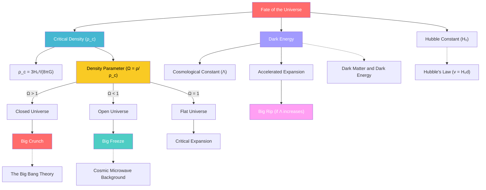

# 1. Overview / 概述

**English:**
The fate of the universe is one of the most profound questions in cosmology, directly linked to the competition between the [[Hubble's Law (v = H₀d)]] expansion and the gravitational pull of matter. This sub-topic explores three possible scenarios for the ultimate destiny of the cosmos: the **Big Crunch**, the **Big Freeze** (or Heat Death), and the **Big Rip**. The deciding factor is the **critical density** ($\rho_c$) of the universe, which determines whether the expansion will eventually halt, continue forever, or accelerate to destruction. This builds directly on [[The Big Bang Theory]] and introduces the role of [[Dark Matter and Dark Energy (Brief Overview)]] in shaping the universe's future. Understanding the fate of the universe requires applying [[Hubble's Law (v = H₀d)]] and concepts from [[Stellar Evolution]] to the largest possible scale.

**中文:**
宇宙的命运是宇宙学中最深刻的问题之一，直接与[[哈勃定律 (v = H₀d)]]所描述的膨胀和物质的引力牵引之间的竞争有关。本子知识点探讨了宇宙最终命运的三种可能情景：**大坍缩**、**大冻结**（或热寂）和**大撕裂**。决定因素是宇宙的**临界密度** ($\rho_c$)，它决定了膨胀最终是否会停止、永远持续下去，还是加速走向毁灭。这直接建立在[[大爆炸理论]]之上，并介绍了[[暗物质与暗能量（简要概述）]]在塑造宇宙未来中的作用。理解宇宙的命运需要将[[哈勃定律 (v = H₀d)]]和[[恒星演化]]的概念应用到最大尺度上。

---

# 2. Syllabus Learning Objectives / 考纲学习目标

| CAIE 9702 | Edexcel IAL |
|-----------|-------------|
| 25.5(a): Understand that the universe may be open, closed, or flat | WPH14 U4: 10.26: Understand the concept of critical density |
| 25.5(b): Recall the relationship between density and the fate of the universe | WPH14 U4: 10.27: Describe the three possible fates (Big Crunch, Big Freeze, Big Rip) |
| 25.5(c): Define and use the critical density equation | WPH14 U4: 10.28: Use the equation $\rho_c = \frac{3H_0^2}{8\pi G}$ |
| 25.5(d): Explain the role of dark energy in accelerating expansion | WPH14 U4: 10.29: Explain the role of dark energy |
| 25.5(e): Describe the Big Crunch, Big Freeze, and Big Rip scenarios | WPH14 U4: 10.30: Compare the three scenarios |
| 25.5(f): Understand the concept of the cosmological constant | WPH14 U4: 10.31: Understand the cosmological constant ($\Lambda$) |
| 25.5(g): Interpret the density parameter $\Omega$ | WPH14 U4: 10.32: Interpret $\Omega = \frac{\rho}{\rho_c}$ |

**Examiner Expectations / 考官期望:**
- **English:** Students must be able to calculate critical density using given values of $H_0$ and $G$. They should explain how the density parameter $\Omega$ determines the geometry and fate of the universe. The role of dark energy as a repulsive force must be clearly distinguished from gravity.
- **中文:** 学生必须能够使用给定的 $H_0$ 和 $G$ 值计算临界密度。他们应解释密度参数 $\Omega$ 如何决定宇宙的几何形状和命运。必须清楚区分暗能量作为排斥力的作用与引力的作用。

---

# 3. Core Definitions / 核心定义

| Term (EN/CN) | Definition (EN) | Definition (CN) | Common Mistakes / 常见错误 |
|--------------|-----------------|-----------------|---------------------------|
| **Critical Density** / 临界密度 | The average density of matter and energy required for the universe to be exactly flat, given by $\rho_c = \frac{3H_0^2}{8\pi G}$ | 使宇宙恰好平坦所需的物质和能量平均密度，由 $\rho_c = \frac{3H_0^2}{8\pi G}$ 给出 | Confusing $\rho_c$ with actual density; forgetting it depends on $H_0$ |
| **Density Parameter ($\Omega$)** / 密度参数 | The ratio of the actual density of the universe to the critical density: $\Omega = \frac{\rho}{\rho_c}$ | 宇宙实际密度与临界密度之比：$\Omega = \frac{\rho}{\rho_c}$ | Thinking $\Omega$ is a density value (it's dimensionless) |
| **Big Crunch** / 大坍缩 | A scenario where the universe's density exceeds the critical density ($\Omega > 1$), causing expansion to reverse into contraction | 宇宙密度超过临界密度 ($\Omega > 1$) 的情景，导致膨胀逆转收缩 | Assuming it happens immediately; it takes billions of years |
| **Big Freeze (Heat Death)** / 大冻结（热寂） | A scenario where the universe's density is less than critical ($\Omega < 1$), leading to eternal expansion and cooling | 宇宙密度小于临界密度 ($\Omega < 1$) 的情景，导致永恒膨胀和冷却 | Confusing with "cold death" — it's about thermodynamic equilibrium |
| **Big Rip** / 大撕裂 | A scenario where dark energy's repulsive force becomes so strong that it tears apart all structures, including atoms | 暗能量的排斥力变得如此强大，以至于撕裂所有结构（包括原子）的情景 | Thinking it's the same as Big Freeze; Big Rip is faster and more violent |
| **Cosmological Constant ($\Lambda$)** / 宇宙学常数 | A term in Einstein's field equations representing a constant energy density of empty space, driving accelerated expansion | 爱因斯坦场方程中的一个项，代表真空的恒定能量密度，驱动加速膨胀 | Thinking it's a force; it's a property of spacetime |

---

# 4. Key Concepts Explained / 关键概念详解

## 4.1 Critical Density and the Density Parameter / 临界密度与密度参数

### Explanation / 解释
**English:**
The critical density ($\rho_c$) is the average density of the universe that would make its geometry exactly flat (Euclidean). It is derived from [[Hubble's Law (v = H₀d)]] and Newtonian gravity. The density parameter $\Omega = \frac{\rho}{\rho_c}$ determines the fate:
- $\Omega > 1$: Closed universe → Big Crunch
- $\Omega < 1$: Open universe → Big Freeze
- $\Omega = 1$: Flat universe → Critical expansion (slows but never stops)

Current observations suggest $\Omega \approx 1$, but with dark energy dominating, the fate is more complex.

**中文:**
临界密度 ($\rho_c$) 是使宇宙几何形状恰好平坦（欧几里得）所需的平均密度。它由[[哈勃定律 (v = H₀d)]]和牛顿引力推导得出。密度参数 $\Omega = \frac{\rho}{\rho_c}$ 决定了命运：
- $\Omega > 1$：封闭宇宙 → 大坍缩
- $\Omega < 1$：开放宇宙 → 大冻结
- $\Omega = 1$：平坦宇宙 → 临界膨胀（减速但永不停止）

目前的观测表明 $\Omega \approx 1$，但由于暗能量占主导，命运更为复杂。

### Physical Meaning / 物理意义
**English:**
The critical density represents the balance point between the kinetic energy of expansion (from the Big Bang) and the gravitational potential energy of matter. If the universe is denser than critical, gravity wins and pulls everything back. If less dense, expansion wins and continues forever.

**中文:**
临界密度代表了膨胀动能（来自大爆炸）与物质引力势能之间的平衡点。如果宇宙密度大于临界值，引力获胜并将一切拉回。如果密度小于临界值，膨胀获胜并永远持续。

### Common Misconceptions / 常见误区
- **English:**
  - Thinking $\rho_c$ is a fixed constant — it depends on $H_0$, which changes over time.
  - Believing $\Omega = 1$ means the universe is perfectly balanced — it does, but dark energy complicates this.
  - Confusing "flat" geometry with "no curvature" — flat means Euclidean geometry on large scales.
- **中文:**
  - 认为 $\rho_c$ 是固定常数——它取决于 $H_0$，而 $H_0$ 随时间变化。
  - 相信 $\Omega = 1$ 意味着宇宙完美平衡——确实如此，但暗能量使这变得复杂。
  - 混淆“平坦”几何与“无曲率”——平坦意味着大尺度上的欧几里得几何。

### Exam Tips / 考试提示
- **English:** Always write the full equation $\rho_c = \frac{3H_0^2}{8\pi G}$ and state units ($\text{kg m}^{-3}$). For $\Omega$, remember it's a ratio with no units.
- **中文:** 始终写出完整方程 $\rho_c = \frac{3H_0^2}{8\pi G}$ 并注明单位 ($\text{kg m}^{-3}$)。对于 $\Omega$，记住它是无量纲比值。

> 📷 **IMAGE PROMPT — FATE-01: Three Universe Fates Diagram**
> A clear diagram showing three expanding spheres labeled "Closed Universe (Ω > 1)", "Open Universe (Ω < 1)", and "Flat Universe (Ω = 1)". The closed sphere shows expansion slowing, stopping, and reversing into contraction. The open sphere expands forever. The flat sphere expands at a decreasing rate but never stops. Arrows indicate expansion direction. Include a graph below showing scale factor R(t) vs time for each scenario.

---

## 4.2 The Three Fates: Big Crunch, Big Freeze, Big Rip / 三种命运：大坍缩、大冻结、大撕裂

### Explanation / 解释
**English:**
The three fates represent different outcomes based on the density and composition of the universe:

1. **Big Crunch ($\Omega > 1$):** The universe's expansion slows, stops, and reverses. Galaxies blueshift as they approach. Everything collapses into a singularity — possibly triggering another Big Bang (cyclic universe).

2. **Big Freeze ($\Omega < 1$):** The universe expands forever, cooling toward absolute zero. Stars burn out, galaxies drift apart, and the universe reaches thermodynamic equilibrium (heat death). This is the most likely fate based on current data.

3. **Big Rip ($\Omega_\Lambda$ dominates):** If dark energy's repulsive force increases over time (phantom energy), it will overcome all binding forces — first galaxy clusters, then galaxies, solar systems, planets, and finally atoms. This happens in a finite time.

**中文:**
三种命运代表了基于宇宙密度和组成的不同结果：

1. **大坍缩 ($\Omega > 1$):** 宇宙膨胀减速、停止并逆转。星系在接近时发生蓝移。一切坍缩成一个奇点——可能触发另一次大爆炸（循环宇宙）。

2. **大冻结 ($\Omega < 1$):** 宇宙永远膨胀，冷却至绝对零度。恒星熄灭，星系漂离，宇宙达到热力学平衡（热寂）。根据当前数据，这是最可能的命运。

3. **大撕裂 ($\Omega_\Lambda$ 占主导):** 如果暗能量的排斥力随时间增加（幻影能量），它将克服所有束缚力——先是星系团，然后是星系、太阳系、行星，最后是原子。这发生在有限时间内。

### Physical Meaning / 物理意义
**English:**
The fate depends on the balance between gravity (attractive) and dark energy (repulsive). The Big Crunch requires enough matter to overcome expansion. The Big Freeze requires expansion to dominate. The Big Rip requires dark energy to increase in strength, which is speculative but possible.

**中文:**
命运取决于引力（吸引）和暗能量（排斥）之间的平衡。大坍缩需要足够的物质来克服膨胀。大冻结需要膨胀占主导。大撕裂需要暗能量强度增加，这是推测性的但可能。

### Common Misconceptions / 常见误区
- **English:**
  - Thinking the Big Crunch is the only possible fate — current evidence favors Big Freeze.
  - Believing the Big Rip is confirmed — it's a theoretical possibility, not proven.
  - Confusing "heat death" with "cold death" — heat death is thermodynamic equilibrium, not just cold.
- **中文:**
  - 认为大坍缩是唯一可能的命运——当前证据支持大冻结。
  - 相信大撕裂已被确认——这是一个理论可能性，尚未被证实。
  - 混淆“热寂”与“冷寂”——热寂是热力学平衡，不仅仅是冷。

### Exam Tips / 考试提示
- **English:** For CAIE, focus on Big Crunch vs Big Freeze. For Edexcel, also discuss Big Rip. Use the density parameter $\Omega$ to justify your answer.
- **中文:** 对于CAIE，重点关注大坍缩与大冻结。对于Edexcel，还要讨论大撕裂。使用密度参数 $\Omega$ 来证明你的答案。

> 📷 **IMAGE PROMPT — FATE-02: Timeline of Universe Fates**
> A timeline graphic showing the present day at the center, with three branches extending to the right. Branch 1: Big Crunch — shows expansion slowing, stopping, and reversing with a collapse arrow. Branch 2: Big Freeze — shows expansion continuing with stars fading and galaxies separating. Branch 3: Big Rip — shows expansion accelerating with structures tearing apart at different scales. Label each branch with approximate time scales (billions of years from now).

---

## 4.3 Dark Energy and the Cosmological Constant / 暗能量与宇宙学常数

### Explanation / 解释
**English:**
Dark energy is a mysterious form of energy that permeates all of space and exerts negative pressure, causing the expansion of the universe to accelerate. It is represented by the **cosmological constant ($\Lambda$)** in Einstein's field equations. The discovery of dark energy in 1998 (from Type Ia supernova observations) revolutionized cosmology, showing that the universe's expansion is not slowing down but speeding up.

The cosmological constant has a constant energy density, meaning as the universe expands, dark energy does not dilute — it becomes more dominant over time. This leads to the Big Freeze scenario (or Big Rip if $\Lambda$ changes).

**中文:**
暗能量是一种神秘的能量形式，渗透所有空间并产生负压力，导致宇宙膨胀加速。它在爱因斯坦场方程中用**宇宙学常数 ($\Lambda$)** 表示。1998年暗能量的发现（来自Ia型超新星观测）彻底改变了宇宙学，表明宇宙膨胀并未减速，而是在加速。

宇宙学常数具有恒定的能量密度，这意味着随着宇宙膨胀，暗能量不会稀释——它随时间变得更加占主导。这导致了大冻结情景（如果 $\Lambda$ 变化则导致大撕裂）。

### Physical Meaning / 物理意义
**English:**
Dark energy acts as a repulsive force on cosmic scales. While gravity pulls matter together, dark energy pushes space apart. The cosmological constant represents the energy of empty space itself — even a vacuum has energy.

**中文:**
暗能量在宇宙尺度上起到排斥力的作用。当引力将物质拉在一起时，暗能量将空间推开。宇宙学常数代表了真空本身的能量——即使是真空也有能量。

### Common Misconceptions / 常见误区
- **English:**
  - Thinking dark energy is the same as dark matter — they are completely different (dark matter attracts, dark energy repels).
  - Believing dark energy is a force — it's a property of spacetime.
  - Confusing the cosmological constant with a constant expansion rate — expansion accelerates, but $\Lambda$ is constant.
- **中文:**
  - 认为暗能量与暗物质相同——它们完全不同（暗物质吸引，暗能量排斥）。
  - 相信暗能量是一种力——它是时空的一种属性。
  - 混淆宇宙学常数与恒定膨胀率——膨胀加速，但 $\Lambda$ 是常数。

### Exam Tips / 考试提示
- **English:** State clearly: "Dark energy causes the expansion of the universe to accelerate." Link to Type Ia supernovae as evidence. For Edexcel, mention the cosmological constant $\Lambda$.
- **中文:** 明确说明：“暗能量导致宇宙膨胀加速。”联系Ia型超新星作为证据。对于Edexcel，提及宇宙学常数 $\Lambda$。

> 📋 **CIE Only:** Focus on the density parameter $\Omega$ and the three fates. Dark energy is mentioned but not required in depth.
> 📋 **Edexcel Only:** Detailed understanding of the cosmological constant $\Lambda$ and its role in the Big Rip scenario is required.

---

# 5. Essential Equations / 核心公式

## 5.1 Critical Density Equation / 临界密度方程

$$ \rho_c = \frac{3H_0^2}{8\pi G} $$

| Symbol (符号) | Meaning (EN) | Meaning (CN) | Unit (单位) |
|--------------|-------------|-------------|------------|
| $\rho_c$ | Critical density | 临界密度 | $\text{kg m}^{-3}$ |
| $H_0$ | Hubble constant | 哈勃常数 | $\text{s}^{-1}$ |
| $G$ | Gravitational constant | 引力常数 | $\text{m}^3 \text{kg}^{-1} \text{s}^{-2}$ |

**Derivation / 推导:**
**English:** Derived from equating the kinetic energy of expansion ($\frac{1}{2}mv^2$) with gravitational potential energy ($\frac{GMm}{r}$) for a test mass on the edge of a spherical universe, using $v = H_0 r$.
**中文:** 通过将球状宇宙边缘测试质量的膨胀动能 ($\frac{1}{2}mv^2$) 与引力势能 ($\frac{GMm}{r}$) 相等推导得出，使用 $v = H_0 r$。

**Conditions / 适用条件:**
- **English:** Assumes a homogeneous, isotropic universe. Valid for large scales where Newtonian gravity approximates general relativity.
- **中文:** 假设均匀、各向同性的宇宙。在大尺度上有效，此时牛顿引力近似于广义相对论。

**Limitations / 局限性:**
- **English:** Does not account for dark energy. The actual fate depends on both matter density and dark energy density.
- **中文:** 未考虑暗能量。实际命运取决于物质密度和暗能量密度。

## 5.2 Density Parameter / 密度参数

$$ \Omega = \frac{\rho}{\rho_c} $$

| Symbol (符号) | Meaning (EN) | Meaning (CN) | Unit (单位) |
|--------------|-------------|-------------|------------|
| $\Omega$ | Density parameter | 密度参数 | Dimensionless (无量纲) |
| $\rho$ | Actual density of universe | 宇宙实际密度 | $\text{kg m}^{-3}$ |
| $\rho_c$ | Critical density | 临界密度 | $\text{kg m}^{-3}$ |

**Conditions / 适用条件:**
- **English:** $\Omega > 1$ → closed universe (Big Crunch); $\Omega < 1$ → open universe (Big Freeze); $\Omega = 1$ → flat universe.
- **中文:** $\Omega > 1$ → 封闭宇宙（大坍缩）；$\Omega < 1$ → 开放宇宙（大冻结）；$\Omega = 1$ → 平坦宇宙。

**Limitations / 局限性:**
- **English:** Modern cosmology uses $\Omega_\text{total} = \Omega_\text{matter} + \Omega_\text{dark energy}$, where $\Omega_\text{dark energy} \approx 0.7$ dominates.
- **中文:** 现代宇宙学使用 $\Omega_\text{总} = \Omega_\text{物质} + \Omega_\text{暗能量}$，其中 $\Omega_\text{暗能量} \approx 0.7$ 占主导。

> 📷 **IMAGE PROMPT — FATE-03: Critical Density Graph**
> A graph with density (ρ) on the y-axis and time on the x-axis. Show a horizontal dashed line for ρ_c. Above the line, label "Closed Universe (Ω > 1) → Big Crunch". Below the line, label "Open Universe (Ω < 1) → Big Freeze". On the line, label "Flat Universe (Ω = 1)". Include an arrow showing the actual density decreasing over time as the universe expands.

---

# 6. Graphs and Relationships / 图表与关系

## 6.1 Scale Factor vs Time for Different Fates / 尺度因子与时间的关系（不同命运）

### Axes / 坐标轴
- **X-axis:** Time (t) / 时间 (t)
- **Y-axis:** Scale factor R(t) (relative size of universe) / 尺度因子 R(t)（宇宙相对大小）

### Shape / 形状
- **English:** Three curves:
  - **Big Crunch:** R(t) increases, reaches a maximum, then decreases to zero.
  - **Big Freeze:** R(t) increases forever, with slope decreasing (decelerating) but never reaching zero slope.
  - **Big Rip:** R(t) increases forever, with slope increasing (accelerating), reaching infinite R in finite time.
- **中文:** 三条曲线：
  - **大坍缩:** R(t) 增加，达到最大值，然后减小到零。
  - **大冻结:** R(t) 永远增加，斜率减小（减速）但从未达到零斜率。
  - **大撕裂:** R(t) 永远增加，斜率增加（加速），在有限时间内达到无限 R。

### Gradient Meaning / 斜率含义
- **English:** Gradient = $\frac{dR}{dt}$, which is the expansion rate. Positive gradient = expansion; negative gradient = contraction.
- **中文:** 斜率 = $\frac{dR}{dt}$，即膨胀率。正斜率 = 膨胀；负斜率 = 收缩。

### Area Meaning / 面积含义
- **English:** Not typically interpreted for this graph.
- **中文:** 此图通常不解释面积含义。

### Exam Interpretation / 考试解读
- **English:** Identify which curve corresponds to which fate. Explain that the Big Crunch curve shows a turning point where expansion reverses. The Big Freeze curve approaches a constant R asymptotically. The Big Rip curve has a vertical asymptote.
- **中文:** 识别哪条曲线对应哪种命运。解释大坍缩曲线显示膨胀逆转的转折点。大冻结曲线渐近地接近恒定 R。大撕裂曲线有垂直渐近线。

```mermaid
graph LR
    A[Scale Factor R(t)] --> B{Ω value}
    B -->|Ω > 1| C[Big Crunch]
    B -->|Ω < 1| D[Big Freeze]
    B -->|Ω = 1| E[Flat Universe]
    C --> F[R increases then decreases]
    D --> G[R increases forever, decelerating]
    E --> H[R increases forever, approaching constant]
    style C fill:#ff6b6b
    style D fill:#4ecdc4
    style E fill:#45b7d1
```

---

# 7. Required Diagrams / 必备图表

## 7.1 The Three Fates of the Universe / 宇宙的三种命运

### Description / 描述
**English:** A diagram showing three possible evolutionary paths of the universe from the Big Bang to the present and into the future. Each path shows the scale factor R(t) over time, with the present day marked. The three curves diverge after the present.

**中文:** 一个显示宇宙从大爆炸到现在及未来三种可能演化路径的图表。每条路径显示尺度因子 R(t) 随时间的变化，并标记了现在。三条曲线在现在之后分叉。

### Image Prompt / 图片生成提示
> 📷 **IMAGE PROMPT — FATE-04: Universe Fate Comparison**
> A professional scientific diagram with three curves on a graph of "Scale Factor R(t)" vs "Time". The curves start together at the Big Bang (t=0, R=0), rise together to the present day (marked with a vertical dashed line), then diverge. Curve 1 (red): rises to a peak then curves downward to R=0 (Big Crunch). Curve 2 (blue): continues rising but with decreasing slope (Big Freeze). Curve 3 (green): rises steeply with increasing slope, approaching a vertical line (Big Rip). Labels: "Big Bang", "Present Day", "Big Crunch", "Big Freeze", "Big Rip". Include a legend.

### Labels Required / 需要标注
- **English:** Big Bang, Present Day, Big Crunch, Big Freeze, Big Rip, Scale Factor R(t), Time
- **中文:** 大爆炸、现在、大坍缩、大冻结、大撕裂、尺度因子 R(t)、时间

### Exam Importance / 考试重要性
- **English:** High — this diagram is frequently used in exam questions to test understanding of the three fates.
- **中文:** 高——此图常用于考试题中测试对三种命运的理解。

---

## 7.2 Density Parameter Diagram / 密度参数图

### Description / 描述
**English:** A diagram showing three possible geometries of the universe based on the density parameter $\Omega$: closed (spherical, $\Omega > 1$), open (hyperbolic, $\Omega < 1$), and flat (Euclidean, $\Omega = 1$). Each geometry is represented by a 2D surface analogy.

**中文:** 一个显示基于密度参数 $\Omega$ 的三种可能宇宙几何形状的图表：封闭（球形，$\Omega > 1$）、开放（双曲形，$\Omega < 1$）和平坦（欧几里得，$\Omega = 1$）。每种几何形状用二维表面类比表示。

### Image Prompt / 图片生成提示
> 📷 **IMAGE PROMPT — FATE-05: Universe Geometry Diagram**
> Three panels showing 2D surfaces as analogies for 3D space. Panel 1: A sphere surface (closed, finite volume, no edges) labeled "Closed Universe (Ω > 1) — Spherical Geometry". Panel 2: A saddle-shaped surface (open, infinite) labeled "Open Universe (Ω < 1) — Hyperbolic Geometry". Panel 3: A flat plane (infinite, Euclidean) labeled "Flat Universe (Ω = 1) — Euclidean Geometry". Include triangles drawn on each surface to show how angles sum to more than, less than, or exactly 180°.

### Labels Required / 需要标注
- **English:** Closed (Ω > 1), Open (Ω < 1), Flat (Ω = 1), Spherical Geometry, Hyperbolic Geometry, Euclidean Geometry
- **中文:** 封闭 (Ω > 1)、开放 (Ω < 1)、平坦 (Ω = 1)、球形几何、双曲几何、欧几里得几何

### Exam Importance / 考试重要性
- **English:** Medium — understanding the geometry-fate connection is essential for conceptual questions.
- **中文:** 中——理解几何与命运的联系对于概念性问题至关重要。

---

# 8. Worked Examples / 典型例题

## Example 1: Calculating Critical Density / 计算临界密度

### Question / 题目
**English:**
The Hubble constant is measured to be $H_0 = 2.2 \times 10^{-18} \text{ s}^{-1}$. Calculate the critical density of the universe. Given $G = 6.67 \times 10^{-11} \text{ N m}^2 \text{ kg}^{-2}$.

**中文:**
哈勃常数测量为 $H_0 = 2.2 \times 10^{-18} \text{ s}^{-1}$。计算宇宙的临界密度。已知 $G = 6.67 \times 10^{-11} \text{ N m}^2 \text{ kg}^{-2}$。

### Solution / 解答
**Step 1:** Write the equation for critical density.
$$\rho_c = \frac{3H_0^2}{8\pi G}$$

**Step 2:** Substitute values.
$$\rho_c = \frac{3 \times (2.2 \times 10^{-18})^2}{8\pi \times 6.67 \times 10^{-11}}$$

**Step 3:** Calculate $H_0^2$.
$$H_0^2 = (2.2 \times 10^{-18})^2 = 4.84 \times 10^{-36}$$

**Step 4:** Calculate numerator.
$$3 \times 4.84 \times 10^{-36} = 1.452 \times 10^{-35}$$

**Step 5:** Calculate denominator.
$$8\pi \times 6.67 \times 10^{-11} = 8 \times 3.1416 \times 6.67 \times 10^{-11} = 1.676 \times 10^{-9}$$

**Step 6:** Final calculation.
$$\rho_c = \frac{1.452 \times 10^{-35}}{1.676 \times 10^{-9}} = 8.66 \times 10^{-27} \text{ kg m}^{-3}$$

### Final Answer / 最终答案
**Answer:** $\rho_c = 8.66 \times 10^{-27} \text{ kg m}^{-3}$ | **答案：** $\rho_c = 8.66 \times 10^{-27} \text{ kg m}^{-3}$

### Quick Tip / 提示
**English:** Remember that $H_0$ is often given in $\text{km s}^{-1} \text{ Mpc}^{-1}$. Convert to $\text{s}^{-1}$ first: $1 \text{ km s}^{-1} \text{ Mpc}^{-1} = 3.24 \times 10^{-20} \text{ s}^{-1}$.
**中文:** 记住 $H_0$ 通常以 $\text{km s}^{-1} \text{ Mpc}^{-1}$ 给出。先转换为 $\text{s}^{-1}$：$1 \text{ km s}^{-1} \text{ Mpc}^{-1} = 3.24 \times 10^{-20} \text{ s}^{-1}$。

---

## Example 2: Determining the Fate from Density / 从密度确定命运

### Question / 题目
**English:**
The average density of the universe is estimated to be $\rho = 5.0 \times 10^{-27} \text{ kg m}^{-3}$. Using the critical density from Example 1 ($\rho_c = 8.66 \times 10^{-27} \text{ kg m}^{-3}$), calculate the density parameter $\Omega$ and state the fate of the universe.

**中文:**
宇宙的平均密度估计为 $\rho = 5.0 \times 10^{-27} \text{ kg m}^{-3}$。使用例1中的临界密度 ($\rho_c = 8.66 \times 10^{-27} \text{ kg m}^{-3}$)，计算密度参数 $\Omega$ 并说明宇宙的命运。

### Solution / 解答
**Step 1:** Write the equation for density parameter.
$$\Omega = \frac{\rho}{\rho_c}$$

**Step 2:** Substitute values.
$$\Omega = \frac{5.0 \times 10^{-27}}{8.66 \times 10^{-27}}$$

**Step 3:** Calculate.
$$\Omega = 0.577$$

**Step 4:** Interpret.
Since $\Omega < 1$, the universe is open. The fate is the **Big Freeze** (eternal expansion and cooling).

**Step 5:** Note on modern cosmology.
However, this calculation only considers matter density. When dark energy is included, $\Omega_\text{total} \approx 1$, but dark energy dominates, leading to accelerated expansion. The fate is still Big Freeze, but with acceleration.

### Final Answer / 最终答案
**Answer:** $\Omega = 0.577$; the universe is open → Big Freeze | **答案：** $\Omega = 0.577$；宇宙是开放的 → 大冻结

### Quick Tip / 提示
**English:** Always state the condition ($\Omega > 1$, $\Omega < 1$, or $\Omega = 1$) and then the corresponding fate. For full marks, mention that dark energy complicates the simple model.
**中文:** 始终说明条件 ($\Omega > 1$、$\Omega < 1$ 或 $\Omega = 1$)，然后说明相应的命运。要得满分，提及暗能量使简单模型复杂化。

---

# 9. Past Paper Question Types / 历年真题题型

| Question Type / 题型 | Frequency / 频率 | Difficulty / 难度 | Past Paper References / 真题索引 |
|----------------------|------------------|------------------|-------------------------------|
| Calculate critical density from $H_0$ | High | Medium | 📝 *待填入* |
| Determine fate from $\Omega$ value | High | Low | 📝 *待填入* |
| Explain the role of dark energy | Medium | Medium | 📝 *待填入* |
| Compare Big Crunch, Big Freeze, Big Rip | Medium | Medium | 📝 *待填入* |
| Interpret scale factor vs time graph | Low | High | 📝 *待填入* |
| Derive critical density equation | Low | High | 📝 *待填入* |

**Common Command Words / 常见指令词:**
- **English:** Calculate, Determine, Explain, Compare, State, Describe, Derive
- **中文:** 计算、确定、解释、比较、说明、描述、推导

---

# 10. Practical Skills Connections / 实验技能链接

**English:**
While the fate of the universe cannot be directly tested in a school laboratory, the concepts connect to practical skills in several ways:

1. **Measurement of $H_0$:** The Hubble constant is determined from [[Redshift and the Expanding Universe]] data using [[Hubble's Law (v = H₀d)]]. Students should understand how to plot $v$ vs $d$ and find the gradient.

2. **Uncertainty Analysis:** The value of $H_0$ has significant uncertainty ($\pm 2.2 \text{ km s}^{-1} \text{ Mpc}^{-1}$), which propagates to $\rho_c$. Students should be able to calculate percentage uncertainties.

3. **Graph Plotting:** The scale factor vs time graph requires understanding of curve sketching and interpretation of gradients.

4. **Type Ia Supernovae:** The discovery of dark energy came from plotting supernova distances vs redshift. Students should understand how standard candles are used.

**中文:**
虽然宇宙的命运无法在学校实验室直接测试，但这些概念在几个方面与实验技能相关：

1. **$H_0$ 的测量：** 哈勃常数通过[[红移与膨胀宇宙]]的数据使用[[哈勃定律 (v = H₀d)]]确定。学生应理解如何绘制 $v$ 与 $d$ 的关系图并找到斜率。

2. **不确定度分析：** $H_0$ 的值有显著不确定度 ($\pm 2.2 \text{ km s}^{-1} \text{ Mpc}^{-1}$)，这会传播到 $\rho_c$。学生应能计算百分比不确定度。

3. **图表绘制：** 尺度因子与时间的关系图需要理解曲线绘制和斜率的解释。

4. **Ia型超新星：** 暗能量的发现来自绘制超新星距离与红移的关系图。学生应理解标准烛光的使用。

---

# 11. Concept Map / 概念图谱



---

# 12. Quick Revision Sheet / 速查表

| Category / 类别 | Key Points / 要点 |
|----------------|------------------|
| **Definition / 定义** | Critical density: $\rho_c = \frac{3H_0^2}{8\pi G}$ — the density needed for a flat universe |
| **Key Formula / 核心公式** | $\rho_c = \frac{3H_0^2}{8\pi G}$; $\Omega = \frac{\rho}{\rho_c}$ |
| **Key Graph / 核心图表** | Scale factor R(t) vs time: three curves for Big Crunch, Big Freeze, Big Rip |
| **Three Fates / 三种命运** | **Big Crunch** ($\Omega > 1$): expansion reverses; **Big Freeze** ($\Omega < 1$): eternal expansion; **Big Rip** (dark energy dominates): accelerated tearing apart |
| **Dark Energy / 暗能量** | Causes accelerated expansion; represented by cosmological constant $\Lambda$; discovered via Type Ia supernovae (1998) |
| **Current Evidence / 当前证据** | $\Omega_\text{total} \approx 1$ (flat universe); $\Omega_\Lambda \approx 0.7$ (dark energy dominates); fate = Big Freeze with acceleration |
| **Common Mistake / 常见错误** | Confusing dark energy with dark matter; thinking $\rho_c$ is constant; forgetting to convert $H_0$ units |
| **Exam Tip / 考试提示** | Always write the full equation; state conditions ($\Omega > 1$, etc.); mention dark energy for higher marks |
| **Prerequisites / 前置知识** | [[The Doppler Effect]], [[Stellar Distances]], [[Hubble's Law (v = H₀d)]] |
| **Related Topics / 相关主题** | [[The Big Bang Theory]], [[Cosmic Microwave Background Radiation (CMB)]], [[Dark Matter and Dark Energy (Brief Overview)]] |