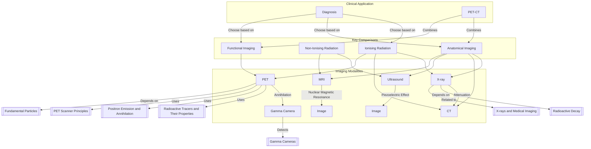

---
# 1. Overview / 概述

**English:**
This sub-topic provides a comparative analysis of the five major medical imaging modalities: X-ray, Computed Tomography (CT), Ultrasound, Positron Emission Tomography (PET), and Magnetic Resonance Imaging (MRI). It focuses on the underlying physical principles, the type of radiation used (ionising vs. non-ionising), the nature of the image produced (anatomical vs. functional), and the associated risks and benefits. Understanding these comparisons is crucial for selecting the appropriate imaging technique for a given clinical scenario and for appreciating the unique role of [[PET Scanner Principles]] in functional imaging. This leaf node builds directly on the concepts of [[Radioactive Tracers and Their Properties]] and [[Positron Emission and Annihilation]].

**中文:**
本子知识点对五种主要医学成像方式进行了比较分析：X射线、计算机断层扫描（CT）、超声波、正电子发射断层扫描（PET）和磁共振成像（MRI）。它侧重于基本的物理原理、所用辐射类型（电离与非电离）、所产生图像的性质（解剖与功能）以及相关的风险和益处。理解这些比较对于为特定临床情况选择合适的成像技术以及理解[[PET Scanner Principles]]在功能成像中的独特作用至关重要。本叶节点直接建立在[[Radioactive Tracers and Their Properties]]和[[Positron Emission and Annihilation]]的概念之上。

---

# 2. Syllabus Learning Objectives / 考纲学习目标

| CAIE 9702 (26.3 a-f) | Edexcel IAL (WPH14 U4: 11.13-11.18) |
|-----------|-------------|
| Compare the principles, uses, and risks of X-rays, CT, ultrasound, PET, and MRI. | Understand the principles of X-ray, CT, ultrasound, PET, and MRI imaging. |
| Understand the difference between ionising and non-ionising radiation in medical imaging. | Compare the advantages and disadvantages of different imaging techniques. |
| Understand the meaning of "contrast" in medical imaging. | Understand the use of contrast media in X-ray and MRI. |
| Understand the concept of "half-life" in the context of radioactive tracers. | Understand the concept of a tracer and its use in PET. |
| Understand the principles of ultrasound imaging, including the piezoelectric effect. | Understand the principles of ultrasound imaging, including the piezoelectric effect and A/B scans. |
| Understand the principles of MRI, including the role of strong magnetic fields and radio waves. | Understand the principles of MRI, including the role of strong magnetic fields and radio waves. |

**Examiner Expectations / 考官期望:**
- **EN:** Students must be able to clearly distinguish between the *physical principles* (e.g., attenuation of X-rays, reflection of ultrasound, annihilation of positrons) and the *clinical application* (anatomical vs. functional). Be prepared to discuss the *risk-benefit analysis* for each modality, particularly regarding ionising radiation dose.
- **CN:** 学生必须能够清晰区分*物理原理*（例如，X射线的衰减、超声波的反射、正电子的湮灭）和*临床应用*（解剖与功能）。要准备好讨论每种方式的*风险-收益分析*，特别是关于电离辐射剂量。

---

# 3. Core Definitions / 核心定义

| Term (EN/CN) | Definition (EN) | Definition (CN) | Common Mistakes / 常见错误 |
|--------------|-----------------|-----------------|---------------------------|
| **Ionising Radiation** / 电离辐射 | Radiation with sufficient energy to remove electrons from atoms, creating ions. | 具有足够能量从原子中移除电子、产生离子的辐射。 | Confusing ionising with non-ionising. X-rays and gamma rays are ionising; ultrasound and radio waves are not. |
| **Anatomical Imaging** / 解剖成像 | Imaging that provides detailed structural information about the body (e.g., bones, organs, tissues). | 提供身体详细结构信息（如骨骼、器官、组织）的成像。 | Thinking all imaging is anatomical. PET is primarily functional. |
| **Functional Imaging** / 功能成像 | Imaging that provides information about physiological processes, such as metabolic activity or blood flow. | 提供生理过程信息（如代谢活动或血流）的成像。 | Confusing functional with anatomical. PET and fMRI are functional. |
| **Contrast** / 对比度 | The difference in signal intensity between two adjacent areas in an image. | 图像中两个相邻区域之间信号强度的差异。 | Thinking contrast is only about adding a contrast agent. It also depends on the physical interaction of the modality with tissue. |
| **Tracer** / 示踪剂 | A small amount of a radioactive substance introduced into the body to follow a physiological process. | 引入体内的少量放射性物质，用于追踪生理过程。 | Confusing a tracer with a contrast agent. A tracer is metabolically active; a contrast agent is not. |
| **Piezoelectric Effect** / 压电效应 | The generation of an electric potential in a material when it is mechanically deformed, and vice-versa. | 材料在机械变形时产生电势，反之亦然。 | Forgetting the reverse effect (applying a voltage causes deformation) which is used to generate ultrasound pulses. |

---

# 4. Key Concepts Explained / 关键概念详解

## 4.1 Ionising vs. Non-Ionising Radiation / 电离辐射与非电离辐射

### Explanation / 解释
**English:** This is the most fundamental distinction in medical imaging. **Ionising radiation** (X-rays, gamma rays from PET) has enough energy to knock electrons out of atoms, potentially damaging DNA and causing cancer. **Non-ionising radiation** (ultrasound waves, radio waves in MRI) does not have enough energy to cause ionisation, making them generally safer. The choice of modality often involves a trade-off between image quality and the risk of ionising radiation.

**中文:** 这是医学成像中最基本的区别。**电离辐射**（X射线、PET的伽马射线）有足够的能量将电子从原子中击出，可能损伤DNA并导致癌症。**非电离辐射**（超声波、MRI中的无线电波）没有足够的能量引起电离，因此通常更安全。成像方式的选择通常涉及图像质量与电离辐射风险之间的权衡。

### Physical Meaning / 物理意义
**English:** The energy of a photon ($E = hf$) must be greater than the binding energy of an electron in an atom to cause ionisation. X-ray photons ($\sim 10^4 - 10^5$ eV) and gamma photons ($\sim 10^5 - 10^6$ eV) easily exceed this threshold. Radio waves ($\sim 10^{-6}$ eV) and ultrasound (mechanical waves, not photons) do not.

**中文:** 光子的能量 ($E = hf$) 必须大于原子中电子的结合能才能引起电离。X射线光子 ($\sim 10^4 - 10^5$ eV) 和伽马光子 ($\sim 10^5 - 10^6$ eV) 很容易超过这个阈值。无线电波 ($\sim 10^{-6}$ eV) 和超声波（机械波，非光子）则不能。

### Common Misconceptions / 常见误区
- **EN:** "MRI uses radiation, so it must be dangerous." (MRI uses non-ionising radio waves and a strong magnetic field; it is not ionising.)
- **CN:** "MRI使用辐射，所以一定很危险。"（MRI使用非电离无线电波和强磁场；它不是电离的。）
- **EN:** "Ultrasound is completely harmless at all intensities." (High-intensity ultrasound can cause heating and cavitation, so it is used with caution, especially in fetal imaging.)
- **CN:** "超声波在所有强度下都完全无害。"（高强度超声波会导致加热和空化效应，因此在胎儿成像中需谨慎使用。）

### Exam Tips / 考试提示
- **EN:** Be prepared to state whether a modality uses ionising or non-ionising radiation and explain the consequence for the patient.
- **CN:** 准备好说明一种方式是否使用电离辐射，并解释对患者的影响。

> 📷 **IMAGE PROMPT — DIAGRAM-01: Ionising vs Non-Ionising Radiation Spectrum**
> A clear diagram showing the electromagnetic spectrum. Highlight the ionising region (X-rays, gamma rays) in red and the non-ionising region (radio waves, microwaves, visible light) in blue. Label the energy threshold for ionisation. Include a separate box for ultrasound as a mechanical wave.

## 4.2 Anatomical vs. Functional Imaging / 解剖成像与功能成像

### Explanation / 解释
**English:** **Anatomical imaging** (X-ray, CT, MRI, Ultrasound) produces high-resolution images of the body's structure. It can show a tumour's size and location. **Functional imaging** (PET, fMRI) shows how tissues are working. A PET scan can show that a tumour is metabolically active (e.g., consuming a lot of glucose), which is a key indicator of malignancy. The most powerful modern technique is **PET-CT**, which combines the anatomical detail of CT with the functional information of PET.

**中文:** **解剖成像**（X射线、CT、MRI、超声波）生成身体结构的高分辨率图像。它可以显示肿瘤的大小和位置。**功能成像**（PET、fMRI）显示组织如何工作。PET扫描可以显示肿瘤具有代谢活性（例如，消耗大量葡萄糖），这是恶性肿瘤的关键指标。最强大的现代技术是**PET-CT**，它结合了CT的解剖细节和PET的功能信息。

### Physical Meaning / 物理意义
**English:** Anatomical imaging relies on differences in physical properties (density for X-ray/CT, water content for MRI, acoustic impedance for ultrasound). Functional imaging relies on the distribution and concentration of a specific molecule (e.g., a [[Radioactive Tracers and Their Properties|radioactive tracer]] like FDG).

**中文:** 解剖成像依赖于物理性质的差异（X射线/CT的密度、MRI的水含量、超声波的声阻抗）。功能成像依赖于特定分子（如FDG这样的[[Radioactive Tracers and Their Properties|放射性示踪剂]]）的分布和浓度。

### Common Misconceptions / 常见误区
- **EN:** "MRI is always better than CT." (CT is better for bone and lung imaging; MRI is better for soft tissue. They are complementary.)
- **CN:** "MRI总是比CT好。"（CT更适合骨骼和肺部成像；MRI更适合软组织。它们是互补的。）
- **EN:** "A PET scan can diagnose cancer on its own." (PET shows metabolic activity, which can also be caused by inflammation. It is often used in conjunction with CT for accurate diagnosis.)
- **CN:** "PET扫描可以单独诊断癌症。"（PET显示代谢活动，炎症也可能导致代谢活动。它通常与CT结合使用以进行准确诊断。）

### Exam Tips / 考试提示
- **EN:** You may be asked to explain why a specific modality is chosen for a particular medical condition (e.g., "Why is a CT scan preferred for a suspected brain bleed?" Answer: Fast, good for bone and blood, widely available).
- **CN:** 你可能会被要求解释为什么为特定医疗状况选择某种方式（例如，“为什么疑似脑出血时首选CT扫描？”答案：快速，对骨骼和血液成像效果好，普及率高）。

---

# 5. Essential Equations / 核心公式

For this sub-topic, the key is not a single equation but the *comparison* of principles. However, the fundamental equation for image formation in X-ray/CT is crucial.

## 5.1 X-ray Attenuation / X射线衰减

$$ I = I_0 e^{-\mu x} $$

| Symbol (符号) | Meaning (EN) | Meaning (CN) | Unit (单位) |
|--------------|-------------|-------------|------------|
| $I$ | Transmitted intensity | 透射强度 | W m$^{-2}$ |
| $I_0$ | Incident intensity | 入射强度 | W m$^{-2}$ |
| $\mu$ | Linear attenuation coefficient | 线性衰减系数 | m$^{-1}$ |
| $x$ | Thickness of material | 材料厚度 | m |

**Derivation / 推导:** This is the exponential decay law applied to photon absorption.
**Conditions / 适用条件:** A narrow, monoenergetic beam of X-rays passing through a uniform material.
**Limitations / 局限性:** In reality, X-ray beams are polyenergetic, and the body is non-uniform. CT scanners use complex algorithms to account for this.

> 📷 **IMAGE PROMPT — DIAGRAM-02: X-ray Attenuation Graph**
> A graph showing the exponential decay of X-ray intensity ($I$) as it passes through a material of thickness ($x$). Label $I_0$ at $x=0$. Show two curves: one for bone (high $\mu$, steep decay) and one for soft tissue (low $\mu$, shallow decay). This illustrates the basis of contrast in X-ray imaging.

---

# 6. Graphs and Relationships / 图表与关系

## 6.1 Comparison of Imaging Modalities / 成像方式比较

### Axes / 坐标轴
- **X-axis:** Imaging Modality (X-ray, CT, Ultrasound, PET, MRI)
- **Y-axis (left):** Level of Ionising Radiation Dose (Low to High)
- **Y-axis (right):** Type of Image (Anatomical vs. Functional)

### Shape / 形状
This is a bar chart or a table, not a continuous graph. It is a comparative visualisation.

### Gradient Meaning / 斜率含义
N/A - This is a categorical comparison.

### Area Meaning / 面积含义
N/A

### Exam Interpretation / 考试解读
- **EN:** You must be able to rank modalities by radiation dose (CT > X-ray > PET > Ultrasound = MRI = 0). You must be able to classify them as anatomical (X-ray, CT, Ultrasound, MRI) or functional (PET).
- **CN:** 你必须能够按辐射剂量对方式进行排序（CT > X射线 > PET > 超声波 = MRI = 0）。你必须能够将它们分类为解剖成像（X射线、CT、超声波、MRI）或功能成像（PET）。

> 📷 **IMAGE PROMPT — DIAGRAM-03: Modality Comparison Chart**
> A clear, colourful bar chart or table. X-axis: X-ray, CT, Ultrasound, PET, MRI. Y-axis: Relative Radiation Dose (0 to High). Colour-code bars: Red for ionising (X-ray, CT, PET), Green for non-ionising (Ultrasound, MRI). Add a second row of icons below: a bone icon for anatomical, a brain icon for functional. PET should have both icons.

---

# 7. Required Diagrams / 必备图表

## 7.1 Summary Table of Imaging Modalities / 成像方式汇总表

### Description / 描述
**English:** A comprehensive table comparing the five modalities across key criteria: radiation type, image type, physical principle, advantages, disadvantages, and typical uses.
**中文:** 一个全面的表格，比较五种方式的关键标准：辐射类型、图像类型、物理原理、优点、缺点和典型用途。

### Image Prompt / 图片生成提示
> 📷 **IMAGE PROMPT — DIAGRAM-04: Imaging Modalities Summary Table**
> A well-organised, professional-looking table. Columns: Modality, Radiation (Ionising/Non-ionising), Image Type (Anatomical/Functional), Physical Principle, Advantages, Disadvantages, Example Use. Rows: X-ray, CT, Ultrasound, PET, MRI. Use icons where possible (e.g., a skull for X-ray, a brain for PET). The table should be visually clear and easy to read.

### Labels Required / 需要标注
- **EN:** All column and row headers must be clearly labelled.
- **CN:** 所有列和行标题必须清晰标注。

### Exam Importance / 考试重要性
- **EN:** Extremely high. This is the core of the sub-topic. You will be expected to recall this information in an exam.
- **CN:** 极高。这是本子主题的核心。你将被期望在考试中回忆这些信息。

---

# 8. Worked Examples / 典型例题

## Example 1: Choosing the Right Modality / 选择正确的方式

### Question / 题目
**English:** A 65-year-old patient with a history of lung cancer is suspected of having a small, metabolically active metastasis in the brain. Which combination of imaging modalities would be most appropriate to confirm this diagnosis, and why?
**中文:** 一名有肺癌病史的65岁患者被怀疑脑部有一个小的、代谢活跃的转移灶。哪种成像方式的组合最适合确认这一诊断，为什么？

### Solution / 解答
1.  **Identify the need:** The question asks for a *metabolically active* lesion. This requires **functional imaging** → **PET scan**.
2.  **Identify the need for anatomy:** To precisely locate the small lesion within the brain, high-resolution **anatomical imaging** is needed → **MRI** (best for soft tissue) or **CT**.
3.  **Combine:** The most powerful approach is a **PET-MRI** or **PET-CT** scan. This provides both the functional data (from the PET tracer, e.g., FDG) and the anatomical detail (from the MRI/CT) in a single session, allowing for precise co-registration.
4.  **Justification:** PET alone would show a "hot spot" but not its exact location relative to brain structures. MRI/CT alone would show a structure but not whether it is metabolically active. The combination provides both.

### Final Answer / 最终答案
**Answer:** A PET-CT or PET-MRI scan. | **答案：** PET-CT或PET-MRI扫描。

### Quick Tip / 提示
- **EN:** Always think about the *type* of information needed (structure or function) and the *risks* (ionising radiation). For a brain lesion, MRI is preferred over CT for soft tissue detail.
- **CN:** 始终考虑所需信息的*类型*（结构或功能）和*风险*（电离辐射）。对于脑部病变，MRI在软组织细节方面优于CT。

---

# 9. Past Paper Question Types / 历年真题题型

| Question Type / 题型 | Frequency / 频率 | Difficulty / 难度 | Past Paper References / 真题索引 |
|----------------------|------------------|------------------|-------------------------------|
| Comparison Table / 比较表格 | Very High | Medium | 📝 *待填入* |
| Explain Choice of Modality / 解释方式选择 | High | Medium-High | 📝 *待填入* |
| Advantages/Disadvantages / 优缺点 | High | Medium | 📝 *待填入* |
| Risk-Benefit Analysis / 风险收益分析 | Medium | High | 📝 *待填入* |

**Common Command Words / 常见指令词:**
- **Compare / 比较:** Describe similarities and differences.
- **Explain / 解释:** Give reasons for a choice or phenomenon.
- **State / 陈述:** Give a brief answer.
- **Discuss / 讨论:** Present a balanced argument, including advantages and disadvantages.

---

# 10. Practical Skills Connections / 实验技能链接

**English:**
- **X-ray/CT:** Understanding of attenuation ($I = I_0 e^{-\mu x}$) is linked to practical work on the absorption of gamma radiation by different materials. You might be asked to determine the half-value thickness of a material.
- **Ultrasound:** The piezoelectric effect can be demonstrated in a lab using a crystal and an oscilloscope. Understanding A-scans and B-scans is a key practical skill.
- **PET:** The concept of a tracer and its half-life is linked to practical work on radioactive decay and the use of a GM tube to measure count rates.
- **General:** All modalities involve the analysis of signals and noise. Understanding how to improve the signal-to-noise ratio (e.g., by increasing exposure time in X-ray) is a transferable skill.

**中文:**
- **X射线/CT:** 对衰减 ($I = I_0 e^{-\mu x}$) 的理解与不同材料对伽马辐射吸收的实践工作相关。你可能会被要求确定材料的半值厚度。
- **超声波:** 可以使用晶体和示波器在实验室中演示压电效应。理解A扫描和B扫描是一项关键的实验技能。
- **PET:** 示踪剂及其半衰期的概念与放射性衰变的实践工作以及使用GM管测量计数率相关。
- **通用:** 所有方式都涉及信号和噪声的分析。理解如何提高信噪比（例如，在X射线中增加曝光时间）是一项可迁移的技能。

---

# 11. Concept Map / 概念图谱

---

# 12. Quick Revision Sheet / 速查表

| Category / 类别 | Key Points / 要点 |
|----------------|------------------|
| Definition / 定义 | **Ionising:** X-ray, CT, PET. **Non-ionising:** Ultrasound, MRI. **Anatomical:** X-ray, CT, US, MRI. **Functional:** PET. |
| Key Formula / 核心公式 | X-ray Attenuation: $I = I_0 e^{-\mu x}$ |
| Key Graph / 核心图表 | Comparison table of 5 modalities (see Section 7.1). |
| Exam Tip / 考试提示 | For any "choose the modality" question, justify your answer based on: 1) **Type of info** (structure vs. function), 2) **Risk** (ionising vs. non-ionising), 3) **Speed/Cost/Availability**. |