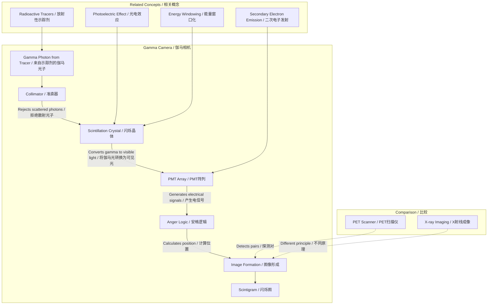

---
# Gamma Cameras / 伽马相机

---

# 1. Overview / 概述

**English:**
A gamma camera is a key imaging device in nuclear medicine, used to detect gamma radiation emitted from a [[Radioactive Tracers and Their Properties|radioactive tracer]] administered to a patient. Unlike a [[PET Scanner Principles|PET scanner]], which detects pairs of annihilation photons, a gamma camera detects single gamma photons emitted directly from a tracer. It produces a 2D planar image (scintigram) showing the distribution of the tracer within the body. This sub-topic covers the core components of a gamma camera—the collimator, scintillation crystal, photomultiplier tubes (PMTs), and the positioning logic—and explains how they work together to form an image. Understanding the gamma camera is essential for comparing it with other modalities in [[Comparing Imaging Modalities (X-ray, CT, Ultrasound, PET, MRI)]].

**中文:**
伽马相机是核医学中的关键成像设备，用于探测注入患者体内的[[Radioactive Tracers and Their Properties|放射性示踪剂]]发出的伽马辐射。与探测湮灭光子对的[[PET Scanner Principles|PET扫描仪]]不同，伽马相机直接探测示踪剂发出的单个伽马光子。它生成一张二维平面图像（闪烁图），显示示踪剂在体内的分布。本子知识点涵盖伽马相机的核心组件——准直器、闪烁晶体、光电倍增管（PMT）和定位逻辑——并解释它们如何协同工作以形成图像。理解伽马相机对于将其与[[Comparing Imaging Modalities (X-ray, CT, Ultrasound, PET, MRI)|其他成像方式]]进行比较至关重要。

---

# 2. Syllabus Learning Objectives / 考纲学习目标

| CAIE 9702 | Edexcel IAL |
|-----------|-------------|
| 26.3(a) Describe the principles of a gamma camera. | 11.13 Understand the principles of a gamma camera. |
| 26.3(b) Explain the function of the collimator. | 11.14 Understand the function of the collimator. |
| 26.3(c) Explain the function of the scintillation crystal. | 11.15 Understand the function of the scintillation crystal. |
| 26.3(d) Explain the function of the photomultiplier tubes (PMTs). | 11.16 Understand the function of the photomultiplier tubes. |
| 26.3(e) Explain how the position of the gamma photon interaction is determined. | 11.17 Understand how the position of the gamma photon interaction is determined. |
| 26.3(f) Explain the formation of the image. | 11.18 Understand the formation of the image. |

**Examiner Expectations / 考官期望:**
- **CAIE:** Students must be able to describe the sequence of events from gamma emission to image formation. They should be able to explain the role of the collimator in rejecting scattered photons and the use of multiple PMTs for position calculation.
- **Edexcel:** Students must understand the principles of each component and how they contribute to image formation. They should be able to explain the concept of "Anger logic" for position determination.

---

# 3. Core Definitions / 核心定义

| Term (EN/CN) | Definition (EN) | Definition (CN) | Common Mistakes / 常见错误 |
|--------------|-----------------|-----------------|---------------------------|
| **Gamma Camera** / 伽马相机 | A medical imaging device that detects gamma radiation from a radioactive tracer to produce a 2D planar image of its distribution in the body. | 一种医学成像设备，通过探测放射性示踪剂发出的伽马辐射，生成其在体内分布的二维平面图像。 | Confusing it with a PET scanner, which detects pairs of annihilation photons. |
| **Collimator** / 准直器 | A lead plate with many parallel holes that only allows gamma photons traveling in a specific direction (perpendicular to the plate) to reach the detector, rejecting scattered photons. | 一块带有许多平行孔的铅板，只允许沿特定方向（垂直于板）传播的伽马光子到达探测器，并拒绝散射光子。 | Thinking the collimator focuses the gamma rays like a lens. |
| **Scintillation Crystal** / 闪烁晶体 | A crystal (e.g., NaI(Tl)) that absorbs gamma photons and emits visible light photons (scintillations) in proportion to the energy of the absorbed gamma photon. | 一种晶体（如NaI(Tl)），吸收伽马光子并发出与吸收的伽马光子能量成正比的可见光光子（闪烁光）。 | Forgetting that the number of visible photons is proportional to the gamma photon's energy. |
| **Photomultiplier Tube (PMT)** / 光电倍增管 | A vacuum tube that converts a weak light signal into a measurable electrical current through the photoelectric effect and secondary electron emission. | 一种真空管，通过光电效应和二次电子发射将微弱的光信号转换为可测量的电流。 | Confusing PMT with a simple photodiode. |
| **Anger Logic** / 安格逻辑 | A method of determining the position of a gamma photon interaction by comparing the signals from an array of PMTs. | 一种通过比较来自PMT阵列的信号来确定伽马光子相互作用位置的方法。 | Thinking that only one PMT fires per event. |
| **Scintigram** / 闪烁图 | The 2D planar image produced by a gamma camera, showing the distribution of the radioactive tracer. | 由伽马相机生成的二维平面图像，显示放射性示踪剂的分布。 | Confusing it with a CT or MRI image. |

---

# 4. Key Concepts Explained / 关键概念详解

## 4.1 The Collimator / 准直器

### Explanation / 解释
**English:** The collimator is a thick lead plate with thousands of parallel holes. It is placed in front of the scintillation crystal. Its purpose is to ensure that only gamma photons traveling in a straight line from the patient, perpendicular to the collimator, reach the crystal. Photons that are scattered (Compton scattering) or that come from an oblique angle are absorbed by the lead walls of the collimator. This is crucial for maintaining spatial resolution—without it, the image would be blurry because the camera would not know where the gamma photon originated.

**中文:** 准直器是一块带有数千个平行孔的厚铅板，放置在闪烁晶体前面。其目的是确保只有从患者体内沿直线传播、垂直于准直器的伽马光子才能到达晶体。被散射（康普顿散射）或来自斜角的光子会被准直器的铅壁吸收。这对于保持空间分辨率至关重要——没有它，图像会模糊，因为相机无法知道伽马光子的来源位置。

### Physical Meaning / 物理意义
**English:** The collimator acts as a spatial filter. It maps a point on the patient to a specific point on the crystal. The trade-off is sensitivity: a collimator with many fine holes gives better resolution but fewer photons reach the crystal, requiring a longer scan time or a higher tracer dose.

**中文:** 准直器充当空间滤波器。它将患者身上的一个点映射到晶体上的一个特定点。其代价是灵敏度：具有许多细孔的准直器分辨率更好，但到达晶体的光子更少，需要更长的扫描时间或更高的示踪剂剂量。

### Common Misconceptions / 常见误区
- **Misconception:** The collimator focuses gamma rays like a lens.
  **Correction:** It does not focus; it only selects photons traveling in a specific direction.
- **Misconception:** The collimator is made of plastic.
  **Correction:** It is made of lead (high atomic number) to absorb gamma rays.

### Exam Tips / 考试提示
- **EN:** Be able to explain why a collimator is needed: to reject scattered photons and to define the direction of the detected photons.
- **CN:** 能够解释为什么需要准直器：拒绝散射光子并定义探测光子的方向。

> 📷 **IMAGE PROMPT — GC-01: Collimator Diagram**
> A cross-section diagram of a lead collimator with parallel holes. Show gamma photons from a point source in the patient traveling straight through the holes to the crystal. Show scattered photons being absorbed by the lead walls. Label: "Collimator (Lead)", "Scintillation Crystal", "Gamma Photons", "Scattered Photon (Absorbed)".

## 4.2 The Scintillation Crystal / 闪烁晶体

### Explanation / 解释
**English:** The scintillation crystal, typically made of sodium iodide doped with thallium (NaI(Tl)), is a material that exhibits scintillation. When a gamma photon enters the crystal, it interacts via the photoelectric effect (or Compton scattering followed by photoelectric absorption). The energy of the gamma photon is transferred to electrons in the crystal, which then de-excite and emit visible light photons. The number of visible photons produced is proportional to the energy of the incident gamma photon. This is a key property: it allows the camera to perform energy discrimination (rejecting photons that have been scattered and lost energy).

**中文:** 闪烁晶体通常由掺铊的碘化钠（NaI(Tl)）制成，是一种表现出闪烁现象的材料。当伽马光子进入晶体时，它通过光电效应（或康普顿散射后光电吸收）相互作用。伽马光子的能量被传递给晶体中的电子，这些电子随后退激并发出可见光光子。产生的可见光光子数量与入射伽马光子的能量成正比。这是一个关键特性：它允许相机进行能量甄别（拒绝那些被散射并损失能量的光子）。

### Physical Meaning / 物理意义
**English:** The crystal converts an invisible, high-energy gamma photon into a burst of visible light that can be detected by PMTs. The proportionality of light output to gamma energy enables energy windowing.

**中文:** 晶体将不可见的高能伽马光子转换为可以被PMT探测到的可见光爆发。光输出与伽马能量的比例关系使得能量窗口化成为可能。

### Common Misconceptions / 常见误区
- **Misconception:** The crystal emits X-rays.
  **Correction:** It emits visible light (scintillations).
- **Misconception:** All crystals work the same way.
  **Correction:** NaI(Tl) is common, but other materials (e.g., BGO, LSO) are used in PET scanners.

### Exam Tips / 考试提示
- **EN:** Remember the key phrase: "proportional to the energy of the gamma photon."
- **CN:** 记住关键短语："与伽马光子的能量成正比。"

## 4.3 Photomultiplier Tubes (PMTs) and Anger Logic / 光电倍增管与安格逻辑

### Explanation / 解释
**English:** An array of PMTs is placed behind the scintillation crystal. Each PMT is a vacuum tube with a photocathode, a series of dynodes, and an anode. When a visible light photon from the crystal strikes the photocathode, it ejects an electron via the photoelectric effect. This electron is accelerated towards the first dynode, where it knocks out multiple secondary electrons. This process is repeated across several dynodes, resulting in a large amplification (gain) of the signal. The output is a measurable current pulse.

The position of the gamma interaction is determined using **Anger logic**. The PMT closest to the scintillation event receives the most light and produces the largest signal. The surrounding PMTs receive less light. A computer calculates the centroid (center of mass) of the light distribution using the signals from all PMTs. This gives the (x, y) coordinates of the event.

**中文:** 一个PMT阵列放置在闪烁晶体后面。每个PMT是一个真空管，包含光电阴极、一系列倍增极和一个阳极。当来自晶体的可见光光子撞击光电阴极时，它通过光电效应发射出一个电子。这个电子被加速到第一个倍增极，在那里它击出多个二次电子。这个过程在几个倍增极上重复，导致信号被大幅放大（增益）。输出是一个可测量的电流脉冲。

伽马相互作用的位置通过**安格逻辑**确定。最接近闪烁事件的PMT接收到最多的光并产生最大的信号。周围的PMT接收到的光较少。计算机使用所有PMT的信号计算光分布的质心（重心）。这给出了事件的 (x, y) 坐标。

### Physical Meaning / 物理意义
**English:** The PMT array acts as a position-sensitive light detector. Anger logic allows the camera to determine where on the crystal the gamma photon hit, which corresponds to a specific location in the patient.

**中文:** PMT阵列充当位置敏感的光探测器。安格逻辑允许相机确定伽马光子击中晶体上的哪个位置，这对应于患者体内的特定位置。

### Common Misconceptions / 常见误区
- **Misconception:** Only one PMT fires per event.
  **Correction:** Multiple PMTs detect the light; the distribution of signals is used for positioning.
- **Misconception:** The PMT amplifies the gamma photon.
  **Correction:** It amplifies the electrical signal from the visible light.

### Exam Tips / 考试提示
- **EN:** Be able to describe the steps: light → photocathode → electron → dynodes → amplified current. Explain Anger logic as a "weighted average" of PMT signals.
- **CN:** 能够描述步骤：光 → 光电阴极 → 电子 → 倍增极 → 放大电流。将安格逻辑解释为PMT信号的"加权平均"。

> 📷 **IMAGE PROMPT — GC-02: PMT Array and Anger Logic**
> A diagram showing a 3x3 array of PMTs behind a scintillation crystal. A scintillation event occurs near the center. Show the light spread as a Gaussian-like distribution. Label the PMT signals: "Large Signal (Center)", "Small Signal (Edge)". Show a formula: x = (Σ S_i * x_i) / Σ S_i.

---

# 5. Essential Equations / 核心公式

## 5.1 Anger Logic Position Calculation / 安格逻辑位置计算

$$ x = \frac{\sum_{i} S_i x_i}{\sum_{i} S_i} $$

$$ y = \frac{\sum_{i} S_i y_i}{\sum_{i} S_i} $$

| Symbol (符号) | Meaning (EN) | Meaning (CN) | Unit (单位) |
|--------------|-------------|-------------|------------|
| $x, y$ | Calculated position of the gamma interaction | 计算出的伽马相互作用位置 | mm or pixels |
| $S_i$ | Signal amplitude from the i-th PMT | 第i个PMT的信号幅度 | V or A |
| $x_i, y_i$ | Coordinates of the i-th PMT | 第i个PMT的坐标 | mm or pixels |

**Derivation / 推导:** This is a weighted average (center of mass) formula. It is not derived from first principles in the syllabus but is used conceptually.

**Conditions / 适用条件:**
- **EN:** Assumes a linear response of PMTs to light intensity. Requires a uniform light spread function.
- **CN:** 假设PMT对光强度有线性响应。需要均匀的光扩散函数。

**Limitations / 局限性:**
- **EN:** Spatial resolution is limited by the size of the PMTs and the statistics of the light distribution.
- **CN:** 空间分辨率受PMT尺寸和光分布统计的限制。

---

# 6. Graphs and Relationships / 图表与关系

## 6.1 Light Distribution from a Scintillation Event / 闪烁事件的光分布

### Axes / 坐标轴
- **X-axis:** Position across the PMT array (mm) / PMT阵列上的位置 (mm)
- **Y-axis:** Light intensity (arbitrary units) / 光强度 (任意单位)

### Shape / 形状
A bell-shaped (Gaussian-like) curve centered on the point of gamma interaction.

### Gradient Meaning / 斜率含义
The gradient indicates how quickly the light intensity falls off with distance from the event. A steeper gradient means better spatial resolution (the PMTs can more precisely locate the event).

### Area Meaning / 面积含义
The total area under the curve is proportional to the total energy of the gamma photon.

### Exam Interpretation / 考试解读
- **EN:** You may be asked to sketch this curve and explain how it is used to determine position.
- **CN:** 你可能会被要求画出这条曲线，并解释它如何用于确定位置。

> 📷 **IMAGE PROMPT — GC-03: Light Distribution Graph**
> A graph showing a Gaussian-like curve. Label the peak as "Scintillation Event Location". Show the width of the curve (FWHM) and label it as "Spatial Resolution".

---

# 7. Required Diagrams / 必备图表

## 7.1 Gamma Camera Block Diagram / 伽马相机框图

### Description / 描述
**English:** A schematic showing the main components of a gamma camera in order: Patient → Collimator → Scintillation Crystal → Light Guide → PMT Array → Position Logic Circuit → Computer → Display.

**中文:** 一个示意图，按顺序显示伽马相机的主要组件：患者 → 准直器 → 闪烁晶体 → 光导 → PMT阵列 → 定位逻辑电路 → 计算机 → 显示器。

### Image Prompt / 图片生成提示
> 📷 **IMAGE PROMPT — GC-04: Gamma Camera Block Diagram**
> A block diagram of a gamma camera. Start with a patient lying on a table. Show a gamma ray (arrow) traveling from the patient through a lead collimator (parallel holes), into a NaI(Tl) crystal (shown as a blue block), then through a light guide (transparent) to an array of PMTs (shown as cylinders). Arrows from the PMTs go to a "Position Logic" box, then to a "Computer", and finally to a "Display" showing a scintigram.

### Labels Required / 需要标注
- Patient / 患者
- Collimator (Lead) / 准直器 (铅)
- Scintillation Crystal (NaI(Tl)) / 闪烁晶体 (NaI(Tl))
- Light Guide / 光导
- Photomultiplier Tubes (PMTs) / 光电倍增管
- Position Logic Circuit / 定位逻辑电路
- Computer / 计算机
- Display (Scintigram) / 显示器 (闪烁图)

### Exam Importance / 考试重要性
- **EN:** This is the most commonly asked diagram. You must be able to label it and explain the function of each part.
- **CN:** 这是最常考的图表。你必须能够标注它并解释每个部分的功能。

## 7.2 Collimator Detail / 准直器细节

### Description / 描述
**English:** A cross-section of the collimator showing parallel holes and the absorption of scattered photons.

**中文:** 准直器的横截面，显示平行孔和散射光子的吸收。

### Image Prompt / 图片生成提示
> 📷 **IMAGE PROMPT — GC-05: Collimator Detail**
> A detailed cross-section of a lead collimator. Show a gamma source (point) in the patient. Draw two straight arrows from the source through two different holes, hitting the crystal. Draw a wavy arrow (scattered photon) hitting the lead wall and being absorbed. Label: "Gamma Source", "Collimator (Lead)", "Hole", "Scintillation Crystal", "Scattered Photon (Absorbed)".

### Labels Required / 需要标注
- Gamma Source / 伽马源
- Collimator (Lead) / 准直器 (铅)
- Hole / 孔
- Scintillation Crystal / 闪烁晶体
- Scattered Photon (Absorbed) / 散射光子 (被吸收)

### Exam Importance / 考试重要性
- **EN:** Explains the principle of spatial resolution.
- **CN:** 解释空间分辨率的原理。

---

# 8. Worked Examples / 典型例题

## Example 1: Gamma Camera Components / 伽马相机组件

### Question / 题目
**English:** A gamma camera uses a collimator, a scintillation crystal, and an array of photomultiplier tubes (PMTs). Explain the function of each component in the formation of a scintigram.

**中文:** 伽马相机使用准直器、闪烁晶体和光电倍增管（PMT）阵列。解释每个组件在形成闪烁图过程中的功能。

### Solution / 解答
1. **Collimator:** The collimator is a lead plate with parallel holes. It ensures that only gamma photons traveling perpendicular to the plate reach the crystal. Scattered photons are absorbed. This maintains spatial resolution.
2. **Scintillation Crystal (NaI(Tl)):** The crystal absorbs the gamma photon and emits a burst of visible light (scintillation). The number of visible photons is proportional to the energy of the gamma photon.
3. **PMT Array:** The PMTs detect the visible light. Each PMT converts the light into an electrical signal and amplifies it. The signals from all PMTs are used by the Anger logic to calculate the (x, y) position of the gamma interaction.
4. **Image Formation:** The computer records the position of each detected gamma photon. Over time, thousands of events are accumulated to form a 2D image (scintigram) showing the distribution of the tracer.

### Final Answer / 最终答案
**Answer:** See solution above. | **答案：** 见上方解答。

### Quick Tip / 提示
- **EN:** Use the acronym "C-S-P" (Collimator, Scintillator, PMT) to remember the order.
- **CN:** 使用首字母缩写 "C-S-P" (准直器, 闪烁体, PMT) 来记住顺序。

## Example 2: Anger Logic Calculation / 安格逻辑计算

### Question / 题目
**English:** A gamma camera has a 2x2 array of PMTs. The PMTs are located at coordinates (0,0), (1,0), (0,1), and (1,1) (in cm). A scintillation event produces signals of 5 V, 3 V, 2 V, and 1 V from the PMTs at (0,0), (1,0), (0,1), and (1,1) respectively. Calculate the (x, y) position of the event.

**中文:** 一个伽马相机有一个2x2的PMT阵列。PMT位于坐标 (0,0), (1,0), (0,1) 和 (1,1)（单位：cm）。一个闪烁事件从位于 (0,0), (1,0), (0,1) 和 (1,1) 的PMT产生信号分别为 5 V, 3 V, 2 V 和 1 V。计算该事件的 (x, y) 位置。

### Solution / 解答
**Step 1: Calculate the total signal.**
$$ S_{total} = 5 + 3 + 2 + 1 = 11 \text{ V} $$

**Step 2: Calculate the x-coordinate.**
$$ x = \frac{(5 \times 0) + (3 \times 1) + (2 \times 0) + (1 \times 1)}{11} = \frac{0 + 3 + 0 + 1}{11} = \frac{4}{11} \approx 0.36 \text{ cm} $$

**Step 3: Calculate the y-coordinate.**
$$ y = \frac{(5 \times 0) + (3 \times 0) + (2 \times 1) + (1 \times 1)}{11} = \frac{0 + 0 + 2 + 1}{11} = \frac{3}{11} \approx 0.27 \text{ cm} $$

### Final Answer / 最终答案
**Answer:** (0.36 cm, 0.27 cm) | **答案：** (0.36 cm, 0.27 cm)

### Quick Tip / 提示
- **EN:** The event is closest to the PMT with the largest signal (0,0).
- **CN:** 该事件最接近信号最大的PMT (0,0)。

---

# 9. Past Paper Question Types / 历年真题题型

| Question Type / 题型 | Frequency / 频率 | Difficulty / 难度 | Past Paper References / 真题索引 |
|----------------------|------------------|------------------|-------------------------------|
| Label a gamma camera diagram | High | Easy | 📝 *待填入* |
| Explain the function of the collimator | High | Medium | 📝 *待填入* |
| Explain Anger logic for position determination | Medium | Hard | 📝 *待填入* |
| Compare gamma camera with PET scanner | Medium | Medium | 📝 *待填入* |
| Calculate position using Anger logic | Low | Medium | 📝 *待填入* |

**Common Command Words / 常见指令词:**
- **Describe / 描述:** Give a detailed account of the components and their functions.
- **Explain / 解释:** Give reasons for why the collimator is needed, how the PMTs work, etc.
- **Calculate / 计算:** Use the Anger logic formula to find the position of an event.

---

# 10. Practical Skills Connections / 实验技能链接

**English:**
- **Measurements:** Understanding the gamma camera involves measuring the energy of gamma photons (energy windowing) and the position of events.
- **Uncertainties:** Spatial resolution is a key uncertainty. It is affected by the collimator design (hole size, length) and the PMT array.
- **Graph Plotting:** The light distribution from a scintillation event can be plotted to determine the FWHM (full width at half maximum), which is a measure of spatial resolution.
- **Experimental Design:** In a lab, you might use a gamma camera to image a point source and measure its apparent size to determine the resolution. You could also investigate the effect of collimator type on image quality.

**中文:**
- **测量:** 理解伽马相机涉及测量伽马光子的能量（能量窗口化）和事件的位置。
- **不确定度:** 空间分辨率是一个关键的不确定度。它受准直器设计（孔径、长度）和PMT阵列的影响。
- **图表绘制:** 可以绘制闪烁事件的光分布以确定半高宽（FWHM），这是空间分辨率的度量。
- **实验设计:** 在实验室中，你可以使用伽马相机对点源成像并测量其表观尺寸以确定分辨率。你也可以研究准直器类型对图像质量的影响。

---

# 11. Concept Map / 概念图谱

---

# 12. Quick Revision Sheet / 速查表

| Category / 类别 | Key Points / 要点 |
|----------------|------------------|
| **Definition / 定义** | A device that detects single gamma photons from a tracer to form a 2D image. / 一种从示踪剂探测单个伽马光子以形成二维图像的设备。 |
| **Key Components / 核心组件** | Collimator (lead, parallel holes) → Scintillation Crystal (NaI(Tl)) → PMT Array → Anger Logic. / 准直器（铅，平行孔）→ 闪烁晶体（NaI(Tl)）→ PMT阵列 → 安格逻辑。 |
| **Collimator Function / 准直器功能** | Rejects scattered photons; defines direction. / 拒绝散射光子；定义方向。 |
| **Crystal Function / 晶体功能** | Converts gamma to visible light; light output ∝ gamma energy. / 将伽马光转换为可见光；光输出 ∝ 伽马能量。 |
| **PMT Function / PMT功能** | Converts light to electrical signal; amplifies signal. / 将光转换为电信号；放大信号。 |
| **Position Determination / 位置确定** | Anger logic: weighted average of PMT signals. / 安格逻辑：PMT信号的加权平均。 |
| **Key Formula / 核心公式** | $x = \frac{\sum S_i x_i}{\sum S_i}$, $y = \frac{\sum S_i y_i}{\sum S_i}$ |
| **Key Graph / 核心图表** | Light distribution (Gaussian) from a scintillation event. / 闪烁事件的光分布（高斯分布）。 |
| **Exam Tip / 考试提示** | Always start with the collimator and end with the image. Know the order of components. / 始终从准直器开始，以图像结束。知道组件的顺序。 |