# 1. Overview / 概述

**English:**
PET (Positron Emission Tomography) scanner principles form the foundation of one of the most advanced nuclear medicine imaging techniques. This sub-topic explains how PET scanners detect the gamma photons produced during [[Positron Emission and Annihilation]] to create three-dimensional images of metabolic activity within the body. Unlike anatomical imaging (X-ray, CT), PET reveals physiological function at the cellular level.

The PET scanner operates on the principle of coincidence detection — simultaneously detecting pairs of 511 keV gamma photons emitted at 180° to each other following positron-electron annihilation. This allows precise localization of the [[Radioactive Tracers and Their Properties]] injected into the patient. Understanding these principles is essential for comparing PET with [[Gamma Cameras]] and other [[Comparing Imaging Modalities (X-ray, CT, Ultrasound, PET, MRI)]].

The core physics involves [[Radioactive Decay]] of positron-emitting isotopes, conservation of energy and momentum during annihilation, and the electronic circuitry required for coincidence timing. This sub-topic bridges [[Fundamental Particles]] physics with practical medical diagnostics.

**中文:**
PET（正电子发射断层扫描）扫描仪原理构成了最先进的核医学成像技术之一的基础。本子知识点解释PET扫描仪如何检测[[正电子发射与湮灭]]过程中产生的伽马光子，从而创建体内代谢活动的三维图像。与解剖成像（X射线、CT）不同，PET在细胞水平上揭示生理功能。

PET扫描仪基于符合探测原理工作——同时检测正电子-电子湮灭后以180°角发射的511 keV伽马光子对。这使得能够精确定位注入患者体内的[[放射性示踪剂及其特性]]。理解这些原理对于将PET与[[伽马相机]]及其他[[成像模态比较（X射线、CT、超声、PET、MRI）]]进行比较至关重要。

核心物理原理涉及正电子发射同位素的[[放射性衰变]]、湮灭过程中的能量和动量守恒，以及符合定时所需的电子电路。本子知识点将[[基本粒子]]物理学与实用医学诊断联系起来。

---

# 2. Syllabus Learning Objectives / 考纲学习目标

| CAIE 9702 (26.3 a-f) | Edexcel IAL (WPH14 U4: 11.13-11.18) |
|----------------------|--------------------------------------|
| Describe the principles of PET scanning | Understand the principles of PET scanning |
| Explain the production of positron-emitting isotopes | Explain the production and properties of positron-emitting isotopes |
| Describe positron annihilation and gamma photon production | Describe positron-electron annihilation and 511 keV photon production |
| Explain coincidence detection | Explain coincidence detection and timing |
| Describe the role of the ring of detectors | Describe the arrangement of detectors in a PET scanner |
| Explain how images are formed from coincidence data | Understand image reconstruction from coincidence events |

**Examiner Expectations / 考官期望:**
- **English:** Students must be able to explain the complete chain from isotope production to image formation. Key points include: positron emission, annihilation producing two 511 keV photons at 180°, simultaneous detection by opposing detectors, and rejection of scattered photons through energy discrimination. The 10 ns coincidence timing window is a critical detail. Students should understand why PET provides better spatial resolution than [[Gamma Cameras]].
- **中文:** 学生必须能够解释从同位素生产到图像形成的完整链条。关键点包括：正电子发射、湮灭产生两个180°方向的511 keV光子、对向探测器同时探测、以及通过能量甄别排除散射光子。10 ns符合时间窗口是关键细节。学生应理解为什么PET比[[伽马相机]]提供更好的空间分辨率。

---

# 3. Core Definitions / 核心定义

| Term (EN/CN) | Definition (EN) | Definition (CN) | Common Mistakes / 常见错误 |
|--------------|-----------------|-----------------|---------------------------|
| **Positron Emission** / 正电子发射 | The radioactive decay process where a proton in an unstable nucleus transforms into a neutron, emitting a positron (β⁺) and an electron neutrino | 不稳定原子核中的质子转变为中子，发射正电子（β⁺）和电子中微子的放射性衰变过程 | Confusing with β⁻ decay; forgetting the neutrino |
| **Annihilation** / 湮灭 | The process where a positron and an electron meet, mutually annihilate, and their rest mass energy is converted into two 511 keV gamma photons emitted in opposite directions | 正电子与电子相遇，相互湮灭，其静止质量能转化为两个沿相反方向发射的511 keV伽马光子的过程 | Thinking annihilation produces a single photon (violates momentum conservation) |
| **Coincidence Detection** / 符合探测 | The simultaneous detection of two 511 keV gamma photons within a timing window (typically ~10 ns), indicating they originated from the same annihilation event | 在时间窗口内（通常约10 ns）同时探测两个511 keV伽马光子，表明它们来自同一次湮灭事件 | Forgetting the timing window; thinking any two detections count |
| **Line of Response (LOR)** / 响应线 | The straight line connecting two detectors that register a coincidence event, along which the annihilation must have occurred | 连接记录符合事件的两个探测器的直线，湮灭事件必定发生在这条线上 | Confusing LOR with the actual position of annihilation |
| **Time-of-Flight (TOF) PET** / 飞行时间PET | An advanced PET technique that measures the small time difference between photon arrivals to better localize the annihilation event along the LOR | 一种先进的PET技术，测量光子到达的微小时间差，以更好地沿LOR定位湮灭事件 | Not required at A-Level but useful context |
| **511 keV** / 511千电子伏 | The energy of each gamma photon produced during positron-electron annihilation, equal to the rest mass energy of an electron (or positron) | 正电子-电子湮灭过程中产生的每个伽马光子的能量，等于电子（或正电子）的静止质量能 | Forgetting this is exactly the rest mass energy of an electron |

---

# 4. Key Concepts Explained / 关键概念详解

## 4.1 Positron Emission and Annihilation / 正电子发射与湮灭

### Explanation / 解释
**English:** A positron-emitting isotope (e.g., ¹⁸F, ¹¹C, ¹³N, ¹⁵O) undergoes β⁺ decay. A proton in the nucleus converts to a neutron, emitting a positron (e⁺) and an electron neutrino (νₑ). The positron travels a short distance (typically 0.5-2 mm in tissue) before encountering an electron. When the positron and electron meet, they annihilate. Their combined rest mass energy (2 × 9.11 × 10⁻³¹ kg × c²) is converted into two gamma photons, each with energy 511 keV. Conservation of momentum requires these photons to be emitted at exactly 180° to each other in the center-of-mass frame.

**中文:** 正电子发射同位素（如¹⁸F、¹¹C、¹³N、¹⁵O）发生β⁺衰变。原子核中的质子转变为中子，发射正电子（e⁺）和电子中微子（νₑ）。正电子在遇到电子前会行进一小段距离（组织中通常为0.5-2 mm）。当正电子与电子相遇时，它们发生湮灭。它们的总静止质量能（2 × 9.11 × 10⁻³¹ kg × c²）转化为两个伽马光子，每个能量为511 keV。动量守恒要求这些光子在质心系中恰好以180°角发射。

### Physical Meaning / 物理意义
**English:** The 180° emission is critical — it defines the Line of Response (LOR) along which the annihilation occurred. Without this property, PET would not be possible. The 511 keV energy is significant because it is high enough to penetrate tissue but low enough to be efficiently detected by scintillation crystals.

**中文:** 180°发射至关重要——它定义了湮灭发生的响应线（LOR）。没有这一特性，PET就不可能实现。511 keV能量很重要，因为它足够高以穿透组织，但又足够低以被闪烁晶体有效探测。

### Common Misconceptions / 常见误区
- **English:** 
  - Thinking annihilation produces a single photon (this would violate momentum conservation)
  - Believing the positron annihilates immediately upon emission (it travels a short distance first)
  - Confusing 511 keV with the total energy released (total is 1.022 MeV, split between two photons)
- **中文:**
  - 认为湮灭产生单个光子（这会违反动量守恒）
  - 认为正电子发射后立即湮灭（它先行进一小段距离）
  - 混淆511 keV与总释放能量（总能量为1.022 MeV，在两个光子之间分配）

### Exam Tips / 考试提示
- **English:** Always state that the two gamma photons have energy 511 keV EACH and are emitted in OPPOSITE directions. Show the calculation: E = mₑc² = (9.11×10⁻³¹)(3×10⁸)² = 8.2×10⁻¹⁴ J = 511 keV. Remember that the positron travels a small distance before annihilation — this limits the spatial resolution of PET.
- **中文:** 始终说明两个伽马光子各具有511 keV能量，并沿相反方向发射。展示计算过程：E = mₑc² = (9.11×10⁻³¹)(3×10⁸)² = 8.2×10⁻¹⁴ J = 511 keV。记住正电子在湮灭前会行进一小段距离——这限制了PET的空间分辨率。

> 📷 **IMAGE PROMPT — ANNIHILATION: Positron-Electron Annihilation Diagram**
> A clear physics diagram showing: (1) A nucleus undergoing β⁺ decay, emitting a positron (e⁺) and neutrino (νₑ), (2) The positron traveling through tissue, (3) The positron meeting an electron (e⁻), (4) Annihilation producing two 511 keV gamma photons (γ) at 180° to each other. Labels: "β⁺ decay", "Positron range ~1 mm", "Annihilation", "511 keV γ", "180° emission". Clean, educational style with color coding: red for positron, blue for electron, yellow for gamma photons.

## 4.2 Coincidence Detection / 符合探测

### Explanation / 解释
**English:** A PET scanner consists of a ring of scintillation detectors surrounding the patient. When two detectors register gamma photons within a very short timing window (typically 10 nanoseconds or less), this is recorded as a "coincidence event." The electronics determine which pair of detectors fired simultaneously, establishing a Line of Response (LOR). The number of coincidence events along each LOR is used to reconstruct the image.

There are three types of coincidence events:
1. **True coincidence** — both photons from the same annihilation, neither scattered
2. **Scattered coincidence** — one or both photons have been Compton scattered, giving incorrect LOR
3. **Random coincidence** — two photons from different annihilation events detected simultaneously by chance

**中文:** PET扫描仪由环绕患者的闪烁探测器环组成。当两个探测器在非常短的时间窗口内（通常10纳秒或更短）记录到伽马光子时，这被记录为"符合事件"。电子电路确定哪对探测器同时触发，建立一条响应线（LOR）。沿每条LOR的符合事件数量用于重建图像。

有三种类型的符合事件：
1. **真符合** — 两个光子来自同一次湮灭，均未散射
2. **散射符合** — 一个或两个光子发生了康普顿散射，给出错误的LOR
3. **随机符合** — 来自不同湮灭事件的两个光子偶然同时被探测到

### Physical Meaning / 物理意义
**English:** Coincidence detection is what gives PET its unique ability to localize events. The timing window must be short enough to reject random coincidences but long enough to capture true coincidences. Energy discrimination (accepting only photons near 511 keV) helps reject scattered photons.

**中文:** 符合探测赋予了PET定位事件的独特能力。时间窗口必须足够短以排除随机符合，但又足够长以捕获真符合。能量甄别（仅接受接近511 keV的光子）有助于排除散射光子。

### Common Misconceptions / 常见误区
- **English:**
  - Thinking the scanner detects the positron directly (it detects the annihilation photons)
  - Believing all coincidence events are true coincidences (scattered and random coincidences degrade image quality)
  - Forgetting that the timing window is critical for rejecting random coincidences
- **中文:**
  - 认为扫描仪直接探测正电子（它探测湮灭光子）
  - 认为所有符合事件都是真符合（散射和随机符合会降低图像质量）
  - 忘记时间窗口对于排除随机符合至关重要

### Exam Tips / 考试提示
- **English:** Explain that the timing window (~10 ns) is chosen based on the speed of light and the diameter of the detector ring. A photon travels ~3 m in 10 ns, so the window must account for the maximum possible time difference between photon arrivals. Mention that scattered photons have lower energy and can be rejected by energy discrimination.
- **中文:** 解释时间窗口（约10 ns）是根据光速和探测器环直径选择的。光子10 ns内行进约3 m，因此窗口必须考虑光子到达的最大可能时间差。提及散射光子能量较低，可通过能量甄别排除。

> 📷 **IMAGE PROMPT — COINCIDENCE: Coincidence Detection Types in PET**
> A diagram showing three scenarios: (1) TRUE coincidence: two 511 keV photons from annihilation detected simultaneously by opposing detectors, with LOR shown as a straight line through the annihilation point. (2) SCATTERED coincidence: one photon Compton scatters before detection, giving incorrect LOR. (3) RANDOM coincidence: two photons from different annihilation events detected within the timing window. Color coding: green for true, red for scattered, orange for random. Labels: "True coincidence", "Scattered coincidence", "Random coincidence", "LOR", "Timing window ~10 ns".

## 4.3 Detector Ring and Image Reconstruction / 探测器环与图像重建

### Explanation / 解释
**English:** The PET scanner uses a full ring (or multiple rings) of scintillation detectors. Each detector is typically a bismuth germanate (BGO) or lutetium oxyorthosilicate (LSO) crystal coupled to a photomultiplier tube (PMT). When a gamma photon interacts with the crystal, it produces scintillation light, which the PMT converts to an electrical signal.

The ring geometry means that many LORs pass through each point in the patient. By collecting millions of coincidence events, the scanner builds up a set of projections. Computer algorithms (typically filtered back-projection or iterative reconstruction) use these projections to create a 3D image showing the distribution of the radioactive tracer.

**中文:** PET扫描仪使用完整的探测器环（或多个环）。每个探测器通常是锗酸铋（BGO）或硅酸镥（LSO）晶体耦合到光电倍增管（PMT）。当伽马光子与晶体相互作用时，产生闪烁光，PMT将其转换为电信号。

环形几何结构意味着许多LOR穿过患者体内的每个点。通过收集数百万个符合事件，扫描仪建立一组投影。计算机算法（通常是滤波反投影或迭代重建）使用这些投影创建显示放射性示踪剂分布的3D图像。

### Physical Meaning / 物理意义
**English:** The ring design maximizes sensitivity — detectors at all angles simultaneously record coincidence events. The number of detectors determines the angular sampling and spatial resolution. Modern PET scanners have thousands of individual detector elements.

**中文:** 环形设计最大化灵敏度——所有角度的探测器同时记录符合事件。探测器的数量决定了角度采样和空间分辨率。现代PET扫描仪有数千个独立的探测器元件。

### Common Misconceptions / 常见误区
- **English:**
  - Thinking the scanner creates an image directly (it requires computer reconstruction)
  - Believing a single coincidence event can locate the annihilation (many events along many LORs are needed)
  - Confusing PET reconstruction with CT reconstruction (PET uses coincidence data, CT uses attenuation data)
- **中文:**
  - 认为扫描仪直接创建图像（需要计算机重建）
  - 认为单个符合事件就能定位湮灭（需要沿许多LOR的许多事件）
  - 混淆PET重建与CT重建（PET使用符合数据，CT使用衰减数据）

### Exam Tips / 考试提示
- **English:** Emphasize that the ring of detectors allows simultaneous detection from all angles, making PET much faster than [[Gamma Cameras]] which must rotate. Mention that PET/CT scanners combine anatomical (CT) and functional (PET) imaging in a single session.
- **中文:** 强调探测器环允许从所有角度同时探测，使PET比需要旋转的[[伽马相机]]快得多。提及PET/CT扫描仪在单次扫描中结合了解剖（CT）和功能（PET）成像。

> 📷 **IMAGE PROMPT — DETECTOR_RING: PET Scanner Detector Ring**
> Cross-sectional diagram of a PET scanner showing: (1) A circular ring of many small detector blocks around a patient, (2) Each detector block showing a scintillation crystal (BGO/LSO) coupled to a photomultiplier tube, (3) Multiple LORs (dashed lines) crossing through the patient, (4) A single annihilation event in the center producing two 511 keV photons detected by opposing detectors, (5) The electronics module recording the coincidence. Labels: "Detector ring", "Scintillation crystal", "PMT", "LOR", "Annihilation event", "Coincidence processing unit". Educational style with clear labeling.

---

# 5. Essential Equations / 核心公式

## 5.1 Annihilation Energy / 湮灭能量

$$ E = m_e c^2 = (9.11 \times 10^{-31})(3.00 \times 10^8)^2 = 8.20 \times 10^{-14} \text{ J} = 511 \text{ keV} $$

| Symbol (符号) | Meaning (EN) | Meaning (CN) | Unit (单位) |
|--------------|-------------|-------------|------------|
| $E$ | Energy of each gamma photon | 每个伽马光子的能量 | J or eV |
| $m_e$ | Rest mass of electron (or positron) | 电子（或正电子）静止质量 | kg |
| $c$ | Speed of light in vacuum | 真空中的光速 | m s⁻¹ |

**Derivation / 推导:** The total rest mass energy of the electron-positron pair is $2m_e c^2$. By conservation of energy and momentum, this is shared equally between two photons emitted in opposite directions. Each photon has energy $m_e c^2$.

**Conditions / 适用条件:** Valid for annihilation at rest (or very low relative velocity). In the center-of-mass frame, photons are exactly 180° apart.

**Limitations / 局限性:** The positron has some kinetic energy when emitted, so the photons may have slightly different energies and not be exactly 180° apart in the lab frame. This is a small effect (~1° deviation).

## 5.2 Coincidence Timing / 符合定时

$$ \Delta t = \frac{D}{c} $$

| Symbol (符号) | Meaning (EN) | Meaning (CN) | Unit (单位) |
|--------------|-------------|-------------|------------|
| $\Delta t$ | Maximum time difference between photon arrivals | 光子到达的最大时间差 | s |
| $D$ | Diameter of detector ring | 探测器环直径 | m |
| $c$ | Speed of light | 光速 | m s⁻¹ |

**Derivation / 推导:** For an annihilation at the center of the ring, both photons arrive simultaneously. For an annihilation at the edge, one photon travels to the near detector and the other to the far detector, giving a time difference of $D/c$.

**Conditions / 适用条件:** Assumes annihilation occurs within the detector ring. The timing window must be set to at least this value to capture all true coincidences.

**Limitations / 局限性:** In practice, the timing window is set slightly larger to account for detector response time and electronic jitter.

## 5.3 Spatial Resolution Limit / 空间分辨率极限

$$ R \approx \frac{d}{2} + r_{\text{positron}} $$

| Symbol (符号) | Meaning (EN) | Meaning (CN) | Unit (单位) |
|--------------|-------------|-------------|------------|
| $R$ | Spatial resolution (FWHM) | 空间分辨率（半高宽） | mm |
| $d$ | Detector width | 探测器宽度 | mm |
| $r_{\text{positron}}$ | Average positron range before annihilation | 湮灭前正电子平均射程 | mm |

**Derivation / 推导:** The detector width limits the precision of LOR localization. The positron range adds uncertainty because annihilation occurs some distance from the decay site.

**Conditions / 适用条件:** This is a simplified model. Actual resolution depends on many factors including detector design, reconstruction algorithm, and patient motion.

**Limitations / 局限性:** Does not account for non-collinearity (photons not exactly 180° apart) or detector penetration effects.

> 📷 **IMAGE PROMPT — FORMULA: Annihilation Energy Diagram**
> A visual showing: (1) An electron (e⁻) and positron (e⁺) approaching each other, (2) The annihilation point with energy conversion, (3) Two gamma photons (γ) flying apart at 180°, each labeled "511 keV", (4) The equation E = mₑc² displayed prominently. Color coding: blue for electron, red for positron, yellow for gamma photons. Clean educational style.

---

# 6. Graphs and Relationships / 图表与关系

## 6.1 Coincidence Count Rate vs. Activity / 符合计数率与活度关系

### Axes / 坐标轴
- **X-axis:** Activity of radioactive tracer (MBq) / 放射性示踪剂活度（MBq）
- **Y-axis:** Coincidence count rate (counts/s) / 符合计数率（计数/秒）

### Shape / 形状
**English:** Initially linear at low activities (true coincidences dominate). At high activities, the curve deviates from linearity and may even decrease due to dead-time effects and increased random coincidences.

**中文:** 低活度时初始为线性（真符合占主导）。高活度时，曲线偏离线性，甚至可能因死时间效应和随机符合增加而下降。

### Gradient Meaning / 斜率含义
**English:** The initial gradient represents the scanner's sensitivity (counts per unit activity). The deviation from linearity indicates the onset of random coincidence dominance.

**中文:** 初始斜率代表扫描仪的灵敏度（单位活度的计数）。偏离线性表示随机符合开始占主导。

### Area Meaning / 面积含义
**English:** Not applicable for this graph. The total number of counts over time gives the image statistics.

**中文:** 不适用于此图。随时间变化的总计数给出图像统计信息。

### Exam Interpretation / 考试解读
**English:** Students should understand that there is an optimal activity range for PET imaging. Too low → poor statistics, long scan time. Too high → random coincidences degrade image quality. The "noise equivalent count rate" (NECR) curve shows the true coincidence rate after correcting for randoms and scatter.

**中文:** 学生应理解PET成像存在最佳活度范围。太低→统计性差，扫描时间长。太高→随机符合降低图像质量。"噪声等效计数率"（NECR）曲线显示校正随机和散射后的真符合率。

> 📷 **IMAGE PROMPT — GRAPH: Coincidence Count Rate vs Activity**
> A graph showing: (1) X-axis: "Activity (MBq)" from 0 to 500, (2) Y-axis: "Coincidence Count Rate (counts/s)" from 0 to 10⁶, (3) Three curves: "True coincidences" (linear at low activity, saturating), "Random coincidences" (quadratic, increasing at high activity), "Total coincidences" (sum of true + random, showing peak then decrease), (4) Labels: "Optimal activity range" marked with a shaded region. Clean scientific graph style.

## 6.2 Energy Spectrum of Detected Photons / 探测光子能谱

### Axes / 坐标轴
- **X-axis:** Energy (keV) / 能量（千电子伏）
- **Y-axis:** Number of counts / 计数

### Shape / 形状
**English:** A photopeak at 511 keV from unscattered photons. A Compton continuum at lower energies from scattered photons. An energy window (typically 450-650 keV) is set to accept photopeak events and reject scattered photons.

**中文:** 未散射光子在511 keV处有光电峰。散射光子在较低能量处有康普顿连续谱。设置能量窗口（通常450-650 keV）以接受光电峰事件并排除散射光子。

### Gradient Meaning / 斜率含义
**English:** The width of the photopeak indicates the energy resolution of the detector. Narrower peaks → better energy discrimination → better scatter rejection.

**中文:** 光电峰的宽度表示探测器的能量分辨率。峰越窄→能量甄别越好→散射排除越好。

### Area Meaning / 面积含义
**English:** The area under the photopeak represents the number of unscattered photons detected. The area under the Compton continuum represents scattered photons.

**中文:** 光电峰下的面积表示探测到的未散射光子数。康普顿连续谱下的面积表示散射光子数。

### Exam Interpretation / 考试解读
**English:** Students should explain that energy discrimination is essential for rejecting scattered photons, which would give incorrect LORs and degrade image quality. The energy window is a compromise between sensitivity (wider window accepts more true events) and image quality (narrower window rejects more scatter).

**中文:** 学生应解释能量甄别对于排除散射光子至关重要，散射光子会给出错误的LOR并降低图像质量。能量窗口是灵敏度（更宽窗口接受更多真事件）和图像质量（更窄窗口排除更多散射）之间的折衷。

> 📷 **IMAGE PROMPT — SPECTRUM: PET Energy Spectrum**
> A graph showing: (1) X-axis: "Energy (keV)" from 0 to 700, (2) Y-axis: "Counts", (3) A sharp photopeak at 511 keV, (4) A Compton continuum from ~200-500 keV, (5) A shaded region labeled "Energy window (450-650 keV)" covering the photopeak, (6) Labels: "Photopeak (511 keV)", "Compton continuum", "Scattered photons rejected", "Energy window". Clean scientific graph style.

---

# 7. Required Diagrams / 必备图表

## 7.1 PET Scanner Cross-Section / PET扫描仪横截面

### Description / 描述
**English:** A cross-sectional view of a PET scanner showing the patient lying inside the detector ring. The diagram should illustrate: the ring of scintillation detectors, a positron-emitting tracer localized in a tumor, the annihilation event, the two 511 keV gamma photons traveling in opposite directions, and the coincidence detection by opposing detectors.

**中文:** PET扫描仪的横截面视图，显示患者躺在探测器环内。该图应说明：闪烁探测器环、定位在肿瘤中的正电子发射示踪剂、湮灭事件、两个沿相反方向行进的511 keV伽马光子，以及对向探测器的符合探测。

### Image Prompt / 图片生成提示
> 📷 **IMAGE PROMPT — PET_CROSS: PET Scanner Cross-Section Diagram**
> A detailed cross-sectional diagram of a PET scanner showing: (1) A circular ring of many small detector blocks (scintillation crystal + PMT) surrounding a patient, (2) The patient's body with a labeled tumor region containing positron-emitting tracer molecules, (3) A zoomed view showing a single annihilation event: a positron (e⁺) from a decaying nucleus meeting an electron (e⁻), producing two 511 keV gamma photons (γ) at 180°, (4) The two photons traveling to opposite detectors in the ring, (5) The coincidence electronics module showing a "Coincidence!" signal, (6) A dashed line (LOR) connecting the two triggered detectors through the annihilation point. Labels: "Detector ring", "Scintillation crystal", "PMT", "511 keV γ", "Annihilation", "LOR", "Coincidence processing", "Tumor with tracer". Color coding: detectors in blue/gray, gamma photons in yellow, LOR in green dashed line, tumor in red. Educational style with clear labeling and arrows showing photon paths.

### Labels Required / 需要标注
- Detector ring / 探测器环
- Scintillation crystal (BGO/LSO) / 闪烁晶体（BGO/LSO）
- Photomultiplier tube (PMT) / 光电倍增管（PMT）
- 511 keV gamma photon / 511 keV伽马光子
- Annihilation event / 湮灭事件
- Line of Response (LOR) / 响应线（LOR）
- Coincidence processing unit / 符合处理单元
- Patient / 患者
- Tumor with radioactive tracer / 含放射性示踪剂的肿瘤

### Exam Importance / 考试重要性
**English:** This is the most important diagram for PET scanner principles. Students should be able to draw and label it from memory. Key points: the ring geometry, the 180° photon emission, and the coincidence detection forming the LOR.

**中文:** 这是PET扫描仪原理最重要的图表。学生应能凭记忆绘制并标注。关键点：环形几何结构、180°光子发射、以及形成LOR的符合探测。

## 7.2 Coincidence Event Types / 符合事件类型

### Description / 描述
**English:** A diagram showing the three types of coincidence events in PET: true coincidence, scattered coincidence, and random coincidence. Each type should show the annihilation event(s), the photon paths, and the resulting LOR.

**中文:** 显示PET中三种符合事件类型的图表：真符合、散射符合和随机符合。每种类型应显示湮灭事件、光子路径和产生的LOR。

### Image Prompt / 图片生成提示
> 📷 **IMAGE PROMPT — COINCIDENCE_TYPES: Three Types of PET Coincidence Events**
> A three-panel diagram showing: (1) TRUE COINCIDENCE (left panel): A single annihilation event in the center, two 511 keV photons traveling straight to opposing detectors, a straight LOR connecting the detectors through the annihilation point. Green checkmark. (2) SCATTERED COINCIDENCE (middle panel): A single annihilation event, one photon travels straight to a detector, the other photon Compton scatters off tissue and changes direction before reaching a different detector, the LOR (red dashed) does not pass through the actual annihilation point. Red X. (3) RANDOM COINCIDENCE (right panel): Two separate annihilation events at different locations, one photon from each event reaches opposing detectors within the timing window, the LOR (orange dashed) does not correspond to either annihilation. Orange warning symbol. Labels: "True coincidence ✓", "Scattered coincidence ✗", "Random coincidence ⚠", "511 keV γ", "Compton scatter", "LOR", "Timing window ~10 ns". Color coding: green for true, red for scattered, orange for random. Educational style.

### Labels Required / 需要标注
- True coincidence / 真符合
- Scattered coincidence / 散射符合
- Random coincidence / 随机符合
- 511 keV gamma photon / 511 keV伽马光子
- Compton scattering / 康普顿散射
- Line of Response (LOR) / 响应线（LOR）
- Timing window / 时间窗口
- Detector / 探测器

### Exam Importance / 考试重要性
**English:** Students must understand the difference between these three types and why scattered and random coincidences degrade image quality. This is a common exam question topic.

**中文:** 学生必须理解这三种类型之间的区别，以及为什么散射和随机符合会降低图像质量。这是常见的考试题目主题。

---

# 8. Worked Examples / 典型例题

## Example 1: Annihilation Energy Calculation / 例1：湮灭能量计算

### Question / 题目
**English:**
A positron and an electron annihilate at rest. Calculate:
(a) The total energy released in the annihilation.
(b) The energy of each gamma photon produced.
(c) The wavelength of each gamma photon.

(Given: electron rest mass $m_e = 9.11 \times 10^{-31}$ kg, Planck constant $h = 6.63 \times 10^{-34}$ J s, speed of light $c = 3.00 \times 10^8$ m s⁻¹, 1 eV = $1.60 \times 10^{-19}$ J)

**中文:**
一个正电子和一个电子在静止状态下湮灭。计算：
(a) 湮灭释放的总能量。
(b) 产生的每个伽马光子的能量。
(c) 每个伽马光子的波长。

（已知：电子静止质量 $m_e = 9.11 \times 10^{-31}$ kg，普朗克常数 $h = 6.63 \times 10^{-34}$ J·s，光速 $c = 3.00 \times 10^8$ m·s⁻¹，1 eV = $1.60 \times 10^{-19}$ J）

### Solution / 解答

**Step 1: Total energy released / 步骤1：总释放能量**

The total rest mass energy of the electron-positron pair is:
$$E_{\text{total}} = 2m_e c^2 = 2 \times (9.11 \times 10^{-31}) \times (3.00 \times 10^8)^2$$

$$E_{\text{total}} = 2 \times 9.11 \times 10^{-31} \times 9.00 \times 10^{16}$$

$$E_{\text{total}} = 1.64 \times 10^{-13} \text{ J}$$

Converting to eV:
$$E_{\text{total}} = \frac{1.64 \times 10^{-13}}{1.60 \times 10^{-19}} = 1.02 \times 10^6 \text{ eV} = 1.02 \text{ MeV}$$

**Step 2: Energy per photon / 步骤2：每个光子的能量**

By conservation of momentum, the two photons share the energy equally:
$$E_{\text{photon}} = \frac{E_{\text{total}}}{2} = \frac{1.64 \times 10^{-13}}{2} = 8.20 \times 10^{-14} \text{ J}$$

$$E_{\text{photon}} = \frac{8.20 \times 10^{-14}}{1.60 \times 10^{-19}} = 5.11 \times 10^5 \text{ eV} = 511 \text{ keV}$$

**Step 3: Wavelength / 步骤3：波长**

Using $E = \frac{hc}{\lambda}$:
$$\lambda = \frac{hc}{E} = \frac{(6.63 \times 10^{-34})(3.00 \times 10^8)}{8.20 \times 10^{-14}}$$

$$\lambda = \frac{1.99 \times 10^{-25}}{8.20 \times 10^{-14}} = 2.43 \times 10^{-12} \text{ m}$$

$$\lambda = 2.43 \text{ pm}$$

### Final Answer / 最终答案
**Answer:**
(a) Total energy = $1.64 \times 10^{-13}$ J = 1.02 MeV
(b) Energy per photon = $8.20 \times 10^{-14}$ J = 511 keV
(c) Wavelength = $2.43 \times 10^{-12}$ m = 2.43 pm

**答案：**
(a) 总能量 = $1.64 \times 10^{-13}$ J = 1.02 MeV
(b) 每个光子能量 = $8.20 \times 10^{-14}$ J = 511 keV
(c) 波长 = $2.43 \times 10^{-12}$ m = 2.43 pm

### Quick Tip / 提示
**English:** Remember that the 511 keV value is a standard result that you can quote directly in exams. The wavelength (2.43 pm) is in the gamma ray region of the electromagnetic spectrum. This is why PET uses gamma photons, not X-rays.

**中文:** 记住511 keV是一个标准结果，你可以在考试中直接引用。波长（2.43 pm）在电磁波谱的伽马射线区域。这就是PET使用伽马光子而非X射线的原��。

---

## Example 2: Coincidence Timing / 例2：符合定时

### Question / 题目
**English:**
A PET scanner has a detector ring with diameter 80 cm.
(a) Calculate the maximum time difference between the arrival of two annihilation photons at the detectors.
(b) Explain why the timing window is typically set to approximately 10 ns rather than the calculated value.
(c) If the timing window were increased to 20 ns, explain the effect on image quality.

**中文:**
一个PET扫描仪的探测器环直径为80 cm。
(a) 计算两个湮灭光子到达探测器的最大时间差。
(b) 解释为什么时间窗口通常设置为约10 ns而不是计算值。
(c) 如果时间窗口增加到20 ns，解释对图像质量的影响。

### Solution / 解答

**Step 1: Maximum time difference / 步骤1：最大时间差**

For an annihilation at the edge of the field of view, one photon travels to the nearest detector and the other to the farthest detector. The maximum path difference is approximately the ring diameter.

$$\Delta t = \frac{D}{c} = \frac{0.80}{3.00 \times 10^8} = 2.67 \times 10^{-9} \text{ s} = 2.67 \text{ ns}$$

**Step 2: Why 10 ns window? / 步骤2：为什么是10 ns窗口？**

The calculated value (2.67 ns) is the minimum timing window needed to capture all true coincidences based on photon travel time alone. In practice, the window is set larger (~10 ns) to account for:
- The finite response time of the scintillation detectors
- Electronic jitter in the timing circuits
- The time for scintillation light to be collected and converted to an electrical signal
- Variations in detector performance

**Step 3: Effect of 20 ns window / 步骤3：20 ns窗口的影响**

Increasing the timing window to 20 ns would:
- Increase the number of random coincidences (more likely that two unrelated photons arrive within the wider window)
- Degrade image contrast and signal-to-noise ratio
- Reduce the accuracy of localization
- The image would appear noisier with poorer quality

### Final Answer / 最终答案
**Answer:**
(a) Maximum time difference = 2.67 ns
(b) The timing window must be larger than the photon travel time difference to account for detector response time, electronic jitter, and signal processing delays.
(c) A 20 ns window would increase random coincidences, degrading image quality with increased noise and reduced contrast.

**答案：**
(a) 最大时间差 = 2.67 ns
(b) 时间窗口必须大于光子传播时间差，以考虑探测器响应时间、电子抖动和信号处理延迟。
(c) 20 ns窗口会增加随机符合，降低图像质量，增加噪声并降低对比度。

### Quick Tip / 提示
**English:** The timing window is a compromise: too short → miss true coincidences; too long → accept too many random coincidences. The 10 ns value is a standard result for A-Level exams.

**中文:** 时间窗口是一种折衷：太短→错过真符合；太长→接受太多随机符合。10 ns值是A-Level考试的标准结果。

---

# 9. Past Paper Question Types / 历年真题题型

| Question Type / 题型 | Frequency / 频率 | Difficulty / 难度 | Past Paper References / 真题索引 |
|----------------------|------------------|------------------|-------------------------------|
| Annihilation energy calculation | ★★★★★ | Medium | 📝 *待填入* |
| Coincidence detection explanation | ★★★★★ | Medium | 📝 *待填入* |
| Comparison with gamma camera | ★★★★☆ | Hard | 📝 *待填入* |
| Timing window calculation | ★★★☆☆ | Medium | 📝 *待填入* |
| Advantages/limitations of PET | ★★★★☆ | Medium | 📝 *待填入* |
| Detector ring design | ★★★☆☆ | Easy | 📝 *待填入* |
| Scattered/random coincidence | ★★★★☆ | Hard | 📝 *待填入* |

**Common Command Words / 常见指令词:**
- **English:** Describe, Explain, Calculate, State, Compare, Suggest, Outline
- **中文:** 描述、解释、计算、陈述、比较、建议、概述

**Typical Question Formats / 典型问题格式:**
- **English:** "Describe the principles of PET scanning, including the production of gamma photons and the method of coincidence detection."
- **中文:** "描述PET扫描的原理，包括伽马光子的产生和符合探测的方法。"
- **English:** "Explain why PET scanners use a ring of detectors rather than a single rotating gamma camera."
- **中文:** "解释为什么PET扫描仪使用探测器环而不是单个旋转的伽马相机。"
- **English:** "Calculate the energy released when a positron and electron annihilate. State the energy of each gamma photon produced."
- **中文:** "计算正电子和电子湮灭时释放的能量。说明产生的每个伽马光子的能量。"

---

# 10. Practical Skills Connections / 实验技能链接

**English:**
This sub-topic connects to practical skills in several ways:

1. **Radioactive Sources and Detection:** Understanding how scintillation detectors work (converting gamma photons to light, then to electrical signals) is essential for practical work with radiation detectors.

2. **Coincidence Counting:** The concept of coincidence detection can be demonstrated in the lab using two Geiger-Müller tubes and a coincidence unit. Students can measure random coincidence rates and understand the importance of timing.

3. **Energy Calibration:** PET detectors require energy calibration to set the 511 keV energy window. This connects to practical skills in gamma spectroscopy using multichannel analyzers.

4. **Uncertainty Analysis:** The spatial resolution of PET is limited by several factors (positron range, detector size, non-collinearity). Students should understand how these contribute to overall uncertainty in localization.

5. **Data Processing:** Image reconstruction from coincidence data involves complex algorithms. While not required to implement, students should understand that raw data requires computer processing to form an image.

6. **Safety Considerations:** Working with positron-emitting isotopes requires understanding of half-life, activity, and radiation safety. This connects to [[Radioactive Decay]] practical skills.

**中文:**
本子知识点在以下几个方面与实验技能相关：

1. **放射源与探测：** 理解闪烁探测器如何工作（将伽马光子转换为光，再转换为电信号）对于辐射探测器的实际工作至关重要。

2. **符合计数：** 符合探测的概念可以在实验室中使用两个盖革-米勒管和一个符合单元进行演示。学生可以测量随机符合率并理解定时的重要性。

3. **能量校准：** PET探测器需要能量校准以设置511 keV能量窗口。这与使用多道分析器的伽马能谱实验技能相关。

4. **不确定度分析：** PET的空间分辨率受多种因素限制（正电子射程、探测器尺寸、非共线性）。学生应理解这些因素如何影响定位的整体不确定度。

5. **数据处理：** 从符合数据重建图像涉及复杂算法。虽然不需要实现，但学生应理解原始数据需要计算机处理才能形成图像。

6. **安全考虑：** 使用正电子发射同位素需要理解半衰期、活度和辐射安全。这与[[放射性衰变]]实验技能相关。

---

# 11. Concept Map / 概念图谱

```mermaid
graph TD
    %% PET Scanner Principles - Leaf Node Concept Map
    
    %% Parent Hub
    PET["PET Scans and Nuclear Medicine"] --> PRINCIPLES["PET Scanner Principles"]
    
    %% Core Concepts
    PRINCIPLES --> ISOTOPE["Radioactive Tracers and Their Properties"]
    PRINCIPLES --> ANNIHILATION["Positron Emission and Annihilation"]
    PRINCIPLES --> DETECTION["Coincidence Detection"]
    PRINCIPLES --> RECONSTRUCTION["Image Reconstruction"]
    
    %% Annihilation Details
    ANNIHILATION --> ENERGY["511 keV Gamma Photons"]
    ANNIHILATION --> ANGLE["180° Emission"]
    ANNIHILATION --> CONSERVATION["Energy & Momentum Conservation"]
    
    %% Detection Details
    DETECTION --> TIMING["Timing Window ~10 ns"]
    DETECTION --> LOR["Line of Response (LOR)"]
    DETECTION --> TYPES["Event Types"]
    TYPES --> TRUE["True Coincidence"]
    TYPES --> SCATTER["Scattered Coincidence"]
    TYPES --> RANDOM["Random Coincidence"]
    
    %% Detector Details
    DETECTION --> DETECTOR["Scintillation Detectors"]
    DETECTOR --> CRYSTAL["BGO/LSO Crystal"]
    DETECTOR --> PMT["Photomultiplier Tube"]
    DETECTOR --> RING["Detector Ring"]
    
    %% Image Formation
    RECONSTRUCTION --> PROJECTIONS["Projection Data"]
    RECONSTRUCTION --> ALGORITHM["Reconstruction Algorithm"]
    RECONSTRUCTION --> 3D_IMAGE["3D Functional Image"]
    
    %% Prerequisites
    PRINCIPLES --> DECAY["Radioactive Decay"]
    PRINCIPLES --> PARTICLES["Fundamental Particles"]
    
    %% Comparisons
    PRINCIPLES --> GAMMA["Gamma Cameras"]
    PRINCIPLES --> COMPARE["Comparing Imaging Modalities"]
    
    %% Related Topics
    PRINCIPLES --> XRAY["X-rays and Medical Imaging"]
    
    %% Styling
    classDef hub fill:#e1f5fe,stroke:#01579b,stroke-width:2px
    classDef leaf fill:#fff3e0,stroke:#e65100,stroke-width:1px
    classDef concept fill:#f3e5f5,stroke:#7b1fa2,stroke-width:1px
    classDef detail fill:#e8f5e9,stroke:#2e7d32,stroke-width:1px
    
    class PET hub
    class PRINCIPLES leaf
    class ISOTOPE,ANNIHILATION,DETECTION,RECONSTRUCTION concept
    class ENERGY,ANGLE,CONSERVATION,TIMING,LOR,TYPES,TRUE,SCATTER,RANDOM,DETECTOR,CRYSTAL,PMT,RING,PROJECTIONS,ALGORITHM,3D_IMAGE detail
    class DECAY,PARTICLES,GAMMA,COMPARE,XRAY concept
```

---

# 12. Quick Revision Sheet / 速查表

| Category / 类别 | Key Points / 要点 |
|----------------|------------------|
| **Definition / 定义** | PET uses coincidence detection of 511 keV gamma photons from positron-electron annihilation to create 3D functional images / PET利用正电子-电子湮灭产生的511 keV伽马光子的符合探测创建3D功能图像 |
| **Key Formula / 核心公式** | $E = m_e c^2 = 511 \text{ keV}$ per photon; $\Delta t = D/c$ for timing window / 每个光子；时间窗口 |
| **Key Graph / 核心图表** | Count rate vs activity (linear at low activity, saturation at high); Energy spectrum (photopeak at 511 keV) / 计数率与活度关系（低活度线性，高活度饱和）；能谱（511 keV光电峰） |
| **Key Diagram / 核心图表** | PET scanner cross-section showing detector ring, annihilation, 180° photon emission, coincidence detection, LOR / PET扫描仪横截面，显示探测器环、湮灭、180°光子发射、符合探测、LOR |
| **Key Concept 1 / 关键概念1** | Annihilation: e⁺ + e⁻ → 2γ (511 keV each, 180° apart) / 湮灭：e⁺ + e⁻ → 2γ（各511 keV，180°角） |
| **Key Concept 2 / 关键概念2** | Coincidence detection: two detectors fire within ~10 ns timing window → LOR established / 符合探测：两个探测器在约10 ns时间窗口内触发→建立LOR |
| **Key Concept 3 / 关键概念3** | Three event types: True (correct LOR), Scattered (incorrect LOR from Compton scatter), Random (unrelated photons) / 三种事件类型：真（正确LOR）、散射（康普顿散射导致错误LOR）、随机（无关光子） |
| **Key Concept 4 / 关键概念4** | Detector ring: full ring of scintillation crystals + PMTs allows simultaneous detection from all angles / 探测器环：完整的闪烁晶体+PMT环允许从所有角度同时探测 |
| **Key Advantage / 主要优势** | Functional imaging (metabolic activity), better resolution than gamma camera, quantitative / 功能成像（代谢活动），分辨率优于伽马相机，可定量 |
| **Key Limitation / 主要局限** | Requires cyclotron for isotope production, expensive, limited spatial resolution (~4-6 mm), radiation exposure / 需要回旋加速器生产同位素，昂贵，空间分辨率有限（约4-6 mm），辐射暴露 |
| **Exam Tip / 考试提示** | Always mention 511 keV, 180° emission, ~10 ns timing window, and the three event types. Show energy calculation. / 始终提及511 keV、180°发射、约10 ns时间窗口和三种事件类型。展示能量计算。 |
| **Common Mistake / 常见错误** | Forgetting that annihilation produces TWO photons (not one); confusing PET with gamma camera principles / 忘记湮灭产生两个光子（而非一个）；混淆PET与伽马相机原理 |