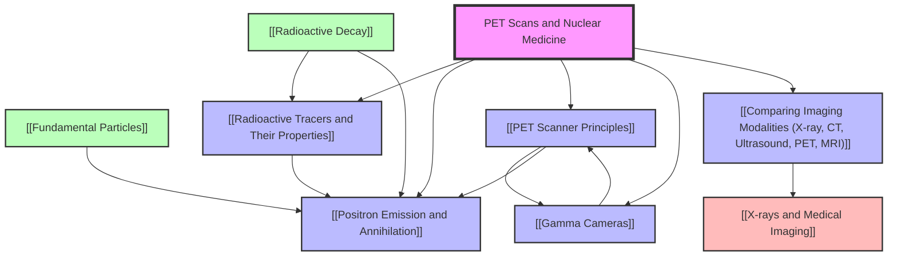

# PET Scans and Nuclear Medicine / PET扫描与核医学

---

# 1. Overview / 概述

**English:**
Positron Emission Tomography (PET) is a functional imaging technique that uses radioactive tracers to visualise metabolic processes in the body. Unlike anatomical imaging (X-ray, CT, MRI), PET reveals *how* tissues are functioning at a cellular level. This topic explores the physics behind PET: from [[Radioactive Decay]] and [[Positron Emission and Annihilation]] to the detection of gamma photons and image reconstruction. PET is crucial in oncology (cancer detection), cardiology, and neurology. In Cambridge 9702 (26.3 a-f) and Edexcel IAL (WPH14 U4: 11.13-11.18), students must understand the production of positron-emitting isotopes, the annihilation process, the PET scanner's coincidence detection, and the role of [[Gamma Cameras]]. This knowledge links directly to [[X-rays and Medical Imaging]] and broader medical physics applications.

**中文：**
正电子发射断层扫描（PET）是一种功能性成像技术，利用放射性示踪剂可视化体内的代谢过程。与解剖成像（X射线、CT、MRI）不同，PET揭示组织在细胞水平上的*功能状态*。本主题探讨PET背后的物理学：从[[放射性衰变]]和[[正电子发射与湮灭]]到伽马光子的探测和图像重建。PET在肿瘤学（癌症检测）、心脏病学和神经科学中至关重要。在剑桥9702（26.3 a-f）和爱德思IAL（WPH14 U4：11.13-11.18）中，学生必须理解正电子发射同位素的产生、湮灭过程、PET扫描仪的符合探测以及[[伽马相机]]的作用。这些知识直接与[[X射线与医学成像]]及更广泛的医学物理学应用相关联。

---

# 2. Syllabus Learning Objectives / 考纲学习目标

| CAIE 9702 (26.3 a-f) | Edexcel IAL (WPH14 U4: 11.13-11.18) |
|----------------------|--------------------------------------|
| (a) Describe the production of positron-emitting isotopes using a cyclotron. | 11.13 Understand the production of positron-emitting isotopes using a cyclotron. |
| (b) Explain the process of positron emission and annihilation, producing two gamma photons. | 11.14 Understand positron emission and annihilation, producing two 511 keV gamma photons. |
| (c) Explain the principle of coincidence detection in a PET scanner. | 11.15 Understand the principle of coincidence detection in a PET scanner. |
| (d) Describe the role of a gamma camera in detecting gamma photons. | 11.16 Understand the role of a gamma camera in detecting gamma photons. |
| (e) Explain how PET images are reconstructed using back-projection. | 11.17 Understand how PET images are reconstructed using back-projection. |
| (f) Compare PET with other imaging modalities (X-ray, CT, ultrasound, MRI). | 11.18 Compare PET with other imaging modalities (X-ray, CT, ultrasound, MRI). |

**Examiner Expectations / 考官期望：**
**English:** Candidates must be able to describe the cyclotron's role in producing short-lived isotopes (e.g., fluorine-18), explain the annihilation of a positron with an electron to produce two 511 keV gamma photons at 180° to each other, and understand coincidence detection (two detectors firing simultaneously). They should also describe the gamma camera's components (collimator, scintillator, photomultiplier tubes) and explain back-projection for image reconstruction. Comparisons must include advantages (functional imaging) and disadvantages (poor spatial resolution, radiation dose) relative to other modalities.

**中文：** 考生必须能够描述回旋加速器在产生短寿命同位素（如氟-18）中的作用，解释正电子与电子湮灭产生两个511 keV伽马光子（方向相反）的过程，并理解符合探测（两个探测器同时触发）。还应描述伽马相机的组件（准直器、闪烁体、光电倍增管）并解释反投影用于图像重建。比较必须包括相对于其他模态的优势（功能性成像）和劣势（空间分辨率低、辐射剂量）。

> 📋 **CIE Only:** CAIE 9702 specifically requires describing the production of positron-emitting isotopes using a cyclotron (26.3a). Edexcel IAL also includes this but with less emphasis on the cyclotron's detailed operation.
>
> 📋 **Edexcel Only:** Edexcel IAL explicitly mentions 511 keV gamma photons (11.14). CAIE 9702 does not specify the energy but expects candidates to know it is 511 keV from annihilation.

---

# 3. Core Definitions / 核心定义

| Term (EN/CN) | Definition (EN) | Definition (CN) | Common Mistakes / 常见错误 |
|--------------|-----------------|-----------------|---------------------------|
| [[Positron Emission and Annihilation\|Positron Emission]] / 正电子发射 | The emission of a positron (β⁺) from an unstable nucleus when a proton decays into a neutron, a positron, and a neutrino. | 不稳定的原子核中一个质子衰变为中子、正电子和中微子时发射正电子（β⁺）的过程。 | Confusing β⁺ (positron) with β⁻ (electron). Positrons are antimatter. |
| [[Positron Emission and Annihilation\|Annihilation]] / 湮灭 | The process where a positron and an electron meet and convert their rest mass into two gamma photons of equal energy (511 keV) travelling in opposite directions. | 正电子与电子相遇并将其静止质量转化为两个能量相等（511 keV）、方向相反的伽马光子的过程。 | Forgetting that two photons are produced at 180° to each other. |
| [[PET Scanner Principles\|Coincidence Detection]] / 符合探测 | A detection method where two gamma photons detected simultaneously (within a few nanoseconds) are assumed to originate from the same annihilation event. | 一种探测方法，其中两个伽马光子同时（在几纳秒内）被探测到，假定它们来自同一次湮灭事件。 | Thinking that any two detected photons are from the same event; ignoring random coincidences. |
| [[Gamma Cameras\|Gamma Camera]] / 伽马相机 | A device that detects gamma photons and converts them into an electrical signal to form an image. Components: collimator, scintillator, photomultiplier tubes (PMTs). | 一种探测伽马光子并将其转换为电信号以形成图像的设备。组件：准直器、闪烁体、光电倍增管（PMT）。 | Confusing gamma camera with PET scanner; gamma camera is a component of PET but also used independently. |
| [[Radioactive Tracers and Their Properties\|Radioactive Tracer]] / 放射性示踪剂 | A radioactive isotope (e.g., fluorine-18) attached to a biologically active molecule (e.g., FDG) that is injected into the body to track metabolic activity. | 一种放射性同位素（如氟-18）附着在生物活性分子（如FDG）上，注入体内以追踪代谢活动。 | Thinking the tracer itself is the imaging agent; it's the annihilation photons that are detected. |
| [[PET Scanner Principles\|Back-Projection]] / 反投影 | A mathematical technique used to reconstruct a 2D image from multiple 1D projections (line integrals) acquired at different angles. | 一种数学技术，用于从不同角度获取的多个一维投影（线积分）重建二维图像。 | Confusing back-projection with simple summation; it involves filtering to reduce blurring. |
| [[Comparing Imaging Modalities (X-ray, CT, Ultrasound, PET, MRI)\|Functional Imaging]] / 功能性成像 | Imaging that reveals physiological activity (e.g., glucose metabolism) rather than anatomy. | 揭示生理活动（如葡萄糖代谢）而非解剖结构的成像。 | Assuming PET shows anatomy; it shows function, often overlaid on CT for anatomical reference. |

---

# 4. Key Concepts Explained / 关键概念详解

## 4.1 Production of Positron-Emitting Isotopes Using a Cyclotron / 使用回旋加速器产生正电子发射同位素

### Explanation / 解释
**English:** Positron-emitting isotopes (e.g., fluorine-18, carbon-11, nitrogen-13) are produced in a [[Cyclotron]]. A cyclotron accelerates charged particles (e.g., protons) in a spiral path using a magnetic field and alternating electric field. The accelerated protons are directed at a target material (e.g., oxygen-18 enriched water for fluorine-18). The nuclear reaction is: $$^{18}_{8}\text{O} + ^{1}_{1}\text{p} \rightarrow ^{18}_{9}\text{F} + ^{1}_{0}\text{n}$$ The resulting isotope is short-lived (fluorine-18 half-life ≈ 110 minutes), requiring rapid synthesis and injection into the patient.

**中文：** 正电子发射同位素（如氟-18、碳-11、氮-13）在[[回旋加速器]]中产生。回旋加速器利用磁场和交变电场将带电粒子（如质子）沿螺旋路径加速。加速后的质子被导向靶材料（如用于氟-18的氧-18富集水）。核反应为：$$^{18}_{8}\text{O} + ^{1}_{1}\text{p} \rightarrow ^{18}_{9}\text{F} + ^{1}_{0}\text{n}$$ 产生的同位素寿命短（氟-18半衰期≈110分钟），需要快速合成并注入患者体内。

### Physical Meaning / 物理意义
**English:** The cyclotron allows the creation of isotopes that are not naturally abundant. The short half-life ensures the patient's radiation dose is minimised while still allowing enough time for the tracer to accumulate in target tissues.

**中文：** 回旋加速器能够产生自然界中不丰富的同位素。短半衰期确保患者的辐射剂量最小化，同时仍允许示踪剂在目标组织中积累足够的时间。

### Common Misconceptions / 常见误区
- **English:** Students often think the cyclotron produces the gamma photons directly. In reality, the cyclotron produces the isotope; the isotope decays by positron emission, and the positron annihilates to produce gamma photons.
- **中文：** 学生常认为回旋加速器直接产生伽马光子。实际上，回旋加速器产生同位素；同位素通过正电子发射衰变，正电子湮灭产生伽马光子。

### Exam Tips / 考试提示
**English:** Be able to write the nuclear equation for the production of fluorine-18. Understand why short half-lives are desirable (reduced patient dose) but also challenging (requires on-site cyclotron or rapid transport).

**中文：** 能够写出氟-18产生的核反应方程。理解为什么短半衰期是可取的（减少患者剂量），但也具有挑战性（需要现场回旋加速器或快速运输）。

> 📷 **IMAGE PROMPT — [PET-01]: Cyclotron Schematic**
>
> A labelled diagram of a cyclotron showing two D-shaped electrodes (dees), a magnetic field (perpendicular to the plane), an alternating voltage source, a proton source at the centre, and a spiral path of accelerated protons exiting towards a target. Include labels: "Magnetic Field B", "Alternating Voltage", "Proton Path", "Target Material (O-18 water)". Style: clean educational diagram, blue and grey tones, 2D cross-section.

---

## 4.2 Positron Emission and Annihilation / 正电子发射与湮灭

### Explanation / 解释
**English:** A positron-emitting isotope (e.g., fluorine-18) decays by converting a proton into a neutron, emitting a positron (β⁺) and a neutrino. The positron travels a short distance (typically 1-2 mm) in tissue, losing kinetic energy through collisions. When it meets an electron, they annihilate: $$e^+ + e^- \rightarrow \gamma + \gamma$$ The two gamma photons each have energy 511 keV (from $E = mc^2$, where $m$ is the electron rest mass) and travel in opposite directions (180° apart) to conserve momentum.

**中文：** 正电子发射同位素（如氟-18）通过将一个质子转化为中子，发射一个正电子（β⁺）和一个中微子而衰变。正电子在组织中行进很短距离（通常1-2毫米），通过碰撞损失动能。当它与电子相遇时，它们湮灭：$$e^+ + e^- \rightarrow \gamma + \gamma$$ 两个伽马光子各具有511 keV的能量（来自$E = mc^2$，其中$m$是电子静止质量），并沿相反方向（180°）传播以守恒动量。

### Physical Meaning / 物理意义
**English:** The annihilation produces two back-to-back gamma photons. This is the key to PET imaging: by detecting these two photons simultaneously, the scanner can localise the annihilation event along a line (line of response, LOR).

**中文：** 湮灭产生两个背对背的伽马光子。这是PET成像的关键：通过同时探测这两个光子，扫描仪可以将湮灭事件定位在一条线上（响应线，LOR）。

### Common Misconceptions / 常见误区
- **English:** Students think the positron itself is detected. The positron travels only a short distance and annihilates; it is the gamma photons that are detected.
- **中文：** 学生认为正电子本身被探测到。正电子只行进很短距离并湮灭；被探测到的是伽马光子。

### Exam Tips / 考试提示
**English:** Know the energy of the gamma photons (511 keV) and why they are at 180° (conservation of momentum). Be able to calculate the energy using $E = mc^2$: $E = (9.11 \times 10^{-31} \text{ kg})(3.00 \times 10^8 \text{ m/s})^2 = 8.20 \times 10^{-14} \text{ J} = 0.511 \text{ MeV} = 511 \text{ keV}$.

**中文：** 知道伽马光子的能量（511 keV）以及为什么它们成180°（动量守恒）。能够使用$E = mc^2$计算能量：$E = (9.11 \times 10^{-31} \text{ kg})(3.00 \times 10^8 \text{ m/s})^2 = 8.20 \times 10^{-14} \text{ J} = 0.511 \text{ MeV} = 511 \text{ keV}$。

---

## 4.3 Coincidence Detection in a PET Scanner / PET扫描仪中的符合探测

### Explanation / 解释
**English:** A PET scanner consists of a ring of [[Gamma Cameras]] (detectors) around the patient. When two detectors fire simultaneously (within a coincidence window of ~5-10 ns), the system records a coincidence event. This event is assumed to originate from a single annihilation somewhere along the line connecting the two detectors (the line of response, LOR). By collecting millions of such events from all angles, the distribution of the tracer in the body can be reconstructed.

**中文：** PET扫描仪由环绕患者的一圈[[伽马相机]]（探测器）组成。当两个探测器同时触发（在约5-10纳秒的符合窗口内），系统记录一个符合事件。该事件假定来自连接两个探测器的线上某处的单次湮灭（响应线，LOR）。通过从所有角度收集数百万个这样的事件，可以重建示踪剂在体内的分布。

### Physical Meaning / 物理意义
**English:** Coincidence detection eliminates the need for a physical collimator (as in a gamma camera), improving sensitivity. It also provides depth information because the LOR is known, allowing 3D reconstruction.

**中文：** 符合探测消除了对物理准直器（如伽马相机中）的需求，提高了灵敏度。它还提供深度信息，因为响应线已知，允许三维重建。

### Common Misconceptions / 常见误区
- **English:** Students think that any two detected photons are from the same annihilation. Random coincidences (two unrelated photons detected at the same time) and scattered coincidences (one or both photons scattered) degrade image quality.
- **中文：** 学生认为任何两个被探测到的光子都来自同一次湮灭。随机符合（两个无关光子同时被探测到）和散射符合（一个或两个光子被散射）会降低图像质量。

### Exam Tips / 考试提示
**English:** Explain why coincidence detection improves signal-to-noise ratio compared to single-photon detection. Understand the trade-off: a wider coincidence window increases sensitivity but also increases random coincidences.

**中文：** 解释为什么符合探测相比单光子探测提高了信噪比。理解权衡：更宽的符合窗口增加灵敏度，但也增加随机符合。

> 📷 **IMAGE PROMPT — [PET-02]: Coincidence Detection in PET**
>
> A diagram showing a patient lying inside a ring of detectors. Two detectors are highlighted, with a line (LOR) connecting them. An annihilation event is shown at a point along the LOR, emitting two gamma photons (arrows) towards the two detectors. Include labels: "Detector Ring", "Line of Response (LOR)", "Annihilation Event", "511 keV γ", "Coincidence Circuit". Style: medical illustration, cross-sectional view, blue and green tones.

---

## 4.4 Gamma Camera Components and Function / 伽马相机组件与功能

### Explanation / 解释
**English:** A [[Gamma Camera]] detects gamma photons and converts them into an electrical signal. Its main components are:
1. **Collimator:** A lead plate with many parallel holes. It allows only gamma photons travelling perpendicular to the plate to reach the scintillator, defining the direction of the incoming photon.
2. **Scintillator:** A crystal (e.g., sodium iodide doped with thallium, NaI(Tl)) that absorbs gamma photons and emits visible light (scintillation).
3. **Photomultiplier Tubes (PMTs):** Convert the light into an electrical signal and amplify it. An array of PMTs allows the position of the scintillation to be determined (Anger logic).

**中文：** [[伽马相机]]探测伽马光子并将其转换为电信号。其主要组件包括：
1. **准直器：** 一块带有许多平行孔的铅板。它只允许垂直于板传播的伽马光子到达闪烁体，定义了入射光子的方向。
2. **闪烁体：** 一种晶体（如掺铊碘化钠，NaI(Tl)），吸收伽马光子并发射可见光（闪烁）。
3. **光电倍增管（PMT）：** 将光转换为电信号并放大。PMT阵列允许确定闪烁的位置（安格逻辑）。

### Physical Meaning / 物理意义
**English:** The collimator is essential for spatial localisation but reduces sensitivity (many photons are absorbed). The scintillator converts high-energy gamma photons into detectable light. PMTs provide high gain (up to 10⁷) to detect single photons.

**中文：** 准直器对于空间定位至关重要，但会降低灵敏度（许多光子被吸收）。闪烁体将高能伽马光子转换为可探测的光。PMT提供高增益（高达10⁷）以探测单个光子。

### Common Misconceptions / 常见误区
- **English:** Students think the collimator focuses the gamma rays. It does not; it only selects those travelling in a specific direction.
- **中文：** 学生认为准直器聚焦伽马射线。它并不聚焦；它只选择那些沿特定方向传播的光子。

### Exam Tips / 考试提示
**English:** Be able to draw and label a gamma camera. Explain the role of each component. Understand why the collimator reduces sensitivity (only a small fraction of photons pass through the holes).

**中文：** 能够绘制并标注伽马相机。解释每个组件的作用。理解为什么准直器降低灵敏度（只有一小部分光子通过孔）。

> 📷 **IMAGE PROMPT — [PET-03]: Gamma Camera Cross-Section**
>
> A cross-sectional diagram of a gamma camera showing: a lead collimator with parallel holes at the top, a NaI(Tl) scintillator crystal below it, an array of photomultiplier tubes (PMTs) below the scintillator, and a signal processing unit. Arrows show gamma photons entering through the collimator, interacting with the scintillator, and producing light that reaches the PMTs. Include labels: "Collimator", "Scintillator (NaI(Tl))", "PMT Array", "Gamma Photon", "Visible Light", "Signal Output". Style: technical illustration, cross-section, grey and blue tones.

---

## 4.5 Image Reconstruction Using Back-Projection / 使用反投影进行图像重建

### Explanation / 解释
**English:** After collecting coincidence events from many angles, the data consists of multiple 1D projections (sinograms). [[Back-Projection]] is a mathematical technique to reconstruct a 2D image. For each projection, the counts are "smeared" back along the direction of the LOR. When all projections are summed, regions with higher tracer concentration appear brighter. However, simple back-projection produces a blurred image (star artefact). To correct this, filtered back-projection (FBP) applies a filter (e.g., ramp filter) before back-projection to sharpen the image.

**中文：** 在从多个角度收集符合事件后，数据由多个一维投影（正弦图）组成。[[反投影]]是一种重建二维图像的数学技术。对于每个投影，计数沿响应线方向“涂抹”回去。当所有投影求和时，示踪剂浓度较高的区域显得更亮。然而，简单反投影会产生模糊图像（星状伪影）。为了纠正这一点，滤波反投影（FBP）在反投影之前应用滤波器（如斜坡滤波器）以锐化图像。

### Physical Meaning / 物理意义
**English:** Back-projection is analogous to taking X-ray images from many angles and then "reconstructing" the object. The more angles, the better the reconstruction. Filtering is necessary because the simple summation overemphasises low frequencies.

**中文：** 反投影类似于从多个角度拍摄X射线图像，然后“重建”物体。角度越多，重建效果越好。滤波是必要的，因为简单求和会过度强调低频。

### Common Misconceptions / 常见误区
- **English:** Students think back-projection directly gives the image. It gives a blurred version; filtering is essential for clinical use.
- **中文：** 学生认为反投影直接给出图像。它给出模糊版本；滤波对于临床使用至关重要。

### Exam Tips / 考试提示
**English:** Understand the concept of a sinogram (a 2D representation of all projections). Be able to explain why filtered back-projection is preferred over simple back-projection.

**中文：** 理解正弦图的概念（所有投影的二维表示）。能够解释为什么滤波反投影优于简单反投影。

---

## 4.6 Comparison of Imaging Modalities / 成像模态比较

### Explanation / 解释
**English:** [[Comparing Imaging Modalities (X-ray, CT, Ultrasound, PET, MRI)]] involves evaluating each technique based on:
- **Type of information:** Anatomical (X-ray, CT, MRI, ultrasound) vs. functional (PET, fMRI).
- **Spatial resolution:** CT and MRI have high spatial resolution (~1 mm); PET has lower resolution (~4-6 mm).
- **Radiation dose:** X-ray, CT, and PET use ionising radiation; MRI and ultrasound do not.
- **Speed:** Ultrasound and X-ray are fast; MRI and PET are slower.
- **Cost:** X-ray and ultrasound are cheap; CT and MRI are expensive; PET is very expensive.
- **Safety:** MRI has no ionising radiation but is contraindicated for patients with metal implants.

**中文：** [[成像模态比较（X射线、CT、超声、PET、MRI）]]涉及根据以下标准评估每种技术：
- **信息类型：** 解剖学（X射线、CT、MRI、超声）vs. 功能性（PET、fMRI）。
- **空间分辨率：** CT和MRI具有高空间分辨率（~1毫米）；PET分辨率较低（~4-6毫米）。
- **辐射剂量：** X射线、CT和PET使用电离辐射；MRI和超声不使用。
- **速度：** 超声和X射线快；MRI和PET较慢。
- **成本：** X射线和超声便宜；CT和MRI昂贵；PET非常昂贵。
- **安全性：** MRI无电离辐射，但对有金属植入物的患者禁忌。

### Physical Meaning / 物理意义
**English:** No single modality is perfect. PET/CT scanners combine functional (PET) and anatomical (CT) imaging in one session, providing both metabolic and structural information.

**中文：** 没有单一的完美模态。PET/CT扫描仪在一次扫描中结合功能性（PET）和解剖学（CT）成像，提供代谢和结构信息。

### Common Misconceptions / 常见误区
- **English:** Students think PET shows anatomy. PET shows function; it is often fused with CT or MRI for anatomical reference.
- **中文：** 学生认为PET显示解剖结构。PET显示功能；它通常与CT或MRI融合以提供解剖参考。

### Exam Tips / 考试提示
**English:** Be able to produce a comparison table. Understand why PET/CT is common in oncology (detects metabolically active tumours).

**中文：** 能够制作比较表格。理解为什么PET/CT在肿瘤学中常见（检测代谢活跃的肿瘤）。

> 📋 **CIE Only:** CAIE 9702 specifically requires comparison with X-ray, CT, ultrasound, and MRI (26.3f). Edexcel IAL also requires this (11.18).

---

# 5. Essential Equations / 核心公式

## 5.1 Energy of Annihilation Photons / 湮灭光子能量

**Equation / 公式:**
$$E = mc^2$$

**Variables / 变量:**
| Symbol (符号) | Meaning (EN) | Meaning (CN) | Unit (单位) |
|--------------|-------------|-------------|------------|
| $E$ | Energy of one gamma photon | 一个伽马光子的能量 | J or eV |
| $m$ | Rest mass of electron (or positron) | 电子（或正电子）的静止质量 | kg |
| $c$ | Speed of light in vacuum | 真空中的光速 | m/s |

**Derivation / 推导:**
**English:** When a positron and electron annihilate, their total rest mass is $2m_e$. This mass is converted into the energy of two gamma photons. By conservation of energy: $$2m_e c^2 = E_{\gamma 1} + E_{\gamma 2}$$ Since the photons have equal energy (by symmetry and momentum conservation): $$E_{\gamma} = m_e c^2$$ Substituting $m_e = 9.11 \times 10^{-31} \text{ kg}$ and $c = 3.00 \times 10^8 \text{ m/s}$: $$E_{\gamma} = (9.11 \times 10^{-31})(3.00 \times 10^8)^2 = 8.20 \times 10^{-14} \text{ J}$$ Converting to eV: $$E_{\gamma} = \frac{8.20 \times 10^{-14}}{1.60 \times 10^{-19}} = 5.11 \times 10^5 \text{ eV} = 511 \text{ keV}$$

**中文：** 当一个正电子和一个电子湮灭时，它们的总静止质量为$2m_e$。这个质量转化为两个伽马光子的能量。由能量守恒：$$2m_e c^2 = E_{\gamma 1} + E_{\gamma 2}$$ 由于光子具有相等的能量（由对称性和动量守恒）：$$E_{\gamma} = m_e c^2$$ 代入$m_e = 9.11 \times 10^{-31} \text{ kg}$和$c = 3.00 \times 10^8 \text{ m/s}$：$$E_{\gamma} = (9.11 \times 10^{-31})(3.00 \times 10^8)^2 = 8.20 \times 10^{-14} \text{ J}$$ 转换为eV：$$E_{\gamma} = \frac{8.20 \times 10^{-14}}{1.60 \times 10^{-19}} = 5.11 \times 10^5 \text{ eV} = 511 \text{ keV}$$

**Conditions / 适用条件:**
**English:** Valid only when the positron and electron are at rest relative to each other (or their kinetic energy is negligible compared to rest mass energy). In tissue, the positron has some kinetic energy, but the correction is small.

**中文：** 仅当正电子和电子相对静止时有效（或它们的动能与静止质量能量相比可忽略）。在组织中，正电子具有一些动能，但修正很小。

**Limitations / 局限性:**
**English:** Does not account for the positron's kinetic energy at annihilation, which causes a slight variation in photon energies and angles.

**中文：** 未考虑湮灭时正电子的动能，这会导致光子能量和角度的微小变化。

**Rearrangements / 变形:**
**English:** $m = \frac{E}{c^2}$ (to find mass from energy)

**中文：** $m = \frac{E}{c^2}$（从能量求质量）

---

## 5.2 Half-Life and Activity / 半衰期与活度

**Equation / 公式:**
$$A = A_0 e^{-\lambda t}$$
$$\lambda = \frac{\ln 2}{t_{1/2}}$$

**Variables / 变量:**
| Symbol (符号) | Meaning (EN) | Meaning (CN) | Unit (单位) |
|--------------|-------------|-------------|------------|
| $A$ | Activity at time $t$ | 时间$t$时的活度 | Bq |
| $A_0$ | Initial activity | 初始活度 | Bq |
| $\lambda$ | Decay constant | 衰变常数 | s⁻¹ |
| $t$ | Time elapsed | 经过的时间 | s |
| $t_{1/2}$ | Half-life | 半衰期 | s |

**Derivation / 推导:**
**English:** From the radioactive decay law: $N = N_0 e^{-\lambda t}$. Activity $A = \lambda N$, so $A = \lambda N_0 e^{-\lambda t} = A_0 e^{-\lambda t}$. The half-life is found by setting $N = N_0/2$: $N_0/2 = N_0 e^{-\lambda t_{1/2}}$, giving $\lambda t_{1/2} = \ln 2$, so $\lambda = \ln 2 / t_{1/2}$.

**中文：** 由放射性衰变定律：$N = N_0 e^{-\lambda t}$。活度$A = \lambda N$，所以$A = \lambda N_0 e^{-\lambda t} = A_0 e^{-\lambda t}$。半衰期通过设$N = N_0/2$求得：$N_0/2 = N_0 e^{-\lambda t_{1/2}}$，得到$\lambda t_{1/2} = \ln 2$，所以$\lambda = \ln 2 / t_{1/2}$。

**Conditions / 适用条件:**
**English:** Valid for any radioactive isotope undergoing exponential decay.

**中文：** 适用于任何经历指数衰变的放射性同位素。

**Limitations / 局限性:**
**English:** Does not apply to isotopes with multiple decay modes or branching ratios without modification.

**中文：** 不适用于具有多种衰变模式或分支比的同位素（未经修改）。

**Rearrangements / 变形:**
**English:** $t_{1/2} = \frac{\ln 2}{\lambda}$, $t = \frac{1}{\lambda} \ln\left(\frac{A_0}{A}\right)$

**中文：** $t_{1/2} = \frac{\ln 2}{\lambda}$, $t = \frac{1}{\lambda} \ln\left(\frac{A_0}{A}\right)$

---

## 5.3 Coincidence Detection Rate / 符合探测率

**Equation / 公式:**
$$R_{\text{true}} = \frac{A \cdot \epsilon^2 \cdot \Omega}{4\pi}$$

**Variables / 变量:**
| Symbol (符号) | Meaning (EN) | Meaning (CN) | Unit (单位) |
|--------------|-------------|-------------|------------|
| $R_{\text{true}}$ | True coincidence count rate | 真实符合计数率 | s⁻¹ |
| $A$ | Activity of the source | 源的活度 | Bq |
| $\epsilon$ | Detection efficiency of each detector | 每个探测器的探测效率 | dimensionless |
| $\Omega$ | Solid angle subtended by the detector pair | 探测器对所张的立体角 | sr |

**Derivation / 推导:**
**English:** The probability that a single annihilation produces a detected coincidence is the product of: (1) the probability that one photon reaches detector 1 and is detected ($\epsilon \cdot \Omega_1/4\pi$), and (2) the probability that the other photon reaches detector 2 and is detected ($\epsilon \cdot \Omega_2/4\pi$). For a symmetric system, $\Omega_1 = \Omega_2 = \Omega/2$, giving $R_{\text{true}} = A \cdot (\epsilon \cdot \Omega/4\pi)^2$.

**中文：** 单次湮灭产生被探测到的符合的概率是以下乘积：（1）一个光子到达探测器1并被探测到的概率（$\epsilon \cdot \Omega_1/4\pi$），和（2）另一个光子到达探测器2并被探测到的概率（$\epsilon \cdot \Omega_2/4\pi$）。对于对称系统，$\Omega_1 = \Omega_2 = \Omega/2$，得到$R_{\text{true}} = A \cdot (\epsilon \cdot \Omega/4\pi)^2$。

**Conditions / 适用条件:**
**English:** Assumes isotropic emission of gamma photons and equal detector efficiencies.

**中文：** 假设伽马光子各向同性发射且探测器效率相等。

**Limitations / 局限性:**
**English:** Does not account for random coincidences, scattered coincidences, or dead time effects.

**中文：** 未考虑随机符合、散射符合或死时间效应。

**Rearrangements / 变形:**
**English:** $A = \frac{R_{\text{true}} \cdot (4\pi)^2}{\epsilon^2 \cdot \Omega^2}$

**中文：** $A = \frac{R_{\text{true}} \cdot (4\pi)^2}{\epsilon^2 \cdot \Omega^2}$

---

# 6. Graphs and Relationships / 图表与关系

## 6.1 Activity Decay Curve / 活度衰变曲线

### Axes / 坐标轴
**English:** x-axis: Time (t), y-axis: Activity (A) or Number of nuclei (N)
**中文：** x轴：时间（t），y轴：活度（A）或原子核数（N）

### Shape / 形状
**English:** Exponential decay curve: starts at $A_0$, decreases rapidly then slowly approaches zero.
**中文：** 指数衰变曲线：从$A_0$开始，快速下降后缓慢趋近于零。

### Gradient Meaning / 斜率含义
**English:** The gradient at any point is $-\lambda A$, proportional to the activity. A steeper gradient means faster decay (shorter half-life).
**中文：** 任意点的斜率为$-\lambda A$，与活度成正比。斜率越陡表示衰变越快（半衰期越短）。

### Area Meaning / 面积含义
**English:** The area under the curve from $t=0$ to $t=\infty$ is $A_0/\lambda = N_0$, the total number of decays.
**中文：** 从$t=0$到$t=\infty$的曲线下面积为$A_0/\lambda = N_0$，即总衰变数。

### Exam Interpretation / 考试解读
**English:** Be able to read half-life from the graph (time for activity to halve). Use logarithmic plots to linearise the data.
**中文：** 能够从图中读取半衰期（活度减半的时间）。使用对数图将数据线性化。

### Common Questions / 常见问题
**English:** "Determine the half-life from the graph." "Calculate the decay constant." "Find the activity after 3 half-lives."
**中文：** "从图中确定半衰期。""计算衰变常数。""求3个半衰期后的活度。"

> 📷 **IMAGE PROMPT — [PET-04]: Exponential Decay Curve**
>
> A graph showing an exponential decay curve. x-axis labelled "Time / minutes", y-axis labelled "Activity / MBq". The curve starts at 100 MBq at t=0, drops to 50 MBq at t=110 min (half-life of F-18), then to 25 MBq at t=220 min, etc. Include a dashed line showing the half-life. Style: scientific graph, grid lines, clear labels.

---

## 6.2 Coincidence Count Rate vs. Activity / 符合计数率与活度关系

### Axes / 坐标轴
**English:** x-axis: Activity (A), y-axis: True coincidence count rate ($R_{\text{true}}$)
**中文：** x轴：活度（A），y轴：真实符合计数率（$R_{\text{true}}$）

### Shape / 形状
**English:** Linear relationship: $R_{\text{true}} \propto A$ (for low activities where random coincidences are negligible).
**中文：** 线性关系：$R_{\text{true}} \propto A$（对于低活度，随机符合可忽略）。

### Gradient Meaning / 斜率含义
**English:** Gradient = $\frac{\epsilon^2 \cdot \Omega^2}{(4\pi)^2}$, related to the detection efficiency and geometry.
**中文：** 斜率 = $\frac{\epsilon^2 \cdot \Omega^2}{(4\pi)^2}$，与探测效率和几何结构有关。

### Area Meaning / 面积含义
**English:** Not applicable.
**中文：** 不适用。

### Exam Interpretation / 考试解读
**English:** At high activities, the curve deviates from linearity due to random coincidences and dead time. Be able to identify the linear region.
**中文：** 在高活度下，由于随机符合和死时间，曲线偏离线性。能够识别线性区域。

### Common Questions / 常见问题
**English:** "Explain why the graph deviates from linearity at high activities." "Calculate the detection efficiency from the gradient."
**中文：** "解释为什么在高活度下图形偏离线性。""从斜率计算探测效率。"

---

# 7. Required Diagrams / 必备图表

## 7.1 Cyclotron Diagram / 回旋加速器图

### Description / 描述
**English:** A labelled diagram of a cyclotron showing two D-shaped electrodes (dees), a magnetic field perpendicular to the plane, an alternating voltage source, a proton source at the centre, and the spiral path of accelerated protons exiting towards a target.

**中文：** 回旋加速器的标注图，显示两个D形电极（D形盒）、垂直于平面的磁场、交变电压源、中心的质子源，以及加速质子向靶材射出的螺旋路径。

### Image Prompt / 图片生成提示
> 📷 **IMAGE PROMPT — [PET-01]: Cyclotron Schematic**
>
> A labelled diagram of a cyclotron showing two D-shaped electrodes (dees), a magnetic field (perpendicular to the plane), an alternating voltage source, a proton source at the centre, and a spiral path of accelerated protons exiting towards a target. Include labels: "Magnetic Field B", "Alternating Voltage", "Proton Path", "Target Material (O-18 water)". Style: clean educational diagram, blue and grey tones, 2D cross-section.

### Labels Required / 需要标注
**English:** Dees (D-shaped electrodes), Magnetic field (B), Alternating voltage, Proton source, Spiral path, Target material, Exit port.
**中文：** D形盒（D形电极）、磁场（B）、交变电压、质子源、螺旋路径、靶材、出口。

### Exam Importance / 考试重要性
**English:** CAIE 9702 (26.3a) and Edexcel IAL (11.13) require describing the production of positron-emitting isotopes using a cyclotron. A labelled diagram is often requested.

**中文：** 剑桥9702（26.3a）和爱德思IAL（11.13）要求描述使用回旋加速器产生正电子发射同位素。常要求绘制标注图。

---

## 7.2 Annihilation and Coincidence Detection Diagram / 湮灭与符合探测图

### Description / 描述
**English:** A diagram showing a patient lying inside a ring of detectors. An annihilation event is shown at a point, emitting two gamma photons at 180° to each other. Two detectors are highlighted, with a line (LOR) connecting them. The coincidence circuit is shown.

**中文：** 显示患者躺在探测器环内的图。在一点处显示湮灭事件，发射两个成180°的伽马光子。两个探测器被高亮，有一条线（LOR）连接它们。显示符合电路。

### Image Prompt / 图片生成提示
> 📷 **IMAGE PROMPT — [PET-02]: Coincidence Detection in PET**
>
> A diagram showing a patient lying inside a ring of detectors. Two detectors are highlighted, with a line (LOR) connecting them. An annihilation event is shown at a point along the LOR, emitting two gamma photons (arrows) towards the two detectors. Include labels: "Detector Ring", "Line of Response (LOR)", "Annihilation Event", "511 keV γ", "Coincidence Circuit". Style: medical illustration, cross-sectional view, blue and green tones.

### Labels Required / 需要标注
**English:** Detector ring, Line of Response (LOR), Annihilation event, 511 keV gamma photons, Coincidence circuit, Patient.
**中文：** 探测器环、响应线（LOR）、湮灭事件、511 keV伽马光子、符合电路、患者。

### Exam Importance / 考试重要性
**English:** Essential for explaining coincidence detection (CAIE 26.3c, Edexcel 11.15). Often used in questions about how PET localises the source.

**中文：** 对于解释符合探测至关重要（剑桥26.3c，爱德思11.15）。常用于关于PET如何定位源的问题。

---

## 7.3 Gamma Camera Cross-Section / 伽马相机截面图

### Description / 描述
**English:** A cross-sectional diagram of a gamma camera showing: a lead collimator with parallel holes, a NaI(Tl) scintillator crystal, an array of photomultiplier tubes (PMTs), and a signal processing unit. Arrows show gamma photons entering through the collimator, interacting with the scintillator, and producing light that reaches the PMTs.

**中文：** 伽马相机的截面图，显示：带有平行孔的铅准直器、NaI(Tl)闪烁体晶体、光电倍增管（PMT）阵列和信号处理单元。箭头显示伽马光子通过准直器进入、与闪烁体相互作用并产生到达PMT的光。

### Image Prompt / 图片生成提示
> 📷 **IMAGE PROMPT — [PET-03]: Gamma Camera Cross-Section**
>
> A cross-sectional diagram of a gamma camera showing: a lead collimator with parallel holes at the top, a NaI(Tl) scintillator crystal below it, an array of photomultiplier tubes (PMTs) below the scintillator, and a signal processing unit. Arrows show gamma photons entering through the collimator, interacting with the scintillator, and producing light that reaches the PMTs. Include labels: "Collimator", "Scintillator (NaI(Tl))", "PMT Array", "Gamma Photon", "Visible Light", "Signal Output". Style: technical illustration, cross-section, grey and blue tones.

### Labels Required / 需要标注
**English:** Collimator (lead), Scintillator (NaI(Tl)), Photomultiplier tube (PMT) array, Gamma photon, Visible light, Signal output.
**中文：** 准直器（铅）、闪烁体（NaI(Tl)）、光电倍增管（PMT）阵列、伽马光子、可见光、信号输出。

### Exam Importance / 考试重要性
**English:** CAIE 26.3d and Edexcel 11.16 require describing the role of a gamma camera. A labelled diagram is commonly tested.

**中文：** 剑桥26.3d和爱德思11.16要求描述伽马相机的作用。标注图常被测试。

---

# 8. Worked Examples / 典型例题

## Example 1: Energy of Annihilation Photons / 湮灭光子能量

### Question / 题目
**English:** A positron and an electron annihilate at rest. Calculate the energy of each gamma photon produced. Give your answer in keV. (Electron rest mass = $9.11 \times 10^{-31}$ kg, speed of light = $3.00 \times 10^8$ m/s, 1 eV = $1.60 \times 10^{-19}$ J)

**中文：** 一个正电子和一个电子在静止状态下湮灭。计算产生的每个伽马光子的能量。以keV为单位给出答案。（电子静止质量 = $9.11 \times 10^{-31}$ kg，光速 = $3.00 \times 10^8$ m/s，1 eV = $1.60 \times 10^{-19}$ J）

### Solution / 解答
**Step 1: Write the energy equation.**
$$E = mc^2$$
where $m$ is the mass of one electron (or positron).

**Step 2: Substitute values.**
$$E = (9.11 \times 10^{-31}) \times (3.00 \times 10^8)^2$$
$$E = 9.11 \times 10^{-31} \times 9.00 \times 10^{16}$$
$$E = 8.20 \times 10^{-14} \text{ J}$$

**Step 3: Convert to eV.**
$$E = \frac{8.20 \times 10^{-14}}{1.60 \times 10^{-19}} = 5.125 \times 10^5 \text{ eV}$$

**Step 4: Convert to keV.**
$$E = 5.125 \times 10^5 \text{ eV} = 512.5 \text{ keV} \approx 511 \text{ keV}$$

### Final Answer / 最终答案
**Answer:** 511 keV | **答案：** 511 keV

### Examiner Notes / 考官点评
**English:** Common mistake: using the mass of two electrons ($2m_e$) and then dividing by 2 incorrectly. The energy of one photon is $m_e c^2$, not $2m_e c^2$. Also, ensure correct unit conversion.

**中文：** 常见错误：使用两个电子的质量（$2m_e$）然后错误地除以2。一个光子的能量是$m_e c^2$，而不是$2m_e c^2$。同时，确保正确的单位转换。

### Alternative Method / 替代方法
**English:** Use the known value: $m_e c^2 = 0.511 \text{ MeV} = 511 \text{ keV}$.

**中文：** 使用已知值：$m_e c^2 = 0.511 \text{ MeV} = 511 \text{ keV}$。

---

## Example 2: Activity and Half-Life Calculation / 活度与半衰期计算

### Question / 题目
**English:** Fluorine-18 has a half-life of 110 minutes. A sample has an initial activity of 400 MBq.
(a) Calculate the decay constant of fluorine-18.
(b) Calculate the activity after 3.5 hours.
(c) How long will it take for the activity to fall to 25 MBq?

**中文：** 氟-18的半衰期为110分钟。一个样品初始活度为400 MBq。
(a) 计算氟-18的衰变常数。
(b) 计算3.5小时后的活度。
(c) 活度降至25 MBq需要多长时间？

### Solution / 解答
**Part (a):**
$$\lambda = \frac{\ln 2}{t_{1/2}} = \frac{0.693}{110 \times 60} = \frac{0.693}{6600} = 1.05 \times 10^{-4} \text{ s}^{-1}$$

**Part (b):**
Convert 3.5 hours to seconds: $t = 3.5 \times 3600 = 12600 \text{ s}$
$$A = A_0 e^{-\lambda t} = 400 \times e^{-(1.05 \times 10^{-4} \times 12600)}$$
$$A = 400 \times e^{-1.323} = 400 \times 0.266 = 106.4 \text{ MBq}$$

**Part (c):**
$$A = A_0 e^{-\lambda t} \Rightarrow \ln\left(\frac{A}{A_0}\right) = -\lambda t$$
$$t = \frac{1}{\lambda} \ln\left(\frac{A_0}{A}\right) = \frac{1}{1.05 \times 10^{-4}} \ln\left(\frac{400}{25}\right)$$
$$t = \frac{1}{1.05 \times 10^{-4}} \ln(16) = \frac{2.773}{1.05 \times 10^{-4}} = 26410 \text{ s} = 7.34 \text{ hours}$$

### Final Answer / 最终答案
**Answer:** (a) $\lambda = 1.05 \times 10^{-4} \text{ s}^{-1}$, (b) $A = 106 \text{ MBq}$, (c) $t = 7.34 \text{ hours}$ | **答案：** (a) $\lambda = 1.05 \times 10^{-4} \text{ s}^{-1}$, (b) $A = 106 \text{ MBq}$, (c) $t = 7.34 \text{ 小时}$

### Examiner Notes / 考官点评
**English:** Ensure units are consistent (convert hours to seconds). Use the exponential decay formula correctly. For part (c), using the half-life method: 400 → 200 (1 half-life) → 100 (2) → 50 (3) → 25 (4 half-lives = 4 × 110 min = 440 min = 7.33 hours) gives a quick check.

**中文：** 确保单位一致（将小时转换为秒）。正确使用指数衰变公式。对于(c)部分，使用半衰期方法：400 → 200（1个半衰期）→ 100（2）→ 50（3）→ 25（4个半衰期 = 4 × 110分钟 = 440分钟 = 7.33小时）可快速验证。

---

# 9. Past Paper Question Types / 历年真题题型

| Question Type / 题型 | Frequency / 频率 | Difficulty / 难度 | Past Paper References / 真题索引 |
|----------------------|------------------|------------------|-------------------------------|
| Calculation / 计算 | High | Medium | 📝 *待填入* |
| Explanation / 解释 | High | Medium-High | 📝 *待填入* |
| Graph Analysis / 图表分析 | Medium | Medium | 📝 *待填入* |
| Practical / 实验 | Low | High | 📝 *待填入* |
| Derivation / 推导 | Low | Medium | 📝 *待填入* |

> 📝 **题库整理中 / Question Bank Under Construction:** 具体试卷编号（如 9702/23/M/J/24 Q3）将在后续整理真题后填入上表。

**Common Command Words / 常见指令词：**
- **State / 陈述:** Give a brief answer without explanation. E.g., "State the energy of each gamma photon produced in annihilation."
- **Define / 定义:** Give the precise meaning. E.g., "Define the term 'coincidence detection'."
- **Explain / 解释:** Give reasons or causes. E.g., "Explain why a short half-life is desirable for a PET tracer."
- **Describe / 描述:** Give a detailed account. E.g., "Describe the production of fluorine-18 using a cyclotron."
- **Calculate / 计算:** Use mathematics to find a numerical answer. E.g., "Calculate the decay constant of fluorine-18."
- **Determine / 确定:** Find a value using given data or a graph. E.g., "Determine the half-life from the graph."
- **Suggest / 建议:** Propose a possible reason or solution. E.g., "Suggest why PET/CT scanners are commonly used in oncology."

---

# 10. Practical Skills Connections / 实验技能链接

**English:**
This topic connects to practical skills in several ways:

1. **CAIE Paper 5 (A2):** Candidates may be asked to design an experiment to investigate the decay of a radioactive source, including measuring half-life, handling uncertainties, and plotting exponential decay graphs. They should understand how to use a gamma camera or Geiger-Müller tube to detect radiation.

2. **Edexcel Unit 6 (A2):** Practicals may involve measuring the half-life of a radioactive isotope (e.g., protactinium-234) and analysing the exponential decay. Candidates should be able to plot a graph of activity against time, determine the half-life from the graph, and calculate the decay constant.

3. **Measurements / 测量:** Activity (Bq), time (s), energy (keV). Understanding of background radiation and its subtraction.

4. **Uncertainties / 不确定度:** Uncertainty in half-life determination from graph reading. Uncertainty in activity measurements due to random decay (Poisson statistics: $\sigma = \sqrt{N}$).

5. **Graph Plotting / 图表绘制:** Plotting exponential decay curves, using logarithmic plots to linearise data ($\ln A = \ln A_0 - \lambda t$).

6. **Experimental Design / 实验设计:** Designing a PET experiment: choice of tracer, injection protocol, scanning time, patient safety (radiation dose minimisation).

**中文：**
本主题以多种方式与实验技能相关联：

1. **剑桥Paper 5（A2）：** 考生可能被要求设计实验来研究放射源的衰变，包括测量半衰期、处理不确定度和绘制指数衰变图。他们应理解如何使用伽马相机或盖革-米勒管探测辐射。

2. **爱德思Unit 6（A2）：** 实验可能涉及测量放射性同位素（如镤-234）的半衰期并分析指数衰变。考生应能够绘制活度随时间变化的图，从图中确定半衰期，并计算衰变常数。

3. **测量：** 活度（Bq）、时间（s）、能量（keV）。理解本底辐射及其扣除。

4. **不确定度：** 从图读取半衰期的不确定度。由于随机衰变导致的活度测量不确定度（泊松统计：$\sigma = \sqrt{N}$）。

5. **图表绘制：** 绘制指数衰变曲线，使用对数图将数据线性化（$\ln A = \ln A_0 - \lambda t$）。

6. **实验设计：** 设计PET实验：示踪剂选择、注射方案、扫描时间、患者安全（辐射剂量最小化）。

> 📋 **CIE Only:** CAIE Paper 5 may ask about the use of a gamma camera in a practical context, including calibration and background subtraction.
>
> 📋 **Edexcel Only:** Edexcel Unit 6 may include a practical on measuring half-life using a GM tube and plotting a decay curve.

---

# 11. Concept Map / 概念图谱

---

# 12. Quick Revision Sheet / 速查表

| Category / 类别 | Key Points / 要点 |
|----------------|------------------|
| **Definitions / 定义** | • **Positron emission:** β⁺ decay (p → n + e⁺ + ν)   • **Annihilation:** e⁺ + e⁻ → 2γ (511 keV each, 180° apart)   • **Coincidence detection:** Two detectors fire simultaneously → event on LOR   • **Gamma camera:** Collimator + Scintillator + PMTs   • **Back-projection:** Reconstruct image from 1D projections |
| **Equations / 公式** | • $E = mc^2$ (511 keV per photon)   • $A = A_0 e^{-\lambda t}$ (activity decay)   • $\lambda = \ln 2 / t_{1/2}$ (decay constant)   • $R_{\text{true}} = A \cdot (\epsilon \Omega / 4\pi)^2$ (coincidence rate) |
| **Graphs / 图表** | • **Activity vs. time:** Exponential decay curve   • **Coincidence rate vs. activity:** Linear at low A, deviates at high A due to random coincidences   • **Log plot:** $\ln A$ vs. $t$ gives straight line with slope $-\lambda$ |
| **Key Facts / 关键事实** | • F-18 half-life: 110 min   • Annihilation photon energy: 511 keV   • PET is functional imaging (metabolism)   • PET/CT combines functional + anatomical   • Cyclotron produces short-lived isotopes   • Coincidence window: ~5-10 ns |
| **Exam Reminders / 考试提醒** | • Always state "two gamma photons at 180°"   • Explain why short half-life: reduces patient dose   • Compare PET with X-ray, CT, ultrasound, MRI   • Know gamma camera components and their roles   • Understand filtered back-projection vs. simple back-projection   • Units: Bq for activity, keV for energy, s for half-life |