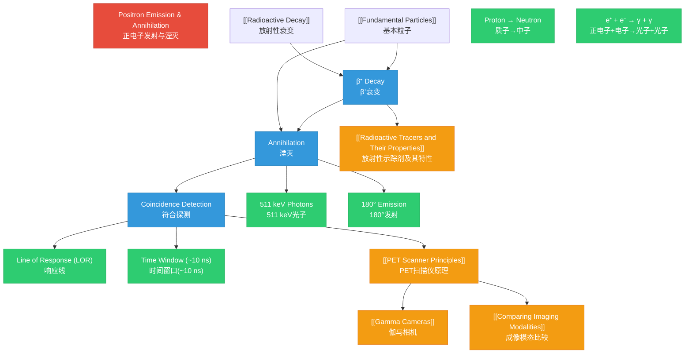

# 1. Overview / 概述

**English:**
Positron Emission and Annihilation is the fundamental physical process that underpins Positron Emission Tomography (PET) scanning. This sub-topic explores how certain unstable nuclei undergo β⁺ decay, emitting positrons — the antimatter counterpart of electrons. When a positron encounters an electron in tissue, they annihilate, converting their entire rest mass into two high-energy gamma photons (511 keV each) that travel in exactly opposite directions (180° apart). This unique property of back-to-back emission is what enables PET scanners to precisely locate the source of radiation within the body. Understanding this process is essential for grasping how [[PET Scans and Nuclear Medicine]] work, as it bridges [[Radioactive Decay]] concepts with [[Fundamental Particles]] physics, and directly connects to [[PET Scanner Principles]] and [[Radioactive Tracers and Their Properties]].

**中文:**
正电子发射与湮灭是支撑正电子发射断层扫描（PET）的基本物理过程。本子知识点探讨某些不稳定的原子核如何发生β⁺衰变，发射正电子——电子的反物质对应物。当正电子在组织中遇到电子时，它们会发生湮灭，将其全部静止质量转化为两个高能伽马光子（每个511 keV），这两个光子以完全相反的方向（180°）传播。这种背对背发射的独特特性使PET扫描仪能够精确定位体内辐射源的位置。理解这一过程对于掌握[[PET Scans and Nuclear Medicine]]的工作原理至关重要，它连接了[[Radioactive Decay]]概念与[[Fundamental Particles]]物理，并直接关联到[[PET Scanner Principles]]和[[Radioactive Tracers and Their Properties]]。

---

# 2. Syllabus Learning Objectives / 考纲学习目标

| CAIE 9702 | Edexcel IAL |
|-----------|-------------|
| 26.3(a) Describe the nature of β⁺ (positron) emission | 11.13 Understand that positron emission occurs when a proton changes to a neutron |
| 26.3(b) State the annihilation process: e⁺ + e⁻ → γ + γ | 11.14 Understand that positron-electron annihilation produces two gamma-ray photons of equal energy (511 keV) |
| 26.3(c) Explain that two γ-photons are produced, each of energy 511 keV, travelling in opposite directions | 11.15 Understand that the two gamma photons are emitted in opposite directions (180° apart) |
| 26.3(d) Explain the principle of coincidence detection | 11.16 Understand how coincidence detection is used to locate the source of annihilation |
| 26.3(e) Explain how PET scans produce images showing the distribution of a radioactive tracer | 11.17 Understand the use of radionuclides with short half-lives in PET |
| 26.3(f) Discuss the medical uses and risks of PET scans | 11.18 Understand the medical applications and safety considerations of PET |

**Examiner Expectations / 考官期望:**
- **CAIE:** Students must be able to write the annihilation equation and explain why the photons have exactly 511 keV energy. They should understand that the two photons are detected in coincidence to determine the line of response.
- **Edexcel:** Students need to calculate the energy of annihilation photons using E = mc² and understand the significance of back-to-back emission for image reconstruction.

---

# 3. Core Definitions / 核心定义

| Term (EN/CN) | Definition (EN) | Definition (CN) | Common Mistakes / 常见错误 |
|--------------|-----------------|-----------------|---------------------------|
| **Positron (β⁺)** / 正电子 | The antiparticle of the electron, with the same mass but opposite charge (+1e), emitted during β⁺ decay | 电子的反粒子，质量相同但电荷相反（+1e），在β⁺衰变中发射 | ❌ Confusing with β⁻ (electron) — positron has positive charge |
| **Annihilation** / 湮灭 | The process where a particle and its antiparticle meet and convert their entire rest mass into energy, typically as gamma photons | 粒子与其反粒子相遇并将其全部静止质量转化为能量（通常为伽马光子）的过程 | ❌ Thinking mass is "destroyed" — it's converted to energy |
| **511 keV Photon** / 511 keV光子 | A gamma photon produced during positron-electron annihilation, with energy exactly equal to the rest mass energy of an electron (or positron) | 正电子-电子湮灭过程中产生的伽马光子，能量恰好等于一个电子（或正电子）的静止质量能量 | ❌ Forgetting both photons have the same energy |
| **Coincidence Detection** / 符合探测 | A detection method where two gamma photons detected within a very short time window (typically ~10 ns) are assumed to come from the same annihilation event | 一种探测方法，在极短时间窗口（通常约10 ns）内检测到的两个伽马光子被认为来自同一次湮灭事件 | ❌ Thinking any two photons detected simultaneously are from the same event |
| **Line of Response (LOR)** / 响应线 | The straight line connecting two detectors that simultaneously detect annihilation photons, along which the annihilation event must have occurred | 连接同时检测到湮灭光子的两个探测器的直线，湮灭事件必定发生在这条线上 | ❌ Confusing with the actual position of annihilation |
| **β⁺ Decay** / β⁺衰变 | A type of radioactive decay where a proton in the nucleus converts to a neutron, emitting a positron and an electron neutrino | 一种放射性衰变类型，原子核中的质子转变为中子，发射一个正电子和一个电子中微子 | ❌ Forgetting the neutrino is also emitted |

---

# 4. Key Concepts Explained / 关键概念详解

## 4.1 Positron Emission (β⁺ Decay) / 正电子发射（β⁺衰变）

### Explanation / 解释
**English:**
In β⁺ decay, a proton-rich nucleus becomes more stable by converting a proton into a neutron. The nuclear equation is:

$$ \text{p} \rightarrow \text{n} + \text{e}^+ + \nu_\text{e} $$

where p is a proton, n is a neutron, e⁺ is a positron, and νₑ is an electron neutrino. This process occurs in neutron-deficient nuclei, such as fluorine-18 (¹⁸F), carbon-11 (¹¹C), and oxygen-15 (¹⁵O). The positron is ejected from the nucleus with a range of kinetic energies (up to a maximum value characteristic of the isotope). This connects to [[Radioactive Decay]] and [[Radioactive Tracers and Their Properties]].

**中文:**
在β⁺衰变中，富质子的原子核通过将质子转化为中子而变得更稳定。核反应方程为：

$$ \text{p} \rightarrow \text{n} + \text{e}^+ + \nu_\text{e} $$

其中p是质子，n是中子，e⁺是正电子，νₑ是电子中微子。这个过程发生在中子不足的原子核中，如氟-18（¹⁸F）、碳-11（¹¹C）和氧-15（¹⁵O）。正电子以一定范围的动能（最高可达该同位素特征的最大值）从原子核中射出。这与[[Radioactive Decay]]和[[Radioactive Tracers and Their Properties]]相关。

### Physical Meaning / 物理意义
**English:**
β⁺ decay is nature's way of adjusting the neutron-to-proton ratio in unstable nuclei. For light elements, the stable ratio is approximately 1:1; nuclei with too many protons relative to neutrons undergo β⁺ decay to reduce the proton count. The emitted positron is the antimatter counterpart of the electron — it has identical mass but opposite charge.

**中文:**
β⁺衰变是自然界调整不稳定原子核中中子-质子比例的方式。对于轻元素，稳定比例约为1:1；质子相对于中子过多的原子核通过β⁺衰变减少质子数量。发射的正电子是电子的反物质对应物——它具有相同的质量但相反的电荷。

### Common Misconceptions / 常见误区
- ❌ **"Positrons come from outside the nucleus"** — Positrons are created inside the nucleus during the decay process.
- ❌ **"β⁺ decay is the same as β⁻ decay"** — They are different processes: β⁺ involves proton → neutron, β⁻ involves neutron → proton.
- ❌ **"The positron has zero energy"** — Positrons are emitted with a range of kinetic energies up to a maximum (endpoint energy).

### Exam Tips / 考试提示
- ✅ **CAIE:** Be able to write the full decay equation for a specific isotope, e.g., ¹⁸F → ¹⁸O + e⁺ + νₑ
- ✅ **Edexcel:** Remember that the neutrino is required to conserve energy, momentum, and lepton number

> 📷 **IMAGE PROMPT — DIAGRAM-01: β⁺ Decay Process**
> A clear diagram showing a proton-rich nucleus (e.g., ¹⁸F) with 9 protons and 9 neutrons. An arrow shows one proton converting to a neutron, with a positron (e⁺, labeled with + charge) and an electron neutrino (νₑ) being emitted. The resulting nucleus (¹⁸O) has 8 protons and 10 neutrons. Use color coding: protons in red, neutrons in blue, positron in green, neutrino in purple.

---

## 4.2 Positron-Electron Annihilation / 正电子-电子湮灭

### Explanation / 解释
**English:**
After emission, the positron travels a short distance through tissue (typically 0.5-2 mm, depending on its initial kinetic energy), losing energy through collisions with electrons. When it has slowed down sufficiently, it encounters an electron, and the two particles annihilate. The annihilation process is described by:

$$ \text{e}^+ + \text{e}^- \rightarrow \gamma + \gamma $$

The two gamma photons each have energy exactly equal to the rest mass energy of an electron (or positron):

$$ E = m_\text{e}c^2 = (9.11 \times 10^{-31} \text{ kg})(3.00 \times 10^8 \text{ m/s})^2 = 8.20 \times 10^{-14} \text{ J} $$

Converting to electronvolts:

$$ E = \frac{8.20 \times 10^{-14} \text{ J}}{1.60 \times 10^{-19} \text{ J/eV}} = 5.11 \times 10^5 \text{ eV} = 511 \text{ keV} $$

The two photons travel in exactly opposite directions (180° apart) to conserve momentum. This is the key property exploited in [[PET Scanner Principles]].

**中文:**
发射后，正电子在组织中传播很短的距离（通常0.5-2 mm，取决于其初始动能），通过与电子碰撞损失能量。当它充分减速后，遇到一个电子，两个粒子发生湮灭。湮灭过程描述为：

$$ \text{e}^+ + \text{e}^- \rightarrow \gamma + \gamma $$

两个伽马光子每个的能量恰好等于一个电子（或正电子）的静止质量能量：

$$ E = m_\text{e}c^2 = (9.11 \times 10^{-31} \text{ kg})(3.00 \times 10^8 \text{ m/s})^2 = 8.20 \times 10^{-14} \text{ J} $$

转换为电子伏特：

$$ E = \frac{8.20 \times 10^{-14} \text{ J}}{1.60 \times 10^{-19} \text{ J/eV}} = 5.11 \times 10^5 \text{ eV} = 511 \text{ keV} $$

两个光子以完全相反的方向（180°）传播，以保持动量守恒。这是[[PET Scanner Principles]]中利用的关键特性。

### Physical Meaning / 物理意义
**English:**
Annihilation is a dramatic demonstration of Einstein's mass-energy equivalence (E = mc²). The entire rest mass of both particles is converted into pure energy. No mass remains — it is completely transformed into electromagnetic radiation. The 180° emission angle is a direct consequence of momentum conservation: since the positron and electron have negligible momentum when they annihilate, the total momentum of the two photons must also be zero, requiring them to travel in opposite directions with equal energy.

**中文:**
湮灭是爱因斯坦质能等价（E = mc²）的戏剧性证明。两个粒子的全部静止质量转化为纯能量。没有质量残留——它完全转化为电磁辐射。180°发射角是动量守恒的直接结果：由于正电子和电子在湮灭时动量可忽略，两个光子的总动量也必须为零，这就要求它们以相等的能量向相反方向传播。

### Common Misconceptions / 常见误区
- ❌ **"The positron and electron are destroyed"** — They are not destroyed; their mass is converted to energy.
- ❌ **"Only one photon is produced"** — Two photons are always produced (for annihilation at rest) to conserve momentum.
- ❌ **"The photons have different energies"** — Both photons have exactly 511 keV (for annihilation at rest).
- ❌ **"Annihilation happens at the decay site"** — The positron travels some distance before annihilating, causing a slight blurring in PET images.

### Exam Tips / 考试提示
- ✅ **CAIE:** Be able to calculate the energy of annihilation photons using E = mc²
- ✅ **Edexcel:** Understand why the photons are emitted in opposite directions (momentum conservation)
- ✅ **Both:** Remember that 511 keV = 8.20 × 10⁻¹⁴ J

> 📷 **IMAGE PROMPT — DIAGRAM-02: Positron-Electron Annihilation**
> A diagram showing a positron (e⁺, green circle with + sign) approaching an electron (e⁻, blue circle with - sign). At the point of contact, a flash of energy is shown, and two gamma photons (γ, yellow wavy arrows) are emitted in exactly opposite directions (180°). Label the energy of each photon as 511 keV. Include a small note: "E = mₑc² = 511 keV". Show the distance traveled by the positron before annihilation as a dashed path (0.5-2 mm).

---

## 4.3 Coincidence Detection / 符合探测

### Explanation / 解释
**English:**
Coincidence detection is the core principle of PET scanning. The PET scanner consists of a ring of gamma detectors surrounding the patient. When two detectors register gamma photons within a very short time window (typically 6-12 nanoseconds), the system assumes these photons came from the same annihilation event. The line connecting these two detectors is called the **Line of Response (LOR)**. The annihilation event must have occurred somewhere along this line. By collecting millions of such coincidence events, the scanner can reconstruct the 3D distribution of the radioactive tracer. This is explored further in [[PET Scanner Principles]].

**中文:**
符合探测是PET扫描的核心原理。PET扫描仪由环绕患者的伽马探测器环组成。当两个探测器在极短的时间窗口内（通常6-12纳秒）记录到伽马光子时，系统假定这些光子来自同一次湮灭事件。连接这两个探测器的线称为**响应线（LOR）**。湮灭事件一定发生在这条线上的某处。通过收集数百万个这样的符合事件，扫描仪可以重建放射性示踪剂的3D分布。这在[[PET Scanner Principles]]中有进一步探讨。

### Physical Meaning / 物理意义
**English:**
Coincidence detection eliminates the need for physical collimators (lead grids used in [[Gamma Cameras]]), which block most gamma photons and reduce sensitivity. Instead, electronic collimation is used: only photons detected in coincidence are considered valid events. This dramatically increases sensitivity (by a factor of 100-1000 compared to single-photon imaging) while maintaining good spatial resolution.

**中文:**
符合探测消除了对物理准直器（[[Gamma Cameras]]中使用的铅栅格）的需求，这些准直器会阻挡大多数伽马光子并降低灵敏度。取而代之的是电子准直：只有符合探测到的光子才被视为有效事件。这极大地提高了灵敏度（比单光子成像高100-1000倍），同时保持良好的空间分辨率。

### Common Misconceptions / 常见误区
- ❌ **"Coincidence detection finds the exact position of annihilation"** — It only determines the line along which annihilation occurred, not the exact point.
- ❌ **"Any two photons detected at the same time are from the same event"** — Random coincidences (two unrelated photons detected simultaneously) can occur and degrade image quality.
- ❌ **"The time window can be arbitrarily short"** — The time window must be long enough to account for the different travel times of photons to different detectors.

### Exam Tips / 考试提示
- ✅ **CAIE:** Explain why coincidence detection is better than using a collimator
- ✅ **Edexcel:** Understand that the time window is typically ~10 ns because the speed of light is 3 × 10⁸ m/s and the detector ring diameter is ~1 m

> 📷 **IMAGE PROMPT — DIAGRAM-03: Coincidence Detection in PET**
> A cross-sectional diagram of a PET scanner showing a ring of detectors (small rectangles) around a circular patient outline. Inside the patient, show an annihilation event (star symbol) emitting two 511 keV photons in opposite directions. Draw straight lines from the annihilation point to two detectors on opposite sides of the ring. Label these detectors as "Detector A" and "Detector B". Draw a dashed line connecting them labeled "Line of Response (LOR)". Add a timing diagram showing both detectors registering signals within the coincidence time window (Δt < 10 ns).

---

# 5. Essential Equations / 核心公式

## 5.1 Annihilation Energy / 湮灭能量

$$ E = m_\text{e}c^2 $$

| Symbol (符号) | Meaning (EN) | Meaning (CN) | Unit (单位) |
|--------------|-------------|-------------|------------|
| $E$ | Energy of one annihilation photon | 一个湮灭光子的能量 | J or eV |
| $m_\text{e}$ | Rest mass of electron (or positron) = 9.11 × 10⁻³¹ kg | 电子（或正电子）的静止质量 = 9.11 × 10⁻³¹ kg | kg |
| $c$ | Speed of light in vacuum = 3.00 × 10⁸ m/s | 真空中的光速 = 3.00 × 10⁸ m/s | m/s |

**Derivation / 推导:**
The rest mass energy of an electron is calculated using Einstein's mass-energy equivalence:

$$ E = m_\text{e}c^2 = (9.11 \times 10^{-31})(3.00 \times 10^8)^2 = 8.20 \times 10^{-14} \text{ J} $$

Converting to eV:

$$ E = \frac{8.20 \times 10^{-14}}{1.60 \times 10^{-19}} = 5.11 \times 10^5 \text{ eV} = 511 \text{ keV} $$

Since both the electron and positron annihilate, the total energy released is 2 × 511 keV = 1022 keV, shared equally between the two photons.

**Conditions / 适用条件:**
- The positron and electron are approximately at rest when annihilation occurs (their kinetic energy is negligible compared to rest mass energy)
- Annihilation occurs in free space (not bound states like positronium)

**Limitations / 局限性:**
- If the positron has significant kinetic energy at annihilation, the photons may have slightly different energies and not be exactly 180° apart
- In practice, the finite momentum of the positron causes a small angular deviation (~0.5°) from 180°

## 5.2 β⁺ Decay Equation / β⁺衰变方程

$$ \text{p} \rightarrow \text{n} + \text{e}^+ + \nu_\text{e} $$

| Symbol (符号) | Meaning (EN) | Meaning (CN) |
|--------------|-------------|-------------|
| p | Proton | 质子 |
| n | Neutron | 中子 |
| e⁺ | Positron | 正电子 |
| νₑ | Electron neutrino | 电子中微子 |

**Derivation / 推导:**
This is a fundamental weak interaction process. The full equation for a specific isotope, e.g., fluorine-18:

$$ ^{18}_{9}\text{F} \rightarrow ^{18}_{8}\text{O} + ^{0}_{+1}\text{e} + \nu_\text{e} $$

Note that the atomic number decreases by 1 (9 → 8) while the mass number remains the same (18).

**Conditions / 适用条件:**
- Occurs in neutron-deficient (proton-rich) nuclei
- Requires sufficient energy difference between parent and daughter nuclei (Q-value > 1.022 MeV to account for positron mass)

**Limitations / 局限性:**
- Cannot occur in free protons (requires nuclear binding energy)
- The positron energy spectrum is continuous (not discrete) due to the sharing of energy with the neutrino

---

# 6. Graphs and Relationships / 图表与关系

## 6.1 Positron Energy Spectrum / 正电子能谱

### Axes / 坐标轴
- **X-axis:** Kinetic energy of positron (Eₖ) / 正电子动能 (Eₖ)
- **Y-axis:** Number of positrons (N) / 正电子数量 (N)

### Shape / 形状
**English:** The spectrum is continuous, rising from zero to a maximum at the endpoint energy (Eₘₐₓ). The shape is characteristic of β decay, with a broad peak at approximately Eₘₐₓ/3 and a sharp cutoff at Eₘₐₓ.

**中文:** 能谱是连续的，从零上升到端点能量（Eₘₐₓ）处的最大值。形状是β衰变的特征，在约Eₘₐₓ/3处有一个宽峰，在Eₘₐₓ处有尖锐截止。

### Gradient Meaning / 斜率含义
**English:** The gradient at any point represents the number of positrons per unit energy interval. The shape is determined by the statistical sharing of energy between the positron and neutrino.

**中文:** 任意点的斜率表示单位能量间隔内的正电子数量。形状由正电子和中微子之间的能量统计分配决定。

### Area Meaning / 面积含义
**English:** The total area under the curve represents the total number of positrons emitted per unit time (activity of the source).

**中文:** 曲线下的总面积表示单位时间内发射的正电子总数（源的活度）。

### Exam Interpretation / 考试解读
**English:** Students should understand that:
1. The spectrum is continuous because the energy is shared between the positron and neutrino
2. The endpoint energy (Eₘₐₓ) is characteristic of each isotope
3. Most positrons have less than the maximum energy, so they travel shorter distances before annihilating

**中文:** 学生应理解：
1. 能谱是连续的，因为能量在正电子和中微子之间分配
2. 端点能量（Eₘₐₓ）是每种同位素的特征
3. 大多数正电子的能量小于最大值，因此它们在湮灭前传播的距离更短

> 📷 **IMAGE PROMPT — GRAPH-01: Positron Energy Spectrum**
> A graph showing a continuous energy spectrum for positrons from β⁺ decay. X-axis labeled "Kinetic Energy / keV" from 0 to Eₘₐₓ (e.g., 635 keV for ¹⁸F). Y-axis labeled "Number of Positrons". The curve rises from zero, peaks at about Eₘₐₓ/3, then drops to zero at Eₘₐₓ. Label the endpoint energy Eₘₐₓ. Add a note: "Continuous spectrum due to energy sharing with neutrino".

---

# 7. Required Diagrams / 必备图表

## 7.1 Annihilation Process Diagram / 湮灭过程图

### Description / 描述
**English:** A diagram showing the complete process from β⁺ decay to annihilation, including the emission of the positron from the nucleus, its travel through tissue, and the final annihilation with an electron producing two 511 keV gamma photons.

**中文:** 显示从β⁺衰变到湮灭的完整过程的图表，包括正电子从原子核发射、在组织中传播，以及最终与电子湮灭产生两个511 keV伽马光子。

### Image Prompt / 图片生成提示
> 📷 **IMAGE PROMPT — DIAGRAM-04: Complete Annihilation Process**
> A detailed scientific diagram showing three stages: (1) A nucleus (e.g., ¹⁸F) undergoing β⁺ decay, with a proton (red) converting to a neutron (blue), emitting a positron (e⁺, green) and a neutrino (νₑ, purple). (2) The positron traveling through tissue (shown as a dashed zigzag path of ~1 mm) losing energy through collisions. (3) The positron meeting an electron (e⁻, blue) and annihilating, producing two gamma photons (γ, yellow wavy arrows) at 180° to each other, each labeled "511 keV". Use a clean, textbook-style layout with clear labels and arrows.

### Labels Required / 需要标注
| English | 中文 |
|---------|------|
| β⁺ Decay | β⁺衰变 |
| Positron (e⁺) | 正电子 (e⁺) |
| Electron Neutrino (νₑ) | 电子中微子 (νₑ) |
| Positron Range (~1 mm) | 正电子射程 (~1 mm) |
| Electron (e⁻) | 电子 (e⁻) |
| Annihilation | 湮灭 |
| 511 keV Gamma Photons | 511 keV 伽马光子 |
| 180° Emission | 180°发射 |

### Exam Importance / 考试重要性
**English:** This diagram is essential for understanding the physical basis of PET scanning. Students should be able to draw and label this diagram from memory, including the energy of the photons and the 180° emission angle.

**中文:** 此图对于理解PET扫描的物理基础至关重要。学生应能凭记忆绘制并标注此图，包括光子的能量和180°发射角。

---

## 7.2 Coincidence Detection System / 符合探测系统

### Description / 描述
**English:** A schematic diagram of a PET scanner ring showing how coincidence detection works, including the line of response (LOR) and the timing window.

**中文:** PET扫描仪环的示意图，显示符合探测的工作原理，包括响应线（LOR）和时间窗口。

### Image Prompt / 图片生成提示
> 📷 **IMAGE PROMPT — DIAGRAM-05: PET Coincidence Detection System**
> A cross-sectional view of a PET scanner showing a circular ring of 16-20 detector modules (shown as small rectangles) surrounding a circular patient outline. Inside the patient, show an annihilation event (yellow star) emitting two 511 keV photons (yellow arrows) in opposite directions. Draw a straight line (dashed red) connecting the two detectors that detect these photons, labeled "Line of Response (LOR)". Add a small timing diagram in the corner showing two detector signals (A and B) within a coincidence time window Δt < 10 ns. Label "Coincidence Processing Unit" connected to both detectors. Include a note: "Only events detected within Δt are recorded as valid coincidences."

### Labels Required / 需要标注
| English | 中文 |
|---------|------|
| Detector Ring | 探测器环 |
| Annihilation Event | 湮灭事件 |
| 511 keV γ Photon | 511 keV γ光子 |
| Line of Response (LOR) | 响应线 (LOR) |
| Coincidence Time Window (Δt) | 符合时间窗口 (Δt) |
| Coincidence Processing Unit | 符合处理单元 |
| Patient | 患者 |

### Exam Importance / 考试重要性
**English:** This diagram is frequently tested in exam questions about PET scanning principles. Students must understand how the LOR is used to locate the annihilation event and why the time window is necessary.

**中文:** 此图在关于PET扫描原理的考题中经常出现。学生必须理解LOR如何用于定位湮灭事件，以及为什么需要时间窗口。

---

# 8. Worked Examples / 典型例题

## Example 1: Calculating Annihilation Photon Energy / 计算湮灭光子能量

### Question / 题目
**English:**
Fluorine-18 (¹⁸F) is a common PET tracer that undergoes β⁺ decay. The rest mass of an electron is 9.11 × 10⁻³¹ kg.

(a) Calculate the energy, in joules and in keV, of each gamma photon produced when a positron annihilates with an electron.
(b) Explain why two photons are produced rather than one.
(c) State the angle between the two photons and explain why this angle is significant for PET imaging.

**中文:**
氟-18（¹⁸F）是一种常见的PET示踪剂，会发生β⁺衰变。电子的静止质量为9.11 × 10⁻³¹ kg。

(a) 计算正电子与电子湮灭时产生的每个伽马光子的能量，单位为焦耳和keV。
(b) 解释为什么产生两个光子而不是一个。
(c) 说明两个光子之间的角度，并解释为什么这个角度对PET成像很重要。

### Solution / 解答

**(a) Energy calculation / 能量计算:**

Using Einstein's mass-energy equivalence:

$$ E = m_\text{e}c^2 $$

$$ E = (9.11 \times 10^{-31})(3.00 \times 10^8)^2 $$

$$ E = 9.11 \times 10^{-31} \times 9.00 \times 10^{16} $$

$$ E = 8.20 \times 10^{-14} \text{ J} $$

Converting to eV:

$$ E = \frac{8.20 \times 10^{-14}}{1.60 \times 10^{-19}} = 5.125 \times 10^5 \text{ eV} = 512 \text{ keV} $$

(Using more precise values: 511 keV)

**Answer:** Each photon has energy 8.20 × 10⁻¹⁴ J = 511 keV.

**(b) Why two photons / 为什么是两个光子:**

**English:** Two photons are produced to conserve momentum. Before annihilation, the positron and electron have negligible momentum (they are approximately at rest). After annihilation, the total momentum must still be zero. A single photon would carry momentum away, violating conservation of momentum. Two photons of equal energy traveling in opposite directions have zero net momentum.

**中文:** 产生两个光子是为了保持动量守恒。湮灭前，正电子和电子的动量可忽略（它们近似静止）。湮灭后，总动量仍必须为零。单个光子会带走动量，违反动量守恒。两个能量相等、方向相反的光子净动量为零。

**(c) Angle and significance / 角度及其意义:**

**English:** The angle between the two photons is 180° (they travel in exactly opposite directions). This is significant for PET imaging because it allows the scanner to determine the **Line of Response (LOR)** — the straight line connecting the two detectors that detect the photons. The annihilation event must have occurred somewhere along this line. By collecting many such coincidence events, the scanner can reconstruct the 3D distribution of the tracer.

**中文:** 两个光子之间的角度为180°（它们以完全相反的方向传播）。这对PET成像很重要，因为它使扫描仪能够确定**响应线（LOR）**——连接检测到光子的两个探测器的直线。湮灭事件一定发生在这条线上的某处。通过收集许多这样的符合事件，扫描仪可以重建示踪剂的3D分布。

### Final Answer / 最终答案
**Answer:** (a) 8.20 × 10⁻¹⁴ J = 511 keV; (b) Momentum conservation requires two photons; (c) 180°, enables determination of LOR for image reconstruction.
**答案：** (a) 8.20 × 10⁻¹⁴ J = 511 keV；(b) 动量守恒要求两个光子；(c) 180°，能够确定LOR用于图像重建。

### Quick Tip / 提示
**English:** Remember that 511 keV is a standard value you should know. In calculations, always show the conversion from joules to eV: divide by 1.60 × 10⁻¹⁹.

**中文:** 记住511 keV是你应该知道的标准值。在计算中，始终展示从焦耳到eV的转换：除以1.60 × 10⁻¹⁹。

---

## Example 2: Coincidence Detection and Time Window / 符合探测与时间窗口

### Question / 题目
**English:**
A PET scanner has a detector ring with a diameter of 80 cm.

(a) Calculate the maximum time difference between the arrival of two annihilation photons at detectors on opposite sides of the ring.
(b) Explain why the coincidence time window must be set to approximately 10 ns rather than the exact value calculated in (a).
(c) State one consequence of setting the time window too short and one consequence of setting it too long.

**中文:**
一个PET扫描仪的探测器环直径为80 cm。

(a) 计算两个湮灭光子到达环上相对两侧探测器的最大时间差。
(b) 解释为什么符合时间窗口必须设置为约10 ns，而不是(a)中计算的精确值。
(c) 说明时间窗口设置太短的一个后果和设置太长的一个后果。

### Solution / 解答

**(a) Maximum time difference / 最大时间差:**

The maximum distance difference occurs when the annihilation event is at the center of the ring. Both photons travel the same distance (radius = 40 cm = 0.40 m) to reach opposite detectors.

Time for one photon: $t = \frac{d}{c} = \frac{0.40}{3.00 \times 10^8} = 1.33 \times 10^{-9} \text{ s} = 1.33 \text{ ns}$

If the annihilation occurs off-center, one photon travels a shorter distance and the other a longer distance. The maximum possible time difference is when the annihilation occurs at the edge of the patient, close to one detector. In this case:

- Photon to near detector: $t_1 = \frac{0.01}{3.00 \times 10^8} \approx 0.03 \text{ ns}$ (assuming 1 cm from detector)
- Photon to far detector: $t_2 = \frac{0.79}{3.00 \times 10^8} \approx 2.63 \text{ ns}$

Maximum time difference: $\Delta t = t_2 - t_1 \approx 2.6 \text{ ns}$

**(b) Why ~10 ns / 为什么约10 ns:**

**English:** The time window must be longer than the calculated maximum time difference for several reasons:
1. Detectors have finite timing resolution (typically 2-3 ns)
2. Electronic circuits have processing delays
3. The positron travels a short distance before annihilating, introducing additional uncertainty
4. A slightly longer window ensures all true coincidence events are captured

A window of ~10 ns provides a good balance between capturing true events and rejecting random coincidences.

**中文:** 时间窗口必须比计算的最大时间差更长，原因如下：
1. 探测器具有有限的定时分辨率（通常2-3 ns）
2. 电子电路有处理延迟
3. 正电子在湮灭前传播很短距离，引入额外的不确定性
4. 稍长的窗口确保捕获所有真实符合事件

约10 ns的窗口在捕获真实事件和拒绝随机符合之间提供了良好的平衡。

**(c) Consequences / 后果:**

**English:**
- **Window too short:** Some true coincidence events will be missed (rejected), reducing sensitivity and potentially causing image artifacts.
- **Window too long:** More random coincidence events (two unrelated photons detected within the window) will be accepted, increasing background noise and degrading image quality.

**中文:**
- **窗口太短：** 一些真实的符合事件将被错过（拒绝），降低灵敏度并可能导致图像伪影。
- **窗口太长：** 更多的随机符合事件（窗口内检测到的两个不相关光子）将被接受，增加背景噪声并降低图像质量。

### Final Answer / 最终答案
**Answer:** (a) ~2.6 ns; (b) To account for detector resolution, electronic delays, and positron range; (c) Too short: missed events (reduced sensitivity); Too long: random coincidences (increased noise).
**答案：** (a) ~2.6 ns；(b) 考虑探测器分辨率、电子延迟和正电子射程；(c) 太短：错过事件（灵敏度降低）；太长：随机符合（噪声增加）。

### Quick Tip / 提示
**English:** In time-of-flight PET (a more advanced technique), the time difference is used to localize the annihilation event more precisely along the LOR, improving image quality.

**中文:** 在飞行时间PET（更先进的技术）中，时间差用于更精确地定位LOR上的湮灭事件，提高图像质量。

---

# 9. Past Paper Question Types / 历年真题题型

| Question Type / 题型 | Frequency / 频率 | Difficulty / 难度 | Past Paper References / 真题索引 |
|----------------------|------------------|------------------|-------------------------------|
| Calculate annihilation photon energy using E = mc² | ★★★★★ Very High | ★★☆☆ Easy | 📝 *待填入* |
| Explain why two photons are emitted at 180° | ★★★★★ Very High | ★★☆☆ Easy | 📝 *待填入* |
| Describe the β⁺ decay process | ★★★★☆ High | ★★★☆☆ Medium | 📝 *待填入* |
| Explain coincidence detection principle | ★★★★☆ High | ★★★☆☆ Medium | 📝 *待填入* |
| Compare PET with other imaging modalities | ★★★☆☆ Medium | ★★★★☆ Hard | 📝 *待填入* |
| Discuss medical uses and risks of PET | ★★★☆☆ Medium | ★★★☆☆ Medium | 📝 *待填入* |
| Calculate time window for coincidence detection | ★★☆☆☆ Low | ★★★★☆ Hard | 📝 *待填入* |

**Common Command Words / 常见指令词:**
- **Calculate / 计算** — Use E = mc² to find photon energy
- **Explain / 解释** — Why two photons? Why 180°? Why coincidence detection?
- **Describe / 描述** — The β⁺ decay and annihilation process
- **State / 陈述** — The energy of annihilation photons (511 keV)
- **Discuss / 讨论** — Medical applications and risks
- **Compare / 比较** — PET with other imaging techniques

---

# 10. Practical Skills Connections / 实验技能链接

**English:**
While students do not directly perform PET experiments in school laboratories, the underlying physics connects to several practical skills:

1. **Radioactive Source Handling:** Understanding β⁺ decay connects to practical work with radioactive sources, including safety precautions (time, distance, shielding).

2. **Gamma Spectroscopy:** The 511 keV annihilation peak is a standard calibration point for gamma detectors. Students may use a sodium-22 (²²Na) source, which emits positrons, to calibrate a gamma spectrometer.

3. **Coincidence Counting:** Simple coincidence experiments can be performed using two Geiger-Müller tubes and a coincidence unit, demonstrating the principle of detecting two events within a time window.

4. **Uncertainty Analysis:** The positron range (0.5-2 mm) introduces uncertainty in PET image reconstruction. Students should understand how this limits spatial resolution.

5. **Graph Plotting:** Plotting the positron energy spectrum and understanding its continuous nature develops data analysis skills.

**中文:**
虽然学生不在学校实验室直接进行PET实验，但基础物理与多项实验技能相关：

1. **放射源处理：** 理解β⁺衰变与放射源的实验工作相关，包括安全预防措施（时间、距离、屏蔽）。

2. **伽马能谱学：** 511 keV湮灭峰是伽马探测器的标准校准点。学生可以使用发射正电子的钠-22（²²Na）源来校准伽马能谱仪。

3. **符合计数：** 可以使用两个盖革-米勒管和一个符合单元进行简单的符合实验，演示在时间窗口内检测两个事件的原理。

4. **不确定度分析：** 正电子射程（0.5-2 mm）在PET图像重建中引入不确定度。学生应理解这如何限制空间分辨率。

5. **图表绘制：** 绘制正电子能谱并理解其连续性质，培养数据分析技能。

---

# 11. Concept Map / 概念图谱

---

# 12. Quick Revision Sheet / 速查表

| Category / 类别 | Key Points / 要点 |
|----------------|------------------|
| **Definition / 定义** | Positron emission (β⁺ decay): proton → neutron + e⁺ + νₑ 正电子发射（β⁺衰变）：质子→中子 + e⁺ + νₑ |
| **Key Formula / 核心公式** | E = mₑc² = 511 keV per photon Total energy released: 1022 keV (2 × 511 keV) |
| **Key Process / 关键过程** | e⁺ + e⁻ → γ + γ (annihilation / 湮灭) Two photons at 180° (momentum conservation / 动量守恒) |
| **Key Graph / 核心图表** | Positron energy spectrum: continuous from 0 to Eₘₐₓ 正电子能谱：从0到Eₘₐₓ连续分布 |
| **Key Diagram / 核心图表** | Annihilation process: β⁺ decay → positron travel (~1 mm) → annihilation → two 511 keV γ at 180° 湮灭过程：β⁺衰变→正电子传播(~1 mm)→湮灭→两个511 keV γ呈180° |
| **Coincidence Detection / 符合探测** | Two detectors register photons within Δt ~10 ns → defines LOR 两个探测器在Δt ~10 ns内记录光子→确定LOR |
| **Common Value / 常用数值** | 511 keV = 8.20 × 10⁻¹⁴ J mₑ = 9.11 × 10⁻³¹ kg c = 3.00 × 10⁸ m/s |
| **Exam Tip / 考试提示** | Always show E = mc² calculation step-by-step Always mention momentum conservation for 180° emission 始终逐步展示E = mc²计算 始终提及动量守恒解释180°发射 |
| **Common Mistake / 常见错误** | ❌ Forgetting the neutrino in β⁺ decay ❌ Thinking annihilation produces one photon ❌ Confusing 511 keV with total energy released ❌ 忘记β⁺衰变中的中微子 ❌ 认为湮灭产生一个光子 ❌ 混淆511 keV与总释放能量 |
| **Medical Relevance / 医学相关性** | PET tracers (¹⁸F, ¹¹C, ¹⁵O) emit positrons → annihilation → detection → 3D image of tracer distribution PET示踪剂（¹⁸F、¹¹C、¹⁵O）发射正电子→湮灭→探测→示踪剂分布的3D图像 |