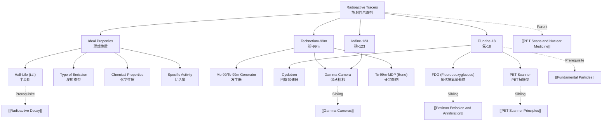

# 1. Overview / 概述

**English:**
Radioactive tracers are the cornerstone of nuclear medicine, including PET scans. This sub-topic focuses on the specific properties that make certain radioisotopes suitable as tracers for medical imaging. A radioactive tracer is a small amount of a radioisotope introduced into the body, which emits radiation that can be detected externally to form an image of physiological processes. The key properties include: a short half-life to minimise patient radiation dose, emission of gamma rays (or positrons for PET) that can penetrate tissue, and chemical properties that allow the tracer to be incorporated into biologically active molecules (radiopharmaceuticals). This sub-topic explains why specific isotopes like Fluorine-18, Technetium-99m, and Iodine-123 are chosen, and how their decay characteristics, production methods, and biological behaviour determine their clinical use. Understanding these properties is essential for linking [[Radioactive Decay]] principles to the practical operation of [[PET Scanner Principles]] and [[Gamma Cameras]].

**中文:**
放射性示踪剂是核医学（包括PET扫描）的基石。本子知识点聚焦于使某些放射性同位素适合作为医学成像示踪剂的特定性质。放射性示踪剂是引入体内的少量放射性同位素，它发出的辐射可以从体外检测到，从而形成生理过程的图像。关键性质包括：半衰期短以最小化患者辐射剂量、发射能穿透组织的伽马射线（或用于PET的正电子）、以及允许示踪剂被整合到具有生物活性的分子（放射性药物）中的化学性质。本子知识点解释了为什么选择氟-18、锝-99m和碘-123等特定同位素，以及它们的衰变特性、生产方法和生物行为如何决定其临床应用。理解这些性质对于将[[Radioactive Decay]]原理与[[PET Scanner Principles]]和[[Gamma Cameras]]的实际操作联系起来至关重要。

---

# 2. Syllabus Learning Objectives / 考纲学习目标

| CAIE 9702 (26.3 a-f) | Edexcel IAL (WPH14 U4: 11.13-11.18) |
|-----------------------|--------------------------------------|
| Describe the properties of radioactive tracers used in medical diagnosis | Understand the properties required for a radioactive isotope to be used as a medical tracer |
| Explain the choice of specific radioisotopes for different imaging techniques | Explain the choice of specific radioisotopes for PET and gamma camera imaging |
| Understand the concept of half-life in the context of patient safety | Understand the importance of half-life, type of emission, and chemical properties |
| Describe the production of radioisotopes using a cyclotron | Describe the production of positron-emitting isotopes using a cyclotron |
| Explain the concept of a radiopharmaceutical | Understand the role of radiopharmaceuticals in targeting specific organs |
| Evaluate the risks and benefits of using radioactive tracers | Evaluate the risks and benefits of using radioactive tracers in medicine |

**Examiner Expectations / 考官期望:**
- **English:** Students must be able to justify the choice of a specific radioisotope for a given medical application, linking its half-life, decay mode, and photon energy to patient safety and image quality. They should also understand the difference between isotopes produced in a nuclear reactor (e.g., Tc-99m) and those produced in a cyclotron (e.g., F-18).
- **中文:** 学生必须能够为特定的医学应用论证选择特定放射性同位素的原因，将其半衰期、衰变模式和光子能量与患者安全和图像质量联系起来。他们还应该理解在核反应堆中生产的同位素（如Tc-99m）和在回旋加速器中生产的同位素（如F-18）之间的区别。

---

# 3. Core Definitions / 核心定义

| Term (EN/CN) | Definition (EN) | Definition (CN) | Common Mistakes / 常见错误 |
|--------------|-----------------|-----------------|---------------------------|
| **Radioactive Tracer** / 放射性示踪剂 | A small amount of a radioisotope introduced into a biological system to track the path or concentration of a substance. | 引入生物系统中的少量放射性同位素，用于追踪某种物质的路径或浓度。 | Confusing tracer with contrast agent (tracers emit radiation; contrast agents absorb X-rays). |
| **Radiopharmaceutical** / 放射性药物 | A radioactive tracer combined with a biologically active molecule (e.g., glucose, antibody) that targets a specific organ or process. | 放射性示踪剂与具有生物活性的分子（如葡萄糖、抗体）结合，靶向特定器官或过程。 | Thinking the radioisotope alone does the targeting (it's the carrier molecule). |
| **Half-Life ($t_{1/2}$)** / 半衰期 | The time taken for half of the radioactive nuclei in a sample to decay. | 样品中一半放射性原子核发生衰变所需的时间。 | Forgetting that half-life is constant and independent of the amount of tracer. |
| **Annihilation** / 湮灭 | The process where a positron and an electron meet and convert their rest mass into two 511 keV gamma photons. | 正电子与电子相遇并将其静止质量转化为两个511 keV伽马光子的过程。 | Thinking annihilation produces a single photon (it always produces two). |
| **Cyclotron** / 回旋加速器 | A particle accelerator used to produce positron-emitting isotopes by bombarding stable nuclei with high-energy protons. | 一种粒子加速器，通过用高能质子轰击稳定原子核来产生发射正电子的同位素。 | Confusing cyclotron with a nuclear reactor (cyclotrons produce proton-rich isotopes; reactors produce neutron-rich ones). |
| **Generator (e.g., Mo-99/Tc-99m)** / 发生器 | A device containing a parent isotope that decays to a daughter isotope, which is then chemically extracted for medical use. | 一种含有母体同位素的装置，母体衰变成子体同位素，然后通过化学方法提取用于医疗。 | Thinking the generator produces the parent isotope (it contains the parent and extracts the daughter). |

---

# 4. Key Concepts Explained / 关键概念详解

## 4.1 Ideal Properties of a Medical Tracer / 医学示踪剂的理想性质

### Explanation / 解释
**English:** For a radioisotope to be useful as a medical tracer, it must satisfy several criteria simultaneously. First, the **half-life** must be long enough to allow preparation, transport, and administration to the patient, but short enough to minimise the radiation dose after the imaging is complete. Second, the **type of radiation** emitted must be penetrating enough to exit the body and be detected externally. Gamma rays (100-511 keV) are ideal. For PET, the isotope must emit **positrons** ($\beta^+$). Third, the **chemical properties** must allow the isotope to be incorporated into a biologically active molecule (radiopharmaceutical) without altering its biological function. Fourth, the **specific activity** (activity per unit mass) must be high, so that only a tiny mass of the isotope is needed, avoiding pharmacological effects. Finally, the **decay products** should ideally be stable or have very short half-lives, to avoid long-term radiation exposure.

**中文:** 要使放射性同位素可用作医学示踪剂，它必须同时满足多个标准。首先，**半衰期**必须足够长，以便制备、运输和给药给患者，但又足够短，以在成像完成后最小化辐射剂量。其次，发射的**辐射类型**必须具有足够的穿透力，能够离开身体并被外部检测到。伽马射线（100-511 keV）是理想的。对于PET，同位素必须发射**正电子**（$\beta^+$）。第三，**化学性质**必须允许同位素被整合到具有生物活性的分子（放射性药物）中，而不改变其生物功能。第四，**比活度**（单位质量的活度）必须高，这样只需要极微量的同位素，避免药理效应。最后，**衰变产物**最好是稳定的或具有非常短的半衰期，以避免长期辐射暴露。

### Physical Meaning / 物理意义
**English:** The choice of tracer is a trade-off between image quality (which improves with more decays during imaging) and patient safety (which requires minimal total dose). The half-life determines the "time window" for imaging. The photon energy determines how easily the radiation is detected and how much it is scattered or absorbed by tissue.

**中文:** 示踪剂的选择是图像质量（在成像期间随衰变次数增加而提高）与患者安全（需要最小总剂量）之间的权衡。半衰期决定了成像的"时间窗口"。光子能量决定了辐射被检测的难易程度以及被组织散射或吸收的程度。

### Common Misconceptions / 常见误区
- **English:** Students often think a longer half-life is always better because it gives more time for imaging. In reality, a longer half-life increases the radiation dose to the patient and the time they remain radioactive.
- **中文:** 学生常认为半衰期越长越好，因为成像时间更长。实际上，半衰期越长，患者的辐射剂量和保持放射性的时间就越长。
- **English:** Another misconception is that alpha or beta emitters are suitable for imaging. Alpha and beta particles have very short ranges in tissue and cannot be detected externally.
- **中文:** 另一个误区是认为α或β发射体适合成像。α和β粒子在组织中的射程非常短，无法从体外检测到。

### Exam Tips / 考试提示
- **English:** When asked "Why is isotope X chosen?", always mention half-life, type of emission, and chemical properties. Use specific numbers (e.g., F-18: 110 min half-life, positron emitter, can replace H in glucose).
- **中文:** 当被问及"为什么选择同位素X？"时，始终提及半衰期、发射类型和化学性质。使用具体数字（例如，F-18：110分钟半衰期，正电子发射体，可以取代葡萄糖中的H）。

> 📷 **IMAGE PROMPT — TRACER-01: Ideal Tracer Properties Diagram**
> A four-panel infographic showing: (1) Half-life timeline with imaging window, (2) Penetration of gamma rays vs alpha/beta through tissue, (3) Chemical binding of isotope to carrier molecule, (4) Decay chain showing stable end product. Clean, educational style with labelled arrows.

---

## 4.2 Specific Radioisotopes and Their Uses / 特定放射性同位素及其用途

### Explanation / 解释
**English:** Three key radioisotopes dominate nuclear medicine:

1. **Technetium-99m ($^{99m}_{43}Tc$)** : The most widely used tracer in gamma camera imaging. It emits a 140 keV gamma ray. Its half-life is 6.0 hours — long enough for preparation and imaging, short enough for patient safety. It decays to stable $^{99}_{43}Tc$ (half-life 211,000 years, but produced in tiny amounts). It is produced from a **Mo-99/Tc-99m generator** (molybdenum-99 decays to technetium-99m). Tc-99m can be chemically bound to many different carrier molecules to image different organs (e.g., bone, heart, kidneys).

2. **Fluorine-18 ($^{18}_{9}F$)** : The most common PET tracer. It emits a positron ($\beta^+$) which annihilates to produce two 511 keV gamma photons. Its half-life is 110 minutes. It is produced in a **cyclotron** by bombarding $^{18}_{8}O$ with protons. F-18 replaces a hydrogen atom in glucose to form **FDG (fluorodeoxyglucose)** , which is taken up by metabolically active cells (e.g., cancer cells, brain tissue).

3. **Iodine-123 ($^{123}_{53}I$)** : Used for thyroid imaging. It emits a 159 keV gamma ray. Its half-life is 13.2 hours. Iodine is naturally taken up by the thyroid gland to produce thyroid hormones.

**中文:** 三种关键放射性同位素主导着核医学：

1. **锝-99m ($^{99m}_{43}Tc$)** ：伽马相机成像中使用最广泛的示踪剂。它发射140 keV的伽马射线。其半衰期为6.0小时——足够长以进行制备和成像，足够短以保证患者安全。它衰变为稳定的$^{99}_{43}Tc$（半衰期211,000年，但产生量极微）。它通过**Mo-99/Tc-99m发生器**生产（钼-99衰变成锝-99m）。Tc-99m可以化学结合到许多不同的载体分子上，以对不同器官（如骨骼、心脏、肾脏）进行成像。

2. **氟-18 ($^{18}_{9}F$)** ：最常见的PET示踪剂。它发射正电子（$\beta^+$），正电子湮灭产生两个511 keV的伽马光子。其半衰期为110分钟。它在**回旋加速器**中通过用质子轰击$^{18}_{8}O$产生。F-18取代葡萄糖中的一个氢原子，形成**FDG（氟代脱氧葡萄糖）**，被代谢活跃的细胞（如癌细胞、脑组织）摄取。

3. **碘-123 ($^{123}_{53}I$)** ：用于甲状腺成像。它发射159 keV的伽马射线。其半衰期为13.2小时。碘会被甲状腺自然摄取以产生甲状腺激素。

### Physical Meaning / 物理意义
**English:** The choice between Tc-99m and F-18 is determined by the imaging modality (gamma camera vs PET) and the biological process being studied. Tc-99m is versatile because it can be tagged to many molecules. F-18 is specific to metabolic activity via FDG.

**中文:** Tc-99m和F-18之间的选择取决于成像方式（伽马相机 vs PET）和所研究的生物过程。Tc-99m用途广泛，因为它可以标记到许多分子上。F-18通过FDG特异性地反映代谢活动。

### Common Misconceptions / 常见误区
- **English:** Students often think Tc-99m is a positron emitter. It is a gamma emitter only. It is used for gamma cameras, not PET.
- **中文:** 学生常认为Tc-99m是正电子发射体。它只是伽马发射体，用于伽马相机，而非PET。
- **English:** Another mistake is thinking F-18 is used directly. It is always incorporated into a molecule like FDG.
- **中文:** 另一个错误是认为F-18被直接使用。它总是被整合到像FDG这样的分子中。

### Exam Tips / 考试提示
- **English:** Memorise the half-lives and photon energies for Tc-99m (6 h, 140 keV) and F-18 (110 min, 511 keV). Be able to explain why these values are optimal.
- **中文:** 记住Tc-99m（6小时，140 keV）和F-18（110分钟，511 keV）的半衰期和光子能量。能够解释为什么这些值是最优的。

> 📷 **IMAGE PROMPT — TRACER-02: Common Medical Tracers Comparison**
> A comparison table/infographic showing three tracers: Tc-99m, F-18, I-123. For each: symbol, half-life, decay mode, photon energy, production method (generator/cyclotron), and example radiopharmaceutical (e.g., Tc-99m-MDP for bone, FDG for PET, I-123 for thyroid). Clean, exam-style layout.

---

# 5. Essential Equations / 核心公式

## 5.1 Radioactive Decay Law / 放射性衰变定律

$$ A = A_0 e^{-\lambda t} $$

| Symbol (符号) | Meaning (EN) | Meaning (CN) | Unit (单位) |
|--------------|-------------|-------------|------------|
| $A$ | Activity at time $t$ | 时间$t$时的活度 | Bq (becquerel) |
| $A_0$ | Initial activity | 初始活度 | Bq |
| $\lambda$ | Decay constant | 衰变常数 | s$^{-1}$ |
| $t$ | Time elapsed | 经过的时间 | s |

**Derivation / 推导:** From $dN/dt = -\lambda N$, where $N$ is the number of radioactive nuclei. Activity $A = \lambda N$.

**Conditions / 适用条件:**
- **English:** Applies to any radioactive isotope. Assumes no new nuclei are produced (e.g., from a generator).
- **中文:** 适用于任何放射性同位素。假设没有新的原子核产生（例如，来自发生器）。

**Limitations / 局限性:**
- **English:** Does not account for the production of the isotope (e.g., in a cyclotron or generator). For generator-produced isotopes, the activity of the daughter depends on both its own decay and the decay of the parent.
- **中文:** 不考虑同位素的生产（例如，在回旋加速器或发生器中）。对于发生器生产的同位素，子体的活度取决于其自身的衰变和母体的衰变。

## 5.2 Half-Life Relationship / 半衰期关系

$$ t_{1/2} = \frac{\ln 2}{\lambda} = \frac{0.693}{\lambda} $$

| Symbol (符号) | Meaning (EN) | Meaning (CN) | Unit (单位) |
|--------------|-------------|-------------|------------|
| $t_{1/2}$ | Half-life | 半衰期 | s (or min, h) |
| $\lambda$ | Decay constant | 衰变常数 | s$^{-1}$ |

**Derivation / 推导:** Set $A = A_0/2$ in the decay law: $A_0/2 = A_0 e^{-\lambda t_{1/2}} \Rightarrow 1/2 = e^{-\lambda t_{1/2}} \Rightarrow \ln(1/2) = -\lambda t_{1/2} \Rightarrow t_{1/2} = \ln 2 / \lambda$.

**Conditions / 适用条件:**
- **English:** Valid for all exponential decays.
- **中文:** 对所有指数衰变有效。

## 5.3 Photon Energy from Annihilation / 湮灭产生的光子能量

$$ E_\gamma = m_e c^2 = 511 \text{ keV} $$

| Symbol (符号) | Meaning (EN) | Meaning (CN) | Value (数值) |
|--------------|-------------|-------------|------------|
| $E_\gamma$ | Energy of each annihilation photon | 每个湮灭光子的能量 | 511 keV |
| $m_e$ | Rest mass of electron (or positron) | 电子（或正电子）的静止质量 | $9.11 \times 10^{-31}$ kg |
| $c$ | Speed of light | 光速 | $3.00 \times 10^8$ m/s |

**Derivation / 推导:** The total rest mass energy of the electron-positron pair is $2m_e c^2$. This is converted into two photons of equal energy, so each photon has energy $m_e c^2$.

**Conditions / 适用条件:**
- **English:** Assumes the positron and electron are nearly at rest when they annihilate (thermalisation). In practice, the photons have a small spread around 511 keV.
- **中文:** 假设正电子和电子在湮灭时几乎静止（热化）。实际上，光子在511 keV附近有一个小的能量分布。

---

# 6. Graphs and Relationships / 图表与关系

## 6.1 Exponential Decay Curve for Tracers / 示踪剂的指数衰变曲线

### Axes / 坐标轴
- **X-axis:** Time (hours or minutes) / 时间（小时或分钟）
- **Y-axis:** Activity (Bq or % of initial activity) / 活度（Bq或初始活度的百分比）

### Shape / 形状
- **English:** A smooth, decreasing exponential curve. The activity drops by half every half-life. For Tc-99m (6 h), after 6 h the activity is 50%, after 12 h it is 25%, etc.
- **中文:** 一条平滑下降的指数曲线。活度每经过一个半衰期下降一半。对于Tc-99m（6小时），6小时后活度为50%，12小时后为25%，依此类推。

### Gradient Meaning / 斜率含义
- **English:** The gradient at any point is $-\lambda A$, representing the rate of decay. It is steeper when the activity is higher.
- **中文:** 任意点的斜率为$-\lambda A$，代表衰变速率。活度越高，斜率越陡。

### Area Meaning / 面积含义
- **English:** The area under the curve represents the total number of decays (total dose) delivered over time. This is proportional to the radiation dose to the patient.
- **中文:** 曲线下的面积代表随时间发生的总衰变数（总剂量）。这与患者的辐射剂量成正比。

### Exam Interpretation / 考试解读
- **English:** Be able to read values from a decay curve. For example: "What is the activity of F-18 after 3 hours if the initial activity is 400 MBq?" (Answer: 110 min ≈ 1.83 h, so 3 h ≈ 1.64 half-lives, activity ≈ 400 × 0.5^1.64 ≈ 130 MBq).
- **中文:** 能够从衰变曲线读取数值。例如："如果初始活度为400 MBq，3小时后F-18的活度是多少？"（答案：110分钟≈1.83小时，所以3小时≈1.64个半衰期，活度≈400×0.5^1.64≈130 MBq）。

> 📷 **IMAGE PROMPT — TRACER-03: Exponential Decay Curves for Tc-99m and F-18**
> Two overlaid exponential decay curves on the same axes (time 0-24 hours). Tc-99m (t1/2=6h) decays more slowly than F-18 (t1/2=1.83h). Marked half-life points. Y-axis: Activity (%). Clean, labelled graph suitable for A-level exam.

---

# 7. Required Diagrams / 必备图表

## 7.1 Mo-99/Tc-99m Generator / Mo-99/Tc-99m发生器

### Description / 描述
**English:** A diagram showing the construction of a technetium generator. A column containing molybdenum-99 (adsorbed on alumina) is housed in a lead shield. The Mo-99 decays to Tc-99m. Saline (salt water) is passed through the column, which selectively elutes (washes out) the Tc-99m as sodium pertechnetate, leaving the Mo-99 behind. The eluted Tc-99m is collected in a vial for medical use.

**中文:** 显示锝发生器结构的示意图。一个含有钼-99（吸附在氧化铝上）的色谱柱被放置在铅屏蔽中。Mo-99衰变成Tc-99m。生理盐水通过色谱柱，选择性地洗脱出Tc-99m（以高锝酸钠形式），而Mo-99留在柱中。洗脱出的Tc-99m被收集在小瓶中供医疗使用。

### Image Prompt / 图片生成提示
> 📷 **IMAGE PROMPT — TRACER-04: Mo-99/Tc-99m Generator Diagram**
> Cross-section diagram of a technetium generator. Label: lead shielding, alumina column with Mo-99, saline inlet, eluted Tc-99m outlet, collection vial. Arrows showing flow direction. Clean, schematic style for A-level physics.

### Labels Required / 需要标注
- **English:** Lead shielding, Alumina column (Mo-99 adsorbed), Saline inlet, Tc-99m outlet, Collection vial
- **中文:** 铅屏蔽，氧化铝色谱柱（吸附Mo-99），生理盐水入口，Tc-99m出口，收集瓶

### Exam Importance / 考试重要性
- **English:** High. Students must understand how a generator produces a short-lived isotope from a longer-lived parent, enabling on-site production of Tc-99m without a nuclear reactor.
- **中文:** 高。学生必须理解发生器如何从较长寿命的母体产生短寿命同位素，从而无需核反应堆即可现场生产Tc-99m。

---

## 7.2 Cyclotron Production of F-18 / 回旋加速器生产F-18

### Description / 描述
**English:** A diagram showing a cyclotron. Two hollow D-shaped electrodes (dees) are placed in a uniform magnetic field. Protons are injected at the centre and accelerated by an alternating electric field between the dees. The protons spiral outwards, gaining energy. They are directed onto a target containing oxygen-18 enriched water ($H_2^{18}O$). The nuclear reaction is: $^{18}_{8}O + p \rightarrow ^{18}_{9}F + n$. The F-18 is then chemically separated and used to synthesise FDG.

**中文:** 显示回旋加速器的示意图。两个中空的D形电极（D形盒）放置在均匀磁场中。质子从中心注入，并被D形盒之间的交变电场加速。质子螺旋向外运动，获得能量。它们被引导到含有氧-18富集水（$H_2^{18}O$）的靶上。核反应为：$^{18}_{8}O + p \rightarrow ^{18}_{9}F + n$。然后通过化学方法分离F-18，并用于合成FDG。

### Image Prompt / 图片生成提示
> 📷 **IMAGE PROMPT — TRACER-05: Cyclotron for F-18 Production**
> Schematic of a cyclotron showing: two dees, magnetic field (B) direction, alternating voltage source, proton path (spiral), target chamber with O-18 water, extraction of F-18. Labels for key components. Educational diagram style.

### Labels Required / 需要标注
- **English:** Dees, Magnetic field (B), Alternating voltage, Proton source, Spiral path, Target ($H_2^{18}O$), F-18 extraction
- **中文:** D形盒，磁场（B），交变电压，质子源，螺旋路径，靶（$H_2^{18}O$），F-18提取

### Exam Importance / 考试重要性
- **English:** Medium. Students should understand the principle of the cyclotron and why it is needed for positron emitters (which are proton-rich and cannot be produced in nuclear reactors).
- **中文:** 中等。学生应理解回旋加速器的原理以及为什么正电子发射体需要它（正电子发射体是富质子的，不能在核反应堆中生产）。

---

# 8. Worked Examples / 典型例题

## Example 1: Choosing a Tracer for Bone Imaging / 选择用于骨骼成像的示踪剂

### Question / 题目
**English:** A hospital needs a radioactive tracer to image bone metastases (cancer spread to bone). The tracer must:
- Emit gamma rays detectable by a gamma camera
- Have a half-life between 2 and 12 hours
- Be able to bind to a phosphate-based molecule that targets bone

Two candidate isotopes are available:
- Isotope A: $^{99m}_{43}Tc$, half-life 6.0 h, gamma energy 140 keV
- Isotope B: $^{131}_{53}I$, half-life 8.0 days, gamma energy 364 keV

Explain which isotope is more suitable and why.

**中文:** 一家医院需要一种放射性示踪剂来对骨转移（癌症扩散到骨骼）进行成像。示踪剂必须：
- 发射伽马相机可检测到的伽马射线
- 半衰期在2到12小时之间
- 能够结合到靶向骨骼的磷酸盐基分子上

有两种候选同位素：
- 同位素A：$^{99m}_{43}Tc$，半衰期6.0小时，伽马能量140 keV
- 同位素B：$^{131}_{53}I$，半衰期8.0天，伽马能量364 keV

解释哪种同位素更合适及其原因。

### Solution / 解答
**Step 1: Evaluate half-life**
- Isotope A (Tc-99m): 6.0 h — within the 2-12 h window. Long enough for preparation and imaging, short enough to minimise patient dose.
- Isotope B (I-131): 8.0 days — too long. The patient would receive a much higher radiation dose and remain radioactive for weeks.

**Step 2: Evaluate gamma energy**
- Isotope A: 140 keV — ideal for gamma cameras. Good penetration with minimal scatter.
- Isotope B: 364 keV — higher energy, but still detectable. However, the longer half-life is a more significant disadvantage.

**Step 3: Evaluate chemical properties**
- Isotope A (Tc-99m): Can be chemically bound to diphosphonate compounds (e.g., Tc-99m-MDP) which target bone.
- Isotope B (I-131): Iodine is naturally taken up by the thyroid, not bone. It cannot be easily bound to a bone-targeting molecule.

**Conclusion:** Isotope A ($^{99m}_{43}Tc$) is more suitable because of its appropriate half-life (6 h), ideal gamma energy (140 keV), and ability to be incorporated into a bone-seeking radiopharmaceutical.

**Step 1: 评估半衰期**
- 同位素A (Tc-99m): 6.0小时 — 在2-12小时窗口内。足够长以进行制备和成像，足够短以最小化患者剂量。
- 同位素B (I-131): 8.0天 — 太长。患者将接受更高的辐射剂量，并在数周内保持放射性。

**Step 2: 评估伽马能量**
- 同位素A: 140 keV — 伽马相机的理想选择。穿透性好，散射最小。
- 同位素B: 364 keV — 能量更高，但仍可检测。然而，较长的半衰期是更显著的缺点。

**Step 3: 评估化学性质**
- 同位素A (Tc-99m): 可以化学结合到二膦酸盐化合物（如Tc-99m-MDP）上，靶向骨骼。
- 同位素B (I-131): 碘会被甲状腺自然摄取，而非骨骼。它不容易结合到骨靶向分子上。

**结论:** 同位素A ($^{99m}_{43}Tc$) 更合适，因为它具有合适的半衰期（6小时）、理想的伽马能量（140 keV）以及能够被整合到寻骨放射性药物中。

### Final Answer / 最终答案
**Answer:** Isotope A (Tc-99m) | **答案：** 同位素A (Tc-99m)

### Quick Tip / 提示
- **English:** Always consider three factors: half-life, type of emission, and chemical properties. A perfect half-life is useless if the isotope cannot be attached to the right molecule.
- **中文:** 始终考虑三个因素：半衰期、发射类型和化学性质。如果同位素不能附着到正确的分子上，完美的半衰期也无用。

---

## Example 2: Activity Calculation for F-18 / F-18的活度计算

### Question / 题目
**English:** A patient is injected with 400 MBq of F-18 FDG at 9:00 AM. The half-life of F-18 is 110 minutes.
(a) Calculate the decay constant $\lambda$ for F-18 in s$^{-1}$.
(b) Calculate the activity in the patient at 11:50 AM (the time of the PET scan).
(c) Explain why the activity at the time of injection is higher than at the time of the scan.

**中文:** 一名患者在上午9:00注射了400 MBq的F-18 FDG。F-18的半衰期为110分钟。
(a) 计算F-18的衰变常数$\lambda$，单位为s$^{-1}$。
(b) 计算上午11:50（PET扫描时间）患者体内的活度。
(c) 解释为什么注射时的活度高于扫描时的活度。

### Solution / 解答
**(a) Calculate $\lambda$:**
$$ t_{1/2} = 110 \text{ min} = 110 \times 60 = 6600 \text{ s} $$
$$ \lambda = \frac{\ln 2}{t_{1/2}} = \frac{0.693}{6600} = 1.05 \times 10^{-4} \text{ s}^{-1} $$

**(b) Calculate activity at 11:50 AM:**
Time elapsed: 9:00 AM to 11:50 AM = 2 h 50 min = 170 min
Number of half-lives: $n = \frac{170}{110} = 1.545$
$$ A = A_0 \times (0.5)^n = 400 \times (0.5)^{1.545} = 400 \times 0.343 = 137 \text{ MBq} $$

**(c) Explanation:**
The activity decreases exponentially over time due to radioactive decay. The injection time is chosen to be as close as possible to the scan time to maximise the activity during imaging, but some decay is inevitable during the uptake period (the time needed for FDG to accumulate in the target tissue).

**(a) 计算$\lambda$:**
$$ t_{1/2} = 110 \text{ 分钟} = 110 \times 60 = 6600 \text{ 秒} $$
$$ \lambda = \frac{\ln 2}{t_{1/2}} = \frac{0.693}{6600} = 1.05 \times 10^{-4} \text{ s}^{-1} $$

**(b) 计算上午11:50的活度:**
经过时间：上午9:00至上午11:50 = 2小时50分钟 = 170分钟
半衰期个数：$n = \frac{170}{110} = 1.545$
$$ A = A_0 \times (0.5)^n = 400 \times (0.5)^{1.545} = 400 \times 0.343 = 137 \text{ MBq} $$

**(c) 解释:**
由于放射性衰变，活度随时间呈指数下降。选择注射时间尽可能接近扫描时间，以最大化成像期间的活度，但在摄取期（FDG在靶组织中积累所需的时间）内，一些衰变是不可避免的。

### Final Answer / 最终答案
**Answer:** (a) $\lambda = 1.05 \times 10^{-4} \text{ s}^{-1}$, (b) $A = 137 \text{ MBq}$ | **答案：** (a) $\lambda = 1.05 \times 10^{-4} \text{ s}^{-1}$, (b) $A = 137 \text{ MBq}$

### Quick Tip / 提示
- **English:** When calculating activity after a given time, always convert time to the same units as the half-life. Using fractions of half-lives ($n = t/t_{1/2}$) is often easier than using the exponential formula directly.
- **中文:** 在计算给定时间后的活度时，始终将时间转换为与半衰期相同的单位。使用半衰期的分数（$n = t/t_{1/2}$）通常比直接使用指数公式更容易。

---

# 9. Past Paper Question Types / 历年真题题型

| Question Type / 题型 | Frequency / 频率 | Difficulty / 难度 | Past Paper References / 真题索引 |
|----------------------|------------------|------------------|-------------------------------|
| Explain why a specific isotope is chosen for a medical application | High | Medium | 📝 *待填入* |
| Calculate activity after a given time using half-life | High | Low-Medium | 📝 *待填入* |
| Describe the production of a radioisotope (cyclotron or generator) | Medium | Medium | 📝 *待填入* |
| Compare and contrast two tracers (e.g., Tc-99m vs F-18) | Medium | Medium-High | 📝 *待填入* |
| Evaluate risks and benefits of using radioactive tracers | Low | High | 📝 *待填入* |

**Common Command Words / 常见指令词:**
- **English:** "Explain why...", "Calculate...", "Describe how...", "Compare...", "Evaluate..."
- **中文:** "解释为什么...", "计算...", "描述如何...", "比较...", "评估..."

---

# 10. Practical Skills Connections / 实验技能链接

**English:**
This sub-topic connects to practical skills in several ways:

1. **Half-life measurement:** Students may perform a simulated experiment using a radioactive source (e.g., protactinium-234) to measure half-life by plotting activity against time on a logarithmic scale. This directly applies to understanding tracer decay.

2. **Background radiation correction:** When measuring activity from a tracer, background counts must be subtracted. This is a key uncertainty analysis skill.

3. **Graph plotting and analysis:** Plotting exponential decay curves, determining half-life from a graph, and calculating decay constants are core practical skills.

4. **Safety and risk assessment:** Students should be able to justify safety precautions (e.g., lead shielding, limiting exposure time, using tongs) based on the properties of the tracer (half-life, type of radiation).

5. **Experimental design:** Designing an experiment to compare the uptake of a tracer in different tissues (e.g., using a gamma camera or Geiger-Müller tube) requires understanding of tracer properties.

**中文:**
本子知识点通过多种方式与实验技能联系：

1. **半衰期测量：** 学生可以使用放射源（如镤-234）进行模拟实验，通过在对数坐标上绘制活度随时间变化的曲线来测量半衰期。这直接适用于理解示踪剂衰变。

2. **本底辐射校正：** 测量示踪剂的活度时，必须减去本底计数。这是一项关键的不确定度分析技能。

3. **图表绘制和分析：** 绘制指数衰变曲线、从图表确定半衰期以及计算衰变常数是核心实验技能。

4. **安全与风险评估：** 学生应能够根据示踪剂的性质（半衰期、辐射类型）论证安全预防措施（如铅屏蔽、限制暴露时间、使用钳子）的合理性。

5. **实验设计：** 设计实验比较示踪剂在不同组织中的摄取（例如，使用伽马相机或盖革-米勒管）需要理解示踪剂的性质。

---

# 11. Concept Map / 概念图谱

---

# 12. Quick Revision Sheet / 速查表

| Category / 类别 | Key Points / 要点 |
|----------------|------------------|
| **Definition / 定义** | A radioactive tracer is a small amount of a radioisotope used to track biological processes. It is combined with a carrier molecule to form a radiopharmaceutical. / 放射性示踪剂是用于追踪生物过程的少量放射性同位素。它与载体分子结合形成放射性药物。 |
| **Ideal Properties / 理想性质** | 1. Short half-life (minimises dose) / 半衰期短（最小化剂量） 2. Gamma or positron emitter (penetrating radiation) / 伽马或正电子发射体（穿透性辐射） 3. Can be chemically bound to a biologically active molecule / 可化学结合到生物活性分子上 4. High specific activity / 高比活度 5. Decay products are stable or short-lived / 衰变产物稳定或短寿命 |
| **Key Isotopes / 关键同位素** | **Tc-99m:** 6 h half-life, 140 keV gamma, generator-produced, used with gamma cameras / 半衰期6小时，140 keV伽马，发生器生产，用于伽马相机 **F-18:** 110 min half-life, positron emitter (511 keV), cyclotron-produced, used in PET as FDG / 半衰期110分钟，正电子发射体（511 keV），回旋加速器生产，作为FDG用于PET **I-123:** 13.2 h half-life, 159 keV gamma, used for thyroid imaging / 半衰期13.2小时，159 keV伽马，用于甲状腺成像 |
| **Key Formula / 核心公式** | $A = A_0 e^{-\lambda t}$ (Decay law / 衰变定律) $t_{1/2} = \frac{\ln 2}{\lambda} = \frac{0.693}{\lambda}$ (Half-life / 半衰期) $E_\gamma = m_e c^2 = 511 \text{ keV}$ (Annihilation energy / 湮灭能量) |
| **Key Graph / 核心图表** | Exponential decay curve: Activity vs Time. Gradient = $-\lambda A$. Area under curve = total dose. / 指数衰变曲线：活度 vs 时间。斜率 = $-\lambda A$。曲线下面积 = 总剂量。 |
| **Production / 生产** | **Generator (Mo-99/Tc-99m):** Parent (Mo-99, 66 h) decays to daughter (Tc-99m, 6 h), which is eluted. / 发生器（Mo-99/Tc-99m）：母体（Mo-99，66小时）衰变成子体（Tc-99m，6小时），然后洗脱。 **Cyclotron (F-18):** Protons accelerate and hit O-18 target. Reaction: $^{18}O + p \rightarrow ^{18}F + n$. / 回旋加速器（F-18）：质子加速并轰击O-18靶。反应：$^{18}O + p \rightarrow ^{18}F + n$。 |
| **Exam Tip / 考试提示** | Always justify tracer choice with THREE factors: half-life, emission type, chemical properties. Use specific numbers (e.g., Tc-99m: 6 h, 140 keV). / 始终用三个因素论证示踪剂选择：半衰期、发射类型、化学性质。使用具体数字（例如，Tc-99m：6小时，140 keV）。 |