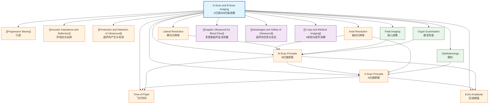

# A-Scan and B-Scan Imaging / A扫描与B扫描成像

---

# 1. Overview / 概述

**English:**
A-Scan (Amplitude Scan) and B-Scan (Brightness Scan) are two fundamental modes of ultrasound imaging used in medical diagnostics. This sub-topic explores how reflected ultrasound pulses are processed and displayed to create meaningful diagnostic information. A-Scan provides a one-dimensional view showing the amplitude of echoes against time/depth, primarily used in ophthalmology for measuring eye dimensions. B-Scan converts echo amplitudes into brightness levels on a two-dimensional cross-sectional image, enabling visualization of internal structures such as fetal development, organ abnormalities, and soft tissue injuries. Understanding the transition from A-Scan to B-Scan is crucial for grasping how modern ultrasound machines construct real-time images. This sub-topic builds on [[Production and Detection of Ultrasound]] and [[Acoustic Impedance and Reflection]], and connects to [[Doppler Ultrasound for Blood Flow]].

**中文:**
A扫描（振幅扫描）和B扫描（亮度扫描）是医学诊断中使用的两种基本超声成像模式。本子知识点探讨如何处理和显示反射的超声脉冲以创建有意义的诊断信息。A扫描提供一维视图，显示回波振幅随时间/深度的变化，主要用于眼科测量眼球尺寸。B扫描将回波振幅转换为二维横截面图像上的亮度级别，能够可视化内部结构，如胎儿发育、器官异常和软组织损伤。理解从A扫描到B扫描的过渡对于掌握现代超声机器如何构建实时图像至关重要。本子知识点建立在[[超声的产生与检测]]和[[声阻抗与反射]]的基础上，并与[[多普勒超声血流测量]]相关联。

---

# 2. Syllabus Learning Objectives / 考纲学习目标

| CAIE 9702 | Edexcel IAL |
|-----------|-------------|
| 26.2(a): Explain the principles of A-scan and B-scan ultrasound imaging | 11.7: Understand the principles of A-scan and B-scan ultrasound |
| 26.2(b): Interpret A-scan displays showing echo amplitude against time | 11.8: Interpret A-scan and B-scan images |
| 26.2(c): Explain how B-scan builds a 2D image from multiple A-scans | 11.9: Explain how B-scan images are formed |
| 26.2(d): Describe the use of A-scan in ophthalmology | 11.10: Describe applications of A-scan and B-scan |
| 26.2(e): Explain the factors affecting image resolution | 11.11: Understand factors affecting resolution |
| 26.2(f): Compare A-scan and B-scan in terms of information content | 11.12: Compare A-scan and B-scan |

**Examiner Expectations / 考官期望:**
- **English:** Students must be able to interpret A-scan traces, explain how B-scan images are constructed from multiple A-scan lines, and describe clinical applications. Understanding the relationship between echo amplitude, time-of-flight, and tissue depth is essential. Students should also be able to discuss resolution limitations including axial and lateral resolution.
- **中文:** 学生必须能够解读A扫描迹线，解释如何从多条A扫描线构建B扫描图像，并描述临床应用。理解回波振幅、飞行时间和组织深度之间的关系至关重要。学生还应能够讨论分辨率限制，包括轴向分辨率和横向分辨率。

---

# 3. Core Definitions / 核心定义

| Term (EN/CN) | Definition (EN) | Definition (CN) | Common Mistakes / 常见错误 |
|--------------|-----------------|-----------------|---------------------------|
| **A-Scan** / A扫描 | Amplitude Scan — a one-dimensional display showing the amplitude of reflected ultrasound echoes plotted against time (or depth) along a single beam path | 振幅扫描 — 一维显示，沿单束路径显示反射超声回波振幅随时间（或深度）的变化 | Confusing A-scan with B-scan; A-scan shows amplitude vs time, NOT a 2D image |
| **B-Scan** / B扫描 | Brightness Scan — a two-dimensional cross-sectional image where each echo is displayed as a bright dot, with brightness proportional to echo amplitude, and position determined by beam direction and time-of-flight | 亮度扫描 — 二维横截面图像，每个回波显示为一个亮点，亮度与回波振幅成正比，位置由波束方向和飞行时间决定 | Thinking B-scan is a "body scan" rather than "brightness scan" |
| **Time-of-Flight** / 飞行时间 | The time taken for an ultrasound pulse to travel from the transducer to a tissue boundary and back as an echo | 超声脉冲从换能器传播到组织边界并作为回波返回所需的时间 | Forgetting to divide by 2 when calculating depth (time is round-trip) |
| **Axial Resolution** / 轴向分辨率 | The minimum distance between two reflectors along the beam direction that can be distinguished as separate echoes; determined by pulse length | 沿波束方向可区分为独立回波的两个反射体之间的最小距离；由脉冲长度决定 | Confusing axial with lateral resolution |
| **Lateral Resolution** / 横向分辨率 | The minimum distance between two reflectors perpendicular to the beam direction that can be distinguished; determined by beam width | 垂直于波束方向可区分为独立回波的两个反射体之间的最小距离；由波束宽度决定 | Thinking lateral resolution is better than axial resolution (usually worse) |
| **Echo Amplitude** / 回波振幅 | The strength of a reflected ultrasound signal, determined by the acoustic impedance mismatch at tissue boundaries | 反射超声信号的强度，由组织边界处的声阻抗失配决定 | Assuming all echoes have same amplitude regardless of boundary type |

---

# 4. Key Concepts Explained / 关键概念详解

## 4.1 A-Scan Principle / A扫描原理

### Explanation / 解释
**English:** In A-Scan mode, a single ultrasound transducer emits a short pulse of ultrasound along a fixed direction. As the pulse travels through different tissues, echoes are generated at boundaries where there is a change in [[Acoustic Impedance and Reflection|acoustic impedance]]. The transducer then acts as a receiver, detecting these returning echoes. The time delay between pulse emission and echo reception is measured (time-of-flight). Since the speed of ultrasound in soft tissue is approximately constant (≈1540 m/s), the depth of each reflecting boundary can be calculated using:

$$ d = \frac{v \times t}{2} $$

where $d$ is depth, $v$ is speed of ultrasound in tissue, and $t$ is the round-trip time. The A-scan display plots echo amplitude on the y-axis against time (or calculated depth) on the x-axis. Each peak represents a tissue boundary, with peak height indicating the strength of reflection.

**中文:** 在A扫描模式下，单个超声换能器沿固定方向发射短超声脉冲。当脉冲穿过不同组织时，在[[声阻抗与反射|声阻抗]]发生变化的边界处产生回波。换能器随后作为接收器，检测这些返回的回波。测量脉冲发射和回波接收之间的时间延迟（飞行时间）。由于超声在软组织中的速度近似恒定（≈1540 m/s），每个反射边界的深度可通过以下公式计算：

$$ d = \frac{v \times t}{2} $$

其中 $d$ 是深度，$v$ 是超声在组织中的速度，$t$ 是往返时间。A扫描显示将回波振幅绘制在y轴上，时间（或计算深度）绘制在x轴上。每个峰值代表一个组织边界，峰值高度表示反射强度。

### Physical Meaning / 物理意义
**English:** The A-scan provides a "depth profile" along a single line through the body. It reveals the positions and relative strengths of tissue interfaces, allowing measurement of distances between structures (e.g., eye length, tumor depth). The absence of echoes indicates homogeneous tissue with no impedance changes.

**中文:** A扫描提供了沿身体单条线的"深度剖面"。它揭示了组织界面的位置和相对强度，允许测量结构之间的距离（例如，眼轴长度、肿瘤深度）。没有回波表示均匀组织，没有阻抗变化。

### Common Misconceptions / 常见误区
- **English:** 
  - Thinking A-scan produces an image — it produces a graph, not a picture
  - Forgetting the factor of 2 in the depth equation (time is round-trip)
  - Assuming all peaks represent different boundaries (some may be multiple reflections)
- **中文:**
  - 认为A扫描产生图像 — 它产生的是图形，不是图片
  - 忘记深度公式中的因子2（时间是往返的）
  - 假设所有峰值代表不同的边界（有些可能是多次反射）

### Exam Tips / 考试提示
- **English:** When interpreting A-scan traces, label each peak with the corresponding tissue boundary. Remember that the first peak is usually the transducer-tissue interface. Calculate depth using $d = vt/2$.
- **中文:** 解读A扫描迹线时，标记每个峰值对应的组织边界。记住第一个峰值通常是换能器-组织界面。使用 $d = vt/2$ 计算深度。

> 📷 **IMAGE PROMPT — A-SCAN-01: A-Scan Display Trace**
> A typical A-scan oscilloscope display showing echo amplitude (y-axis) against time/depth (x-axis). Label the initial pulse at t=0, then several peaks of decreasing amplitude representing echoes from tissue boundaries. Include a diagram showing the transducer positioned against the eye, with the ultrasound beam path through cornea, aqueous humor, lens, vitreous humor, and retina. Show how each boundary corresponds to a peak on the A-scan trace.

## 4.2 B-Scan Principle / B扫描原理

### Explanation / 解释
**English:** B-Scan (Brightness Scan) builds a two-dimensional cross-sectional image by combining multiple A-scan lines taken at different angles or positions. In a typical B-scan system, the ultrasound transducer is mechanically swept or an array of transducers is electronically steered to scan a plane through the body. For each beam direction, an A-scan is acquired. Instead of displaying amplitude as a vertical deflection, each echo is represented as a bright dot on a display screen. The brightness (or grayscale level) of each dot is proportional to the echo amplitude. The position of each dot is determined by:
- **Horizontal position:** determined by the beam direction (angle or lateral position)
- **Vertical position:** determined by the time-of-flight (depth)

By rapidly scanning many beam directions (typically 100-200 lines per frame), a real-time 2D image is constructed. The resulting image shows anatomical structures in cross-section, with bright regions indicating strong reflectors (e.g., bone, organ boundaries) and dark regions indicating homogeneous tissue or fluid-filled spaces.

**中文:** B扫描（亮度扫描）通过组合在不同角度或位置获取的多条A扫描线来构建二维横截面图像。在典型的B扫描系统中，超声换能器被机械扫描，或使用换能器阵列电子控制扫描通过身体的平面。对于每个波束方向，获取一条A扫描。不是将振幅显示为垂直偏转，而是将每个回波表示为显示屏上的一个亮点。每个点的亮度（或灰度级别）与回波振幅成正比。每个点的位置由以下因素决定：
- **水平位置：** 由波束方向（角度或横向位置）决定
- **垂直位置：** 由飞行时间（深度）决定

通过快速扫描许多波束方向（通常每帧100-200条线），构建实时二维图像。生成的图像显示解剖结构的横截面，亮区表示强反射体（例如，骨骼、器官边界），暗区表示均匀组织或充满液体的空间。

### Physical Meaning / 物理意义
**English:** B-scan converts the one-dimensional depth information from A-scans into a two-dimensional spatial map. This allows visualization of organ shapes, sizes, and relative positions. The grayscale encoding of echo amplitude provides information about tissue type and boundary characteristics.

**中文:** B扫描将来自A扫描的一维深度信息转换为二维空间图。这允许可视化器官形状、大小和相对位置。回波振幅的灰度编码提供了关于组织类型和边界特征的信息。

### Common Misconceptions / 常见误区
- **English:**
  - Thinking B-scan is a 3D image — it is a 2D cross-section
  - Believing B-scan directly shows tissue type — it shows reflectivity, not tissue identity
  - Confusing B-scan with real-time imaging (B-scan can be static or real-time)
- **中文:**
  - 认为B扫描是3D图像 — 它是二维横截面
  - 相信B扫描直接显示组织类型 — 它显示反射率，而不是组织身份
  - 混淆B扫描与实时成像（B扫描可以是静态或实时的）

### Exam Tips / 考试提示
- **English:** Understand that each B-scan image frame consists of many A-scan lines. The quality of the image depends on the number of lines per frame and the number of frames per second. Higher line density gives better lateral resolution but reduces frame rate.
- **中文:** 理解每个B扫描图像帧由许多A扫描线组成。图像质量取决于每帧的线数和每秒的帧数。更高的线密度提供更好的横向分辨率，但会降低帧率。

> 📷 **IMAGE PROMPT — B-SCAN-01: B-Scan Image Formation**
> A diagram showing how multiple A-scan lines (shown as vertical lines with amplitude peaks) are combined to form a B-scan image. Show a transducer array at the top, with ultrasound beams fanning out through tissue. Each beam direction produces an A-scan. The B-scan image below shows the resulting cross-section with bright dots representing echoes. Include labels for "transducer array", "A-scan lines", "B-scan image", "bright echo regions", and "shadow regions".

## 4.3 Comparison of A-Scan and B-Scan / A扫描与B扫描的比较

| Feature / 特征 | A-Scan / A扫描 | B-Scan / B扫描 |
|----------------|----------------|----------------|
| **Dimensionality / 维度** | 1D (amplitude vs depth) | 2D (cross-sectional image) |
| **Display / 显示** | Graph with peaks | Grayscale image |
| **Information / 信息** | Echo amplitude and depth only | Spatial relationships and echo patterns |
| **Scanning / 扫描** | Single beam direction | Multiple beam directions |
| **Real-time / 实时** | Usually static | Can be real-time (video rate) |
| **Resolution / 分辨率** | High axial resolution | Limited by line density |
| **Clinical Use / 临床应用** | Eye measurements, tissue characterization | Fetal imaging, organ examination, tumor detection |

---

# 5. Essential Equations / 核心公式

## 5.1 Depth Calculation / 深度计算

$$ d = \frac{v \times t}{2} $$

| Symbol (符号) | Meaning (EN) | Meaning (CN) | Unit (单位) |
|--------------|-------------|-------------|------------|
| $d$ | Depth of reflecting boundary | 反射边界深度 | m (or cm) |
| $v$ | Speed of ultrasound in tissue | 超声在组织中的速度 | m s⁻¹ |
| $t$ | Round-trip time (time-of-flight) | 往返时间（飞行时间） | s |

**Derivation / 推导:** The ultrasound pulse travels from transducer to boundary (distance $d$) and back (another $d$), so total distance traveled is $2d$. Using $distance = speed \times time$: $2d = vt$, therefore $d = vt/2$.

**Conditions / 适用条件:**
- **English:** Assumes constant speed of ultrasound in the medium. In soft tissue, $v \approx 1540$ m s⁻¹ is used as an average value.
- **中文:** 假设超声在介质中速度恒定。在软组织中，使用 $v \approx 1540$ m s⁻¹ 作为平均值。

**Limitations / 局限性:**
- **English:** Speed varies slightly between different tissue types (e.g., fat ≈ 1450 m s⁻¹, muscle ≈ 1580 m s⁻¹), introducing small errors in depth calculation.
- **中文:** 不同组织类型之间速度略有变化（例如，脂肪 ≈ 1450 m s⁻¹，肌肉 ≈ 1580 m s⁻¹），在深度计算中引入小误差。

## 5.2 Axial Resolution / 轴向分辨率

$$ \Delta z_{axial} = \frac{\lambda}{2} = \frac{v}{2f} $$

| Symbol (符号) | Meaning (EN) | Meaning (CN) | Unit (单位) |
|--------------|-------------|-------------|------------|
| $\Delta z_{axial}$ | Axial resolution (minimum separable distance) | 轴向分辨率（最小可分辨距离） | m |
| $\lambda$ | Wavelength of ultrasound | 超声波长 | m |
| $v$ | Speed of ultrasound | 超声速度 | m s⁻¹ |
| $f$ | Frequency of ultrasound | 超声频率 | Hz |

**Derivation / 推导:** Axial resolution is approximately half the pulse length. For a pulse of $n$ cycles, pulse length $L = n\lambda$. With $n=1$ (single cycle), $L = \lambda$, and two reflectors must be separated by at least $\lambda/2$ to produce distinct echoes.

**Conditions / 适用条件:**
- **English:** Best case scenario with single-cycle pulses. In practice, pulses contain 2-3 cycles, reducing resolution.
- **中文:** 单周期脉冲的最佳情况。实际上，脉冲包含2-3个周期，降低了分辨率。

**Limitations / 局限性:**
- **English:** Higher frequency improves axial resolution but reduces penetration depth due to increased attenuation.
- **中文:** 更高频率提高轴向分辨率，但由于衰减增加而减少穿透深度。

## 5.3 Lateral Resolution / 横向分辨率

$$ \Delta z_{lateral} \approx \text{beam width at focal point} $$

| Symbol (符号) | Meaning (EN) | Meaning (CN) | Unit (单位) |
|--------------|-------------|-------------|------------|
| $\Delta z_{lateral}$ | Lateral resolution | 横向分辨率 | m |

**Conditions / 适用条件:**
- **English:** Lateral resolution is best at the focal point of the transducer beam and degrades away from focus.
- **中文:** 横向分辨率在换能器波束的焦点处最佳，远离焦点时变差。

**Limitations / 局限性:**
- **English:** Lateral resolution is typically 2-3 times worse than axial resolution for the same frequency.
- **中文:** 对于相同频率，横向分辨率通常比轴向分辨率差2-3倍。

---

# 6. Graphs and Relationships / 图表与关系

## 6.1 A-Scan Display / A扫描显示

### Axes / 坐标轴
- **X-axis:** Time (or calculated depth) / 时间（或计算深度）
- **Y-axis:** Echo amplitude (voltage from transducer) / 回波振幅（换能器电压）

### Shape / 形状
**English:** The trace shows a series of peaks (spikes) at different time positions. The first large peak is usually the initial pulse at the transducer surface. Subsequent peaks represent echoes from tissue boundaries, with decreasing amplitude due to attenuation. Between peaks, the trace returns to baseline (no echoes from homogeneous tissue).

**中文:** 迹线显示在不同时间位置的一系列峰值（尖峰）。第一个大峰值通常是换能器表面的初始脉冲。随后的峰值代表来自组织边界的回波，由于衰减振幅逐渐减小。峰值之间，迹线回到基线（均匀组织无回波）。

### Gradient Meaning / 斜率含义
**English:** The gradient of the peak rising edge is related to the sharpness of the boundary. Steeper gradients indicate well-defined boundaries. The gradient of the overall envelope (connecting peak amplitudes) indicates the attenuation rate of the tissue.

**中文:** 峰值上升沿的斜率与边界的清晰度有关。更陡的斜率表示边界清晰。整体包络线（连接峰值振幅）的斜率表示组织的衰减率。

### Area Meaning / 面积含义
**English:** The area under each peak is related to the total energy reflected from that boundary. However, in standard A-scan interpretation, peak height (amplitude) is the primary diagnostic parameter, not area.

**中文:** 每个峰值下的面积与从该边界反射的总能量有关。然而，在标准A扫描解读中，峰值高度（振幅）是主要的诊断参数，而不是面积。

### Exam Interpretation / 考试解读
**English:** When given an A-scan trace, identify: (1) the initial pulse, (2) each echo peak, (3) the corresponding tissue boundary, (4) calculate depths using $d = vt/2$, (5) comment on relative echo strengths.

**中文:** 当给出A扫描迹线时，识别：(1) 初始脉冲，(2) 每个回波峰值，(3) 对应的组织边界，(4) 使用 $d = vt/2$ 计算深度，(5) 评论相对回波强度。

> 📷 **IMAGE PROMPT — A-SCAN-02: A-Scan of the Eye**
> An A-scan trace specifically for an eye examination. Label the initial pulse at the cornea, then peaks for anterior lens surface, posterior lens surface, and retina. Show the time axis with corresponding depths. Include a small diagram of the eye showing the ultrasound beam path through cornea, aqueous humor, lens, vitreous humor, and retina, with arrows connecting each boundary to its corresponding A-scan peak.

## 6.2 B-Scan Image Characteristics / B扫描图像特征

### Axes / 坐标轴
- **X-axis:** Lateral position (across the scan plane) / 横向位置（跨扫描平面）
- **Y-axis:** Depth (from transducer surface) / 深度（从换能器表面）

### Shape / 形状
**English:** The B-scan image appears as a grayscale cross-section. Bright (white) regions correspond to strong echoes from tissue boundaries or dense structures (bone, calcifications). Dark (black) regions correspond to homogeneous tissues or fluid-filled spaces (cysts, blood vessels, amniotic fluid). Gray regions represent soft tissues with intermediate reflectivity.

**中文:** B扫描图像显示为灰度横截面。亮（白色）区域对应来自组织边界或致密结构（骨骼、钙化）的强回波。暗（黑色）区域对应均匀组织或充满液体的空间（囊肿、血管、羊水）。灰色区域代表具有中等反射率的软组织。

### Gradient Meaning / 斜率含义
**English:** The rate of change of brightness across the image indicates tissue boundaries. Sharp transitions from bright to dark indicate well-defined boundaries. Gradual transitions suggest diffuse scattering or inhomogeneous tissue.

**中文:** 图像上亮度的变化率表示组织边界。从亮到暗的急剧过渡表示边界清晰。逐渐过渡表示漫散射或不均匀组织。

### Area Meaning / 面积含义
**English:** The area of bright or dark regions in a B-scan image corresponds to the cross-sectional area of anatomical structures. This can be used to measure organ sizes, tumor dimensions, or fetal measurements.

**中文:** B扫描图像中亮区或暗区的面积对应解剖结构的横截面积。这可用于测量器官大小、肿瘤尺寸或胎儿测量。

### Exam Interpretation / 考试解读
**English:** When interpreting B-scan images: (1) identify anatomical structures by their shape and position, (2) note the echogenicity (brightness) of different regions, (3) look for shadowing behind strong reflectors (acoustic shadowing), (4) identify anechoic (black) regions suggesting fluid-filled structures.

**中文:** 解读B扫描图像时：(1) 通过形状和位置识别解剖结构，(2) 注意不同区域的回声强度（亮度），(3) 寻找强反射体后面的阴影（声影），(4) 识别无回声（黑色）区域，提示充满液体的结构。

---

# 7. Required Diagrams / 必备图表

## 7.1 A-Scan System Diagram / A扫描系统图

### Description / 描述
**English:** A diagram showing the basic A-scan setup: a single ultrasound transducer placed against the skin or eye, emitting a pulse and receiving echoes. The signal is processed and displayed on an oscilloscope as amplitude vs time.

**中文:** 显示基本A扫描设置的图：单个超声换能器放置在皮肤或眼睛上，发射脉冲并接收回波。信号被处理并显示在示波器上，作为振幅与时间的关系。

### Image Prompt / 图片生成提示
> 📷 **IMAGE PROMPT — A-SCAN-SYS: A-Scan System Components**
> A clear diagram showing: (1) A single-element ultrasound transducer in contact with tissue (labeled), (2) A pulse generator connected to the transducer, (3) The same transducer connected to a receiver/amplifier, (4) An oscilloscope display showing the A-scan trace with labeled axes (amplitude vs time), (5) Arrows showing the ultrasound pulse traveling into tissue and echoes returning. Include labels: "Transducer", "Pulse Generator", "Receiver", "Oscilloscope Display", "Initial Pulse", "Echo 1", "Echo 2", "Time Base". Use a clean, educational style suitable for A-Level physics.

### Labels Required / 需要标注
- Transducer / 换能器
- Pulse generator / 脉冲发生器
- Receiver/amplifier / 接收器/放大器
- Oscilloscope display / 示波器显示
- Initial pulse / 初始脉冲
- Echo peaks / 回波峰值
- Time axis / 时间轴
- Amplitude axis / 振幅轴

### Exam Importance / 考试重要性
**English:** High — students are often asked to draw or label A-scan system diagrams and explain the function of each component.

**中文:** 高 — 学生经常被要求绘制或标注A扫描系统图，并解释每个组件的功能。

## 7.2 B-Scan Image Formation / B扫描图像形成

### Description / 描述
**English:** A diagram showing how multiple A-scan lines at different angles are combined to form a B-scan cross-sectional image. The transducer array or scanning mechanism is shown, along with the resulting fan-shaped image.

**中文:** 显示如何将不同角度的多条A扫描线组合形成B扫描横截面图像的图。显示换能器阵列或扫描机构，以及生成的扇形图像。

### Image Prompt / 图片生成提示
> 📷 **IMAGE PROMPT — B-SCAN-FORM: B-Scan Image Formation Process**
> A multi-panel diagram: Panel 1 shows a linear or phased array transducer on the skin surface, with ultrasound beams fanning out at different angles through tissue. Panel 2 shows individual A-scan traces for three different beam directions (left, center, right), each with echo peaks at different depths. Panel 3 shows the B-scan image being constructed, with each A-scan line converted to a column of bright dots. Panel 4 shows the final B-scan image with anatomical structures visible. Include labels: "Transducer Array", "Beam Direction 1,2,3...", "A-scan Lines", "B-scan Image", "Bright Echo Regions", "Shadow Region". Use arrows to show the conversion process.

### Labels Required / 需要标注
- Transducer array / 换能器阵列
- Ultrasound beams / 超声波束
- Scan plane / 扫描平面
- A-scan lines / A扫描线
- B-scan image / B扫描图像
- Echo brightness / 回波亮度
- Depth axis / 深度轴
- Lateral axis / 横向轴

### Exam Importance / 考试重要性
**English:** High — understanding how B-scan images are constructed from A-scan data is a key learning objective.

**中文:** 高 — 理解如何从A扫描数据构建B扫描图像是一个关键学习目标。

---

# 8. Worked Examples / 典型例题

## Example 1: A-Scan Eye Measurement / 示例1：A扫描眼测量

### Question / 题目
**English:** An A-scan ultrasound examination of the eye uses a transducer with ultrasound frequency 10 MHz. The speed of ultrasound in the eye is 1540 m s⁻¹. The A-scan trace shows the following time delays:
- Initial pulse at t = 0 μs
- Cornea-lens echo at t = 3.9 μs
- Lens-retina echo at t = 13.0 μs
- Retina echo at t = 20.8 μs

(a) Calculate the depth of the cornea-lens boundary.
(b) Calculate the thickness of the lens.
(c) Calculate the total length of the eye (cornea to retina).
(d) Explain why the retina echo might be weaker than the cornea echo.

**中文:** 对眼睛进行A扫描超声检查，使用频率为10 MHz的超声换能器。超声在眼中的速度为1540 m s⁻¹。A扫描迹线显示以下时间延迟：
- 初始脉冲在 t = 0 μs
- 角膜-晶状体回波在 t = 3.9 μs
- 晶状体-视网膜回波在 t = 13.0 μs
- 视网膜回波在 t = 20.8 μs

(a) 计算角膜-晶状体边界的深度。
(b) 计算晶状体的厚度。
(c) 计算眼睛的总长度（角膜到视网膜）。
(d) 解释为什么视网膜回波可能比角膜回波弱。

### Solution / 解答

**(a) Cornea-lens depth / 角膜-晶状体深度:**

Using $d = \frac{v \times t}{2}$:

$$ d = \frac{1540 \times 3.9 \times 10^{-6}}{2} = \frac{6.006 \times 10^{-3}}{2} = 3.003 \times 10^{-3} \text{ m} = 3.00 \text{ mm} $$

**(b) Lens thickness / 晶状体厚度:**

The lens-retina echo at t = 13.0 μs represents the posterior lens surface. The anterior lens surface is at t = 3.9 μs.

Time difference across lens = 13.0 - 3.9 = 9.1 μs

Lens thickness = $\frac{1540 \times 9.1 \times 10^{-6}}{2} = \frac{14.014 \times 10^{-3}}{2} = 7.007 \times 10^{-3} \text{ m} = 7.01 \text{ mm}$

**(c) Total eye length / 眼睛总长度:**

Retina echo at t = 20.8 μs represents the retina (back of eye).

Total eye length = $\frac{1540 \times 20.8 \times 10^{-6}}{2} = \frac{32.032 \times 10^{-3}}{2} = 16.016 \times 10^{-3} \text{ m} = 16.0 \text{ mm}$

**(d) Weaker retina echo / 视网膜回波较弱:**

**English:** The retina echo is weaker because: (1) The ultrasound pulse has been attenuated as it travels through the eye tissues, losing energy due to absorption and scattering. (2) The echo from the retina must travel back through the entire eye, undergoing further attenuation. (3) The acoustic impedance mismatch at the retina-vitreous humor boundary may be smaller than at the cornea-aqueous humor boundary, resulting in a smaller reflection coefficient.

**中文:** 视网膜回波较弱是因为：(1) 超声脉冲在穿过眼组织时已被衰减，由于吸收和散射而损失能量。(2) 来自视网膜的回波必须穿过整个眼睛返回，经历进一步衰减。(3) 视网膜-玻璃体边界处的声阻抗失配可能小于角膜-房水边界处，导致较小的反射系数。

### Final Answer / 最终答案
**Answer:** (a) 3.00 mm, (b) 7.01 mm, (c) 16.0 mm, (d) Attenuation and smaller impedance mismatch | **答案：** (a) 3.00 mm, (b) 7.01 mm, (c) 16.0 mm, (d) 衰减和较小的阻抗失配

### Quick Tip / 提示
**English:** Always convert time to seconds before calculation. Remember the factor of 2 in the depth equation. In eye measurements, the cornea echo is often the reference point (t=0 after initial pulse).

**中文:** 计算前始终将时间转换为秒。记住深度公式中的因子2。在眼测量中，角膜回波通常是参考点（初始脉冲后的t=0）。

## Example 2: B-Scan Resolution / 示例2：B扫描分辨率

### Question / 题目
**English:** A B-scan ultrasound system operates at 5 MHz. The speed of ultrasound in tissue is 1540 m s⁻¹.

(a) Calculate the axial resolution of the system, assuming single-cycle pulses.
(b) The lateral resolution is 3 times worse than the axial resolution. Calculate the lateral resolution.
(c) Explain how increasing the frequency to 10 MHz would affect both resolution and penetration depth.
(d) The system scans 100 lines per frame at 30 frames per second. Calculate the time available for each A-scan line.

**中文:** 一个B扫描超声系统以5 MHz工作。超声在组织中的速度为1540 m s⁻¹。

(a) 计算系统的轴向分辨率，假设单周期脉冲。
(b) 横向分辨率比轴向分辨率差3倍。计算横向分辨率。
(c) 解释将频率增加到10 MHz将如何影响分辨率和穿透深度。
(d) 系统以每秒30帧扫描每帧100条线。计算每条A扫描线可用的时间。

### Solution / 解答

**(a) Axial resolution / 轴向分辨率:**

$$ \lambda = \frac{v}{f} = \frac{1540}{5 \times 10^6} = 3.08 \times 10^{-4} \text{ m} = 0.308 \text{ mm} $$

$$ \Delta z_{axial} = \frac{\lambda}{2} = \frac{0.308}{2} = 0.154 \text{ mm} $$

**(b) Lateral resolution / 横向分辨率:**

$$ \Delta z_{lateral} = 3 \times \Delta z_{axial} = 3 \times 0.154 = 0.462 \text{ mm} $$

**(c) Effect of increasing frequency / 增加频率的影响:**

**English:** Increasing frequency to 10 MHz would:
- **Improve axial resolution:** $\lambda$ halves to 0.154 mm, so axial resolution improves to 0.077 mm
- **Improve lateral resolution:** proportionally improved
- **Reduce penetration depth:** Higher frequency ultrasound is attenuated more rapidly in tissue, so the maximum imaging depth decreases (typically from ~15 cm at 5 MHz to ~7 cm at 10 MHz)

**中文:** 将频率增加到10 MHz将：
- **提高轴向分辨率：** $\lambda$ 减半至0.154 mm，因此轴向分辨率提高到0.077 mm
- **提高横向分辨率：** 按比例提高
- **减少穿透深度：** 更高频率的超声在组织中衰减更快，因此最大成像深度减小（通常从5 MHz时的~15 cm减少到10 MHz时的~7 cm）

**(d) Time per A-scan line / 每条A扫描线的时间:**

Total time per frame = $\frac{1}{30} = 0.0333 \text{ s} = 33.3 \text{ ms}$

Time per line = $\frac{33.3}{100} = 0.333 \text{ ms} = 333 \text{ μs}$

### Final Answer / 最终答案
**Answer:** (a) 0.154 mm, (b) 0.462 mm, (c) Better resolution but less penetration, (d) 333 μs per line | **答案：** (a) 0.154 mm, (b) 0.462 mm, (c) 分辨率更好但穿透更浅, (d) 每条线333 μs

### Quick Tip / 提示
**English:** There is always a trade-off between resolution and penetration depth in ultrasound imaging. Higher frequency gives better resolution but shallower imaging.

**中文:** 超声成像中始终存在分辨率和穿透深度之间的权衡。更高频率提供更好的分辨率但更浅的成像深度。

---

# 9. Past Paper Question Types / 历年真题题型

| Question Type / 题型 | Frequency / 频率 | Difficulty / 难度 | Past Paper References / 真题索引 |
|----------------------|------------------|------------------|-------------------------------|
| A-scan trace interpretation / A扫描迹线解读 | High / 高 | Medium / 中 | 📝 *待填入* |
| B-scan image formation explanation / B扫描图像形成解释 | High / 高 | Medium / 中 | 📝 *待填入* |
| Depth calculation using $d = vt/2$ / 使用 $d = vt/2$ 计算深度 | High / 高 | Low / 低 | 📝 *待填入* |
| Resolution calculation (axial/lateral) / 分辨率计算（轴向/横向） | Medium / 中 | Medium / 中 | 📝 *待填入* |
| Comparison of A-scan and B-scan / A扫描与B扫描比较 | Medium / 中 | Low / 低 | 📝 *待填入* |
| Clinical applications / 临床应用 | Medium / 中 | Medium / 中 | 📝 *待填入* |
| Frequency-resolution-penetration trade-off / 频率-分辨率-穿透权衡 | Medium / 中 | Medium / 中 | 📝 *待填入* |

**Common Command Words / 常见指令词:**
- **English:** Explain, Describe, Calculate, Compare, Interpret, Sketch, State
- **中文:** 解释、描述、计算、比较、解读、绘制、说明

---

# 10. Practical Skills Connections / 实验技能链接

**English:**
This sub-topic connects to practical skills in several ways:

1. **Time-of-Flight Measurements:** In practical experiments, students may use an oscilloscope to measure the time delay between transmitted and received ultrasound pulses. This requires accurate cursor placement and understanding of timebase settings.

2. **Calibration:** The speed of ultrasound in the medium must be known or measured. Students should understand how to calibrate the system using a known distance.

3. **Resolution Determination:** Practical determination of axial resolution involves imaging two closely spaced reflectors and finding the minimum separation that produces distinct echoes.

4. **Signal Processing:** Understanding how echo amplitude is converted to brightness in B-scan involves concepts of signal amplification, thresholding, and gray-scale mapping.

5. **Uncertainty Analysis:** Depth measurements from A-scan have uncertainties due to:
   - Finite pulse length (limits time measurement precision)
   - Variation in ultrasound speed between tissue types
   - Oscilloscope reading uncertainty
   - Temperature dependence of ultrasound speed

6. **Graph Plotting:** Students may be asked to plot A-scan traces from given data or to construct a B-scan image from multiple A-scan datasets.

**中文:**
本子知识点通过多种方式与实验技能联系：

1. **飞行时间测量：** 在实验实践中，学生可能使用示波器测量发射和接收超声脉冲之间的时间延迟。这需要准确的光标放置和理解时基设置。

2. **校准：** 必须知道或测量介质中的超声速度。学生应理解如何使用已知距离校准系统。

3. **分辨率确定：** 轴向分辨率的实验确定涉及成像两个紧密间隔的反射体，并找到产生独立回波的最小间距。

4. **信号处理：** 理解回波振幅如何转换为B扫描中的亮度涉及信号放大、阈值和灰度映射的概念。

5. **不确定度分析：** 来自A扫描的深度测量具有不确定度，原因包括：
   - 有限脉冲长度（限制时间测量精度）
   - 不同组织类型之间超声速度的变化
   - 示波器读数不确定度
   - 超声速度的温度依赖性

6. **图形绘制：** 学生可能被要求从给定数据绘制A扫描迹线，或从多个A扫描数据集构建B扫描图像。

---

# 11. Concept Map / 概念图谱

---

# 12. Quick Revision Sheet / 速查表

| Category / 类别 | Key Points / 要点 |
|----------------|------------------|
| **Definition / 定义** | **A-Scan:** 1D amplitude vs time display / 一维振幅与时间显示 |
| | **B-Scan:** 2D brightness image from multiple A-scans / 来自多条A扫描的二维亮度图像 |
| **Key Formula / 核心公式** | $d = \frac{vt}{2}$ — Depth from time-of-flight / 从飞行时间计算深度 |
| | $\Delta z_{axial} = \frac{\lambda}{2} = \frac{v}{2f}$ — Axial resolution / 轴向分辨率 |
| **Key Graph / 核心图表** | **A-Scan:** Peaks on oscilloscope trace / 示波器迹线上的峰值 |
| | **B-Scan:** Grayscale cross-sectional image / 灰度横截面图像 |
| **Exam Tip / 考试提示** | Always divide time by 2 for depth / 计算深度时始终将时间除以2 |
| | Higher frequency = better resolution but less penetration / 更高频率 = 更好分辨率但更浅穿透 |
| | A-scan = graph, B-scan = image / A扫描 = 图形, B扫描 = 图像 |
| **Common Application / 常见应用** | A-scan: Eye length measurement for cataract surgery / 白内障手术的眼轴长度测量 |
| | B-scan: Fetal ultrasound, abdominal organ imaging / 胎儿超声、腹部器官成像 |
| **Resolution Comparison / 分辨率比较** | Axial resolution is better than lateral resolution / 轴向分辨率优于横向分辨率 |
| | Axial resolution depends on frequency / 轴向分辨率取决于频率 |
| | Lateral resolution depends on beam focusing / 横向分辨率取决于波束聚焦 |
| **Key Comparison / 关键比较** | A-Scan: Single beam, 1D, amplitude vs depth / 单束、一维、振幅与深度 |
| | B-Scan: Multiple beams, 2D, brightness image / 多束、二维、亮度图像 |

---

> 📋 **CIE Only:** CAIE 9702 specifically requires understanding of A-scan in ophthalmology and the interpretation of A-scan traces for eye measurements. Students should be able to calculate eye dimensions from given time-of-flight data.

> 📋 **Edexcel Only:** Edexcel IAL places more emphasis on the comparison between A-scan and B-scan in terms of information content and clinical applications. Students should understand the technical factors affecting image quality including line density and frame rate.