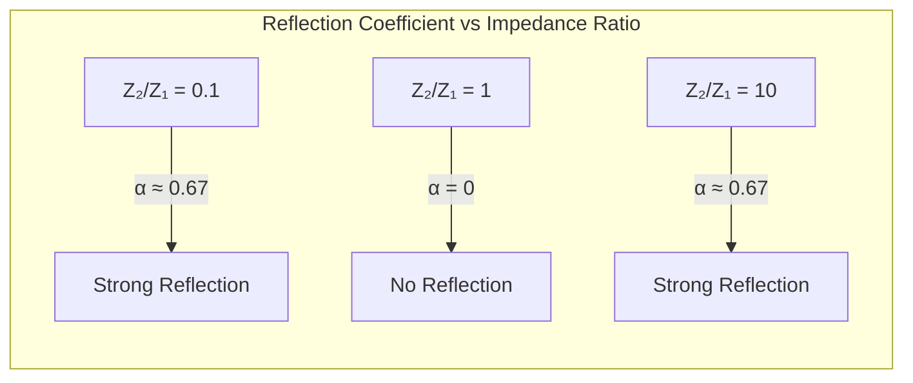

# 1. Overview / 概述

**English:**
Acoustic impedance and reflection form the physical foundation of ultrasound imaging. When an ultrasound wave travels through different tissues in the body, the change in acoustic impedance at tissue boundaries determines how much of the wave is reflected back to the transducer. This reflected signal (echo) is what creates the ultrasound image. Understanding acoustic impedance is crucial for interpreting why different tissues appear bright or dark on an ultrasound scan, and why a coupling gel is needed between the transducer and skin. This sub-topic connects directly to [[Production and Detection of Ultrasound]] and [[A-Scan and B-Scan Imaging]].

**中文:**
声阻抗和反射构成了超声成像的物理基础。当超声波在体内不同组织中传播时，组织边界处声阻抗的变化决定了有多少波被反射回换能器。这种反射信号（回波）就是形成超声图像的基础。理解声阻抗对于解释为什么不同组织在超声扫描中呈现亮或暗，以及为什么换能器和皮肤之间需要耦合凝胶至关重要。本子知识点直接联系到[[超声波的产生与检测]]和[[A扫描与B扫描成像]]。

---

# 2. Syllabus Learning Objectives / 考纲学习目标

| CAIE 9702 | Edexcel IAL |
|-----------|-------------|
| 26.2(a) Define specific acoustic impedance | 11.7 Define acoustic impedance |
| 26.2(b) Use the equation $Z = \rho c$ | 11.8 Use $Z = \rho c$ |
| 26.2(c) Calculate intensity reflection coefficient | 11.9 Use $I_r/I_0 = (Z_2 - Z_1)^2/(Z_2 + Z_1)^2$ |
| 26.2(d) Explain why coupling gel is needed | 11.10 Explain the need for impedance matching |
| 26.2(e) Explain why different tissues produce different echoes | 11.11 Relate reflection to tissue boundaries |
| 26.2(f) Interpret A-scan and B-scan images | 11.12 Interpret ultrasound scans |

**Examiner Expectations / 考官期望:**
- **English:** Students must be able to calculate acoustic impedance from density and wave speed, calculate the intensity reflection coefficient at a boundary, explain why coupling gel is essential, and relate echo strength to tissue type differences.
- **中文:** 学生必须能够从密度和波速计算声阻抗，计算边界处的强度反射系数，解释为什么耦合凝胶是必需的，并将回波强度与组织类型差异联系起来。

---

# 3. Core Definitions / 核心定义

| Term (EN/CN) | Definition (EN) | Definition (CN) | Common Mistakes / 常见错误 |
|--------------|-----------------|-----------------|---------------------------|
| **Acoustic Impedance** / 声阻抗 | The product of the density of a medium and the speed of ultrasound in that medium: $Z = \rho c$ | 介质密度与超声波在该介质中速度的乘积：$Z = \rho c$ | Confusing $c$ with speed of light; forgetting units are kg m⁻² s⁻¹ |
| **Intensity Reflection Coefficient** / 强度反射系数 | The ratio of reflected intensity to incident intensity at a boundary between two media: $\alpha = \frac{I_r}{I_0} = \left(\frac{Z_2 - Z_1}{Z_2 + Z_1}\right)^2$ | 两种介质边界处反射强度与入射强度之比：$\alpha = \frac{I_r}{I_0} = \left(\frac{Z_2 - Z_1}{Z_2 + Z_1}\right)^2$ | Forgetting the square; using $Z_1 - Z_2$ instead of $Z_2 - Z_1$ (same result due to square) |
| **Coupling Gel** / 耦合凝胶 | A gel applied between the transducer and skin to eliminate air gaps, ensuring efficient transmission of ultrasound into the body | 涂抹在换能器和皮肤之间的凝胶，用于消除空气间隙，确保超声波有效传入体内 | Thinking gel is for lubrication only; not understanding the impedance mismatch with air |
| **Echo** / 回波 | A reflected ultrasound pulse that returns to the transducer from a tissue boundary | 从组织边界返回换能器的反射超声波脉冲 | Confusing echo with transmitted wave |
| **Impedance Matching** / 阻抗匹配 | The process of reducing the difference in acoustic impedance between two media to maximize transmission of ultrasound | 减少两种介质之间声阻抗差异以最大化超声波传输的过程 | Thinking matching means equal impedance (would give zero reflection but also zero transmission in some contexts) |

---

# 4. Key Concepts Explained / 关键概念详解

## 4.1 Acoustic Impedance / 声阻抗

### Explanation / 解释
**English:**
Acoustic impedance $Z$ is a property of a medium that describes how much resistance it offers to the passage of ultrasound waves. It is defined as:

$$ Z = \rho c $$

where $\rho$ is the density of the medium (kg m⁻³) and $c$ is the speed of ultrasound in that medium (m s⁻¹). The unit of acoustic impedance is kg m⁻² s⁻¹ (also called the **rayl**).

For biological tissues, acoustic impedance varies significantly:
- Air: $Z \approx 4.3 \times 10^2$ kg m⁻² s⁻¹
- Fat: $Z \approx 1.3 \times 10^6$ kg m⁻² s⁻¹
- Muscle: $Z \approx 1.7 \times 10^6$ kg m⁻² s⁻¹
- Bone: $Z \approx 7.8 \times 10^6$ kg m⁻² s⁻¹

This variation is what makes ultrasound imaging possible — different tissues reflect different amounts of ultrasound.

**中文:**
声阻抗 $Z$ 是介质的一种属性，描述了它对超声波传播的阻力大小。其定义为：

$$ Z = \rho c $$

其中 $\rho$ 是介质的密度（kg m⁻³），$c$ 是超声波在该介质中的速度（m s⁻¹）。声阻抗的单位是 kg m⁻² s⁻¹（也称为**瑞利**）。

对于生物组织，声阻抗差异显著：
- 空气：$Z \approx 4.3 \times 10^2$ kg m⁻² s⁻¹
- 脂肪：$Z \approx 1.3 \times 10^6$ kg m⁻² s⁻¹
- 肌肉：$Z \approx 1.7 \times 10^6$ kg m⁻² s⁻¹
- 骨骼：$Z \approx 7.8 \times 10^6$ kg m⁻² s⁻¹

这种差异使得超声成像成为可能——不同组织反射不同量的超声波。

### Physical Meaning / 物理意义
**English:**
Acoustic impedance is analogous to electrical impedance in circuits. Just as electrical impedance determines how much current flows for a given voltage, acoustic impedance determines how much of the ultrasound wave is transmitted versus reflected at a boundary. A high impedance means the medium is "harder" for the wave to move through.

**中文:**
声阻抗类似于电路中的电阻抗。就像电阻抗决定了给定电压下电流的大小一样，声阻抗决定了在边界处有多少超声波被传输与反射。高阻抗意味着介质对波的传播更"困难"。

### Common Misconceptions / 常见误区
- **Misconception:** Acoustic impedance depends only on density. / 声阻抗只取决于密度。
  **Correction:** It depends on BOTH density AND wave speed. / 它同时取决于密度和波速。
- **Misconception:** Higher density always means higher impedance. / 密度越高阻抗一定越大。
  **Correction:** Bone has higher density than muscle, but also higher wave speed, so its impedance is much higher. / 骨骼密度高于肌肉，波速也更高，所以其阻抗远高于肌肉。
- **Misconception:** Impedance is the same as resistance to sound. / 阻抗等于对声音的阻力。
  **Correction:** It's more about the "stiffness" of the medium — how the medium responds to the pressure wave. / 它更多是关于介质的"刚度"——介质如何响应压力波。

### Exam Tips / 考试提示
- **English:** Always write the unit of $Z$ as kg m⁻² s⁻¹. Memorize approximate $Z$ values for air, soft tissue, and bone. Be prepared to explain why air has such low impedance.
- **中文:** 始终将 $Z$ 的单位写为 kg m⁻² s⁻¹。记住空气、软组织和骨骼的近似 $Z$ 值。准备好解释为什么空气的阻抗如此之低。

> 📷 **IMAGE PROMPT — Z-COMPARISON: Acoustic Impedance Values for Different Biological Tissues**
> A bar chart comparing acoustic impedance values (in kg m⁻² s⁻¹) for air, fat, blood, muscle, and bone. Each bar is labeled with the tissue name and its Z value. The air bar is extremely small compared to the bone bar. Use a logarithmic scale if necessary to show all values clearly. Include a color gradient from blue (low Z) to red (high Z).

## 4.2 Reflection at Boundaries / 边界处的反射

### Explanation / 解释
**English:**
When an ultrasound wave encounters a boundary between two tissues with different acoustic impedances ($Z_1$ and $Z_2$), part of the wave is reflected and part is transmitted. The **intensity reflection coefficient** $\alpha$ (or $R$) gives the fraction of incident intensity that is reflected:

$$ \alpha = \frac{I_r}{I_0} = \left(\frac{Z_2 - Z_1}{Z_2 + Z_1}\right)^2 $$

where:
- $I_r$ = reflected intensity
- $I_0$ = incident intensity
- $Z_1$ = acoustic impedance of first medium
- $Z_2$ = acoustic impedance of second medium

Key observations:
- If $Z_1 = Z_2$, then $\alpha = 0$ — no reflection (all transmitted)
- If $Z_2 \gg Z_1$ or $Z_1 \gg Z_2$, then $\alpha \approx 1$ — almost all reflected
- The larger the impedance mismatch, the stronger the echo

**中文:**
当超声波遇到两种不同声阻抗（$Z_1$ 和 $Z_2$）组织之间的边界时，部分波被反射，部分被传输。**强度反射系数** $\alpha$（或 $R$）给出了入射强度中被反射的比例：

$$ \alpha = \frac{I_r}{I_0} = \left(\frac{Z_2 - Z_1}{Z_2 + Z_1}\right)^2 $$

其中：
- $I_r$ = 反射强度
- $I_0$ = 入射强度
- $Z_1$ = 第一种介质的声阻抗
- $Z_2$ = 第二种介质的声阻抗

关键观察：
- 如果 $Z_1 = Z_2$，则 $\alpha = 0$ — 无反射（全部传输）
- 如果 $Z_2 \gg Z_1$ 或 $Z_1 \gg Z_2$，则 $\alpha \approx 1$ — 几乎全部反射
- 阻抗不匹配越大，回波越强

### Physical Meaning / 物理意义
**English:**
The reflection coefficient tells us how "visible" a tissue boundary is to ultrasound. A large impedance mismatch (like air-tissue or bone-soft tissue) produces a very strong echo, appearing bright on the image. A small mismatch (like between different soft tissues) produces a weak echo, appearing darker. This is why ultrasound cannot image through bone or air — almost all the energy is reflected at the first boundary.

**中文:**
反射系数告诉我们组织边界对超声波的"可见度"。大的阻抗不匹配（如空气-组织或骨骼-软组织）产生非常强的回波，在图像上呈现亮色。小的不匹配（如不同软组织之间）产生弱回波，呈现较暗。这就是为什么超声波无法穿透骨骼或空气——几乎所有能量都在第一个边界处被反射。

### Common Misconceptions / 常见误区
- **Misconception:** The reflection coefficient depends on the direction of travel. / 反射系数取决于传播方向。
  **Correction:** The formula uses $(Z_2 - Z_1)^2$, so the result is the same regardless of direction. / 公式使用 $(Z_2 - Z_1)^2$，所以结果与方向无关。
- **Misconception:** A high reflection coefficient means the transmitted intensity is also high. / 高反射系数意味着传输强度也高。
  **Correction:** Energy is conserved: $I_0 = I_r + I_t$, so high reflection means low transmission. / 能量守恒：$I_0 = I_r + I_t$，所以高反射意味着低传输。
- **Misconception:** The reflection coefficient is always less than 1. / 反射系数总是小于1。
  **Correction:** It is always between 0 and 1 (inclusive). / 它总是在0和1之间（包括端点）。

### Exam Tips / 考试提示
- **English:** When calculating $\alpha$, always square the fraction. Show the intermediate step with the fraction before squaring. Remember that $\alpha$ is dimensionless.
- **中文:** 计算 $\alpha$ 时，始终对分数进行平方。在平方前显示中间步骤的分数。记住 $\alpha$ 是无量纲的。

## 4.3 The Need for Coupling Gel / 耦合凝胶的必要性

### Explanation / 解释
**English:**
When the transducer is placed directly on the skin, there is a thin layer of air between them. The acoustic impedance of air ($\approx 4.3 \times 10^2$ kg m⁻² s⁻¹) is vastly different from that of skin/soft tissue ($\approx 1.6 \times 10^6$ kg m⁻² s⁻¹). Using the reflection coefficient formula:

$$ \alpha = \left(\frac{1.6 \times 10^6 - 4.3 \times 10^2}{1.6 \times 10^6 + 4.3 \times 10^2}\right)^2 \approx 0.999 $$

This means **99.9% of the ultrasound is reflected** at the air-skin boundary, and almost none enters the body. Coupling gel has an acoustic impedance very close to that of soft tissue ($\approx 1.5 \times 10^6$ kg m⁻² s⁻¹), so it fills the gap and allows efficient transmission.

**中文:**
当换能器直接放在皮肤上时，它们之间有一薄层空气。空气的声阻抗（$\approx 4.3 \times 10^2$ kg m⁻² s⁻¹）与皮肤/软组织（$\approx 1.6 \times 10^6$ kg m⁻² s⁻¹）的声阻抗差异巨大。使用反射系数公式：

$$ \alpha = \left(\frac{1.6 \times 10^6 - 4.3 \times 10^2}{1.6 \times 10^6 + 4.3 \times 10^2}\right)^2 \approx 0.999 $$

这意味着**99.9%的超声波在空气-皮肤边界处被反射**，几乎没有进入体内。耦合凝胶的声阻抗非常接近软组织（$\approx 1.5 \times 10^6$ kg m⁻² s⁻¹），因此它填充了间隙并允许有效传输。

### Physical Meaning / 物理意义
**English:**
Coupling gel acts as an **impedance matching** layer. By replacing the air gap with a material of similar impedance to tissue, the reflection at the transducer-skin interface is dramatically reduced, allowing most of the ultrasound energy to enter the body for imaging.

**中文:**
耦合凝胶充当**阻抗匹配**层。通过用与组织阻抗相似的材料替换空气间隙，换能器-皮肤界面处的反射显著减少，使得大部分超声波能量进入体内进行成像。

### Common Misconceptions / 常见误区
- **Misconception:** Coupling gel is just a lubricant. / 耦合凝胶只是润滑剂。
  **Correction:** Its primary purpose is impedance matching, not lubrication. / 其主要目的是阻抗匹配，而非润滑。
- **Misconception:** Water could replace coupling gel. / 水可以替代耦合凝胶。
  **Correction:** Water has $Z \approx 1.5 \times 10^6$ kg m⁻² s⁻¹, similar to tissue, so it works reasonably well, but gel is better at eliminating all air bubbles. / 水的 $Z \approx 1.5 \times 10^6$ kg m⁻² s⁻¹，与组织相似，所以效果尚可，但凝胶在消除所有气泡方面更好。

### Exam Tips / 考试提示
- **English:** Be prepared to calculate the reflection coefficient for an air-skin boundary to show why gel is needed. State that gel has similar impedance to tissue.
- **中文:** 准备好计算空气-皮肤边界的反射系数以说明为什么需要凝胶。说明凝胶具有与组织相似的阻抗。

> 📷 **IMAGE PROMPT — COUPLING-GEL: Ultrasound Transducer with and without Coupling Gel**
> Split diagram showing two scenarios. Left: Transducer on skin with air gap — large arrow showing ultrasound being reflected back at the air gap, tiny arrow showing transmission into skin. Right: Transducer on skin with coupling gel — large arrow showing ultrasound entering the skin, small arrow showing reflection. Label the acoustic impedance values for air, gel, and skin. Use red for reflected waves and green for transmitted waves.

---

# 5. Essential Equations / 核心公式

## Equation 1: Acoustic Impedance / 声阻抗

$$ Z = \rho c $$

| Symbol (符号) | Meaning (EN) | Meaning (CN) | Unit (单位) |
|--------------|-------------|-------------|------------|
| $Z$ | Acoustic impedance | 声阻抗 | kg m⁻² s⁻¹ |
| $\rho$ | Density of medium | 介质密度 | kg m⁻³ |
| $c$ | Speed of ultrasound in medium | 超声波在介质中的速度 | m s⁻¹ |

**Derivation / 推导:**
Acoustic impedance is defined as the product of density and wave speed. It arises from the relationship between pressure and particle velocity in a sound wave. No derivation is required at A-Level.

**Conditions / 适用条件:**
- **English:** Valid for all media (solids, liquids, gases) provided the medium is homogeneous and isotropic.
- **中文:** 适用于所有介质（固体、液体、气体），前提是介质均匀且各向同性。

**Limitations / 局限性:**
- **English:** Assumes constant density and wave speed; real tissues may have variations.
- **中文:** 假设密度和波速恒定；实际组织可能存在变化。

## Equation 2: Intensity Reflection Coefficient / 强度反射系数

$$ \alpha = \frac{I_r}{I_0} = \left(\frac{Z_2 - Z_1}{Z_2 + Z_1}\right)^2 $$

| Symbol (符号) | Meaning (EN) | Meaning (CN) | Unit (单位) |
|--------------|-------------|-------------|------------|
| $\alpha$ | Intensity reflection coefficient | 强度反射系数 | dimensionless (无量纲) |
| $I_r$ | Reflected intensity | 反射强度 | W m⁻² |
| $I_0$ | Incident intensity | 入射强度 | W m⁻² |
| $Z_1, Z_2$ | Acoustic impedances of two media | 两种介质的声阻抗 | kg m⁻² s⁻¹ |

**Derivation / 推导:**
This formula is derived from the boundary conditions for pressure and particle velocity at an interface. A-Level students are expected to use it, not derive it.

**Conditions / 适用条件:**
- **English:** Valid for normal incidence (wave perpendicular to boundary). For oblique incidence, the formula is more complex.
- **中文:** 适用于垂直入射（波垂直于边界）。对于斜入射，公式更复杂。

**Limitations / 局限性:**
- **English:** Does not account for absorption or scattering within the medium; assumes a perfect plane boundary.
- **中文:** 不考虑介质内的吸收或散射；假设为完美平面边界。

> 📷 **IMAGE PROMPT — REFLECTION-DIAGRAM: Ultrasound Reflection at a Tissue Boundary**
> A diagram showing an ultrasound wave (arrow) traveling from medium 1 (Z₁) to medium 2 (Z₂). At the boundary, the wave splits into a reflected wave (arrow going back into medium 1) and a transmitted wave (arrow continuing into medium 2). Label I₀ (incident), Iᵣ (reflected), and Iₜ (transmitted). Show the boundary as a vertical dashed line. Use different colors for each wave.

---

# 6. Graphs and Relationships / 图表与关系

## 6.1 Reflection Coefficient vs. Impedance Ratio / 反射系数与阻抗比的关系

### Axes / 坐标轴
- **X-axis:** Impedance ratio $Z_2/Z_1$ (dimensionless) / 阻抗比 $Z_2/Z_1$（无量纲）
- **Y-axis:** Intensity reflection coefficient $\alpha$ (dimensionless, 0 to 1) / 强度反射系数 $\alpha$（无量纲，0到1）

### Shape / 形状
**English:** The graph is symmetric about $Z_2/Z_1 = 1$ on a logarithmic scale. At $Z_2/Z_1 = 1$, $\alpha = 0$. As the ratio deviates from 1 in either direction, $\alpha$ increases rapidly, approaching 1 for very large or very small ratios.

**中文:** 在对数坐标上，图形关于 $Z_2/Z_1 = 1$ 对称。在 $Z_2/Z_1 = 1$ 处，$\alpha = 0$。当比值偏离1时，$\alpha$ 迅速增加，对于非常大或非常小的比值趋近于1。

### Gradient Meaning / 斜率含义
**English:** The gradient shows how sensitive the reflection is to changes in impedance mismatch. The steepest gradient occurs near $Z_2/Z_1 = 1$, meaning small differences in impedance produce significant reflections.

**中文:** 斜率显示了反射对阻抗不匹配变化的敏感程度。最陡的斜率出现在 $Z_2/Z_1 = 1$ 附近，意味着阻抗的微小差异会产生显著的反射。

### Area Meaning / 面积含义
**English:** Not applicable for this graph.

**中文:** 不适用于此图。

### Exam Interpretation / 考试解读
**English:** Be able to sketch this graph and explain why even small impedance mismatches (like between different soft tissues) produce detectable echoes. Also explain why air-tissue and bone-tissue boundaries produce very strong echoes.

**中文:** 能够画出此图并解释为什么即使是很小的阻抗不匹配（如不同软组织之间）也能产生可检测的回波。还要解释为什么空气-组织和骨骼-组织边界产生非常强的回波。



---

# 7. Required Diagrams / 必备图表

## 7.1 Ultrasound Reflection at Tissue Boundaries / 组织边界处的超声波反射

### Description / 描述
**English:** A diagram showing an ultrasound wave traveling through multiple tissue layers (e.g., skin → fat → muscle → bone). At each boundary, the wave splits into reflected and transmitted components. The strength of each reflected wave (echo) depends on the impedance mismatch at that boundary.

**中文:** 显示超声波穿过多个组织层（如皮肤→脂肪→肌肉→骨骼）的示意图。在每个边界处，波分为反射和传输分量。每个反射波（回波）的强度取决于该边界处的阻抗不匹配。

### Image Prompt / 图片生成提示
> 📷 **IMAGE PROMPT — TISSUE-BOUNDARIES: Ultrasound Wave Through Multiple Tissue Layers**
> A cross-sectional diagram showing four tissue layers: skin (top), fat, muscle, and bone (bottom). An ultrasound transducer is at the top. A vertical arrow represents the ultrasound beam traveling downward. At each tissue boundary, a smaller arrow branches off to the side representing the reflected echo. The size of the reflected arrow increases at boundaries with larger impedance mismatch. The bone boundary shows a very large reflected arrow (almost all energy reflected). Label each tissue with its acoustic impedance value. Use a color gradient from blue (low Z) to red (high Z).

### Labels Required / 需要标注
- **English:** Transducer, skin, fat, muscle, bone, incident wave, reflected wave (echo), transmitted wave, acoustic impedance values
- **中文:** 换能器、皮肤、脂肪、肌肉、骨骼、入射波、反射波（回波）、传输波、声阻抗值

### Exam Importance / 考试重要性
- **English:** High — this diagram is frequently used to explain why different tissues appear different on ultrasound scans and why bone appears as a bright white line with a dark shadow behind it.
- **中文:** 高——此图常用于解释为什么不同组织在超声扫描中呈现不同，以及为什么骨骼呈现亮白线且后方有暗影。

## 7.2 A-Scan Display / A扫描显示

### Description / 描述
**English:** An A-scan (amplitude scan) display shows reflected pulse amplitude on the y-axis against time (or depth) on the x-axis. Each peak corresponds to a tissue boundary. The height of the peak indicates the strength of the reflection (impedance mismatch).

**中文:** A扫描（幅度扫描）显示在y轴上显示反射脉冲幅度，x轴上显示时间（或深度）。每个峰值对应一个组织边界。峰值高度表示反射强度（阻抗不匹配）。

### Image Prompt / 图片生成提示
> 📷 **IMAGE PROMPT — A-SCAN: A-Scan Display Showing Tissue Boundaries**
> A graph with time/depth on the x-axis (increasing to the right) and amplitude on the y-axis. Show several peaks: a small peak at the skin-fat boundary, a medium peak at the fat-muscle boundary, and a very large peak at the muscle-bone boundary. Label each peak with the corresponding tissue boundary. Show the baseline as zero amplitude. Include a time axis with units (μs) and a depth scale (cm).

### Labels Required / 需要标注
- **English:** Time/depth axis, amplitude axis, skin-fat echo, fat-muscle echo, muscle-bone echo, baseline
- **中文:** 时间/深度轴、幅度轴、皮肤-脂肪回波、脂肪-肌肉回波、肌肉-骨骼回波、基线

### Exam Importance / 考试重要性
- **English:** High — students must be able to interpret A-scan displays and relate peak positions and heights to tissue boundaries and impedance mismatches.
- **中文:** 高——学生必须能够解释A扫描显示，并将峰值位置和高度与组织边界和阻抗不匹配联系起来。

---

# 8. Worked Examples / 典型例题

## Example 1: Calculating Acoustic Impedance / 计算声阻抗

### Question / 题目
**English:**
The density of muscle tissue is 1080 kg m⁻³ and the speed of ultrasound in muscle is 1580 m s⁻¹. Calculate the acoustic impedance of muscle.

**中文:**
肌肉组织的密度为1080 kg m⁻³，超声波在肌肉中的速度为1580 m s⁻¹。计算肌肉的声阻抗。

### Solution / 解答

**Step 1:** Write down the formula.
$$ Z = \rho c $$

**Step 2:** Substitute values.
$$ Z = 1080 \times 1580 $$

**Step 3:** Calculate.
$$ Z = 1.71 \times 10^6 \text{ kg m}^{-2} \text{ s}^{-1} $$

### Final Answer / 最终答案
**Answer:** $Z = 1.71 \times 10^6$ kg m⁻² s⁻¹ | **答案：** $Z = 1.71 \times 10^6$ kg m⁻² s⁻¹

### Quick Tip / 提示
- **English:** Always include units in your answer. The unit kg m⁻² s⁻¹ is sometimes called the rayl.
- **中文:** 始终在答案中包含单位。单位 kg m⁻² s⁻¹ 有时称为瑞利。

## Example 2: Calculating Intensity Reflection Coefficient / 计算强度反射系数

### Question / 题目
**English:**
Ultrasound travels from fat ($Z = 1.3 \times 10^6$ kg m⁻² s⁻¹) into muscle ($Z = 1.7 \times 10^6$ kg m⁻² s⁻¹). Calculate the intensity reflection coefficient at this boundary. What percentage of the incident intensity is reflected?

**中文:**
超声波从脂肪（$Z = 1.3 \times 10^6$ kg m⁻² s⁻¹）进入肌肉（$Z = 1.7 \times 10^6$ kg m⁻² s⁻¹）。计算该边界处的强度反射系数。入射强度的百分之多少被反射？

### Solution / 解答

**Step 1:** Write down the formula.
$$ \alpha = \left(\frac{Z_2 - Z_1}{Z_2 + Z_1}\right)^2 $$

**Step 2:** Identify $Z_1$ and $Z_2$.
- $Z_1 = 1.3 \times 10^6$ kg m⁻² s⁻¹ (fat)
- $Z_2 = 1.7 \times 10^6$ kg m⁻² s⁻¹ (muscle)

**Step 3:** Substitute values.
$$ \alpha = \left(\frac{1.7 \times 10^6 - 1.3 \times 10^6}{1.7 \times 10^6 + 1.3 \times 10^6}\right)^2 $$

**Step 4:** Simplify.
$$ \alpha = \left(\frac{0.4 \times 10^6}{3.0 \times 10^6}\right)^2 = \left(\frac{0.4}{3.0}\right)^2 = \left(\frac{2}{15}\right)^2 $$

**Step 5:** Calculate.
$$ \alpha = \frac{4}{225} \approx 0.0178 $$

**Step 6:** Convert to percentage.
$$ \text{Percentage reflected} = 0.0178 \times 100\% = 1.78\% $$

### Final Answer / 最终答案
**Answer:** $\alpha = 0.0178$ (or $1.78\%$ of incident intensity is reflected) | **答案：** $\alpha = 0.0178$（或入射强度的$1.78\%$被反射）

### Quick Tip / 提示
- **English:** Notice that only about 1.8% is reflected at a fat-muscle boundary — most ultrasound passes through. This is why soft tissue boundaries appear as weak echoes on ultrasound scans.
- **中文:** 注意在脂肪-肌肉边界只有约1.8%被反射——大部分超声波通过。这就是为什么软组织边界在超声扫描中呈现弱回波。

## Example 3: Why Coupling Gel is Needed / 为什么需要耦合凝胶

### Question / 题目
**English:**
The acoustic impedance of air is $4.3 \times 10^2$ kg m⁻² s⁻¹ and that of skin is $1.6 \times 10^6$ kg m⁻² s⁻¹. Calculate the intensity reflection coefficient at an air-skin boundary. Explain why this demonstrates the need for coupling gel.

**中文:**
空气的声阻抗为 $4.3 \times 10^2$ kg m⁻² s⁻¹，皮肤的声阻抗为 $1.6 \times 10^6$ kg m⁻² s⁻¹。计算空气-皮肤边界处的强度反射系数。解释为什么这说明了耦合凝胶的必要性。

### Solution / 解答

**Step 1:** Write down the formula.
$$ \alpha = \left(\frac{Z_2 - Z_1}{Z_2 + Z_1}\right)^2 $$

**Step 2:** Identify $Z_1$ and $Z_2$.
- $Z_1 = 4.3 \times 10^2$ kg m⁻² s⁻¹ (air)
- $Z_2 = 1.6 \times 10^6$ kg m⁻² s⁻¹ (skin)

**Step 3:** Substitute values.
$$ \alpha = \left(\frac{1.6 \times 10^6 - 4.3 \times 10^2}{1.6 \times 10^6 + 4.3 \times 10^2}\right)^2 $$

**Step 4:** Simplify (note that $4.3 \times 10^2$ is negligible compared to $1.6 \times 10^6$).
$$ \alpha \approx \left(\frac{1.6 \times 10^6}{1.6 \times 10^6}\right)^2 = 1^2 = 1 $$

**Step 5:** More precisely:
$$ \alpha = \left(\frac{1,599,570}{1,600,430}\right)^2 \approx (0.99946)^2 \approx 0.9989 $$

**Step 6:** Explanation.
**English:** 99.89% of the ultrasound is reflected at the air-skin boundary, meaning almost none enters the body. Coupling gel has an impedance close to skin ($\approx 1.5 \times 10^6$ kg m⁻² s⁻¹), so when it replaces the air gap, the reflection is dramatically reduced, allowing ultrasound to enter the body.

**中文:** 99.89%的超声波在空气-皮肤边界处被反射，意味着几乎没有进入体内。耦合凝胶的阻抗接近皮肤（$\approx 1.5 \times 10^6$ kg m⁻² s⁻¹），因此当它替换空气间隙时，反射显著减少，允许超声波进入体内。

### Final Answer / 最终答案
**Answer:** $\alpha \approx 0.999$ (99.9% reflected) | **答案：** $\alpha \approx 0.999$（99.9%被反射）

### Quick Tip / 提示
- **English:** When one impedance is much larger than the other, the reflection coefficient approaches 1. This is a common shortcut in exam calculations.
- **中文:** 当一个阻抗远大于另一个时，反射系数趋近于1。这是考试计算中的常见捷径。

---

# 9. Past Paper Question Types / 历年真题题型

| Question Type / 题型 | Frequency / 频率 | Difficulty / 难度 | Past Paper References / 真题索引 |
|----------------------|------------------|------------------|-------------------------------|
| Calculate acoustic impedance from $\rho$ and $c$ | High | Easy | 📝 *待填入* |
| Calculate intensity reflection coefficient | High | Medium | 📝 *待填入* |
| Explain why coupling gel is needed | High | Medium | 📝 *待填入* |
| Interpret A-scan or B-scan images | Medium | Medium-Hard | 📝 *待填入* |
| Compare echoes from different tissue boundaries | Medium | Medium | 📝 *待填入* |
| Explain why bone appears bright on ultrasound | Low-Medium | Medium | 📝 *待填入* |

**Common Command Words / 常见指令词:**
- **English:** Calculate, determine, explain, state, suggest, interpret
- **中文:** 计算、确定、解释、说明、建议、解释

---

# 10. Practical Skills Connections / 实验技能链接

**English:**
This sub-topic connects to practical skills in several ways:

1. **Measurements:** Students may be asked to measure the speed of ultrasound in different materials using an oscilloscope and transducer pair. From the speed and known density, acoustic impedance can be calculated.

2. **Uncertainties:** When calculating $Z = \rho c$, uncertainties in $\rho$ and $c$ propagate. Students should be able to calculate the percentage uncertainty in $Z$:
   $$ \frac{\Delta Z}{Z} = \frac{\Delta \rho}{\rho} + \frac{\Delta c}{c} $$

3. **Graph Plotting:** In experiments measuring reflection coefficients, students may plot reflected intensity against incident intensity to verify the relationship.

4. **Experimental Design:** Students should understand how to set up an experiment to demonstrate the need for coupling gel — e.g., measuring the amplitude of a received signal with and without gel between two transducers.

5. **Data Analysis:** Given A-scan data (time-of-flight and amplitude), students should be able to calculate tissue depths and identify tissue types from echo strengths.

**中文:**
本子知识点通过以下方式与实验技能联系：

1. **测量：** 学生可能需要使用示波器和换能器对测量超声波在不同材料中的速度。从速度和已知密度可以计算声阻抗。

2. **不确定度：** 计算 $Z = \rho c$ 时，$\rho$ 和 $c$ 的不确定度会传播。学生应能计算 $Z$ 的百分比不确定度：
   $$ \frac{\Delta Z}{Z} = \frac{\Delta \rho}{\rho} + \frac{\Delta c}{c} $$

3. **图表绘制：** 在测量反射系数的实验中，学生可能绘制反射强度与入射强度的关系图以验证关系。

4. **实验设计：** 学生应理解如何设计实验来演示耦合凝胶的必要性——例如，测量有和没有凝胶时两个换能器之间接收信号的幅度。

5. **数据分析：** 给定A扫描数据（飞行时间和幅度），学生应能计算组织深度并从回波强度识别组织类型。

---

# 11. Concept Map / 概念图谱

```mermaid
graph TD
    %% Core concept
    Z[Acoustic Impedance Z = ρc] --> REF[Reflection at Boundaries]
    
    %% Prerequisites
    RHO[Density ρ] --> Z
    C[Wave Speed c] --> Z
    WAVES[[Progressive Waves]] --> C
    REFRAC[[Refraction and Total Internal Reflection]] --> C
    
    %% Reflection details
    REF --> ALPHA[Intensity Reflection Coefficient α]
    ALPHA --> FORMULA[α = (Z₂-Z₁)²/(Z₂+Z₁)²]
    
    %% Applications
    REF --> ECHO[Echo Strength]
    ECHO --> TISSUE[Different Tissue Types]
    TISSUE --> FAT[Fat Z≈1.3×10⁶]
    TISSUE --> MUSCLE[Muscle Z≈1.7×10⁶]
    TISSUE --> BONE[Bone Z≈7.8×10⁶]
    TISSUE --> AIR[Air Z≈4.3×10²]
    
    %% Clinical applications
    ECHO --> ASCAN[[A-Scan and B-Scan Imaging]]
    ECHO --> DOPPLER[[Doppler Ultrasound for Blood Flow]]
    
    %% Practical considerations
    AIR --> GEL[Coupling Gel Needed]
    GEL --> MATCH[Impedance Matching]
    MATCH --> TRANS[Efficient Transmission]
    
    %% Related topics
    ASCAN --> XRAY[[X-rays and Medical Imaging]]
    
    %% Styling
    classDef core fill:#f9f,stroke:#333,stroke-width:2px
    classDef tissue fill:#bbf,stroke:#333,stroke-width:1px
    classDef practical fill:#bfb,stroke:#333,stroke-width:1px
    classDef link fill:#fff,stroke:#999,stroke-width:1px,stroke-dasharray: 5 5
    
    class Z,REF,ALPHA core
    class FAT,MUSCLE,BONE,AIR tissue
    class GEL,MATCH,TRANS practical
    class WAVES,REFRAC,ASCAN,DOPPLER,XRAY link
```

---

# 12. Quick Revision Sheet / 速查表

| Category / 类别 | Key Points / 要点 |
|----------------|------------------|
| **Definition / 定义** | Acoustic impedance $Z = \rho c$ — resistance to ultrasound propagation / 声阻抗 $Z = \rho c$ — 对超声波传播的阻力 |
| **Key Formula / 核心公式** | $Z = \rho c$ (unit: kg m⁻² s⁻¹) / 声阻抗公式 |
| **Key Formula / 核心公式** | $\alpha = \left(\frac{Z_2 - Z_1}{Z_2 + Z_1}\right)^2$ — fraction of intensity reflected / 强度反射系数 |
| **Key Values / 关键数值** | Air: $4.3 \times 10^2$, Fat: $1.3 \times 10^6$, Muscle: $1.7 \times 10^6$, Bone: $7.8 \times 10^6$ kg m⁻² s⁻¹ |
| **Key Graph / 核心图表** | $\alpha$ vs $Z_2/Z_1$ — symmetric about 1, minimum at 1, approaches 1 for large mismatch / 反射系数与阻抗比的关系图 |
| **Key Diagram / 核心图表** | A-scan display: peaks at tissue boundaries, height = echo strength / A扫描显示：组织边界处的峰值，高度=回波强度 |
| **Coupling Gel / 耦合凝胶** | Eliminates air gap (99.9% reflection without gel); has $Z \approx$ soft tissue / 消除空气间隙（无凝胶时99.9%反射）；$Z \approx$ 软组织 |
| **Exam Tip / 考试提示** | Always square the fraction when calculating $\alpha$; include units for $Z$ / 计算 $\alpha$ 时始终对分数平方；$Z$ 要包含单位 |
| **Common Error / 常见错误** | Forgetting that $\alpha$ is dimensionless; using wrong units for $Z$ / 忘记 $\alpha$ 是无量纲的；$Z$ 使用错误单位 |
| **Clinical Link / 临床联系** | Bone appears bright (strong echo, high $\alpha$); air causes shadowing (total reflection) / 骨骼呈现亮色（强回波，高 $\alpha$）；空气导致阴影（全反射） |