# 1. Overview / 概述

**English:**
This sub-topic explores the key advantages of ultrasound imaging over other medical imaging modalities, as well as the critical safety considerations that govern its use. Unlike [[X-rays and Medical Imaging|X-ray imaging]], ultrasound uses non-ionizing mechanical waves, making it significantly safer for sensitive patients such as pregnant women and developing fetuses. We will examine why ultrasound is the preferred first-line imaging technique for soft tissue examination, its real-time capabilities, and the specific safety limits (thermal and mechanical indices) that must be observed to prevent tissue damage. Understanding these advantages and safety protocols is essential for justifying the clinical use of [[Ultrasound Imaging|ultrasound]] and for answering exam questions on risk-benefit analysis in medical physics.

**中文:**
本子知识点探讨超声成像相对于其他医学成像模式的主要优势，以及规范其使用的关键安全考量。与[[X-rays and Medical Imaging|X射线成像]]不同，超声波使用非电离机械波，因此对孕妇和发育中的胎儿等敏感患者更为安全。我们将研究为什么超声是软组织检查的首选一线成像技术、其实时成像能力，以及必须遵守的特定安全限值（热指数和机械指数），以防止组织损伤。理解这些优势和安全协议对于论证[[Ultrasound Imaging|超声]]的临床应用以及回答医学物理学中风险-收益分析的考试题目至关重要。

---

# 2. Syllabus Learning Objectives / 考纲学习目标

| CAIE 9702 (26.2 a-f) | Edexcel IAL (WPH14 U4: 11.7-11.12) |
|-----------------------|-------------------------------------|
| Describe the advantages of ultrasound imaging compared to X-rays | Explain why ultrasound is preferred for imaging soft tissues and fetuses |
| Explain the principles of safety limits for ultrasound (thermal and mechanical indices) | Describe the thermal and mechanical effects of ultrasound on tissue |
| Discuss the factors affecting the choice of ultrasound frequency for different applications | Explain how frequency affects penetration depth and image resolution |
| Understand the concept of the ALARA principle (As Low As Reasonably Achievable) | Apply the ALARA principle to clinical ultrasound practice |
| Evaluate the risks and benefits of ultrasound in medical diagnosis | Compare the safety of ultrasound with other imaging modalities |
| Describe the precautions taken to ensure patient safety during ultrasound scans | Explain the role of duty cycle and intensity limits in safety |

**Examiner Expectations / 考官期望:**
- **CAIE:** Focus on qualitative comparisons with X-rays and understanding of safety indices. Be able to explain why ultrasound is safe for fetal imaging.
- **Edexcel:** More emphasis on quantitative aspects — understanding the relationship between frequency, penetration, and resolution. Be able to calculate or estimate safety parameters.

---

# 3. Core Definitions / 核心定义

| Term (EN/CN) | Definition (EN) | Definition (CN) | Common Mistakes / 常见错误 |
|--------------|-----------------|-----------------|---------------------------|
| **Non-ionizing radiation** / 非电离辐射 | Radiation that does not have enough energy to remove electrons from atoms or molecules; ultrasound uses mechanical waves, not electromagnetic radiation | 没有足够能量从原子或分子中移除电子的辐射；超声波使用机械波，而非电磁辐射 | ❌ Confusing ultrasound with ionizing radiation (X-rays, gamma rays) |
| **Thermal Index (TI)** / 热指数 | A safety parameter indicating the potential for tissue heating; ratio of acoustic power to the power required to raise tissue temperature by 1°C | 表示组织加热潜力的安全参数；声功率与使组织温度升高1°C所需功率的比值 | ❌ Thinking TI > 1 is always dangerous (short exposure may be acceptable) |
| **Mechanical Index (MI)** / 机械指数 | A safety parameter indicating the potential for cavitation (formation of gas bubbles) in tissue due to ultrasound | 表示超声波在组织中引起空化（气泡形成）潜力的安全参数 | ❌ Confusing cavitation with thermal effects |
| **ALARA Principle** / ALARA原则 | As Low As Reasonably Achievable — the practice of using the minimum ultrasound exposure necessary to obtain a diagnostic image | 在合理可行的情况下尽可能低——使用获得诊断图像所需的最小超声暴露量的实践 | ❌ Thinking it only applies to ionizing radiation |
| **Cavitation** / 空化 | The formation and collapse of gas bubbles in tissue or fluid due to pressure variations from ultrasound waves | 由于超声波的压力变化在组织或液体中形成和破裂的气泡 | ❌ Assuming cavitation always causes harm (stable cavitation may be harmless) |
| **Penetration depth** / 穿透深度 | The maximum depth in tissue from which useful ultrasound echoes can be detected; inversely related to frequency | 可以从组织中检测到有用超声回波的最大深度；与频率成反比 | ❌ Forgetting that higher frequency = less penetration |

---

# 4. Key Concepts Explained / 关键概念详解

## 4.1 Advantages of Ultrasound Over X-rays / 超声相对于X射线的优势

### Explanation / 解释
**English:**
Ultrasound imaging offers several distinct advantages over [[X-rays and Medical Imaging|X-ray imaging]]:

1. **Non-ionizing radiation:** Ultrasound uses mechanical (sound) waves, not electromagnetic radiation. There is no risk of DNA damage, mutation, or cancer induction.
2. **Real-time imaging:** Ultrasound can produce moving images (cine loops) of structures like the beating heart or fetal movements, unlike static X-ray images.
3. **Soft tissue contrast:** Ultrasound is excellent at differentiating between soft tissues (muscle, fat, blood vessels, organs) which appear similar on X-rays.
4. **Portability:** Ultrasound machines are compact and can be brought to the patient's bedside.
5. **No known harmful effects at diagnostic levels:** Decades of use have shown no evidence of harm when safety guidelines are followed.
6. **Cost-effective:** Ultrasound is generally cheaper than CT, MRI, or nuclear medicine scans.

**中文:**
超声成像相对于[[X-rays and Medical Imaging|X射线成像]]具有几个显著优势：

1. **非电离辐射：** 超声波使用机械（声）波，而非电磁辐射。没有DNA损伤、突变或致癌风险。
2. **实时成像：** 超声可以产生运动结构（如跳动的心脏或胎儿运动）的动态图像，而X射线是静态图像。
3. **软组织对比度：** 超声在区分软组织（肌肉、脂肪、血管、器官）方面表现出色，而这些在X射线上看起来相似。
4. **便携性：** 超声设备紧凑，可以带到患者床边。
5. **在诊断水平无已知有害影响：** 数十年的使用表明，在遵循安全指南的情况下没有伤害证据。
6. **成本效益：** 超声通常比CT、MRI或核医学扫描更便宜。

### Physical Meaning / 物理意义
**English:**
The key physical reason for ultrasound's safety is that it uses **mechanical waves** (pressure variations) rather than **ionizing electromagnetic radiation**. Mechanical waves transfer energy through vibration of particles but do not have sufficient energy per quantum to ionize atoms. The energy of an ultrasound wave is absorbed as heat, not as ionization.

**中文:**
超声安全性的关键物理原因是它使用**机械波**（压力变化）而非**电离电磁辐射**。机械波通过粒子振动传递能量，但每个量子的能量不足以电离原子。超声波的能量以热量形式被吸收，而非电离。

### Common Misconceptions / 常见误区
- ❌ "Ultrasound is completely harmless at any intensity" — High intensities can cause heating and cavitation.
- ❌ "Ultrasound can be used for bone imaging" — Ultrasound cannot penetrate bone well (high [[Acoustic Impedance and Reflection|acoustic impedance]] mismatch).
- ❌ "Ultrasound is better than X-rays for all applications" — X-rays are better for bone fractures and lung imaging.

### Exam Tips / 考试提示
- **CAIE:** Be prepared to write a paragraph comparing ultrasound and X-rays for a specific clinical scenario (e.g., fetal imaging vs. chest X-ray).
- **Edexcel:** May ask you to explain why a particular frequency is chosen for a specific application (e.g., 3.5 MHz for abdominal imaging vs. 10 MHz for superficial structures).

> 📷 **IMAGE PROMPT — ADV-01: Comparison of Ultrasound and X-ray Imaging**
> A split-screen medical illustration showing: Left side — an ultrasound probe on a pregnant abdomen with a real-time fetal image on screen; Right side — an X-ray machine with a warning symbol for ionizing radiation. Include labels: "Non-ionizing mechanical waves" on the ultrasound side and "Ionizing electromagnetic radiation" on the X-ray side. Show a comparison table in the corner: "Safety: High vs Low", "Real-time: Yes vs No", "Soft tissue: Excellent vs Poor".

---

## 4.2 Safety Limits: Thermal and Mechanical Indices / 安全限值：热指数和机械指数

### Explanation / 解释
**English:**
Two key safety indices are used to monitor ultrasound exposure:

**Thermal Index (TI):**
- TI = (Acoustic power at the transducer) / (Power required to raise tissue temperature by 1°C)
- TI < 1: Minimal heating risk
- TI 1-6: Potential for significant heating; exposure time should be limited
- TI > 6: High risk; generally avoided in diagnostic imaging
- For fetal imaging, TI should be kept below 0.7 for prolonged scans

**Mechanical Index (MI):**
- MI = (Peak rarefactional pressure, MPa) / √(Frequency, MHz)
- MI < 0.3: No risk of cavitation
- MI 0.3-0.7: Low risk; caution for gas-containing tissues (lung, intestine)
- MI > 0.7: Significant risk of cavitation; generally avoided
- MI > 1.0: Not used in diagnostic imaging

**中文:**
两个关键安全指数用于监测超声暴露：

**热指数 (TI)：**
- TI = (换能器处的声功率) / (使组织温度升高1°C所需的功率)
- TI < 1：加热风险最小
- TI 1-6：可能显著加热；应限制暴露时间
- TI > 6：高风险；诊断成像中通常避免
- 对于胎儿成像，长时间扫描应保持TI低于0.7

**机械指数 (MI)：**
- MI = (峰值稀疏压力, MPa) / √(频率, MHz)
- MI < 0.3：无空化风险
- MI 0.3-0.7：低风险；对含气组织（肺、肠道）需谨慎
- MI > 0.7：显著空化风险；通常避免
- MI > 1.0：诊断成像中不使用

### Physical Meaning / 物理意义
**English:**
- **Thermal effect:** Ultrasound energy is absorbed by tissue and converted to heat. Bone absorbs ultrasound strongly (high absorption coefficient), so bone-soft tissue interfaces heat up most. The TI accounts for this.
- **Mechanical effect:** The rarefaction (negative pressure) phase of the ultrasound wave can cause gas bubbles to form from dissolved gases in tissue fluids. When these bubbles collapse (inertial cavitation), they can cause local tissue damage. The MI accounts for this.

**中文:**
- **热效应：** 超声波能量被组织吸收并转化为热量。骨骼强烈吸收超声波（高吸收系数），因此骨骼-软组织界面升温最快。TI考虑了这一点。
- **机械效应：** 超声波波的稀疏（负压）阶段可能导致组织液中的溶解气体形成气泡。当这些气泡破裂（惯性空化）时，可能造成局部组织损伤。MI考虑了这一点。

### Common Misconceptions / 常见误区
- ❌ "TI and MI are the same thing" — They measure different risks (heating vs. cavitation).
- ❌ "Higher frequency always means higher safety" — Higher frequency increases absorption (more heating) but reduces cavitation risk.
- ❌ "If TI < 1, there is absolutely no heating" — There is still some heating, but less than 1°C.

### Exam Tips / 考试提示
- **CAIE:** May ask you to explain why TI is higher when imaging through bone (e.g., fetal skull).
- **Edexcel:** May provide TI/MI values and ask you to comment on safety for a specific scan.

---

## 4.3 The ALARA Principle / ALARA原则

### Explanation / 解释
**English:**
The **ALARA** (As Low As Reasonably Achievable) principle is the cornerstone of ultrasound safety practice. It means:

1. Use the lowest possible output power that still produces a diagnostic-quality image.
2. Minimize the scan time, especially for sensitive areas (fetus, eyes, brain).
3. Use the appropriate frequency — higher frequency gives better resolution but less penetration and more absorption.
4. Avoid unnecessary Doppler modes (which use higher intensities) when B-mode is sufficient.
5. Keep the transducer stationary when not actively imaging.

**中文:**
**ALARA**（在合理可行的情况下尽可能低）原则是超声安全实践的基石。它意味着：

1. 使用仍能产生诊断质量图像的最低可能输出功率。
2. 最小化扫描时间，特别是对于敏感区域（胎儿、眼睛、大脑）。
3. 使用适当的频率——更高频率提供更好分辨率但穿透更少、吸收更多。
4. 当B模式足够时，避免不必要的多普勒模式（使用更高强度）。
5. 不主动成像时保持换能器静止。

### Physical Meaning / 物理意义
**English:**
The ALARA principle is based on the understanding that ultrasound effects are **dose-dependent**. While diagnostic ultrasound has no proven harmful effects at normal levels, the potential for harm increases with:
- Higher intensity (power)
- Longer exposure time
- Higher frequency (more absorption)
- Presence of gas or bone in the beam path

**中文:**
ALARA原则基于对超声效应是**剂量依赖性**的理解。虽然在正常水平下诊断超声没有已证实的害处，但伤害潜力随以下因素增加：
- 更高强度（功率）
- 更长暴露时间
- 更高频率（更多吸收）
- 波束路径中存在气体或骨骼

### Common Misconceptions / 常见误区
- ❌ "ALARA only applies to X-rays" — It applies to all medical imaging, including ultrasound.
- ❌ "Using ALARA means the image quality will be poor" — Modern machines can produce good images at low power.

### Exam Tips / 考试提示
- Be able to explain ALARA in the context of a specific scan (e.g., why a sonographer reduces power when scanning a fetus).
- Link ALARA to the concept of risk-benefit analysis.

---

## 4.4 Frequency Selection: Penetration vs. Resolution / 频率选择：穿透 vs. 分辨率

### Explanation / 解释
**English:**
There is a fundamental trade-off in ultrasound imaging:

| Frequency | Penetration Depth | Image Resolution | Absorption |
|-----------|-------------------|------------------|------------|
| Low (e.g., 2-5 MHz) | Deep (up to 20-30 cm) | Poor (lower detail) | Low |
| High (e.g., 7-15 MHz) | Shallow (up to 5-10 cm) | Excellent (high detail) | High |

**Clinical examples:**
- **2-5 MHz:** Abdominal organs (liver, kidneys), obstetrics (fetus), heart (echocardiography)
- **7-10 MHz:** Breast, thyroid, superficial vessels
- **10-15 MHz:** Skin, eyes, superficial tendons

**中文:**
超声成像中存在一个基本权衡：

| 频率 | 穿透深度 | 图像分辨率 | 吸收 |
|------|---------|-----------|------|
| 低（如2-5 MHz） | 深（可达20-30 cm） | 差（细节较少） | 低 |
| 高（如7-15 MHz） | 浅（可达5-10 cm） | 优秀（高细节） | 高 |

**临床示例：**
- **2-5 MHz：** 腹部器官（肝脏、肾脏）、产科（胎儿）、心脏（超声心动图）
- **7-10 MHz：** 乳房、甲状腺、浅表血管
- **10-15 MHz：** 皮肤、眼睛、浅表肌腱

### Physical Meaning / 物理意义
**English:**
The frequency-penetration trade-off arises from **frequency-dependent absorption**. Higher frequency ultrasound waves are absorbed more strongly by tissue (absorption coefficient ∝ frequency). This means:
- Higher frequencies lose energy faster → less penetration
- Higher frequencies have shorter wavelengths → better resolution (λ = c/f)

**中文:**
频率-穿透权衡源于**频率依赖性吸收**。更高频率的超声波被组织吸收更强（吸收系数 ∝ 频率）。这意味着：
- 更高频率能量损失更快 → 穿透更浅
- 更高频率波长更短 → 分辨率更好（λ = c/f）

### Common Misconceptions / 常见误区
- ❌ "You can use any frequency for any body part" — Frequency must be matched to the target depth.
- ❌ "Higher frequency always gives better images" — Only if the target is shallow enough.

### Exam Tips / 考试提示
- **CAIE:** May ask you to suggest an appropriate frequency for a given application and justify your choice.
- **Edexcel:** May ask you to calculate the wavelength for a given frequency and relate it to resolution.

---

# 5. Essential Equations / 核心公式

## 5.1 Mechanical Index (MI) / 机械指数

$$ MI = \frac{P_{r}}{\sqrt{f}} $$

| Symbol (符号) | Meaning (EN) | Meaning (CN) | Unit (单位) |
|--------------|-------------|-------------|------------|
| $MI$ | Mechanical Index | 机械指数 | dimensionless (无量纲) |
| $P_r$ | Peak rarefactional pressure | 峰值稀疏压力 | MPa (megapascals) |
| $f$ | Ultrasound frequency | 超声波频率 | MHz (megahertz) |

**Conditions / 适用条件:**
- **EN:** Used for diagnostic ultrasound safety assessment. Valid for frequencies 1-15 MHz.
- **CN:** 用于诊断超声安全评估。适用于1-15 MHz频率范围。

**Limitations / 局限性:**
- **EN:** Does not account for exposure time or tissue type. A simplified model — actual cavitation risk depends on many factors.
- **CN:** 不考虑暴露时间或组织类型。简化模型——实际空化风险取决于许多因素。

---

## 5.2 Thermal Index (TI) / 热指数

$$ TI = \frac{W}{W_{1°C}} $$

| Symbol (符号) | Meaning (EN) | Meaning (CN) | Unit (单位) |
|--------------|-------------|-------------|------------|
| $TI$ | Thermal Index | 热指数 | dimensionless (无量纲) |
| $W$ | Acoustic power at transducer | 换能器处的声功率 | W (watts) |
| $W_{1°C}$ | Power required to raise tissue temperature by 1°C | 使组织温度升高1°C所需的功率 | W (watts) |

**Conditions / 适用条件:**
- **EN:** Used for diagnostic ultrasound. Different TI subtypes exist for soft tissue (TIS), bone (TIB), and cranial (TIC) applications.
- **CN:** 用于诊断超声。存在针对软组织(TIS)、骨骼(TIB)和颅骨(TIC)应用的不同TI子类型。

**Limitations / 局限性:**
- **EN:** Assumes uniform tissue properties. Does not account for blood flow cooling effects.
- **CN:** 假设均匀组织特性。不考虑血流冷却效应。

---

## 5.3 Wavelength-Frequency Relationship / 波长-频率关系

$$ \lambda = \frac{c}{f} $$

| Symbol (符号) | Meaning (EN) | Meaning (CN) | Unit (单位) |
|--------------|-------------|-------------|------------|
| $\lambda$ | Wavelength | 波长 | m (meters) |
| $c$ | Speed of sound in tissue (~1540 m/s) | 组织中的声速 (~1540 m/s) | m/s |
| $f$ | Frequency | 频率 | Hz (hertz) |

**Derivation / 推导:**
- **EN:** From the wave equation $v = f\lambda$, where $v$ is the wave speed.
- **CN:** 从波动方程 $v = f\lambda$ 推导，其中 $v$ 是波速。

**Conditions / 适用条件:**
- **EN:** Valid for all ultrasound waves in homogeneous media.
- **CN:** 适用于均匀介质中的所有超声波。

**Limitations / 局限性:**
- **EN:** Speed of sound varies slightly between tissue types (soft tissue ~1540 m/s, bone ~4000 m/s, air ~330 m/s).
- **CN:** 声速在不同组织类型间略有变化（软组织~1540 m/s，骨骼~4000 m/s，空气~330 m/s）。

---

## 5.4 Penetration Depth Approximation / 穿透深度近似

$$ d \approx \frac{1}{\mu} \quad \text{where} \quad \mu \propto f $$

| Symbol (符号) | Meaning (EN) | Meaning (CN) | Unit (单位) |
|--------------|-------------|-------------|------------|
| $d$ | Penetration depth | 穿透深度 | cm |
| $\mu$ | Absorption coefficient | 吸收系数 | cm⁻¹ |
| $f$ | Frequency | 频率 | MHz |

**Conditions / 适用条件:**
- **EN:** Approximate relationship. Actual penetration depends on tissue type and attenuation.
- **CN:** 近似关系。实际穿透取决于组织类型和衰减。

**Limitations / 局限性:**
- **EN:** A rule of thumb — in soft tissue, penetration depth in cm ≈ 40/f (where f is in MHz).
- **CN:** 经验法则——在软组织中，穿透深度（cm）≈ 40/f（f以MHz为单位）。

---

# 6. Graphs and Relationships / 图表与关系

## 6.1 Frequency vs. Penetration Depth / 频率 vs. 穿透深度

### Axes / 坐标轴
- **X-axis:** Frequency / 频率 (MHz)
- **Y-axis:** Penetration depth / 穿透深度 (cm)

### Shape / 形状
**English:** Inverse relationship — as frequency increases, penetration depth decreases rapidly. The curve is approximately hyperbolic: $d \propto 1/f$.

**中文:** 反比关系——随着频率增加，穿透深度迅速减小。曲线近似双曲线：$d \propto 1/f$。

### Gradient Meaning / 斜率含义
**English:** The gradient (dd/df) is negative and becomes less steep at higher frequencies. This means the rate of decrease in penetration slows at higher frequencies.

**中文:** 梯度(dd/df)为负，在更高频率处变缓。这意味着穿透深度减小速率在更高频率处减慢。

### Area Meaning / 面积含义
**English:** Not typically used for this graph.

**中文:** 此图通常不使用面积含义。

### Exam Interpretation / 考试解读
**English:** Be able to read from the graph: at 3 MHz, penetration ≈ 13 cm; at 10 MHz, penetration ≈ 4 cm. Use this to justify frequency selection.

**中文:** 能够从图中读取：在3 MHz时，穿透≈13 cm；在10 MHz时，穿透≈4 cm。用此来证明频率选择的合理性。

> 📷 **IMAGE PROMPT — GRAPH-01: Frequency vs Penetration Depth**
> A line graph showing an inverse relationship. X-axis: Frequency (MHz) from 1 to 15. Y-axis: Penetration Depth (cm) from 0 to 30. The curve starts at ~30 cm at 1 MHz, drops steeply to ~10 cm at 4 MHz, then gradually to ~3 cm at 15 MHz. Label key points: (3 MHz, 13 cm) for abdominal imaging, (7 MHz, 6 cm) for breast imaging, (10 MHz, 4 cm) for superficial structures. Include a note: "Rule of thumb: d ≈ 40/f in soft tissue."

---

## 6.2 Frequency vs. Image Resolution / 频率 vs. 图像分辨率

### Axes / 坐标轴
- **X-axis:** Frequency / 频率 (MHz)
- **Y-axis:** Resolution / 分辨率 (mm) — smaller is better

### Shape / 形状
**English:** Inverse relationship — as frequency increases, resolution improves (smaller resolvable detail). Resolution is approximately $\lambda/2$, and since $\lambda = c/f$, resolution ∝ 1/f.

**中文:** 反比关系——随着频率增加，分辨率提高（可分辨细节更小）。分辨率约为$\lambda/2$，由于$\lambda = c/f$，分辨率 ∝ 1/f。

### Gradient Meaning / 斜率含义
**English:** The gradient is negative — higher frequency gives better (smaller) resolution. The improvement is most significant at lower frequencies.

**中文:** 梯度为负——更高频率给出更好（更小）的分辨率。在较低频率处改善最显著。

### Area Meaning / 面积含义
**English:** Not typically used.

**中文:** 通常不使用。

### Exam Interpretation / 考试解读
**English:** At 3 MHz, λ ≈ 0.51 mm, resolution ≈ 0.26 mm. At 10 MHz, λ ≈ 0.15 mm, resolution ≈ 0.08 mm. This explains why high-frequency probes are used for fine detail.

**中文:** 在3 MHz时，λ ≈ 0.51 mm，分辨率 ≈ 0.26 mm。在10 MHz时，λ ≈ 0.15 mm，分辨率 ≈ 0.08 mm。这解释了为什么高频探头用于精细细节。

---

# 7. Required Diagrams / 必备图表

## 7.1 Ultrasound Safety Indices Display / 超声安全指数显示

### Description / 描述
**English:** A typical ultrasound machine screen showing the real-time display of Thermal Index (TI) and Mechanical Index (MI) values. The display also shows the frequency, depth, and mode (B-mode, Doppler).

**中文:** 典型超声机器屏幕显示实时热指数(TI)和机械指数(MI)值。显示还包括频率、深度和模式（B模式、多普勒）。

### Image Prompt / 图片生成提示
> 📷 **IMAGE PROMPT — DIAG-01: Ultrasound Safety Indices Display**
> A realistic ultrasound machine screen showing a fetal B-mode image. In the top-left corner, display: "MI: 0.8" and "TI: 0.4". Below, show "Freq: 3.5 MHz", "Depth: 15 cm", "Mode: B". Include a color-coded safety bar: Green zone (MI < 0.3, TI < 1), Yellow zone (MI 0.3-0.7, TI 1-3), Red zone (MI > 0.7, TI > 3). Add a label: "ALARA — Keep values as low as possible for diagnostic quality."

### Labels Required / 需要标注
| English | 中文 |
|---------|------|
| MI (Mechanical Index) | MI（机械指数） |
| TI (Thermal Index) | TI（热指数） |
| Frequency | 频率 |
| Depth | 深度 |
| Safety zones (Green/Yellow/Red) | 安全区（绿/黄/红） |
| ALARA reminder | ALARA提醒 |

### Exam Importance / 考试重要性
**English:** High — students must be able to interpret safety indices from a display and explain their significance.

**中文:** 高——学生必须能够从显示中解读安全指数并解释其意义。

---

## 7.2 Frequency Selection Chart / 频率选择图

### Description / 描述
**English:** A clinical reference chart showing which ultrasound frequencies are used for different body parts, along with the corresponding penetration depth and resolution.

**中文:** 临床参考图显示不同身体部位使用的超声频率，以及相应的穿透深度和分辨率。

### Image Prompt / 图片生成提示
> 📷 **IMAGE PROMPT — DIAG-02: Ultrasound Frequency Selection Chart**
> A medical infographic showing a human body outline with arrows pointing to different regions. For each region, show the recommended frequency range and a small example image. Include: Abdomen (2-5 MHz, deep penetration, lower resolution), Obstetrics (3-5 MHz), Heart/Echocardiography (2-4 MHz), Breast (7-12 MHz), Thyroid (7-15 MHz), Superficial vessels (10-15 MHz), Eyes (10-20 MHz). Add a side note: "Higher frequency = better resolution but less penetration."

### Labels Required / 需要标注
| English | 中文 |
|---------|------|
| Body region | 身体区域 |
| Recommended frequency | 推荐频率 |
| Penetration depth | 穿透深度 |
| Resolution quality | 分辨率质量 |

### Exam Importance / 考试重要性
**English:** High — students must be able to justify frequency selection for clinical applications.

**中文:** 高——学生必须能够为临床应用证明频率选择的合理性。

---

# 8. Worked Examples / 典型例题

## Example 1: Frequency Selection for Fetal Imaging / 示例1：胎儿成像的频率选择

### Question / 题目
**English:**
A sonographer needs to image a fetus at a depth of 12 cm in the maternal abdomen. The speed of sound in soft tissue is 1540 m/s.

(a) Calculate the wavelength of a 3.5 MHz ultrasound wave.
(b) Explain why 3.5 MHz is a suitable frequency for this application.
(c) State one safety precaution the sonographer should take.

**中文:**
一位超声技师需要成像母体腹部深度12 cm处的胎儿。软组织中的声速为1540 m/s。

(a) 计算3.5 MHz超声波波的波长。
(b) 解释为什么3.5 MHz是该应用的合适频率。
(c) 说明超声技师应采取的一项安全预防措施。

### Solution / 解答

**(a) Wavelength calculation / 波长计算:**

$$ \lambda = \frac{c}{f} = \frac{1540}{3.5 \times 10^6} = 4.4 \times 10^{-4} \text{ m} = 0.44 \text{ mm} $$

**Step-by-step / 分步解答:**
1. Use wave equation: $c = f\lambda$
2. Rearrange: $\lambda = c/f$
3. Substitute: $\lambda = 1540 / (3.5 \times 10^6)$
4. Calculate: $\lambda = 4.4 \times 10^{-4}$ m = 0.44 mm

**(b) Suitability explanation / 适用性解释:**
**English:**
3.5 MHz is suitable because:
- Penetration depth ≈ 40/3.5 ≈ 11.4 cm, which is close to the required 12 cm depth
- The wavelength (0.44 mm) provides adequate resolution for visualizing fetal anatomy
- Lower frequencies (e.g., 2 MHz) would penetrate deeper but give poorer resolution
- Higher frequencies (e.g., 7 MHz) would give better resolution but insufficient penetration

**中文:**
3.5 MHz是合适的，因为：
- 穿透深度 ≈ 40/3.5 ≈ 11.4 cm，接近所需的12 cm深度
- 波长(0.44 mm)为可视化胎儿解剖提供了足够的分辨率
- 较低频率（如2 MHz）穿透更深但分辨率更差
- 较高频率（如7 MHz）分辨率更好但穿透不足

**(c) Safety precaution / 安全预防措施:**
**English:**
Apply the ALARA principle — use the lowest output power that still produces a diagnostic-quality image, and minimize scan time, especially for the fetal head (where bone absorbs more ultrasound, increasing TI).

**中文:**
应用ALARA原则——使用仍能产生诊断质量图像的最低输出功率，并最小化扫描时间，特别是对于胎儿头部（骨骼吸收更多超声波，增加TI）。

### Final Answer / 最终答案
**Answer:** (a) λ = 0.44 mm | **答案：** (a) λ = 0.44 mm

### Quick Tip / 提示
**English:** Remember the rule of thumb: penetration depth (cm) ≈ 40/f (MHz) for soft tissue. This helps you quickly check if a frequency is suitable.

**中文:** 记住经验法则：软组织穿透深度（cm）≈ 40/f（MHz）。这有助于快速检查频率是否合适。

---

## Example 2: Safety Index Calculation / 示例2：安全指数计算

### Question / 题目
**English:**
An ultrasound machine operates at 5 MHz with a peak rarefactional pressure of 1.2 MPa.

(a) Calculate the Mechanical Index (MI).
(b) Comment on the safety of this MI value for fetal imaging.
(c) If the Thermal Index (TI) is 0.8, explain what this means and whether it is acceptable.

**中文:**
一台超声机器以5 MHz运行，峰值稀疏压力为1.2 MPa。

(a) 计算机械指数(MI)。
(b) 评论该MI值对胎儿成像的安全性。
(c) 如果热指数(TI)为0.8，解释这意味着什么以及是否可接受。

### Solution / 解答

**(a) MI calculation / MI计算:**

$$ MI = \frac{P_r}{\sqrt{f}} = \frac{1.2}{\sqrt{5}} = \frac{1.2}{2.236} = 0.537 $$

**Step-by-step / 分步解答:**
1. Use formula: $MI = P_r / \sqrt{f}$
2. Substitute: $MI = 1.2 / \sqrt{5}$
3. Calculate: $MI = 1.2 / 2.236 = 0.537$

**(b) Safety comment / 安全性评论:**
**English:**
MI = 0.537 is in the "low risk" range (0.3-0.7). For fetal imaging, this is generally acceptable but caution is advised. The sonographer should:
- Avoid prolonged scanning of the fetal head
- Use the lowest possible output power (ALARA)
- Monitor the MI display and reduce power if it increases

**中文:**
MI = 0.537处于"低风险"范围(0.3-0.7)。对于胎儿成像，这通常可接受但建议谨慎。超声技师应：
- 避免长时间扫描胎儿头部
- 使用尽可能低的输出功率（ALARA）
- 监控MI显示，如果增加则降低功率

**(c) TI explanation / TI解释:**
**English:**
TI = 0.8 means the acoustic power is 80% of the power needed to raise tissue temperature by 1°C. This is below 1.0, so the risk of significant tissue heating is minimal. For fetal imaging, TI < 0.7 is recommended for prolonged scans, but TI = 0.8 is acceptable for short scans. The sonographer should still minimize exposure time.

**中文:**
TI = 0.8意味着声功率是使组织温度升高1°C所需功率的80%。这低于1.0，因此显著组织加热的风险最小。对于胎儿成像，长时间扫描建议TI < 0.7，但TI = 0.8对于短时间扫描是可接受的。超声技师仍应最小化暴露时间。

### Final Answer / 最终答案
**Answer:** (a) MI = 0.537 | **答案：** (a) MI = 0.537

### Quick Tip / 提示
**English:** For MI calculations, remember that √f is in MHz. Always check units — pressure must be in MPa.

**中文:** 对于MI计算，记住√f以MHz为单位。始终检查单位——压力必须以MPa为单位。

---

# 9. Past Paper Question Types / 历年真题题型

| Question Type / 题型 | Frequency / 频率 | Difficulty / 难度 | Past Paper References / 真题索引 |
|----------------------|------------------|------------------|-------------------------------|
| Compare ultrasound vs X-rays for a specific application | High | Easy | 📝 *待填入* |
| Explain why a particular frequency is chosen | High | Medium | 📝 *待填入* |
| Calculate MI from given pressure and frequency | Medium | Medium | 📝 *待填入* |
| Interpret TI/MI values and comment on safety | Medium | Medium | 📝 *待填入* |
| Explain the ALARA principle | High | Easy | 📝 *待填入* |
| Describe thermal and mechanical effects of ultrasound | Medium | Medium | 📝 *待填入* |
| Suggest safety precautions for fetal ultrasound | High | Easy | 📝 *待填入* |

**Common Command Words / 常见指令词:**
- **Explain / 解释** — Give reasons for a phenomenon or choice
- **Compare / 比较** — Describe similarities and differences
- **Calculate / 计算** — Use a formula to find a numerical value
- **Comment on / 评论** — Give an opinion based on evidence
- **Suggest / 建议** — Propose a suitable option with justification
- **State / 说明** — Give a brief answer without explanation

---

# 10. Practical Skills Connections / 实验技能链接

**English:**
This sub-topic connects to practical skills in several ways:

1. **Safety monitoring:** In practical ultrasound sessions, students should learn to read and interpret the TI and MI displays on the machine. They should practice adjusting output power to achieve the ALARA principle.

2. **Frequency selection:** Practical exercises could involve imaging a phantom (test object) at different frequencies and comparing image quality and penetration depth.

3. **Uncertainty analysis:** When calculating MI from measured pressure values, students should consider uncertainties in pressure measurement (±0.1 MPa) and frequency (±0.1 MHz).

4. **Graph plotting:** Students could plot penetration depth vs. frequency data from a phantom experiment and compare with the theoretical 1/f relationship.

5. **Risk-benefit analysis:** Practical scenarios could involve deciding whether to use ultrasound or X-rays for a given clinical case, considering safety, cost, and diagnostic value.

**中文:**
本子知识点通过多种方式与实验技能联系：

1. **安全监控：** 在实践超声课程中，学生应学习读取和解读机器上的TI和MI显示。他们应练习调整输出功率以实现ALARA原则。

2. **频率选择：** 实践练习可能涉及在不同频率下成像体模（测试对象）并比较图像质量和穿透深度。

3. **不确定度分析：** 当从测量的压力值计算MI时，学生应考虑压力测量(±0.1 MPa)和频率(±0.1 MHz)的不确定度。

4. **图表绘制：** 学生可以从体模实验中绘制穿透深度 vs. 频率数据，并与理论1/f关系进行比较。

5. **风险-收益分析：** 实践场景可能涉及决定对给定临床病例使用超声还是X射线，考虑安全性、成本和诊断价值。

---

# 11. Concept Map / 概念图谱

```mermaid
graph TD
    %% Main topic
    US[Ultrasound Imaging] --> ADV[Advantages and Safety]
    
    %% Advantages
    ADV --> NONION[Non-ionizing radiation]
    ADV --> REALTIME[Real-time imaging]
    ADV --> SOFT[Excellent soft tissue contrast]
    ADV --> PORT[Portability]
    ADV --> COST[Cost-effective]
    
    %% Safety concepts
    ADV --> SAFETY[Safety Considerations]
    SAFETY --> ALARA[ALARA Principle]
    SAFETY --> TI[Thermal Index TI]
    SAFETY --> MI[Mechanical Index MI]
    
    %% Thermal effects
    TI --> HEAT[Tissue heating]
    HEAT --> ABS[Absorption ∝ frequency]
    HEAT --> BONE[Bone absorbs strongly]
    
    %% Mechanical effects
    MI --> CAV[Cavitation]
    CAV --> BUBBLE[Gas bubble formation]
    CAV --> INERTIAL[Inertial cavitation - harmful]
    
    %% Frequency selection
    ADV --> FREQ[Frequency Selection]
    FREQ --> PEN[Penetration depth ∝ 1/f]
    FREQ --> RES[Resolution ∝ 1/f]
    FREQ --> TRADEOFF[Trade-off: penetration vs resolution]
    
    %% Clinical applications
    FREQ --> CLIN[Clinical Applications]
    CLIN --> LOWF[2-5 MHz: Deep organs, fetus]
    CLIN --> MIDF[7-10 MHz: Breast, thyroid]
    CLIN --> HIGHF[10-15 MHz: Superficial structures]
    
    %% Comparisons
    NONION --> COMP[Comparison with X-rays]
    COMP --> XRAY[[X-rays and Medical Imaging]]
    XRAY --> ION[Ionizing radiation]
    XRAY --> STATIC[Static images]
    XRAY --> BONEIMG[Better for bone]
    
    %% Prerequisites
    ADV --> WAVES[[Progressive Waves]]
    ADV --> REFRAC[[Refraction and Total Internal Reflection]]
    
    %% Sibling topics
    ADV --> PROD[[Production and Detection of Ultrasound]]
    ADV --> PIEZO[[Piezoelectric Effect and Transducers]]
    ADV --> IMPED[[Acoustic Impedance and Reflection]]
    ADV --> ASCAN[[A-Scan and B-Scan Imaging]]
    ADV --> DOPPLER[[Doppler Ultrasound for Blood Flow]]
    
    %% Styling
    classDef main fill:#e1f5fe,stroke:#01579b,stroke-width:2px
    classDef advantage fill:#e8f5e9,stroke:#2e7d32,stroke-width:1px
    classDef safety fill:#fff3e0,stroke:#e65100,stroke-width:1px
    classDef clinical fill:#f3e5f5,stroke:#6a1b9a,stroke-width:1px
    
    class US,ADV main
    class NONION,REALTIME,SOFT,PORT,COST advantage
    class SAFETY,ALARA,TI,MI,HEAT,CAV safety
    class FREQ,CLIN,LOWF,MIDF,HIGHF clinical
```

---

# 12. Quick Revision Sheet / 速查表

| Category / 类别 | Key Points / 要点 |
|----------------|------------------|
| **Definition / 定义** | Ultrasound uses **non-ionizing mechanical waves** — safe for sensitive patients. ALARA = As Low As Reasonably Achievable. |
| **Key Formula / 核心公式** | $MI = P_r / \sqrt{f}$ (P_r in MPa, f in MHz). $\lambda = c/f$ (c ≈ 1540 m/s in soft tissue). |
| **Key Graph / 核心图表** | **Frequency vs Penetration:** Inverse relationship — $d \propto 1/f$. Rule of thumb: d(cm) ≈ 40/f(MHz). |
| **Safety Indices / 安全指数** | **TI < 1:** Minimal heating. **MI < 0.3:** No cavitation risk. **MI 0.3-0.7:** Low risk. **MI > 0.7:** Significant risk. |
| **Advantages / 优势** | Non-ionizing ✓ Real-time ✓ Soft tissue contrast ✓ Portable ✓ Cost-effective ✓ No known harm at diagnostic levels ✓ |
| **Disadvantages / 劣势** | Poor bone penetration ✗ Operator-dependent ✗ Limited depth for high frequencies ✗ |
| **Frequency Selection / 频率选择** | **2-5 MHz:** Deep organs, fetus. **7-10 MHz:** Breast, thyroid. **10-15 MHz:** Skin, eyes. |
| **ALARA Application / ALARA应用** | Use lowest power ✓ Minimize scan time ✓ Avoid unnecessary Doppler ✓ Monitor TI/MI ✓ |
| **Exam Tip / 考试提示** | Always justify frequency choice with penetration and resolution trade-off. For safety questions, mention TI, MI, and ALARA. |
| **Common Mistake / 常见错误** | ❌ "Ultrasound is completely harmless" — High intensities can cause heating and cavitation. ❌ "Higher frequency is always better" — Less penetration. |

---

> 📋 **CIE Only:** CAIE 9702 focuses more on qualitative understanding — comparing ultrasound with X-rays, explaining safety principles, and understanding frequency selection. Calculations are limited to basic wavelength and penetration depth estimates.

> 📋 **Edexcel Only:** Edexcel IAL WPH14 places more emphasis on quantitative aspects — calculating MI from pressure and frequency, understanding the relationship between absorption coefficient and frequency, and applying the ALARA principle to specific clinical scenarios.