# 1. Overview / 概述

**English:**
Doppler ultrasound for blood flow measurement is a specialized application of [[Ultrasound Imaging]] that uses the [[Doppler Effect]] to measure the velocity of moving blood cells. When ultrasound waves reflect off moving red blood cells, their frequency shifts — this frequency shift (Δf) is directly proportional to the blood flow velocity. This sub-topic covers the principle of the Doppler effect in medical contexts, the Doppler equation for blood flow, the difference between continuous-wave and pulsed-wave Doppler, and the interpretation of Doppler shift signals. Understanding this requires prior knowledge of [[Progressive Waves]] and the Doppler effect from the waves topic.

**中文:**
多普勒超声血流测量是[[Ultrasound Imaging]]的一种专门应用，利用[[Doppler Effect]]测量流动血细胞的速度。当超声波从运动的红细胞反射时，其频率会发生偏移——这个频率偏移（Δf）与血流速度成正比。本子知识点涵盖医学背景下的多普勒效应原理、血流多普勒方程、连续波多普勒与脉冲波多普勒的区别，以及多普勒频移信号的解读。理解本内容需要先掌握[[Progressive Waves]]和波动学中的多普勒效应。

---

# 2. Syllabus Learning Objectives / 考纲学习目标

| CAIE 9702 | Edexcel IAL |
|-----------|-------------|
| 26.2(a) Explain the principles of the Doppler effect as applied to ultrasound | 11.7 Understand the use of the Doppler effect in ultrasound to measure blood flow velocity |
| 26.2(b) Use the Doppler equation for reflected ultrasound: Δf = 2fv cosθ / c | 11.8 Use the Doppler equation: Δf = 2f₀v cosθ / c |
| 26.2(c) Explain the significance of the angle θ between ultrasound beam and blood flow | 11.9 Explain why the angle θ affects the measured Doppler shift |
| 26.2(d) Distinguish between continuous-wave and pulsed-wave Doppler | 11.10 Compare continuous-wave and pulsed-wave Doppler |
| 26.2(e) Interpret a Doppler shift spectrum (spectral Doppler) | 11.11 Interpret a spectral Doppler display |
| 26.2(f) Describe clinical applications: detecting stenosis, valve defects | 11.12 Describe clinical uses: stenosis detection, fetal heart monitoring |

**Examiner Expectations / 考官期望:**
- **CAIE:** Students must derive and apply the Doppler equation, explain the cosθ factor, and interpret spectral Doppler graphs. Numerical problems are common.
- **Edexcel:** Focus on qualitative understanding of Doppler shift, angle dependence, and clinical applications. Less emphasis on complex calculations.

---

# 3. Core Definitions / 核心定义

| Term (EN/CN) | Definition (EN) | Definition (CN) | Common Mistakes / 常见错误 |
|--------------|-----------------|-----------------|---------------------------|
| **Doppler Shift** / 多普勒频移 | The change in frequency of ultrasound waves reflected from moving blood cells, proportional to blood velocity | 超声波从运动血细胞反射后频率的变化，与血流速度成正比 | Confusing with frequency shift from stationary objects |
| **Doppler Equation** / 多普勒方程 | Δf = 2f₀v cosθ / c, where Δf is frequency shift, f₀ is transmitted frequency, v is blood velocity, θ is angle between beam and flow, c is speed of ultrasound in tissue | Δf = 2f₀v cosθ / c，其中Δf为频移，f₀为发射频率，v为血流速度，θ为波束与血流夹角，c为超声在组织中的速度 | Forgetting the factor of 2 (round trip) |
| **Angle of Incidence (θ)** / 入射角 | The angle between the ultrasound beam direction and the direction of blood flow | 超声波束方向与血流方向之间的夹角 | Assuming θ=0° always; not accounting for cosθ |
| **Continuous-Wave (CW) Doppler** / 连续波多普勒 | Uses separate transmit and receive transducers; measures all velocities along the beam path | 使用独立的发射和接收换能器；测量波束路径上的所有速度 | Confusing with pulsed-wave; no depth resolution |
| **Pulsed-Wave (PW) Doppler** / 脉冲波多普勒 | Uses a single transducer; emits short pulses; measures velocity at a specific depth (range gate) | 使用单个换能器；发射短脉冲；测量特定深度（距离选通门）的速度 | Thinking it measures all depths simultaneously |
| **Spectral Doppler** / 频谱多普勒 | A graphical display showing Doppler shift frequencies (velocity) vs. time | 显示多普勒频移频率（速度）随时间变化的图形 | Misinterpreting the spectral width as noise |

---

# 4. Key Concepts Explained / 关键概念详解

## 4.1 Doppler Effect in Ultrasound / 超声波中的多普勒效应

### Explanation / 解释
**English:**
When an ultrasound wave of frequency $f_0$ is transmitted into the body, it reflects off moving red blood cells. Because the blood cells are moving, the reflected wave undergoes a [[Doppler Effect|Doppler shift]]. The frequency of the reflected wave $f_r$ is different from $f_0$. The difference $\Delta f = f_r - f_0$ is called the **Doppler shift frequency**.

For a blood cell moving with velocity $v$ at an angle $\theta$ to the ultrasound beam, the Doppler shift is given by:

$$ \Delta f = \frac{2 f_0 v \cos \theta}{c} $$

where $c$ is the speed of ultrasound in tissue (≈ 1540 m/s). The factor of 2 accounts for the round trip: the wave travels to the moving cell and back.

If blood flows **toward** the transducer, the reflected frequency is higher ($\Delta f > 0$). If blood flows **away**, the reflected frequency is lower ($\Delta f < 0$).

**中文:**
当频率为$f_0$的超声波发射到体内时，它会从运动的红细胞上反射。由于血细胞在运动，反射波会发生[[Doppler Effect|多普勒频移]]。反射波的频率$f_r$与$f_0$不同。差值$\Delta f = f_r - f_0$称为**多普勒频移频率**。

对于以速度$v$运动、与超声波束夹角为$\theta$的血细胞，多普勒频移为：

$$ \Delta f = \frac{2 f_0 v \cos \theta}{c} $$

其中$c$是超声在组织中的速度（≈ 1540 m/s）。因子2考虑了往返行程：波传播到运动细胞并返回。

如果血液**朝向**换能器流动，反射频率更高（$\Delta f > 0$）。如果血液**远离**，反射频率更低（$\Delta f < 0$）。

### Physical Meaning / 物理意义
**English:**
The Doppler shift is a direct measure of blood velocity. A larger Δf means faster blood flow. The cosθ factor means the measurement is most sensitive when the beam is parallel to flow (θ=0°, cosθ=1) and gives zero signal when perpendicular (θ=90°, cosθ=0). This is why clinicians must angle the transducer appropriately.

**中文:**
多普勒频移是血流速度的直接度量。Δf越大表示血流越快。cosθ因子意味着当波束与血流平行时（θ=0°，cosθ=1）测量最灵敏，垂直时（θ=90°，cosθ=0）信号为零。这就是为什么临床医生必须适当调整换能器角度。

### Common Misconceptions / 常见误区
- **Forgetting the factor of 2:** Students often write Δf = f₀v/c instead of 2f₀v/c. Remember: round trip!
- **Assuming θ is always 0°:** In real clinical practice, the angle is rarely 0°; cosθ correction is essential.
- **Confusing Δf with f₀:** Δf is typically in the kHz range (audible), while f₀ is in MHz.
- **Thinking Doppler works for stationary objects:** No — only moving reflectors produce a frequency shift.

### Exam Tips / 考试提示
- **CAIE:** Be prepared to rearrange the Doppler equation to solve for v, f₀, or θ. Numerical problems with given Δf are common.
- **Edexcel:** Focus on explaining why cosθ matters and how the angle affects measurement accuracy.
- **Both:** Remember that c = 1540 m/s is the standard value for soft tissue.

> 📷 **IMAGE PROMPT — DOPPLER-01: Doppler Effect in Blood Flow**
> A clear diagram showing an ultrasound transducer emitting waves toward a blood vessel. Red blood cells are shown moving toward the transducer. The incident wave (frequency f₀) and reflected wave (frequency fᵣ > f₀) are labeled. The angle θ between the beam direction and blood flow direction is marked. Include a small inset showing the Doppler shift equation.

---

## 4.2 Continuous-Wave vs. Pulsed-Wave Doppler / 连续波与脉冲波多普勒

### Explanation / 解释
**English:**
**Continuous-Wave (CW) Doppler** uses two separate piezoelectric crystals: one continuously transmits ultrasound, the other continuously receives. It measures all velocities along the entire beam path — there is no depth discrimination. CW Doppler can measure very high velocities (e.g., in stenotic jets) but cannot tell where along the beam the velocity occurs.

**Pulsed-Wave (PW) Doppler** uses a single crystal that alternates between transmitting short pulses and receiving echoes. By timing the return of echoes (using a **range gate**), PW Doppler measures velocity at a specific depth. However, PW Doppler has a **maximum measurable velocity** limited by the pulse repetition frequency (PRF) — this is called the **Nyquist limit**. If blood velocity exceeds this limit, **aliasing** occurs (the velocity appears folded over).

**中文:**
**连续波多普勒（CW）** 使用两个独立的压电晶体：一个连续发射超声波，另一个连续接收。它测量整个波束路径上的所有速度——没有深度分辨能力。CW多普勒可以测量非常高的速度（例如狭窄射流中的速度），但无法判断速度发生在波束的哪个位置。

**脉冲波多普勒（PW）** 使用单个晶体，在发射短脉冲和接收回波之间交替。通过计时回波的返回（使用**距离选通门**），PW多普勒可以测量特定深度的速度。然而，PW多普勒有一个**最大可测速度**，受脉冲重复频率（PRF）限制——这称为**奈奎斯特极限**。如果血流速度超过此极限，会发生**混叠**（速度看起来被折叠）。

### Comparison Table / 对比表

| Feature | CW Doppler | PW Doppler |
|---------|-----------|-----------|
| Transducers | Two separate (Tx + Rx) | Single (switched) |
| Depth resolution | None | Yes (range gate) |
| Max velocity | Very high | Limited (Nyquist limit) |
| Aliasing | No | Yes |
| Clinical use | Stenosis, high-velocity jets | Cardiac flow, venous flow |

### Common Misconceptions / 常见误区
- **Thinking CW Doppler uses one crystal:** No — it requires two separate crystals.
- **Believing PW Doppler can measure any velocity:** The Nyquist limit restricts maximum measurable velocity.
- **Confusing aliasing with noise:** Aliasing appears as velocity "wrapping around" on the spectral display.

### Exam Tips / 考试提示
- **CAIE:** Be able to explain why CW Doppler cannot determine depth, and why PW Doppler has a velocity limit.
- **Edexcel:** Understand the trade-off between depth resolution and maximum velocity.

> 📷 **IMAGE PROMPT — DOPPLER-02: CW vs PW Doppler**
> Side-by-side comparison diagram. Left: CW Doppler showing two crystals (Tx and Rx) with continuous waves and multiple blood cells at different depths. Right: PW Doppler showing a single crystal, short pulses, and a range gate selecting a specific depth. Label the key differences.

---

## 4.3 Spectral Doppler Display / 频谱多普勒显示

### Explanation / 解释
**English:**
A **spectral Doppler** display (also called a Doppler spectrum) is a graph with:
- **X-axis:** Time (seconds)
- **Y-axis:** Doppler shift frequency (or velocity)
- **Brightness/color:** Amplitude (number of blood cells moving at that velocity)

The spectral display shows:
- **Peak velocity:** The maximum velocity in the sample volume
- **Spectral width:** The range of velocities present (broader = more turbulent flow)
- **Direction:** Above baseline = toward transducer; below = away
- **Window:** A clear area under the curve in laminar flow; filled in turbulent flow

**中文:**
**频谱多普勒显示**（也称为多普勒频谱）是一个图形，其中：
- **X轴：** 时间（秒）
- **Y轴：** 多普勒频移频率（或速度）
- **亮度/颜色：** 幅度（以该速度运动的血细胞数量）

频谱显示显示：
- **峰值速度：** 采样容积中的最大速度
- **频谱宽度：** 存在的速度范围（越宽表示流动越湍急）
- **方向：** 基线上方 = 朝向换能器；下方 = 远离
- **窗口：** 层流中曲线下方的清晰区域；湍流中被填充

### Common Misconceptions / 常见误区
- **Thinking spectral width is noise:** It actually indicates the range of velocities (turbulence).
- **Confusing baseline with zero velocity:** Baseline represents zero Doppler shift (stationary tissue).

### Exam Tips / 考试提示
- **Both boards:** Be able to sketch a spectral Doppler display and label peak velocity, spectral width, and direction.
- **CAIE:** Interpret spectral displays for stenosis (high velocity, turbulent flow → wide spectrum, filled window).

> 📷 **IMAGE PROMPT — DOPPLER-03: Spectral Doppler Display**
> A typical spectral Doppler graph with time on x-axis and velocity on y-axis. Show a laminar flow pattern (clear window, narrow spectrum) and a turbulent flow pattern (filled window, broad spectrum). Label baseline, peak velocity, spectral width, and direction indicators.

---

# 5. Essential Equations / 核心公式

## 5.1 Doppler Shift Equation / 多普勒频移方程

$$ \Delta f = \frac{2 f_0 v \cos \theta}{c} $$

| Symbol (符号) | Meaning (EN) | Meaning (CN) | Unit (单位) |
|--------------|-------------|-------------|------------|
| $\Delta f$ | Doppler shift frequency | 多普勒频移频率 | Hz |
| $f_0$ | Transmitted ultrasound frequency | 发射超声波频率 | Hz |
| $v$ | Blood flow velocity | 血流速度 | m/s |
| $\theta$ | Angle between beam and flow | 波束与血流夹角 | degrees (°) |
| $c$ | Speed of ultrasound in tissue | 超声在组织中的速度 | m/s (≈ 1540) |

**Derivation / 推导:**
The Doppler shift for a moving reflector is twice the shift for a moving source because the wave travels to the reflector and back. For a source moving at velocity $v \cos \theta$ relative to the wave:
$$ \Delta f = f_0 \left( \frac{c + v \cos \theta}{c - v \cos \theta} - 1 \right) \approx \frac{2 f_0 v \cos \theta}{c} $$
The approximation holds when $v \ll c$ (which is true for blood flow: $v \approx 1$ m/s, $c \approx 1540$ m/s).

**Conditions / 适用条件:**
- Blood velocity $v$ must be much less than $c$ (always true in clinical settings)
- The angle $\theta$ must be known and constant
- Valid for both CW and PW Doppler

**Limitations / 局限性:**
- If $\theta = 90^\circ$, $\cos \theta = 0$, so $\Delta f = 0$ — no Doppler signal
- The equation assumes a single velocity; real blood flow has a range of velocities
- For PW Doppler, the Nyquist limit restricts maximum measurable $\Delta f$

> 📷 **IMAGE PROMPT — DOPPLER-04: Doppler Equation Diagram**
> A right-angled triangle showing the relationship between beam direction, blood flow direction, and the angle θ. Show the component of velocity along the beam: v cos θ.

---

## 5.2 Nyquist Limit for PW Doppler / 脉冲波多普勒的奈奎斯特极限

$$ v_{\text{max}} = \frac{c \cdot \text{PRF}}{4 f_0} $$

| Symbol (符号) | Meaning (EN) | Meaning (CN) | Unit (单位) |
|--------------|-------------|-------------|------------|
| $v_{\text{max}}$ | Maximum measurable velocity | 最大可测速度 | m/s |
| PRF | Pulse repetition frequency | 脉冲重复频率 | Hz |
| $c$ | Speed of ultrasound | 超声速度 | m/s |
| $f_0$ | Transmitted frequency | 发射频率 | Hz |

**Explanation / 解释:**
The Nyquist limit states that to measure a Doppler shift $\Delta f$ without aliasing, the PRF must be at least $2\Delta f$. Since $\Delta f = 2f_0 v / c$, the maximum velocity is $v_{\text{max}} = c \cdot \text{PRF} / (4f_0)$.

**Conditions / 适用条件:**
- Only applies to PW Doppler (not CW)
- PRF is determined by the depth of the range gate (deeper = lower PRF)

---

# 6. Graphs and Relationships / 图表与关系

## 6.1 Doppler Shift vs. Blood Velocity / 多普勒频移与血流速度

### Axes / 坐标轴
- **X-axis:** Blood velocity $v$ (m/s) / 血流速度 $v$ (m/s)
- **Y-axis:** Doppler shift $\Delta f$ (kHz) / 多普勒频移 $\Delta f$ (kHz)

### Shape / 形状
Linear relationship: $\Delta f = \frac{2 f_0 \cos \theta}{c} \cdot v$

### Gradient Meaning / 斜率含义
The gradient is $\frac{2 f_0 \cos \theta}{c}$. A steeper gradient means higher sensitivity (larger $f_0$ or smaller $\theta$).

### Area Meaning / 面积含义
No meaningful area under this graph.

### Exam Interpretation / 考试解读
- For a given $v$, a larger $f_0$ gives a larger $\Delta f$ (better sensitivity but more attenuation)
- For a given $v$, a smaller $\theta$ gives a larger $\Delta f$ (maximum at $\theta = 0^\circ$)

---

## 6.2 Doppler Shift vs. Angle θ / 多普勒频移与角度θ

### Axes / 坐标轴
- **X-axis:** Angle $\theta$ (degrees) / 角度 $\theta$ (度)
- **Y-axis:** Doppler shift $\Delta f$ (normalized) / 多普勒频移 $\Delta f$ (归一化)

### Shape / 形状
Cosine curve: $\Delta f \propto \cos \theta$

### Gradient Meaning / 斜率含义
The rate of change of $\Delta f$ with $\theta$ is $-\sin \theta$. The sensitivity is highest near $\theta = 0^\circ$ and zero at $\theta = 90^\circ$.

### Area Meaning / 面积含义
No meaningful area.

### Exam Interpretation / 考试解读
- At $\theta = 0^\circ$: Maximum Doppler shift (best measurement)
- At $\theta = 90^\circ$: Zero Doppler shift (no measurement possible)
- At $\theta = 60^\circ$: $\cos 60^\circ = 0.5$, so only half the maximum shift
- **Clinical rule:** Keep $\theta < 60^\circ$ for reliable measurements

> 📷 **IMAGE PROMPT — DOPPLER-05: Doppler Shift vs Angle**
> A graph showing Δf (normalized) on y-axis vs θ (0° to 180°) on x-axis. Show a cosine curve. Mark key points: θ=0° (max), θ=90° (zero), θ=180° (negative max). Shade the clinically useful range (θ < 60°).

---

# 7. Required Diagrams / 必备图表

## 7.1 Doppler Ultrasound Setup / 多普勒超声设置

### Description / 描述
**English:** A diagram showing an ultrasound transducer placed on the skin surface, emitting a beam into a blood vessel. The angle θ between the beam and blood flow direction is labeled. Red blood cells are shown moving toward or away from the transducer. The incident and reflected waves are indicated.

**中文:** 显示放置在皮肤表面的超声换能器，向血管发射波束的示意图。标注波束与血流方向之间的角度θ。显示朝向或远离换能器运动的红细胞。指示入射波和反射波。

### Image Prompt / 图片生成提示
> 📷 **IMAGE PROMPT — DOPPLER-06: Doppler Ultrasound Setup**
> A cross-sectional anatomical diagram showing a linear ultrasound transducer placed on the skin surface above a blood vessel (artery). The ultrasound beam is shown as a cone-shaped region. Red blood cells (small circles) are moving through the vessel. The angle θ is marked between the beam axis and the vessel axis. Labels: "Transducer", "Skin", "Blood Vessel", "Blood Flow Direction", "Angle θ", "Incident Wave f₀", "Reflected Wave fᵣ". Use a color scheme: transducer in gray, skin in brown, vessel in red, beam in blue.

### Labels Required / 需要标注
- Transducer / 换能器
- Skin surface / 皮肤表面
- Blood vessel / 血管
- Blood flow direction / 血流方向
- Angle θ / 角度θ
- Incident wave (f₀) / 入射波 (f₀)
- Reflected wave (fᵣ) / 反射波 (fᵣ)

### Exam Importance / 考试重要性
- **CAIE:** High — students must be able to draw and label this diagram
- **Edexcel:** Medium — understanding the geometry is more important than drawing

---

## 7.2 Spectral Doppler Display / 频谱多普勒显示

### Description / 描述
**English:** A spectral Doppler graph showing velocity (or frequency shift) on the y-axis and time on the x-axis. The baseline is at zero. Above baseline shows flow toward the transducer; below shows flow away. The spectral width indicates the range of velocities. A clear "window" indicates laminar flow; a filled spectrum indicates turbulent flow.

**中文:** 频谱多普勒图，y轴为速度（或频移），x轴为时间。基线在零处。基线上方显示朝向换能器的流动；下方显示远离。频谱宽度表示速度范围。清晰的"窗口"表示层流；填充的频谱表示湍流。

### Image Prompt / 图片生成提示
> 📷 **IMAGE PROMPT — DOPPLER-07: Spectral Doppler Display**
> A spectral Doppler graph with time (0-5 seconds) on x-axis and velocity (-100 to +100 cm/s) on y-axis. Show a baseline at 0 cm/s. Above baseline: a parabolic-shaped envelope with a clear window (laminar flow toward transducer). Below baseline: a smaller, broader envelope with filled spectrum (turbulent flow away). Label: "Baseline", "Peak Velocity", "Spectral Width", "Window", "Flow Toward", "Flow Away". Use grayscale or color scale to indicate amplitude.

### Labels Required / 需要标注
- Baseline / 基线
- Peak velocity / 峰值速度
- Spectral width / 频谱宽度
- Window (laminar flow) / 窗口（层流）
- Filled spectrum (turbulent flow) / 填充频谱（湍流）
- Flow toward transducer / 朝向换能器流动
- Flow away from transducer / 远离换能器流动

### Exam Importance / 考试重要性
- **Both boards:** High — interpreting spectral Doppler is a key skill

---

# 8. Worked Examples / 典型例题

## Example 1: Calculating Blood Velocity / 计算血流速度

### Question / 题目
**English:**
A Doppler ultrasound system uses a transmitted frequency of 5.0 MHz. The measured Doppler shift from blood flowing in an artery is 2.4 kHz. The angle between the ultrasound beam and the blood flow is 45°. The speed of ultrasound in tissue is 1540 m/s. Calculate the velocity of the blood.

**中文:**
多普勒超声系统使用5.0 MHz的发射频率。从动脉血流测得的多普勒频移为2.4 kHz。超声波束与血流的夹角为45°。超声在组织中的速度为1540 m/s。计算血流速度。

### Solution / 解答

**Step 1:** Write the Doppler equation.
$$ \Delta f = \frac{2 f_0 v \cos \theta}{c} $$

**Step 2:** Rearrange to solve for $v$.
$$ v = \frac{\Delta f \cdot c}{2 f_0 \cos \theta} $$

**Step 3:** Substitute values.
- $\Delta f = 2.4 \times 10^3$ Hz
- $c = 1540$ m/s
- $f_0 = 5.0 \times 10^6$ Hz
- $\theta = 45^\circ$, $\cos 45^\circ = 0.707$

$$ v = \frac{(2.4 \times 10^3)(1540)}{2(5.0 \times 10^6)(0.707)} $$

**Step 4:** Calculate.
$$ v = \frac{3.696 \times 10^6}{7.07 \times 10^6} = 0.523 \text{ m/s} $$

### Final Answer / 最终答案
**Answer:** $v = 0.52$ m/s | **答案：** $v = 0.52$ m/s

### Quick Tip / 提示
**English:** Always check units — convert kHz to Hz and MHz to Hz. Remember $\cos 45^\circ = 0.707$ and $\cos 60^\circ = 0.5$ — these are common exam angles.

**中文：** 始终检查单位——将kHz转换为Hz，MHz转换为Hz。记住$\cos 45^\circ = 0.707$和$\cos 60^\circ = 0.5$——这些是常见的考试角度。

---

## Example 2: Angle Dependence / 角度依赖性

### Question / 题目
**English:**
A blood vessel has a flow velocity of 0.80 m/s. A Doppler ultrasound system with $f_0 = 3.0$ MHz is used. Calculate the Doppler shift when:
(a) $\theta = 0^\circ$ (beam parallel to flow)
(b) $\theta = 60^\circ$
(c) $\theta = 90^\circ$

Take $c = 1540$ m/s.

**中文:**
血管的血流速度为0.80 m/s。使用$f_0 = 3.0$ MHz的多普勒超声系统。计算以下情况的多普勒频移：
(a) $\theta = 0^\circ$（波束与血流平行）
(b) $\theta = 60^\circ$
(c) $\theta = 90^\circ$

取$c = 1540$ m/s。

### Solution / 解答

**Step 1:** Use $\Delta f = \frac{2 f_0 v \cos \theta}{c}$

**Step 2:** (a) $\theta = 0^\circ$, $\cos 0^\circ = 1$
$$ \Delta f = \frac{2(3.0 \times 10^6)(0.80)(1)}{1540} = \frac{4.8 \times 10^6}{1540} = 3117 \text{ Hz} = 3.12 \text{ kHz} $$

**Step 3:** (b) $\theta = 60^\circ$, $\cos 60^\circ = 0.5$
$$ \Delta f = \frac{2(3.0 \times 10^6)(0.80)(0.5)}{1540} = \frac{2.4 \times 10^6}{1540} = 1558 \text{ Hz} = 1.56 \text{ kHz} $$

**Step 4:** (c) $\theta = 90^\circ$, $\cos 90^\circ = 0$
$$ \Delta f = 0 \text{ Hz} $$

### Final Answer / 最终答案
**Answer:** (a) 3.12 kHz, (b) 1.56 kHz, (c) 0 Hz | **答案：** (a) 3.12 kHz, (b) 1.56 kHz, (c) 0 Hz

### Quick Tip / 提示
**English:** This shows why clinicians must keep θ small — at 60°, the signal is halved; at 90°, there's no signal at all.

**中文：** 这说明了为什么临床医生必须保持θ较小——在60°时，信号减半；在90°时，完全没有信号。

---

# 9. Past Paper Question Types / 历年真题题型

| Question Type / 题型 | Frequency / 频率 | Difficulty / 难度 | Past Paper References / 真题索引 |
|----------------------|------------------|------------------|-------------------------------|
| Calculate blood velocity from Doppler shift | High | Medium | 📝 *待填入* |
| Explain the cosθ factor | High | Easy | 📝 *待填入* |
| Compare CW vs PW Doppler | Medium | Medium | 📝 *待填入* |
| Interpret spectral Doppler display | Medium | Hard | 📝 *待填入* |
| Explain aliasing in PW Doppler | Low | Hard | 📝 *待填入* |
| Clinical application: stenosis detection | Medium | Medium | 📝 *待填入* |

**Common Command Words / 常见指令词:**
- **Calculate / 计算:** Use the Doppler equation to find v, Δf, or θ
- **Explain / 解释:** Describe why cosθ matters or how CW/PW differ
- **Compare / 比较:** Contrast CW and PW Doppler
- **Interpret / 解读:** Analyze a spectral Doppler display
- **Describe / 描述:** Outline a clinical application

---

# 10. Practical Skills Connections / 实验技能链接

**English:**
Doppler ultrasound for blood flow connects to practical skills in several ways:

1. **Measurement and Uncertainty:** The Doppler shift Δf is measured electronically. Uncertainty in Δf propagates to uncertainty in v. Students should understand that uncertainty in θ (angle measurement) is often the largest source of error.

2. **Graph Plotting:** Spectral Doppler displays are essentially real-time graphs. Students should be able to sketch and interpret these graphs, identifying peak velocity and spectral width.

3. **Experimental Design:** In a lab setting, a Doppler ultrasound system can be used with a moving reflector (e.g., a string phantom) to simulate blood flow. Students could vary the velocity and angle to verify the Doppler equation.

4. **Error Analysis:** The cosθ factor introduces systematic error if θ is not accurately known. A 5° error in θ at 60° causes approximately 15% error in velocity measurement.

5. **Data Analysis:** From a spectral Doppler recording, students can measure peak systolic velocity and end-diastolic velocity, then calculate resistive index (RI) = (PSV - EDV) / PSV.

**中文:**
多普勒超声血流测量在多个方面与实验技能相关：

1. **测量与不确定度：** 多普勒频移Δf通过电子方式测量。Δf的不确定度会传递到v的不确定度。学生应理解θ（角度测量）的不确定度通常是最大的误差来源。

2. **图表绘制：** 频谱多普勒显示本质上是实时图形。学生应能绘制和解读这些图形，识别峰值速度和频谱宽度。

3. **实验设计：** 在实验室环境中，可以使用多普勒超声系统和移动反射器（如弦线体模）模拟血流。学生可以改变速度和角度来验证多普勒方程。

4. **误差分析：** 如果θ不准确，cosθ因子会引入系统误差。在60°时，5°的θ误差会导致约15%的速度测量误差。

5. **数据分析：** 从频谱多普勒记录中，学生可以测量收缩期峰值速度和舒张期末速度，然后计算阻力指数（RI）=（PSV - EDV）/ PSV。

---

# 11. Concept Map / 概念图谱

```mermaid
graph TD
    %% Doppler Ultrasound for Blood Flow - Concept Map
    DUF[Doppler Ultrasound for Blood Flow] --> DE[Doppler Effect]
    DUF --> EQ[Doppler Equation]
    DUF --> TYPES[CW vs PW Doppler]
    DUF --> DISP[Spectral Display]
    DUF --> CLIN[Clinical Applications]
    
    DE --> PREREQ[Progressive Waves]
    DE --> FREQ[Frequency Shift Δf]
    
    EQ --> F0[Transmitted Frequency f₀]
    EQ --> V[Blood Velocity v]
    EQ --> THETA[Angle θ]
    EQ --> C[Speed in Tissue c]
    EQ --> COSFACTOR[cosθ Factor]
    
    COSFACTOR --> SENS[Measurement Sensitivity]
    COSFACTOR --> ZERO[Zero at 90°]
    
    TYPES --> CW[Continuous-Wave]
    TYPES --> PW[Pulsed-Wave]
    
    CW --> NODEPTH[No Depth Resolution]
    CW --> HIGHV[Measures High Velocities]
    
    PW --> DEPTH[Depth Resolution]
    PW --> RANGEGATE[Range Gate]
    PW --> NYQUIST[Nyquist Limit]
    NYQUIST --> ALIAS[Aliasing]
    
    DISP --> TIME[X-axis: Time]
    DISP --> VEL[Y-axis: Velocity]
    DISP --> AMP[Brightness: Amplitude]
    DISP --> WINDOW[Window vs Filled]
    
    CLIN --> STENOSIS[Stenosis Detection]
    CLIN --> VALVE[Valve Defects]
    CLIN --> FETAL[Fetal Heart Monitoring]
    
    STENOSIS --> HIGHVFLOW[High Velocity Jet]
    STENOSIS --> TURB[Turbulent Flow]
    
    %% Link to parent hub
    DUF --> PARENT[Ultrasound Imaging]
    
    %% Link to prerequisites
    PREREQ --> WAVES[Progressive Waves]
    
    %% Link to siblings
    PARENT --> PROD[Production and Detection of Ultrasound]
    PARENT --> PIEZO[Piezoelectric Effect and Transducers]
    PARENT --> IMPEDANCE[Acoustic Impedance and Reflection]
    PARENT --> ASCAN[A-Scan and B-Scan Imaging]
    PARENT --> SAFETY[Advantages and Safety of Ultrasound]
```

---

# 12. Quick Revision Sheet / 速查表

| Category / 类别 | Key Points / 要点 |
|----------------|------------------|
| **Definition / 定义** | Doppler ultrasound measures blood flow velocity using frequency shift of reflected ultrasound from moving red blood cells / 多普勒超声利用运动红细胞反射超声的频率偏移测量血流速度 |
| **Key Formula / 核心公式** | $\Delta f = \frac{2 f_0 v \cos \theta}{c}$ — remember factor of 2! / 记住因子2！ |
| **Key Graph / 核心图表** | Spectral Doppler: velocity vs time; baseline separates toward/away flow; spectral width indicates turbulence / 频谱多普勒：速度随时间变化；基线分隔朝向/远离流动；频谱宽度表示湍流 |
| **Angle θ / 角度θ** | $\theta = 0^\circ$: max signal; $\theta = 90^\circ$: zero signal; keep $\theta < 60^\circ$ clinically / $\theta = 0^\circ$：最大信号；$\theta = 90^\circ$：零信号；临床保持$\theta < 60^\circ$ |
| **CW Doppler / 连续波多普勒** | Two crystals; no depth resolution; measures all velocities; no aliasing / 两个晶体；无深度分辨；测量所有速度；无混叠 |
| **PW Doppler / 脉冲波多普勒** | One crystal; depth resolution via range gate; Nyquist limit; aliasing possible / 一个晶体；通过距离选通门实现深度分辨；奈奎斯特极限；可能混叠 |
| **Clinical Uses / 临床应用** | Stenosis (high velocity jet), valve defects, fetal heart monitoring / 狭窄（高速射流）、瓣膜缺陷、胎儿心脏监测 |
| **Common Error / 常见错误** | Forgetting factor of 2 in Doppler equation; assuming θ = 0° always / 忘记多普勒方程中的因子2；总是假设θ = 0° |
| **Exam Tip / 考试提示** | CAIE: numerical calculations; Edexcel: qualitative understanding and clinical applications / CAIE：数值计算；Edexcel：定性理解和临床应用 |
| **Key Value / 关键数值** | $c = 1540$ m/s (speed of ultrasound in soft tissue) / $c = 1540$ m/s（超声在软组织中的速度） |