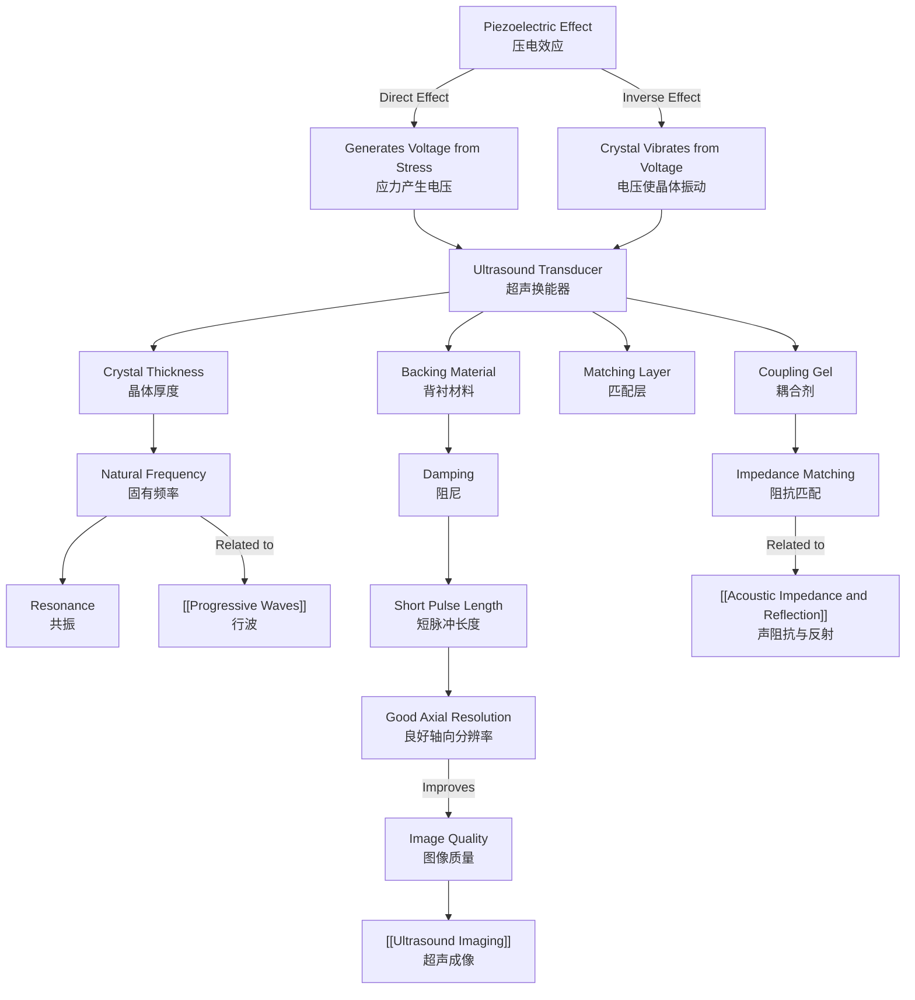

# 1. Overview / 概述

**English:**
The piezoelectric effect is the fundamental physical principle that enables the generation and detection of ultrasound waves in medical imaging. This sub-topic focuses on how piezoelectric transducers convert electrical energy into mechanical vibrations (to produce ultrasound) and vice versa (to detect reflected echoes). Understanding this effect is crucial because it forms the heart of every ultrasound probe used in clinical diagnostics. The transducer's design, including its natural frequency, damping, and focusing properties, directly determines the quality and resolution of the resulting image. This leaf node connects to the broader [[Ultrasound Imaging]] topic and builds on prerequisite knowledge from [[Progressive Waves]] and [[Refraction and Total Internal Reflection]].

**中文:**
压电效应是医学超声成像中产生和检测超声波的基本物理原理。本子知识点聚焦于压电换能器如何将电能转换为机械振动（以产生超声波），反之亦然（以检测反射回波）。理解这一效应至关重要，因为它是临床诊断中使用的每个超声探头的心脏。换能器的设计，包括其固有频率、阻尼和聚焦特性，直接决定了最终图像的质量和分辨率。本叶节点连接到更广泛的[[Ultrasound Imaging]]主题，并建立在[[Progressive Waves]]和[[Refraction and Total Internal Reflection]]的先决知识之上。

---

# 2. Syllabus Learning Objectives / 考纲学习目标

| CAIE 9702 (26.2 a-f) | Edexcel IAL (WPH14 U4: 11.7-11.12) |
|-----------------------|-------------------------------------|
| (a) Describe the piezoelectric effect and its use in ultrasound transducers | 11.7 Understand the piezoelectric effect and its application in ultrasound transducers |
| (b) Explain how an alternating p.d. causes a crystal to vibrate | 11.8 Understand how an alternating potential difference causes a piezoelectric crystal to vibrate |
| (c) Explain how reflected pulses produce an e.m.f. across the crystal | 11.9 Understand how reflected ultrasound pulses produce an e.m.f. across the crystal |
| (d) Define natural frequency and explain resonance in transducers | 11.10 Understand the concept of natural frequency and resonance in ultrasound transducers |
| (e) Explain the use of damping to improve resolution | 11.11 Understand how damping improves the axial resolution of ultrasound imaging |
| (f) Describe the use of acoustic coupling gel | 11.12 Understand the need for acoustic coupling gel between the transducer and the skin |

**Examiner Expectations / 考官期望:**
- **CAIE:** Students must be able to describe the piezoelectric effect qualitatively and explain the role of alternating p.d., resonance, damping, and coupling gel. Quantitative calculations are not required for the effect itself, but students should understand the relationship between frequency, wavelength, and resolution.
- **Edexcel:** Students should understand the piezoelectric effect in detail, including the role of the Curie temperature and the need for a backing material. They should be able to explain how damping affects the pulse length and hence the axial resolution.

---

# 3. Core Definitions / 核心定义

| Term (EN/CN) | Definition (EN) | Definition (CN) | Common Mistakes / 常见错误 |
|--------------|-----------------|-----------------|---------------------------|
| **Piezoelectric Effect** / 压电效应 | The generation of an electric potential difference across a material when it is mechanically stressed, or the mechanical deformation of a material when an electric field is applied. | 当材料受到机械应力时，在其两端产生电势差，或者当施加电场时材料发生机械形变的现象。 | Confusing it with the *inverse* piezoelectric effect. Both are part of the same effect. |
| **Transducer** / 换能器 | A device that converts one form of energy into another. In ultrasound, it converts electrical energy to sound energy and vice versa. | 将一种能量形式转换为另一种能量形式的装置。在超声中，它将电能转换为声能，反之亦然。 | Thinking a transducer only *produces* ultrasound; it also *detects* it. |
| **Natural Frequency** / 固有频率 | The frequency at which a system oscillates when not subjected to a continuous or repeated external force. | 系统在不受连续或重复外力作用时振动的频率。 | Confusing with the driving frequency. The transducer is driven at its natural frequency for resonance. |
| **Resonance** / 共振 | The phenomenon where the amplitude of forced oscillations is maximum when the driving frequency equals the natural frequency of the system. | 当驱动频率等于系统的固有频率时，受迫振动振幅达到最大的现象。 | Thinking resonance only increases amplitude; it also maximizes energy transfer. |
| **Damping** / 阻尼 | The reduction in amplitude of an oscillation due to the dissipation of energy. In ultrasound, a backing material is used to damp the transducer. | 由于能量耗散而导致的振荡振幅减小。在超声中，使用背衬材料来阻尼换能器。 | Thinking damping is always bad; in ultrasound, it improves resolution. |
| **Acoustic Coupling Gel** / 超声耦合剂 | A gel applied between the transducer and the skin to eliminate air gaps, allowing ultrasound waves to pass into the body. | 涂抹在换能器和皮肤之间的凝胶，用于消除空气间隙，使超声波能够进入人体。 | Thinking the gel is a lubricant; its primary purpose is to match acoustic impedance. |

---

# 4. Key Concepts Explained / 关键概念详解

## 4.1 The Piezoelectric Effect / 压电效应

### Explanation / 解释
**English:**
The piezoelectric effect occurs in certain crystalline materials, such as quartz, lead zirconate titanate (PZT), and barium titanate. These materials have a non-centrosymmetric crystal structure, meaning their positive and negative charge centers do not coincide. When mechanical stress (compression or tension) is applied, the crystal lattice deforms, causing a separation of charge centers and creating an electric potential difference across the crystal faces. This is the **direct piezoelectric effect** — mechanical stress → electrical signal.

Conversely, when an electric field is applied across the crystal, the charge centers are displaced, causing the crystal to expand or contract. This is the **inverse piezoelectric effect** — electrical signal → mechanical deformation. In ultrasound, the inverse effect is used to generate the sound wave, and the direct effect is used to detect the reflected echo.

**中文:**
压电效应发生在某些晶体材料中，如石英、锆钛酸铅（PZT）和钛酸钡。这些材料具有非中心对称的晶体结构，意味着它们的正负电荷中心不重合。当施加机械应力（压缩或拉伸）时，晶格发生形变，导致电荷中心分离，在晶体表面产生电势差。这就是**正压电效应**——机械应力 → 电信号。

反之，当在晶体上施加电场时，电荷中心发生位移，导致晶体膨胀或收缩。这就是**逆压电效应**——电信号 → 机械形变。在超声中，逆效应用于产生声波，正效应用于检测反射回波。

### Physical Meaning / 物理意义
**English:**
The piezoelectric effect allows a single device (the transducer) to act as both a speaker (transmitter) and a microphone (receiver) for ultrasound. This is essential for pulse-echo imaging, where the same crystal sends a pulse and then listens for the echo.

**中文:**
压电效应允许单个设备（换能器）同时充当超声的扬声器（发射器）和麦克风（接收器）。这对于脉冲回波成像至关重要，其中同一个晶体发送脉冲，然后监听回波。

### Common Misconceptions / 常见误区
- **Misconception:** The transducer is always vibrating.
  - **Correction:** The transducer only vibrates when an alternating p.d. is applied. It is "off" when listening for echoes.
- **Misconception:** Any crystal can be used.
  - **Correction:** Only non-centrosymmetric crystals (e.g., quartz, PZT) exhibit the piezoelectric effect.
- **Misconception:** The effect is only one-way.
  - **Correction:** The effect is reversible — it works in both directions.

### Exam Tips / 考试提示
- **CAIE:** Be prepared to describe the effect qualitatively. You may be asked to explain why an alternating p.d. is used (to produce continuous vibrations) and why the crystal is cut to a specific thickness (to achieve resonance).
- **Edexcel:** You may be asked to explain the role of the Curie temperature — above this temperature, the material loses its piezoelectric properties.

> 📷 **IMAGE PROMPT — PZ-01: Crystal Lattice Deformation in Piezoelectric Effect**
> A 3D schematic diagram showing a piezoelectric crystal lattice (e.g., PZT) in three states: (1) at rest with charge centers aligned, (2) under compression with charge separation creating a positive voltage on one face, (3) under tension with charge separation creating a negative voltage. Arrows indicate the direction of stress and the resulting electric field. Labels: "Compression", "Tension", "Charge Centers", "Electric Potential Difference".

## 4.2 Resonance and Natural Frequency / 共振与固有频率

### Explanation / 解释
**English:**
For maximum efficiency, the transducer is driven at its **natural frequency**. The natural frequency of a piezoelectric crystal depends on its thickness: $f_0 = \frac{v}{2t}$, where $v$ is the speed of sound in the crystal and $t$ is its thickness. When the driving frequency matches $f_0$, the crystal undergoes **resonance**, producing ultrasound waves of maximum amplitude. This is why ultrasound transducers are cut to a precise thickness to produce the desired frequency (e.g., 3.5 MHz for abdominal imaging, 7.5 MHz for vascular imaging).

**中文:**
为了获得最大效率，换能器以其**固有频率**驱动。压电晶体的固有频率取决于其厚度：$f_0 = \frac{v}{2t}$，其中 $v$ 是晶体中的声速，$t$ 是其厚度。当驱动频率等于 $f_0$ 时，晶体发生**共振**，产生最大振幅的超声波。这就是为什么超声换能器被切割成精确的厚度以产生所需频率（例如，腹部成像用3.5 MHz，血管成像用7.5 MHz）。

### Physical Meaning / 物理意义
**English:**
Resonance ensures that the energy from the electrical driving circuit is efficiently transferred to the mechanical vibrations of the crystal. Without resonance, the transducer would be much less sensitive and would require higher voltages to produce the same ultrasound intensity.

**中文:**
共振确保来自电驱动电路的能量有效地传递到晶体的机械振动。如果没有共振，换能器的灵敏度会低得多，并且需要更高的电压才能产生相同的超声强度。

### Common Misconceptions / 常见误区
- **Misconception:** Higher frequency always means better resolution.
  - **Correction:** Higher frequency gives better axial resolution but poorer penetration. The choice of frequency is a trade-off.
- **Misconception:** The natural frequency is the same for all crystals.
  - **Correction:** It depends on the material and the thickness.

### Exam Tips / 考试提示
- **CAIE:** You may be asked to calculate the natural frequency given the thickness and speed of sound in the crystal.
- **Edexcel:** You may be asked to explain why the crystal is cut to a thickness equal to half the wavelength of the ultrasound in the crystal.

## 4.3 Damping / 阻尼

### Explanation / 解释
**English:**
In medical ultrasound, the transducer is not allowed to ring freely after being excited. A **backing material** (typically a composite of epoxy resin and tungsten powder) is attached to the rear face of the crystal. This material has a high acoustic impedance, which absorbs the backward-propagating wave and rapidly reduces the amplitude of the crystal's vibrations. This process is called **damping**.

Damping serves two critical purposes:
1. **Shortens the pulse length:** A damped crystal produces a short pulse (typically 2-3 cycles) rather than a long continuous wave. This improves **axial resolution** — the ability to distinguish two closely spaced reflectors along the beam direction.
2. **Reduces "ringing":** Without damping, the crystal would continue to vibrate after the driving voltage is removed, causing the transducer to "listen" while it is still "speaking", which would mask nearby echoes.

**中文:**
在医学超声中，换能器在被激发后不允许自由振荡。一个**背衬材料**（通常是环氧树脂和钨粉的复合材料）附着在晶体的后表面。这种材料具有高声阻抗，吸收向后传播的波并迅速减小晶体振动的振幅。这个过程称为**阻尼**。

阻尼有两个关键目的：
1. **缩短脉冲长度：** 阻尼晶体产生短脉冲（通常2-3个周期），而不是长的连续波。这提高了**轴向分辨率**——沿波束方向区分两个紧密间隔反射体的能力。
2. **减少"振铃"：** 如果没有阻尼，晶体在驱动电压移除后会继续振动，导致换能器在"说话"的同时"听"，这会掩盖附近的回波。

### Physical Meaning / 物理意义
**English:**
Damping is a deliberate energy loss mechanism. While it reduces the amplitude of the transmitted pulse (which might seem bad), it dramatically improves the ability to resolve fine detail in the image. The trade-off is between signal strength and resolution.

**中文:**
阻尼是一种刻意的能量损失机制。虽然它降低了发射脉冲的振幅（这看起来可能不好），但它极大地提高了分辨图像细节的能力。这是在信号强度和分辨率之间的权衡。

### Common Misconceptions / 常见误区
- **Misconception:** Damping reduces the frequency of the ultrasound.
  - **Correction:** Damping reduces the amplitude and shortens the pulse, but the frequency (determined by the crystal thickness) remains the same.
- **Misconception:** Damping is only used in low-frequency transducers.
  - **Correction:** Damping is used in all medical ultrasound transducers to improve resolution.

### Exam Tips / 考试提示
- **CAIE:** Be prepared to explain the relationship between damping, pulse length, and axial resolution.
- **Edexcel:** You may be asked to describe the construction of a damped transducer, including the backing material.

> 📷 **IMAGE PROMPT — PZ-02: Damped vs Undamped Transducer Pulse**
> Two oscilloscope traces side-by-side. Left trace: an undamped transducer showing a long, slowly decaying sine wave (many cycles). Right trace: a damped transducer showing a short burst of 2-3 cycles with rapid decay. Labels: "Undamped — Long Pulse, Poor Resolution", "Damped — Short Pulse, Good Resolution". Time axis labeled "Time / μs".

## 4.4 Acoustic Coupling Gel / 超声耦合剂

### Explanation / 解释
**English:**
Air has a very low acoustic impedance ($Z_{air} \approx 430 \, \text{kg m}^{-2} \text{s}^{-1}$) compared to human tissue ($Z_{tissue} \approx 1.6 \times 10^6 \, \text{kg m}^{-2} \text{s}^{-1}$). If there is an air gap between the transducer and the skin, almost all of the ultrasound energy would be reflected at the transducer-air and air-skin interfaces due to the large impedance mismatch. **Acoustic coupling gel** has an acoustic impedance close to that of tissue ($Z_{gel} \approx 1.5 \times 10^6 \, \text{kg m}^{-2} \text{s}^{-1}$), which allows the ultrasound waves to pass efficiently from the transducer into the body.

**中文:**
与人体组织（$Z_{组织} \approx 1.6 \times 10^6 \, \text{kg m}^{-2} \text{s}^{-1}$）相比，空气的声阻抗非常低（$Z_{空气} \approx 430 \, \text{kg m}^{-2} \text{s}^{-1}$）。如果换能器和皮肤之间存在空气间隙，由于巨大的阻抗不匹配，几乎所有的超声波能量都会在换能器-空气和空气-皮肤界面被反射。**超声耦合剂**的声阻抗接近组织（$Z_{凝胶} \approx 1.5 \times 10^6 \, \text{kg m}^{-2} \text{s}^{-1}$），这使得超声波能够有效地从换能器进入人体。

### Physical Meaning / 物理意义
**English:**
The gel eliminates the air gap and provides a continuous acoustic path from the transducer to the skin. This is analogous to using immersion oil in microscopy to match refractive indices.

**中文:**
凝胶消除了空气间隙，提供了从换能器到皮肤的连续声学路径。这类似于在显微镜中使用浸油来匹配折射率。

### Common Misconceptions / 常见误区
- **Misconception:** The gel is a lubricant to slide the probe smoothly.
  - **Correction:** While it does provide some lubrication, its primary purpose is acoustic impedance matching.
- **Misconception:** Water could be used instead of gel.
  - **Correction:** Water has a lower acoustic impedance than tissue and would not match as well. Also, gel stays in place better.

### Exam Tips / 考试提示
- **Both boards:** You may be asked to explain why gel is necessary, referencing acoustic impedance values. Be prepared to calculate the intensity reflection coefficient at an interface.

---

# 5. Essential Equations / 核心公式

## 5.1 Natural Frequency of a Piezoelectric Crystal / 压电晶体的固有频率

$$ f_0 = \frac{v}{2t} $$

| Symbol (符号) | Meaning (EN) | Meaning (CN) | Unit (单位) |
|--------------|-------------|-------------|------------|
| $f_0$ | Natural frequency | 固有频率 | Hz |
| $v$ | Speed of sound in the crystal | 晶体中的声速 | m s⁻¹ |
| $t$ | Thickness of the crystal | 晶体厚度 | m |

**Derivation / 推导:**
The crystal vibrates as a standing wave with nodes at the two faces. The fundamental mode has a wavelength $\lambda = 2t$. Since $v = f\lambda$, we get $f_0 = v / (2t)$.

**Conditions / 适用条件:**
- The crystal is free to vibrate at both faces.
- The crystal is driven at its fundamental mode (not harmonics).

**Limitations / 局限性:**
- This formula assumes a uniform, homogeneous crystal.
- In practice, the backing material and front matching layer slightly alter the effective natural frequency.

## 5.2 Axial Resolution / 轴向分辨率

$$ \text{Axial Resolution} = \frac{\text{Pulse Length}}{2} = \frac{n \lambda}{2} $$

| Symbol (符号) | Meaning (EN) | Meaning (CN) | Unit (单位) |
|--------------|-------------|-------------|------------|
| $n$ | Number of cycles in the pulse | 脉冲中的周期数 | dimensionless |
| $\lambda$ | Wavelength of ultrasound in tissue | 组织中超声波的波长 | m |

**Derivation / 推导:**
Two reflectors can be distinguished if the echoes from them do not overlap. The minimum separation is half the pulse length.

**Conditions / 适用条件:**
- Assumes the pulse travels at constant speed.
- Assumes the reflectors are along the same beam axis.

**Limitations / 局限性:**
- This is the theoretical best resolution. In practice, noise and beam width reduce resolution.

---

# 6. Graphs and Relationships / 图表与关系

## 6.1 Amplitude vs Time for a Damped Transducer / 阻尼换能器的振幅-时间图

### Axes / 坐标轴
- **X-axis:** Time / μs (时间 / 微秒)
- **Y-axis:** Amplitude / arbitrary units (振幅 / 任意单位)

### Shape / 形状
A rapidly decaying sinusoidal wave. The amplitude starts high and decreases exponentially over a few cycles.

### Gradient Meaning / 斜率含义
The envelope of the decay shows the damping rate. A steeper decay indicates stronger damping (shorter pulse, better resolution).

### Area Meaning / 面积含义
The area under the curve (squared) is proportional to the total energy in the pulse. Damping reduces this energy.

### Exam Interpretation / 考试解读
- **CAIE:** You may be asked to sketch the waveform for a damped vs undamped transducer.
- **Edexcel:** You may be asked to explain how the pulse length affects the ability to resolve two closely spaced structures.

> 📷 **IMAGE PROMPT — PZ-03: Damped Transducer Waveform**
> A graph showing amplitude (y-axis) vs time (x-axis). The waveform is a sine wave that starts at maximum amplitude and decays to near zero within 3-4 cycles. The envelope of the decay is shown as a dashed exponential curve. Labels: "Pulse Length", "Envelope of Decay", "Damped Oscillation".

---

# 7. Required Diagrams / 必备图表

## 7.1 Construction of an Ultrasound Transducer / 超声换能器的结构

### Description / 描述
**English:**
A cross-sectional diagram showing the layers of a typical medical ultrasound transducer: (1) the piezoelectric crystal (e.g., PZT), (2) the backing material (damping layer) on the rear face, (3) the matching layer on the front face to improve impedance matching with tissue, (4) the electrodes (thin metal layers) on both faces of the crystal, and (5) the acoustic lens for focusing.

**中文:**
一个典型医学超声换能器各层的横截面图：(1) 压电晶体（如PZT），(2) 后表面的背衬材料（阻尼层），(3) 前表面的匹配层以改善与组织的阻抗匹配，(4) 晶体两个面上的电极（薄金属层），以及(5) 用于聚焦的声透镜。

### Image Prompt / 图片生成提示
> 📷 **IMAGE PROMPT — PZ-04: Ultrasound Transducer Construction**
> A detailed cross-sectional diagram of a medical ultrasound transducer. From top to bottom: (1) Acoustic lens (curved top surface), (2) Matching layer (thin layer), (3) Front electrode (thin gold layer), (4) Piezoelectric crystal (PZT, shown as a rectangular block with a crystalline pattern), (5) Back electrode (thin gold layer), (6) Backing material (thick, dark, textured layer), (7) Electrical leads connecting to the electrodes. Labels with arrows pointing to each component. The overall shape is a cylindrical or rectangular block.

### Labels Required / 需要标注
- Acoustic Lens / 声透镜
- Matching Layer / 匹配层
- Front Electrode / 前电极
- Piezoelectric Crystal (PZT) / 压电晶体 (PZT)
- Back Electrode / 后电极
- Backing Material (Damping Layer) / 背衬材料 (阻尼层)
- Electrical Leads / 电引线

### Exam Importance / 考试重要性
- **CAIE:** High. Students should be able to label the main components and explain the function of each.
- **Edexcel:** High. Students should understand the role of each layer in the transducer's performance.

## 7.2 Pulse-Echo Sequence / 脉冲-回波序列

### Description / 描述
**English:**
A timing diagram showing the sequence of events in a pulse-echo ultrasound system: (1) A short electrical pulse is applied to the transducer, (2) The transducer vibrates and emits a short ultrasound pulse, (3) The transducer is switched to "receive" mode, (4) The ultrasound pulse travels into the body and is reflected at tissue boundaries, (5) The reflected echoes return to the transducer, (6) The transducer generates an electrical signal from the echoes.

**中文:**
一个时序图，显示脉冲回波超声系统中的事件序列：(1) 向换能器施加短电脉冲，(2) 换能器振动并发射短超声脉冲，(3) 换能器切换到"接收"模式，(4) 超声脉冲进入人体并在组织边界反射，(5) 反射回波返回换能器，(6) 换能器从回波产生电信号。

### Image Prompt / 图片生成提示
> 📷 **IMAGE PROMPT — PZ-05: Pulse-Echo Timing Diagram**
> A timing diagram with three rows. Top row: "Electrical Signal" showing a short spike (transmit pulse) followed by a gap, then a smaller spike (received echo). Middle row: "Transducer Vibration" showing a short burst of oscillations during transmit, then silence, then a smaller burst during receive. Bottom row: "Ultrasound Pulse" showing a short pulse traveling away from the transducer, then a reflected pulse returning. Time axis runs left to right. Labels: "Transmit", "Receive", "Echo".

### Labels Required / 需要标注
- Transmit Pulse / 发射脉冲
- Receive Echo / 接收回波
- Time Delay / 时间延迟
- Pulse Length / 脉冲长度

### Exam Importance / 考试重要性
- **Both boards:** High. Understanding the pulse-echo sequence is fundamental to understanding how ultrasound imaging works.

---

# 8. Worked Examples / 典型例题

## Example 1: Natural Frequency Calculation / 例1：固有频率计算

### Question / 题目
**English:**
A piezoelectric crystal has a thickness of 0.5 mm. The speed of sound in the crystal is 4000 m s⁻¹. Calculate the natural frequency of the crystal. If this crystal is used in an ultrasound transducer, what is the wavelength of the ultrasound produced in soft tissue (speed of sound in tissue = 1540 m s⁻¹)?

**中文:**
一个压电晶体的厚度为0.5毫米。晶体中的声速为4000米/秒。计算该晶体的固有频率。如果该晶体用于超声换能器，在软组织中产生的超声波的波长是多少（组织中的声速 = 1540米/秒）？

### Solution / 解答
**Step 1:** Calculate the natural frequency using $f_0 = \frac{v}{2t}$.

$$ f_0 = \frac{4000}{2 \times 0.5 \times 10^{-3}} = \frac{4000}{1.0 \times 10^{-3}} = 4.0 \times 10^6 \, \text{Hz} = 4.0 \, \text{MHz} $$

**Step 2:** The transducer produces ultrasound at its natural frequency. Calculate the wavelength in tissue using $\lambda = \frac{v}{f}$.

$$ \lambda = \frac{1540}{4.0 \times 10^6} = 3.85 \times 10^{-4} \, \text{m} = 0.385 \, \text{mm} $$

### Final Answer / 最终答案
**Answer:** Natural frequency = 4.0 MHz; Wavelength in tissue = 0.385 mm | **答案：** 固有频率 = 4.0 MHz；组织中波长 = 0.385 mm

### Quick Tip / 提示
**English:** Remember to convert mm to m before calculating. The natural frequency is determined by the crystal thickness, not by the tissue properties. | **中文：** 记得在计算前将毫米转换为米。固有频率由晶体厚度决定，而非组织特性。

## Example 2: Axial Resolution / 例2：轴向分辨率

### Question / 题目
**English:**
An ultrasound transducer produces a pulse consisting of 3 cycles at a frequency of 5.0 MHz. The speed of sound in tissue is 1540 m s⁻¹. Calculate the axial resolution of this transducer.

**中文:**
一个超声换能器产生一个由3个周期组成的脉冲，频率为5.0 MHz。组织中的声速为1540米/秒。计算该换能器的轴向分辨率。

### Solution / 解答
**Step 1:** Calculate the wavelength in tissue.

$$ \lambda = \frac{v}{f} = \frac{1540}{5.0 \times 10^6} = 3.08 \times 10^{-4} \, \text{m} = 0.308 \, \text{mm} $$

**Step 2:** Calculate the pulse length.

$$ \text{Pulse Length} = n \lambda = 3 \times 0.308 = 0.924 \, \text{mm} $$

**Step 3:** Calculate the axial resolution.

$$ \text{Axial Resolution} = \frac{\text{Pulse Length}}{2} = \frac{0.924}{2} = 0.462 \, \text{mm} $$

### Final Answer / 最终答案
**Answer:** Axial resolution = 0.462 mm | **答案：** 轴向分辨率 = 0.462 mm

### Quick Tip / 提示
**English:** Axial resolution is half the pulse length. To improve resolution, use a higher frequency (shorter wavelength) or stronger damping (fewer cycles per pulse). | **中文：** 轴向分辨率是脉冲长度的一半。要提高分辨率，使用更高频率（更短波长）或更强阻尼（每脉冲更少周期）。

---

# 9. Past Paper Question Types / 历年真题题型

| Question Type / 题型 | Frequency / 频率 | Difficulty / 难度 | Past Paper References / 真题索引 |
|----------------------|------------------|------------------|-------------------------------|
| Describe the piezoelectric effect / 描述压电效应 | High | Easy | 📝 *待填入* |
| Explain the role of damping / 解释阻尼的作用 | High | Medium | 📝 *待填入* |
| Calculate natural frequency / 计算固有频率 | Medium | Medium | 📝 *待填入* |
| Explain the need for coupling gel / 解释耦合剂的必要性 | Medium | Easy | 📝 *待填入* |
| Sketch and interpret transducer waveforms / 绘制并解释换能器波形 | Low | Hard | 📝 *待填入* |

**Common Command Words / 常见指令词:**
- **Describe / 描述:** Give a detailed account of the piezoelectric effect.
- **Explain / 解释:** Give reasons for the use of damping or coupling gel.
- **Calculate / 计算:** Determine the natural frequency or axial resolution.
- **Sketch / 绘制:** Draw the waveform of a damped vs undamped transducer.
- **State / 陈述:** Give a brief definition of a term (e.g., natural frequency).

---

# 10. Practical Skills Connections / 实验技能链接

**English:**
This sub-topic connects to practical skills in several ways:
- **Measurements:** Students should be able to measure the thickness of a piezoelectric crystal (using a micrometer) and calculate its natural frequency.
- **Uncertainties:** When calculating natural frequency, uncertainties in thickness measurement propagate to the final result.
- **Graph Plotting:** Students may be asked to plot the amplitude-frequency response of a transducer to demonstrate resonance.
- **Experimental Design:** Students should understand how to set up an experiment to demonstrate the piezoelectric effect (e.g., applying a force to a crystal and measuring the voltage produced).
- **Data Analysis:** Students may analyze oscilloscope traces of transducer waveforms to determine pulse length and damping rate.

**中文:**
本子知识点在多个方面与实验技能相关：
- **测量：** 学生应能测量压电晶体的厚度（使用千分尺）并计算其固有频率。
- **不确定度：** 在计算固有频率时，厚度测量的不确定度会传递到最终结果。
- **图表绘制：** 学生可能需要绘制换能器的幅频响应曲线以展示共振。
- **实验设计：** 学生应理解如何设置实验来演示压电效应（例如，对晶体施加力并测量产生的电压）。
- **数据分析：** 学生可能分析换能器波形的示波器迹线以确定脉冲长度和阻尼率。

---

# 11. Concept Map / 概念图谱

---

# 12. Quick Revision Sheet / 速查表

| Category / 类别 | Key Points / 要点 |
|----------------|------------------|
| **Definition / 定义** | Piezoelectric effect: mechanical stress → voltage (direct); voltage → mechanical deformation (inverse). 压电效应：机械应力→电压（正）；电压→机械形变（逆）。 |
| **Key Formula / 核心公式** | $f_0 = \frac{v}{2t}$ (natural frequency of crystal) / 晶体固有频率 |
| **Key Graph / 核心图表** | Amplitude vs Time: damped transducer shows rapid decay (short pulse); undamped shows slow decay (long pulse). 振幅-时间图：阻尼换能器快速衰减（短脉冲）；无阻尼慢速衰减（长脉冲）。 |
| **Exam Tip / 考试提示** | Damping improves axial resolution by shortening the pulse length. Coupling gel eliminates air gaps for impedance matching. 阻尼通过缩短脉冲长度提高轴向分辨率。耦合剂消除空气间隙以实现阻抗匹配。 |
| **Common Mistake / 常见错误** | Confusing direct and inverse effects. Thinking damping reduces frequency (it reduces amplitude, not frequency). 混淆正逆效应。认为阻尼降低频率（它降低振幅，而非频率）。 |
| **Key Connection / 关键联系** | [[Ultrasound Imaging]] — the transducer is the heart of the imaging system. [[Acoustic Impedance and Reflection]] — explains why coupling gel is needed. 换能器是成像系统的心脏。声阻抗与反射解释了为什么需要耦合剂。 |