# Production and Detection of Ultrasound / 超声波的产生与探测

---

# 1. Overview / 概述

**English:**
This sub-topic focuses on how ultrasound waves are generated and detected in medical imaging systems. The core principle is the **piezoelectric effect** — the ability of certain crystals to convert electrical energy into mechanical vibrations (to produce ultrasound) and vice versa (to detect reflected echoes). Understanding this process is fundamental to all ultrasound imaging techniques, including [[A-Scan and B-Scan Imaging]] and [[Doppler Ultrasound for Blood Flow]]. The transducer acts as both a transmitter and receiver, making it a critical component in medical diagnostics. This sub-topic builds on concepts from [[Progressive Waves]] and [[Refraction and Total Internal Reflection]].

**中文:**
本子知识点聚焦于医学成像系统中超声波如何产生和探测。核心原理是**压电效应**——某些晶体将电能转换为机械振动（产生超声波）以及反向转换（探测反射回波）的能力。理解这一过程是所有超声成像技术的基础，包括[[A-Scan and B-Scan Imaging]]和[[Doppler Ultrasound for Blood Flow]]。换能器同时充当发射器和接收器，使其成为医学诊断中的关键部件。本子知识点建立在[[Progressive Waves]]和[[Refraction and Total Internal Reflection]]的概念之上。

---

# 2. Syllabus Learning Objectives / 考纲学习目标

| CAIE 9702 | Edexcel IAL |
|-----------|-------------|
| 26.2(a) Describe the piezoelectric effect and its role in ultrasound production and detection | 11.7 Understand the piezoelectric effect and its application in ultrasound transducers |
| 26.2(b) Explain how a pulse of ultrasound is produced using a transducer | 11.8 Understand how a transducer produces and detects ultrasound pulses |
| 26.2(c) Describe the structure of a typical ultrasound transducer | 11.9 Understand the role of the matching layer and backing material |
| 26.2(d) Explain the need for a coupling medium (gel) | 11.10 Understand why a coupling medium is required |
| 26.2(e) Describe the use of pulsed ultrasound to obtain depth information | 11.11 Understand how pulse-echo technique gives depth information |
| 26.2(f) Explain the relationship between pulse repetition frequency and maximum imaging depth | 11.12 Understand the relationship between pulse repetition frequency (PRF) and maximum depth |

**Examiner Expectations / 考官期望:**
- **CAIE:** Students must be able to describe the piezoelectric effect qualitatively and explain the role of the matching layer and backing material. Calculations involving pulse repetition frequency and depth are common.
- **Edexcel:** Students must understand the quantitative relationship between PRF, depth, and speed of ultrasound. The structure of the transducer and the function of each component are frequently tested.

---

# 3. Core Definitions / 核心定义

| Term (EN/CN) | Definition (EN) | Definition (CN) | Common Mistakes / 常见错误 |
|--------------|-----------------|-----------------|---------------------------|
| **Piezoelectric Effect** / 压电效应 | The ability of certain materials (e.g., quartz, PZT) to generate an electric potential when mechanically deformed, and conversely to deform when an electric potential is applied. | 某些材料（如石英、PZT）在机械变形时产生电势，反之在施加电势时发生形变的能力。 | Confusing with electromagnetic induction; forgetting it works both ways |
| **Transducer** / 换能器 | A device that converts one form of energy to another; in ultrasound, it converts electrical energy to sound energy (transmit) and sound energy to electrical energy (receive). | 将一种能量形式转换为另一种能量的装置；在超声中，它将电能转换为声能（发射）和声能转换为电能（接收）。 | Thinking transducer only transmits |
| **Matching Layer** / 匹配层 | A thin layer on the front of the transducer with acoustic impedance between that of the piezoelectric crystal and the body tissue, to minimize reflection at the interface. | 换能器前表面的一薄层，其声阻抗介于压电晶体和人体组织之间，以最小化界面处的反射。 | Forgetting it reduces reflection, not absorption |
| **Backing Material** / 背衬材料 | A damping material attached to the rear of the piezoelectric crystal to absorb backward-propagating waves and reduce the pulse duration (ringing). | 附着在压电晶体背面的阻尼材料，用于吸收向后传播的波并减少脉冲持续时间（振铃）。 | Confusing with matching layer; thinking it amplifies signal |
| **Pulse Repetition Frequency (PRF)** / 脉冲重复频率 | The number of ultrasound pulses emitted per second by the transducer. | 换能器每秒发射的超声波脉冲数量。 | Confusing with ultrasound frequency (MHz vs kHz) |
| **Coupling Medium (Gel)** / 耦合介质（凝胶） | A gel applied between the transducer and the skin to eliminate air gaps, allowing ultrasound to enter the body with minimal reflection. | 涂抹在换能器和皮肤之间的凝胶，用于消除空气间隙，使超声波以最小反射进入人体。 | Thinking gel is for lubrication only |

---

# 4. Key Concepts Explained / 关键概念详解

## 4.1 The Piezoelectric Effect / 压电效应

### Explanation / 解释
**English:**
The [[Piezoelectric Effect and Transducers]] is the foundation of ultrasound production and detection. Certain crystalline materials (e.g., quartz, lead zirconate titanate or PZT) have an asymmetric crystal structure. When an alternating voltage is applied across the crystal, it causes mechanical vibrations at the same frequency as the applied voltage — this produces ultrasound. Conversely, when reflected ultrasound waves strike the crystal, they cause mechanical deformation, which generates a small voltage signal — this detects the echo. The effect is **reversible**, allowing the same crystal to act as both transmitter and receiver.

**中文:**
[[Piezoelectric Effect and Transducers]]是超声波产生和探测的基础。某些晶体材料（如石英、锆钛酸铅或PZT）具有不对称的晶体结构。当在晶体两端施加交变电压时，会引起与施加电压相同频率的机械振动——这产生超声波。反之，当反射的超声波撞击晶体时，会引起机械变形，从而产生微小的电压信号——这探测回波。该效应是**可逆的**，允许同一晶体同时充当发射器和接收器。

### Physical Meaning / 物理意义
**English:**
The piezoelectric effect converts between electrical and mechanical energy. The resonant frequency of the crystal is determined by its thickness — thinner crystals produce higher frequency ultrasound. For medical imaging, typical frequencies are 1–15 MHz.

**中文:**
压电效应在电能和机械能之间进行转换。晶体的共振频率由其厚度决定——更薄的晶体产生更高频率的超声波。对于医学成像，典型频率为1–15 MHz。

### Common Misconceptions / 常见误区
- ❌ **"The transducer only produces ultrasound."** — It both produces and detects.
- ❌ **"The piezoelectric effect only works one way."** — It is reversible.
- ❌ **"Higher voltage always means higher frequency."** — Frequency is determined by crystal thickness, not voltage amplitude.

### Exam Tips / 考试提示
- ✅ Remember: **Piezoelectric = Pressure → Electricity** (and vice versa)
- ✅ The same crystal is used for both transmission and reception, but not simultaneously — the system switches between modes.
- ✅ For CAIE, be prepared to describe the effect qualitatively. For Edexcel, you may need to explain the relationship between crystal thickness and frequency.

> 📷 **IMAGE PROMPT — PZ01: Piezoelectric Crystal Diagram**
> A cross-section diagram showing a piezoelectric crystal (PZT) with electrodes on top and bottom. Arrows show: (1) applied alternating voltage causing crystal to expand and contract, producing ultrasound waves; (2) incoming ultrasound waves causing crystal deformation, generating a voltage signal. Labels: "Piezoelectric Crystal", "Electrodes", "Ultrasound Waves", "Alternating Voltage Source". Clean, educational style with blue and red arrows.

---

## 4.2 Transducer Structure / 换能器结构

### Explanation / 解释
**English:**
A typical ultrasound transducer consists of several layers:

1. **Piezoelectric crystal** — the active element that produces and detects ultrasound
2. **Electrodes** — thin conductive layers on both sides of the crystal to apply voltage and detect signals
3. **Matching layer** — placed on the front (patient side) to reduce acoustic impedance mismatch between the crystal (high impedance) and body tissue (medium impedance)
4. **Backing material** — placed on the rear to dampen vibrations and shorten the pulse duration
5. **Housing** — protective casing

**中文:**
典型的超声波换能器由多个层组成：

1. **压电晶体** — 产生和探测超声波的活性元件
2. **电极** — 晶体两侧的薄导电层，用于施加电压和检测信号
3. **匹配层** — 放置在前端（患者侧），以减少晶体（高阻抗）和人体组织（中等阻抗）之间的声阻抗不匹配
4. **背衬材料** — 放置在背面，用于阻尼振动并缩短脉冲持续时间
5. **外壳** — 保护性外壳

### Physical Meaning / 物理意义
**English:**
The **matching layer** has an acoustic impedance ($Z$) that is the geometric mean of the crystal and tissue impedances: $Z_{\text{matching}} = \sqrt{Z_{\text{crystal}} \times Z_{\text{tissue}}}$. This minimizes reflection at the crystal-tissue interface, allowing more energy to enter the body.

The **backing material** is a damping material (often epoxy with metal powder) that absorbs backward-propagating waves. This reduces the "ringing" of the crystal, producing shorter pulses and improving depth resolution.

**中文:**
**匹配层**的声阻抗（$Z$）是晶体和组织阻抗的几何平均值：$Z_{\text{匹配}} = \sqrt{Z_{\text{晶体}} \times Z_{\text{组织}}}$。这最小化了晶体-组织界面处的反射，允许更多能量进入人体。

**背衬材料**是一种阻尼材料（通常是含有金属粉末的环氧树脂），用于吸收向后传播的波。这减少了晶体的"振铃"，产生更短的脉冲并提高深度分辨率。

### Common Misconceptions / 常见误区
- ❌ **"The matching layer amplifies the ultrasound signal."** — It reduces reflection, not amplifies.
- ❌ **"The backing material is used to protect the transducer."** — Its primary purpose is damping, not protection.
- ❌ **"A thicker matching layer works better."** — The thickness must be exactly $\lambda/4$ for optimal impedance matching.

### Exam Tips / 考试提示
- ✅ The matching layer thickness = $\lambda/4$ (quarter-wavelength) for destructive interference of reflected waves.
- ✅ Backing material reduces the **Q-factor** (quality factor) of the crystal, producing a broader bandwidth but lower sensitivity.
- ✅ For Edexcel, be prepared to explain why both matching layer and backing material are necessary.

> 📷 **IMAGE PROMPT — TR01: Ultrasound Transducer Cross-Section**
> A detailed cross-section diagram of an ultrasound transducer. From top to bottom: housing (plastic casing), backing material (dark grey, textured), piezoelectric crystal (blue, with electrodes on both sides as thin gold lines), matching layer (green, thickness labeled as λ/4), and coupling gel layer (transparent). Arrows show ultrasound waves propagating downward from the crystal through the matching layer and gel into tissue. Labels for each component. Clean, medical-illustration style.

---

## 4.3 Pulse-Echo Technique / 脉冲回波技术

### Explanation / 解释
**English:**
Ultrasound imaging uses **pulsed ultrasound**, not continuous waves. The transducer emits a short pulse of ultrasound (typically 2–3 cycles) and then switches to receive mode to listen for echoes. The time delay between pulse emission and echo reception gives the depth of the reflecting structure:

$$ \text{depth} = \frac{v \times t}{2} $$

where $v$ is the speed of ultrasound in tissue (≈ 1540 m/s) and $t$ is the time between pulse emission and echo reception. The factor of 2 accounts for the round trip.

**中文:**
超声成像使用**脉冲超声波**，而非连续波。换能器发射一个短脉冲超声波（通常2–3个周期），然后切换到接收模式以监听回波。脉冲发射和回波接收之间的时间延迟给出了反射结构的深度：

$$ \text{深度} = \frac{v \times t}{2} $$

其中$v$是超声波在组织中的速度（≈ 1540 m/s），$t$是脉冲发射和回波接收之间的时间。因子2考虑了往返行程。

### Physical Meaning / 物理意义
**English:**
The **pulse repetition frequency (PRF)** is the rate at which pulses are emitted. The maximum imaging depth is limited by the PRF — the transducer must wait for echoes from the deepest structure before emitting the next pulse. Therefore:

$$ \text{Maximum depth} = \frac{v}{2 \times \text{PRF}} $$

A higher PRF allows faster frame rates but reduces the maximum depth that can be imaged.

**中文:**
**脉冲重复频率（PRF）**是脉冲发射的速率。最大成像深度受PRF限制——换能器必须等待来自最深结构的回波后才能发射下一个脉冲。因此：

$$ \text{最大深度} = \frac{v}{2 \times \text{PRF}} $$

更高的PRF允许更快的帧率，但会减少可成像的最大深度。

### Common Misconceptions / 常见误区
- ❌ **"The transducer transmits and receives simultaneously."** — It switches between modes; it cannot do both at the same time.
- ❌ **"PRF is the same as the ultrasound frequency."** — PRF is in kHz (pulses per second), while ultrasound frequency is in MHz (cycles per pulse).
- ❌ **"A longer pulse gives better resolution."** — Shorter pulses give better depth resolution.

### Exam Tips / 考试提示
- ✅ Know the formula: $\text{depth} = \frac{v t}{2}$ and $\text{PRF} = \frac{v}{2 \times \text{max depth}}$
- ✅ Typical speed of ultrasound in soft tissue: 1540 m/s (memorize this value)
- ✅ For CAIE, be prepared to calculate maximum depth given PRF, or vice versa.
- ✅ For Edexcel, understand the trade-off between PRF and imaging depth.

---

## 4.4 Coupling Medium (Gel) / 耦合介质（凝胶）

### Explanation / 解释
**English:**
A coupling gel is applied between the transducer and the skin. Its purpose is to eliminate air gaps. Air has a very low acoustic impedance ($Z_{\text{air}} \approx 400 \, \text{kg m}^{-2} \text{s}^{-1}$) compared to skin ($Z_{\text{skin}} \approx 1.6 \times 10^6 \, \text{kg m}^{-2} \text{s}^{-1}$). Without gel, the large impedance mismatch would cause almost total reflection of ultrasound at the skin surface, preventing it from entering the body. The gel has an acoustic impedance close to that of tissue, allowing efficient transmission.

**中文:**
在换能器和皮肤之间涂抹耦合凝胶。其目的是消除空气间隙。与皮肤（$Z_{\text{皮肤}} \approx 1.6 \times 10^6 \, \text{kg m}^{-2} \text{s}^{-1}$）相比，空气的声阻抗非常低（$Z_{\text{空气}} \approx 400 \, \text{kg m}^{-2} \text{s}^{-1}$）。如果没有凝胶，巨大的阻抗不匹配会导致超声波在皮肤表面几乎完全反射，阻止其进入人体。凝胶的声阻抗接近组织，允许有效传输。

### Physical Meaning / 物理意义
**English:**
The intensity reflection coefficient at an interface is given by:

$$ R = \left( \frac{Z_2 - Z_1}{Z_2 + Z_1} \right)^2 $$

For air-skin interface: $R \approx 0.999$ (99.9% reflection). For gel-skin interface: $R \approx 0.001$ (0.1% reflection). The gel effectively "matches" the impedance, allowing ultrasound to enter the body.

**中文:**
界面处的强度反射系数由下式给出：

$$ R = \left( \frac{Z_2 - Z_1}{Z_2 + Z_1} \right)^2 $$

对于空气-皮肤界面：$R \approx 0.999$（99.9%反射）。对于凝胶-皮肤界面：$R \approx 0.001$（0.1%反射）。凝胶有效地"匹配"了阻抗，允许超声波进入人体。

### Exam Tips / 考试提示
- ✅ The gel must have acoustic impedance close to that of tissue (~1.5 × 10⁶ kg m⁻² s⁻¹).
- ✅ Without gel, virtually no ultrasound enters the body — imaging is impossible.
- ✅ This is a common exam question: "Why is coupling gel used?"

---

# 5. Essential Equations / 核心公式

## 5.1 Depth Calculation / 深度计算

$$ d = \frac{v t}{2} $$

| Symbol (符号) | Meaning (EN) | Meaning (CN) | Unit (单位) |
|--------------|-------------|-------------|------------|
| $d$ | Depth of reflecting structure | 反射结构的深度 | m |
| $v$ | Speed of ultrasound in tissue | 超声波在组织中的速度 | m s⁻¹ |
| $t$ | Time between pulse emission and echo reception | 脉冲发射和回波接收之间的时间 | s |

**Conditions / 适用条件:**
- Assumes the speed of ultrasound is constant in the medium (≈ 1540 m/s in soft tissue)
- Valid for single reflection (not multiple scattering)

**Limitations / 局限性:**
- Does not account for attenuation of the ultrasound wave
- Assumes the echo returns directly to the transducer (normal incidence)

---

## 5.2 Pulse Repetition Frequency and Maximum Depth / 脉冲重复频率与最大深度

$$ \text{PRF} = \frac{v}{2 d_{\text{max}}} $$

| Symbol (符号) | Meaning (EN) | Meaning (CN) | Unit (单位) |
|--------------|-------------|-------------|------------|
| $\text{PRF}$ | Pulse repetition frequency | 脉冲重复频率 | Hz (or s⁻¹) |
| $v$ | Speed of ultrasound in tissue | 超声波在组织中的速度 | m s⁻¹ |
| $d_{\text{max}}$ | Maximum imaging depth | 最大成像深度 | m |

**Derivation / 推导:**
The time for one pulse to travel to depth $d_{\text{max}}$ and back is $t = \frac{2 d_{\text{max}}}{v}$. The next pulse cannot be emitted until this echo is received, so the minimum time between pulses is $t$. Therefore, $\text{PRF} = \frac{1}{t} = \frac{v}{2 d_{\text{max}}}$.

**Conditions / 适用条件:**
- Assumes all echoes from depth $d_{\text{max}}$ are received before the next pulse
- In practice, PRF is set slightly lower than this theoretical maximum

**Limitations / 局限性:**
- Does not account for the finite pulse duration
- Higher PRF reduces the time available for echo reception, potentially causing ambiguity in depth

---

## 5.3 Quarter-Wavelength Matching Layer / 四分之一波长匹配层

$$ t_{\text{matching}} = \frac{\lambda}{4} = \frac{v}{4 f} $$

| Symbol (符号) | Meaning (EN) | Meaning (CN) | Unit (单位) |
|--------------|-------------|-------------|------------|
| $t_{\text{matching}}$ | Thickness of matching layer | 匹配层厚度 | m |
| $\lambda$ | Wavelength of ultrasound in matching layer | 匹配层中超声波的波长 | m |
| $v$ | Speed of ultrasound in matching layer | 超声波在匹配层中的速度 | m s⁻¹ |
| $f$ | Frequency of ultrasound | 超声波频率 | Hz |

**Conditions / 适用条件:**
- The matching layer material must have acoustic impedance $Z_{\text{matching}} = \sqrt{Z_{\text{crystal}} \times Z_{\text{tissue}}}$
- The thickness must be exactly $\lambda/4$ for destructive interference of reflected waves

---

# 6. Graphs and Relationships / 图表与关系

## 6.1 Pulse-Echo Timing Diagram / 脉冲回波时序图

### Axes / 坐标轴
- **X-axis:** Time / 时间 (μs)
- **Y-axis:** Signal amplitude / 信号幅度 (arbitrary units)

### Shape / 形状
A series of pulses separated by time intervals. The first pulse is the transmitted pulse (large amplitude), followed by smaller echoes at increasing time delays. Each echo corresponds to a reflection from a different depth.

### Gradient Meaning / 斜率含义
Not applicable — this is a timing diagram, not a continuous function.

### Area Meaning / 面积含义
Not applicable.

### Exam Interpretation / 考试解读
- The time between the transmitted pulse and each echo gives the depth of the reflecting structure.
- The amplitude of each echo gives information about the reflectivity of the structure (related to [[Acoustic Impedance and Reflection]]).
- The absence of echoes between pulses indicates no reflecting structures at those depths.

> 📷 **IMAGE PROMPT — TD01: Pulse-Echo Timing Diagram**
> A graph showing voltage vs time. A large initial pulse (transmitted pulse) at t=0, followed by several smaller pulses (echoes) at increasing time intervals. The x-axis is labeled "Time / μs" and y-axis "Signal Amplitude / V". The first echo is labeled "Skin surface", second "Organ boundary", third "Tumor". The time between transmitted pulse and each echo is marked with arrows and labeled "Δt". Clean, educational style.

---

## 6.2 PRF vs Maximum Depth / 脉冲重复频率与最大深度

### Axes / 坐标轴
- **X-axis:** Maximum depth / 最大深度 (cm)
- **Y-axis:** PRF / 脉冲重复频率 (kHz)

### Shape / 形状
A hyperbolic curve: $\text{PRF} = \frac{v}{2 d_{\text{max}}}$. As depth increases, PRF decreases.

### Gradient Meaning / 斜率含义
The gradient is negative and decreases in magnitude as depth increases. It represents the rate of change of PRF with depth.

### Area Meaning / 面积含义
Not applicable.

### Exam Interpretation / 考试解读
- For shallow imaging (e.g., 5 cm), PRF can be high (≈ 15 kHz), allowing fast frame rates.
- For deep imaging (e.g., 20 cm), PRF must be low (≈ 3.8 kHz), resulting in slower frame rates.
- This trade-off is a common exam topic.

---

# 7. Required Diagrams / 必备图表

## 7.1 Ultrasound Transducer Cross-Section / 超声波换能器横截面

### Description / 描述
**English:**
A cross-sectional diagram showing the layered structure of a typical ultrasound transducer, including the housing, backing material, piezoelectric crystal with electrodes, matching layer, and coupling gel. Arrows indicate the direction of ultrasound propagation.

**中文:**
显示典型超声波换能器分层结构的横截面图，包括外壳、背衬材料、带电极的压电晶体、匹配层和耦合凝胶。箭头指示超声波传播方向。

### Image Prompt / 图片生成提示
> 📷 **IMAGE PROMPT — TR02: Ultrasound Transducer Detailed Cross-Section**
> A detailed, labeled cross-section diagram of an ultrasound transducer. From top to bottom: (1) Plastic housing (grey, textured), (2) Backing material (dark grey, granular texture, labeled "Backing Material / Damping Layer"), (3) Top electrode (thin gold line), (4) Piezoelectric crystal (blue, labeled "PZT Crystal"), (5) Bottom electrode (thin gold line), (6) Matching layer (green, thickness labeled "λ/4"), (7) Coupling gel layer (transparent, labeled "Coupling Gel"), (8) Skin surface (pink). Arrows show ultrasound waves propagating downward from the crystal. Labels in English. Clean, medical textbook style.

### Labels Required / 需要标注
- Housing / 外壳
- Backing material / 背衬材料
- Electrodes (top and bottom) / 电极（顶部和底部）
- Piezoelectric crystal / 压电晶体
- Matching layer / 匹配层
- Coupling gel / 耦合凝胶
- Skin surface / 皮肤表面
- Ultrasound wave direction / 超声波方向

### Exam Importance / 考试重要性
- **High.** This diagram is frequently tested in both CAIE and Edexcel exams.
- Students must be able to label the components and explain the function of each.

---

## 7.2 Pulse-Echo Timing Diagram / 脉冲回波时序图

### Description / 描述
**English:**
A graph showing the transmitted pulse and received echoes as a function of time. The time delay between the transmitted pulse and each echo corresponds to the depth of the reflecting structure.

**中文:**
显示发射脉冲和接收回波随时间变化的图表。发射脉冲和每个回波之间的时间延迟对应于反射结构的深度。

### Image Prompt / 图片生成提示
> 📷 **IMAGE PROMPT — TD02: Pulse-Echo Timing Diagram with Depth Labels**
> A graph with time (μs) on the x-axis and signal amplitude (V) on the y-axis. A large positive pulse at t=0 labeled "Transmitted Pulse". Three smaller pulses at t=13 μs, t=26 μs, and t=39 μs labeled "Echo 1 (Skin)", "Echo 2 (Organ Boundary)", "Echo 3 (Tumor)". Horizontal arrows below the x-axis show the time intervals Δt₁, Δt₂, Δt₃. A vertical scale on the right shows corresponding depths: 1 cm, 2 cm, 3 cm (assuming v=1540 m/s). Clean, educational style.

### Labels Required / 需要标注
- Transmitted pulse / 发射脉冲
- Echoes / 回波
- Time axis / 时间轴
- Depth scale / 深度标尺
- Time intervals (Δt) / 时间间隔

### Exam Importance / 考试重要性
- **High.** Students must be able to interpret timing diagrams and calculate depths from time delays.

---

# 8. Worked Examples / 典型例题

## Example 1: Depth Calculation from Echo Time / 从回波时间计算深度

### Question / 题目
**English:**
An ultrasound pulse is emitted from a transducer. An echo from a tumor is received 52 μs later. The speed of ultrasound in soft tissue is 1540 m/s. Calculate the depth of the tumor.

**中文:**
换能器发射一个超声波脉冲。52 μs后接收到来自肿瘤的回波。超声波在软组织中的速度为1540 m/s。计算肿瘤的深度。

### Solution / 解答

**Step 1: Identify the formula / 步骤1：确定公式**
$$ d = \frac{v t}{2} $$

**Step 2: Substitute values / 步骤2：代入数值**
$$ d = \frac{1540 \, \text{m s}^{-1} \times 52 \times 10^{-6} \, \text{s}}{2} $$

**Step 3: Calculate / 步骤3：计算**
$$ d = \frac{1540 \times 52 \times 10^{-6}}{2} $$
$$ d = \frac{80,080 \times 10^{-6}}{2} $$
$$ d = 40,040 \times 10^{-6} \, \text{m} $$
$$ d = 0.040 \, \text{m} = 4.0 \, \text{cm} $$

### Final Answer / 最终答案
**Answer:** 4.0 cm | **答案：** 4.0 cm

### Quick Tip / 提示
**English:** Always convert time to seconds and remember the factor of 2 for the round trip. A common mistake is to forget to divide by 2.
**中文：** 始终将时间转换为秒，并记住往返行程的因子2。常见的错误是忘记除以2。

---

## Example 2: Maximum Depth from PRF / 从PRF计算最大深度

### Question / 题目
**English:**
An ultrasound system operates with a pulse repetition frequency of 5 kHz. The speed of ultrasound in tissue is 1540 m/s. Calculate the maximum imaging depth.

**中文:**
一个超声系统以5 kHz的脉冲重复频率运行。超声波在组织中的速度为1540 m/s。计算最大成像深度。

### Solution / 解答

**Step 1: Identify the formula / 步骤1：确定公式**
$$ d_{\text{max}} = \frac{v}{2 \times \text{PRF}} $$

**Step 2: Substitute values / 步骤2：代入数值**
$$ d_{\text{max}} = \frac{1540 \, \text{m s}^{-1}}{2 \times 5 \times 10^3 \, \text{Hz}} $$

**Step 3: Calculate / 步骤3：计算**
$$ d_{\text{max}} = \frac{1540}{10,000} $$
$$ d_{\text{max}} = 0.154 \, \text{m} = 15.4 \, \text{cm} $$

### Final Answer / 最终答案
**Answer:** 15.4 cm | **答案：** 15.4 cm

### Quick Tip / 提示
**English:** Remember that PRF is in Hz (s⁻¹), not kHz. Convert kHz to Hz before calculating. Also note that a higher PRF gives a smaller maximum depth.
**中文：** 记住PRF的单位是Hz（s⁻¹），而不是kHz。在计算前将kHz转换为Hz。还要注意，更高的PRF给出更小的最大深度。

---

# 9. Past Paper Question Types / 历年真题题型

| Question Type / 题型 | Frequency / 频率 | Difficulty / 难度 | Past Paper References / 真题索引 |
|----------------------|------------------|------------------|-------------------------------|
| Describe the piezoelectric effect / 描述压电效应 | High | Easy | 📝 *待填入* |
| Label transducer components / 标注换能器组件 | High | Easy | 📝 *待填入* |
| Calculate depth from echo time / 从回波时间计算深度 | High | Medium | 📝 *待填入* |
| Calculate PRF or maximum depth / 计算PRF或最大深度 | Medium | Medium | 📝 *待填入* |
| Explain the purpose of coupling gel / 解释耦合凝胶的用途 | High | Easy | 📝 *待填入* |
| Explain the role of matching layer / 解释匹配层的作用 | Medium | Medium | 📝 *待填入* |
| Explain the role of backing material / 解释背衬材料的作用 | Medium | Medium | 📝 *待填入* |
| Interpret pulse-echo timing diagram / 解读脉冲回波时序图 | Medium | Hard | 📝 *待填入* |

**Common Command Words / 常见指令词:**
- **Describe / 描述** — Give a detailed account of the piezoelectric effect or transducer structure
- **Explain / 解释** — Give reasons for the use of coupling gel, matching layer, or backing material
- **Calculate / 计算** — Determine depth, PRF, or time from given values
- **State / 陈述** — Give a brief answer (e.g., "State the purpose of the backing material")

---

# 10. Practical Skills Connections / 实验技能链接

**English:**
This sub-topic connects to practical skills in the following ways:

1. **Measurements:** Measuring the time delay between pulse emission and echo reception using an oscilloscope. This requires accurate timing measurements (μs scale).
2. **Uncertainties:** The uncertainty in depth measurement depends on the uncertainty in time measurement and the speed of ultrasound. Students should be able to calculate percentage uncertainties.
3. **Graph plotting:** Plotting echo amplitude vs time (A-scan) and interpreting the graph to identify reflecting structures.
4. **Experimental design:** Designing an experiment to determine the speed of ultrasound in a medium using the pulse-echo technique.
5. **Data analysis:** Calculating depths from echo times and analyzing the relationship between PRF and maximum depth.

**中文:**
本子知识点通过以下方式与实验技能联系：

1. **测量：** 使用示波器测量脉冲发射和回波接收之间的时间延迟。这需要精确的时间测量（μs级别）。
2. **不确定度：** 深度测量的不确定度取决于时间测量的不确定度和超声波速度。学生应能计算百分比不确定度。
3. **图表绘制：** 绘制回波幅度与时间的关系图（A扫描）并解读图表以识别反射结构。
4. **实验设计：** 设计实验，使用脉冲回波技术确定介质中超声波的速度。
5. **数据分析：** 从回波时间计算深度，并分析PRF与最大深度之间的关系。

> 📋 **Edexcel Only:** Edexcel IAL Paper 3 (Practical Skills) may include questions on using an oscilloscope to measure echo times and calculating depths. Students should be familiar with the practical setup.

---

# 11. Concept Map / 概念图谱

```mermaid
graph TD
    %% Production and Detection of Ultrasound - Concept Map
    
    %% Central Node
    US["Ultrasound Production & Detection<br/>超声波产生与探测"]
    
    %% Main Branches
    PE["Piezoelectric Effect<br/>压电效应"] --> US
    TR["Transducer Structure<br/>换能器结构"] --> US
    PT["Pulse-Echo Technique<br/>脉冲回波技术"] --> US
    CM["Coupling Medium<br/>耦合介质"] --> US
    
    %% Piezoelectric Effect Details
    PE --> REV["Reversible<br/>可逆"]
    PE --> FREQ["Frequency = f(thickness)<br/>频率 = f(厚度)"]
    PE --> MAT["Materials: Quartz, PZT<br/>材料：石英、PZT"]
    
    %% Transducer Structure Details
    TR --> ML["Matching Layer (λ/4)<br/>匹配层 (λ/4)"]
    TR --> BM["Backing Material<br/>背衬材料"]
    TR --> CRY["Piezoelectric Crystal<br/>压电晶体"]
    ML --> IMP["Impedance Matching<br/>阻抗匹配"]
    BM --> DAMP["Damping / Reduce Ringing<br/>阻尼/减少振铃"]
    
    %% Pulse-Echo Technique Details
    PT --> DEPTH["Depth = v × t / 2<br/>深度 = v × t / 2"]
    PT --> PRF["PRF = v / (2 × d_max)<br/>PRF = v / (2 × d_max)"]
    PT --> SWITCH["Transmit ↔ Receive<br/>发射 ↔ 接收"]
    
    %% Coupling Medium Details
    CM --> AIR["Eliminates Air Gaps<br/>消除空气间隙"]
    CM --> REFL["Reduces Reflection<br/>减少反射"]
    CM --> Z["Z_gel ≈ Z_tissue<br/>Z_凝胶 ≈ Z_组织"]
    
    %% Connections to Other Topics
    US --> A_SCAN["[[A-Scan and B-Scan Imaging]]<br/>A扫描与B扫描成像"]
    US --> DOPPLER["[[Doppler Ultrasound for Blood Flow]]<br/>多普勒超声血流"]
    US --> ACOUSTIC["[[Acoustic Impedance and Reflection]]<br/>声阻抗与反射"]
    US --> WAVES["[[Progressive Waves]]<br/>行波"]
    US --> REFRACT["[[Refraction and Total Internal Reflection]]<br/>折射与全内反射"]
    
    %% Styling
    classDef central fill:#f9f,stroke:#333,stroke-width:4px
    classDef branch fill:#bbf,stroke:#333,stroke-width:2px
    classDef detail fill:#dfd,stroke:#333,stroke-width:1px
    classDef external fill:#ffd,stroke:#333,stroke-width:1px,stroke-dasharray: 5 5
    
    class US central
    class PE,TR,PT,CM branch
    class REV,FREQ,MAT,ML,BM,CRY,IMP,DAMP,DEPTH,PRF,SWITCH,AIR,REFL,Z detail
    class A_SCAN,DOPPLER,ACOUSTIC,WAVES,REFRACT external
```

---

# 12. Quick Revision Sheet / 速查表

| Category / 类别 | Key Points / 要点 |
|----------------|------------------|
| **Definition / 定义** | **Piezoelectric effect:** Certain crystals generate voltage when deformed, and deform when voltage is applied. Used to produce and detect ultrasound. / **压电效应：** 某些晶体在变形时产生电压，在施加电压时变形。用于产生和探测超声波。 |
| **Key Formula / 核心公式** | $d = \frac{v t}{2}$ (depth from echo time) / (从回波时间计算深度)   $\text{PRF} = \frac{v}{2 d_{\text{max}}}$ (PRF from max depth) / (从最大深度计算PRF)   $t_{\text{matching}} = \frac{\lambda}{4}$ (matching layer thickness) / (匹配层厚度) |
| **Key Graph / 核心图表** | **Pulse-echo timing diagram:** Voltage vs time showing transmitted pulse and echoes. Time delay → depth. / **脉冲回波时序图：** 电压与时间的关系图，显示发射脉冲和回波。时间延迟 → 深度。 |
| **Transducer Components / 换能器组件** | **Piezoelectric crystal:** Produces/detects ultrasound / **压电晶体：** 产生/探测超声波   **Matching layer:** Reduces reflection at crystal-tissue interface / **匹配层：** 减少晶体-组织界面的反射   **Backing material:** Dampens vibrations, shortens pulse / **背衬材料：** 阻尼振动，缩短脉冲   **Coupling gel:** Eliminates air gaps, allows ultrasound entry / **耦合凝胶：** 消除空气间隙，允许超声波进入 |
| **Key Relationships / 关键关系** | **Frequency ∝ 1/thickness:** Thinner crystal → higher frequency / **频率 ∝ 1/厚度：** 更薄的晶体 → 更高频率   **PRF ∝ 1/depth:** Higher PRF → shallower imaging / **PRF ∝ 1/深度：** 更高的PRF → 更浅的成像   **Matching layer thickness = λ/4:** For destructive interference / **匹配层厚度 = λ/4：** 用于相消干涉 |
| **Common Values / 常用数值** | Speed of ultrasound in soft tissue: 1540 m/s / 超声波在软组织中的速度：1540 m/s   Typical ultrasound frequencies: 1–15 MHz / 典型超声波频率：1–15 MHz   Typical PRF: 1–10 kHz / 典型PRF：1–10 kHz |
| **Exam Tip / 考试提示** | ✅ Always divide by 2 for round trip in depth calculation / 在深度计算中始终除以2以考虑往返行程   ✅ Convert units: μs → s, kHz → Hz / 转换单位：μs → s，kHz → Hz   ✅ The same crystal transmits AND receives (but not simultaneously) / 同一晶体发射和接收（但不同时）   ✅ Gel is NOT for lubrication — it's for impedance matching / 凝胶不是用于润滑——而是用于阻抗匹配 |

---

> 📋 **CIE Only:** CAIE 9702 Paper 4 often includes a 6-mark question on describing the production and detection of ultrasound, including the piezoelectric effect, transducer structure, and pulse-echo technique.

> 📋 **Edexcel Only:** Edexcel IAL WPH14 Unit 4 often includes calculation questions on PRF and maximum depth, as well as explanation questions on the function of the matching layer and backing material.