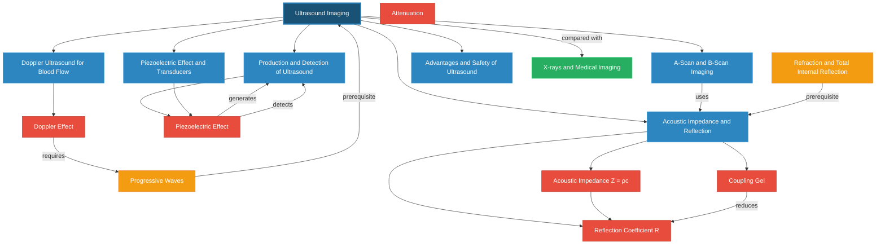

# 1. Overview / 概述

**English:**
Ultrasound imaging, also known as ultrasonography or diagnostic sonography, is a non-invasive medical imaging technique that uses high-frequency sound waves (typically 1–20 MHz) to visualise internal body structures. Unlike [[X-rays and Medical Imaging]], ultrasound does not use ionising radiation, making it safer for repeated use and particularly valuable in obstetrics, cardiology, and soft-tissue imaging.

The fundamental principle involves transmitting ultrasound pulses into the body, detecting the reflected echoes from tissue boundaries, and processing these signals to construct real-time images. The physics behind this technology draws heavily on [[Progressive Waves]] (wave propagation, reflection, and attenuation) and [[Refraction and Total Internal Reflection]] (acoustic impedance matching and boundary behaviour).

In both Cambridge 9702 (Topic 26.2 a–f) and Edexcel IAL (WPH14 Unit 4: 11.7–11.12), students must understand the piezoelectric effect for generating and detecting ultrasound, acoustic impedance and its role in reflection, the principles of A-scan and B-scan imaging, and the Doppler effect for blood flow measurement. This topic is examined through calculations, explanations, and practical applications, often in the context of comparing ultrasound with other imaging modalities.

Real-world applications include: foetal monitoring during pregnancy, echocardiography (heart imaging), abdominal organ examination (liver, kidneys, gallbladder), vascular ultrasound for blood flow assessment, and guided biopsies. The safety profile of ultrasound—no known harmful effects at diagnostic intensities—makes it a cornerstone of modern medical diagnostics.

**中文：**
超声成像（Ultrasound Imaging），又称超声检查或诊断性声像图，是一种利用高频声波（通常为1–20 MHz）无创可视化体内结构的医学成像技术。与[[X-rays and Medical Imaging]]不同，超声不使用电离辐射，因此重复使用更安全，在产科、心脏病学和软组织成像中尤为宝贵。

基本原理包括：向体内发射超声脉冲，检测组织边界反射的回声，并处理这些信号以构建实时图像。该技术背后的物理学原理大量借鉴了[[Progressive Waves]]（波的传播、反射和衰减）以及[[Refraction and Total Internal Reflection]]（声阻抗匹配和边界行为）。

在剑桥9702（主题26.2 a–f）和爱德思IAL（WPH14单元4：11.7–11.12）中，学生必须理解：用于产生和检测超声的压电效应、声阻抗及其在反射中的作用、A扫描和B扫描成像原理，以及用于血流测量的多普勒效应。该主题通过计算、解释和实际应用进行考查，通常与比较超声与其他成像方式的背景相关。

实际应用包括：孕期胎儿监测、超声心动图（心脏成像）、腹部器官检查（肝脏、肾脏、胆囊）、用于血流评估的血管超声以及引导活检。超声在诊断强度下无已知有害影响的安全特性，使其成为现代医学诊断的基石。

---

# 2. Syllabus Learning Objectives / 考纲学习目标

| CAIE 9702 (26.2 a–f) | Edexcel IAL (WPH14 U4: 11.7–11.12) |
|----------------------|--------------------------------------|
| (a) Describe the piezoelectric effect for ultrasound generation and detection | 11.7 Understand the piezoelectric effect and its use in ultrasound transducers |
| (b) Explain acoustic impedance Z = ρc and its role in reflection at boundaries | 11.8 Understand acoustic impedance Z = ρc and the reflection coefficient at boundaries |
| (c) Use the reflection coefficient equation Iᵣ/Iᵢ = (Z₂−Z₁)²/(Z₂+Z₁)² | 11.9 Use the intensity reflection coefficient equation |
| (d) Explain the need for coupling gel to reduce impedance mismatch | 11.10 Understand the need for acoustic impedance matching (coupling gel) |
| (e) Describe A-scan and B-scan imaging principles | 11.11 Understand the principles of A-scan and B-scan ultrasound imaging |
| (f) Explain the Doppler effect in ultrasound for blood flow measurement | 11.12 Understand the Doppler effect in ultrasound for measuring blood flow velocity |

**Examiner Expectations / 考官期望：**

**English:**
- Candidates must be able to define acoustic impedance and calculate it using Z = ρc.
- The reflection coefficient equation must be applied correctly, including recognising that when Z₁ ≈ Z₂, reflection is minimal (good transmission).
- Students should explain why coupling gel is essential: it has acoustic impedance close to soft tissue, reducing the large reflection that would occur at an air–skin boundary.
- For A-scan and B-scan, candidates should describe how echoes are displayed (amplitude vs time for A-scan; brightness-modulated dots forming a 2D image for B-scan).
- The Doppler shift equation Δf = (2fv cosθ)/c must be used for blood flow velocity calculations, with attention to the angle θ between the ultrasound beam and blood flow direction.
- Practical skills: interpreting ultrasound images, calculating distances from echo times, and evaluating safety considerations.

**中文：**
- 考生必须能够定义声阻抗并使用Z = ρc进行计算。
- 必须正确应用反射系数方程，包括识别当Z₁ ≈ Z₂时反射最小（透射良好）。
- 学生应解释为什么需要耦合凝胶：其声阻抗接近软组织，减少了空气-皮肤边界处本会发生的巨大反射。
- 对于A扫描和B扫描，考生应描述回波的显示方式（A扫描为振幅与时间的关系；B扫描为亮度调制点形成二维图像）。
- 必须使用多普勒频移方程Δf = (2fv cosθ)/c进行血流速度计算，注意超声束与血流方向之间的角度θ。
- 实践技能：解读超声图像、根据回波时间计算距离、评估安全性考虑。

> 📋 **CIE Only:** CAIE specifically requires describing the piezoelectric effect in detail, including the role of quartz or PZT crystals and the alternating electric field causing mechanical vibrations. The A-scan/B-scan distinction is explicitly tested in Paper 4 structured questions.
>
> 📋 **Edexcel Only:** Edexcel places greater emphasis on the Doppler effect equation derivation and application, including the factor of 2 (incident and reflected waves both experience Doppler shift). Edexcel also expects students to understand the concept of "pulse-echo" timing and its use in determining depth.

---

# 3. Core Definitions / 核心定义

| Term (EN/CN) | Definition (EN) | Definition (CN) | Common Mistakes / 常见错误 |
|--------------|-----------------|-----------------|---------------------------|
| **Ultrasound** / 超声波 | Sound waves with frequencies above the human hearing range (>20 kHz); for medical imaging, typically 1–20 MHz | 频率高于人耳听觉范围（>20 kHz）的声波；用于医学成像时通常为1–20 MHz | ❌ Confusing ultrasound with infrasound (<20 Hz) |
| **Piezoelectric Effect** / 压电效应 | The generation of an electric potential across certain crystals (e.g., quartz, PZT) when mechanically deformed; conversely, applying an alternating voltage causes mechanical vibration | 某些晶体（如石英、PZT）在机械变形时产生电势差；反之，施加交变电压会引起机械振动 | ❌ Thinking it only works in one direction (it's reversible) |
| **Transducer** / 换能器 | A device that converts one form of energy to another; in ultrasound, it converts electrical energy to sound energy (transmission) and sound energy to electrical energy (detection) | 将一种能量形式转换为另一种能量的装置；在超声中，将电能转换为声能（发射）和声能转换为电能（检测） | ❌ Forgetting the transducer acts as both transmitter and receiver |
| **Acoustic Impedance (Z)** / 声阻抗 | The product of the density of a medium (ρ) and the speed of sound in that medium (c): Z = ρc; measured in kg m⁻² s⁻¹ (rayls) | 介质密度（ρ）与该介质中声速（c）的乘积：Z = ρc；单位为kg m⁻² s⁻¹（瑞利） | ❌ Using Z = ρ/c or forgetting units |
| **Reflection Coefficient (R)** / 反射系数 | The ratio of reflected intensity to incident intensity at a boundary between two media: R = (Z₂−Z₁)²/(Z₂+Z₁)² | 两种介质边界处反射强度与入射强度之比：R = (Z₂−Z₁)²/(Z₂+Z₁)² | ❌ Forgetting to square the fraction; using amplitude instead of intensity |
| **Coupling Gel** / 耦合凝胶 | A gel with acoustic impedance similar to soft tissue, applied between the transducer and skin to eliminate the air gap and reduce reflection | 声阻抗与软组织相似的凝胶，涂抹在换能器和皮肤之间以消除空气间隙并减少反射 | ❌ Thinking it's for lubrication only, not impedance matching |
| **A-Scan** / A扫描 | Amplitude mode: echoes displayed as vertical spikes on a time-base, where spike height indicates echo intensity and horizontal position indicates depth | 振幅模式：回波在时基上显示为垂直尖峰，尖峰高度表示回波强度，水平位置表示深度 | ❌ Confusing A-scan with B-scan display format |
| **B-Scan** / B扫描 | Brightness mode: echoes displayed as bright dots on a screen, where dot brightness indicates echo intensity and position indicates location; scanning the beam creates a 2D cross-sectional image | 亮度模式：回波在屏幕上显示为亮点，亮点亮度表示回波强度，位置表示位置；扫描波束可创建二维横截面图像 | ❌ Thinking B-scan is "better" rather than "brightness" |
| **Doppler Effect (Ultrasound)** / 多普勒效应（超声） | The change in frequency of ultrasound waves reflected from moving blood cells; the frequency shift Δf is proportional to blood flow velocity | 从运动血细胞反射的超声波频率变化；频移Δf与血流速度成正比 | ❌ Forgetting the factor of 2 in the Doppler equation |
| **Attenuation** / 衰减 | The reduction in intensity of an ultrasound wave as it travels through a medium, due to absorption, scattering, and reflection | 超声波在介质中传播时由于吸收、散射和反射导致的强度降低 | ❌ Confusing attenuation with reflection only |

---

# 4. Key Concepts Explained / 关键概念详解

## 4.1 Piezoelectric Effect and Transducers / 压电效应与换能器

### Explanation / 解释
**English:**
The [[Piezoelectric Effect and Transducers]] is the foundation of ultrasound imaging. Certain crystalline materials—most commonly lead zirconate titanate (PZT)—exhibit a unique property: when mechanically stressed (compressed or stretched), an electric potential develops across the crystal faces. Conversely, when an alternating electric field is applied, the crystal mechanically vibrates at the same frequency.

In ultrasound transducers, a thin PZT crystal is sandwiched between two electrodes. An alternating voltage (typically 1–20 MHz) is applied, causing the crystal to vibrate and generate ultrasound waves. After transmission, the same crystal acts as a receiver: returning echoes cause mechanical deformation, generating a small voltage that is detected and processed. This dual role (transmitter and receiver) is called "pulse-echo" operation.

The resonant frequency of the transducer is determined by the crystal thickness: f₀ = c/(2t), where c is the speed of sound in the crystal and t is the thickness. Thinner crystals produce higher frequencies (better resolution but less penetration).

**中文：**
[[Piezoelectric Effect and Transducers]]是超声成像的基础。某些晶体材料——最常见的是锆钛酸铅（PZT）——表现出独特的性质：当受到机械应力（压缩或拉伸）时，晶体表面会产生电势差。反之，当施加交变电场时，晶体会以相同频率机械振动。

在超声换能器中，薄PZT晶体夹在两个电极之间。施加交变电压（通常为1–20 MHz）使晶体振动并产生超声波。发射后，同一晶体充当接收器：返回的回声引起机械变形，产生可检测和处理的微小电压。这种双重角色（发射器和接收器）称为"脉冲-回波"操作。

换能器的谐振频率由晶体厚度决定：f₀ = c/(2t)，其中c是晶体中的声速，t是厚度。较薄的晶体产生更高的频率（更好的分辨率但穿透力较弱）。

### Physical Meaning / 物理意义
**English:**
The piezoelectric effect allows a single device to both generate and detect ultrasound, enabling real-time imaging without moving parts. The frequency choice involves a trade-off: higher frequencies give better spatial resolution (shorter wavelength → finer detail) but are more strongly attenuated, limiting penetration depth. For example, 10–15 MHz is used for superficial structures (thyroid, breast), while 2–5 MHz is used for deep abdominal imaging.

**中文：**
压电效应允许单个设备同时产生和检测超声，实现无需移动部件的实时成像。频率选择涉及权衡：较高频率提供更好的空间分辨率（波长更短→细节更精细），但衰减更强，限制了穿透深度。例如，10–15 MHz用于浅表结构（甲状腺、乳房），而2–5 MHz用于深部腹部成像。

### Common Misconceptions / 常见误区
1. ❌ **"The transducer only transmits ultrasound."** — It acts as both transmitter and receiver (pulse-echo mode).
2. ❌ **"Higher frequency always gives better images."** — Higher frequency improves resolution but reduces penetration depth.
3. ❌ **"Piezoelectric crystals are rare."** — PZT is a synthetic ceramic, widely manufactured.

### Exam Tips / 考试提示
**English:**
- Be prepared to explain the piezoelectric effect in both directions (generation and detection).
- Know the resonant frequency formula f₀ = c/(2t) and how changing crystal thickness affects frequency.
- Understand why damping material is added to the transducer backing: to reduce ringing and improve axial resolution.
- CIE often asks: "Explain how ultrasound is produced and detected using a piezoelectric crystal."

**中文：**
- 准备好解释压电效应的两个方向（产生和检测）。
- 知道谐振频率公式f₀ = c/(2t)以及改变晶体厚度如何影响频率。
- 理解为什么在换能器背面添加阻尼材料：减少振铃并提高轴向分辨率。
- CIE常问："解释如何使用压电晶体产生和检测超声波。"

---

## 4.2 Acoustic Impedance and Reflection / 声阻抗与反射

### Explanation / 解释
**English:**
[[Acoustic Impedance and Reflection]] is the key concept determining how much ultrasound energy is reflected at tissue boundaries. Acoustic impedance Z is defined as:

$$ Z = \rho c $$

where ρ is the density of the medium (kg m⁻³) and c is the speed of sound in that medium (m s⁻¹). The unit is kg m⁻² s⁻¹, also called the rayl.

When an ultrasound wave encounters a boundary between two media with different acoustic impedances (Z₁ and Z₂), some energy is reflected and some is transmitted. The intensity reflection coefficient R is:

$$ R = \frac{I_r}{I_i} = \left( \frac{Z_2 - Z_1}{Z_2 + Z_1} \right)^2 $$

where Iᵣ is reflected intensity and Iᵢ is incident intensity. The transmitted intensity Iₜ = Iᵢ − Iᵣ (assuming no absorption at the boundary).

Key insight: When Z₁ ≈ Z₂, R ≈ 0 (most energy transmitted). When Z₁ ≪ Z₂ or Z₁ ≫ Z₂, R ≈ 1 (most energy reflected). The largest mismatch in medical ultrasound is at the air–skin boundary (Z_air ≈ 400, Z_skin ≈ 1.6 × 10⁶), giving R ≈ 0.9995—meaning 99.95% of energy is reflected, preventing imaging. This is why [[coupling gel]] (Z ≈ 1.5 × 10⁶) is essential.

**中文：**
[[Acoustic Impedance and Reflection]]是决定组织边界处有多少超声能量被反射的关键概念。声阻抗Z定义为：

$$ Z = \rho c $$

其中ρ是介质的密度（kg m⁻³），c是该介质中的声速（m s⁻¹）。单位为kg m⁻² s⁻¹，也称为瑞利。

当超声波遇到具有不同声阻抗（Z₁和Z₂）的两种介质之间的边界时，部分能量被反射，部分被透射。强度反射系数R为：

$$ R = \frac{I_r}{I_i} = \left( \frac{Z_2 - Z_1}{Z_2 + Z_1} \right)^2 $$

其中Iᵣ是反射强度，Iᵢ是入射强度。透射强度Iₜ = Iᵢ − Iᵣ（假设边界处无吸收）。

关键洞察：当Z₁ ≈ Z₂时，R ≈ 0（大部分能量透射）。当Z₁ ≪ Z₂或Z₁ ≫ Z₂时，R ≈ 1（大部分能量反射）。医学超声中最大的不匹配发生在空气-皮肤边界（Z_空气 ≈ 400，Z_皮肤 ≈ 1.6 × 10⁶），给出R ≈ 0.9995——意味着99.95%的能量被反射，阻止了成像。这就是为什么[[耦合凝胶]]（Z ≈ 1.5 × 10⁶）是必不可少的。

### Physical Meaning / 物理意义
**English:**
The acoustic impedance difference determines which tissue boundaries appear bright (strong echoes) or dark (weak echoes) on an ultrasound image. For example:
- Soft tissue–bone boundary: large Z difference → strong reflection → bone appears bright with acoustic shadow behind.
- Soft tissue–fluid boundary: moderate Z difference → visible reflection.
- Within homogeneous tissue: no Z change → no reflection → appears dark (anechoic).

**中文：**
声阻抗差异决定了哪些组织边界在超声图像上显示为亮（强回声）或暗（弱回声）。例如：
- 软组织-骨骼边界：Z差异大 → 强反射 → 骨骼显示明亮，后方有声影。
- 软组织-液体边界：中等Z差异 → 可见反射。
- 均匀组织内：无Z变化 → 无反射 → 显示为暗（无回声）。

### Common Misconceptions / 常见误区
1. ❌ **"Reflection depends only on density."** — It depends on both density AND speed of sound (Z = ρc).
2. ❌ **"The reflection coefficient can be negative."** — R is always between 0 and 1 (intensity ratio).
3. ❌ **"Coupling gel is just for lubrication."** — Its primary purpose is acoustic impedance matching.

### Exam Tips / 考试提示
**English:**
- Memorise typical Z values: air ≈ 400, soft tissue ≈ 1.6 × 10⁶, bone ≈ 7.8 × 10⁶ kg m⁻² s⁻¹.
- Practice calculating R for different boundaries and explaining the implications.
- Edexcel often asks: "Calculate the percentage of ultrasound intensity reflected at a muscle–bone boundary."
- CIE may ask: "Explain why a coupling gel is necessary and what properties it should have."

**中文：**
- 记住典型Z值：空气≈400，软组织≈1.6×10⁶，骨骼≈7.8×10⁶ kg m⁻² s⁻¹。
- 练习计算不同边界的R并解释其含义。
- Edexcel常问："计算肌肉-骨骼边界处反射的超声强度百分比。"
- CIE可能问："解释为什么需要耦合凝胶以及它应具有什么特性。"

---

## 4.3 A-Scan and B-Scan Imaging / A扫描与B扫描成像

### Explanation / 解释
**English:**
[[A-Scan and B-Scan Imaging]] are two display modes for ultrasound echo information.

**A-Scan (Amplitude Mode):**
- A single ultrasound beam is transmitted along one direction.
- Returning echoes are displayed on an oscilloscope as vertical spikes (amplitude) against a horizontal time-base.
- The horizontal axis represents time (and therefore depth, since distance = speed × time/2).
- The vertical spike height represents echo intensity.
- Used for: measuring distances (e.g., eye length for cataract surgery), detecting fluid levels.

**B-Scan (Brightness Mode):**
- The ultrasound beam is scanned across the body (mechanically or electronically).
- Each echo is displayed as a bright dot on a screen.
- Dot brightness represents echo intensity; dot position corresponds to the echo's origin.
- By scanning the beam, a 2D cross-sectional image is built up.
- Used for: real-time imaging of organs, foetal monitoring, guided procedures.

The transition from A-scan to B-scan involves converting amplitude information to brightness modulation and adding spatial scanning.

**中文：**
[[A-Scan and B-Scan Imaging]]是超声回波信息的两种显示模式。

**A扫描（振幅模式）：**
- 沿一个方向发射单束超声波。
- 返回的回波在示波器上显示为垂直尖峰（振幅），以水平时基为基准。
- 水平轴代表时间（因此代表深度，因为距离 = 速度 × 时间/2）。
- 垂直尖峰高度代表回波强度。
- 用于：测量距离（如白内障手术的眼轴长度）、检测液位。

**B扫描（亮度模式）：**
- 超声束在身体上扫描（机械或电子方式）。
- 每个回波在屏幕上显示为一个亮点。
- 亮点亮度代表回波强度；点位置对应回波的起源位置。
- 通过扫描波束，构建二维横截面图像。
- 用于：器官实时成像、胎儿监测、引导操作。

从A扫描到B扫描的过渡涉及将振幅信息转换为亮度调制并添加空间扫描。

### Physical Meaning / 物理意义
**English:**
A-scan provides precise depth information along a single line (like a "sonar depth finder"), while B-scan creates a visual map of tissue structures. Modern ultrasound machines primarily use B-mode, but A-mode is still used in ophthalmology for precise axial length measurements.

**中文：**
A扫描提供沿单线的精确深度信息（如"声纳测深仪"），而B扫描创建组织结构的视觉地图。现代超声机主要使用B模式，但A模式仍用于眼科的精确眼轴长度测量。

### Common Misconceptions / 常见误区
1. ❌ **"A-scan and B-scan are completely different technologies."** — They use the same pulse-echo principle; only the display differs.
2. ❌ **"B-scan gives 3D images."** — Standard B-scan gives 2D cross-sections; 3D ultrasound requires additional processing.
3. ❌ **"The time-base on A-scan directly shows distance."** — It shows time; distance = c × t/2 (factor of 2 for round trip).

### Exam Tips / 考试提示
**English:**
- Know how to calculate depth from echo time: d = ct/2.
- Understand that A-scan is quantitative (amplitude vs time) while B-scan is qualitative (brightness map).
- CIE may show an A-scan trace and ask: "Identify which spike corresponds to which tissue boundary."
- Edexcel may ask: "Explain how a B-scan image is constructed from multiple A-scan lines."

**中文：**
- 知道如何从回波时间计算深度：d = ct/2。
- 理解A扫描是定量的（振幅与时间的关系），而B扫描是定性的（亮度图）。
- CIE可能显示A扫描迹线并问："识别哪个尖峰对应哪个组织边界。"
- Edexcel可能问："解释如何从多个A扫描线构建B扫描图像。"

---

## 4.4 Doppler Ultrasound for Blood Flow / 多普勒超声用于血流

### Explanation / 解释
**English:**
[[Doppler Ultrasound for Blood Flow]] uses the Doppler effect to measure the velocity of moving blood cells. When ultrasound waves reflect off moving red blood cells, the frequency of the reflected wave is shifted:

$$ \Delta f = f_r - f_0 = \frac{2f_0 v \cos\theta}{c} $$

where:
- Δf = Doppler frequency shift (Hz)
- f₀ = transmitted ultrasound frequency (Hz)
- fᵣ = received (reflected) frequency (Hz)
- v = speed of blood flow (m s⁻¹)
- θ = angle between ultrasound beam and blood flow direction
- c = speed of sound in tissue (≈ 1540 m s⁻¹)

The factor of 2 arises because the Doppler shift occurs twice: once when the wave is received by the moving blood cell (acting as a moving observer), and again when the reflected wave is emitted from the moving blood cell (acting as a moving source).

If blood flows toward the transducer, fᵣ > f₀ (positive Δf, higher pitch). If blood flows away, fᵣ < f₀ (negative Δf, lower pitch).

**中文：**
[[Doppler Ultrasound for Blood Flow]]利用多普勒效应测量运动血细胞的速度。当超声波从运动红细胞反射时，反射波的频率发生偏移：

$$ \Delta f = f_r - f_0 = \frac{2f_0 v \cos\theta}{c} $$

其中：
- Δf = 多普勒频移（Hz）
- f₀ = 发射超声频率（Hz）
- fᵣ = 接收（反射）频率（Hz）
- v = 血流速度（m s⁻¹）
- θ = 超声束与血流方向之间的角度
- c = 组织中的声速（≈ 1540 m s⁻¹）

因子2的出现是因为多普勒频移发生两次：一次是运动血细胞接收波时（作为运动观察者），另一次是运动血细胞发射反射波时（作为运动源）。

如果血液流向换能器，fᵣ > f₀（正Δf，音调更高）。如果血液流离换能器，fᵣ < f₀（负Δf，音调更低）。

### Physical Meaning / 物理意义
**English:**
Doppler ultrasound allows non-invasive measurement of blood flow velocity in arteries and veins. This is clinically vital for detecting:
- Stenosis (narrowing) of arteries: increased velocity at the narrowed point.
- Deep vein thrombosis (DVT): absent or reduced flow.
- Foetal heart rate and umbilical cord blood flow.
- Cardiac valve function (regurgitation or stenosis).

The angle θ is critical: if θ = 90°, cosθ = 0 and no Doppler shift is detected. Ideally, θ should be < 60° for accurate measurements.

**中文：**
多普勒超声允许无创测量动脉和静脉中的血流速度。这在临床上对检测以下情况至关重要：
- 动脉狭窄：狭窄点处速度增加。
- 深静脉血栓（DVT）：血流缺失或减少。
- 胎儿心率和脐带血流。
- 心脏瓣膜功能（反流或狭窄）。

角度θ至关重要：如果θ = 90°，cosθ = 0，检测不到多普勒频移。理想情况下，θ应<60°以获得准确测量。

### Common Misconceptions / 常见误区
1. ❌ **"The Doppler shift is f₀v/c (like light)."** — For ultrasound, the factor of 2 is essential because of the reflection geometry.
2. ❌ **"The angle θ doesn't matter much."** — cosθ dramatically affects the measured shift; at 90°, no shift is detected.
3. ❌ **"Doppler ultrasound measures absolute velocity."** — It measures the component of velocity along the beam direction (v cosθ).

### Exam Tips / 考试提示
**English:**
- Memorise the Doppler equation and understand why the factor of 2 appears.
- Practice rearranging the equation to solve for v, Δf, or θ.
- Edexcel often provides a scenario: "Calculate the blood flow velocity given Δf = 2.5 kHz, f₀ = 5 MHz, θ = 45°, c = 1540 m s⁻¹."
- CIE may ask: "Explain why the Doppler shift is detected as an audible signal in some ultrasound systems."

**中文：**
- 记住多普勒方程并理解为什么出现因子2。
- 练习重新排列方程以求解v、Δf或θ。
- Edexcel常提供场景："给定Δf = 2.5 kHz，f₀ = 5 MHz，θ = 45°，c = 1540 m s⁻¹，计算血流速度。"
- CIE可能问："解释为什么在某些超声系统中多普勒频移被检测为可听信号。"

---

## 4.5 Advantages and Safety of Ultrasound / 超声的优势与安全性

### Explanation / 解释
**English:**
[[Advantages and Safety of Ultrasound]] is an important comparison topic, especially when contrasted with [[X-rays and Medical Imaging]].

**Advantages:**
1. **No ionising radiation** — Unlike X-rays, ultrasound uses mechanical waves, not electromagnetic radiation. No known harmful effects at diagnostic intensities.
2. **Real-time imaging** — Allows dynamic assessment of moving structures (heart valves, foetal movement, blood flow).
3. **Portable and relatively inexpensive** — Compared to MRI or CT scanners.
4. **Non-invasive** — No needles, contrast agents (usually), or surgical incisions.
5. **Soft tissue differentiation** — Excellent for distinguishing between different soft tissues (muscle, fat, fluid-filled structures).

**Safety Considerations:**
- **Thermal effects:** Ultrasound energy can cause tissue heating through absorption. Diagnostic systems limit intensity to < 100 mW cm⁻² to keep temperature rise < 1°C.
- **Cavitation:** High-intensity ultrasound can cause gas bubble formation in tissues (inertial cavitation). Diagnostic ultrasound uses intensities well below the cavitation threshold.
- **Mechanical effects:** Radiation force can cause tissue displacement, but this is negligible at diagnostic levels.
- **ALARA Principle:** "As Low As Reasonably Achievable" — exposure time and intensity should be minimised while maintaining diagnostic quality.

**中文：**
[[Advantages and Safety of Ultrasound]]是一个重要的比较主题，特别是与[[X-rays and Medical Imaging]]对比时。

**优势：**
1. **无电离辐射** — 与X射线不同，超声使用机械波而非电磁辐射。在诊断强度下无已知有害效应。
2. **实时成像** — 允许动态评估运动结构（心脏瓣膜、胎儿运动、血流）。
3. **便携且相对便宜** — 与MRI或CT扫描仪相比。
4. **无创** — 无需针头、造影剂（通常）或手术切口。
5. **软组织区分** — 在区分不同软组织（肌肉、脂肪、含液结构）方面表现出色。

**安全考虑：**
- **热效应：** 超声能量可通过吸收引起组织加热。诊断系统将强度限制在<100 mW cm⁻²，以保持温升<1°C。
- **空化效应：** 高强度超声可引起组织中气泡形成（惯性空化）。诊断超声使用的强度远低于空化阈值。
- **机械效应：** 辐射力可引起组织位移，但在诊断水平下可忽略。
- **ALARA原则：** "合理可行尽量低"——在保持诊断质量的同时，应最小化暴露时间和强度。

### Common Misconceptions / 常见误区
1. ❌ **"Ultrasound is completely harmless with no risks."** — While very safe, thermal and cavitation effects exist at high intensities.
2. ❌ **"Ultrasound can be used for bone imaging."** — Ultrasound is strongly reflected by bone and cannot image through it (acoustic shadow).
3. ❌ **"Ultrasound is better than X-rays for everything."** — Each modality has strengths; X-rays are better for bone and lung imaging.

### Exam Tips / 考试提示
**English:**
- Be ready to compare ultrasound with X-rays in terms of safety, resolution, penetration, and cost.
- Understand the ALARA principle and why it's applied.
- CIE may ask: "Discuss the advantages and limitations of ultrasound compared to X-ray imaging."
- Edexcel may ask: "Explain the safety precautions taken when using diagnostic ultrasound."

**中文：**
- 准备好从安全性、分辨率、穿透力和成本方面比较超声与X射线。
- 理解ALARA原则及其应用原因。
- CIE可能问："讨论超声与X射线成像相比的优势和局限性。"
- Edexcel可能问："解释使用诊断超声时采取的安全预防措施。"

---

# 5. Essential Equations / 核心公式

## 5.1 Acoustic Impedance / 声阻抗

**Equation / 公式:**
$$ Z = \rho c $$

**Variables / 变量:**
| Symbol (符号) | Meaning (EN) | Meaning (CN) | Unit (单位) |
|--------------|-------------|-------------|------------|
| Z | Acoustic impedance | 声阻抗 | kg m⁻² s⁻¹ (rayl) |
| ρ | Density of medium | 介质密度 | kg m⁻³ |
| c | Speed of sound in medium | 介质中声速 | m s⁻¹ |

**Derivation / 推导:**
**English:**
Acoustic impedance is derived from the ratio of acoustic pressure to particle velocity in a medium. For a plane wave, p = ρcv, so Z = p/v = ρc. It represents the resistance of a medium to the passage of sound waves.

**中文：**
声阻抗源自介质中声压与质点速度之比。对于平面波，p = ρcv，所以Z = p/v = ρc。它表示介质对声波传播的阻力。

**Conditions / 适用条件:**
**English:** Valid for all media (solids, liquids, gases) for longitudinal sound waves.
**中文：** 适用于所有介质（固体、液体、气体）中的纵波。

**Limitations / 局限性:**
**English:** Z varies with frequency in some materials (dispersion); the equation assumes a homogeneous, isotropic medium.
**中文：** 在某些材料中Z随频率变化（色散）；该方程假设均匀、各向同性介质。

**Rearrangements / 变形:**
$$ \rho = \frac{Z}{c} \quad \text{or} \quad c = \frac{Z}{\rho} $$

---

## 5.2 Intensity Reflection Coefficient / 强度反射系数

**Equation / 公式:**
$$ R = \frac{I_r}{I_i} = \left( \frac{Z_2 - Z_1}{Z_2 + Z_1} \right)^2 $$

**Variables / 变量:**
| Symbol (符号) | Meaning (EN) | Meaning (CN) | Unit (单位) |
|--------------|-------------|-------------|------------|
| R | Intensity reflection coefficient | 强度反射系数 | dimensionless (0–1) |
| Iᵣ | Reflected intensity | 反射强度 | W m⁻² |
| Iᵢ | Incident intensity | 入射强度 | W m⁻² |
| Z₁ | Acoustic impedance of first medium | 第一种介质的声阻抗 | kg m⁻² s⁻¹ |
| Z₂ | Acoustic impedance of second medium | 第二种介质的声阻抗 | kg m⁻² s⁻¹ |

**Derivation / 推导:**
**English:**
The equation is derived from boundary conditions requiring continuity of pressure and particle velocity at the interface. For normal incidence, the pressure reflection coefficient is (Z₂−Z₁)/(Z₂+Z₁). Since intensity ∝ pressure², the intensity reflection coefficient is the square of this.

**中文：**
该方程从边界条件推导，要求在界面处压力和质点速度连续。对于垂直入射，压力反射系数为(Z₂−Z₁)/(Z₂+Z₁)。由于强度∝压力²，强度反射系数为此值的平方。

**Conditions / 适用条件:**
**English:** Valid for normal incidence (θ = 0°) at a plane boundary between two media. For oblique incidence, the angle affects reflection.
**中文：** 适用于两种介质之间平面边界的垂直入射（θ = 0°）。对于斜入射，角度影响反射。

**Limitations / 局限性:**
**English:** Does not account for absorption losses at the boundary; assumes no energy conversion to other forms.
**中文：** 不考虑边界处的吸收损失；假设没有能量转换为其他形式。

**Rearrangements / 变形:**
$$ I_r = R \times I_i \quad \text{or} \quad I_t = I_i(1 - R) \quad \text{(transmitted intensity)} $$

---

## 5.3 Depth from Echo Time / 从回波时间计算深度

**Equation / 公式:**
$$ d = \frac{ct}{2} $$

**Variables / 变量:**
| Symbol (符号) | Meaning (EN) | Meaning (CN) | Unit (单位) |
|--------------|-------------|-------------|------------|
| d | Depth of reflecting boundary | 反射边界深度 | m |
| c | Speed of sound in tissue | 组织中的声速 | m s⁻¹ |
| t | Time between pulse transmission and echo reception | 脉冲发射与回波接收之间的时间 | s |

**Derivation / 推导:**
**English:**
The ultrasound pulse travels from transducer to boundary (distance d) and back (distance d), so total distance = 2d. Since distance = speed × time: 2d = ct, therefore d = ct/2.

**中文：**
超声脉冲从换能器传播到边界（距离d）并返回（距离d），所以总距离 = 2d。由于距离 = 速度 × 时间：2d = ct，因此d = ct/2。

**Conditions / 适用条件:**
**English:** Assumes constant speed of sound in the medium and that the echo returns from a single boundary.
**中文：** 假设介质中声速恒定且回波来自单个边界。

**Limitations / 局限性:**
**English:** In real tissues, c varies slightly (soft tissue ≈ 1540 m s⁻¹, bone ≈ 4000 m s⁻¹), introducing small errors.
**中文：** 在真实组织中，c略有变化（软组织≈1540 m s⁻¹，骨骼≈4000 m s⁻¹），引入小误差。

**Rearrangements / 变形:**
$$ t = \frac{2d}{c} \quad \text{or} \quad c = \frac{2d}{t} $$

---

## 5.4 Doppler Frequency Shift / 多普勒频移

**Equation / 公式:**
$$ \Delta f = f_r - f_0 = \frac{2f_0 v \cos\theta}{c} $$

**Variables / 变量:**
| Symbol (符号) | Meaning (EN) | Meaning (CN) | Unit (单位) |
|--------------|-------------|-------------|------------|
| Δf | Doppler frequency shift | 多普勒频移 | Hz |
| f₀ | Transmitted ultrasound frequency | 发射超声频率 | Hz |
| fᵣ | Received (reflected) frequency | 接收（反射）频率 | Hz |
| v | Speed of blood flow | 血流速度 | m s⁻¹ |
| θ | Angle between ultrasound beam and blood flow | 超声束与血流之间的角度 | degrees or radians |
| c | Speed of sound in tissue (≈ 1540 m s⁻¹) | 组织中的声速（≈1540 m s⁻¹） | m s⁻¹ |

**Derivation / 推导:**
**English:**
The Doppler shift occurs twice:
1. The moving blood cell acts as a moving observer: f₁ = f₀(c + v cosθ)/c (approaching) or f₀(c − v cosθ)/c (receding).
2. The moving blood cell then acts as a moving source emitting f₁: fᵣ = f₁ c/(c − v cosθ) (approaching) or f₁ c/(c + v cosθ) (receding).
Combining and using the approximation v ≪ c gives Δf ≈ 2f₀v cosθ/c.

**中文：**
多普勒频移发生两次：
1. 运动血细胞作为运动观察者：f₁ = f₀(c + v cosθ)/c（接近）或f₀(c − v cosθ)/c（远离）。
2. 运动血细胞然后作为运动源发射f₁：fᵣ = f₁ c/(c − v cosθ)（接近）或f₁ c/(c + v cosθ)（远离）。
结合并使用v ≪ c的近似，得到Δf ≈ 2f₀v cosθ/c。

**Conditions / 适用条件:**
**English:** Valid when v ≪ c (blood flow velocity << speed of sound), which is always true in medical applications.
**中文：** 当v ≪ c（血流速度<<声速）时有效，这在医学应用中始终成立。

**Limitations / 局限性:**
**English:** Only measures the component of velocity along the beam direction (v cosθ). If θ = 90°, no shift is detected. The equation assumes a single scatterer; in reality, blood contains many cells with a range of velocities.
**中文：** 仅测量沿波束方向的速度分量（v cosθ）。如果θ = 90°，检测不到频移。该方程假设单个散射体；实际上，血液包含许多具有不同速度的细胞。

**Rearrangements / 变形:**
$$ v = \frac{\Delta f \cdot c}{2f_0 \cos\theta} \quad \text{or} \quad \cos\theta = \frac{\Delta f \cdot c}{2f_0 v} $$

---

## 5.5 Resonant Frequency of Piezoelectric Crystal / 压电晶体谐振频率

**Equation / 公式:**
$$ f_0 = \frac{c_c}{2t} $$

**Variables / 变量:**
| Symbol (符号) | Meaning (EN) | Meaning (CN) | Unit (单位) |
|--------------|-------------|-------------|------------|
| f₀ | Resonant frequency | 谐振频率 | Hz |
| c_c | Speed of sound in the crystal | 晶体中的声速 | m s⁻¹ |
| t | Thickness of the crystal | 晶体厚度 | m |

**Derivation / 推导:**
**English:**
The crystal vibrates most efficiently when its thickness equals half the wavelength of sound in the crystal (standing wave condition): t = λ/2. Since c = fλ, we get f₀ = c_c/(2t).

**中文：**
当晶体厚度等于晶体中声波半波长（驻波条件）时，晶体振动最有效：t = λ/2。由于c = fλ，得到f₀ = c_c/(2t)。

**Conditions / 适用条件:**
**English:** Valid for thickness-mode vibration of a thin piezoelectric plate.
**中文：** 适用于薄压电板的厚度模式振动。

**Limitations / 局限性:**
**English:** Assumes the crystal is free to vibrate; in practice, backing material and matching layers affect the resonant frequency.
**中文：** 假设晶体自由振动；实际上，背衬材料和匹配层会影响谐振频率。

**Rearrangements / 变形:**
$$ t = \frac{c_c}{2f_0} \quad \text{or} \quad c_c = 2f_0 t $$

---

# 6. Graphs and Relationships / 图表与关系

## 6.1 A-Scan Display / A扫描显示

### Axes / 坐标轴
**English:** X-axis: Time (or depth), Y-axis: Echo amplitude (voltage or intensity)
**中文：** X轴：时间（或深度），Y轴：回波振幅（电压或强度）

### Shape / 形状
**English:** A series of vertical spikes (pulses) at different positions along the time-base. The first spike is usually the transmitted pulse (at t=0). Subsequent spikes represent echoes from different tissue boundaries.
**中文：** 沿时基在不同位置的一系列垂直尖峰（脉冲）。第一个尖峰通常是发射脉冲（t=0处）。后续尖峰代表来自不同组织边界的回波。

### Gradient Meaning / 斜率含义
**English:** The gradient of the spike rising edge is related to the bandwidth of the transducer; steeper edges indicate broader bandwidth (better axial resolution). However, the key information is spike height (amplitude) and position (time).
**中文：** 尖峰上升沿的斜率与换能器的带宽有关；更陡的边表示更宽的带宽（更好的轴向分辨率）。但关键信息是尖峰高度（振幅）和位置（时间）。

### Area Meaning / 面积含义
**English:** The area under each spike is related to the total energy of the echo, but in practice, peak amplitude is used as the measure of echo strength.
**中文：** 每个尖峰下的面积与回波的总能量有关，但在实践中，峰值振幅被用作回波强度的度量。

### Exam Interpretation / 考试解读
**English:**
- The horizontal distance between spikes corresponds to the time between echoes, which relates to the distance between tissue boundaries.
- The height of each spike indicates the strength of reflection (related to acoustic impedance mismatch).
- A spike at t₁ corresponds to a boundary at depth d₁ = c × t₁/2.

**中文：**
- 尖峰之间的水平距离对应回波之间的时间，这与组织边界之间的距离有关。
- 每个尖峰的高度表示反射强度（与声阻抗不匹配有关）。
- t₁处的尖峰对应深度d₁ = c × t₁/2处的边界。

### Common Questions / 常见问题
**English:**
- "Identify which spike corresponds to the anterior and posterior walls of the bladder."
- "Calculate the distance between two reflecting boundaries from the A-scan trace."
- "Explain why the amplitude of echoes decreases with depth."

**中文：**
- "识别哪个尖峰对应膀胱的前壁和后壁。"
- "从A扫描迹线计算两个反射边界之间的距离。"
- "解释为什么回波振幅随深度减小。"

---

## 6.2 B-Scan Image / B扫描图像

### Axes / 坐标轴
**English:** X-axis: Lateral position (scan direction), Y-axis: Depth (distance from transducer)
**中文：** X轴：横向位置（扫描方向），Y轴：深度（距换能器的距离）

### Shape / 形状
**English:** A 2D greyscale image where bright regions indicate strong echoes (high reflection coefficient) and dark regions indicate weak or no echoes (anechoic). The image is built from multiple adjacent A-scan lines.
**中文：** 二维灰度图像，亮区表示强回声（高反射系数），暗区表示弱回声或无回声（无回声区）。图像由多个相邻的A扫描线构建。

### Gradient Meaning / 斜率含义
**English:** Not applicable in the same way as A-scan. The brightness gradient across the image indicates changes in tissue composition. Sharp brightness changes indicate tissue boundaries.
**中文：** 与A扫描不同，不适用。图像上的亮度梯度表示组织成分的变化。亮度突变表示组织边界。

### Area Meaning / 面积含义
**English:** The area of a bright or dark region corresponds to the cross-sectional area of an organ or structure. Clinicians can measure areas and volumes from B-scan images.
**中文：** 亮区或暗区的面积对应器官或结构的横截面积。临床医生可以从B扫描图像测量面积和体积。

### Exam Interpretation / 考试解读
**English:**
- Anechoic (black) regions: fluid-filled structures (bladder, cysts, blood vessels).
- Hyperechoic (bright) regions: bone, calcifications, gas.
- Hypoechoic (darker) regions: homogeneous soft tissue (liver, muscle).
- Acoustic shadowing: dark region behind a strongly reflecting structure (e.g., behind bone or gallstones).

**中文：**
- 无回声（黑色）区域：含液结构（膀胱、囊肿、血管）。
- 高回声（明亮）区域：骨骼、钙化、气体。
- 低回声（较暗）区域：均匀软组织（肝脏、肌肉）。
- 声影：强反射结构后方的暗区（如骨骼或胆结石后方）。

### Common Questions / 常见问题
**English:**
- "Identify the structures labelled A, B, C on the B-scan image."
- "Explain why there is an acoustic shadow behind the gallstone."
- "Describe how the B-scan image is constructed from multiple A-scan lines."

**中文：**
- "识别B扫描图像上标注为A、B、C的结构。"
- "解释为什么胆结石后方有声影。"
- "描述如何从多个A扫描线构建B扫描图像。"

---

## 6.3 Doppler Shift vs Blood Flow Velocity / 多普勒频移与血流速度的关系

### Axes / 坐标轴
**English:** X-axis: Blood flow velocity (v), Y-axis: Doppler frequency shift (Δf)
**中文：** X轴：血流速度（v），Y轴：多普勒频移（Δf）

### Shape / 形状
**English:** A straight line through the origin (linear relationship) for a fixed angle θ. The gradient is (2f₀ cosθ)/c.
**中文：** 对于固定角度θ，为通过原点的直线（线性关系）。斜率为(2f₀ cosθ)/c。

### Gradient Meaning / 斜率含义
**English:** The gradient = 2f₀ cosθ/c. A steeper gradient means higher sensitivity (larger Δf for a given v). This occurs with higher f₀ or smaller θ.
**中文：** 斜率 = 2f₀ cosθ/c。更陡的斜率意味着更高的灵敏度（给定v下更大的Δf）。这发生在更高的f₀或更小的θ时。

### Area Meaning / 面积含义
**English:** Not applicable for this relationship.
**中文：** 不适用于此关系。

### Exam Interpretation / 考试解读
**English:**
- The linear relationship allows calibration: measuring Δf gives v directly if θ is known.
- If θ is unknown, the maximum possible velocity can be estimated by assuming cosθ = 1 (θ = 0°).
- Multiple velocities in a vessel produce a spectrum of Doppler shifts (spectral broadening).

**中文：**
- 线性关系允许校准：如果θ已知，测量Δf直接得到v。
- 如果θ未知，可以通过假设cosθ = 1（θ = 0°）来估计最大可能速度。
- 血管中的多种速度产生多普勒频移谱（频谱展宽）。

### Common Questions / 常见问题
**English:**
- "Calculate the blood flow velocity from the measured Doppler shift."
- "Explain how the angle θ affects the measured Doppler shift."
- "Sketch a graph showing how Δf varies with v for two different angles."

**中文：**
- "从测量的多普勒频移计算血流速度。"
- "解释角度θ如何影响测量的多普勒频移。"
- "画出显示Δf如何随v变化（对于两个不同角度）的草图。"

---

## 6.4 Attenuation vs Depth / 衰减与深度的关系

### Axes / 坐标轴
**English:** X-axis: Depth (distance travelled), Y-axis: Ultrasound intensity (log scale)
**中文：** X轴：深度（传播距离），Y轴：超声强度（对数刻度）

### Shape / 形状
**English:** Exponential decay: I = I₀e^(−μx), where μ is the attenuation coefficient. On a log-linear plot, this appears as a straight line with gradient −μ.
**中文：** 指数衰减：I = I₀e^(−μx)，其中μ是衰减系数。在对数-线性图上，这表现为斜率为−μ的直线。

### Gradient Meaning / 斜率含义
**English:** The gradient on a log-linear plot equals −μ (the attenuation coefficient in Np m⁻¹ or dB m⁻¹). A steeper negative gradient means stronger attenuation.
**中文：** 对数-线性图上的斜率等于−μ（衰减系数，单位为Np m⁻¹或dB m⁻¹）。更陡的负斜率意味着更强的衰减。

### Area Meaning / 面积含义
**English:** Not applicable.
**中文：** 不适用。

### Exam Interpretation / 考试解读
**English:**
- Higher frequency ultrasound attenuates more rapidly (μ increases with f).
- This explains the trade-off: higher frequency gives better resolution but less penetration.
- Time-gain compensation (TGC) is used in ultrasound machines to amplify later echoes and compensate for attenuation.

**中文：**
- 较高频率的超声衰减更快（μ随f增加）。
- 这解释了权衡：较高频率提供更好的分辨率但穿透力较弱。
- 超声机中使用时间增益补偿（TGC）来放大较晚的回波并补偿衰减。

### Common Questions / 常见问题
**English:**
- "Explain why deeper structures appear darker on an ultrasound image without TGC."
- "Calculate the intensity at a given depth given the attenuation coefficient."
- "Compare the penetration of 3 MHz and 10 MHz ultrasound."

**中文：**
- "解释为什么没有TGC时较深的结构在超声图像上显得更暗。"
- "给定衰减系数，计算给定深度处的强度。"
- "比较3 MHz和10 MHz超声的穿透力。"

---

# 7. Required Diagrams / 必备图表

## 7.1 Piezoelectric Transducer Construction / 压电换能器结构

### Description / 描述
**English:**
A cross-sectional diagram of an ultrasound transducer showing: the PZT crystal (active element) sandwiched between two electrodes, the backing (damping) layer behind the crystal, the matching layer in front, and the acoustic lens. The diagram should show the electrical connections and indicate the direction of ultrasound propagation.

**中文：**
超声换能器的横截面图，显示：夹在两个电极之间的PZT晶体（有源元件），晶体后面的背衬（阻尼）层，前面的匹配层，以及声透镜。该图应显示电气连接并指示超声传播方向。

### Image Prompt / 图片生成提示
> 📷 **IMAGE PROMPT — US01: Piezoelectric Transducer Cross-Section**
>
> A detailed cross-sectional diagram of a medical ultrasound transducer. The central PZT (lead zirconate titanate) crystal is shown as a thin rectangular slab in pale yellow, sandwiched between two thin gold electrode layers. Above the crystal is a matching layer (dark blue) and an acoustic lens (curved grey shape). Below the crystal is a thick backing block (dark grey, labelled "damping material"). Electrical wires connect to both electrodes. The ultrasound beam is shown as diverging blue waves emanating from the lens surface. Labels: "PZT Crystal", "Electrodes", "Matching Layer", "Acoustic Lens", "Backing Material", "Ultrasound Beam". Clean technical illustration style, white background, precise engineering drawing aesthetic, 2D cross-section view.

### Labels Required / 需要标注
| English | 中文 |
|---------|------|
| PZT Crystal | PZT晶体 |
| Electrodes | 电极 |
| Matching Layer | 匹配层 |
| Acoustic Lens | 声透镜 |
| Backing (Damping) Material | 背衬（阻尼）材料 |
| Ultrasound Beam | 超声束 |
| Electrical Connections | 电气连接 |

### Exam Importance / 考试重要性
**English:**
This diagram is essential for explaining how ultrasound is generated and detected. CIE and Edexcel both require understanding of the transducer's construction and the function of each component. The backing material's role in damping (reducing pulse duration to improve axial resolution) is a common exam point.

**中文：**
该图对于解释如何产生和检测超声至关重要。CIE和Edexcel都要求理解换能器的结构和每个组件的功能。背衬材料在阻尼（减少脉冲持续时间以提高轴向分辨率）中的作用是常见的考点。

---

## 7.2 A-Scan Display Trace / A扫描显示迹线

### Description / 描述
**English:**
An oscilloscope screen showing an A-scan trace. The horizontal time-base is calibrated in microseconds (or depth in cm). The trace shows: a large initial spike (transmitted pulse at t=0), followed by smaller spikes at various times representing echoes from tissue boundaries. The diagram should label the transmitted pulse, echo from the anterior wall, echo from the posterior wall, and indicate how depth is calculated.

**中文：**
示波器屏幕显示A扫描迹线。水平时基以微秒（或深度厘米）校准。迹线显示：大的初始尖峰（t=0处的发射脉冲），随后在不同时间出现代表组织边界回波的较小尖峰。该图应标注发射脉冲、前壁回波、后壁回波，并指示如何计算深度。

### Image Prompt / 图片生成提示
> 📷 **IMAGE PROMPT — US02: A-Scan Ultrasound Display**
>
> An oscilloscope screen showing an A-scan (amplitude mode) ultrasound trace. The screen has a dark green phosphor background with a bright green trace. The horizontal axis is labelled "Time / µs" with tick marks from 0 to 100 µs. The vertical axis is labelled "Amplitude". The trace shows: a very tall narrow spike at t=0 (labelled "Transmitted Pulse"), then a medium spike at t=13 µs (labelled "Anterior Wall Echo"), then a small spike at t=26 µs (labelled "Posterior Wall Echo"), then a tiny spike at t=40 µs. A dashed line connects the anterior wall spike to a depth scale on the bottom. Clean technical illustration, retro oscilloscope aesthetic, precise labels with arrows.

### Labels Required / 需要标注
| English | 中文 |
|---------|------|
| Transmitted Pulse | 发射脉冲 |
| Anterior Wall Echo | 前壁回波 |
| Posterior Wall Echo | 后壁回波 |
| Time Base (µs) | 时基（微秒） |
| Amplitude | 振幅 |
| Depth = c × t / 2 | 深度 = c × t / 2 |

### Exam Importance / 考试重要性
**English:**
A-scan traces are frequently used in exam questions to test understanding of pulse-echo timing and depth calculation. Students must be able to interpret the trace, identify which spike corresponds to which boundary, and calculate distances.

**中文：**
A扫描迹线常用于考试问题中，以测试对脉冲-回波定时和深度计算的理解。学生必须能够解读迹线，识别哪个尖峰对应哪个边界，并计算距离。

---

## 7.3 B-Scan Image Formation / B扫描图像形成

### Description / 描述
**English:**
A diagram showing how a B-scan image is constructed. Multiple adjacent A-scan lines are shown, each converted to a brightness-modulated line. The diagram should show: the transducer scanning across the body, individual A-scan lines at different positions, and the resulting 2D greyscale image with labelled anatomical structures (e.g., bladder, uterus, foetus).

**中文：**
显示如何构建B扫描图像的示意图。显示多个相邻的A扫描线，每条线转换为亮度调制线。该图应显示：换能器在身体上扫描，不同位置的单个A扫描线，以及带有标注解剖结构（如膀胱、子宫、胎儿）的最终二维灰度图像。

### Image Prompt / 图片生成提示
> 📷 **IMAGE PROMPT — US03: B-Scan Image Formation**
>
> A three-part educational diagram showing B-scan ultrasound image formation. Left panel: a curved ultrasound transducer on the surface of the abdomen, with multiple thin ultrasound beams (blue lines) diverging into the body at different angles. Middle panel: individual A-scan traces (amplitude vs depth) for three different beam positions, showing different echo patterns. Right panel: the resulting B-scan greyscale image showing a cross-section of the abdomen with a foetus visible (head, body, limbs), with brightness corresponding to echo strength. Arrows connect the A-scan spikes to the bright dots on the B-scan. Clean medical illustration style, blue and grey colour scheme, anatomical accuracy, educational labels.

### Labels Required / 需要标注
| English | 中文 |
|---------|------|
| Transducer | 换能器 |
| Ultrasound Beams | 超声束 |
| A-Scan Lines | A扫描线 |
| B-Scan Image | B扫描图像 |
| Foetus | 胎儿 |
| Amniotic Fluid (Anechoic) | 羊水（无回声） |
| Uterine Wall | 子宫壁 |

### Exam Importance / 考试重要性
**English:**
This diagram helps students understand the relationship between A-scan and B-scan, and how a 2D image is constructed. Edexcel specifically requires understanding of how multiple A-scan lines form a B-scan image.

**中文：**
该图帮助学生理解A扫描和B扫描之间的关系，以及如何构建二维图像。Edexcel特别要求理解多个A扫描线如何形成B扫描图像。

---

## 7.4 Doppler Ultrasound Principle / 多普勒超声原理

### Description / 描述
**English:**
A diagram showing the Doppler ultrasound principle for blood flow measurement. It should show: an ultrasound transducer aimed at a blood vessel, the angle θ between the ultrasound beam and the direction of blood flow, red blood cells moving through the vessel, incident ultrasound waves (frequency f₀), and reflected waves (frequency fᵣ). The diagram should indicate that fᵣ > f₀ when blood flows toward the transducer.

**中文：**
显示用于血流测量的多普勒超声原理的示意图。应显示：对准血管的超声换能器，超声束与血流方向之间的角度θ，通过血管运动的红细胞，入射超声波（频率f₀），以及反射波（频率fᵣ）。该图应指示当血液流向换能器时fᵣ > f₀。

### Image Prompt / 图片生成提示
> 📷 **IMAGE PROMPT — US04: Doppler Ultrasound Blood Flow Measurement**
>
> A medical illustration showing Doppler ultrasound measurement of blood flow in an artery. Left side: a handheld ultrasound transducer placed on the skin surface at an angle. A blue ultrasound beam (labelled "f₀ = 5 MHz") travels from the transducer into the body, hitting a blood vessel (red artery cross-section). Inside the vessel, small red blood cells (red circles) are moving to the right (arrow labelled "v"). The angle between the beam and the flow direction is marked as "θ = 45°". Reflected waves (labelled "fᵣ > f₀") travel back to the transducer. A small graph in the corner shows the frequency spectrum with a peak shifted to the right. Clean medical illustration, blue and red colour scheme, educational labels, realistic anatomy.

### Labels Required / 需要标注
| English | 中文 |
|---------|------|
| Transducer | 换能器 |
| Ultrasound Beam (f₀) | 超声束（f₀） |
| Reflected Wave (fᵣ) | 反射波（fᵣ） |
| Blood Vessel | 血管 |
| Red Blood Cells | 红细胞 |
| Blood Flow Velocity (v) | 血流速度（v） |
| Angle θ | 角度θ |
| Skin Surface | 皮肤表面 |

### Exam Importance / 考试重要性
**English:**
This diagram is essential for understanding the Doppler equation and the importance of the angle θ. Both CIE and Edexcel test the Doppler effect in ultrasound, and students must be able to explain the geometry and apply the equation.

**中文：**
该图对于理解多普勒方程和角度θ的重要性至关重要。CIE和Edexcel都测试超声中的多普勒效应，学生必须能够解释几何关系并应用方程。

---

# 8. Worked Examples / 典型例题

## Example 1: Acoustic Impedance and Reflection / 声阻抗与反射

### Question / 题目
**English:**
The acoustic impedance of soft tissue is 1.63 × 10⁶ kg m⁻² s⁻¹ and the acoustic impedance of bone is 7.80 × 10⁶ kg m⁻² s⁻¹.

(a) Calculate the intensity reflection coefficient at a soft tissue–bone boundary.
(b) Calculate the percentage of ultrasound intensity transmitted into the bone.
(c) Explain why a coupling gel (Z = 1.50 × 10⁶ kg m⁻² s⁻¹) is used between the transducer (Z = 30 × 10⁶ kg m⁻² s⁻¹) and the skin (Z = 1.63 × 10⁶ kg m⁻² s⁻¹).

**中文：**
软组织的声阻抗为1.63 × 10⁶ kg m⁻² s⁻¹，骨骼的声阻抗为7.80 × 10⁶ kg m⁻² s⁻¹。

(a) 计算软组织-骨骼边界处的强度反射系数。
(b) 计算透射进入骨骼的超声强度百分比。
(c) 解释为什么在换能器（Z = 30 × 10⁶ kg m⁻² s⁻¹）和皮肤（Z = 1.63 × 10⁶ kg m⁻² s⁻¹）之间使用耦合凝胶（Z = 1.50 × 10⁶ kg m⁻² s⁻¹）。

### Solution / 解答

**Part (a):**

$$ R = \left( \frac{Z_2 - Z_1}{Z_2 + Z_1} \right)^2 $$

$$ R = \left( \frac{7.80 \times 10^6 - 1.63 \times 10^6}{7.80 \times 10^6 + 1.63 \times 10^6} \right)^2 $$

$$ R = \left( \frac{6.17 \times 10^6}{9.43 \times 10^6} \right)^2 $$

$$ R = (0.654)^2 = 0.428 $$

**Answer (a):** R = 0.428 (or 42.8%)

**Part (b):**

The transmitted intensity Iₜ = Iᵢ − Iᵣ = Iᵢ(1 − R)

Percentage transmitted = (1 − R) × 100% = (1 − 0.428) × 100% = 57.2%

**Answer (b):** 57.2% of the ultrasound intensity is transmitted into bone.

**Part (c):**

Without coupling gel, there is an air gap between the transducer and skin. The acoustic impedance of air (≈ 400 kg m⁻² s⁻¹) is vastly different from both the transducer (30 × 10⁶) and skin (1.63 × 10⁶). At the transducer–air boundary:

$$ R = \left( \frac{30 \times 10^6 - 400}{30 \times 10^6 + 400} \right)^2 \approx 1.00 $$

This means nearly all ultrasound energy is reflected at the transducer–air interface, and almost no energy enters the body.

The coupling gel has an acoustic impedance (1.50 × 10⁶ kg m⁻² s⁻¹) close to that of skin (1.63 × 10⁶ kg m⁻² s⁻¹). This creates two boundaries with small impedance mismatches:
- Transducer–gel: moderate mismatch, but gel is thin so multiple reflections cancel.
- Gel–skin: very small mismatch (R ≈ 0.002), so most energy enters the skin.

The gel eliminates the air gap and provides acoustic impedance matching, allowing efficient transmission of ultrasound into the body.

**中文：**

**部分(a)：**

$$ R = \left( \frac{Z_2 - Z_1}{Z_2 + Z_1} \right)^2 $$

$$ R = \left( \frac{7.80 \times 10^6 - 1.63 \times 10^6}{7.80 \times 10^6 + 1.63 \times 10^6} \right)^2 $$

$$ R = \left( \frac{6.17 \times 10^6}{9.43 \times 10^6} \right)^2 $$

$$ R = (0.654)^2 = 0.428 $$

**答案(a)：** R = 0.428（或42.8%）

**部分(b)：**

透射强度Iₜ = Iᵢ − Iᵣ = Iᵢ(1 − R)

透射百分比 = (1 − R) × 100% = (1 − 0.428) × 100% = 57.2%

**答案(b)：** 57.2%的超声强度透射进入骨骼。

**部分(c)：**

没有耦合凝胶时，换能器和皮肤之间存在空气间隙。空气的声阻抗（≈ 400 kg m⁻² s⁻¹）与换能器（30 × 10⁶）和皮肤（1.63 × 10⁶）都相差巨大。在换能器-空气边界：

$$ R = \left( \frac{30 \times 10^6 - 400}{30 \times 10^6 + 400} \right)^2 \approx 1.00 $$

这意味着几乎所有超声能量都在换能器-空气界面被反射，几乎没有能量进入体内。

耦合凝胶的声阻抗（1.50 × 10⁶ kg m⁻² s⁻¹）接近皮肤（1.63 × 10⁶ kg m⁻² s⁻¹）。这创建了两个阻抗不匹配较小的边界：
- 换能器-凝胶：中等不匹配，但凝胶很薄，多次反射相互抵消。
- 凝胶-皮肤：非常小的不匹配（R ≈ 0.002），因此大部分能量进入皮肤。

凝胶消除了空气间隙并提供声阻抗匹配，允许超声高效透射进入体内。

### Final Answer / 最终答案
**Answer:** (a) R = 0.428, (b) 57.2%, (c) Coupling gel eliminates air gap and provides impedance matching.
**答案：** (a) R = 0.428，(b) 57.2%，(c) 耦合凝胶消除空气间隙并提供阻抗匹配。

### Examiner Notes / 考官点评
**English:**
- Common mistake: forgetting to square the fraction in the reflection coefficient equation.
- Always check that R is between 0 and 1; if you get R > 1, you've made an error.
- For part (c), the key point is impedance matching, not just "it helps the ultrasound travel better."
- CIE often asks for the percentage of intensity transmitted, so practice converting R to percentage.

**中文：**
- 常见错误：忘记在反射系数方程中对分数进行平方。
- 始终检查R在0和1之间；如果得到R > 1，则出错了。
- 对于部分(c)，关键点是阻抗匹配，而不仅仅是"它帮助超声更好地传播"。
- CIE常问透射强度的百分比，所以练习将R转换为百分比。

---

## Example 2: Doppler Ultrasound Blood Flow / 多普勒超声血流测量

### Question / 题目
**English:**
A Doppler ultrasound system uses a transmitted frequency of 5.0 MHz to measure blood flow in an artery. The speed of sound in tissue is 1540 m s⁻¹. The ultrasound beam makes an angle of 30° with the direction of blood flow. The measured Doppler frequency shift is 2.6 kHz.

(a) Calculate the speed of blood flow in the artery.
(b) Determine the received frequency (fᵣ).
(c) Explain why the Doppler shift is doubled compared to the simple Doppler effect for a moving source or observer.

**中文：**
多普勒超声系统使用5.0 MHz的发射频率测量动脉中的血流。组织中的声速为1540 m s⁻¹。超声束与血流方向成30°角。测量的多普勒频移为2.6 kHz。

(a) 计算动脉中的血流速度。
(b) 确定接收频率（fᵣ）。
(c) 解释为什么多普勒频移与运动源或观察者的简单多普勒效应相比加倍。

### Solution / 解答

**Part (a):**

Using the Doppler equation:

$$ \Delta f = \frac{2f_0 v \cos\theta}{c} $$

Rearranging for v:

$$ v = \frac{\Delta f \cdot c}{2f_0 \cos\theta} $$

Substituting values:
- Δf = 2.6 × 10³ Hz
- c = 1540 m s⁻¹
- f₀ = 5.0 × 10⁶ Hz
- θ = 30°, cos30° = √3/2 ≈ 0.866

$$ v = \frac{(2.6 \times 10^3)(1540)}{2(5.0 \times 10^6)(0.866)} $$

$$ v = \frac{4.004 \times 10^6}{8.66 \times 10^6} $$

$$ v = 0.462 \, \text{m s}^{-1} $$

**Answer (a):** v = 0.46 m s⁻¹ (to 2 significant figures)

**Part (b):**

Since Δf = fᵣ − f₀, and Δf is positive (blood flowing toward transducer):

$$ f_r = f_0 + \Delta f = 5.0 \times 10^6 + 2.6 \times 10^3 = 5.0026 \times 10^6 \, \text{Hz} $$

**Answer (b):** fᵣ = 5.0026 MHz

**Part (c):**

The Doppler shift occurs twice because:
1. The moving red blood cells act as a moving observer receiving the incident ultrasound wave. This produces a first Doppler shift.
2. The same moving red blood cells then act as a moving source re-emitting (reflecting) the wave. This produces a second Doppler shift.

The total frequency shift is the sum of these two effects, giving the factor of 2 in the equation. This is different from the simple Doppler effect where either the source or observer is moving, but not both.

**中文：**

**部分(a)：**

使用多普勒方程：

$$ \Delta f = \frac{2f_0 v \cos\theta}{c} $$

重新排列求解v：

$$ v = \frac{\Delta f \cdot c}{2f_0 \cos\theta} $$

代入数值：
- Δf = 2.6 × 10³ Hz
- c = 1540 m s⁻¹
- f₀ = 5.0 × 10⁶ Hz
- θ = 30°，cos30° = √3/2 ≈ 0.866

$$ v = \frac{(2.6 \times 10^3)(1540)}{2(5.0 \times 10^6)(0.866)} $$

$$ v = \frac{4.004 \times 10^6}{8.66 \times 10^6} $$

$$ v = 0.462 \, \text{m s}^{-1} $$

**答案(a)：** v = 0.46 m s⁻¹（保留2位有效数字）

**部分(b)：**

由于Δf = fᵣ − f₀，且Δf为正（血液流向换能器）：

$$ f_r = f_0 + \Delta f = 5.0 \times 10^6 + 2.6 \times 10^3 = 5.0026 \times 10^6 \, \text{Hz} $$

**答案(b)：** fᵣ = 5.0026 MHz

**部分(c)：**

多普勒频移发生两次，因为：
1. 运动红细胞作为运动观察者接收入射超声波。这产生第一次多普勒频移。
2. 相同的运动红细胞然后作为运动源重新发射（反射）波。这产生第二次多普勒频移。

总频移是这两个效应的和，给出了方程中的因子2。这与简单的多普勒效应不同，在简单多普勒效应中，要么源要么观察者运动，但不同时运动。

### Final Answer / 最终答案
**Answer:** (a) v = 0.46 m s⁻¹, (b) fᵣ = 5.0026 MHz, (c) Double Doppler shift due to blood cells acting as both moving observer and moving source.
**答案：** (a) v = 0.46 m s⁻¹，(b) fᵣ = 5.0026 MHz，(c) 由于血细胞同时作为运动观察者和运动源导致双倍多普勒频移。

### Examiner Notes / 考官点评
**English:**
- Common mistake: forgetting to convert kHz to Hz or MHz to Hz. Always work in Hz.
- Common mistake: forgetting the factor of 2 in the Doppler equation.
- The angle θ is critical; if θ = 90°, cosθ = 0 and no Doppler shift is detected.
- Edexcel often asks for the derivation or explanation of the factor of 2.
- Always check units: v should be in m s⁻¹ (typical blood flow: 0.1–1.0 m s⁻¹).

**中文：**
- 常见错误：忘记将kHz转换为Hz或将MHz转换为Hz。始终使用Hz工作。
- 常见错误：忘记多普勒方程中的因子2。
- 角度θ至关重要；如果θ = 90°，cosθ = 0，检测不到多普勒频移。
- Edexcel常要求推导或解释因子2。
- 始终检查单位：v应以m s⁻¹为单位（典型血流：0.1–1.0 m s⁻¹）。

---

# 9. Past Paper Question Types / 历年真题题型

| Question Type / 题型 | Frequency / 频率 | Difficulty / 难度 | Past Paper References / 真题索引 |
|----------------------|------------------|------------------|-------------------------------|
| Calculation: Acoustic Impedance and Reflection / 计算：声阻抗与反射 | High | Medium | 📝 *待填入* |
| Calculation: Doppler Shift / 计算：多普勒频移 | High | Medium-High | 📝 *待填入* |
| Explanation: Piezoelectric Effect / 解释：压电效应 | Medium | Medium | 📝 *待填入* |
| Explanation: Need for Coupling Gel / 解释：耦合凝胶的必要性 | High | Low-Medium | 📝 *待填入* |
| Graph Interpretation: A-Scan Trace / 图表解读：A扫描迹线 | Medium | Medium | 📝 *待填入* |
| Comparison: A-Scan vs B-Scan / 比较：A扫描与B扫描 | Medium | Medium | 📝 *待填入* |
| Practical: Depth Calculation from Echo Time / 实验：从回波时间计算深度 | Medium | Medium | 📝 *待填入* |
| Safety: Advantages and Risks of Ultrasound / 安全性：超声的优势与风险 | Low-Medium | Low-Medium | 📝 *待填入* |
| Derivation: Doppler Equation Factor of 2 / 推导：多普勒方程因子2 | Low (Edexcel) | High | 📝 *待填入* |

> 📝 **题库整理中 / Question Bank Under Construction:** 具体试卷编号（如 9702/42/M/J/24 Q6）将在后续整理真题后填入上表。

**Common Command Words / 常见指令词：**

| English | 中文 | Typical Usage |
|---------|------|---------------|
| State | 陈述 | "State the equation for acoustic impedance." |
| Define | 定义 | "Define acoustic impedance." |
| Calculate | 计算 | "Calculate the intensity reflection coefficient." |
| Explain | 解释 | "Explain why coupling gel is necessary." |
| Describe | 描述 | "Describe how an A-scan image is produced." |
| Determine | 确定 | "Determine the blood flow velocity." |
| Suggest | 建议 | "Suggest why a higher frequency transducer is used for superficial imaging." |
| Compare | 比较 | "Compare A-scan and B-scan imaging." |
| Discuss | 讨论 | "Discuss the advantages and limitations of ultrasound imaging." |

---

# 10. Practical Skills Connections / 实验技能链接

**English:**
Ultrasound imaging provides several opportunities for practical skills development relevant to both CAIE and Edexcel specifications.

**Measurements / 测量:**
- **Depth measurement using pulse-echo timing:** Students can measure the time between pulse transmission and echo reception on an A-scan display, then calculate depth using d = ct/2. This reinforces understanding of wave speed, time-of-flight, and the factor of 2 for round-trip distance.
- **Acoustic impedance calculation:** Given density and speed of sound data for different tissues, students can calculate Z values and predict reflection coefficients.
- **Doppler shift measurement:** Using Doppler ultrasound phantoms or simulated data, students can measure frequency shifts and calculate blood flow velocities.

**Uncertainties / 不确定度:**
- The uncertainty in depth measurement depends on the time resolution of the A-scan display and the uncertainty in the speed of sound in tissue (typically ±1% for soft tissue).
- The uncertainty in Doppler velocity measurements is affected by the angle θ uncertainty (typically ±2–5°) and the frequency resolution of the Doppler system.
- Students should be able to estimate and combine uncertainties in calculations.

**Graph Plotting / 图表绘制:**
- Plotting A-scan amplitude vs time (or depth) from experimental data.
- Plotting Doppler shift vs blood flow velocity for different angles to verify the linear relationship.
- Plotting attenuation (intensity vs depth) on a log-linear scale to determine the attenuation coefficient.

**Experimental Design / 实验设计:**
- **CAIE Paper 5 (A2):** Design an experiment to determine the speed of sound in a liquid using ultrasound pulse-echo technique. Include: apparatus, procedure, measurements, error analysis, and safety considerations.
- **Edexcel Unit 6 (A2):** Investigate the relationship between Doppler shift and flow velocity using a Doppler ultrasound flow phantom. Evaluate the effect of angle θ on measurements.

**Key Practical Skills / 关键实验技能:**
1. Using an oscilloscope to measure time intervals between pulses.
2. Calibrating the time-base of an oscilloscope.
3. Using coupling gel correctly to ensure good acoustic contact.
4. Measuring angles accurately for Doppler studies.
5. Interpreting A-scan and B-scan images.
6. Applying the ALARA principle in practical ultrasound use.

**中文：**
超声成像为与CAIE和Edexcel规范相关的实验技能发展提供了多个机会。

**测量：**
- **使用脉冲-回波定时测量深度：** 学生可以测量A扫描显示上脉冲发射和回波接收之间的时间，然后使用d = ct/2计算深度。这加强了对波速、飞行时间和往返距离因子2的理解。
- **声阻抗计算：** 给定不同组织的密度和声速数据，学生可以计算Z值并预测反射系数。
- **多普勒频移测量：** 使用多普勒超声体模或模拟数据，学生可以测量频移并计算血流速度。

**不确定度：**
- 深度测量的不确定度取决于A扫描显示的时间分辨率和组织中声速的不确定度（软组织通常为±1%）。
- 多普勒速度测量的不确定度受角度θ不确定度（通常为±2–5°）和多普勒系统频率分辨率的影响。
- 学生应能够估计和组合计算中的不确定度。

**图表绘制：**
- 从实验数据绘制A扫描振幅与时间（或深度）的关系图。
- 绘制不同角度下多普勒频移与血流速度的关系图，以验证线性关系。
- 在对数-线性刻度上绘制衰减（强度与深度）图，以确定衰减系数。

**实验设计：**
- **CAIE Paper 5（A2）：** 设计一个使用超声脉冲-回波技术确定液体中声速的实验。包括：装置、步骤、测量、误差分析和安全考虑。
- **Edexcel Unit 6（A2）：** 使用多普勒超声流模研究多普勒频移与流速之间的关系。评估角度θ对测量的影响。

**关键实验技能：**
1. 使用示波器测量脉冲之间的时间间隔。
2. 校准示波器的时基。
3. 正确使用耦合凝胶以确保良好的声学接触。
4. 为多普勒研究准确测量角度。
5. 解读A扫描和B扫描图像。
6. 在实际超声使用中应用ALARA原则。

> 📋 **CIE Only:** CAIE Paper 5 may require designing an experiment to determine the speed of sound in a liquid or gel using ultrasound. Key considerations: using a water bath, measuring echo times at known distances, plotting distance vs time graph, and calculating gradient.
>
> 📋 **Edexcel Only:** Edexcel Unit 6 may involve investigating the Doppler effect using a moving reflector (e.g., a moving string or rotating wheel) and measuring the frequency shift. Students should evaluate the effect of angle and speed on the measured shift.

---

# 11. Concept Map / 概念图谱

**Concept Map Description / 概念图谱说明：**

**English:**
The concept map shows the hierarchical structure of ultrasound imaging knowledge. The main topic [[Ultrasound Imaging]] branches into six sub-topics: [[Production and Detection of Ultrasound]], [[Piezoelectric Effect and Transducers]], [[Acoustic Impedance and Reflection]], [[A-Scan and B-Scan Imaging]], [[Doppler Ultrasound for Blood Flow]], and [[Advantages and Safety of Ultrasound]].

Prerequisites from other modules include [[Progressive Waves]] (essential for understanding wave propagation, reflection, and the Doppler effect) and [[Refraction and Total Internal Reflection]] (relevant to acoustic impedance matching and boundary behaviour).

The related topic [[X-rays and Medical Imaging]] is compared with ultrasound in terms of safety, resolution, and applications.

Key concepts (shown in red) include the [[Piezoelectric Effect]], [[Acoustic Impedance]], [[Reflection Coefficient]], [[Coupling Gel]], [[Attenuation]], and the [[Doppler Effect]].

**中文：**
概念图谱显示了超声成像知识的层次结构。主主题[[Ultrasound Imaging]]分支为六个子主题：[[Production and Detection of Ultrasound]]、[[Piezoelectric Effect and Transducers]]、[[Acoustic Impedance and Reflection]]、[[A-Scan and B-Scan Imaging]]、[[Doppler Ultrasound for Blood Flow]]和[[Advantages and Safety of Ultrasound]]。

来自其他模块的先决条件包括[[Progressive Waves]]（对理解波传播、反射和多普勒效应至关重要）和[[Refraction and Total Internal Reflection]]（与声阻抗匹配和边界行为相关）。

相关主题[[X-rays and Medical Imaging]]在安全性、分辨率和应用方面与超声进行比较。

关键概念（以红色显示）包括[[Piezoelectric Effect]]、[[Acoustic Impedance]]、[[Reflection Coefficient]]、[[Coupling Gel]]、[[Attenuation]]和[[Doppler Effect]]。

---

# 12. Quick Revision Sheet / 速查表

| Category / 类别 | Key Points / 要点 |
|----------------|------------------|
| **Definitions / 定义** | • **Ultrasound:** Sound waves >20 kHz; medical imaging uses 1–20 MHz • **Piezoelectric Effect:** Mechanical stress → electric potential; alternating voltage → mechanical vibration • **Acoustic Impedance:** Z = ρc (kg m⁻² s⁻¹ or rayl) • **Reflection Coefficient:** R = (Z₂−Z₁)²/(Z₂+Z₁)² • **A-Scan:** Amplitude mode (spikes vs time) • **B-Scan:** Brightness mode (2D greyscale image) • **Doppler Shift:** Δf = 2f₀v cosθ/c |
| **Equations / 公式** | • Z = ρc • R = (Z₂−Z₁)²/(Z₂+Z₁)² • d = ct/2 (depth from echo time) • Δf = 2f₀v cosθ/c (Doppler shift) • f₀ = c_c/(2t) (crystal resonant frequency) • Iₜ = Iᵢ(1−R) (transmitted intensity) |
| **Graphs / 图表** | • **A-Scan:** Amplitude vs time; spikes at echo times • **B-Scan:** 2D greyscale; brightness = echo strength • **Doppler:** Δf vs v is linear through origin • **Attenuation:** Exponential decay; log-linear plot gives straight line |
| **Key Facts / 关键事实** | • Coupling gel (Z ≈ 1.5×10⁶) eliminates air gap (Z ≈ 400) • Without gel, R ≈ 1 at air–skin boundary → no imaging • Higher frequency → better resolution but less penetration • Typical Z values: air 400, soft tissue 1.6×10⁶, bone 7.8×10⁶ • Speed of sound in tissue: ≈ 1540 m s⁻¹ • Doppler factor of 2: blood cells act as moving observer AND moving source • ALARA principle: As Low As Reasonably Achievable |
| **Exam Reminders / 考试提醒** | • Always check units: convert kHz→Hz, MHz→Hz • R must be between 0 and 1 • d = ct/2 (not ct) — factor of 2 for round trip • Doppler: if θ = 90°, cosθ = 0 → no shift detected • For maximum Doppler shift, θ = 0° (cosθ = 1) • Attenuation increases with frequency • Ultrasound is SAFE (no ionising radiation) but not risk-free (thermal, cavitation) • CIE: focus on piezoelectric effect and A/B-scan distinction • Edexcel: focus on Doppler derivation and factor of 2 |

---

> 📝 **Document Version:** v1.0 | **Last Updated:** 2025 | **Review Status:** ✅ Complete
>
> **Related Files:** [[Production and Detection of Ultrasound]], [[Piezoelectric Effect and Transducers]], [[Acoustic Impedance and Reflection]], [[A-Scan and B-Scan Imaging]], [[Doppler Ultrasound for Blood Flow]], [[Advantages and Safety of Ultrasound]], [[X-rays and Medical Imaging]], [[Progressive Waves]], [[Refraction and Total Internal Reflection]]