---
# 1. Overview / 概述

**English:**
This sub-topic explores the principles of Computed Tomography (CT) scanning, a revolutionary medical imaging technique that produces cross-sectional (tomographic) images of the body. Unlike a standard [[X-ray Imaging and Contrast|X-ray]] which projects a 3D structure onto a 2D plane (superimposing all tissues), a CT scan uses a rotating X-ray source and detectors to acquire multiple projections from different angles. A computer then reconstructs these projections into detailed "slices" of the body, allowing for the clear visualisation of soft tissues, bones, and blood vessels in three dimensions. This sub-topic covers the core principles of CT, including the use of [[Attenuation of X-rays|attenuation coefficients]], the Hounsfield scale for quantifying tissue density, and the key concepts of image reconstruction, slice thickness, and spatial resolution. Understanding CT scans is crucial for modern medical diagnosis, as it provides far more detailed information than plain radiography, particularly for complex structures like the brain, abdomen, and chest.

**中文:**
本子知识点探讨计算机断层扫描（CT）的原理，这是一种革命性的医学成像技术，可以生成身体的横截面（断层）图像。与标准的[[X-ray Imaging and Contrast|X射线]]（将3D结构投影到2D平面上，叠加所有组织）不同，CT扫描使用旋转的X射线源和探测器从不同角度获取多个投影。然后，计算机将这些投影重建为详细的身体“切片”，从而可以清晰地显示软组织、骨骼和血管的三维结构。本子知识点涵盖CT的核心原理，包括[[Attenuation of X-rays|衰减系数]]的使用、用于量化组织密度的亨氏单位，以及图像重建、切片厚度和空间分辨率的关键概念。理解CT扫描对于现代医学诊断至关重要，因为它提供了比普通X射线摄影详细得多的信息，特别是对于大脑、腹部和胸部等复杂结构。

---

# 2. Syllabus Learning Objectives / 考纲学习目标

| CAIE 9702 | Edexcel IAL |
|-----------|-------------|
| 26.1(a) Explain the principles of CT scanning. | 11.1 Understand the principles of computed tomography (CT) scanning. |
| 26.1(b) Understand how CT scans produce a 3D image from 2D slices. | 11.2 Understand how a CT scanner uses X-rays to produce a 3D image. |
| 26.1(c) Understand the concept of the Hounsfield scale. | 11.3 Understand the concept of the Hounsfield scale. |
| 26.1(d) Understand how attenuation coefficients are used to create CT images. | 11.4 Understand how attenuation coefficients are used to create CT images. |
| 26.1(e) Understand the factors affecting image quality in CT scans. | 11.5 Understand the factors affecting image quality in CT scans. |
| 26.1(f) Understand the concept of spatial resolution and slice thickness. | 11.6 Understand the concept of spatial resolution and slice thickness. |
| 26.1(g) Understand the advantages and disadvantages of CT scans compared to other imaging techniques. | (Implicit in 11.1-11.6) |

**Examiner Expectations / 考官期望:**
- **CAIE:** Students must be able to describe the process of CT scanning, explain the Hounsfield scale, and discuss factors affecting image quality (e.g., slice thickness, number of projections). They should be able to compare CT with [[X-ray Imaging and Contrast|X-ray imaging]].
- **Edexcel:** Students must understand the principles of CT, including the use of attenuation data and the Hounsfield scale. They should be able to explain how image quality is affected by slice thickness and spatial resolution.
- **Both:** A qualitative understanding is required. Detailed mathematical derivations of reconstruction algorithms (e.g., filtered back projection) are **not** required, but the principle of using multiple projections is.

---

# 3. Core Definitions / 核心定义

| Term (EN/CN) | Definition (EN) | Definition (CN) | Common Mistakes / 常见错误 |
|--------------|-----------------|-----------------|---------------------------|
| **Computed Tomography (CT)** / 计算机断层扫描 | A medical imaging technique that uses computer-processed X-rays to produce tomographic images (virtual 'slices') of specific areas of the body. | 一种医学成像技术，使用计算机处理的X射线产生身体特定区域的断层图像（虚拟“切片”）。 | Confusing CT with a simple X-ray. CT is a *tomographic* technique, not a projection technique. |
| **Attenuation Coefficient (μ)** / 衰减系数 | A measure of how much a material reduces the intensity of an X-ray beam passing through it. It depends on the material's density and atomic number. | 衡量材料减弱穿过它的X射线束强度的量度。它取决于材料的密度和原子序数。 | Forgetting that μ is energy-dependent. Higher energy X-rays have a lower μ for the same material. |
| **Hounsfield Unit (HU)** / 亨氏单位 | A quantitative scale for describing radiodensity in CT images, where water is defined as 0 HU and air as -1000 HU. | 用于描述CT图像中放射密度的定量标度，其中水定义为0 HU，空气定义为-1000 HU。 | Thinking HU is an absolute measure of density. It is a *relative* scale calibrated to water. |
| **Spatial Resolution** / 空间分辨率 | The ability of an imaging system to distinguish between two closely spaced objects as separate entities. | 成像系统区分两个紧密间隔的物体为独立实体的能力。 | Confusing spatial resolution with contrast resolution. CT has lower spatial resolution than X-ray but higher contrast resolution. |
| **Slice Thickness** / 切片厚度 | The thickness of the tissue slice represented by a single CT image. Thinner slices improve spatial resolution in the z-axis (longitudinal direction). | 单个CT图像所代表的组织切片的厚度。更薄的切片可提高z轴（纵向）的空间分辨率。 | Assuming thinner slices always give a better image. They reduce signal-to-noise ratio, requiring a higher radiation dose. |
| **Tomographic Image** / 断层图像 | An image representing a single plane or slice of an object, with structures outside the plane removed. | 表示物体单个平面或切片的图像，该平面外的结构被移除。 | Thinking a CT image is a 3D model directly. It is a stack of 2D slices that can be rendered into a 3D model. |

---

# 4. Key Concepts Explained / 关键概念详解

## 4.1 The Principle of CT Scanning / CT扫描的原理

### Explanation / 解释
**English:**
A CT scanner consists of an X-ray tube and a set of detectors mounted on a rotating gantry. The patient lies on a table that moves through the centre of the gantry. As the gantry rotates, a narrow, fan-shaped X-ray beam passes through the patient from hundreds of different angles. For each angle, the detectors measure the intensity of the transmitted X-rays. This data is a "projection" of the attenuation along the beam's path. A computer uses a mathematical algorithm (e.g., filtered back projection) to process all these projections and reconstruct a 2D image of a single slice. The process is then repeated for the next slice by moving the table. The final result is a stack of 2D slices that can be combined to form a 3D volume.

**中文:**
CT扫描仪由一个X射线管和一组探测器组成，它们安装在一个旋转的机架上。患者躺在一张穿过机架中心的床上。当机架旋转时，一个狭窄的扇形X射线束从数百个不同角度穿过患者。对于每个角度，探测器测量透射X射线的强度。这个数据是沿光束路径衰减的“投影”。计算机使用数学算法（例如滤波反投影）处理所有这些投影，并重建单个切片的2D图像。然后通过移动床对下一个切片重复该过程。最终结果是一叠2D切片，可以组合起来形成3D体积。

### Physical Meaning / 物理意义
**English:**
The key physical insight is that a single X-ray projection loses depth information (all structures are superimposed). By taking many projections from different angles, we can mathematically "unscramble" the superposition and determine the exact attenuation coefficient (μ) at every point (voxel) within the slice. This is analogous to how our two eyes provide depth perception.

**中文:**
关键的物理见解是，单个X射线投影会丢失深度信息（所有结构都叠加在一起）。通过从不同角度获取多个投影，我们可以数学上“解析”叠加，并确定切片内每个点（体素）的精确衰减系数（μ）。这类似于我们的两只眼睛如何提供深度感知。

### Common Misconceptions / 常见误区
- **Misconception:** CT scans are just a series of X-rays.
  **Reality:** A CT scan uses a *rotating* beam and *computational reconstruction* to create tomographic images, which is fundamentally different from a static X-ray.
- **Misconception:** The image is directly photographed.
  **Reality:** The image is a *computer-generated map* of attenuation coefficients (Hounsfield units).
- **Misconception:** Thinner slices are always better.
  **Reality:** Thinner slices reduce the signal-to-noise ratio, requiring a higher patient radiation dose to maintain image quality.

### Exam Tips / 考试提示
- **EN:** Be able to describe the process: rotating X-ray source, multiple projections, computer reconstruction, 2D slices, 3D volume. Use the term "tomographic" correctly.
- **CN:** 能够描述过程：旋转X射线源、多个投影、计算机重建、2D切片、3D体积。正确使用“断层”一词。

> 📷 **IMAGE PROMPT — CT01: Diagram of a CT Scanner Gantry**
> A detailed cross-sectional diagram of a CT scanner gantry. Show a patient lying on a table in the center. An X-ray tube is on one side of the gantry, emitting a fan-shaped beam. An array of detectors is on the opposite side. Arrows indicate the rotation of the gantry around the patient. Labels: X-ray tube, fan beam, detectors, gantry, patient table.

## 4.2 The Hounsfield Scale and Attenuation Coefficients / 亨氏单位与衰减系数

### Explanation / 解释
**English:**
The Hounsfield scale is a linear transformation of the linear attenuation coefficient (μ) of a material relative to the attenuation coefficient of water (μ_water). The Hounsfield Unit (HU) is defined as:

$$ \text{HU} = 1000 \times \frac{\mu_{\text{tissue}} - \mu_{\text{water}}}{\mu_{\text{water}}} $$

This scale is calibrated so that water has a value of 0 HU and air has a value of -1000 HU. Dense materials like bone have high positive HU values (e.g., +300 to +1000), while soft tissues have values close to water (e.g., muscle ~+40 HU, fat ~-60 HU). This allows for a precise, quantitative comparison of tissue densities.

**中文:**
亨氏标度是材料线性衰减系数（μ）相对于水的衰减系数（μ_water）的线性变换。亨氏单位（HU）定义为：

$$ \text{HU} = 1000 \times \frac{\mu_{\text{tissue}} - \mu_{\text{water}}}{\mu_{\text{water}}} $$

该标度经过校准，使水的值为0 HU，空气的值为-1000 HU。像骨头这样的致密材料具有高的正HU值（例如+300到+1000），而软组织具有接近水的值（例如肌肉约+40 HU，脂肪约-60 HU）。这允许对组织密度进行精确、定量的比较。

### Physical Meaning / 物理意义
**English:**
The HU value is a measure of how much a tissue attenuates X-rays relative to water. A higher HU means the tissue is more attenuating (denser or higher atomic number). This allows doctors to distinguish between different types of soft tissue (e.g., a tumour vs. healthy tissue) that would appear the same on a plain X-ray.

**中文:**
HU值是衡量组织相对于水衰减X射线程度的量度。较高的HU意味着组织衰减更强（密度更大或原子序数更高）。这使得医生能够区分不同类型的软组织（例如肿瘤与健康组织），这些组织在普通X射线上看起来是一样的。

### Common Misconceptions / 常见误区
- **Misconception:** HU is a direct measure of density.
  **Reality:** It is a measure of *radiodensity* (attenuation), which depends on both density and atomic number.
- **Misconception:** The scale is absolute.
  **Reality:** It is a relative scale, calibrated to water. The values can vary slightly between different CT scanners.

### Exam Tips / 考试提示
- **EN:** You must be able to recall the HU values for air (-1000), water (0), and bone (+1000). Be able to explain why different tissues have different HU values.
- **CN:** 必须能够记住空气(-1000)、水(0)和骨骼(+1000)的HU值。能够解释为什么不同组织具有不同的HU值。

> 📷 **IMAGE PROMPT — CT02: The Hounsfield Scale**
> A vertical bar chart or scale representing the Hounsfield scale. The scale should range from -1000 (air) at the bottom to +1000 (bone) at the top. Water is at 0. Label key points: Air (-1000), Lung (-500), Fat (-60), Water (0), Muscle (+40), Bone (+1000). Use a color gradient from black (air) to white (bone).

---

# 5. Essential Equations / 核心公式

## 5.1 The Hounsfield Unit Equation / 亨氏单位方程

$$ \text{HU} = 1000 \times \frac{\mu_{\text{tissue}} - \mu_{\text{water}}}{\mu_{\text{water}}} $$

| Symbol (符号) | Meaning (EN) | Meaning (CN) | Unit (单位) |
|--------------|-------------|-------------|------------|
| HU | Hounsfield Unit | 亨氏单位 | dimensionless (无量纲) |
| μ_tissue | Linear attenuation coefficient of the tissue | 组织的线性衰减系数 | m⁻¹ or cm⁻¹ |
| μ_water | Linear attenuation coefficient of water | 水的线性衰减系数 | m⁻¹ or cm⁻¹ |

**Derivation / 推导:**
This is a definition, not a derivation. It is a linear scaling of the attenuation coefficient.

**Conditions / 适用条件:**
- The X-ray beam energy must be the same for the tissue and water measurements.
- The scale is calibrated so that water = 0 HU and air = -1000 HU.

**Limitations / 局限性:**
- The HU value is energy-dependent. Using a different X-ray tube voltage (kVp) will change the HU values for the same tissue.
- The scale is not perfectly linear for all materials, but it is a very good approximation for biological tissues.

---

# 6. Graphs and Relationships / 图表与关系

## 6.1 Attenuation Coefficient vs. Tissue Type / 衰减系数与组织类型

### Axes / 坐标轴 (EN+CN)
- **X-axis:** Tissue Type (e.g., Air, Lung, Fat, Water, Muscle, Bone) / 组织类型 (例如，空气、肺、脂肪、水、肌肉、骨骼)
- **Y-axis:** Linear Attenuation Coefficient (μ) / 线性衰减系数 (μ)

### Shape / 形状 (EN+CN)
A bar chart showing increasing μ from air (lowest) to bone (highest). / 一个条形图，显示从空气（最低）到骨骼（最高）的μ值递增。

### Gradient Meaning / 斜率含义 (EN+CN)
N/A (discrete categories). / 不适用（离散类别）。

### Area Meaning / 面积含义 (EN+CN)
N/A. / 不适用。

### Exam Interpretation / 考试解读 (EN+CN)
- **EN:** This graph directly explains the Hounsfield scale. Tissues with higher μ have higher HU values. The graph shows why bone appears white on a CT scan (high attenuation) and air appears black (low attenuation).
- **CN:** 该图直接解释了亨氏标度。具有较高μ的组织具有较高的HU值。该图显示了为什么骨骼在CT扫描中呈现白色（高衰减），而空气呈现黑色（低衰减）。

---

# 7. Required Diagrams / 必备图表

## 7.1 CT Scanner Schematic / CT扫描仪示意图

### Description / 描述 (EN+CN)
A cross-sectional view of a CT scanner gantry showing the rotating X-ray tube, fan beam, detector array, and patient. / CT扫描仪机架的横截面视图，显示旋转的X射线管、扇形束、探测器阵列和患者。

### Image Prompt / 图片生成提示
> 📷 **IMAGE PROMPT — CT03: CT Scanner Gantry Cross-Section**
> A clean, educational cross-section diagram of a CT scanner. A circular gantry is shown. On the left side, an X-ray tube emits a fan-shaped beam. The beam passes through a circular opening in the center, where a patient is lying on a table. On the right side of the gantry, an arc of detectors receives the beam. Arrows show the gantry rotating clockwise. Labels: X-ray Tube, Fan Beam, Patient, Detector Array, Gantry Rotation.

### Labels Required / 需要标注 (EN+CN)
- X-ray Tube / X射线管
- Fan Beam / 扇形束
- Patient / 患者
- Detector Array / 探测器阵列
- Gantry Rotation / 机架旋转

### Exam Importance / 考试重要性 (EN+CN)
- **EN:** High. You must be able to draw and label this diagram to explain the principle of CT scanning.
- **CN:** 高。你必须能够绘制并标注此图以解释CT扫描的原理。

## 7.2 Image Reconstruction from Projections / 从投影重建图像

### Description / 描述 (EN+CN)
A diagram showing how multiple 1D projections from different angles are combined to form a 2D image of a slice. / 一个图表，显示如何将来自不同角度的多个1D投影组合起来形成切片的2D图像。

### Image Prompt / 图片生成提示
> 📷 **IMAGE PROMPT — CT04: CT Image Reconstruction**
> A diagram showing the principle of CT image reconstruction. On the left, show a simple 2D object (e.g., a circle with a smaller, denser circle inside). Show three or four "projection profiles" (1D graphs of intensity vs. position) taken from different angles (0°, 45°, 90°, 135°). On the right, show the final reconstructed 2D image of the slice, with the denser inner circle clearly visible. Use arrows to show the process.

### Labels Required / 需要标注 (EN+CN)
- Object / 物体
- Projection Profiles / 投影轮廓
- Reconstructed Image / 重建图像
- Angle / 角度

### Exam Importance / 考试重要性 (EN+CN)
- **EN:** Medium. Helps explain the core concept of tomography.
- **CN:** 中等。有助于解释断层扫描的核心概念。

---

# 8. Worked Examples / 典型例题

## Example 1: Calculating Hounsfield Units / 计算亨氏单位

### Question / 题目
**English:**
The linear attenuation coefficient for a sample of muscle tissue is measured as 0.18 cm⁻¹. The linear attenuation coefficient for water under the same conditions is 0.15 cm⁻¹. Calculate the Hounsfield Unit (HU) for this muscle tissue.

**中文:**
在相同条件下，测得一块肌肉组织的线性衰减系数为0.18 cm⁻¹，水的线性衰减系数为0.15 cm⁻¹。计算该肌肉组织的亨氏单位（HU）。

### Solution / 解答
**Step 1:** Write down the formula for HU.
$$ \text{HU} = 1000 \times \frac{\mu_{\text{tissue}} - \mu_{\text{water}}}{\mu_{\text{water}}} $$

**Step 2:** Substitute the values.
$$ \text{HU} = 1000 \times \frac{0.18 - 0.15}{0.15} $$

**Step 3:** Calculate.
$$ \text{HU} = 1000 \times \frac{0.03}{0.15} = 1000 \times 0.2 = 200 $$

### Final Answer / 最终答案
**Answer:** 200 HU | **答案：** 200 HU

### Quick Tip / 提示
(EN+CN)
- **EN:** Remember that water is always 0 HU. A positive HU means the tissue is more attenuating than water.
- **CN:** 记住水总是0 HU。正的HU意味着该组织比水衰减更强。

## Example 2: Comparing Image Quality / 比较图像质量

### Question / 题目
**English:**
A CT scan of the brain is performed with a slice thickness of 5 mm. The radiologist wants to improve the spatial resolution in the z-direction (longitudinal direction). Suggest one change to the scanning parameters and explain one disadvantage of this change.

**中文:**
对大脑进行CT扫描，切片厚度为5毫米。放射科医生希望提高z方向（纵向）的空间分辨率。建议对扫描参数进行一项更改，并解释此更改的一个缺点。

### Solution / 解答
**Step 1:** Identify the change.
To improve spatial resolution in the z-direction, the slice thickness should be reduced (e.g., to 1 mm).

**Step 2:** Explain the disadvantage.
Reducing the slice thickness means fewer X-ray photons are detected per slice, which reduces the signal-to-noise ratio (SNR). To maintain the same image quality (SNR), the X-ray tube current (mA) or scan time must be increased, which increases the radiation dose to the patient.

### Final Answer / 最终答案
**Answer:** Reduce slice thickness. Disadvantage: Increased radiation dose to the patient (or reduced signal-to-noise ratio). | **答案：** 减少切片厚度。缺点：患者接受的辐射剂量增加（或信噪比降低）。

### Quick Tip / 提示
(EN+CN)
- **EN:** There is always a trade-off between image quality and radiation dose in CT.
- **CN:** 在CT中，图像质量和辐射剂量之间总是存在权衡。

---

# 9. Past Paper Question Types / 历年真题题型

| Question Type / 题型 | Frequency / 频率 | Difficulty / 难度 | Past Paper References / 真题索引 |
|----------------------|------------------|------------------|-------------------------------|
| Describe the principle of CT scanning / 描述CT扫描原理 | High / 高 | Medium / 中等 | 📝 *待填入* |
| Explain the Hounsfield scale / 解释亨氏标度 | High / 高 | Medium / 中等 | 📝 *待填入* |
| Calculate HU from μ values / 从μ值计算HU | Medium / 中 | Low / 低 | 📝 *待填入* |
| Compare CT with X-ray / 比较CT与X射线 | Medium / 中 | Medium / 中等 | 📝 *待填入* |
| Discuss factors affecting image quality / 讨论影响图像质量的因素 | Medium / 中 | High / 高 | 📝 *待填入* |

**Common Command Words / 常见指令词:**
- **EN:** Describe, Explain, Calculate, Compare, Discuss, Suggest.
- **CN:** 描述，解释，计算，比较，讨论，建议。

---

# 10. Practical Skills Connections / 实验技能链接

**English:**
While students do not perform a CT scan in the lab, the principles are directly linked to practical skills:
- **Attenuation of Radiation:** The CT scan is a practical application of the [[Attenuation of X-rays|exponential attenuation law]] ($I = I_0 e^{-\mu x}$). Understanding this law is essential.
- **Data Analysis:** The computer's reconstruction algorithm is a form of complex data analysis. Students should appreciate that multiple measurements (projections) are needed to solve for multiple unknowns (μ at each voxel).
- **Uncertainties:** The quality of a CT image is affected by noise (random uncertainties in photon detection). Thinner slices have fewer photons, leading to higher uncertainty (noise).
- **Experimental Design:** The choice of slice thickness, tube voltage (kVp), and tube current (mA) are all experimental parameters that must be optimised to balance image quality and radiation dose.

**中文:**
虽然学生不会在实验室中进行CT扫描，但其原理与实验技能直接相关：
- **辐射衰减：** CT扫描是[[Attenuation of X-rays|指数衰减定律]] ($I = I_0 e^{-\mu x}$) 的实际应用。理解这个定律至关重要。
- **数据分析：** 计算机的重建算法是一种复杂的数据分析形式。学生应该理解，需要多个测量值（投影）来求解多个未知数（每个体素的μ）。
- **不确定度：** CT图像的质量受到噪声（光子检测中的随机不确定度）的影响。更薄的切片具有更少的光子，导致更高的不确定度（噪声）。
- **实验设计：** 切片厚度、管电压（kVp）和管电流（mA）的选择都是必须优化的实验参数，以平衡图像质量和辐射剂量。

---

# 11. Concept Map / 概念图谱

```mermaid
graph TD
    %% CT Scans and Their Principles
    CT["CT Scans and Their Principles"] --> Principle["Principle of CT Scanning"]
    CT --> HU["Hounsfield Scale (HU)"]
    CT --> IQ["Image Quality Factors"]
    CT --> Recon["Image Reconstruction"]

    Principle --> Rotating["Rotating X-ray Source"]
    Principle --> Projections["Multiple Projections"]
    Principle --> Detectors["Detector Array"]

    HU --> Attenuation["Attenuation Coefficient (μ)"]
    HU --> Water["Water = 0 HU"]
    HU --> Air["Air = -1000 HU"]
    HU --> Bone["Bone = +1000 HU"]

    IQ --> SliceThickness["Slice Thickness"]
    IQ --> SpatialRes["Spatial Resolution"]
    IQ --> Noise["Signal-to-Noise Ratio"]
    IQ --> Dose["Radiation Dose"]

    Recon --> Computer["Computer Algorithm"]
    Recon --> Slices["2D Slices"]
    Recon --> Volume["3D Volume"]

    %% Links to parent and siblings
    CT -->|Parent Topic| XrayMed["[[X-rays and Medical Imaging]]"]
    CT -->|Uses| XrayProd["[[Production of X-rays (X-ray Tube)]]"]
    CT -->|Depends on| AttenLaw["[[Attenuation of X-rays]]"]
    CT -->|Compared to| XrayImg["[[X-ray Imaging and Contrast]]"]
    CT -->|Involves| RadSafety["[[Radiation Dose and Safety]]"]

    %% Prerequisites
    AttenLaw --> PhotoElec["[[The Photoelectric Effect]]"]
    RadSafety --> Radioactivity["[[Alpha, Beta and Gamma Radiation]]"]
```

---

# 12. Quick Revision Sheet / 速查表

| Category / 类别 | Key Points / 要点 |
|----------------|------------------|
| **Definition / 定义** | CT scanning uses a rotating X-ray source and detectors to acquire multiple projections from different angles. A computer reconstructs these into tomographic (cross-sectional) images. / CT扫描使用旋转的X射线源和探测器从不同角度获取多个投影。计算机将其重建为断层（横截面）图像。 |
| **Key Formula / 核心公式** | $$ \text{HU} = 1000 \times \frac{\mu_{\text{tissue}} - \mu_{\text{water}}}{\mu_{\text{water}}} $$ |
| **Key Values / 关键数值** | Air = -1000 HU, Water = 0 HU, Bone = +1000 HU. / 空气 = -1000 HU，水 = 0 HU，骨骼 = +1000 HU。 |
| **Key Graph / 核心图表** | Bar chart of μ vs. tissue type. / μ与组织类型的条形图。 |
| **Key Advantage / 主要优势** | Provides 3D, cross-sectional images with excellent contrast resolution for soft tissues. / 提供具有出色软组织对比度分辨率的3D横截面图像。 |
| **Key Disadvantage / 主要缺点** | Higher radiation dose compared to a single X-ray. / 与单次X射线相比，辐射剂量更高。 |
| **Exam Tip / 考试提示** | Always link image quality factors (slice thickness, resolution) to radiation dose. / 始终将图像质量因素（切片厚度、分辨率）与辐射剂量联系起来。 |