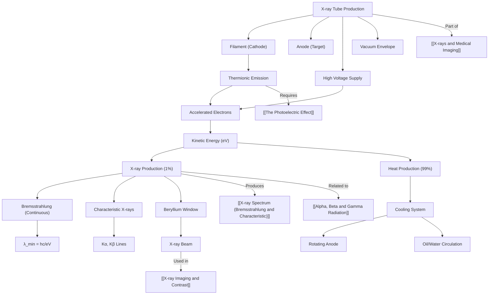

# 1. Overview / 概述

**English:**
This sub-topic covers the **production of X-rays** using an **X-ray tube**, a fundamental device in medical physics. X-rays are a form of high-energy electromagnetic radiation (with wavelengths between $10^{-8}$ m and $10^{-12}$ m) produced when fast-moving electrons are rapidly decelerated upon striking a metal target. Understanding how an X-ray tube works is essential for grasping how medical imaging systems generate the radiation needed to create diagnostic images. This leaf node focuses specifically on the **design, operation, and energy conversion** within a standard X-ray tube, linking directly to the [[X-ray Spectrum (Bremsstrahlung and Characteristic)]] produced and the [[Attenuation of X-rays]] that occurs in the patient's body. Prerequisite knowledge includes [[The Photoelectric Effect]] and [[Alpha, Beta and Gamma Radiation]] for understanding electron interactions and radiation properties.

**中文:**
本子知识点涵盖使用 **X射线管** 产生 **X射线** 的过程，这是医学物理中的基本装置。X射线是一种高能电磁辐射（波长介于 $10^{-8}$ m 和 $10^{-12}$ m 之间），当快速运动的电子撞击金属靶并迅速减速时产生。理解X射线管的工作原理对于掌握医学成像系统如何产生诊断所需的辐射至关重要。本叶节点专门关注标准X射线管的 **设计、操作和能量转换**，直接链接到产生的 [[X射线谱（轫致辐射和特征辐射）]] 以及在患者体内发生的 [[X射线衰减]]。先修知识包括 [[光电效应]] 和 [[α、β和γ辐射]]，以理解电子相互作用和辐射特性。

---

# 2. Syllabus Learning Objectives / 考纲学习目标

| CAIE 9702 | Edexcel IAL |
|-----------|-------------|
| 26.1(a) Describe the nature of X-rays | 11.1 Understand the production of X-rays in an X-ray tube |
| 26.1(b) Explain the production of X-rays in an X-ray tube | 11.2 Understand the role of the filament, anode, and target |
| 26.1(c) Describe the energy conversion in an X-ray tube | 11.3 Understand the need for a high voltage supply |
| 26.1(d) Explain the role of the cooling system | 11.4 Understand the production of heat and its management |
| 26.1(e) Describe the X-ray spectrum | 11.5 Understand the effect of tube voltage on X-ray energy |
| 26.1(f) Explain the difference between continuous and characteristic spectra | 11.6 Understand the use of filters in X-ray tubes |
| 26.1(g) Describe the factors affecting X-ray intensity and quality | — |

**Examiner Expectations / 考官期望:**
- **CAIE:** Students must be able to draw and label a simplified X-ray tube diagram, explain the role of each component, and describe the energy conversion process (electrical → kinetic → X-ray + heat). They must also understand the continuous and characteristic X-ray spectra.
- **Edexcel:** Students must understand the production mechanism, the role of the filament and anode, the need for a high voltage (typically 30–150 kV), and the importance of cooling. They should also know how tube voltage affects the X-ray spectrum and the use of filters.

---

# 3. Core Definitions / 核心定义

| Term (EN/CN) | Definition (EN) | Definition (CN) | Common Mistakes / 常见错误 |
|--------------|-----------------|-----------------|---------------------------|
| **X-ray Tube** / X射线管 | A vacuum tube that produces X-rays by accelerating electrons from a heated filament to a metal target (anode) using a high voltage. | 一种真空管，通过高压将电子从加热的灯丝加速到金属靶（阳极）来产生X射线。 | Confusing the X-ray tube with a cathode ray tube (CRT). |
| **Filament (Cathode)** / 灯丝（阴极） | A heated tungsten wire that emits electrons via thermionic emission. | 通过热电子发射发射电子的加热钨丝。 | Thinking the filament itself produces X-rays; it only emits electrons. |
| **Anode (Target)** / 阳极（靶） | A metal (usually tungsten) surface that the accelerated electrons strike, producing X-rays. | 加速电子撞击的金属（通常为钨）表面，产生X射线。 | Forgetting that the anode must be cooled due to intense heat. |
| **Thermionic Emission** / 热电子发射 | The release of electrons from a heated metal surface when thermal energy overcomes the work function. | 当热能克服功函数时，从加热金属表面释放电子的过程。 | Confusing with photoelectric emission (light-induced). |
| **Bremsstrahlung (Braking Radiation)** / 轫致辐射 | X-rays produced when electrons are decelerated by the electric field of atomic nuclei in the target. | 当电子被靶中原子核的电场减速时产生的X射线。 | Thinking all X-rays are characteristic; bremsstrahlung produces a continuous spectrum. |
| **Characteristic X-rays** / 特征X射线 | X-rays produced when an incident electron ejects an inner-shell electron, and an outer-shell electron fills the vacancy, emitting a photon of specific energy. | 当入射电子击出内层电子，外层电子填补空位时发射特定能量光子产生的X射线。 | Forgetting that characteristic X-rays have discrete energies unique to the target material. |

---

# 4. Key Concepts Explained / 关键概念详解

## 4.1 The X-ray Tube Design and Operation / X射线管设计与操作

### Explanation / 解释
**English:**
An X-ray tube consists of a **vacuum tube** containing two main electrodes: a **cathode** (filament) and an **anode** (target). The cathode is a tungsten filament that is heated by a low-voltage current (typically 5–10 V, 3–5 A). This heating causes **thermionic emission** — electrons gain enough thermal energy to overcome the work function of tungsten and escape the filament surface. A high voltage (typically 30–150 kV) is applied between the cathode and anode, accelerating the emitted electrons towards the anode. The electrons gain kinetic energy $E_k = eV$, where $e$ is the electron charge and $V$ is the accelerating voltage. When these high-speed electrons strike the tungsten target, they are rapidly decelerated, and their kinetic energy is converted into X-ray photons (about 1% of the energy) and heat (about 99%). The X-rays are emitted in all directions, but a small window (often made of beryllium) allows them to exit the tube in a focused beam.

**中文:**
X射线管由一个 **真空管** 组成，包含两个主要电极：**阴极**（灯丝）和 **阳极**（靶）。阴极是一根钨灯丝，由低压电流（通常5–10 V，3–5 A）加热。这种加热引起 **热电子发射** — 电子获得足够的热能以克服钨的功函数并从灯丝表面逸出。在阴极和阳极之间施加高压（通常30–150 kV），将发射的电子加速向阳极。电子获得动能 $E_k = eV$，其中 $e$ 是电子电荷，$V$ 是加速电压。当这些高速电子撞击钨靶时，它们迅速减速，其动能转化为X射线光子（约1%的能量）和热量（约99%）。X射线向各个方向发射，但一个小窗口（通常由铍制成）允许它们以聚焦束的形式从管中射出。

### Physical Meaning / 物理意义
**English:**
The X-ray tube is an **energy converter** — it transforms electrical energy into X-ray radiation (and mostly heat). The efficiency is very low (≈1%), which is why cooling is critical. The energy of the X-ray photons depends on the accelerating voltage: higher voltage → higher maximum photon energy → more penetrating X-rays.

**中文:**
X射线管是一个 **能量转换器** — 它将电能转化为X射线辐射（以及大部分热量）。效率非常低（≈1%），这就是为什么冷却至关重要。X射线光子的能量取决于加速电压：电压越高 → 光子最大能量越高 → X射线穿透力越强。

### Common Misconceptions / 常见误区
- **Misconception:** The filament produces X-rays.  
  **Correction:** The filament only emits electrons; X-rays are produced at the anode.
- **Misconception:** All X-rays have the same energy.  
  **Correction:** X-rays have a spectrum of energies (continuous bremsstrahlung + discrete characteristic lines).
- **Misconception:** The tube operates at atmospheric pressure.  
  **Correction:** It must be evacuated (vacuum) to prevent electrons from colliding with air molecules.

- **误区：** 灯丝产生X射线。  
  **纠正：** 灯丝只发射电子；X射线在阳极产生。
- **误区：** 所有X射线具有相同能量。  
  **纠正：** X射线具有能量谱（连续轫致辐射 + 离散特征线）。
- **误区：** 管在常压下工作。  
  **纠正：** 必须抽真空以防止电子与空气分子碰撞。

### Exam Tips / 考试提示
- **EN:** Always mention "thermionic emission" when describing how electrons are released from the filament. Draw the tube diagram with clear labels: filament, anode, high voltage supply, vacuum, X-ray beam, cooling system.
- **CN:** 描述电子如何从灯丝释放时，务必提到"热电子发射"。画管图时清晰标注：灯丝、阳极、高压电源、真空、X射线束、冷却系统。

> 📷 **IMAGE PROMPT — XT-01: Cross-section of a Standard X-ray Tube**
> A detailed cross-sectional diagram of a standard X-ray tube showing: a heated tungsten filament (cathode) at the top, a focusing cup around the filament, a rotating tungsten anode at the bottom, a high voltage supply connected between cathode and anode, a vacuum inside the glass envelope, a beryllium window on the side for X-ray exit, and a cooling system (oil or water) surrounding the anode. Arrows show electron flow from cathode to anode and X-ray emission through the window. Labels in English.

---

## 4.2 Energy Conversion in the X-ray Tube / X射线管中的能量转换

### Explanation / 解释
**English:**
The energy conversion process in an X-ray tube follows this sequence:
1. **Electrical energy → Thermal energy:** The filament is heated by a low-voltage current (Joule heating).
2. **Thermal energy → Kinetic energy of electrons:** Thermionic emission releases electrons; the high voltage accelerates them, giving them kinetic energy $E_k = eV$.
3. **Kinetic energy → X-ray photons + Heat:** When electrons strike the anode, they decelerate rapidly. About 99% of their kinetic energy is converted into heat (vibrations of the anode lattice), and only about 1% is converted into X-ray photons.

The maximum energy of an X-ray photon is equal to the kinetic energy of the incident electron: $E_{max} = eV$. This corresponds to the shortest wavelength in the X-ray spectrum: $\lambda_{min} = \frac{hc}{eV}$.

**中文:**
X射线管中的能量转换过程遵循以下顺序：
1. **电能 → 热能：** 灯丝由低压电流加热（焦耳热）。
2. **热能 → 电子动能：** 热电子发射释放电子；高压加速它们，赋予它们动能 $E_k = eV$。
3. **动能 → X射线光子 + 热量：** 当电子撞击阳极时，它们迅速减速。约99%的动能转化为热量（阳极晶格的振动），只有约1%转化为X射线光子。

X射线光子的最大能量等于入射电子的动能：$E_{max} = eV$。这对应于X射线谱中的最短波长：$\lambda_{min} = \frac{hc}{eV}$。

### Physical Meaning / 物理意义
**English:**
The low efficiency (≈1%) means that the anode gets extremely hot. This is why anodes are made of tungsten (high melting point, 3422°C) and often rotate to distribute the heat over a larger area. Cooling systems (oil or water circulation) are essential to prevent melting.

**中文:**
低效率（≈1%）意味着阳极变得极热。这就是为什么阳极由钨（高熔点，3422°C）制成，并且通常旋转以将热量分布到更大面积。冷却系统（油或水循环）对于防止熔化至关重要。

### Common Misconceptions / 常见误区
- **Misconception:** All the electron's kinetic energy becomes X-rays.  
  **Correction:** Only ~1% becomes X-rays; ~99% becomes heat.
- **Misconception:** The X-ray energy equals the filament heating energy.  
  **Correction:** X-ray energy depends on the accelerating voltage, not the filament current.

- **误区：** 所有电子的动能都变成X射线。  
  **纠正：** 只有约1%变成X射线；约99%变成热量。
- **误区：** X射线能量等于灯丝加热能量。  
  **纠正：** X射线能量取决于加速电压，而不是灯丝电流。

### Exam Tips / 考试提示
- **EN:** Be able to calculate $\lambda_{min}$ using $\lambda_{min} = \frac{hc}{eV}$. Remember that $h = 6.63 \times 10^{-34}$ Js, $c = 3.0 \times 10^8$ m/s, $e = 1.6 \times 10^{-19}$ C.
- **CN:** 能够使用 $\lambda_{min} = \frac{hc}{eV}$ 计算 $\lambda_{min}$。记住 $h = 6.63 \times 10^{-34}$ Js，$c = 3.0 \times 10^8$ m/s，$e = 1.6 \times 10^{-19}$ C。

---

# 5. Essential Equations / 核心公式

## Equation 1: Kinetic Energy of Accelerated Electrons / 加速电子的动能

$$ E_k = eV $$

| Symbol (符号) | Meaning (EN) | Meaning (CN) | Unit (单位) |
|--------------|-------------|-------------|------------|
| $E_k$ | Kinetic energy of electron | 电子动能 | J (joules) |
| $e$ | Elementary charge ($1.6 \times 10^{-19}$ C) | 元电荷 | C (coulombs) |
| $V$ | Accelerating voltage (tube voltage) | 加速电压（管电压） | V (volts) |

**Derivation / 推导:** The work done by the electric field on the electron is $W = eV$. This work is converted entirely into kinetic energy (assuming no relativistic effects at typical A-Level voltages): $eV = \frac{1}{2}mv^2$.

**Conditions / 适用条件:** Valid for non-relativistic electrons (tube voltage < 100 kV). At higher voltages, relativistic corrections are needed.

**Limitations / 局限性:** Does not account for energy losses due to collisions with air molecules (vacuum assumed).

## Equation 2: Minimum Wavelength of X-rays / X射线的最小波长

$$ \lambda_{min} = \frac{hc}{eV} $$

| Symbol (符号) | Meaning (EN) | Meaning (CN) | Unit (单位) |
|--------------|-------------|-------------|------------|
| $\lambda_{min}$ | Minimum wavelength of X-ray photons | X射线光子的最小波长 | m (metres) |
| $h$ | Planck's constant ($6.63 \times 10^{-34}$ Js) | 普朗克常数 | Js |
| $c$ | Speed of light ($3.0 \times 10^8$ m/s) | 光速 | m/s |
| $e$ | Elementary charge | 元电荷 | C |
| $V$ | Accelerating voltage | 加速电压 | V |

**Derivation / 推导:** The maximum energy of an X-ray photon equals the kinetic energy of the incident electron: $E_{max} = eV$. Using $E = \frac{hc}{\lambda}$, we get $\frac{hc}{\lambda_{min}} = eV$, so $\lambda_{min} = \frac{hc}{eV}$.

**Conditions / 适用条件:** Assumes all kinetic energy is converted into a single photon (the most energetic case). In reality, most photons have less energy.

**Limitations / 局限性:** Does not describe the shape of the continuous spectrum, only the short-wavelength cutoff.

> 📷 **IMAGE PROMPT — XT-02: X-ray Spectrum with $\lambda_{min}$ Labeled**
> A graph of X-ray intensity (y-axis) vs. wavelength (x-axis) showing a continuous bremsstrahlung spectrum with a sharp cutoff at $\lambda_{min}$ on the left (short wavelength end). Characteristic X-ray peaks are shown as sharp spikes superimposed on the continuous spectrum. The $\lambda_{min}$ point is labeled with an arrow and the equation $\lambda_{min} = hc/eV$. The x-axis is labeled "Wavelength / nm" and the y-axis "Intensity / arbitrary units".

---

# 6. Graphs and Relationships / 图表与关系

## 6.1 X-ray Intensity vs. Wavelength (X-ray Spectrum) / X射线强度 vs. 波长（X射线谱）

### Axes / 坐标轴
- **X-axis:** Wavelength $\lambda$ (nm) — 波长 $\lambda$ (nm)
- **Y-axis:** Intensity (arbitrary units) — 强度（任意单位）

### Shape / 形状
**English:** The spectrum has two components:
1. **Continuous spectrum (Bremsstrahlung):** A smooth curve starting at $\lambda_{min}$ (shortest wavelength), rising to a peak, then gradually decreasing to zero at long wavelengths.
2. **Characteristic lines:** Sharp, narrow peaks (spikes) superimposed on the continuous spectrum at specific wavelengths characteristic of the target material (e.g., tungsten).

**中文:** 谱有两个组成部分：
1. **连续谱（轫致辐射）：** 从 $\lambda_{min}$（最短波长）开始的平滑曲线，上升到峰值，然后逐渐减小到长波长处的零。
2. **特征线：** 在连续谱上叠加的尖锐窄峰（尖峰），位于靶材料（如钨）的特征波长处。

### Gradient Meaning / 斜率含义
**English:** The gradient at any point represents the rate of change of intensity with wavelength. Not typically examined directly.

**中文:** 任何点的斜率表示强度随波长的变化率。通常不直接考查。

### Area Meaning / 面积含义
**English:** The area under the curve represents the total X-ray intensity (total power emitted as X-rays). Increasing the tube voltage increases the area (more X-rays) and shifts the spectrum to shorter wavelengths (more penetrating).

**中文:** 曲线下的面积代表总X射线强度（以X射线形式发射的总功率）。增加管电压会增加面积（更多X射线）并将谱移向更短波长（更具穿透力）。

### Exam Interpretation / 考试解读
- **EN:** Be able to sketch the spectrum and label $\lambda_{min}$. Explain how increasing $V$ shifts $\lambda_{min}$ to the left and increases intensity. Identify characteristic peaks.
- **CN:** 能够画出谱图并标注 $\lambda_{min}$。解释增加 $V$ 如何将 $\lambda_{min}$ 向左移动并增加强度。识别特征峰。

> 📷 **IMAGE PROMPT — XT-03: Effect of Tube Voltage on X-ray Spectrum**
> Two X-ray spectra overlaid on the same axes: one at 50 kV (lower intensity, longer $\lambda_{min}$) and one at 100 kV (higher intensity, shorter $\lambda_{min}$). Both show continuous bremsstrahlung and characteristic peaks. Arrows indicate the shift of $\lambda_{min}$ and the increase in peak intensity. Labels: "50 kV" and "100 kV".

---

# 7. Required Diagrams / 必备图表

## 7.1 Standard X-ray Tube Diagram / 标准X射线管图

### Description / 描述
**English:** A cross-sectional diagram of a standard X-ray tube showing all key components: evacuated glass envelope, heated tungsten filament (cathode), focusing cup, rotating tungsten anode, high voltage supply (cathode negative, anode positive), beryllium window, and cooling system (oil/water). Arrows indicate electron flow and X-ray emission.

**中文:** 标准X射线管的横截面图，显示所有关键组件：真空玻璃外壳、加热的钨灯丝（阴极）、聚焦杯、旋转钨阳极、高压电源（阴极负、阳极正）、铍窗口和冷却系统（油/水）。箭头指示电子流和X射线发射。

### Image Prompt / 图片生成提示
> 📷 **IMAGE PROMPT — XT-04: Detailed X-ray Tube Cross-section**
> A highly detailed, labeled cross-section diagram of a medical X-ray tube. The diagram shows: a glass vacuum envelope (labeled "Vacuum"), a coiled tungsten filament inside a metal focusing cup (labeled "Cathode / Filament"), a rotating disc-shaped tungsten anode (labeled "Anode / Target") with a beveled edge, a high voltage cable connected to both electrodes (labeled "High Voltage Supply 30-150 kV"), a thin beryllium window on the side of the tube (labeled "Beryllium Window"), and a cooling system with oil circulation pipes around the anode (labeled "Cooling System"). Arrows show electrons (e⁻) streaming from cathode to anode, and X-rays (hν) exiting through the window. All labels in English, clean technical style.

### Labels Required / 需要标注
| Label (EN) | Label (CN) |
|------------|------------|
| Vacuum envelope | 真空外壳 |
| Filament (Cathode) | 灯丝（阴极） |
| Focusing cup | 聚焦杯 |
| Anode (Target) | 阳极（靶） |
| High voltage supply | 高压电源 |
| Beryllium window | 铍窗口 |
| Cooling system | 冷却系统 |
| Electron beam | 电子束 |
| X-ray beam | X射线束 |

### Exam Importance / 考试重要性
**English:** Extremely high — students are often asked to draw and label this diagram in exams (both CAIE and Edexcel). Must include all components and show understanding of their functions.

**中文:** 极高 — 学生经常被要求在考试中画出并标注此图（CAIE和Edexcel）。必须包括所有组件并展示对其功能的理解。

---

## 7.2 X-ray Spectrum Diagram / X射线谱图

### Description / 描述
**English:** A graph of X-ray intensity vs. wavelength showing the continuous bremsstrahlung spectrum and characteristic X-ray peaks. The minimum wavelength $\lambda_{min}$ is clearly marked.

**中文:** X射线强度 vs. 波长的图，显示连续轫致辐射谱和特征X射线峰。最小波长 $\lambda_{min}$ 被清晰标注。

### Image Prompt / 图片生成提示
> 📷 **IMAGE PROMPT — XT-05: X-ray Spectrum with Characteristic Peaks**
> A graph with X-ray intensity (arbitrary units) on the y-axis and wavelength (nm) on the x-axis. The curve shows a continuous bremsstrahlung spectrum starting at $\lambda_{min}$ (labeled with an arrow and the equation $\lambda_{min} = hc/eV$), rising to a broad peak, then gradually decreasing. Two sharp characteristic peaks (Kα and Kβ) are shown as narrow spikes at specific wavelengths. The x-axis is labeled "Wavelength / nm" and the y-axis "Intensity / arbitrary units". A note reads: "Characteristic peaks are unique to the target material (e.g., tungsten)."

### Labels Required / 需要标注
| Label (EN) | Label (CN) |
|------------|------------|
| $\lambda_{min}$ | 最小波长 |
| Bremsstrahlung (continuous) | 轫致辐射（连续） |
| Characteristic peaks (Kα, Kβ) | 特征峰（Kα, Kβ） |
| Increasing tube voltage | 增加管电压 |

### Exam Importance / 考试重要性
**English:** High — students must be able to sketch this spectrum, explain the origin of both components, and describe how changes in tube voltage affect the spectrum.

**中文:** 高 — 学生必须能够画出此谱图，解释两个组成部分的起源，并描述管电压变化如何影响谱图。

---

# 8. Worked Examples / 典型例题

## Example 1: Calculating Minimum Wavelength / 计算最小波长

### Question / 题目
**English:**
An X-ray tube operates at an accelerating voltage of 80 kV. Calculate the minimum wavelength of the X-rays produced. (Given: $h = 6.63 \times 10^{-34}$ Js, $c = 3.0 \times 10^8$ m/s, $e = 1.6 \times 10^{-19}$ C)

**中文:**
一个X射线管在80 kV的加速电压下工作。计算产生的X射线的最小波长。（已知：$h = 6.63 \times 10^{-34}$ Js，$c = 3.0 \times 10^8$ m/s，$e = 1.6 \times 10^{-19}$ C）

### Solution / 解答
**Step 1:** Write the formula for minimum wavelength.
$$ \lambda_{min} = \frac{hc}{eV} $$

**Step 2:** Substitute the values.
$$ \lambda_{min} = \frac{(6.63 \times 10^{-34})(3.0 \times 10^8)}{(1.6 \times 10^{-19})(80 \times 10^3)} $$

**Step 3:** Calculate.
$$ \lambda_{min} = \frac{1.989 \times 10^{-25}}{1.28 \times 10^{-14}} = 1.55 \times 10^{-11} \text{ m} $$

**Step 4:** Convert to picometres (pm) for convenience.
$$ \lambda_{min} = 1.55 \times 10^{-11} \text{ m} = 0.0155 \text{ nm} = 15.5 \text{ pm} $$

### Final Answer / 最终答案
**Answer:** $\lambda_{min} = 1.55 \times 10^{-11}$ m (15.5 pm) | **答案：** $\lambda_{min} = 1.55 \times 10^{-11}$ m (15.5 pm)

### Quick Tip / 提示
- **EN:** Always convert kV to V (multiply by 1000) before substituting. Check units: $hc$ has units J·m, $eV$ has units J, so $\lambda$ comes out in metres.
- **CN:** 代入前务必将kV转换为V（乘以1000）。检查单位：$hc$ 的单位是 J·m，$eV$ 的单位是 J，所以 $\lambda$ 的单位是米。

---

## Example 2: Energy Conversion Efficiency / 能量转换效率

### Question / 题目
**English:**
An X-ray tube operates at 100 kV with a tube current of 50 mA. The efficiency of X-ray production is 0.8%. Calculate:
(a) The power input to the tube.
(b) The power dissipated as heat.
(c) The number of X-ray photons per second if the average photon energy is 40 keV.

**中文:**
一个X射线管在100 kV和50 mA管电流下工作。X射线产生的效率为0.8%。计算：
(a) 管的输入功率。
(b) 以热量形式耗散的功率。
(c) 如果平均光子能量为40 keV，每秒产生的X射线光子数。

### Solution / 解答
**Part (a):** Power input $P_{in} = VI$
$$ P_{in} = (100 \times 10^3) \times (50 \times 10^{-3}) = 5000 \text{ W} = 5 \text{ kW} $$

**Part (b):** Efficiency $\eta = 0.8\% = 0.008$
$$ P_{X-ray} = \eta P_{in} = 0.008 \times 5000 = 40 \text{ W} $$
$$ P_{heat} = P_{in} - P_{X-ray} = 5000 - 40 = 4960 \text{ W} \approx 5 \text{ kW} $$

**Part (c):** Average photon energy $E_{ph} = 40 \text{ keV} = 40 \times 10^3 \times 1.6 \times 10^{-19} = 6.4 \times 10^{-15} \text{ J}$
Number of photons per second $N = \frac{P_{X-ray}}{E_{ph}} = \frac{40}{6.4 \times 10^{-15}} = 6.25 \times 10^{15} \text{ s}^{-1}$

### Final Answer / 最终答案
**Answer:** (a) 5 kW, (b) ~5 kW (4960 W), (c) $6.25 \times 10^{15}$ photons/s | **答案：** (a) 5 kW，(b) ~5 kW (4960 W)，(c) $6.25 \times 10^{15}$ 光子/秒

### Quick Tip / 提示
- **EN:** Remember that most of the input power becomes heat — this is why cooling is essential. The efficiency is very low (typically <1%).
- **CN:** 记住大部分输入功率变成热量 — 这就是为什么冷却至关重要。效率非常低（通常<1%）。

---

# 9. Past Paper Question Types / 历年真题题型

| Question Type / 题型 | Frequency / 频率 | Difficulty / 难度 | Past Paper References / 真题索引 |
|----------------------|------------------|------------------|-------------------------------|
| Draw and label X-ray tube diagram | Very High | Easy | 📝 *待填入* |
| Calculate $\lambda_{min}$ from tube voltage | High | Medium | 📝 *待填入* |
| Explain energy conversion in X-ray tube | High | Medium | 📝 *待填入* |
| Sketch and interpret X-ray spectrum | High | Medium | 📝 *待填入* |
| Explain need for cooling system | Medium | Easy | 📝 *待填入* |
| Calculate efficiency or power | Medium | Medium | 📝 *待填入* |
| Compare continuous vs. characteristic X-rays | Medium | Medium | 📝 *待填入* |
| Effect of changing tube voltage on spectrum | Medium | Medium | 📝 *待填入* |

**Common Command Words / 常见指令词:**
- **EN:** Describe, Explain, Calculate, Sketch, Draw, Label, State, Determine
- **CN:** 描述，解释，计算，画出，标注，陈述，确定

---

# 10. Practical Skills Connections / 实验技能链接

**English:**
This sub-topic connects to practical skills in the following ways:

1. **Measurements and Uncertainties:** When calculating $\lambda_{min}$, students must handle uncertainties in voltage readings and constants. The formula $\lambda_{min} = hc/eV$ requires careful unit conversion (kV to V, nm to m).

2. **Graph Plotting and Analysis:** Students may be asked to plot an X-ray spectrum from given data, identify $\lambda_{min}$, and determine the tube voltage from the graph. They should be able to draw a best-fit curve through the continuous spectrum and identify characteristic peaks.

3. **Experimental Design:** Understanding the X-ray tube design helps in evaluating safety features (lead shielding, cooling systems) and optimizing image quality (adjusting tube voltage and current).

4. **Data Analysis:** Given intensity vs. wavelength data, students should calculate total X-ray output (area under curve) and relate it to tube parameters.

5. **Safety Considerations:** Practical work with X-rays requires understanding of radiation dose, shielding, and the inverse square law. Students should appreciate why cooling systems are essential and how they prevent tube damage.

**中文:**
本子知识点通过以下方式与实验技能联系：

1. **测量和不确定度：** 计算 $\lambda_{min}$ 时，学生必须处理电压读数和常数的不确定度。公式 $\lambda_{min} = hc/eV$ 需要仔细的单位转换（kV到V，nm到m）。

2. **图表绘制和分析：** 学生可能被要求根据给定数据绘制X射线谱，识别 $\lambda_{min}$，并从图中确定管电压。他们应该能够通过连续谱绘制最佳拟合曲线并识别特征峰。

3. **实验设计：** 理解X射线管设计有助于评估安全特性（铅屏蔽、冷却系统）和优化图像质量（调整管电压和电流）。

4. **数据分析：** 给定强度 vs. 波长数据，学生应计算总X射线输出（曲线下面积）并将其与管参数联系起来。

5. **安全考虑：** 使用X射线的实际工作需要理解辐射剂量、屏蔽和平方反比定律。学生应理解为什么冷却系统至关重要以及它们如何防止管损坏。

---

# 11. Concept Map / 概念图谱

---

# 12. Quick Revision Sheet / 速查表

| Category / 类别 | Key Points / 要点 |
|----------------|------------------|
| **Definition / 定义** | X-ray tube: vacuum device producing X-rays via accelerated electrons striking a metal target. / X射线管：通过加速电子撞击金属靶产生X射线的真空装置。 |
| **Key Components / 关键组件** | Filament (cathode) — thermionic emission; Anode (target) — X-ray production; High voltage supply — acceleration; Vacuum — prevents collisions; Beryllium window — X-ray exit; Cooling system — heat management. / 灯丝（阴极）— 热电子发射；阳极（靶）— X射线产生；高压电源 — 加速；真空 — 防止碰撞；铍窗口 — X射线出口；冷却系统 — 热量管理。 |
| **Key Formula / 核心公式** | $E_k = eV$ (electron kinetic energy); $\lambda_{min} = \frac{hc}{eV}$ (minimum wavelength); Efficiency $\eta \approx 1\%$. / $E_k = eV$（电子动能）；$\lambda_{min} = \frac{hc}{eV}$（最小波长）；效率 $\eta \approx 1\%$。 |
| **Key Graph / 核心图表** | X-ray intensity vs. wavelength: continuous bremsstrahlung spectrum + characteristic peaks. $\lambda_{min}$ at short-wavelength cutoff. / X射线强度 vs. 波长：连续轫致辐射谱 + 特征峰。$\lambda_{min}$ 在短波长截止处。 |
| **Energy Conversion / 能量转换** | Electrical → Thermal (filament) → Kinetic (electrons) → X-ray (1%) + Heat (99%). / 电能 → 热能（灯丝）→ 动能（电子）→ X射线（1%）+ 热量（99%）。 |
| **Cooling / 冷却** | Essential because 99% of energy becomes heat. Methods: rotating anode, oil/water circulation. / 至关重要，因为99%的能量变成热量。方法：旋转阳极，油/水循环。 |
| **Spectrum Components / 谱组成** | Continuous (bremsstrahlung): electrons decelerated by nuclei. Characteristic: inner-shell electron ejection and filling. / 连续（轫致辐射）：电子被原子核减速。特征：内层电子击出和填充。 |
| **Effect of Voltage / 电压影响** | Higher $V$ → shorter $\lambda_{min}$, higher intensity, more penetrating X-rays. / 更高 $V$ → 更短 $\lambda_{min}$，更高强度，更具穿透力的X射线。 |
| **Exam Tip / 考试提示** | Always draw the tube diagram with labels. Know how to calculate $\lambda_{min}$. Explain why cooling is needed. Sketch the spectrum and identify characteristic peaks. / 务必画出带标注的管图。知道如何计算 $\lambda_{min}$。解释为什么需要冷却。画出谱图并识别特征峰。 |
| **Common Mistake / 常见错误** | Confusing filament (emits electrons) with anode (produces X-rays). Forgetting vacuum is needed. Thinking all X-rays have same energy. / 混淆灯丝（发射电子）和阳极（产生X射线）。忘记需要真空。认为所有X射线具有相同能量。 |