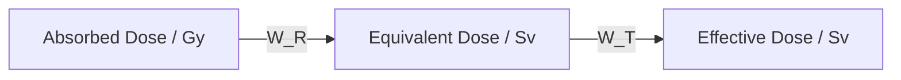

---
# Radiation Dose and Safety / 辐射剂量与安全

---

# 1. Overview / 概述

**English:**
This sub-topic covers the quantitative measurement of radiation dose and the principles of radiation safety in medical imaging. It introduces the key concepts of **absorbed dose**, **equivalent dose**, and **effective dose**, which are essential for understanding the biological effects of ionizing radiation and the risks associated with X-ray and CT procedures. The sub-topic also covers the factors that influence radiation risk, such as the type of radiation and the sensitivity of different tissues, and the practical safety measures used to protect patients and healthcare workers. This knowledge is critical for justifying the use of medical imaging and for optimizing protocols to keep doses "As Low As Reasonably Achievable" (ALARA). This sub-topic builds on the understanding of [[The Photoelectric Effect]] and [[Alpha, Beta and Gamma Radiation]] and is a key component of the [[X-rays and Medical Imaging]] hub.

**中文:**
本子知识点涵盖辐射剂量的定量测量和医学影像中的辐射安全原则。它介绍了**吸收剂量**、**等效剂量**和**有效剂量**等关键概念，这些概念对于理解电离辐射的生物效应以及X射线和CT检查相关的风险至关重要。本子知识点还讨论了影响辐射风险的因素，例如辐射类型和不同组织的敏感性，以及用于保护患者和医护人员的实际安全措施。这些知识对于论证医学影像的合理性以及优化方案以将剂量保持在“合理可行尽量低”（ALARA）原则至关重要。本子知识点建立在[[光电效应]]和[[α、β和γ辐射]]的理解之上，是[[X射线与医学影像]]知识枢纽的关键组成部分。

---

# 2. Syllabus Learning Objectives / 考纲学习目标

| CAIE 9702 | Edexcel IAL |
|-----------|-------------|
| 26.1(a) Define the terms absorbed dose, equivalent dose, and effective dose. | 11.1 Understand the concept of absorbed dose and its unit, the gray (Gy). |
| 26.1(b) Use the equation $D = E/m$ for absorbed dose. | 11.2 Understand the concept of equivalent dose and its unit, the sievert (Sv). |
| 26.1(c) Define the gray (Gy) and the sievert (Sv). | 11.3 Understand the concept of effective dose and its unit, the sievert (Sv). |
| 26.1(d) Use the equation $H = D \times W_R$ for equivalent dose. | 11.4 Understand the factors affecting radiation risk, including the type of radiation and the tissue exposed. |
| 26.1(e) Use the equation $E = \sum (H_T \times W_T)$ for effective dose. | 11.5 Understand the principles of radiation safety, including the ALARA principle. |
| 26.1(f) Explain the factors affecting the risk of biological harm from X-rays. | 11.6 Understand the use of dosimeters to monitor radiation exposure. |
| 26.1(g) Discuss the principles of radiation safety, including the ALARA principle. | |

**Examiner Expectations / 考官期望:**
- **EN:** Students must be able to define and calculate absorbed dose, equivalent dose, and effective dose. They must understand the difference between energy deposited (Gy) and biological harm (Sv). They must be able to apply the ALARA principle to real-world scenarios and explain the factors that influence radiation risk.
- **中文:** 学生必须能够定义并计算吸收剂量、等效剂量和有效剂量。他们必须理解沉积能量（Gy）与生物危害（Sv）之间的区别。他们必须能够将ALARA原则应用于现实场景，并解释影响辐射风险的因素。

---

# 3. Core Definitions / 核心定义

| Term (EN/CN) | Definition (EN) | Definition (CN) | Common Mistakes / 常见错误 |
|--------------|-----------------|-----------------|---------------------------|
| **Absorbed Dose** / 吸收剂量 | The energy absorbed per unit mass of the absorbing material. | 单位质量吸收材料所吸收的能量。 | Confusing it with equivalent dose. Absorbed dose is a physical quantity, not a biological one. |
| **Equivalent Dose** / 等效剂量 | The absorbed dose multiplied by a radiation weighting factor ($W_R$) to account for the biological effectiveness of different types of radiation. | 吸收剂量乘以辐射权重因子（$W_R$），以考虑不同类型辐射的生物有效性。 | Forgetting to multiply by $W_R$ for X-rays ($W_R=1$). |
| **Effective Dose** / 有效剂量 | The sum of the equivalent doses to each tissue multiplied by a tissue weighting factor ($W_T$) to account for the different radiosensitivities of tissues. | 各组织等效剂量乘以组织权重因子（$W_T$）的总和，以考虑不同组织的辐射敏感性。 | Confusing it with equivalent dose. Effective dose is a whole-body risk measure. |
| **Gray (Gy)** / 戈瑞 | The SI unit of absorbed dose. 1 Gy = 1 J kg⁻¹. | 吸收剂量的SI单位。1 Gy = 1 J kg⁻¹。 | Thinking Gy is a unit of biological harm. It is a unit of energy deposition. |
| **Sievert (Sv)** / 西弗特 | The SI unit of equivalent dose and effective dose. | 等效剂量和有效剂量的SI单位。 | Confusing Sv with Gy. Sv accounts for biological effect. |
| **ALARA Principle** / ALARA原则 | "As Low As Reasonably Achievable" – a principle of radiation safety to minimize exposure. | “合理可行尽量低”——辐射安全原则，旨在将暴露最小化。 | Thinking it means "zero dose." It means optimizing to reduce dose while achieving the medical goal. |

---

# 4. Key Concepts Explained / 关键概念详解

## 4.1 Absorbed Dose vs. Equivalent Dose vs. Effective Dose / 吸收剂量 vs. 等效剂量 vs. 有效剂量

### Explanation / 解释
**English:**
These three quantities form a hierarchy of radiation measurement. **Absorbed dose** ($D$) is the raw physical quantity: how much energy is deposited in a material. **Equivalent dose** ($H$) modifies this by a factor ($W_R$) that accounts for the type of radiation. For X-rays and gamma rays, $W_R = 1$, so the numerical value of equivalent dose in Sv is the same as the absorbed dose in Gy. For alpha particles, $W_R = 20$, meaning they are 20 times more biologically damaging per unit energy deposited. **Effective dose** ($E$) further modifies the equivalent dose by a tissue weighting factor ($W_T$) to account for the fact that some organs (e.g., lungs, bone marrow) are more sensitive to radiation-induced cancer than others (e.g., skin). The effective dose is a whole-body risk measure, allowing comparison of different imaging procedures.

**中文:**
这三个量构成了辐射测量的层级结构。**吸收剂量**（$D$）是原始的物理量：材料中沉积了多少能量。**等效剂量**（$H$）通过一个因子（$W_R$）对其进行修正，该因子考虑了辐射的类型。对于X射线和伽马射线，$W_R = 1$，因此以Sv为单位的等效剂量数值与以Gy为单位的吸收剂量数值相同。对于α粒子，$W_R = 20$，意味着每单位沉积能量的生物损伤程度是X射线的20倍。**有效剂量**（$E$）通过组织权重因子（$W_T$）进一步修正等效剂量，以考虑某些器官（如肺、骨髓）比其他器官（如皮肤）对辐射诱发癌症更敏感的事实。有效剂量是一种全身风险度量，允许比较不同的成像程序。

### Physical Meaning / 物理意义
**English:**
- **Absorbed Dose:** The energy "dumped" into the tissue. Think of it as the "amount of radiation."
- **Equivalent Dose:** The "biological punch" of that radiation, considering its type.
- **Effective Dose:** The "overall risk to the person," considering which organs were exposed.

**中文:**
- **吸收剂量：** “倾倒”到组织中的能量。可以将其视为“辐射量”。
- **等效剂量：** 该辐射的“生物冲击力”，考虑了其类型。
- **有效剂量：** “对个人的总体风险”，考虑了哪些器官受到了照射。

### Common Misconceptions / 常见误区
- **EN:** Thinking that 1 Gy of alpha radiation is the same as 1 Gy of X-rays. It is not; the alpha radiation has a much higher equivalent dose (20 Sv vs. 1 Sv).
- **中文:** 认为1 Gy的α辐射与1 Gy的X射线相同。事实并非如此；α辐射的等效剂量要高得多（20 Sv vs. 1 Sv）。
- **EN:** Thinking that equivalent dose and effective dose are the same thing. Effective dose is a sum of weighted equivalent doses across all tissues.
- **中文:** 认为等效剂量和有效剂量是一回事。有效剂量是所有组织加权等效剂量的总和。

### Exam Tips / 考试提示
- **EN:** Always state the units: Gy for absorbed dose, Sv for equivalent and effective dose. Show your working clearly when calculating effective dose, as it involves a sum.
- **中文:** 始终说明单位：吸收剂量用Gy，等效剂量和有效剂量用Sv。计算有效剂量时，要清晰地展示计算过程，因为它涉及求和。

> 📷 **IMAGE PROMPT — DOSE_HIERARCHY: Hierarchy of Radiation Dose Quantities**
> A clear, three-tier diagram. Top tier: "Absorbed Dose (D)" with a box showing "Energy deposited per unit mass. Unit: Gray (Gy)." An arrow pointing down to the second tier: "Equivalent Dose (H) = D × W_R" with a box showing "Accounts for radiation type. Unit: Sievert (Sv)." An arrow pointing down to the third tier: "Effective Dose (E) = Σ(H_T × W_T)" with a box showing "Accounts for tissue sensitivity. Unit: Sievert (Sv)." Use a color gradient from blue (physical) to red (biological).

---

# 5. Essential Equations / 核心公式

## 5.1 Absorbed Dose / 吸收剂量

$$ D = \frac{E}{m} $$

| Symbol (符号) | Meaning (EN) | Meaning (CN) | Unit (单位) |
|--------------|-------------|-------------|------------|
| $D$ | Absorbed dose | 吸收剂量 | Gy (J kg⁻¹) |
| $E$ | Energy absorbed | 吸收的能量 | J |
| $m$ | Mass of absorbing material | 吸收材料的质量 | kg |

**Derivation / 推导:** Definition.
**Conditions / 适用条件:** The energy must be uniformly absorbed by the mass.
**Limitations / 局限性:** Does not account for radiation type or tissue sensitivity.

## 5.2 Equivalent Dose / 等效剂量

$$ H = D \times W_R $$

| Symbol (符号) | Meaning (EN) | Meaning (CN) | Unit (单位) |
|--------------|-------------|-------------|------------|
| $H$ | Equivalent dose | 等效剂量 | Sv |
| $D$ | Absorbed dose | 吸收剂量 | Gy |
| $W_R$ | Radiation weighting factor | 辐射权重因子 | dimensionless |

**Derivation / 推导:** Empirical, based on biological effectiveness.
**Conditions / 适用条件:** For a single type of radiation.
**Limitations / 局限性:** Does not account for different tissue sensitivities.

## 5.3 Effective Dose / 有效剂量

$$ E = \sum (H_T \times W_T) $$

| Symbol (符号) | Meaning (EN) | Meaning (CN) | Unit (单位) |
|--------------|-------------|-------------|------------|
| $E$ | Effective dose | 有效剂量 | Sv |
| $H_T$ | Equivalent dose to tissue T | 组织T的等效剂量 | Sv |
| $W_T$ | Tissue weighting factor for tissue T | 组织T的组织权重因子 | dimensionless |

**Derivation / 推导:** Empirical, based on cancer risk data.
**Conditions / 适用条件:** Summed over all exposed tissues.
**Limitations / 局限性:** A population-average risk measure, not an individual risk.

> 📷 **IMAGE PROMPT — FORMULA_TRIANGLE: Dose Formula Triangle**
> A triangle with "Dose" at the top, "Energy" at the bottom left, and "Mass" at the bottom right. The formula D = E/m is written inside. This is for absorbed dose. A similar triangle could be shown for equivalent dose (H = D × W_R) and effective dose (E = Σ H_T × W_T).

---

# 6. Graphs and Relationships / 图表与关系

## 6.1 Relationship between Absorbed Dose and Equivalent Dose / 吸收剂量与等效剂量的关系

### Axes / 坐标轴
- **X-axis:** Absorbed Dose / Gy (吸收剂量 / Gy)
- **Y-axis:** Equivalent Dose / Sv (等效剂量 / Sv)

### Shape / 形状
A straight line through the origin. The gradient is equal to the radiation weighting factor ($W_R$).

### Gradient Meaning / 斜率含义
The gradient represents the biological effectiveness of the radiation. A steeper line (e.g., for alpha particles, $W_R=20$) means a higher equivalent dose for the same absorbed dose.

### Area Meaning / 面积含义
Not applicable.

### Exam Interpretation / 考试解读
- **EN:** Be able to sketch this graph for different types of radiation. Understand that for X-rays and gamma rays ($W_R=1$), the line has a gradient of 1, meaning the numerical values of absorbed dose and equivalent dose are equal.
- **中文:** 能够为不同类型的辐射绘制此图。理解对于X射线和伽马射线（$W_R=1$），直线的斜率为1，意味着吸收剂量和等效剂量的数值相等。



---

# 7. Required Diagrams / 必备图表

## 7.1 Diagram of a Dosimeter / 剂量计示意图

### Description / 描述
**English:** A diagram showing a typical personal dosimeter, such as a film badge or a thermoluminescent dosimeter (TLD). The diagram should show the external casing, the filters (which block different types of radiation), and the sensitive material (e.g., film or TLD chips).
**中文:** 显示典型个人剂量计（如胶片剂量计或热释光剂量计）的示意图。图示应显示外壳、滤光片（阻挡不同类型的辐射）和敏感材料（如胶片或TLD芯片）。

### Image Prompt / 图片生成提示
> 📷 **IMAGE PROMPT — DOSIMETER_DIAGRAM: Cross-section of a Film Badge Dosimeter**
> A detailed cross-section diagram of a film badge dosimeter. Label the following parts: "Plastic Casing" (外壳), "Open Window" (开放窗口), "Aluminum Filter" (铝滤片), "Copper Filter" (铜滤片), "Lead Filter" (铅滤片), and "Photographic Film" (感光胶片). The diagram should show how different filters allow the badge to distinguish between different types and energies of radiation. Style: clean, technical illustration.

### Labels Required / 需要标注
- **EN:** Plastic casing, open window, aluminum filter, copper filter, lead filter, photographic film.
- **中文:** 塑料外壳、开放窗口、铝滤片、铜滤片、铅滤片、感光胶片。

### Exam Importance / 考试重要性
- **EN:** High. Understanding how dosimeters work is a key part of radiation safety. You may be asked to explain how a film badge can distinguish between different types of radiation.
- **中文:** 高。理解剂量计的工作原理是辐射安全的关键部分。你可能会被要求解释胶片剂量计如何区分不同类型的辐射。

---

# 8. Worked Examples / 典型例题

## Example 1: Calculating Effective Dose from a CT Scan / 计算CT扫描的有效剂量

### Question / 题目
**English:**
A patient receives a CT scan of their chest and abdomen. The absorbed dose to the lungs (mass 1.0 kg) is 10 mGy, and the absorbed dose to the liver (mass 1.5 kg) is 8 mGy. The radiation weighting factor for X-rays is 1. The tissue weighting factor for the lungs is 0.12 and for the liver is 0.04. Calculate the effective dose from this scan.

**中文:**
一名患者接受了胸部和腹部的CT扫描。肺部（质量1.0 kg）的吸收剂量为10 mGy，肝脏（质量1.5 kg）的吸收剂量为8 mGy。X射线的辐射权重因子为1。肺部的组织权重因子为0.12，肝脏的组织权重因子为0.04。计算此次扫描的有效剂量。

### Solution / 解答
**Step 1: Calculate the equivalent dose to each organ.**
Since $W_R = 1$ for X-rays, the equivalent dose in Sv is numerically equal to the absorbed dose in Gy.
- Lungs: $H_{lungs} = D_{lungs} \times W_R = 10 \text{ mGy} \times 1 = 10 \text{ mSv}$
- Liver: $H_{liver} = D_{liver} \times W_R = 8 \text{ mGy} \times 1 = 8 \text{ mSv}$

**Step 2: Calculate the effective dose.**
$E = \sum (H_T \times W_T) = (H_{lungs} \times W_{T, lungs}) + (H_{liver} \times W_{T, liver})$
$E = (10 \text{ mSv} \times 0.12) + (8 \text{ mSv} \times 0.04)$
$E = 1.2 \text{ mSv} + 0.32 \text{ mSv}$
$E = 1.52 \text{ mSv}$

### Final Answer / 最终答案
**Answer:** 1.52 mSv | **答案：** 1.52 mSv

### Quick Tip / 提示
- **EN:** Remember to convert mGy to Gy (or mSv to Sv) if required by the final answer unit. In this case, the answer in mSv is fine. Always check the units!
- **中文:** 如果最终答案单位有要求，记得将mGy转换为Gy（或将mSv转换为Sv）。在本例中，以mSv为单位的答案是可以的。始终检查单位！

---

# 9. Past Paper Question Types / 历年真题题型

| Question Type / 题型 | Frequency / 频率 | Difficulty / 难度 | Past Paper References / 真题索引 |
|----------------------|------------------|------------------|-------------------------------|
| Definition of terms (absorbed dose, equivalent dose, effective dose) | High | Easy | 📝 *待填入* |
| Calculation of absorbed dose, equivalent dose, or effective dose | High | Medium | 📝 *待填入* |
| Explanation of the ALARA principle and its application | Medium | Medium | 📝 *待填入* |
| Comparison of risk from different imaging procedures | Low | Hard | 📝 *待填入* |

**Common Command Words / 常见指令词:**
- **EN:** Define, Calculate, Explain, Discuss, State, Suggest.
- **中文:** 定义、计算、解释、讨论、陈述、提出。

---

# 10. Practical Skills Connections / 实验技能链接

**English:**
This sub-topic connects to practical skills through the use of **dosimeters**. Students should understand how a film badge or TLD is used to measure personal radiation exposure. They should be able to interpret the results from a dosimeter and relate them to the concepts of absorbed dose and equivalent dose. The concept of **background radiation** is also important; students should know that we are all exposed to a low level of radiation from natural sources. In a practical context, students might be asked to calculate the total dose from a procedure, taking into account background radiation. The ALARA principle is a key consideration in the design of any experiment involving ionizing radiation.

**中文:**
本子知识点通过**剂量计**的使用与实验技能相联系。学生应理解如何使用胶片剂量计或TLD来测量个人辐射暴露。他们应能够解释剂量计的结果，并将其与吸收剂量和等效剂量的概念联系起来。**本底辐射**的概念也很重要；学生应知道我们都暴露于来自自然源的低水平辐射。在实验背景下，学生可能会被要求计算某个过程的总剂量，同时考虑本底辐射。ALARA原则是任何涉及电离辐射的实验设计中的关键考虑因素。

---

# 11. Concept Map / 概念图谱

```mermaid
graph TD
    subgraph "Radiation Dose and Safety"
        A[Radiation Dose and Safety] --> B[Absorbed Dose (D)]
        A --> C[Equivalent Dose (H)]
        A --> D[Effective Dose (E)]
        A --> E[ALARA Principle]
        A --> F[Safety Measures]
    end

    subgraph "Core Quantities"
        B --> B1[Unit: Gray (Gy)]
        B --> B2[Formula: D = E/m]
        C --> C1[Unit: Sievert (Sv)]
        C --> C2[Formula: H = D × W_R]
        D --> D1[Unit: Sievert (Sv)]
        D --> D2[Formula: E = Σ(H_T × W_T)]
    end

    subgraph "Related Concepts"
        E --> E1[Justification]
        E --> E2[Optimization]
        E --> E3[Limitation]
        F --> F1[Dosimeters]
        F --> F2[Shielding]
        F --> F3[Distance]
        F --> F4[Time]
    end

    subgraph "Parent Topic"
        G[[X-rays and Medical Imaging]]
    end

    G --> A
    B --> H[[Attenuation of X-rays]]
    C --> I[[Alpha, Beta and Gamma Radiation]]
    D --> J[[CT Scans and Their Principles]]
    F1 --> K[[Production of X-rays (X-ray Tube)]]
```

---

# 12. Quick Revision Sheet / 速查表

| Category / 类别 | Key Points / 要点 |
|----------------|------------------|
| **Definition / 定义** | **Absorbed Dose:** Energy per unit mass (Gy). **Equivalent Dose:** Absorbed dose × $W_R$ (Sv). **Effective Dose:** Sum of equivalent doses × $W_T$ (Sv). |
| **Key Formula / 核心公式** | $D = E/m$, $H = D \times W_R$, $E = \sum (H_T \times W_T)$ |
| **Key Graph / 核心图表** | Equivalent Dose vs. Absorbed Dose: Straight line, gradient = $W_R$. |
| **Key Concept / 核心概念** | **ALARA Principle:** As Low As Reasonably Achievable. Justify, optimize, limit. |
| **Exam Tip / 考试提示** | Always state units (Gy vs. Sv). For X-rays, $W_R = 1$, so numerical value of D and H are the same. Effective dose is a sum. |