# 1. Overview / 概述

**English:**
X-ray imaging and contrast is a cornerstone of medical diagnostics, allowing non-invasive visualization of internal body structures. This sub-topic focuses on how X-rays interact with different tissues to produce an image, and how contrast media (such as barium sulfate or iodine-based compounds) enhance the visibility of specific organs or blood vessels. Understanding the principles of attenuation, image formation, and contrast enhancement is essential for interpreting medical X-rays and for appreciating the limitations and risks of the technique.

This leaf node builds on the [[Production of X-rays (X-ray Tube)]] and [[X-ray Spectrum (Bremsstrahlung and Characteristic)]] by explaining how the X-ray beam is used to create an image. It connects directly to [[Attenuation of X-rays]] (the physical basis of contrast) and [[CT Scans and Their Principles]] (which uses multiple X-ray images). Prerequisites include [[The Photoelectric Effect]] (a key attenuation mechanism) and [[Alpha, Beta and Gamma Radiation]] (for understanding ionizing radiation). Related topics include [[Ultrasound Imaging]] and [[PET Scans and Nuclear Medicine]], which offer alternative imaging modalities.

**中文:**
X射线成像与造影是医学诊断的基石，能够无创地可视化人体内部结构。本子知识点聚焦于X射线如何与不同组织相互作用以产生图像，以及造影剂（如硫酸钡或碘基化合物）如何增强特定器官或血管的可见性。理解衰减、图像形成和造影增强的原理对于解读医学X光片以及认识该技术的局限性和风险至关重要。

本叶节点建立在[[X射线的产生（X射线管）]]和[[X射线谱（轫致辐射和特征辐射）]]的基础上，解释了X射线束如何用于创建图像。它直接连接到[[X射线的衰减]]（对比度的物理基础）和[[CT扫描及其原理]]（使用多张X射线图像）。先修知识包括[[光电效应]]（一种关键的衰减机制）和[[α、β和γ辐射]]（用于理解电离辐射）。相关主题包括[[超声成像]]和[[PET扫描与核医学]]，它们提供了替代的成像方式。

---

# 2. Syllabus Learning Objectives / 考纲学习目标

| CAIE 9702 (26.1) | Edexcel IAL (WPH14 U4: 11.1-11.6) |
|------------------|------------------------------------|
| 26.1(a): Describe the principles of X-ray imaging, including the use of a point source and a detector. | 11.1: Understand the principles of X-ray imaging, including the use of a point source and a detector. |
| 26.1(b): Explain how X-rays are attenuated by different tissues, leading to contrast in the image. | 11.2: Understand how the attenuation of X-rays by different tissues leads to contrast in an X-ray image. |
| 26.1(c): Describe the use of contrast media (e.g., barium sulfate, iodine) to improve image contrast. | 11.3: Understand the use of contrast media to improve the visibility of specific organs or blood vessels. |
| 26.1(d): Explain the factors affecting image quality: sharpness, contrast, and noise. | 11.4: Understand the factors affecting image quality, including sharpness, contrast, and noise. |
| 26.1(e): Describe the use of intensifying screens and image intensifiers. | 11.5: Understand the use of intensifying screens and image intensifiers to reduce patient dose. |
| 26.1(f): Explain the concept of half-value thickness (HVT) and its use in shielding. | 11.6: Understand the concept of half-value thickness (HVT) and its application in shielding. |
| 26.1(g): Describe the principles of computed tomography (CT) scanning. | (Covered in sibling node [[CT Scans and Their Principles]]) |

**Examiner Expectations / 考官期望:**
- **CAIE:** Students must be able to describe the process of X-ray image formation, explain contrast in terms of attenuation, and discuss the role of contrast media. They should also be able to calculate half-value thickness and relate it to shielding.
- **Edexcel:** Similar expectations, with a stronger emphasis on the practical application of contrast media and the factors affecting image quality. Students should be able to explain how intensifying screens reduce patient dose.

**中文:**
- **CAIE:** 学生必须能够描述X射线图像形成的过程，根据衰减解释对比度，并讨论造影剂的作用。他们还应能够计算半值厚度并将其与屏蔽联系起来。
- **Edexcel:** 类似的期望，更强调造影剂的实际应用和影响图像质量的因素。学生应能够解释增感屏如何减少患者剂量。

---

# 3. Core Definitions / 核心定义

| Term (EN/CN) | Definition (EN) | Definition (CN) | Common Mistakes / 常见错误 |
|--------------|-----------------|-----------------|---------------------------|
| **Attenuation** / 衰减 | The reduction in intensity of an X-ray beam as it passes through matter, due to absorption and scattering. | X射线束穿过物质时，由于吸收和散射而导致强度降低。 | Confusing attenuation with absorption alone; scattering also contributes. / 将衰减仅与吸收混淆；散射也有贡献。 |
| **Contrast** / 对比度 | The difference in X-ray intensity between adjacent areas of an image, determined by differences in attenuation by different tissues. | 图像相邻区域之间X射线强度的差异，由不同组织衰减的差异决定。 | Thinking contrast is only about bone vs. soft tissue; it also applies to soft tissue vs. air, etc. / 认为对比度仅涉及骨骼与软组织；也适用于软组织与空气等。 |
| **Contrast Medium** / 造影剂 | A substance (e.g., barium sulfate, iodine) introduced into the body to increase the attenuation difference between a specific organ or structure and its surroundings. | 引入体内的物质（如硫酸钡、碘），用于增加特定器官或结构与其周围环境之间的衰减差异。 | Forgetting that contrast media are either high-Z (high attenuation) or low-Z (low attenuation) materials. / 忘记造影剂是高Z（高衰减）或低Z（低衰减）材料。 |
| **Half-Value Thickness (HVT)** / 半值厚度 | The thickness of a material that reduces the intensity of an X-ray beam to half its original value. | 将X射线束强度降低到原始值一半的材料厚度。 | Using HVT for monoenergetic beams only; for polyenergetic X-rays, HVT is an average. / 仅对单能束使用HVT；对于多能X射线，HVT是平均值。 |
| **Intensifying Screen** / 增感屏 | A screen containing a phosphor that converts X-rays into visible light, which then exposes photographic film, reducing the required X-ray dose. | 含有荧光粉的屏幕，将X射线转换为可见光，然后使照相胶片曝光，从而减少所需的X射线剂量。 | Thinking the screen directly absorbs X-rays; it converts them to light. / 认为屏幕直接吸收X射线；它将其转换为光。 |
| **Image Intensifier** / 图像增强器 | An electronic device that amplifies the brightness of an X-ray image, allowing real-time viewing (fluoroscopy) with lower patient dose. | 一种电子设备，可放大X射线图像的亮度，允许以较低的患者剂量进行实时查看（透视）。 | Confusing with intensifying screens; image intensifiers are electronic, screens are passive. / 与增感屏混淆；图像增强器是电子的，屏幕是被动的。 |

---

# 4. Key Concepts Explained / 关键概念详解

## 4.1 Image Formation in X-ray Imaging / X射线成像中的图像形成

### Explanation / 解释
**English:**
X-ray imaging relies on a point source of X-rays (from an [[X-ray Tube]]) and a detector (e.g., photographic film, a digital detector, or a fluorescent screen). The patient is placed between the source and the detector. As the X-ray beam passes through the body, it is [[Attenuation of X-rays|attenuated]] differently by different tissues:
- **Bone:** High attenuation (appears white on the image, "radiopaque").
- **Soft tissue (muscle, organs):** Moderate attenuation (appears gray).
- **Air (lungs, bowel):** Low attenuation (appears black, "radiolucent").

The resulting pattern of X-ray intensities on the detector forms a 2D projection image (a "shadowgram"). The image is a map of the total attenuation along each ray path.

**中文:**
X射线成像依赖于X射线的点源（来自[[X射线管]]）和一个探测器（例如，照相胶片、数字探测器或荧光屏）。患者被放置在源和探测器之间。当X射线束穿过身体时，它会被不同组织以不同方式[[X射线的衰减|衰减]]：
- **骨骼：** 高衰减（在图像上呈现白色，“不透射线”）。
- **软组织（肌肉、器官）：** 中等衰减（呈现灰色）。
- **空气（肺、肠道）：** 低衰减（呈现黑色，“透射线”）。

探测器上产生的X射线强度图案形成2D投影图像（“阴影图”）。该图像是沿每条射线路径的总衰减图。

### Physical Meaning / 物理意义
**English:**
The image is not a direct photograph but a map of differential attenuation. The contrast between two regions depends on the difference in their linear attenuation coefficients ($\mu$) and the thickness of the tissues. This is described by the exponential attenuation law: $I = I_0 e^{-\mu x}$.

**中文:**
图像不是直接的照片，而是差异衰减的图。两个区域之间的对比度取决于它们的线性衰减系数（$\mu$）和组织厚度的差异。这由指数衰减定律描述：$I = I_0 e^{-\mu x}$。

### Common Misconceptions / 常见误区
- **Misconception:** X-ray images are photographs of the inside of the body.
  **Correction:** They are shadowgrams formed by differential attenuation.
  **误区：** X射线图像是身体内部的照片。
  **纠正：** 它们是由差异衰减形成的阴影图。
- **Misconception:** All soft tissues appear the same on an X-ray.
  **Correction:** There is some contrast between different soft tissues (e.g., muscle vs. fat), but it is often very low, requiring contrast media.
  **误区：** 所有软组织在X射线上看起来都一样。
  **纠正：** 不同软组织之间存在一些对比度（例如，肌肉与脂肪），但通常非常低，需要造影剂。

### Exam Tips / 考试提示
- **EN:** Be able to explain why bones appear white and lungs appear black. Use the terms "radiopaque" and "radiolucent."
- **CN:** 能够解释为什么骨骼呈现白色，肺部呈现黑色。使用术语“不透射线”和“透射线”。

> 📷 **IMAGE PROMPT — DIAGRAM-01: X-ray Image Formation**
> A simple diagram showing an X-ray source on the left, a patient (with a bone, soft tissue, and air cavity) in the middle, and a detector on the right. Rays are drawn from the source through the patient to the detector, with different thicknesses of lines indicating different attenuation. The resulting image on the detector shows a white bone shadow, gray soft tissue, and black air cavity.

## 4.2 Contrast Media / 造影剂

### Explanation / 解释
**English:**
Contrast media are substances introduced into the body to artificially increase the attenuation difference between a target organ and its surroundings. They are typically:
- **High-Z materials (e.g., barium sulfate, iodine):** These have a high atomic number, leading to high photoelectric absorption (see [[The Photoelectric Effect]]). They appear white on the image.
- **Low-Z materials (e.g., air, carbon dioxide):** These have low attenuation and appear black.

**Common uses:**
- **Barium swallow/enema:** Barium sulfate is swallowed or introduced into the bowel to visualize the gastrointestinal tract.
- **Angiography:** Iodine-based contrast is injected into blood vessels to visualize arteries and veins.
- **CT scans:** Iodine contrast is often used to enhance the visibility of tumors or inflammation.

**中文:**
造影剂是引入体内的物质，用于人为地增加目标器官与其周围环境之间的衰减差异。它们通常是：
- **高Z材料（例如，硫酸钡、碘）：** 这些具有高原子序数，导致高光电吸收（参见[[光电效应]]）。它们在图像上呈现白色。
- **低Z材料（例如，空气、二氧化碳）：** 这些具有低衰减，呈现黑色。

**常见用途：**
- **钡餐/钡灌肠：** 硫酸钡被吞下或引入肠道以可视化胃肠道。
- **血管造影：** 碘基造影剂被注入血管以可视化动脉和静脉。
- **CT扫描：** 碘造影剂通常用于增强肿瘤或炎症的可见性。

### Physical Meaning / 物理意义
**English:**
The effectiveness of a contrast medium depends on its atomic number (Z) and density. High-Z materials have a much higher photoelectric absorption cross-section at diagnostic X-ray energies (20-150 keV), making them effective at increasing attenuation.

**中文:**
造影剂的有效性取决于其原子序数（Z）和密度。高Z材料在诊断X射线能量（20-150 keV）下具有更高的光电吸收截面，使其能有效增加衰减。

### Common Misconceptions / 常见误区
- **Misconception:** Contrast media are radioactive.
  **Correction:** They are not radioactive; they simply absorb X-rays more strongly than surrounding tissue.
  **误区：** 造影剂具有放射性。
  **纠正：** 它们没有放射性；它们只是比周围组织更强地吸收X射线。
- **Misconception:** Barium sulfate is toxic.
  **Correction:** Barium sulfate is insoluble and safe for oral use. Soluble barium compounds are toxic.
  **误区：** 硫酸钡有毒。
  **纠正：** 硫酸钡不溶于水，口服安全。可溶性钡化合物有毒。

### Exam Tips / 考试提示
- **EN:** Be able to explain why barium and iodine are used (high Z, high photoelectric absorption). Know the difference between positive (high Z) and negative (low Z, e.g., air) contrast media.
- **CN:** 能够解释为什么使用钡和碘（高Z，高光电吸收）。了解阳性（高Z）和阴性（低Z，例如空气）造影剂之间的区别。

> 📷 **IMAGE PROMPT — DIAGRAM-02: Barium Swallow**
> A diagram showing a patient swallowing barium sulfate. The X-ray image shows the esophagus and stomach filled with white contrast, clearly outlining the gastrointestinal tract. The surrounding soft tissues are gray, and the lungs are black.

## 4.3 Factors Affecting Image Quality / 影响图像质量的因素

### Explanation / 解释
**English:**
Three main factors determine the quality of an X-ray image:
1. **Sharpness (Spatial Resolution):** The ability to distinguish between two closely spaced objects. Sharpness is limited by:
   - **Focal spot size:** A smaller focal spot (in the [[X-ray Tube]]) produces sharper images.
   - **Geometric unsharpness:** Due to the finite size of the focal spot and the distance between the object and the detector.
   - **Motion blur:** Patient movement during exposure.
2. **Contrast:** The difference in intensity between adjacent areas. Contrast is affected by:
   - **X-ray energy:** Lower energy X-rays (softer) produce higher contrast but higher patient dose.
   - **Tissue attenuation differences:** As discussed above.
   - **Scattered radiation:** Reduces contrast (see below).
3. **Noise (Quantum Mottle):** Random fluctuations in the number of X-ray photons reaching the detector. Noise is reduced by increasing the X-ray dose (more photons), but this increases patient risk.

**中文:**
三个主要因素决定了X射线图像的质量：
1. **清晰度（空间分辨率）：** 区分两个紧密间隔物体的能力。清晰度受以下因素限制：
   - **焦点尺寸：** 较小的焦点（在[[X射线管]]中）产生更清晰的图像。
   - **几何模糊度：** 由于焦点的有限尺寸以及物体与探测器之间的距离。
   - **运动模糊：** 曝光期间患者的移动。
2. **对比度：** 相邻区域之间的强度差异。对比度受以下因素影响：
   - **X射线能量：** 较低能量的X射线（较软）产生更高的对比度，但患者剂量更高。
   - **组织衰减差异：** 如上所述。
   - **散射辐射：** 降低对比度（见下文）。
3. **噪声（量子斑驳）：** 到达探测器的X射线光子数量的随机波动。通过增加X射线剂量（更多光子）可以减少噪声，但这会增加患者风险。

### Physical Meaning / 物理意义
**English:**
There is a trade-off between image quality and patient dose. Higher dose improves sharpness (by allowing a smaller focal spot) and reduces noise, but increases the risk of [[Radiation Dose and Safety|radiation-induced harm]]. Scattered radiation is a major source of image degradation; it is reduced using a **grid** (a series of lead strips placed between the patient and the detector).

**中文:**
图像质量与患者剂量之间存在权衡。更高的剂量通过允许更小的焦点来提高清晰度并减少噪声，但会增加[[辐射剂量与安全|辐射诱发伤害]]的风险。散射辐射是图像退化的主要来源；使用**滤线栅**（放置在患者和探测器之间的一系列铅条）可以减少散射辐射。

### Common Misconceptions / 常见误区
- **Misconception:** Higher energy X-rays always produce better images.
  **Correction:** Higher energy X-rays reduce contrast (because attenuation differences between tissues are smaller) but reduce patient dose.
  **误区：** 更高能量的X射线总是产生更好的图像。
  **纠正：** 更高能量的X射线会降低对比度（因为组织之间的衰减差异更小），但会减少患者剂量。
- **Misconception:** Noise is always bad.
  **Correction:** Some noise is inevitable; the goal is to balance noise with dose.
  **误区：** 噪声总是坏事。
  **纠正：** 一些噪声是不可避免的；目标是在噪声和剂量之间取得平衡。

### Exam Tips / 考试提示
- **EN:** Be able to explain how focal spot size, patient movement, and scattered radiation affect image sharpness and contrast. Know the role of a grid.
- **CN:** 能够解释焦点尺寸、患者移动和散射辐射如何影响图像清晰度和对比度。了解滤线栅的作用。

> 📷 **IMAGE PROMPT — DIAGRAM-03: Effect of Focal Spot Size on Sharpness**
> Two diagrams side-by-side. Left: A large focal spot producing a blurred image of a sharp edge (penumbra). Right: A small focal spot producing a sharp image of the same edge. Rays are drawn from the focal spot through the edge to the detector.

## 4.4 Half-Value Thickness (HVT) / 半值厚度 (HVT)

### Explanation / 解释
**English:**
The half-value thickness (HVT) is a measure of the penetrating power of an X-ray beam through a given material. It is defined as the thickness of the material that reduces the intensity of the beam to half its original value. For a monoenergetic beam, the relationship is:

$$ I = I_0 \left( \frac{1}{2} \right)^{x / \text{HVT}} $$

where $I_0$ is the initial intensity, $I$ is the intensity after passing through thickness $x$, and HVT is the half-value thickness.

The HVT is related to the linear attenuation coefficient ($\mu$) by:

$$ \text{HVT} = \frac{\ln 2}{\mu} \approx \frac{0.693}{\mu} $$

**中文:**
半值厚度（HVT）是衡量X射线束穿过给定材料的穿透能力的指标。它定义为将光束强度降低到原始值一半的材料厚度。对于单能束，关系为：

$$ I = I_0 \left( \frac{1}{2} \right)^{x / \text{HVT}} $$

其中$I_0$是初始强度，$I$是穿过厚度$x$后的强度，HVT是半值厚度。

HVT与线性衰减系数（$\mu$）的关系为：

$$ \text{HVT} = \frac{\ln 2}{\mu} \approx \frac{0.693}{\mu} $$

### Physical Meaning / 物理意义
**English:**
HVT is a practical measure of how "hard" (penetrating) an X-ray beam is. A higher HVT means the beam is more penetrating (harder). For shielding purposes, multiple HVTs are used: after $n$ HVTs, the intensity is reduced to $I_0 / 2^n$.

**中文:**
HVT是衡量X射线束“硬度”（穿透力）的实用指标。更高的HVT意味着光束更具穿透力（更硬）。对于屏蔽目的，使用多个HVT：经过$n$个HVT后，强度降低到$I_0 / 2^n$。

### Common Misconceptions / 常见误区
- **Misconception:** HVT is a constant for a given material.
  **Correction:** HVT depends on the X-ray energy. For polyenergetic beams, the HVT is an average and changes as the beam passes through material (beam hardening).
  **误区：** HVT对于给定材料是常数。
  **纠正：** HVT取决于X射线能量。对于多能束，HVT是平均值，并且随着光束穿过材料而变化（束硬化）。
- **Misconception:** HVT is the same for all materials.
  **Correction:** HVT varies greatly with material density and atomic number (e.g., lead has a much smaller HVT than tissue).
  **误区：** HVT对所有材料都相同。
  **纠正：** HVT随材料密度和原子序数变化很大（例如，铅的HVT比组织小得多）。

### Exam Tips / 考试提示
- **EN:** Be able to calculate the thickness of shielding required to reduce intensity to a given level using HVT. Know the relationship between HVT and $\mu$.
- **CN:** 能够使用HVT计算将强度降低到给定水平所需的屏蔽厚度。了解HVT与$\mu$之间的关系。

---

# 5. Essential Equations / 核心公式

## Equation 1: Exponential Attenuation Law / 指数衰减定律

$$ I = I_0 e^{-\mu x} $$

| Symbol (符号) | Meaning (EN) | Meaning (CN) | Unit (单位) |
|--------------|-------------|-------------|------------|
| $I$ | Transmitted intensity | 透射强度 | W m$^{-2}$ or counts s$^{-1}$ |
| $I_0$ | Incident intensity | 入射强度 | W m$^{-2}$ or counts s$^{-1}$ |
| $\mu$ | Linear attenuation coefficient | 线性衰减系数 | m$^{-1}$ |
| $x$ | Thickness of material | 材料厚度 | m |

**Derivation / 推导:** From the differential equation $dI = -\mu I \, dx$.
**Conditions / 适用条件:** Valid for monoenergetic beams and narrow beam geometry (no scattered radiation detected).
**Limitations / 局限性:** For polyenergetic X-rays, $\mu$ is not constant (beam hardening occurs).

## Equation 2: Half-Value Thickness / 半值厚度

$$ \text{HVT} = \frac{\ln 2}{\mu} \approx \frac{0.693}{\mu} $$

| Symbol (符号) | Meaning (EN) | Meaning (CN) | Unit (单位) |
|--------------|-------------|-------------|------------|
| HVT | Half-value thickness | 半值厚度 | m |
| $\mu$ | Linear attenuation coefficient | 线性衰减系数 | m$^{-1}$ |

**Derivation / 推导:** Set $I = I_0/2$ and $x = \text{HVT}$ in $I = I_0 e^{-\mu x}$, then solve: $1/2 = e^{-\mu \cdot \text{HVT}} \Rightarrow \ln(1/2) = -\mu \cdot \text{HVT} \Rightarrow \text{HVT} = \ln 2 / \mu$.
**Conditions / 适用条件:** Same as for the exponential law.
**Limitations / 局限性:** For polyenergetic beams, the HVT is an average value.

## Equation 3: Attenuation with Multiple HVTs / 多个HVT的衰减

$$ I = I_0 \left( \frac{1}{2} \right)^{n} \quad \text{where} \quad n = \frac{x}{\text{HVT}} $$

| Symbol (符号) | Meaning (EN) | Meaning (CN) | Unit (单位) |
|--------------|-------------|-------------|------------|
| $n$ | Number of half-value thicknesses | 半值厚度数量 | dimensionless |
| $x$ | Total thickness | 总厚度 | m |
| HVT | Half-value thickness | 半值厚度 | m |

**Derivation / 推导:** Directly from the exponential law using the definition of HVT.
**Conditions / 适用条件:** Useful for quick calculations of shielding effectiveness.

> 📷 **IMAGE PROMPT — DIAGRAM-04: Exponential Attenuation and HVT**
> A graph showing intensity $I$ on the y-axis vs. thickness $x$ on the x-axis. The curve is an exponential decay. The HVT is marked on the x-axis as the thickness where $I = I_0/2$. A second HVT is shown where $I = I_0/4$, etc.

---

# 6. Graphs and Relationships / 图表与关系

## 6.1 Intensity vs. Thickness (Exponential Decay) / 强度与厚度（指数衰减）

### Axes / 坐标轴
- **X-axis:** Thickness of material ($x$) / 材料厚度 ($x$)
- **Y-axis:** Transmitted intensity ($I$) / 透射强度 ($I$)

### Shape / 形状
**English:** An exponential decay curve. It starts at $I_0$ at $x=0$ and asymptotically approaches zero as $x$ increases.
**中文:** 指数衰减曲线。从$x=0$处的$I_0$开始，随着$x$增加渐近趋近于零。

### Gradient Meaning / 斜率含义
**English:** The gradient at any point is $-\mu I$, which is proportional to the intensity. The gradient becomes less steep as $x$ increases.
**中文:** 任意点的斜率为$-\mu I$，与强度成正比。随着$x$增加，斜率变得不那么陡峭。

### Area Meaning / 面积含义
**English:** Not typically used for this graph.
**中文:** 通常不用于此图。

### Exam Interpretation / 考试解读
**English:** Be able to read the HVT from the graph (the $x$ value where $I = I_0/2$). Be able to compare the attenuation of different materials (steeper curve = higher $\mu$ = smaller HVT).
**中文:** 能够从图中读取HVT（$I = I_0/2$处的$x$值）。能够比较不同材料的衰减（更陡的曲线 = 更高的$\mu$ = 更小的HVT）。

## 6.2 Contrast vs. X-ray Energy / 对比度与X射线能量

### Axes / 坐标轴
- **X-axis:** X-ray energy (keV) / X射线能量 (keV)
- **Y-axis:** Contrast (difference in attenuation between two tissues) / 对比度（两种组织之间的衰减差异）

### Shape / 形状
**English:** A decreasing curve. At low energies, contrast is high (large difference in $\mu$ between bone and soft tissue). As energy increases, contrast decreases (the $\mu$ values converge).
**中文:** 递减曲线。在低能量下，对比度高（骨骼和软组织之间的$\mu$差异大）。随着能量增加，对比度降低（$\mu$值趋同）。

### Gradient Meaning / 斜率含义
**English:** The rate at which contrast decreases with increasing energy.
**中文:** 对比度随能量增加而降低的速率。

### Area Meaning / 面积含义
**English:** Not typically used.
**中文:** 通常不使用。

### Exam Interpretation / 考试解读
**English:** Explain why lower energy X-rays give better contrast but higher patient dose. This is a key trade-off in X-ray imaging.
**中文:** 解释为什么较低能量的X射线提供更好的对比度但患者剂量更高。这是X射线成像中的一个关键权衡。

---

# 7. Required Diagrams / 必备图表

## 7.1 X-ray Imaging Setup / X射线成像设置

### Description / 描述
**English:** A diagram showing the basic setup for X-ray imaging: an X-ray source (tube), a collimator to shape the beam, the patient, a grid to reduce scattered radiation, and a detector (film or digital).
**中文:** 显示X射线成像基本设置的图：X射线源（管）、准直器以塑造光束、患者、滤线栅以减少散射辐射，以及探测器（胶片或数字）。

### Image Prompt / 图片生成提示
> 📷 **IMAGE PROMPT — DIAGRAM-05: X-ray Imaging Setup**
> A schematic diagram of an X-ray imaging system. From left to right: an X-ray tube with a small focal spot, a lead collimator with an aperture, a patient lying on a table, a grid (series of thin lead strips) placed just below the patient, and a detector (either a film cassette with intensifying screens or a digital detector). Rays are drawn from the tube through the collimator, patient, grid, and to the detector. Labels: "X-ray Tube", "Collimator", "Patient", "Grid", "Detector".

### Labels Required / 需要标注
- X-ray tube / X射线管
- Collimator / 准直器
- Patient / 患者
- Grid / 滤线栅
- Detector / 探测器

### Exam Importance / 考试重要性
**English:** High. This diagram is the foundation for understanding how X-ray images are formed.
**中文:** 高。此图是理解X射线图像如何形成的基础。

## 7.2 Effect of Contrast Media / 造影剂的效果

### Description / 描述
**English:** Two X-ray images side-by-side: one without contrast medium (showing only bones and air) and one with contrast medium (showing the stomach and intestines filled with white barium sulfate).
**中文:** 两张并排的X射线图像：一张没有造影剂（仅显示骨骼和空气），一张有造影剂（显示充满白色硫酸钡的胃和肠道）。

### Image Prompt / 图片生成提示
> 📷 **IMAGE PROMPT — DIAGRAM-06: Barium Swallow X-ray**
> Two X-ray images of the abdomen. Left image: A standard abdominal X-ray showing the spine (white), soft tissues (gray), and gas in the bowel (black). Right image: A barium swallow X-ray showing the esophagus, stomach, and small intestine filled with bright white contrast material, clearly outlining the gastrointestinal tract. The bones are still visible but less prominent.

### Labels Required / 需要标注
- Without contrast / 无造影剂
- With contrast (barium sulfate) / 有造影剂（硫酸钡）
- Stomach filled with barium / 充满钡的胃
- Small intestine / 小肠

### Exam Importance / 考试重要性
**English:** High. Students must be able to describe how contrast media improve image contrast.
**中文:** 高。学生必须能够描述造影剂如何改善图像对比度。

---

# 8. Worked Examples / 典型例题

## Example 1: Calculating Half-Value Thickness / 计算半值厚度

### Question / 题目
**English:**
The linear attenuation coefficient of lead for 100 keV X-rays is $\mu = 60 \, \text{cm}^{-1}$. Calculate:
(a) The half-value thickness (HVT) of lead for these X-rays.
(b) The thickness of lead required to reduce the intensity to 1/16 of its original value.

**中文:**
铅对100 keV X射线的线性衰减系数为$\mu = 60 \, \text{cm}^{-1}$。计算：
(a) 铅对这些X射线的半值厚度（HVT）。
(b) 将强度降低到原始值的1/16所需的铅厚度。

### Solution / 解答

**Part (a):**
$$ \text{HVT} = \frac{\ln 2}{\mu} = \frac{0.693}{60 \, \text{cm}^{-1}} = 0.01155 \, \text{cm} = 0.116 \, \text{mm} $$

**Part (b):**
To reduce intensity to 1/16, we need $n$ HVTs such that:
$$ \frac{I}{I_0} = \left( \frac{1}{2} \right)^n = \frac{1}{16} $$
$$ \left( \frac{1}{2} \right)^n = \left( \frac{1}{2} \right)^4 \Rightarrow n = 4 $$
$$ \text{Thickness} = n \times \text{HVT} = 4 \times 0.01155 \, \text{cm} = 0.0462 \, \text{cm} = 0.462 \, \text{mm} $$

### Final Answer / 最终答案
**Answer:** (a) HVT = 0.116 mm | **答案：** (a) HVT = 0.116 mm
**Answer:** (b) Thickness = 0.462 mm | **答案：** (b) 厚度 = 0.462 mm

### Quick Tip / 提示
**English:** Remember that $1/2^n$ gives the fraction of intensity remaining after $n$ HVTs. For $1/16$, $n=4$.
**中文：** 记住$1/2^n$给出经过$n$个HVT后剩余的强度分数。对于$1/16$，$n=4$。

## Example 2: Contrast in X-ray Imaging / X射线成像中的对比度

### Question / 题目
**English:**
An X-ray beam of intensity $I_0 = 1000 \, \text{W m}^{-2}$ passes through 5 cm of soft tissue ($\mu_{\text{tissue}} = 0.2 \, \text{cm}^{-1}$) and then through 1 cm of bone ($\mu_{\text{bone}} = 1.0 \, \text{cm}^{-1}$). Calculate the intensity after passing through both tissues. What is the contrast between the bone and the surrounding soft tissue?

**中文:**
一束强度为$I_0 = 1000 \, \text{W m}^{-2}$的X射线束穿过5厘米的软组织（$\mu_{\text{组织}} = 0.2 \, \text{cm}^{-1}$），然后穿过1厘米的骨骼（$\mu_{\text{骨骼}} = 1.0 \, \text{cm}^{-1}$）。计算穿过两种组织后的强度。骨骼与周围软组织之间的对比度是多少？

### Solution / 解答

**Step 1: Intensity after soft tissue only:**
$$ I_{\text{tissue}} = I_0 e^{-\mu_{\text{tissue}} x_{\text{tissue}}} = 1000 \times e^{-0.2 \times 5} = 1000 \times e^{-1} = 1000 \times 0.368 = 368 \, \text{W m}^{-2} $$

**Step 2: Intensity after bone (and soft tissue):**
$$ I_{\text{bone}} = I_0 e^{-(\mu_{\text{tissue}} x_{\text{tissue}} + \mu_{\text{bone}} x_{\text{bone}})} = 1000 \times e^{-(0.2 \times 5 + 1.0 \times 1)} = 1000 \times e^{-(1 + 1)} = 1000 \times e^{-2} = 1000 \times 0.135 = 135 \, \text{W m}^{-2} $$

**Step 3: Contrast:**
Contrast is often defined as the difference in intensity:
$$ \text{Contrast} = I_{\text{tissue}} - I_{\text{bone}} = 368 - 135 = 233 \, \text{W m}^{-2} $$
Or as a ratio:
$$ \text{Contrast ratio} = \frac{I_{\text{tissue}}}{I_{\text{bone}}} = \frac{368}{135} \approx 2.73 $$

### Final Answer / 最终答案
**Answer:** Intensity after bone = 135 W m$^{-2}$; Contrast = 233 W m$^{-2}$ (or ratio 2.73) | **答案：** 穿过骨骼后的强度 = 135 W m$^{-2}$；对比度 = 233 W m$^{-2}$（或比值 2.73）

### Quick Tip / 提示
**English:** Contrast depends on the difference in attenuation coefficients and thicknesses. A larger difference in $\mu x$ gives higher contrast.
**中文：** 对比度取决于衰减系数和厚度的差异。$\mu x$的差异越大，对比度越高。

---

# 9. Past Paper Question Types / 历年真题题型

| Question Type / 题型 | Frequency / 频率 | Difficulty / 难度 | Past Paper References / 真题索引 |
|----------------------|------------------|------------------|-------------------------------|
| Explain how X-ray images are formed | High | Medium | 📝 *待填入* |
| Calculate HVT or thickness for shielding | High | Medium | 📝 *待填入* |
| Describe the use of contrast media | Medium | Low | 📝 *待填入* |
| Explain factors affecting image quality | Medium | Medium | 📝 *待填入* |
| Compare X-ray imaging with other modalities | Low | High | 📝 *待填入* |

**Common Command Words / 常见指令词:**
- **Describe / 描述:** Give a detailed account of the process (e.g., "Describe how an X-ray image is formed").
- **Explain / 解释:** Give reasons for an observation (e.g., "Explain why contrast media are used in X-ray imaging").
- **Calculate / 计算:** Use a formula to find a numerical value (e.g., "Calculate the half-value thickness of lead").
- **Compare / 比较:** Describe similarities and differences (e.g., "Compare X-ray imaging with CT scanning").

---

# 10. Practical Skills Connections / 实验技能链接

**English:**
This sub-topic connects to practical skills in several ways:
1. **Attenuation Experiment:** Students may perform an experiment to measure the attenuation of X-rays (or gamma rays) through different materials, plotting intensity vs. thickness and determining the HVT.
2. **Uncertainties:** When measuring intensity, students must consider counting statistics (Poisson distribution) and the uncertainty in thickness measurements.
3. **Graph Plotting:** Plotting $I$ vs. $x$ on a linear scale and $\ln I$ vs. $x$ on a semi-log scale to determine $\mu$ from the gradient.
4. **Experimental Design:** Designing an experiment to compare the attenuation of different materials (e.g., lead, aluminum, tissue-equivalent plastic) and relating this to their use in shielding.
5. **Safety:** Understanding the importance of minimizing exposure time, maximizing distance, and using shielding (ALARA principle) — see [[Radiation Dose and Safety]].

**中文:**
本子知识点通过多种方式与实践技能相关联：
1. **衰减实验：** 学生可以进行实验，测量X射线（或伽马射线）穿过不同材料的衰减，绘制强度与厚度的关系图，并确定HVT。
2. **不确定度：** 测量强度时，学生必须考虑计数统计（泊松分布）和厚度测量的不确定度。
3. **绘图：** 在线性坐标上绘制$I$与$x$的关系图，在半对数坐标上绘制$\ln I$与$x$的关系图，以从斜率确定$\mu$。
4. **实验设计：** 设计实验以比较不同材料（例如，铅、铝、组织等效塑料）的衰减，并将其与它们在屏蔽中的用途联系起来。
5. **安全：** 理解最小化曝光时间、最大化距离和使用屏蔽（ALARA原则）的重要性——参见[[辐射剂量与安全]]。

---

# 11. Concept Map / 概念图谱

```mermaid
graph TD
    %% Core concept
    XR[X-ray Imaging & Contrast] --> IMG[Image Formation]
    XR --> CONT[Contrast]
    XR --> QUAL[Image Quality]
    XR --> HVT[Half-Value Thickness]
    XR --> SAF[Radiation Safety]

    %% Image Formation
    IMG --> SOURCE[X-ray Source]
    IMG --> DET[Detector]
    IMG --> PAT[Patient]
    SOURCE --> TUBE[[X-ray Tube]]
    DET --> FILM[Film / Digital Detector]
    DET --> SCREEN[Intensifying Screen]
    PAT --> ATTEN[[Attenuation of X-rays]]

    %% Contrast
    CONT --> TISSUE[Tissue Differences]
    CONT --> MEDIA[Contrast Media]
    TISSUE --> BONE[Bone - High Attenuation]
    TISSUE --> SOFT[Soft Tissue - Medium]
    TISSUE --> AIR[Air - Low Attenuation]
    MEDIA --> BA[Barium Sulfate]
    MEDIA --> IOD[Iodine]
    MEDIA --> AIR2[Air / CO2]

    %% Image Quality
    QUAL --> SHARP[Sharpness]
    QUAL --> CONT2[Contrast]
    QUAL --> NOISE[Noise]
    SHARP --> FOCAL[Focal Spot Size]
    SHARP --> GEO[Geometric Unsharpness]
    SHARP --> MOTION[Motion Blur]
    CONT2 --> ENERGY[X-ray Energy]
    CONT2 --> SCATTER[Scattered Radiation]
    NOISE --> DOSE[Patient Dose]

    %% HVT
    HVT --> MU[Linear Attenuation Coefficient μ]
    HVT --> SHIELD[Shielding Design]
    MU --> ENERGY2[X-ray Energy]
    MU --> MATERIAL[Material Type]

    %% Safety
    SAF --> DOSE2[Patient Dose]
    SAF --> ALARA[ALARA Principle]
    SAF --> GRID[Grid Use]

    %% External links
    ATTEN --> PE[[The Photoelectric Effect]]
    ATTEN --> COMPTON[[Compton Scattering]]
    TUBE --> PROD[[Production of X-rays]]
    SCREEN --> INTENS[[Image Intensifier]]
    DOSE2 --> DOSE[[Radiation Dose and Safety]]
    CT[[CT Scans and Their Principles]] --> XR
    US[[Ultrasound Imaging]] -.-> XR
    PET[[PET Scans and Nuclear Medicine]] -.-> XR
```

---

# 12. Quick Revision Sheet / 速查表

| Category / 类别 | Key Points / 要点 |
|----------------|------------------|
| **Definition / 定义** | X-ray imaging: 2D projection image formed by differential attenuation of X-rays through the body. Contrast media: substances (high-Z or low-Z) that enhance contrast. HVT: thickness to reduce intensity by half. |
| **Key Formula / 核心公式** | $I = I_0 e^{-\mu x}$; $\text{HVT} = \ln 2 / \mu \approx 0.693 / \mu$; $I = I_0 (1/2)^n$ where $n = x/\text{HVT}$ |
| **Key Graph / 核心图表** | Intensity vs. thickness: exponential decay. Contrast vs. energy: decreasing curve. |
| **Key Experiment / 关键实验** | Measure attenuation through different materials; plot $\ln I$ vs. $x$ to find $\mu$ and HVT. |
| **Common Mistake / 常见错误** | Confusing attenuation with absorption; forgetting that HVT depends on energy; thinking contrast media are radioactive. |
| **Exam Tip / 考试提示** | Always use the exponential law for attenuation calculations. For shielding, use HVT for quick estimates. Know the trade-off between contrast and dose. |
| **Equation Summary / 公式总结** | $I = I_0 e^{-\mu x}$; $\text{HVT} = \ln 2 / \mu$; $I = I_0 (1/2)^{x/\text{HVT}}$ |