# Benefits vs Risks of Medical Radiation
# 医疗辐射的益处与风险

---

# 1. Overview / 概述

**English:**
This sub-topic explores the fundamental ethical and practical balance in medical physics: the therapeutic benefits of ionising radiation versus its biological risks. In [[Radiotherapy and Nuclear Medicine Treatment]], radiation is used deliberately to destroy cancerous tissue, but it inevitably affects surrounding healthy cells. Understanding this risk-benefit analysis is critical for clinical decision-making, patient consent, and regulatory safety frameworks. Students must evaluate factors such as absorbed dose, dose rate, fractionation, and patient-specific radiosensitivity. This leaf node connects directly to [[External Beam Radiotherapy]], [[Brachytherapy (Internal Radiotherapy)]], and [[Radiation Protection and Dosimetry]], and builds on prerequisite knowledge from [[Alpha, Beta and Gamma Radiation]] and [[PET Scans and Nuclear Medicine]].

**中文:**
本子知识点探讨医学物理学中基本的伦理与实践平衡：电离辐射的治疗益处与其生物风险。在[[Radiotherapy and Nuclear Medicine Treatment]]中，辐射被有意用于摧毁癌组织，但不可避免地会影响周围的健康细胞。理解这种风险-收益分析对于临床决策、患者知情同意和监管安全框架至关重要。学生必须评估吸收剂量、剂量率、分次照射和患者特异性放射敏感性等因素。本叶节点直接链接到[[External Beam Radiotherapy]]、[[Brachytherapy (Internal Radiotherapy)]]和[[Radiation Protection and Dosimetry]]，并建立在[[Alpha, Beta and Gamma Radiation]]和[[PET Scans and Nuclear Medicine]]的先修知识基础上。

---

# 2. Syllabus Learning Objectives / 考纲学习目标

| CAIE 9702 | Edexcel IAL |
|-----------|-------------|
| 26.4(a) Explain the principles of radiotherapy including fractionation | WPH14 U4: 11.19 Explain the principles of radiotherapy |
| 26.4(b) Discuss the benefits and risks of using ionising radiation in medicine | WPH14 U4: 11.20 Evaluate the benefits and risks of medical radiation |
| 26.4(c) Describe the concept of absorbed dose and equivalent dose | WPH14 U4: 11.21 Define absorbed dose, equivalent dose, and effective dose |
| 26.4(d) Explain the use of dose limits and ALARA principle | WPH14 U4: 11.22 Explain the ALARA principle |
| 26.4(e) Compare different radiotherapy techniques in terms of risk-benefit | WPH14 U4: 11.23-11.24 Compare external beam, brachytherapy, and targeted therapy |

**Examiner Expectations / 考官期望:**
- **English:** Candidates must be able to evaluate quantitative risk-benefit scenarios, calculate absorbed dose and equivalent dose, and justify clinical decisions using the ALARA principle. Expect structured 6-mark questions requiring balanced argument.
- **中文:** 考生必须能够评估定量风险-收益场景，计算吸收剂量和当量剂量，并使用ALARA原则证明临床决策的合理性。预计会出现需要平衡论证的结构化6分题。

---

# 3. Core Definitions / 核心定义

| Term (EN/CN) | Definition (EN) | Definition (CN) | Common Mistakes / 常见错误 |
|--------------|-----------------|-----------------|---------------------------|
| **Absorbed Dose** / 吸收剂量 | Energy absorbed per unit mass of tissue: $D = \frac{E}{m}$ (unit: gray, Gy) | 单位质量组织吸收的能量：$D = \frac{E}{m}$（单位：戈瑞，Gy） | Confusing Gy with Sv; Gy measures energy absorption, not biological effect |
| **Equivalent Dose** / 当量剂量 | Absorbed dose weighted by radiation quality factor: $H = D \times w_R$ (unit: sievert, Sv) | 经辐射品质因子加权的吸收剂量：$H = D \times w_R$（单位：西弗，Sv） | Forgetting that $w_R$ is dimensionless; Sv = J/kg |
| **Effective Dose** / 有效剂量 | Sum of equivalent doses weighted by tissue radiosensitivity: $E = \sum H_T \times w_T$ (unit: Sv) | 经组织放射敏感性加权的当量剂量之和：$E = \sum H_T \times w_T$（单位：Sv） | Confusing $w_T$ with $w_R$; tissue weighting factors are organ-specific |
| **Fractionation** / 分次照射 | Delivering total radiation dose in multiple smaller fractions over time | 将总辐射剂量在时间上分成多个较小部分给予 | Thinking fractionation reduces total dose; it reduces healthy tissue damage while maintaining tumour control |
| **ALARA Principle** / ALARA原则 | As Low As Reasonably Achievable — minimising radiation exposure while achieving clinical objective | 在合理可行的情况下尽量低——在实现临床目标的同时最小化辐射暴露 | Misinterpreting as "as low as possible" without considering clinical necessity |
| **Radiosensitivity** / 放射敏感性 | Susceptibility of cells/tissues to damage by ionising radiation | 细胞/组织对电离辐射损伤的敏感性 | Assuming all cancers have same radiosensitivity; varies with cell type and cell cycle phase |

---

# 4. Key Concepts Explained / 关键概念详解

## 4.1 Therapeutic Ratio / 治疗比

### Explanation / 解释
**English:**
The **therapeutic ratio** (or therapeutic index) is the ratio of the probability of tumour control to the probability of normal tissue complications. A high therapeutic ratio means the treatment effectively kills cancer cells with minimal damage to healthy tissue. In [[Radiotherapy and Nuclear Medicine Treatment]], the goal is to maximise this ratio through techniques like [[Fractionation]], [[External Beam Radiotherapy]] with conformal planning, and [[Brachytherapy (Internal Radiotherapy)]] which delivers dose locally.

Mathematically, it is not a simple formula but a probabilistic concept derived from dose-response curves. The therapeutic ratio > 1 indicates a favourable benefit-risk balance.

**中文:**
**治疗比**（或治疗指数）是肿瘤控制概率与正常组织并发症概率之比。高治疗比意味着治疗能有效杀死癌细胞，同时对健康组织损伤最小。在[[Radiotherapy and Nuclear Medicine Treatment]]中，目标是通过[[Fractionation]]、[[External Beam Radiotherapy]]的适形计划和局部给药的[[Brachytherapy (Internal Radiotherapy)]]等技术最大化这一比值。

数学上，这不是一个简单公式，而是从剂量-反应曲线导出的概率概念。治疗比 > 1 表示有利的收益-风险平衡。

### Physical Meaning / 物理意义
**English:**
The therapeutic ratio reflects the differential radiosensitivity between tumour cells and normal cells. Cancer cells often have impaired DNA repair mechanisms, making them more vulnerable to radiation. Healthy tissues can repair sub-lethal damage between fractions, shifting the dose-response curve favourably.

**中文:**
治疗比反映了肿瘤细胞与正常细胞之间的放射敏感性差异。癌细胞通常DNA修复机制受损，使其对辐射更脆弱。健康组织可以在分次照射之间修复亚致死损伤，从而有利地移动剂量-反应曲线。

### Common Misconceptions / 常见误区
- **EN:** Believing therapeutic ratio is a fixed number for a given cancer type — it varies with patient, tumour size, location, and technique.
- **CN:** 认为治疗比对特定癌症类型是固定数字——它随患者、肿瘤大小、位置和技术而变化。
- **EN:** Thinking higher dose always means better tumour control — beyond a point, normal tissue toxicity outweighs benefit.
- **CN:** 认为更高剂量总是意味着更好的肿瘤控制——超过某点后，正常组织毒性会超过益处。

### Exam Tips / 考试提示
- **EN:** In 6-mark questions, always discuss BOTH sides: benefits (tumour control, symptom relief) AND risks (acute/chronic side effects, secondary cancers).
- **CN:** 在6分题中，务必讨论双方：益处（肿瘤控制、症状缓解）和风险（急性/慢性副作用、继发性癌症）。

> 📷 **IMAGE PROMPT — TR01: Therapeutic Ratio Dose-Response Curves**
> Two sigmoidal dose-response curves on same axes: left curve (tumour control probability, TCP) shifted left of right curve (normal tissue complication probability, NTCP). Shaded region between curves labelled "Therapeutic Window". X-axis: Absorbed Dose (Gy), Y-axis: Probability (0 to 1). Clear separation between curves indicates favourable therapeutic ratio.

## 4.2 Deterministic vs Stochastic Effects / 确定性效应与随机性效应

### Explanation / 解释
**English:**
Radiation effects are classified into two categories:

**Deterministic effects** have a threshold dose below which no effect occurs. Above threshold, severity increases with dose. Examples: skin erythema (>2 Gy), cataract formation (>0.5 Gy), radiation sickness (>1 Gy whole body). These are predictable and dose-dependent.

**Stochastic effects** have no threshold — any dose carries some risk. Probability increases with dose, but severity is independent of dose. Examples: cancer induction, genetic mutations. These are probabilistic and follow a linear no-threshold (LNT) model.

**中文:**
辐射效应分为两类：

**确定性效应**具有阈值剂量，低于该剂量不会发生效应。超过阈值后，严重程度随剂量增加。示例：皮肤红斑（>2 Gy）、白内障形成（>0.5 Gy）、放射病（>1 Gy全身）。这些是可预测且剂量依赖的。

**随机性效应**没有阈值——任何剂量都带有一定风险。概率随剂量增加，但严重程度与剂量无关。示例：癌症诱发、基因突变。这些是概率性的，遵循线性无阈值（LNT）模型。

### Physical Meaning / 物理意义
**English:**
Deterministic effects result from massive cell killing in a tissue — enough cells die to impair organ function. Stochastic effects result from DNA damage in a single cell that survives but is mutated, potentially leading to cancer years later.

**中文:**
确定性效应源于组织中大量细胞死亡——足够多的细胞死亡会损害器官功能。随机性效应源于单个细胞中存活的DNA损伤但发生突变，可能在多年后导致癌症。

### Common Misconceptions / 常见误区
- **EN:** Thinking all radiation effects are stochastic — deterministic effects are important at therapeutic doses.
- **CN:** 认为所有辐射效应都是随机性的——在治疗剂量下确定性效应很重要。
- **EN:** Confusing "threshold" with "safe dose" — no dose is completely safe due to stochastic risk.
- **CN:** 混淆"阈值"与"安全剂量"——由于随机性风险，没有剂量是完全安全的。

### Exam Tips / 考试提示
- **EN:** Use the LNT model to justify ALARA — even small doses carry proportional stochastic risk.
- **CN:** 使用LNT模型证明ALARA的合理性——即使小剂量也带有成比例的随机性风险。

> 📷 **IMAGE PROMPT — TR02: Deterministic vs Stochastic Effects Graph**
> Two graphs side by side. Left: Deterministic — flat line at zero effect until threshold dose, then linear increase in severity. Right: Stochastic — straight line from origin showing linear increase in probability with dose, no threshold. Labels: "Threshold Dose" on left, "LNT Model" on right.

---

# 5. Essential Equations / 核心公式

## 5.1 Absorbed Dose / 吸收剂量

$$ D = \frac{E}{m} $$

| Symbol (符号) | Meaning (EN) | Meaning (CN) | Unit (单位) |
|--------------|-------------|-------------|------------|
| $D$ | Absorbed dose | 吸收剂量 | gray (Gy) = J/kg |
| $E$ | Energy absorbed by tissue | 组织吸收的能量 | joule (J) |
| $m$ | Mass of tissue | 组织质量 | kilogram (kg) |

**Derivation / 推导:** Definition — no derivation required.
**Conditions / 适用条件:** Valid for all types of ionising radiation; assumes uniform energy deposition.
**Limitations / 局限性:** Does not account for radiation type or biological effectiveness.

## 5.2 Equivalent Dose / 当量剂量

$$ H = D \times w_R $$

| Symbol (符号) | Meaning (EN) | Meaning (CN) | Unit (单位) |
|--------------|-------------|-------------|------------|
| $H$ | Equivalent dose | 当量剂量 | sievert (Sv) |
| $D$ | Absorbed dose | 吸收剂量 | Gy |
| $w_R$ | Radiation weighting factor | 辐射权重因子 | dimensionless |

**Derivation / 推导:** Empirical — based on relative biological effectiveness (RBE).
**Conditions / 适用条件:** $w_R$ values: photons/electrons = 1, protons = 2, alpha particles = 20, neutrons (energy-dependent).
**Limitations / 局限性:** Does not account for tissue-specific sensitivity.

## 5.3 Effective Dose / 有效剂量

$$ E = \sum_T H_T \times w_T $$

| Symbol (符号) | Meaning (EN) | Meaning (CN) | Unit (单位) |
|--------------|-------------|-------------|------------|
| $E$ | Effective dose | 有效剂量 | Sv |
| $H_T$ | Equivalent dose to tissue T | 组织T的当量剂量 | Sv |
| $w_T$ | Tissue weighting factor | 组织权重因子 | dimensionless |

**Derivation / 推导:** Summation over all irradiated tissues.
**Conditions / 适用条件:** $w_T$ values sum to 1; examples: bone marrow = 0.12, breast = 0.12, thyroid = 0.04, skin = 0.01.
**Limitations / 局限性:** Population-averaged values; individual variation exists.

> 📋 **CIE Only:** Candidates must be able to calculate absorbed dose and equivalent dose for simple scenarios. Effective dose is introduced conceptually.
> 📋 **Edexcel Only:** Candidates must calculate effective dose using given $w_T$ values and compare risks across different procedures.

---

# 6. Graphs and Relationships / 图表与关系

## 6.1 Dose-Response Curves for Tumour and Normal Tissue / 肿瘤与正常组织剂量-反应曲线

### Axes / 坐标轴
- **X-axis:** Absorbed dose (Gy) / 吸收剂量 (Gy)
- **Y-axis:** Probability of effect (0 to 1) / 效应概率 (0到1)

### Shape / 形状
**English:** Both curves are sigmoidal (S-shaped). The tumour control probability (TCP) curve is shifted to the left of the normal tissue complication probability (NTCP) curve, indicating that tumour cells are more radiosensitive.

**中文:** 两条曲线都是S形的。肿瘤控制概率（TCP）曲线位于正常组织并发症概率（NTCP）曲线的左侧，表明肿瘤细胞对辐射更敏感。

### Gradient Meaning / 斜率含义
**English:** Steep gradient means small dose increase produces large change in outcome. The therapeutic window is the dose range where TCP is high and NTCP is low.

**中文:** 陡峭的斜率意味着小剂量增加会产生大的结果变化。治疗窗口是TCP高而NTCP低的剂量范围。

### Area Meaning / 面积含义
**English:** The area between the two curves represents the therapeutic window — larger area means safer treatment.

**中文:** 两条曲线之间的面积代表治疗窗口——面积越大意味着治疗越安全。

### Exam Interpretation / 考试解读
**English:** If asked to compare techniques, draw or describe how fractionation shifts the NTCP curve right (less damage) while maintaining TCP, widening the therapeutic window.

**中文:** 如果要求比较技术，绘制或描述分次照射如何将NTCP曲线右移（减少损伤）同时保持TCP，从而扩大治疗窗口。

---

# 7. Required Diagrams / 必备图表

## 7.1 Therapeutic Window Diagram / 治疗窗口图

### Description / 描述
**English:** A graph showing two sigmoidal dose-response curves: TCP (left) and NTCP (right). The horizontal gap between them is the therapeutic window. Labels indicate "Underdosing" (left of TCP rise), "Therapeutic Window" (between curves), and "Overdosing" (right of NTCP rise).

**中文:** 显示两条S形剂量-反应曲线的图：TCP（左）和NTCP（右）。它们之间的水平间隙是治疗窗口。标签指示"剂量不足"（TCP上升左侧）、"治疗窗口"（曲线之间）和"剂量过量"（NTCP上升右侧）。

### Image Prompt / 图片生成提示
> 📷 **IMAGE PROMPT — TR03: Therapeutic Window Diagram**
> Two sigmoidal curves on Cartesian axes. Left curve (blue, labelled TCP) rises from 0 to 1 between 10-30 Gy. Right curve (red, labelled NTCP) rises from 0 to 1 between 25-50 Gy. Shaded green region between curves labelled "Therapeutic Window". Vertical dashed line at 20 Gy labelled "Optimal Dose". X-axis: Dose (Gy), Y-axis: Probability. Clean, textbook-style diagram with clear labels.

### Labels Required / 需要标注
- TCP curve / TCP曲线
- NTCP curve / NTCP曲线
- Therapeutic window / 治疗窗口
- Optimal dose / 最佳剂量
- Underdosing region / 剂量不足区域
- Overdosing region / 剂量过量区域

### Exam Importance / 考试重要性
**English:** High — frequently appears in 6-mark questions requiring explanation of fractionation or technique comparison.

**中文:** 高——经常出现在需要解释分次照射或技术比较的6分题中。

## 7.2 ALARA Principle Diagram / ALARA原则图

### Description / 描述
**English:** A flowchart showing the ALARA decision process: Clinical Need → Justification → Optimisation → Dose Limitation → Outcome. Arrows show feedback loops for continuous improvement.

**中文:** 显示ALARA决策过程的流程图：临床需求 → 正当性 → 优化 → 剂量限制 → 结果。箭头显示持续改进的反馈循环。

### Image Prompt / 图片生成提示
> 📷 **IMAGE PROMPT — TR04: ALARA Principle Flowchart**
> Horizontal flowchart with 5 boxes connected by arrows. Box 1: "Clinical Need" (green). Box 2: "Justification — Benefit > Risk?" (diamond decision). Box 3: "Optimisation — Minimise Dose" (blue). Box 4: "Dose Limitation — Apply Limits" (orange). Box 5: "Outcome — Review & Improve" (purple). Feedback arrow from Box 5 back to Box 3. Clean, professional diagram suitable for medical physics textbook.

### Labels Required / 需要标注
- Justification step / 正当性步骤
- Optimisation step / 优化步骤
- Dose limitation / 剂量限制
- Feedback loop / 反馈循环

### Exam Importance / 考试重要性
**English:** Medium — used to explain how risks are managed in practice.

**中文:** 中——用于解释实践中如何管理风险。

---

# 8. Worked Examples / 典型例题

## Example 1: Comparing Radiotherapy Techniques / 比较放射治疗技术

### Question / 题目
**English:**
A patient with a 3 cm deep-seated tumour receives either:
- **External beam radiotherapy (EBRT):** 60 Gy total dose delivered in 30 fractions over 6 weeks. Healthy tissue receives 40 Gy.
- **Brachytherapy:** 30 Gy total dose delivered continuously over 3 days. Healthy tissue receives 5 Gy.

(a) Calculate the dose per fraction for EBRT.
(b) Explain why brachytherapy has a better therapeutic ratio.
(c) State one disadvantage of brachytherapy compared to EBRT.

**中文:**
一名患有3 cm深部肿瘤的患者接受以下治疗之一：
- **外照射放疗（EBRT）：** 6周内分30次给予总剂量60 Gy。健康组织接受40 Gy。
- **近距离放疗：** 3天内连续给予总剂量30 Gy。健康组织接受5 Gy。

(a) 计算EBRT的每次剂量。
(b) 解释为什么近距离放疗有更好的治疗比。
(c) 说明近距离放疗相比EBRT的一个缺点。

### Solution / 解答

**(a) Dose per fraction / 每次剂量:**
$$ \text{Dose per fraction} = \frac{60 \text{ Gy}}{30} = 2.0 \text{ Gy} $$

**(b) Therapeutic ratio explanation / 治疗比解释:**
**English:**
Therapeutic ratio = TCP / NTCP. For brachytherapy, tumour receives 30 Gy while healthy tissue receives only 5 Gy — a 6:1 ratio. For EBRT, tumour receives 60 Gy but healthy tissue receives 40 Gy — only a 1.5:1 ratio. Brachytherapy delivers dose locally, sparing healthy tissue, thus NTCP is much lower. Although TCP may be slightly lower (30 Gy vs 60 Gy), the much lower NTCP gives a better therapeutic ratio.

**中文:**
治疗比 = TCP / NTCP。对于近距离放疗，肿瘤接受30 Gy而健康组织仅接受5 Gy——6:1的比例。对于EBRT，肿瘤接受60 Gy但健康组织接受40 Gy——仅1.5:1的比例。近距离放疗局部给药，保护健康组织，因此NTCP低得多。尽管TCP可能略低（30 Gy vs 60 Gy），但低得多的NTCP提供了更好的治疗比。

**(c) Disadvantage of brachytherapy / 近距离放疗的缺点:**
**English:**
Brachytherapy is invasive — requires surgical insertion of radioactive sources. It also has limited range, making it unsuitable for large or irregularly shaped tumours. There is also radiation exposure to medical staff during insertion.

**中文:**
近距离放疗是侵入性的——需要手术植入放射源。它的作用范围有限，不适合大型或不规则形状的肿瘤。植入过程中医务人员也会受到辐射暴露。

### Final Answer / 最终答案
**Answer:** (a) 2.0 Gy per fraction. (b) Brachytherapy delivers higher dose ratio to tumour vs healthy tissue (6:1 vs 1.5:1), reducing NTCP. (c) Invasive procedure with surgical risks. | **答案：** (a) 每次2.0 Gy。(b) 近距离放疗对肿瘤与健康组织的剂量比更高（6:1 vs 1.5:1），降低NTCP。(c) 侵入性手术有手术风险。

### Quick Tip / 提示
**English:** Always quantify the ratio of tumour dose to healthy tissue dose when comparing techniques.
**中文:** 比较技术时，务必量化肿瘤剂量与健康组织剂量的比例。

## Example 2: Effective Dose Calculation / 有效剂量计算

### Question / 题目
**English:**
A patient undergoes a CT scan of the chest. The equivalent doses to organs are:
- Lungs: 8 mSv ($w_T = 0.12$)
- Breast: 6 mSv ($w_T = 0.12$)
- Thyroid: 2 mSv ($w_T = 0.04$)
- Bone marrow: 4 mSv ($w_T = 0.12$)
- Skin: 0.5 mSv ($w_T = 0.01$)

Calculate the effective dose. Comment on the risk compared to a chest X-ray (0.1 mSv effective dose).

**中文:**
一名患者接受胸部CT扫描。各器官的当量剂量为：
- 肺：8 mSv（$w_T = 0.12$）
- 乳腺：6 mSv（$w_T = 0.12$）
- 甲状腺：2 mSv（$w_T = 0.04$）
- 骨髓：4 mSv（$w_T = 0.12$）
- 皮肤：0.5 mSv（$w_T = 0.01$）

计算有效剂量。与胸部X光（有效剂量0.1 mSv）相比，评论风险。

### Solution / 解答

**English:**
$$ E = \sum H_T \times w_T $$
$$ E = (8 \times 0.12) + (6 \times 0.12) + (2 \times 0.04) + (4 \times 0.12) + (0.5 \times 0.01) $$
$$ E = 0.96 + 0.72 + 0.08 + 0.48 + 0.005 $$
$$ E = 2.245 \text{ mSv} $$

The CT scan effective dose (2.245 mSv) is approximately 22 times higher than a chest X-ray (0.1 mSv). This corresponds to a higher stochastic risk of cancer induction. However, the CT scan provides much more diagnostic information, justifying the increased risk under the ALARA principle — the clinical benefit outweighs the additional risk.

**中文:**
$$ E = \sum H_T \times w_T $$
$$ E = (8 \times 0.12) + (6 \times 0.12) + (2 \times 0.04) + (4 \times 0.12) + (0.5 \times 0.01) $$
$$ E = 0.96 + 0.72 + 0.08 + 0.48 + 0.005 $$
$$ E = 2.245 \text{ mSv} $$

CT扫描有效剂量（2.245 mSv）大约是胸部X光（0.1 mSv）的22倍。这对应更高的癌症诱发随机性风险。然而，CT扫描提供更多的诊断信息，根据ALARA原则证明了增加风险的合理性——临床益处超过了额外风险。

### Final Answer / 最终答案
**Answer:** Effective dose = 2.245 mSv. CT scan carries ~22× higher risk than chest X-ray, but is justified by greater diagnostic value. | **答案：** 有效剂量 = 2.245 mSv。CT扫描风险约为胸部X光的22倍，但由更大的诊断价值证明合理。

### Quick Tip / 提示
**English:** Always include the ALARA justification when comparing risks — higher dose is acceptable if clinical benefit is proportionally greater.
**中文:** 比较风险时务必包含ALARA论证——如果临床益处成比例更大，较高剂量是可接受的。

---

# 9. Past Paper Question Types / 历年真题题型

| Question Type / 题型 | Frequency / 频率 | Difficulty / 难度 | Past Paper References / 真题索引 |
|----------------------|------------------|------------------|-------------------------------|
| Compare radiotherapy techniques (6-mark) | High | Medium | 📝 *待填入* |
| Calculate absorbed/equivalent dose | High | Low-Medium | 📝 *待填入* |
| Explain fractionation benefits | Medium | Medium | 📝 *待填入* |
| Discuss ALARA principle application | Medium | Medium | 📝 *待填入* |
| Evaluate risk-benefit for diagnostic vs therapeutic | Low | High | 📝 *待填入* |

**Common Command Words / 常见指令词:**
- **English:** Explain, Compare, Evaluate, Discuss, Calculate, Justify
- **中文:** 解释、比较、评估、讨论、计算、证明

---

# 10. Practical Skills Connections / 实验技能链接

**English:**
This sub-topic connects to practical skills in several ways:

1. **Dosimetry measurements:** Using ionisation chambers or thermoluminescent dosimeters (TLDs) to measure absorbed dose in phantoms. Students should understand calibration and uncertainty analysis.

2. **Half-value layer (HVL) experiments:** Determining shielding effectiveness — directly relevant to ALARA optimisation.

3. **Graph plotting:** Dose-response curves from simulated data; calculating gradients and interpreting therapeutic window.

4. **Risk assessment:** Designing a simple experiment to compare radiation levels from different sources (e.g., background, X-ray tube, radioactive source) and evaluating exposure times.

5. **Uncertainty analysis:** When calculating effective dose from multiple organ measurements, propagate uncertainties to determine overall confidence.

**中文:**
本子知识点通过多种方式与实验技能联系：

1. **剂量测量：** 使用电离室或热释光剂量计（TLD）测量体模中的吸收剂量。学生应理解校准和不确定度分析。

2. **半值层（HVL）实验：** 确定屏蔽有效性——直接与ALARA优化相关。

3. **图表绘制：** 来自模拟数据的剂量-反应曲线；计算斜率和解释治疗窗口。

4. **风险评估：** 设计简单实验比较不同来源（如本底、X射线管、放射源）的辐射水平，并评估暴露时间。

5. **不确定度分析：** 当从多个器官测量计算有效剂量时，传播不确定度以确定整体置信度。

> 📋 **Edexcel Only:** Core Practical 11 — Investigating the absorption of gamma radiation by different materials. Directly relevant to shielding and ALARA.

---

# 11. Concept Map / 概念图谱

```mermaid
graph TD
    %% Benefits vs Risks of Medical Radiation - Concept Map
    BVR[Benefits vs Risks of Medical Radiation] --> TR[Therapeutic Ratio]
    BVR --> ALARA[ALARA Principle]
    BVR --> DE[Deterministic Effects]
    BVR --> SE[Stochastic Effects]
    BVR --> DOSE[Dosimetry Concepts]
    
    TR --> TCP[Tumour Control Probability]
    TR --> NTCP[Normal Tissue Complication Probability]
    TR --> FW[Fractionation]
    
    ALARA --> JUS[Justification]
    ALARA --> OPT[Optimisation]
    ALARA --> LIM[Dose Limitation]
    
    DE --> THR[Threshold Dose]
    DE --> SEV[Severity Increases with Dose]
    
    SE --> LNT[Linear No-Threshold Model]
    SE --> CAN[Cancer Induction]
    SE --> MUT[Genetic Mutations]
    
    DOSE --> AD[Absorbed Dose / Gy]
    DOSE --> EQ[Equivalent Dose / Sv]
    DOSE --> EF[Effective Dose / Sv]
    
    AD --> WR[Radiation Weighting Factor w_R]
    EQ --> WT[Tissue Weighting Factor w_T]
    EF --> RISK[Risk Comparison]
    
    %% Links to parent and siblings
    BVR -->|Parent| RAD[Radiotherapy and Nuclear Medicine Treatment]
    RAD --> EBRT[External Beam Radiotherapy]
    RAD --> BRACH[Brachytherapy]
    RAD --> TAT[Targeted Alpha Therapy]
    RAD --> RPD[Radiation Protection and Dosimetry]
    
    %% Prerequisites
    SE --> ALPHA[Alpha, Beta and Gamma Radiation]
    DOSE --> PET[PET Scans and Nuclear Medicine]
```

---

# 12. Quick Revision Sheet / 速查表

| Category / 类别 | Key Points / 要点 |
|----------------|------------------|
| **Definition / 定义** | Therapeutic ratio = TCP / NTCP. ALARA = As Low As Reasonably Achievable. Deterministic effects have threshold; stochastic effects follow LNT model. |
| **Key Formula / 核心公式** | $D = E/m$ (Gy), $H = D \times w_R$ (Sv), $E = \sum H_T \times w_T$ (Sv) |
| **Key Graph / 核心图表** | Sigmoidal dose-response curves: TCP left, NTCP right. Therapeutic window = gap between curves. Fractionation shifts NTCP right. |
| **Exam Tip / 考试提示** | Always quantify ratios (tumour dose : healthy dose). Use ALARA to justify higher doses when clinical benefit is proportionally greater. For 6-mark questions, discuss BOTH benefits and risks with specific examples. |
| **Common Mistake / 常见错误** | Confusing Gy (energy absorption) with Sv (biological effect). Forgetting tissue weighting factors when calculating effective dose. Assuming all cancers have same radiosensitivity. |
| **Key Numbers / 关键数字** | Background radiation: ~2.4 mSv/year. Chest X-ray: ~0.1 mSv. CT scan: ~2-10 mSv. Radiotherapy fraction: ~2 Gy. Occupational limit: 20 mSv/year. |
| **Technique Comparison / 技术比较** | EBRT: Non-invasive, treats large areas, higher healthy tissue dose. Brachytherapy: Invasive, localised, lower healthy tissue dose. TAT: Systemic, targets metastases, alpha particles have high RBE. |

---

> 📋 **CIE 9702 Specific:** Focus on qualitative understanding of therapeutic ratio and fractionation. Quantitative calculations limited to absorbed dose and equivalent dose.
> 📋 **Edexcel IAL Specific:** Must be able to calculate effective dose using given tissue weighting factors. Core Practical 11 on gamma absorption is directly relevant.